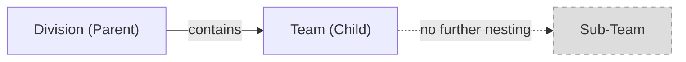
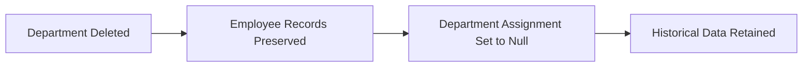
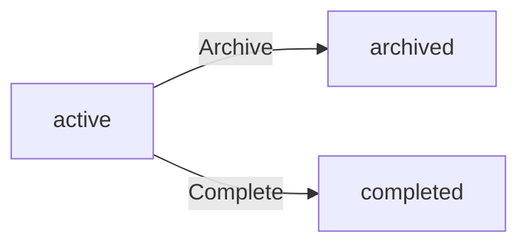
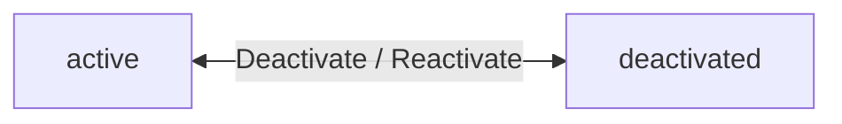
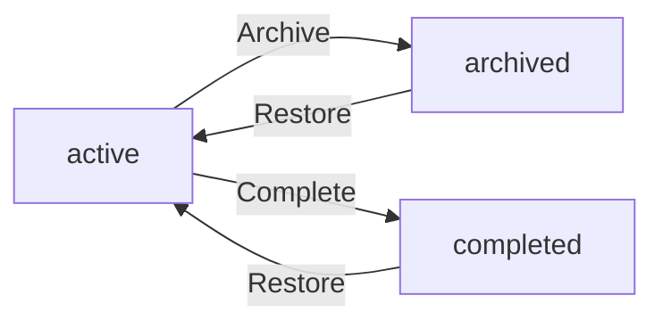
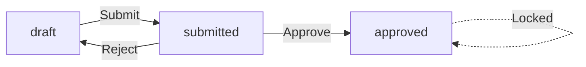
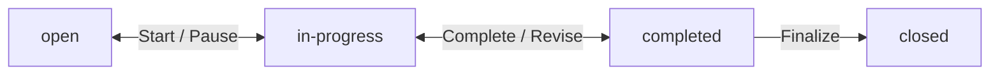

**hrmPlatform — Business concepts, relationships, and states from user perspective**

Business concepts, relationships, and states from user perspective

# Domain Concepts

Describe what each concept means in the business domain and its key attributes.

## Organization Concept

An organization represents an independent business entity within the multi-tenant platform. Each organization operates with complete data isolation, maintaining its own employees, projects, and operational records. The organization serves as the primary boundary for access control and data visibility. Key attributes include the organization name, description, and logo image for branding purposes. Financial settings include the currency designation such as USD, EUR, or KRW for monetary calculations. Operational settings include the timezone for date and time calculations and the fiscal start month for financial reporting periods. The organization owner holds full administrative authority over organization settings. Organizations can be deleted when all pending timesheets are resolved and no active employee contracts exist. Upon deletion, all associated employees, projects, tasks, timelogs, and timesheets are permanently removed. The organization concept enables multiple independent businesses to coexist on the same platform while maintaining strict data separation.

### Organization as Multi-Tenant Entity

The platform supports multiple organizations operating independently on the same system (multi-tenancy). Each organization represents an independent business entity that functions as a self-contained business entity container within the platform. Organizations maintain complete data isolation from one another, establishing a clear data isolation boundary that prevents cross-organizational data access. Employees in one organization cannot view or access data belonging to another organization. Users who belong to multiple organizations can only see data for their currently selected organization context. This organizational data separation ensures that each organization's employees, projects, tasks, timelogs, and timesheets remain strictly isolated. The platform multi-tenancy architecture enables multiple independent businesses to coexist while maintaining privacy and security through enforced data boundaries.

### Organization Attributes

Each organization has a name that identifies the business entity. A description provides additional context about the organization. A logo image serves branding purposes and visual identification. The currency designation (such as USD, EUR, or KRW) is used for all monetary calculations and financial reporting within the organization. The timezone setting determines how dates and times are calculated and displayed for all organization members. The fiscal start month defines the beginning of the financial year for reporting periods. These attributes collectively define the organization's identity and operational settings.

### Organization Ownership and Lifecycle

The organization owner holds full administrative authority over organization settings and can edit all organization attributes. Organization deletion is subject to specific conditions: all pending timesheets must be resolved (either approved or rejected), and there must be no active employee contracts. When an organization is deleted, permanent data removal occurs for all associated employees, projects, tasks, timelogs, and timesheets. The owner's user account remains intact but is no longer associated with any organization. This ensures clean removal of business data while preserving the individual's ability to create or join other organizations.

## User Concept

A user represents an individual account holder who can access the platform. Users authenticate with email and password credentials to gain platform access. A single user can belong to multiple organizations simultaneously, enabling cross-organizational access. When accessing the platform, users select which organization context to work within. All user actions are scoped to the currently selected organization. The user maintains a global profile that is shared across all organizations they belong to. Global profile attributes include display name, avatar image, and phone number. Users can edit their global profile information at any time. The user account persists independently of any single organization membership. When a user deletes their account, they must first transfer ownership or delete any organizations where they are the sole owner. Employee records in other organizations are marked as deactivated upon account deletion. The user concept separates individual identity from organizational membership.

### User Definition and Authentication

A user represents an individual account holder who can access the platform. Users authenticate with email and password credentials to gain platform access. The user concept separates individual identity from organizational membership, meaning a user's account exists independently of any single organization. This separation enables users to maintain their identity while belonging to multiple organizations simultaneously. Authentication is performed at the user account level, not at the organization level. Once authenticated, users can access any organization they belong to by selecting the appropriate organization context.

### Organization Membership and Context

A single user can belong to multiple organizations simultaneously, enabling cross-organizational access. When logging in, users select which organization context to work within. All user actions are scoped to the currently selected organization, ensuring data isolation between organizations. Users can switch organizations without logging out, allowing seamless transitions between different organizational contexts. The organization context determines which employees, projects, tasks, and timesheets the user can access. Users who belong to multiple organizations only see data for their currently selected organization, maintaining strict data isolation boundaries.

### User Profile

The user maintains a global profile that is shared across all organizations they belong to. Global profile attributes include display name, avatar image, and phone number. The display name is used to identify the user across the platform. The avatar image provides visual identification in the user interface. The phone number enables contact information to be associated with the user account. Users can edit their global profile information at any time. Profile changes are reflected immediately across all organizations the user belongs to, ensuring consistent identity presentation.

### Account Deletion

Users can delete their account at any time. If a user is the sole owner of an organization, they must transfer ownership or delete the organization first before deleting their account. This constraint prevents organizations from being left without an owner. When a user deletes their account, their employee records in other organizations are marked as deactivated. Deactivated employee records preserve historical data such as timelogs and timesheets while preventing further activity. The user account persists independently of any single organization membership, but account deletion removes the user from all organizations they belong to.

## Employee Concept

An employee represents a user's membership and role within a specific organization. Each employee record links a user account to an organization with a specific role assignment. Every employee is assigned exactly one role within the organization. The employee record includes department assignment as an optional organizational grouping. Position or title provides additional role context within the department. Employment type categorizes the working relationship as full-time, part-time, contractor, or intern. Employee status indicates whether the record is active or deactivated. Active employees can log time and submit timesheets within the organization. Deactivated employees retain their historical data including timelogs and timesheets. Deactivated employees cannot log new time or submit timesheets. Deactivated employees can be reactivated to restore full access. The employee concept enables users to have different roles and attributes across multiple organizations.

### Employee as Organizational Membership

An employee record represents a user's membership within a specific organization. Each employee record links a user account to one organization, creating an organizational membership record. A user can have multiple employee records across different organizations, enabling cross-organizational role variation where the same user may have different roles and attributes in each organization. The employee concept serves as the user to organization link that scopes all actions to the selected organization context. Each employee record is independent, allowing users to operate with different permissions and attributes depending on which organization they are currently working in.

### Role Assignment

Each employee is assigned exactly one role within the organization, enforcing single role assignment. The role determines the employee's permissions and access level within the organization. Built-in roles include Owner, Manager, and Employee, each with predefined permission sets. Organization owners can create custom roles and assign them to employees. Role assignment can be changed by users with employee management permission. The assigned role governs what operations the employee can perform, such as managing other employees, viewing projects, approving timesheets, or tracking time.

### Department and Position

An employee may be assigned to a department for organizational grouping, enabling department assignment. Department assignment is optional and can be updated by users with employee management permission. Deleting a department sets employees' department to null without removing the employee records. Each employee may have a position or title that provides additional role context within the department or organization. Position or title is optional and can be edited by users with employee management permission. Both department and position are descriptive attributes that help organize and identify employees within the organizational structure.

### Employment Type Classification

Each employee has an employment type classification that categorizes the working relationship. The employment type classification includes four allowed values: full-time employment, part-time employment, contractor employment, and intern employment. Full-time employment indicates a standard full-time working arrangement. Part-time employment indicates a reduced-hour working arrangement. Contractor employment indicates an independent contractor relationship. Intern employment indicates a temporary learning or training position. Employment type can be edited by users with employee management permission and is used for organizational reporting and categorization.

### Employee Status and Reactivation

Each employee has a status that indicates whether the record is active or deactivated. Active employee status means the employee can log time, submit timesheets, and access organization features based on their role. Deactivated employee status means the employee cannot log time or submit timesheets, and cannot access organization features. When an employee is deactivated, historical data preservation ensures all past timelogs, timesheets, and other records remain intact for reporting and audit purposes. Deactivated employees can be reactivated by users with employee management permission, restoring their active employee status and full access. Employee reactivation restores the ability to log time and submit timesheets without affecting historical data.

## Role Concept

A role represents a collection of permissions within an organization. Each organization maintains its own set of roles independent of other organizations. Three built-in roles exist in every organization and cannot be deleted. The Owner role provides full access to all features including role and member management. The Manager role enables employee management, project oversight, timesheet approval, and report viewing. The Employee role permits time tracking, timesheet submission, and viewing own data. Organization owners can create custom roles with specific permission sets. Each custom role has a name and a defined set of permissions. Available permissions cover organization management, employee management, project management, time management, and report viewing. Custom roles can be edited by organization owners. Custom roles can only be deleted when no employees are assigned to them. The role concept enables flexible access control tailored to organizational needs.

### Role Definition

A role represents a collection of permissions within an organization. Each organization maintains its own independent set of roles, separate from other organizations. Roles enable flexible access control tailored to organizational needs.

Each role has a name that identifies it within the organization. The role name is unique within its organization. A role contains a defined set of permissions that determine what actions employees assigned to that role can perform.

Roles fall into two categories: built-in roles that exist in every organization and cannot be deleted, and custom roles that organization owners can create to meet specific needs.

### Built-in Roles

Three built-in roles exist in every organization and cannot be deleted:

**Owner Role**: Provides full access to all features within the organization. Owners can manage organization settings, manage all employees, create and manage projects, approve timesheets, view all reports, and manage roles and members.

**Manager Role**: Enables employee management, project oversight, timesheet approval, and report viewing. Managers can add and edit employees, manage projects and tasks, approve or reject timesheets, and access organization reports.

**Employee Role**: Permits time tracking, timesheet submission, and viewing own data. Employees can log time, submit timesheets for approval, view their own timelogs and timesheets, and access their assigned tasks and projects.

These built-in roles provide a foundation for common organizational structures while ensuring essential capabilities are always available.

### Custom Roles

Organization owners can create custom roles with specific permission sets to meet unique organizational needs. Each custom role has a name and a defined set of permissions selected from the available permissions.

Custom roles can be edited by organization owners at any time. When a custom role is edited, the permission changes apply to all employees currently assigned to that role.

Custom roles provide flexibility beyond the three built-in roles, allowing organizations to create granular access control configurations that match their specific workflow and security requirements.

### Available Permissions

The following permissions can be assigned to custom roles:

**Organization Management**: Edit organization settings including name, description, logo, currency, timezone, and fiscal start month.

**Employee Management**: Add new employees, edit employee records, and deactivate employees.

**Employee Viewing**: View the employee list and employee details.

**Project Management**: Create, edit, and delete projects and tasks.

**Project Viewing**: View projects and tasks.

**Time Management**: Edit or delete any employee's timelogs.

**Time Approval**: Approve or reject submitted timesheets.

**Time Viewing All**: View all employees' timelogs and timesheets.

**Report Viewing**: View organization reports including time reports, project budget reports, and weekly summary reports.

Each permission grants specific capabilities within its domain. Custom roles can combine any subset of these permissions.

### Role Deletion Rules

Custom roles can be deleted by organization owners only when no employees are currently assigned to that role. This constraint prevents orphaned employee records and ensures every employee always has a valid role assignment.

If a custom role has one or more employees assigned to it, the role cannot be deleted. Organization owners must first reassign those employees to a different role before deleting the custom role.

Built-in roles cannot be deleted under any circumstances. The three built-in roles (Owner, Manager, Employee) are permanent fixtures in every organization.

When a custom role is deleted, the role and its permission configuration are permanently removed from the organization. Employee records that were assigned to the deleted role must have been reassigned prior to deletion.

## Department Concept

A department represents an organizational grouping within a company structure. Each organization can maintain multiple departments for categorizing employees. Departments have a name that identifies the functional area or team. A description provides additional context about the department's purpose or scope. Departments support one level of nesting through an optional parent department relationship. This enables basic hierarchical organization structures such as divisions containing teams. Employees can be assigned to departments as part of their employee record. When a department is deleted, employee department assignments are set to null rather than deleting employee records. All employees within the organization can view the list of departments. The department concept enables organizational structure without complex hierarchy management.

### Department Definition and Attributes

A department represents an organizational grouping within a company structure. Departments serve as functional area categorization mechanisms that enable team structure organization across the enterprise. Each department has a name that identifies the functional area or team, such as Engineering, Marketing, or Human Resources. A description provides additional context about the department's purpose or scope of work.

Departments exist within a single organization and contribute to the overall organizational structure. Each organization can maintain multiple departments to categorize employees by their functional area. The department concept enables basic hierarchy support without complex multi-level management.

**Key Attributes:**
- Name: identifies the department (required)
- Description: provides context about the department's purpose (optional)
- Parent Department: enables hierarchical relationships (optional)

### Department Hierarchy Structure

Departments support a parent department relationship that enables one-level nesting within the organizational hierarchy. This hierarchical organization structure allows departments to be grouped under a parent department, creating a two-tier structure.

The one-level nesting constraint means a department can have a parent department, but cannot have nested children beyond one level. For example, a division can contain teams, but those teams cannot contain sub-teams.

**Hierarchy Rules:**
- A department may optionally have one parent department
- A parent department can have multiple child departments
- Child departments cannot have their own children (one-level nesting only)
- The parent department relationship creates a basic hierarchy support structure
- Circular references are not permitted (a department cannot be its own ancestor)

### Employee Assignment and Department Lifecycle

Employees can be assigned to a department as part of their employee record. The employee department assignment links an employee to their functional area within the organization. An employee is assigned to at most one department at a time.

**Department Deletion Behavior:**
When a department is deleted, the system applies null assignment on deletion to preserve employee records. Employee department assignments are set to null rather than deleting employee records. This ensures employee data remains intact when organizational structures change.

**Department Visibility:**
All employees within the organization can view the list of departments. Department visibility is organization-scoped, meaning employees only see departments belonging to their current organization context.

**Lifecycle Summary:**
- Departments can be created, edited, and deleted by authorized users
- Department deletion does not cascade to employee records
- Employee department field becomes null when their department is deleted
- All organization employees maintain visibility of the department list

## Contract Concept

A contract represents an employment agreement record for an employee within an organization. Each employee can have multiple contracts throughout their tenure, creating a historical record. Only one contract can be active at any given time for an employee. The start date marks when the contract terms become effective and is required. The end date is optional, with null indicating an ongoing contract without a defined end. The pay rate specifies the compensation amount as a numeric value. The pay period defines the compensation frequency as hourly, daily, weekly, or monthly. Working hours per week specifies the expected weekly commitment. Optional notes provide additional contract terms or conditions. When a new contract is created, the previous active contract automatically ends. Past contracts become immutable historical records that cannot be edited. The contract concept enables tracking employment terms changes over time.

### Contract Definition

A contract represents an employment agreement record between an employee and the organization. Each contract captures the terms of employment at a specific point in time, enabling historical contract tracking throughout an employee's tenure.

An employee can have multiple contracts over time, creating a complete history of employment terms changes. However, only one contract can be active at any given time for an employee. This single active contract rule ensures clarity about which terms currently apply.

When viewing an employee's contracts, the system distinguishes between the active contract and past contracts. The active contract governs current employment terms, while past contracts serve as immutable historical records.

### Contract Terms

Each contract contains the following terms:

**Dates**
- The contract start date is required and marks when the contract terms become effective
- The contract end date is optional
- When the end date is not specified, this serves as an ongoing contract indicator, meaning the contract continues without a defined end date

**Compensation**
- The pay rate specifies the compensation amount as a numeric value
- The pay period defines how compensation is calculated and must be one of: hourly pay period, daily pay period, weekly pay period, or monthly pay period
- The combination of pay rate and pay period determines the employee's compensation structure

**Work Commitment**
- Working hours per week specifies the expected weekly time commitment (for example, 40 hours)
- This value is required for all contracts

**Additional Terms**
- Contract notes provide space for additional terms, conditions, or special arrangements
- Notes are optional and may be left empty

All contract terms are established when the contract is created and define the employment relationship for the contract's active period.

### Contract Lifecycle

Contracts follow a defined lifecycle that maintains accurate historical records:

**Automatic Contract Termination**
When a new contract is created for an employee, the previous active contract automatically ends. The system sets the end date of the previous contract to the day before the new contract's start date. This automatic contract termination ensures no overlap between contracts and maintains a clear timeline of employment terms.

**Immutable Historical Record**
Once a contract is no longer active (either ended automatically or by reaching its end date), it becomes an immutable historical record. Past contracts cannot be edited or modified. This immutability preserves the accuracy of historical employment terms and prevents retroactive changes to past agreements.

**Employment Terms Evolution**
The contract system enables tracking employment terms evolution over time. By maintaining multiple contracts per employee with complete historical data, the organization can review how an employee's compensation, working hours, and other terms have changed throughout their tenure. Each contract represents a snapshot of terms at a specific period, and the sequence of contracts shows the progression of the employment relationship.

## Project Concept

A project represents a container for related work and time tracking within an organization. Projects enable grouping of tasks and timelogs for organizational and reporting purposes. The project name is required and identifies the work initiative. An optional description provides context about project goals or scope. A color code is required for visual identification in user interfaces. Project status indicates the current state as active, archived, or completed. Budget hours optionally specify the total estimated hours for the project. Start date and end date optionally define the project timeline. Active projects can receive new timelogs from assigned employees. Archived or completed projects cannot receive new timelogs but preserve existing timelogs. Projects can only be deleted when no timelogs are associated with them. The project concept enables work organization and budget tracking.

### Project Definition and Attributes

A project represents a work container that groups related tasks and timelogs within an organization. Projects enable time tracking grouping for organizational and reporting purposes. Each project represents a work initiative grouping that consolidates associated work items.

The project name is required and identifies the work initiative. An optional description provides context about project goals or scope. A color code is required for visual identification and color code identification in user interfaces.

Budget hours optionally specify the total estimated hours for the project, enabling budget tracking enablement. The project start date and project end date optionally define the project timeline. When both dates are provided, they establish the project timeline boundaries.

Projects belong to an organization and can have multiple project members assigned to them. Projects can contain multiple tasks and receive multiple timelogs from assigned employees.

### Project States and Lifecycle

Project status indicates the current state of the project. The available states are active project status, archived project status, and completed project status.

Active projects can receive new timelogs from assigned employees. Archived or completed projects cannot receive new timelogs, enforcing timelog restriction on archived and completed projects. Existing timelogs on archived or completed projects are preserved, ensuring timelog preservation for historical records.

Projects transition from active to archived when work is suspended indefinitely. Projects transition from active to completed when work is finished. Once archived or completed, projects cannot return to active status.

### Project Deletion Rules

Projects can only be deleted when no timelogs are associated with them, enforcing project deletion constraints. This ensures that historical time tracking data is not lost through project deletion.

If a project has one or more timelogs, the deletion request is rejected. The project must first have all timelogs removed or the project must be archived or completed instead of deleted.

Projects without any timelogs can be deleted freely. When a project is deleted, all tasks associated with the project are also deleted, but employee records and other organizational data remain unaffected.

## ProjectMember Concept

A project member represents an employee's assignment to a specific project. This relationship links an employee to a project with a defined role. An employee can be assigned to multiple projects simultaneously. Each project membership specifies the employee and the project. The assigned role within the project is either member or project-lead. Project leads have additional capabilities to manage tasks within their assigned project. Regular members participate in the project without task management authority. Project membership enables access control for project visibility and task assignment. Employees can view which projects they are assigned to. The project member concept enables granular access control at the project level.

### Project Membership Definition

A project member represents an employee's assignment to a specific project within the organization. This membership creates a formal relationship between an employee and a project, establishing the employee's participation in project work.

Each project membership record links one employee to one project. The membership specifies the role the employee holds within that project. This role determines what actions the employee can perform within the project context.

The project member concept serves as a participation record, documenting which employees are involved in which projects. This record enables the organization to track project staffing and maintain clear boundaries around project access.

### Multiple Project Assignments

An employee can be assigned to multiple projects simultaneously. There is no limit to the number of projects an employee can join within the organization.

Each project assignment is independent. Being a member of one project does not automatically grant access to other projects. The employee maintains separate membership records for each project they participate in.

This flexibility allows employees to contribute to multiple initiatives while maintaining clear separation between project work and access rights.

### Project Role Types

Each project membership designates one of two role types for the employee within that project.

The **member** role indicates standard project participation. Members can view project details, view tasks within the project, and log time against the project. Members participate in project work without administrative authority over project structure.

The **project-lead** role indicates elevated responsibility within the project. Project leads retain all member capabilities and gain additional authority to manage tasks within their assigned project. An employee holds exactly one role type per project membership.

The role designation is specific to each project. An employee may be a project-lead in one project and a regular member in another project.

### Project Lead Task Management Authority

Project leads possess task management authority within their assigned project. This authority enables leads to create new tasks, edit existing tasks, and manage task assignments within the project.

Task management authority is scoped to the lead's own project. A project lead cannot manage tasks in projects where they hold only the member role.

This authority delegation allows project leads to organize work within their project without requiring organization-wide project management permissions. The task management capability is inherent to the project-lead role designation.

### Project Access and Visibility

Project membership enables granular project access control within the organization. Only employees who are assigned as project members can view the project and its associated tasks.

Project visibility is scoped to membership. Employees without a membership record for a project cannot see that project in their project list, cannot view its tasks, and cannot log time against it.

This membership-based access model provides fine-grained control over project visibility. Organizations can create projects visible only to specific team members while keeping them hidden from other employees.

The access control operates at the project level, ensuring that sensitive or team-specific projects remain visible only to relevant participants.

### Task Assignment Eligibility

Only employees who are project members can be assigned to tasks within that project. Task assignment eligibility is restricted to the project's membership roster.

When assigning a task to an employee, the system verifies that the employee holds a project membership for the parent project. Employees without membership cannot receive task assignments in that project.

This eligibility rule ensures that task assignments align with project staffing. It prevents scenarios where work is assigned to employees who lack access to the project context.

### Employee Project Overview

Employees can view the list of projects they are assigned to through their project memberships. This employee project list shows all projects where the employee holds a membership record.

For each project in the list, the employee can see their designated role (member or project-lead). The list provides a consolidated view of the employee's project participation across the organization.

This overview enables employees to quickly understand their project commitments and access the projects they are authorized to work on. The list reflects current active memberships and updates when project assignments change.

## Task Concept

A task represents a discrete work item within a project. Tasks enable breaking down projects into manageable units of work. The task title is required and identifies the work to be completed. An optional description provides additional details about the task requirements. Task status indicates progress as open, in-progress, completed, or closed. Priority levels categorize urgency as low, medium, high, or urgent. Estimated hours optionally specify the expected effort required. A due date optionally defines when the task should be completed. An assigned employee optionally designates who should complete the task, and must be a project member. A parent task optionally creates a subtask relationship with one level of nesting only. Tasks belong to a specific project and inherit project membership requirements. The task concept enables detailed work planning and tracking within projects.

### Task Definition and Purpose

A task represents a discrete work item within a project. Tasks enable project work breakdown by allowing projects to be divided into manageable units of work. Each task serves as a work planning unit that defines specific work to be completed. Tasks belong to a specific project and cannot exist independently. The task concept supports detailed work planning and tracking within projects by providing granular visibility into project progress.

### Task Attributes

Each task has a task title which is required and identifies the work to be completed. An optional task description provides additional details about the task requirements and expectations. Estimated hours optionally specify the expected effort required to complete the task. A task due date optionally defines when the task should be completed. These attributes collectively define the scope and expectations for each work item.

### Task Status

Task status indicates the current progress state of a task. The available status values are:

- Open task status: The task is ready to be worked on but no work has started
- In-progress task status: Work on the task has begun and is actively ongoing
- Completed task status: The work has been finished and marked as done
- Closed task status: The task is finalized and no further changes are expected

Status changes are recorded in the task history (defined in TaskHistory Concept).

### Task Priority

Priority levels categorize task urgency and importance. The available priority levels are:

- Low priority: The task has minimal urgency and can be addressed when capacity allows
- Medium priority: The task has standard urgency and should be addressed in normal workflow
- High priority: The task has significant urgency and should be addressed promptly
- Urgent priority: The task has critical urgency and requires immediate attention

Priority helps employees and project leads determine work ordering and resource allocation.

### Task Assignment

Task assignment optionally designates which employee should complete the task. An assigned employee must be a project member, meaning they must be assigned to the project that contains the task. This project member requirement ensures that only employees with access to the project can be assigned work within it. Tasks can exist without an assigned employee, allowing for unassigned work items in the project backlog.

### Subtask Structure

A parent task optionally creates a subtask relationship, allowing tasks to be organized hierarchically. Subtasks enable breaking down complex tasks into smaller components. The system enforces one-level nesting only, meaning a task can have subtasks, but those subtasks cannot have their own subtasks. This limitation maintains simplicity in task hierarchy while still supporting work decomposition.

## TaskHistory Concept

A task history entry represents a recorded status change for a task. Task history creates an audit trail of all status transitions throughout the task lifecycle. Each history entry captures the timestamp when the change occurred. The old status indicates what the task status was before the change. The new status indicates what the task status became after the change. The entry records which user made the status change. Task history entries are created automatically when task status changes. All status changes are recorded regardless of who made the change. The history provides transparency into task progression and accountability. Task history entries are immutable once created. The task history concept enables tracking task evolution and identifying bottlenecks.

### Task History Entry

A task history entry represents a recorded status change for a task. Each entry captures the timestamp when the status change occurred. The old status indicates what the task status was before the change. The new status indicates what the task status became after the change. The entry records which user made the status change. Task history entries contain the change timestamp, old status value, new status value, and the user who performed the change. Each task history entry is associated with exactly one task. The task history entry structure enables complete tracking of all status transitions throughout the task lifecycle.

### Task History Audit Trail

Task history creates an audit trail of all status transitions throughout the task lifecycle. All status changes are recorded automatically when task status changes. Every status transition is logged regardless of who made the change. Task history entries are created automatically upon each status change. The system maintains a complete status history for each task. Once created, task history entries are immutable and cannot be modified or deleted. The immutable history entry ensures the audit trail remains accurate and trustworthy. The complete status history provides a full record of task evolution from creation to completion.

### Task Progression Tracking

The task history provides transparency into task progression and enables accountability tracking. Users can view the complete sequence of status changes to understand how a task evolved. The recorded history supports accountability tracking by identifying who made each status change. The task lifecycle tracking enables users to see the full journey of a task through all its states. Organizations can use task history data for bottleneck identification by analyzing where tasks spend the most time or frequently revert to previous states. The task progression transparency helps teams understand workflow patterns and improve task management processes.

## Timelog Concept

A timelog represents a single time entry recording work performed. Timelogs capture the date when work was performed. Duration in minutes specifies how long the work took. The project is required and must be a project the employee is assigned to. An optional task can be specified and must belong to the selected project. An optional description explains what work was done. A billable flag indicates whether the time is billable to a client, defaulting to true. Timelogs are owned by the employee who created them. Timelogs can be part of timesheets for approval workflows. The timelog concept enables granular time tracking for reporting and billing purposes.

### Time Entry Record

A timelog is a time entry record that captures a single instance of work performed by an employee. Each timelog represents granular time tracking at the individual work session level. Timelogs serve as the fundamental unit of time measurement in the system, enabling detailed tracking of how employees spend their working hours. Multiple timelogs can be created by an employee for different projects or tasks throughout a work day. The time entry record forms the basis for all time-related reporting and analysis within the organization.

### Work Date and Duration

Each timelog captures the date when the work was performed. The work date is a required field and represents the calendar day on which the time was logged. Duration in minutes specifies the length of time spent on the work activity. The duration is recorded as a numeric value representing total minutes worked. Duration can be entered manually or calculated automatically when using the timer feature. The combination of work date and duration in minutes provides a complete temporal record of when and how long work was performed.

### Project and Task Association

Every timelog must be associated with a project. The project assignment requirement ensures that all tracked time is linked to specific work initiatives. The employee must be assigned to the project as a project member before creating a timelog for it. This project membership validation prevents employees from logging time to projects they are not authorized to work on. An optional task can be associated with the timelog to provide more granular categorization. When specified, the task must belong to the selected project. Task association enables detailed breakdown of time spent on specific work items within a project.

### Work Description

A timelog can include an optional work description field. The description provides context about what work was performed during the logged time. This free-text field allows employees to document specific activities, deliverables, or notes about the work session. The work description supports transparency and helps reviewers understand the nature of the logged time. While optional, descriptions are recommended for clarity in timesheet reviews and client billing scenarios.

### Billable Time Classification

Each timelog includes a billable time flag that indicates whether the logged time is billable to a client. The billable flag defaults to true, meaning time is considered billable unless explicitly marked otherwise. Non-billable time represents work that is not charged to clients, such as internal meetings, training, or administrative tasks. The billable time classification serves as the billing basis for client invoices and revenue tracking. This classification also functions as a reporting data source, enabling organizations to analyze the ratio of billable versus non-billable hours across employees, projects, and time periods.

### Employee Ownership

Each timelog is owned by the employee who created it. Employee ownership establishes a clear relationship between the time entry and the individual who performed the work. The owning employee is the person whose time is being tracked and recorded. This ownership model ensures accountability and enables employees to view and manage their own time entries. Employee ownership also determines access rights for editing and deleting timelogs, subject to timesheet approval status constraints.

### Timesheet Grouping

Timelogs can be included in timesheets for approval workflows. Timesheet inclusion groups individual timelogs into weekly collections that are submitted for review and approval. A timelog belongs to a specific week based on its work date. When an employee creates a draft timesheet for a week, all timelogs for that employee within that week are automatically included. Once a timesheet is approved, the included timelogs are locked and cannot be modified. Timesheet grouping transforms individual time entry records into formal, auditable work records that support payroll and client billing processes.

## Timesheet Concept

A timesheet represents a weekly collection of timelogs submitted for approval. Timesheets group individual timelogs into a single approval unit. The employee owner is the person whose work is recorded. Week start date marks the Monday beginning the timesheet period. Week end date marks the Sunday ending the timesheet period. Status indicates the approval state as draft, submitted, approved, or rejected. Total hours are calculated from all included timelogs. Submitted at records when the timesheet was sent for approval. Reviewed at records when approval or rejection occurred. Reviewed by identifies who made the approval decision. Rejection reason is required text when rejecting a timesheet. Approved timesheets lock all included timelogs from editing. The timesheet concept enables structured time approval workflows.

### Timesheet as Weekly Collection

A timesheet is a weekly collection of timelogs grouped together as a single approval unit. The timesheet serves as the primary mechanism for organizing individual time entries into structured batches for review and approval. Each timesheet has one employee owner, who is the person whose work is recorded in the timelogs contained within the timesheet. The employee owner relationship establishes accountability and ownership for the submitted time records. The approval unit grouping enables managers to review and approve a complete week's work in a single action rather than processing individual timelogs separately.

### Timesheet Week Period

Each timesheet covers a fixed weekly period defined by a week start date and a week end date. The week start date always marks the Monday beginning the timesheet period. The week end date always marks the Sunday ending the timesheet period. This Monday to Sunday structure ensures consistent weekly boundaries across the organization. The week period is determined at timesheet creation and cannot be changed. Each employee can have only one timesheet per week period, preventing duplicate submissions for the same time range.

### Timesheet Status States

A timesheet has a status that indicates its current state in the approval workflow. The draft timesheet status indicates the timesheet is being prepared and has not been sent for approval. The submitted timesheet status indicates the timesheet has been sent for approval and is awaiting review. The approved timesheet status indicates the timesheet has been reviewed and accepted. The rejected timesheet status indicates the timesheet has been reviewed and sent back for correction. Status transitions follow a structured approval workflow from draft to submitted, then to either approved or rejected.

### Timesheet Metadata Attributes

A timesheet contains several metadata attributes that track its lifecycle. Total hours are calculated automatically from all timelogs included in the timesheet. The submission timestamp records when the timesheet was sent for approval. The review timestamp records when the approval or rejection decision was made. Reviewer identification indicates which user with approval permissions made the decision. Rejection reason is required text that must be provided when rejecting a timesheet, explaining why the timesheet was not approved. These metadata fields provide audit trail information for the timesheet approval process.

### Timesheet Approval Locking

When a timesheet reaches the approved timesheet status, all timelogs included in that timesheet are locked from editing. Timelog locking on approval prevents any modifications to time records that have been formally approved. This ensures the integrity of approved time data for payroll and reporting purposes. Locked timelogs cannot be edited or deleted by any user, including the employee owner. The structured approval workflow ensures that timesheets move through defined states with appropriate controls at each stage. Only timesheets in draft or rejected status allow modifications to their included timelogs.

## Timer Concept

A timer represents an active real-time time tracking session. Each employee can have at most one active timer running at any time. The start timestamp records when the timer began. The project is required when starting a timer. An optional task can be specified for more granular tracking. An optional description explains what work is being tracked. The active status indicates whether the timer is currently running. When stopped, the timer creates a timelog with calculated duration. Duration is rounded to the nearest minute upon timer completion. Timers can be discarded without creating a timelog. Running timers can have their description and project or task edited. The timer concept enables convenient real-time time capture.

### Timer Definition

A timer represents a real-time tracking session that enables convenient time capture for employees. The timer concept allows employees to track work as it happens rather than manually entering time after the fact. Each timer is associated with exactly one employee. The timer serves as a temporary working record that converts to a timelog when stopped. This real-time tracking session provides an intuitive way for employees to capture work duration accurately without needing to remember or estimate time spent.

### Timer Attributes

A timer has the following attributes that define its state and context:

The start timestamp records when the timer began running. This value is set when the employee initiates the timer and cannot be modified.

Project selection is required when starting a timer. The project must be one the employee is assigned to. This ensures time is tracked against valid work containers.

Task selection is optional when starting a timer. If specified, the task must belong to the selected project. This enables granular tracking within project work.

The timer description is optional and explains what work is being tracked. Employees can provide context about the specific activity being performed during the tracking session.

The active status indicator shows whether the timer is currently running. A timer is active from the moment it is started until it is explicitly stopped or discarded. This status determines whether the timer is accumulating time.

### Timer Lifecycle

The timer follows specific lifecycle rules that govern its behavior:

Each employee can have at most one active timer at any time. This single active timer limit prevents conflicting time tracking sessions. An employee must stop or discard their current timer before starting a new one.

When an employee performs a timer stop action, the system calculates the duration from the start timestamp to the stop time. This duration calculation determines the time entry value. The calculated duration undergoes minute rounding to the nearest minute before creating the timelog.

Employees have a timer discard option that stops the timer without creating a timelog. This allows employees to cancel accidental or test timer sessions without leaving time entry records.

Running timer editing is permitted while a timer is active. Employees can modify the timer description to update what work is being tracked. Employees can also change the project or task assignment through project task editing. These modifications update the timer's context without interrupting the tracking session. When the timer is eventually stopped, the timelog reflects the most recent attribute values.

## ActivityLog Concept

An activity log entry represents a recorded significant action within the organization. Activity logs create an audit trail of important organizational events. Each entry includes a timestamp of when the action occurred. The user who performed the action is recorded. The action type categorizes what kind of event occurred. The target entity identifies what was affected by the action. Details provide additional context about the action. Logged actions include employee invitations, deactivations, and reactivations. Contract creation and editing are recorded. Project creation, archiving, completion, and deletion are logged. Task status changes are tracked. Timesheet submissions, approvals, and rejections are recorded. Role assignments and changes are logged. The activity log concept enables organizational transparency and compliance.

### Activity Log Entry Structure

An activity log entry represents a recorded significant action within the organization. Each entry captures the timestamp when the action occurred. The user who performed the action is recorded as the action performer. The action type categorizes what kind of event occurred, such as employee invitation or project creation. The target entity identifies what was affected by the action, such as a specific employee or project. Action details provide additional context about what changed or what the action entailed. The activity log entry structure ensures complete traceability of organizational events.

### Employee Action Logging

Employee invitation actions are logged when a new employee is invited to join the organization. Employee deactivation actions are logged when an employee's status is changed to deactivated. Employee reactivation actions are logged when a deactivated employee is restored to active status. Each logged employee action includes the employee affected, the user who performed the action, and the timestamp of when the action occurred. This logging ensures accountability for employee lifecycle changes.

### Contract Action Logging

Contract creation actions are logged when a new employment contract is created for an employee. Contract editing actions are logged when the current active contract is modified. Each contract action log entry records which employee's contract was affected, what changes were made, who made the changes, and when the changes occurred. Past contracts cannot be edited, so only active contract modifications are logged. This logging maintains a clear record of employment agreement changes.

### Project Lifecycle Logging

Project creation actions are logged when a new project is established. Project archiving actions are logged when a project status changes to archived. Project completion actions are logged when a project status changes to completed. Project deletion actions are logged when a project is permanently removed. Each project lifecycle event records the project affected, the user who performed the action, the timestamp, and relevant details such as the new status. This logging provides visibility into project portfolio changes.

### Task Status Change Logging

Task status change actions are logged whenever a task transitions between statuses such as open, in-progress, completed, or closed. Each task status change log entry records the task affected, the old status, the new status, the user who made the change, and the timestamp of the change. Task status change logging is separate from the task history recorded on the task itself, providing organization-wide visibility into task workflow patterns.

### Timesheet Workflow Logging

Timesheet submission actions are logged when an employee submits a timesheet for approval. Timesheet approval actions are logged when a timesheet is approved by a user with approval permissions. Timesheet rejection actions are logged when a timesheet is rejected, including the rejection reason provided. Each timesheet workflow log entry records the timesheet affected, the employee owner, the user who performed the action, the timestamp, and relevant details. This logging ensures transparency in the time approval process.

### Role Assignment Logging

Role assignment actions are logged when an employee is assigned a role within the organization. Role change actions are logged when an employee's role is modified from one role to another. Each role assignment log entry records the employee affected, the role assigned or changed to, the user who performed the assignment, and the timestamp. This logging maintains accountability for permission and access changes within the organization.

### Audit Trail and Compliance

The activity log creates an organizational audit trail of all significant actions. This audit trail enables organizational transparency by making important events visible to users with appropriate permissions. The activity log supports compliance tracking by maintaining a permanent record of who did what and when. Users with organization management permissions can view the full activity log to review organizational events. The activity log is paginated and can be filtered by action type, user, and date range to facilitate efficient review and auditing.

## Invitation Concept

An invitation represents a pending request to join an organization. Invitations enable adding employees who do not yet have platform accounts. The email address identifies the intended recipient of the invitation. The status indicates the current state of the invitation. If the invited email already has an account, the user is directly added to the organization. If the invited email has no account, a pending invitation is created. When the user signs up with the invited email, they are automatically added to the pending organizations. Invitations bridge the gap between invitation and account creation. The invitation concept enables seamless onboarding for new employees.

### Invitation Definition and Purpose

An invitation represents a pending request for a user to join an organization. The invitation mechanism enables organizations to add employees who do not yet have platform accounts. Invitations are email-based, using the recipient's email address as the identifier. The invitation serves as a bridge between invitation and membership, enabling seamless employee onboarding. When an organization invites a person by email, the system creates an invitation record that tracks the invitation state until the person becomes a member of the organization.

### Invitation Status and Account Handling

Each invitation has a status that indicates its current state. The invited email address identifies the intended recipient of the invitation. If the invited email already has an account on the platform, the user is directly added to the organization without creating a pending invitation. If the invited email has no account, a pending invitation is created. The pending invitation waits for the user to sign up with that email address. This distinction ensures that existing users are immediately added while new users receive a pending invitation that activates upon signup.

### Pending Invitation and Automatic Enrollment

A pending invitation is created when an email without an existing account is invited to an organization. When the user signs up with the invited email address, they are automatically added to the pending organizations. This signup-triggered enrollment ensures that new users gain immediate access to the organizations that invited them. The automatic organization addition eliminates manual steps for both the inviter and the invited user. Once the user completes signup, all pending invitations for that email are resolved, and the user becomes an employee member of those organizations.

# Domain Relationships

Describe how concepts relate to each other from a business perspective.

## Conceptual Relationships

Describe how concepts relate to each other in business terms.

### Organization Relationships

An organization has many employees who work within it. Each employee belongs to exactly one organization.

An organization has many departments for grouping employees by function. Each department belongs to exactly one organization.

An organization has many projects for tracking work. Each project belongs to exactly one organization.

An organization has many custom roles in addition to the three built-in roles. Each custom role belongs to exactly one organization.

An organization has many invitations for pending employee join requests. Each invitation belongs to exactly one organization.

All data is strictly isolated per organization. Employees in one organization cannot access data from another organization.

### User-Employee Association

A user account represents an individual person in the system. A user can belong to multiple organizations simultaneously.

For each organization a user belongs to, there is exactly one employee record linking the user to that organization. The employee record serves as the association between the user and the organization.

A user has many employee records across different organizations. Each employee record belongs to exactly one user.

When a user logs in, they select which organization context to work in. All actions are scoped to the selected organization through the employee record for that organization.

The user's profile (display name, avatar, phone number) is shared across all organizations. The employee-specific attributes (role, department, position, employment type, status) are unique to each organization.

### Employee Associations

An employee has many contracts representing historical employment agreements. Each contract belongs to exactly one employee. Only one contract can be active at a time for an employee.

An employee has many project memberships indicating which projects they are assigned to. Each project membership belongs to exactly one employee and exactly one project.

An employee has many timelogs recording time entries. Each timelog belongs to exactly one employee.

An employee has many timesheets for weekly approval. Each timesheet belongs to exactly one employee.

An employee has at most one active timer at any time. Each timer belongs to exactly one employee.

An employee is assigned exactly one role within the organization. The role determines what permissions the employee has.

### Project Relationships

A project has many project members who are assigned to work on it. Each project member belongs to exactly one project.

A project has many tasks representing discrete work items. Each task belongs to exactly one project.

A project has many timelogs logged against it. Each timelog belongs to exactly one project.

Employees can only log time to projects they are assigned to as project members. This association ensures employees cannot track time on projects they are not part of.

Tasks can only be assigned to employees who are project members of the parent project.

### Task Relationships

A task has many task history entries recording status changes. Each task history entry belongs to exactly one task.

A task can have one parent task for creating subtasks. Subtasks belong to exactly one parent task. Only one level of nesting is supported.

A task can be assigned to one employee. The assigned employee must be a project member of the task's parent project.

A task belongs to exactly one project. The task cannot exist independently of its parent project.

### Timesheet-Timelog Ownership

A timesheet owns many timelogs for a specific week. Each timelog can belong to at most one timesheet.

When a draft timesheet is created, it automatically includes all timelogs for that employee in that week. Timelogs can be added to or removed from a draft timesheet.

When a timesheet is approved, all included timelogs are locked and cannot be edited or deleted. The ownership relationship enforces this lock.

When a timesheet is rejected, it returns to draft status and the timelogs become editable again by the employee.

A timesheet is reviewed by one employee (the reviewer). The reviewer must have timesheet approval permission.

### Role-Employee Assignment

A role has many employees assigned to it within an organization. Each employee is assigned exactly one role.

The assignment relationship determines what permissions an employee has. When an employee's role is changed, their permissions change accordingly.

Built-in roles (owner, manager, employee) cannot be deleted. Custom roles can be deleted only if no employees are assigned to them.

Role assignment can be changed by employees with employee management permission. The relationship ensures each employee always has exactly one role at any time.

## Lifecycle and Retention

Describe concept lifecycle states and transitions only. Detailed retention/recovery policies belong in 05-non-functional. Operation details belong in 03-functional-requirements.

### Employee Lifecycle

Employees exist in two states: active and deactivated.

An active employee can log time, submit timesheets, and be assigned to projects and tasks.

A deactivated employee cannot log time or submit timesheets. Deactivated employees remain assigned to their existing projects but cannot be assigned to new tasks. Historical data including timelogs, timesheets, and contracts for deactivated employees is preserved.

Deactivated employees can be reactivated to active status, restoring their ability to log time and submit timesheets.

When a user deletes their account, their employee records in organizations where they are not the sole owner are marked as deactivated rather than deleted.

### Contract Lifecycle

Each employee can have multiple contracts over time, but only one contract can be active at any time.

A contract becomes active when created. If a previous contract was active, it automatically becomes inactive with its end date set to the day before the new contract starts.

Active contracts can be edited by users with employee management permission.

Inactive contracts are immutable historical records and cannot be edited.

A contract remains active until either:
- A new contract is created for the same employee
- An end date is set and reached
- The employee is deactivated

The system preserves all historical contracts for each employee, including those from deactivated employees.

### Project Lifecycle and Archival

Projects exist in three states: active, archived, and completed.

Active projects can receive new timelogs and have tasks created or modified.

Archived projects cannot receive new timelogs. Existing timelogs and tasks are preserved and remain viewable.

Completed projects cannot receive new timelogs. Existing timelogs and tasks are preserved and remain viewable.

Projects can only be deleted if they have no timelogs associated with them. Deleting a project permanently removes the project, its tasks, task histories, and project memberships.

When an organization is deleted, all projects within that organization are permanently deleted along with their associated timelogs, tasks, and memberships.

### Timesheet Lifecycle

Timesheets exist in four states: draft, submitted, approved, and rejected.

A draft timesheet can have timelogs added or removed. The employee can modify the timesheet freely.

A submitted timesheet cannot be modified by the employee. It awaits approval or rejection.

An approved timesheet locks all included timelogs. Locked timelogs cannot be edited or deleted by anyone. The timesheet itself cannot be modified.

A rejected timesheet returns to draft status. The employee can modify the timelogs and resubmit the timesheet. A rejection reason is recorded.

State transitions:
- Draft can transition to submitted (by employee)
- Submitted can transition to approved (by approver)
- Submitted can transition to rejected (by approver)
- Rejected can transition to draft (automatic upon rejection)
- Draft can transition to draft (when rejected timesheet is modified)

A timesheet cannot be submitted if it contains no timelogs. A timesheet cannot be submitted if another timesheet for the same week is already submitted or approved.

### Task Lifecycle

Tasks exist in four states: open, in-progress, completed, and closed.

Task status changes are recorded in the task history. Each history entry captures the timestamp, the old status, the new status, and who made the change.

Tasks can transition between any states. There are no restrictions on status transitions.

When a project is archived or completed, its tasks cannot be modified but remain viewable with their current status.

When a project is deleted, all its tasks and task histories are permanently deleted.

### Timelog Lifecycle

Timelogs can be edited or deleted by their owner under the following conditions:

A timelog can be edited or deleted by its owner only if it is not part of a submitted or approved timesheet.

A timelog that is part of an approved timesheet is locked and cannot be edited or deleted by anyone except users with time management permission.

A timelog that is part of a submitted timesheet cannot be edited or deleted by its owner until the timesheet is rejected and returns to draft status.

When a timer is discarded, no timelog is created. When a timer is stopped, a timelog is created with the calculated duration.

Timelogs are permanently deleted when:
- The owning employee's organization is deleted
- The associated project is deleted (and the timelog has no timesheet)
- The timesheet containing the timelog is deleted (if timesheet deletion is permitted)

### Organization Deletion Policy

An organization can be deleted by its owner only when:
- All pending timesheets are resolved (approved or rejected)
- There are no active employee contracts

When an organization is deleted, the following data is permanently deleted:
- All employee records
- All departments
- All projects, tasks, and task histories
- All timelogs and timesheets
- All custom roles
- All invitations
- All activity log entries for the organization

The organization owner's user account remains but is no longer associated with any organization. If the user belongs to other organizations, those memberships are unaffected.

### User Account Deletion and Employee Record Retention

A user can delete their account under the following conditions:
- If they are the sole owner of an organization, they must transfer ownership or delete the organization first
- If they belong to multiple organizations, their employee records in other organizations are marked as deactivated rather than deleted

When a user account is deleted:
- The user's global profile (display name, avatar, phone number) is permanently deleted
- Employee records in organizations where the user was a member are deactivated, preserving historical timelogs, timesheets, and contracts
- The user can no longer log in or access any organization

Deactivated employee records preserve all historical data including:
- Past timelogs and timesheets
- Contract history
- Project memberships
- Task assignments

This ensures organizational records remain complete even after a user leaves.

# Business Categories and State Flows

Business category classifications and state flow definitions.

## Business Category Definitions

Define all business category classifications with their allowed values and descriptions.

### Employment Type Classification

The system classifies employees by their employment type. This classification determines the nature of the employment relationship.

The allowed employment types are:
- Full-time: Standard employment with regular working hours
- Part-time: Employment with reduced working hours
- Contractor: External worker engaged for specific work or period
- Intern: Temporary position for learning and training purposes

Each employee record must have exactly one employment type assigned. The employment type can be changed by users with employee management permission.

### Employee Status Classification

The system tracks employee status to indicate whether an employee is currently active in the organization.

The allowed status values are:
- Active: Employee is currently working and can log time and submit timesheets
- Deactivated: Employee is no longer active but historical data is preserved

Deactivated employees cannot log time or submit timesheets. Deactivated employees can be reactivated to active status. When a user deletes their account, their employee records in other organizations are marked as deactivated.

### Project Status Classification

Projects are classified by their current status to indicate their lifecycle stage.

The allowed project status values are:
- Active: Project is ongoing and can receive new timelogs
- Archived: Project is no longer active but preserved for reference; cannot receive new timelogs
- Completed: Project work is finished; cannot receive new timelogs

Existing timelogs on archived or completed projects are preserved. Projects can be transitioned from active to archived or completed status by users with project management permission.

### Task Status Classification

Tasks are classified by their current status to track work progress.

The allowed task status values are:
- Open: Task is ready to be worked on
- In-progress: Task is currently being worked on
- Completed: Task work is finished
- Closed: Task is finalized and no further action is needed

Task status changes are recorded in the task history, capturing the timestamp, old status, new status, and who made the change. Tasks can be filtered by status.

### Task Priority Classification

Tasks are assigned a priority level to indicate their importance and urgency.

The allowed priority values are:
- Low: Task has minimal urgency
- Medium: Task has standard priority
- High: Task is important and should be addressed soon
- Urgent: Task requires immediate attention

Tasks can be sorted by priority. Tasks can be filtered by priority level.

### Timesheet Status Classification

Timesheets are classified by their approval status to track the review workflow.

The allowed timesheet status values are:
- Draft: Timesheet is being prepared and can be modified
- Submitted: Timesheet is pending approval
- Approved: Timesheet has been approved; included timelogs are locked
- Rejected: Timesheet was rejected with a reason; returns to draft status

A rejection reason is required when rejecting a timesheet. Rejected timesheets can be modified and resubmitted by the employee. Approved timesheets lock all included timelogs, preventing edits or deletion.

### Pay Period Classification

Employee contracts specify the pay period to define how compensation is calculated.

The allowed pay period values are:
- Hourly: Compensation is based on hours worked
- Daily: Compensation is based on days worked
- Weekly: Compensation is based on weeks worked
- Monthly: Compensation is based on months worked

Each contract must have exactly one pay period assigned. The pay rate is a numeric value that corresponds to the selected pay period.

### Project Membership Role Classification

Employees assigned to projects are given a membership role to define their level of responsibility within the project.

The allowed project membership roles are:
- Member: Standard project participant
- Project-lead: Has authority to manage tasks within the project

Project leads can create and edit tasks within their project. An employee can be assigned to multiple projects with potentially different roles in each.

### Permission Classification

The system defines a set of available permissions that can be assigned to roles. Each permission grants access to specific functionality.

The available permissions are:
- Organization manage: Edit organization settings
- Employee manage: Add, edit, and deactivate employees
- Employee view: View employee list and details
- Project manage: Create, edit, and delete projects and tasks
- Project view: View projects and tasks
- Time manage: Edit or delete any employee's timelogs
- Time approve: Approve or reject timesheets
- Time view all: View all employees' timelogs and timesheets
- Report view: View organization reports

Custom roles are created by selecting a set of permissions from this list. Built-in roles (Owner, Manager, Employee) have predefined permission sets.

## State Transitions

Define valid state transition paths for stateful concepts.

### Employee Status Flow

Employee status transitions between active and deactivated states.

An employee starts as active when invited or added to the organization.

Users with employee management permission can deactivate an employee.

Deactivated employees cannot log time or submit timesheets.

Deactivated employees' historical data remains preserved.

Users with employee management permission can reactivate a deactivated employee.

Reactivated employees regain the ability to log time and submit timesheets.

Reactivation restores the employee's previous role and department assignments.

### Project Status Transitions

Projects transition through active, archived, and completed states.

A project starts as active when created.

Users with project management permission can archive an active project.

Users with project management permission can mark an active project as completed.

Archived projects cannot receive new timelogs.

Completed projects cannot receive new timelogs.

Existing timelogs on archived or completed projects are preserved.

Archived projects can be restored to active status by users with project management permission.

Completed projects can be restored to active status by users with project management permission.

Project deletion is only allowed if the project has no timelogs associated with it.

### Timesheet Approval Workflow

Timesheets follow a four-state workflow: draft, submitted, approved, rejected.

An employee creates a draft timesheet for a specific week.

Creating a draft automatically includes all timelogs for that employee in that week.

Employees can add or remove timelogs from a draft timesheet.

Employees can submit a draft timesheet for approval.

A timesheet cannot be submitted if it has no timelogs.

A timesheet cannot be submitted if another timesheet for the same week is already submitted or approved.

Users with time approval permission can approve submitted timesheets.

Approved timesheets lock all included timelogs from editing or deletion.

Users with time approval permission can reject submitted timesheets with a reason.

Rejected timesheets return to draft status.

Employees can modify and resubmit rejected timesheets.

Once approved, timesheets cannot return to draft or submitted status.

### Task Status Change Rules

Tasks transition through open, in-progress, completed, and closed states.

A task starts as open when created.

Project leads or users with project management permission can change task status.

Task status changes are recorded in task history.

Each task history entry records the timestamp, old status, new status, and who made the change.

Tasks can move from open to in-progress when work begins.

Tasks can move from in-progress to completed when work finishes.

Tasks can move from completed to closed when finalized.

Tasks can return from in-progress to open if work is paused.

Tasks can return from completed to in-progress if revisions are needed.

Closed tasks cannot be reopened without project management permission.