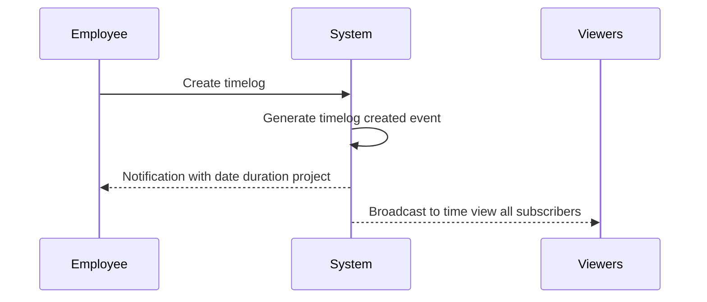
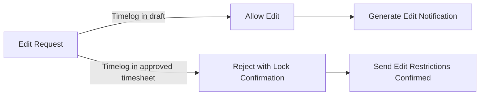
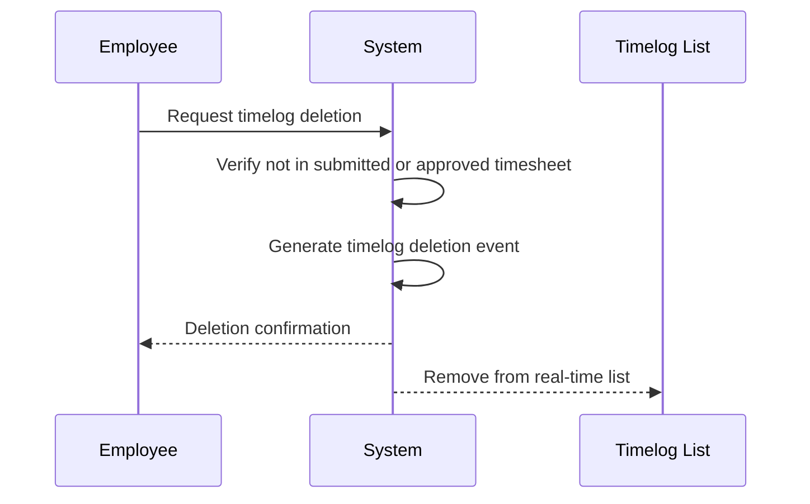
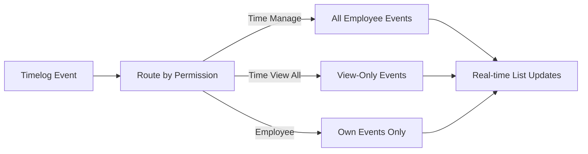

**hrmPlatform — What operations users can perform, use cases, business workflows**

What operations users can perform, use cases, business workflows

# Core Business Operations

What the system must do for each business concept.

## Organization Operations

Users create an organization during initial sign-up, and the platform supports multiple organizations operating independently with their own employees, projects, and data. Each organization has a name, description, logo image, currency, timezone, and fiscal start month. Organization owners can edit organization settings at any time. Organization owners can delete their organization only if all pending timesheets are resolved and there are no active employee contracts. When an organization is deleted, all employees, projects, tasks, timelogs, and timesheets are permanently deleted. The owner's account remains but is no longer associated with any organization. All data is strictly isolated per organization, and users belonging to multiple organizations only see data for their currently selected organization.

### Organization Creation During Sign-Up

Users create an organization during initial sign-up to the platform. The organization is created with a name and description provided by the user. The creating user becomes the owner of the organization with full access to all features. The platform supports multiple organizations, allowing users to create additional organizations after initial sign-up. Each organization operates independently with its own employees, projects, and data.

### Multi-Tenancy and Data Isolation

All data is strictly isolated per organization. Employees in one organization cannot see data from another organization. Users who belong to multiple organizations only see data for their currently selected organization context. Every action performed by a user is scoped to the selected organization. The system enforces organization context on all data access and operations. Independent organization operations ensure that changes in one organization do not affect other organizations.

### Organization Settings Management

Organization owners can edit organization settings at any time. Organization settings include: name, description, logo image, currency, timezone, and fiscal start month. Currency configuration allows selection from supported currencies such as USD, EUR, KRW. Timezone configuration sets the organization's default timezone for date and time displays. Fiscal start month setting defines which month the organization's fiscal year begins. Changes to organization settings are recorded in the activity log.

### Organization Deletion

Organization owners can delete their organization subject to prerequisites. All pending timesheets must be resolved before deletion is allowed. Pending timesheets are resolved when they are either approved or rejected. There must be no active employee contracts before deletion is allowed. When an organization is deleted, all employees, projects, tasks, timelogs, and timesheets are permanently deleted. The cascading data deletion removes all organization-scoped data. The owner's account remains but is no longer associated with any organization. If the owner is the sole owner of the organization, they must transfer ownership or delete the organization before deleting their account.

### Organization Context Switching

When logging in, users select which organization to work in. Users can switch organizations without logging out. Organization context switching changes the scope of all subsequent actions to the newly selected organization. The user interface displays the current organization context to the user. Users belonging to multiple organizations can access each organization's data by switching context. All operations are performed within the selected organization context until the user switches to a different organization.

## User Operations

Users sign up with email and password, and log in using the same credentials. Users can change their password at any time. A user can belong to multiple organizations simultaneously. When logging in, users select which organization to work in, and all subsequent actions are scoped to the selected organization. Users can switch organizations without logging out. Users can delete their account, but if they are the sole owner of an organization, they must transfer ownership or delete the organization first. When a user deletes their account, their employee records in other organizations are marked as deactivated. Each user has a global profile with display name, avatar image, and phone number that is shared across all organizations.

### User Registration and Authentication

Users can sign up for an account by providing an email address and creating a password. The email address must be unique across the platform. Users can log in to their account using their registered email address and password. Users can change their password at any time after logging in. When changing a password, the user must provide their current password for verification. The system validates the new password meets security requirements before accepting the change. After a successful password change, all active sessions remain valid. Users receive confirmation when their password is successfully changed.

### Multi-Organization Access

A single user account can belong to multiple organizations simultaneously. When logging in, users must select which organization to work in as their current context. All actions performed by the user are scoped to the selected organization. Users cannot access data from organizations they are not currently working in. Users can switch between organizations they belong to without logging out. When switching organizations, the user's session remains active. The user interface updates to reflect the newly selected organization context. Users see only the employees, projects, and data belonging to the currently selected organization.

### Account Deletion

Users can request to delete their account from the platform. If the user is the sole owner of any organization, the account deletion request is rejected. The user must transfer ownership of the organization to another member or delete the organization before proceeding with account deletion. When a user deletes their account, their employee records in other organizations they belong to are marked as deactivated. Deactivated employee records preserve all historical timelogs and timesheets. The user loses access to all organizations upon account deletion. Account deletion is permanent and cannot be undone.

### Profile Management

Each user has a global profile that is shared across all organizations they belong to. The global profile contains a display name, an avatar image, and a phone number. Users can edit their display name at any time. Users can upload or change their avatar image. Users can add or update their phone number. Profile changes are immediately reflected across all organizations the user belongs to. Other users in the same organization can view the user's display name and avatar image. The phone number is optional and users can remove it from their profile.

## Employee Operations

Users with employee:manage permission can invite new employees to the organization by email. If the invited email already has an account, the user is added to the organization immediately. If the invited email has no account, a pending invitation is created, and when the user signs up with that email, they are automatically added to the pending organizations. Each employee record has a reference to the user account, role in the organization, department, position, employment type, and status. Users with employee:manage permission can edit employee records including department, position, and employment type. Users with employee:manage permission can deactivate employees, preventing them from logging time or submitting timesheets while preserving historical data. Deactivated employees can be reactivated. Users with employee:view permission can view the employee list, which is paginated and can be filtered by department, employment type, and status, and searched by name.

### Employee Invitation

Users with employee:manage permission can invite new employees to the organization by sending an invitation to an email address.

When an invitation is sent, the system checks if the email address already has a user account in the platform.

If the invited email already has an account, the user is immediately added to the organization as an employee with the specified role.

If the invited email does not have an account, a pending invitation is created and stored in the system.

When a user signs up with an email address that has a pending invitation, they are automatically added to all organizations where they have pending invitations.

The invitation includes the organization name and the role that will be assigned to the employee.

Users with employee:manage permission can view the list of pending invitations for their organization.

An invitation can only be sent to an email address that is not already an active employee in the organization.

If an invitation is sent to an email that is already an active employee, the request is rejected.

### Employee Record Management

Users with employee:manage permission can edit employee records within the organization.

Editable fields on an employee record include department, position, and employment type.

The employment type can be set to full-time, part-time, contractor, or intern.

Users with employee:manage permission can deactivate an employee.

When an employee is deactivated, they cannot log time entries or submit timesheets.

Deactivated employees retain all historical data including timelogs, timesheets, and contracts.

Deactivated employees can be reactivated by users with employee:manage permission.

When an employee is reactivated, they regain the ability to log time and submit timesheets.

Each employee has exactly one role assigned within the organization.

The employee record includes a reference to the user account, which is shared across all organizations the user belongs to.

If a user deletes their account, their employee records in other organizations are marked as deactivated rather than deleted.

Users with employee:manage permission cannot deactivate themselves if they are the only user with employee:manage permission in the organization.

### Employee List Browsing

Users with employee:view permission can view the list of employees in the organization.

The employee list displays all active and deactivated employees.

The employee list is paginated to handle large numbers of employees.

Users can filter the employee list by department to view employees in a specific department.

Users can filter the employee list by employment type to view employees of a specific type such as full-time, part-time, contractor, or intern.

Users can filter the employee list by status to view only active or only deactivated employees.

Multiple filters can be applied simultaneously to narrow down the employee list.

Users can search the employee list by name to find specific employees.

The search function matches partial names, so searching for "John" will find "John Smith" and "Johnny Doe".

When filters or search terms are applied, the pagination reflects only the matching results.

Users with employee:view permission can view the details of any employee including their role, department, position, and employment type.

The employee list does not display sensitive information such as contract pay rates or personal contact details to users without appropriate permissions.

## Role Operations

Each organization has its own set of roles with three built-in roles that cannot be deleted: Owner with full access to all features, Manager who can manage employees and projects and approve timesheets, and Employee who can track time and submit timesheets. Organization owners can create custom roles with a name and a set of permissions. Available permissions include org:manage, employee:manage, employee:view, project:manage, project:view, time:manage, time:approve, time:view_all, and report:view. Organization owners can edit custom roles. Organization owners can delete custom roles only if no employees are assigned to them. Each employee in an organization is assigned exactly one role. Role assignment can be changed by users with employee:manage permission.

### Built-in Role Definitions

The system provides three built-in roles that cannot be deleted: Owner, Manager, and Employee.

The Owner role has full access to all features within the organization. Owners can manage organization settings, manage employees, manage projects, approve timesheets, view all timelogs and timesheets, view reports, and manage custom roles and their permissions.

The Manager role can manage employees including adding, editing, and deactivating employee records. Managers can manage projects and tasks including creating, editing, and deleting projects. Managers can approve or reject submitted timesheets. Managers can view all employees' timelogs and timesheets. Managers can view organization reports. Managers cannot edit organization settings or manage custom roles.

The Employee role can track time by creating timelogs and using the timer feature. Employees can submit timesheets for approval. Employees can view their own timelogs, timesheets, and contracts. Employees can view their personal dashboard. Employees cannot manage other employees, projects, or approve timesheets.

Each organization maintains its own set of roles. Roles created in one organization are not visible or accessible in other organizations. Users belonging to multiple organizations may have different roles in each organization.

### Custom Role Creation

Organization owners can create custom roles within their organization. Each custom role requires a name that is unique within the organization. When creating a custom role, the owner assigns a set of permissions from the available permission list.

Available permissions include: org:manage to edit organization settings, employee:manage to add edit and deactivate employees, employee:view to view employee list and details, project:manage to create edit and delete projects and tasks, project:view to view projects and tasks, time:manage to edit or delete any employee's timelogs, time:approve to approve or reject timesheets, time:view_all to view all employees' timelogs and timesheets, and report:view to view organization reports.

Each permission is granted or denied independently, allowing granular control over role capabilities. A custom role can have any combination of these permissions. The custom role is immediately available for assignment to employees upon creation.

### Custom Role Editing and Deletion

Organization owners can edit custom roles at any time. When editing a custom role, the owner can change the role name and modify the set of assigned permissions. Permission changes take effect immediately for all employees assigned to that role.

Organization owners can delete custom roles only if no employees are currently assigned to the role. If employees are assigned to the role, the owner must first reassign those employees to a different role before deletion is allowed. Built-in roles (Owner, Manager, Employee) cannot be deleted under any circumstances.

When a custom role is deleted, the role is permanently removed from the organization. Employees previously assigned to the deleted role must be reassigned to another role before the deletion completes.

### Employee Role Assignment

Each employee in an organization is assigned exactly one role. The role determines what operations the employee can perform within the organization. Users with the employee:manage permission can assign roles to employees and change existing role assignments.

When inviting a new employee to the organization, the inviter assigns a role to the employee. The assigned role takes effect immediately when the employee accepts the invitation or when an existing user is added to the organization.

Role assignments can be changed at any time by users with the employee:manage permission. When a role assignment changes, the employee immediately gains or loses permissions according to the new role. Historical actions performed by the employee under the previous role remain unchanged.

An employee cannot be without a role. If a role is being deleted and employees are assigned to it, those employees must be reassigned to a different role before the deletion completes.

## Department Operations

Each organization can have departments with a name, description, and optional parent department supporting one level of nesting. Users with org:manage permission can create, edit, and delete departments. Deleting a department sets employees' department to null without deleting the employees themselves. Employees can view the list of departments. Departments help organize employees within the organization and support filtering in the employee list.

### Department Creation

Users with org:manage permission can create departments within the organization.

When creating a department, the user provides a name and an optional description. The user may optionally assign a parent department to establish a hierarchical structure. Only one level of nesting is supported, meaning a department can have a parent department, but cannot be assigned as a parent to another department if it already has a parent.

The department is automatically associated with the organization of the user creating it. The department name must be provided and cannot be empty. If no parent department is selected, the department is created as a top-level department.

Upon successful creation, the department becomes immediately available for employee assignment and appears in the department list.

### Department Editing

Users with org:manage permission can edit existing departments.

When editing a department, the user can modify the department name and description. The user can also change the parent department assignment, including removing the parent assignment to make the department a top-level department, or assigning a different parent department.

The one-level hierarchy constraint is enforced during editing. A department cannot be assigned as a child of another department that already has a parent. A department cannot be assigned as its own parent. A department cannot be assigned as a child of one of its own descendants.

Changes to department name and description are applied immediately and reflected across all views where the department is displayed. Employee records referencing the department are automatically updated to reflect the changes.

### Department Deletion

Users with org:manage permission can delete departments.

When a department is deleted, all employees assigned to that department have their department assignment set to null. The employee records themselves are not deleted or modified in any other way. Historical data associated with employees remains intact.

If the deleted department has child departments (departments that have it as a parent), those child departments have their parent department assignment set to null, becoming top-level departments.

The deletion is permanent and cannot be undone. Once deleted, the department cannot be recovered. Employees who previously belonged to the deleted department will show no department assignment until reassigned to a different department.

The system records the deletion action in the activity log, including the timestamp, the user who performed the deletion, and the name of the deleted department.

### Department Hierarchy

Departments support a one-level hierarchical structure through parent department assignment.

A department can be assigned an optional parent department, creating a parent-child relationship. The parent department must belong to the same organization. A department can have multiple child departments, but can have only one parent department.

The hierarchy is limited to one level of nesting. A top-level department (one without a parent) can have child departments. A child department (one with a parent) cannot itself have child departments. This ensures the organizational structure remains flat with a maximum depth of two levels.

When viewing the department list, the hierarchy is displayed showing parent departments and their associated child departments. Employees can view the department list to understand the organizational structure.

The department hierarchy is used for filtering in the employee list. Users can filter employees by selecting a specific department, which includes only employees directly assigned to that department.

### Department List Viewing

Employees can view the list of departments within their organization.

The department list displays all departments in the organization, showing the department name and description. The list indicates the hierarchical structure by showing which departments are top-level and which are child departments of a parent.

The department list is used when assigning employees to departments and when filtering the employee list by department. Users with org:manage permission see additional options to create, edit, or delete departments from the list view.

The department list reflects real-time changes. When a department is created, edited, or deleted, the list is immediately updated to show the current state.

Employees use the department list to understand the organizational structure and to identify which department they are assigned to. The list is accessible from the employee management interface and from the employee profile view.

## Contract Operations

Each employee can have multiple contracts as a historical record, but only one contract can be active at a time. Each contract has a required start date, optional end date where null means ongoing, required pay rate, pay period, required working hours per week, and optional notes. Users with employee:manage permission can create contracts for employees. Creating a new contract automatically ends the previous active contract by setting its end date to the day before the new contract starts. Users with employee:manage permission can edit the current active contract. Past contracts cannot be edited as they are immutable historical records. Employees can view their own contracts, and users with employee:view permission can view any employee's contracts.

### Contract Creation

Users with employee:manage permission can create contracts for employees. Each employee can have multiple contracts as a historical record. When creating a contract, the user must provide a start date, pay rate, pay period, and working hours per week. The start date is required for every contract. The pay rate is a numeric value representing compensation. The pay period is selected from: hourly, daily, weekly, or monthly. Working hours per week indicates the expected weekly working time. An optional end date may be set; if not provided, the contract is ongoing. Optional notes may be added to the contract. When a new contract is created for an employee, the system automatically ends the previous active contract by setting its end date to the day before the new contract's start date. Only one contract can be active at a time for each employee.

### Contract Editing

Users with employee:manage permission can edit the current active contract for an employee. Editing allows changes to the end date, pay rate, pay period, working hours per week, and notes. Past contracts cannot be edited; they are immutable historical records. Once a contract is no longer active (either ended or superseded by a new contract), it cannot be modified. The single active contract rule ensures that at any time, an employee has at most one contract with no end date or an end date in the future.

### Contract Viewing

Employees can view their own contracts, including current and historical contracts. Users with employee:view permission can view any employee's contracts within the organization. The contract view displays all contracts for an employee in chronological order, showing the complete contract history. Each contract displays its start date, end date (or indicates ongoing if no end date is set), pay rate, pay period, working hours per week, and notes. Contract history is preserved indefinitely, maintaining an immutable record of all employment terms over time. Ongoing contracts are clearly identified by the absence of an end date.

## Project Operations

Users with project:manage permission can create projects with a required name, optional description, required color code for UI display, status, optional budget hours, optional start date, and optional end date. Users with project:manage permission can edit projects. Users with project:manage permission can archive or complete projects, which prevents new timelogs while preserving existing timelogs. Users with project:manage permission can delete projects only if the project has no timelogs associated with it. Users with project:view permission can view all projects. The project list is paginated and can be filtered by status.

### Project Creation

Users with project:manage permission can create projects within the organization.

When creating a project, the user must provide a project name. The project name is required and cannot be empty.

The user must select a color code for the project. The color code is used for UI display and identification purposes.

The user may optionally provide a description for the project. The description can contain details about the project purpose or scope.

The user may optionally configure budget hours for the project. The budget hours represent the total estimated hours allocated to the project.

The user may optionally set a start date for the project. The start date indicates when the project begins.

The user may optionally set an end date for the project. The end date indicates when the project is expected to conclude.

The project is automatically created with active status unless otherwise specified.

The newly created project is immediately available to users with project:view permission.

### Project Status Management

Each project has a status that indicates its current state. The available statuses are: active, archived, and completed.

Users with project:manage permission can change the project status from active to archived.

Users with project:manage permission can change the project status from active to completed.

When a project is archived, the project cannot receive new timelogs. Any attempt to log time to an archived project is rejected.

When a project is completed, the project cannot receive new timelogs. Any attempt to log time to a completed project is rejected.

Archiving a project preserves all existing timelogs associated with the project. The historical time data remains accessible.

Completing a project preserves all existing timelogs associated with the project. The historical time data remains accessible.

Users with project:view permission can view the status of all projects in the organization.

The project status is displayed in the project list and project detail views.

### Project Editing

Users with project:manage permission can edit existing projects within the organization.

When editing a project, the user can modify the project name. The name must remain provided and cannot be set to empty.

The user can modify the project description. The description can be added, updated, or cleared.

The user can modify the project color code. The color code must remain provided.

The user can modify the project status. The status can be changed between active, archived, and completed.

The user can modify the budget hours. The budget hours can be added, updated, or cleared.

The user can modify the project start date. The start date can be added, updated, or cleared.

The user can modify the project end date. The end date can be added, updated, or cleared.

All project edits are saved immediately and are visible to users with project:view permission.

Project edits are recorded in the activity log for audit purposes.

### Project Deletion

Users with project:manage permission can delete projects from the organization.

A project can only be deleted if the project has no timelogs associated with it. This requirement ensures historical time data is preserved.

If the project has one or more timelogs, the delete request is rejected. The user must archive or complete the project instead.

When a project is deleted, all tasks associated with the project are also deleted.

When a project is deleted, all project member assignments for that project are removed.

The project deletion is permanent and cannot be undone.

The project deletion is recorded in the activity log with the timestamp and the user who performed the deletion.

Users with project:view permission but without project:manage permission cannot delete projects.

### Project Listing

Users with project:view permission can view the list of all projects within the organization.

The project list displays projects with their name, color code, status, and other key information.

The project list is paginated. The system displays a subset of projects per page to improve performance and usability.

Users can navigate through pages of the project list using pagination controls.

Users can filter the project list by status. The available filter options are: active, archived, and completed.

Users can apply multiple status filters simultaneously to view projects matching any of the selected statuses.

Users can clear the status filter to view all projects regardless of status.

The project list is sorted by a default order. Users can sort projects by name, status, or creation date.

Projects that are archived or completed are clearly distinguished from active projects in the list view.

## ProjectMember Operations

Users with project:manage permission can assign employees to projects. An employee can be assigned to multiple projects simultaneously. Each project membership has an employee, project, and assigned role as either member or project-lead. Project leads can manage tasks within their project. Users with project:manage permission can remove employees from projects. Employees can view which projects they are assigned to. Project membership determines which projects an employee can log time against and which tasks they can access.

### Project Member Assignment

Users with project management permission can assign employees to projects. An employee can be assigned to multiple projects simultaneously. Each project membership includes the employee, the project, and an assigned role designated as either member or project-lead. When assigning an employee, the user with project management permission selects the employee and designates their role within the project. The system allows an employee to hold project-lead role in one or more projects while being a regular member in others. Project membership determines which projects an employee can log time against and which tasks they can access. Users with project management permission can change an employee's role within a project from member to project-lead or vice versa. Project membership is required before an employee can create timelogs for that project. Project membership is required before an employee can view or be assigned to tasks within that project.

### Project Lead Task Management

Project leads can create tasks within their project. Project leads can edit tasks within their project. Project leads can change task status within their project. Project leads can assign tasks to employees who are project members. Project leads can view all tasks within their project. Project leads can filter tasks by status, priority, and assigned employee within their project. Project leads can sort tasks by due date, priority, and creation date within their project. Only project leads or users with project management permission can create tasks in a project. Regular project members cannot create tasks unless they also have project management permission. Task assignment is restricted to employees who are members of the project. The system prevents assigning tasks to employees who are not project members.

### Employee Removal from Projects

Users with project management permission can remove employees from projects. When an employee is removed from a project, they lose access to log time against that project. When an employee is removed from a project, they lose access to view or be assigned to tasks within that project. Existing timelogs created by the employee for that project are preserved. Existing task assignments to the employee are removed when they are removed from the project. The system allows removal of employees from projects at any time. An employee can be removed from one project while remaining assigned to other projects. Removing an employee from a project does not affect their employee record or their membership in other projects.

### Project Assignment Viewing

Employees can view which projects they are assigned to. Employees can see their role in each project they are assigned to. Employees can view all projects they are members of regardless of role. Employees can view all projects where they are designated as project-lead. The system displays project assignments in the employee's project list. Employees can access projects they are assigned to from their dashboard. Users with project view permission can view all projects in the organization. Users with project view permission can see which employees are assigned to each project. The employee list shows project assignments for each employee when viewed by users with employee view permission.

## Task Operations

Project leads or users with project:manage permission can create tasks within a project. Each task has a required title, optional description, status, priority, optional estimated hours, optional due date, optional assigned employee who must be a project member, and optional parent task for one level of subtask nesting. Project leads can edit tasks in their project, and users with project:manage permission can edit any task. Task status changes are recorded in task history. Employees can view tasks in projects they are assigned to. Tasks can be filtered by status, priority, and assigned employee, and sorted by due date, priority, and creation date.

### Task Creation

Project leads can create tasks within their assigned project. Users with project management permission can create tasks within any project in the organization.

When creating a task, the title is required. The title must be provided to create the task. If the title is missing, the task creation is rejected.

The task creator can optionally provide a description, set estimated hours, set a due date, assign the task to a project member, and designate a parent task for subtask creation.

The task is automatically associated with the project in which it is created.

### Task Status and Priority

Each task has a status that indicates its current state. The available status options are: open, in-progress, completed, and closed.

When a task is created, it is set to open status by default.

Each task has a priority level that indicates its urgency. The available priority levels are: low, medium, high, and urgent.

When a task is created, it is set to medium priority by default.

The task creator or editor can select any status option and any priority level during task creation or editing.

### Task Time and Assignment Configuration

The task creator can optionally set estimated hours for the task. Estimated hours represent the expected time required to complete the task. If estimated hours are not provided, the task has no time estimate.

The task creator can optionally set a due date for the task. The due date indicates when the task should be completed. If no due date is set, the task has no deadline.

The task creator can optionally assign the task to an employee. The assigned employee must be a member of the project. If the employee is not a project member, the assignment is rejected. If no employee is assigned, the task remains unassigned.

### Subtask Management

Tasks can have subtasks to break down work into smaller components. A subtask is created by designating an existing task as its parent task.

Subtasks support one level of nesting only. A task can be a subtask of a parent task, but a subtask cannot have its own subtasks. If an attempt is made to create a subtask under a task that is already a subtask, the request is rejected.

Subtasks inherit the project association from their parent task. Subtasks can have their own status, priority, estimated hours, due date, and assigned employee independent of the parent task.

### Task Editing Permissions

Project leads can edit any task within their assigned project. Users with project management permission can edit any task in any project within the organization.

When editing a task, the editor can modify the title, description, status, priority, estimated hours, due date, assigned employee, and parent task designation.

The title remains required during editing. If the title is removed during editing, the change is rejected.

Employees assigned to a task can view the task but cannot edit it unless they have project lead role or project management permission.

### Task Status Change Recording

When a task status changes, the system automatically records a task history entry. This occurs for any status transition: from open to in-progress, from in-progress to completed, from completed to closed, or any other status change.

Each task history entry records the timestamp of the change, the old status before the change, the new status after the change, and the user who made the change.

Task history entries are immutable. Once recorded, task history entries cannot be edited or deleted. Users cannot manually create task history entries; they are created automatically by the system only when a task status changes.

### Task Filtering and Sorting

Employees can view tasks in projects they are assigned to. Users with project view permission can view all tasks in the organization.

Tasks can be filtered by status. Users can filter to show only tasks with a specific status such as open, in-progress, completed, or closed.

Tasks can be filtered by priority. Users can filter to show only tasks with a specific priority level such as low, medium, high, or urgent.

Tasks can be filtered by assigned employee. Users can filter to show only tasks assigned to a specific employee or show only unassigned tasks.

Tasks can be sorted by due date. Users can sort tasks to show tasks with earlier due dates first or later due dates first.

Tasks can be sorted by priority. Users can sort tasks to show tasks with higher priority first or lower priority first.

Tasks can be sorted by creation date. Users can sort tasks to show newer tasks first or older tasks first.

## TaskHistory Operations

Task status changes are automatically recorded in task history. Each task history entry records the timestamp of the change, the old status, the new status, and who made the change. Task history entries are immutable and cannot be edited or deleted. Task history provides an audit trail of all status transitions for a task. Users with appropriate permissions can view task history to understand the progression of task status over time.

### Task History Automatic Recording

The system automatically records a task history entry whenever a task status changes. Users cannot manually create task history entries; they are generated only by the system in response to status changes.

Each task history entry captures the following information:
- The timestamp when the status change occurred
- The old status before the change
- The new status after the change
- The user who made the change

Task history entries are created for all status transitions, including changes from open to in-progress, in-progress to completed, completed to closed, and any other valid status changes defined in the task lifecycle.

The system ensures that every status change is recorded without exception, providing a complete record of all modifications to task status.

### Task History Viewing and Audit Trail

Users with appropriate permissions can view the task history for any task. The task history provides a complete audit trail of all status transitions throughout the task's lifecycle.

The task history displays entries in chronological order, allowing users to track the progression of task status over time. Each entry shows when the change occurred, what the previous status was, what the new status became, and which user performed the change.

Task history entries are immutable and cannot be edited or deleted once created. This immutability ensures the integrity of the audit trail and provides an accurate historical record of all task status changes.

The audit trail supports compliance and accountability by maintaining a permanent record of who changed task status and when. Users can review the task history to understand the full progression of a task from creation through completion or closure.

## Timelog Operations

Employees can log time entries with a required date, required duration in minutes, required project that the employee is assigned to, optional task that must belong to the selected project, optional description of what was done, and a billable flag defaulting to true. Employees can only create timelogs for themselves. Employees can edit their own timelogs only if the timelog is not part of an approved timesheet. Employees can delete their own timelogs only if the timelog is not part of any submitted or approved timesheet. Users with time:manage permission can edit or delete any employee's timelogs. Users with time:view_all permission can view all employees' timelogs, and employees can view their own timelogs. Timelogs are paginated and can be filtered by date range, project, task, and billable status.

### Timelog Creation

Employees can create timelogs to record time worked. Each timelog requires a date and a duration in minutes. The employee must select a project they are assigned to. A task may be optionally selected, but if selected, it must belong to the chosen project. An optional description may be added to describe what work was done. A billable flag indicates whether the time is billable to a client, defaulting to true. Employees can only create timelogs for their own work, not for other employees.

### Timelog Editing

Employees can edit their own timelogs to correct mistakes or update information. A timelog cannot be edited if it is part of an approved timesheet, as approved timesheets lock all included timelogs. Users with the time:manage permission can edit any employee's timelogs regardless of timesheet status. When a timesheet is approved, all timelogs within it become immutable to regular employees.

### Timelog Deletion

Employees can delete their own timelogs to remove incorrect entries. A timelog cannot be deleted if it is part of a submitted timesheet. A timelog cannot be deleted if it is part of an approved timesheet. Users with the time:manage permission can delete any employee's timelogs regardless of timesheet status. Deleting a timelog permanently removes it from the system.

### Timelog Viewing and Filtering

Employees can view their own timelogs. Users with the time:view_all permission can view all employees' timelogs across the organization. The timelog list is paginated to handle large volumes of entries. Timelogs can be filtered by date range to view entries within specific periods. Timelogs can be filtered by project to see time logged on specific projects. Timelogs can be filtered by task to see time logged on specific tasks. Timelogs can be filtered by billable status to separate billable and non-billable time.

## Timesheet Operations

A timesheet is a collection of timelogs for a specific week from Monday to Sunday. Employees submit timesheets for approval. Each timesheet has an employee owner, week start date, week end date, status, total hours calculated from included timelogs, submitted at timestamp, reviewed at timestamp, reviewed by user, and rejection reason text required when rejecting. Employees can create a draft timesheet for a specific week, and creating a draft automatically includes all timelogs for that employee in that week. Employees can add or remove timelogs from a draft timesheet. Employees can submit a draft timesheet for approval, but cannot submit if it has no timelogs or if another timesheet for the same week is already submitted or approved. Users with time:approve permission can view all submitted timesheets, approve submitted timesheets which locks all included timelogs, or reject submitted timesheets with a reason which returns them to draft status. Employees can view their own timesheets, which are paginated and can be filtered by status and date range.

### Timesheet Weekly Collection

A timesheet is a collection of timelogs for a specific week. The week is defined as Monday through Sunday. Each timesheet belongs to one employee as the owner. The timesheet tracks the week start date as Monday and the week end date as Sunday. The total hours are calculated from all included timelogs. Employees can view their own timesheets. Users with time approval permission can view all submitted timesheets. Timesheets are presented in a paginated list. Timesheets can be filtered by status and date range.

### Draft Timesheet Creation

Employees can create a draft timesheet for a specific week. When a draft timesheet is created, all timelogs for that employee within that week are automatically included. Employees can add timelogs to a draft timesheet. Employees can remove timelogs from a draft timesheet. Employees can modify timelogs that are part of a draft timesheet. The draft timesheet remains editable until it is submitted. Only the employee who owns the timesheet can create or modify the draft timesheet.

### Timesheet Submission

Employees can submit a draft timesheet for approval. When a timesheet is submitted, it cannot be submitted if it contains no timelogs. When a timesheet is submitted, it cannot be submitted if another timesheet for the same week is already submitted. When a timesheet is submitted, it cannot be submitted if another timesheet for the same week is already approved. The submitted at timestamp is recorded when the timesheet is submitted. Employees can view the submission status of their timesheets.

### Timesheet Approval and Rejection

Users with time approval permission can approve submitted timesheets. When a timesheet is approved, all timelogs included in the timesheet are locked and cannot be edited. When a timesheet is approved, all timelogs included in the timesheet are locked and cannot be deleted. The reviewed at timestamp is recorded when the timesheet is approved. The reviewed by employee is recorded when the timesheet is approved. Users with time approval permission can reject submitted timesheets. When a timesheet is rejected, a rejection reason must be provided. When a timesheet is rejected, the timesheet returns to draft status. The employee can modify the rejected timesheet and resubmit it. The reviewed at timestamp is recorded when the timesheet is rejected.

### Timesheet Status Workflow

A timesheet has four statuses: draft, submitted, approved, and rejected. A timesheet starts in draft status when created. A draft timesheet transitions to submitted status when the employee submits it for approval. A submitted timesheet transitions to approved status when a user with time approval permission approves it. A submitted timesheet transitions to rejected status when a user with time approval permission rejects it. A rejected timesheet transitions back to draft status, allowing the employee to modify and resubmit. An approved timesheet cannot be modified. The status workflow ensures proper review and approval of all logged time.

## Timer Operations

Employees can start a timer to track time in real-time, with each employee limited to at most one active timer at a time. Starting a timer requires selecting a project with an optional task. The timer records the start timestamp, project, task, and description. Employees can stop their timer, which creates a timelog with the calculated duration rounded to the nearest minute. Employees can discard their timer without creating a timelog. Employees can view their currently running timer. If an employee forgets to stop their timer, it continues running indefinitely with no automatic stop. Employees can edit the description and project or task of a running timer.

### Timer Start and Configuration

Employees can start a timer to track time in real-time. Each employee can have at most one active timer at a time. An employee cannot start a new timer while another timer is already running. Starting a timer requires selecting a project that the employee is assigned to. Task selection is optional when starting a timer. If a task is selected, it must belong to the selected project. The system records the start timestamp when the timer begins. The timer also records the selected project, optional task, and an optional description provided by the employee.

### Timer Stop and Timelog Generation

Employees can stop their running timer at any time. Stopping the timer automatically creates a timelog entry. The timelog duration is calculated from the start timestamp to the stop timestamp. The calculated duration is rounded to the nearest minute. The timelog inherits the project, task, and description from the timer. The timelog is associated with the employee who stopped the timer. The date of the timelog is the date when the timer was stopped.

### Timer Management

Employees can discard their running timer without creating a timelog. Discarding a timer removes it permanently with no record created. Employees can view their currently running timer to see the project, task, description, and elapsed time. If an employee forgets to stop their timer, it continues running indefinitely. The system does not automatically stop timers. Employees can edit the description of a running timer. Employees can change the project of a running timer to a different project they are assigned to. Employees can change the task of a running timer to a different task within the same project. Employees can remove the task from a running timer, making it a project-only timer. Employees can add a task to a running timer that previously had no task selected.

## ActivityLog Operations

The system records significant actions as activity log entries. Each activity log entry has a timestamp, user who performed the action, action type, target entity, and details. Logged actions include employee invited, deactivated, and reactivated, contract created or edited, project created, archived, completed, or deleted, task status changed, timesheet submitted, approved, or rejected, and role assigned or changed. Users with org:manage permission can view the full activity log. The activity log is paginated and can be filtered by action type, user, and date range. Activity log entries are immutable and cannot be edited or deleted.

### Activity Log Entry Creation

The system automatically creates an activity log entry when significant actions occur in the organization.

Users cannot manually create activity log entries.

Activity log entries are created for actions including employee invitations, employee deactivations, employee reactivations, contract creations, contract edits, project creations, project archival, project completion, project deletions, task status changes, timesheet submissions, timesheet approvals, timesheet rejections, role assignments, and role changes.

Each activity log entry records the timestamp of when the action occurred.

Each activity log entry records the user who performed the action.

Each activity log entry records the type of action performed.

Each activity log entry records the target entity that was affected by the action.

Each activity log entry includes details about the action.

Activity log entries are immutable and cannot be edited after creation.

Activity log entries are immutable and cannot be deleted after creation.

### Significant Action Recording

The system records employee lifecycle actions as activity log entries.

The system records when an employee is invited to the organization.

The system records when an employee is deactivated.

The system records when an employee is reactivated.

The system records contract changes as activity log entries.

The system records when a contract is created for an employee.

The system records when a contract is edited.

The system records project actions as activity log entries.

The system records when a project is created.

The system records when a project is archived.

The system records when a project is completed.

The system records when a project is deleted.

The system records task status changes as activity log entries.

The system records when a task status changes from one status to another.

The system records timesheet workflow actions as activity log entries.

The system records when a timesheet is submitted.

The system records when a timesheet is approved.

The system records when a timesheet is rejected.

The system records role assignment changes as activity log entries.

The system records when a role is assigned to an employee.

The system records when an employee's role is changed.

### Timestamp and User Tracking

Each activity log entry includes a timestamp indicating when the action occurred.

The timestamp is recorded automatically by the system at the moment the action is performed.

Each activity log entry identifies the user who performed the action.

The user is identified by their user account reference.

If the action was performed by the system automatically, the system is recorded as the actor.

Users with org:manage permission can view the timestamp for each activity log entry.

Users with org:manage permission can view which user performed each logged action.

The timestamp and user information cannot be modified after the activity log entry is created.

### Action Type Classification

Each activity log entry is classified by an action type.

Action types include employee invited, employee deactivated, employee reactivated, contract created, contract edited, project created, project archived, project completed, project deleted, task status changed, timesheet submitted, timesheet approved, timesheet rejected, role assigned, and role changed.

The action type is determined automatically by the system based on the action performed.

Users with org:manage permission can filter activity log entries by action type.

The action type classification cannot be modified after the activity log entry is created.

New action types may be added by the system as new features are introduced.

### Target Entity Identification

Each activity log entry identifies the target entity that was affected by the action.

The target entity indicates which business object was created, modified, or deleted.

Target entities include employee, contract, project, task, timesheet, and role.

The target entity identification helps users understand what was affected by the action.

Users with org:manage permission can view the target entity for each activity log entry.

If the target entity no longer exists, the activity log entry preserves the reference to the deleted entity.

The target entity identification cannot be modified after the activity log entry is created.

### Employee Lifecycle Logging

The system creates an activity log entry when an employee is invited to the organization.

The activity log entry records the email address to which the invitation was sent.

The system creates an activity log entry when an employee is deactivated.

The activity log entry records which user performed the deactivation.

The system creates an activity log entry when an employee is reactivated.

The activity log entry records which user performed the reactivation.

Users with org:manage permission can view all employee lifecycle activity log entries.

Employee lifecycle activity log entries include the timestamp of the action.

Employee lifecycle activity log entries include the employee who was affected.

Employee lifecycle activity log entries cannot be edited or deleted.

### Contract Change Logging

The system creates an activity log entry when a contract is created for an employee.

The activity log entry records the start date of the new contract.

The activity log entry records the pay rate and pay period of the contract.

The system creates an activity log entry when a contract is edited.

The activity log entry records which fields were modified in the contract.

The activity log entry records the user who edited the contract.

Users with org:manage permission can view all contract change activity log entries.

Contract change activity log entries include the timestamp of the action.

Contract change activity log entries include the employee whose contract was affected.

Contract change activity log entries cannot be edited or deleted.

### Project Action Logging

The system creates an activity log entry when a project is created.

The activity log entry records the name of the new project.

The system creates an activity log entry when a project is archived.

The activity log entry records which user archived the project.

The system creates an activity log entry when a project is completed.

The activity log entry records which user completed the project.

The system creates an activity log entry when a project is deleted.

The activity log entry records the name of the deleted project.

Users with org:manage permission can view all project action activity log entries.

Project action activity log entries include the timestamp of the action.

Project action activity log entries cannot be edited or deleted.

### Task Status Change Logging

The system creates an activity log entry when a task status changes.

The activity log entry records the old status of the task.

The activity log entry records the new status of the task.

The activity log entry records which user changed the task status.

The activity log entry records the timestamp when the status change occurred.

Task status changes from open to in-progress are logged.

Task status changes from in-progress to completed are logged.

Task status changes from completed to closed are logged.

Users with org:manage permission can view all task status change activity log entries.

Task status change activity log entries include the task that was affected.

Task status change activity log entries cannot be edited or deleted.

### Timesheet Workflow Logging

The system creates an activity log entry when a timesheet is submitted.

The activity log entry records which employee submitted the timesheet.

The activity log entry records the week covered by the timesheet.

The system creates an activity log entry when a timesheet is approved.

The activity log entry records which user approved the timesheet.

The activity log entry records the timestamp of approval.

The system creates an activity log entry when a timesheet is rejected.

The activity log entry records which user rejected the timesheet.

The activity log entry records the rejection reason.

Users with org:manage permission can view all timesheet workflow activity log entries.

Timesheet workflow activity log entries include the timestamp of the action.

Timesheet workflow activity log entries cannot be edited or deleted.

### Role Assignment Logging

The system creates an activity log entry when a role is assigned to an employee.

The activity log entry records which role was assigned.

The activity log entry records which employee received the role assignment.

The activity log entry records which user performed the role assignment.

The system creates an activity log entry when an employee's role is changed.

The activity log entry records the old role of the employee.

The activity log entry records the new role of the employee.

The activity log entry records which user performed the role change.

Users with org:manage permission can view all role assignment activity log entries.

Role assignment activity log entries include the timestamp of the action.

Role assignment activity log entries cannot be edited or deleted.

### Activity Log Filtering Options

Users with org:manage permission can view the full activity log.

The activity log is paginated to support browsing large numbers of entries.

Users can filter activity log entries by action type.

Users can filter activity log entries by the user who performed the action.

Users can filter activity log entries by date range.

Users can combine multiple filters to narrow down activity log results.

The activity log displays entries in reverse chronological order by default.

Users can navigate through pages of activity log entries.

Filtering does not modify the underlying activity log entries.

Activity log entries remain immutable regardless of applied filters.

## Invitation Operations

Users with employee:manage permission can invite new employees to the organization by email. If the invited email already has an account, the user is added to the organization immediately. If the invited email has no account, a pending invitation is created. When the user signs up with that email, they are automatically added to the pending organizations. Pending invitations track the email and status until resolved. Invitations enable organizations to onboard new employees who may or may not already have user accounts on the platform.

### Employee Invitation Creation

Users with employee:manage permission can invite new employees to the organization by sending an invitation to an email address.

When an invitation is sent, the system checks if the email address already has a user account on the platform.

If the email address has an existing user account, the user is immediately added to the organization as an employee with the assigned role.

If the email address does not have a user account, a pending invitation is created and stored with the email address and invitation status.

The invitation email is sent to the invited email address with instructions to join the organization.

Each invitation tracks the email address, the organization it was sent for, and the current status of the invitation.

Multiple invitations can be sent to the same email address for different organizations, creating separate pending invitations for each organization.

### Invitation Status and Resolution

Each invitation has a status that tracks its progress through the onboarding workflow.

Pending invitations remain in the system until they are resolved through user sign-up or explicit cancellation.

When a user signs up with an email address that has pending invitations, the system automatically adds the user to all organizations with pending invitations for that email address.

The automatic addition occurs during the sign-up process without requiring additional approval steps.

After the user is added to the organization, the pending invitation status is updated to resolved.

Users with employee:manage permission can view the status of all invitations sent by their organization.

The invitation workflow enables organizations to onboard employees who may or may not already have platform accounts, streamlining the employee onboarding process.

### Multi-Organization Invitation Handling

A single email address can have pending invitations from multiple organizations simultaneously.

When a user signs up with an email that has pending invitations from multiple organizations, the user is automatically added to all of those organizations.

The user can then select which organization context to work in after logging in.

Each pending invitation is tracked independently, allowing different organizations to invite the same user without conflict.

The multi-organization pending invitation support enables users to join multiple organizations through a single sign-up action when they have been invited by multiple organizations.

# Error Scenarios and Edge Cases

Business-level error scenarios, edge case coverage, and expected system behaviors for exceptional conditions.

## Organization Error Scenarios

Organization owners cannot delete their organization if there are pending timesheets awaiting approval or rejection. All timesheets must be resolved before organization deletion is permitted. Organization owners cannot delete their organization if there are any active employee contracts still in effect. When attempting to delete an organization with active contracts, the system prevents the deletion and notifies the owner. When an organization is deleted, all employees, projects, tasks, timelogs, and timesheets are permanently removed. The organization owner's user account remains intact but is no longer associated with any organization. If a user is the sole owner of an organization, they must transfer ownership to another user or delete the organization before deleting their own account. Organization settings can only be edited by users with organization management permissions. Each organization operates independently with complete data isolation from other organizations.

### Organization Deletion Prerequisites

Organization owners cannot delete their organization if there are pending timesheets awaiting approval or rejection. All timesheets must be resolved (approved or rejected) before organization deletion is permitted. When attempting to delete an organization with pending timesheets, the system prevents the deletion and notifies the owner that all timesheets must be resolved first.

Organization owners cannot delete their organization if there are any active employee contracts still in effect. An active contract is defined as a contract with a start date in the past or present and no end date, or an end date in the future. When attempting to delete an organization with active contracts, the system prevents the deletion and notifies the owner that all employee contracts must be ended before organization deletion is permitted.

The organization owner must resolve all pending timesheets and end all active employee contracts before the organization deletion option becomes available.

### Organization Deletion Consequences

When an organization is deleted, all employees associated with the organization are permanently removed. All projects, tasks, timelogs, and timesheets belonging to the organization are permanently deleted and cannot be recovered. All departments, custom roles, contracts, project memberships, task histories, timers, and activity logs associated with the organization are permanently deleted.

The organization owner's user account remains intact after organization deletion. The user account is no longer associated with any organization but retains access to the platform. The user can create a new organization or join other organizations they are invited to.

Organization deletion is permanent and irreversible. All data associated with the deleted organization is permanently removed from the system with no recovery option.

### Sole Owner Account Deletion Restriction

If a user is the sole owner of an organization, they cannot delete their user account while remaining the owner. The user must first transfer ownership of the organization to another user with appropriate permissions, or delete the organization entirely before deleting their own account.

When attempting to delete a user account that is the sole owner of an organization, the system prevents the account deletion and notifies the user that they must transfer ownership or delete the organization first. The user can transfer ownership to another employee with the Owner role, or delete the organization if all deletion prerequisites are met.

This restriction applies only to organizations where the user is the sole owner. If an organization has multiple owners, any owner can delete their account without transferring ownership.

### Organization Settings Access Control

Organization settings can only be edited by users with organization management permissions. Users without the organization management permission cannot view or modify organization settings including name, description, logo image, currency, timezone, and fiscal start month.

When a user without organization management permissions attempts to access organization settings, the system denies access and does not display the settings interface. When a user without organization management permissions attempts to modify organization settings via any means, the system rejects the request and notifies the user that they lack the required permissions.

Only users with the Owner built-in role or custom roles with the organization management permission can edit organization settings.

### Multi-Tenancy Data Isolation

Each organization operates independently with complete data isolation from other organizations. Employees in one organization cannot view, access, or interact with data from another organization. This includes employees, projects, tasks, timelogs, timesheets, departments, roles, contracts, and all other organization-scoped data.

Users who belong to multiple organizations can only see data for their currently selected organization. When a user switches organization context, the system displays only the data associated with the newly selected organization. Data from the previously selected organization is no longer accessible until the user switches back to that organization context.

All system operations are scoped to the currently selected organization. When a user performs any action, the system validates that the target data belongs to the user's current organization context. Attempts to access data from a different organization are rejected with a permission error.

## User Error Scenarios

Users cannot delete their account if they are the sole owner of any organization. Before account deletion, sole owners must either transfer ownership to another user or delete the organization entirely. When a user deletes their account, their employee records in other organizations are marked as deactivated rather than removed. Users must select an organization context when logging in to scope all subsequent actions. Users belonging to multiple organizations can switch between them without logging out. All user actions are strictly scoped to the currently selected organization. Users cannot access data from organizations they do not belong to. Authentication failures occur when email or password credentials are incorrect. Users can change their password after logging in. Profile information is shared globally across all organizations the user belongs to.

### Account Deletion Restrictions

Users cannot delete their account if they are the sole owner of any organization. Before account deletion, sole owners must either transfer ownership to another user or delete the organization entirely. When a user deletes their account, their employee records in other organizations are marked as deactivated rather than removed. The system prevents account deletion when the user holds sole ownership of an organization. Ownership transfer must be completed before the account deletion request is accepted. Organization deletion must be completed before the account deletion request is accepted. Deactivated employee records preserve historical data including timelogs and timesheets. Deactivated employees cannot log time or submit timesheets in organizations where they were deactivated. The user's account remains associated with organizations where they hold ownership until ownership is transferred or the organization is deleted.

### Organization Context Management

Users must select an organization context when logging in to scope all subsequent actions. Users belonging to multiple organizations can switch between them without logging out. All user actions are strictly scoped to the currently selected organization. The system requires organization selection before granting access to any organization-specific features. Organization switching does not require re-authentication. The system enforces organization context on every request. Users cannot perform actions without an active organization context. Switching organizations changes the visible data to match the newly selected organization. The system maintains separate session contexts for each organization the user belongs to.

### Authentication and Access Failures

Authentication failures occur when email or password credentials are incorrect. Users cannot access data from organizations they do not belong to. The system rejects login attempts with invalid email or password combinations. Users receive an error indication when authentication fails. Cross-organization data access requests are denied by the system. Users attempting to access another organization's data receive an access denied response. The system validates organization membership before granting data access. Authentication failure does not reveal whether the email or password was incorrect. Users must provide valid credentials for their registered email address.

### Profile and Password Operations

Profile information is shared globally across all organizations the user belongs to. Users can change their password after logging in. Updates to the user's display name, avatar image, or phone number are reflected across all organizations. Password change requires the user to be authenticated. Profile edits made in one organization context apply to all organizations. The system propagates profile changes to all organization contexts immediately. Users can initiate password change from their authenticated session. Password change confirmation is provided upon successful update. Global profile changes are visible to all organizations where the user holds employee records.

## Employee Error Scenarios

Deactivated employees cannot log time entries or submit timesheets for approval. Deactivated employees retain all historical timelogs and timesheets for record-keeping purposes. Deactivated employees can be reactivated to restore their ability to log time and submit timesheets. When inviting an employee by email, if the email already has an account, the existing user is added to the organization immediately. If the invited email has no existing account, a pending invitation is created until the user signs up. When a user signs up with an invited email, they are automatically added to all pending organizations associated with that email. Only users with employee management permissions can invite, edit, or deactivate employees. Each employee must be assigned exactly one role within the organization. Employee records include optional department and position fields that can be edited by authorized users.

### Employee Deactivation Restrictions

When an employee is deactivated, the employee cannot create new timelog entries. When an employee is deactivated, the employee cannot submit timesheets for approval. All historical timelogs and timesheets created by the deactivated employee remain accessible for record-keeping purposes. Deactivated employees retain visibility of their own historical data including past timelogs and submitted timesheets. Users with employee management permissions can view deactivated employee records and their historical time tracking data. The system preserves all time tracking history associated with deactivated employees indefinitely.

### Employee Reactivation

Users with employee management permissions can reactivate a deactivated employee. When a deactivated employee is reactivated, the employee regains the ability to create timelog entries. When a deactivated employee is reactivated, the employee regains the ability to submit timesheets for approval. The employee's role, department, position, and employment type are restored upon reactivation. The employee's historical contracts remain unchanged during reactivation. Reactivation does not create a new employee record but restores the existing employee record to active status.

### Employee Invitation Scenarios

When inviting an employee by email, if the email address already has a user account, the existing user is immediately added to the organization with the assigned role. When inviting an employee by email, if the email address has no existing user account, a pending invitation is created. When a user signs up using an email address with pending invitations, the user is automatically added to all organizations associated with those pending invitations. Pending invitations remain valid until the user signs up or the invitation is cancelled by a user with employee management permissions. The system detects existing accounts by matching the invited email address against registered user emails.

### Employee Management Permissions

Only users with employee management permissions can invite new employees to the organization. Only users with employee management permissions can edit employee records including department and position fields. Only users with employee management permissions can deactivate or reactivate employees. Each employee must be assigned exactly one role within the organization. When assigning a role to an employee, the previous role is automatically replaced. Department and position fields are optional and can be left empty or updated at any time by users with employee management permissions. The system enforces that no employee can exist without a role assignment.

## Role Error Scenarios

The three built-in roles Owner, Manager, and Employee cannot be deleted under any circumstances. Organization owners can create custom roles with specific permission sets. Custom roles can only be deleted if no employees are currently assigned to them. Attempting to delete a custom role with assigned employees results in an error. Each employee in an organization must be assigned exactly one role. Role assignments can only be changed by users with employee management permissions. Custom roles can be edited by organization owners to modify their permission sets. Built-in roles have fixed permission sets that cannot be modified. Available permissions include organization management, employee management, project management, time management, time approval, time viewing, and report viewing.

### Built-in Role Protection

The three built-in roles Owner, Manager, and Employee cannot be deleted under any circumstances.

The Owner role has full access to all features including organization settings management, employee management, project management, time management, time approval, and report viewing.

The Manager role has permissions to manage employees, manage projects, approve timesheets, and view reports.

The Employee role has permissions to track time, submit timesheets, and view own data.

The permission sets for built-in roles are fixed and cannot be modified by any user.

Attempting to delete a built-in role results in an error.

Attempting to modify the permissions of a built-in role results in an error.

Built-in roles are automatically created for every organization and cannot be removed.

Organization owners cannot edit the name or permissions of built-in roles.

Built-in roles are identified by their system names and cannot be renamed.

### Custom Role Management

Organization owners can create custom roles with specific permission sets.

Each custom role has a name and a set of permissions selected from available permissions.

Available permissions include organization management, employee management, employee viewing, project management, project viewing, time management, time approval, time viewing all, and report viewing.

Organization owners can edit custom roles to modify their name and permission sets.

Custom roles can only be deleted if no employees are currently assigned to them.

Attempting to delete a custom role with assigned employees results in an error.

The system validates that custom role permissions are from the available permission set.

Assigning invalid permissions to a custom role results in an error.

Custom role names must be unique within the organization.

Creating a custom role with a duplicate name results in an error.

Organization owners can view all custom roles in the organization.

Custom roles can be assigned to employees in place of built-in roles.

### Role Assignment Rules

Each employee in an organization must be assigned exactly one role.

An employee cannot have multiple roles assigned simultaneously.

Attempting to assign a second role to an employee results in an error.

Attempting to remove all roles from an employee results in an error.

Role assignments can only be changed by users with employee management permission.

Users without employee management permission cannot change role assignments.

Attempting to change a role assignment without proper permission results in an error.

When inviting a new employee, a role must be specified during the invitation.

When an existing user is added to an organization, a role must be assigned.

Role changes are recorded in the activity log with timestamp and user who made the change.

Employees can view their own assigned role.

Users with employee viewing permission can view role assignments for all employees.

## Department Error Scenarios

Departments support only one level of nesting with an optional parent department. Attempting to create a department with a parent that itself has a parent results in an error. When a department is deleted, all employees assigned to that department have their department field set to null. Deleting a department does not delete or deactivate the employees assigned to it. Only users with organization management permissions can create, edit, or delete departments. All employees in the organization can view the list of departments. Department names must be unique within the organization. Departments can have optional descriptions to clarify their purpose. Parent department relationships cannot create circular references.

### Department Hierarchy Validation

Departments support only one level of nesting with an optional parent department. Attempting to create a department with a parent that itself has a parent results in an error. The system validates that no department can be assigned a parent department that already has a parent. Circular department references are prevented by the system. When a user attempts to establish a parent-child relationship that would create a circular reference, the request is rejected. The department hierarchy is validated before any department creation or update operation. Only users with organization management permissions can create or modify department hierarchy relationships.

### Department Deletion Effects

When a department is deleted, all employees assigned to that department have their department field set to null. Department deletion preserves all employee records without deactivation or removal. The historical association between employees and the deleted department is not retained. Employees continue to have full access to the organization after their department is deleted. Only users with organization management permissions can delete departments. The system confirms that department deletion does not cascade to employee records.

### Department Access Control

Only users with organization management permissions can create, edit, or delete departments. All employees in the organization can view the list of departments regardless of their role. Employees without organization management permissions attempting to create, edit, or delete departments are rejected. The department list is accessible to every employee for reference and assignment purposes. Organization owners and users with custom roles containing organization management permissions can modify department settings.

### Department Name Uniqueness

Department names must be unique within the organization. Attempting to create a department with a name that already exists in the organization results in an error. When editing a department, changing the name to an existing department name is rejected. The system validates name uniqueness before confirming department creation or name updates. Department name comparison is case-insensitive within the organization scope.

### Department Description Handling

Departments can have optional descriptions to clarify their purpose. A department can be created without a description. Existing department descriptions can be added, modified, or cleared by users with organization management permissions. The absence of a description does not affect department functionality or employee assignment. Department descriptions are visible to all employees who can view the department list.

## Contract Error Scenarios

Each employee can have only one active contract at any given time. Creating a new contract for an employee automatically ends the previous active contract by setting its end date to the day before the new contract starts. Past contracts are immutable historical records and cannot be edited after creation. Only the current active contract can be edited by users with employee management permissions. Contract start date is required and cannot be null. Contract end date is optional, with null indicating an ongoing contract. Pay rate and pay period are required fields for every contract. Working hours per week is a required field for every contract. Employees can view their own contracts, and users with employee viewing permissions can view any employee's contracts.

### Single Active Contract Enforcement

Each employee can have only one active contract at any given time. The system prevents creating a new contract if the employee already has an active contract without an end date. When a new contract is created with a start date, the system automatically ends any existing active contract by setting its end date to the day before the new contract's start date. If an employee has no active contract, a new contract can be created with any valid start date. The system rejects contract creation if the start date precedes the end date of an existing contract.

### Previous Contract Automatic Termination

When a user with employee management permissions creates a new contract for an employee, the system automatically terminates the previous active contract. The previous contract's end date is set to the day before the new contract's start date. This termination happens automatically and cannot be prevented by the user creating the contract. The system ensures there is no gap or overlap between the previous contract's end date and the new contract's start date. If no previous active contract exists, no termination action is performed. The automatic termination is recorded in the activity log.

### Past Contract Immutability

Contracts that are no longer active cannot be edited under any circumstances. This includes contracts with an end date in the past and contracts that were automatically terminated when a new contract was created. Users with employee management permissions can only edit the current active contract. Attempts to edit a past contract are rejected by the system. The immutable nature of past contracts preserves the historical record of employment terms. This immutability applies to all contract fields including pay rate, pay period, working hours, start date, end date, and notes.

### Active Contract Editing Permissions

Only the current active contract for an employee can be edited. Users with employee management permissions can edit the active contract's pay rate, pay period, working hours per week, and notes. The start date of an active contract cannot be changed after creation. The end date of an active contract can be set to end the contract early, but cannot be changed to extend beyond the start date of a subsequent contract if one exists. Employees can view their own active contract but cannot edit it. Editing an active contract does not create a new contract record; it updates the existing active contract.

### Contract Field Requirements

Every contract must have a start date, which is required and cannot be null or empty. The end date is optional; a null end date indicates an ongoing contract with no specified end. The pay rate is required and must be a positive numeric value. The pay period is required and must be one of: hourly, daily, weekly, or monthly. Working hours per week is required and must be a positive numeric value. Notes are optional and can be left empty. If any required field is missing during contract creation, the request is rejected. The system validates all required fields before creating or updating a contract.

### Contract Viewing Permissions

Employees can view their own contracts, including both active and past contracts. Users with employee viewing permissions can view any employee's contracts within the organization. Users without employee viewing permissions cannot view contracts except for their own. When viewing contracts, users can see all contract details including start date, end date, pay rate, pay period, working hours, and notes. The contract list for an employee shows all contracts in chronological order by start date. Employees cannot view other employees' contracts unless they have employee viewing permissions.

## Project Error Scenarios

Projects can only be deleted if they have no timelogs associated with them. Attempting to delete a project with existing timelogs results in an error. Archived or completed projects cannot receive new timelogs from employees. Existing timelogs on archived or completed projects are preserved and remain accessible. Users with project management permissions can create, edit, archive, complete, or delete projects. Project name and color code are required fields for every project. Project description, budget hours, start date, and end date are optional fields. Projects can be filtered by status in the project list. The project list is paginated to handle large numbers of projects.

### Project Deletion Constraints

Projects can only be deleted if they have no timelogs associated with them. Attempting to delete a project with existing timelogs results in an error. The system prevents deletion to preserve historical time tracking data. Users must archive or complete the project instead if timelogs exist. All timelogs must be removed or reassigned before project deletion is permitted.

### Archived and Completed Project Restrictions

Archived projects cannot receive new timelogs from employees. Completed projects cannot receive new timelogs from employees. When a project is archived or completed, the system blocks any new time entry attempts. Existing timelogs on archived or completed projects are preserved and remain accessible for viewing and reporting. Employees can still view their historical timelogs on these projects.

### Project Management Permission Requirements

Users with project management permission can create, edit, archive, complete, or delete projects. Users without project management permission cannot perform these operations. Attempting to manage a project without proper permission results in an error. Project viewing is available to users with project view permission. Permission is validated before any project modification operation.

### Project Field Validation

Project name is a required field for every project. Project color code is a required field for every project. Project description is an optional field. Budget hours is an optional field. Project start date is an optional field. Project end date is an optional field. Creating a project without name or color code results in an error. Optional fields can be left empty or null during project creation and editing.

### Project Status Transitions and List Behavior

Projects can be filtered by status in the project list. The project list is paginated to handle large numbers of projects. Project status transitions follow: active to archived, active to completed. Archived projects cannot transition back to active. Completed projects cannot transition back to active. Status filtering allows users to view projects by their current state. Pagination ensures consistent performance regardless of project count.

## ProjectMember Error Scenarios

Only employees who are project members can be assigned to tasks within that project. An employee can be assigned to multiple projects simultaneously. Each project membership includes the employee, project, and assigned role as either member or project lead. Project leads can manage tasks within their assigned projects. Users with project management permissions can assign employees to projects or remove them from projects. Attempting to assign a non-employee or someone outside the organization to a project results in an error. Employees can view which projects they are assigned to. Removing an employee from a project does not delete their historical task or timelog data for that project.

### Task Assignment Requires Project Membership

Only employees who are project members can be assigned to tasks within that project. When attempting to assign a task to an employee, the system validates that the employee has an active project membership for that project. If the employee is not a member of the project, the assignment request is rejected. This validation applies to both initial task creation and when reassigning existing tasks. The system does not allow task assignment to employees outside the project, even if they belong to the same organization.

### Multiple Project Membership

An employee can be assigned to multiple projects simultaneously within the same organization. There is no limit on the number of projects an employee can join. Each project membership is independent, and the employee maintains separate roles and permissions within each project. When viewing their assignments, employees can see all projects they are members of. Adding an employee to a new project does not affect their existing project memberships.

### Project Lead and Member Role Designation

Each project membership includes a role designation as either project lead or project member. The project lead role grants additional capabilities for managing tasks within that specific project. The project member role provides standard access to view and work on assigned tasks. When assigning an employee to a project, the user with project management permissions must specify the role. An employee can be a project lead in one project and a regular member in another project simultaneously.

### Project Lead Task Management

Project leads can manage tasks within their assigned projects. This includes creating new tasks, editing existing tasks, and changing task status. Project leads can only manage tasks in projects where they hold the project lead role. They cannot manage tasks in projects where they are regular members or in projects they are not assigned to. When a project lead is removed from a project, their task management capabilities for that project are revoked immediately.

### Project Assignment Permissions and Validation

Only users with project management permissions can assign employees to projects or remove them from projects. When assigning an employee to a project, the system validates that the employee belongs to the same organization. Attempting to assign a non-employee or someone outside the organization to a project results in an error. The system also validates that the employee is not already assigned with the same role to prevent duplicate memberships. If the employee does not exist in the organization, the assignment request is rejected.

### Employee Project Assignment Visibility

Employees can view which projects they are assigned to. Each employee can access a list of their project memberships showing the project name, their role, and membership status. This visibility is limited to their own assignments only. Employees cannot view other employees' project assignments unless they have explicit employee view permissions. When an employee is removed from a project, the project no longer appears in their assignment list.

### Historical Data Preservation on Removal

Removing an employee from a project does not delete their historical data for that project. All timelogs the employee created while assigned to the project are preserved. All tasks that were assigned to the employee remain in the system with their assignment history intact. The employee's past work on the project remains visible in reports and activity logs. This ensures data integrity and accurate historical reporting even after project membership changes.

## Task Error Scenarios

Tasks can only be created by project leads or users with project management permissions. Assigned employees must be project members of the parent project. Tasks support only one level of subtask nesting with an optional parent task. Attempting to create a subtask of a subtask results in an error. Task title is required, while description, estimated hours, and due date are optional. Task status can be open, in-progress, completed, or closed. Task priority can be low, medium, high, or urgent. Task status changes are recorded in task history with timestamp and user information. Tasks can be filtered by status, priority, and assigned employee.

### Task Creation Permissions and Validation

Only project leads or users with project management permissions can create tasks within a project. When creating a task, the title field is required. If the title is missing or empty, the request is rejected. The description, estimated hours, and due date are optional fields. If an employee is assigned to the task, that employee must be a member of the parent project. Attempting to assign an employee who is not a project member results in an error. The task status must be one of: open, in-progress, completed, or closed. The task priority must be one of: low, medium, high, or urgent. Providing invalid status or priority values results in an error.

### Subtask Nesting Limitations

Tasks support only one level of subtask nesting. A task can have an optional parent task to create a subtask relationship. Attempting to create a subtask of a subtask results in an error. When creating a task with a parent task, the parent task must belong to the same project. If the parent task belongs to a different project, the request is rejected. Subtasks inherit the project context from their parent task and cannot be reassigned to a different project.

### Task Assignment Validation

When assigning an employee to a task, the employee must be a member of the parent project. The system validates that the employee has an active project membership before allowing the assignment. If the employee is not assigned to the project, the task assignment request is rejected. An employee can be assigned to multiple tasks within the same project or across different projects they are a member of. Removing an employee from a project does not automatically remove them from existing task assignments, but prevents new task assignments.

### Task Status and Priority Constraints

Task status can only be set to one of four states: open, in-progress, completed, or closed. Task priority can only be set to one of four levels: low, medium, high, or urgent. Attempting to set a status or priority outside these defined values results in an error. Task status changes are automatically recorded in the task history with the timestamp, old status, new status, and the user who made the change. Users cannot manually create, edit, or delete task history entries. The task history is an immutable record of all status transitions.

### Task Filtering and Browsing

Tasks can be filtered by status, priority, and assigned employee. Users can view tasks in projects they are assigned to. Filtering by status shows only tasks matching the selected status value. Filtering by priority shows only tasks matching the selected priority level. Filtering by assigned employee shows only tasks assigned to the selected employee. Tasks can be sorted by due date, priority, or creation date. The task list displays all tasks matching the applied filters within the projects the user has access to.

## TaskHistory Error Scenarios

Task history entries are automatically created whenever a task status changes. Task history records cannot be manually created, edited, or deleted by users. Each history entry includes the timestamp, old status, new status, and the user who made the change. Task history is an immutable audit trail of all status transitions. Attempting to modify task history entries results in an error. Task history is viewable by employees who can view the parent task. History entries are created in chronological order and cannot be reordered. The system automatically captures the user identity making each status change. Task history provides a complete record of task lifecycle progression.

### Task History Immutability

Task history entries cannot be manually created by users. Attempting to create a task history entry directly results in an error. Task history entries cannot be edited after creation. Any attempt to modify a history entry's timestamp, old status, new status, or user information is rejected. Task history entries cannot be deleted. Attempts to remove history entries from the system are rejected. Task history is an immutable audit trail that preserves the complete record of all task status transitions. Users with permission to view the parent task can view the task history. History entries remain accessible even if the task is deleted or archived.

### Automatic History Creation on Status Change

Task history entries are automatically created whenever a task status changes. The system creates a history entry without requiring user intervention. Each status transition generates exactly one history entry. If a task status changes multiple times, multiple history entries are created in sequence. The history entry is created at the moment the status change is applied. If the status change operation fails, no history entry is created. The automatic creation ensures no status change goes unrecorded. Users cannot disable or bypass the automatic history creation mechanism.

### History Record Completeness and Ordering

Each task history entry records the status before the change and the status after the change. Each entry records the exact time when the status change occurred. Each entry records which user made the status change. History entries are ordered chronologically by the time of the status change. The chronological order cannot be modified or reordered. The complete sequence of status changes provides a full audit trail of the task lifecycle from creation to closure. The history shows the progression through all status states the task has experienced. Users can review the history to understand how and when the task evolved over time.

## Timelog Error Scenarios

Employees can only create timelogs for their own work, not for other employees. Employees can edit their own timelogs only if the timelog is not part of an approved timesheet. Employees can delete their own timelogs only if the timelog is not part of any submitted or approved timesheet. Users with time management permissions can edit or delete any employee's timelogs. The project selected for a timelog must be one the employee is assigned to. The task selected for a timelog must belong to the selected project. Timelog date and duration in minutes are required fields. Timelog description and billable flag are optional, with billable defaulting to true. Timelogs are paginated and can be filtered by date range, project, task, and billable status.

### Timelog Ownership and Permission Errors

Employees can only create timelogs for their own work entries, not for other employees. If an employee attempts to create a timelog on behalf of another employee, the request is rejected.

Employees can edit their own timelogs only when the timelog is not part of an approved timesheet. If an employee attempts to edit a timelog that belongs to an approved timesheet, the request is rejected.

Employees can delete their own timelogs only when the timelog is not part of any submitted or approved timesheet. If an employee attempts to delete a timelog that is part of a submitted timesheet, the request is rejected. If an employee attempts to delete a timelog that is part of an approved timesheet, the request is rejected.

Users without time management permission cannot edit or delete other employees' timelogs. If a user without the time manage permission attempts to edit another employee's timelog, the request is rejected. If a user without the time manage permission attempts to delete another employee's timelog, the request is rejected.

Users with time manage permission can edit or delete any employee's timelogs regardless of timesheet status.

### Timesheet State Locking Errors

When a timesheet is submitted for approval, all included timelogs become locked against employee edits and deletions. If an employee attempts to edit a timelog after the containing timesheet has been submitted, the request is rejected. If an employee attempts to delete a timelog after the containing timesheet has been submitted, the request is rejected.

When a timesheet is approved, all included timelogs become permanently locked. If an employee attempts to edit a timelog in an approved timesheet, the request is rejected. If an employee attempts to delete a timelog in an approved timesheet, the request is rejected.

When a timesheet is rejected, it returns to draft status and timelogs become editable again. Employees can modify timelogs in a rejected timesheet and resubmit.

Timelogs that are not part of any timesheet remain editable and deletable by the owning employee at any time.

### Timelog Validation and Reference Errors

Timelog date is a required field. If an employee attempts to create a timelog without specifying a date, the request is rejected.

Timelog duration in minutes is a required field. If an employee attempts to create a timelog without specifying a duration, the request is rejected.

The project selected for a timelog must be one the employee is assigned to. If an employee attempts to create a timelog for a project they are not assigned to, the request is rejected.

The task selected for a timelog must belong to the selected project. If an employee attempts to create a timelog with a task that does not belong to the selected project, the request is rejected.

The billable flag is optional and defaults to true when not specified. If an employee creates a timelog without specifying the billable flag, the system automatically sets it to true.

## Timesheet Error Scenarios

Timesheets cannot be submitted if they contain no timelogs. Timesheets cannot be submitted if another timesheet for the same week is already submitted or approved. Each timesheet covers one week from Monday to Sunday. Creating a draft timesheet automatically includes all timelogs for that employee in that week. Employees can add or remove timelogs from a draft timesheet before submission. Approved timesheets lock all included timelogs, preventing any edits or deletions. Rejected timesheets return to draft status with a required rejection reason. Employees can modify and resubmit rejected timesheets. Users with time approval permissions can view, approve, or reject submitted timesheets.

### Empty Timesheet Submission Restriction

A timesheet cannot be submitted if it contains no timelogs. The system rejects submission requests for timesheets with zero timelogs. Employees must add at least one timelog to a draft timesheet before submission is allowed. This prevents empty timesheets from entering the approval workflow.

### Weekly Timesheet Uniqueness Rule

Each timesheet covers one week from Monday to Sunday. An employee cannot have more than one timesheet for the same week. A timesheet cannot be submitted if another timesheet for the same week already exists in submitted or approved status. The system enforces one timesheet per employee per week. Duplicate week timesheet submissions are rejected.

### Draft Timesheet Timelog Management

Creating a draft timesheet automatically includes all timelogs for that employee in that week. Employees can add timelogs to a draft timesheet after creation. Employees can remove timelogs from a draft timesheet before submission. Timelogs can be freely modified while the timesheet remains in draft status. Once the timesheet is submitted, timelog modifications are restricted.

### Approved Timesheet Locking Behavior

When a timesheet is approved, all timelogs included in that timesheet become locked. Locked timelogs cannot be edited by any user. Locked timelogs cannot be deleted by any user. The lock prevents any changes to historical time records that have been approved. Only users with time manage permission can edit or delete timelogs, but this permission does not override the lock on approved timesheet timelogs.

### Rejected Timesheet Handling

When a timesheet is rejected, it returns to draft status automatically. A rejection reason is required when rejecting a timesheet. The rejection reason must be provided as text. Employees can view the rejection reason on their rejected timesheet. Employees can modify timelogs in a rejected timesheet since it returns to draft status. Employees can resubmit a rejected timesheet after making necessary modifications.

### Timesheet Approval Permission Requirements

Only users with time approve permission can view submitted timesheets. Only users with time approve permission can approve submitted timesheets. Only users with time approve permission can reject submitted timesheets. Employees without time approve permission cannot approve or reject any timesheets. The system enforces permission checks before allowing approval actions.

## Timer Error Scenarios

Each employee can have at most one active timer running at any time. Starting a new timer while another is already running results in an error. Starting a timer requires selecting a project, with task selection being optional. Stopping a timer automatically creates a timelog with the calculated duration. Timer duration is rounded to the nearest minute when creating the timelog. Employees can discard their timer without creating a timelog entry. If an employee forgets to stop their timer, it continues running indefinitely with no automatic stop. Employees can edit the description and project or task of a running timer. Employees can view their currently running timer status.

### Timer Uniqueness Constraint

Each employee can have at most one active timer running at any time. When an employee attempts to start a new timer while another timer is already running, the request is rejected. The employee must stop or discard the existing timer before starting a new one. The system enforces this constraint across all timer operations.

### Timer Start Requirements

Starting a timer requires selecting a project. The project must be one the employee is assigned to. Task selection is optional when starting a timer. If no project is selected, the request to start a timer is rejected. If the selected project is not assigned to the employee, the request is rejected.

### Timer Stop and Timelog Creation

Stopping a timer automatically creates a timelog entry. The timelog includes the date from the timer start timestamp, the duration calculated from start to stop time, the project from the timer, and the task if one was selected. The timer duration is rounded to the nearest minute when creating the timelog. If the timer has been running for less than 30 seconds, the duration is rounded to one minute.

### Timer Discard Operation

Employees can discard their running timer without creating a timelog entry. Discarding a timer permanently removes the timer without recording any time. This operation cannot be undone. Employees may discard a timer at any time while it is running.

### Timer Running Indefinitely

If an employee forgets to stop their timer, it continues running indefinitely. The system does not automatically stop timers after any duration. There is no maximum timer duration limit. The employee is responsible for manually stopping or discarding their timer.

### Running Timer Editing

Employees can edit the description of a running timer. Employees can change the project of a running timer to a different project they are assigned to. Employees can add or change the task of a running timer. All edits to a running timer take effect immediately. The timer continues running during edits without interruption.

### Active Timer Visibility

Employees can view their currently running timer status at any time. The active timer display shows the start timestamp, the selected project, the selected task if any, the description, and the elapsed duration. Employees see their own active timer only, not timers from other employees.

## ActivityLog Error Scenarios

Activity log entries are automatically recorded by the system for significant actions. Users cannot manually create, edit, or delete activity log entries. Activity log entries include timestamp, user who performed the action, action type, target entity, and details. Logged actions include employee invitations, deactivations, reactivations, contract changes, project lifecycle events, task status changes, timesheet submissions and approvals, and role assignments. Only users with organization management permissions can view the full activity log. The activity log is paginated to handle large volumes of entries. The activity log can be filtered by action type, user, and date range. Activity log entries are immutable audit records.

### Activity Log Recording

The system automatically records activity log entries for significant actions performed within the organization. Users cannot manually create activity log entries. Users cannot edit activity log entries. Users cannot delete activity log entries. Each activity log entry includes the timestamp when the action occurred, the user who performed the action, the action type, the target entity affected, and relevant details about the action.

Employee lifecycle actions are logged, including employee invitations, deactivations, and reactivations. Contract changes are logged, including contract creation and contract editing. Project events are logged, including project creation, project archival, project completion, and project deletion. Task status changes are logged, recording each transition in task status. Timesheet events are logged, including timesheet submission, timesheet approval, and timesheet rejection. Role changes are logged, including role assignment and role modifications.

Activity log entries are immutable audit records that cannot be altered once created.

### Activity Log Viewing

Users with organization management permission can view the full activity log. The activity log is paginated to handle large volumes of entries. Users can filter the activity log by action type. Users can filter the activity log by the user who performed the action. Users can filter the activity log by date range. The activity log displays entries in chronological order with the most recent entries appearing first.

## Invitation Error Scenarios

Employee invitations are sent by email address only. If the invited email already has a user account, the existing user is immediately added to the organization. If the invited email has no existing account, a pending invitation is created. When a user signs up using an invited email address, they are automatically added to all pending organizations associated with that email. Only users with employee management permissions can send invitations. Invitation status tracks whether the invitation is pending or has been accepted. Duplicate invitations to the same email can be managed by the system. Invitations are scoped to the specific organization sending them.

### Invitation Permission Errors

Only users with employee management permission can send invitations to join the organization. If a user without employee management permission attempts to send an invitation, the request is rejected. Organization owners always have employee management permission and can send invitations. Manager role users can send invitations if granted employee management permission. Employee role users cannot send invitations unless explicitly granted employee management permission through a custom role. The system validates the user's permissions before processing any invitation request.

### Duplicate Invitation Handling

When an invitation is sent to an email address that already has a pending invitation in the organization, the system handles the duplicate appropriately. If the existing invitation is still pending, the system does not create a duplicate invitation entry. The existing pending invitation remains valid and can be used by the recipient. If a user attempts to resend an invitation to the same email, the system recognizes the existing pending invitation and does not create a new one. Organization administrators can view the status of existing invitations before sending new ones to avoid confusion.

### Email Validation and Existing User Detection

Invitations are sent by email address only. When an invitation is sent, the system checks if the email address already has a user account in the platform. If the email address belongs to an existing user account, the user is immediately added to the organization with the specified role. No pending invitation is created for existing users. If the email address does not have an existing user account, a pending invitation is created and stored in the system. The pending invitation tracks the email address, organization, invited role, and invitation status. Invalid email formats are rejected at the time of invitation sending.

### Pending Invitation Resolution on Signup

When a user signs up using an email address that has pending invitations, the system automatically resolves those invitations. The user is automatically added to all organizations associated with their pending invitations. Each pending invitation is marked as accepted and linked to the newly created user account. The user gains access to all organizations where they had pending invitations immediately after signup. If multiple pending invitations exist for the same email across different organizations, all are resolved during the signup process. The user can then switch between organizations using the organization context selection feature.

### Organization Scoped Invitation Errors

All invitations are scoped to the specific organization sending them. An invitation from one organization does not grant access to other organizations. Users belonging to multiple organizations receive separate invitations for each organization. If a user attempts to accept an invitation from an organization they are already a member of, the request is handled appropriately based on their existing role. Invitation data is isolated per organization and cannot be accessed by users from other organizations. When switching organization context, users only see invitations relevant to the currently selected organization.

### Invitation Status Transition Errors

Invitation status tracks whether the invitation is pending or has been accepted. Once an invitation is accepted (either by immediate addition for existing users or by signup for new users), the status changes from pending to accepted. Accepted invitations cannot be reverted to pending status. If a user is removed from an organization after accepting an invitation, a new invitation must be sent to re-add them. The system does not allow manual status changes to invitations. Status transitions occur automatically based on user actions and system events. Attempting to accept an already accepted invitation does not create duplicate membership records.

# End-to-End User Scenarios

Cross-domain user scenarios that span multiple concepts, describing complete user journeys.

## Cross-Domain User Scenarios

Define end-to-end user scenarios that span multiple concepts, describing complete user journeys from start to finish.

### New Employee Onboarding Journey

### Invitation and Account Creation

When an organization owner or manager invites a new employee by email, the system sends an invitation to the provided email address. If the email already has a user account, the user is immediately added to the organization with the assigned role. If the email has no existing account, a pending invitation is created.

When a user with a pending invitation signs up using the invited email address, the system automatically adds the user to all organizations with pending invitations for that email. The user can then log in and select the organization context to begin work.

### First Time Tracking and Timesheet Submission

After joining the organization, the employee can be assigned to projects by users with project management permissions. Once assigned to at least one project, the employee can create timelogs by selecting a project, optionally selecting a task, entering the date, duration, and description, and setting the billable flag.

When the employee has logged time during a week (Monday to Sunday), the system automatically includes all timelogs for that week when the employee creates a draft timesheet. The employee can review the draft, add or remove timelogs, and submit the timesheet for approval. A timesheet cannot be submitted if it contains no timelogs or if another timesheet for the same week is already submitted or approved.

### Role and Department Assignment

During onboarding, users with employee management permissions assign the new employee a role (Owner, Manager, Employee, or custom role) and optionally assign a department and position. The role determines what permissions the employee has across the organization. The employee can view their assigned role and department in their employee record.

### Weekly Timesheet Approval Cycle

### Time Logging Throughout the Week

Employees log time entries throughout the week by creating timelogs. Each timelog records the date, duration in minutes, project, optional task, description, and billable status. Employees can only create timelogs for themselves and only for projects they are assigned to.

Employees can start a timer for real-time tracking, which requires selecting a project and optionally a task. Only one timer can be active per employee at any time. When the employee stops the timer, the system creates a timelog with the calculated duration rounded to the nearest minute. The employee can also discard the timer without creating a timelog.

### Timesheet Creation and Submission

At the end of the week or when ready, the employee creates a draft timesheet for a specific week (Monday to Sunday). Creating a draft automatically includes all timelogs for that employee in that week. The employee can add additional timelogs to the draft or remove timelogs from the draft timesheet.

When the employee submits the draft timesheet, the system records the submission timestamp and changes the status to submitted. The timesheet cannot be submitted if it has no timelogs or if another timesheet for the same week is already in submitted or approved status.

### Manager Review and Approval

Users with time approval permissions can view all submitted timesheets. When reviewing a timesheet, the manager can see all included timelogs, total hours, and the employee's information. The manager can approve the timesheet, which records the approval timestamp, sets the status to approved, and locks all included timelogs so they cannot be edited or deleted.

If the timesheet has issues, the manager can reject it with a required rejection reason. The rejected timesheet returns to draft status, and the employee can modify the timelogs and resubmit. The system records the rejection timestamp and the manager who rejected it.

### Project Execution Workflow

### Project Creation and Team Assignment

Users with project management permissions create a project by providing a name, color code, and optional description, budget hours, start date, and end date. The project status is set to active by default. The system assigns the project to the organization.

Users with project management permissions assign employees to the project as project members. Each project membership designates the employee's role as either member or project-lead. An employee can be assigned to multiple projects. Project leads can manage tasks within their assigned project.

### Task Management and Assignment

Project leads or users with project management permissions create tasks within the project. Each task has a title, optional description, status (open, in-progress, completed, closed), priority (low, medium, high, urgent), optional estimated hours, optional due date, and optional assigned employee. The assigned employee must be a project member. Tasks can have a parent task for one level of subtask nesting only.

When a task status changes, the system automatically creates a task history entry recording the timestamp, old status, new status, and the user who made the change. Task history entries are immutable and cannot be edited or deleted.

### Time Tracking Against Project Tasks

Employees assigned to the project can log time against the project and optionally against specific tasks within the project. Timelogs can only be created for projects the employee is assigned to. If a task is selected, it must belong to the selected project.

When the project status is changed to archived or completed, the system prevents new timelogs from being created for that project. Existing timelogs are preserved. Users with project management permissions can delete a project only if it has no timelogs associated with it.

### Organization Initialization Journey

### Initial Sign-Up and Organization Creation

When a new user signs up with email and password, the system creates a user account with a global profile. During initial sign-up, the user creates their first organization by providing a name, description, optional logo image, currency, timezone, and fiscal start month. The user becomes the owner of this organization with full access to all features.

The owner can edit organization settings at any time, including name, description, logo, currency, timezone, and fiscal start month. All data created within the organization is isolated to that organization and cannot be accessed by users in other organizations.

### Department and Role Setup

After organization creation, the owner can create departments by providing a name, optional description, and optional parent department. Departments support one level of nesting only (a department can have a parent, but the parent cannot have its own parent). The owner can edit or delete departments. Deleting a department sets the department field to null for all employees in that department.

The organization starts with three built-in roles: Owner, Manager, and Employee. The owner can create custom roles by providing a name and selecting from available permissions. Custom roles can be edited by the owner and deleted only if no employees are assigned to them.

### Initial Employee Invitation and Project Setup

The owner invites employees to the organization by email. Users with employee management permissions can also invite employees. Invited users with existing accounts are added immediately; new users receive pending invitations that are fulfilled upon sign-up.

The owner or managers create projects for the organization to work on. Projects are assigned color codes for visual identification. Employees are assigned to projects with member or project-lead roles. The organization is now ready for time tracking and timesheet management.

### Employee Contract Lifecycle

### Initial Contract Creation

Users with employee management permissions create a contract for an employee by providing a start date, pay rate, pay period (hourly, daily, weekly, monthly), working hours per week, and optional notes. The end date is optional; if not provided, the contract is ongoing. The start date is required.

When a contract is created, if the employee has a previous active contract, the system automatically ends the previous contract by setting its end date to the day before the new contract starts. Only one contract can be active per employee at any time.

### Active Contract Management

Users with employee management permissions can edit the current active contract to update pay rate, working hours, or notes. Past contracts are immutable historical records and cannot be edited. The system preserves all historical contracts for each employee.

Employees can view their own contracts. Users with employee view permissions can view any employee's contracts within the organization.

### Contract Transition and Historical Record

When a new contract is created for an employee, the system transitions the previous active contract to ended status by setting the end date. This ensures a continuous historical record of employment terms. The new contract becomes the active contract immediately.

If an employee is deactivated, their contract history is preserved. Reactivating the employee does not create a new contract; the previous active contract status is restored if it was ongoing. All contract changes are recorded in the activity log with timestamp, user who made the change, and details of the contract modification.

# File Storage

File upload capabilities, media processing, and storage requirements.

## File Upload and Management

Define file upload capabilities, supported formats, processing requirements, and access control for stored files.

### Organization Logo Upload

Organization owners can upload a logo image for their organization.
The logo image is displayed as part of the organization's visual identity.
Organization owners can replace the existing logo image with a new one.
Organization owners can remove the logo image from the organization.
Only users with organization management permission can upload or change the organization logo.

### User Avatar Upload

Users can upload an avatar image for their global profile.
The avatar image is shared across all organizations the user belongs to.
Users can replace their existing avatar image with a new one.
Users can remove their avatar image from their profile.
The avatar image is part of the user's global profile settings.

# Real-time Events

WebSocket/SSE event definitions and subscription specifications.

## Organization Events

Users receive real-time notifications when organization settings are modified by owners. When the organization name, description, or logo image changes, all members in the organization are notified immediately. Currency and timezone updates trigger notifications to ensure users are aware of reporting context changes. Fiscal start month changes are broadcast to all users working in that organization. When an organization owner initiates deletion, all members receive a notification before the organization and its data are permanently removed. Organization context switches by users do not generate events since this is a personal session action. Only users currently working in the affected organization receive these events. Organization owners and managers can subscribe to all organization-level events for audit purposes. Employees receive notifications about organization changes that affect their work context. Real-time updates ensure all users see consistent organization information without manual refresh.

### Organization Settings Change Notifications

When organization owners modify organization settings, all members working in that organization receive real-time notifications immediately. When the organization name is changed, all organization members are notified of the new name. When the organization description is updated, all members receive a notification with the updated description. When the logo image is updated, all members are notified and their organization display refreshes to show the new logo. When the currency setting changes, all members receive a notification indicating the currency has been updated from the previous value to the new value. When the timezone setting changes, all members are notified of the timezone update to ensure awareness of reporting context changes. When the fiscal start month is changed, all members working in that organization receive a broadcast notification about the fiscal period change. Organization members who are not currently working in the organization do not receive these notifications. Only users with an active organization context for the affected organization receive the real-time updates. These notifications ensure all users see consistent organization information without manual page refresh. The system delivers these notifications through the real-time event channel to all subscribed members.

### Organization Deletion Event Flow

When an organization owner initiates organization deletion, all members currently working in that organization receive a notification before the deletion proceeds. The deletion notification informs members that the organization and all its data will be permanently removed. When the organization deletion is confirmed, all members receive a final notification that the organization is being permanently removed. Upon permanent removal, all employees, projects, tasks, timelogs, and timesheets associated with the organization are deleted. The organization owner's account remains active but is no longer associated with any organization. Members who belong to multiple organizations retain access to their other organizations. Members who only belonged to the deleted organization can no longer access any organization data. The deletion event is logged in the activity log with timestamp, initiating user, and target organization. All real-time connections for the deleted organization are terminated after the deletion completes.

### Event Subscription and Delivery

All organization members automatically subscribe to organization-level events when they select an organization context. Organization owners and managers can subscribe to all organization-level events for audit and monitoring purposes. Employees receive notifications about organization changes that affect their work context but do not have access to audit-level event details. When users switch organization context, their event subscriptions update to match the newly selected organization. Organization context switches by users do not generate broadcast events since this is a personal session action. Users working in multiple organizations receive events only for their currently selected organization. When a user logs out, all organization event subscriptions are terminated. Real-time events are delivered only to users with active sessions in the affected organization. Event delivery is best-effort and does not guarantee delivery to disconnected users. Reconnecting users receive organization state through normal data loading, not through event replay.

## User Events

Users receive notifications when their global profile information is updated. Display name changes are broadcast to all organizations the user belongs to since profile is shared across organizations. Avatar image updates trigger notifications to ensure consistent display across all organization contexts. Phone number changes are communicated to organization owners for contact purposes. Password change confirmations are sent only to the user for security, not broadcast to organizations. When a user deletes their account, all organizations they belong to receive deactivation notifications. Employee records in other organizations are marked as deactivated with real-time updates to affected organizations. Users switching between organizations do not generate events as this is a session management action. Organization owners receive notifications when users with ownership roles change their profile. Profile updates maintain consistency across all organization workspaces without requiring manual synchronization.

### Global Profile Update Events

Users receive real-time notifications when their global profile information is updated. Display name changes are broadcast to all organizations the user belongs to since the profile is shared across organizations. Avatar image updates trigger notifications to ensure consistent display across all organization contexts. Phone number changes are communicated to organization owners for contact purposes. Profile updates maintain consistency across all organization workspaces without requiring manual synchronization. When a user updates their display name, the change is reflected immediately in all organization contexts. When a user updates their avatar image, the new image is propagated to all organization workspaces. When a user updates their phone number, organization owners receive notification of the change. The system ensures that profile information remains synchronized across all organizations the user belongs to.

### Password Change Confirmation Events

Password change confirmations are sent only to the user for security and are not broadcast to organizations. When a user changes their password, a confirmation notification is delivered to the user's account. The password change event does not trigger notifications to any organization members or owners. This ensures that password changes remain private and do not generate unnecessary events in organization activity logs. The user receives immediate confirmation that their password has been successfully updated.

### User Account Deletion Events

When a user deletes their account, all organizations they belong to receive deactivation notifications. Employee records in other organizations are marked as deactivated with real-time updates to affected organizations. The system notifies each organization where the user had an employee record that the account has been deleted. Organization owners receive notification that a user's account has been deleted and their employee record has been deactivated. Historical data including timelogs and timesheets for the deactivated employee is preserved. The deactivation event is recorded in the activity log for each affected organization.

### Organization Ownership Transfer Events

Organization owners receive notifications when users with ownership roles change their profile. When ownership of an organization is transferred from one user to another, the system generates an ownership change event. The new owner receives notification of their ownership role assignment. The previous owner receives confirmation that ownership has been transferred. All users with organization management permissions are notified of the ownership change. The ownership transfer event is recorded in the activity log with details of the previous and new owner.

### Organization Context Switching

Users switching between organizations do not generate events as this is a session management action. When a user selects a different organization to work in, no real-time event is broadcast. Organization context switching is handled as a local session change without triggering notifications. Users can switch organizations without logging out and without generating activity log entries. The system maintains the user's session while allowing seamless transitions between organization workspaces. No synchronization events are required when switching organization contexts as data isolation is enforced at the query level.

## Employee Events

Users with employee management permissions receive notifications when new employees are invited to the organization. Employee invitation events include the invited email and invitation status. When invited users sign up and join, acceptance notifications are sent to managers. Employee deactivation events are broadcast to users with employee view permissions so they see updated employee lists. Reactivation notifications inform relevant users that an employee can log time and submit timesheets again. Role assignment changes trigger notifications to ensure permission updates are recognized immediately. Department and position changes are communicated to maintain accurate organizational structure visibility. Employment type modifications are notified to users managing contracts and payroll considerations. Employees receive notifications about their own status changes for transparency. Historical data preservation during deactivation is confirmed through event notifications to auditors.

### Employee Invitation Events

When a user with employee management permission invites a new employee to the organization, an employee invitation event is generated. The system sends an invitation email to the specified email address immediately after the invitation is created.

If the invited email address already has a user account in the platform, the user is added to the organization immediately, and an acceptance notification is sent to users with employee view permissions. The event includes the invited email address and the invitation status.

If the invited email address does not have a user account, a pending invitation is created. When the invited user signs up with that email address, they are automatically added to the organization, and an employee signup acceptance event is broadcast. Users with employee view permissions receive notification that the invited employee has joined the organization.

The invitation event includes the following information: the invited email address, the invitation status (pending or accepted), the timestamp of the invitation, and the user who sent the invitation.

### Employee Status Change Events

When an employee is deactivated, an employee deactivation event is broadcast to all users with employee view permissions. This ensures that users viewing the employee list see the updated employee status immediately. The event indicates that the employee cannot log time or submit timesheets.

When a deactivated employee is reactivated, an employee reactivation notification is sent to users with employee view permissions. This informs relevant users that the employee can log time and submit timesheets again. The reactivation event includes the employee identifier and the timestamp of reactivation.

Employees receive notifications about their own status changes for transparency. When an employee's status changes from active to deactivated or from deactivated to active, the employee is notified of the change.

Historical data preservation during deactivation is confirmed through event notifications. The deactivation event explicitly states that the employee's historical timelogs and timesheets are preserved and remain accessible to users with appropriate viewing permissions.

### Employee Attribute Update Events

When an employee's role assignment is changed, a role assignment changed event is triggered. This notification ensures that permission updates are recognized immediately by all users in the organization. The event includes the employee identifier, the previous role, the new role, and the user who made the change.

When an employee's department or position is updated, a department position updated event is communicated to maintain accurate organizational structure visibility. Users viewing the employee list or organizational charts see the updated department and position information. The event includes the employee identifier, the previous department (if changed), the new department, the previous position (if changed), and the new position.

When an employee's employment type is modified (full-time, part-time, contractor, or intern), an employment type modified event is notified to users managing contracts and payroll considerations. The event includes the employee identifier, the previous employment type, the new employment type, and the timestamp of the change.

All employee attribute update events are recorded in the activity log with timestamp, user who performed the action, action type, target entity, and details.

### Employee Event Visibility and Access

Users with employee view permissions receive employee-related events. This includes invitation events, status change events (deactivation and reactivation), and attribute update events (role, department, position, employment type). Users without employee view permissions do not receive these events.

Organizational structure visibility is maintained through employee events. When department or position changes occur, all users with employee view permissions receive notifications so they maintain accurate understanding of the organizational hierarchy. Department changes reflect in the employee list view immediately.

Historical data preserved events confirm to auditors and users with appropriate permissions that deactivated employees' historical timelogs and timesheets remain intact. The event explicitly states that historical records are not deleted or modified during deactivation. Users with time view all permissions can continue to access historical timelogs and timesheets of deactivated employees.

Each employee event includes sufficient detail for users to understand what changed, who made the change, and when the change occurred. Events do not include sensitive information such as pay rates or contract details.

## Role Events

Organization owners receive notifications when custom roles are created within their organization. Custom role creation events include the role name and initial permission set. Permission modifications to custom roles trigger notifications to all users assigned to that role. Role deletion events are sent to organization owners before removal is completed. Users lose permissions immediately when their assigned role is deleted or modified. Built-in roles cannot be deleted so no deletion events occur for Owner, Manager, or Employee roles. Role assignment changes notify both the affected employee and users with employee management permissions. Permission grants and revocations are communicated in real-time to enforce access control. Users with organization management permissions can subscribe to all role-related events for compliance. Role changes affect what users can do immediately, requiring instant notification propagation.

### Custom Role Creation Events

When a custom role is created within an organization, the system SHALL send a creation event to all organization owners.

The custom role creation event SHALL include the role name and the initial set of permissions assigned to the role.

Organization owners SHALL receive the custom role creation notification immediately after the role is successfully created.

The system SHALL record the custom role creation in the activity log for compliance audit purposes.

Custom role creation events SHALL be available for subscription by users with organization management permissions.

The system SHALL propagate the custom role creation event to all active sessions of organization owners in real-time.

Built-in roles (Owner, Manager, Employee) SHALL NOT trigger creation events as they are predefined and cannot be created by users.

### Permission Modification Events

When permissions are modified on a custom role, the system SHALL send a permission modification event to all users currently assigned to that role.

The permission modification event SHALL include the role name, the permissions that were added, and the permissions that were removed.

Users assigned to the modified role SHALL lose or gain permissions immediately upon the permission modification event being processed.

The system SHALL send permission modification notifications to organization owners for compliance audit trail purposes.

Permission grants and revocations SHALL be communicated in real-time to enforce access control across all active user sessions.

When a custom role's permissions are edited, the system SHALL record the change in the activity log with details of what permissions were modified.

Users with organization management permissions SHALL be able to subscribe to all permission modification events for their organization.

The system SHALL ensure instant notification propagation so that permission changes take effect immediately without requiring users to log out and back in.

### Role Deletion Events

When a custom role is deleted, the system SHALL send a role deletion event to all organization owners before the deletion is completed.

The role deletion event SHALL include the role name and the list of employees who were assigned to the deleted role.

Organization owners SHALL receive the deletion notification before any employees are reassigned or lose their role assignment.

Users who were assigned to the deleted role SHALL immediately lose all permissions associated with that role.

The system SHALL prevent deletion of built-in roles (Owner, Manager, Employee), so no deletion events are generated for these roles.

Built-in roles are protected from deletion and SHALL NOT trigger role deletion events under any circumstances.

The system SHALL record the role deletion in the activity log for compliance audit trail purposes.

Role deletion events SHALL be available for subscription by users with organization management permissions.

The system SHALL propagate the role deletion event to all active sessions in real-time to ensure immediate access control enforcement.

### Role Assignment Change Events

When an employee's role assignment is changed, the system SHALL send a role assignment change event to the affected employee.

The role assignment change event SHALL include the employee's name, the previous role, and the new role assignment.

The system SHALL send role assignment change notifications to all users with employee management permissions.

When a role is assigned to an employee, the system SHALL immediately grant the permissions associated with that role.

When a role is removed from an employee, the system SHALL immediately revoke the permissions associated with that role.

Permission grants and revocations from role assignment changes SHALL be enforced across all active sessions instantly.

The system SHALL record role assignment changes in the activity log for compliance audit trail purposes.

Users with organization management permissions SHALL be able to subscribe to all role assignment change events.

The system SHALL ensure instant notification propagation so that role assignment changes affect user capabilities immediately.

Access control enforcement SHALL be updated in real-time when role assignments change, preventing users from performing actions they no longer have permission for.

## Department Events

Users with organization management permissions receive notifications when departments are created. Department creation events include the department name, description, and parent department if applicable. Department edits trigger notifications to maintain accurate organizational hierarchy visibility. Department deletion events inform users that employees will have their department set to null. Employees in deleted departments receive notifications about their department assignment change. One level of department nesting is maintained through parent department references in events. Users with employee view permissions receive updates to filter employee lists by department accurately. Department changes affect employee filtering and organizational reporting in real-time. Organization owners can subscribe to department events for structural change tracking. Department hierarchy modifications are communicated to all users viewing the employee list.

### Department Creation Events

Users with organization management permissions receive notifications when departments are created. Department creation events include the department name, description, and parent department if applicable. One level of department nesting is maintained through parent department references in events. Organization owners can subscribe to department events for structural change tracking. The department name and description are included in all creation notifications to ensure organizational hierarchy visibility. Parent department reference is included when the new department is nested under an existing department.

### Department Edit Notifications

Department edits trigger notifications to maintain accurate organizational hierarchy visibility. Users with employee view permissions receive updates to filter employee lists by department accurately. Department changes affect employee filtering and organizational reporting in real-time. All users viewing the employee list receive notifications when department details are modified. The organizational reporting is updated to reflect department structure changes immediately.

### Department Deletion Events

Department deletion events inform users that employees will have their department set to null. Employees in deleted departments receive notifications about their department assignment change. Department hierarchy modifications are communicated to all users viewing the employee list. One level of department nesting is maintained when parent departments are deleted. Employees whose department is set to null can still be viewed in the employee list without department filtering. Organizational reporting is affected to exclude the deleted department from future reports.

## Contract Events

Users with employee management permissions receive notifications when new contracts are created for employees. Contract creation events include start date, pay rate, pay period, and working hours per week. When a new contract is created, the previous active contract automatically ends with an end date event. End date notifications confirm the day before the new contract starts as the previous contract end. Active contract edits trigger notifications to users managing payroll and employee records. Past contracts cannot be edited so no modification events occur for historical contracts. Employees receive notifications about their own contract changes for transparency and record-keeping. Users with employee view permissions can subscribe to contract events for compliance monitoring. Contract status changes between active and ended are communicated in real-time. Working hours and pay period modifications affect timesheet calculations immediately.

### Contract Creation Events

When a new contract is created for an employee, a contract created event is generated and sent to users with employee management permissions. The contract creation event includes the start date, pay rate, pay period, and working hours per week. Users with employee view permissions can subscribe to contract creation events for payroll compliance monitoring. The system automatically generates a contract created event when users with employee management permissions create a new contract. Employees receive notifications about their own contract creation for transparency and record-keeping. Contract creation events are recorded in the activity log with timestamp and user who performed the action.

### Previous Contract Termination Events

When a new contract is created, the previous active contract automatically ends with a previous contract ended event. The end date is set to the day before the new contract starts, and this is confirmed in the termination event. Contract status changes from active to ended are communicated in real-time to subscribed users. Users with employee management permissions receive notifications when a previous contract ends. Employees receive notifications when their previous contract ends for record-keeping purposes. The system generates exactly one termination event per contract that ends due to new contract creation.

### Active Contract Modification Events

When the current active contract is edited, an active contract edited event is triggered and sent to users managing payroll and employee records. Modifications to working hours per week or pay period affect timesheet calculations immediately, and this impact is noted in the modification event. Only the current active contract can be edited, so modification events only occur for active contracts. Users with employee view permissions can subscribe to active contract modification events for compliance monitoring. Employees receive notifications about modifications to their own active contract for transparency. The system records who made the contract modification in the event details.

### Historical Contract Immutability

Past contracts are immutable historical records and cannot be edited, so no modification events occur for historical contracts. This historical contracts immutable rule ensures contract record-keeping integrity and audit trail accuracy. The system does not generate any edit events for contracts that are no longer active. Users can view historical contracts but cannot modify them, maintaining the integrity of contract record-keeping. The immutability of historical contracts supports payroll compliance monitoring by preserving an accurate historical record. No user, including organization owners, can edit or delete historical contract records.

### Employee Contract Visibility and Notifications

Employees receive notifications about their own contract changes for employee contract transparency, including creation, modification, and termination events. Users with employee management permissions can subscribe to all contract events for employees they manage. Users with employee view permissions can subscribe to contract events for payroll compliance monitoring across the organization. Contract status changes between active and ended are visible to employees through their contract timeline. The system ensures employees have complete visibility into their contract history for contract record-keeping purposes. All contract events include sufficient detail for employees to understand changes affecting their employment terms.

## Project Events

Users with project management permissions receive notifications when new projects are created. Project creation events include project name, color code, and optional description. Project status changes to active, archived, or completed trigger notifications to all project members. Archived and completed project events inform users that new timelogs cannot be logged. Project deletion events are sent only when projects have no associated timelogs. Budget hours, start date, and end date modifications are communicated to project stakeholders. Project leads receive notifications about changes affecting their managed projects. Users with project view permissions subscribe to project events for visibility into organizational work. Color code changes update UI display notifications for quick project identification. Project lifecycle transitions from active to archived or completed are tracked in real-time.

### Project Creation Events

Users with project management permissions receive notifications when new projects are created in the organization. Project creation events include the project name, color code for UI display, and optional description. All users with project view permissions subscribe to project creation events to maintain visibility into organizational work. Project stakeholders are notified immediately when a project is created. The project color code is included in the event payload to enable immediate UI display updates without additional API calls. Project leads who will be assigned to the project receive creation notifications. Organization owners and managers receive project creation events for oversight. Project creation events are broadcast to all active organization members with project view permissions. The event includes the creator's identity and timestamp. Projects are created with active status by default. Budget hours, start date, and end date modifications are communicated separately as modification events.

### Project Status Change Events

Project status changes to active, archived, or completed trigger notifications to all project members. When a project transitions from active to archived status, all project members receive an event indicating the project is now archived. When a project transitions from active to completed status, all project members receive an event indicating the project is now completed. Archived and completed project events inform users that new timelogs cannot be logged to the project. Project lifecycle transitions from active to archived or completed are tracked in real-time through status change events. The event payload includes the old status, new status, and timestamp of the change. Users who made the status change are identified in the event. Project leads receive priority notifications about status changes affecting their managed projects. Employees assigned to the project receive status change events. Users with project view permissions receive status change events for all organizational projects. The system prevents new timelogs from being created for archived or completed projects immediately after the status change event is processed.

### Project Modification Events

Budget hours, start date, and end date modifications are communicated to project stakeholders through modification events. When project budget hours are modified, all project members receive a notification with the old and new budget values. When project start date or end date is modified, project members receive an event with the updated date information. Project stakeholders notified include all project members, project leads, and users with project management permissions. Project leads are informed of all modifications to their managed projects. UI display updates are triggered by project modification events to reflect changes in real-time. Color code changes update UI display notifications for quick project identification across the application. Project name modifications are broadcast to all users with project view permissions. Description changes are included in modification events but do not trigger UI alerts. The event payload includes the modified field name, old value, new value, and who made the change. Multiple modifications in a single edit operation generate a single modification event with all changed fields.

### Project Deletion Events

Project deletion events are sent only when projects have no associated timelogs. Users with project management permissions receive deletion notifications when a project is permanently removed. The deletion event includes the project name, color code, and deletion timestamp. Project stakeholders are notified of the deletion before the project is removed from the system. Users with project view permissions receive deletion events to update their local project lists. Project leads who were managing the deleted project receive deletion notifications. The system verifies no timelogs exist before emitting the deletion event. If timelogs exist, the deletion is rejected and no event is emitted. Deletion events are irreversible and indicate permanent removal of the project. All task assignments and project memberships associated with the deleted project are terminated. The deletion event includes the identity of the user who performed the deletion.

## ProjectMember Events

Users with project management permissions receive notifications when employees are assigned to projects. Project membership events include the employee, project, and assigned role as member or project-lead. Project lead role assignments trigger special notifications about task management capabilities. Employee removal from projects is communicated to both the employee and project stakeholders. Multiple project assignments are tracked through individual membership events for each project. Project leads receive notifications when new members join their projects for team coordination. Employees receive notifications about their project assignments to know where they can log time. Project membership changes affect task assignment eligibility in real-time. Users can view which projects they are assigned to through membership event updates. Project lead transitions are communicated when project-lead role is assigned or removed.

### Project Membership Assignment Event

When an employee is assigned to a project, a project membership event is generated and sent to relevant users. The event includes the employee, the project, and the assigned role as member or project-lead. Users with project management permissions receive the assignment notification. Employees receive notifications about their project assignments to know where they can log time. Multiple project assignments are tracked through individual membership events for each project. Each project membership generates a separate event. Project assignment visibility is provided through membership event updates, allowing employees to view which projects they are assigned to. The event payload contains the project name, project color code, and the role designation. Assignment events are triggered immediately when the project membership is created.

### Project Lead Role Events

When an employee is assigned the project-lead role, a project lead transition event is generated. The member project-lead role designation triggers special notifications about task management capabilities. Project lead capabilities include the ability to manage tasks within their project. Project leads receive notifications when new members join their projects for team coordination. When a project-lead role is removed from an employee, a transition event is sent to inform stakeholders of the role change. Project lead transitions are communicated to both the affected employee and other project members. The event indicates whether the role was assigned or removed. Only users with project management permissions can assign or remove the project-lead role.

### Project Member Removal Event

When an employee is removed from a project, an employee removal notification is sent to relevant parties. Project stakeholders informed include the removed employee, the project lead, and users with project management permissions. The removal event includes the project name and the employee who was removed. Employee removal from projects is communicated to both the employee and project stakeholders. The event is triggered when a user with project management permissions removes an employee from a project. Removed employees lose the ability to log time on the project and can no longer be assigned to tasks within that project. Historical timelogs and task assignments remain unchanged.

### Team Coordination and Task Eligibility

Team coordination updates are sent when project membership changes occur. Project membership changes affect task assignment eligibility in real-time. Only employees who are project members can be assigned to tasks within that project. When membership is granted, task assignment eligibility is immediately enabled. When membership is removed, task assignment eligibility is revoked. Log time permissions are tied to project membership. Employees can only log time on projects where they are active members. The system validates project membership before allowing timelog creation. Team coordination updates help project leads maintain awareness of team composition changes. Membership events enable real-time synchronization of project access across the organization.

## Task Events

Project leads and users with project management permissions receive notifications when tasks are created within projects. Task creation events include title, description, status, priority, and optional estimated hours and due date. Task status changes from open to in-progress to completed or closed trigger notifications. Priority modifications from low to medium to high or urgent are communicated to assigned employees. Task assignment events notify employees when they are assigned to tasks within their projects. Due date changes are broadcast to assigned employees for deadline awareness. Parent task relationships for subtasks are maintained through task hierarchy events. One level of task nesting is preserved in event payloads for subtask organization. Task filtering by status, priority, and assigned employee relies on real-time task events. Task sorting by due date, priority, and creation date uses event timestamps.

### Task Creation Notifications

When a task is created within a project, the system broadcasts a task created event to all project leads and users with project management permissions. The event includes the task title and description as defined during creation. Project leads receive immediate notification of new tasks within their projects. Users with project management permissions are notified of all task creations across the organization. The task title is included in the notification payload for identification. The task description is included when provided during task creation. Optional estimated hours and due date are included in the event when configured. Task creation notifications enable project leads to stay informed of new work items. Project members can monitor task creation activity in their assigned projects.

### Task Status Change Broadcasts

When a task status changes, the system broadcasts a status change event to relevant users. Task status changes from open to in-progress trigger notifications. Task status changes from in-progress to completed trigger notifications. Task status changes to closed trigger notifications. The event includes the old status and new status for tracking. The user who made the status change is included in the event. Assigned employees receive status change notifications for their tasks. Project leads receive status change notifications for all tasks in their projects. Users with project management permissions receive all status change events. Task status change broadcasts keep stakeholders informed of progress. The task history timeline is updated concurrently with the broadcast.

### Task Priority and Assignment Updates

When a task priority is modified, the system broadcasts a priority modification event. Priority modifications from low to medium trigger notifications. Priority modifications from medium to high trigger notifications. Priority modifications to urgent trigger notifications. Assigned employees receive priority modification notifications for their tasks. Project leads receive priority modification events for tasks in their projects. When an employee is assigned to a task, the system broadcasts a task assignment notification. The assigned employee receives immediate notification of the assignment. Task assignment notifications include project context for the assigned task. Users with project management permissions can assign tasks to project members. Task assignment notifications ensure employees are aware of new responsibilities.

### Task Due Date Notifications

When a task due date is changed, the system broadcasts a due date change event. Due date changes are communicated to assigned employees for deadline awareness. The event includes the previous due date and new due date. Assigned employees receive due date change notifications for their tasks. Project leads receive due date change events for all tasks in their projects. Deadline awareness broadcasts help employees prioritize work. Users with project management permissions receive all due date change events. Due date change notifications include task title for identification. The system does not send automatic reminders before due dates. Due date changes on completed tasks are still broadcast to maintain audit trail.

### Task Hierarchy Events

When a parent task relationship is established, the system broadcasts a task hierarchy event. Parent task relationships for subtasks are maintained through hierarchy events. The event includes the parent task identifier and child task identifier. Subtask hierarchy is maintained in event payloads for organization. One level of task nesting is preserved in hierarchy event data. Subtask of subtask relationships are not permitted and are rejected. When a parent task is removed from a subtask, a hierarchy update event is broadcast. Project leads receive task hierarchy events for their projects. Users with project management permissions receive all task hierarchy events. Task hierarchy events enable clients to maintain accurate task tree displays.

### Task List Real-time Updates

When task filtering criteria change, the system broadcasts a task filtering updated event. Task filtering by status relies on real-time task events. Task filtering by priority relies on real-time task events. Task filtering by assigned employee relies on real-time task events. When task sorting order changes, the system broadcasts a task sorting timestamps event. Task sorting by due date uses event timestamps for ordering. Task sorting by priority uses event timestamps for ordering. Task sorting by creation date uses event timestamps for ordering. Real-time task list updates ensure all users see consistent data. Project leads receive task list update events for their projects. Employees receive task list update events for tasks they are assigned to.

## TaskHistory Events

Task status change events automatically create task history entries with timestamps. Each task history event records the old status, new status, and who made the change. Users viewing tasks receive task history events to see the complete status change timeline. Task history events are immutable once created, preserving accurate audit trails. Project leads and managers can subscribe to task history events for oversight. Task history notifications include the timestamp of when the status change occurred. The user who made the change is identified in the history event payload. Task history events support compliance and accountability requirements. Status change sequences are tracked chronologically through history event ordering. Task history provides transparency into task progression and decision-making.

### Task Status Change Event Generation

When a task status changes, the system automatically generates a task history event. Each event records the old status and new status values. The event includes the timestamp when the status change occurred. The user who made the change is identified in the event payload. Task history events are generated for all status transitions including open to in-progress, in-progress to completed, and completed to closed. Project leads receive task history events for tasks within their projects. Users with project view permission can subscribe to task history events for tasks they can access. The system ensures every status change produces exactly one history event. Manual creation of history events is not permitted. History events cannot be edited or deleted once created, preserving an immutable audit trail.

### Task History Timeline Viewing

Users can view the complete task history timeline for any task they have permission to access. The timeline displays all status changes in chronological ordering from earliest to most recent. Each timeline entry shows the status change timestamp, old status, new status, and the user who made the change. The chronological ordering supports compliance and accountability requirements by providing an accurate sequence of decisions. Task progression transparency is achieved through the complete visibility of all status transitions. Users can review the full decision-making history to understand how a task evolved. The timeline includes all changes regardless of when they occurred. Historical entries remain accessible even after task completion or closure. The immutable nature of history entries ensures the audit trail is preserved without modification.

### Project Lead Oversight Through History Events

Project leads can subscribe to real-time task history events for all tasks within their projects. This oversight capability allows project leads to monitor status changes as they occur. Project leads receive notifications when any task in their project changes status. The event payload identifies which user made each change, enabling accountability tracking. Managers with time approve permission can also subscribe to task history events for compliance monitoring. The oversight features support audit requirements by maintaining visibility into all task modifications. Project leads can review historical events to verify proper task progression. The system maintains complete records to support compliance and accountability investigations. Status change sequences are tracked through event ordering, allowing leads to reconstruct task lifecycles.

## Timelog Events

Employees receive notifications when they create timelogs for their own work. Timelog creation events include date, duration in minutes, project, optional task, and description. Billable flag changes are communicated to users managing billing and reports. Employees can edit their own timelogs only if not part of an approved timesheet, with edit events notified. Timelog deletion events occur only for timelogs not in submitted or approved timesheets. Users with time management permissions receive notifications about all employee timelog changes. Time view all permission holders subscribe to timelog events for comprehensive visibility. Timelog filtering by date range, project, task, and billable status uses event data. Timelogs are paginated with events supporting real-time list updates. Approved timesheet timelogs are locked with notifications confirming edit restrictions.

### Timelog Creation Events

When an employee creates a timelog, the system generates a timelog created event. The event includes the date, duration in minutes, project, optional task, and description. Employees receive notifications when they create timelogs for their own work tracking. The billable flag is included in the event payload with a default value of true. Users with time view all permissions receive timelog creation events for all employees in the organization. The event enables real-time list updates for users viewing timelog lists.

### Timelog Modification Events

When an employee edits their own timelog, the system generates a timelog edit notification. The notification includes the modified fields and updated values. Billable flag changes are communicated separately to users managing billing and reports. When a timelog is part of an approved timesheet, the system confirms edit restrictions by sending an edit restrictions confirmed notification instead of allowing the edit. Users with time management permissions receive notifications about all employee timelog changes. The approved timesheet locked status prevents any modifications to included timelogs.

### Timelog Deletion Events

When a timelog is deleted, the system generates a timelog deletion event. Deletion events occur only for timelogs not in submitted or approved timesheets. Employees can delete their own timelogs only if the timelog is not part of any submitted or approved timesheet. Users with time management permissions can delete any employee's timelogs and receive deletion confirmations. The deletion event includes the timelog identifier and deletion timestamp. Real-time list updates remove the deleted timelog from all active views.

### Event Subscription and Filtering

Users with time management permissions subscribe to all timelog events across the organization. Users with time view all permissions subscribe to timelog events for comprehensive visibility without edit capabilities. Employees subscribe to their own timelog events for work tracking. When timelog filtering criteria change (date range, project, task, billable status), the system sends timelog filtering updated events to active subscribers. Real-time list updates are pushed to all subscribers viewing timelog lists. The event payload includes sufficient data to update filtered views without requiring full list refreshes.

## Timesheet Events

Employees receive notifications when they create draft timesheets for specific weeks. Timesheet creation automatically includes all timelogs for that employee in that week with notification. Timesheet submission events are sent to users with time approval permissions. Submitted timesheets cannot be modified, with lock notifications sent to employees. Approval events notify employees when their timesheets are approved by managers. Rejection events include the rejection reason and return timesheets to draft status. Employees can modify and resubmit rejected timesheets with update notifications. Users with time approve permissions subscribe to all submitted timesheet events for their queue. Timesheet status changes from draft to submitted to approved or rejected are tracked. Week start date and week end date define the timesheet period in events.

### Draft Timesheet Creation Events

When an employee creates a draft timesheet for a specific week, the system sends a draft creation notification to the employee. The week period is defined as Monday to Sunday, with the week start date and week end date included in the event. Creating a draft timesheet automatically includes all timelogs for that employee within that week period. The employee receives notification that all weekly timelogs have been included in the draft. Employees can add or remove timelogs from the draft timesheet, with each modification triggering an update notification. The draft timesheet remains in draft status until the employee submits it for approval. If no timelogs exist for the week, the draft is created empty but cannot be submitted. Each employee can have only one draft timesheet per week period. The system tracks the draft creation timestamp and includes it in the event payload.

### Timesheet Submission and Lock Events

When an employee submits a draft timesheet for approval, the system sends a timesheet submission event. Users with time approval permissions receive the submission notification for their approval queue. The timesheet status changes from draft to submitted, and this status change is tracked in the event. Upon submission, all timelogs included in the timesheet are locked and cannot be edited or deleted. The system sends a lock notification to the employee confirming that their timelogs are now locked. Submitted timesheets cannot be modified by the employee. The submission event includes the week start date, week end date, total hours, and submission timestamp. If an employee attempts to submit a timesheet for a week that already has a submitted or approved timesheet, the request is rejected. The approval queue shows all submitted timesheets awaiting review for users with time approval permissions.

### Timesheet Review and Status Change Events

When a user with time approval permissions approves a submitted timesheet, the system sends a timesheet approved notification to the employee. The timesheet status changes from submitted to approved, and this transition is tracked in the event. The approval event includes the approval timestamp and the reviewer identity. When a user with time approval permissions rejects a submitted timesheet, the system sends a timesheet rejected event that includes the rejection reason. The rejection reason is required and must be provided by the reviewer. Rejected timesheets are returned to draft status, allowing the employee to modify and resubmit. When a timesheet is returned to draft status, the system sends a modify resubmit notified event to the employee. The employee can then edit the timelogs, add missing entries, or address the rejection reason. Upon resubmission, the timesheet follows the standard submission flow with lock events. Users with time approval permissions subscribe to all submitted timesheet events for their approval queue. The system tracks all status changes from draft to submitted to approved or rejected in the timesheet history.

## Timer Events

Employees receive notifications when they start a timer for real-time tracking. Timer start events include the selected project and optional task. Each employee can have at most one active timer, enforced through timer state events. Timer stop events create timelogs with calculated duration rounded to nearest minute. Timer discard events notify that no timelog will be created from the session. Running timer updates include description and project or task modifications. Employees can view their currently running timer through timer status events. Indefinite timer running is allowed with no automatic stop, requiring manual stop events. Timer events support live time tracking dashboards showing active timer status. Duration calculation from start timestamp to stop timestamp is communicated in stop events.

### Timer Start Events

When an employee starts a timer, the system emits a timer started event to notify the employee's dashboard of real-time tracking initiation. The employee selects a project when starting the timer, and the project selection is included in the timer started event payload. The employee may optionally select a task from the chosen project, and if selected, the task is included in the timer started event. The system enforces that each employee can have at most one active timer at any time. When an employee attempts to start a timer while another timer is already running, the request is rejected. The timer started event includes the start timestamp, selected project, optional task, and optional description. The one active timer rule ensures accurate time tracking and prevents duplicate time entries from the same employee.

### Timer Stop and Duration Events

When an employee stops their running timer, the system emits a timer stop event. Stopping the timer automatically creates a timelog entry with the calculated duration. The duration is calculated from the start timestamp to the stop timestamp and is rounded to the nearest minute. The timer stop event includes the calculated duration, the project, the optional task, the optional description, and the billable flag. Manual stop is required for all timers; the system does not automatically stop timers after any time period. If an employee forgets to stop their timer, it continues running indefinitely until manually stopped. The timer stop event confirms that the timelog has been created and provides the final duration for employee verification.

### Timer Discard and Update Events

When an employee discards their running timer, the system emits a timer discard notification. Discarding a timer means no timelog is created from the timer session. The timer discard notification confirms that the timer session has been abandoned and no time entry will be recorded. Employees can update their running timer by modifying the description or changing the project or task selection. When a running timer is updated, the system emits a running timer updates event. The running timer updates event includes the modified fields and the updated timer state. Employees can view their currently running timer details through the timer interface, and any updates are reflected in real-time through the running timer updates event.

### Timer Status and Visibility Events

The system emits timer status events to communicate the current state of an employee's timer. Timer status events indicate whether a timer is active or inactive and include the active timer visibility information. Employees can view their currently running timer through timer status events, which show the start timestamp, project, optional task, and elapsed time. Indefinite running is allowed for timers; there is no automatic stop mechanism, and timers continue until the employee manually stops or discards them. Live tracking dashboards display active timer status for employees, showing hours logged today, hours logged this week, and active timer status if running. The timer status events support live tracking dashboards by providing real-time updates on timer state. Active timer visibility is scoped to the individual employee; other employees cannot see another employee's active timer unless they have appropriate permissions.

## ActivityLog Events

Users with organization management permissions receive activity log events for significant actions. Activity log events include timestamp, user who performed action, action type, and target entity. Employee invited, deactivated, and reactivated actions generate activity log entries. Contract created or edited events are logged for employee record auditing. Project created, archived, completed, and deleted actions are recorded in activity logs. Task status changed events create activity entries with old and new status. Timesheet submitted, approved, and rejected actions are logged for time tracking audit. Role assigned or changed events document permission modifications. Activity log is paginated with events supporting real-time log viewing. Users can filter activity log by action type, user, and date range using event data.

### Activity Log Event Creation

The system automatically generates activity log events when significant actions occur within the organization. Each activity log event is created with a timestamp recording when the action occurred, the user who performed the action, the action type classification, and the target entity affected. Activity log events are created for employee lifecycle actions including employee invited, employee deactivated, and employee reactivated. Contract changes are audited through activity log events when contracts are created or edited. Project actions are recorded including project created, project archived, project completed, and project deleted. Task status changes are documented with events capturing the old status, new status, and who made the change. Timesheet actions are logged including timesheet submitted, timesheet approved, and timesheet rejected. Role modifications are tracked when roles are assigned or changed for employees. Activity log events cannot be manually created, edited, or deleted by users.

### Employee and Contract Activity Events

Employee lifecycle events are automatically logged when employees are invited to the organization, when employees are deactivated, and when employees are reactivated. Each employee lifecycle event includes the timestamp, the user who performed the action, and the affected employee record. Contract changes are audited through activity log events. When a new contract is created for an employee, an activity log entry is generated. When an active contract is edited, an activity log entry documents the modification. Past contract edits are not allowed and therefore do not generate events. Contract activity events include the employee affected, the contract start date, and the type of contract change.

### Project and Task Activity Events

Project actions are recorded in the activity log when projects are created, archived, completed, or deleted. Each project activity event includes the project name, the action type, and the user who performed the action. Task status changes are documented through activity log events. When a task status changes from one state to another, an activity log entry is created recording the old status, the new status, and the user who made the change. Task activity events enable tracking of task progression through the workflow. Project and task activity events are visible to users with organization management permissions.

### Timesheet and Role Activity Events

Timesheet actions are logged for audit purposes. When an employee submits a timesheet, an activity log event is created. When a timesheet is approved by a user with time approval permissions, an activity log event documents the approval. When a timesheet is rejected, an activity log event records the rejection including the user who rejected it. Role modifications are tracked through activity log events. When a role is assigned to an employee, an activity log entry is created. When an employee's role is changed, an activity log event documents the role modification. Role activity events include the employee affected, the previous role if applicable, and the new role assigned.

### Activity Log Event Subscriptions and Filtering

Users with organization management permissions can subscribe to activity log events for real-time updates. Organization management subscriptions enable users to receive activity log events as they occur. The activity log is paginated to support efficient browsing of historical events. Users can filter activity log events by action type to view specific categories of actions. Users can filter activity log events by user to see actions performed by specific individuals. Users can filter activity log events by date range to view actions within a specific time period. Multiple filters can be combined to narrow down activity log results. Activity log event filtering supports organization management oversight and audit requirements.

## Invitation Events

Users with employee management permissions receive notifications when invitations are sent by email. Invitation events include the invited email address and invitation status. If the invited email already has an account, the user is added immediately with acceptance notification. If the invited email has no account, pending invitation events are created. When users sign up with invited email, they are automatically added to pending organizations with confirmation events. Invitation status changes from pending to accepted are communicated to managers. Expired or cancelled invitations trigger status update notifications. Users can track invitation progress through real-time invitation events. Employee management subscribers receive all invitation lifecycle events. Pending invitation resolution when users sign up is notified to organization owners.

### Invitation Sending Events

When an invitation is sent by email, the system generates an invitation sent event. The invitation event includes the invited email address and initial invitation status. Users with employee management permissions receive the invitation sent notification. If the invited email address already has an account, the system generates an existing user added event immediately. The existing user is added to the organization with an acceptance notification sent to the inviting user. If the invited email address has no account, the system generates a pending invitation created event. The pending invitation remains in the system until the user signs up or the invitation expires.

### Invitation Status Tracking

The system provides invitation status tracking throughout the invitation lifecycle. Invitation status changes are communicated through invitation lifecycle events. Status transitions include pending, accepted, expired, and cancelled states. Employee management subscribers receive all invitation status change notifications. When an invitation status changes from pending to accepted, an invitation accepted notification is generated. When an invitation expires or is cancelled, expired cancelled invitations events are triggered. Users can track invitation progress through real-time invitation events. The invitation status is visible to users with employee management permissions.

### Pending Invitation Resolution

When a user signs up with an email that has a pending invitation, the system generates a user signup automatic event. The user is automatically added to pending organizations associated with their email address. A pending resolution notified event is sent to organization owners. The pending organizations joined event confirms the user's addition to each organization. The invitation status changes from pending to accepted automatically. All employee management subscribers receive the resolution notification. The user gains access to all organizations where pending invitations existed.

### Employee Management Subscriptions

Users with employee management permissions are employee management subscribers to invitation events. Employee management subscribers receive notifications when invitations are sent by email. Employee management subscribers receive all invitation lifecycle events including status changes. When pending invitation resolution occurs, subscribers are notified of the user's automatic organization addition. Subscription to invitation events is automatic for users with employee manage permission. Users without employee management permissions do not receive invitation event notifications. The subscription ensures managers can track invitation progress and new member onboarding.