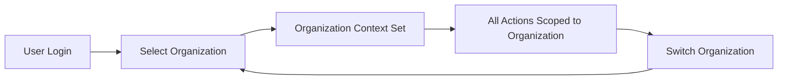
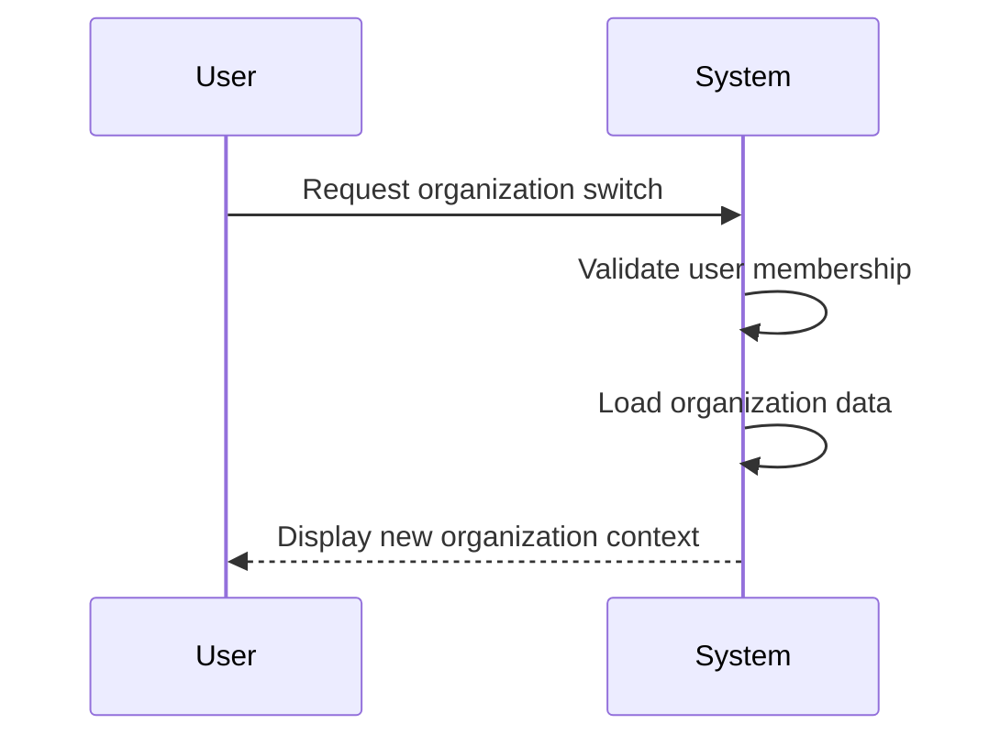
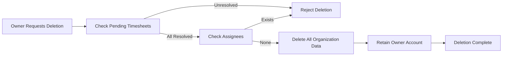

**hrmPlatform — What operations users can perform, use cases, business workflows**

What operations users can perform, use cases, business workflows

# Core Business Operations

What the system must do for each business concept.

## Organization Operations

Users create an organization during initial sign-up with name, description, logo image, currency, timezone, and fiscal start month. Each organization operates independently with its own employees, projects, and data in a multi-tenancy model. Organization owners can edit organization settings at any time. Organization owners can delete their organization only when all pending timesheets are resolved and there are no active employee contracts. When an organization is deleted, all employees, projects, tasks, timelogs, and timesheets are permanently deleted while the owner's account remains. Users can belong to multiple organizations and select which organization to work in upon login. All subsequent actions are scoped to the selected organization context. Users can switch between organizations without logging out. Data is strictly isolated per organization so employees cannot see data from other organizations.

### Organization Creation During Sign-Up

### Organization Creation Requirements

WHEN a user completes initial sign-up, THEN the system SHALL create an organization for the user.

THE system SHALL require the organization name during creation.

THE system SHALL require the organization description during creation.

THE system SHALL allow the user to upload a logo image for the organization.

THE system SHALL require the user to select a currency for the organization from available options including USD, EUR, and KRW.

THE system SHALL apply the selected currency to all monetary values within the organization.

THE system SHALL require the user to select a timezone for the organization.

THE system SHALL apply the selected timezone to all time-related operations including timelogs, timesheets, and reports.

THE system SHALL require the user to set a fiscal start month for the organization.

THE system SHALL use the fiscal start month to determine the organization's fiscal year boundaries for reporting.

THE system SHALL allow organization owners to edit all organization settings after creation including name, description, logo image, currency, timezone, and fiscal start month.

### Multi-Tenancy and Data Isolation

### Multi-Tenancy Isolation Requirements

THE system SHALL support multiple organizations operating independently on the same platform.

THE system SHALL isolate all data per organization including employees, projects, tasks, timelogs, timesheets, contracts, departments, roles, and activity logs.

WHEN a user belongs to multiple organizations, THEN the system SHALL restrict data visibility to the currently selected organization context only.

THE system SHALL prevent employees in one organization from accessing data from any other organization.

THE system SHALL enforce organization context on every operation to maintain data isolation.

THE system SHALL prevent any user from accessing data from an organization they do not belong to.

### Organization Context Flow

### Organization Settings and Context Management

### Organization Context Selection Requirements

THE system SHALL allow a user to belong to multiple organizations simultaneously.

WHEN a user logs in, THEN the system SHALL require the user to select which organization to work in.

THE system SHALL establish the selected organization as the context for the user session.

THE system SHALL scope all subsequent user actions to the selected organization context.

THE system SHALL allow users to switch between organizations without logging out.

WHEN a user switches organizations, THEN the system SHALL load the data and settings for the newly selected organization.

THE system SHALL maintain the user's global profile as shared across all organizations the user belongs to.

THE system SHALL determine visible employees, projects, tasks, and timesheets based on the current organization context.

### Organization Context Switching Flow

### Organization Deletion

### Organization Deletion Requirements

THE system SHALL allow organization owners to delete their organization.

WHEN an organization owner requests deletion, THEN the system SHALL verify that all pending timesheets are resolved with status approved or rejected.

WHEN an organization owner requests deletion, THEN the system SHALL verify that no assignees exist in the organization.

IF either verification fails, THEN the system SHALL reject the deletion request.

WHEN an organization is deleted, THEN the system SHALL permanently delete all employees, projects, tasks, timelogs, and timesheets.

WHEN an organization is deleted, THEN the system SHALL permanently delete all contracts, departments, roles, project members, task histories, timers, and activity logs associated with the organization.

WHEN an organization is deleted, THEN the system SHALL retain the owner's user account in active status.

WHEN an organization is deleted, THEN the system SHALL remove the association between the owner's account and the deleted organization.

THE system SHALL allow the owner to remain a member of other organizations if multiple memberships existed.

THE system SHALL prevent recovery of deleted organization data.

### Organization Deletion Flow

## User Operations

Users sign up with email and password to create their account. Users log in with email and password to access the platform. Users can change their password through account settings. A user can belong to multiple organizations simultaneously. When logging in, users select which organization to work in for that session. All subsequent actions are scoped to the selected organization context. Users can switch organizations without logging out to access different organization data. Users can delete their account if they are not the sole owner of any organization. If a user is the sole owner of an organization, they must transfer ownership or delete the organization first before account deletion. When a user deletes their account, their employee records in other organizations are marked as deactivated rather than deleted.

### User Account Creation and Authentication

Users can create an account by providing an email address and password. The email address must be unique across the platform. Upon successful account creation, the user can proceed to create or join an organization.

Users can log in to the platform by providing their registered email address and password. Upon successful authentication, the user gains access to the platform and can work within their organization context.

Users can change their password through account settings. The user must provide their current password for verification before setting a new password. The password change applies to the user account globally across all organizations the user belongs to.

### Organization Membership and Context Management

A user can belong to multiple organizations simultaneously. The user's account maintains membership records for each organization independently.

When logging in, users who belong to multiple organizations select which organization to work in for that session. The selected organization becomes the context for all subsequent actions during that session. Users belonging to a single organization are automatically scoped to that organization without manual selection.

Users can switch between organizations without logging out. When switching organizations, the session context is updated to the newly selected organization. All subsequent actions are scoped to the new organization context.

All user actions are scoped to the selected organization context. Users can only view and interact with data belonging to the currently selected organization. Data from other organizations the user belongs to is not visible or accessible while working in a different organization context.

### Account Deletion and Lifecycle Management

Users can delete their account through account settings. Account deletion is permitted only if the user is not the sole owner of any organization. If the user is the sole owner of one or more organizations, the account deletion request is rejected until ownership is transferred or the organizations are deleted.

Before deleting their account, a user who is the sole owner of an organization must transfer ownership to another user with the Owner role or delete the organization entirely. The system validates ownership status before processing account deletion requests.

If a user chooses not to transfer ownership, the user must delete the organization first before proceeding with account deletion. Organization deletion requires resolution of all pending timesheets and deactivation of all employee contracts.

When a user deletes their account, the user's employee records in other organizations are marked as deactivated rather than deleted. Historical data including timelogs, timesheets, and task assignments associated with the deactivated employee records are preserved. The deactivated employee records remain visible to users with employee viewing permissions in those organizations.

The user account lifecycle includes: account creation through registration, active usage through login and organization switching, and account removal through deletion with employee record deactivation. Account deletion is irreversible and removes the user's ability to log in while preserving organizational data integrity.

## UserProfile Operations

Each user has a global profile that exists independently of any organization. The user profile contains display name, avatar image, and phone number. Users can edit their profile information at any time. The profile is shared across all organizations the user belongs to, ensuring consistent identity. When a user updates their profile, the changes reflect immediately across all organization contexts. Users can view their own profile to verify current information. The profile remains active as long as the user account exists. Profile information is accessible regardless of which organization context the user is currently working in. When a user belongs to multiple organizations, their profile appears the same in each organization.

### User Profile Lifecycle and Management

### Profile Creation and Account Linkage

WHEN a user account is created, THE system SHALL automatically create a global user profile linked to that user account.

THE system SHALL maintain the user account profile linkage for the entire lifetime of the user account.

WHEN a user account is deleted, THE system SHALL delete the associated user profile.

### Profile Information Fields

THE system SHALL store three profile information fields for each user: display name, avatar image, and phone number.

THE system SHALL use the display name to identify the user across the platform.

THE system SHALL use the avatar image as a visual representation of the user.

THE system SHALL store the phone number as contact information for the user.

### Profile Viewing and Accessibility

THE system SHALL allow users to view their own profile to verify current profile information.

THE system SHALL maintain profile accessibility regardless of which organization the user is currently accessing.

### Profile Persistence

WHILE the user account exists, THE system SHALL maintain the user profile in an active state.

THE system SHALL preserve user identity management through the global profile across all organizations the user belongs to.

### Display Name Editing

THE system SHALL allow users to edit their display name to a new value at any time.

IF the display name is empty, THEN THE system SHALL reject the profile editing operation.

### Avatar Image Upload

THE system SHALL allow users to upload a new avatar image to replace the existing one.

IF the avatar image does not meet acceptable file format requirements, THEN THE system SHALL reject the upload.

### Phone Number Management

THE system SHALL allow users to add or update their phone number.

THE system SHALL allow users to remove their phone number.

IF the phone number does not follow proper formatting rules, THEN THE system SHALL reject the update.

### Profile Editing Operation

THE system SHALL allow users to modify all three profile information fields in a single editing session.

WHEN the profile editing operation completes successfully, THE system SHALL save the updated profile information immediately.

WHEN the profile editing operation completes successfully, THE system SHALL provide confirmation to the user.

IF validation fails during the profile editing operation, THEN THE system SHALL notify the user of the specific error.

### Cross-Organization Profile Consistency

### Cross-Organization Profile Sharing

THE system SHALL share the user profile across all organizations the user belongs to.

THE system SHALL ensure that the profile appears identical in each organization the user belongs to.

### Profile Update Propagation

WHEN a user updates their display name, avatar image, or phone number, THE system SHALL propagate the changes immediately across all organization contexts.

THE system SHALL ensure that colleagues in different organizations see the same user identity.

### Multi-Organization Profile Consistency

THE system SHALL maintain multi-organization profile consistency automatically without requiring user intervention.

THE system SHALL ensure that users do not need to update their profile separately for each organization.

WHEN users switch between organizations, THE system SHALL maintain consistent profile information across the transition.

THE system SHALL provide consistent identity across orgs through the global user profile mechanism.

## Role Operations

Each organization has its own set of roles that define user permissions within that organization. Three built-in roles exist and cannot be deleted: Owner with full access, Manager who can manage employees and projects and approve timesheets, and Employee who can track time and view own data. Organization owners can create custom roles with a name and set of permissions. Available permissions include org:manage, employee:manage, employee:view, project:manage, project:view, time:manage, time:approve, time:view_all, and report:view. Organization owners can edit custom roles to modify their permissions. Organization owners can delete custom roles only if no employees are assigned to them. Each employee in an organization is assigned exactly one role. Role assignment can be changed by users with employee:manage permission.

### Built-in Roles

Each organization has three built-in roles that cannot be deleted or renamed.

The Owner role has full access to all features within the organization. Owners can manage organization settings, manage all employees, manage all projects and tasks, manage all timelogs and timesheets, approve or reject timesheets, view all reports, create and manage custom roles, and assign roles to employees.

The Manager role can manage employees including adding, editing, and deactivating employee records. Managers can manage projects and tasks including creating, editing, and archiving projects. Managers can approve or reject submitted timesheets. Managers can view organization reports. Managers cannot edit organization settings or manage custom roles.

The Employee role has limited access focused on individual contributions. Employees can track time by creating and editing their own timelogs. Employees can submit timesheets for approval. Employees can view their own data including their timelogs, timesheets, and assigned tasks. Employees cannot manage other employees, projects, or timesheets.

All employees in the organization are assigned exactly one role at any time.

### Custom Role Management

Users with org:manage permission can create custom roles to define specific permission sets for their organization's needs.

When creating a custom role, the user provides a name and selects a set of permissions from the available permission catalog. The name must be unique within the organization.

Users with org:manage permission can edit custom roles to modify the name or change the assigned permissions. Editing a custom role immediately affects all employees currently assigned to that role.

Users with org:manage permission can delete custom roles only if the role has no assignees. If assignees are assigned to the role, the user must first reassign those assignees to a different role before deletion is allowed. Built-in roles cannot be deleted under any circumstances.

### Role Assignment

Each employee in an organization is assigned exactly one role. An employee cannot have multiple roles simultaneously within the same organization.

When inviting a new employee to the organization, the inviter assigns an initial role to the employee. The assigned role determines what the employee can access and do within the organization.

Users with employee:manage permission can change an employee's role assignment. When a role assignment is changed, the employee immediately gains the permissions of the new role and loses the permissions of the previous role.

Role assignment changes are recorded in the activity log for audit purposes.

## Employee Operations

Users with employee:manage permission can invite new employees to the organization by email. If the invited email already has an account, the user is added to the organization immediately. If the invited email has no account, a pending invitation is created and the user is automatically added when they sign up. Each employee record contains department, position, employment type, and status fields. Employment type can be full-time, part-time, contractor, or intern. Status can be active or deactivated. Users with employee:manage permission can edit employee records including department, position, and employment type. Users with employee:manage permission can deactivate employees, preventing them from logging time or submitting timesheets. Deactivated employees' historical data is preserved and they can be reactivated. Users with employee:view permission can view the employee list with pagination, filtering by department, employment type, and status, and search by name.

### Employee Invitation and Onboarding

WHEN a user with employee:manage permission invites a new employee by email, THE system SHALL check if the invited email already has a user account in the platform.

IF the invited email already has an account, THEN THE system SHALL immediately add the user to the organization as an employee.

IF the invited email does not have an account, THEN THE system SHALL create a pending invitation.

WHEN a user signs up with an email that has pending invitations, THE system SHALL automatically add the user to all organizations where they have pending invitations.

THE employee invitation process SHALL NOT require the invited user to take any action beyond signing up with the invited email address.

### Employee Record Structure

THE employee record SHALL contain the following fields: department (optional), position (optional), employment type, and status.

THE employment type SHALL be one of: full-time, part-time, contractor, or intern.

THE status SHALL be either active or deactivated.

THE employee record SHALL reference exactly one user account.

THE employee record SHALL be associated with exactly one organization.

THE employee SHALL be assigned exactly one role within the organization, which determines their permissions and access levels.

### Employee Status Management

WHEN a user with employee:manage permission deactivates an employee, THE system SHALL prevent the employee from logging time or submitting timesheets.

WHILE an employee has deactivated status, THE system SHALL preserve all historical data including past timelogs and timesheets.

WHILE an employee has deactivated status, THE system SHALL allow authorized users to view the employee's historical data.

WHEN a user with employee:manage permission reactivates a deactivated employee, THE system SHALL restore the employee's ability to log time and submit timesheets.

THE system SHALL maintain active status for employees who can perform time tracking operations.

THE system SHALL maintain deactivated status for employees who cannot perform time tracking operations.

### Employee Record Editing

WHEN a user with employee:manage permission edits an employee record, THE system SHALL allow modification of department, position, and employment type fields.

WHEN a user with employee:manage permission changes an employee's role assignment, THE system SHALL apply the change immediately.

WHEN employment type is changed, THE system SHALL update how the employee is categorized for reporting purposes.

WHEN department is changed, THE system SHALL update the employee's organizational grouping.

WHEN position is changed, THE system SHALL update the employee's title display across the system.

IF a user does not have employee:manage permission, THEN THE system SHALL reject the employee record edit request.

### Employee List Viewing

WHEN a user with employee:view permission accesses the employee list, THE system SHALL display all employees in the organization with their basic information.

THE employee list SHALL be paginated to handle large numbers of employees.

WHERE department filtering is applied, THE system SHALL show only employees in the specified departments.

WHERE employment type filtering is applied, THE system SHALL show only employees matching the selected employment type (full-time, part-time, contractor, or intern).

WHERE status filtering is applied, THE system SHALL show only active or deactivated employees as selected.

WHERE name search is applied, THE system SHALL find employees matching the search term by name.

THE filtering and search capabilities SHALL be combinable to narrow down results.

## Contract Operations

Each employee can have multiple contracts serving as a historical record of employment terms. Only one contract can be active at a time for each employee. Each contract contains start date, end date, pay rate, pay period, working hours per week, and optional notes. Pay period can be hourly, daily, weekly, or monthly. End date being null means the contract is ongoing. Users with employee:manage permission can create contracts for employees. Creating a new contract automatically ends the previous active contract by setting its end date to the day before the new contract starts. Users with employee:manage permission can edit the current active contract. Past contracts cannot be edited as they are immutable historical records. Employees can view their own contracts. Users with employee:view permission can view any employee's contracts.

### Contract Creation

### Contract Creation

THE system SHALL allow users with employee:manage permission to create contracts for employees.

THE system SHALL support multiple contracts per employee, maintaining a historical record of employment terms.

WHEN a user creates a contract, THE system SHALL require the start date, pay rate, pay period, and working hours per week.

THE system SHALL accept an optional end date for contracts. WHERE no end date is provided, THE system SHALL treat the contract as ongoing with a null end date.

THE system SHALL validate that the pay rate is a numeric value.

THE system SHALL require the pay period to be one of: hourly, daily, weekly, or monthly.

THE system SHALL require working hours per week as a numeric value representing the employee's standard weekly hours.

THE system SHALL accept optional notes to provide additional context about contract terms.

WHEN a new contract is created for an employee with an active contract, THE system SHALL automatically end the previous active contract by setting its end date to the day before the new contract starts.

THE system SHALL enforce the single active contract rule, ensuring only one contract can be active at a time for each employee.

### Contract Editing and Immutability

### Contract Editing and Immutability

THE system SHALL allow users with employee:manage permission to edit the current active contract for an employee.

WHEN an active contract is edited, THE system SHALL apply changes immediately and reflect them in the contract record.

THE system SHALL prevent editing of past contracts. Once a contract is no longer active, THE system SHALL treat it as an immutable historical record.

IF a contract is edited to add an end date, THE system SHALL leave the employee without an active contract until a new contract is created with a start date on or after the end date of the previous contract.

THE system SHALL preserve the accuracy of historical employment terms by preventing retroactive changes to past agreements.

### Contract Viewing

### Contract Viewing

THE system SHALL allow employees to view their own contracts, including both active and past contracts.

THE system SHALL allow users with employee:view permission to view any employee's contracts within the organization.

WHEN viewing contracts, THE system SHALL display the complete contract history for an employee, including all past contracts and the current active contract if one exists.

THE system SHALL display for each contract: start date, end date or ongoing status, pay rate, pay period, working hours per week, and any associated notes.

## Department Operations

Each organization can have departments to structure employee organization. Each department has a name, description, and optional parent department supporting one level of nesting. Users with org:manage permission can create departments within the organization. Users with org:manage permission can edit department information including name and description. Users with org:manage permission can delete departments from the organization. Deleting a department sets employees' department field to null rather than deleting the employees themselves. Employees can view the list of departments in their organization. Departments help organize employees for filtering and reporting purposes. The parent department relationship allows for basic hierarchical organization structure.

### Department Creation

WHEN a user with org:manage permission requests to create a department, THE system SHALL create a new department within the organization.

THE system SHALL require a name for each department during creation.

THE system SHALL accept an optional description for each department during creation.

### Parent Department Assignment

WHEN creating a department, THE system SHALL allow the user to assign an optional parent department to establish a hierarchical relationship.

THE system SHALL enforce one level of nesting for department hierarchy, meaning a department can have a parent department but cannot have child departments that themselves have children.

### Department Hierarchy Management

THE system SHALL maintain parent department relationships for organizational structure visualization.

THE system SHALL display parent department relationships when viewing department information.

WHERE departments share a common parent department, THE system SHALL preserve the grouping for organizational structure purposes.

### Department Editing

WHEN a user with org:manage permission requests to edit a department, THE system SHALL allow the user to update the department name.

WHEN a user with org:manage permission requests to edit a department, THE system SHALL allow the user to update the department description.

### Department Deletion

WHEN a user with org:manage permission requests to delete a department, THE system SHALL remove the department from the organization.

WHEN a department is deleted, THE system SHALL set the department reference to null for all assignees who were assigned to that department.

THE system SHALL preserve all employee records when department deletion occurs.

### Department Persistence

THE system SHALL maintain departments in the organization until explicitly deleted by a user with org:manage permission.

THE system SHALL preserve department information including name, description, and parent department relationships throughout the department lifecycle.

### Department List Viewing

THE system SHALL allow all employees to view the list of departments in their organization.

THE system SHALL display department name, description, and parent department relationships in the department list.

### Employee Department Filtering

THE system SHALL allow employees to filter the employee list by department to view employees belonging to specific departments.

### Department-Based Reporting

WHERE reports are generated, THE system SHALL allow grouping of data by department for department-based analysis.

WHEN a user with report:view permission generates reports, THE system SHALL support department-level summaries and comparisons.

### Cross-Department Employee Organization

THE system SHALL organize employees across departments within the organization.

THE system SHALL allow each employee to be assigned to at most one department at a time.

THE system SHALL use department assignments to structure the organization for employee management and reporting purposes.

## Project Operations

Users with project:manage permission can create projects within the organization. Each project has a name, optional description, required color code for UI display, status, optional budget hours, optional start date, and optional end date. Project status can be active, archived, or completed. Users with project:manage permission can edit project information at any time. Users with project:manage permission can archive or complete projects, which prevents new timelogs from being recorded on those projects. Existing timelogs on archived or completed projects are preserved. Users with project:manage permission can delete projects only if the project has no timelogs associated with it. Users with project:view permission can view all projects in the organization. The project list is paginated and projects can be filtered by status.

### Project Creation

Users with project:manage permission can create new projects within the organization.

When creating a project, the user must provide:
- A project name (required)
- A color code for UI display (required)

The user may optionally provide:
- A description
- Budget hours (total estimated hours for the project)
- A start date
- An end date

The project is automatically set to active status upon creation.

Users with project:view permission can view all projects in the organization, including newly created projects.

### Project Status Management

Each project has a status that can be: active, archived, or completed.

Users with project:manage permission can change a project's status from active to archived.
Users with project:manage permission can change a project's status from active to completed.

When a project is archived:
- No new timelogs can be recorded against the project
- Existing timelogs on the project are preserved and remain accessible

When a project is completed:
- No new timelogs can be recorded against the project
- Existing timelogs on the project are preserved and remain accessible

Users with project:manage permission can view the current status of any project.

### Project Editing and Deletion

Users with project:manage permission can edit project information at any time, including:
- Project name
- Description
- Color code
- Status
- Budget hours
- Start date
- End date

Users with project:manage permission can delete a project only if the project has no assignees (project members) associated with it.

If a project has one or more assignees, the deletion request is rejected.

When a project is deleted:
- The project is permanently removed from the organization
- The deletion cannot be undone

### Project List and Filtering

Users with project:view permission can view the list of all projects in the organization.

The project list is paginated to handle large numbers of projects.

Users can filter the project list by status:
- Filter to show only active projects
- Filter to show only archived projects
- Filter to show only completed projects
- Filter to show projects with any status

The pagination and filtering apply to all users with project:view permission.

## ProjectMember Operations

Users with project:manage permission can assign employees to projects as project members. An employee can be assigned to multiple projects simultaneously. Each project membership defines the employee, project, and assigned role as either member or project-lead. Project leads can manage tasks within their assigned project. Users with project:manage permission can remove employees from projects at any time. Employees can view which projects they are assigned to within the organization. Project membership determines which projects an employee can log time against. Only employees who are project members can be assigned tasks within that project. Project membership is required before an employee can create timelogs for that project.

### Project Member Assignment

Users with project:manage permission can assign employees to projects as project members. The assignment operation selects an active employee and a project within the organization. Each project membership assigns the employee a role as either member or project-lead. An employee can be assigned to multiple projects simultaneously within the organization. The system records the project, employee, assigned role, and joined date for each membership. Users with project:manage permission can assign the project-lead role to any project member. Users with project:manage permission can change a project member's role from member to project-lead or vice versa. Project membership is created immediately upon assignment. The assigned employee gains access to the project based on their membership role.

### Multiple Project Membership

Employees can hold project memberships across multiple projects within the organization. There is no limit to the number of projects an employee can be assigned to. Each project membership operates independently with its own role assignment. Employees can access all projects where they hold membership. Cross-project employee access is determined by individual project memberships. An employee assigned to multiple projects can view all assigned projects. Project team composition includes all employees with membership in that project. Employees can be project-lead in one project and member in another project simultaneously. Each project maintains its own set of project members independent of other projects.

### Project Lead Task Management

Project leads can manage tasks within their assigned project. Project leads can create new tasks in projects where they hold the project-lead role. Project leads can edit existing tasks in projects where they hold the project-lead role. Project leads can update task status, priority, and assigned employee within their project. Project leads can assign tasks to any employee who is a project member of that project. Task management capabilities are limited to projects where the user has project-lead role. Users with project:manage permission can edit any task regardless of project lead assignment. Project leads cannot manage tasks in projects where they only have member role.

### Project Member Removal

Users with project:manage permission can remove employees from projects at any time. Removing a project member revokes their access to the project immediately. Historical timelogs associated with removed members are preserved in the system. Removed members can no longer create new timelogs for the removed project. Removed members can no longer view project details after removal. Removed members retain access to their historical timelog data. Project member removal does not affect the employee's status in the organization. Removed members can be reassigned to the project through a new assignment operation.

### Project Membership Visibility and Requirements

Employees can view which projects they are assigned to within the organization. Employees can view their project membership details including assigned role and joined date. Project membership is required before an employee can create timelogs for that project. Employees can only log time against projects where they hold active membership. Task assignment is restricted to employees who are project members of that project. Only project members can be assigned tasks within their project. Project assignment restrictions prevent assigning deactivated employees to projects. Timelog project eligibility is validated against current project membership. Membership role differentiation determines task management capabilities. Project-lead role enables task management while member role does not. Users with project:manage permission can view all project memberships for any project. Project membership viewing is scoped to the employee's assigned projects for non-managers.

## Task Operations

Project leads or users with project:manage permission can create tasks within a project. Each task has a required title, optional description, status, priority, optional estimated hours, optional due date, optional assigned employee, and optional parent task for subtasks. Task status can be open, in-progress, completed, or closed. Priority can be low, medium, high, or urgent. Subtasks support one level of nesting only through the parent task relationship. The assigned employee must be a project member of the task's project. Project leads can edit tasks in their assigned project. Users with project:manage permission can edit any task in the organization. Task status changes are recorded in task history. Employees can view tasks in projects they are assigned to. Tasks can be filtered by status, priority, and assigned employee, and sorted by due date, priority, or creation date.

### Task Creation

Project leads can create tasks within their assigned project. Users with project:manage permission can create tasks in any project.

When creating a task, the following information must be provided:
- Title (required)
- Status (default: open)
- Priority (default: medium)

The following information is optional:
- Description
- Estimated hours
- Due date
- Assigned employee (must be a project member of the task's project)
- Parent task (for subtasks, one level of nesting only)

Task status can be: open, in-progress, completed, or closed.
Task priority can be: low, medium, high, or urgent.

If a parent task is specified, the new task becomes a subtask. Subtasks support one level of nesting only — a subtask cannot have its own subtasks.

The assigned employee must be a project member of the project the task belongs to. If the selected employee is not a project member, the request is rejected.

### Task Editing

Project leads can edit tasks within their assigned project. Users with project:manage permission can edit any task in the organization.

When editing a task, users can modify:
- Title
- Description
- Status
- Priority
- Estimated hours
- Due date
- Assigned employee
- Parent task (for subtasks)

All editing rules from task creation apply: the assigned employee must be a project member, and subtask nesting is limited to one level.

### Task Status Change Recording

When a task's status changes, the system automatically creates a task history entry.

Each task history entry records:
- Timestamp of the change
- Old status
- New status
- User who made the change

Task history entries are immutable and cannot be edited or deleted manually. This provides an audit trail of all status transitions for the task.

### Task Viewing and Browsing

Employees can view tasks in projects they are assigned to as project members.

Tasks can be filtered by:
- Status (open, in-progress, completed, closed)
- Priority (low, medium, high, urgent)
- Assigned employee

Tasks can be sorted by:
- Due date
- Priority
- Creation date

The task list displays all relevant task information including title, status, priority, assigned employee, due date, and estimated hours.

## TaskHistory Operations

Task history entries are automatically created whenever a task status changes. Each task history entry records the timestamp of the change, the old status, the new status, and which user made the change. Task history is created automatically by the system and cannot be manually created by users. Task history entries cannot be edited once created to maintain an accurate audit trail. Task history entries cannot be deleted to preserve the complete record of task status changes. Users can view task history to understand how a task has progressed through its workflow. Task history provides transparency into who made status changes and when those changes occurred. Task history is read-only and serves as an immutable record of task evolution.

### Automatic Task History Creation

The system automatically creates a task history entry whenever a task status changes. Users cannot manually create task history entries. Each task history entry records the timestamp when the status change occurred, the old status before the change, the new status after the change, and the user who made the change. Task history creation is triggered only by task status changes, not by other task modifications. The system captures the exact timestamp of each status change for accurate historical tracking. Task history entries are created for all status transitions regardless of the direction of change.

### Task History Immutability

Task history entries cannot be edited once created to maintain an accurate audit trail. Task history entries cannot be deleted to preserve the complete record of task status changes. The immutability of task history ensures the integrity of the audit trail. No user, including organization owners, can modify or remove task history entries. The system enforces task history immutability at the business logic level. This immutability policy maintains task evolution records for compliance and transparency purposes.

### Task History Viewing

Users can view task history to understand how a task has progressed through its workflow. Task history viewing provides transparency into who made status changes and when those changes occurred. Users with project view permission can view task history for tasks in projects they can access. Task history viewing supports workflow transparency by showing the complete sequence of status changes. The view operation displays status change accountability by identifying the user responsible for each change. Task history viewing enables historical status tracking to analyze task evolution patterns.

## Timelog Operations

Employees can create timelogs to record time entries for work performed. Each timelog contains date, duration in minutes, project, optional task, optional description, and billable flag with default true. Employees can only create timelogs for themselves, not for other employees. The project must be one the employee is assigned to as a project member. The task, if specified, must belong to the selected project. Employees can edit their own timelogs only if the timelog is not part of an approved timesheet. Employees can delete their own timelogs only if the timelog is not part of any submitted or approved timesheet. Users with time:manage permission can edit or delete any employee's timelogs regardless of timesheet status. Users with time:view_all permission can view all employees' timelogs. Employees can view their own timelogs. Timelogs are paginated and can be filtered by date range, project, task, and billable status.

### Employee Timelog Creation

WHEN an employee creates a timelog, THE system SHALL record the date and duration in minutes.

WHERE the employee is a project member, THE system SHALL allow the employee to select any project they are assigned to.

WHERE a task is specified, THE system SHALL require the task to belong to the selected project.

THE system SHALL include an optional description field for the employee to describe what was done.

THE system SHALL set the billable flag to true by default. THE employee MAY change the billable flag to false for non-billable work.

THE system SHALL restrict timelog creation to the employee's own entries only.

### Own Timelog Editing

WHILE a timelog is not part of an approved timesheet, THE employee SHALL be able to edit their own timelog.

WHERE a user has the time:manage permission, THE system SHALL allow the user to edit any employee's timelogs regardless of timesheet status.

### Own Timelog Deletion

WHILE a timelog is not part of any submitted or approved timesheet, THE employee SHALL be able to delete their own timelog.

WHERE a user has the time:manage permission, THE system SHALL allow the user to delete any employee's timelogs regardless of timesheet status.

### Timelog Access and Display

THE employee SHALL be able to view their own timelogs.

WHERE a user has the time:view_all permission, THE system SHALL allow the user to view all employees' timelogs across the organization.

THE system SHALL display timelogs in a paginated list.

THE employee SHALL be able to filter the timelog list. The available filters and pagination rules are defined in the business rules section.

## Timesheet Operations

A timesheet is a collection of timelogs for a specific week from Monday to Sunday. Employees can create a draft timesheet for a specific week, which automatically includes all timelogs for that employee in that week. Employees can add or remove timelogs from a draft timesheet before submission. Each timesheet tracks employee owner, week start date, week end date, status, total hours calculated from timelogs, submitted timestamp, reviewed timestamp, reviewed by user, and rejection reason. Status can be draft, submitted, approved, or rejected. Employees can submit a draft timesheet for approval only if it has timelogs and no other timesheet for the same week is already submitted or approved. Users with time:approve permission can view all submitted timesheets. Users with time:approve permission can approve submitted timesheets, which locks all included timelogs from editing or deletion. Users with time:approve permission can reject submitted timesheets with a required reason, returning them to draft status for modification and resubmission. Employees can view their own timesheets. Timesheets are paginated and can be filtered by status and date range.

### Weekly Timesheet Collection

A timesheet represents a weekly collection of timelogs spanning from Monday to Sunday. The system groups timelogs by week for timesheet management. Each timesheet covers one specific week and belongs to one employee.

### Draft Timesheet Creation

Employees can create a draft timesheet for a specific week. When creating a draft timesheet, the system automatically includes all timelogs for that employee within that week's date range. The timesheet is created in draft status. Employees can only create one timesheet per week. The draft timesheet serves as a working document that employees can modify before submission.

### Draft Timesheet Management

Employees can add timelogs to a draft timesheet. Employees can remove timelogs from a draft timesheet. Adding or removing timelogs automatically recalculates the total hours for the timesheet. Only timelogs belonging to the employee and falling within the timesheet's week can be added. Employees can only manage timelogs in their own draft timesheets.

### Timesheet Submission

Employees can submit a draft timesheet for approval. Upon submission, the timesheet status changes from draft to submitted. Only the timesheet owner can submit their own timesheet. Submission is subject to validation rules defined in the business rules section.

### Timesheet Approval

Users with time:approve permission can view all submitted timesheets across the organization. Users with time:approve permission can approve submitted timesheets. When a timesheet is approved, its status changes to approved and all included timelogs are locked from editing or deletion. The approval action records the reviewed timestamp and the user who performed the approval.

### Timesheet Rejection and Resubmission

Users with time:approve permission can reject submitted timesheets. When rejecting a timesheet, a rejection reason is required. Upon rejection, the timesheet status changes to rejected and the timesheet returns to draft status for modification and resubmission. The rejection action records the reviewed timestamp and the user who performed the rejection. Employees can resubmit a rejected timesheet after making modifications.

### Timesheet Viewing

Employees can view their own timesheets. Users with time:approve permission can view all submitted timesheets for approval purposes. The timesheet view displays the week period, status, and total hours. Filtering and pagination rules are defined in the business rules section.

## Timer Operations

Employees can start a timer to track time in real-time for live time tracking. Each employee can have at most one active timer at a time, preventing multiple concurrent timers. Starting a timer requires selecting a project, with task being optional. The timer records start timestamp, project, task, and description. Employees can stop their timer at any time, which creates a timelog with the calculated duration rounded to the nearest minute. Employees can discard their timer without creating a timelog if they started it by mistake. Employees can view their currently running timer to see elapsed time and details. If an employee forgets to stop their timer, it continues running indefinitely with no automatic stop. Employees can edit the description and project or task of a running timer before stopping it.

### Timer Start Operation

WHEN an employee initiates timer start, THE system SHALL require project selection from projects the employee is assigned to.

WHEN an employee initiates timer start, THE system SHALL allow optional task selection from tasks within the selected project.

WHEN an employee initiates timer start, THE system SHALL record the start timestamp.

WHEN an employee initiates timer start, THE system SHALL allow optional description entry.

WHILE no timer is active for the employee, THE system SHALL permit timer start.

IF a timer is already active for the employee, THEN THE system SHALL reject the timer start request.

THE system SHALL track elapsed time continuously from the start timestamp until the timer is stopped or discarded.

### Timer Stop Operation

WHEN an employee stops their running timer, THE system SHALL calculate the duration from start timestamp to stop timestamp.

WHEN an employee stops their running timer, THE system SHALL round the calculated duration to the nearest minute.

WHEN an employee stops their running timer, THE system SHALL automatically create a timelog entry.

THE timelog SHALL inherit the project from the stopped timer.

THE timelog SHALL inherit the task from the stopped timer, if one was selected.

THE timelog SHALL inherit the description from the stopped timer.

THE created timelog SHALL follow all standard timelog rules and restrictions.

### Timer Discard Operation

WHEN an employee discards their running timer, THE system SHALL remove the timer without creating a timelog entry.

WHEN an employee discards their running timer, THE system SHALL permanently delete all timer data.

WHEN an employee discards their running timer, THE system SHALL allow the employee to immediately start a new timer.

### Running Timer Management

THE system SHALL allow employees to view their currently running timer.

THE running timer view SHALL display the start timestamp, selected project, selected task, and description.

THE system SHALL allow employees to edit the description of a running timer before stopping it.

THE system SHALL allow employees to change the project of a running timer before stopping it.

THE system SHALL allow employees to change the task of a running timer before stopping it.

WHEN edits are made to a running timer, THE system SHALL apply changes immediately.

WHEN a timer is stopped, THE resulting timelog SHALL reflect all edits made to the timer.

IF an employee does not stop their timer, THEN THE timer SHALL continue running indefinitely with no automatic stop mechanism.

## ActivityLog Operations

The system automatically records significant actions as activity log entries for audit and tracking purposes. Each activity log entry contains timestamp, user who performed the action, action type, target entity, and details about the action. Logged actions include employee invited, deactivated, or reactivated, contract created or edited, project created, archived, completed, or deleted, task status changed, timesheet submitted, approved, or rejected, and role assigned or changed. Activity log entries are created automatically by the system and cannot be manually created by users. Activity log entries cannot be edited or deleted to maintain an accurate audit trail. Users with org:manage permission can view the full activity log for their organization. The activity log is paginated to handle large volumes of entries. The activity log can be filtered by action type, user, and date range to find specific events.

### Automatic Activity Log Creation

The system automatically creates activity log entries when significant actions occur in the organization. Users cannot manually create activity log entries. Activity log entries cannot be edited after creation to preserve accuracy. Activity log entries cannot be deleted to maintain a complete audit trail. The system captures the timestamp at the moment each action occurs. The system records which user performed each logged action. The audit trail is maintained by preserving all activity log entries permanently.

### Logged Action Types

The system logs when an employee is invited to the organization. The system logs when an employee is deactivated. The system logs when an employee is reactivated. The system logs when a contract is created for an employee. The system logs when a contract is edited. The system logs when a project is created. The system logs when a project is archived. The system logs when a project is completed. The system logs when a project is deleted. The system logs when a task status changes. The system logs when a timesheet is submitted. The system logs when a timesheet is approved. The system logs when a timesheet is rejected. The system logs when a role is assigned to an employee. The system logs when a role is changed for an employee.

### Activity Log Viewing and Filtering

Users with org:manage permission can view the activity log for their organization. The activity log displays entries in paginated form to handle large volumes. Users can filter the activity log by action type to find specific events. Users can filter the activity log by user to see actions performed by a specific person. Users can filter the activity log by date range to view actions within a specific time period. Users without org:manage permission cannot access the activity log.

# Error Scenarios and Edge Cases

Business-level error scenarios, edge case coverage, and expected system behaviors for exceptional conditions.

## Organization Error Scenarios

Organization deletion is blocked when pending timesheets exist that have not been approved or rejected. Organization deletion is also blocked when active employee contracts are still in place. Only organization owners can edit organization settings, and attempts by other users are rejected. When an organization is deleted, all associated employees, projects, tasks, timelogs, and timesheets are permanently removed. The owner's account remains intact but loses association with the deleted organization. Organization creation during sign-up requires a valid name and cannot be skipped. Currency, timezone, and fiscal start month must be valid values during organization setup. Multiple organizations can exist independently with complete data isolation between them.

### Deletion Blocked by Pending Timesheets

WHEN an organization has pending timesheets that have not been approved or rejected, THEN the system SHALL block organization deletion.

WHEN a user attempts to delete an organization with pending timesheets, THEN the system SHALL reject the deletion request.

### Deletion Blocked by Active Contracts

WHEN an organization has active employee contracts, THEN the system SHALL block organization deletion.

WHEN a user attempts to delete an organization with active contracts, THEN the system SHALL reject the deletion request.

### Permanent Data Removal on Deletion

WHEN an organization is deleted, THEN the system SHALL permanently remove all employees associated with the organization.

WHEN an organization is deleted, THEN the system SHALL permanently remove all projects associated with the organization.

WHEN an organization is deleted, THEN the system SHALL permanently remove all tasks associated with the organization.

WHEN an organization is deleted, THEN the system SHALL permanently remove all timelogs associated with the organization.

WHEN an organization is deleted, THEN the system SHALL permanently remove all timesheets associated with the organization.

### Owner Account Preservation

WHEN an organization is deleted, THEN the system SHALL preserve the owner's user account.

WHEN an organization is deleted, THEN the system SHALL remove all association between the owner's account and the deleted organization.

WHERE the owner belongs to multiple organizations, THEN the system SHALL maintain the owner's access to other organizations after deletion.

### Non-Owner Settings Edit Rejection

WHEN a user without owner privileges attempts to edit organization settings, THEN the system SHALL reject the modification request.

WHEN a non-owner attempts to change the organization name, THEN the system SHALL reject the request.

WHEN a non-owner attempts to change the organization description, THEN the system SHALL reject the request.

WHEN a non-owner attempts to change the logo image, THEN the system SHALL reject the request.

WHEN a non-owner attempts to change the currency, THEN the system SHALL reject the request.

WHEN a non-owner attempts to change the timezone, THEN the system SHALL reject the request.

WHEN a non-owner attempts to change the fiscal start month, THEN the system SHALL reject the request.

### Required Organization Name During Sign-Up

WHEN a user attempts to create an organization without providing a name during sign-up, THEN the system SHALL reject the creation request.

WHEN a user attempts to skip organization creation during sign-up, THEN the system SHALL reject the sign-up request.

### Invalid Configuration Values Rejection

WHEN a user provides an invalid currency code during organization creation, THEN the system SHALL reject the creation request.

WHEN a user provides an unsupported timezone during organization creation, THEN the system SHALL reject the creation request.

WHEN a user provides an invalid fiscal start month during organization creation, THEN the system SHALL reject the creation request.

### Cross-Organization Data Access Rejection

WHEN an employee attempts to view data from an organization they do not belong to, THEN the system SHALL reject the access request.

WHEN a user belongs to multiple organizations, THEN the system SHALL restrict data visibility to the currently selected organization context.

WHEN a user attempts to access data from a non-selected organization, THEN the system SHALL reject the access request.

### Organization Context Enforcement

WHEN a user switches organization context, THEN the system SHALL immediately update the visible data scope to the newly selected organization.

WHEN any data access operation occurs, THEN the system SHALL enforce organization context validation.

WHERE data isolation is enforced, THEN employees in one organization SHALL NOT see projects from another organization.

WHERE data isolation is enforced, THEN employees in one organization SHALL NOT see tasks from another organization.

WHERE data isolation is enforced, THEN employees in one organization SHALL NOT see timelogs from another organization.

WHERE data isolation is enforced, THEN employees in one organization SHALL NOT see timesheets from another organization.

## User Error Scenarios

Account deletion is blocked if the user is the sole owner of an organization without first transferring ownership or deleting the organization. Login attempts with invalid email or password combinations are rejected. Password changes require verification of the current password before accepting the new password. Users must select an organization context after login before performing any organization-scoped actions. Users belonging to multiple organizations can switch between them without logging out. When a user account is deleted, their employee records in other organizations are marked as deactivated rather than removed. Email addresses must be unique across all user accounts during sign-up. Organization context is enforced on every request to ensure proper data isolation.

### Account Deletion Operation

WHEN a user requests account deletion, THE system SHALL verify the user's organization ownership status. WHERE the user is the sole owner of an organization, THE system SHALL require the user to transfer ownership to another user or delete the organization before proceeding. WHEN the user is not the sole owner of any organization, THE system SHALL proceed with account deletion. WHEN an account is deleted, THE system SHALL mark the user's employee records in other organizations as deactivated. THE deactivated employee records SHALL preserve all historical data including timelogs and timesheets.

### Authentication Operation

WHEN a user attempts to log in, THE system SHALL validate the provided email and password combination. WHEN a user requests a password change, THE system SHALL require verification of the current password before accepting the new password. WHEN a user signs up, THE system SHALL verify that the email address is unique across all user accounts. THE system SHALL create the user account only when the email address is not already registered.

### Organization Context Operation

WHEN a user logs in, THE system SHALL require the user to select an organization context before allowing any organization-scoped actions. WHEN a user belongs to multiple organizations, THE system SHALL allow the user to switch between organizations without logging out. THE system SHALL enforce organization context on every request to ensure proper data isolation. A user in one organization SHALL NOT access data from another organization.

## UserProfile Error Scenarios

Profile edits must maintain valid data formats for display name, avatar image, and phone number. The user profile is shared across all organizations the user belongs to, so changes affect all organization contexts. Attempts to set invalid or empty display names are rejected. Avatar image uploads must meet acceptable file format and size requirements. Phone number updates must follow valid formatting rules. Profile changes are immediately reflected across all organizations without requiring re-login. Users cannot delete their profile while still associated with any organization. Profile data consistency is maintained even when users switch between organizations.

### Profile Edit Validation Errors

Users can edit their profile with display name, avatar image, and phone number. Attempts to set an empty or invalid display name are rejected. The display name must contain valid characters and cannot be blank. Avatar image uploads that do not meet acceptable file format requirements are rejected. The system validates that uploaded avatar images are in a supported image format before accepting them. Phone number updates that do not follow valid formatting rules are rejected. The system enforces phone number formatting standards to ensure data consistency. All profile field validations occur before any changes are saved. If any field fails validation, the entire profile update is rejected and no changes are applied.

### Cross-Organization Profile Propagation

The user profile is shared across all organizations the user belongs to. Any profile change is immediately reflected across all organization contexts without requiring re-login. When a user updates their display name, avatar image, or phone number, the change propagates to all organizations instantly. Users switching between organizations see consistent profile data regardless of which organization context they are in. Profile updates made in one organization context are visible when the user switches to another organization. The system maintains profile data consistency even during active organization switching. If a profile update fails validation, the failure is reported consistently across all organization contexts.

### Profile Deletion Constraints

Users cannot delete their profile while still associated with any organization. Attempts to delete a profile when the user belongs to one or more organizations are rejected. The user must first leave or be removed from all organizations before profile deletion is allowed. If the user is the sole owner of an organization, they must transfer ownership or delete the organization first before profile deletion. Profile deletion is blocked until all organization associations are resolved. The system preserves profile data integrity by preventing orphaned organization references.

## Role Error Scenarios

Built-in roles including Owner, Manager, and Employee cannot be deleted under any circumstances. Custom roles cannot be deleted if any employees are currently assigned to them. Role creation requires a valid name and at least one permission from the available set. Permission validation ensures only valid permissions are assigned to custom roles. Role assignment to employees requires the employee:manage permission. Attempts to assign invalid permissions to roles are rejected. Role edits by users without proper permissions are blocked. Each employee must have exactly one role assigned within an organization, and attempts to leave an employee without a role are rejected.

### Built-in Role Deletion Prohibition

The three built-in roles (Owner, Manager, and Employee) cannot be deleted under any circumstances. Attempts to delete built-in roles are rejected regardless of user permissions. Built-in roles are permanently associated with the organization and remain available for assignment even if no employees currently hold them.

### Custom Role Deletion Constraints

Custom roles can only be deleted if no assignees are currently assigned to them. If any assignee has the custom role assigned, deletion attempts are rejected. Users must reassign assignees to different roles before deleting a custom role. The system checks for active assignees before allowing custom role deletion.

### Role Creation Validation

Creating a custom role requires a valid name and at least one permission from the available permission set. Role names must be unique within the organization. Attempts to create roles with empty names are rejected. Attempts to create roles without any permissions are rejected. Permission validation ensures only valid permissions from the defined set can be assigned to custom roles. Attempts to assign invalid or non-existent permissions are rejected.

### Role Assignment and Editing Permissions

Assigning or changing an employee's role requires the employee:manage permission. Users without this permission cannot assign roles to employees. Role editing for custom roles is restricted to users with appropriate permissions. Attempts to edit roles by users without proper permissions are blocked. Only organization owners and users with explicit role management capabilities can modify custom role definitions and their associated permissions.

### Employee Role Assignment Enforcement

Each employee must have exactly one role assigned within an organization. Attempts to leave an employee without a role are rejected. Attempts to assign multiple roles to a single employee are rejected. When changing an employee's role, the previous role is automatically replaced with the new role. The system enforces that every active employee record maintains a valid role assignment at all times.

## Employee Error Scenarios

Employee invitations sent to existing email addresses add the user directly to the organization instead of creating pending invitations. Invitations to new email addresses create pending invitations that activate upon sign-up. Deactivated employees cannot log time or submit timesheets, and attempts are rejected. Deactivated employees can be reactivated, restoring their ability to log time. Employee list pagination handles edge cases at page boundaries correctly. Filtering by department, employment type, or status returns empty results when no matches exist. Search by name is case-insensitive and handles special characters appropriately. Employee edits require employee:manage permission, and unauthorized attempts are blocked.

### Employee Invitation Handling

When inviting a new employee by email, if the email address already has a user account in the system, the user is directly added to the organization with the assigned role. No pending invitation is created in this case.

When inviting a new employee by email, if the email address does not have an existing user account, a pending invitation is created. The invitation remains pending until the user signs up with that email address. Upon sign-up, the user is automatically added to all organizations with pending invitations for that email.

If an invitation is sent to an invalid email format, the request is rejected. If a user with employee:manage permission attempts to invite an employee who is already a member of the organization, the request is rejected.

### Deactivated Employee Restrictions

When an employee is deactivated, they cannot create new timelogs. Any attempt by a deactivated employee to log time is rejected by the system.

When an employee is deactivated, they cannot submit timesheets for approval. Any attempt by a deactivated employee to submit a timesheet is rejected by the system.

When a deactivated employee is reactivated by a user with employee:manage permission, the employee regains the ability to log time and submit timesheets. All historical timelogs and timesheets from before deactivation remain preserved and accessible.

Deactivated employees cannot be assigned to new projects. Attempts to add a deactivated employee to a project are rejected.

### Employee List Operations

The employee list is paginated. When navigating to page boundaries (first page, last page, or beyond available data), the system returns the appropriate subset of employees or an empty result if no data exists at that page.

When filtering the employee list by department, employment type, or status, if no employees match the filter criteria, an empty result is returned. The pagination reflects zero results in this case.

When searching employees by name, the search is case-insensitive. Special characters in the search query are handled appropriately and do not cause errors. If no employees match the search query, an empty result is returned.

Multiple filters can be applied simultaneously. The system returns employees matching all applied filter criteria. If the combination of filters yields no matches, an empty result is returned.

### Employee Edit Permission Enforcement

When a user attempts to edit an employee record (department, position, or employment type), the system verifies the user has employee:manage permission. If the user lacks this permission, the edit request is rejected.

When a user without employee:manage permission attempts to view the employee list or employee details, the request is rejected. Only users with employee:view or employee:manage permission can access employee information.

When a user attempts to deactivate or reactivate an employee without employee:manage permission, the request is rejected. Only users with employee:manage permission can change employee status.

Permission checks are enforced at the organization level. A user with employee:manage permission in one organization cannot edit employees in another organization unless they also have employee:manage permission in that organization.

## Contract Error Scenarios

Only one contract can be active at a time for each employee, and creating a new contract automatically ends the previous active contract by setting its end date. Past contracts are immutable and cannot be edited once created. Contract creation requires a valid start date and pay rate. End date is optional, and null indicates an ongoing contract. Pay period must be one of the valid options: hourly, daily, weekly, or monthly. Working hours per week is required and must be a positive number. Attempts to edit past contracts are rejected to preserve historical accuracy. Employees can view their own contracts, and users with employee:view permission can view any employee's contracts.

### Single Active Contract Enforcement

When a user creates a new contract for an employee who has an existing active contract without an end date, the system shall automatically set the previous contract's end date to the day before the new contract's start date. When the new contract's start date is earlier than or equal to the previous contract's start date, the request is rejected. Only one contract can be active at any time for each employee.

### Past Contract Immutability

When a user attempts to edit a contract whose end date is in the past, the request is rejected. When a user attempts to edit a contract that has been superseded by a newer contract, the request is rejected. Past contracts are immutable to preserve historical accuracy of employment terms. Employees and users with employee view permission can view past contracts but cannot modify them. Only the current active contract can be edited.

### Contract Creation Validation Errors

When creating a contract without a start date, the request is rejected. When creating a contract without a pay rate, the request is rejected. When the provided pay rate is not a positive number, the request is rejected. When creating a contract without working hours per week, the request is rejected. When the working hours per week value is zero or negative, the request is rejected. When creating a contract with a pay period value other than hourly, daily, weekly, or monthly, the request is rejected. The contract end date is optional; when not provided, the contract is created as an ongoing contract.

### Permission-Based Contract Access Errors

When a user without employee manage permission attempts to create a contract, the request is rejected. When a user without employee manage permission attempts to edit a contract, the request is rejected. Employees can view their own contracts but cannot create or edit contracts. Users with employee view permission can view any employee's contracts but cannot create or edit them. Only users with employee manage permission can create new contracts or edit the current active contract for any employee.

## Department Error Scenarios

Department deletion sets all employees' department references to null rather than deleting the employees. Only one level of department nesting is allowed, and attempts to create deeper hierarchies are rejected. Department operations including create, edit, and delete require org:manage permission. Department names must be unique within the organization to avoid confusion. Description is optional and can be empty or omitted. Parent department selection is limited to existing top-level departments only. Deleting a parent department does not automatically delete child departments. Employees can view the department list without special permissions.

### Department Deletion Employee Reference Handling

When a department is deleted, the system shall set all employees' department references to null. The employees remain in the organization with all other attributes preserved including role, employment type, contracts, and historical timelogs. Employees who had their department reference nullified can be reassigned to a different department through the employee edit operation. The department deletion operation completes successfully even when the department has assigned employees. No precondition requiring no_assignees is enforced for department deletion.

### Department Hierarchy Nesting Validation

The system shall enforce single-level department nesting only. When creating or editing a department with a parent, the parent department selection shall be limited to top-level departments (departments without a parent). Attempts to create deeper hierarchies are rejected. When a parent department is deleted, child departments shall remain in the system with their parent reference set to null. The deletion of a parent department shall not cascade to automatically delete child departments.

### Department Name Uniqueness Enforcement

When creating a new department, the system shall validate that the department name is unique within the organization. When editing a department name, the system shall validate that the new name does not conflict with existing department names in the organization. The uniqueness check shall be case-insensitive to avoid confusion. If a name conflict exists, the create or edit operation is rejected and the user must provide a unique name. Department operations require org:manage permission as defined in the actors and authentication specification.

### Department Description Optional Handling

The department description field is optional during creation and may be omitted or submitted as empty. During editing, the description field may be updated, cleared to empty, or left unchanged. The system shall accept empty or null description values without rejection. A department with an empty description functions identically to a department with a description for all operations including employee assignment and parent department usage.

### Department List Access Without Permission

All employees can view the department list without requiring special permissions. When any employee requests the department list, the system shall return all departments in the current organization. The department list view operation does not check for org:manage, employee:manage, or any other permission. Employees with view-only access can see department names and descriptions. The department list supports employee assignment and organizational browsing functionality.

## Project Error Scenarios

Project deletion is blocked if any timelogs are associated with the project. Archived or completed projects cannot receive new timelogs, and attempts to log time to them are rejected. Existing timelogs on archived or completed projects are preserved and remain accessible. Project creation requires a valid name and color code. Status changes to archived or completed are irreversible for receiving new timelogs. Budget hours, start date, and end date are optional and can be null. Project list pagination handles edge cases correctly. Filtering by status returns appropriate results including empty states when no projects match.

### Project Creation Validation

IF the project name is missing or empty, THEN THE system SHALL reject the project creation request. IF the color code is missing or invalid, THEN THE system SHALL reject the project creation request. WHERE budget hours is not provided, THE system SHALL accept the project creation with null budget hours. WHERE start date is not provided, THE system SHALL accept the project creation with null start date. WHERE end date is not provided, THE system SHALL accept the project creation with null end date.

### Project Status Change Irreversibility

WHEN a project status is changed to archived, THE system SHALL prevent the project from receiving new timelogs permanently. WHEN a project status is changed to completed, THE system SHALL prevent the project from receiving new timelogs permanently. IF a user attempts to change an archived project back to active status, THEN THE system SHALL reject the status change request. IF a user attempts to change a completed project back to active status, THEN THE system SHALL reject the status change request.

### Timelog Rejection on Archived and Completed Projects

IF a user attempts to create a timelog for an archived project, THEN THE system SHALL reject the timelog creation request. IF a user attempts to create a timelog for a completed project, THEN THE system SHALL reject the timelog creation request. WHEN a project is archived, THE system SHALL preserve all existing timelogs associated with the project. WHEN a project is completed, THE system SHALL preserve all existing timelogs associated with the project. THE system SHALL allow users with project:view permission to view preserved timelogs on archived projects. THE system SHALL allow users with project:view permission to view preserved timelogs on completed projects.

### Project Deletion Block by Existing Timelogs

IF a user attempts to delete a project that has one or more timelogs, THEN THE system SHALL reject the deletion request. WHEN the system rejects a project deletion due to existing timelogs, THE system SHALL indicate that timelogs must be removed or reassigned first. IF a project has no timelogs associated with it, THEN THE system SHALL allow users with project:manage permission to delete the project.

### Optional Project Fields Handling

WHERE budget hours is null, THE system SHALL exclude the project from budget utilization reports. WHERE start date is null, THE system SHALL allow normal project operations including timelog tracking. WHERE end date is null, THE system SHALL allow normal project operations including timelog tracking. IF budget hours is provided as null during project creation, THEN THE system SHALL accept the project with null budget hours. IF start date is provided as null during project creation, THEN THE system SHALL accept the project with null start date. IF end date is provided as null during project creation, THEN THE system SHALL accept the project with null end date.

### Project List Pagination and Filter Edge Cases

WHEN no projects match the filter criteria, THE system SHALL return an empty project list with appropriate pagination metadata. IF a user filters projects by status and no projects exist with that status, THEN THE system SHALL return an empty list. WHEN the total project count is zero, THE system SHALL handle pagination correctly with zero total pages. WHERE filtering is combined with pagination, THE system SHALL calculate total pages based on filtered results only. IF a user requests a page number beyond the available pages, THEN THE system SHALL return an empty result for that page.

## ProjectMember Error Scenarios

Project member assignment requires the employee to exist and be active in the organization. An employee can be assigned to multiple projects simultaneously without restriction. Project member role must be either member or project-lead, and invalid roles are rejected. Removing an employee from a project does not delete their historical timelogs on that project. Project lead assignment grants task management permissions within that specific project only. Attempts to assign non-project members to tasks are rejected. Project members can view their assigned projects without special permissions. Removing the last project member does not delete the project itself.

### Project Assignment Rules

When assigning an employee to a project, the system requires the employee to exist and have an active status in the organization. Attempts to assign a deactivated employee to a project are rejected.

An employee can be assigned to multiple projects simultaneously without restriction. There is no limit on the number of projects an employee can be assigned to.

When creating a project membership, the assigned role must be either member or project-lead. Attempts to assign an invalid role are rejected. The role determines the employee's permissions within that specific project.

### Project Member Removal Rules

When an employee is removed from a project, all historical timelogs the employee created on that project are preserved. The removal does not delete or modify existing timelog records.

When the last project member is removed from a project, the project itself remains in the system. The project is not automatically deleted. The project retains its status, tasks, and historical data.

### Project Lead Task Management Scope

A project lead can manage tasks only within the project they are assigned to as a lead. The project lead role does not grant task management permissions in other projects.

When attempting to assign an employee to a task, the employee must be a project member of that task's project. Attempts to assign a non-project member to a task are rejected. The employee must have an active project membership before being assigned to any task within that project.

### Project Member Self-View Access

Project members can view the list of projects they are assigned to without requiring special permissions. This self-view capability is automatically available to all project members regardless of their role (member or project-lead).

Project members can view their own project membership details, including their assigned role and the projects they belong to, without needing project:view or other explicit permissions.

## Task Error Scenarios

Task creation requires a valid title and must belong to an existing project. Task assignment is limited to employees who are project members, and attempts to assign non-members are rejected. Subtasks can only have one level of nesting, and attempts to create deeper hierarchies are rejected. Task status must be one of the valid options: open, in-progress, completed, or closed. Priority must be one of: low, medium, high, or urgent. Estimated hours and due date are optional and can be null. Task edits by project leads are limited to their own projects. Task filtering by status, priority, or assigned employee handles empty result sets appropriately.

### Task Creation Validation

Task creation requires a valid title. If the title is missing or empty, the request is rejected.

Task status must be one of the valid options: open, in-progress, completed, or closed. If an invalid status is provided, the request is rejected.

Task priority must be one of the valid options: low, medium, high, or urgent. If an invalid priority is provided, the request is rejected.

Estimated hours and due date are optional fields. If not provided, these fields remain empty (null). Empty values for these fields are accepted and do not cause rejection.

### Task Assignment Rules

Task assignment is limited to employees who are project members of the task's project. If an attempt is made to assign a task to an employee who is not a member of the project, the request is rejected.

The assigned employee field is optional. If no employee is specified, the task remains unassigned.

### Subtask Hierarchy Enforcement

Subtasks can only have one level of nesting. A task can have a parent task, but that parent task cannot itself have a parent task.

If an attempt is made to create a subtask under a task that already has a parent task (creating a second level of nesting), the request is rejected.

### Task Edit Permissions

Project leads can edit tasks only within projects where they hold the project-lead role. If a project lead attempts to edit a task in a project where they are not a project lead, the request is rejected.

Users with project management permission can edit any task across all projects in the organization.

### Task Filter Behavior

Tasks can be filtered by status, priority, or assigned employee. When a filter is applied that matches no tasks, the system returns an empty result set.

Empty filter results are handled appropriately by displaying no tasks without error. The pagination system reflects zero results when no tasks match the applied filters.

## TaskHistory Error Scenarios

Task history entries are automatically created when task status changes and cannot be manually edited or deleted. Each history entry records the timestamp, old status, new status, and the user who made the change. Attempts to modify historical task status records are rejected to preserve audit trail integrity. Task history is viewable by anyone who can view the task. History entries cannot be created manually and are system-generated only. Missing or invalid status transitions are logged but do not block the actual status change. Task history pagination handles large numbers of status changes correctly. Historical data is preserved even if the task is deleted.

### Automatic History Entry Creation and Recording

When a task status changes, the system automatically creates a history entry without user intervention. Each history entry records the timestamp of the change, the old status, the new status, and the user who made the change. History entries are system-generated only and cannot be created manually by users. Every status transition triggers exactly one history entry. Users with task viewing permissions can view the complete task history to see all status changes that have occurred.

### History Immutability and Audit Trail

Task history entries cannot be edited or deleted once created. Attempts to modify or delete historical task status records are rejected by the system to preserve audit trail integrity. The immutable nature of history entries ensures accurate audit records for compliance and review purposes. Only the system can create history entries during status changes, and no user has permission to alter historical records.

### Invalid Transitions and Data Management

When an invalid status transition is attempted, the system rejects the change and logs the invalid transition attempt. Task history is paginated to handle large numbers of status changes efficiently. When a task is deleted, all associated history entries are preserved to maintain complete audit records. Historical data remains accessible even after the parent task is removed for compliance and review purposes.

## Timelog Error Scenarios

Employees can only create timelogs for themselves, and attempts to create timelogs for others are rejected. Timelog editing by employees is blocked if the timelog is part of an approved timesheet. Timelog deletion by employees is blocked if the timelog is part of any submitted or approved timesheet. Users with time:manage permission can edit or delete any employee's timelogs regardless of timesheet status. Timelogs can only be created for projects the employee is assigned to. Task selection is optional but must belong to the selected project if provided. Duration in minutes is required and must be positive. Date is required and must be a valid date format.

### Self-Only Timelog Creation and Project Assignment

### Self-Only Timelog Creation

WHEN an employee creates a timelog, THE system SHALL associate the timelog with the requesting employee.

WHERE an employee creates a timelog, THE system SHALL present only the employee's own identity as the timelog owner.

### Project Assignment Verification

WHEN an employee creates a timelog, THE system SHALL verify the employee is assigned to the selected project.

WHERE an employee selects a project for a timelog, THE system SHALL display only projects the employee is assigned to.

WHEN an employee is not assigned to any project, THE system SHALL prevent timelog creation until project assignment is completed.

### Timesheet Status Restrictions on Timelog Modifications

### Timelog Edit Availability

WHEN an employee edits a timelog, THE system SHALL check the timesheet status of the timelog.

WHILE a timelog is part of a draft timesheet, THE system SHALL allow the employee to edit the timelog.

WHILE a timelog is part of a rejected timesheet, THE system SHALL allow the employee to edit the timelog.

WHILE a timelog is part of an approved timesheet, THE system SHALL hide the edit option from the employee.

### Timelog Delete Availability

WHEN an employee deletes a timelog, THE system SHALL check the timesheet status of the timelog.

WHILE a timelog is not part of any timesheet, THE system SHALL allow the employee to delete the timelog.

WHILE a timelog is part of a draft timesheet, THE system SHALL allow the employee to delete the timelog.

WHILE a timelog is part of a rejected timesheet, THE system SHALL allow the employee to delete the timelog.

WHILE a timelog is part of a submitted timesheet, THE system SHALL hide the delete option from the employee.

WHILE a timelog is part of an approved timesheet, THE system SHALL hide the delete option from the employee.

### Time Manage Permission Override Capabilities

### Administrative Edit Override

WHERE a user has the time:manage permission, THE system SHALL display edit options for all employee timelogs.

WHEN a user with time:manage permission edits a timelog, THE system SHALL bypass timesheet status restrictions.

WHERE a user has the time:manage permission, THE system SHALL allow editing of timelogs in approved timesheets.

### Administrative Delete Override

WHERE a user has the time:manage permission, THE system SHALL display delete options for all employee timelogs.

WHEN a user with time:manage permission deletes a timelog, THE system SHALL bypass timesheet status restrictions.

WHERE a user has the time:manage permission, THE system SHALL allow deletion of timelogs in submitted and approved timesheets.

### Task Project Relationship Validation

### Optional Task Selection

WHERE an employee creates a timelog, THE system SHALL allow the employee to omit task selection.

### Task Project Membership Verification

WHEN an employee selects a task for a timelog, THE system SHALL verify the task belongs to the selected project.

WHERE an employee selects a task for a timelog, THE system SHALL display only tasks that belong to the selected project.

WHEN an employee changes the project on an existing timelog with a task, THE system SHALL clear the task if it does not belong to the new project.

### Duration and Date Field Validation

### Duration Field Handling

WHEN an employee creates a timelog, THE system SHALL require a duration value in minutes.

WHERE an employee enters a duration value, THE system SHALL accept only positive numeric values.

### Date Field Handling

WHEN an employee creates a timelog, THE system SHALL require a date value.

WHERE an employee enters a date value, THE system SHALL validate the date format.

WHEN a timer is stopped, THE system SHALL calculate duration by rounding to the nearest minute.

## Timesheet Error Scenarios

Timesheet submission is blocked if the timesheet contains no timelogs. Submission is also blocked if another timesheet for the same week is already submitted or approved. Approved timesheets lock all included timelogs, preventing any edits or deletions. Rejected timesheets return to draft status and can be modified and resubmitted. Rejection requires a reason to be provided, and submissions without reasons are rejected. Week boundaries are strictly Monday to Sunday, and timesheets cannot span multiple weeks. Draft timesheets can have timelogs added or removed freely. Total hours are calculated automatically from included timelogs and cannot be manually overridden.

### Timesheet Submission Validation Errors

THE system SHALL reject timesheet submission when the timesheet contains no timelogs.

THE system SHALL reject timesheet submission when another timesheet for the same week already exists in submitted status.

THE system SHALL reject timesheet submission when another timesheet for the same week already exists in approved status.

THE system SHALL enforce strict week boundaries from Monday to Sunday for all timesheets.

THE system SHALL reject timesheet creation that spans multiple weeks.

THE system SHALL reject timesheet submission when the week boundaries do not align with Monday to Sunday.

WHEN a timesheet submission is rejected due to validation failure, THE system SHALL inform the employee of the specific validation error.

### Approved Timesheet Lock Enforcement

WHEN a timesheet is approved, THE system SHALL lock all timelogs included in that timesheet.

WHILE a timesheet remains in approved status, THE system SHALL prevent any edit operation on its included timelogs.

WHILE a timesheet remains in approved status, THE system SHALL prevent any delete operation on its included timelogs.

THE system SHALL allow edit operations on timelogs that are not part of any approved timesheet.

THE system SHALL allow delete operations on timelogs that are not part of any approved timesheet.

WHEN an employee attempts to edit a locked timelog, THE system SHALL reject the edit request.

WHEN an employee attempts to delete a locked timelog, THE system SHALL reject the delete request.

### Rejected Timesheet Handling

WHEN a timesheet is rejected, THE system SHALL return the timesheet to draft status.

THE system SHALL require a rejection reason when rejecting a timesheet.

THE system SHALL reject the rejection request when no rejection reason is provided.

AFTER a timesheet returns to draft status from rejection, THE employee SHALL be able to modify the timesheet.

AFTER a timesheet returns to draft status from rejection, THE employee SHALL be able to resubmit the timesheet.

WHILE a timesheet is in draft status, THE employee SHALL be able to add timelogs to the timesheet.

WHILE a timesheet is in draft status, THE employee SHALL be able to remove timelogs from the timesheet.

THE system SHALL automatically recalculate total hours when timelogs are added to or removed from a draft timesheet.

## Timer Error Scenarios

Each employee can have at most one active timer at a time, and starting a new timer while one is running is blocked. Timer start requires selecting a project, and task selection is optional. Stopping the timer creates a timelog with duration rounded to the nearest minute. Discarding the timer creates no timelog and the time is lost. Running timers can have their description and project or task edited. If an employee forgets to stop their timer, it continues running indefinitely with no automatic stop. Timer view is limited to the employee's own currently running timer. Duration calculation on stop uses the difference between start and stop timestamps.

### Single Active Timer Enforcement

WHEN an employee attempts to start a new timer while another timer is already running, THE system SHALL reject the request. THE system SHALL allow each employee to have at most one active timer at a time. THE employee SHALL stop or discard the existing timer before starting a new one.

### Timer Start Validation

WHEN an employee starts a timer, THE system SHALL require the employee to select a project. THE system SHALL accept task selection as optional. IF no project is selected, THEN THE system SHALL reject the timer start request. IF the selected project is archived or completed, THEN THE system SHALL reject the timer start request.

### Timer Stop and Duration Calculation

WHEN an employee stops their timer, THE system SHALL create a timelog with the calculated duration. THE duration SHALL be calculated as the difference between the stop timestamp and the start timestamp. THE duration SHALL be rounded to the nearest minute.

### Timer Discard Operation

WHEN an employee discards their running timer, THE system SHALL not create a timelog. THE tracked time SHALL be lost when the timer is discarded. THE discard operation SHALL not be reversible. THE system SHALL prompt the employee to confirm before discarding to prevent accidental time loss.

### Running Timer Modifications

WHILE a timer is running, THE employee SHALL be able to edit the description associated with it. WHILE a timer is running, THE employee SHALL be able to change the project or task selection. THE changes SHALL be applied immediately to the running timer. WHEN the timer is stopped, THE timelog SHALL reflect the most recent project and task selections.

### No Automatic Timer Stop

THE system SHALL not automatically stop a running timer. IF an employee forgets to stop their timer, THEN THE timer SHALL continue running indefinitely. THE system SHALL not enforce a maximum duration limit on running timers. THE employee SHALL be responsible for manually stopping or discarding their timer.

### Timer View Access Restriction

THE system SHALL allow employees to view only their own currently running timer. THE system SHALL not allow employees to view timers belonging to other employees. IF an employee has no active timer, THEN THE timer view SHALL return empty. THE timer view restriction SHALL apply regardless of the employee's permissions.

## ActivityLog Error Scenarios

Activity log entries are automatically created for significant actions and cannot be manually edited or deleted. Only users with org:manage permission can view the full activity log. Activity log pagination handles large numbers of entries correctly. Filtering by action type, user, or date range returns appropriate results including empty states. Activity log entries include timestamp, user, action type, target entity, and details. Attempts to view activity log without proper permissions are rejected. Historical activity log data is preserved even if referenced entities are deleted. Activity log cannot be cleared or reset by any user including organization owners.

### Activity Log Entry Creation and Immutability

The system automatically creates activity log entries when significant actions occur. Users cannot manually create activity log entries. Activity log entries cannot be edited after creation. Activity log entries cannot be deleted by any user, including organization owners. Each activity log entry must include timestamp, the user who performed the action, action type, target entity, and details. All five fields are required for every activity log entry. Attempts to edit or delete activity log entries are rejected. Attempts to create activity log entries manually are rejected. The activity log cannot be cleared or reset by any user.

### Activity Log Access Control and Unauthorized Access

Only users with org:manage permission can view the activity log. The system checks org:manage permission before displaying activity log entries. Attempts to view the activity log without org:manage permission are rejected with an access denied response. Users cannot bypass the permission check through direct access or alternative paths. The system enforces access control on every activity log view request.

### Activity Log Pagination and Filter Handling

The activity log displays entries in paginated format. Pagination handles large numbers of entries correctly without data loss or duplication. Users can filter the activity log by action type, user, or date range. When a filter returns no matching results, the system displays an empty state indicating no entries match the criteria. Empty filter results do not cause errors or display incorrect data. Filter operations preserve the pagination context. Invalid filter parameters are rejected.

### Activity Log Data Preservation on Entity Deletion

Activity log entries are preserved even when referenced entities are deleted. If an employee is deactivated or a project is deleted, historical activity log entries referencing those entities remain accessible. The system maintains activity log integrity independently of the lifecycle of referenced entities. Organization deletion permanently removes all activity log entries for that organization. Users can view activity log entries for deleted entities with available context information. Attempts to access activity log entries from deleted organizations are rejected.

# End-to-End User Scenarios

Cross-domain user scenarios that span multiple concepts, describing complete user journeys.

## Cross-Domain User Scenarios

Define end-to-end user scenarios that span multiple concepts, describing complete user journeys from start to finish.

### Employee Onboarding Journey

### User Scenario: New Employee Onboarding

An organization owner invites a new employee by email. If the email already has a user account, the employee is immediately added to the organization. If the email has no account, a pending invitation is created.

When the invited user signs up with the matching email, they are automatically added to all organizations with pending invitations for that email.

The organization owner or manager assigns the employee a role (Owner, Manager, Employee, or custom role) and optionally sets department, position, and employment type.

The organization owner or manager creates an employment contract for the employee with start date, pay rate, pay period, and working hours per week. Only one contract can be active at a time.

The employee can now log in, select the organization context, and access features based on their assigned role.

If the employee is deactivated later, their historical data (timelogs, timesheets, contracts) is preserved, but they cannot log time or submit timesheets until reactivated.

Custom roles can be deleted only when no assignees are assigned to them.

### Time Tracking to Approval Workflow

### User Scenario: Weekly Time Tracking and Timesheet Approval

An employee starts a timer to track time in real-time, selecting a project they are assigned to and optionally a task. Only one timer can be active at a time.

The employee stops the timer, which creates a timelog with the calculated duration rounded to the nearest minute. Alternatively, the employee can create timelogs manually with date, duration, project, optional task, description, and billable flag.

Employees can only create timelogs for themselves and for projects they are assigned to. Timelogs can be edited or deleted by the employee only if they are not part of an approved or submitted timesheet.

At the end of the week (Monday to Sunday), the employee creates a draft timesheet. All timelogs for that week are automatically included. The employee can add or remove timelogs from the draft.

The employee submits the timesheet for approval. A timesheet cannot be submitted if it has no timelogs or if another timesheet for the same week is already submitted or approved.

A user with time approval permission reviews the submitted timesheet. They can approve it, which locks all included timelogs from further editing or deletion. Or they can reject it with a required reason, which returns the timesheet to draft status for modification and resubmission.

Once approved, the timesheet is part of the permanent record and contributes to reports.

### Project Lifecycle Management

### User Scenario: Project Creation to Completion

A user with project management permission creates a project with a required name, required color code, optional description, optional budget hours, optional start date, and optional end date. The project status is set to active.

The user assigns employees to the project as members, designating some as project leads. An employee can be assigned to multiple projects.

Project leads or users with project management permission create tasks within the project. Each task has a required title, optional description, status (open, in-progress, completed, closed), priority (low, medium, high, urgent), optional estimated hours, optional due date, and optional assigned employee (must be a project member). Tasks can have parent tasks for subtasks, with one level of nesting only.

When a task status changes, a task history entry is automatically recorded with timestamp, old status, new status, and the user who made the change. Task history is immutable.

Employees assigned to the project can view tasks and log time against them. Timelogs require the employee to be assigned to the project.

When the project is complete, a user with project management permission archives or completes the project. Archived or completed projects cannot receive new timelogs, but existing timelogs are preserved.

A project can be deleted only if it has no timelogs associated with it. Deleting a project removes all tasks and project memberships.

### Organization Setup and Multi-Tenancy

### User Scenario: Organization Creation and Multi-Organization Management

A new user signs up with email and password. During initial signup, the user creates their first organization with name, description, optional logo image, currency, timezone, and fiscal start month. The user becomes the organization owner.

The user can belong to multiple organizations. When logging in, the user selects which organization to work in. All subsequent actions are scoped to the selected organization.

The user can switch between organizations without logging out. Each organization's data (employees, projects, tasks, timelogs, timesheets) is strictly isolated. Users cannot see data from organizations they are not currently working in.

The organization owner can edit organization settings. The owner can delete the organization only if all pending timesheets are resolved (approved or rejected) and there are no active employee contracts.

When an organization is deleted, all employees, projects, tasks, timelogs, and timesheets are permanently deleted. The owner's user account remains but is no longer associated with any organization.

If a user is the sole owner of an organization, they must transfer ownership or delete the organization before deleting their account. When a user deletes their account, their employee records in other organizations are marked as deactivated.