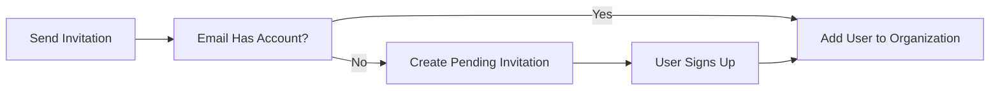
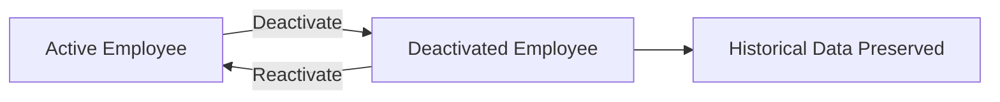
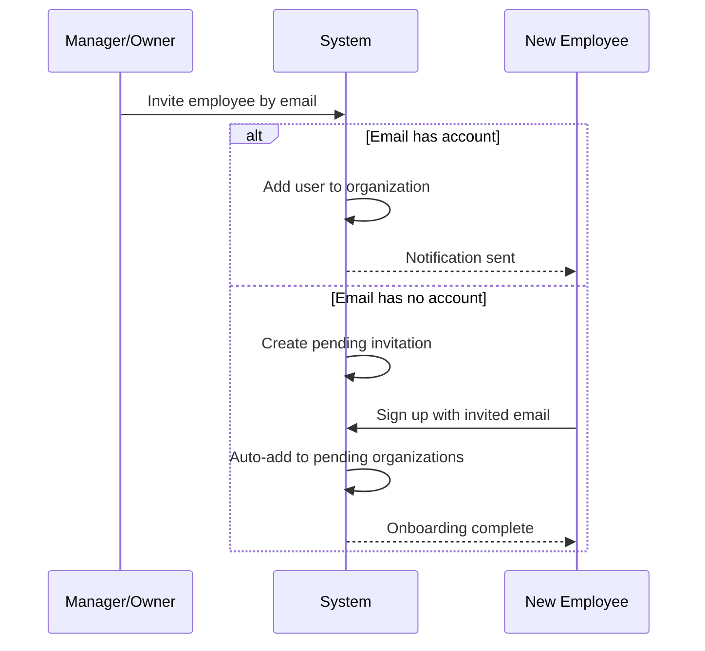
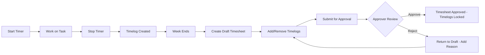
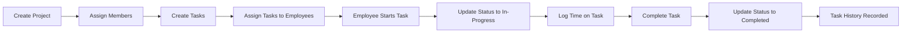

**hrmPlatform — What operations users can perform, use cases, business workflows**

What operations users can perform, use cases, business workflows

# Core Business Operations

What the system must do for each business concept.

## Organization Operations

Users create an organization during their initial sign-up process, establishing their workspace within the multi-tenant platform. Each organization operates independently with its own employees, projects, and data isolated from other organizations. Organization owners can edit organization settings including name, description, logo image, currency, timezone, and fiscal start month. The organization owner has the ability to delete their organization, but only when all pending timesheets are resolved and there are no active employee contracts. When an organization is deleted, all employees, projects, tasks, timelogs, and timesheets are permanently removed from the system. The owner's user account remains active but is no longer associated with any organization. All data is strictly isolated per organization, ensuring employees in one organization cannot see data from another organization. Users who belong to multiple organizations can only access data for their currently selected organization context.

### Organization Creation and Configuration

Users create an organization during their initial sign-up process, establishing their workspace within the multi-tenant platform. During creation, the user provides the organization name and description. The user can optionally upload a logo image for the organization. The user must select a currency for the organization, such as USD, EUR, or KRW. The user must select a timezone for the organization. The user must specify the fiscal start month for the organization. The organization creator becomes the organization owner with full access to all features. All subsequent actions by the user are scoped to the selected organization context.

### Multi-Tenancy and Data Isolation

Each organization operates independently with its own employees, projects, and data isolated from other organizations. All data is strictly isolated per organization, ensuring employees in one organization cannot see data from another organization. Users who belong to multiple organizations can only access data for their currently selected organization context. When logging in, users select which organization to work in. Users can switch between organizations without logging out. All operations and data access are scoped to the currently selected organization. Independent organization operations ensure that actions in one organization do not affect other organizations.

### Organization Settings Management

Organization owners can edit organization settings at any time. Organization owners can update the organization name. Organization owners can update the organization description. Organization owners can update the organization logo image. Organization owners can change the organization currency. Organization owners can change the organization timezone. Organization owners can change the fiscal start month. Only users with organization owner permissions can modify organization settings. Users without owner permissions cannot edit organization settings.

### Organization Deletion

Organization owners can delete their organization. The organization can only be deleted if all pending timesheets are resolved, meaning they are either approved or rejected. The organization can only be deleted if there are no active employee contracts. When the organization is deleted, all employees are permanently deleted from the system. When the organization is deleted, all projects are permanently deleted from the system. When the organization is deleted, all tasks are permanently deleted from the system. When the organization is deleted, all timelogs are permanently deleted from the system. When the organization is deleted, all timesheets are permanently deleted from the system. The owner's user account remains active but is no longer associated with any organization. The owner can continue to use the platform and create or join other organizations.

## User Operations

Users sign up for the platform by providing an email address and creating a password. Users log in with their email and password credentials to access the system. A user can change their password at any time through their account settings. Each user can belong to multiple organizations simultaneously, allowing them to work across different workspaces. When logging in, users select which organization to work in, establishing their organization context for the session. All subsequent actions are scoped to the selected organization, ensuring proper data isolation. Users can switch between organizations without logging out, maintaining their session while changing context. Users can delete their account, but if they are the sole owner of an organization, they must transfer ownership or delete the organization first. When a user deletes their account, their employee records in other organizations are marked as deactivated rather than removed.

### User Registration

Users can register for the platform by providing an email address and creating a password. The email address must be unique across all user accounts. Upon successful registration, the user can create an organization or join existing organizations through invitation. The registration process establishes the user's initial account credentials for future authentication.

### User Authentication

Users can log in to the platform using their email address and password credentials. After successful authentication, users are presented with an organization selection interface to choose which organization to work in. Users can change their password at any time through their account settings. The password change process requires verification of the current password before accepting the new password. All authentication actions are scoped to the user's global account, independent of organization context.

### Multi-Organization Membership

A user can belong to multiple organizations simultaneously. Each organization membership is independent, allowing the user to access different workspaces with separate data and settings. When logging in, users must select which organization to work in, establishing their organization context for the session. Users can accept invitations to join additional organizations without creating new accounts. The user's global profile remains shared across all organizations they belong to.

### Organization Context Management

All user actions are scoped to the selected organization context. Users can switch between organizations without logging out, maintaining their session while changing the active organization. When switching organizations, the system loads the data, settings, and permissions specific to the newly selected organization. The organization context determines which employees, projects, tasks, and timesheets the user can access. Users cannot see or interact with data from organizations they are not currently working in.

### Account Deletion

Users can delete their account from the platform. If the user is the sole owner of an organization, they must transfer ownership to another user or delete the organization before proceeding with account deletion. When a user deletes their account, their employee records in other organizations are marked as deactivated rather than removed. Historical data associated with the user's employee records (such as timelogs and timesheets) is preserved in the organizations where they were employed. The account deletion process is irreversible and removes the user's ability to access any organization.

### User Profile Management

Each user has a global profile containing a display name, avatar image, and phone number. Users can edit their profile information at any time. The profile is shared across all organizations the user belongs to, ensuring consistent identity representation. Profile changes are reflected immediately across all organization contexts. Users can upload or remove their avatar image. The display name is used to identify the user across all organizations and in activity logs.

## Employee Operations

Users with employee management permission can invite new employees to the organization by sending an invitation to their email address. If the invited email already has a user account, that user is immediately added to the organization. If the invited email has no existing account, a pending invitation is created until the user signs up with that email. Each employee record contains a reference to the user account, their role in the organization, department, position, employment type, and status. Users with management permission can edit employee records including department, position, and employment type details. Users with management permission can deactivate employees, preventing them from logging time or submitting timesheets. Deactivated employees retain their historical data including timelogs and timesheets for record-keeping purposes. Deactivated employees can be reactivated to restore their access to time tracking features. Users with view permission can access the employee list with pagination support. Employees can filter the list by department, employment type, and status, or search by name.

### Employee Invitation

Users with employee management permission can invite new employees to the organization by sending an invitation to an email address.

When an invitation is sent to an email address that already has a user account in the system, the existing user is automatically added to the organization as an employee.

When an invitation is sent to an email address without an existing account, a pending invitation is created. The pending invitation remains active until the user signs up with that email address, at which point they are automatically added to the organization.

The system shall validate that the inviting user has employee management permission before processing the invitation.

The system shall check if the invited email already has an account and route accordingly to immediate addition or pending invitation creation.

### Employee Record Management

Each employee record contains the following fields: reference to the user account, role in the organization, department (optional), position or title (optional), employment type, and status.

Employment type classification includes: full-time, part-time, contractor, and intern. The employment type is required for each employee record.

Employee status management includes two states: active and deactivated. The status determines whether the employee can access time tracking features.

Users with employee management permission can edit employee records, including department, position, and employment type details.

The system shall allow users with employee management permission to modify the department field on any employee record.

The system shall allow users with employee management permission to modify the position field on any employee record.

The system shall allow users with employee management permission to change the employment type classification on any employee record.

The system shall validate that the user has employee management permission before allowing edits to employee records.

### Employee Deactivation and Reactivation

Users with employee management permission can deactivate employees in the organization.

When an employee is deactivated, the employee status is changed to deactivated. Deactivated employees cannot log time or submit timesheets.

Deactivated employees retain all historical data including timelogs and timesheets for record-keeping purposes. The historical data remains accessible to users with appropriate view permissions.

Users with employee management permission can reactivate deactivated employees. When reactivated, the employee status is changed to active, restoring their ability to log time and submit timesheets.

The system shall prevent deactivated employees from creating new timelogs.

The system shall prevent deactivated employees from submitting timesheets.

The system shall preserve all historical timelogs and timesheets associated with deactivated employees.

The system shall allow users with employee management permission to change employee status from deactivated to active.

### Employee List Viewing

Users with employee view permission can access the employee list for the organization.

The employee list is paginated to support efficient browsing of large employee populations. The system shall display employees in pages with a defined page size.

Users can filter the employee list by department to view employees in specific departments.

Users can filter the employee list by employment type to view employees with specific employment classifications (full-time, part-time, contractor, intern).

Users can filter the employee list by status to view active or deactivated employees.

Users can search the employee list by name to find specific employees. The search shall match against employee display names.

The system shall validate that the user has employee view permission before displaying the employee list.

The system shall apply all active filters (department, employment type, status) when retrieving the employee list.

The system shall apply the search term filter when retrieving the employee list.

Multiple filters can be combined to narrow down the employee list results.

## Role Operations

Each organization maintains its own set of roles that define what employees can access and do within the system. Three built-in roles exist in every organization: Owner with full access to all features, Manager who can manage employees and projects and approve timesheets, and Employee who can track time and submit timesheets. These built-in roles cannot be deleted from the organization. Organization owners can create custom roles with a specific name and a set of permissions tailored to their needs. Available permissions include organization management, employee management and viewing, project management and viewing, time management and approval, viewing all timelogs, and report viewing. Organization owners can edit custom roles to modify their permission sets. Organization owners can delete custom roles only if no employees are currently assigned to them. Each employee in an organization is assigned exactly one role that determines their access level. Users with employee management permission can change an employee's role assignment.

### Built-in Roles

Every organization has three built-in roles that cannot be deleted: Owner, Manager, and Employee.

The Owner role has full access to all features in the organization, including the ability to manage roles and members, edit organization settings, and perform all operations.

The Manager role can manage employees, manage projects, approve timesheets, and view organization reports.

The Employee role can track time, submit timesheets, and view their own data.

Built-in roles are automatically created when an organization is created and remain in the organization for its entire lifetime.

Users cannot delete built-in roles from the organization.

Users cannot rename built-in roles.

The permissions associated with built-in roles are fixed and cannot be modified.

### Custom Role Creation

Organization owners can create custom roles to define specific access levels for their organization's needs.

When creating a custom role, the user must provide a name for the role.

When creating a custom role, the user must select a set of permissions that define what employees assigned to this role can do.

The custom role is created within the organization and is only available in that organization.

Custom roles are independent of built-in roles and can be tailored to specific workflow requirements.

Each custom role has a unique name within the organization.

The permission set configuration allows organization owners to combine any available permissions to create the desired access level.

### Role Permissions

Each role has a set of permissions that determine what operations employees assigned to that role can perform.

The organization management permission allows users to edit organization settings, create and manage departments, and view the activity log.

The employee manage permission allows users to invite new employees, edit employee records including department and position, deactivate and reactivate employees, and change employee role assignments.

The employee view permission allows users to view the employee list and view details of any employee including their contracts.

The project manage permission allows users to create projects, edit projects, archive or complete projects, delete projects without timelogs, create and edit tasks, and assign employees to projects.

The project view permission allows users to view all projects and tasks in the organization.

The time manage permission allows users to edit or delete any employee's timelogs regardless of timesheet status.

The time approve permission allows users to view all submitted timesheets, approve submitted timesheets, and reject submitted timesheets with a reason.

The time view all permission allows users to view all employees' timelogs and timesheets.

The report view permission allows users to access organization reports including time reports, project budget reports, and weekly summary reports, and view the organization dashboard.

### Edit Custom Roles

Organization owners can edit custom roles to modify their permission sets as organizational needs change.

When editing a custom role, the user can change the role name.

When editing a custom role, the user can add or remove permissions from the role's permission set.

Changes to a custom role's permissions take effect immediately for all employees assigned to that role.

Editing a custom role does not affect employees' ability to perform operations they were previously authorized to do until the change is saved.

Organization owners cannot edit built-in roles; only custom roles can be edited.

### Delete Custom Roles

Organization owners can delete custom roles when they are no longer needed.

A custom role can only be deleted if no employees are currently assigned to that role.

If employees are assigned to the role, the role cannot be deleted until all employees are reassigned to different roles.

Before deleting a custom role, users with employee manage permission must change the role assignment for all employees currently using that role.

Built-in roles cannot be deleted under any circumstances.

When a custom role is deleted, it is permanently removed from the organization and cannot be recovered.

### Employee Role Assignment

Each employee in an organization is assigned exactly one role that determines their access level and permissions.

When an employee is invited to the organization, they are assigned a role as part of the invitation process.

Users with employee manage permission can change an employee's role assignment to a different role.

When an employee's role is changed, their permissions are immediately updated to match the new role.

An employee cannot have multiple roles in the same organization; only one role assignment is allowed at a time.

Role assignment changes are recorded in the activity log for audit purposes.

Employees can view their own role assignment to understand their access level.

## Department Operations

Each organization can create departments to structure their workforce and organize employees. Each department has a name, an optional description, and an optional parent department allowing one level of nesting. Users with organization management permission can create new departments within the organization. Users with organization management permission can edit existing departments to update their name or description. Users with organization management permission can delete departments when they are no longer needed. Deleting a department sets all employees' department field to null without deleting the employee records themselves. All employees in the organization can view the list of departments to understand the organizational structure. Departments provide a way to filter and organize employees for reporting and management purposes. The department hierarchy supports only one level of parent-child relationship for simplicity.

### Department Creation and Structure

Users with organization management permission can create new departments within the organization. Each department requires a name and may include an optional description. When creating a department, users may optionally assign a parent department to establish a hierarchical relationship. The department hierarchy supports only one level of nesting, meaning a department can have a parent department but cannot have a parent that itself has a parent. This one-level hierarchy constraint ensures the organizational structure remains simple and manageable. Departments provide a way to structure the organization and group employees for management and reporting purposes. The department name must be unique within the organization to avoid confusion. All departments belong to exactly one organization and cannot be shared across organizations.

### Department Editing

Users with organization management permission can edit existing departments to update their details. When editing a department, users can modify the department name and description. Users can also change the parent department assignment to reorganize the department hierarchy, subject to the one-level nesting constraint. When a department's parent is changed, the system validates that the new parent does not create a multi-level hierarchy. Users with organization management permission can assign employees to departments by editing employee records. An employee can be assigned to one department at a time. Changing an employee's department assignment updates their organizational grouping immediately. Employees can be moved between departments as organizational needs change.

### Department Deletion

Users with organization management permission can delete departments when they are no longer needed. When a department is deleted, all employees currently assigned to that department have their department assignment removed and set to null. Deleting a department does not delete or deactivate the employee records themselves; employees remain in the organization with their other attributes preserved. The system prevents deletion of a parent department if it would orphan child departments in a way that violates the one-level hierarchy constraint. Before deletion, the system validates that removing the department will not create invalid hierarchical relationships. Historical records referencing the deleted department, such as past employee assignments or activity logs, preserve the department name at the time of the record for audit purposes.

### Department Viewing and Filtering

All employees in the organization can view the list of departments to understand the organizational structure. The department list displays all departments within the organization, showing their names and hierarchical relationships. Users with employee viewing permission can filter the employee list by department to find employees within specific organizational units. When filtering by department, the system includes only employees currently assigned to that department, not employees who were previously assigned. The department list can be used to navigate the organizational hierarchy and identify reporting structures. Employees can see which department they belong to and view other departments in the organization. The department structure supports organizational reporting by enabling grouping of employees by their department assignment.

## Contract Operations

Each employee can have multiple contracts throughout their tenure, maintaining a historical record of their employment terms. Only one contract can be active at any given time for an employee. Each contract contains a required start date, an optional end date where null means ongoing, a required pay rate, a pay period classification, required working hours per week, and optional notes. Users with employee management permission can create new contracts for employees. Creating a new contract automatically ends the previous active contract by setting its end date to the day before the new contract starts. Users with employee management permission can edit the current active contract to update terms. Past contracts become immutable historical records that cannot be edited once superseded. Employees can view their own contracts to understand their employment terms. Users with employee view permission can view any employee's contracts for administrative purposes.

### Contract Structure and Lifecycle

Each employee can have multiple contracts throughout their employment tenure, maintaining a complete historical record of their employment terms. Only one contract can be active at any given time for an employee. Each contract contains a required start date, an optional end date where a null value indicates an ongoing contract with no specified end, a required pay rate expressed as a numeric value, a required pay period classification specifying whether compensation is hourly, daily, weekly, or monthly, required working hours per week indicating the expected weekly commitment, and optional notes for additional terms or conditions. The contract system maintains a historical record where past contracts remain accessible for reference but cannot be modified.

### Contract Creation and Modification

Users with employee management permission can create new contracts for employees. When a new contract is created for an employee who has an existing active contract, the system automatically ends the previous active contract by setting its end date to the day before the new contract's start date. Users with employee management permission can edit the current active contract to update pay rate, pay period, working hours, or notes. Once a contract is superseded by a newer contract, it becomes an immutable historical record that cannot be edited. The start date is required for every contract creation. The pay rate must be provided as a numeric value. The pay period classification must be selected from hourly, daily, weekly, or monthly. Working hours per week must be specified as a positive number.

### Contract Viewing and Access

Employees can view their own contracts to understand their current and historical employment terms. Users with employee view permission can view any employee's contracts within their organization for administrative and reporting purposes. When viewing contracts, users can see the complete contract history for an employee, including all past contracts and the current active contract if one exists. Employees accessing their contracts can see all contracts associated with their employee record across their tenure in the organization.

## Project Operations

Users with project management permission can create new projects within the organization. Each project has a required name, an optional description, a required color code for UI display, a status indicating active archived or completed state, optional budget hours, and optional start and end dates. Users with project management permission can edit projects to update any of these fields. Users with project management permission can archive or complete projects to mark them as no longer active. Archived or completed projects cannot receive new timelogs, but existing timelogs on these projects are preserved. Users with project management permission can delete projects only if the project has no timelogs associated with it. Users with project view permission can view all projects in the organization. The project list supports pagination for large numbers of projects. Projects can be filtered by their status to show only active archived or completed projects.

### Project Creation

Users with project management permission can create new projects within the organization. Each project requires a name and a color code for UI display. The project status is set to active by default and can be active, archived, or completed. An optional description may be provided to explain the project purpose. Budget hours may be set to track the total estimated hours for the project. Optional start and end dates may be defined to indicate the project timeline. The project is automatically associated with the organization where it is created.

### Project Editing

Users with project management permission can edit existing projects to update any project field. The project name, description, color code, status, budget hours, start date, and end date can all be modified. Changes to project details are applied immediately and are visible to all users with project viewing permission.

### Project Archival and Completion

Users with project management permission can archive or complete projects to mark them as no longer active. When a project is archived or completed, it cannot receive new timelogs. Any existing timelogs on archived or completed projects are preserved and remain accessible for reporting purposes. The project status is updated to reflect the archived or completed state.

### Project Deletion

Users with project management permission can delete projects only if the project has no timelogs associated with it. If the project has any timelogs, the deletion request is rejected. This ensures that historical time tracking data is not lost. Projects without timelogs can be permanently deleted from the organization.

### Project Viewing and Listing

Users with project view permission can view all projects in the organization. The project list supports pagination to handle large numbers of projects. Projects can be filtered by their status to show only active, archived, or completed projects. Users can browse the project list to find projects they need to work with or report on.

## ProjectMember Operations

Users with project management permission can assign employees to projects to grant them access. An employee can be assigned to multiple projects simultaneously within the organization. Each project membership defines the employee, the project, and their assigned role as either a member or project lead. Project leads have special privileges to manage tasks within their assigned project. Users with project management permission can remove employees from projects when they are no longer involved. Employees can view which projects they are assigned to understand their workload and responsibilities. Project membership determines which projects an employee can log time against. Only employees who are project members can be assigned to tasks within that project. The project lead role enables task management capabilities for that specific project.

### Project Assignment and Access Control

Users with project management permission can assign employees to projects to grant them access. When assigning an employee to a project, the user selects the employee and specifies their role as either member or project lead. Only employees who belong to the organization can be assigned to projects. An employee must be assigned to a project before they can access project details or log time against it. Project assignment establishes the employee's access rights to the project and its tasks. Users with project management permission can view the list of all project assignments within the organization.

### Multiple Project Memberships

An employee can be assigned to multiple projects simultaneously within the organization. There is no limit to the number of projects an employee can be assigned to. Each project membership is independent and maintains its own role assignment. Employees can view the complete list of projects they are assigned to, providing visibility into their workload across the organization. The system displays all active project memberships for an employee, showing the project name, their role in each project, and the project status. This enables employees to understand their project commitments and prioritize their work accordingly.

### Project Membership Roles

Each project membership assigns the employee a role of either member or project lead. The member role grants standard access to view project details, log time against the project, and work on assigned tasks. The project lead role includes all member privileges plus additional task management capabilities. Project leads can create new tasks within their assigned project, edit existing tasks, and change task status. Project leads can assign tasks to other employees who are members of the same project. Multiple employees can hold the project lead role within a single project. The role assignment determines what operations the employee can perform within the project context.

### Project Membership Operations

Employees can view which projects they are assigned to at any time. Employees can only log time against projects they are assigned to as members or project leads. When creating a timelog, the employee selects from their assigned projects only. Task assignment requires project membership; only employees who are project members can be assigned to tasks within that project. Users with project management permission can remove employees from projects when they are no longer involved. When an employee is removed from a project, they lose access to the project and can no longer log time against it. Existing timelogs and task assignments for the removed employee are preserved for historical record.

## Task Operations

Project leads or users with project management permission can create tasks within their assigned projects. Each task has a required title, an optional description, a status indicating open in-progress completed or closed, a priority level of low medium high or urgent, optional estimated hours, an optional due date, an optional assigned employee who must be a project member, and an optional parent task for subtasks with one level of nesting only. Project leads can edit tasks within their assigned project. Users with project management permission can edit any task across all projects. Task status changes are automatically recorded in the task history for audit purposes. Employees can view tasks in projects they are assigned to based on their membership. Tasks can be filtered by status, priority, and assigned employee for easier navigation. Tasks can be sorted by due date, priority, or creation date to help with planning and prioritization.

### Task Creation

Project leads can create tasks within their assigned project. Users with project management permission can create tasks in any project across the organization.

When creating a task, the title is required. The title must be provided to create the task. If the title is missing, the request is rejected.

The task can optionally include a description providing additional details about the work to be done.

The task must be associated with a project. The employee creating the task must be a project member of that project. If the employee is not a member of the project, the request is rejected.

The task can optionally be assigned to an employee. The assigned employee must be a project member of the project. If the assigned employee is not a project member, the request is rejected.

The task can optionally have a parent task to create a subtask relationship. Subtasks support one level of nesting only. A task can be a subtask of a parent task, but a subtask cannot have its own subtasks. If an attempt is made to create a subtask under an existing subtask, the request is rejected.

The task is created with an initial status of open. The task is created with an initial priority level determined during creation.

### Task Attributes

Each task has a status indicating its current state. The status can be open, in-progress, completed, or closed. The status is set when the task is created and can be changed as work progresses.

Each task has a priority level indicating its importance. The priority can be low, medium, high, or urgent. The priority is set when the task is created and can be changed as needed.

Each task can have optional estimated hours representing the expected effort required to complete the task. The estimated hours is a numeric value. If not provided during creation, the estimated hours remains unset.

Each task can have an optional due date indicating when the task should be completed. The due date is a calendar date. If not provided during creation, the task has no due date.

The task attributes are visible to employees who have access to view the task based on their project membership.

### Task Assignment and Subtasks

Tasks can be assigned to employees during creation or updated later. The assigned employee must be a project member of the project the task belongs to. If an attempt is made to assign the task to an employee who is not a project member, the request is rejected.

A task can be assigned to at most one employee. A task can exist without an assigned employee, indicating it is unassigned and available for any project member to work on.

Tasks support subtasks through a parent task relationship. A task can optionally have a parent task, making it a subtask. This creates a one-level hierarchy where a parent task can have multiple subtasks, but subtasks cannot have their own subtasks.

The parent task relationship is established during task creation or when editing an existing task. The parent task must belong to the same project as the subtask. If an attempt is made to set a parent task from a different project, the request is rejected.

Subtasks inherit the project membership context from their parent task. Employees who can view the parent task can also view its subtasks.

### Task Editing

Project leads can edit tasks within their assigned project. A project lead is an employee with the project lead role in the project membership. Project leads can modify any attribute of tasks in their project, including title, description, status, priority, estimated hours, due date, assigned employee, and parent task relationship.

Users with project management permission can edit any task across all projects in the organization. This includes tasks in projects where they are not a project lead. Users with project management permission have the same editing capabilities as project leads but with organization-wide scope.

When editing a task, any attribute can be updated. The title can be changed to a new value. The description can be added, modified, or cleared. The status can be changed to any valid status value. The priority can be changed to any valid priority level. The estimated hours can be set, updated, or cleared. The due date can be set, updated, or cleared. The assigned employee can be changed to any project member or cleared to unassign the task. The parent task relationship can be set, changed, or cleared.

If the task status is changed during editing, the status change is automatically recorded in the task history. The history entry captures the timestamp, the old status, the new status, and the user who made the change.

Employees who are not project leads and do not have project management permission cannot edit tasks. They can only view tasks in projects they are assigned to.

### Task Status History

When a task status changes, the system automatically records the change in the task history. This occurs whenever the status is modified through task editing or any other operation that changes the status.

Each history entry captures the timestamp of when the status change occurred. The timestamp is recorded in the organization's timezone.

Each history entry records the old status before the change. This allows tracking the progression of the task through different states.

Each history entry records the new status after the change. This shows what state the task transitioned to.

Each history entry records which user made the status change. This provides accountability and audit trail for who modified the task.

Task history entries are immutable once created. They cannot be edited or deleted. This ensures an accurate audit trail of all status changes throughout the task lifecycle.

Employees who can view the task can also view its status history. This allows team members to understand how the task has progressed over time.

### Task Viewing and Navigation

Employees can view tasks in projects they are assigned to. An employee is assigned to a project through project membership. Employees can see all tasks within their assigned projects, including tasks assigned to other team members.

Employees who are not project members cannot view tasks in that project. Task visibility is restricted to project members and users with project view permission or project management permission.

The task list can be filtered by status. Employees can filter to show only tasks with a specific status such as open, in-progress, completed, or closed. Multiple status filters can be applied simultaneously.

The task list can be filtered by priority. Employees can filter to show only tasks with a specific priority level such as low, medium, high, or urgent. Multiple priority filters can be applied simultaneously.

The task list can be filtered by assigned employee. Employees can filter to show only tasks assigned to a specific team member. This helps identify workload distribution and find tasks assigned to particular individuals.

The task list can be sorted by due date. Tasks can be sorted in ascending order to show tasks with the nearest due date first, or in descending order to show tasks with the furthest due date first. Tasks without a due date are handled consistently in the sort order.

The task list can be sorted by priority. Tasks can be sorted by priority level to show the most urgent tasks first or the lowest priority tasks first.

The task list can be sorted by creation date. Tasks can be sorted to show the most recently created tasks first or the oldest tasks first.

Multiple sort criteria can be applied together. For example, tasks can be sorted by priority first, then by due date within each priority level.

## TaskHistory Operations

The system automatically records task status changes as task history entries for audit and tracking purposes. Each task history entry captures the timestamp when the change occurred, the old status before the change, the new status after the change, and which user made the change. Task history entries are created automatically whenever a task status is modified by any user. These history entries form an immutable audit trail that cannot be edited or deleted. Users can view the task history to understand how a task has progressed over time. The history provides transparency into who made status changes and when they occurred. Task history supports accountability and helps teams understand the lifecycle of tasks. The recorded information includes all status transitions from open through in-progress to completed or closed.

### Automatic Task History Creation

The system automatically creates a task history entry whenever a task status is changed by any user. This automatic recording ensures that all task status changes are captured without requiring manual intervention. The history creation occurs at the moment the status transition is applied to the task. Every status change from open to in-progress, in-progress to completed, or any other valid transition triggers the creation of a new history entry. This automatic mechanism guarantees complete documentation of the task lifecycle from creation through all subsequent status changes.

### Task History Entry Details

Each task history entry records the timestamp when the status change occurred, capturing the exact date and time of the transition. The entry stores the old status that the task had before the change and the new status that the task has after the change. The system also records which user made the change, attributing the action to the specific user account that performed the status update. This information provides a complete record of what changed, when it changed, and who initiated the change. The timestamp, old status, new status, and user attribution are all required fields for every history entry.

### Immutable Audit Trail

Task history entries form an immutable audit trail that cannot be edited or deleted once created. No user, including organization owners and users with project management permissions, can modify the content of a history entry after it has been recorded. The history cannot be deleted to preserve the complete audit record for accountability and transparency purposes. This immutability ensures that the historical record remains accurate and trustworthy for audit purposes. The system maintains the integrity of the task change log by preventing any alterations to recorded history entries.

### View Task History

Users can view the task history to understand how a task has progressed over time. The history display shows all status transitions in chronological order, providing task progression tracking from the initial status through all subsequent changes. Users with access to the task can review the status transition record to see the complete sequence of status changes. This visibility supports accountability and transparency by showing who made each change and when it occurred. The task lifecycle documentation helps teams understand the full history of task evolution. The task change log serves as a reference for reviewing past decisions and tracking task movement through different workflow stages.

## Timelog Operations

Employees can log time entries called timelogs to record their work on projects and tasks. Each timelog contains a required date, required duration in minutes, a required project that the employee must be assigned to, an optional task that must belong to the selected project, an optional description of what was done, and a billable flag that defaults to true. Employees can only create timelogs for themselves, not for other employees. Employees can edit their own timelogs only if the timelog is not part of an approved timesheet. Employees can delete their own timelogs only if the timelog is not part of any submitted or approved timesheet. Users with time management permission can edit or delete any employee's timelogs regardless of timesheet status. Users with time view all permission can view all employees' timelogs across the organization. Employees can view their own timelogs to track their work history. Timelogs are paginated and can be filtered by date range, project, task, and billable status.

### Timelog Creation

Employees can log time entries to record their work on projects and tasks. Each timelog requires a date indicating when the work was performed. Each timelog requires a duration specified in minutes. Each timelog requires a project, and the employee must be assigned to that project. Each timelog may optionally include a task, and if provided, the task must belong to the selected project. Each timelog may optionally include a description of what was done. Each timelog includes a billable flag that defaults to true, indicating whether the time is billable to the client.

### Employee Timelog Self-Management

Employees can only create timelogs for themselves, not for other employees. Employees can edit their own timelogs only if the timelog is not part of an approved timesheet. If a timelog is included in an approved timesheet, the employee cannot edit it. Employees can delete their own timelogs only if the timelog is not part of any submitted or approved timesheet. If a timelog is included in a submitted timesheet, the employee cannot delete it. If a timelog is included in an approved timesheet, the employee cannot delete it.

### Administrative Timelog Access

Users with time management permission can edit any employee's timelogs regardless of timesheet status. Users with time management permission can delete any employee's timelogs regardless of timesheet status. Users with time view all permission can view all employees' timelogs across the organization. Employees can view their own timelogs to track their work history. The timelog list is paginated. Timelogs can be filtered by date range, project, task, and billable status.

## Timesheet Operations

A timesheet is a collection of timelogs grouped for a specific week running from Monday to Sunday. Employees can create a draft timesheet for a specific week, which automatically includes all their timelogs for that week. Employees can add or remove timelogs from a draft timesheet before submission. Employees can submit a draft timesheet for approval, but cannot submit if it has no timelogs or if another timesheet for the same week is already submitted or approved. Each timesheet tracks the employee owner, week start and end dates, status as draft submitted approved or rejected, total hours calculated from timelogs, submission timestamp, review timestamp, reviewer identity, and rejection reason when applicable. Users with time approval permission can view all submitted timesheets awaiting review. Users with time approval permission can approve submitted timesheets, which locks all included timelogs from editing or deletion. Users with time approval permission can reject submitted timesheets with a required reason, returning them to draft status. Employees can view their own timesheets to track submission and approval status. Timesheets are paginated and can be filtered by status and date range.

### Timesheet Week Structure

Each timesheet covers a specific week running from Monday to Sunday. The week start date is always a Monday and the week end date is always the following Sunday. When creating a timesheet, the employee selects the week by specifying the week start date, and the system automatically calculates the week end date as six days later. All timelogs included in a timesheet must fall within the week's date range.

### Create Draft Timesheet

Employees can create a draft timesheet for a specific week. When an employee creates a draft timesheet, the system automatically includes all timelogs belonging to that employee for the selected week. The draft timesheet is owned by the employee who created it. The system calculates the total hours from all included timelogs and displays this on the timesheet. An employee can only have one draft timesheet per week.

### Modify Draft Timesheet

Employees can add timelogs to a draft timesheet. Employees can remove timelogs from a draft timesheet. When timelogs are added or removed, the system recalculates the total hours. Employees can only modify timelogs in their own draft timesheets. Once a timesheet is submitted, timelogs can no longer be added or removed.

### Submit Timesheet for Approval

Employees can submit a draft timesheet for approval. A timesheet cannot be submitted if it contains no timelogs. A timesheet cannot be submitted if another timesheet for the same week already exists with status submitted or approved. When submitted, the system records the submission timestamp. After submission, the timesheet status changes from draft to submitted and the employee can no longer modify the timesheet or its timelogs.

### Timesheet Status Lifecycle

Each timesheet has a status that is one of: draft, submitted, approved, or rejected. A newly created timesheet starts in draft status. When submitted for approval, the status changes to submitted. When approved by a reviewer, the status changes to approved. When rejected by a reviewer, the status changes to rejected and the timesheet returns to draft status, allowing the employee to modify and resubmit. Only rejected timesheets can return to draft status.

### Approve Timesheet

Users with time approve permission can view all submitted timesheets awaiting review. Users with time approve permission can approve submitted timesheets. When a timesheet is approved, the system records the review timestamp and the identity of the reviewer. Approving a timesheet locks all timelogs included in that timesheet, preventing any edits or deletions to those timelogs. The total hours displayed on the timesheet are calculated from the included timelogs and shown to the reviewer during approval.

### Reject Timesheet

Users with time approve permission can reject submitted timesheets. When rejecting a timesheet, the reviewer must provide a rejection reason explaining why the timesheet was rejected. The rejection reason is required and cannot be empty. When a timesheet is rejected, the system records the review timestamp, the identity of the reviewer, and the rejection reason. The timesheet status changes from submitted to rejected and then returns to draft status, allowing the employee to address the issues and resubmit.

### View and Filter Timesheets

Employees can view their own timesheets to track submission and approval status. The timesheet list is paginated to handle large volumes of historical data. Employees and users with time approve permission can filter the timesheet list by status to find timesheets in draft, submitted, approved, or rejected state. The timesheet list can be filtered by date range to view timesheets for specific periods. Users with time approve permission can view all timesheets across the organization, while employees can only view their own timesheets.

## Timer Operations

Employees can start a timer to track time in real-time as they work on projects. Each employee can have at most one active timer at any given time, preventing overlapping time tracking. Starting a timer requires selecting a project, with task selection being optional. The timer records the start timestamp, selected project, optional task, and an optional description. Employees can stop their timer at any time to end the tracking session. Stopping the timer automatically creates a timelog with the calculated duration rounded to the nearest minute. Employees can discard their timer without creating a timelog if they started it by mistake. Employees can view their currently running timer to see elapsed time and details. If an employee forgets to stop their timer, it continues running indefinitely with no automatic stop feature. Employees can edit the description, project, and task of a running timer to correct or update details.

### Starting a Timer

Employees can start a timer to track time in real-time as they work. Starting a timer requires selecting a project that the employee is assigned to. Task selection is optional when starting a timer. If a task is selected, it must belong to the selected project. The system records the start timestamp when the timer begins. Employees can optionally provide a description when starting a timer to note what work is being performed. If an employee attempts to start a new timer while another timer is already running, the previous timer must be stopped first.

### Active Timer Constraints

Each employee can have at most one active timer at any given time. This prevents overlapping time tracking sessions for the same employee. If an employee tries to start a timer while one is already running, the request is rejected. The timer continues running indefinitely until the employee manually stops or discards it. There is no automatic timer stop feature. If an employee forgets to stop their timer, it remains active and continues tracking time.

### Stopping a Timer

Employees can stop their running timer at any time to end the tracking session. When a timer is stopped, the system automatically creates a timelog entry. The timelog includes the date from the timer's start timestamp, the duration calculated from start to stop time, the project from the timer, the optional task from the timer, and the optional description from the timer. The duration is rounded to the nearest minute when creating the timelog. The billable flag on the created timelog defaults to true.

### Discarding a Timer

Employees can discard their running timer if they started it by mistake or no longer need to track time. Discarding a timer ends the tracking session without creating a timelog entry. No time data is saved when a timer is discarded. The employee can immediately start a new timer after discarding the current one.

### Viewing and Editing Running Timer

Employees can view their currently running timer to see elapsed time and timer details. The view displays the start timestamp, the selected project, the optional task, the optional description, and the elapsed time since the timer started. Employees can edit the description of a running timer to update or correct work notes. Employees can update the project on a running timer to a different project they are assigned to. Employees can update the task on a running timer to a different task within the selected project. Task updates are only allowed if the new task belongs to the current project. All edits to a running timer take effect immediately and do not create any timelog entries.

## ActivityLog Operations

The system automatically records significant actions as activity log entries for audit and compliance purposes. Each activity log entry captures the timestamp of the action, the user who performed it, the action type, the target entity affected, and relevant details about what occurred. Logged actions include employee invitations deactivations and reactivations, contract creation and edits, project creation archiving completion and deletion, task status changes, timesheet submissions approvals and rejections, and role assignments or changes. Activity log entries are created automatically by the system when these actions occur. Users with organization management permission can view the full activity log to audit organizational changes. The activity log is paginated to handle large volumes of recorded actions. The log can be filtered by action type, user who performed the action, and date range for targeted auditing. Activity log entries cannot be edited or deleted to maintain an accurate audit trail.

### Activity Log Entry Creation

The system automatically records significant actions as activity log entries without requiring manual intervention. Each activity log entry is created at the moment the action occurs and includes the timestamp of when the action was performed. The system captures which user performed the action, linking the entry to the user account that initiated the change. Each entry includes an action type classification that categorizes the nature of the action performed. The system tracks the target entity affected by the action, recording which business object was modified. Activity log entries may include additional details providing context about what occurred during the action. The automatic log creation ensures no significant organizational changes go unrecorded.

### Logged Action Types

The system records employee-related actions including when an employee is invited to the organization, when an employee is deactivated, and when a deactivated employee is reactivated. Contract-related actions are logged when a contract is created for an employee or when an existing contract is edited. Project-related actions are captured when a project is created, when a project is archived, when a project is completed, and when a project is deleted. Task status changes are recorded, capturing each transition in task workflow. Timesheet lifecycle actions are logged including when a timesheet is submitted, when a timesheet is approved, and when a timesheet is rejected. Role assignment changes are recorded when a role is assigned to an employee or when an employee's role is changed within the organization.

### Activity Log Viewing

Users with organization management permission can view the full activity log to audit organizational changes and track historical actions. The activity log displays entries in a paginated format to handle large volumes of recorded actions efficiently. Users can filter the activity log by action type to focus on specific categories of actions. Users can filter the activity log by the user who performed the action to track individual user activity. Users can filter the activity log by date range to review actions within specific time periods. Multiple filters can be combined to narrow down results for targeted auditing purposes.

### Audit Trail Integrity

Activity log entries cannot be edited after creation to maintain an accurate and trustworthy audit trail. Activity log entries cannot be deleted from the system, ensuring the audit trail remains complete and unbroken. The system preserves all activity log entries indefinitely to support compliance and historical auditing requirements. The immutable nature of log entries ensures that the audit trail maintenance provides a reliable record of all organizational changes.

# Error Scenarios and Edge Cases

Business-level error scenarios, edge case coverage, and expected system behaviors for exceptional conditions.

## Organization Error Scenarios

Organization deletion is blocked when pending timesheets exist that have not been approved or rejected. The system prevents organization deletion if any employee has an active contract that has not ended. Organization owners must transfer ownership to another user before deleting their own account if they are the sole owner. When attempting to delete an organization with active employees, the system requires all contracts to be ended first. Multi-tenancy isolation ensures users cannot access data from organizations they do not belong to. Organization settings edits are restricted to users with organization management permissions. The system validates that organization names are provided during creation. Currency and timezone settings must be valid values from supported options. Fiscal start month must be a valid month between January and December. Logo images must meet size and format requirements if provided.

### Organization Deletion Constraints

The system prevents organization deletion when any timesheet for that organization has a status of submitted and has not yet been approved or rejected. Organization owners must resolve all pending timesheets by approving or rejecting them before the organization can be deleted. The system blocks organization deletion if any employee in the organization has a contract with no end date, indicating an active employment relationship. All active contracts must be ended with a valid end date before the organization can be deleted. When attempting to delete an organization, the system checks for both pending timesheets and active contracts, and displays all blocking conditions to the owner. The organization deletion process is halted until all pending timesheets are resolved and all active contracts are terminated.

### Owner Account and Ownership Transfer

When a user who is the sole owner of an organization attempts to delete their account, the system blocks the deletion request. The user must first transfer ownership of the organization to another user or delete the entire organization before their account can be deleted. Ownership transfer requires designating another user within the organization who will assume the owner role. The system validates that the designated new owner is an active employee in the organization before completing the transfer. If the user owns multiple organizations, they must transfer ownership or delete each organization before their account deletion can proceed. The system prevents account deletion until all ownership responsibilities are resolved.

### Organization Settings Validation

When creating a new organization, the system requires a name to be provided. Organization creation fails if the name field is empty or contains only whitespace. The currency setting must be a valid currency code from the supported options. Invalid currency codes are rejected during organization creation and settings updates. The timezone setting must be a valid timezone identifier from the supported options. Invalid timezone values are rejected. The fiscal start month must be a valid month value between January and December. Invalid month values are rejected. If a logo image is provided, it must meet the system's size and format requirements. Logo images that exceed size limits or use unsupported formats are rejected. All organization settings validations are performed before any changes are saved.

### Multi-Tenancy and Access Control

The system enforces strict data isolation between organizations. Users can only access data belonging to organizations they are members of. When a user attempts to access data from an organization they do not belong to, the system denies access and returns an error. Organization settings can only be edited by users with organization management permissions. Users without the appropriate permissions are blocked from modifying organization settings. When a user belongs to multiple organizations, they must select an organization context upon login. All actions are scoped to the selected organization. The system prevents any cross-organization data access, ensuring that employees in one organization cannot view, modify, or delete data from another organization. Attempting to access resources across organizational boundaries results in an access denied error.

## User Error Scenarios

User account deletion is blocked when the user is the sole owner of any organization. Users must transfer organization ownership or delete the organization before account deletion. Login attempts with invalid email or password combinations are rejected with generic error messages. Password changes require the current password to be verified before accepting a new password. Users cannot access organization data without first selecting an organization context after login. Organization switching is only allowed for organizations the user belongs to. Email addresses must be unique across all user accounts during sign-up. Password requirements must be met during account creation and password changes. Users belonging to multiple organizations must explicitly select which organization to work in. Profile edits are restricted to the user's own global profile information.

### Account Deletion Restrictions

Users can delete their account only if they are not the sole owner of any organization. When a user attempts to delete their account while being the sole owner of an organization, the request is rejected. Before account deletion, users who own organizations must either transfer ownership to another user or delete the organization entirely. If the user is the sole owner of multiple organizations, all organizations must have ownership transferred or be deleted before the account can be deleted. Users who belong to other organizations as employees (not owners) can delete their account, and their employee records in those organizations are marked as deactivated.

### Authentication Failures and Validation

Users can log in with their email and password. Login attempts with invalid email or password combinations are rejected with generic error messages that do not reveal whether the email exists or the password is incorrect. Users can change their password, but the system requires verification of the current password before accepting a new password. If the current password provided during a password change request does not match, the request is rejected. During account creation, if the email address already exists in the system, the sign-up request is rejected. Password requirements must be met during both account creation and password changes. If the password does not meet the requirements, the request is rejected with an error message indicating the password criteria.

### Organization Context Errors

After successful login, users must select an organization context before accessing any organization data. Users cannot access organization data without first selecting which organization to work in. Users who belong to multiple organizations must explicitly select which organization to work in during each login session. Users can switch between organizations they belong to without logging out. When a user attempts to switch to an organization they do not belong to, the request is rejected. Organization membership is verified before allowing access to any organization-scoped data or operations. All user actions after organization selection are scoped to the selected organization only.

### Profile Access Control

Users can edit their own global profile information including display name, avatar image, and phone number. Profile edits are restricted to the user's own global profile. Users cannot edit another user's profile information. Each user has access only to their own profile data for editing. The global profile is shared across all organizations the user belongs to, but profile editing permissions are limited to the profile owner. Attempts to access or modify another user's profile are rejected.

## Employee Error Scenarios

Employee invitations sent to existing users automatically add them to the organization without creating pending invitations. Invitations to non-existent emails create pending invitations that activate upon sign-up. Deactivating employees with submitted but unapproved timesheets requires manager review first. Deactivated employees cannot log time or submit new timesheets but retain historical data access. Reactivating employees restores their ability to log time and submit timesheets. Employee searches with no matching results return empty lists without errors. Filtering by department, employment type, or status handles null values gracefully. Department assignment changes preserve historical department associations in past records. Employment type changes require valid values from the supported options. Users without employee management permissions cannot create or edit employee records.

### Employee Invitation Error Handling

When an invitation is sent to an email address that already has a user account, the system automatically adds the existing user to the organization without creating a pending invitation. The invited user receives notification of their organization membership.

When an invitation is sent to an email address without an existing account, a pending invitation is created. The pending invitation remains active until the user signs up with that email address. Upon successful sign-up, the pending invitation is automatically activated and the user is added to the organization with the assigned role.

If a pending invitation exists and the user attempts to sign up with a different email address, the pending invitation remains unclaimed and the user is not added to the organization. The user must sign up with the exact email address from the invitation to claim the pending invitation.

Multiple pending invitations to the same email address for the same organization are not allowed. If a new invitation is sent to an email with an existing pending invitation, the previous pending invitation is replaced.

### Employee Deactivation Constraints

When attempting to deactivate an employee who has submitted timesheets that are pending approval, the system requires manager review before deactivation can proceed. The pending timesheets must be either approved or rejected before the employee can be deactivated.

Deactivated employees cannot log new time entries. Any attempt by a deactivated employee to create a timelog is rejected with an error indicating the employee status does not permit time logging.

Deactivated employees cannot submit new timesheets. Any attempt by a deactivated employee to submit a timesheet is rejected with an error indicating the employee status does not permit timesheet submission.

When an employee is deactivated, all historical data including past timelogs, timesheets, and task assignments are preserved and remain accessible to users with appropriate viewing permissions. The historical records maintain the employee's name and role at the time of the recorded activities.

An employee can only be deactivated if their status is currently active. Attempting to deactivate an already deactivated employee results in an error indicating the employee is already in deactivated status.

An employee cannot be deactivated if they are the only active employee with organization management permissions. At least one active employee with organization management permissions must remain.

### Employee Reactivation Process

When a deactivated employee is reactivated, their status changes from deactivated to active. The reactivation restores the employee's ability to log time entries and submit timesheets.

Upon reactivation, the employee regains all permissions associated with their assigned role. The employee can access projects they were previously assigned to, unless those assignments were explicitly removed during deactivation.

Reactivated employees can view their historical timelogs and timesheets that were created before deactivation. The historical data remains intact and unmodified.

If the employee's role was changed during deactivation, the reactivated employee operates under the new role permissions. If the role assignment was not changed, the employee retains their original role and permissions.

Reactivation does not automatically restore project assignments that may have been removed. Project leads or users with project management permissions must reassign the employee to projects as needed.

### Employee Search and Filter Edge Cases

When an employee search is performed with a search term that matches no employees by name, the system returns an empty list without displaying an error. The pagination controls indicate zero results found.

When filtering employees by department and the department filter value is null or empty, the system includes all employees regardless of department assignment. Employees without a department assignment are included in the unfiltered results.

When filtering by employment type, only employees matching the selected employment type are returned. If no employees match the selected employment type, an empty list is returned without error.

When filtering by status, only employees matching the selected status (active or deactivated) are returned. If no employees match the selected status, an empty list is returned without error.

When multiple filters are applied (department, employment type, and status), only employees matching all criteria are returned. If the combination of filters matches no employees, an empty list is returned.

Employee list pagination handles edge cases where the total number of employees is less than the page size by displaying all employees on a single page. When the employee list is empty, the pagination controls indicate page 1 of 1 with zero items.

### Employee Data Validation Errors

When creating or updating an employee record, the employment type must be one of the valid values: full-time, part-time, contractor, or intern. Any other value is rejected with an error indicating the employment type is invalid.

If the employment type field is left empty during employee creation, the request is rejected with an error indicating the employment type is required.

When updating an employee's employment type, the new value must be different from the current value. Attempting to set the employment type to the same value it already has is accepted but results in no change.

Changes to employment type are recorded in the activity log with the old value, new value, timestamp, and the user who made the change.

Employment type changes do not affect existing contracts. The contract pay period and the employee employment type are independent fields that do not require alignment.

### Employee Management Permission Errors

Users without the employee management permission cannot create new employee records. Any attempt to invite employees or add employees to the organization is rejected with an error indicating insufficient permissions.

Users without the employee management permission cannot edit employee records. Any attempt to modify employee department, position, employment type, or status is rejected with an error indicating insufficient permissions.

Users without the employee management permission cannot deactivate employees. Any attempt to change an employee's status to deactivated is rejected with an error indicating insufficient permissions.

Users without the employee management permission cannot reactivate employees. Any attempt to change an employee's status from deactivated to active is rejected with an error indicating insufficient permissions.

Users without the employee management permission cannot assign or change employee roles. Any attempt to modify an employee's role assignment is rejected with an error indicating insufficient permissions.

When a user's employee management permission is revoked, any in-progress employee management actions are not automatically rolled back. Completed actions remain valid, but the user cannot perform new employee management actions.

## Role Error Scenarios

Built-in roles including Owner, Manager, and Employee cannot be deleted under any circumstances. Custom roles with assigned employees cannot be deleted until all employees are reassigned. Role edits require valid permission sets from the available permissions list. Role assignment changes require users with employee management permissions. Attempting to assign invalid permissions to custom roles is rejected. Each employee must have exactly one role assigned within an organization. Role names must be unique within an organization to prevent confusion. Removing the last user with Owner role is prevented to maintain organization governance. Permission inheritance between roles is not supported and causes validation errors. Custom role creation requires at least one permission to be selected.

### Built-in Role Protection

Built-in roles including Owner, Manager, and Employee cannot be deleted under any circumstances. Attempting to delete a built-in role is rejected by the system. The system prevents removal of the last user with Owner role to maintain organization governance. If an organization has only one Owner, that Owner cannot be reassigned to a different role or removed from the organization. Attempting to remove the last Owner is rejected. Organization owners can edit custom roles but cannot modify built-in role definitions or permissions.

### Custom Role Deletion Constraints

Custom roles with assigned employees cannot be deleted until all employees are reassigned to a different role. Attempting to delete a custom role that has employees assigned to it is rejected. Before deleting a custom role, all employees assigned to that role must be reassigned to another role. The system enforces that each employee must have exactly one role assigned within an organization. Attempting to assign zero roles or multiple roles to an employee is rejected. Role assignment changes require users with employee management permissions.

### Role Creation and Edit Validation

Custom role creation requires at least one permission to be selected. Attempting to create a custom role with no permissions is rejected. Role edits require valid permission sets from the available permissions list. Attempting to assign invalid permissions to custom roles is rejected. Permission inheritance between roles is not supported. Attempting to configure permission inheritance causes validation errors. Each custom role has a name and a set of permissions. Role name uniqueness is validated within an organization to prevent confusion. Duplicate role names within the same organization are rejected.

### Role Assignment Rules

Role assignment changes require users with employee management permissions. Users without employee management permissions cannot assign or change employee roles. Roles are scoped to their organization and cannot be shared across organizations. Attempting to assign a role from a different organization is rejected. Each employee in an organization is assigned exactly one role. Attempting to assign multiple roles to an employee is rejected. Role names must be unique within an organization. Duplicate role name attempts are rejected during role creation or edit. Employee role assignment conflicts are prevented by validating the target role exists and is available for assignment.

## Department Error Scenarios

Department deletion sets all assigned employees' department to null without deleting employee records. Departments support only one level of nesting with parent departments. Creating departments with more than one level of parent nesting is rejected. Department names must be unique within an organization. Deleting parent departments does not cascade delete child departments. Department edits require organization management permissions. Empty department descriptions are allowed and treated as null values. Department lists return all departments including those without assigned employees. Moving departments to create deeper nesting hierarchies is not permitted. Department deletion does not affect historical records referencing the department.

### Department Deletion and Employee Reassignment

### Department Deletion and Employee Reassignment

WHEN a department is deleted, THEN the system SHALL set all assigned employees' department to null without deleting employee records.

WHEN a parent department is deleted, THEN the system SHALL NOT cascade delete child departments.

WHEN a department is deleted, THEN the system SHALL preserve all historical records that reference the deleted department.

IF a department has assigned employees and is deleted, THEN the system SHALL reassign all employees' department to null.

IF a user attempts to delete a department without organization management permission, THEN the request SHALL be rejected.

WHEN a department is deleted, THEN the system SHALL NOT affect timesheets, timelogs, or contracts that reference employees from the deleted department.

### Department Nesting Constraints

### Department Nesting Constraints

WHEN a department is created or edited with a parent department, THEN the system SHALL enforce one level of nesting only.

IF a user attempts to set a parent department that already has a parent department, THEN the request SHALL be rejected.

IF a user attempts to create a nesting hierarchy deeper than one level, THEN the system SHALL reject the request.

IF a user attempts to set a department as its own parent, THEN the request SHALL be rejected.

WHEN validating parent department nesting, THEN the system SHALL check that the parent department does not already have a parent.

IF a user attempts to move a department to create a deeper nesting hierarchy, THEN the system SHALL reject the move operation.

### Department Creation and Edit Validation

### Department Creation and Edit Validation

WHEN a department is created, THEN the system SHALL validate that the department name is unique within the organization.

IF a user attempts to create a department with a name that already exists in the organization, THEN the request SHALL be rejected.

WHEN a department is created or edited, THEN the system SHALL require organization management permission.

IF a user attempts to create or edit a department without organization management permission, THEN the request SHALL be rejected.

WHEN a department is created, THEN the system SHALL allow empty or null department descriptions.

IF a department description is empty or null, THEN the system SHALL treat it as a valid null value.

WHEN a department is created, THEN the system SHALL validate that the department belongs to the current organization scope.

IF a user attempts to create a department in a different organization, THEN the request SHALL be rejected due to organization scope isolation.

WHEN a department is created, THEN the system SHALL validate that the name is provided and not empty.

### Department List and Display Behavior

### Department List and Display Behavior

WHEN the department list is requested, THEN the system SHALL return all departments including those without assigned employees.

IF a department has no assigned employees, THEN the system SHALL still include it in the department list.

WHEN displaying the department list, THEN the system SHALL NOT filter out empty departments.

IF a user has employee view permission, THEN the system SHALL allow them to view the list of departments.

## Contract Error Scenarios

Only one contract can be active per employee at any given time. Creating a new contract automatically ends the previous active contract by setting its end date. Past contracts are immutable and cannot be edited after becoming inactive. Contract start dates are required and must be valid dates. Contract end dates are optional with null indicating ongoing employment. Pay rates are required numeric values and must be positive. Pay periods must be one of the supported values: hourly, daily, weekly, or monthly. Working hours per week are required and must be positive numbers. Creating contracts with end dates before start dates is rejected. Employees can view their own contracts but cannot edit them.

### Contract Creation Validation Errors

Contract creation requests are rejected when the start date is missing or invalid. The start date must be a valid calendar date and is required for all contracts.

Contract creation requests are rejected when the end date is provided and occurs before the start date. The end date is optional, and when not provided, the contract is treated as ongoing with no end date.

Contract creation requests are rejected when the pay rate is zero, negative, or not a valid number. The pay rate must be a positive numeric value.

Contract creation requests are rejected when the pay period is not one of the supported values: hourly, daily, weekly, or monthly. Invalid pay period values are not accepted.

Contract creation requests are rejected when the working hours per week is zero, negative, or not provided. Working hours per week is required and must be a positive number.

Contract creation requests are rejected when the pay rate currency does not match the organization's configured currency. All contracts within an organization must use the organization's currency setting.

### Active Contract Conflict Errors

When a new contract is created for an employee who already has an active contract, the system automatically ends the previous active contract by setting its end date to the day before the new contract's start date. This ensures only one contract is active at any time.

Requests to edit a contract that is no longer active are rejected. Only the current active contract for an employee can be edited. Past contracts are immutable historical records and cannot be modified after they become inactive.

Requests to delete any contract are rejected. Contracts cannot be deleted once created, as they serve as historical employment records. Deactivated employees retain their contract history.

### Contract Access Control Errors

Contract creation requests from users without the employee management permission are rejected. Only users with the employee management permission can create contracts for employees.

Contract edit requests from users without the employee management permission are rejected. Only users with the employee management permission can edit the active contract for an employee.

Contract edit requests for a past or inactive contract are rejected. Only the current active contract can be edited, regardless of the user's permission level.

Employees can view their own contracts but cannot create or edit any contracts. Contract creation and editing are restricted to users with employee management permission.

Users with only employee view permission can view any employee's contracts but cannot create or edit contracts. Contract modification requires employee management permission.

## Project Error Scenarios

Projects with existing timelogs cannot be deleted to preserve historical time data. Archived or completed projects reject new timelog entries but preserve existing timelogs. Project names are required and cannot be empty strings. Color codes are required for all projects for UI display consistency. Project status changes to archived or completed prevent further time tracking. Budget hours are optional but when set must be positive values. Project start and end dates are optional with no validation between them. Deleting projects without timelogs is allowed with project management permissions. Project edits require project management permissions. Project filtering by status handles all valid status values correctly.

### Project Creation Validation

Projects require a name and cannot be created with an empty or missing name. If the name is not provided, the request is rejected.

Projects require a color code for UI display. If the color code is not provided, the request is rejected.

Budget hours are optional when creating a project. When budget hours are provided, they must be a positive value. If budget hours are zero or negative, the request is rejected.

Project start date and end date are optional. No validation is enforced between start date and end date — the end date may be earlier than the start date, and both dates may be set independently. Either date may be omitted without affecting the other.

### Project Status and Timelog Restrictions

When a project status is changed to archived, no new timelogs can be created for that project. If an employee attempts to log time to an archived project, the request is rejected.

When a project status is changed to completed, no new timelogs can be created for that project. If an employee attempts to log time to a completed project, the request is rejected.

When a project status changes from active to archived or completed, all existing timelogs on that project are preserved and remain accessible for viewing and reporting.

Archived projects are inactive projects that are not currently being worked on but may be reactivated. Completed projects are finished projects that will not be reactivated. Both statuses prevent new timelogs but preserve historical data.

Timelogs created before the status change remain editable according to timesheet approval rules, regardless of the project's current status.

### Project Deletion Constraints

Projects that have one or more timelogs associated with them cannot be deleted. If a deletion is attempted on a project with existing timelogs, the request is rejected.

Before deleting a project, the system checks whether any timelogs exist for that project. This check includes all timelogs from all employees who logged time to the project.

Projects without any timelogs can be deleted by users with project management permissions. The deletion permanently removes the project and all associated tasks and project memberships.

Historical timelog data is preserved by preventing project deletion when timelogs exist. This ensures time tracking records remain intact for reporting and auditing purposes.

If a project must be removed but has timelogs, the project should be archived instead of deleted. Archiving preserves the project and its timelogs while preventing new time entries.

### Project Permission Enforcement

Editing project details requires project management permissions. If a user without project management permissions attempts to edit a project, the request is rejected.

Creating projects requires project management permissions. If a user without project management permissions attempts to create a project, the request is rejected.

Archiving or completing a project requires project management permissions. If a user without project management permissions attempts to change project status to archived or completed, the request is rejected.

Deleting a project requires project management permissions. If a user without project management permissions attempts to delete a project, the request is rejected.

Project leads can manage tasks within their assigned projects but cannot edit project details, change project status, or delete the project itself.

The project list can be filtered by status. All valid status values (active, archived, completed) are accepted in the filter. If an invalid status value is provided in the filter, the request is rejected.

## ProjectMember Error Scenarios

Only employees within the organization can be assigned to projects. Employees can be assigned to multiple projects simultaneously without conflict. Project membership roles must be either member or project-lead. Removing the only project-lead from a project requires assigning a new lead first. Duplicate project memberships for the same employee and project are prevented. Employees assigned to projects can view project details and tasks. Removing employees from projects does not delete their historical task assignments. Project members must be active employees to receive new task assignments. Project lead role changes require project management permissions. Employees cannot be assigned to archived or completed projects for new work.

### Project Assignment Validation

IF an employee does not belong to the organization, THEN the system SHALL reject the project assignment request.

IF the employee status is deactivated, THEN the system SHALL reject the project assignment request.

IF the project status is archived, THEN the system SHALL reject new employee assignment requests to that project.

IF the project status is completed, THEN the system SHALL reject new employee assignment requests to that project.

IF the employee record cannot be found within the organization, THEN the system SHALL reject the project assignment request.

WHEN a project assignment is requested, the system SHALL verify the employee belongs to the same organization as the project.

WHEN a project assignment is requested, the system SHALL verify the employee status is active before allowing the assignment.

### Project Membership Rules

An employee can be assigned to multiple projects simultaneously without restriction.

IF a project membership role is not member or project-lead, THEN the system SHALL reject the membership creation request.

IF an employee is already assigned to the project, THEN the system SHALL reject duplicate membership creation requests.

WHEN removing an employee from a project, the system SHALL verify the removal does not violate project lead requirements.

WHEN removing an employee from a project, the system SHALL preserve all historical task assignments and timelogs associated with that employee.

IF the project membership does not exist, THEN the system SHALL reject the removal request.

### Project Lead Management

IF the employee being removed is the only project-lead on the project, THEN the system SHALL reject the removal request.

IF the user does not have project management permissions, THEN the system SHALL reject project lead change requests.

WHEN removing the current project-lead, the system SHALL require a new project-lead to be assigned first.

IF no replacement project-lead is designated before removing the current lead, THEN the system SHALL reject the lead removal request.

WHEN a project lead change is requested, the system SHALL verify the requesting user has employee management or project management permissions.

### Project Member Access and Data

WHEN an employee is assigned to a project, the system SHALL grant the employee access to view project details.

WHEN an employee is assigned to a project, the system SHALL grant the employee access to view tasks within that project.

WHEN an employee is removed from a project, the system SHALL preserve all historical timelogs associated with the employee on that project.

WHEN an employee is removed from a project, the system SHALL preserve all historical task assignments that were assigned to the employee.

IF the project membership is in a different organization context, THEN the system SHALL reject any access requests to that project.

## Task Error Scenarios

Subtasks support only one level of nesting with parent tasks. Creating subtasks under existing subtasks is rejected. Task titles are required and cannot be empty. Task assignments are limited to employees who are project members. Task status transitions follow valid workflow paths. Task priority must be one of the supported values: low, medium, high, or urgent. Estimated hours are optional but must be positive when provided. Due dates are optional with no validation against project dates. Tasks in archived or completed projects cannot have status changes to open or in-progress. Task edits require project lead or project management permissions.

### Task Creation Validation Errors

Task creation requires a title. If the title is missing or empty, the request is rejected.

Tasks must belong to an existing project. If the project does not exist or the user does not have access to the project, the request is rejected.

When creating a subtask, the parent task must exist. If the specified parent task does not exist, the request is rejected.

Subtasks support only one level of nesting. If the specified parent task is already a subtask (has its own parent task), the request is rejected.

### Task Assignment Validation Errors

Tasks can only be assigned to employees who are members of the project. If the assigned employee is not a project member, the request is rejected.

Tasks can only be assigned to employees with active status. If the assigned employee is deactivated, the request is rejected.

Task assignment is optional. If no employee is assigned, the task remains unassigned and any project member can claim it.

### Task Attribute Validation Errors

Task priority must be one of the supported values: low, medium, high, or urgent. If an invalid priority value is provided, the request is rejected.

Estimated hours are optional. When provided, estimated hours must be a positive value. If estimated hours is zero or negative, the request is rejected.

Due dates are optional. When provided, due dates accept any valid date without validation against project start or end dates.

### Task Status Transition Errors

Task status transitions follow valid workflow paths. Invalid status transitions are rejected.

Tasks in archived projects cannot have their status changed to open or in-progress. If a user attempts to change the status of a task in an archived project to open or in-progress, the request is rejected.

Tasks in completed projects cannot have their status changed to open or in-progress. If a user attempts to change the status of a task in a completed project to open or in-progress, the request is rejected.

Existing timelogs on archived or completed projects are preserved, but no new time can be logged against tasks in these projects.

### Task Edit Permission Errors

Task edits require specific permissions. Only project leads or users with project management permission can edit tasks.

If a user without project lead role or project management permission attempts to edit a task, the request is rejected.

Project leads can only edit tasks within their assigned projects. If a project lead attempts to edit a task in a project where they are not a lead, the request is rejected unless they have project management permission.

### Task History Recording

All task status changes are automatically recorded in the task history.

Each history entry records the timestamp of the change, the old status, the new status, and the user who made the change.

Task history entries are immutable. Once created, history entries cannot be edited or deleted.

If a status change fails validation, no history entry is created. History entries are only created for successful status transitions.

## TaskHistory Error Scenarios

Task history entries are immutable once created and cannot be edited or deleted. Each history entry must record the timestamp of the status change. History entries must include the old status and new status values. The user who made the status change must be recorded in the history entry. Invalid status transitions are prevented before history entry creation. History entries cannot be created without an associated task status change. Manual history entry creation is not permitted and only occurs through status changes. History queries return entries in chronological order by timestamp. Missing timestamp or user attribution causes history entry creation to fail. Task history preserves all status changes even if the task is later deleted.

### History Entry Immutability and Preservation

THE system SHALL prevent any editing of task history entries once they are created.

THE system SHALL prevent any deletion of task history entries once they are created.

THE system SHALL preserve all task history entries even if the associated task is later deleted.

THE system SHALL maintain the complete audit trail of status changes regardless of task lifecycle events.

IF a user attempts to edit a history entry, THEN THE system SHALL reject the request.

IF a user attempts to delete a history entry, THEN THE system SHALL reject the request.

WHEN a task is deleted, THEN THE system SHALL retain all history entries associated with that task.

### Required Field Validation for History Entries

THE system SHALL require a timestamp for every history entry creation.

THE system SHALL require the old status value for every history entry creation.

THE system SHALL require the new status value for every history entry creation.

THE system SHALL require user attribution for every history entry creation.

IF the timestamp is missing during history entry creation, THEN THE system SHALL reject the creation request.

IF the old status value is missing during history entry creation, THEN THE system SHALL reject the creation request.

IF the new status value is missing during history entry creation, THEN THE system SHALL reject the creation request.

IF the user attribution is missing during history entry creation, THEN THE system SHALL reject the creation request.

THE system SHALL validate that all required fields are present before creating a history entry.

### Automatic Creation Enforcement

THE system SHALL create history entries automatically only when a task status change occurs.

THE system SHALL prevent manual creation of history entries by users.

THE system SHALL prevent invalid status transitions before creating a history entry.

IF a user attempts to manually create a history entry, THEN THE system SHALL reject the request.

IF a status transition is invalid, THEN THE system SHALL prevent the transition and not create a history entry.

WHEN a task status changes, THEN THE system SHALL automatically create a history entry with the timestamp, old status, new status, and user who made the change.

THE system SHALL ensure history entries are created only as a result of actual status changes, not through direct manipulation.

### History Query Behavior and Permissions

THE system SHALL return history entries in chronological order by timestamp.

THE system SHALL apply pagination to history query results.

THE system SHALL verify user permissions before returning history entries.

WHEN a user queries task history, THEN THE system SHALL return entries ordered from oldest to newest by timestamp.

IF a user does not have permission to view the task history, THEN THE system SHALL reject the query request.

THE system SHALL handle pagination parameters for history queries to support large result sets.

THE system SHALL ensure that history queries respect organization data isolation boundaries.

## Timelog Error Scenarios

Timelogs that are part of approved timesheets cannot be edited or deleted. Timelogs in submitted timesheets cannot be deleted by employees. Employees can only create timelogs for themselves, not for other employees. Timelogs must reference projects the employee is assigned to. Task references must belong to the selected project if provided. Duration in minutes is required and must be a positive number. Timelog dates must be valid dates and cannot be in the future. Billable flag defaults to true if not specified. Time management permission users can edit any employee's timelogs. Timelogs on archived or completed projects are preserved but no new entries allowed.

### Timelog Creation Restrictions

Employees can only create timelogs for their own work entries, not for other employees. Each timelog must reference a project that the employee is assigned to as a project member. If a task is specified, the task must belong to the selected project and the employee must be a member of that project. The duration in minutes must be a positive number greater than zero. Timelog dates cannot be in the future relative to the current date. The billable flag defaults to true if not explicitly specified during creation. Timelogs cannot be created for projects with status archived or completed. If the employee is not assigned to the project, the creation request is rejected. If the task does not belong to the selected project, the creation request is rejected. If the duration is zero or negative, the creation request is rejected. If the date is in the future, the creation request is rejected.

### Timelog Edit Restrictions

Employees can only edit their own timelogs, not timelogs created by other employees. Timelogs that are part of an approved timesheet cannot be edited by any user except those with time management permission. When a timesheet containing timelogs is approved, all included timelogs are locked from editing. Users with time management permission can edit any employee's timelogs regardless of timesheet status. If an employee attempts to edit a timelog belonging to another employee, the request is rejected. If an employee attempts to edit a timelog in an approved timesheet without time management permission, the request is rejected. Time management permission overrides all edit restrictions.

### Timelog Deletion Restrictions

Employees can only delete their own timelogs, not timelogs created by other employees. Timelogs that are part of a submitted timesheet cannot be deleted by employees. Timelogs that are part of an approved timesheet cannot be deleted by any user except those with time management permission. Before deleting a timelog, the system checks the timesheet status of all timesheets containing that timelog. If the timelog is included in any submitted or approved timesheet, deletion is blocked for employees. Users with time management permission can delete timelogs regardless of timesheet status. If an employee attempts to delete a timelog in a submitted timesheet, the request is rejected. If an employee attempts to delete a timelog in an approved timesheet, the request is rejected. If a user without time management permission attempts to delete another employee's timelog, the request is rejected.

### Archived Project Timelog Handling

When a project is archived or completed, all existing timelogs associated with that project are preserved and remain accessible. No new timelogs can be created for projects with status archived or completed. Employees can still view and edit their existing timelogs on archived or completed projects, subject to timesheet approval restrictions. Reports include historical timelogs from archived and completed projects. If an employee attempts to create a new timelog for an archived project, the request is rejected. If an employee attempts to create a new timelog for a completed project, the request is rejected. Existing timelogs on archived projects remain included in timesheets and reports.

## Timesheet Error Scenarios

Timesheets cannot be submitted without any timelogs included. Duplicate timesheets for the same week by the same employee are prevented. Submitted timesheets cannot be resubmitted without first being rejected. Approved timesheets lock all included timelogs from editing or deletion. Rejected timesheets require a rejection reason to be provided. Rejected timesheets return to draft status for employee modification. Timesheet week boundaries follow Monday to Sunday consistently. Creating draft timesheets automatically includes all timelogs for that week. Timesheet approval requires time approval permissions. Employees can only view and manage their own timesheets.

### Empty Timesheet Submission Blocked

Timesheets cannot be submitted for approval if they contain no timelogs. The system validates that at least one timelog is included before allowing submission. When an employee attempts to submit an empty timesheet, the request is rejected with an error indicating that timelogs are required. This prevents accidental submission of blank timesheets and ensures all submitted timesheets represent actual work performed.

### Duplicate Week Timesheet Prevention

Only one timesheet per employee is allowed for each week. The system prevents creation of a new timesheet if another timesheet already exists for the same employee and week period. This includes timesheets in any status (draft, submitted, approved, or rejected). When an employee attempts to create a timesheet for a week where one already exists, the request is rejected. This ensures data integrity and prevents duplicate time reporting for the same period.

### Submitted Timesheet Resubmission Blocked

Timesheets in submitted status cannot be resubmitted. Once a timesheet has been submitted for approval, the employee cannot submit it again without it first being rejected. If an employee needs to modify a submitted timesheet, they must wait for it to be rejected by an approver. Attempting to resubmit an already submitted timesheet results in rejection of the request. This maintains the approval workflow integrity.

### Approved Timesheet Timelog Lock

When a timesheet is approved, all timelogs included in that timesheet become locked and cannot be edited or deleted. This applies to both the employee who created the timelogs and users with time management permissions. The lock preserves the historical record of approved work hours. Any attempt to edit or delete a timelog that is part of an approved timesheet is rejected. Timelogs can only be modified if they are not associated with an approved timesheet.

### Rejection Reason Required Validation

When rejecting a submitted timesheet, a rejection reason must be provided. The system requires the approver to enter text explaining why the timesheet was rejected. Submitting a rejection without a reason is not permitted. The rejection reason is stored with the timesheet record and visible to the employee. This ensures clear communication between approvers and employees about timesheet issues.

### Rejected Timesheet Draft Status Return

When a timesheet is rejected, it automatically returns to draft status. The employee can then modify the timesheet by adding or removing timelogs and resubmit it for approval. The rejection reason is preserved and displayed to the employee. The timesheet retains its original week period and previously included timelogs unless the employee modifies them. This allows employees to correct issues and resubmit without creating a new timesheet.

### Timesheet Week Boundary Monday Sunday

Timesheet weeks are consistently defined as Monday through Sunday. The week start date is always a Monday, and the week end date is always the following Sunday. This boundary is applied uniformly across all timesheets in the organization. When creating a timesheet, the system automatically calculates the correct Monday and Sunday dates for the specified week. All timelogs included in a timesheet must fall within this Monday to Sunday range.

### Draft Timesheet Auto Timelog Inclusion

When an employee creates a draft timesheet for a specific week, all existing timelogs for that employee within that week are automatically included. The employee does not need to manually select timelogs during draft creation. After the draft is created, the employee can add additional timelogs or remove existing ones as needed. This automation ensures no timelogs are accidentally omitted from the timesheet.

### Timesheet Approval Permission Requirement

Only users with time approval permission can approve or reject submitted timesheets. The system checks the user's permissions before allowing approval or rejection actions. Users without this permission cannot view the approval interface or perform approval actions. Attempting to approve or reject a timesheet without proper permission results in rejection of the request. This ensures only authorized personnel can approve time records.

### Employee Own Timesheet Access Only

Employees can only view and manage their own timesheets. An employee cannot access, view, or modify timesheets belonging to other employees. Users with time view all permission can view all employees' timesheets, but regular employees are restricted to their own records. Attempts to access another employee's timesheet without proper permission are rejected. This maintains privacy and data isolation between employees.

### Timesheet Status Transition Validation

Timesheet status transitions follow a defined workflow. Valid transitions are: draft to submitted, submitted to approved, submitted to rejected, and rejected to draft. Invalid transitions such as draft to approved, approved to submitted, or approved to rejected are not permitted. The system validates each status change against allowed transitions. Attempts to perform invalid status transitions are rejected with an appropriate error message.

### Timesheet Total Hours Calculation

Total hours on a timesheet are automatically calculated from the included timelogs. The system sums the duration of all timelogs in the timesheet and converts minutes to hours. The total hours value updates automatically when timelogs are added to or removed from the timesheet. Employees cannot manually override the calculated total hours. The calculation uses the duration in minutes from each timelog and displays the result in hours format.

### Timesheet Reviewed Timestamp Recording

When a timesheet is approved or rejected, the system records the timestamp of when the review occurred. The reviewed at timestamp is set at the moment of approval or rejection and cannot be modified afterward. The user who performed the approval or rejection is also recorded as the reviewed by user. This creates an immutable audit trail of when and by whom the timesheet was reviewed. The timestamp reflects the organization's timezone.

## Timer Error Scenarios

Employees can have at most one active timer running at any time. Starting a new timer while one is already running stops the previous timer automatically. Timer start requires project selection with task being optional. Stopping a timer that does not exist or is already stopped causes an error. Discarding a timer creates no timelog entry. Timers continue running indefinitely if not manually stopped with no automatic timeout. Timer description and project or task can be edited while running. Stopping a timer creates a timelog with duration rounded to the nearest minute. Timer project must be one the employee is assigned to. Timer task must belong to the selected project if provided.

### Timer Start Validation

WHEN an employee attempts to start a timer, THE system SHALL verify the employee has permission to log time.

WHEN an employee starts a timer, THE system SHALL ensure only one active timer exists per employee at any time.

IF a timer is already running when the employee starts a new timer, THE system SHALL automatically stop the previous timer before starting the new one.

WHEN starting a timer, THE employee SHALL select a project from the projects they are assigned to.

IF the employee is not assigned to the selected project, THE system SHALL reject the timer start request.

WHEN starting a timer, THE employee MAY optionally select a task.

IF a task is selected when starting a timer, THE system SHALL verify the task belongs to the selected project.

IF the selected task does not belong to the selected project, THE system SHALL reject the timer start request.

### Timer Stop and Discard Operations

WHEN an employee stops a timer, THE system SHALL create a timelog entry with the calculated duration.

WHEN creating a timelog from a stopped timer, THE system SHALL round the duration to the nearest minute.

IF an employee attempts to stop a timer that does not exist, THE system SHALL reject the request with an error.

IF an employee attempts to stop a timer that is already stopped, THE system SHALL reject the request with an error.

WHEN an employee discards a timer, THE system SHALL delete the timer without creating a timelog entry.

WHEN discarding a timer, THE system SHALL ensure no time tracking data is recorded.

### Timer Running State Management

WHILE a timer is running, THE employee SHALL be able to edit the timer description.

WHILE a timer is running, THE employee SHALL be able to change the selected project to another project they are assigned to.

WHILE a timer is running, THE employee SHALL be able to change the selected task to another task within the selected project.

IF a timer is not manually stopped by the employee, THE system SHALL allow the timer to continue running indefinitely without automatic termination.

WHEN an employee queries their timer status, THE system SHALL return whether a timer is currently active and provide its details including start time, project, task, and description.

## ActivityLog Error Scenarios

Activity log entries are immutable and cannot be edited or deleted after creation. Each log entry must include a timestamp, user, action type, and target entity. Manual activity log entry creation is not permitted and only occurs through system actions. Activity log queries require organization management permissions. Log entries cannot be created without valid action type values. Target entity references must point to existing entities at time of logging. Activity log filtering by action type handles invalid types gracefully. Date range filters must have valid start and end dates. User filters only accept users within the organization. Activity log pagination handles large result sets efficiently.

### Activity Log Entry Creation and Immutability

Activity log entries are immutable and cannot be edited or deleted after creation. Each log entry must include a timestamp, the user who performed the action, the action type, and the target entity. Manual activity log entry creation is not permitted and only occurs through system actions.

The timestamp is required for every activity log entry and records when the action occurred. The user attribution is required and identifies which user performed the action. If the user account no longer exists, the system preserves the user identifier for attribution purposes.

Invalid action type values are rejected. Action types must match the defined set of logged actions: employee invited, employee deactivated, employee reactivated, contract created, contract edited, project created, project archived, project completed, project deleted, task status changed, timesheet submitted, timesheet approved, timesheet rejected, role assigned, or role changed.

Target entity references must point to existing entities at the time of logging. If the target entity does not exist, the activity log entry creation is rejected. The system validates that the target entity exists before creating the log entry.

Activity log entries cannot be created without valid action type values. If an action type is missing or invalid, the system action proceeds but the activity log entry is not created.

### Activity Log Query and Filtering

Activity log queries require organization management permissions. Only users with the org:manage permission can view the full activity log. Users without this permission cannot access activity log entries.

Activity log filtering by action type handles invalid types gracefully. If an invalid action type is provided as a filter, the system returns an empty result set without error. The system does not reject the query but simply finds no matching entries.

Date range filters must have valid start and end dates. If the start date is after the end date, the query returns an empty result set. If either date is missing or invalid, the system rejects the query with an error indicating the date range is invalid.

User filters only accept users within the organization. If a user filter references a user who does not belong to the organization, the system returns an empty result set. The system validates that filtered users are members of the current organization context.

Activity log organization isolation is enforced. Users can only view activity log entries for their currently selected organization. Activity log entries from other organizations are not visible, even if the user belongs to multiple organizations.

Activity log pagination handles large result sets efficiently. The system returns paginated results with a defined page size. If the requested page number exceeds available pages, the system returns an empty result set without error. Query performance is optimized for large datasets through indexed queries on timestamp, action type, and user fields.

# End-to-End User Scenarios

Cross-domain user scenarios that span multiple concepts, describing complete user journeys.

## Cross-Domain User Scenarios

Define end-to-end user scenarios that span multiple concepts, describing complete user journeys from start to finish.

### New Organization Setup Journey

A new user signs up with email and password to create an account.
During initial sign-up, the user creates their first organization by providing organization name, description, logo image, currency, timezone, and fiscal start month.
The user becomes the owner of the newly created organization automatically.
The owner can immediately configure organization settings including name, description, logo, currency, timezone, and fiscal start month.
The owner can create custom roles with specific permissions for the organization.
The owner can invite employees to the organization by email address.
The owner can create departments within the organization with optional parent department for one level of nesting.
The owner can create projects with name, description, color code, status, budget hours, start date, and end date.
The owner can assign employees to projects as members or project leads.

The setup journey is complete when the organization has employees, departments, and projects configured.

### Employee Invitation and Onboarding Journey

A user with employee management permission invites a new employee by entering their email address.
If the email address already has a user account, the user is immediately added to the organization with the assigned role.
If the email address has no existing account, a pending invitation is created in the system.
The invited user receives an invitation notification with sign-up instructions.
When the invited user signs up with the invited email address, they are automatically added to all organizations with pending invitations for that email.
The new employee can view their assigned role and permissions in the organization.
The new employee can view their employee record including department, position, and employment type.
The new employee can access projects they are assigned to as a member or project lead.
The new employee can begin tracking time on assigned projects immediately after onboarding.
If the employee has an active timer running, they can view and manage it from their dashboard.
The employee can view their personal dashboard showing hours logged today, hours logged this week, and active timer status.

The onboarding journey is complete when the employee can access their dashboard and begin work.

### Weekly Time Tracking and Approval Journey

An employee starts a timer to track time in real-time by selecting a project and optional task.
The employee can have only one active timer running at any time.
The employee can stop the timer, which creates a timelog with the calculated duration rounded to the nearest minute.
The employee can manually create timelogs with date, duration in minutes, project, optional task, description, and billable flag.
The employee can only create timelogs for projects they are assigned to.
The employee can edit their own timelogs if the timelog is not part of an approved timesheet.
The employee can delete their own timelogs if the timelog is not part of any submitted or approved timesheet.
At the end of the week (Monday to Sunday), the employee creates a draft timesheet for that week.
Creating a draft timesheet automatically includes all timelogs for that employee in that week.
The employee can add or remove timelogs from the draft timesheet.
The employee can submit the draft timesheet for approval only if it contains at least one timelog.
The employee cannot submit a timesheet if another timesheet for the same week is already submitted or approved.
A user with time approval permission views all submitted timesheets awaiting review.
The approver can approve a submitted timesheet, which locks all included timelogs from editing or deletion.
The approver can reject a submitted timesheet by providing a rejection reason.
A rejected timesheet returns to draft status, allowing the employee to modify and resubmit it.
The employee can view their own timesheets filtered by status and date range.
The employee can view their personal dashboard showing pending timesheet status for the current week.

The timesheet journey is complete when the timesheet reaches approved status.

### Project Management and Task Tracking Journey

A user with project management permission creates a project with name, description, color code, status, budget hours, start date, and end date.
The user with project management permission assigns employees to the project as members or project leads.
A project lead can create tasks within their project with title, description, status, priority, estimated hours, due date, and optional assigned employee.
Tasks can have parent tasks for subtasks, limited to one level of nesting only.
The assigned employee can view tasks in projects they are assigned to.
The assigned employee can filter tasks by status, priority, and assigned employee.
The assigned employee can sort tasks by due date, priority, or creation date.
When an employee begins work on a task, they can update the task status from open to in-progress.
Task status changes are automatically recorded in task history with timestamp, old status, new status, and who made the change.
When work is complete, the employee or project lead updates the task status to completed or closed.
The employee logs time against the task using the timer or manual timelog entry.
The timelog is associated with both the project and the specific task.
Project leads can edit tasks in their project.
Users with project management permission can edit any task in the organization.
The project lead or manager can view task history to see all status changes.
When the project is complete, a user with project management permission can archive or complete the project.
Archived or completed projects cannot receive new timelogs, but existing timelogs are preserved.

The project journey is complete when tasks are finished and the project is archived or marked as completed.