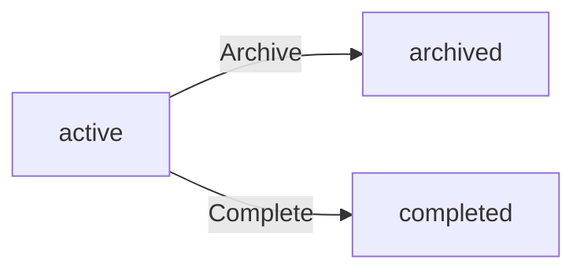

**hrmPlatform — Business rules, validation constraints, data browsing expectations, error scenarios**

Business rules, validation constraints, data browsing expectations, error scenarios

# Domain Business Rules

Per-concept business rules, validation logic, and domain constraints.

## Organization Rules

Organizations operate as independent tenants with their own employees, projects, and data. Each organization must have a name, description, logo image, currency such as USD or EUR or KRW, timezone, and fiscal start month. Organization owners can edit organization settings at any time. An organization can only be deleted if all pending timesheets are resolved through approval or rejection. The organization cannot be deleted if there are any active employee contracts. When an organization is deleted, all employees, projects, tasks, timelogs, and timesheets are permanently deleted. The owner's user account remains but is no longer associated with any organization. Users create an organization during their initial sign-up process. Each organization maintains complete data isolation from other organizations.

### Multi-Tenancy and Tenant Isolation

The platform supports multiple organizations operating as independent tenants. Each organization maintains complete separation from other organizations with its own employees, projects, and data. Users who belong to multiple organizations can only access data for their currently selected organization. All system operations are scoped to the selected organization context. Data from one organization is never visible to employees of another organization. The system enforces organization context on every request to prevent cross-organization data access.

### Organization Settings Validation

Each organization must have a name, description, logo image, currency, timezone, and fiscal start month. The currency must be a valid currency code such as USD, EUR, or KRW. The timezone must be a valid timezone identifier. The fiscal start month must be a valid month value from 1 to 12. Organization owners can edit organization settings at any time. If any required setting is missing or invalid, the request is rejected. If the currency format is invalid, the request is rejected. If the timezone is not recognized, the request is rejected. If the fiscal start month is outside the valid range, the request is rejected.

### Organization Creation

Users create an organization during their initial sign-up process. The organization is automatically associated with the creating user as the owner. The organization is created with default built-in roles: Owner, Manager, and Employee. The creating user is assigned the Owner role in the new organization. If the sign-up process is interrupted before completion, no organization is created. If the organization name is missing during creation, the request is rejected. If the organization name exceeds the maximum length, the request is rejected.

### Organization Deletion Conditions

Organization owners can delete their organization only when specific conditions are met. All pending timesheets must be resolved through approval or rejection before deletion is allowed. The organization cannot be deleted if there are any active employee contracts. If pending timesheets exist, the deletion request is rejected with a message indicating unresolved timesheets. If active employee contracts exist, the deletion request is rejected with a message indicating active contracts must be ended first. The system validates both conditions before allowing organization deletion. Organization owners must resolve all blocking conditions before the organization can be deleted.

### Cascading Deletion and Account Preservation

When an organization is deleted, all employees, projects, tasks, timelogs, and timesheets associated with the organization are permanently deleted. All departments, custom roles, invitations, activity logs, and timers associated with the organization are permanently deleted. The owner's user account remains intact but is no longer associated with any organization. If the owner belongs to other organizations, those memberships are preserved. If the owner does not belong to any other organizations, the user account exists without organization access. Historical data from the deleted organization cannot be recovered after deletion. The cascading deletion ensures no orphaned records remain in the system.

## User Rules

Users must sign up with a valid email address and password. Login requires the same email and password credentials used during registration. Users can change their password after account creation. A single user account can belong to multiple organizations simultaneously. When logging in, users must select which organization context to work within. All subsequent actions are scoped to the selected organization context. Users can switch between organizations without logging out and back in. Users can delete their account only if they are not the sole owner of any organization. If the user is the sole owner, they must transfer ownership or delete the organization first. When a user account is deleted, their employee records in other organizations are marked as deactivated rather than removed.

### Registration Validation

Users must provide a valid email address during registration. The email address must be unique across all user accounts in the platform. If the email address is already registered, the registration request is rejected. Users must provide a password during registration. The password must meet minimum security requirements defined by the platform. If the password does not meet requirements, the registration request is rejected. Both email and password are required fields. If either field is missing, the registration request is rejected. Upon successful registration, the user account is created and associated with the newly created organization.

### Authentication Rules

Users must log in with the same email and password credentials used during registration. If the email address does not exist in the system, the login request is rejected. If the password does not match the stored credentials, the login request is rejected. The system does not indicate which credential (email or password) was incorrect to prevent enumeration attacks. After successful authentication, the user must select which organization context to work within. If the user belongs to only one organization, that organization is selected by default. If the user belongs to multiple organizations, the user must explicitly choose one. If no organization is selected, access to organization-scoped features is denied.

### Password Management

Users can change their password after account creation. To change the password, the user must provide the current password for verification. If the current password is incorrect, the password change request is rejected. The new password must meet the same security requirements as during registration. If the new password does not meet requirements, the password change request is rejected. The new password cannot be the same as the current password. If the new password matches the current password, the request is rejected. Password changes apply globally to the user account across all organizations the user belongs to.

### Multi-Organization Membership

A single user account can belong to multiple organizations simultaneously. Users can be added to organizations through invitation or during initial sign-up. If a user is invited to an organization with an email that already has an account, the existing account is linked to the organization. If a user is invited with an email that has no account, a pending invitation is created. When the user registers with the invited email, they are automatically added to all pending organizations. There is no limit to the number of organizations a user can belong to. Each organization membership is independent with its own role and employee record.

### Organization Context Selection

When logging in, users must select which organization context to work within. All subsequent actions are scoped to the selected organization context. Users cannot access data from organizations other than the currently selected one. Users can switch between organizations without logging out and back in. When switching organizations, the user's session remains active. All organization-scoped data is refreshed to reflect the newly selected organization. If a user attempts to access data from a non-selected organization, the request is rejected. The organization context is maintained throughout the user session until explicitly changed or the session ends.

### Account Deletion Constraints

Users can delete their account only if they are not the sole owner of any organization. If the user is the sole owner of an organization, the account deletion request is rejected. Before deleting the account, the user must transfer ownership of any organizations they solely own. Alternatively, the user must delete the organization first if they are the sole owner. If ownership transfer is not completed, the account deletion request is rejected. If the organization has active employee contracts, the organization cannot be deleted, blocking account deletion. If there are pending timesheets in an organization owned solely by the user, the organization cannot be deleted, blocking account deletion.

### Employee Record Deactivation

When a user account is deleted, their employee records in other organizations are marked as deactivated rather than removed. Deactivated employee records preserve historical data including timelogs and timesheets. Deactivated employees cannot log time or submit timesheets. Deactivated employees cannot be assigned to new projects or tasks. Deactivated employees can be reactivated by users with employee management permission. The deactivation status is organization-specific. A user may have active employee records in some organizations and deactivated records in others after account deletion in one organization.

### Profile Global Scope

Each user has a global profile that is shared across all organizations the user belongs to. The global profile includes display name, avatar image, and phone number. Changes to the global profile apply to all organizations simultaneously. Users can edit their global profile at any time. Profile changes are reflected immediately across all organization contexts. The global profile cannot be customized per organization. If a user belongs to multiple organizations, the same display name, avatar, and phone number appear in all organizations. Profile edits require validation of provided data formats. If profile data is invalid, the edit request is rejected.

## Employee Rules

Employees are invited to organizations by email address. If the invited email already has a user account, the user is added to the organization immediately. If the invited email has no account, a pending invitation is created until the user signs up. Each employee record must have a reference to a user account and exactly one role in the organization. Employment type must be one of full-time, part-time, contractor, or intern. Employee status can be active or deactivated. Department and position are optional fields in the employee record. Deactivated employees cannot log time or submit timesheets but their historical data is preserved. Deactivated employees can be reactivated to restore their access. Employee records can be edited for department, position, and employment type by users with employee management permission.

### Employee Record Creation and Role Assignment

When an employee invitation is accepted, an employee record is created linking the user account to the organization.

If the invited email address already has a user account, the user is added to the organization immediately and an employee record is created.

If the invited email address has no existing account, a pending invitation is created. When the user signs up with that email address, they are automatically added to the organization and an employee record is created.

Each employee record must be assigned exactly one role in the organization. The role determines the employee's permissions within the organization.

The role assignment can be changed by users with employee management permission. When a role is changed, the employee immediately gains or loses the permissions associated with the new role.

If an employee's role is deleted, the employee must be reassigned to a different role before the role deletion can complete.

### Employee Record Field Validation

Each employee record must have a reference to a user account. The user account provides the employee's identity and authentication credentials.

Each employee record must have exactly one role assigned from the organization's available roles.

The employment type field must be one of the following values: full-time, part-time, contractor, or intern. No other employment types are permitted.

The employee status field must be either active or deactivated. Active employees have full access according to their role permissions. Deactivated employees have restricted access as defined in the deactivation rules.

The department field is optional. If not provided, the employee is not associated with any department. Employees can be assigned to a department or have their department removed.

The position field is optional. If not provided, the employee has no position title. The position can be set or updated at any time by users with employee management permission.

### Employee Deactivation and Reactivation

When an employee is deactivated, they cannot log time entries. Any attempt to create a timelog by a deactivated employee is rejected.

When an employee is deactivated, they cannot submit timesheets. Any attempt to submit a timesheet by a deactivated employee is rejected.

When an employee is deactivated, their historical data is preserved. All previously created timelogs, timesheets, contracts, and project memberships remain accessible for reporting and audit purposes.

Deactivated employees retain read-only access to their own historical data according to their role permissions at the time of deactivation.

A deactivated employee can be reactivated by users with employee management permission. When reactivated, the employee regains their role permissions and can resume logging time and submitting timesheets.

When an employee is reactivated, their previous department, position, and employment type values are restored.

If an employee's user account is deleted, the employee record is marked as deactivated and cannot be reactivated.

## Role Rules

Each organization has three built-in roles that cannot be deleted: Owner, Manager, and Employee. The Owner role has full access to all features and can manage roles and members. The Manager role can manage employees, projects, approve timesheets, and view reports. The Employee role can track time, submit timesheets, and view own data. Organization owners can create custom roles with a name and a set of permissions. Available permissions include org:manage, employee:manage, employee:view, project:manage, project:view, time:manage, time:approve, time:view_all, and report:view. Custom roles can be edited by organization owners. Custom roles can only be deleted if no employees are assigned to them. Each employee in an organization must be assigned exactly one role.

### Built-in Role Constraints

Each organization has three built-in roles that cannot be deleted: Owner, Manager, and Employee.

The Owner role has full access to all features within the organization. Owners can manage organization settings, manage roles and members, manage employees, manage projects, approve timesheets, and view all reports.

The Manager role can manage employees, manage projects, approve or reject timesheets, and view organization reports. Managers cannot edit organization settings or manage roles.

The Employee role can track time, submit timesheets for approval, and view their own data including timelogs, timesheets, and assigned tasks. Employees cannot manage other employees, projects, or approve timesheets.

Built-in roles cannot be deleted under any circumstances. Built-in roles cannot be renamed. Built-in roles cannot have their permissions modified.

### Custom Role Management

Organization owners can create custom roles with a name and a set of permissions.

Nine permissions are available for assignment to custom roles:
- org:manage — edit organization settings
- employee:manage — add, edit, and deactivate employees
- employee:view — view employee list and details
- project:manage — create, edit, and delete projects and tasks
- project:view — view projects and tasks
- time:manage — edit or delete any employee's timelogs
- time:approve — approve or reject timesheets
- time:view_all — view all employees' timelogs and timesheets
- report:view — view organization reports

Organization owners can edit custom roles, including changing the role name and modifying the set of assigned permissions.

Custom roles can only be deleted if no employees are currently assigned to that role. If employees are assigned to a custom role, the role cannot be deleted until all employees are reassigned to a different role.

### Role Assignment Rules

Each employee in an organization must be assigned exactly one role. An employee cannot have multiple roles within the same organization.

Role assignment can be changed by users with the employee:manage permission. When changing an employee's role, the new role must be from the same organization.

If a custom role is deleted, all employees assigned to that role must be reassigned to a different role before the deletion can proceed.

When an employee is invited to an organization, they must be assigned a role as part of the invitation. The invitation cannot be sent without specifying a role.

## Department Rules

Each organization can have multiple departments to organize employees. Each department must have a name and can have an optional description. Departments support one level of nesting through an optional parent department reference. Users with org:manage permission can create, edit, and delete departments. When a department is deleted, employees assigned to that department have their department field set to null. Deleting a department does not delete the employees themselves. All employees in the organization can view the list of departments. Department names must be unique within the organization context. The parent department must belong to the same organization.

### Department Creation and Attributes

A department must have a name. The name is required when creating a department.

A department may have an optional description. The description can be provided during creation or added later.

A department may have an optional parent department. When a parent department is specified, it creates a hierarchical relationship.

If no parent department is specified, the department is a top-level department.

### Department Hierarchy Constraints

Departments support only one level of nesting. A department cannot have a parent department that itself has a parent department.

The parent department must belong to the same organization as the child department. Cross-organization department hierarchies are not permitted.

If an attempt is made to assign a parent department that is not in the same organization, the request is rejected.

### Department Management Permissions

Users with the org:manage permission can create departments within the organization.

Users with the org:manage permission can edit department attributes including name, description, and parent department assignment.

Users with the org:manage permission can delete departments from the organization.

Users without the org:manage permission cannot create, edit, or delete departments.

### Department Deletion Rules

When a department is deleted, all employees assigned to that department have their department assignment set to null.

Deleting a department does not delete the employees themselves. Employee records are preserved.

Deleting a department does not delete any historical data associated with employees who were assigned to that department.

If a department has child departments (departments with this department as their parent), the child departments' parent assignment is set to null when the parent department is deleted.

### Department Visibility and Naming

All employees in the organization can view the list of departments.

Department names must be unique within the organization. Two departments in the same organization cannot have the same name.

If an attempt is made to create a department with a name that already exists in the organization, the request is rejected.

If an attempt is made to rename a department to a name that already exists in the organization, the request is rejected.

## Contract Rules

Each employee can have multiple contracts serving as a historical record. Only one contract can be active at any given time for an employee. Each contract must have a start date and a pay rate as required fields. End date is optional where null means the contract is ongoing. Pay period must be one of hourly, daily, weekly, or monthly. Working hours per week is a required numeric field such as 40. Notes are an optional text field on contracts. Creating a new contract automatically ends the previous active contract by setting its end date to the day before the new contract starts. Past contracts are immutable and cannot be edited once superseded. Only the current active contract can be edited by users with employee management permission.

### Contract Structure and Attributes

Each employee can have multiple contracts serving as a historical record of employment terms over time.

Each contract must have a start date as a required field. The start date cannot be null or empty.

Each contract must have a pay rate as a required numeric field. The pay rate represents the compensation amount for the specified pay period.

Each contract must have an end date as an optional field. When the end date is null, the contract is considered ongoing with no specified termination date.

Each contract must have a pay period as a required field. The pay period must be one of the following values: hourly, daily, weekly, or monthly. Other values are not permitted.

Each contract must have working hours per week as a required numeric field. This represents the expected weekly working hours, such as 40 hours per week.

Each contract may have notes as an optional text field for additional terms or comments.

### Active Contract Constraint

Only one contract can be active at any given time for an employee. An active contract is defined as a contract where the end date is null or the end date is in the future relative to the current date.

When a new contract is created for an employee who has an existing active contract, the system automatically ends the previous active contract. The previous contract's end date is set to the day before the new contract's start date.

The system rejects any request that would result in an employee having multiple active contracts simultaneously.

If a contract creation request specifies a start date that overlaps with an existing active contract's period, the request is rejected.

### Contract Immutability and Editing

Past contracts are immutable and cannot be edited once they are no longer the active contract. A past contract is defined as a contract where the end date has passed or the contract has been superseded by a newer contract.

Only the current active contract can be edited by users with employee management permission. Edits to the active contract may include modifying the end date, pay rate, working hours per week, or notes.

If a user attempts to edit a past contract, the request is rejected.

If a user without employee management permission attempts to edit any contract, the request is rejected.

Contract history must be preserved exactly as recorded. No modifications to historical contract data are permitted under any circumstances.

## Project Rules

Projects must have a name and a color code for UI display as required fields. Description, budget hours, start date, and end date are optional fields. Project status must be one of active, archived, or completed. Archived and completed projects cannot receive new timelogs from employees. Existing timelogs on archived or completed projects are preserved and remain accessible. Projects can only be deleted if they have no timelogs associated with them. Users with project:manage permission can create, edit, archive, complete, or delete projects. Budget hours represents the total estimated hours for the project. Color code is used for visual identification in the user interface.

### Project Creation and Validation

A project must have a name, which is a required field. The name cannot be empty or null.

A project must have a color code, which is a required field used for visual identification in the user interface. The color code cannot be empty or null.

A project may have a description, which is an optional field. If not provided, the description remains empty.

A project may have budget hours, which is an optional field representing the total estimated hours for the project. If not provided, the project has no budget limit.

A project may have a start date, which is an optional field. If not provided, the project has no defined start date.

A project may have an end date, which is an optional field. If not provided, the project has no defined end date.

If the project name is missing or empty, the request to create or update the project is rejected.

If the color code is missing or empty, the request to create or update the project is rejected.

Budget hours, when provided, must be a positive numeric value. If a non-positive value is provided, the request is rejected.

### Project Status and Timelog Restrictions

A project status must be one of: active, archived, or completed. Any other status value is invalid.

When a project status is set to archived, the project cannot receive new timelogs from employees. Any attempt to log time to an archived project is rejected.

When a project status is set to completed, the project cannot receive new timelogs from employees. Any attempt to log time to a completed project is rejected.

When a project is archived or completed, all existing timelogs associated with the project are preserved and remain accessible for viewing and reporting.

Archived or completed projects retain all their historical data, including timelogs, tasks, and project memberships.

The following flowchart shows project status transitions:

Only users with the project:manage permission can change a project status from active to archived or completed.

### Project Deletion Rules

A project can only be deleted if it has no timelogs associated with it. If any timelog exists for the project, the deletion request is rejected.

Users with the project:manage permission can delete projects that meet the deletion criteria.

Users without the project:manage permission cannot delete any project. Any deletion request from such users is rejected.

If a project has tasks, the tasks are deleted along with the project.

If a project has project members, the project memberships are deleted along with the project.

Deleting a project does not affect timelogs from other projects. Only timelogs associated with the deleted project would be affected, but such projects cannot be deleted if timelogs exist.

## ProjectMember Rules

Project membership links an employee to a project with a specific role assignment. Each project membership must have an employee, a project, and an assigned role. The assigned role must be either member or project-lead. An employee can be assigned to multiple projects simultaneously. Only users with project:manage permission can assign employees to projects. Only users with project:manage permission can remove employees from projects. Project leads can manage tasks within their assigned project. Employees can view which projects they are assigned to. The same employee cannot have duplicate memberships in the same project.

### Project Membership Structure

Each project membership must link an employee to a project with a specific role assignment. A project membership requires three elements: an employee, a project, and an assigned role. The assigned role must be either member or project-lead. No other role values are accepted.

The same employee cannot have duplicate memberships in the same project. If an attempt is made to assign an employee who is already a member of the project, the request is rejected.

An employee can be assigned to multiple projects simultaneously. There is no limit on the number of projects an employee can belong to.

When a project membership is created, the employee must exist and be active in the organization. The project must exist and be active. If the employee does not exist, the request is rejected. If the employee is deactivated, the request is rejected. If the project does not exist, the request is rejected. If the project is archived or completed, the request is rejected.

### Project Membership Assignment and Removal

Only users with project:manage permission can assign employees to projects. If a user without project:manage permission attempts to assign an employee to a project, the request is rejected.

Only users with project:manage permission can remove employees from projects. If a user without project:manage permission attempts to remove an employee from a project, the request is rejected.

When assigning an employee to a project, the assigner must specify the role (member or project-lead). If no role is specified, the request is rejected.

When removing an employee from a project, all task assignments for that employee within the project are automatically cleared. The employee loses access to project tasks immediately upon removal.

If an attempt is made to remove an employee who is not a member of the project, the request is rejected. If an attempt is made to assign a role that is not member or project-lead, the request is rejected.

### Project Membership Access and Capabilities

Project leads can manage tasks within their assigned project. This includes creating tasks, editing tasks, and changing task status. Employees with the member role cannot manage tasks unless they also have project:manage permission through their organization role.

Employees can view which projects they are assigned to. An employee can see all projects where they have a membership, regardless of their role (member or project-lead).

Employees cannot view projects they are not assigned to, unless they have project:view permission through their organization role. If an employee attempts to access a project they are not assigned to and do not have project:view permission, the request is rejected.

When a project membership is deleted, the employee immediately loses all access to the project and its tasks. Historical timelogs associated with the project remain preserved. If an attempt is made to delete a membership that does not exist, the request is rejected.

## Task Rules

Tasks must have a title as a required field. Description, estimated hours, and due date are optional fields. Task status must be one of open, in-progress, completed, or closed. Priority must be one of low, medium, high, or urgent. Assigned employee is optional but must be a project member if specified. Tasks support one level of nesting through an optional parent task for subtasks. Project leads can edit tasks within their project. Users with project:manage permission can edit any task in the organization. Task assigned employee must belong to the same project as the task. Parent task must belong to the same project as the child task.

### Task Title and Required Fields

THE system SHALL require a title for every task.

IF a task is created without a title, THEN THE system SHALL reject the request.

A task cannot exist without a title. The title field is mandatory at creation and cannot be removed or set to empty during editing.

### Optional Task Attributes

WHERE a task is created or edited, THE system SHALL allow the following optional attributes:

- Description: text providing additional context about the task
- Estimated hours: numeric value indicating expected effort
- Due date: date by which the task should be completed

IF any optional attribute is not provided, THEN THE system SHALL accept the task with null or empty values for those fields.

Optional attributes can be added or updated at any time during the task lifecycle.

### Task Status Values

THE system SHALL restrict task status to one of the following four values:

- open: task is ready to be worked on
- in-progress: task is currently being worked on
- completed: task work is finished
- closed: task is finalized and no further action is needed

IF a status value outside these four options is provided, THEN THE system SHALL reject the request.

Task status transitions are recorded in task history with timestamp, old status, new status, and the user who made the change.

### Task Priority Values

THE system SHALL restrict task priority to one of the following four values:

- low: task has minimal urgency
- medium: task has normal urgency
- high: task has elevated urgency
- urgent: task requires immediate attention

IF a priority value outside these four options is provided, THEN THE system SHALL reject the request.

Priority can be changed at any time by users with appropriate editing permissions.

### Task Assignment Rules

WHERE a task is assigned to an employee, THE assigned employee SHALL be a member of the same project as the task.

IF an attempt is made to assign a task to an employee who is not a project member, THEN THE system SHALL reject the request.

Task assignment is optional. A task can exist without being assigned to any employee.

THE system SHALL allow reassignment of tasks to different project members at any time.

### Subtask Nesting Rules

WHERE a task has a parent task, THE parent task SHALL belong to the same project as the child task.

IF an attempt is made to create a subtask relationship between tasks in different projects, THEN THE system SHALL reject the request.

THE system SHALL support only one level of task nesting. A subtask cannot have its own subtasks.

IF an attempt is made to create a nested subtask (a task whose parent is already a subtask), THEN THE system SHALL reject the request.

Parent task assignment is optional. Tasks can exist independently without a parent task.

### Task Editing Permissions

WHILE a user has project-lead role on a project, THE system SHALL allow the user to edit tasks within that project.

WHILE a user has project:manage permission in the organization, THE system SHALL allow the user to edit any task in the organization regardless of project assignment.

IF a user without project-lead role or project:manage permission attempts to edit a task, THEN THE system SHALL reject the request.

Task editing includes modifying title, description, status, priority, estimated hours, due date, assigned employee, and parent task relationship.

## TaskHistory Rules

Task history entries are automatically created when task status changes occur. Each task history entry must have a timestamp recording when the change happened. Each entry must record the old status before the change. Each entry must record the new status after the change. Each entry must record which user made the status change. Task history entries are immutable once created and cannot be edited or deleted. Task history provides an audit trail of all status transitions for a task. History entries are created for every status change without exception. The timestamp uses the system time when the change was made. Task history is viewable by anyone who can view the task.

### Task History Entry Creation

Task history entries are automatically created whenever a task status changes. Every status change is logged without exception, regardless of which user initiates the change or what the status transition is. The system creates the history entry at the moment the status change is applied. History entries cannot be manually created, edited, or deleted by users. This automatic recording ensures a complete record of all task status transitions.

### Task History Entry Requirements

Each task history entry must include the following information:

- Timestamp: The system timestamp when the status change occurred is required. The timestamp uses the system time at the moment of change, not the user's local time.
- Old Status: The status value before the change is required. This records what the task status was prior to the transition.
- New Status: The status value after the change is required. This records what the task status became.
- Changed By: The user who made the status change is required. This identifies which user performed the action that triggered the status change.

All four fields are mandatory for every history entry. If any field cannot be recorded, the status change is rejected.

### Task History Immutability

Task history entries are immutable once created. No user, regardless of role or permission level, can edit or delete a task history entry. This immutability applies to all fields including timestamp, old status, new status, and changed by user. The system does not provide any mechanism to modify historical records. This ensures the integrity of the audit trail and prevents tampering with task status history.

### Task History Purpose and Access

Task history serves as an audit trail for tracking all status transitions on a task. The audit trail purpose is to provide transparency and accountability for task status changes.

Any user who can view a task can also view the task history for that task. This includes project leads, users with project management permissions, and employees assigned to the project. Users who cannot view the task cannot access its history. The history is displayed in chronological order showing all status changes from task creation to current status.

## Timelog Rules

Timelogs must have a date, duration in minutes, and a project as required fields. Task is optional but must belong to the selected project if specified. Description is an optional text field explaining what work was done. Billable flag is a boolean with a default value of true. Employees can only create timelogs for their own employee record. The project must be one the employee is assigned to as a project member. Timelogs can only be edited by the owner if not part of an approved timesheet. Timelogs can only be deleted by the owner if not part of any submitted or approved timesheet. Users with time:manage permission can edit or delete any employee's timelogs regardless of timesheet status.

### Required Fields

Every timelog must include a date indicating when the work was performed. The date is a required field and cannot be omitted.

Every timelog must include a duration expressed in minutes. The duration represents the total time spent on the work and is a required field. Duration values must be positive integers.

Every timelog must include a project reference. The project identifies which project the work belongs to and is a required field. A timelog cannot exist without an associated project.

### Optional Fields

A timelog may include a task reference. The task is optional and can be omitted when logging time. When a task is specified, it must belong to the selected project (see Project and Task Validation).

A timelog may include a description. The description is an optional text field that explains what work was performed during the logged time. The description can be left empty.

A timelog includes a billable flag indicating whether the logged time is billable to a client. The billable flag is a boolean field with a default value of true. If not explicitly set, the timelog is treated as billable.

### Project and Task Validation

The project specified in a timelog must be one that the employee is assigned to as a project member. An employee cannot log time to a project they are not a member of.

If a task is specified in the timelog, the task must belong to the selected project. A timelog cannot reference a task from a different project than the one specified.

The system validates project and task assignments at the time of timelog creation. If the employee is not assigned to the project, or if the task does not belong to the project, the request is rejected.

### Creation Permissions

Employees can only create timelogs for their own employee record. An employee cannot create timelogs on behalf of another employee.

The system enforces this restriction by associating each timelog with the employee record of the user creating it. Any attempt to create a timelog for a different employee is rejected.

### Edit Restrictions

Employees can edit their own timelogs only if the timelog is not part of an approved timesheet. Once a timesheet containing the timelog is approved, the timelog becomes locked and cannot be edited.

If the timelog is part of a draft or submitted timesheet, the employee can still edit it. If the timelog is not part of any timesheet, the employee can edit it freely.

The system checks the timesheet status before allowing edits. If the timelog is part of an approved timesheet, the edit request is rejected.

### Delete Restrictions

Employees can delete their own timelogs only if the timelog is not part of any submitted or approved timesheet. This is a stricter restriction than editing.

If the timelog is part of a submitted timesheet (awaiting approval), the employee cannot delete it. If the timelog is part of an approved timesheet, the employee cannot delete it.

If the timelog is part of a draft timesheet or not part of any timesheet, the employee can delete it.

The system checks the timesheet status before allowing deletion. If the timelog is part of a submitted or approved timesheet, the delete request is rejected.

### Management Override

Users with the time:manage permission can edit any employee's timelogs regardless of timesheet status. This permission overrides the edit restrictions that apply to regular employees.

Users with the time:manage permission can delete any employee's timelogs regardless of timesheet status. This permission overrides the delete restrictions that apply to regular employees.

The time:manage permission is typically assigned to users with the Owner or Manager role. This allows them to correct errors or make adjustments to timelogs even after timesheets have been submitted or approved.

## Timesheet Rules

Timesheets represent a collection of timelogs for a specific week from Monday to Sunday. Each timesheet must have an employee owner and a week start date which is always a Monday. Week end date is always the corresponding Sunday. Status must be one of draft, submitted, approved, or rejected. Total hours is calculated automatically from included timelogs. Submitted at timestamp is recorded when the timesheet is submitted. Reviewed at timestamp and reviewed by user are recorded when approved or rejected. Rejection reason is required text when rejecting a timesheet. A timesheet cannot be submitted if it has no timelogs included. A timesheet cannot be submitted if another timesheet for the same week is already submitted or approved.

### Week Definition and Boundaries

A timesheet represents a collection of timelogs for a specific week. The week is defined as Monday through Sunday. The week start date must always be a Monday. The week end date must always be the corresponding Sunday of the same week. The system validates that the week start date falls on a Monday. The system validates that the week end date falls on the Sunday of the same week as the start date. A timesheet cannot be created with invalid week boundaries. If the week start date is not a Monday, the request is rejected. If the week end date is not the corresponding Sunday, the request is rejected.

### Timesheet Ownership

Each timesheet must have exactly one employee owner. The employee owner is the employee whose timelogs are included in the timesheet. The employee owner is required when creating a timesheet. A timesheet cannot exist without an employee owner. Only the employee owner can create a draft timesheet for their own week. Only the employee owner can submit their own timesheet for approval. Only the employee owner can modify a draft or rejected timesheet. If no employee owner is specified, the request is rejected.

### Timesheet Status Lifecycle

A timesheet must have a status at all times. The status must be one of: draft, submitted, approved, or rejected. When first created, a timesheet is in draft status. When an employee submits a timesheet, the status changes from draft to submitted. When a user with approval permission approves a timesheet, the status changes from submitted to approved. When a user with approval permission rejects a timesheet, the status changes from submitted to rejected. A rejected timesheet returns to draft status when the employee modifies it for resubmission. If an invalid status value is provided, the request is rejected.

### Automatic Calculations and Timestamps

The total hours on a timesheet is calculated automatically from the included timelogs. The total hours is the sum of all timelog durations converted to hours. The total hours updates automatically when timelogs are added or removed from a draft timesheet. The submitted at timestamp is recorded automatically when the timesheet is first submitted. The submitted at timestamp cannot be modified after recording. The reviewed at timestamp is recorded automatically when the timesheet is approved or rejected. The reviewed by user is recorded automatically as the user who performed the approval or rejection. The reviewed at and reviewed by are null until the timesheet is reviewed.

### Submission Validation Rules

A timesheet cannot be submitted if it has no timelogs included. If an employee attempts to submit an empty timesheet, the request is rejected. A timesheet cannot be submitted if another timesheet for the same employee and same week is already in submitted or approved status. If an employee attempts to submit a duplicate week timesheet, the request is rejected. When rejecting a timesheet, a rejection reason is required. The rejection reason must be a non-empty text explanation. If no rejection reason is provided when rejecting, the request is rejected. An approved timesheet cannot be modified or resubmitted. A submitted timesheet cannot be modified until it is rejected and returns to draft status.

## Timer Rules

Each employee can have at most one active timer running at any given time. Starting a timer requires selecting a project which must be one the employee is assigned to. Task selection is optional when starting a timer. The timer records a start timestamp when initiated. Description is an optional field that can be set when starting or while running. The project and task of a running timer can be edited while it is active. Stopping the timer creates a timelog with the calculated duration from start to stop. Duration is rounded to the nearest minute when creating the timelog. Employees can discard their timer without creating any timelog. Timers continue running indefinitely if the employee forgets to stop them with no automatic stop mechanism.

### Timer Activation Constraints

Each employee can have at most one active timer running at any given time. If an employee attempts to start a new timer while another timer is already active, the request is rejected.

Starting a timer requires selecting a project. The selected project must be one the employee is assigned to as a project member. If the employee is not assigned to the selected project, the request is rejected.

Task selection is optional when starting a timer. If a task is selected, it must belong to the selected project. If the task does not belong to the project, the request is rejected.

The system records a start timestamp when the timer is initiated. This timestamp marks the beginning of the time tracking session.

### Running Timer Management

Description is an optional field that can be set when starting a timer or while the timer is running. Employees can edit the description of their active timer at any time before stopping it.

The project of a running timer can be edited while it is active. The new project must be one the employee is assigned to. If the employee is not assigned to the new project, the request is rejected.

The task of a running timer can be edited while it is active. If a task is selected, it must belong to the currently selected project. If the task does not belong to the project, the request is rejected. The task can also be removed entirely from the running timer.

Timers continue running indefinitely if the employee forgets to stop them. The system does not automatically stop timers after any duration or at any specific time.

### Timer Completion Rules

When an employee stops their timer, the system creates a timelog with the calculated duration from the start timestamp to the stop timestamp. The duration is rounded to the nearest minute when creating the timelog.

Employees can discard their timer without creating any timelog. Discarding a timer removes it permanently with no record of the tracked time.

If the timer has no start timestamp recorded, the stop request is rejected. If the employee does not own the timer, the stop or discard request is rejected.

## ActivityLog Rules

Activity log entries record significant actions performed within the organization. Each entry must have a timestamp of when the action occurred. Each entry must record the user who performed the action. Each entry must have an action type describing what was done. Each entry must have a target entity indicating what was affected. Details provide additional context about the action. Logged actions include employee invited, deactivated, and reactivated events. Contract created or edited actions are logged. Project created, archived, completed, and deleted actions are logged. Task status changed, timesheet submitted, approved, and rejected actions are logged. Role assigned or changed actions are logged. Users with org:manage permission can view the full activity log.

### Activity Log Entry Requirements

Every activity log entry must have a timestamp indicating when the action occurred. The timestamp is automatically recorded by the system and cannot be modified.

Every activity log entry must record the user who performed the action. The system automatically associates the entry with the user who triggered the logged event.

Every activity log entry must have an action type describing what was done. The action type categorizes the nature of the logged event.

Every activity log entry must have a target entity indicating what was affected by the action. The target entity identifies which business object the action was performed on.

Activity log entries may include details providing additional context about the action. Details are optional and provide human-readable information about what changed.

### Logged Action Categories

The system logs employee lifecycle actions including when an employee is invited to the organization, when an employee is deactivated, and when an employee is reactivated.

The system logs contract actions including when a contract is created for an employee and when a contract is edited.

The system logs project actions including when a project is created, when a project is archived, when a project is completed, and when a project is deleted.

The system logs task actions including when a task status is changed. The task history records the timestamp, old status, new status, and who made the change (defined in TaskHistory Rules).

The system logs timesheet actions including when a timesheet is submitted, when a timesheet is approved, and when a timesheet is rejected.

The system logs role actions including when a role is assigned to an employee and when an employee's role is changed.

### Activity Log Access Rules

Users with the org:manage permission can view the full activity log for the organization.

Users without the org:manage permission cannot view the activity log.

The activity log is paginated to support browsing large numbers of entries.

The activity log can be filtered by action type to find specific categories of events.

The activity log can be filtered by user to see all actions performed by a specific user.

The activity log can be filtered by date range to view events within a specific time period.

If a user attempts to view the activity log without the org:manage permission, the request is rejected.

## Invitation Rules

Invitations are created when users with employee:manage permission invite new employees by email. Each invitation must have an email address as the target recipient. Invitation status tracks whether the invitation is pending or has been accepted. If the invited email already has a user account, no invitation is created and the user is added directly. If the invited email has no account, a pending invitation is created. When the user signs up with the invited email address, they are automatically added to the pending organizations. Invitations are scoped to a specific organization. Multiple pending invitations can exist for the same email across different organizations. Invitations expire after a configured time period if not accepted. Only users with employee:manage permission can create invitations.

### Invitation Creation and Permission

Only users with the employee:manage permission can create invitations to the organization. Invitations are created exclusively by email address. The email address is required when creating an invitation. If the email address is missing or invalid, the invitation request is rejected. Each invitation is scoped to a specific organization and cannot be transferred to another organization. Multiple pending invitations can exist for the same email address across different organizations simultaneously.

### Invitation Status Tracking

Each invitation has a status that tracks its lifecycle. The status is either pending or accepted. When an invitation is created, its status is set to pending. When the invited user accepts the invitation by signing up or logging in, the status changes to accepted. Invitations expire after a configured time period if not accepted. Once an invitation expires, it cannot be used to join the organization. Expired invitations must be recreated by a user with employee:manage permission.

### Existing Account Handling

When an invitation is created, the system checks if a user account already exists with the invited email address. If a user account exists, no invitation is created. The existing user is added directly to the organization with the specified role. If no user account exists, a pending invitation is created. When the user signs up with the invited email address, they are automatically added to all organizations with pending invitations for that email. The pending invitations are marked as accepted upon successful signup.

### Invitation Validation and Error Conditions

If the user creating the invitation does not have employee:manage permission, the request is rejected. If the invited email address is already a member of the organization, the request is rejected. If the invited email address has an active invitation to the organization that has not expired, the request is rejected. If the organization is deleted, all pending invitations for that organization are cancelled. If the user's account is deleted before accepting an invitation, the invitation is cancelled.

# Data Browsing Expectations

Business expectations for how users browse, find, and navigate through lists of data.

## List Browsing Expectations

Define business expectations for how users find, filter, and browse lists.

### Filtering Rules

The employee list supports filtering by department, employment type, and status. Multiple filters can be applied simultaneously.

The employee list supports searching by employee name. The search matches partial name matches.

The project list supports filtering by project status. Only projects matching the selected status are displayed.

The task list supports filtering by task status, priority level, and assigned employee. Filters can be combined.

The timelog list supports filtering by date range, project, task, and billable status. Date range filtering includes both start and end dates.

The timesheet list supports filtering by timesheet status and date range. Date range filtering uses the week start date.

The activity log supports filtering by action type, user who performed the action, and date range.

If no filters are applied, the list displays all items the user has permission to view.

If a filter value does not match any items, an empty list is displayed with no error.

### Sorting Rules

The task list supports sorting by due date, priority level, and creation date.

Sorting by due date displays tasks with earlier due dates first.

Sorting by priority displays tasks with higher priority (urgent) first.

Sorting by creation date displays newer tasks first by default.

Users can reverse the sort order for any supported sort field.

If no sort is specified, the task list uses creation date descending as the default order.

The employee list, project list, timelog list, timesheet list, and activity log do not support custom sorting. These lists use system-defined default ordering.

### Pagination Rules

The employee list is paginated. Only a subset of employees is displayed per page.

The project list is paginated. Only a subset of projects is displayed per page.

The timelog list is paginated. Only a subset of timelogs is displayed per page.

The timesheet list is paginated. Only a subset of timesheets is displayed per page.

The activity log is paginated. Only a subset of activity entries is displayed per page.

Pagination preserves applied filters when navigating between pages.

Pagination preserves applied sort order when navigating between pages.

If the user navigates to a page that no longer exists due to filter changes, the system displays the last available page.

If all items are removed while viewing a paginated list, the system displays an empty list state.

# Error Conditions

Business error scenarios and how the system should respond.

## Error Scenarios

Describe error conditions and expected system responses in natural language.

### Authentication and Authorization Failures

If the email address does not exist in the system, the login request is rejected with a generic authentication error message.

If the password does not match the stored credentials, the login request is rejected with a generic authentication error message.

If a user attempts to access organization data without selecting an organization context, the request is rejected.

If a user attempts to access data from an organization they do not belong to, the request is rejected.

If a user attempts to perform an action without the required permission, the request is rejected with an authorization error.

If a user attempts to delete their account while being the sole owner of an organization, the request is rejected until ownership is transferred or the organization is deleted.

If a user attempts to change their password without providing the current password, the request is rejected.

### Organization Operation Failures

If an organization owner attempts to delete the organization while pending timesheets exist, the request is rejected.

If an organization owner attempts to delete the organization while active employee contracts exist, the request is rejected.

If an organization owner attempts to save organization settings with an invalid currency code, the request is rejected.

If an organization owner attempts to save organization settings with an invalid timezone, the request is rejected.

If an organization owner attempts to save organization settings with an invalid fiscal start month, the request is rejected.

If an organization owner attempts to delete a custom role that has employees assigned to it, the request is rejected.

If an organization owner attempts to delete a built-in role, the request is rejected.

If a user attempts to create a department with more than one level of nesting, the request is rejected.

### Employee Management Failures

If a user without employee:manage permission attempts to invite an employee, the request is rejected.

If an invitation is sent to an email address that already has a pending invitation, the request is rejected.

If a user attempts to assign a role to an employee that does not exist in the organization, the request is rejected.

If a user attempts to edit an employee record without employee:manage permission, the request is rejected.

If a user attempts to deactivate the only employee with employee:manage permission, the request is rejected.

If a user attempts to view the employee list without employee:view permission, the request is rejected.

If a user attempts to filter employees by an invalid department, employment type, or status, the request is rejected.

If a user attempts to reactivate a deactivated employee without employee:manage permission, the request is rejected.

### Contract and Employment Failures

If a user attempts to create a contract without a start date, the request is rejected.

If a user attempts to create a contract without a pay rate, the request is rejected.

If a user attempts to create a contract without specifying working hours per week, the request is rejected.

If a user attempts to create a contract with an end date earlier than the start date, the request is rejected.

If a user attempts to edit a past contract that is no longer active, the request is rejected.

If a user attempts to create a new contract while another contract is already active, the previous contract is automatically ended the day before the new contract starts.

If an employee attempts to view another employee's contracts without employee:view permission, the request is rejected.

If a user without employee:manage permission attempts to create a contract, the request is rejected.

### Project and Task Operation Failures

If a user attempts to create a project without a name, the request is rejected.

If a user attempts to create a project without a color code, the request is rejected.

If a user attempts to delete a project that has timelogs associated with it, the request is rejected.

If a user attempts to log time to an archived or completed project, the request is rejected.

If a user attempts to create a task without a title, the request is rejected.

If a user attempts to assign a task to an employee who is not a project member, the request is rejected.

If a user attempts to create a subtask with more than one level of nesting, the request is rejected.

If a user without project:manage permission attempts to create or edit a project, the request is rejected.

If a user without project:manage permission attempts to create or edit a task, the request is rejected.

If a project lead attempts to manage tasks in a project they are not assigned to, the request is rejected.

### Time Tracking Failures

If an employee attempts to create a timelog for a project they are not assigned to, the request is rejected.

If an employee attempts to create a timelog with a task that does not belong to the selected project, the request is rejected.

If an employee attempts to edit their own timelog that is part of an approved timesheet, the request is rejected.

If an employee attempts to delete their own timelog that is part of a submitted or approved timesheet, the request is rejected.

If an employee attempts to start a timer while another timer is already active, the existing timer must be stopped or discarded first.

If an employee attempts to stop a timer that is not active, the request is rejected.

If an employee attempts to view another employee's timelogs without time:view_all permission, the request is rejected.

If a user without time:manage permission attempts to edit or delete another employee's timelog, the request is rejected.

If an employee attempts to filter timelogs by an invalid date range, project, or billable status, the request is rejected.

### Timesheet Processing Failures

If an employee attempts to submit a timesheet with no timelogs, the request is rejected.

If an employee attempts to submit a timesheet for a week that already has a submitted or approved timesheet, the request is rejected.

If an employee attempts to create a draft timesheet for a week that already has a draft timesheet, the request is rejected.

If a user without time:approve permission attempts to approve a timesheet, the request is rejected.

If a user without time:approve permission attempts to reject a timesheet, the request is rejected.

If a user attempts to reject a timesheet without providing a rejection reason, the request is rejected.

If an employee attempts to view another employee's timesheet without time:view_all permission, the request is rejected.

If an employee attempts to modify a timelog within an approved timesheet, the request is rejected.

If a timesheet is rejected, it returns to draft status and the employee can modify and resubmit it.

If an employee attempts to filter timesheets by an invalid status or date range, the request is rejected.

### Data Access and Isolation Failures

If a user attempts to access data from an organization they are not a member of, the request is rejected.

If a user attempts to switch to an organization they do not belong to, the request is rejected.

If an employee in one organization attempts to view data from another organization, the request is rejected.

If a user attempts to view the activity log without org:manage permission, the request is rejected.

If a user attempts to filter the activity log by an invalid action type, user, or date range, the request is rejected.

If a user attempts to view reports without report:view permission, the request is rejected.

If a user attempts to filter reports by an invalid date range, employee, project, or billable status, the request is rejected.

If a user attempts to view the dashboard of an organization they do not belong to, the request is rejected.

# File Validation Rules

Validation rules and policies for file uploads and storage.

## File Validation and Policies

Define file type restrictions, virus scanning requirements, content validation, and retention policies for uploaded files.

### File Validation

The system accepts image files for organization logos and user avatars. No file validation rules were specified in the requirements. Organizations can upload a logo image. Users can upload an avatar image for their profile.

### Virus Scan

No virus scanning requirements were specified in the original user requirements. This feature was not requested.

### Content Type

No content type restrictions were specified in the original user requirements. The system accepts image files for organization logos and user avatars. Specific file formats (PNG, JPG, etc.) were not defined by the user.

### Retention

No file retention policies were specified in the original user requirements. Organization logos and user avatars are retained as long as the organization or user account exists. When an organization is deleted, its logo is permanently deleted. When a user deletes their account, their avatar is removed.