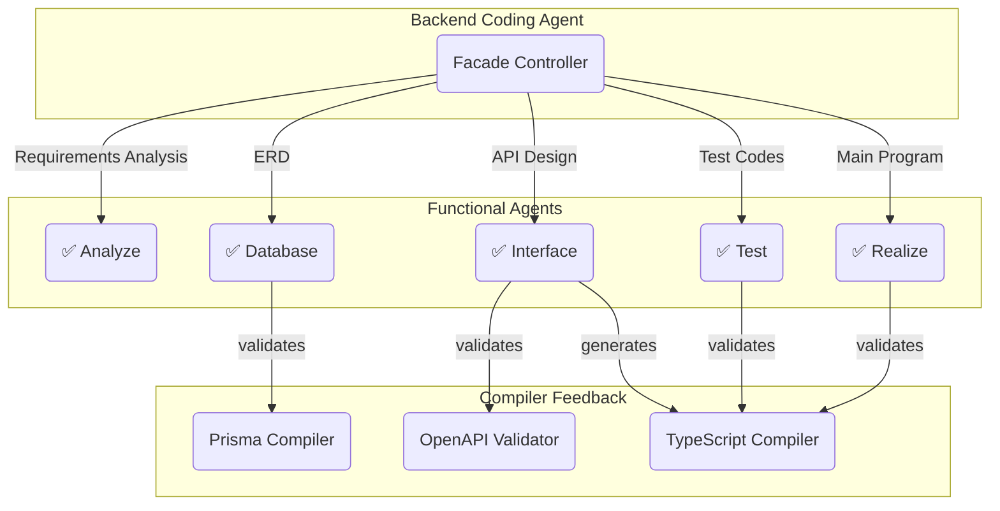

# AutoBE Generated Backend Server

A backend repository generated by [`@autobe`](https://github.com/wrtnlabs/autobe).

This backend program was automatically generated using [`@autobe`](https://github.com/wrtnlabs/autobe), the AI vibe coding agent for backend servers of below stack.

- TypeScript
- NestJS / Nestia
- Prisma
- Postgres

Also, this backend application was built following [`@autobe`](https://github.com/wrtnlabs/autobe)'s waterfall development model, where each specialized AI agent handles a specific phase of development. The process ensures 100% working code through continuous compiler feedback and validation at every stage.

Each agent receives input from previous phases and produces validated output that becomes the foundation for the next development stage. The **Facade Controller** orchestrates the entire process, while **Functional Agents** handle specialized tasks with built-in **Compiler Feedback** ensuring code quality and correctness.

Below table shows the mapping between waterfall phases, corresponding [`@autobe`](https://github.com/wrtnlabs/autobe) agents, and the actual deliverables you can find in this repository:

Waterfall Model | AutoBe Agent | Result
----------------|--------------|----------------------------------------------
Requirements    | ✅ Facade       | Conversation History
Analysis        | ✅ Analyze      | [Requirement Analysis Report](docs/analysis)
Design          | ✅ Prisma       | [Entity Relationship Diagram](docs/ERD.md) / [Prisma Schema](prisma/schema)
Design          | ✅ Interface    | [API Controllers](src/controllers) / [DTO Structures](src/api/structures)
Development     | ✅ Realize      | [API Provider Functions](src/providers)
Testing         | ✅ Test         | [E2E Test Functions](test/features/api)
Maintenance     | -            | Use Claude Code like AI coding tool please

## Project Structure

This template project has categorized directories like below.

As you can see from the below, all of the Backend source files are placed into the [src](src/) directory. When you build the TypeScript source files, compiled files would be placed into the `lib` directory following the [`tsconfig.json`](tsconfig.json) configuration. Otherwise you build client [SDK library](https://nestia.io/docs/sdk/) for npm publishing and their compiled files would be placed into the [`packages`](packages) directory.

  - [`packages/api/`](packages/api): SDK module built by `npm run build:api`
  - [`docs/`](docs/): Documentation directory
    - [`docs/analysis`](docs/analysis/): Requirement Analysis report
    - [`docs/ERD.md`](docs/ERD.md): Entity Relationship Diagram and detailed descriptions
  - [`prisma/schema`](prisma/schema): Prisma ORM schema files
  - [`src/`](src): Backend source directory
    - [`src/api/`](src/api/): Client SDK that would be published to the `@ORGANIZATION/PROJECT-api`
      - [`src/api/functional/`](src/api/functional/): API functions generated by the [`nestia`](https://github.com/samchon/nestia)
      - [`src/api/structures/`](src/api/structures/): DTO structures
    - [`src/controllers/`](src/controllers/): Controller classes of the Main Program
    - [`src/providers/`](src/providers/): Implementations of the API functions
  - [`test/`](test): Test Automation Program
    - [`test/features`](test/features): List of test functions
  - [`nestia.config.ts`](nestia.config.ts): Configuration file of [`nestia`](https://github.com/samchon/nestia)
  - [`package.json`](package.json): NPM configuration
  - [`tsconfig.json`](tsconfig.json): TypeScript configuration for the main program

## NPM Run Commands

List of the run commands defined in the [package.json](package.json) are like below:

  - Test
    - **`test`**: Run test automation program
    - `benchmark`: Run performance benchmark program
  - Build
    - `build`: Build everything
    - `build:main`: Build main program (`src` directory)
    - `build:test` Build test automation program (`test` directory)
    - `build:sdk`: Build SDK into main program only
    - `build:swagger`: Build Swagger Documents
    - **`dev`**: Incremental build for development (test program)
  - Deploy
    - `package:api`: Build and deploy the SDK library to the NPM
    - `start`: Start the backend server
    - `start:dev`: Start the backend server with incremental build and reload
  - Webpack
    - `webpack`: Run webpack bundler
    - `webpack:start`: Start the backend server built by webpack
    - `webpack:test`: Run test program to the webpack built

## Specialization

Transform this template project to be yours.

When you've created a new backend project through this template project, you can specialize it to be suitable for you by changing some words. Replace below words through IDE specific function like `Edit > Replace in Files` (*Ctrl + Shift + H*), who've been supported by the VSCode.

| Before       | After
|--------------|----------------------------------------
| ORGANIZATION | Your account or corporation name
| PROJECT      | Your own project name
| AUTHOR       | Author name
| https://github.com/samchon/nestia-start | Your repository URL

## Benchmark

### Aggregate

Phase | Generated | FCSR | Token Consumption | Elapsed Time
------|-----------|------|-------------------|--------------
✅ analyze | actors: 2, documents: 6 | 100.00 % | 2,189,300 | 2130 sec
✅ database | namespaces: 2, models: 21 | 98.36 % | 1,310,125 | 587 sec
✅ interface | operations: 68, schemas: 72 | 69.39 % | 52,002,372 | 2148 sec
✅ test | functions: 205 | 93.07 % | 17,482,752 | 1572 sec
✅ realize | functions: 102 | 89.05 % | 13,982,174 | 2115 sec

This table shows the comprehensive metrics for each phase of the AutoBE generation pipeline. For each phase (Analyze, Database, Interface, Test, Realize), it tracks:

- **Phase**: The pipeline phase with success (✅) or failure (❌) indicator
- **Generated**: Count of artifacts produced (e.g., actors, documents, namespaces, models, operations, schemas, functions)
- **FCSR**: Function calling success rate
- **Token Consumption**: Total number of LLM tokens consumed during the phase
- **Elapsed Time**: Wall-clock time taken to complete the phase, including all AI agent operations and compiler feedback loops

These aggregate metrics provide visibility into the computational cost and time requirements of the entire generation process, helping identify resource-intensive phases and overall pipeline efficiency.

### Function Calling

Type | Trial | Validation Failure | JSON Parse Error | Success | Success Rate
:----|------:|-------------------:|-----------------:|---------:|-------------:
total | 2,264 | 403 | 1 | 1,859 | 82.11 %
analyzeScenario | 5 | 0 | 0 | 5 | 100.00 %
analyzeWriteUnit | 12 | 0 | 0 | 12 | 100.00 %
analyzeWriteSection | 184 | 0 | 0 | 184 | 100.00 %
analyzeSectionReview | 14 | 0 | 0 | 14 | 100.00 %
databaseGroup | 4 | 1 | 0 | 3 | 75.00 %
databaseAuthorization | 2 | 0 | 0 | 2 | 100.00 %
databaseComponent | 3 | 0 | 0 | 3 | 100.00 %
databaseSchema | 49 | 0 | 0 | 49 | 100.00 %
databaseCorrect | 3 | 0 | 0 | 3 | 100.00 %
interfaceGroup | 3 | 0 | 0 | 3 | 100.00 %
interfaceAuthorization | 11 | 4 | 0 | 7 | 63.64 %
interfaceEndpoint | 44 | 1 | 0 | 43 | 97.73 %
interfaceOperation | 190 | 1 | 0 | 189 | 99.47 %
interfaceSchemaRename | 7 | 0 | 0 | 7 | 100.00 %
interfaceSchema | 145 | 1 | 0 | 144 | 99.31 %
interfaceSchemaRefine | 250 | 160 | 1 | 90 | 36.00 %
interfaceSchemaReview | 237 | 146 | 0 | 91 | 38.40 %
interfaceSchemaComplement | 6 | 0 | 0 | 6 | 100.00 %
interfacePrerequisite | 149 | 6 | 0 | 143 | 95.97 %
testScenario | 146 | 6 | 0 | 138 | 94.52 %
testWrite | 220 | 18 | 0 | 202 | 91.82 %
testCorrect | 96 | 6 | 0 | 90 | 93.75 %
realizeAuthorizationWrite | 6 | 0 | 0 | 6 | 100.00 %
realizeAuthorizationCorrect | 26 | 1 | 0 | 25 | 96.15 %
realizePlan | 69 | 0 | 0 | 69 | 100.00 %
realizeWrite | 342 | 41 | 0 | 301 | 88.01 %
realizeCorrect | 41 | 11 | 0 | 30 | 73.17 %

This table shows the reliability and quality metrics for AI agent function calling operations across all phases. Each row represents a specific operation type (e.g., `analyzeScenario`, `prismaSchema`, `realizeWrite`), tracking:

- **Type**: The AI agent operation name
- **Trial**: Total number of function calling attempts made by the agent
- **Validation Failure**: Calls that produced valid JSON but failed type validation
- **JSON Parse Error**: Calls that produced malformed JSON that couldn't be parsed
- **Success**: Calls that completed successfully with valid, validated responses
- **Success Rate**: Percentage of successful calls out of total attempts

These metrics reveal the effectiveness of AutoBE's validation feedback strategy powered by [`typia.llm.application<Class, Model>()`](https://typia.io/docs/llm/application/). When function calls fail type validation, detailed error messages are fed back to the AI agent, enabling iterative correction through self-healing spiral loops.

Success rates vary based on model size and capability - smaller models may have lower initial success rates. However, validation feedback enables even weaker models to achieve high success rates through automatic correction cycles, demonstrating the power of compiler-driven development.

## License

AutoBE is licensed under the [GNU Affero General Public License v3.0 (AGPL-3.0)](https://github.com/wrtnlabs/autobe/?tab=AGPL-3.0-1-ov-file#readme). If you modify AutoBE itself or offer it as a network service, you must make your source code available under the same license.

However, backend applications generated by AutoBE can be relicensed under any license you choose, such as MIT. This means you can freely use AutoBE-generated code in commercial projects without open source obligations, similar to how other code generation tools work.
