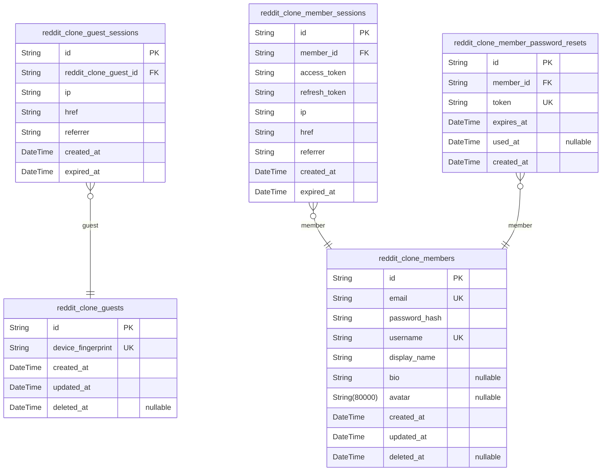
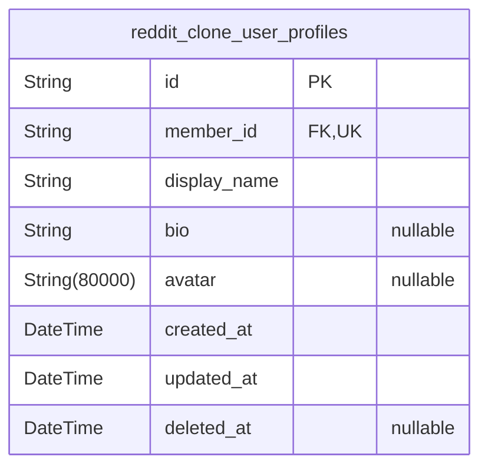
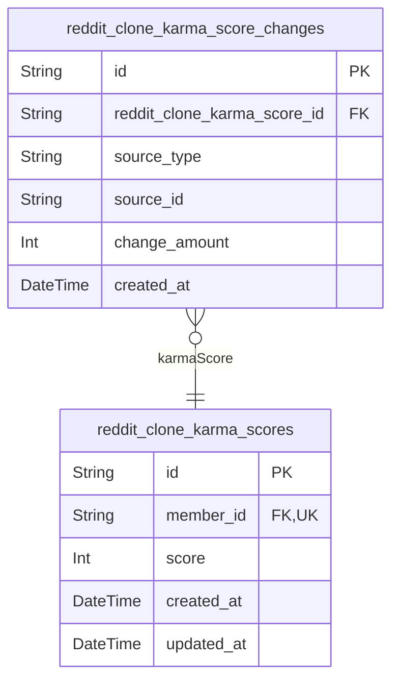
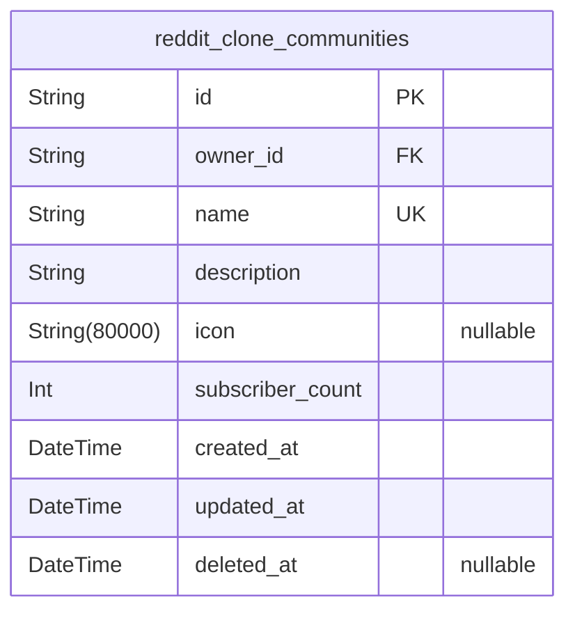
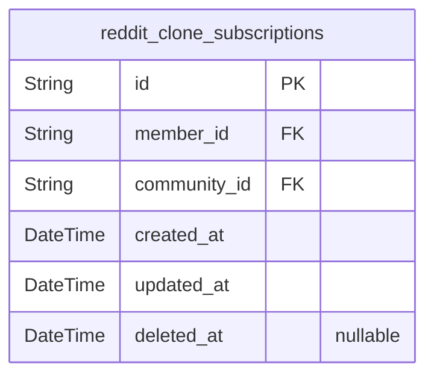
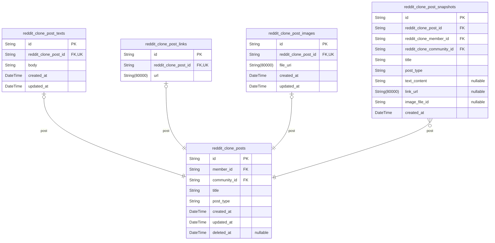
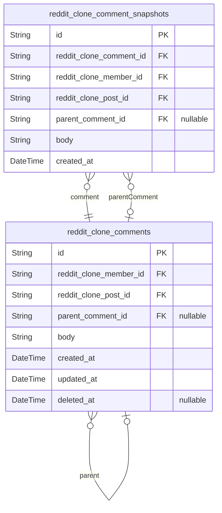
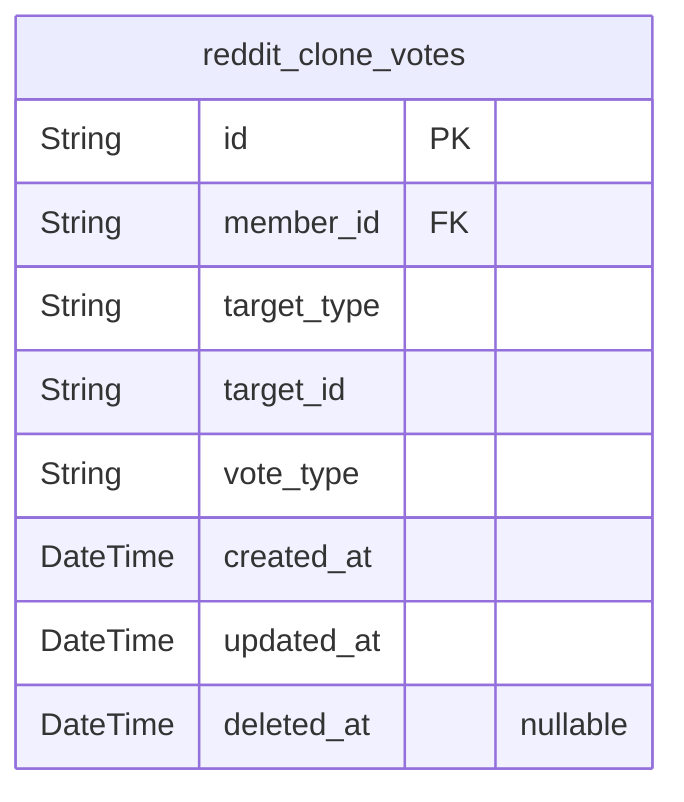
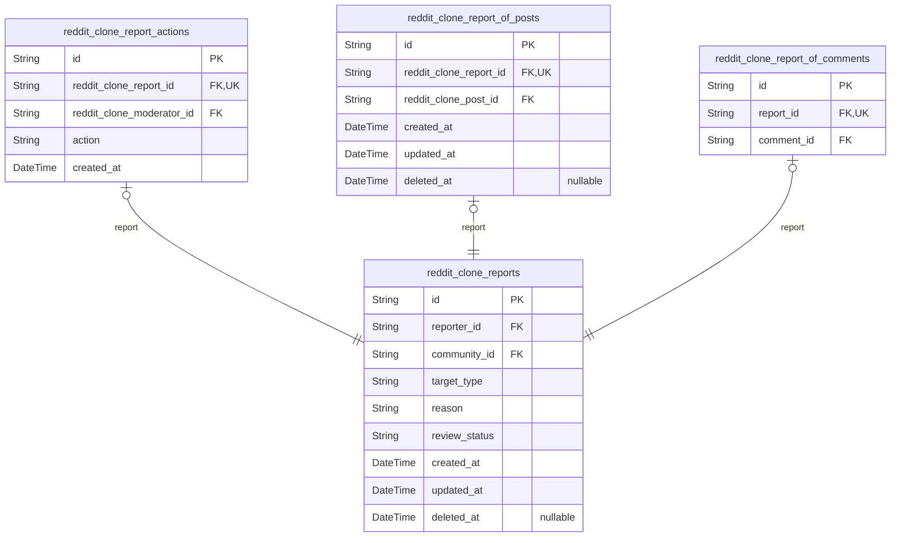
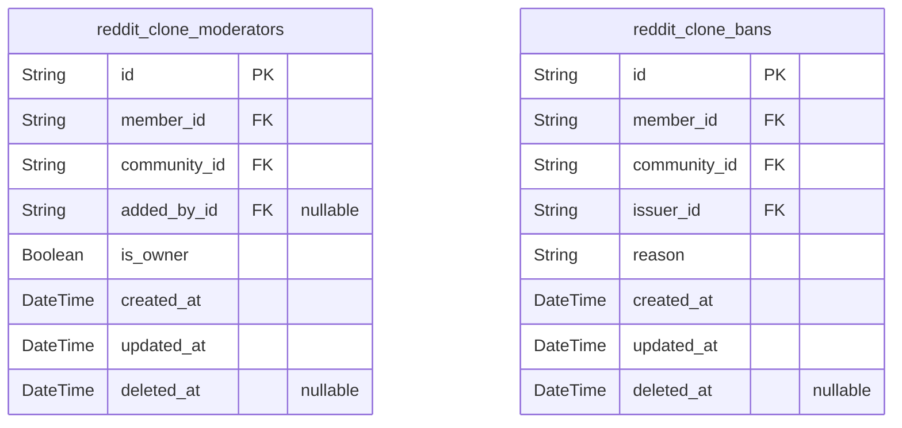

# Prisma Markdown

> Generated by [`prisma-markdown`](https://github.com/samchon/prisma-markdown)

- [Authorization](#authorization)
- [UserProfiles](#userprofiles)
- [Karma](#karma)
- [Communities](#communities)
- [Subscriptions](#subscriptions)
- [Posts](#posts)
- [Comments](#comments)
- [Votes](#votes)
- [Reports](#reports)
- [Moderation](#moderation)

## Authorization

### `reddit_clone_guests`

Temporary guest accounts for anonymous users to view feeds without
registration.

Guest accounts are identified by device fingerprint and enable
unauthenticated visitors to browse popular feeds and community content.
Each guest account has associated sessions tracked in the {@link
reddit_clone_guest_sessions} table for access control and expiration
management.

Guest accounts are temporary and may be cleaned up after extended
inactivity. They do not have voting, posting, or commenting privileges -
only viewing permissions.

Properties as follows:

- `id`: Primary Key.
- `device_fingerprint`: Unique device fingerprint identifier for anonymous guest identification.
- `created_at`: Timestamp when the guest account was created.
- `updated_at`: Timestamp when the guest account was last updated.
- `deleted_at`: Timestamp when the guest account was soft deleted, null if active.

### `reddit_clone_guest_sessions`

Temporary session tokens for guest access with expiration tracking.

Stores active guest sessions identified by device fingerprint. Each
session has an expiration time for security. Sessions are created when
guests access the platform and are used to track anonymous activity for
feed viewing permissions.

Related to [reddit_clone_guests](#reddit_clone_guests) through many-to-one relationship
(one guest can have multiple sessions).

Properties as follows:

- `id`: Primary Key.
- `reddit_clone_guest_id`: Belonged guest's [reddit_clone_guests.id](#reddit_clone_guests).
- `ip`: IP address of the guest device.
- `href`: Current page URL or entry point.
- `referrer`: Referrer URL that brought the guest to the platform.
- `created_at`: Session creation timestamp.
- `expired_at`: Session expiration timestamp for security.

### `reddit_clone_members`

Registered member accounts with email and password credentials for
authentication. Each member has a unique username and profile information
including display name, bio text, and avatar image. This is the primary
actor table for authenticated users, with sessions stored in {@link
reddit_clone_member_sessions} and password reset tokens in {@link
reddit_clone_member_password_resets}.

Properties as follows:

- `id`: Primary Key.
- `email`
  > Email address used for authentication and account recovery. Must be
  > unique across all members.
- `password_hash`
  > Bcrypt hashed password for authentication. Never store plain text
  > passwords.
- `username`
  > Unique username chosen by the member for public identification and
  > profile URLs.
- `display_name`: Display name shown on profile and posts. Can be edited by the member.
- `bio`: Biography text shown on the member's profile page. Optional field.
- `avatar`: Avatar image URL for the member's profile. Optional field.
- `created_at`: Timestamp when the member account was created.
- `updated_at`: Timestamp when the member account was last updated.
- `deleted_at`
  > Timestamp when the member account was soft deleted. Null for active
  > accounts.

### `reddit_clone_member_sessions`

JWT session tokens for member authentication with access and refresh
token support.

Tracks member login sessions including connection metadata (IP address,
request URL, referrer) and authentication tokens. Sessions are created
during login and expire based on token expiration time. This table serves
as an audit trail for member authentication events.

Related to [reddit_clone_members](#reddit_clone_members) through many-to-one relationship
where each member can have multiple active sessions.

Properties as follows:

- `id`: Primary Key.
- `member_id`: Belonged member's [reddit_clone_members.id](#reddit_clone_members).
- `access_token`: JWT access token for API authentication.
- `refresh_token`: JWT refresh token for obtaining new access tokens.
- `ip`: IP address of the client device at session creation.
- `href`: Full URL where the session was initiated.
- `referrer`: HTTP referrer header indicating the previous page or source.
- `created_at`: Session creation timestamp.
- `expired_at`: Session expiration timestamp. Session is invalid after this time.

### `reddit_clone_member_password_resets`

Password reset tokens for member password recovery workflows.

Stores temporary tokens generated when members request password resets.
Each token has an expiration time and can be used only once. After
successful password reset, the token is marked as used. Expired or used
tokens are invalid.

Related to [reddit_clone_members](#reddit_clone_members) through member ownership. Tokens
are generated during password reset requests and validated during
password change operations.

Properties as follows:

- `id`: Primary Key.
- `member_id`: Member account requesting password reset. [reddit_clone_members.id](#reddit_clone_members).
- `token`: Unique password reset token sent to user's email for verification.
- `expires_at`: Token expiration timestamp after which the token becomes invalid.
- `used_at`: Timestamp when token was consumed for password reset. Null if unused.
- `created_at`: Record creation timestamp when reset token was generated.

## UserProfiles

### `reddit_clone_user_profiles`

User profile information including display name, bio text, and avatar image.

Each member has exactly one profile that stores their public-facing
identity separate from authentication credentials. Profiles are publicly
viewable and editable by the owner. The profile references {@link
reddit_clone_members} through a 1:1 relationship.

Properties as follows:

- `id`: Primary Key.
- `member_id`: Belonged member's [reddit_clone_members.id](#reddit_clone_members).
- `display_name`: User's public display name shown on profile and posts.
- `bio`: Optional biographical text about the user.
- `avatar`: Optional avatar image URI for profile picture.
- `created_at`: Profile creation timestamp.
- `updated_at`: Last profile update timestamp.
- `deleted_at`: Soft deletion timestamp for profile removal.

## Karma

### `reddit_clone_karma_scores`

Stores each user's karma score that aggregates all vote impacts from
their posts and comments across the platform.

Each member has exactly one karma score record that tracks their
contribution reputation. The score increases when others upvote the
user's posts or comments, and decreases on downvotes. Karma can be
negative and is displayed on user profiles.

This table maintains the current score only. For audit trail and karma
change history, see [reddit_clone_karma_score_changes](#reddit_clone_karma_score_changes).

Properties as follows:

- `id`: Primary Key.
- `member_id`
  > Belonged member's [reddit_clone_members.id](#reddit_clone_members). Each user has exactly
  > one karma score record.
- `score`
  > Current karma score aggregated from all vote impacts on user's posts and
  > comments. Can be negative.
- `created_at`: Creation timestamp when the karma score record was first created.
- `updated_at`: Last update timestamp when the karma score was last modified.

### `reddit_clone_karma_score_changes`

Tracks individual karma changes with source type, amount, and timestamp
for audit trail and user karma history visibility.

Each record represents a single karma change event caused by a vote on
the user's post or comment. This table provides transparency into how
karma scores change over time and supports debugging karma calculation
issues.

Related to [reddit_clone_karma_scores](#reddit_clone_karma_scores) as the parent score record.
Source references point to either [reddit_clone_posts](#reddit_clone_posts) or {@link
reddit_clone_comments} based on source_type.

Properties as follows:

- `id`: Primary Key.
- `reddit_clone_karma_score_id`
  > Reference to the karma score record that was modified. {@link
  > reddit_clone_karma_scores.id}
- `source_type`: Type of content that caused the karma change: POST or COMMENT
- `source_id`
  > ID of the post or comment that was voted on, referencing either
  > reddit_clone_posts.id or reddit_clone_comments.id
- `change_amount`: Amount of karma change (positive for upvotes, negative for downvotes)
- `created_at`: Timestamp when the karma change occurred

## Communities

### `reddit_clone_communities`

Community spaces with unique names, descriptions, and icons.

Each community is owned by a member who created it. The owner becomes the
initial moderator and can assign additional moderators. Communities serve
as content containers for posts and organize the platform's content
structure.

Subscriber count is denormalized for performance to avoid counting
subscriptions on every read operation. Communities can be soft deleted
while preserving referential integrity with related posts and comments.

Properties as follows:

- `id`: Primary Key.
- `owner_id`: Community creator and owner's [reddit_clone_members.id](#reddit_clone_members).
- `name`: Unique community name identifier.
- `description`: Community description text explaining the community's purpose and topic.
- `icon`: Community icon image URL for visual identification.
- `subscriber_count`
  > Denormalized count of subscribers for performance optimization. Updated
  > when users subscribe/unsubscribe.
- `created_at`: Community creation timestamp.
- `updated_at`: Last update timestamp when community details were modified.
- `deleted_at`: Soft delete timestamp. Null means active community.

## Subscriptions

### `reddit_clone_subscriptions`

Junction table linking members to communities they follow, enabling
personalized feeds and posting privileges.

This table implements the many-to-many relationship between members and
communities. Each record represents a subscription where a member follows
a specific community. Subscriptions are required for members to create
posts in that community and enable personalized content feeds.

Key relationships:
- References [reddit_clone_members](#reddit_clone_members) for the subscribing member
- References [reddit_clone_communities](#reddit_clone_communities) for the subscribed community

Each member can subscribe to multiple communities, and each community can
have multiple subscribers. The unique constraint on (member_id,
community_id) prevents duplicate subscriptions.

Properties as follows:

- `id`: Primary Key.
- `member_id`: Belonged member's [reddit_clone_members.id](#reddit_clone_members).
- `community_id`: Belonged community's [reddit_clone_communities.id](#reddit_clone_communities).
- `created_at`: Timestamp when the subscription was created.
- `updated_at`: Timestamp when the subscription was last updated.
- `deleted_at`: Timestamp when the subscription was soft deleted (null if active).

## Posts

### `reddit_clone_posts`

Main posts table storing user-generated content in communities. Each post
has a title and exactly one type (text, link, or image) with content
stored in corresponding subtype tables. Posts belong to a community and
are authored by members. Vote scores and comment counts are computed at
query time through joins with reddit_clone_votes and
reddit_clone_comments tables. Related to [reddit_clone_post_texts](#reddit_clone_post_texts),
[reddit_clone_post_links](#reddit_clone_post_links), [reddit_clone_post_images](#reddit_clone_post_images) for
type-specific content, and [reddit_clone_post_snapshots](#reddit_clone_post_snapshots) for audit
trail.

Properties as follows:

- `id`: Primary Key.
- `member_id`: Author's [reddit_clone_members.id](#reddit_clone_members).
- `community_id`: Belonged community's [reddit_clone_communities.id](#reddit_clone_communities).
- `title`: Post title that is required for all post types.
- `post_type`
  > Post type discriminator: TEXT, LINK, or IMAGE. Determines which subtype
  > table contains the content.
- `created_at`: Timestamp when the post was created.
- `updated_at`: Timestamp when the post was last updated.
- `deleted_at`: Timestamp when the post was soft deleted, null if not deleted.

### `reddit_clone_post_texts`

Text content storage for text-type posts with 1:1 relationship to the
main posts table.

This subsidiary table holds the body text content exclusively for posts
where post_type is 'TEXT'. The unique foreign key constraint ensures each
post has at most one text content record, implementing the subtype
pattern to avoid nullable content fields in the main posts table.

Related to [reddit_clone_posts](#reddit_clone_posts) through a one-to-one relationship.
Sibling tables include [reddit_clone_post_links](#reddit_clone_post_links) for URL posts and
[reddit_clone_post_images](#reddit_clone_post_images) for image posts.

Properties as follows:

- `id`: Primary Key.
- `reddit_clone_post_id`
  > Reference to the parent post's [reddit_clone_posts.id](#reddit_clone_posts). Enforces
  > 1:1 relationship through unique constraint.
- `body`
  > The main text content of the post. Contains the full body text for
  > text-type posts.
- `created_at`: Timestamp when the text content was created.
- `updated_at`: Timestamp when the text content was last updated.

### `reddit_clone_post_links`

URL storage for link-type posts with 1:1 relationship to posts. Each link
post has exactly one URL reference. This table is managed through the
parent post entity and exists only for posts with type 'LINK'.

Properties as follows:

- `id`: Primary Key.
- `reddit_clone_post_id`
  > Belonged post's [reddit_clone_posts.id](#reddit_clone_posts). Unique constraint ensures
  > 1:1 relationship between post and link URL.
- `url`: URL of the link post. External web address that the post links to.

### `reddit_clone_post_images`

Image file references for image-type posts with 1:1 relationship to posts.

This subsidiary table stores the uploaded image file reference for posts
that are of type 'IMAGE'. Each image post has exactly one associated
image file, enforced by the unique constraint on the foreign key. The
actual image file is stored externally and referenced by URI.

This table is managed indirectly through the parent {@link
reddit_clone_posts} entity - when a post is created, updated, or deleted,
its corresponding image reference is handled through the same operation.
Users cannot independently manage image references separate from their
posts.

Properties as follows:

- `id`: Primary Key.
- `reddit_clone_post_id`
  > The image post's [reddit_clone_posts.id](#reddit_clone_posts). Establishes 1:1
  > relationship where each image-type post has exactly one image file
  > reference.
- `file_uri`: URI reference to the uploaded image file stored in external file storage.
- `created_at`
  > Timestamp when the image reference was created, matching the parent post
  > creation time.
- `updated_at`
  > Timestamp when the image reference was last updated, typically when the
  > post is edited with a new image.

### `reddit_clone_post_snapshots`

Point-in-time snapshots of posts for audit trail and content recovery.

Captures the complete state of a post at specific moments in time,
including denormalized content from the main post and its type-specific
subtype tables. Enables content recovery after deletion and provides an
audit trail of post modifications.

Each snapshot represents an immutable historical record that preserves
the exact state even if the original post is modified or deleted. Related
to [reddit_clone_posts](#reddit_clone_posts) as the parent entity, with denormalized
references to [reddit_clone_members](#reddit_clone_members) (author) and {@link
reddit_clone_communities} (community) for historical accuracy.

Properties as follows:

- `id`: Primary Key.
- `reddit_clone_post_id`: Parent post's [reddit_clone_posts.id](#reddit_clone_posts).
- `reddit_clone_member_id`: Author member's [reddit_clone_members.id](#reddit_clone_members) at the time of snapshot.
- `reddit_clone_community_id`
  > Community's [reddit_clone_communities.id](#reddit_clone_communities) where the post was
  > published.
- `title`: Post title at the time of snapshot.
- `post_type`: Type discriminator: TEXT, LINK, or IMAGE.
- `text_content`: Text content for TEXT-type posts. Null for LINK and IMAGE types.
- `link_url`: URL for LINK-type posts. Null for TEXT and IMAGE types.
- `image_file_id`: Image file reference for IMAGE-type posts. Null for TEXT and LINK types.
- `created_at`: Timestamp when this snapshot was created.

## Comments

### `reddit_clone_comments`

User comments on posts with support for unlimited threaded replies via
self-referential parent relationship. Each comment belongs to a post and
is authored by a member. Top-level comments have null parent_comment_id,
while replies reference their parent comment. Comments can be edited
(updated_at tracks modifications) and soft-deleted (deleted_at) for
content moderation and recovery.

Properties as follows:

- `id`: Primary Key.
- `reddit_clone_member_id`: Author member's [reddit_clone_members.id](#reddit_clone_members).
- `reddit_clone_post_id`: Belonged post's [reddit_clone_posts.id](#reddit_clone_posts).
- `parent_comment_id`
  > Parent comment's [reddit_clone_comments.id](#reddit_clone_comments) for threaded replies.
  > Null for top-level comments.
- `body`: Comment content text.
- `created_at`: Comment creation timestamp.
- `updated_at`: Last modification timestamp for edit tracking.
- `deleted_at`: Soft deletion timestamp. Null means active comment.

### `reddit_clone_comment_snapshots`

Point-in-time snapshots of comments for audit trail and content recovery.
Captures the complete state of a comment at each modification event,
enabling historical tracking and potential restoration of previous
versions. Each snapshot is immutable and append-only, creating a
permanent record of comment evolution.

Properties as follows:

- `id`: Primary Key.
- `reddit_clone_comment_id`
  > Reference to the parent comment's [reddit_clone_comments.id](#reddit_clone_comments).
  > Identifies which comment this snapshot belongs to.
- `reddit_clone_member_id`
  > Author's [reddit_clone_members.id](#reddit_clone_members) at the time of snapshot.
  > Denormalized to preserve author identity even if member account is
  > deleted.
- `reddit_clone_post_id`
  > The post's [reddit_clone_posts.id](#reddit_clone_posts) this comment belongs to.
  > Denormalized for efficient post-level history queries.
- `parent_comment_id`
  > Parent comment's [reddit_clone_comments.id](#reddit_clone_comments) for threaded replies.
  > Null for top-level comments. Denormalized to preserve thread structure at
  > snapshot time.
- `body`
  > Comment text content at the time of snapshot. Captures the exact comment
  > body as it existed when this snapshot was created.
- `created_at`
  > Timestamp when this snapshot was created. Represents the point-in-time
  > when the comment state was captured.

## Votes

### `reddit_clone_votes`

User votes on posts and comments with polymorphic target relationship.

Stores individual vote records where each member can cast one vote
(upvote or downvote) per target content (post or comment). The
polymorphic design uses target_type discriminator and target_id to
reference either posts or comments without requiring separate vote
tables.

Key relationships:
- References [reddit_clone_members.id](#reddit_clone_members) for the voting member
- Polymorphically targets either [reddit_clone_posts.id](#reddit_clone_posts) or {@link
reddit_clone_comments.id}

Vote removal is handled by soft deletion (deleted_at). Vote changes
update the vote_type field.

Properties as follows:

- `id`: Primary Key.
- `member_id`: Member who cast this vote. [reddit_clone_members.id](#reddit_clone_members).
- `target_type`
  > Type of target being voted on: POST or COMMENT. Discriminator for
  > polymorphic relationship.
- `target_id`
  > ID of the target content (post or comment) being voted on. References
  > either reddit_clone_posts.id or reddit_clone_comments.id based on
  > target_type.
- `vote_type`: Type of vote: UPVOTE or DOWNVOTE. Determines karma impact (+1 or -1).
- `created_at`: Timestamp when the vote was cast.
- `updated_at`: Timestamp when the vote was last modified (e.g., vote type changed).
- `deleted_at`
  > Timestamp when the vote was soft deleted (removed). Null if vote is
  > active.

## Reports

### `reddit_clone_reports`

User-submitted reports on posts or comments for community moderation.
Reports include the reporter's reference, target content type
discriminator, reason text, and review status for moderator workflow.
Each report is tied to a specific community and tracks the moderation
lifecycle from submission through resolution. Target content relationship
uses subtype pattern: reddit_clone_report_of_posts for post targets,
reddit_clone_report_of_comments for comment targets.

Properties as follows:

- `id`: Primary Key.
- `reporter_id`: Member who submitted the report. [reddit_clone_members.id](#reddit_clone_members)
- `community_id`
  > Community where the reported content exists. {@link
  > reddit_clone_communities.id}
- `target_type`
  > Type of target content: POST or COMMENT. Determines which subtype table
  > contains the target reference.
- `reason`: User-provided explanation for why the content is being reported.
- `review_status`
  > Current moderation status: PENDING, APPROVED, or DISMISSED. Controls
  > report visibility and workflow.
- `created_at`: Timestamp when the report was submitted.
- `updated_at`: Timestamp when the report was last updated.
- `deleted_at`: Timestamp when the report was soft deleted (e.g., after dismissal).

### `reddit_clone_report_actions`

Moderator decisions on reports tracking who approved or dismissed each
report and when.

This table records the outcome of moderator review processes. Each report
receives exactly one action - either approved (content deleted) or
dismissed (content kept). The action is immutable once recorded,
providing an audit trail of moderation decisions.

Related to [reddit_clone_reports](#reddit_clone_reports) which stores the original report
submission, and [reddit_clone_moderators](#reddit_clone_moderators) which identifies the
moderator who made the decision.

Properties as follows:

- `id`: Primary Key.
- `reddit_clone_report_id`: Report that was acted upon. [reddit_clone_reports.id](#reddit_clone_reports)
- `reddit_clone_moderator_id`: Moderator who made the decision. [reddit_clone_moderators.id](#reddit_clone_moderators)
- `action`
  > Moderator decision type. Either APPROVE (deletes reported content) or
  > DISMISS (keeps content and closes report).
- `created_at`: Timestamp when the moderator action was recorded.

### `reddit_clone_report_of_posts`

Subtype table linking reports to post targets in the polymorphic reports
system. Each report targets at most one post, enforced by unique
constraint on report_id. This table exists alongside
reddit_clone_report_of_comments to support reporting on both content
types while maintaining referential integrity and clear domain
boundaries.

Properties as follows:

- `id`: Primary Key.
- `reddit_clone_report_id`
  > Reference to the parent report. [reddit_clone_reports.id](#reddit_clone_reports). Unique
  > constraint ensures each report targets at most one post.
- `reddit_clone_post_id`: Target post being reported. [reddit_clone_posts.id](#reddit_clone_posts).
- `created_at`: Timestamp when the report-post linkage was created.
- `updated_at`: Timestamp when the report-post linkage was last updated.
- `deleted_at`: Soft delete timestamp for the report-post linkage record.

### `reddit_clone_report_of_comments`

Subtype table linking reports to comment targets in the polymorphic
reporting system. Each report can target at most one comment, enforced
through a unique constraint on the report foreign key. This table exists
to support the polymorphic relationship pattern where the main {@link
reddit_clone_reports} table uses a target_type discriminator, and
separate subtype tables store the actual foreign key references to posts
or comments. Parent temporal fields (created_at, updated_at, deleted_at)
are accessed via join to [reddit_clone_reports](#reddit_clone_reports).

Properties as follows:

- `id`: Primary Key.
- `report_id`
  > References the main report's [reddit_clone_reports.id](#reddit_clone_reports). Unique
  > constraint ensures each report targets at most one comment.
- `comment_id`: References the reported comment's [reddit_clone_comments.id](#reddit_clone_comments).

## Moderation

### `reddit_clone_moderators`

Moderator role assignments linking users to communities where they have
moderation privileges.

Each record represents a user with moderator authority in a specific
community. The community creator is automatically assigned as owner
(is_owner=true), while other moderators are added by the owner or
existing moderators. Tracks who added each moderator to enforce removal
rules (only owner can remove moderators).

Related entities: [reddit_clone_members](#reddit_clone_members) as the moderator, {@link
reddit_clone_communities} as the moderated community, {@link
reddit_clone_bans} for ban actions taken by moderators.

Properties as follows:

- `id`: Primary Key.
- `member_id`
  > User who has moderator privileges in this community. {@link
  > reddit_clone_members.id}
- `community_id`
  > Community where this user has moderator privileges. {@link
  > reddit_clone_communities.id}
- `added_by_id`
  > Moderator who added this user as moderator. Null for community owner who
  > created the community. [reddit_clone_members.id](#reddit_clone_members)
- `is_owner`
  > Whether this moderator is the community owner (creator). Owners have
  > highest authority and can remove other moderators.
- `created_at`: Timestamp when this moderator assignment was created.
- `updated_at`: Timestamp when this moderator assignment was last updated.
- `deleted_at`
  > Timestamp when this moderator assignment was soft deleted (removed). Null
  > if active.

### `reddit_clone_bans`

Tracks users banned from specific communities with issuer reference and
ban details.

Records community-level bans issued by moderators against members. Each
ban links a banned user to a community with the moderator who issued it.
Supports soft deletion for unbanning - when deleted_at is set, the ban is
lifted and the user can participate again.

Related to [reddit_clone_moderators](#reddit_clone_moderators) for moderator authority
validation and [reddit_clone_communities](#reddit_clone_communities) for community scope.
References [reddit_clone_members](#reddit_clone_members) for both the banned user and the
issuing moderator.

Properties as follows:

- `id`: Primary Key.
- `member_id`: Banned user's [reddit_clone_members.id](#reddit_clone_members).
- `community_id`: Community's [reddit_clone_communities.id](#reddit_clone_communities) where the ban applies.
- `issuer_id`: Issuing moderator's [reddit_clone_members.id](#reddit_clone_members).
- `reason`: Reason for the ban explaining why the user was banned from the community.
- `created_at`: Timestamp when the ban was issued.
- `updated_at`: Timestamp when the ban was last updated.
- `deleted_at`: Timestamp when the ban was lifted (null if still active).
