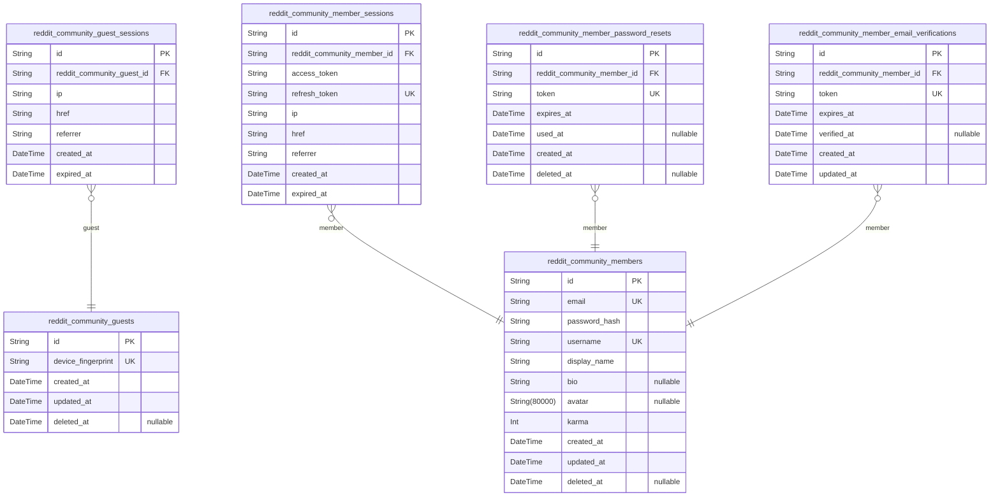
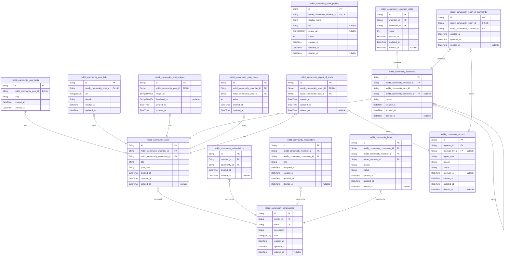

# Prisma Markdown

> Generated by [`prisma-markdown`](https://github.com/samchon/prisma-markdown)

- [authorization](#authorization)
- [reddit_community](#reddit_community)

## authorization

### `reddit_community_guests`

Temporary guest accounts identified by device fingerprint for anonymous
content viewing.

Guest accounts provide limited access to public content without requiring
registration. Each guest is identified by a unique device fingerprint,
allowing the system to track guest sessions and maintain basic state
across requests. Guests can view popular feeds, community feeds, user
profiles, and posts, but cannot create content, vote, or subscribe to
communities.

The device fingerprint serves as the primary identifier for guest users,
enabling session continuity across requests without requiring
authentication. Guest accounts are temporary and may be cleaned up
periodically based on activity and age.

Properties as follows:

- `id`: Primary Key.
- `device_fingerprint`
  > Unique device identifier for guest tracking.
  >
  > The device fingerprint is a hash or identifier derived from the user's
  > device characteristics (browser, OS, IP, etc.). This allows the system to
  > recognize returning guests without requiring authentication. Each
  > fingerprint must be unique to prevent duplicate guest accounts.
- `created_at`
  > Timestamp when the guest account was created.
  >
  > Records the initial creation time of the guest account. Used for
  > analytics, session management, and cleanup of old guest accounts.
- `updated_at`
  > Timestamp when the guest account was last updated.
  >
  > Updated whenever the guest account record is modified. Used for tracking
  > changes and determining account activity.
- `deleted_at`
  > Timestamp when the guest account was soft deleted.
  >
  > If set, indicates the guest account has been deleted but retained for
  > audit purposes. Guest accounts may be cleaned up periodically based on
  > this field.

### `reddit_community_guest_sessions`

Temporary session tokens for guest access with expiration tracking.

Stores authentication session data for guest users who access the
platform without registration. Each session has a unique token and
expiration time for security. Sessions are created when a guest first
visits and expire after a defined period.

References [reddit_community_guests](#reddit_community_guests) for the guest identity. Tracks
IP address and referrer for analytics and security auditing.

Properties as follows:

- `id`: Primary Key.
- `reddit_community_guest_id`
  > References the guest user who owns this session.
  >
  > Links to [reddit_community_guests](#reddit_community_guests) to identify which guest device
  > this session belongs to. Each guest can have multiple active sessions.
- `ip`
  > IP address of the guest device.
  >
  > Captured at session creation for security auditing and rate limiting.
  > Used to detect suspicious activity patterns.
- `href`
  > Current page URL when session was created.
  >
  > Tracks the entry point for analytics and user journey mapping.
- `referrer`
  > Referrer URL that led to this session.
  >
  > Used for traffic source analysis and understanding how guests discover
  > the platform.
- `created_at`
  > Timestamp when this session was created.
  >
  > Used for session age calculation and cleanup of expired sessions.
- `expired_at`
  > Timestamp when this session expires.
  >
  > Guest sessions have a fixed lifetime for security. After this time, the
  > session is invalid and the guest must create a new session.

### `reddit_community_members`

Registered member accounts with email/password authentication
credentials, unique username, profile information, and karma reputation
score.

This table represents authenticated users who can create posts, comments,
vote, subscribe to communities, and moderate content. Each member has a
unique email for login and a unique username for public identification.

Profile fields include display_name for public display, bio for
self-description, and avatar for profile image. The karma score tracks
user reputation based on votes received on their posts and comments.

Properties as follows:

- `id`: Primary key for member account identification.
- `email`
  > Unique email address for authentication and account recovery.
  >
  > Used as the primary login credential along with password. Must be unique
  > across all members. Also used for password reset and email verification
  > flows.
- `password_hash`
  > Bcrypt hashed password for authentication.
  >
  > Never stored in plain text. Generated during registration and verified
  > during login. Changed through password reset or password change flows.
- `username`
  > Unique username for public identification and mentions.
  >
  > Chosen by the user during registration. Used for displaying author names
  > on posts and comments, and for user mentions. Must be unique across all
  > members.
- `display_name`
  > Public display name shown on user profile.
  >
  > Can be edited by the user. Used as the primary name displayed on the
  > user's profile page and in user listings.
- `bio`
  > User-written biographical text for profile.
  >
  > Optional self-description displayed on the user's profile page. Can be
  > edited or cleared by the user at any time.
- `avatar`
  > Profile avatar image URL.
  >
  > Optional image displayed alongside the user's username and display name.
  > Stored as a URI pointing to the image file.
- `karma`
  > Reputation score based on votes received on user's content.
  >
  > Increases by 1 for each upvote on user's posts and comments. Decreases by
  > 1 for each downvote. Can be negative. Updated automatically when votes
  > are cast or removed.
- `created_at`: Timestamp when the member account was created.
- `updated_at`: Timestamp when the member account was last updated.
- `deleted_at`
  > Timestamp when the member account was soft deleted.
  >
  > Null for active accounts. Set when user deletes their account, triggering
  > cascade deletion of their posts and comments.

### `reddit_community_member_sessions`

JWT session tokens for member authentication with access and refresh
token support.

Stores authentication session data including JWT tokens, client
information, and expiration tracking. Each session belongs to exactly one
[reddit_community_members](#reddit_community_members) and is created during login. Sessions
are append-only audit trails managed through authentication flows.

Token Management: access_token and refresh_token store JWT credentials.
Refresh tokens are unique for lookup and revocation. Expired sessions are
identified by expired_at timestamp.

Security: expired_at is NOT NULL to enforce session expiration. Client
metadata (ip, href, referrer) enables security auditing and suspicious
activity detection.

Properties as follows:

- `id`: Primary Key.
- `reddit_community_member_id`
  > Reference to the [reddit_community_members](#reddit_community_members) who owns this session.
  >
  > Establishes ownership relationship between session and member. Each
  > session belongs to exactly one member. Sessions are created during member
  > login and deleted during logout or expiration.
- `access_token`
  > JWT access token for API authentication.
  >
  > Short-lived token used for authenticating API requests. Contains member
  > identity and permissions. Validated on each request.
- `refresh_token`
  > JWT refresh token for obtaining new access tokens.
  >
  > Long-lived token used to request new access tokens without
  > re-authentication. Unique constraint enables token lookup for revocation.
  > Stored securely and rotated on use.
- `ip`
  > Client IP address at session creation.
  >
  > Captured for security auditing and suspicious activity detection. Enables
  > detection of concurrent sessions from different locations.
- `href`
  > Current page URL at session creation.
  >
  > Records the page where login occurred. Useful for redirect after
  > authentication and analytics.
- `referrer`
  > Referrer URL at session creation.
  >
  > Tracks where the user came from before login. Useful for analytics and
  > understanding user journey.
- `created_at`
  > Session creation timestamp.
  >
  > Records when the session was created. Used for sorting sessions and
  > calculating session age.
- `expired_at`
  > Session expiration timestamp.
  >
  > Determines when the session becomes invalid. NOT NULL to enforce
  > expiration policy. Sessions past this time are rejected.

### `reddit_community_member_password_resets`

Password reset tokens for member account recovery.

Stores temporary tokens that allow members to reset their passwords when
they forget their credentials. Each token is single-use and expires after
a short period for security.

**Token Lifecycle**: Tokens are generated when a member requests password
reset, sent via email, and consumed when the member submits a new
password. After use or expiration, tokens become invalid.

**Security**: [reddit_community_members](#reddit_community_members) can have multiple pending
reset tokens, but only the most recent one should be valid in practice.
Expired tokens are cleaned up periodically.

Properties as follows:

- `id`: Primary Key.
- `reddit_community_member_id`
  > Reference to the member requesting password reset.
  >
  > Links this reset token to the [reddit_community_members](#reddit_community_members) account it
  > belongs to. When the member account is deleted, all their pending reset
  > tokens are also deleted via cascade.
- `token`
  > Unique password reset token sent to member's email.
  >
  > Random secure token generated when member requests password reset. Used
  > as lookup key when member clicks reset link. Single-use: becomes invalid
  > after password is changed or token expires.
- `expires_at`
  > Token expiration timestamp for security.
  >
  > Password reset tokens are short-lived (typically 1-24 hours). After this
  > time, the token cannot be used even if not yet consumed. Required field
  > (NOT NULL) following session table security pattern.
- `used_at`
  > Timestamp when token was consumed for password reset.
  >
  > Null until member successfully uses this token to reset their password.
  > After use, token becomes invalid even if not expired. Allows audit trail
  > of password reset activity.
- `created_at`: Token creation timestamp.
- `deleted_at`
  > Soft delete timestamp for token invalidation.
  >
  > Allows administrative invalidation of tokens without hard deletion. Also
  > set when token is consumed or expired for audit purposes.

### `reddit_community_member_email_verifications`

Email verification tokens for member registration confirmation.

Stores temporary verification tokens sent to new members during
registration. Tokens are single-use and expire after a configured time
period. Once verified, the token is consumed and the member's email
status is updated.

References [reddit_community_members](#reddit_community_members) for the member account being
verified. Each member can have multiple verification attempts over time
(e.g., if tokens expire), but only one pending verification at a time.

Properties as follows:

- `id`: Primary Key.
- `reddit_community_member_id`
  > Reference to the member account being verified.
  >
  > Links to [reddit_community_members](#reddit_community_members) to identify which member owns
  > this verification token. When the member is deleted, cascading deletion
  > removes all associated verification tokens.
- `token`
  > Verification token sent to the member's email address.
  >
  > Random secure token generated during registration. Used to verify email
  > ownership when the member clicks the verification link. Single-use:
  > consumed upon successful verification.
- `expires_at`
  > Token expiration timestamp.
  >
  > Verification tokens are time-limited for security. After this timestamp,
  > the token is invalid and the member must request a new verification
  > email. Typical expiration is 24-48 hours.
- `verified_at`
  > Timestamp when the token was successfully used for verification.
  >
  > Null until the member clicks the verification link and the token is
  > validated. Once set, indicates the email has been confirmed. Used to
  > prevent token reuse.
- `created_at`: Record creation timestamp.
- `updated_at`: Record last update timestamp.

## reddit_community

### `reddit_community_user_profiles`

User profile data including display name, bio, avatar image, and karma
score.

This table stores the public-facing profile information for {@link
reddit_community_members}. Each member has exactly one profile, enforced
by a unique foreign key constraint. The profile contains display
preferences and reputation metrics that are separate from authentication
credentials.

**Profile Fields**

The display_name is shown publicly instead of the username. The bio is
optional markdown-formatted text describing the user. The avatar_url
points to the user's profile image.

**Karma System**

The karma field tracks the user's reputation score based on votes
received on their posts and comments. Karma increases by 1 for each
upvote and decreases by 1 for each downvote. Karma can be negative and is
updated atomically when votes are cast or removed.

Properties as follows:

- `id`: Primary Key.
- `reddit_community_member_id`
  > References the [reddit_community_members](#reddit_community_members) table that owns this
  > profile.
  >
  > This foreign key establishes a one-to-one relationship between members
  > and profiles. Each member has exactly one profile, and each profile
  > belongs to exactly one member. The unique constraint ensures no member
  > can have multiple profiles.
- `display_name`
  > The user's public display name shown on posts, comments, and profile
  > pages.
  >
  > This is the name other users see when viewing content created by this
  > member. It can be changed by the user at any time and is distinct from
  > the username used for authentication.
- `bio`
  > Optional biographical text describing the user.
  >
  > This markdown-formatted text appears on the user's profile page. Users
  > can edit or clear their bio at any time. Maximum length should be
  > enforced at the application layer.
- `avatar_url`
  > URL pointing to the user's avatar/profile image.
  >
  > This URI references an uploaded image file displayed alongside the user's
  > content. Users can upload a new avatar or remove their existing one. Null
  > indicates no avatar is set.
- `karma`
  > The user's reputation score based on votes received on their content.
  >
  > Karma increases by 1 for each upvote and decreases by 1 for each downvote
  > on the user's posts and comments. This value can be negative. The score
  > is updated atomically when votes are cast, changed, or removed via {@link
  > reddit_community_post_votes} and [reddit_community_comment_votes](#reddit_community_comment_votes).
- `created_at`: Timestamp when the profile was created.
- `updated_at`: Timestamp when the profile was last updated.
- `deleted_at`: Timestamp when the profile was soft-deleted. Null if active.

### `reddit_community_communities`

Community definitions representing topic-based discussion spaces within
the platform.

Each community serves as a container for posts and comments, with its own
identity, subscriber base, and moderation structure. Communities are
created by members who become owners with full administrative authority.

The [reddit_community_members](#reddit_community_members) table stores the community owner
reference. The [reddit_community_subscriptions](#reddit_community_subscriptions) table tracks all
subscriber relationships. The [reddit_community_moderators](#reddit_community_moderators) table
defines moderator assignments. The [reddit_community_posts](#reddit_community_posts) table
contains all posts within this community.

Properties as follows:

- `id`: Primary Key.
- `owner_id`
  > Reference to the member who created and owns this community.
  >
  > The owner has the highest authority level within the community, including
  > the ability to add or remove moderators, manage bans, and delete any
  > content. This relationship establishes ownership and administrative
  > control.
- `name`
  > Unique community name used for identification and URL routing.
  >
  > This is the public-facing identifier for the community, displayed in URLs
  > and search results. Must be unique across all communities to prevent
  > naming conflicts.
- `description`
  > Community description explaining the topic, purpose, and rules.
  >
  > Provides context for potential subscribers about what content belongs in
  > this community. Displayed on the community page and in search results.
- `icon`
  > URL to the community's icon or avatar image.
  >
  > Visual identifier displayed alongside the community name in feeds, search
  > results, and community pages. Stored as a URI pointing to the hosted
  > image file.
- `created_at`: Timestamp when the community was created.
- `updated_at`: Timestamp when the community was last modified.
- `deleted_at`: Timestamp when the community was soft-deleted, null if active.

### `reddit_community_posts`

Post metadata including title, type discriminator, author, community, and
timestamps.

This is the central table for all posts in the system. Each post belongs
to exactly one [reddit_community_members](#reddit_community_members) (author) and one {@link
reddit_community_communities}. The post_type field indicates which
type-specific table contains the actual content: {@link
reddit_community_post_texts} for text posts, {@link
reddit_community_post_links} for link posts, or {@link
reddit_community_post_images} for image posts.

Vote scores and comment counts are NOT stored here - they are calculated
at query time from [reddit_community_post_votes](#reddit_community_post_votes) and {@link
reddit_community_comments} respectively. This avoids data duplication and
ensures consistency.

Properties as follows:

- `id`: Primary Key.
- `reddit_community_member_id`
  > Reference to the [reddit_community_members](#reddit_community_members) who authored this post.
  >
  > Every post must have exactly one author. This is a required relationship
  > - posts cannot exist without an author.
- `reddit_community_community_id`
  > Reference to the [reddit_community_communities](#reddit_community_communities) this post belongs
  > to.
  >
  > Every post must be posted in exactly one community. This is a required
  > relationship.
- `title`
  > The title of the post.
  >
  > This is a required field for all posts regardless of type. Maximum length
  > should be enforced at the application layer.
- `post_type`
  > Discriminator indicating the type of post content.
  >
  > Allowed values: 'text', 'link', 'image'. This field determines which
  > type-specific table contains the actual content: 'text' maps to {@link
  > reddit_community_post_texts}, 'link' maps to {@link
  > reddit_community_post_links}, 'image' maps to {@link
  > reddit_community_post_images}.
- `created_at`: Timestamp when the post was created.
- `updated_at`: Timestamp when the post was last updated.
- `deleted_at`: Timestamp when the post was soft-deleted. NULL if the post is active.

### `reddit_community_post_texts`

Text content for text-type posts in one-to-one relationship with posts.

This table stores the body text content exclusively for posts of type
'text'. Each record corresponds to exactly one post, enforced by a unique
constraint on the foreign key. This design follows the 1:1 relationship
pattern, avoiding nullable fields on the parent {@link
reddit_community_posts} table.

The body field contains the full text content of the post, which can be
formatted with markdown. Temporal fields track creation and last
modification times for audit purposes.

Properties as follows:

- `id`: Primary Key.
- `reddit_community_post_id`
  > Reference to the parent post that this text content belongs to.
  >
  > This foreign key establishes a one-to-one relationship with {@link
  > reddit_community_posts}. The unique constraint ensures each post has at
  > most one text content record, enforcing the mutually exclusive post type
  > design where a post is either text, link, or image type.
- `body`
  > The main text content of the post.
  >
  > This field contains the full body text that the user wrote for their
  > text-type post. Content may include markdown formatting. Maximum length
  > should be enforced at the application layer based on business
  > requirements.
- `created_at`
  > Timestamp when this text content was created.
  >
  > Automatically set when the post is initially created. Used for audit
  > trails and sorting.
- `updated_at`
  > Timestamp when this text content was last updated.
  >
  > Updated whenever the user edits their post content. Used to track
  > modification history and display 'edited' indicators.

### `reddit_community_post_links`

Link-specific data for link-type posts including URL and extracted domain.

This table stores the URL and domain information for posts with type
'link'. Each record corresponds to exactly one post, forming a one-to-one
relationship. Separating link data from the main posts table maintains
3NF compliance by avoiding nullable fields when posts can be text, link,
or image types.

The domain field is extracted from the URL for display purposes and
enables searching posts by domain (e.g., finding all posts from
'github.com').

Properties as follows:

- `id`: Primary Key.
- `reddit_community_post_id`
  > References the parent post that this link data belongs to.
  >
  > This foreign key establishes a one-to-one relationship with {@link
  > reddit_community_posts}. Each link record corresponds to exactly one
  > post, and each link-type post has exactly one link record. The unique
  > constraint ensures this 1:1 cardinality.
- `url`
  > The full URL of the link post.
  >
  > This is the actual web address that users share when creating a link-type
  > post. Must be a valid URI format. This is the primary content of a link
  > post, displayed to users when viewing the post.
- `domain`
  > The extracted domain name from the URL for display and search.
  >
  > This field contains the domain portion of the URL (e.g., 'github.com',
  > 'youtube.com') extracted for user-friendly display and efficient
  > domain-based searching. Enables features like finding all posts from a
  > specific domain.
- `created_at`: Timestamp when this link record was created.
- `updated_at`: Timestamp when this link record was last updated.

### `reddit_community_post_images`

Image data for image-type posts including original image URL and optional
thumbnail.

This table stores image references for posts with type 'image'. Each
record corresponds to exactly one post through a unique foreign key
constraint. The image_url field contains the original uploaded image
location, while thumbnail_url stores a smaller preview version generated
during upload processing.

Lifecycle is tied to [reddit_community_posts](#reddit_community_posts) - when a post is
deleted, its image record is cascade deleted. Thumbnails may be null
initially if async generation is pending.

Properties as follows:

- `id`: Primary Key.
- `reddit_community_post_id`
  > References the parent post this image belongs to.
  >
  > This foreign key establishes a one-to-one relationship with {@link
  > reddit_community_posts}. The unique constraint ensures each post has at
  > most one image record. Cascade delete removes image data when parent post
  > is deleted.
- `image_url`
  > URL of the original uploaded image.
  >
  > This field stores the location of the full-resolution image file uploaded
  > by the user. Must be a valid URI pointing to accessible image storage.
  > Required for all image-type posts.
- `thumbnail_url`
  > URL of the generated thumbnail image.
  >
  > Optional thumbnail version of the original image, typically smaller
  > dimensions for preview purposes. May be null if thumbnail generation is
  > pending or failed. Generated asynchronously after upload.
- `created_at`
  > Timestamp when this image record was created.
  >
  > Automatically set when the image post is created. Used for sorting and
  > audit purposes.
- `updated_at`
  > Timestamp when this image record was last updated.
  >
  > Updated whenever image metadata changes, such as when thumbnail
  > generation completes. Used for cache invalidation and audit tracking.

### `reddit_community_comments`

User comments on posts with support for nested replies through
self-referencing parent comment.

Comments are the primary way users engage with post content. Each comment
belongs to exactly one post and is authored by one member. Comments can
reply to other comments, creating unlimited nesting depth through the
parent comment reference.

The vote score is computed from [reddit_community_comment_votes](#reddit_community_comment_votes)
and not stored here to maintain 3NF compliance. Soft delete via
deleted_at preserves reply threads when parent comments are removed.

Properties as follows:

- `id`: Primary Key.
- `reddit_community_member_id`
  > The member who authored this comment.
  >
  > Links to [reddit_community_members](#reddit_community_members) to identify the comment author.
  > This relationship is required - every comment must have an author.
- `reddit_community_post_id`
  > The post this comment belongs to.
  >
  > Links to [reddit_community_posts](#reddit_community_posts) to establish the comment's parent
  > post. This relationship is required - every comment must belong to
  > exactly one post.
- `reddit_community_comment_id`
  > The parent comment this comment replies to.
  >
  > Links to [reddit_community_comments](#reddit_community_comments) for nested reply threading.
  > Null for top-level comments that directly reply to the post. Enables
  > unlimited nesting depth through self-reference.
- `content`
  > The text content of the comment.
  >
  > Contains the actual comment text written by the member. This is the
  > primary content field and is required for all comments.
- `created_at`
  > Timestamp when the comment was created.
  >
  > Records the exact time the comment was first submitted. Used for sorting
  > comments chronologically and displaying 'time since posted'.
- `updated_at`
  > Timestamp when the comment was last updated.
  >
  > Updated whenever the comment content is edited. Allows tracking
  > modification history and showing edit indicators to users.
- `deleted_at`
  > Timestamp when the comment was soft-deleted.
  >
  > Null for active comments. Set when a user deletes their comment or a
  > moderator removes it. Enables content recovery and maintains referential
  > integrity for replies.

### `reddit_community_post_votes`

User votes on posts with vote value enforcing one vote per user per post.

Tracks individual votes cast by members on posts. Each member can vote
only once per post, with the vote value being +1 for upvote or -1 for
downvote. The unique constraint on member and post combination enforces
this business rule at the database level.

Vote scores on [reddit_community_posts](#reddit_community_posts) are calculated by summing
all vote values. When a member changes their vote, the value is updated.
When a member removes their vote, the record is deleted.

Properties as follows:

- `id`: Primary Key.
- `reddit_community_member_id`
  > Reference to the member who cast the vote.
  >
  > Links to [reddit_community_members](#reddit_community_members) to identify which authenticated
  > user voted. Combined with post_id in a unique constraint to enforce one
  > vote per member per post.
- `reddit_community_post_id`
  > Reference to the post being voted on.
  >
  > Links to [reddit_community_posts](#reddit_community_posts) to identify which post received
  > the vote. Combined with member_id in a unique constraint to enforce one
  > vote per member per post.
- `value`
  > Vote value: +1 for upvote, -1 for downvote.
  >
  > Represents the direction of the member's vote. Positive value indicates
  > upvote, negative value indicates downvote. The sum of all values for a
  > post determines its vote score.
- `created_at`: Timestamp when the vote was first cast.
- `updated_at`
  > Timestamp when the vote was last modified (e.g., changed from upvote to
  > downvote).

### `reddit_community_comment_votes`

User votes on comments with vote value enforcing one vote per user per
comment.

Tracks individual voting behavior on comments. Each member can cast
exactly one vote per comment, either upvote (+1) or downvote (-1). The
unique constraint on member_id and comment_id prevents duplicate votes.

Vote scores are calculated by summing all vote values for a comment. When
a member changes their vote, the value is updated. When a member removes
their vote, the record is soft-deleted via deleted_at timestamp.

Properties as follows:

- `id`: Primary Key.
- `member_id`
  > Reference to the member who cast the vote.
  >
  > Links to [reddit_community_members](#reddit_community_members) to identify which authenticated
  > user voted. Combined with comment_id in a unique index to enforce one
  > vote per member per comment.
- `comment_id`
  > Reference to the comment being voted on.
  >
  > Links to [reddit_community_comments](#reddit_community_comments) to identify the target of the
  > vote. Combined with member_id in a unique index to enforce one vote per
  > member per comment.
- `value`
  > Vote value indicating upvote or downvote.
  >
  > Positive one (+1) represents an upvote, negative one (-1) represents a
  > downvote. The sum of all vote values for a comment determines its vote
  > score.
- `created_at`: Timestamp when the vote was first cast.
- `updated_at`
  > Timestamp when the vote was last modified. Updated when a member changes
  > their vote from upvote to downvote or vice versa.
- `deleted_at`
  > Timestamp when the vote was soft-deleted. Null when the vote is active.
  > Set when a member removes their vote, allowing for potential recovery and
  > audit trail.

### `reddit_community_subscriptions`

Junction table tracking user subscriptions to communities.

Records when a member subscribes to a community, enabling content
filtering and access control. Each subscription links exactly one member
to one community with timestamp tracking.

Subscriptions are required for posting in communities. Unsubscribing uses
soft delete (deleted_at) to preserve historical data while marking the
subscription as inactive. The unique constraint on (member_id,
community_id) prevents duplicate subscriptions.

Properties as follows:

- `id`: Primary Key.
- `member_id`
  > Reference to the subscribing member.
  >
  > Links to [reddit_community_members](#reddit_community_members) to identify which user holds
  > this subscription. Members can subscribe to multiple communities,
  > creating multiple subscription records.
- `community_id`
  > Reference to the subscribed community.
  >
  > Links to [reddit_community_communities](#reddit_community_communities) to identify which community
  > the member is subscribed to. Communities can have multiple subscribers,
  > creating multiple subscription records.
- `created_at`
  > Timestamp when the subscription was created.
  >
  > Records the exact moment when the member subscribed to the community.
  > Used for sorting subscription lists and tracking user engagement history.
- `deleted_at`
  > Timestamp when the subscription was cancelled (soft delete).
  >
  > Null value indicates active subscription. When set, marks the
  > subscription as unsubscribed while preserving historical record. Enables
  > features like 'previously subscribed communities' and audit trails.

### `reddit_community_moderators`

Moderator assignments linking members to communities with role type and
assignment date.

Tracks which users have moderation authority over which communities. Each
assignment specifies whether the user is an owner (highest authority,
created the community) or a moderator (added by owner or other
moderators). A member can only have one role per community.

Related to [reddit_community_members](#reddit_community_members) through the member foreign
key and [reddit_community_communities](#reddit_community_communities) through the community
foreign key. Used by moderation operations to authorize actions like
deleting posts, banning users, and managing other moderators.

Properties as follows:

- `id`: Primary Key.
- `reddit_community_member_id`
  > Reference to the member who is a moderator of the community.
  >
  > Links to [reddit_community_members](#reddit_community_members) to identify the user with
  > moderation authority. This member can perform moderation actions based on
  > their role (owner or moderator). Cannot be null as every moderator
  > assignment must have a member.
- `reddit_community_community_id`
  > Reference to the community being moderated.
  >
  > Links to [reddit_community_communities](#reddit_community_communities) to identify the community
  > where this member has moderation authority. The community owner and
  > moderators can manage content and users within this community. Cannot be
  > null as every moderator assignment must target a community.
- `role`
  > The type of moderation role: owner or moderator.
  >
  > Owner is the highest authority, typically the user who created the
  > community. Owners can add and remove moderators, including other
  > moderators. Moderators can add other moderators but cannot remove owners
  > or other moderators. Owners can delete any content and ban users;
  > moderators have similar content moderation powers but limited moderator
  > management authority.
- `assigned_at`
  > Timestamp when the moderator assignment was created.
  >
  > Records when the member was granted moderation authority over the
  > community. For owners, this is typically the community creation time. For
  > added moderators, this is when an existing moderator assigned them. Used
  > for audit trails and sorting moderators by seniority.
- `created_at`: Timestamp when this moderator assignment record was created.
- `updated_at`: Timestamp when this moderator assignment record was last updated.
- `deleted_at`
  > Timestamp when this moderator assignment was soft deleted (null if
  > active).
  >
  > Used for soft delete functionality to preserve audit history. When a
  > moderator is removed, this field is set instead of deleting the record.
  > Allows tracking of historical moderator assignments and potential
  > restoration.

### `reddit_community_bans`

Community bans restricting user posting privileges with reason and status.

Each ban record represents a restriction applied to a specific user
within a specific community. The ban prevents the user from creating
posts and comments in that community while maintaining their ability to
view all content.

The status field tracks whether the ban is currently active or has been
removed by a moderator. When active, the user cannot create new content.
When removed, the user regains full posting privileges. A user can only
have one ban record per community, with the status updated rather than
creating duplicate records.

Moderators and community owners issue bans to enforce community rules.
The issuer is tracked for accountability and audit purposes.

Properties as follows:

- `id`: Primary Key.
- `reddit_community_community_id`
  > Reference to the community where the ban applies.
  >
  > Each ban is scoped to exactly one community. The restriction only affects
  > the user's ability to create content within this specific community. The
  > user can still participate in other communities where they are not
  > banned.
- `reddit_community_member_id`
  > Reference to the member who is banned from the community.
  >
  > This is the user who has restricted posting privileges in the community.
  > When the ban status is active, this member cannot create posts or
  > comments in the associated community. The member retains viewing access
  > to all community content.
- `issuer_member_id`
  > Reference to the moderator or owner who issued the ban.
  >
  > Tracks which moderator or community owner enacted the ban for
  > accountability and audit purposes. This allows communities to maintain
  > records of enforcement actions and enables oversight of moderation
  > decisions.
- `reason`
  > Documentation of why the ban was issued.
  >
  > Provides context for the moderation action, helping other moderators
  > understand the enforcement history. The reason is visible to moderators
  > in the banned users list for oversight and reference purposes.
- `status`
  > Current ban status indicating whether restrictions are active or removed.
  >
  > When 'active', the member cannot create posts or comments in the
  > community but can view all content. When 'removed', the member regains
  > full posting privileges. Status transitions from inactive to active when
  > a moderator bans a user, and from active to inactive when unbanned.
- `created_at`: Timestamp when the ban was created.
- `updated_at`: Timestamp when the ban was last updated.
- `deleted_at`: Timestamp for soft delete. Null when active.

### `reddit_community_reports`

Content reports filed by users on posts or comments with reason and
resolution status.

Reports enable community moderation by allowing users to flag
inappropriate content. Each report includes the reporter's identity, the
reason for reporting, and tracks the resolution workflow through
moderator review.

Report lifecycle: Reports start as 'pending' when filed. Moderators
review and either 'approve' (content deleted) or 'dismiss' (content kept,
report removed from queue). Approved reports result in content deletion
per moderation policies.

Polymorphic design: Uses report_type discriminator to target either
[reddit_community_posts](#reddit_community_posts) or [reddit_community_comments](#reddit_community_comments).
Subtype tables reddit_community_report_of_posts and
reddit_community_report_of_comments maintain 1:1 relationships with
specific content references, avoiding nullable foreign keys.

Properties as follows:

- `id`: Primary Key.
- `reporter_id`
  > Reference to the member who filed this report.
  >
  > Links to [reddit_community_members](#reddit_community_members) to identify the user who
  > submitted the report. This enables tracking reporter history and
  > preventing abuse through rate limiting.
- `resolved_by_id`
  > Reference to the moderator who resolved this report.
  >
  > Links to [reddit_community_members](#reddit_community_members) to track which moderator made
  > the resolution decision. Nullable for pending reports that have not yet
  > been reviewed.
- `report_type`
  > Discriminator for the type of content being reported.
  >
  > Values: 'post' or 'comment'. Determines which subtype table contains the
  > target reference. Used for polymorphic relationship pattern to avoid
  > nullable foreign keys.
- `reason`
  > The reporter's explanation for why this content violates community
  > guidelines.
  >
  > Required text field capturing the user's justification for the report.
  > Helps moderators understand the concern and make informed decisions.
- `status`
  > Current resolution status of this report.
  >
  > Values: 'pending' (awaiting moderator review), 'approved' (content
  > deleted), 'dismissed' (content kept). Drives the moderation workflow and
  > determines report visibility in moderator queues.
- `resolved_at`
  > Timestamp when the moderator resolved this report.
  >
  > Populated when status changes from 'pending' to 'approved' or
  > 'dismissed'. Nullable for pending reports.
- `created_at`: Timestamp when this report was filed.
- `updated_at`: Timestamp when this report was last updated.
- `deleted_at`
  > Timestamp when this report was soft deleted.
  >
  > Nullable field for soft delete support. Allows reports to be marked as
  > deleted without removing from database, supporting data retention and
  > recovery policies.

### `reddit_community_report_of_posts`

Subtype table linking reports to specific posts with unique 1:1
relationship to reddit_community_reports.

This table implements the polymorphic relationship pattern where reports
can target either posts or comments. Each report record in {@link
reddit_community_reports} has exactly one corresponding record in either
this table or [reddit_community_report_of_comments](#reddit_community_report_of_comments), never both.

The unique constraint on reddit_community_report_id enforces the 1:1
relationship, ensuring each report targets exactly one post.

Properties as follows:

- `id`: Primary Key.
- `reddit_community_report_id`
  > Reference to the parent report record.
  >
  > This foreign key establishes the 1:1 relationship with {@link
  > reddit_community_reports}. Each report must target exactly one content
  > item (either a post or a comment), enforced by the unique constraint on
  > this field.
- `reddit_community_post_id`
  > Reference to the post being reported.
  >
  > This foreign key links to [reddit_community_posts](#reddit_community_posts), identifying the
  > specific post that was reported. Combined with the report reference, this
  > creates the complete report-to-post relationship.
- `created_at`
  > Timestamp when the report-post relationship was created.
  >
  > Automatically set when the report is filed against a post. Used for
  > auditing and chronological sorting of reports.
- `updated_at`
  > Timestamp when the report-post relationship was last updated.
  >
  > Updated whenever the report record is modified. Maintains consistency
  > with other domain tables.
- `deleted_at`
  > Timestamp for soft deletion of the report-post relationship.
  >
  > When set, indicates the relationship has been logically deleted while
  > preserving audit history. NULL means the record is active.

### `reddit_community_report_of_comments`

Subtype table linking content reports to specific comments.

Implements the polymorphic relationship where {@link
reddit_community_reports} can target either posts or comments. This table
handles comment-targeted reports with a unique 1:1 relationship to the
parent report.

Each record represents one report filed against a specific comment. The
unique constraint on [reddit_community_report_id](#reddit_community_report_id) ensures each
report targets exactly one entity type (post OR comment, never both).
Moderators resolve reports by approving (deleting content) or dismissing
(keeping content) as defined in reporting requirements.

Properties as follows:

- `id`: Primary Key.
- `reddit_community_report_id`
  > References the parent report entity.
  >
  > Unique constraint enforces 1:1 relationship: each report targets exactly
  > one entity type. Links to [reddit_community_reports](#reddit_community_reports) which contains
  > the reporter, reason, and resolution status.
- `reddit_community_comment_id`
  > References the comment being reported.
  >
  > Links to [reddit_community_comments](#reddit_community_comments) to identify the specific
  > content that was reported. Used by moderators to review and resolve the
  > report.
- `created_at`: Timestamp when this report-comment linkage was created.
- `updated_at`: Timestamp when this record was last updated.
- `deleted_at`: Soft delete timestamp. Null when active.
