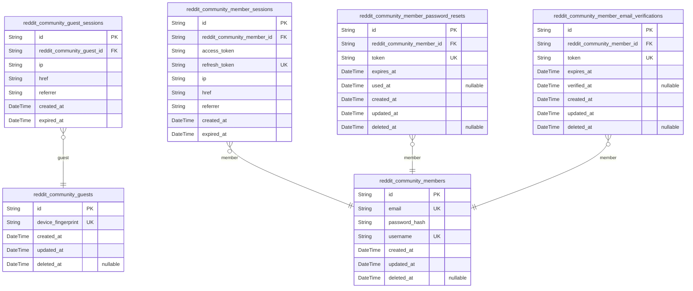
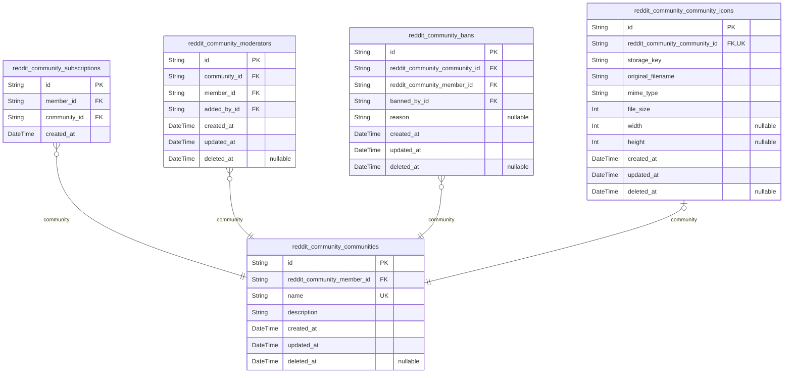
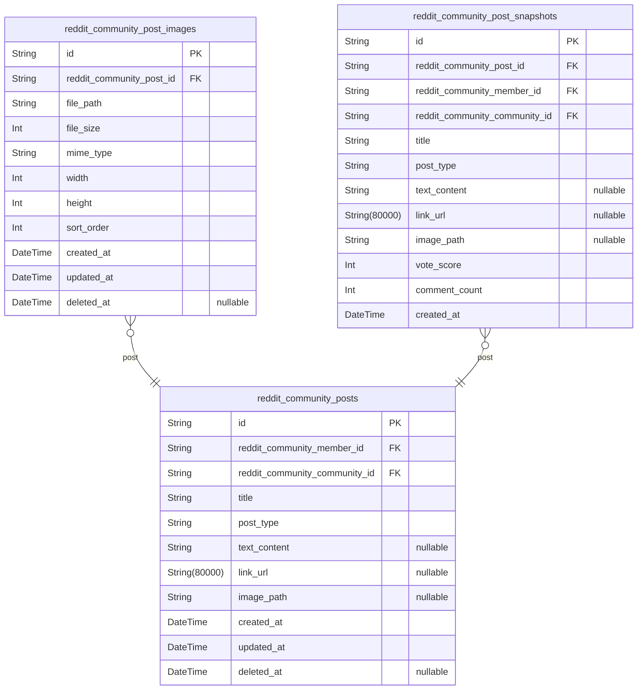
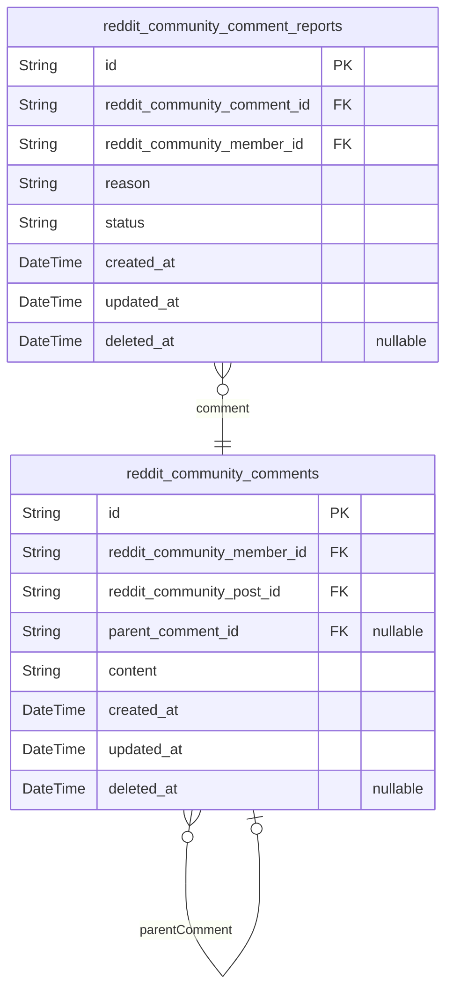
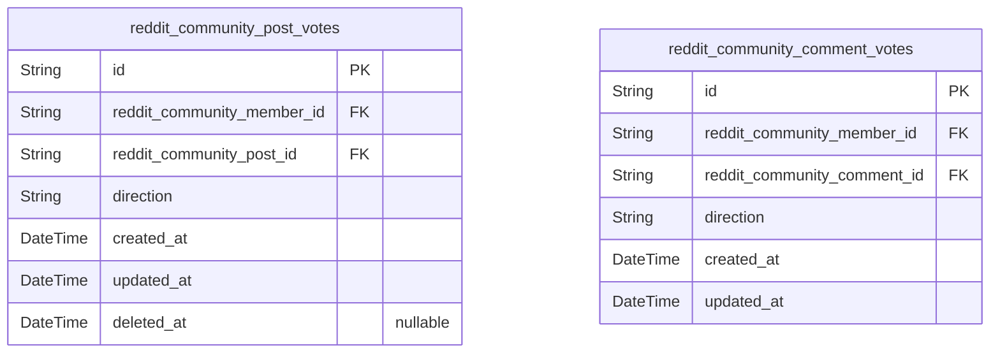
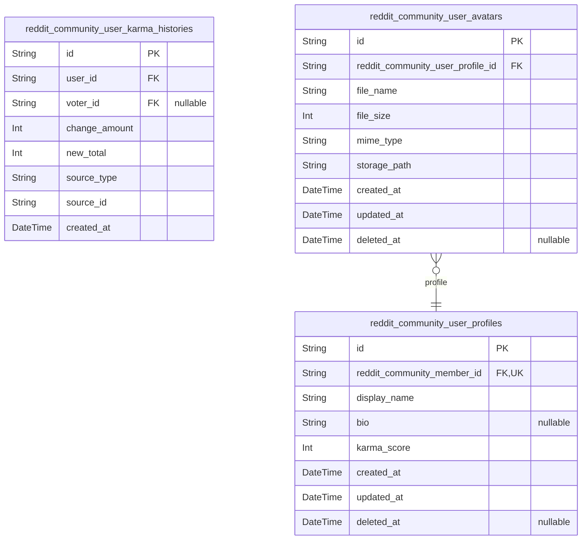

# Prisma Markdown

> Generated by [`prisma-markdown`](https://github.com/samchon/prisma-markdown)

- [authorization](#authorization)
- [community](#community)
- [post](#post)
- [comment](#comment)
- [vote](#vote)
- [UserProfile](#userprofile)

## authorization

### `reddit_community_guests`

Temporary guest accounts identified by device fingerprint for anonymous
browsing access.

Guest actors represent unauthenticated visitors who can browse content
without registration. Each guest is identified by a unique device
fingerprint, enabling session tracking and temporary access management.
Guest accounts are ephemeral and do not have persistent credentials like
email or password.

Properties as follows:

- `id`: Primary Key.
- `device_fingerprint`: Unique device identifier for guest session tracking and access control.
- `created_at`: Record creation timestamp.
- `updated_at`: Record last update timestamp.
- `deleted_at`: Soft delete timestamp for guest account deactivation.

### `reddit_community_guest_sessions`

Temporary session tokens for guest access with expiration tracking. Each
session belongs to exactly one guest and tracks browsing context
including IP address, current page, and referrer for security and
analytics purposes.

Properties as follows:

- `id`: Primary Key.
- `reddit_community_guest_id`: Reference to the guest account. [reddit_community_guests.id](#reddit_community_guests).
- `ip`: IP address of the guest session for security tracking.
- `href`: Current page URL the guest is viewing.
- `referrer`: Referrer URL that brought the guest to the current page.
- `created_at`: Timestamp when the session was created.
- `expired_at`: Timestamp when the session expires and becomes invalid.

### `reddit_community_members`

Registered member accounts with email/password credentials and unique
username for authentication.

This table stores the core identity and authentication data for members.
Email serves as the primary login identifier and must be unique. Password
is stored as a secure hash. Username is a user-chosen unique identifier
for public display and mention purposes.

Profile information (display name, bio, avatar) is stored in {@link
reddit_community_user_profiles} to separate authentication concerns from
public profile data. Sessions are tracked in {@link
reddit_community_member_sessions}. Password recovery uses {@link
reddit_community_member_password_resets}. Email verification uses {@link
reddit_community_member_email_verifications}.

Properties as follows:

- `id`: Primary Key.
- `email`: Email address for login and account communication. Must be unique.
- `password_hash`: Bcrypt or argon2 hashed password for authentication.
- `username`: Unique username chosen by the member for public display and mentions.
- `created_at`: Account creation timestamp.
- `updated_at`: Last account update timestamp.
- `deleted_at`: Soft delete timestamp. Null means account is active.

### `reddit_community_member_sessions`

JWT session tokens with access and refresh token support for member
authentication. Tracks client session metadata including IP address,
current page, and referrer for security auditing. Each session belongs to
exactly one member and has an expiration timestamp for automatic session
invalidation.

Properties as follows:

- `id`: Primary Key.
- `reddit_community_member_id`: Member's [reddit_community_members.id](#reddit_community_members).
- `access_token`: JWT access token for API authentication.
- `refresh_token`: JWT refresh token for obtaining new access tokens.
- `ip`: Client IP address at session creation.
- `href`: Current page URL at session creation.
- `referrer`: Referring page URL at session creation.
- `created_at`: Session creation timestamp.
- `expired_at`: Session expiration timestamp for automatic invalidation.

### `reddit_community_member_password_resets`

Password reset tokens with expiration for secure password recovery flow.

Tracks password reset requests initiated by members. Each token is
single-use and expires after a configured time period. Used for audit
trail of password recovery attempts and security monitoring.

Properties as follows:

- `id`: Primary Key.
- `reddit_community_member_id`
  > Reference to the member requesting password reset. {@link
  > reddit_community_members.id}.
- `token`: Unique password reset token sent to member's email.
- `expires_at`: Token expiration timestamp after which reset is invalid.
- `used_at`: Timestamp when token was used for password reset, null if unused.
- `created_at`: Record creation timestamp.
- `updated_at`: Record last update timestamp.
- `deleted_at`: Soft delete timestamp, null if active.

### `reddit_community_member_email_verifications`

Email verification tokens for new member registration confirmation.
Stores unique verification codes sent to user email addresses during
registration. Token is consumed when user clicks verification link,
setting verified_at timestamp. Expired tokens prevent stale verification
attempts.

Properties as follows:

- `id`: Primary Key.
- `reddit_community_member_id`: Member's [reddit_community_members.id](#reddit_community_members).
- `token`: Unique verification token sent to user email.
- `expires_at`: Token expiration timestamp for security.
- `verified_at`: Timestamp when email was verified (null if pending).
- `created_at`: Record creation timestamp.
- `updated_at`: Record last update timestamp.
- `deleted_at`: Soft delete timestamp for record retention.

## community

### `reddit_community_communities`

Community entities representing user-created spaces for content sharing
and discussion. Each community has a unique name, description, and an
owner (the member who created it). Communities can be soft-deleted while
preserving referential integrity. Community icons are stored in {@link
reddit_community_community_icons} and reference back to this model.

Properties as follows:

- `id`: Primary Key.
- `reddit_community_member_id`
  > Owner's [reddit_community_members.id](#reddit_community_members). The member who created this
  > community.
- `name`: Unique community name used for identification and URLs.
- `description`: Community description text explaining purpose and rules.
- `created_at`: Timestamp when the community was created.
- `updated_at`: Timestamp when the community was last updated.
- `deleted_at`: Timestamp when the community was soft-deleted. Null if active.

### `reddit_community_subscriptions`

User subscriptions to communities enabling membership and post creation
eligibility. Links [reddit_community_members](#reddit_community_members) to {@link
reddit_community_communities} with unique constraint preventing duplicate
subscriptions per user-community pair.

Properties as follows:

- `id`: Primary Key.
- `member_id`: Target's [reddit_community_members.id](#reddit_community_members).
- `community_id`: Target's [reddit_community_communities.id](#reddit_community_communities).
- `created_at`: Subscription creation timestamp.

### `reddit_community_moderators`

Moderation team members with access to moderate community content and
manage bans. Links members to communities they moderate, tracking who
added each moderator for audit purposes.

Properties as follows:

- `id`: Primary Key.
- `community_id`: Target's [reddit_community_communities.id](#reddit_community_communities).
- `member_id`: Target's [reddit_community_members.id](#reddit_community_members).
- `added_by_id`
  > Target's [reddit_community_members.id](#reddit_community_members). The member who added this
  > moderator to the community.
- `created_at`: Timestamp when this moderator was added to the community moderation team.
- `updated_at`: Timestamp when this moderator record was last updated.
- `deleted_at`
  > Timestamp when this moderator was removed from the community (soft
  > delete). Null if still active.

### `reddit_community_bans`

Banned users per community restricting their ability to create content
while allowing viewing. Moderators issue bans to enforce community rules,
and banned users lose posting privileges but retain read access. Soft
delete via deleted_at enables unbanning while preserving audit trail.

Properties as follows:

- `id`: Primary Key.
- `reddit_community_community_id`
  > Community where the ban is enforced. {@link
  > reddit_community_communities.id}.
- `reddit_community_member_id`
  > Banned user who cannot create content in this community. {@link
  > reddit_community_members.id}.
- `banned_by_id`: Moderator who issued this ban. [reddit_community_members.id](#reddit_community_members).
- `reason`: Optional reason for the ban provided by the moderator.
- `created_at`: Timestamp when the ban was issued.
- `updated_at`: Timestamp when the ban was last updated.
- `deleted_at`: Timestamp when the ban was removed (unbanned). Null if still active.

### `reddit_community_community_icons`

Community icon image files with storage metadata and community reference.
Each community can have one icon image stored separately from the
community entity for file management flexibility. The icon references the
community via [reddit_community_communities](#reddit_community_communities).

Properties as follows:

- `id`: Primary Key.
- `reddit_community_community_id`
  > Reference to the community this icon belongs to. {@link
  > reddit_community_communities.id}.
- `storage_key`: Unique storage identifier for the image file in object storage.
- `original_filename`: Original filename of the uploaded image.
- `mime_type`: MIME type of the image file (e.g., image/png, image/jpeg).
- `file_size`: File size in bytes.
- `width`: Image width in pixels.
- `height`: Image height in pixels.
- `created_at`: Timestamp when the icon was uploaded.
- `updated_at`: Timestamp when the icon was last updated.
- `deleted_at`: Timestamp when the icon was soft deleted (null if active).

## post

### `reddit_community_posts`

User-created posts within communities supporting three content types:
text, link, or image. Each post belongs to exactly one community and is
authored by one member. Type-specific content fields (text_content,
link_url, image_path) are mutually exclusive based on post_type
discriminator. Vote scores and comment counts are computed at query time
for feed display.

Properties as follows:

- `id`: Primary Key.
- `reddit_community_member_id`: Author's [reddit_community_members.id](#reddit_community_members).
- `reddit_community_community_id`: Community's [reddit_community_communities.id](#reddit_community_communities).
- `title`: Post title displayed in feeds and post detail view.
- `post_type`: Content type discriminator: text, link, or image.
- `text_content`: Text body content for text-type posts. Null for link/image posts.
- `link_url`: External URL for link-type posts. Null for text/image posts.
- `image_path`
  > Storage path for single image post. Null for text/link posts. Multiple
  > images stored in reddit_community_post_images.
- `created_at`: Post creation timestamp.
- `updated_at`: Last modification timestamp.
- `deleted_at`: Soft delete timestamp. Null if active.

### `reddit_community_post_images`

Image attachments for image-type posts. Supports multiple images per post
with ordering. Stores file metadata including storage path, size, MIME
type, and dimensions. Managed through parent post entity.

Properties as follows:

- `id`: Primary Key.
- `reddit_community_post_id`: Parent post's [reddit_community_posts.id](#reddit_community_posts).
- `file_path`: Storage path or URL for the image file.
- `file_size`: File size in bytes.
- `mime_type`: MIME type of the image (e.g., image/jpeg, image/png).
- `width`: Image width in pixels.
- `height`: Image height in pixels.
- `sort_order`: Display order for multiple images on the same post.
- `created_at`: Record creation timestamp.
- `updated_at`: Record last update timestamp.
- `deleted_at`: Soft delete timestamp, null if active.

### `reddit_community_post_snapshots`

Point-in-time snapshots of post state for audit trail, compliance, and
content recovery.

Captures complete post state including title, content, type, author,
community, and metrics at specific moments. Immutable append-only records
enable content recovery and historical analysis.

Properties as follows:

- `id`: Primary Key.
- `reddit_community_post_id`
  > Reference to the post being snapshotted. {@link
  > reddit_community_posts.id}.
- `reddit_community_member_id`: Post author at time of snapshot. [reddit_community_members.id](#reddit_community_members).
- `reddit_community_community_id`
  > Community where post was published. {@link
  > reddit_community_communities.id}.
- `title`: Post title at time of snapshot.
- `post_type`: Content type: TEXT, LINK, or IMAGE.
- `text_content`: Text body for TEXT type posts.
- `link_url`: URL for LINK type posts.
- `image_path`: Image file path for IMAGE type posts.
- `vote_score`: Cached vote score (upvotes minus downvotes) at snapshot time.
- `comment_count`: Total comment count at snapshot time.
- `created_at`: Snapshot creation timestamp.

## comment

### `reddit_community_comments`

User comments on posts with optional parent_comment_id for nested replies.

Comments support unlimited nesting depth through self-referential
parent_comment_id. Each comment belongs to a post and has an author. Soft
delete supported via deleted_at for content recovery. Vote scores are
computed at query time from reddit_community_comment_votes table.

Properties as follows:

- `id`: Primary Key.
- `reddit_community_member_id`: Comment author. [reddit_community_members.id](#reddit_community_members).
- `reddit_community_post_id`: Target post. [reddit_community_posts.id](#reddit_community_posts).
- `parent_comment_id`: Parent comment for nested replies. [reddit_community_comments.id](#reddit_community_comments).
- `content`: Comment text content.
- `created_at`: Comment creation timestamp.
- `updated_at`: Last update timestamp.
- `deleted_at`: Soft delete timestamp for content recovery.

### `reddit_community_comment_reports`

Moderation reports on comments with reporter, reason, and status for
moderator review workflow. Links to [reddit_community_comments.id](#reddit_community_comments)
for the reported content and [reddit_community_members.id](#reddit_community_members) for the
reporting user. Moderators use this table to review, approve (deletes
content), or dismiss reports as part of community moderation.

Properties as follows:

- `id`: Primary Key.
- `reddit_community_comment_id`: Target's [reddit_community_comments.id](#reddit_community_comments).
- `reddit_community_member_id`: Target's [reddit_community_members.id](#reddit_community_members).
- `reason`: User-provided explanation for why the comment is being reported.
- `status`
  > Report workflow status: PENDING for new reports, APPROVED when moderator
  > accepts and deletes content, DISMISSED when moderator rejects.
- `created_at`: Timestamp when the report was created.
- `updated_at`: Timestamp when the report was last modified.
- `deleted_at`: Timestamp for soft delete, null if active.

## vote

### `reddit_community_post_votes`

User votes on posts with direction (upvote/downvote) and unique user-post
constraint. Each member can vote once per post, with ability to change
vote direction or remove vote entirely. Vote score calculations aggregate
this table's direction values.

Properties as follows:

- `id`: Primary Key.
- `reddit_community_member_id`: Voting member's [reddit_community_members.id](#reddit_community_members).
- `reddit_community_post_id`: Voted post's [reddit_community_posts.id](#reddit_community_posts).
- `direction`
  > Vote direction: UPVOTE or DOWNVOTE. Determines karma impact on post
  > author.
- `created_at`: Vote creation timestamp.
- `updated_at`: Vote last modification timestamp (when direction changed).
- `deleted_at`: Soft delete timestamp for vote removal tracking.

### `reddit_community_comment_votes`

User votes on comments with direction (upvote/downvote) and unique
user-comment constraint. Each member can cast one vote per comment, which
can be changed or removed. Updates the comment's cached vote_score and
triggers karma history entries for the comment author.

Properties as follows:

- `id`: Primary Key.
- `reddit_community_member_id`: Voter's [reddit_community_members.id](#reddit_community_members).
- `reddit_community_comment_id`: Target's [reddit_community_comments.id](#reddit_community_comments).
- `direction`: Vote direction: UPVOTE or DOWNVOTE.
- `created_at`: Record creation timestamp.
- `updated_at`: Last update timestamp.

## UserProfile

### `reddit_community_user_profiles`

Public user profiles with display name, bio text, and cached karma score.

Each member has exactly one profile containing public-facing information
visible to other users. The profile is created automatically when a
member account is created and is managed through the member's account
settings. Karma score is cached and updated via triggers when votes are
cast on the user's posts and comments. User avatars are stored in {@link
reddit_community_user_avatars} and reference back to this model.

Properties as follows:

- `id`: Primary Key.
- `reddit_community_member_id`: Reference to the member account. [reddit_community_members.id](#reddit_community_members).
- `display_name`: Public display name shown to other users throughout the platform.
- `bio`: Optional biographical text about the user visible on their profile page.
- `karma_score`
  > Cached karma score calculated from upvotes and downvotes on user's posts
  > and comments.
- `created_at`: Timestamp when the profile was created.
- `updated_at`: Timestamp when the profile was last updated.
- `deleted_at`: Timestamp for soft delete. Null means the profile is active.

### `reddit_community_user_karma_histories`

Audit trail of karma score changes triggered by votes on user posts and
comments. Each record captures a single karma change event with the
change amount, new total score, source content type and ID, and voter
reference. Append-only snapshot table for tracking karma history and
debugging score calculations.

Properties as follows:

- `id`: Primary Key.
- `user_id`: User whose karma score changed. [reddit_community_members.id](#reddit_community_members).
- `voter_id`
  > User who cast the vote that triggered this karma change. {@link
  > reddit_community_members.id}.
- `change_amount`
  > Karma change amount from this vote event. Positive for upvotes, negative
  > for downvotes.
- `new_total`: User's total karma score after this change was applied.
- `source_type`: Type of content that received the vote: POST or COMMENT.
- `source_id`
  > ID of the post or comment that received the vote and triggered this karma
  > change.
- `created_at`: Timestamp when this karma change occurred.

### `reddit_community_user_avatars`

Avatar image files uploaded by users for their profiles with storage
metadata. Each record represents one avatar file linked to a user profile
via [reddit_community_user_profiles](#reddit_community_user_profiles). The profile table references
the current avatar while this table maintains upload history.

Properties as follows:

- `id`: Primary Key.
- `reddit_community_user_profile_id`: User profile's [reddit_community_user_profiles.id](#reddit_community_user_profiles).
- `file_name`: Original filename of the uploaded avatar image.
- `file_size`: File size in bytes.
- `mime_type`: MIME type of the image (e.g., image/jpeg, image/png).
- `storage_path`: Storage path or URL for the avatar image file.
- `created_at`: Timestamp when the avatar was uploaded.
- `updated_at`: Timestamp when the avatar record was last updated.
- `deleted_at`: Timestamp when the avatar was soft deleted (null if active).
