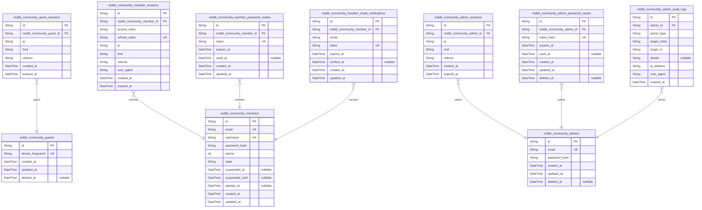
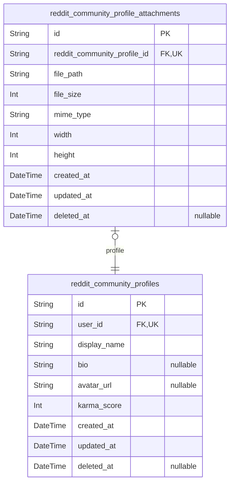
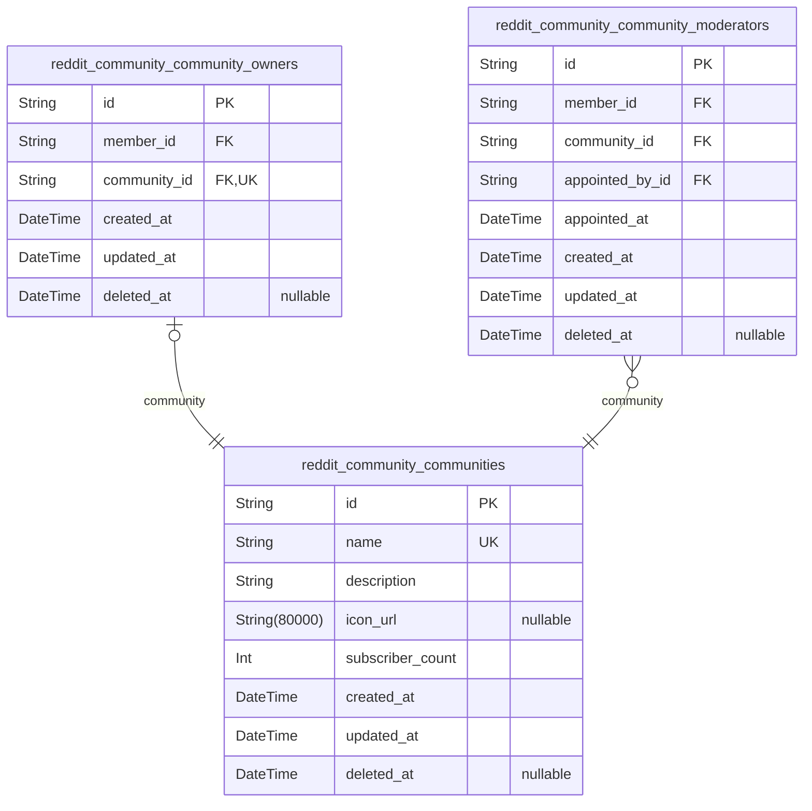
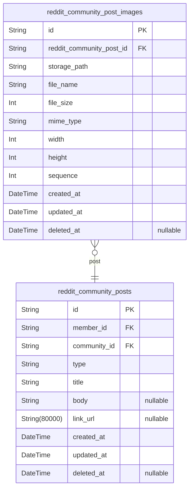
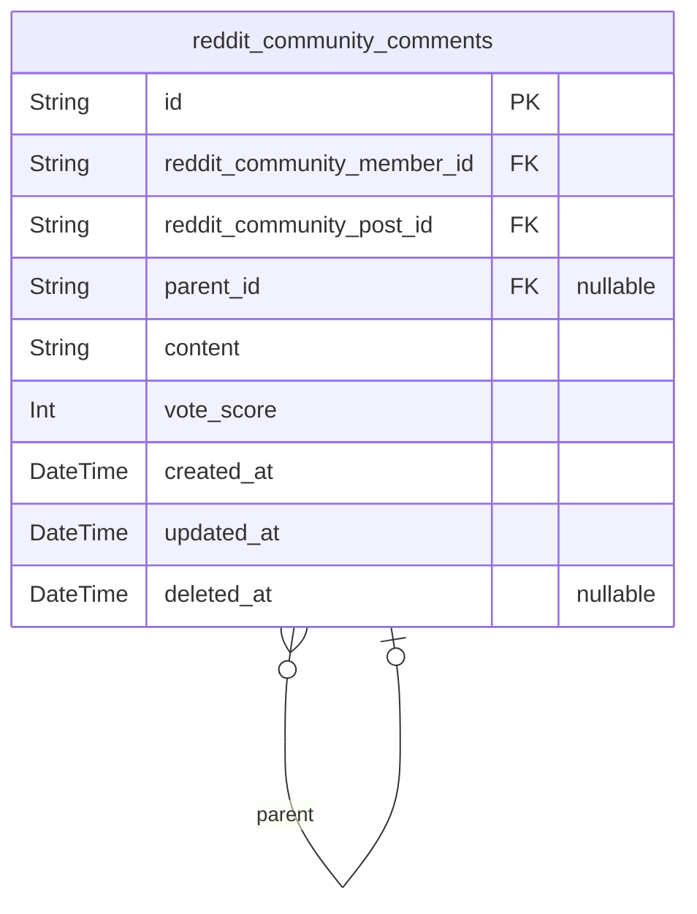
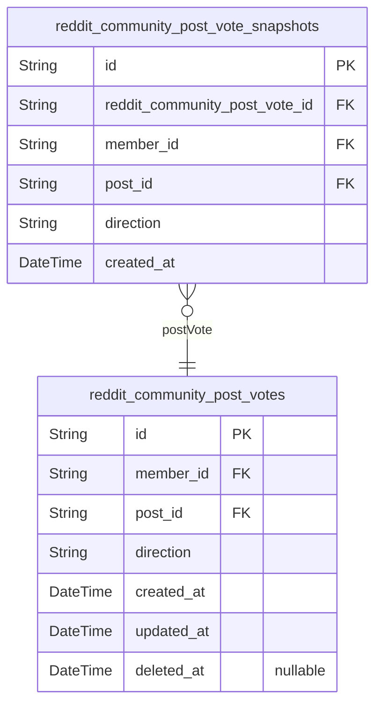
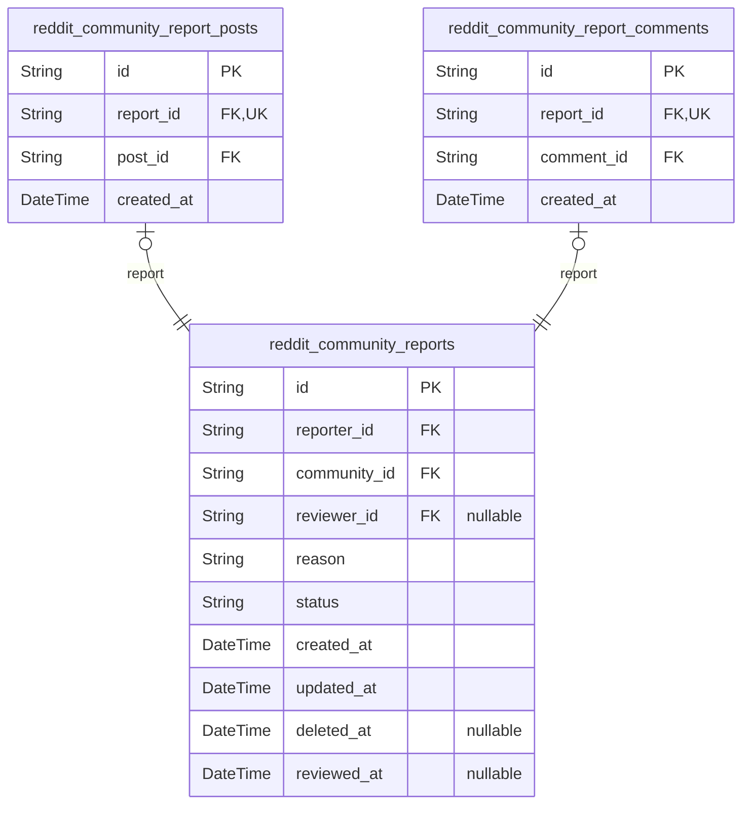
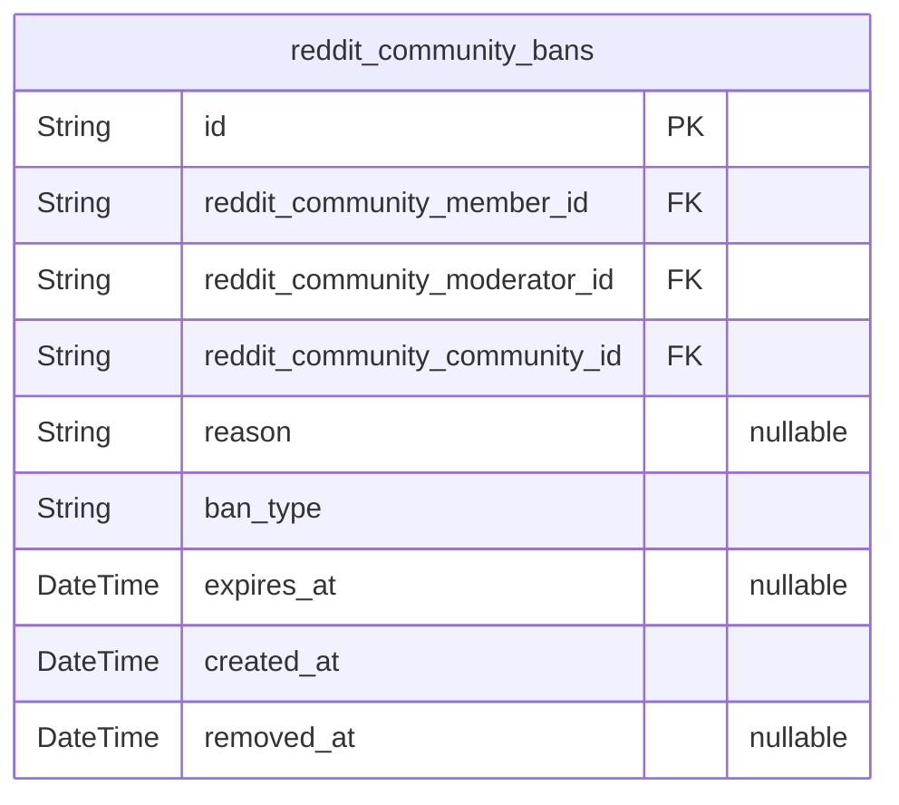

# Prisma Markdown

> Generated by [`prisma-markdown`](https://github.com/samchon/prisma-markdown)

- [Actors](#actors)
- [Profiles](#profiles)
- [Communities](#communities)
- [Posts](#posts)
- [Comments](#comments)
- [Votes](#votes)
- [Reports](#reports)
- [Bans](#bans)

## Actors

### `reddit_community_guests`

Temporary guest accounts identified by device fingerprint for read-only
browsing access.

Guest accounts enable unauthenticated users to browse popular feeds,
community feeds, and view public profiles without requiring registration.
Each guest is identified by a device fingerprint rather than
email/password credentials.

Guest accounts have limited permissions: read-only access to content, no
voting, no posting, no commenting, no subscription capabilities. Sessions
are tracked in [reddit_community_guest_sessions](#reddit_community_guest_sessions) table with short
expiration times.

This table serves as the actor entity for guest users, with one-to-many
relationship to guest sessions for tracking browsing activity.

Properties as follows:

- `id`: Primary Key.
- `device_fingerprint`
  > Unique device fingerprint hash for identifying guest users across
  > sessions. Generated from browser/device characteristics.
- `created_at`: Timestamp when the guest account was first created.
- `updated_at`: Timestamp when the guest account was last updated.
- `deleted_at`: Timestamp when the guest account was soft deleted, null if active.

### `reddit_community_guest_sessions`

Temporary session tokens for guest users with short expiration for
anonymous browsing.

Stores connection metadata including IP address, request URL, and
referrer for audit purposes. Sessions are append-only and track guest
browsing activity. Multiple sessions can exist per guest account, with
each session having its own expiration time.

Referenced by [reddit_community_guests](#reddit_community_guests) through the sessions
relationship.

Properties as follows:

- `id`: Primary Key.
- `reddit_community_guest_id`: Belonged guest's [reddit_community_guests.id](#reddit_community_guests).
- `ip`
  > IP address of the client connection for session tracking and security
  > audit.
- `href`: Request URL path where the session was initiated.
- `referrer`
  > HTTP referrer header indicating the source page that led to session
  > creation.
- `created_at`: Timestamp when the session was created.
- `expired_at`: Timestamp when the session expires and becomes invalid.

### `reddit_community_members`

Registered member accounts with email, username, password hash, karma
score, and account state tracking.

This is the primary actor table for authenticated users who can create
posts, comments, vote, subscribe to communities, and manage their
profiles. Each member has a unique email and username for authentication
and identification.

The karma score is denormalized here for quick access and is calculated
from the sum of vote scores on the member's posts and comments. Account
state tracking enables suspension and deletion workflows while
maintaining referential integrity.

Properties as follows:

- `id`: Primary Key.
- `email`
  > Unique email address for authentication and account recovery. Used as
  > login credential.
- `username`
  > Unique username chosen by the member during registration. Permanent and
  > cannot be changed. Used for profile identification and mentions.
- `password_hash`
  > Bcrypt hashed password for authentication. Never stores plain text
  > passwords.
- `karma`
  > Total karma score calculated from upvotes and downvotes on member's posts
  > and comments. Can be negative.
- `state`
  > Account state: active, suspended, or deleted. Controls authentication and
  > platform access.
- `suspended_at`
  > Timestamp when account was suspended. Null if account is active or
  > deleted.
- `suspended_until`
  > Timestamp when suspension expires. Null for permanent suspensions or
  > active accounts.
- `deleted_at`
  > Timestamp when account was soft deleted. Null for active accounts. Used
  > for cascade deletion tracking.
- `created_at`: Timestamp when member account was created.
- `updated_at`: Timestamp when member account was last updated.

### `reddit_community_member_sessions`

JWT access and refresh tokens for member authentication with session
management. Tracks active login sessions including IP address, referrer,
device information, and token expiration. Each session belongs to exactly
one member and is used for authentication validation and session
lifecycle management.

Properties as follows:

- `id`: Primary Key.
- `reddit_community_member_id`: Belonged member's [reddit_community_members.id](#reddit_community_members).
- `access_token`
  > JWT access token for API authentication. Short-lived token used for
  > request authorization.
- `refresh_token`
  > JWT refresh token for obtaining new access tokens. Long-lived token
  > stored securely for session renewal.
- `ip`
  > IP address of the client device at session creation. Used for security
  > monitoring and session validation.
- `href`
  > URL of the page where the user initiated login. Tracks entry point for
  > session analytics.
- `referrer`
  > HTTP referrer header indicating the source of the login request. Used for
  > traffic analysis.
- `user_agent`
  > Browser user agent string identifying the client device and browser. Used
  > for device recognition.
- `created_at`: Timestamp when the session was created. Records the exact login time.
- `expired_at`
  > Timestamp when the session expires. Sessions are invalid after this time
  > and must be refreshed or re-authenticated.

### `reddit_community_member_password_resets`

Password reset tokens for member account recovery. Stores temporary
tokens with expiration timestamps that members use to reset forgotten
passwords. Tokens are single-use and expire after a configured duration
for security.

Properties as follows:

- `id`: Primary Key.
- `reddit_community_member_id`
  > Member account requesting password reset. {@link
  > reddit_community_members.id}
- `token`
  > Unique password reset token sent to member's email. Used as verification
  > code in password reset links.
- `expires_at`
  > Token expiration timestamp. Reset requests after this time are rejected
  > for security.
- `used_at`
  > Timestamp when token was consumed for password reset. Null if token
  > hasn't been used yet.
- `created_at`: Token creation timestamp for audit trail and cleanup operations.
- `updated_at`: Last modification timestamp for audit trail and change tracking.

### `reddit_community_member_email_verifications`

Email verification tokens for member registration and email confirmation.
Stores temporary tokens sent to users for email address verification
during account creation or email change requests. Tokens expire after a
configured period and are deleted upon successful verification.

Properties as follows:

- `id`: Primary Key.
- `reddit_community_member_id`: Belonged member's [reddit_community_members.id](#reddit_community_members).
- `email`
  > Email address being verified. Stored to track which email was confirmed,
  > supporting both registration and email change workflows.
- `token`
  > Unique verification token sent to the user's email address. Used as
  > lookup key for verification requests.
- `expires_at`
  > Token expiration timestamp. Verification requests after this time are
  > rejected for security.
- `verified_at`
  > Timestamp when email was successfully verified. Null until verification
  > completes, then set to completion time.
- `created_at`: Record creation timestamp for audit trail.
- `updated_at`
  > Record last update timestamp for audit trail. Updated on verification
  > completion or record modification.

### `reddit_community_admins`

Platform administrator accounts with elevated privileges and system-wide
access.

Administrators have cross-community moderation capabilities, platform
oversight, and user management authority. This table serves as the
canonical identity record for admin actors, with authentication
credentials and account state tracking.

Related entities:
- [reddit_community_admin_sessions](#reddit_community_admin_sessions) - Login sessions for
administrators
- [reddit_community_admin_password_resets](#reddit_community_admin_password_resets) - Password recovery tokens
- [reddit_community_admin_audit_logs](#reddit_community_admin_audit_logs) - Audit trail of admin actions
- [reddit_community_members](#reddit_community_members) - Regular member accounts (separate
actor type)
- [reddit_community_communities](#reddit_community_communities) - Communities that admins can
moderate

Properties as follows:

- `id`: Primary Key.
- `email`
  > Administrator email address for authentication. Must be unique across all
  > admin accounts. Used as login credential.
- `password_hash`
  > Bcrypt-hashed password for authentication. Never store plain text
  > passwords. Minimum security requirements apply per section 318.
- `created_at`
  > Timestamp when the administrator account was created. Used for audit
  > trails and account age tracking.
- `updated_at`
  > Timestamp when the administrator account was last modified. Updated on
  > every profile or credential change.
- `deleted_at`
  > Timestamp when the administrator account was soft-deleted. Null means
  > account is active. Used for account deactivation without permanent data
  > loss.

### `reddit_community_admin_sessions`

JWT session tokens for administrator authentication with enhanced
security. Tracks admin login sessions with connection metadata and
expiration for security compliance. Each session represents a single
authenticated admin connection with IP tracking and temporal boundaries.

Properties as follows:

- `id`: Primary Key.
- `reddit_community_admin_id`: Belonged administrator's [reddit_community_admins.id](#reddit_community_admins).
- `ip`
  > IP address of the admin's connection for security audit and session
  > tracking.
- `href`: URL path where the admin session was initiated for navigation context.
- `referrer`: Referrer URL that led to session creation for traffic source tracking.
- `created_at`: Timestamp when the admin session was created.
- `expired_at`: Timestamp when the admin session expires for automatic invalidation.

### `reddit_community_admin_password_resets`

Password reset tokens for administrator account recovery. Stores secure
hashed tokens with expiration timestamps that are generated when admins
request password resets. Each token is single-use and becomes invalid
after expiration or successful password reset. Tokens are managed through
the parent admin entity and support secure account recovery workflows.

Properties as follows:

- `id`: Primary Key.
- `reddit_community_admin_id`
  > Administrator who requested the password reset. {@link
  > reddit_community_admins.id}.
- `token_hash`
  > Hashed password reset token for security. Stored as hash to prevent token
  > theft from database.
- `expires_at`
  > Timestamp when this reset token expires and becomes invalid. Typically
  > 1-24 hours from creation.
- `used_at`
  > Timestamp when this token was used to reset password. Null if not yet
  > used. Set on successful password reset.
- `created_at`: Timestamp when this password reset token was created.
- `updated_at`: Timestamp when this password reset token was last updated.
- `deleted_at`: Timestamp when this password reset token was soft deleted. Null if active.

### `reddit_community_admin_audit_logs`

Audit trail records capturing administrator actions for security
compliance and accountability. Each log entry documents what action was
performed, on which entity, and by which administrator. These records are
immutable and append-only for audit integrity.

Properties as follows:

- `id`: Primary Key.
- `admin_id`
  > Administrator who performed the audited action. {@link
  > reddit_community_admins.id}.
- `action_type`
  > Type of administrative action performed (e.g., user_suspension,
  > content_removal, ban_issued, moderator_added).
- `target_entity`
  > Entity type that was acted upon (e.g., user, post, comment, community,
  > report).
- `target_id`: UUID of the target entity that was acted upon.
- `details`
  > JSON-formatted details of the action including reason, metadata, and
  > contextual information.
- `ip_address`
  > IP address from which the admin action was performed for security
  > tracking.
- `user_agent`: User agent string from the admin's browser/client for security auditing.
- `created_at`: Timestamp when the administrative action was performed and logged.

## Profiles

### `reddit_community_profiles`

User profiles containing display name, bio text, avatar reference, and
denormalized karma score for quick access.

Each member has exactly one profile that extends their basic identity
with customizable public information. Profiles are independently managed
by users and display their presentation layer including display name, bio
description, avatar image reference, and aggregated karma score.

The karma_score field is denormalized for performance, avoiding expensive
aggregations across [reddit_community_post_votes](#reddit_community_post_votes) and {@link
reddit_community_comment_votes} tables during profile views.

Related entities:
- Belongs to one [reddit_community_members](#reddit_community_members) (1:1 relationship)
- Has many [reddit_community_profile_attachments](#reddit_community_profile_attachments) for avatar images
- Referenced by posts and comments for author profile display

Properties as follows:

- `id`: Primary Key.
- `user_id`
  > Belonged member's [reddit_community_members.id](#reddit_community_members). Enforces 1:1
  > relationship between members and profiles.
- `display_name`
  > User's chosen display name shown publicly on profile and next to
  > posts/comments. Can be edited by the user.
- `bio`
  > Optional biographical text describing the user. Shown on public profile
  > page. Can contain markdown formatting.
- `avatar_url`
  > URL reference to the user's avatar image. Points to CDN storage or
  > external image service. Null shows default avatar.
- `karma_score`
  > Denormalized total karma score calculated from upvotes minus downvotes
  > across all user's posts and comments. Can be negative. Updated on vote
  > changes.
- `created_at`
  > Timestamp when the profile was first created. Automatically set on
  > profile initialization.
- `updated_at`
  > Timestamp when the profile was last modified. Updated on any profile
  > field change.
- `deleted_at`
  > Timestamp when the profile was soft deleted. Null means active profile.
  > Used for profile deactivation without permanent deletion.

### `reddit_community_profile_attachments`

Avatar image attachments linked to user profiles with file metadata
including storage path, size, MIME type, and dimensions. Each profile can
have one active avatar attachment at a time, enforced by unique
constraint on profile foreign key. Supports image upload validation and
CDN distribution for profile display.

Properties as follows:

- `id`: Primary Key.
- `reddit_community_profile_id`
  > Belonged profile's [reddit_community_profiles.id](#reddit_community_profiles). Links avatar
  > attachment to the user profile it represents.
- `file_path`
  > Storage path or URL reference to the avatar image file in CDN or object
  > storage. Used to retrieve and display the avatar image.
- `file_size`
  > File size in bytes. Used for storage quota enforcement and validation
  > against maximum upload limits.
- `mime_type`
  > MIME type of the image file (e.g., image/jpeg, image/png, image/webp).
  > Used for content-type validation and proper browser rendering.
- `width`
  > Image width in pixels. Used for display optimization and thumbnail
  > generation.
- `height`
  > Image height in pixels. Used for display optimization and thumbnail
  > generation.
- `created_at`
  > Timestamp when the avatar attachment was created. Used for audit trail
  > and sorting.
- `updated_at`
  > Timestamp when the avatar attachment was last updated. Used for change
  > tracking and cache invalidation.
- `deleted_at`
  > Timestamp when the avatar attachment was soft deleted (null if active).
  > Used for audit trail and historical tracking when users change avatars.

## Communities

### `reddit_community_communities`

Main community entity storing unique name, description, icon URL, and
subscriber count. Communities serve as topic spaces for organizing posts
and discussions. Related to [reddit_community_community_owners](#reddit_community_community_owners) for
ownership tracking and [reddit_community_community_moderators](#reddit_community_community_moderators) for
moderator assignments. Subscriber count is denormalized for efficient
display in community listings.

Properties as follows:

- `id`: Primary Key.
- `name`
  > Unique community name for identification, URL routing, and search. Cannot
  > be changed after creation per business rules.
- `description`
  > Community description text explaining the topic, purpose, and guidelines
  > for members.
- `icon_url`
  > URL to community icon image hosted on CDN for visual identification in
  > feeds and listings.
- `subscriber_count`
  > Denormalized count of community subscribers for quick display without
  > aggregation queries. Updated on subscription changes.
- `created_at`: Timestamp when community was created. Used for sorting in discovery feeds.
- `updated_at`
  > Timestamp when community metadata was last updated. Tracks profile
  > changes.
- `deleted_at`
  > Timestamp for soft deletion. Null when community is active. Allows
  > content retention per lifecycle policies.

### `reddit_community_community_owners`

Tracks community ownership relationships between members and communities.
Each community has exactly one owner who created it and has full
administrative privileges. This table maintains the 1:1 relationship
between communities and their owning members, enabling ownership
verification for privilege checks and ownership transfer operations.

Properties as follows:

- `id`: Primary Key.
- `member_id`: Member who owns the community. [reddit_community_members.id](#reddit_community_members)
- `community_id`: Community that is owned. [reddit_community_communities.id](#reddit_community_communities)
- `created_at`: Timestamp when ownership was established (community creation time).
- `updated_at`: Timestamp when ownership record was last updated.
- `deleted_at`
  > Timestamp when ownership was soft-deleted (for ownership transfer
  > tracking).

### `reddit_community_community_moderators`

Junction table tracking moderator assignments between members and
communities. Records which users serve as moderators for specific
communities, including appointment metadata and soft-delete support for
moderator removal. Enables community owners and admins to manage
moderation teams while preserving historical assignment records.

Properties as follows:

- `id`: Primary Key.
- `member_id`: Member who serves as moderator. [reddit_community_members.id](#reddit_community_members).
- `community_id`: Community being moderated. [reddit_community_communities.id](#reddit_community_communities).
- `appointed_by_id`
  > Member who appointed this moderator (typically community owner). {@link
  > reddit_community_members.id}.
- `appointed_at`: Timestamp when this moderator was appointed to the community.
- `created_at`: Record creation timestamp.
- `updated_at`: Record last update timestamp.
- `deleted_at`: Soft delete timestamp. Null indicates active moderator assignment.

## Posts

### `reddit_community_posts`

User-created posts within communities supporting three content types:
text posts with body content, link posts with URLs, and image posts with
uploaded images. Posts are the primary content entity that users create,
edit, delete, and browse. Each post belongs to an author (member) and a
community, with type-specific content fields. Posts can have multiple
images (stored in reddit_community_post_images child table with
ordering), receive votes (tracked in reddit_community_post_votes), and
accumulate comments (stored in reddit_community_comments). Vote scores
and comment counts are computed via queries, not stored denormalized.

Properties as follows:

- `id`: Primary Key.
- `member_id`
  > Author's [reddit_community_members.id](#reddit_community_members). The member who created this
  > post.
- `community_id`
  > Community's [reddit_community_communities.id](#reddit_community_communities). The community where
  > this post is published.
- `type`
  > Post type classification: 'text' for text posts with body content, 'link'
  > for link posts with URLs, 'image' for image posts with uploaded images.
  > Determines which content field is populated. Type is immutable after
  > creation.
- `title`
  > Post title. Required for all post types. Displayed in feeds and post
  > listings. Subject to character limits and content sanitization.
- `body`
  > Text content for text-type posts only. Null for link and image posts.
  > Contains the main body text with formatting support.
- `link_url`
  > URL for link-type posts only. Null for text and image posts. Points to
  > external resource. Validated for accessibility and format.
- `created_at`
  > Timestamp when the post was created. Used for sorting and time-based
  > filtering.
- `updated_at`: Timestamp when the post was last updated. Tracks modification history.
- `deleted_at`
  > Timestamp when the post was soft-deleted. Null for active posts. Enables
  > content removal while preserving referential integrity.

### `reddit_community_post_images`

Images attached to posts supporting multiple images per post with file
storage references and ordering.

Stores uploaded image files for image-type posts with metadata including
storage location, file size, MIME type, and dimensions. Each image has a
sequence number for ordering when multiple images are attached to a
single post. Images are managed through their parent post entity and are
soft-deleted when the parent post is deleted.

Properties as follows:

- `id`: Primary Key.
- `reddit_community_post_id`: Parent post's [reddit_community_posts.id](#reddit_community_posts).
- `storage_path`: File storage path or URL for accessing the uploaded image.
- `file_name`: Original filename of the uploaded image.
- `file_size`: File size in bytes for storage tracking and validation.
- `mime_type`: MIME type of the image file (e.g., image/jpeg, image/png).
- `width`: Image width in pixels for display and thumbnail generation.
- `height`: Image height in pixels for display and thumbnail generation.
- `sequence`
  > Sequence number for ordering multiple images within a post (1-based
  > index).
- `created_at`: Timestamp when the image record was created.
- `updated_at`: Timestamp when the image record was last updated.
- `deleted_at`: Timestamp when the image was soft-deleted (null if active).

## Comments

### `reddit_community_comments`

User comments on posts with self-referential parent_id for unlimited
nesting depth. Stores comment content, author association, post
association, denormalized vote score for quick access, and timestamps for
audit trail.

Comments can be top-level (parent_id is null) or replies to other
comments (parent_id references parent comment). This enables infinite
threading for nested discussions.

The vote_score field is denormalized for performance - actual votes are
tracked in the Votes component via reddit_community_comment_votes table.
Vote score is updated atomically when votes are cast.

Soft delete is supported via deleted_at field - when a comment is
deleted, the record is preserved with deleted_at timestamp set, allowing
reply chains to remain intact with placeholder indicators.

Properties as follows:

- `id`: Primary Key.
- `reddit_community_member_id`
  > Author's [reddit_community_members.id](#reddit_community_members). The member who created this
  > comment.
- `reddit_community_post_id`
  > Post's [reddit_community_posts.id](#reddit_community_posts). The post this comment belongs
  > to.
- `parent_id`
  > Parent comment's [reddit_community_comments.id](#reddit_community_comments). Null for top-level
  > comments, references parent comment for nested replies.
- `content`
  > The comment text content. Supports text formatting and sanitization per
  > content policy.
- `vote_score`
  > Denormalized vote score (upvotes minus downvotes) for quick display. Can
  > be negative. Updated atomically when votes are cast.
- `created_at`: Timestamp when the comment was created.
- `updated_at`: Timestamp when the comment was last updated. Updated on every edit.
- `deleted_at`
  > Timestamp when the comment was soft-deleted. Null if active. Preserves
  > reply chain integrity.

## Votes

### `reddit_community_post_votes`

Tracks user votes on posts with direction (upvote or downvote). Each
member can cast exactly one vote per post, enforced by unique constraint
on member and post combination. Used for calculating post vote scores and
adjusting member karma scores.

References [reddit_community_members](#reddit_community_members) for the voter and {@link
reddit_community_posts} for the voted content. Vote direction determines
karma impact: upvotes increase karma, downvotes decrease karma. Supports
vote modification and soft deletion for audit trail compliance.

Properties as follows:

- `id`: Primary Key.
- `member_id`: Member who cast the vote. [reddit_community_members.id](#reddit_community_members)
- `post_id`: Post that was voted on. [reddit_community_posts.id](#reddit_community_posts)
- `direction`
  > Vote direction: 'up' for upvote or 'down' for downvote. Corresponds to
  > Vote Direction Enumeration. Determines karma adjustment direction.
- `created_at`
  > Timestamp when the vote was initially cast. Used for vote history
  > tracking and karma calculation.
- `updated_at`
  > Timestamp when the vote was last modified. Updated when vote direction
  > changes or vote is removed/restored.
- `deleted_at`
  > Soft delete timestamp. Null when vote is active. Set when vote is removed
  > to maintain audit trail.

### `reddit_community_post_vote_snapshots`

Point-in-time snapshots of post vote records for audit trail, vote
history tracking, and karma calculation verification. Captures the state
of votes at specific moments for historical analysis and compliance. Each
snapshot records the vote direction and member/post references, enabling
reconstruction of vote history and verification of karma score changes
over time even if the original vote record is deleted.

Properties as follows:

- `id`: Primary Key.
- `reddit_community_post_vote_id`
  > Reference to the original post vote being snapshotted. {@link
  > reddit_community_post_votes.id}.
- `member_id`
  > Denormalized reference to the member who cast the vote. {@link
  > reddit_community_members.id}. Preserved for audit queries even if parent
  > vote is deleted.
- `post_id`
  > Denormalized reference to the post that was voted on. {@link
  > reddit_community_posts.id}. Preserved for audit queries even if parent
  > vote is deleted.
- `direction`
  > Vote direction captured at snapshot time (up or down). Represents the
  > vote state at the moment the snapshot was created.
- `created_at`
  > Timestamp when the snapshot was created. Records the exact moment the
  > vote state was captured for audit purposes.

## Reports

### `reddit_community_reports`

Content reports filed by users for community moderation. Reports target
posts or comments and go through a review workflow where moderators can
approve (triggering content deletion) or dismiss them. Each report
includes the reason for reporting and tracks the review status and
reviewer.

Reports are filed against content within a specific community and require
moderator review. The status field tracks the report through its
lifecycle: pending (awaiting review), approved (content deleted), or
dismissed (no action taken). Reporter identity is preserved for
moderation transparency.

Properties as follows:

- `id`: Primary Key.
- `reporter_id`: Member who filed the report. [reddit_community_members.id](#reddit_community_members)
- `community_id`
  > Community where the reported content belongs. {@link
  > reddit_community_communities.id}
- `reviewer_id`
  > Moderator who reviewed the report. Null if report is still pending.
  > [reddit_community_members.id](#reddit_community_members)
- `reason`
  > Explanation provided by the reporter for why the content violates
  > guidelines.
- `status`
  > Current review status: pending (awaiting review), approved (content
  > deleted), or dismissed (no action taken).
- `created_at`: Timestamp when the report was filed.
- `updated_at`: Timestamp when the report was last updated.
- `deleted_at`: Timestamp when the report was soft deleted. Null if active.
- `reviewed_at`
  > Timestamp when the report was reviewed by a moderator. Null if still
  > pending.

### `reddit_community_report_posts`

Junction table linking content reports to posts. Each report targeting a
post has exactly one record here, establishing a 1:1 relationship between
reports and their post targets. This table enables the polymorphic
reporting system where reports can target either posts or comments.
Managed through the parent reddit_community_reports entity.

Properties as follows:

- `id`: Primary Key.
- `report_id`
  > Report's [reddit_community_reports.id](#reddit_community_reports). Unique constraint enforces
  > 1:1 relationship between reports and post targets.
- `post_id`
  > Reported post's [reddit_community_posts.id](#reddit_community_posts). References the post
  > being reported.
- `created_at`: Timestamp when this report-post linkage was created.

### `reddit_community_report_comments`

Junction table establishing 1:1 relationship between reports and their
target comments. Each report targeting a comment has exactly one entry in
this table, linking the report to the specific comment being reported.
Managed through the parent reddit_community_reports entity.

Properties as follows:

- `id`: Primary Key.
- `report_id`
  > Target report's [reddit_community_reports.id](#reddit_community_reports). Unique constraint
  > ensures each report targets at most one comment.
- `comment_id`
  > Target comment's [reddit_community_comments.id](#reddit_community_comments). The comment being
  > reported.
- `created_at`
  > Timestamp when the report-comment link was created. Used for audit trail
  > and chronological ordering.

## Bans

### `reddit_community_bans`

Community-level bans restricting user participation in specific
communities. Tracks banned users, issuing moderators, ban reasons, ban
types (temporary or permanent), and enforcement status. Supports
soft-delete for unban operations to maintain audit trail.

Properties as follows:

- `id`: Primary Key.
- `reddit_community_member_id`: Banned user's [reddit_community_members.id](#reddit_community_members).
- `reddit_community_moderator_id`: Issuing moderator's [reddit_community_members.id](#reddit_community_members).
- `reddit_community_community_id`: Community's [reddit_community_communities.id](#reddit_community_communities) where ban is enforced.
- `reason`: Optional reason for the ban explaining the violation or justification.
- `ban_type`: Type of ban: temporary (has expiration) or permanent (indefinite).
- `expires_at`
  > Expiration datetime for temporary bans. Null for permanent bans or after
  > unban.
- `created_at`: Timestamp when the ban was issued.
- `removed_at`
  > Timestamp when the ban was removed (unbanned). Null if ban is still
  > active.
