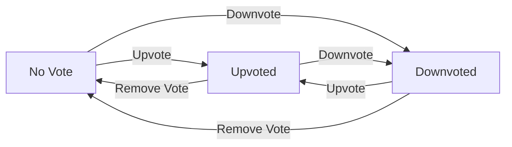
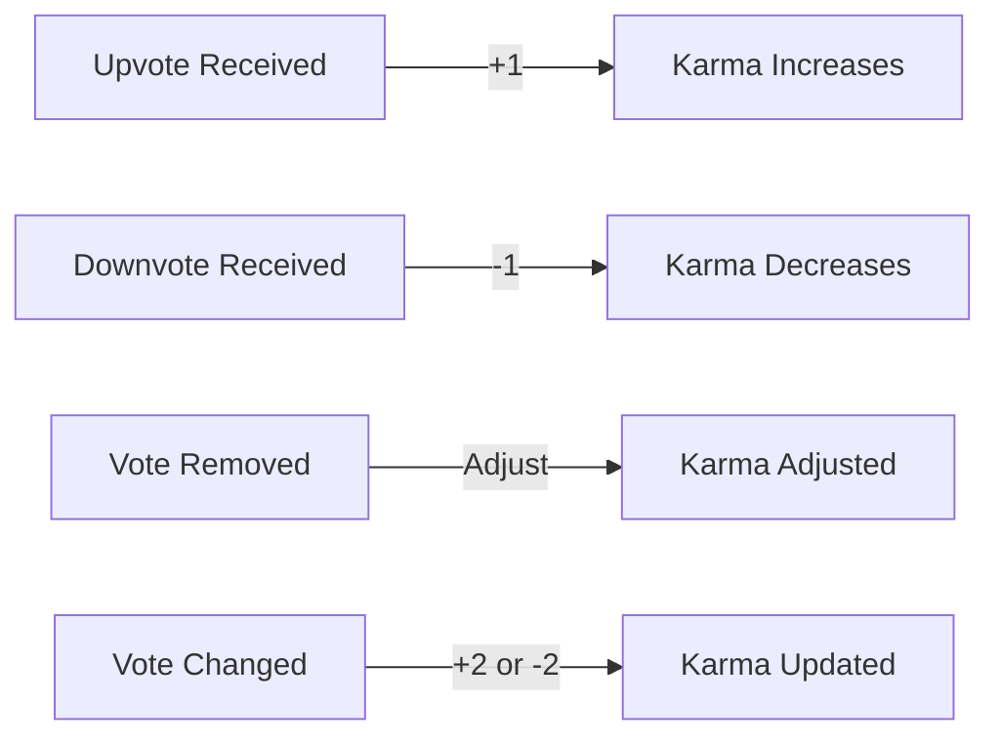
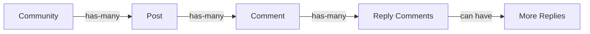
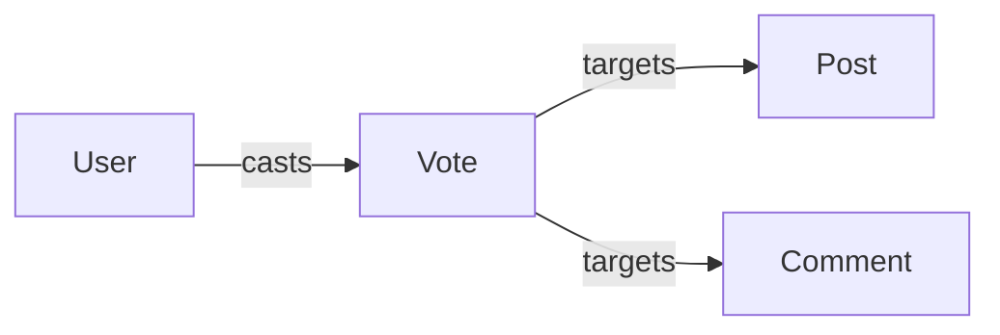
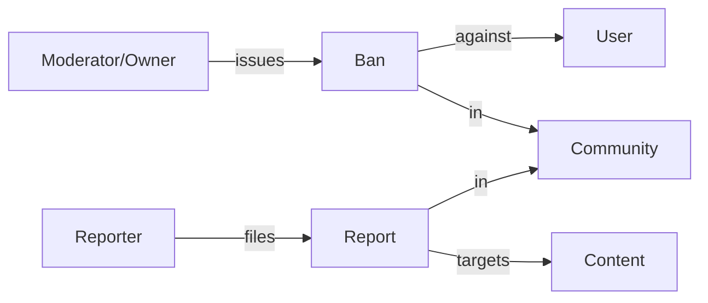
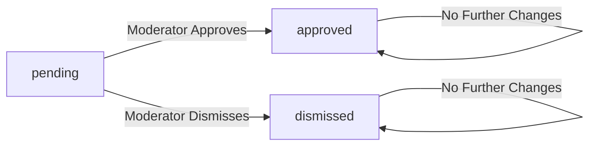
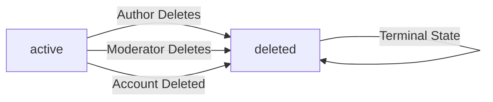
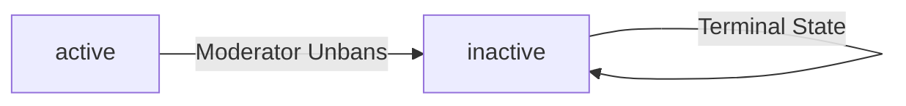
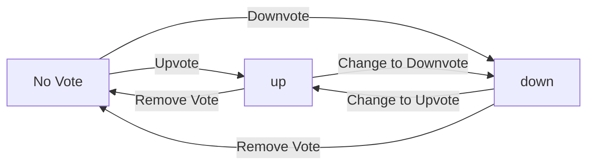

**redditCommunity — Business concepts, relationships, and states from user perspective**

Business concepts, relationships, and states from user perspective

# Domain Concepts

Describe what each concept means to users and why it exists.

## User Concept

Users sign up with email and password to create an account on the platform. During registration, users choose a unique username that identifies them across the platform. Users log in with their email and password to access their account. Users can change their password to maintain account security. Users can delete their account permanently, which also removes all their posts and comments. Email addresses must be unique among active accounts to prevent duplicate registrations. Usernames must be unique across all users to ensure clear identification. Account deletion is irreversible and cascades to all content created by the user. Users maintain a single identity that connects their profile, posts, comments, and subscriptions.

### User Registration and Account Creation

WHEN a user registers for an account, THE system SHALL require an email address.

WHEN a user registers for an account, THE system SHALL require a password.

WHEN a user registers for an account, THE system SHALL require the user to choose a username.

IF the email address is already associated with an existing account, THE system SHALL reject the registration.

IF the username is already taken by another user, THE system SHALL reject the registration.

THE system SHALL ensure that no two active accounts share the same email address.

THE system SHALL ensure that no two users share the same username.

WHEN registration requirements are satisfied, THE system SHALL create a new user account.

WHEN a user account is created, THE system SHALL assign the chosen username as the user's permanent identifier.

THE system SHALL prevent duplicate account creation using the same email address.

THE system SHALL prevent duplicate account creation using the same username.

### User Authentication

WHEN a user attempts to log in, THE system SHALL require the user's email address.

WHEN a user attempts to log in, THE system SHALL require the user's password.

THE system SHALL verify that the provided email address corresponds to an existing user account.

THE system SHALL verify that the provided password matches the stored credentials for the email address.

IF the email address does not correspond to any existing account, THE system SHALL reject the login attempt.

IF the password does not match the stored credentials, THE system SHALL reject the login attempt.

WHEN authentication succeeds, THE system SHALL grant the user access to their account.

WHILE the user is authenticated, THE system SHALL maintain the user's session.

THE system SHALL allow users to recover access to their account when credentials are forgotten.

WHEN a user requests credential recovery, THE system SHALL initiate a recovery process using the registered email address.

### Password Management

WHEN a user requests to change their password, THE system SHALL require the user's current password.

WHEN a user provides the correct current password, THE system SHALL allow the password to be updated.

WHEN a password is changed, THE system SHALL replace the stored password with the new password.

THE system SHALL allow users to change their password at any time while authenticated.

IF the current password provided is incorrect, THE system SHALL reject the password change request.

WHEN a password is successfully changed, THE system SHALL require the new password for future login attempts.

### Account Deletion

WHEN a user requests account deletion, THE system SHALL permanently remove the user account.

WHEN a user account is deleted, THE system SHALL delete all posts created by the user.

WHEN a user account is deleted, THE system SHALL delete all comments created by the user.

THE system SHALL ensure that account deletion cannot be reversed.

THE system SHALL cascade account deletion to all content owned by the user.

IF the user has created posts, THE system SHALL remove all posts upon account deletion.

IF the user has created comments, THE system SHALL remove all comments upon account deletion.

WHEN account deletion is complete, THE system SHALL release the username for potential reuse.

WHEN account deletion is complete, THE system SHALL release the email address for potential reuse.

THE system SHALL maintain user identity integrity by ensuring deleted users cannot be distinguished from never-existing users.

## Profile Concept

Each user has a profile that displays their display name, bio text, and avatar image. Users can edit their own display name to customize how they appear to others. Users can update their bio text to share information about themselves. Users can change their avatar image to personalize their profile appearance. Any user can view another user's profile to see their public information. A user's profile page shows their total karma score reflecting their community contributions. The profile displays a list of all posts created by the user. The profile shows a list of all comments written by the user. Display names can differ from usernames for added flexibility. Bio text is optional and can be updated at any time.

### Profile Display and Information

THE system SHALL display each user's profile containing their display name, bio text, and avatar image.

THE system SHALL make all user profiles publicly accessible to any viewer without requiring authentication.

THE system SHALL present the user's identity through their display name as the primary identifier on the profile.

THE system SHALL show the user's total karma score on their profile reflecting their community contributions.

THE system SHALL display profile information that is separate from the user's unique username used for authentication.

IF a user has not set a display name, THE system SHALL show their username as the default identity display.

### Display Name Management

WHEN a user edits their display name, THE system SHALL update it immediately across all profile views.

THE system SHALL allow display names to differ from usernames for added flexibility in user identity display.

WHEN a user changes their display name, THE system SHALL reflect the change on their profile page and all posts and comments authored by the user.

THE system SHALL allow users to customize their display name at any time without restrictions.

IF a user attempts to set an empty display name, THE system SHALL reject the request and retain the previous display name.

### Bio and Avatar Management

WHEN a user updates their bio text, THE system SHALL save and display the new bio on their profile.

THE system SHALL allow users to leave their bio text empty or remove it entirely.

WHEN a user uploads an avatar image, THE system SHALL display it on their profile page.

WHEN a user changes their avatar image, THE system SHALL replace the previous avatar with the new one.

THE system SHALL allow users to remove their avatar image and display a default placeholder instead.

Bio text is optional and can be updated at any time by the profile owner.

### Karma Score Display

THE system SHALL display the user's total karma score as a single number on their profile.

THE system SHALL show karma scores that can be negative when downvotes exceed upvotes.

THE system SHALL update the displayed karma score when votes are cast on the user's posts or comments.

THE system SHALL calculate karma by adding 1 for each upvote and subtracting 1 for each downvote received on the user's content.

WHEN a user removes their vote from another user's content, THE system SHALL adjust the affected user's karma score accordingly.

### User Content Lists

THE system SHALL display a list of all posts created by the user on their profile page.

THE system SHALL display a list of all comments written by the user on their profile page.

WHEN viewing a user's profile, THE system SHALL show their posts in the user posts list section.

WHEN viewing a user's profile, THE system SHALL show their comments in the user comments list section.

THE system SHALL update the user posts list when the user creates a new post.

THE system SHALL update the user comments list when the user writes a new comment.

IF a user deletes their account, THE system SHALL remove all their posts from the user posts list and all their comments from the user comments list.

### Profile Viewing

WHEN any user views another user's profile, THE system SHALL display all public profile information including display name, bio, avatar, and karma score.

THE system SHALL allow users to view profiles without requiring authentication or login.

WHEN a user views their own profile, THE system SHALL display edit options for display name, bio text, and avatar image.

WHEN a guest views a user's profile, THE system SHALL display the same profile information as for authenticated users.

THE system SHALL enable profile viewing for any existing user account in the platform.

IF a user's account is deleted, THE system SHALL remove their profile from view and display an account not found message.

## Community Concept

Any user can create a community to establish a space for discussion around a topic. A community has a unique name that identifies it across the platform. Communities include a description text explaining their purpose and focus. Communities have an icon image serving as visual identity. The user who creates a community becomes its owner with highest authority. Users can browse all communities in a list to discover new spaces. Users can search for communities by name to find specific communities. Each community displays its subscriber count showing community size. Community names must be unique to prevent confusion. Owners have special privileges to manage their community.

### Community Creation and Identity

WHEN a user creates a community, THE system SHALL require a unique name that identifies the community across the platform.

WHEN a user creates a community, THE system SHALL allow the user to provide a description text explaining the community's purpose and focus.

WHEN a user creates a community, THE system SHALL allow the user to upload an icon image serving as the community's visual identity.

THE system SHALL ensure that community names are unique to prevent confusion between communities.

IF a user attempts to create a community with a name that already exists, THE system SHALL reject the request.

THE system SHALL treat each community as a topic space for discussion around a specific subject or interest.

WHEN a community is created, THE system SHALL establish its identity through the combination of name, description, and icon.

THE system SHALL allow the community creator to define the community's identity at creation time.

IF the community name is missing or empty, THE system SHALL reject the creation request.

THE system SHALL store the community name, description, and icon as core identity attributes that define the community to users.

### Community Ownership and Management

WHEN a user creates a community, THE system SHALL designate that user as the owner of the community.

THE system SHALL grant the owner highest authority over their community.

WHILE a user is the owner of a community, THE system SHALL allow them to manage the community.

THE system SHALL recognize the owner as having special privileges to manage their community.

WHEN ownership is established, THE system SHALL record the owner as the user with highest authority.

THE system SHALL allow the owner to perform management actions on their community.

IF a user is not the owner, THE system SHALL not grant them owner-level management privileges.

THE system SHALL maintain the owner designation throughout the community's lifecycle.

WHEN viewing a community, THE system SHALL identify the owner as the user with highest authority.

THE system SHALL enable community management capabilities for the owner.

### Community Discovery and Browsing

THE system SHALL allow users to browse all communities in a list to discover new spaces.

THE system SHALL allow users to search for communities by name to find specific communities.

THE system SHALL display the subscriber count for each community showing community size.

WHEN a user views a community, THE system SHALL show its subscriber count.

THE system SHALL enable community discovery through browsing and search functionality.

WHEN browsing communities, THE system SHALL present communities in a list format.

WHEN searching for communities, THE system SHALL match the search query against community names.

THE system SHALL update the subscriber count when users subscribe or unsubscribe from a community.

IF a user searches for a community by name, THE system SHALL return matching communities.

THE system SHALL make community browsing available to all users for discovery purposes.

WHEN displaying a community in a list, THE system SHALL include its subscriber count.

THE system SHALL support community discovery as a means for users to find topic spaces of interest.

## Post Concept

Users can create a post in any community they are subscribed to. Every post has a title which is required for all posts. Posts must be one of three types: text post, link post, or image post. Text posts contain written content for discussion. Link posts share a URL to external content. Image posts display an uploaded image. Users can edit their own posts to update content or fix errors. Users can delete their own posts to remove them from the community. When viewing a single post, users see the title, full content, author, community, vote score, comment count, and when it was posted. Subscription to a community is required before creating posts there.

### Post Creation and Types

WHEN a user creates a post, THE system SHALL require the user to be subscribed to the community.

WHEN a user creates a post, THE system SHALL require a title.

WHEN a user creates a post, THE system SHALL require the user to select one of three post types: text post, link post, or image post.

WHEN a user creates a text post, THE system SHALL require text content.

WHEN a user creates a link post, THE system SHALL require a URL.

WHEN a user creates an image post, THE system SHALL require an uploaded image.

IF the user is not subscribed to the community, THEN THE system SHALL reject the post creation request.

IF the title is missing, THEN THE system SHALL reject the post creation request.

IF the post type is not one of text, link, or image, THEN THE system SHALL reject the post creation request.

IF a text post is created without content, THEN THE system SHALL reject the request.

IF a link post is created without a URL, THEN THE system SHALL reject the request.

IF an image post is created without an uploaded image, THEN THE system SHALL reject the request.

### Post Content and Metadata

WHEN viewing a single post, THE system SHALL display the title.

WHEN viewing a single post, THE system SHALL display the full content based on post type.

WHEN viewing a single post, THE system SHALL display the author username.

WHEN viewing a single post, THE system SHALL display the community name.

WHEN viewing a single post, THE system SHALL display the vote score.

WHEN viewing a single post, THE system SHALL display the comment count.

WHEN viewing a single post, THE system SHALL display when the post was created.

THE system SHALL maintain post metadata including author, community association, vote score, and comment count.

For text posts, THE system SHALL store the text content.

For link posts, THE system SHALL store the URL.

For image posts, THE system SHALL store the uploaded image.

### Post Editing and Deletion

WHEN a user edits their own post, THE system SHALL allow updates to the title.

WHEN a user edits their own post, THE system SHALL allow updates to the content.

IF the user is not the post author, THEN THE system SHALL reject the edit request.

WHEN a user deletes their own post, THE system SHALL remove the post from the community.

IF the user is not the post author, THEN THE system SHALL reject the delete request.

WHEN a post is deleted, THE system SHALL also delete all comments on that post.

WHEN a post is deleted, THE system SHALL remove the post from all feeds where it appeared.

## Comment Concept

Users can write a comment on any post to engage in discussion. Users can reply to any comment to continue conversations. Replies can have replies, creating nested discussions with no depth limit. Users can edit their own comments to update or correct their input. Users can delete their own comments to remove them from the discussion. Each comment shows the author, content, vote score, time since posted, and nested replies. Comments enable threaded conversations within posts. Comment editing allows users to refine their contributions. Comment deletion removes the comment and affects the conversation thread. All users can participate in comment discussions on posts they can view.

### Comment Creation

WHEN a user writes a comment on a post, THE system SHALL:
1. Require content text for the comment
2. Associate the comment with the post
3. Associate the comment with the creating user as the author
4. Record the creation timestamp
5. Initialize the vote score to zero

WHEN a user writes a comment, THE system SHALL allow the comment on any post the user can view.

IF the user is banned from the community containing the post, THE system SHALL reject the comment creation.

THE system SHALL display the comment author's username with each comment.

### Comment Replies and Threading

WHEN a user replies to a comment, THE system SHALL:
1. Associate the reply with the parent comment
2. Require content text for the reply
3. Associate the reply with the creating user as the author
4. Record the creation timestamp
5. Initialize the vote score to zero

THE system SHALL support unlimited nesting depth for comment replies.

WHEN viewing a post, THE system SHALL display nested replies in a threaded structure showing the conversation hierarchy.

THE system SHALL maintain reply chains to show the full conversation thread from any comment.

WHEN a comment is deleted, THE system SHALL preserve the reply chain structure for remaining comments.

THE system SHALL enable threaded discussions by visually indenting or nesting replies under their parent comments.

### Comment Management

WHEN a user edits their own comment, THE system SHALL:
1. Allow modification of the comment content
2. Preserve the original creation timestamp
3. Update the comment immediately
4. Maintain all existing votes on the comment
5. Maintain all replies to the comment

WHEN a user deletes their own comment, THE system SHALL:
1. Remove the comment content from display
2. Preserve the comment's replies in the thread
3. Adjust the parent post's comment count
4. Remove any votes associated with the deleted comment

IF a user attempts to edit a comment they did not author, THE system SHALL reject the request.

IF a user attempts to delete a comment they did not author, THE system SHALL reject the request.

WHILE a comment exists, THE system SHALL allow the author to edit or delete it at any time.

### Comment Display

WHEN displaying a comment, THE system SHALL show:
1. The author's username
2. The full comment content
3. The current vote score
4. The time since the comment was posted
5. All nested replies to the comment

WHEN displaying comments on a post, THE system SHALL show the comment count for the post.

THE system SHALL display comments in a threaded format to show conversation engagement.

WHEN a comment has replies, THE system SHALL visually indicate the reply relationship.

THE system SHALL enable comment engagement by allowing users to view all comments and replies on a post.

WHEN viewing a post, THE system SHALL display all comments and their nested reply chains.

### Comment Voting

WHEN a user upvotes a comment, THE system SHALL:
1. Increase the comment's vote score by 1
2. Increase the comment author's karma by 1
3. Record the user's vote as an upvote

WHEN a user downvotes a comment, THE system SHALL:
1. Decrease the comment's vote score by 1
2. Decrease the comment author's karma by 1
3. Record the user's vote as a downvote

WHEN a user changes their vote on a comment from upvote to downvote, THE system SHALL:
1. Decrease the comment's vote score by 2
2. Decrease the comment author's karma by 2
3. Update the user's vote record to downvote

WHEN a user changes their vote on a comment from downvote to upvote, THE system SHALL:
1. Increase the comment's vote score by 2
2. Increase the comment author's karma by 2
3. Update the user's vote record to upvote

WHEN a user removes their vote on a comment, THE system SHALL:
1. Adjust the comment's vote score by removing the vote's effect
2. Adjust the comment author's karma accordingly
3. Remove the user's vote record

IF a user has already voted on a comment, THE system SHALL allow them to change or remove their vote.

EACH user MAY cast only one vote per comment at any time.

THE system SHALL allow voting on any comment that the user can view.

## Vote Concept

Every user has a single karma score that reflects their community contributions. When someone upvotes your post or comment, your karma increases by one. When someone downvotes your post or comment, your karma decreases by one. When someone removes their vote, your karma adjusts accordingly. Karma can be negative if a user receives more downvotes than upvotes. Users can upvote posts and comments they find valuable. Users can downvote posts and comments they find unhelpful. Each user can only vote once per post or comment. Users can change their vote from upvote to downvote or vice versa. Users can remove their vote entirely. Vote score equals total upvotes minus total downvotes.

### Vote Creation and Types

WHEN a user casts a vote on a post or comment, THE system SHALL:
1. Allow the user to upvote the content
2. Allow the user to downvote the content
3. Ensure each user can only have one active vote per post or comment
4. Record the vote direction as either up or down

IF a user attempts to vote on content they have already voted on, THE system SHALL replace their existing vote with the new vote direction.

IF a user attempts to upvote their own post or comment, THE system SHALL allow the vote.

WHEN a user upvotes a post or comment, THE system SHALL register the vote direction as up.

WHEN a user downvotes a post or comment, THE system SHALL register the vote direction as down.

THE system SHALL enforce that each user maintains only one vote per post or comment at any time.

### Vote Modification

WHEN a user changes their vote on a post or comment, THE system SHALL:
1. Allow changing from upvote to downvote
2. Allow changing from downvote to upvote
3. Update the vote score accordingly
4. Adjust the content author's karma score accordingly

WHEN a user removes their vote from a post or comment, THE system SHALL:
1. Delete the user's vote record
2. Recalculate the vote score for the content
3. Adjust the content author's karma score accordingly

IF a user removes an upvote, THE system SHALL decrease the vote score by one.

IF a user removes a downvote, THE system SHALL increase the vote score by one.

IF a user changes from upvote to downvote, THE system SHALL decrease the vote score by two.

IF a user changes from downvote to upvote, THE system SHALL increase the vote score by two.

THE system SHALL allow vote modification at any time after the initial vote is cast.

### Karma System

WHEN a user's post or comment receives an upvote, THE system SHALL increase the user's karma score by one.

WHEN a user's post or comment receives a downvote, THE system SHALL decrease the user's karma score by one.

WHEN a vote on a user's post or comment is removed, THE system SHALL adjust the user's karma score accordingly:
1. If an upvote is removed, decrease karma by one
2. If a downvote is removed, increase karma by one

WHEN a user changes their vote on another user's content, THE system SHALL adjust the content author's karma score:
1. If changing from upvote to downvote, decrease karma by two
2. If changing from downvote to upvote, increase karma by two

THE system SHALL allow a user's karma score to be negative.

THE system SHALL maintain a single karma score for each user that reflects all votes received on their posts and comments.

IF a user deletes their account, THE system SHALL remove their karma score along with all their content.

### Vote Score Calculation

THE system SHALL calculate the vote score for each post and comment as the total number of upvotes minus the total number of downvotes.

WHEN displaying a post or comment, THE system SHALL show the current vote score to all users.

THE system SHALL update the vote score immediately when any vote is cast, changed, or removed.

WHEN calculating content visibility in feeds, THE system SHALL use the vote score as a factor in determining post ranking.

THE system SHALL treat vote score as a measure of community feedback on content quality.

IF a post or comment has zero votes, THE system SHALL display a vote score of zero.

THE system SHALL allow vote scores to be negative when downvotes exceed upvotes.

WHEN sorting posts by top, THE system SHALL order by vote score in descending order.

WHEN sorting posts by controversial, THE system SHALL identify posts with many votes but vote scores close to zero.

THE system SHALL use vote score as an indicator of content rating within the community.

## Subscription Concept

Users can subscribe to any community to follow its content. Users can unsubscribe from any community to stop following it. Users can view a list of all communities they are subscribed to. Subscribing is required to create posts in that community. Subscription enables access to the personalized home feed. Subscription tracks user community membership for content filtering. Users can manage their subscription list at any time. Subscription status affects posting permissions in communities. Home feed shows posts only from subscribed communities. Users must subscribe before participating through posts in a community.

### Community Subscription

WHEN a user subscribes to a community, THE system SHALL:
1. Record the subscription with the current timestamp
2. Increment the community's subscriber count by 1
3. Enable the user to view posts from that community in their home feed
4. Allow the user to create posts in that community

THE system SHALL ensure each user can subscribe to any community only once.

IF a user attempts to subscribe to a community they are already subscribed to, THE system SHALL reject the request.

WHILE a user is subscribed to a community, THE system SHALL include that community's posts in the user's home feed.

THE system SHALL track subscription status for each user-community pair.

Community subscription enables community following for content discovery.

THE system SHALL maintain subscription status until the user explicitly unsubscribes or deletes their account.

### Subscription Management

WHEN a user unsubscribes from a community, THE system SHALL:
1. Remove the subscription record
2. Decrement the community's subscriber count by 1
3. Stop including that community's posts in the user's home feed
4. Prevent the user from creating new posts in that community

THE system SHALL allow users to manage their subscription list at any time.

WHEN a user manages their subscriptions, THE system SHALL provide the ability to:
1. View all communities they are subscribed to
2. Unsubscribe from any community
3. Subscribe to new communities

IF a user attempts to unsubscribe from a community they are not subscribed to, THE system SHALL reject the request.

THE system SHALL process subscription changes immediately.

Subscription management allows users to control their community membership dynamically.

WHEN a user deletes their account, THE system SHALL automatically remove all their subscriptions.

### Subscribed Communities List

WHEN a user views their subscribed communities list, THE system SHALL:
1. Display all communities the user is currently subscribed to
2. Show each community's name, icon, and subscriber count
3. Show each community's description
4. Provide an unsubscribe option for each community

THE system SHALL sort the subscribed communities list by subscription date (most recent first) by default.

THE system SHALL update the subscribed communities list in real-time when subscriptions change.

IF a user has no subscriptions, THE system SHALL display an empty state indicating no subscribed communities.

THE system SHALL allow users to access their subscribed communities list from their profile or navigation menu.

THE subscribed communities list enables users to track their community membership.

WHEN viewing the subscribed communities list, THE system SHALL indicate which communities the user owns or moderates.

### Posting Permissions

IF a user is not subscribed to a community, THEN THE system SHALL prevent the user from creating posts in that community.

WHEN a user attempts to create a post in a community, THE system SHALL verify the user's subscription status.

IF a user is subscribed to a community, THE system SHALL allow the user to create posts in that community.

THE system SHALL enforce subscription requirements before allowing post creation.

IF a user's subscription is removed while they have existing posts in a community, THE system SHALL retain their existing posts but prevent new post creation.

Posting permissions are tied directly to subscription status.

THE system SHALL display an error message when a user attempts to post without being subscribed.

WHEN a user is banned from a community, THE system SHALL override subscription permissions and prevent posting regardless of subscription status.

### Home Feed Access

WHEN a logged-in user accesses their home feed, THE system SHALL:
1. Display posts only from communities the user is subscribed to
2. Apply the selected sorting option (hot, new, top, controversial)
3. Support pagination for navigating through posts

THE system SHALL make the home feed available only to logged-in users.

IF a user has no subscriptions, THE system SHALL display an empty home feed with suggestions to subscribe to communities.

Home feed access provides personalized content based on subscription choices.

THE system SHALL update the home feed in real-time when new posts are created in subscribed communities.

WHEN a user subscribes to a new community, THE system SHALL immediately include that community's posts in the home feed.

WHEN a user unsubscribes from a community, THE system SHALL immediately exclude that community's posts from the home feed.

THE home feed enables feed personalization based on user preferences.

THE system SHALL apply the same sorting and pagination rules to the home feed as other feed types.

### Content Filtering

THE system SHALL filter content based on subscription status for the home feed.

WHEN generating the home feed, THE system SHALL include only posts from subscribed communities.

WHEN generating the popular feed, THE system SHALL include posts from all communities regardless of subscription status.

WHEN generating a community feed, THE system SHALL include only posts from that specific community regardless of subscription status.

Subscription status determines content filtering for personalized feeds.

THE system SHALL apply content filtering before applying sorting options.

THE system SHALL ensure content filtering respects user privacy and subscription choices.

IF a community is deleted, THE system SHALL remove all posts from that community from all users' home feeds.

Content filtering enables users to see relevant content based on their community membership.

THE system SHALL maintain consistent content filtering rules across all feed types.

## Report Concept

Users can report any post or comment that violates community guidelines. When reporting, users must provide a reason explaining the violation. Moderators can view all reports for their community to review flagged content. Each report shows the reported content, who reported it, and the reason provided. Moderators can approve a report which deletes the reported content. Moderators can dismiss a report which keeps the content visible. Dismissed reports are removed from the report list after review. Reports help maintain community standards and safety. Report status tracks whether content was approved or dismissed. Users contribute to community moderation through reporting.

### Content Reporting

WHEN a user identifies guideline violations in a post or comment, THE system SHALL allow the user to file a report.

THE system SHALL enable reporting on any post within any community.

THE system SHALL enable reporting on any comment within any community.

WHILE a user is viewing a post, THE system SHALL provide a reporting option.

WHILE a user is viewing a comment, THE system SHALL provide a reporting option.

THE system SHALL treat safety reporting as a mechanism for users to contribute to community moderation.

IF content violates community guidelines, THEN the reported content becomes subject to moderator review.

### Report Reason

WHEN a user files a report, THE system SHALL require the user to provide a report reason.

THE system SHALL accept the report reason as text input.

THE report reason SHALL explain the nature of the guideline violations.

IF the report reason is missing, THEN THE system SHALL reject the report submission.

THE report reason SHALL be stored as part of the report for moderator review.

### Moderator Review

WHEN a report is filed in a community, THE system SHALL make the report visible to moderators of that community.

THE system SHALL allow moderators to view all reports for their community.

WHILE reviewing a report, THE system SHALL display the reported content to moderators.

WHILE reviewing a report, THE system SHALL display the report reason to moderators.

WHILE reviewing a report, THE system SHALL display the reporter identity to moderators.

THE system SHALL support community moderation through the report review process.

Moderators can review reports to determine if content violates community guidelines.

### Report Approval

WHEN a moderator approves a report, THE system SHALL delete the reported content.

THE system SHALL remove posts from the community when their report is approved.

THE system SHALL remove comments from the community when their report is approved.

WHEN content deletion occurs due to report approval, THE system SHALL update the community content accordingly.

THE system SHALL mark the report as approved after content deletion.

Report approval serves as the mechanism for removing guideline violations from the community.

### Report Dismissal

WHEN a moderator dismisses a report, THE system SHALL keep the reported content visible.

THE system SHALL allow moderators to dismiss reports that do not violate guidelines.

WHEN a report is dismissed, THE system SHALL remove the dismissed report from the report list.

THE system SHALL treat report dismissal as a decision that content does not require removal.

Dismissed reports SHALL no longer appear in the pending reports for moderator review.

### Reporter Identity

THE system SHALL track the reporter identity for each report filed.

WHEN a report is created, THE system SHALL associate the report with the user who filed it.

WHILE moderators review a report, THE system SHALL show who reported the content.

THE reporter identity SHALL be visible to moderators during the review process.

THE system SHALL maintain reporter identity as part of the report record for accountability.

### Report Status

THE system SHALL maintain a report status for each report throughout its lifecycle.

THE report status SHALL indicate whether the report is pending, approved, or dismissed.

WHEN a report is first filed, THE system SHALL set the report status to pending.

WHEN a moderator approves a report, THE system SHALL change the report status to approved.

WHEN a moderator dismisses a report, THE system SHALL change the report status to dismissed.

THE system SHALL use report status to track the outcome of moderator review.

WHILE a report has pending status, THE system SHALL keep it visible in the moderator report list.

IF a report status is approved or dismissed, THEN THE system SHALL remove it from the pending review queue.

## Ban Concept

Moderators can ban users from their community to enforce rules. Moderators can unban users to restore their participation rights. Moderators can view the list of banned users in their community. Banned users cannot create posts or comments in that community. Banned users can still view content in the community they are banned from. Ban prevents posting and commenting but not viewing. Only moderators can manage bans in their community. Ban applies to a specific community, not the entire platform. Banned users lose participation rights in the affected community. Moderators use bans to maintain community quality and safety.

### Ban Definition and Community Scope

A Ban represents a community-specific restriction that prevents a user from participating in a particular community.

THE system SHALL enforce bans at the community level only, not across the entire platform.

WHEN a moderator bans a user from a community, THE system SHALL record the ban with the banning moderator, the banned user, and the affected community.

THE system SHALL allow a user to be banned from multiple communities independently.

A ban in one community SHALL NOT affect the user's ability to participate in other communities.

THE system SHALL maintain the ban scope as specific to the community where it was issued.

WHILE a ban exists, THE system SHALL associate the ban with the issuing community and the banned user.

### Ban Enforcement and Participation Restrictions

WHEN a user is banned from a community, THE system SHALL prevent the user from creating new posts in that community.

WHEN a user is banned from a community, THE system SHALL prevent the user from creating new comments in that community.

WHEN a banned user attempts to create a post in the banned community, THE system SHALL reject the request.

WHEN a banned user attempts to create a comment in the banned community, THE system SHALL reject the request.

WHILE a user is banned from a community, THE system SHALL allow the user to view all content in that community.

THE system SHALL allow banned users to view posts, comments, and community information in the communities where they are banned.

A ban SHALL restrict participation rights (posting and commenting) but SHALL NOT restrict content viewing rights.

IF a user is banned from a community, THEN the user SHALL retain the ability to browse and read all public content in that community.

### Moderator Ban Management Operations

WHEN a moderator adds a ban, THE system SHALL require the moderator to specify the user to be banned.

THE system SHALL allow moderators to optionally provide a reason when banning a user.

WHEN a moderator removes a ban (unban action), THE system SHALL restore the user's participation rights in that community.

WHEN a user is unbanned, THE system SHALL allow the user to create posts and comments in the community immediately.

THE system SHALL allow moderators to view the complete list of all banned users in their community.

WHEN viewing the banned users list, THE system SHALL display each banned user, the banning moderator, the ban creation time, and the ban reason if provided.

THE system SHALL allow only moderators of a community to manage bans in that community.

IF a non-moderator attempts to ban or unban a user, THEN THE system SHALL reject the request.

WHEN a community owner bans a user, THE system SHALL record the owner as the banning moderator.

THE system SHALL allow moderators to add other moderators, but SHALL NOT allow moderators to remove other moderators (only the owner can remove moderators).

### Ban Lifecycle and User Status

WHEN a ban is created, THE system SHALL record the creation timestamp.

THE system SHALL maintain each ban until a moderator explicitly removes it through the unban action.

WHEN a user's account is deleted, THE system SHALL remove all bans associated with that user.

WHEN a community is deleted, THE system SHALL remove all bans associated with that community.

THE system SHALL ensure that ban enforcement is checked at the time of each post or comment creation attempt.

WHILE a ban is active, THE system SHALL continuously enforce posting and commenting restrictions for the banned user in the affected community.

IF a ban is removed, THEN THE system SHALL immediately restore full participation rights to the previously banned user.

THE system SHALL use bans as a community enforcement tool to maintain community quality and safety standards.

# Domain Relationships

Describe how concepts relate to each other from a business perspective.

## Conceptual Relationships

Describe how concepts relate to each other in business terms.

### User-Content Ownership

THE system SHALL maintain ownership relationships between users and the content they create.

WHEN a user creates a post, THE system SHALL associate the post with that user as the author.
WHEN a user creates a comment, THE system SHALL associate the comment with that user as the author.
WHEN a user casts a vote, THE system SHALL associate the vote with that user as the voter.
WHEN a user subscribes to a community, THE system SHALL associate the subscription with that user as the subscriber.
WHEN a user files a report, THE system SHALL associate the report with that user as the reporter.

A user has-many posts that they have authored.
A user has-many comments that they have authored.
A user has-many votes that they have cast.
A user has-many subscriptions to communities.
A user has-many reports that they have filed.

IF a user deletes their account, THE system SHALL delete all posts, comments, votes, subscriptions, and reports associated with that user.

Each post belongs-to exactly one user (the author).
Each comment belongs-to exactly one user (the author).
Each vote belongs-to exactly one user (the voter).
Each subscription belongs-to exactly one user (the subscriber).
Each report belongs-to exactly one user (the reporter).

### Community Ownership and Membership

THE system SHALL maintain ownership and membership relationships between users and communities.

WHEN a user creates a community, THE system SHALL designate that user as the owner of the community.
WHEN a user subscribes to a community, THE system SHALL establish a membership association between the user and the community.

A community belongs-to exactly one user as its owner.
A community has-many subscriptions from users who are members.
A user has-many communities that they own.
A user has-many communities that they are subscribed to.

THE owner of a community has the highest authority over that community.
THE owner can add other users as moderators of the community.
THE owner can remove moderators from the community.
THE owner cannot be removed from their own community by any other user.

A subscription represents an association between a user and a community.
Each subscription belongs-to exactly one user and exactly one community.
A user can have multiple subscriptions, each to a different community.
A community can have multiple subscriptions, each from a different user.

IF a user unsubscribes from a community, THE system SHALL remove the subscription association between that user and the community.

### Content Hierarchy Relationships

THE system SHALL maintain hierarchical relationships between posts and comments.

Each post belongs-to exactly one community.
Each post belongs-to exactly one user (the author).
A community has-many posts created within it.

Each comment belongs-to exactly one post.
Each comment belongs-to exactly one user (the author).
A post has-many comments.

Comments can have nested replies with no depth limit.
Each comment can have zero or more child comments (replies).
Each reply comment belongs-to exactly one parent comment.
A comment has-many reply comments.

WHEN a comment is created as a reply, THE system SHALL associate it with the parent comment.
WHEN a comment is created directly on a post, THE system SHALL associate it with the post without a parent comment.

IF a post is deleted, THE system SHALL delete all comments and replies associated with that post.
IF a comment is deleted, THE system SHALL delete all reply comments nested under that comment.

### Voting Associations

THE system SHALL maintain voting associations between users and content.

Each vote belongs-to exactly one user (the voter).
Each vote targets exactly one post or exactly one comment.
A user has-many votes that they have cast across posts and comments.
A post has-many votes from users.
A comment has-many votes from users.

A user can vote on a post only once.
A user can vote on a comment only once.
A user can change their vote direction on a post.
A user can change their vote direction on a comment.
A user can remove their vote from a post.
A user can remove their vote from a comment.

WHEN a user upvotes a post, THE system SHALL increase the post's vote score by 1 and increase the author's karma by 1.
WHEN a user downvotes a post, THE system SHALL decrease the post's vote score by 1 and decrease the author's karma by 1.
WHEN a user upvotes a comment, THE system SHALL increase the comment's vote score by 1 and increase the author's karma by 1.
WHEN a user downvotes a comment, THE system SHALL decrease the comment's vote score by 1 and decrease the author's karma by 1.

IF a user changes their vote from upvote to downvote, THE system SHALL adjust the vote score by 2 and the author's karma by 2.
IF a user removes their vote, THE system SHALL adjust the vote score and the author's karma accordingly.

### Moderation and Enforcement Relationships

THE system SHALL maintain moderation relationships between users, communities, and enforcement actions.

A community has-many moderators who can manage content within that community.
A community has-many bans issued against users.
A community has-many reports filed by users.

Each ban belongs-to exactly one community and is issued against exactly one user.
Each ban is issued by exactly one user (a moderator or owner).
A user can be banned from multiple communities.
A community can ban multiple users.

Each report belongs-to exactly one community.
Each report targets exactly one post or exactly one comment.
Each report is filed by exactly one user.
A community has-many reports pending review.

WHEN a user is banned from a community, THE system SHALL prevent that user from creating posts or comments in that community.
WHEN a user is banned from a community, THE system SHALL allow that user to view content in that community.

IF a moderator approves a report, THE system SHALL delete the reported content.
IF a moderator dismisses a report, THE system SHALL keep the reported content and remove the report from the pending list.

A banned user cannot create posts in the community they are banned from.
A banned user cannot create comments in the community they are banned from.
A banned user can view posts and comments in the community they are banned from.

## Lifecycle and Retention

Describe business rules for concept lifecycle and data retention from a user perspective.

### Account Lifecycle and Deletion Policy

WHEN a user deletes their account, THE system SHALL:
1. Permanently remove the user's account
2. Delete all posts created by the user
3. Delete all comments created by the user
4. Remove the user's profile information
5. Remove the user from all community subscriptions
6. Remove the user's votes from all posts and comments
7. Adjust karma scores of affected users whose content was voted on by the deleted user

IF a user account is deleted, THEN THE system SHALL NOT retain any personally identifiable information associated with that account.

WHEN a user account is deleted, THE system SHALL NOT provide any recovery mechanism for the deleted account or associated content.

IF a community owner deletes their account, THEN THE system SHALL transfer community ownership to a moderator if one exists, or delete the community if no moderators exist.

THE system SHALL allow users to delete their account at any time without restrictions.

WHEN an account deletion is initiated, THE system SHALL process the deletion immediately without any waiting period or archival phase.

### Content Retention and Lifecycle

WHEN a post is deleted by its author, THE system SHALL:
1. Remove the post from all feeds
2. Remove the post from the community
3. Delete all comments associated with the post
4. Adjust the author's karma score to remove votes received on the deleted post
5. Remove the post from any reports referencing it

WHEN a comment is deleted by its author, THE system SHALL:
1. Remove the comment content from view
2. Preserve the comment structure to maintain reply threading
3. Display a placeholder indicating the comment was deleted
4. Adjust the author's karma score to remove votes received on the deleted comment
5. Delete all replies to the deleted comment

IF a post or comment is deleted by a moderator, THEN THE system SHALL apply the same retention rules as author deletion.

WHEN content is deleted, THE system SHALL NOT retain the content in any archival state accessible to users.

THE system SHALL NOT provide any recovery mechanism for deleted posts or comments.

WHILE a post exists, THE system SHALL maintain its association with the author, community, and all comments.

WHILE a comment exists, THE system SHALL maintain its association with the author, post, and parent comment (if applicable).

### Community Lifecycle Management

WHEN a community is created, THE system SHALL:
1. Associate the creating user as the community owner
2. Initialize the subscriber count to zero
3. Make the community immediately visible in community listings

WHEN a community owner is banned or deleted, THE system SHALL transfer ownership according to the account deletion policy.

IF a community has no posts, comments, or subscribers, THEN THE system SHALL allow the owner to delete the community.

WHEN a community is deleted, THE system SHALL:
1. Remove all posts within the community
2. Remove all comments within the community
3. Remove all subscriptions to the community
4. Remove all reports filed within the community
5. Remove all bans issued by the community
6. Delete the community permanently without archival

THE system SHALL NOT provide any recovery mechanism for deleted communities.

WHILE a community exists, THE system SHALL maintain accurate subscriber counts reflecting active subscriptions.

### Vote and Karma Lifecycle

WHEN a vote is cast on a post or comment, THE system SHALL:
1. Immediately update the vote score of the target content
2. Immediately update the karma score of the content author
3. Record the vote association with the voter and target

WHEN a vote is changed (upvote to downvote or vice versa), THE system SHALL:
1. Remove the previous vote's effect on the score
2. Apply the new vote's effect on the score
3. Adjust the author's karma accordingly

WHEN a vote is removed, THE system SHALL:
1. Remove the vote's effect from the target content's score
2. Adjust the author's karma score accordingly
3. Remove the vote record from the system

WHEN content that received votes is deleted, THE system SHALL adjust the karma of the deleted content's author to remove the impact of those votes.

WHEN a user account is deleted, THE system SHALL remove all votes cast by that user and adjust affected karma scores accordingly.

THE system SHALL NOT retain vote records after the associated content or voter account is deleted.

### Subscription and Ban Lifecycle

WHEN a user subscribes to a community, THE system SHALL:
1. Create a subscription record associating the user with the community
2. Increment the community's subscriber count
3. Enable the user to create posts in that community

WHEN a user unsubscribes from a community, THE system SHALL:
1. Remove the subscription record
2. Decrement the community's subscriber count
3. Prevent the user from creating new posts in that community
4. Preserve the user's existing posts and comments in the community

WHEN a user is banned from a community, THE system SHALL:
1. Create a ban record associating the banned user with the community
2. Prevent the user from creating posts or comments in the community
3. Allow the user to continue viewing content in the community
4. Preserve the user's existing posts and comments unless deleted by moderators

WHEN a ban is lifted (unbanned), THE system SHALL:
1. Remove or mark the ban record as inactive
2. Restore the user's ability to create posts and comments in the community

WHEN a user account is deleted, THE system SHALL remove all subscriptions and bans associated with that user.

WHEN a community is deleted, THE system SHALL remove all subscriptions and bans associated with that community.

### Report Lifecycle

WHEN a report is filed, THE system SHALL:
1. Create a report record with the reason provided by the reporter
2. Associate the report with the reported content (post or comment)
3. Associate the report with the community containing the content
4. Set the report status to pending
5. Make the report visible to moderators of the community

WHEN a moderator approves a report, THE system SHALL:
1. Delete the reported content (post or comment)
2. Set the report status to approved
3. Remove the report from the active report list

WHEN a moderator dismisses a report, THE system SHALL:
1. Keep the reported content unchanged
2. Set the report status to dismissed
3. Remove the report from the active report list

WHEN the reported content is deleted (by any means), THE system SHALL:
1. Remove or archive the associated reports
2. Prevent further action on reports for deleted content

WHEN a user account is deleted, THE system SHALL remove all reports filed by that user.

THE system SHALL NOT retain dismissed reports in the active report list accessible to moderators.

THE system SHALL NOT provide any recovery mechanism for approved reports that resulted in content deletion.

# Enums and State Machines

Enum type definitions and state transitions.

## Enum Definitions

Define all enum types with their allowed values and descriptions.

### Post Type Enumeration

THE system SHALL support three post type values:

1. **text**: A post containing written text content
2. **link**: A post containing a URL reference
3. **image**: A post containing an uploaded image

WHEN a user creates a post, THE system SHALL require exactly one post type to be selected.

IF an invalid post type value is provided, THE system SHALL reject the request.

The post type enumeration determines which content field is required:
- text posts require text content
- link posts require a URL
- image posts require an image file

### Vote Direction Enumeration

THE system SHALL support two vote direction values:

1. **up**: Indicates approval, increases the vote score by 1
2. **down**: Indicates disapproval, decreases the vote score by 1

WHEN a user casts a vote on a post or comment, THE system SHALL record the vote direction.

IF a user attempts to cast a vote with an invalid direction value, THE system SHALL reject the request.

The vote direction enumeration applies to both posts and comments uniformly.

### Report Status Type

THE system SHALL support three report status type values:

1. **pending**: The report has been submitted and awaits moderator review
2. **approved**: The moderator has approved the report and the content is deleted
3. **dismissed**: The moderator has dismissed the report and the content remains

WHEN a report is created, THE system SHALL set the initial status to pending.

WHEN a moderator approves a report, THE system SHALL change the status to approved.

WHEN a moderator dismisses a report, THE system SHALL change the status to dismissed.

IF an invalid status type value is provided, THE system SHALL reject the request.

### Feed Sort Options Enumeration

THE system SHALL support four feed sort option values for post feeds:

1. **hot**: Recent posts with many upvotes appear first
2. **new**: Most recently created posts appear first
3. **top**: Highest vote score posts appear first
4. **controversial**: Posts with many votes but score close to zero appear first

WHEN a user views any feed (home, popular, or community), THE system SHALL allow selection of one sort option.

IF an invalid sort option value is provided, THE system SHALL reject the request.

The sort option enumeration applies to home feed, popular feed, and community feed uniformly.

### Time Filter Enumeration

THE system SHALL support five time filter values for top sorting:

1. **today**: Posts from the last 24 hours
2. **this week**: Posts from the last 7 days
3. **this month**: Posts from the last 30 days
4. **this year**: Posts from the last 365 days
5. **all time**: Posts from any time period

WHEN a user selects top sorting, THE system SHALL require a time filter to be specified.

IF an invalid time filter value is provided, THE system SHALL reject the request.

The time filter enumeration applies only when the sort option is set to top.

### Comment Sort Options Enumeration

THE system SHALL support three comment sort option values:

1. **best**: Comments with highest vote score appear first
2. **new**: Most recently created comments appear first
3. **controversial**: Comments with many votes but score close to zero appear first

WHEN a user views comments on a post, THE system SHALL allow selection of one sort option.

IF an invalid comment sort option value is provided, THE system SHALL reject the request.

The comment sort option enumeration applies to all comment lists on post detail pages.

## State Transitions

Define valid state transition paths for stateful concepts.

### Report Status Transitions

WHEN a user reports a post or comment, THE system SHALL create a report with status "pending".

WHILE a report has status "pending", THE system SHALL display it in the moderator review queue for that community.

WHEN a moderator approves a report, THE system SHALL change the report status from "pending" to "approved".

WHEN a report status changes to "approved", THE system SHALL delete the reported content (post or comment).

WHEN a moderator dismisses a report, THE system SHALL change the report status from "pending" to "dismissed".

WHEN a report status changes to "dismissed", THE system SHALL remove the report from the moderator review queue.

IF a report has status "approved" or "dismissed", THEN THE system SHALL not allow further status changes.

IF the reported content is deleted by means other than report approval, THEN THE system SHALL maintain the report record with its current status.

### Content Lifecycle Transitions

WHEN a user creates a post, THE system SHALL set the post state to "active".

WHEN a user creates a comment, THE system SHALL set the comment state to "active".

WHILE a post or comment has state "active", THE system SHALL allow the author to edit the content.

WHILE a post or comment has state "active", THE system SHALL allow the author to delete the content.

WHEN a user deletes their own post, THE system SHALL change the post state from "active" to "deleted".

WHEN a user deletes their own comment, THE system SHALL change the comment state from "active" to "deleted".

WHEN a moderator deletes a post in their community, THE system SHALL change the post state from "active" to "deleted".

WHEN a moderator deletes a comment in their community, THE system SHALL change the comment state from "active" to "deleted".

WHEN a post or comment state changes to "deleted", THE system SHALL hide the content from all feeds and views.

IF a post or comment has state "deleted", THEN THE system SHALL not allow any further edits or state changes.

IF a user account is deleted, THEN THE system SHALL change all posts and comments by that user to state "deleted".

### Ban State Transitions

WHEN a moderator bans a user from a community, THE system SHALL create a ban record with state "active".

WHILE a ban has state "active", THE system SHALL prevent the banned user from creating posts in that community.

WHILE a ban has state "active", THE system SHALL prevent the banned user from creating comments in that community.

WHILE a ban has state "active", THE system SHALL allow the banned user to view content in that community.

WHEN a moderator unbans a user from a community, THE system SHALL change the ban state from "active" to "inactive".

WHEN a ban state changes to "inactive", THE system SHALL restore the user's ability to create posts and comments in that community.

IF a user is banned from a community, THEN THE system SHALL not allow creation of duplicate active ban records for the same user and community.

IF a ban has state "inactive", THEN THE system SHALL not allow further state changes to that ban record.

### Vote State Transitions

WHEN a user casts an upvote on a post or comment, THE system SHALL create a vote record with direction "up".

WHEN a user casts a downvote on a post or comment, THE system SHALL create a vote record with direction "down".

WHEN a user changes their vote from upvote to downvote, THE system SHALL update the vote direction from "up" to "down".

WHEN a user changes their vote from downvote to upvote, THE system SHALL update the vote direction from "down" to "up".

WHEN a user removes their vote, THE system SHALL delete the vote record.

IF a user attempts to cast a second vote on the same post or comment, THEN THE system SHALL update the existing vote instead of creating a new record.

WHEN a vote is created, changed, or removed, THE system SHALL recalculate the vote score for the target post or comment.

WHEN a vote is created, changed, or removed, THE system SHALL recalculate the karma score for the content author.

IF the target post or comment is deleted, THEN THE system SHALL delete all associated vote records.

IF the voting user account is deleted, THEN THE system SHALL delete all vote records cast by that user.

