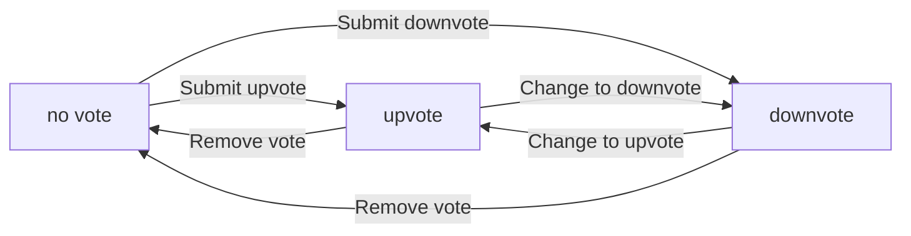
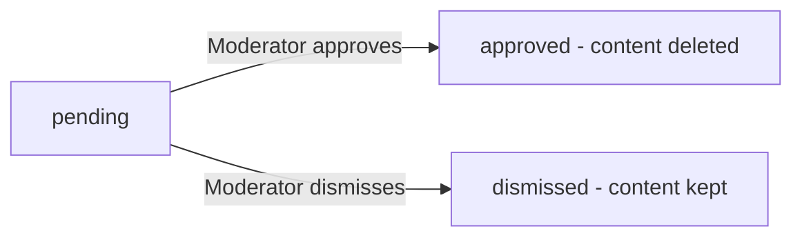
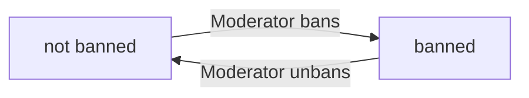

**redditClone — Business concepts, relationships, and states from user perspective**

Business concepts, relationships, and states from user perspective

# Domain Concepts

Describe what each concept means in the business domain and its key attributes.

## User Concept

A user is an individual who participates in the community platform. Each user has a unique username that identifies them across the platform. Users register with an email address and password for account access. Every user maintains a profile containing a display name, bio text, and avatar image. The display name can be different from the username and is shown publicly. The bio text allows users to describe themselves in their own words. The avatar image provides visual representation of the user. Users can view any other user's profile to see their information and activity. A user's profile displays their total karma score reflecting community contributions. When a user deletes their account, all their posts and comments are also removed from the platform.

### User Identity and Registration

Each user has a unique username that identifies them across the platform. The username cannot be changed after registration and must be unique among all users. Users register for an account by providing an email address and choosing a password. The email address is used for account authentication and must be unique. Users log in to the platform using their email address and password. Each user also has a display name that is shown publicly on their profile and next to their posts and comments. The display name is different from the username and can be changed by the user at any time. The username serves as the permanent identifier for the user, while the display name is a flexible public-facing name that the user can update.

### User Profile Attributes

Every user has a profile that contains three main attributes: a display name, bio text, and avatar image. The display name is the public name shown for the user throughout the platform. The bio text allows users to write a description about themselves in their own words. The bio is optional and users can leave it empty or update it at any time. The avatar image provides a visual representation of the user and appears next to their username in posts and comments. Users can upload and change their avatar image whenever they wish. All three profile attributes can be edited by the user through their profile settings.

### Profile Visibility and Viewing

Every user's profile is publicly visible to all other users on the platform. Any user can view any other user's profile page to see their information and activity. Profile visibility does not require the viewer to be logged in or subscribed to any community. When viewing another user's profile, the viewer sees the user's display name, bio text, avatar image, total karma score, and lists of their posts and comments. Users cannot hide their profiles or make them private. All profile information except the email address is visible to the public.

### Karma Score Display

Each user has a single karma score that represents their overall contribution to the community. The karma score is displayed on the user's profile page and is visible to anyone viewing the profile. The karma score is a single number that can be positive, negative, or zero. The score increases when other users upvote the user's posts or comments. The score decreases when other users downvote the user's posts or comments. The karma score updates automatically as votes are cast on the user's content. The total karma score reflects all posts and comments made by the user across all communities.

### Account Deletion and Cascading Effects

Users can delete their own account at any time through their account settings. When a user deletes their account, the deletion triggers a cascade that removes all content created by that user. All posts created by the user are deleted from the platform when the account is deleted. All comments written by the user are also deleted from the platform when the account is deleted. The cascade ensures that no orphaned content remains after account deletion. Once an account is deleted, it cannot be recovered and the user must register a new account to use the platform again. The username of a deleted account becomes available for other users to claim.

## Karma Concept

Karma is a single numerical score assigned to each user representing their standing in the community. The karma score aggregates all voting activity on a user's posts and comments. When another user upvotes content created by someone, that person's karma increases by one point. When another user downvotes content, the creator's karma decreases by one point. If a user removes their vote from content, the karma adjusts accordingly to reflect the change. Karma scores can be negative when a user receives more downvotes than upvotes. The karma score is displayed on the user's profile page for others to see. This single score provides a quick indicator of a user's contribution quality to the community.

### Karma Definition

Each user has exactly one karma score that represents their standing in the community. This single numerical value aggregates all voting activity received on the user's posts and comments across the entire platform. The karma score serves as a quick indicator of how the community perceives the quality of a user's contributions. A higher karma score indicates that the user's content has been well-received by other members, while a lower score suggests the opposite. The karma score is unique to each user and cannot be shared or transferred between accounts.

### Karma Calculation

Karma is calculated based on votes received on all content created by the user. When another user upvotes a post created by someone, the post author's karma increases by one point. When another user upvotes a comment, the comment author's karma also increases by one point. Conversely, when a post receives a downvote, the author's karma decreases by one point. The same applies to comments: a downvote reduces the comment author's karma by one point. If a user removes their vote from a post or comment, the karma adjusts accordingly to reverse the previous effect. For example, removing an upvote decreases the author's karma by one, while removing a downvote increases the author's karma by one. Karma accumulates from both post votes and comment votes, combining all voting activity into a single score.

### Karma Display

The karma score can be any integer value, including negative numbers. A user's karma becomes negative when they have received more downvotes than upvotes across all their posts and comments. The karma score is displayed on the user's profile page and is visible to anyone viewing that profile. Alongside the display name, bio text, and avatar image, the karma score appears as part of the user's public profile information. This allows other users to see the karma score when browsing posts, comments, or directly visiting a user's profile page.

## Community Concept

A community is a space within the platform where users gather around shared interests. Any user can create a new community on the platform. Each community has a unique name that identifies it across the platform. Communities include a description text explaining their purpose and focus. Communities also have an icon image for visual identification. The user who creates a community becomes its owner with special privileges. Users can browse all communities in a list to discover new ones. Users can search for communities by name to find specific ones. Each community displays its subscriber count showing how many users follow it. Communities serve as the organizational structure for posts and discussions.

### Community Definition and Attributes

A community is a space within the platform where users gather around shared interests. Communities serve as the primary organizational structure for posts and discussions on the platform.

Each community has a unique name that identifies it across the platform. No two communities can have the same name. The community name is chosen when the community is created and serves as its primary identifier.

Each community includes a description text that explains its purpose, focus, and what kind of content belongs there. The description helps users understand what the community is about before joining or posting.

Each community has an icon image for visual identification. The icon appears alongside the community name throughout the platform, helping users quickly recognize communities in lists and feeds.

Communities organize all content posted within them. Every post belongs to exactly one community, and posts are grouped and displayed within their respective community spaces.

### Community Creation and Ownership

Any user on the platform can create a new community. There are no restrictions on who can create communities beyond having a user account.

The user who creates a community becomes its owner. The owner has the highest authority within that community and holds special privileges for managing the community and its content. The ownership role is automatically assigned at the moment of community creation and cannot be transferred to another user.

### Community Discovery and Display

Users can browse all communities on the platform in a list view. This allows users to discover new communities to join and explore content across different topics.

Users can search for communities by name. The search function helps users find specific communities they are looking for by matching the community name.

Each community displays its subscriber count, showing how many users have subscribed to that community. The subscriber count is visible to all users and indicates the community's size and activity level.

## Subscription Concept

A subscription represents a user's decision to follow a specific community. Users can subscribe to any community on the platform. Users can unsubscribe from any community they currently follow. Each user maintains a list of all communities they are subscribed to. Subscribing to a community is required before a user can create posts in that community. The subscription relationship connects users to communities they are interested in. Subscriptions enable personalized content feeds showing posts from followed communities. The subscription status determines which communities appear in a user's home feed. Users can view their subscribed communities list to manage their follows.

### Subscription Definition

A subscription represents a user's decision to follow a specific community. Users can subscribe to any community on the platform. Users can unsubscribe from any community they currently follow. The subscription creates a relationship between a user and a community, indicating the user's interest in that community's content. Each subscription connects one user to one community. A user can have subscriptions to multiple communities simultaneously. The subscription relationship is user-controlled and can be established or removed at any time.

### Subscribed Communities List

Each user maintains a list of all communities they are subscribed to. Users can view their subscribed communities list to see all communities they follow. The subscribed communities list shows the subscription status for each community. Users can manage their community follows through this list. The list enables users to track which communities they are connected to and make changes to their subscriptions. Subscription status tracking ensures the system knows which communities each user follows.

### Subscription Effects

Subscribing to a community is required before a user can create posts in that community. Subscriptions enable personalized content feeds showing posts from followed communities. The home feed displays posts only from communities the user is subscribed to. The subscription status determines which communities appear in a user's home feed content source. Without an active subscription, a user cannot post to a community but can still view its content.

## Post Concept

A post is content created by users within a specific community. Every post must have a title that is required for all posts. Posts come in three types: text posts with written content, link posts with a URL, and image posts with an uploaded image. The post type determines what additional content the post contains. Each post belongs to exactly one community where it was created. Posts display the author who created them and the community they belong to. Posts show a vote score reflecting community reception. Posts display a comment count showing how many comments have been added. Posts include a timestamp indicating when they were posted. Users can edit their own posts to update content. Users can delete their own posts to remove them from the platform.

### Post Definition and Types

A post is content created by a user within a specific community. Every post must have a title, which is required for all posts regardless of type. Posts are classified into exactly three types: text posts, link posts, and image posts. A text post contains written content provided by the author. A link post contains a URL that points to an external resource. An image post contains an uploaded image file. The post type determines what additional content accompanies the title. Each post belongs to exactly one post type, which cannot be changed after creation.

### Post Attributes and Relationships

Each post belongs to exactly one community where it was created. The post displays the username of the author who created it. The post shows a vote score that reflects the net result of all upvotes and downvotes received from users. The post displays a comment count indicating how many comments have been added to it. The post includes a timestamp showing when it was originally posted. The vote score and comment count are derived from user interactions and update automatically as users vote and comment.

### Post Lifecycle

The author of a post can edit their own post to update its title or content. The author of a post can delete their own post to remove it from the platform. When a post is deleted by its author, the post and all its associated comments are removed from view. Only the author of a post has the ability to edit or delete that post.

## Vote Concept

A vote represents a user's reaction to a post or comment. Users can upvote content to show approval, which adds one to the vote score. Users can downvote content to show disapproval, which subtracts one from the vote score. Each user can only cast one vote per piece of content at any time. Users can change their vote from upvote to downvote or from downvote to upvote. Users can remove their vote entirely, leaving the content without their vote. The vote score equals total upvotes minus total downvotes from all users. Votes apply to both posts and comments using the same rules. The voting system allows users to express their opinion on content quality.

### Vote Definition and Target Content

A vote represents a user's opinion expression on content quality within the platform. Users can vote on posts to indicate their approval or disapproval of the post. Users can vote on comments to indicate their approval or disapproval of the comment. Votes apply equally to both posts and comments using the same voting rules. The voting system enables users to express their opinion on content quality and helps surface valuable content to the community.

### Vote Types and Score Calculation

There are two types of votes: upvote and downvote. An upvote adds one to the content's vote score, showing approval. A downvote subtracts one from the content's vote score, showing disapproval. The vote score for any post or comment equals the total number of upvotes minus the total number of downvotes from all users who have voted on that content. This calculation applies to both posts and comments.

### Vote Constraints and Modification

Each user can only cast one vote per piece of content at any time. This single vote constraint means a user cannot both upvote and downvote the same post or comment simultaneously. Users can change their existing vote from upvote to downvote or from downvote to upvote. Users can remove their vote entirely, leaving the content without their vote. When a vote is changed or removed, the content's vote score adjusts accordingly based on the new vote state.

## Comment Concept

A comment is a user's response to a post or to another comment. Users can write comments on any post in the platform. Users can reply to any existing comment to create threaded discussions. Replies can have their own replies with no depth limit, creating nested conversation trees. Each comment displays the author who wrote it. Comments show the content text written by the author. Comments display a vote score based on upvotes and downvotes received. Comments include a timestamp showing time since posted. Comments show their nested replies when viewing the full comment thread. Users can edit their own comments to update the content. Users can delete their own comments to remove them from discussions.

### Comment Definition and Attributes

A comment is a user's written response within a discussion. Every comment is authored by a single user and displays the author's identity. Each comment contains content text written by the author. Comments display a vote score that reflects the net result of upvotes and downvotes received. Comments include a timestamp showing when they were posted, displayed as time since posting (e.g., "3 hours ago"). A comment may optionally belong to a parent comment, establishing a reply relationship. Comments that do not have a parent comment are direct responses to a post.

### Threaded Comment Structure

Comments form threaded discussion structures through reply relationships. Any comment can receive replies, creating nested comment threads. Replies can themselves receive replies, supporting unlimited reply depth with no maximum nesting level. The threaded structure organizes comments hierarchically, with each level of replies indented or visually nested under its parent. When viewing a comment thread, all nested replies are visible, displaying the full conversation tree from the original comment down through all levels of replies.

## Moderator Concept

A moderator is a user with special privileges to manage a specific community. The community creator automatically becomes the owner with the highest authority level. The owner can add other users as moderators to help manage the community. The owner can remove moderators from their community. Moderators can add other users as moderators within their community. Moderators cannot remove the community owner under any circumstances. Moderators cannot remove other moderators, only the owner has this power. Moderators have elevated permissions compared to regular users within their community. The moderator role establishes a hierarchy of authority for community management. Multiple moderators can exist in a single community alongside the owner.

### Moderator Role and Authority Levels

A moderator is a user with elevated permissions to manage a specific community. The community creator automatically becomes the owner, which is the highest authority level within that community. The owner role has more authority than the moderator role. Both owners and moderators have elevated permissions compared to regular users within their community. The owner and moderator roles establish a community management hierarchy with two distinct authority levels. Multiple moderators can exist in a single community alongside the owner. A user can be a moderator in multiple communities simultaneously.

### Moderator Assignment and Removal Rules

The owner can add other users as moderators within their community. The owner can remove moderators from their community. Moderators can add other users as moderators within their community. Moderators cannot remove the community owner under any circumstances. Moderators cannot remove other moderators from the community. Only the owner has the power to remove moderators. This creates an asymmetric authority structure where the owner has complete control over moderator membership, while moderators have limited authority to expand but not reduce the moderator team.

## Ban Concept

A ban is a restriction placed on a user within a specific community. Moderators can ban users from their community to restrict their participation. Moderators can unban users to restore their participation rights. Moderators can view the list of all users banned from their community. Banned users cannot create new posts in the community where they are banned. Banned users cannot write comments in the community where they are banned. Banned users can still view all content in the community despite the ban. The ban applies only to the specific community, not the entire platform. Bans are a moderation tool to maintain community standards and safety.

### Ban Definition and Scope

A ban is a moderation restriction placed on a user within a specific community. The ban applies only to the community where it was issued, not to the entire platform. A user can be banned from one community while remaining active in other communities. The ban serves as a moderation tool to maintain community standards and safety. Each ban represents a participation restriction tied to one user and one community. The ban scope is per community, meaning multiple bans can exist for the same user across different communities.

### Ban Effects on User Participation

A banned user cannot create new posts in the community where the ban is active. A banned user cannot write comments in the community where the ban is active. Despite the posting and commenting restrictions, a banned user can still view all content in the community. The ban restricts participation actions while preserving read access. Moderators maintain a list of all users banned from their community for reference and management purposes.

## Report Concept

A report is a flag raised by users about inappropriate content in the community. Users can report any post that violates community standards. Users can report any comment that violates community standards. When reporting, users must provide a reason explaining why they are reporting the content. Moderators can view all reports submitted for their community. Each report displays the content that was reported for review. Reports show who submitted the report to the moderators. Reports include the reason text provided by the reporting user. Moderators can approve a report which results in deleting the reported content. Moderators can dismiss a report which keeps the content and removes the report from the list. Dismissed reports are removed from the report list and no longer visible to moderators.

### Report Definition

A report is a content violation flag raised by users about inappropriate posts or comments in a community. Users can report any post that violates community standards. Users can report any comment that violates community standards. Each report is associated with the community where the reported content was posted. Reports serve as a mechanism for users to alert moderators about potential rule violations.

### Report Attributes

When reporting, users must provide a reason explaining why they are reporting the content. The reason is a required text field that cannot be empty. Each report displays the content that was reported for moderator review. Reports show who submitted the report to the moderators, displaying the reporter's identity. Reports include the reason text provided by the reporting user for context during review.

### Report Review and Outcomes

Moderators can view all reports submitted for their community. Moderators review each report to determine if action is needed. Moderators can approve a report which results in deleting the reported content. Moderators can dismiss a report which keeps the content and removes the report from the list. Dismissed reports are removed from the report list and no longer visible to moderators. Each report is resolved through either approval or dismissal.

# Domain Relationships

Describe how concepts relate to each other from a business perspective.

## Conceptual Relationships

Describe how concepts relate to each other in business terms.

### User Ownership Relationships

Each user owns exactly one karma score that tracks their total contribution value across the platform.

A user has many posts that they have created. Each post belongs to exactly one user as its author.

A user has many comments that they have written. Each comment belongs to exactly one user as its author.

A user has many subscriptions to communities. Each subscription belongs to exactly one user.

A user has many votes on posts and comments. Each vote belongs to exactly one user.

A user may be a moderator in many communities through moderator relationships. Each moderator relationship belongs to exactly one user.

A user may be banned from many communities through ban relationships. Each ban relationship belongs to exactly one user as the banned user.

A user may issue many bans in communities where they are a moderator. Each ban belongs to exactly one user as the issuer.

### Community Membership Relationships

Each community has exactly one owner who created it. The owner relationship belongs to exactly one user.

A community has many subscribers through subscription relationships. Each subscription belongs to exactly one community.

A community has many moderators through moderator relationships. Each moderator relationship belongs to exactly one community.

A community has many bans that prevent users from participating. Each ban belongs to exactly one community.

A community has many posts created within it. Each post belongs to exactly one community.

A community has many reports about content within it. Each report belongs to exactly one community.

### Content Association Relationships

Each post belongs to exactly one community where it was created.

Each post belongs to exactly one user as its author.

A post has many comments. Each comment belongs to exactly one post.

A comment may have many replies, which are also comments. Each reply comment belongs to exactly one parent comment, creating a nested thread structure with unlimited depth.

Each comment belongs to exactly one user as its author.

A post has many votes from users. Each vote targets exactly one post.

A comment has many votes from users. Each vote targets exactly one comment.

A post may have many reports from users. Each report targets exactly one post.

A comment may have many reports from users. Each report targets exactly one comment.

### Vote and Report Targeting

Each vote belongs to exactly one user who cast it.

A vote targets either one post or one comment, but not both. This is a polymorphic association where the vote is linked to one type of content.

Each report belongs to exactly one user who submitted it.

A report targets either one post or one comment within a specific community, but not both. This is a polymorphic association where the report is linked to one type of content.

Each report belongs to exactly one community where the reported content exists.

## Lifecycle and Retention

Describe concept lifecycle states and transitions only. Detailed retention/recovery policies belong in 05-non-functional. Operation details belong in 03-functional-requirements.

### Account Lifecycle and Deletion

A user account is created when a user completes registration with email, password, and username.

The account remains active while the user maintains it.

A user can delete their own account at any time.

When a user deletes their account, all posts created by that user are also deleted.

When a user deletes their account, all comments written by that user are also deleted.

Account deletion is permanent and cannot be undone.

The user's profile, including display name, bio, and avatar, is removed when the account is deleted.

The user's karma score is removed when the account is deleted.

The user's community subscriptions are removed when the account is deleted.

The user's moderator roles are removed when the account is deleted.

### Content Lifecycle and Deletion

A post is created when a user submits a new post in a community they are subscribed to.

A post remains visible in the community feed while it exists.

A user can delete their own posts at any time.

A moderator can delete any post within their community.

When a post is deleted, it is permanently removed from the community feed.

When a post is deleted, all comments on that post are also deleted.

A comment is created when a user writes a comment on a post or replies to another comment.

A comment remains visible while it exists.

A user can delete their own comments at any time.

A moderator can delete any comment within their community.

When a comment is deleted, it is permanently removed from the post.

When a comment is deleted, all replies to that comment are also deleted.

Post and comment deletion is permanent and cannot be undone.

### Report Lifecycle

A report is created when a user submits a report on a post or comment with a reason.

The report remains in the moderator report list until it is resolved.

A moderator can approve a report, which deletes the reported content.

A moderator can dismiss a report, which keeps the reported content visible.

When a report is dismissed, it is removed from the report list.

When a report is approved and the content is deleted, the report is removed from the report list.

Reports do not have an archival state; they are either active in the report list or removed after resolution.

### Retention and Recovery Policy

The requirements do not specify data retention periods for any entity type.

The requirements do not specify archival processes for deleted content.

The requirements do not specify data recovery or restoration procedures.

All deletion operations described in the requirements are permanent with no recovery mechanism mentioned.

Detailed retention, archival, and recovery policies are not defined in the user requirements and would need to be specified separately if required.

# Business Categories and State Flows

Business category classifications and state flow definitions.

## Business Category Definitions

Define all business category classifications with their allowed values and descriptions.

### Post Type Classification

Every post belongs to exactly one of three types:

- **Text post**: contains written content authored by the user
- **Link post**: contains a URL pointing to an external website
- **Image post**: contains an uploaded image file

The post type is selected when creating the post and cannot be changed afterward. The type determines what content field is required and how the post appears in feeds.

### Vote Type Classification

Users can cast one of two vote types on posts and comments:

- **Upvote**: indicates approval, adds one to the content's score
- **Downvote**: indicates disapproval, subtracts one from the content's score

A user can only have one active vote per piece of content at any time. Users can change their vote from upvote to downvote or vice versa, or remove their vote entirely.

### Feed Type Classification

Posts are displayed through three distinct feed types:

- **Home feed**: shows posts only from communities the user is subscribed to, available only to logged-in users
- **Popular feed**: shows posts from all communities across the platform, available to everyone including logged-out users
- **Community feed**: shows posts from one specific community, available to everyone

The feed type determines which posts are included and what subscription requirements apply.

### Post Sorting Classification

All post feeds support four sorting methods:

- **Hot**: recent posts with many upvotes appear first
- **New**: most recently created posts appear first
- **Top**: highest vote score appears first, requires a time filter selection
- **Controversial**: posts with many votes but a score close to zero appear first

The sorting method is selected by the user and determines the order of posts in any feed.

### Time Filter Classification

When using the Top sorting method, users must select a time range filter:

- **Today**: posts from the current day
- **This week**: posts from the past seven days
- **This month**: posts from the past thirty days
- **This year**: posts from the past twelve months
- **All time**: posts from any date

The time filter restricts which posts are considered when calculating the top ranking.

### Comment Sorting Classification

Comments on a post can be displayed using three sorting methods:

- **Best**: comments with the highest vote score appear first
- **New**: most recently posted comments appear first
- **Controversial**: comments with many votes but a score close to zero appear first

The sorting method is selected by the user viewing the post and determines the order of top-level comments.

### Report Action Classification

Moderators can take one of two actions on a report:

- **Approve**: the reported content is deleted and the report is resolved
- **Dismiss**: the reported content remains visible and the report is removed from the list

Once an action is taken, the report is no longer visible in the active reports list. Only moderators of the community can view and act on reports for their community.

## State Transitions

Define valid state transition paths for stateful concepts.

### Vote State Transitions

A user's vote on a post or comment can exist in one of three states: no vote, upvote, or downvote.

When a user has not voted on content, they can submit an upvote or a downvote. Submitting an upvote changes the vote state from no vote to upvote. Submitting a downvote changes the vote state from no vote to downvote.

When a user has already upvoted content, they can change their vote to a downvote or remove their vote entirely. Changing to a downvote transitions the state from upvote to downvote. Removing the vote transitions the state from upvote to no vote.

When a user has already downvoted content, they can change their vote to an upvote or remove their vote entirely. Changing to an upvote transitions the state from downvote to upvote. Removing the vote transitions the state from downvote to no vote.

Each vote state change immediately adjusts the content's vote score and the author's karma score according to the voting rules.

### Report State Transitions

A report on a post or comment follows a workflow from submission to resolution.

When a user reports content, the report enters a pending state. The report remains pending until a moderator of the community takes action.

A moderator can approve a report, which transitions the report to an approved state. When a report is approved, the reported content is deleted and the report is removed from the report list.

A moderator can dismiss a report, which transitions the report to a dismissed state. When a report is dismissed, the reported content remains visible and the report is removed from the report list.

Once a report is approved or dismissed, no further state changes occur. The report workflow is complete.

### Ban State Transitions

A user's ban status in a community follows a simple state flow between banned and not banned.

By default, a user is not banned in any community. A moderator can ban a user from their community, which transitions the user's status from not banned to banned.

When a user is banned from a community, they cannot create posts or comments in that community. They can still view content in the community.

A moderator can unban a user from their community, which transitions the user's status from banned to not banned. Once unbanned, the user can create posts and comments in the community again.

Only moderators have the authority to change a user's ban status. The ban state transition workflow is controlled entirely by moderator actions.

