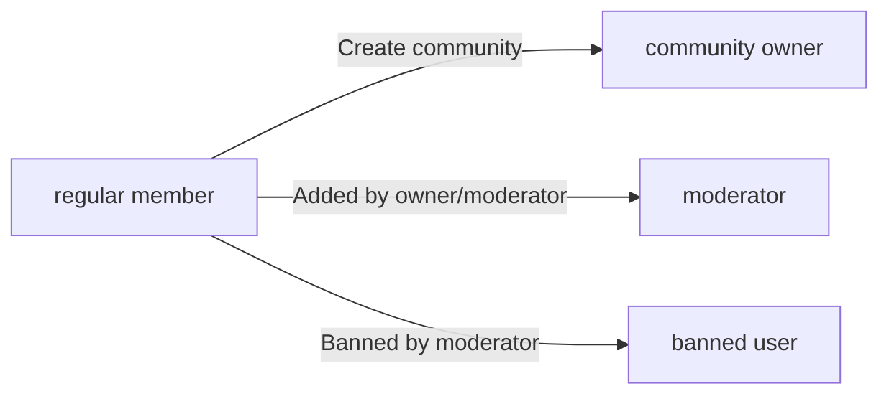
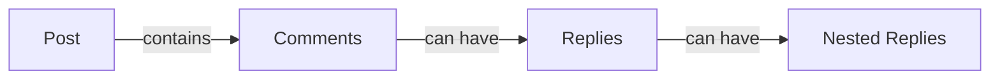
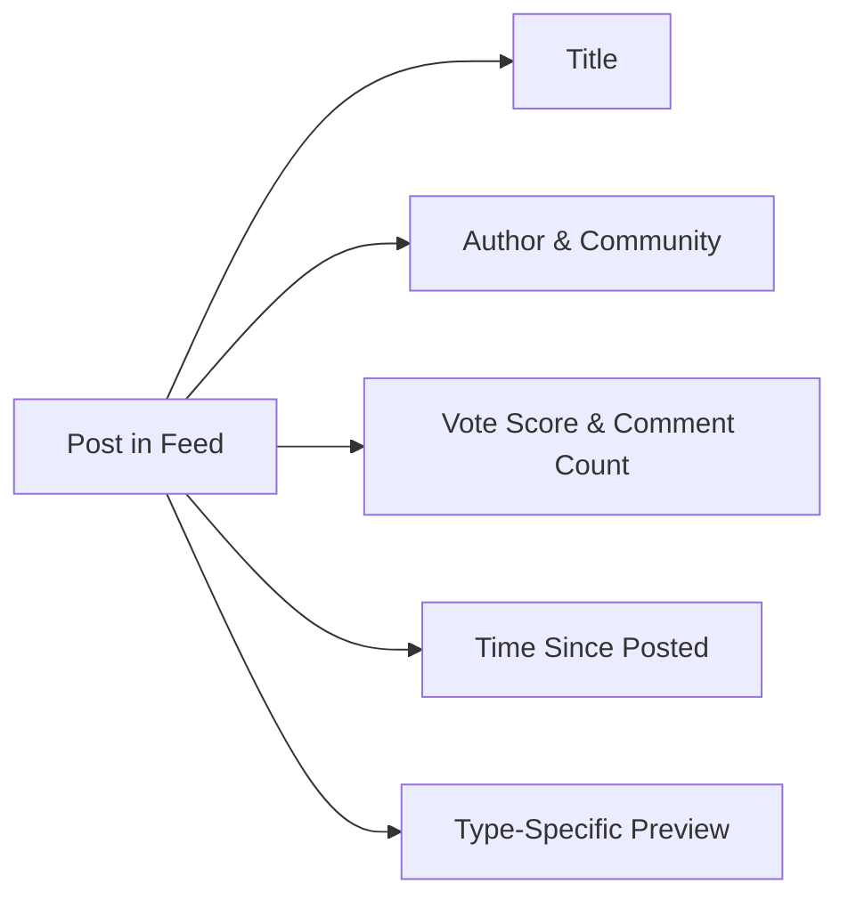

**redditCommunity — Business concepts, relationships, and states from user perspective**

Business concepts, relationships, and states from user perspective

# Domain Concepts

Describe what each concept means in the business domain and its key attributes.

## User Concept

Users are the primary actors who participate in the platform by creating content and interacting with communities. Each user has a unique username that identifies them across the platform. Users authenticate with an email address and password for account access. Every user maintains a profile containing a display name, bio text, and avatar image. Each user has a single karma score that reflects their contribution quality. Karma increases when others upvote the user's posts or comments. Karma decreases when others downvote the user's posts or comments. Karma can become negative if downvotes exceed upvotes. Users can take on different roles including community owner, moderator, or regular member. Users can be banned from specific communities while retaining platform access. Users can subscribe to multiple communities to follow their content. When a user deletes their account, all their posts and comments are also removed.

### User Identity

Every user has a unique username that identifies them across the platform. No two users can have the same username. The username is chosen by the user during account creation and cannot be changed afterward.

Users authenticate with an email address and password. The email address serves as the primary credential for account access. Each email address can only be associated with one user account. Users must provide a valid password during login to access their account.

The password is used to secure the user's account. Users can change their password at any time through their account settings. When a user changes their password, the old password can no longer be used to access the account.

### User Profile

Each user maintains a profile that is visible to all other users on the platform. The profile contains three main attributes:

The display name is shown alongside the user's content and on their profile page. Users can edit their display name at any time. The display name does not need to be unique across the platform.

The bio is a text description where users can write about themselves. Users can edit their bio at any time. The bio is optional and users are not required to provide one.

The avatar is an image that represents the user visually. Users can upload and change their avatar at any time. The avatar appears on the user's profile page and alongside their posts and comments.

All users can view any other user's profile to see their display name, bio, avatar, karma score, posts, and comments.

### Karma Score

Every user has a single karma score that reflects their contribution quality on the platform. The karma score is a single number that can be positive, negative, or zero.

When another user upvotes the user's post, the karma score increases by 1. When another user upvotes the user's comment, the karma score increases by 1.

When another user downvotes the user's post, the karma score decreases by 1. When another user downvotes the user's comment, the karma score decreases by 1.

When a user removes their upvote from a post or comment, the karma score decreases by 1. When a user removes their downvote from a post or comment, the karma score increases by 1.

When a user changes their vote from upvote to downvote, the karma score decreases by 2. When a user changes their vote from downvote to upvote, the karma score increases by 2.

The karma score can become negative if the total downvotes exceed the total upvotes across all the user's posts and comments.

### User Roles and Status

Users can take on different roles within the platform based on their activities and permissions.

A user becomes a community owner when they create a community. The community creator is automatically assigned as the owner of that community. A user can own multiple communities.

A user can be assigned as a moderator in a community. The community owner can add other users as moderators. Moderators can also add other users as moderators, but cannot remove the owner or other moderators.

A user can be banned from a specific community. When banned, the user cannot create posts or comments in that community but can still view content. Only moderators and owners can ban users from their community. A user can be banned from multiple communities while retaining access to the platform.

### User Membership and Content Ownership

Users can subscribe to any community on the platform. A subscription represents the user's membership in that community. Users can subscribe to multiple communities. Users can unsubscribe from any community they are subscribed to.

When a user creates a post, they become the author and owner of that post. The post is attributed to the user who created it. The author information is displayed alongside the post.

When a user writes a comment, they become the author of that comment. The comment is attributed to the user who wrote it. The author information is displayed alongside the comment.

When a user deletes their account, all posts created by that user are also deleted. All comments written by that user are also deleted. This deletion is permanent and cannot be undone. The user's profile, karma score, and all subscriptions are also removed when the account is deleted.

## Community Concept

Communities are user-created spaces that organize content around shared interests. Each community has a unique name that distinguishes it from all other communities. Communities include a description text that explains their purpose and topic. Communities display an icon image for visual identification and branding. The user who creates a community becomes its owner with highest authority. Communities track and display their total subscriber count publicly. Communities can have multiple moderators who assist with content management. Communities serve as containers for posts created by subscribed users. Communities enable browsing and searching functionality for discovery. Communities establish the context for moderation actions and reporting. Communities define the scope for ban enforcement. Communities organize content feeds for subscribers and visitors.

### Community Identity and Attributes

A community is identified by a unique name that distinguishes it from all other communities on the platform. No two communities can share the same name. The community name serves as the primary identifier for browsing, searching, and referencing the community throughout the platform.

Each community includes a description text that explains its purpose, topic, and intended audience. The description helps users understand what type of content belongs in the community and what discussions are appropriate.

Communities display an icon image for visual identification and branding. The icon appears alongside the community name in feeds, search results, and community pages to help users quickly recognize communities they follow.

Every community tracks and publicly displays its total subscriber count. The subscriber count represents the number of users who have subscribed to the community and is visible to all users viewing the community.

### Community Ownership and Moderation Structure

The user who creates a community becomes its owner with highest authority over that community. The owner holds ultimate responsibility for the community's governance and has exclusive powers that moderators do not possess.

Communities can have a team of moderators who assist the owner with content management and community governance. The owner can add users as moderators to help manage the community. Moderators can also add other moderators to the team, expanding the moderation capacity.

The owner holds exclusive authority to remove moderators from the community. Moderators cannot remove the community owner. Moderators cannot remove other moderators; only the owner can remove moderators from the team.

Moderation authority is bounded by the community. Moderators can only take moderation actions within their own community. A moderator of one community has no moderation authority in other communities. The community defines the boundary within which moderation actions apply.

### Community Content and Discovery Scope

Communities serve as containers that organize posts around shared interests. Every post belongs to exactly one community. The community establishes the context and scope for all posts created within it.

Posts are organized by their parent community. When viewing a community, users see only posts that belong to that specific community. The community defines which posts appear in its dedicated feed.

Communities serve as the content source for feed generation. The home feed displays posts from communities to which the user is subscribed. The community feed displays posts from one specific community. The popular feed aggregates posts from all communities across the platform.

Communities support browsing through a list view that shows all communities on the platform. Users can browse the complete list of communities to discover new communities of interest.

Communities support search functionality by name. Users can search for communities using the community name as the search term. Search results return communities whose names match the search query.

Subscription to a community is a prerequisite for creating posts in that community. Users must be subscribed to a community before they can create posts within it. The subscription requirement ensures that post creators have an established connection to the community.

## Post Concept

Posts are the primary content units that users share within communities. Every post requires a title that summarizes its content. Posts must be one of three types: text post, link post, or image post. Text posts contain written content authored by the user. Link posts include a URL pointing to external content. Image posts contain an uploaded image file. Each post belongs to exactly one community. Posts have an author who created and owns the content. Posts accumulate a vote score based on user voting. Posts track the total number of comments they have received. Posts display when they were created relative to current time. Posts serve as the parent container for comments and replies.

### Post Title and Content Types

Every post requires a title that summarizes its content. The title is mandatory and cannot be empty.

Posts must be classified as one of three types: text post, link post, or image post. The post type determines what additional content the post contains.

Text posts contain written content authored by the user. The text content is the main body of the post.

Link posts include a URL pointing to external content. The URL directs users to content outside the platform.

Image posts contain an uploaded image file. The image is the primary content of the post.

### Post Ownership and Relationships

Each post belongs to exactly one community. A post cannot exist without being associated with a community.

Each post has an author who created and owns the content. The author is the user who created the post.

Post authors can edit their own posts. Only the author of a post can modify its content.

Post authors can delete their own posts. Only the author of a post can remove it from the platform.

Posts serve as the parent container for comments and replies. All comments on a post are organized under that post.

### Post Metrics and Feed Display

Posts accumulate a vote score based on user upvotes and downvotes. The vote score equals total upvotes minus total downvotes.

Posts track the total number of comments they have received. The comment count includes all comments and replies on the post.

Posts display when they were created relative to current time. The display shows time elapsed since posting (e.g., "3 hours ago").

In feed lists, each post displays: title, author username, community name, vote score, comment count, and time since posted.

Text posts in feed lists show the first 200 characters of content as a preview.

Image posts in feed lists show a thumbnail of the image.

Link posts in feed lists show the domain name of the URL (e.g., "youtube.com").

## Comment Concept

Comments are user responses that provide discussion on posts. Users can write comments on any post within the platform. Comments can reply to other comments to create threaded conversations. Replies can nest indefinitely with no depth limit. Each comment contains content text written by the author. Comments have an author who created the comment. Comments belong to a specific post as their root container. Comments accumulate vote scores from user voting. Comments display when they were posted relative to current time. Comments show their nested replies in a hierarchical structure. Comments can be edited by their authors. Comments can be deleted by their authors or moderators.

### Comment Definition

A comment is a user-written response that contributes to discussion on a post. Every comment contains content text written by its author. Each comment has exactly one author who created it. Every comment belongs to one specific post as its root container. Comments display when they were posted using relative time (e.g., "3 hours ago"). Each comment accumulates a vote score from user voting activity. The vote score is a single number that can be positive, negative, or zero.

### Comment Reply Structure

Comments can reply to other comments to create threaded conversations. A comment may have a parent comment, establishing a reply relationship. When a comment has no parent comment, it is a top-level comment directly on the post. When a comment has a parent comment, it is a reply to that comment. Replies can nest indefinitely with no depth limit, forming a hierarchical tree structure. The nested reply structure enables multi-level discussions where users can respond to specific points within a conversation thread. Each comment in the hierarchy maintains its position within the reply tree, allowing the system to track and display the conversation flow.

### Comment Vote Score

Every comment has a vote score representing the net result of user votes. The vote score equals total upvotes minus total downvotes. A comment's vote score can be negative when downvotes exceed upvotes. The vote score updates dynamically as users cast, change, or remove their votes. Each comment displays its current vote score to users viewing the post.

### Comment Display Attributes

When viewing a comment, the following information is displayed: the author's username, the comment content text, the current vote score, the time since the comment was posted, and any nested replies in hierarchical order. For comments with replies, the nested reply visualization shows child comments indented or otherwise visually distinguished from their parent comment, maintaining the threaded conversation flow. The display presents comments and their replies in a structure that reflects the reply hierarchy tracking, enabling users to follow conversation threads.

## Vote Concept

Votes represent user opinions on posts and comments throughout the platform. Users can cast votes on both posts and comments. Each user can vote only once per target content item. Votes can be either upvotes or downvotes. Upvotes add one point to the target's score. Downvotes subtract one point from the target's score. Users can change their vote from upvote to downvote or vice versa. Users can remove their vote entirely to neutralize their impact. Vote score equals total upvotes minus total downvotes. Votes directly affect the author's karma score. Vote adjustments occur when users change or remove votes. Votes enable content sorting by popularity and controversy.

### Vote and Target Association

A vote represents a user's opinion on content within the platform. A vote targets either a post or a comment. Each user can have only one active vote per target content item at any time. A user cannot cast multiple votes on the same post or comment simultaneously. The vote establishes an association between the user and the target content. This one-vote-per-target rule applies across all posts and comments on the platform.

### Vote Direction and Score Impact

A vote has one of three states: upvote, downvote, or no vote. An upvote adds one point to the target content's vote score. A downvote subtracts one point from the target content's vote score. The vote score of a post or comment equals the total number of upvotes minus the total number of downvotes. A vote score can be positive, negative, or zero. The vote score serves as the basis for sorting content by popularity. Posts and comments with many votes but scores close to zero are identified as controversial content.

### Vote Modification and Karma Relationship

A user can change their vote from upvote to downvote or from downvote to upvote on the same target. A user can remove their vote entirely, returning the target to a neutral vote state for that user. When a vote is changed or removed, the target's vote score adjusts accordingly. Each vote affects the karma score of the content author. When a post or comment receives an upvote, the author's karma increases by one. When a post or comment receives a downvote, the author's karma decreases by one. When a vote is changed or removed, the author's karma is adjusted to reflect the change. A user's karma score can be positive, negative, or zero.

## Report Concept

Reports flag content that may violate community guidelines for moderator review. Users can report any post or comment on the platform. When reporting, users must provide a reason explaining their concern. Reports identify the user who submitted the report. Reports target specific content items either posts or comments. Reports belong to the community where the content was posted. Moderators can view all reports for their communities. Reports display the reported content for context. Reports show who reported the content and why. Moderators can approve reports which deletes the reported content. Moderators can dismiss reports which keeps the content visible. Dismissed reports are removed from the active report list.

### Report

A report is a flag submitted by a user to indicate that a post or comment may violate community guidelines. Each report identifies the user who submitted it. Reports include a reason text explaining the concern. Reports are associated with the community where the reported content was posted. The reason provided by the reporter is visible to moderators during review.

### Report Target

Reports can target either a post or a comment. The reported content is displayed to moderators for context during review. When a post is reported, the full post content is shown. When a comment is reported, the comment content and its position in the reply thread are shown.

### Report Status

Reports have a status that indicates their review state. Pending reports await moderator review. Approved reports result in deletion of the reported content. Dismissed reports keep the content visible and are removed from the active report list. A report transitions from pending to either approved or dismissed upon moderator decision.

## Ban Concept

Bans restrict specific users from participating in particular communities. Moderators can ban users from their communities. Bans apply only to the specific community where they were issued. Banned users cannot create posts in the banned community. Banned users cannot write comments in the banned community. Banned users retain the ability to view all community content. Bans are issued by moderators or community owners. Owners can remove bans issued by themselves or moderators. Bans are tracked per community per user. The list of banned users is visible to moderators. Bans do not affect user access to other communities. Bans remain in effect until explicitly removed by authorized moderators.

### Ban Definition and Scope

A ban restricts a specific user from participating in a particular community. Each ban applies only to the community where it was issued, not to other communities on the platform. A user banned from one community retains full access to all other communities. Bans are tracked individually per community per user, meaning a user can be banned from multiple communities independently. A ban remains in effect indefinitely until explicitly removed by an authorized moderator or community owner. The ban scope is limited to the single community where the ban was issued, ensuring cross community access is preserved for banned users.

### Ban Effects on User Actions

When a user is banned from a community, the ban enforcement prevents specific actions within that community. A banned user cannot create posts in the banned community. A banned user cannot write comments in the banned community. These posting ban restriction and commenting ban restriction rules apply to all content creation within the community. However, a banned user retains the ability to view all community content, including posts and comments. The ban does not restrict content viewing allowance, allowing banned users to read but not participate. User ban enforcement is automatic and applies to all post and comment creation attempts in the banned community.

### Ban Authority and Management

Community owners and moderators have authority to issue bans within their communities. The community owner holds the highest ban authority and can ban any user from their community. Moderators can ban users from their community but cannot ban the community owner. For ban removal capability, the community owner can remove any ban issued in their community, including bans issued by moderators. Moderators can remove bans they issued themselves but cannot remove bans issued by other moderators. Only the community owner can remove bans issued by other moderators, establishing an owner ban override capability. This moderator ban limitation ensures that ban removal authority is properly hierarchical. Owner ban authority supersedes all other ban management actions.

### Ban Visibility and Tracking

Moderators can view the list of banned users for their community. The banned user list visibility is restricted to moderators and community owners only. Each ban record tracks which user was banned, which community the ban applies to, which moderator issued the ban, and when the ban was created. Ban status verification is available to moderators when reviewing user participation eligibility. The ban persistence rule ensures bans remain active across sessions and do not expire automatically. Ban tracking is maintained per community, allowing moderators to see the complete history of bans issued in their community. Regular users cannot view the banned user list or ban status of other users.

## Subscription Concept

Subscriptions connect users to communities they want to follow. Users can subscribe to any community on the platform. Users can unsubscribe from communities at any time. Subscriptions are required to create posts in a community. Subscriptions track when the user subscribed to the community. Users can view a list of all their subscribed communities. Subscriptions enable the home feed to show relevant content. Subscriptions represent ongoing membership interest in a community. Multiple users can subscribe to the same community. Community subscriber counts reflect total active subscriptions. Subscriptions do not grant special privileges beyond posting ability. Subscriptions can be created or removed freely by users.

### Subscription Definition

A subscription represents a user's ongoing membership interest in a community. Each subscription connects one user to one community, establishing a community following relationship. A subscription has a timestamp that tracks when the user subscribed to the community. Users can have multiple subscriptions to different communities. Each subscription represents a user community connection that enables content access enablement for the home feed. Subscriptions exist in an active state while the user remains subscribed. The subscription membership status indicates whether the user is currently following the community. Users maintain free subscription management, meaning they can subscribe or unsubscribe without restrictions or costs. A subscription is created when a user performs a community subscription action. The subscription state tracking allows the system to know which communities a user follows at any time.

### Subscription Effects

Subscriptions have several effects on the platform. The subscription requirement rule states that users must be subscribed to a community before they can create posts in that community, making subscription a post creation prerequisite. Each community displays a subscriber count that reflects the total number of active subscriptions through subscriber count aggregation. The home feed filtering uses subscriptions to show only posts from communities the user is subscribed to. When a user performs an unsubscribe capability action, the subscription is removed and the user loses posting ability in that community. The subscribed communities list shows all communities where the user has active subscriptions. Multiple users can subscribe to the same community, and each subscription contributes to that community's subscriber count. Subscriptions do not grant special privileges beyond posting ability—any user can view community content regardless of subscription status.

# Domain Relationships

Describe how concepts relate to each other from a business perspective.

## Conceptual Relationships

Describe how concepts relate to each other in business terms.

### User-Community Relationships

A user can own multiple communities. The user who creates a community becomes its owner. A community has exactly one owner. A user can subscribe to multiple communities. A community can have multiple subscribers. The relationship between a user and a community through subscription is called a subscription. A user can view the list of communities they are subscribed to. A user can view any community regardless of subscription status. Subscription to a community is required before a user can create posts in that community. A user can unsubscribe from any community they are subscribed to. When a user deletes their account, all their community subscriptions are removed.

### Content Ownership and Authorship

Every post belongs to exactly one user as its author. Every comment belongs to exactly one user as its author. A user can author multiple posts. A user can author multiple comments. The author of a post can edit that post. The author of a post can delete that post. The author of a comment can edit that comment. The author of a comment can delete that comment. When a user deletes their account, all posts and comments they authored are deleted. A post belongs to exactly one community. A comment belongs to exactly one post. The author of content and the community where content resides may be different users and entities.

### Community Content Hierarchy

A community contains multiple posts. A community can contain zero or more posts. A post contains multiple comments. A post can contain zero or more comments. A comment can contain multiple reply comments. A comment can have zero or more reply comments. Replies to comments can themselves have replies, with no limit on nesting depth. All comments on a post form a threaded conversation structure. When a post is deleted, all comments on that post are deleted. When a community is deleted, all posts in that community are deleted. The community owner and moderators can delete any post or comment within their community.

### Voting Associations

A user can cast one vote on each post. A user can cast one vote on each comment. A vote belongs to exactly one user who cast it. A vote targets exactly one post or one comment. A user cannot cast multiple votes on the same post. A user cannot cast multiple votes on the same comment. A user can change their vote direction on a post from upvote to downvote or vice versa. A user can change their vote direction on a comment from upvote to downvote or vice versa. A user can remove their vote from a post entirely. A user can remove their vote from a comment entirely. When a vote is cast, changed, or removed, the target's score adjusts accordingly. A post score equals total upvotes minus total downvotes. A comment score equals total upvotes minus total downvotes. Vote scores can be negative.

### Moderation and Reporting Relationships

A community has one or more moderators. The community owner is automatically a moderator with highest authority. The owner can add other users as moderators. The owner can remove moderators from the community. Moderators can add other users as moderators. Moderators cannot remove the community owner. Moderators cannot remove other moderators. A ban applies to one user within one community. A banned user cannot create posts or comments in that community. A banned user can still view content in the community. Moderators can ban users from their community. Moderators can unban users from their community. Moderators can view the list of banned users in their community. A report targets exactly one post or one comment. A report is filed by exactly one user. A report includes a reason provided by the reporter. Moderators can view all reports for their community. Moderators can approve a report, which deletes the reported content. Moderators can dismiss a report, which keeps the content and removes the report from the list.

## Lifecycle and Retention

Describe concept lifecycle states and transitions only. Detailed retention/recovery policies belong in 05-non-functional. Operation details belong in 03-functional-requirements.

### Account and Content Lifecycle

A user account exists from registration until the user chooses to delete it.

When a user deletes their account, all posts created by that user are deleted.
When a user deletes their account, all comments written by that user are deleted.

### Post and Comment Lifecycle

A post exists from creation until it is deleted by its author or a moderator.

A post can be edited by its author at any time before deletion.
A post can be deleted by its author.
A post can be deleted by a moderator of the community where the post was created.

A comment exists from creation until it is deleted by its author or a moderator.
A comment can be edited by its author at any time before deletion.
A comment can be deleted by its author.
A comment can be deleted by a moderator of the community where the comment was posted.

### Report Lifecycle

A report is created when a user reports a post or comment with a reason.

A report remains in the report list until a moderator takes action on it.

A moderator can approve a report, which deletes the reported content.
A moderator can dismiss a report, which keeps the reported content visible.

When a report is approved, the reported post or comment is deleted.
When a report is dismissed, the report is removed from the report list.

Approved reports are removed from the report list after the content is deleted.
Dismissed reports are removed from the report list immediately.

### Subscription Lifecycle

A subscription is created when a user subscribes to a community.

A subscription remains active until the user unsubscribes from the community.

A user can unsubscribe from any community they are subscribed to.
When a user unsubscribes, the subscription is removed.

A user must be subscribed to a community to create posts in that community.
When a user's subscription is removed, they can no longer create posts in that community.

### Ban Lifecycle

A ban is created when a moderator or owner bans a user from a community.

A ban remains active until a moderator or owner unbans the user.

A banned user cannot create posts in the community where they are banned.
A banned user cannot create comments in the community where they are banned.
A banned user can still view content in the community where they are banned.

A moderator can unban a user from their community.
When a user is unbanned, they can create posts and comments in the community again.

Only the owner can remove moderators.
Only the owner can ban or unban moderators.

# Business Categories and State Flows

Business category classifications and state flow definitions.

## Business Category Definitions

Define all business category classifications with their allowed values and descriptions.

### Post Type Classification

Every post must be classified into exactly one of three types:

**Text Post**: Contains written content authored by the user. The text content is displayed in full when viewing the post.

**Link Post**: Contains a URL pointing to an external resource. The domain name of the URL is displayed in post lists (e.g., "youtube.com").

**Image Post**: Contains an uploaded image. A thumbnail of the image is displayed in post lists.

The post type is set when the post is created and cannot be changed afterward. The type determines how the content is displayed and what input is required from the user.

### Vote Direction Categories

Votes have three possible directions:

**Upvote**: Indicates positive engagement. Adds 1 to the target's vote score and increases the author's karma by 1.

**Downvote**: Indicates negative engagement. Subtracts 1 from the target's vote score and decreases the author's karma by 1.

**No Vote**: The user has not voted or has removed their vote. Has no effect on the vote score or karma.

Each user can have only one active vote direction per target (post or comment) at any time. Changing from one direction to another adjusts the score and karma accordingly.

### Report Status Types

Reports have two final statuses determined by moderator review:

**Approved**: The moderator has validated the report. The reported content is deleted and removed from the platform.

**Dismissed**: The moderator has rejected the report. The reported content remains visible and the report is removed from the report list.

Reports are created in a pending state when filed by users. Moderators review pending reports and assign either approved or dismissed status. Once a status is assigned, it cannot be changed.

### Feed Type Categories

The platform provides three distinct feed types for viewing posts:

**Home Feed**: Displays posts only from communities the user is subscribed to. Available exclusively to logged-in users.

**Popular Feed**: Displays posts from all communities across the platform. Available to all users including those who are not logged in.

**Community Feed**: Displays posts from one specific community. Available to all users regardless of subscription or login status.

Each feed type serves a different discovery purpose and has different content availability rules.

### Content Sorting Classifications

All feeds support four sorting methods that determine post ordering:

**Hot**: Prioritizes recent posts with high engagement. Posts with many upvotes posted recently appear first.

**New**: Orders posts by creation time. Most recently created posts appear first.

**Top**: Orders posts by vote score. Highest score appears first. Requires a time filter to limit the scoring window.

**Controversial**: Prioritizes posts with many total votes but a vote score close to zero. Indicates divisive content with both upvotes and downvotes.

Comment lists support three sorting methods: best (highest score), new (most recent), and controversial (many votes, score near zero).

### Time Filter Categories

The top sorting method requires a time filter to define the scoring window:

**Today**: Only posts from the current calendar day are considered.

**This Week**: Only posts from the current week are considered.

**This Month**: Only posts from the current calendar month are considered.

**This Year**: Only posts from the current calendar year are considered.

**All Time**: All posts regardless of creation date are considered.

The time filter affects which posts are included in the top sorting calculation and their relative ranking.

## State Transitions

Define valid state transition paths for stateful concepts.

### Report Status Transitions

### Report Status Transitions

When a user reports a post or comment, the report enters a pending status.
Moderators can review pending reports for their community.
When a moderator approves a report, the reported content is deleted and the report status changes to approved.
When a moderator dismisses a report, the reported content remains visible and the report is removed from the report list.
Each report can only be in one status at a time: pending, approved, or dismissed.
Once a report is approved or dismissed, it cannot return to pending status.
Only moderators of the community can change the status of reports for content in their community.
The reporter and reason for the report remain associated with the report throughout its lifecycle.

### Ban Status Transitions

### Ban Status Transitions

When a moderator bans a user from a community, the user enters a banned status for that community.
A banned user cannot create posts or comments in the community where they are banned.
A banned user can still view all content in the community.
When a moderator unbans a user, the user's banned status is removed and they regain posting privileges.
Only the community owner and moderators can ban users from the community.
Only the community owner and moderators can unban users from the community.
A user can only be banned or unbanned in one community at a time, independent of other communities.
The identity of who banned the user and when the ban occurred is recorded.

### Content Deletion States

### Content Deletion States

When a user creates a post or comment, it enters an active visible state.
When a user deletes their own post or comment, the content is permanently removed from the platform.
When a moderator deletes a post or comment in their community, the content is permanently removed from the platform.
When a user deletes their account, all posts and comments created by that user are permanently deleted.
Once content is deleted, it cannot be recovered or restored.
Deleted posts no longer appear in any feed or community view.
Deleted comments no longer appear in the comment thread, and their nested replies are also removed.
The deletion action is final and cannot be undone.

### Subscription State Changes

### Subscription State Changes

When a user subscribes to a community, they enter a subscribed state for that community.
A subscribed user can create posts in the community.
A subscribed user appears in the community's subscriber count.
When a user unsubscribes from a community, their subscription is removed and they can no longer create posts in that community.
Users can subscribe and unsubscribe from the same community multiple times.
A user's subscription state is independent for each community.
Only logged-in users can subscribe to communities.
The time when a user subscribed to a community is recorded.