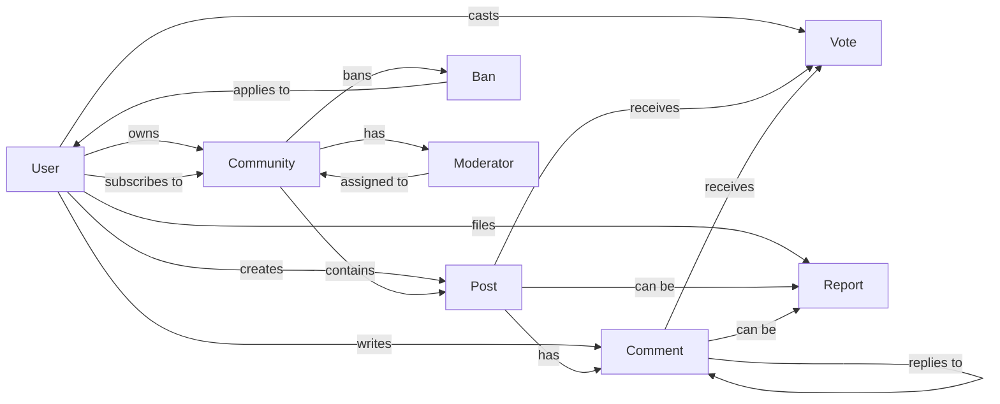
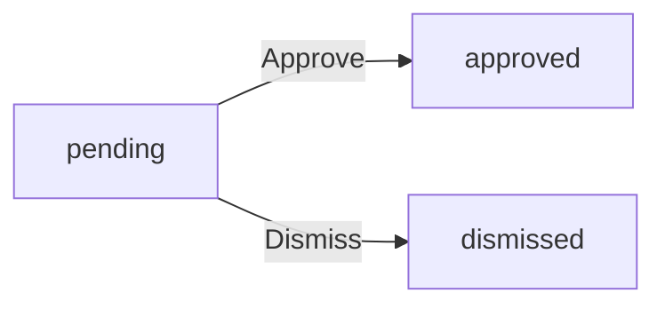
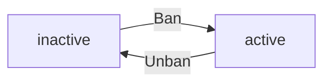
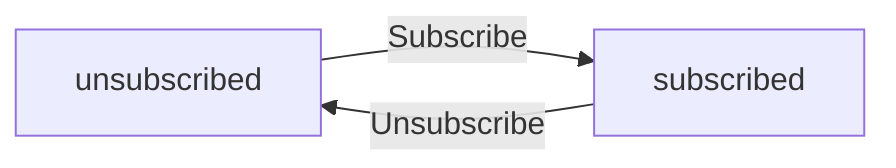
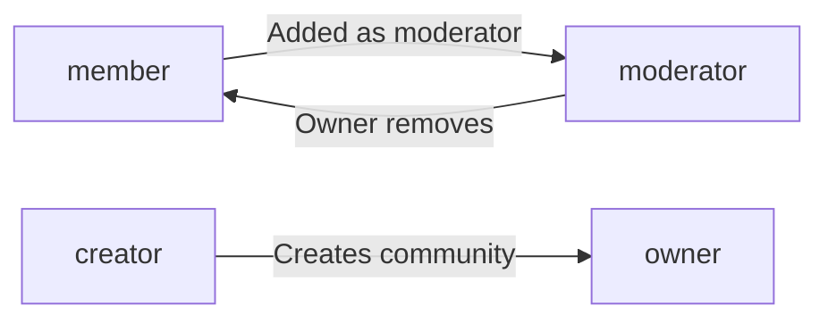

**redditCommunity — Business concepts, relationships, and states from user perspective**

Business concepts, relationships, and states from user perspective

# Domain Concepts

Describe what each concept means in the business domain and its key attributes.

## User Concept

Users are individuals who participate in the platform by creating accounts and engaging with content. Each user has a unique username that identifies them across the entire platform. Users sign up with email and password credentials for authentication. A display name is shown publicly on the user's profile page. Bio text allows users to describe themselves in their own words. Avatar image provides visual representation of the user on their profile. Users have a single karma score that reflects their community contribution through votes received on their posts and comments. When a user deletes their account, all their posts and comments are also deleted from the platform. The username must be unique and cannot be duplicated by other users.

### User Identity and Business Meaning

A user represents an individual participant in the platform community. The user concept encompasses both identity and participation rights within the business domain.

The username serves as the permanent, unique identity for each user across the entire platform. No two users can share the same username. This identity is displayed alongside all content the user creates.

Email serves as the authentication credential for account access. Users authenticate using their email and password combination.

The user profile contains presentation attributes (defined in parent unit section) that represent how the user appears to the community. Users can view any other user's profile to see their public information and content history.

### Karma as Reputation Metric

Karma score is a reputation metric that reflects a user's community contribution standing. The score is a single numeric value that changes based on how the community votes on the user's posts and comments.

When the community upvotes a user's content, the karma score increases. When the community downvotes a user's content, the karma score decreases. When votes are removed, the karma score adjusts to reflect the current vote state. The karma score can be negative, indicating more downvotes than upvotes received.

The karma score appears on the user's profile page as part of their public reputation display.

### Account Deletion and Content Cascade

Account deletion is a user-initiated action that permanently removes the user from the platform. When a user deletes their account, all content created by that user is also permanently deleted from the platform.

This includes all posts and comments authored by the user. The deletion cascades to all user-generated content, ensuring no orphaned content remains attributed to a deleted account.

The username becomes available for reuse after the account and all associated content are deleted.

## Community Concept

Communities are topic-based groups created by users to organize discussions around specific subjects. Each community has a unique name that identifies it across the platform. Description text explains the community's purpose and what content belongs there. Icon image provides visual branding for the community. The user who creates a community becomes its owner with highest authority level. Subscriber count shows the size and popularity of the community to visitors. Communities can be browsed in a list and searched by name for discovery. Communities serve as containers for posts and discussions from subscribed members. Community name uniqueness is enforced across all communities.

### Community Definition and Attributes

A community is a topic-based group that organizes discussions around specific subjects on the platform. Each community serves as a dedicated space where users can share posts and engage in conversations related to the community's theme.

Every community has a unique name that identifies it across the platform. No two communities can share the same name. The community name is visible to all users and is used to reference the community throughout the platform.

A community includes description text that explains the community's purpose and what type of content belongs there. This helps users understand whether the community matches their interests before subscribing.

Each community has an icon image that provides visual branding. The icon appears alongside the community name in lists, feeds, and profile pages to help users quickly identify the community.

The user who creates a community becomes its owner. The owner has the highest authority level within that community and can manage moderators and community settings.

Every community displays its subscriber count publicly. This number shows the size and popularity of the community to all visitors, helping users gauge community activity before subscribing.

### Community Discovery

Users can browse all communities in a list view. The list displays communities with their names, icons, and subscriber counts to help users discover new communities to join.

Users can search for communities by name. The search functionality allows users to find specific communities or explore communities related to topics they are interested in. Search results show matching communities with their names, icons, and subscriber counts.

### Community as Content Container

A community serves as a container for posts and discussions. All posts created on the platform belong to exactly one community. Posts within a community are visible in that community's feed and can be discovered through various feed views.

Only users who are subscribed to a community can create posts within that community. This ensures that posts are created by users who have an interest in the community's topic.

Comments on posts are associated with the community through their parent post. All discussions within a community are contained within that community's boundary, keeping conversations organized by topic.

## Post Concept

Posts are content items shared by users within communities to start discussions. Every post requires a title that summarizes its content. Posts have three distinct types: text posts with written content, link posts with URL references, or image posts with uploaded images. Text posts contain the full written content from the author. Link posts include a URL that points to external content with domain name display. Image posts contain uploaded visual content with thumbnail preview. Posts belong to a specific community where they are shared and visible. Posts show the author username and when they were created. Posts can be edited or deleted by their original author only.

### Post Concept and Attributes

A post is a content item created by users within communities to share information and start discussions. Every post has exactly one author who created it. Every post belongs to exactly one community where it is shared. Every post requires a title that summarizes its content. The title is mandatory for all posts and cannot be empty. Every post has a vote score that reflects the net result of upvotes and downvotes from users. Every post records when it was created, displayed as relative time such as hours ago or days ago. The author of a post can edit the post after creation. The author of a post can delete the post at any time.

### Post Type Classification

Every post must be classified as one of three types: text post, link post, or image post. The post type determines what content the post contains and cannot be changed after the post is created. A text post contains written content from the author. A link post contains a URL that points to external content. The URL's domain name is associated with the link post. An image post contains an uploaded image. The image post includes a thumbnail preview of the uploaded image.

## Comment Concept

Comments are responses users write on posts or reply to other comments to engage in discussions. Comments contain text content written by the author. Comments can be nested as replies to other comments with unlimited depth allowed. Each comment has a vote score that reflects community reception and can be negative. Comments show the author username and when they were posted. Comments can be edited by their original author to update content. Comments can be deleted by their original author to remove from discussion. Comments enable threaded discussions that branch from posts and other comments. Comment depth has no maximum limit for nested conversations.

### Comment Definition and Attributes

A comment is a response that users write on posts or as replies to other comments to participate in discussions.

Each comment has the following attributes:
- Content: the text written by the author
- Author: the username of the user who wrote the comment
- Vote score: reflects community reception from upvotes and downvotes (can be positive, negative, or zero)
- Time since posted: shows when the comment was posted (displayed as relative time, e.g., "3 hours ago")

Comments display the author username, content, vote score, and time since posting. Nested replies appear beneath each comment to maintain conversation flow.

### Comment Threading and Lifecycle

Comments support nested replies where users can reply to any comment, creating threaded discussion structures.

Reply depth has no maximum limit, allowing unlimited nesting for branched conversations.

Comment lifecycle capabilities:
- Authors can edit their own comments to update content
- Authors can delete their own comments to remove them from discussions

Each comment shows nested replies beneath it. Comments enable threaded discussions that branch from both posts and other comments.

## Vote Concept

Votes express user opinion on posts or comments through upvotes or downvotes. Each vote has a value that is either positive for upvote or negative for downvote. Users can cast votes on both posts and comments throughout the platform. Each user can only vote once per post or comment item at any time. Votes can be changed from upvote to downvote or vice versa by the same user. Votes can be removed entirely by the user who cast them. Vote score is calculated as total upvotes minus total downvotes and can be negative. Karma adjusts based on votes received on a user's posts and comments. Vote value determines karma impact on the content author.

### Vote

A vote represents a user's opinion on a post or comment within the platform. Every vote has a vote value that indicates the type of opinion expressed. The vote value is either positive for an upvote or negative for a downvote. Each vote is associated with the user who cast it and the content item it targets, which can be either a post or a comment. A user can have only one vote per content item at any time. The vote value determines the impact on the content author's karma.

### Vote Score

Vote score is a calculated value that represents the overall community reception of a post or comment. The vote score equals the total number of upvotes minus the total number of downvotes received by the content. Vote score can be positive when upvotes exceed downvotes. Vote score can be negative when downvotes exceed upvotes. Vote score can be zero when upvotes equal downvotes or when no votes exist. The vote score is displayed on each post and comment.

### Karma Connection

Karma is directly connected to votes received on a user's posts and comments. When a vote is cast on a user's content, the author's karma adjusts based on the vote value. An upvote on a user's post or comment increases the author's karma by one. A downvote on a user's post or comment decreases the author's karma by one. When a vote is changed or removed, the author's karma adjusts to reflect the difference. Karma can be negative when a user receives more downvotes than upvotes across all their content.

## Subscription Concept

Subscriptions connect users to communities they want to follow and participate in. Users subscribe to communities based on their interests and preferences. Subscription is required to create posts in that community before posting. Users can unsubscribe from communities they no longer wish to follow. Subscription has a timestamp showing when the user subscribed to the community. Users can view a list of all communities they are subscribed to for management. Subscription status is tracked for each user-community pair individually. The home feed shows posts only from subscribed communities for logged-in users. Subscriber count on communities reflects total active subscriptions.

### Subscription Definition and Attributes

A subscription represents the connection between a user and a community they want to follow and participate in. Each subscription is unique to a user-community pair and tracks the relationship individually.

A subscription has the following attributes:
- Subscription timestamp: records when the user subscribed to the community
- Subscription status: indicates whether the user is currently subscribed or has unsubscribed

Users subscribe to communities based on their interests and preferences. When a user subscribes to a community, they establish an active connection that enables participation and content visibility. Users can unsubscribe from communities they no longer wish to follow, which updates the subscription status to reflect the inactive relationship.

The subscription timestamp is maintained for each subscription to track when the user joined the community. This timestamp remains associated with the subscription record even if the user unsubscribes.

### Subscription Relationships and Effects

Subscriptions enable several key capabilities and affect how content is displayed across the platform:

**Posting Access**: A user must be subscribed to a community before they can create posts in that community. This subscription requirement ensures users have established interest in the community before contributing content.

**Subscribed Communities List**: Users can view a list of all communities they are currently subscribed to. This list shows active subscriptions and allows users to manage their community memberships.

**Home Feed Filtering**: For logged-in users, the home feed displays posts only from communities the user is subscribed to. This subscription-based filter ensures users see content relevant to their interests.

**Subscriber Count**: Each community displays a subscriber count that reflects the total number of active subscriptions. When users subscribe, the count increases; when users unsubscribe, the count decreases. This count represents the community's audience size.

**Community Access**: Subscription provides users with access to participate in community activities, including creating posts and engaging with community content. Users can browse all communities regardless of subscription status, but posting requires an active subscription.

## Moderator Concept

Moderators are users with elevated authority to manage community content and members. The community creator is the owner with the highest authority level in the community. Owners can add moderators to help manage their community operations. Owners can remove moderators from their community when needed. Moderators can add other moderators to the community for assistance. Moderators cannot remove the community owner under any circumstances. Moderators cannot remove other moderators, only the owner can remove moderators. Moderator role is assigned at a specific time when added to the community. Owner protection ensures the community creator retains ultimate control.

### Moderator Role Definition

A moderator is a user with elevated authority to manage community content and members within a specific community. The moderator role represents a business relationship between a user and a community, granting permission to perform moderation actions.

Each moderator has a moderator role type, which is either owner or moderator. The owner role type indicates the highest authority level in the community. The moderator role type indicates standard moderation authority.

A moderator has an assignment timestamp, which records when the user was added to the moderator role in that community.

The community creator automatically becomes the owner of the community upon creation. This is the only way to become an owner.

### Moderator Authority Hierarchy

The moderator hierarchy defines the authority structure within a community. The owner holds the highest authority level and has ultimate control over the community.

Owners can add users to the moderator role in their community. Owners can remove users from the moderator role in their community, including removing moderators.

Moderators can add other users to the moderator role in their community. Moderators cannot remove the community owner under any circumstances. Moderators cannot remove other moderators from the community. Only the owner can remove moderators.

The owner protection rule ensures the community creator retains ultimate control and cannot be removed from the owner role by any other user.

## Ban Concept

Bans restrict user access to specific communities for rule violations or misconduct. Moderators can ban users from their community when necessary. Banned users cannot create posts or comments in that community while banned. Banned users can still view content in the community they are banned from. Moderators can unban users to restore their posting privileges. Ban has a reason documenting why the user was banned for record. Ban has a status indicating whether the user is currently banned or unbanned. Moderators can view the list of all banned users in their community for oversight. Community access restriction applies only to posting and commenting abilities.

### Ban Concept Definition

A Ban represents a community-level access restriction applied to a user for rule violations or misconduct. Each Ban is associated with one specific community and one specific user. A Ban has a reason that documents why the ban was issued for record-keeping and moderator reference. A Ban has a status that indicates whether the user is currently banned or unbanned from the community. When status is banned, the user has restricted access to the community. When status is unbanned, the user has full access restored. The Ban concept exists to allow communities to maintain order by restricting problematic users while preserving their ability to view content.

### Ban Access Restrictions

A Ban imposes community-specific access restrictions on a user. When a user has an active ban in a community, the user cannot create new posts in that community. When a user has an active ban in a community, the user cannot create new comments in that community. Despite posting and commenting restrictions, a banned user can still view all content in the community including posts, comments, and community information. The ban restriction applies only to the specific community where the ban was issued. A user banned from one community can still participate in other communities where they are not banned.

### Banned Users List

Each community maintains a list of all users who have been banned from that community. The banned users list shows each banned user and their associated ban reason. The list serves as an oversight tool for moderators to track enforcement actions. When a user is unbanned, they are removed from the active banned users list.

## Report Concept

Reports flag problematic content for moderator review and potential action. Users can report any post or comment they find problematic or violating. Reports require a reason text explaining why the content is being reported. Moderators can view all reports for their community to review. Each report shows the reported content details for moderator review. Reports show who reported the content and when it was submitted. Moderators can approve reports which deletes the reported content from the community. Moderators can dismiss reports which keeps the content visible to users. Dismissed reports are removed from the active report list after review.

### Report Definition

A report is a flag submitted by a user to indicate problematic content that requires moderator review. Reports serve as the primary mechanism for community members to bring violating or inappropriate content to moderator attention.

Each report contains the following attributes:
- The reported content (either a post or a comment)
- The reason text explaining why the content is being reported
- The user who submitted the report
- The time when the report was submitted
- The current status of the report (pending, approved, or dismissed)

Reports are associated with the community where the reported content exists. Only moderators of that community can review and act on reports.

### Report Submission

Users can report any post or comment they find problematic or violating community standards. When submitting a report, users must provide a reason text explaining why the content is being reported. The reason is required and cannot be empty.

Both posts and comments can be reported. A user can report content regardless of whether they are subscribed to the community where the content exists. Multiple users can report the same piece of content, creating separate report entries for each submission.

### Report Resolution

Moderators can view all reports for their community to review reported content. Each report displays the reported content details, who reported it, and the reason provided.

Moderators can take two actions on a report:
- Approve: The reported content is deleted from the community. The report is marked as approved.
- Dismiss: The reported content remains visible to users. The report is marked as dismissed.

Dismissed reports are removed from the active report list after review. Approved reports result in the deletion of the reported post or comment from the community.

# Domain Relationships

Describe how concepts relate to each other from a business perspective.

## Conceptual Relationships

Describe how concepts relate to each other in business terms.

### User-Community Relationship

A user can have multiple community associations through different relationship types.

**Ownership Relationship**: When a user creates a community, an ownership relationship is established. The user becomes the owner of that community. A community has exactly one owner. An owner can own multiple communities.

**Subscription Relationship**: A user can subscribe to multiple communities. A subscription represents a belongs-to association between a user and a community. When a user subscribes to a community, the community's subscriber count increases. When a user unsubscribes, the subscriber count decreases.

**Moderation Relationship**: A user can be assigned as a moderator in multiple communities. A community can have multiple moderators. The owner is automatically a moderator with the highest authority. Moderators can add other moderators to the community.

### User-Content Association

Users have a has-many relationship with both posts and comments.

**Post Authorship**: When a user creates a post, the post belongs-to that user as its author. A user can create multiple posts across different communities. Each post has exactly one author.

**Comment Authorship**: When a user writes a comment, the comment belongs-to that user as its author. A user can write multiple comments on different posts. Each comment has exactly one author.

**Content Ownership**: Users own the posts and comments they create. Only the author can edit or delete their own posts and comments. When a user deletes their account, all posts and comments that belong-to that user are also deleted.

### Community-Content Relationship

Communities have a has-many relationship with posts.

**Post Containment**: Every post belongs-to exactly one community. A community can contain multiple posts. Posts cannot exist without being associated with a community.

**Subscription Requirement**: Only users who have a subscription relationship with a community can create posts in that community. This association must exist before post creation.

**Community Content Scope**: All posts within a community are visible to users viewing that community's feed, regardless of their subscription status.

### Post-Comment Association

Posts and comments have a hierarchical belongs-to relationship.

**Comment Hierarchy**: Every comment belongs-to exactly one post. A post can have multiple comments. Comments can also have replies, creating a nested structure with no depth limit.

**Reply Relationship**: A comment can be a reply to another comment. The parent comment has-many child comments. Each reply belongs-to its parent comment, forming a threaded conversation structure.

**Comment Display**: When viewing a post, all comments that belong-to that post are displayed, including nested replies.

### Vote Relationship

Votes create an association between users and votable content.

**Vote Target Association**: A vote belongs-to either a post or a comment. Each vote has exactly one target. Posts and comments can each have multiple votes from different users.

**User Vote Association**: Each user can cast one vote per votable item. A user has-many votes across different posts and comments. The association between a user and their vote on a specific item is unique.

**Vote Impact**: Votes affect the karma score of the content author. Upvotes increase karma by 1, downvotes decrease karma by 1. The vote score of a post or comment equals total upvotes minus total downvotes.

### Report Association

Reports create a belongs-to relationship between users and content requiring review.

**Report Target**: A report belongs-to either a post or a comment. Each report has exactly one target. Posts and comments can each have multiple reports from different users.

**Reporter Association**: The user who files a report is associated with that report. A user can file multiple reports across different content items.

**Report Resolution**: Reports are resolved by moderators of the community where the reported content belongs. When a report is approved or dismissed, the report association is removed from the active report list.

### Ban Relationship

Bans create an association between communities and restricted users.

**Ban Scope**: A ban belongs-to a specific community and applies to a specific user. A community can have multiple banned users. A user can be banned from multiple communities.

**Ban Authority**: Bans are issued by moderators or owners of the community. The ban creates a restriction association that prevents the banned user from creating posts or comments in that community.

**Ban Effect**: While banned, the user maintains their subscription relationship with the community but cannot create new content. The user can still view all content in the community.

### Relationship Overview

The following diagram illustrates the key relationships between business concepts:

## Lifecycle and Retention

Describe concept lifecycle states and transitions only. Detailed retention/recovery policies belong in 05-non-functional. Operation details belong in 03-functional-requirements.

### Account and Content Lifecycle

User accounts begin when registration is completed with email, password, and username.

Accounts remain active while maintained by the user.

Users can delete their own account at any time. When an account is deleted, all posts and comments created by that user are also deleted.

Posts and comments enter the system when created by users.

Authors can edit their own posts and comments at any time.

Authors can delete their own posts and comments.

Moderators can delete any post or comment within their community.

Reports begin when a user submits a report on a post or comment with a reason.

Reports enter a pending state awaiting moderator review.

Moderators can approve a report, which results in deletion of the reported content.

Moderators can dismiss a report, which keeps the content but removes the report from the review list.

Once a report is approved or dismissed, it is resolved and no longer appears in the active report list.

The user requirements do not specify archival processes, retention periods, or data recovery mechanisms.

### Deletion Effects

When a user deletes their account, all posts and comments they authored are deleted.

When a post is deleted, it is removed from feeds, user profiles, and community views.

When a comment is deleted, it is removed from the post and its nested replies remain unless also deleted.

Vote scores associated with deleted content are no longer counted toward user karma.

Subscriptions to communities remain unaffected when a user's content is deleted.

Moderator assignments and ban records are removed when the associated user account is deleted.

Deleted content cannot be viewed or restored through the platform.

# Business Categories and State Flows

Business category classifications and state flow definitions.

## Business Category Definitions

Define all business category classifications with their allowed values and descriptions.

### Post Type Classification

Every post must be classified into exactly one of three types:

**Text Post**: Contains written text content. The text content is required for this type.

**Link Post**: Contains a URL pointing to an external resource. The URL is required for this type.

**Image Post**: Contains an uploaded image. The image is required for this type.

The post type is determined at creation and cannot be changed. A post cannot have multiple types simultaneously.

### Vote Value Classification

Each vote cast by a user has one of three possible values:

**Upvote**: Adds one point to the target content's score. Represents positive feedback.

**Downvote**: Subtracts one point from the target content's score. Represents negative feedback.

**No Vote**: The user has removed their vote. This occurs when a user actively removes a previous upvote or downvote, or has never voted on the content.

A user can only have one active vote value per post or comment at any time. Changing from upvote to downvote (or vice versa) adjusts the score by two points.

### Moderator Role Classification

Each moderator assignment has one of two role types:

**Owner**: The user who created the community. Has the highest authority and can add or remove any moderator including other owners if multiple exist. Cannot be removed by other moderators.

**Moderator**: A user granted moderation privileges by an owner or another moderator. Can add new moderators but cannot remove the owner or other moderators. Can perform all moderation actions within the community.

The role type determines what actions the user can perform within the community's moderation system.

### Report Status Classification

Each report filed on content has one of three statuses:

**Pending**: The report has been submitted and is awaiting moderator review. This is the initial status when a report is created.

**Approved**: A moderator has reviewed the report and taken action. The reported content is deleted as a result.

**Dismissed**: A moderator has reviewed the report and decided no action is needed. The reported content remains visible. The report is removed from the active report list.

Reports transition from pending to either approved or dismissed upon moderator review. Once a report is approved or dismissed, it cannot return to pending status.

### Ban Status Classification

Each ban applied to a user in a community has one of two statuses:

**Active**: The user is currently banned from the community. Cannot create posts or comments in that community. Can still view community content.

**Removed**: The ban has been lifted by a moderator. The user regains the ability to create posts and comments in the community.

A ban is created with active status when a moderator bans a user. The status changes to removed when a moderator unbans the user. A user can only have one active ban per community at any time.

## State Transitions

Define valid state transition paths for stateful concepts.

### Report Workflow

Reports follow a defined state-flow from submission to resolution.

When a user reports content, the report enters a pending status. Moderators review pending reports and perform one of two status-change actions:

- Approve: The reported content is deleted and the report status changes to approved
- Dismiss: The reported content remains visible and the report is removed from the report list

Once a report transitions to approved or dismissed, it cannot return to pending status. This workflow ensures all reports reach a final resolution state.

### Ban Status Transition

User bans follow a simple active and inactive state-flow within a community.

When a moderator bans a user, the ban status transitions from inactive to active. The banned user cannot create posts or comments in that community but retains viewing access.

When a moderator unbans a user, the ban status transitions from active to inactive, restoring the user's posting privileges.

This transition can occur multiple times for the same user within a community.

### Subscription Status Transition

Community subscriptions follow a subscribed and unsubscribed state-flow.

When a user subscribes to a community, their subscription status changes to subscribed. This status-change is required before the user can create posts in that community.

When a user unsubscribes from a community, their subscription status changes to unsubscribed, removing their ability to create posts there.

Users can transition between these states at any time for any community.

### Moderator Role Transition

Moderator roles follow specific assignment and removal workflow rules.

The community creator holds the owner role permanently and cannot be removed. The owner can add other users as moderators, transitioning them from member to moderator status.

Moderators can also add other users as moderators. Only the owner can remove moderators, transitioning them from moderator back to member status.

This workflow ensures the owner maintains ultimate authority while allowing moderators to expand the moderation team.

