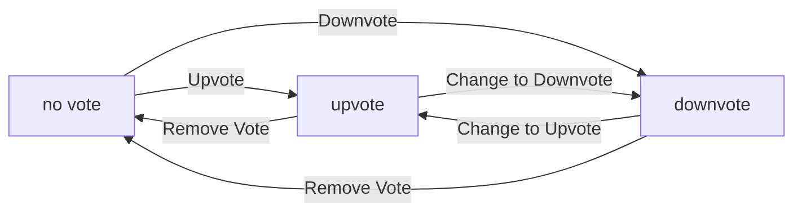
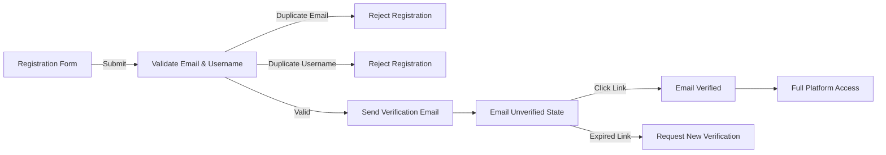
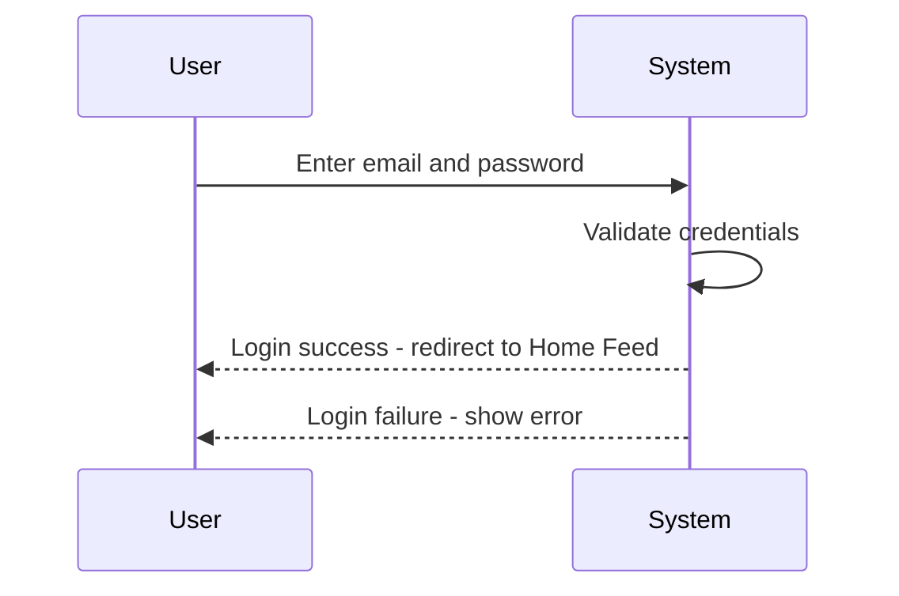

**redditCommunity — What operations users can perform, use cases, business workflows**

What operations users can perform, use cases, business workflows

# Core Business Operations

What the system must do for each business concept.

## User Operations

Users sign up with email and password, choosing a unique username during registration. Users log in with their email and password credentials to access their account. Users can change their password when needed for security purposes. Users can delete their account, which permanently removes all their posts and comments from the platform. Email addresses must be unique among all active accounts on the platform. Usernames must be unique across the entire platform and cannot be duplicated. Account deletion is irreversible and cascades to all user-generated content including posts and comments. Users must verify their email address to activate their account fully.

### User Registration Flow

WHEN a user registers for an account, THE system SHALL:
1. Require an email address
2. Require a password
3. Require a username
4. Verify the email address is unique among all active accounts
5. Verify the username is unique across the entire platform
6. Send a verification email to the provided email address
7. Activate the account only after email verification is completed

IF the email address is already in use by another active account, THE system SHALL reject the registration request.

IF the username is already taken by another user, THE system SHALL reject the registration request.

IF the email verification is not completed, THE system SHALL not allow the user to access full account features.

THE system SHALL store the password in a hashed format for security purposes.

### Login Authentication

WHEN a user attempts to log in, THE system SHALL:
1. Require the user's email address
2. Require the user's password
3. Validate the credentials against stored account information
4. Create an authenticated session upon successful validation
5. Grant access to the user's account and personalized features

IF the email address does not match any existing account, THE system SHALL reject the login attempt.

IF the password does not match the stored credentials for the email address, THE system SHALL reject the login attempt.

IF multiple consecutive login attempts fail, THE system SHALL temporarily restrict further login attempts to prevent unauthorized access.

WHILE a user is logged in, THE system SHALL maintain the authenticated session until the user explicitly logs out or the session expires.

Guests can view public content without logging in, but must log in to perform actions such as posting, commenting, voting, or subscribing.

### Password Management

WHEN a user changes their password, THE system SHALL:
1. Require the user to provide their current password for verification
2. Require the user to provide a new password
3. Verify the current password matches the stored credentials
4. Update the stored password to the new password upon successful verification
5. Maintain the user's authenticated session after password change

IF the current password provided does not match the stored credentials, THE system SHALL reject the password change request.

IF the new password is identical to the current password, THE system SHALL reject the password change request.

THE system SHALL allow users to change their password at any time while logged in for security purposes.

WHEN a user successfully changes their password, THE system SHALL not require re-authentication for the current session.

### Account Deletion

WHEN a user deletes their account, THE system SHALL:
1. Permanently remove the user's account from the platform
2. Delete all posts created by the user
3. Delete all comments written by the user
4. Remove all votes cast by the user
5. Cancel all community subscriptions
6. Remove the user from any moderator roles
7. Make the deletion irreversible

IF the user initiates account deletion, THE system SHALL confirm the action before proceeding, as it cannot be undone.

THE system SHALL cascade the account deletion to all user-generated content, including posts and comments, ensuring no orphaned content remains.

IF a user's account is deleted, THE system SHALL adjust karma scores of other users whose posts or comments were voted on by the deleted user.

Account deletion is permanent and cannot be reversed. Once deleted, the user's email address and username become available for reuse by new accounts.

THE system SHALL not retain any personal information from deleted accounts after the deletion process is completed.

## Profile Operations

Each user has a profile containing a display name, bio text, and avatar image. Users can edit their own display name, bio, and avatar at any time. Users can view any other user's profile publicly without restrictions. A user's profile page displays their display name, bio, and avatar prominently. The profile shows the user's total karma score accumulated from all votes received. The profile lists all posts the user has created across all communities. The profile lists all comments the user has written on any post. Profile information is accessible to all users regardless of subscription status.

### Profile Editing

WHEN a user edits their profile, THE system SHALL allow updating display name, bio text, and avatar image.

WHEN a user updates their display name, THE system SHALL save the new display name immediately.

WHEN a user updates their bio text, THE system SHALL save the new bio text immediately.

WHEN a user uploads a new avatar image, THE system SHALL replace the existing avatar with the new image.

THE system SHALL allow users to edit their own profile at any time.

THE system SHALL allow users to edit any combination of display name, bio text, and avatar image in a single edit operation.

THE system SHALL allow users to leave display name, bio text, or avatar image unchanged during profile editing.

IF a user attempts to edit another user's profile, THEN THE system SHALL reject the request.

IF a guest attempts to edit any profile, THEN THE system SHALL reject the request.

### Public Profile Viewing

WHEN any user views another user's profile, THE system SHALL display the display name, bio, and avatar.

WHEN any user views another user's profile, THE system SHALL display the total karma score.

THE system SHALL allow all users to view any other user's profile without restrictions.

THE system SHALL display profile information to both logged-in and logged-out users.

THE system SHALL display the karma score regardless of whether the viewer is subscribed to any community.

THE system SHALL display the profile page for any existing user account.

IF a user attempts to view a non-existent user's profile, THEN THE system SHALL reject the request.

THE system SHALL display the most current display name, bio, avatar, and karma score when viewing a profile.

### User Post History

WHEN a user views another user's profile, THE system SHALL display a list of all posts created by that user.

THE system SHALL show posts from all communities in the user's post history.

WHEN displaying post history, THE system SHALL show the title for each post.

WHEN displaying post history, THE system SHALL show the community name for each post.

WHEN displaying post history, THE system SHALL show the vote score for each post.

WHEN displaying post history, THE system SHALL show the comment count for each post.

WHEN displaying post history, THE system SHALL show the time since posted for each post.

WHEN displaying text posts in post history, THE system SHALL show the first 200 characters of content.

WHEN displaying image posts in post history, THE system SHALL show a thumbnail of the image.

WHEN displaying link posts in post history, THE system SHALL show the domain name of the URL.

THE system SHALL include deleted posts in the post history only if the viewer is the post author.

IF a post has been deleted by the author or a moderator, THEN THE system SHALL exclude it from public post history viewing.

### User Comment History

WHEN a user views another user's profile, THE system SHALL display a list of all comments written by that user.

THE system SHALL show comments from all posts in the user's comment history.

WHEN displaying comment history, THE system SHALL show the content for each comment.

WHEN displaying comment history, THE system SHALL show the vote score for each comment.

WHEN displaying comment history, THE system SHALL show the time since posted for each comment.

THE system SHALL display nested replies in the comment history with indication of which post they belong to.

THE system SHALL include all comments regardless of depth in the reply hierarchy.

THE system SHALL include deleted comments in the comment history only if the viewer is the comment author.

IF a comment has been deleted by the author or a moderator, THEN THE system SHALL exclude it from public comment history viewing.

## Community Operations

Any user can create a new community on the platform. A community has a unique name, description text, and icon image that identifies it. The user who creates a community automatically becomes its owner with full authority. Users can browse all communities in a comprehensive list view. Users can search for communities by name to find specific communities. Each community displays its subscriber count to show community size and popularity. Community names must be unique across the entire platform. Community owners have special privileges for managing their community.

### Community Creation

WHEN a user creates a community, THE system SHALL:
1. Require a unique name for the community
2. Require a description text for the community
3. Allow an optional icon image for the community
4. Automatically assign the creating user as the community owner

IF the community name already exists on the platform, THE system SHALL reject the request.
IF the user is not authenticated, THE system SHALL reject the request.
IF the community name is empty, THE system SHALL reject the request.
IF the community description is empty, THE system SHALL reject the request.

### Community Discovery

WHEN a user browses communities, THE system SHALL:
1. Display a list of all communities on the platform
2. Show each community's name, description, and subscriber count in the list

WHEN a user searches for communities by name, THE system SHALL:
1. Match communities whose names contain the search query
2. Display search results with community name, description, and subscriber count

IF no communities match the search query, THE system SHALL display an empty result set.
IF the search query is empty, THE system SHALL display all communities.

### Community Display

WHEN a community is displayed to any user, THE system SHALL:
1. Show the community's unique name
2. Show the community's description text
3. Show the community's icon image if one exists
4. Show the current subscriber count for the community

THE subscriber count SHALL reflect the total number of users subscribed to the community.
THE subscriber count SHALL be visible to all users including guests.

### Community Owner Privileges

WHEN a user is the owner of a community, THE system SHALL grant the following privileges:
1. Add moderators to the community
2. Remove moderators from the community
3. Delete any post in the community
4. Delete any comment in the community
5. Ban users from the community
6. Unban users from the community
7. View the list of banned users for the community
8. View all reports for the community
9. Approve reports which deletes the reported content
10. Dismiss reports which keeps the content and removes the report

THE community owner SHALL NOT be removable by moderators.
THE community owner SHALL retain all privileges unless the community is deleted.

## Post Operations

Users can create posts in any community they are subscribed to. Every post must have a title that describes its content. Posts can be one of three types: text posts with content, link posts with URLs, or image posts with uploaded images. Users can edit their own posts after creation to update content. Users can delete their own posts permanently from the community. When viewing a single post, users see the title, full content, author, community, vote score, comment count, and posting time. Subscription to a community is required before creating posts in that community. Post type determines what additional content is required.

### Post Creation

WHEN a user creates a post, THE system SHALL:
1. Require the user to be subscribed to the community
2. Require a title for the post
3. Require the user to select one of three post types: text, link, or image
4. For text posts, require text content
5. For link posts, require a URL
6. For image posts, require an image upload
7. Associate the post with the creating user as the author
8. Associate the post with the selected community
9. Initialize the vote score to zero
10. Initialize the comment count to zero

IF the user is not subscribed to the community, THEN THE system SHALL reject the post creation.
IF the title is missing, THEN THE system SHALL reject the post creation.
IF the post type is not selected, THEN THE system SHALL reject the post creation.
IF a text post has no content, THEN THE system SHALL reject the post creation.
IF a link post has no URL, THEN THE system SHALL reject the post creation.
IF an image post has no image, THEN THE system SHALL reject the post creation.

### Post Editing

WHEN a user edits their own post, THE system SHALL:
1. Allow the user to update the title
2. Allow the user to update the content based on post type
3. For text posts, allow updating the text content
4. For link posts, allow updating the URL
5. For image posts, allow uploading a new image
6. Preserve the original author association
7. Preserve the community association
8. Preserve the vote score
9. Preserve the comment count
10. Preserve the post type

IF the user is not the author of the post, THEN THE system SHALL reject the edit request.
IF the post has been deleted, THEN THE system SHALL reject the edit request.
IF the user attempts to change the post type, THEN THE system SHALL reject the edit request.

### Post Deletion

WHEN a user deletes their own post, THE system SHALL:
1. Remove the post from the community
2. Remove all comments associated with the post
3. Remove all votes associated with the post
4. Adjust affected users' karma scores based on removed votes
5. Remove the post from all feeds
6. Permanently delete the post content

IF the user is not the author of the post, THEN THE system SHALL reject the deletion request.
IF the post does not exist, THEN THE system SHALL reject the deletion request.
IF the post has already been deleted, THEN THE system SHALL reject the deletion request.

### Post Viewing

WHEN a user views a single post, THE system SHALL:
1. Display the post title
2. Display the full content based on post type
3. Display the author username
4. Display the community name
5. Display the current vote score
6. Display the comment count
7. Display the time since posting
8. For text posts, display the full text content
9. For link posts, display the URL
10. For image posts, display the full image

IF the post does not exist, THEN THE system SHALL show an error.
IF the post has been deleted, THEN THE system SHALL show an error.
IF the user does not have access to the community, THEN THE system SHALL show an error.

## Comment Operations

Users can write comments on any post in the platform. Users can reply to any comment to create threaded discussions. Replies can have replies with no depth limit, enabling unlimited nesting. Users can edit their own comments after posting to correct or update content. Users can delete their own comments permanently from the post. Each comment displays the author, content, vote score, time since posted, and nested replies. Comments support infinite threading for complex discussions. Comment authors maintain full control over their own comments.

### Comment Creation

WHEN a user creates a comment on a post, THE system SHALL require text content.

WHEN a user creates a comment, THE system SHALL associate the comment with the post.

WHEN a user creates a comment, THE system SHALL record the user as the comment author.

WHEN a user creates a comment, THE system SHALL set the initial vote score to zero.

WHEN a user creates a comment, THE system SHALL record the creation timestamp.

IF the user is banned from the community that owns the post, THE system SHALL reject the comment creation request.

IF the comment content is empty or contains only whitespace, THE system SHALL reject the request.

IF the post does not exist, THE system SHALL reject the comment creation request.

### Comment Replies and Threading

WHEN a user replies to a comment, THE system SHALL create a nested comment linked to the parent comment.

THE system SHALL support unlimited reply depth, allowing comments to be replied to indefinitely.

WHEN a comment is replied to, THE system SHALL maintain the parent-child relationship between comments.

WHEN displaying comments, THE system SHALL show nested replies indented or visually grouped under their parent comment.

WHEN a user creates a reply, THE system SHALL associate the reply with the same post as the parent comment.

WHEN a user creates a reply, THE system SHALL record the replying user as the comment author.

WHEN a user creates a reply, THE system SHALL set the initial vote score to zero.

WHEN a user creates a reply, THE system SHALL record the creation timestamp.

IF the parent comment does not exist, THE system SHALL reject the reply creation request.

IF the parent comment has been deleted, THE system SHALL reject the reply creation request.

IF the user is banned from the community that owns the post, THE system SHALL reject the reply creation request.

### Comment Editing

WHEN a comment author edits their comment, THE system SHALL update the comment content.

WHEN a comment is edited, THE system SHALL preserve the original creation timestamp.

WHEN a comment is edited, THE system SHALL indicate that the comment has been edited.

THE system SHALL allow comment authors to edit their comments at any time after creation.

IF the user is not the comment author, THE system SHALL reject the edit request.

IF the comment has been deleted, THE system SHALL reject the edit request.

IF the edited content is empty or contains only whitespace, THE system SHALL reject the request.

### Comment Deletion

WHEN a comment author deletes their comment, THE system SHALL permanently remove the comment content.

WHEN a comment is deleted, THE system SHALL also delete all nested replies to that comment.

WHEN a comment is deleted, THE system SHALL preserve the comment's vote score in the author's karma calculation until deletion.

THE system SHALL allow comment authors to delete their comments at any time after creation.

IF the user is not the comment author, THE system SHALL reject the delete request.

IF the comment has already been deleted, THE system SHALL reject the delete request.

WHEN a comment is deleted, THE system SHALL update the post's comment count.

### Comment Viewing and Metadata

WHEN viewing a post, THE system SHALL display all comments on that post.

WHEN displaying a comment, THE system SHALL show the comment author's username.

WHEN displaying a comment, THE system SHALL show the comment content.

WHEN displaying a comment, THE system SHALL show the comment's current vote score.

WHEN displaying a comment, THE system SHALL show the time since the comment was posted.

WHEN displaying a comment, THE system SHALL show nested replies in a threaded structure.

WHEN displaying a deleted comment, THE system SHALL indicate that the comment has been deleted.

WHEN displaying an edited comment, THE system SHALL indicate that the comment has been edited.

THE system SHALL support sorting comments by best (highest vote score first).

THE system SHALL support sorting comments by new (most recent first).

THE system SHALL support sorting comments by controversial (many votes but score close to zero).

## Vote Operations

Users can upvote posts and comments to show approval, adding 1 to the score. Users can downvote posts and comments to show disapproval, subtracting 1 from the score. Each user can only vote once per post or comment at any time. Users can change their vote from upvote to downvote or vice versa as their opinion changes. Users can remove their vote entirely, returning the item to an unvoted state. Vote score equals total upvotes minus total downvotes for each item. When someone upvotes a user's post or comment, that user's karma increases by 1. When someone downvotes a user's post or comment, that user's karma decreases by 1. Karma can become negative based on vote patterns.

### Post Voting Actions

WHEN a user upvotes a post, THE system SHALL:
1. Add 1 to the post's vote score
2. Increase the post author's karma by 1
3. Record the vote direction as upvote
4. Prevent the user from casting another vote on the same post

WHEN a user downvotes a post, THE system SHALL:
1. Subtract 1 from the post's vote score
2. Decrease the post author's karma by 1
3. Record the vote direction as downvote
4. Prevent the user from casting another vote on the same post

IF a user attempts to vote on their own post, THE system SHALL reject the request.

IF a banned user attempts to vote on a post in the community where they are banned, THE system SHALL reject the request.

### Comment Voting Actions

WHEN a user upvotes a comment, THE system SHALL:
1. Add 1 to the comment's vote score
2. Increase the comment author's karma by 1
3. Record the vote direction as upvote
4. Prevent the user from casting another vote on the same comment

WHEN a user downvotes a comment, THE system SHALL:
1. Subtract 1 from the comment's vote score
2. Decrease the comment author's karma by 1
3. Record the vote direction as downvote
4. Prevent the user from casting another vote on the same comment

IF a user attempts to vote on their own comment, THE system SHALL reject the request.

IF a banned user attempts to vote on a comment in the community where they are banned, THE system SHALL reject the request.

### Vote Management

WHEN a user changes their vote from upvote to downvote on a post or comment, THE system SHALL:
1. Subtract 2 from the item's vote score (removing +1, adding -1)
2. Decrease the item author's karma by 2
3. Update the vote direction to downvote

WHEN a user changes their vote from downvote to upvote on a post or comment, THE system SHALL:
1. Add 2 to the item's vote score (removing -1, adding +1)
2. Increase the item author's karma by 2
3. Update the vote direction to upvote

WHEN a user removes their vote from a post or comment, THE system SHALL:
1. Reset the item's vote score contribution from that user to 0
2. Adjust the item author's karma accordingly (decrease by 1 if was upvote, increase by 1 if was downvote)
3. Clear the vote direction for that user

THE system SHALL enforce that each user can have only one active vote per post at any time.

THE system SHALL enforce that each user can have only one active vote per comment at any time.

### Vote Score and Karma

THE system SHALL calculate each post's vote score as the total number of upvotes minus the total number of downvotes.

THE system SHALL calculate each comment's vote score as the total number of upvotes minus the total number of downvotes.

THE system SHALL maintain a single karma score for each user that aggregates all vote impacts from their posts and comments.

WHEN a user's post or comment receives an upvote, THE system SHALL increase that user's karma by 1.

WHEN a user's post or comment receives a downvote, THE system SHALL decrease that user's karma by 1.

THE system SHALL allow user karma scores to be negative when downvotes exceed upvotes.

THE system SHALL update karma scores in real-time when votes are cast, changed, or removed.

WHEN a post or comment is deleted, THE system SHALL remove all associated votes and adjust affected users' karma scores accordingly.

## Subscription Operations

Users can subscribe to any community to follow its content. Users can unsubscribe from any community they are currently subscribed to. Users can view a list of all communities they are subscribed to for easy access. Subscribing to a community is required to create posts in that community. Subscription status determines which posts appear in the user's home feed. Users can manage their subscriptions at any time without restrictions. Home feed shows posts only from communities the user is subscribed to. Subscription is free and available to all registered users.

### Community Subscription

WHEN a user subscribes to a community, THE system SHALL add the community to their subscription list.

WHEN a user subscribes to a community, THE system SHALL increment the community's subscriber count by one.

THE system SHALL allow any registered user to subscribe to any existing community.

IF a user attempts to subscribe to a non-existent community, THE system SHALL reject the request.

IF a user attempts to subscribe to a community they are already subscribed to, THE system SHALL reject the request.

WHEN a user subscribes to a community, THE system SHALL record the subscription timestamp.

THE system SHALL enable immediate post creation eligibility upon successful subscription.

WHEN a user subscribes to a community, THE system SHALL include posts from that community in their home feed.

### Community Unsubscription

WHEN a user unsubscribes from a community, THE system SHALL remove the community from their subscription list.

WHEN a user unsubscribes from a community, THE system SHALL decrement the community's subscriber count by one.

THE system SHALL allow users to unsubscribe from any community they are currently subscribed to.

IF a user attempts to unsubscribe from a community they are not subscribed to, THE system SHALL reject the request.

THE system SHALL allow users to unsubscribe from communities at any time without restrictions.

WHEN a user unsubscribes from a community, THE system SHALL preserve the user's historical posts and comments in that community.

WHEN a user unsubscribes from a community, THE system SHALL exclude future posts from that community from their home feed.

THE system SHALL allow users to re-subscribe to a previously unsubscribed community.

### Subscription List Viewing

WHEN a user requests their subscription list, THE system SHALL display all communities they are currently subscribed to.

THE system SHALL show each subscribed community's name in the subscription list.

THE system SHALL show each subscribed community's description in the subscription list.

THE system SHALL show each subscribed community's icon in the subscription list.

THE system SHALL show each subscribed community's current subscriber count in the subscription list.

THE system SHALL sort the subscription list by subscription date with most recent subscriptions appearing first.

THE system SHALL allow users to navigate directly to any community from their subscription list.

IF a user has no subscriptions, THE system SHALL display an empty state message indicating no subscribed communities.

THE system SHALL update the subscription list in real-time when subscriptions change.

### Post Creation Eligibility

WHEN a user attempts to create a post in a community, THE system SHALL verify the user is subscribed to that community.

IF the user is subscribed to the target community, THE system SHALL allow post creation.

IF the user is not subscribed to the target community, THE system SHALL reject the post creation request.

THE system SHALL inform users when they need to subscribe to a community before creating a post.

WHEN a user subscribes to a community, THE system SHALL immediately enable post creation for that community.

THE system SHALL allow post creation in any community the user is subscribed to without additional restrictions.

IF a user's subscription is removed while they have existing posts in a community, THE system SHALL preserve those posts.

THE system SHALL enforce subscription requirement for all post types including text, link, and image posts.

### Home Feed Personalization

WHEN a logged-in user views their home feed, THE system SHALL display posts only from communities they are subscribed to.

THE system SHALL exclude posts from non-subscribed communities in the home feed.

WHEN a user subscribes to a new community, THE system SHALL include posts from that community in their home feed.

WHEN a user unsubscribes from a community, THE system SHALL exclude posts from that community from their home feed.

THE system SHALL apply sorting options to the home feed including hot, new, top, and controversial.

THE system SHALL paginate home feed results to manage large numbers of posts.

IF a user has no subscriptions, THE system SHALL display an empty home feed with a suggestion to subscribe to communities.

THE system SHALL update the home feed dynamically when subscription status changes.

THE system SHALL make the home feed available only to logged-in users.

WHEN calculating hot sorting, THE system SHALL prioritize recent posts with many upvotes from subscribed communities.

## Report Operations

Users can report any post or comment that violates community guidelines. When reporting, users must provide a reason explaining why the content is being reported. Moderators can view all reports submitted for their community. Each report shows the reported content, who reported it, and the reason provided. Moderators can approve a report, which results in deleting the reported content. Moderators can dismiss a report, which keeps the content visible. Dismissed reports are removed from the active report list. Report reasons help moderators understand the nature of the violation.

### Content Reporting

WHEN a user reports a post or comment, THE system SHALL require the user to provide a reason explaining the violation.

WHEN a user submits a report, THE system SHALL associate the report with the specific post or comment being reported.

WHEN a user submits a report, THE system SHALL record the identity of the user who filed the report.

WHEN a user reports content, THE system SHALL make the report visible to moderators of the community where the content was posted.

IF a user attempts to report content without providing a reason, THE system SHALL reject the request.

WHEN content is reported, THE system SHALL display the reported content to moderators along with the report details.

WHEN a user reports a post, THE system SHALL show the post title, author, and full content to moderators reviewing the report.

WHEN a user reports a comment, THE system SHALL show the comment content, author, and parent post to moderators reviewing the report.

THE system SHALL allow any user to report any post or comment that violates community guidelines.

IF a user attempts to report content that has already been deleted, THE system SHALL reject the request.

### Moderator Report Queue

WHEN a moderator accesses the report queue for their community, THE system SHALL display all pending reports for that community.

WHEN viewing a report in the queue, THE system SHALL show the reported content to the moderator.

WHEN viewing a report in the queue, THE system SHALL show the identity of the user who filed the report.

WHEN viewing a report in the queue, THE system SHALL show the reason provided by the reporter.

WHEN viewing a report, THE system SHALL show when the report was filed.

THE system SHALL allow moderators to view all reports submitted for their community.

WHEN a moderator views the report queue, THE system SHALL organize reports by submission time with newest first.

IF a user is not a moderator of the community, THE system SHALL not allow access to the report queue.

WHEN multiple reports are filed for the same content, THE system SHALL display each report separately in the queue.

### Report Resolution

WHEN a moderator approves a report, THE system SHALL delete the reported content from the platform.

WHEN a moderator approves a report on a post, THE system SHALL remove the post and all its comments from public view.

WHEN a moderator approves a report on a comment, THE system SHALL remove only that comment from public view.

WHEN a moderator dismisses a report, THE system SHALL keep the reported content visible to users.

WHEN a moderator dismisses a report, THE system SHALL remove the report from the active report list.

WHEN a report is approved, THE system SHALL remove the report from the active report list.

IF a moderator approves a report, THE system SHALL not allow the action to be undone.

WHEN content is deleted through report approval, THE system SHALL not notify the content author of the deletion reason.

THE system SHALL allow moderators to approve or dismiss any pending report in their community.

WHEN a report is resolved (approved or dismissed), THE system SHALL record the resolution action and timestamp.

## Ban Operations

Moderators can ban users from their community to restrict their participation. Moderators can unban previously banned users to restore their access. Moderators can view the list of banned users for their community. Banned users cannot create posts or comments in that community while banned. Banned users can still view content in the community despite the ban. Only the community owner can remove moderators from their role. The community owner can add new moderators to assist with management. Moderators can add other moderators but cannot remove each other. The owner has the highest authority in community moderation decisions.

### User Ban Implementation

WHEN a moderator bans a user from their community, THE system SHALL:
1. Record the ban with the banning moderator's identity
2. Record the timestamp of when the ban was issued
3. Allow an optional reason text to be provided
4. Prevent the banned user from creating new posts in that community
5. Prevent the banned user from creating new comments in that community

IF a user is banned from a community, THEN THE system SHALL reject any attempt by that user to create a post in that community.

IF a user is banned from a community, THEN THE system SHALL reject any attempt by that user to create a comment in that community.

WHILE a user is banned from a community, THE system SHALL prevent all post and comment creation actions by that user in that community.

IF a moderator attempts to ban a user who is already banned, THEN THE system SHALL update the existing ban record rather than creating a duplicate.

### User Unban Implementation

WHEN a moderator unbans a user from their community, THE system SHALL:
1. Remove the ban restriction for that user
2. Record the timestamp of when the unban occurred
3. Restore the user's ability to create posts in that community
4. Restore the user's ability to create comments in that community

IF a moderator attempts to unban a user who is not currently banned, THEN THE system SHALL reject the request without error.

WHEN a user is unbanned, THE system SHALL immediately allow that user to create posts and comments in the community again.

IF a user was banned multiple times historically, THEN THE system SHALL only consider the most recent ban status when determining current access.

### Banned Users List

WHEN a moderator views the banned users list for their community, THE system SHALL:
1. Display all users currently banned from that community
2. Show the username of each banned user
3. Show the display name of each banned user (defined in Profile Operations)
4. Show when each user was banned
5. Show which moderator issued each ban
6. Show the ban reason if one was provided

WHILE viewing the banned users list, THE system SHALL only show bans for the community the moderator has access to.

THE system SHALL allow moderators to search the banned users list by username.

THE system SHALL allow moderators to filter the banned users list by ban date range.

IF a user has been unbanned, THEN THE system SHALL not include that user in the current banned users list.

### Content Access for Banned Users

WHILE a user is banned from a community, THE system SHALL allow that user to view all content in that community.

WHEN a banned user views a community, THE system SHALL display:
1. All posts in the community feed
2. All comments on posts
3. Community information including name, description, and subscriber count

IF a banned user attempts to view a post in the banned community, THEN THE system SHALL allow access to the full post content.

IF a banned user attempts to view another user's profile who posts in the banned community, THEN THE system SHALL allow access to that profile.

THE system SHALL NOT restrict any read-only operations for banned users in the community they are banned from.

WHILE banned, THE system SHALL only restrict write operations (posting and commenting) for the user in that specific community.

### Moderator Management

WHEN the community owner adds a moderator to their community, THE system SHALL:
1. Grant the new moderator all moderation capabilities for that community
2. Record the timestamp of when the moderator was added
3. Record which owner added the moderator
4. Allow the new moderator to ban users from the community
5. Allow the new moderator to unban users from the community
6. Allow the new moderator to view the banned users list
7. Allow the new moderator to delete any post in the community
8. Allow the new moderator to delete any comment in the community
9. Allow the new moderator to add other moderators

IF a moderator attempts to add another moderator, THEN THE system SHALL allow the action.

IF the community owner attempts to remove a moderator, THEN THE system SHALL allow the action.

IF a moderator attempts to remove another moderator, THEN THE system SHALL reject the request.

IF any user attempts to remove the community owner from their owner role, THEN THE system SHALL reject the request.

WHEN a moderator is removed by the owner, THE system SHALL:
1. Revoke all moderation capabilities for that user
2. Record the timestamp of when the moderator was removed
3. Record which owner removed the moderator

THE system SHALL prevent moderators from removing the community owner under any circumstances.

THE system SHALL prevent moderators from removing each other, reserving this capability only for the community owner.

# Business Actions and Workflows

Business actions and workflows beyond basic CRUD.

## User Actions

Users create accounts by providing email, password, and choosing a unique username. Email addresses must be unique across all active accounts. Users log in using their email and password combination. Users can change their password through a secure workflow. Account deletion removes the user and all their associated posts and comments from the platform. Deleted content is permanently removed and cannot be recovered. Users must be authenticated to perform most platform actions. Session management keeps users logged in across browsing sessions. Failed login attempts do not reveal whether the email exists on the platform.

### Account Creation

### Account Creation Workflow

WHEN a user creates an account, THE system SHALL:
1. Require an email address
2. Require a password
3. Require a unique username
4. Create the user account with initial karma score of zero
5. Create an associated profile with default display name matching the username

IF the email address is already in use by an active account, THE system SHALL reject the request.

IF the username is already in use, THE system SHALL reject the request.

### Email Uniqueness Validation

THE system SHALL ensure each email address is associated with only one active user account.

WHEN a user attempts to register with an existing email, THE system SHALL reject the registration without revealing that the email is already registered.

THE system SHALL treat email addresses as case-insensitive for uniqueness validation.

### Login Authentication

### Login Authentication Flow

WHEN a user logs in, THE system SHALL:
1. Require an email address
2. Require a password
3. Verify the credentials match an existing account
4. Create an authenticated session for the user
5. Redirect the user to the home feed upon successful login

### Login Error Handling

IF the email or password is incorrect, THE system SHALL reject the login attempt.

THE system SHALL NOT reveal whether the email exists or the password is incorrect when login fails.

THE system SHALL allow users to retry login after a failed attempt without imposing delays for the first few attempts.

WHILE a user is not authenticated, THE system SHALL restrict access to actions requiring authentication.

### Password Change

### Password Change Process

WHEN an authenticated user changes their password, THE system SHALL:
1. Require the current password for verification
2. Require a new password
3. Require confirmation of the new password
4. Update the password only if the current password is correct
5. Invalidate all existing sessions except the current one
6. Require the user to log in again with the new password on other devices

IF the current password is incorrect, THE system SHALL reject the password change request.

IF the new password and confirmation do not match, THE system SHALL reject the request.

THE system SHALL require the new password to be different from the current password.

### Account Deletion

### Account Deletion Cascade

WHEN a user deletes their account, THE system SHALL:
1. Require the user to be authenticated
2. Require password confirmation for the deletion
3. Remove the user account from the platform
4. Delete all posts created by the user
5. Delete all comments created by the user
6. Remove all votes cast by the user
7. Cancel all community subscriptions
8. Remove the user from any moderator roles

### Permanent Content Removal

THE system SHALL permanently remove all user content upon account deletion.

THE system SHALL NOT allow recovery of deleted accounts or associated content.

WHEN a user's posts are deleted due to account deletion, THE system SHALL update the post counts and karma scores of affected communities and users accordingly.

IF a deleted user's comments are removed, THE system SHALL maintain the comment thread structure by indicating the comment was deleted.

### Session Management

### Session Persistence

WHEN a user logs in successfully, THE system SHALL create a session that persists across browsing sessions.

THE system SHALL maintain the user's authenticated state until:
1. The user explicitly logs out
2. The user deletes their account
3. The user changes their password
4. The session expires due to inactivity

### Authentication Requirement

THE system SHALL require authentication for the following actions:
1. Creating posts in communities
2. Creating comments on posts
3. Voting on posts and comments
4. Subscribing to communities
5. Reporting content
6. Editing or deleting own content
7. Viewing the home feed
8. Viewing subscription lists

WHILE a user is not authenticated, THE system SHALL allow:
1. Viewing the popular feed
2. Viewing community feeds
3. Viewing user profiles
4. Viewing individual posts and comments
5. Searching for communities

## Profile Actions

Users edit their own profile information including display name, bio text, and avatar image. Profile changes are saved immediately and visible to other users. Any user can view another user's public profile page. Profile pages display the user's total karma score calculated from all votes received. Profile pages show a complete list of posts created by the user. Profile pages show a complete list of comments written by the user. Display names can be changed without uniqueness constraints. Bio text supports multi-line content for detailed user descriptions. Avatar images are displayed alongside the user's content throughout the platform.

### Profile Editing Workflow

WHEN a user edits their profile, THE system SHALL:
1. Allow changes to display name, bio text, and avatar image
2. Save all changes immediately upon submission
3. Make changes visible to all users viewing the profile
4. Preserve unchanged fields when only some fields are modified

WHEN a user submits profile changes, THE system SHALL validate that:
1. The user is authenticated and editing their own profile
2. The display name meets length requirements (defined in Profile Error Scenarios)
3. The bio text does not exceed maximum length (defined in Profile Error Scenarios)
4. The avatar image meets format and size requirements (defined in Profile Error Scenarios)

IF the user is not authenticated, THE system SHALL reject the profile edit request.
IF the user attempts to edit another user's profile, THE system SHALL reject the request.

WHILE profile changes are being saved, THE system SHALL prevent concurrent edits to the same profile.

### Display Name and Bio Updates

WHEN a user updates their display name, THE system SHALL:
1. Accept any non-empty text value
2. Allow display names that are not unique across users
3. Preserve the display name across all user content (posts, comments)
4. Display the updated name immediately on the user's profile page

WHEN a user updates their bio text, THE system SHALL:
1. Accept multi-line text content
2. Preserve line breaks and formatting in the bio
3. Display the full bio text on the user's profile page
4. Allow the bio to be cleared or set to empty

IF the display name exceeds the maximum character limit, THE system SHALL reject the update.
IF the bio text exceeds the maximum length, THE system SHALL reject the update.

THE system SHALL allow users to update display name and bio independently or together in a single edit operation.

### Avatar Image Management

WHEN a user uploads an avatar image, THE system SHALL:
1. Accept image files in supported formats (defined in Profile Error Scenarios)
2. Validate the image file size does not exceed the limit (defined in Profile Error Scenarios)
3. Store the avatar image and make it accessible via URL
4. Display the avatar on the user's profile page immediately after upload
5. Display the avatar alongside the user's posts and comments throughout the platform

WHEN a user replaces their avatar, THE system SHALL:
1. Remove the previous avatar image
2. Display the new avatar immediately across all locations
3. Maintain the same avatar URL pattern for consistency

WHEN a user removes their avatar, THE system SHALL:
1. Display a default placeholder image
2. Allow the user to upload a new avatar at any time

IF the image format is not supported, THE system SHALL reject the upload.
IF the image file size exceeds the limit, THE system SHALL reject the upload.

### Public Profile Viewing

WHEN any user views another user's profile, THE system SHALL display:
1. The user's display name
2. The user's bio text
3. The user's avatar image
4. The user's total karma score
5. A list of all posts created by the user
6. A list of all comments written by the user

WHEN a guest views a user profile, THE system SHALL:
1. Display the same information as for authenticated users
2. Allow navigation to any public post or comment listed

WHEN viewing a user's post history, THE system SHALL:
1. Show all posts created by the user across all communities
2. Display posts in reverse chronological order (newest first)
3. Include post title, community name, vote score, and time since posted
4. Apply the same post list display rules as defined in Post List Display

WHEN viewing a user's comment history, THE system SHALL:
1. Show all comments written by the user across all posts
2. Display comments in reverse chronological order (newest first)
3. Include comment content preview, post title, vote score, and time since posted

IF the user's account has been deleted, THE system SHALL show a profile not found message.

### Karma Score Calculation and Display

WHEN displaying a user's karma score, THE system SHALL:
1. Show a single integer value representing total karma
2. Calculate karma as the sum of all votes received on the user's posts and comments
3. Display negative values when the user has received more downvotes than upvotes
4. Update the displayed karma immediately when votes change

WHEN a post or comment receives an upvote, THE system SHALL:
1. Increase the author's karma score by 1
2. Reflect the change immediately on the author's profile

WHEN a post or comment receives a downvote, THE system SHALL:
1. Decrease the author's karma score by 1
2. Reflect the change immediately on the author's profile

WHEN a user removes their vote from a post or comment, THE system SHALL:
1. Adjust the author's karma score accordingly (decrease by 1 for removed upvote, increase by 1 for removed downvote)
2. Update the displayed karma immediately

WHEN a user changes their vote from upvote to downvote or vice versa, THE system SHALL:
1. Adjust the author's karma score by 2 (e.g., upvote to downvote decreases karma by 2)
2. Update the displayed karma immediately

THE karma score SHALL be visible on the user's profile page to all viewers.

### User Content History Display

WHEN displaying a user's post history on their profile, THE system SHALL:
1. Include all posts ever created by the user
2. Show posts even if the user has been banned from specific communities
3. Exclude posts that have been deleted by the user or moderators
4. Display each post with: title, community name, vote score, comment count, and time since posted
5. For text posts, show the first 200 characters of content
6. For image posts, show a thumbnail of the image
7. For link posts, show the domain name of the URL

WHEN displaying a user's comment history on their profile, THE system SHALL:
1. Include all comments ever written by the user
2. Show comments even if the user has been banned from specific communities
3. Exclude comments that have been deleted by the user or moderators
4. Display each comment with: content preview, post title, community name, vote score, and time since posted
5. Show the comment in the context of its parent post

WHEN a user deletes their account, THE system SHALL:
1. Remove all posts from the user's post history
2. Remove all comments from the user's comment history
3. Delete the user's profile page entirely

IF a post or comment is deleted after being displayed in history, THE system SHALL remove it from the history view immediately.

### Immediate Change Visibility

WHEN a user saves profile changes, THE system SHALL:
1. Make display name changes visible immediately on the profile page
2. Make bio text changes visible immediately on the profile page
3. Make avatar image changes visible immediately on the profile page
4. Reflect karma score changes immediately when votes are cast or modified

WHEN a user's content receives votes, THE system SHALL:
1. Update the user's karma score immediately
2. Display the updated karma on the profile page without requiring a page refresh

WHEN other users view a profile, THE system SHALL:
1. Display the most current version of all profile information
2. Show real-time karma score based on all votes received
3. Display the user's complete and current post and comment history

IF there is a delay in propagating changes, THE system SHALL ensure consistency within 5 seconds of the change being saved.

THE system SHALL not cache profile information in a way that shows stale data to viewers.

## Community Actions

Any authenticated user can create a new community on the platform. Community creators automatically become the owner with highest authority. Communities require a unique name that cannot be duplicated. Communities include a description text and an icon image. Users browse all communities through a searchable list interface. Users search for communities by matching community names. Each community displays its current subscriber count publicly. Community names are permanent and cannot be changed after creation. Community owners maintain full control over their community settings and moderation.

### Community Creation Workflow

WHEN a member creates a community, THE system SHALL require a unique name that cannot duplicate any existing community name.

WHEN a member creates a community, THE system SHALL automatically assign the creating member as the community owner with highest authority.

WHEN a member creates a community, THE system SHALL require a description text for the community.

WHEN a member creates a community, THE system SHALL allow an optional icon image upload.

IF the community name already exists, THE system SHALL reject the creation request.

IF the community name is empty, THE system SHALL reject the creation request.

IF the description text exceeds the maximum length, THE system SHALL reject the creation request.

IF the icon image format is unsupported, THE system SHALL reject the upload.

IF the icon image file size exceeds the limit, THE system SHALL reject the upload.

WHEN a community is successfully created, THE system SHALL initialize the subscriber count to zero.

WHEN a community is successfully created, THE system SHALL make the community immediately visible in the browsing interface.

THE system SHALL ensure community names are permanent and cannot be changed after creation.

### Community Discovery and Browsing

WHEN a user accesses the community browsing interface, THE system SHALL display a list of all communities on the platform.

WHEN a user searches for communities, THE system SHALL filter results by matching the search text against community names.

WHEN displaying a community in the browsing list, THE system SHALL show the current subscriber count.

THE system SHALL make the community browsing interface available to all users including guests.

THE system SHALL make the community name search available to all users including guests.

WHEN a search returns no matching communities, THE system SHALL display an empty results message.

WHEN browsing communities, THE system SHALL display each community's name, description, and icon.

WHEN a user views a community from the browsing list, THE system SHALL navigate to the community detail page.

THE system SHALL update subscriber counts in real-time when users subscribe or unsubscribe.

WHEN a community has zero subscribers, THE system SHALL display the count as zero.

### Community Ownership Rights

THE community owner SHALL have full control over all community settings and configuration.

THE community owner SHALL have the highest authority in all moderation decisions within their community.

WHEN a user creates a community, THE system SHALL grant permanent ownership rights that cannot be transferred.

THE community owner SHALL be able to add other members as moderators.

THE community owner SHALL be able to remove any moderator from the community.

THE community owner SHALL be protected from removal by any other user including moderators.

WHEN the owner deletes their account, THE system SHALL delete the community and all associated content.

THE community owner SHALL have access to all moderator actions including content deletion and user banning.

THE community owner SHALL be able to view the list of banned users in their community.

THE community owner SHALL be able to view all reports filed for content in their community.

IF a user attempts to remove the community owner, THE system SHALL reject the action.

IF a user attempts to transfer ownership, THE system SHALL reject the request.

## Post Actions

Users create posts only in communities where they have an active subscription. Every post requires a title and must be one of three types: text, link, or image. Text posts contain written content entered by the user. Link posts contain a URL that users can visit. Image posts contain an uploaded image file. Users can edit their own posts after creation to update content. Users can delete their own posts permanently from the platform. Post feeds display posts with title, author, community, vote score, comment count, and posting time. Text posts show the first portion of content in feed views while image posts show thumbnails.

### Subscription Requirement for Posting

WHEN a user attempts to create a post, THE system SHALL verify the user has an active subscription to the target community.

IF the user does not have an active subscription to the community, THEN THE system SHALL reject the post creation request.

WHEN a user views a community, THE system SHALL indicate whether the user is subscribed to that community.

IF the user is not subscribed, THE system SHALL prompt the user to subscribe before allowing post creation.

WHILE a user's subscription to a community is active, THE system SHALL allow the user to create posts in that community.

WHEN a user unsubscribes from a community, THE system SHALL prevent the user from creating new posts in that community.

### Post Type Selection

WHEN a user creates a post, THE system SHALL require the user to select one of three post types: text, link, or image.

THE system SHALL allow only one post type per post.

IF the user selects text post type, THE system SHALL provide a text content input field.

IF the user selects link post type, THE system SHALL provide a URL input field.

IF the user selects image post type, THE system SHALL provide an image upload interface.

WHEN the user submits the post, THE system SHALL validate that the required content for the selected post type is provided.

### Text Post Creation

WHEN a user creates a text post, THE system SHALL require a title.

WHEN a user creates a text post, THE system SHALL require text content.

THE system SHALL associate the text post with the creating user as the author.

THE system SHALL associate the text post with the target community.

WHEN a text post is successfully created, THE system SHALL initialize the vote score to zero.

WHEN a text post is successfully created, THE system SHALL initialize the comment count to zero.

THE system SHALL record the creation timestamp for the text post.

IF the title is empty, THE system SHALL reject the text post creation.

IF the text content is empty, THE system SHALL reject the text post creation.

### Link Post Creation

WHEN a user creates a link post, THE system SHALL require a title.

WHEN a user creates a link post, THE system SHALL require a URL.

THE system SHALL validate that the provided URL is in a valid format.

THE system SHALL associate the link post with the creating user as the author.

THE system SHALL associate the link post with the target community.

WHEN a link post is successfully created, THE system SHALL initialize the vote score to zero.

WHEN a link post is successfully created, THE system SHALL initialize the comment count to zero.

THE system SHALL record the creation timestamp for the link post.

IF the title is empty, THE system SHALL reject the link post creation.

IF the URL is invalid, THE system SHALL reject the link post creation.

### Image Post Upload

WHEN a user creates an image post, THE system SHALL require a title.

WHEN a user creates an image post, THE system SHALL require an image file upload.

THE system SHALL validate that the uploaded file is in a supported image format.

THE system SHALL associate the image post with the creating user as the author.

THE system SHALL associate the image post with the target community.

WHEN an image post is successfully created, THE system SHALL initialize the vote score to zero.

WHEN an image post is successfully created, THE system SHALL initialize the comment count to zero.

THE system SHALL record the creation timestamp for the image post.

IF the title is empty, THE system SHALL reject the image post creation.

IF the image upload fails, THE system SHALL reject the image post creation.

IF the uploaded file is not a supported image format, THE system SHALL reject the image post creation.

### Post Editing Workflow

WHEN a user views their own post, THE system SHALL provide an option to edit the post.

WHEN a user edits a text post, THE system SHALL allow updating the title.

WHEN a user edits a text post, THE system SHALL allow updating the text content.

WHEN a user edits a link post, THE system SHALL allow updating the title.

WHEN a user edits a link post, THE system SHALL allow updating the URL.

WHEN a user edits an image post, THE system SHALL allow updating the title.

WHEN a user edits an image post, THE system SHALL allow uploading a new image to replace the existing one.

IF the user is not the author of the post, THEN THE system SHALL not allow editing the post.

IF the edited title is empty, THE system SHALL reject the edit request.

WHEN a post is successfully edited, THE system SHALL preserve the original creation timestamp.

WHEN a post is successfully edited, THE system SHALL preserve the vote score.

WHEN a post is successfully edited, THE system SHALL preserve the comment count.

### Post Deletion Process

WHEN a user views their own post, THE system SHALL provide an option to delete the post.

IF the user is the author of the post, THE system SHALL allow the user to delete the post.

IF the user is not the author of the post, THEN THE system SHALL not allow the user to delete the post.

WHEN a post is deleted, THE system SHALL permanently remove the post from the platform.

WHEN a post is deleted, THE system SHALL remove all comments associated with the post.

WHEN a post is deleted, THE system SHALL adjust the author's karma score by removing the karma earned from votes on that post.

WHEN a post is deleted, THE system SHALL update the community's post list to no longer display the deleted post.

WHEN a post is deleted, THE system SHALL confirm the deletion action with the user before permanent removal.

### Feed Display Formatting

WHEN displaying posts in any feed, THE system SHALL show the post title for each post.

WHEN displaying posts in any feed, THE system SHALL show the author username for each post.

WHEN displaying posts in any feed, THE system SHALL show the community name for each post.

WHEN displaying posts in any feed, THE system SHALL show the vote score for each post.

WHEN displaying posts in any feed, THE system SHALL show the comment count for each post.

WHEN displaying posts in any feed, THE system SHALL show the time since posting for each post.

WHEN displaying a text post in a feed, THE system SHALL show the first 200 characters of the content.

WHEN displaying an image post in a feed, THE system SHALL show a thumbnail of the image.

WHEN displaying a link post in a feed, THE system SHALL show the domain name of the URL.

IF the text content is shorter than 200 characters, THE system SHALL show the entire content.

THE system SHALL apply consistent formatting across all feed types: home feed, popular feed, and community feed.

### Post Metadata Display

WHEN viewing a single post, THE system SHALL display the complete post title.

WHEN viewing a single post, THE system SHALL display the full post content based on post type.

WHEN viewing a single post, THE system SHALL display the author username.

WHEN viewing a single post, THE system SHALL display the community name.

WHEN viewing a single post, THE system SHALL display the current vote score.

WHEN viewing a single post, THE system SHALL display the current comment count.

WHEN viewing a single post, THE system SHALL display when the post was created.

IF the post is a text post, THE system SHALL display the full text content.

IF the post is a link post, THE system SHALL display the full URL and make it clickable.

IF the post is an image post, THE system SHALL display the full-size image.

WHEN viewing a single post, THE system SHALL provide voting controls for the post.

WHEN viewing a single post, THE system SHALL provide a comment input interface.

## Comment Actions

Users write comments on any post visible to them. Users reply to existing comments creating nested conversation threads. Replies can be nested to any depth without limitation. Users edit their own comments to update or correct content. Users delete their own comments removing them from the thread. Each comment displays the author, content, vote score, and time since posting. Comments are sorted by best score, newest first, or controversial ranking. Deleted comments remove the content but may preserve thread structure. Comment threads show the full hierarchy of parent and child replies.

### Comment Creation

WHEN a user creates a comment on a post, THE system SHALL require text content.

WHEN a user creates a comment, THE system SHALL associate the comment with the post.

WHEN a user creates a comment, THE system SHALL record the author as the creating user.

WHEN a user creates a comment, THE system SHALL record the creation timestamp.

WHEN a user creates a comment, THE system SHALL initialize the vote score to zero.

IF the user is banned from the community containing the post, THE system SHALL reject the comment creation.

IF the post does not exist, THE system SHALL reject the comment creation.

IF the comment content is empty, THE system SHALL reject the comment creation.

### Comment Reply Nesting

WHEN a user replies to an existing comment, THE system SHALL create a nested reply.

WHEN a reply is created, THE system SHALL establish a parent-child relationship with the target comment.

THE system SHALL support unlimited nesting depth for comment replies without restriction.

WHEN a reply is created, THE system SHALL record the parent comment reference.

WHEN viewing a comment thread, THE system SHALL display the full hierarchy of nested replies.

IF the parent comment does not exist, THE system SHALL reject the reply creation.

IF the user is banned from the community, THE system SHALL reject the reply creation.

### Comment Editing

WHEN a user edits their own comment, THE system SHALL update the comment content.

WHEN a user edits a comment, THE system SHALL preserve the original creation timestamp.

IF the user attempts to edit another user's comment, THE system SHALL reject the request.

IF the user is not the author of the comment, THE system SHALL reject the edit request.

IF the comment does not exist, THE system SHALL reject the edit request.

IF the edited content is empty, THE system SHALL reject the edit request.

### Comment Deletion

WHEN a user deletes their own comment, THE system SHALL remove the comment content.

WHEN a comment is deleted, THE system SHALL preserve the thread structure for nested replies.

WHEN a parent comment is deleted, THE system SHALL allow child replies to remain visible.

IF the user attempts to delete another user's comment, THE system SHALL reject the request.

IF the user is not the author of the comment, THE system SHALL reject the delete request.

IF the comment does not exist, THE system SHALL reject the delete request.

WHEN a comment is deleted, THE system SHALL maintain the vote score history for karma calculation.

### Comment Display and Sorting

WHEN viewing comments on a post, THE system SHALL display the author username for each comment.

WHEN viewing comments, THE system SHALL display the comment content.

WHEN viewing comments, THE system SHALL display the vote score for each comment.

WHEN viewing comments, THE system SHALL display the time since posting for each comment.

THE system SHALL support sorting comments by best, ordering by highest vote score first.

THE system SHALL support sorting comments by new, ordering by most recent first.

THE system SHALL support sorting comments by controversial, ordering by many votes with score close to zero first.

WHEN displaying nested replies, THE system SHALL show the full hierarchy of parent and child comments.

IF a comment has been deleted, THE system SHALL indicate the comment is deleted while preserving thread structure.

## Vote Actions

Users upvote posts and comments to show approval or support. Users downvote posts and comments to show disapproval. Each user can cast only one vote per post or comment at any time. Users change their vote from upvote to downvote or vice versa as desired. Users remove their vote entirely leaving the content unvoted. Upvotes add one point to the content's vote score. Downvotes subtract one point from the content's vote score. Removing a vote adjusts the score back accordingly. Vote scores can be negative when downvotes exceed upvotes. User karma increases when their content receives upvotes and decreases with downvotes.

### Post and Comment Upvoting

WHEN a user upvotes a post, THE system SHALL:
1. Add one point to the post's vote score
2. Increase the post author's karma by one point
3. Record the upvote as the user's only vote on that post

WHEN a user upvotes a comment, THE system SHALL:
1. Add one point to the comment's vote score
2. Increase the comment author's karma by one point
3. Record the upvote as the user's only vote on that comment

WHEN a user who previously downvoted content upvotes it, THE system SHALL:
1. Remove the downvote effect from the vote score
2. Apply the upvote effect to the vote score
3. Adjust the content author's karma by two points (one for removing downvote, one for adding upvote)

THE system SHALL allow users to upvote any post except their own posts.

THE system SHALL allow users to upvote any comment except their own comments.

### Post and Comment Downvoting

WHEN a user downvotes a post, THE system SHALL:
1. Subtract one point from the post's vote score
2. Decrease the post author's karma by one point
3. Record the downvote as the user's only vote on that post

WHEN a user downvotes a comment, THE system SHALL:
1. Subtract one point from the comment's vote score
2. Decrease the comment author's karma by one point
3. Record the downvote as the user's only vote on that comment

WHEN a user who previously upvoted content downvotes it, THE system SHALL:
1. Remove the upvote effect from the vote score
2. Apply the downvote effect to the vote score
3. Adjust the content author's karma by negative two points (one for removing upvote, one for adding downvote)

THE system SHALL support negative vote scores when downvotes exceed upvotes on content.

THE system SHALL support negative karma scores when a user's content receives more downvotes than upvotes.

THE system SHALL allow users to downvote any post except their own posts.

THE system SHALL allow users to downvote any comment except their own comments.

### Vote Management

THE system SHALL enforce that each user can cast only one vote per post at any time.

THE system SHALL enforce that each user can cast only one vote per comment at any time.

WHEN a user changes their vote from upvote to downvote on a post, THE system SHALL:
1. Update the vote direction from up to down
2. Adjust the post's vote score by subtracting two points
3. Decrease the post author's karma by two points

WHEN a user changes their vote from downvote to upvote on a post, THE system SHALL:
1. Update the vote direction from down to up
2. Adjust the post's vote score by adding two points
3. Increase the post author's karma by two points

WHEN a user changes their vote from upvote to downvote on a comment, THE system SHALL:
1. Update the vote direction from up to down
2. Adjust the comment's vote score by subtracting two points
3. Decrease the comment author's karma by two points

WHEN a user changes their vote from downvote to upvote on a comment, THE system SHALL:
1. Update the vote direction from down to up
2. Adjust the comment's vote score by adding two points
3. Increase the comment author's karma by two points

WHEN a user removes their vote from a post, THE system SHALL:
1. Delete the user's vote record for that post
2. Adjust the post's vote score by removing the vote's effect (add one if was upvote, subtract one if was downvote)
3. Adjust the post author's karma accordingly

WHEN a user removes their vote from a comment, THE system SHALL:
1. Delete the user's vote record for that comment
2. Adjust the comment's vote score by removing the vote's effect (add one if was upvote, subtract one if was downvote)
3. Adjust the comment author's karma accordingly

IF a user attempts to vote on content they authored, THE system SHALL reject the vote.

IF a banned user attempts to vote in a community where they are banned, THE system SHALL reject the vote.

## Subscription Actions

Users subscribe to any community to follow its content and participate. Users unsubscribe from communities they no longer wish to follow. Subscribing is mandatory before creating posts in a community. Users view a complete list of all communities they are subscribed to. Subscription status determines which posts appear in the home feed. Users can subscribe or unsubscribe at any time without restrictions. Home feed shows posts only from subscribed communities for logged-in users. Subscription changes take effect immediately for feed filtering. Users discover communities through browsing or search before subscribing.

### Community Subscription Workflow

WHEN a user subscribes to a community, THE system SHALL:
1. Add the community to the user's subscription list
2. Increment the community's subscriber count by 1
3. Enable the user to create posts in that community
4. Include posts from that community in the user's home feed

WHEN a user attempts to subscribe to a community, THE system SHALL:
1. Verify the community exists
2. Verify the user is not already subscribed to the community
3. Verify the user is not banned from the community

IF the community does not exist, THE system SHALL reject the subscription request.
IF the user is already subscribed to the community, THE system SHALL reject the duplicate subscription request.
IF the user is banned from the community, THE system SHALL reject the subscription request.

WHEN a user discovers a community through browsing or search, THE system SHALL:
1. Display the community's name, description, and icon
2. Show the current subscriber count
3. Display a subscribe button for non-subscribed users
4. Display an unsubscribe button for already subscribed users

THE system SHALL allow users to subscribe to any number of communities without restrictions.

### Community Unsubscription Process

WHEN a user unsubscribes from a community, THE system SHALL:
1. Remove the community from the user's subscription list
2. Decrement the community's subscriber count by 1
3. Prevent the user from creating new posts in that community
4. Exclude posts from that community from the user's home feed

WHEN a user attempts to unsubscribe from a community, THE system SHALL:
1. Verify the community exists
2. Verify the user is currently subscribed to the community

IF the community does not exist, THE system SHALL reject the unsubscription request.
IF the user is not subscribed to the community, THE system SHALL reject the unsubscription request.

THE system SHALL allow users to unsubscribe from any community at any time without restrictions.
THE system SHALL allow users to resubscribe to a previously unsubscribed community.

WHEN a user unsubscribes from a community, THE system SHALL NOT:
1. Delete the user's existing posts in that community
2. Delete the user's existing comments in that community
3. Remove the user's existing votes on posts or comments in that community

### Posting Permission Requirement

WHEN a user attempts to create a post in a community, THE system SHALL:
1. Verify the user is subscribed to the community
2. Verify the user is not banned from the community
3. Verify the post title is provided
4. Verify the post type is one of: text, link, or image

IF the user is not subscribed to the community, THE system SHALL reject the post creation request.
IF the user is banned from the community, THE system SHALL reject the post creation request.
IF the post title is missing, THE system SHALL reject the post creation request.
IF the post type is invalid, THE system SHALL reject the post creation request.

WHEN a user is subscribed to a community, THE system SHALL allow the user to:
1. Create text posts with content
2. Create link posts with URLs
3. Create image posts with uploaded images

THE system SHALL enforce subscription requirement before allowing any post creation.
THE system SHALL display an error message when a non-subscribed user attempts to create a post.

### Subscription List Viewing

WHEN a user views their subscription list, THE system SHALL:
1. Display all communities the user is currently subscribed to
2. Show each community's name, description, and icon
3. Show each community's current subscriber count
4. Display the subscription date for each community
5. Provide an unsubscribe option for each community

THE system SHALL display the subscription list in chronological order with most recently subscribed communities first.
THE system SHALL update the subscription list immediately when the user subscribes or unsubscribes.

WHEN a user is not subscribed to any communities, THE system SHALL:
1. Display an empty state message
2. Provide options to browse or search for communities to subscribe to

THE system SHALL allow users to access their subscription list from their profile or navigation menu.
THE system SHALL ensure only the user can view their own subscription list.

### Home Feed Filtering

WHEN a logged-in user views their home feed, THE system SHALL:
1. Display posts only from communities the user is subscribed to
2. Apply the selected sorting option (hot, new, top, or controversial)
3. Paginate the results according to the feed pagination rules

WHEN a user is not logged in, THE system SHALL:
1. Prevent access to the home feed
2. Display a message prompting the user to log in or create an account

IF a user has no subscriptions, THE system SHALL:
1. Display an empty home feed
2. Provide recommendations or suggestions for communities to subscribe to

WHEN posts are filtered for the home feed, THE system SHALL:
1. Include posts from all subscribed communities
2. Exclude posts from non-subscribed communities
3. Exclude posts from communities the user is banned from

THE system SHALL ensure home feed filtering reflects the user's current subscription status.
THE system SHALL apply the same sorting options to the home feed as other feeds (hot, new, top with time filters, controversial).

### Immediate Subscription Effect

WHEN a user subscribes to a community, THE system SHALL:
1. Update the user's home feed immediately to include posts from the newly subscribed community
2. Update the community's subscriber count immediately
3. Enable post creation in the community immediately

WHEN a user unsubscribes from a community, THE system SHALL:
1. Update the user's home feed immediately to exclude posts from the unsubscribed community
2. Update the community's subscriber count immediately
3. Disable post creation in the community immediately

THE system SHALL ensure subscription changes take effect without delay or synchronization lag.
THE system SHALL reflect subscription status changes across all user interfaces immediately.

WHEN a user subscribes or unsubscribes, THE system SHALL:
1. Update the subscription list view immediately
2. Update the subscribe/unsubscribe button state on community pages immediately
3. Update the home feed content immediately

THE system SHALL allow users to make unlimited subscription changes without cooldown periods or restrictions.
THE system SHALL ensure feed personalization updates immediately when subscription status changes.

## Report Actions

Users report any post or comment that violates community standards. Reporting requires users to provide a text reason explaining the violation. Moderators view all pending reports for their communities. Each report displays the reported content, the reporter identity, and the reason given. Moderators approve reports to delete the violating content permanently. Moderators dismiss reports to keep the content and close the case. Dismissed reports are removed from the active report list. Approved reports trigger content deletion and notify relevant parties. Report workflow enables community self-moderation through user participation.

### Content Reporting Workflow

WHEN a user reports a post or comment, THE system SHALL:
1. Require the user to provide a text reason explaining the violation
2. Associate the report with the reported content
3. Associate the report with the community containing the content
4. Record the identity of the reporting user
5. Set the report status to pending

WHEN a user attempts to report content, THE system SHALL verify the user is not reporting their own content.

IF a user attempts to report their own post or comment, THE system SHALL reject the request.

WHEN a report is successfully submitted, THE system SHALL make it visible to moderators of the associated community.

WHILE a report status is pending, THE system SHALL display it in the moderator report queue.

### Report Reason Requirement

WHEN a user submits a report, THE system SHALL require a text reason to be provided.

IF the report reason is empty or contains only whitespace, THE system SHALL reject the request.

THE system SHALL store the complete reason text as provided by the reporting user.

WHEN viewing a report, THE system SHALL display the exact reason text submitted by the reporter.

THE system SHALL not modify, edit, or censor the reason text provided by users.

### Moderator Report Queue

WHEN a moderator accesses the report management interface for their community, THE system SHALL display all pending reports for that community.

THE system SHALL organize reports in the queue by submission time, with most recent reports appearing first.

WHEN a report is approved or dismissed, THE system SHALL remove it from the pending report queue.

THE system SHALL only show reports to moderators who have authority in the associated community.

WHILE a report remains pending, THE system SHALL keep it visible in the moderator queue.

IF a reported post or comment is deleted before the report is reviewed, THE system SHALL remove the report from the queue.

### Report Detail Display

WHEN a moderator views a report, THE system SHALL display:
1. The complete reported content (post or comment)
2. The username of the reporting user
3. The reason text provided by the reporter
4. The timestamp when the report was submitted
5. The current status of the report

FOR post reports, THE system SHALL display the post title, content, author, and community.

FOR comment reports, THE system SHALL display the comment content, author, parent post, and community.

THE system SHALL clearly indicate whether the report targets a post or a comment.

### Report Approval Action

WHEN a moderator approves a report, THE system SHALL:
1. Change the report status to approved
2. Delete the reported content permanently
3. Remove the report from the pending queue
4. Record the approval action with timestamp

WHEN reported content is deleted via report approval, THE system SHALL update vote scores and comment counts accordingly.

IF the reported content is a post, THE system SHALL remove all associated comments.

IF the reported content is a comment, THE system SHALL preserve the parent post.

THE system SHALL only allow moderators with appropriate community authority to approve reports.

### Report Dismissal Action

WHEN a moderator dismisses a report, THE system SHALL:
1. Change the report status to dismissed
2. Keep the reported content visible and accessible
3. Remove the report from the pending queue
4. Record the dismissal action with timestamp

WHEN a report is dismissed, THE system SHALL not notify the reporting user.

THE system SHALL preserve dismissed reports in the system history but exclude them from the active queue.

THE system SHALL only allow moderators with appropriate community authority to dismiss reports.

IF a moderator dismisses a report, THE system SHALL prevent the same report from being reactivated.

### Content Deletion Trigger

WHEN a report is approved by a moderator, THE system SHALL trigger permanent deletion of the reported content.

WHEN content is deleted via report approval, THE system SHALL:
1. Remove the content from all feeds and views
2. Adjust the author's karma score based on removed votes
3. Update the community's post or comment counts
4. Preserve the deletion record for administrative purposes

IF deleted content had nested comments, THE system SHALL handle orphaned replies appropriately.

THE system SHALL not allow recovery of content deleted through report approval.

WHEN a post is deleted, THE system SHALL notify the post author of the deletion.

### Report List Management

WHEN viewing the report list, THE system SHALL only display pending reports by default.

THE system SHALL provide moderators the ability to filter reports by status (pending, approved, dismissed).

THE system SHALL allow moderators to search reports by reporter username or reason keywords.

WHEN a report transitions from pending to approved or dismissed, THE system SHALL automatically remove it from the default list view.

THE system SHALL maintain a historical record of all reports regardless of status.

THE system SHALL paginate the report list when the number of reports exceeds the display limit.

### Community Self-Moderation

WHEN users report content in their subscribed communities, THE system SHALL enable community-driven content moderation.

THE system SHALL empower community moderators to review and act on user-submitted reports.

WHEN moderators approve or dismiss reports, THE system SHALL reflect community standards enforcement.

THE system SHALL provide the reporting mechanism as the primary user participation tool in content moderation.

WHEN a community has active moderators, THE system SHALL route all reports for that community to the moderator queue.

THE system SHALL support the community self-moderation model by connecting user reports to moderator actions.

WHEN users participate in reporting, THE system SHALL acknowledge their role in maintaining community standards.

## Ban Actions

Community owners add users as moderators to share moderation responsibilities. Community owners remove moderators from their communities. Moderators add other users as moderators within their community. Moderators cannot remove the community owner under any circumstances. Moderators cannot remove other moderators, only the owner can. Moderators ban users from participating in their community. Moderators unban previously banned users to restore participation rights. Moderators view the complete list of banned users for their community. Banned users can view community content but cannot create posts or comments. Ban status applies only to the specific community where it was issued.

### Moderator Management Workflow

WHEN a community owner adds a user as a moderator, THE system SHALL grant the user moderator privileges for that community.

WHEN a community owner removes a moderator, THE system SHALL revoke all moderator privileges from that user for the community.

WHEN a moderator adds another user as a moderator, THE system SHALL grant moderator privileges to the added user.

IF a user attempts to remove the community owner, THEN THE system SHALL reject the request.

IF a moderator attempts to remove another moderator, THEN THE system SHALL reject the request.

THE system SHALL allow only the community owner to remove moderators from the community.

THE system SHALL allow moderators to add other users as moderators within their community.

WHEN a user becomes a moderator, THE system SHALL enable them to perform all moderator actions except removing the owner or other moderators.

### Ban Management Actions

WHEN a moderator bans a user from a community, THE system SHALL prevent the banned user from creating posts in that community.

WHEN a moderator bans a user from a community, THE system SHALL prevent the banned user from creating comments in that community.

WHEN a moderator unbans a user, THE system SHALL restore the user's ability to create posts and comments in the community.

WHEN a moderator views the banned users list, THE system SHALL display all users currently banned from the community.

THE system SHALL allow moderators to view the complete list of banned users for their community.

IF a user is banned from a community, THEN THE system SHALL allow the user to view content in that community.

WHEN a moderator bans a user, THE system SHALL record the ban with the issuing moderator and timestamp.

### Ban Enforcement Rules

WHILE a user is banned from a community, THE system SHALL prevent the user from creating any posts in that community.

WHILE a user is banned from a community, THE system SHALL prevent the user from creating any comments in that community.

IF a banned user attempts to create a post, THEN THE system SHALL reject the request.

IF a banned user attempts to create a comment, THEN THE system SHALL reject the request.

THE system SHALL enforce ban restrictions only within the specific community where the ban was issued.

IF a user is banned from one community, THEN THE system SHALL allow the user to participate in other communities where they are not banned.

WHEN a user is unbanned, THE system SHALL immediately restore posting and commenting capabilities in that community.

# Error Scenarios and Edge Cases

Business-level error scenarios, edge case coverage, and expected system behaviors for exceptional conditions.

## User Error Scenarios

Users cannot create an account if the email is already registered to an active account. Username must be unique and cannot be claimed by another user. Login fails when email or password does not match any existing account. Multiple failed login attempts may temporarily lock the account to prevent unauthorized access. Password changes require the current password to be verified first. Users cannot delete their account while they have active sessions in other devices. Account deletion removes all posts and comments created by the user permanently. Users who have been banned from communities can still delete their account. Email verification links expire after a set period and become invalid. Users cannot register with an email that is already pending verification. Password reset requests for non-existent emails do not reveal whether the email exists. Users attempting to log in with unverified accounts receive appropriate guidance.

### Registration Error Scenarios

### Duplicate Email Registration

IF a user attempts to register with an email address that is already associated with an active account, THE system SHALL reject the registration request.

IF a user attempts to register with an email address that is currently pending verification from a previous registration attempt, THE system SHALL reject the new registration request.

THE system SHALL NOT reveal whether a specific email address is already registered when rejecting a duplicate email registration.

### Username Uniqueness Conflict

IF a user attempts to register with a username that is already taken by another user, THE system SHALL reject the registration request.

THE system SHALL inform the user that the chosen username is unavailable without revealing which user owns it.

IF a user attempts to change their username to one that is already taken, THE system SHALL reject the username change request.

### Expired Verification Link

IF a user attempts to verify their email using an expired verification link, THE system SHALL reject the verification attempt.

THE system SHALL inform the user that the verification link has expired and offer to send a new verification email.

Verification links SHALL expire after a set period from the time of registration.

### Pending Email Verification

IF a user attempts to register with an email that has a pending verification from a previous registration attempt, THE system SHALL reject the new registration.

THE system SHALL allow the user to request a new verification email if the previous verification link has expired.

Users with pending email verification SHALL NOT be able to log in until verification is complete.

### Authentication Error Scenarios

### Failed Login Attempts

IF a user provides an incorrect email or password during login, THE system SHALL reject the login attempt.

THE system SHALL NOT reveal whether the email exists or the password is incorrect when rejecting a login attempt.

IF a user accumulates multiple consecutive failed login attempts, THE system SHALL temporarily lock the account to prevent unauthorized access.

### Account Lockout Scenario

WHEN an account is temporarily locked due to multiple failed login attempts, THE system SHALL prevent all login attempts for that account.

THE system SHALL automatically unlock the account after a predetermined lockout period.

THE system SHALL notify the user that their account has been temporarily locked due to security concerns.

IF a user attempts to log in while their account is locked, THE system SHALL inform them of the lockout status and when they can try again.

### Password Verification Failure

IF a user attempts to change their password without providing the correct current password, THE system SHALL reject the password change request.

THE system SHALL NOT accept the new password if the current password verification fails.

IF a user attempts to reset their password with an invalid or expired reset token, THE system SHALL reject the password reset request.

### Password Reset Privacy

IF a user requests a password reset for an email address that does not exist in the system, THE system SHALL NOT reveal that the email does not exist.

THE system SHALL display the same success message regardless of whether the email exists or not when processing password reset requests.

Password reset links SHALL expire after a set period and become invalid after use.

### Unverified Account Login

IF a user attempts to log in with an account that has not completed email verification, THE system SHALL reject the login attempt.

THE system SHALL inform the user that they need to verify their email before logging in.

THE system SHALL offer to resend the verification email to users attempting to log in with unverified accounts.

### Account Deletion Error Scenarios

### Active Session Deletion Block

IF a user attempts to delete their account while having active sessions on other devices, THE system SHALL reject the account deletion request.

THE system SHALL require the user to log out from all other devices before allowing account deletion.

THE system SHALL inform the user which devices have active sessions when blocking account deletion.

### Account Deletion Cascade

WHEN a user deletes their account, THE system SHALL permanently delete all posts created by that user.

WHEN a user deletes their account, THE system SHALL permanently delete all comments created by that user.

WHEN a user deletes their account, THE system SHALL remove all votes cast by that user and adjust karma scores accordingly.

WHEN a user deletes their account, THE system SHALL remove all subscriptions associated with that user.

WHEN a user deletes their account, THE system SHALL remove all reports filed by that user.

THE system SHALL NOT allow account recovery after account deletion is completed.

### Account Recovery Edge Cases

IF a user attempts to recover an account that has been deleted, THE system SHALL inform them that the account cannot be recovered.

IF a user attempts to register with the same email after deleting their account, THE system SHALL allow the registration as a new account.

IF a user attempts to register with the same username after deleting their account, THE system SHALL allow the registration if the username is not taken by another user.

THE system SHALL NOT retain any personal data from deleted accounts except where required by law.

Users who have been banned from communities SHALL still be able to delete their accounts.

Account deletion SHALL remove the ban records associated with the deleted user.

## Profile Error Scenarios

Users cannot edit another user's profile information. Display name updates may have length restrictions that must be enforced. Bio text that exceeds maximum length cannot be saved. Avatar image uploads that exceed size limits are rejected. Users cannot set a display name that violates community guidelines. Profile images in unsupported formats cannot be uploaded. Users viewing profiles of deleted accounts see appropriate placeholder information. Profile pages for non-existent users show a not found message. Users cannot upload avatar images that contain inappropriate content. Bio text with prohibited content is rejected during save. Profile updates that fail network conditions should preserve user's unsaved changes. Concurrent profile edits from multiple devices may result in conflicts that need resolution.

### Unauthorized Profile Editing

WHEN a user attempts to edit another user's profile, THE system SHALL reject the request.

THE system SHALL allow users to edit only their own profile information.

IF a user is not authenticated, THEN THE system SHALL prevent any profile editing attempts.

WHEN an unauthorized profile edit is attempted, THE system SHALL display an access denied message.

THE system SHALL verify ownership before allowing any profile modification.

IF a session expires during profile editing, THEN THE system SHALL require re-authentication before saving changes.

### Profile Field Validation Errors

WHEN a display name exceeds the maximum length, THE system SHALL reject the update.

WHEN bio text exceeds the maximum length, THE system SHALL reject the save operation.

WHEN an avatar image exceeds the size limit, THE system SHALL reject the upload.

WHEN an avatar image is in an unsupported format, THE system SHALL reject the upload.

THE system SHALL accept only supported image formats for avatar uploads.

IF the display name is empty, THEN THE system SHALL reject the profile update.

WHEN validation fails on any profile field, THE system SHALL indicate which field caused the error.

THE system SHALL preserve valid field values when only some fields fail validation.

### Content Policy Violations

WHEN a display name violates community guidelines, THE system SHALL reject the update.

WHEN bio text contains prohibited content, THE system SHALL reject the save operation.

WHEN an avatar image contains inappropriate content, THE system SHALL reject the upload.

THE system SHALL validate profile content against community guidelines before saving.

IF content is flagged as inappropriate, THEN THE system SHALL notify the user of the specific violation.

THE system SHALL allow users to correct content policy violations and resubmit.

### Account Status Edge Cases

WHEN a user views the profile of a deleted account, THE system SHALL display placeholder information.

WHEN a user attempts to view a non-existent user's profile, THE system SHALL display a not found message.

THE system SHALL indicate when a profile belongs to a deleted account.

WHEN viewing a deleted account's posts on their profile, THE system SHALL show that the account is no longer active.

IF a user tries to interact with a deleted account's profile, THEN THE system SHALL prevent the action.

THE system SHALL handle requests for profiles with invalid or malformed usernames gracefully.

### Update Failure Scenarios

WHEN a network failure occurs during profile update, THE system SHALL preserve the user's unsaved changes.

WHEN concurrent profile edits occur from multiple devices, THE system SHALL resolve conflicts appropriately.

IF a profile update fails, THEN THE system SHALL allow the user to retry the operation.

THE system SHALL notify users when their profile update cannot be completed due to technical issues.

WHEN a timeout occurs during avatar upload, THE system SHALL allow the user to reattempt the upload.

THE system SHALL maintain data consistency when profile updates are interrupted.

IF changes are lost due to system failure, THEN THE system SHALL inform the user and offer recovery options.

## Community Error Scenarios

Community names must be unique and cannot duplicate existing community names. Users cannot create communities with names that violate naming guidelines. Community descriptions that exceed length limits cannot be saved. Community icons in unsupported formats are rejected during creation. Users searching for communities with no matching results receive appropriate feedback. Browsing communities when none exist shows an empty state. Community names cannot be changed after creation to prevent confusion. Users cannot create communities while their account is restricted. Community deletion is only allowed by the owner and removes all associated content. Transferring community ownership has specific conditions that must be met. Community icon uploads that fail mid-process should not create incomplete communities. Special characters in community names may be restricted or normalized.

### Community Name Validation Errors

### Duplicate Community Name

WHEN a user attempts to create a community with a name that already exists, THE system SHALL reject the creation request.

THE system SHALL indicate that the community name is already taken.

### Community Naming Violation

WHEN a user attempts to create a community with a name that violates naming guidelines, THE system SHALL reject the creation request.

THE system SHALL indicate which naming guideline was violated.

### Special Character Handling

WHEN a community name contains special characters that are not permitted, THE system SHALL reject the creation request.

THE system SHALL normalize or remove permitted special characters according to naming rules.

IF a community name contains only special characters, THE system SHALL reject the creation request.

THE system SHALL treat community names as case-insensitive when checking for duplicates.

### Community Content Validation Errors

### Description Length Exceeded

WHEN a user attempts to save a community description that exceeds the maximum length limit, THE system SHALL reject the save request.

THE system SHALL indicate that the description is too long.

### Icon Format Rejection

WHEN a user uploads a community icon in an unsupported file format, THE system SHALL reject the upload.

THE system SHALL indicate which file formats are supported.

IF a community icon file exceeds the maximum size limit, THE system SHALL reject the upload.

### Failed Icon Upload Rollback

IF a community icon upload fails during the community creation process, THE system SHALL not create the community.

THE system SHALL rollback any partially created community data when icon upload fails.

THE system SHALL inform the user that the community creation failed due to icon upload error.

### Community Discovery Errors

### Empty Search Results

WHEN a user searches for communities using a query that matches no existing communities, THE system SHALL display a message indicating no results were found.

THE system SHALL suggest alternative search terms or browsing options when no results are found.

### No Communities Exist

WHEN a user browses the community list and no communities exist on the platform, THE system SHALL display an empty state message.

THE system SHALL encourage the user to create the first community when none exist.

THE system SHALL not display errors when browsing an empty community list.

### Community Management Restrictions

### Community Rename Restriction

WHEN a community owner attempts to change the community name after creation, THE system SHALL reject the request.

THE system SHALL indicate that community names cannot be changed after creation.

### Restricted Account Community Creation

WHEN a user with a restricted account attempts to create a community, THE system SHALL reject the creation request.

THE system SHALL indicate that the account is restricted from creating communities.

### Owner-Only Community Deletion

WHEN a user who is not the community owner attempts to delete a community, THE system SHALL reject the deletion request.

THE system SHALL indicate that only the community owner can delete the community.

IF a community owner deletes their community, THE system SHALL remove all posts, comments, and subscriptions associated with that community.

### Ownership Transfer Conditions

WHEN a community owner attempts to transfer ownership to another user, THE system SHALL verify that the target user is an active member of the community.

IF the target user does not exist, THE system SHALL reject the ownership transfer request.

IF the target user's account is suspended or deleted, THE system SHALL reject the ownership transfer request.

THE system SHALL require explicit confirmation from both the current owner and the new owner before completing an ownership transfer.

## Post Error Scenarios

Users cannot create posts in communities they are not subscribed to. Post titles are required and cannot be empty or contain only whitespace. Text posts without content cannot be submitted. Link posts with invalid or malformed URLs are rejected. Image posts with unsupported file formats cannot be uploaded. Users cannot edit posts after a certain time period has passed. Post edits that change the post type are not allowed. Users cannot delete posts that have been reported and are under review. Posts in deleted communities become inaccessible. Users attempting to create posts while banned from a community receive an error. Image uploads that exceed size limits are rejected before post creation. Posts with titles exceeding maximum length cannot be submitted.

### Post Creation Validation

### Subscription Requirement Violation

IF a user attempts to create a post in a community they are not subscribed to, THE system SHALL reject the request.

IF a user attempts to create a post in a community while their subscription is pending or inactive, THE system SHALL reject the request.

### Empty Title Submission

IF a post is submitted with an empty title, THE system SHALL reject the request.

IF a post title contains only whitespace characters, THE system SHALL treat it as empty and reject the request.

### Text Post Missing Content

IF a text post is submitted without content, THE system SHALL reject the request.

IF a text post content contains only whitespace characters, THE system SHALL treat it as missing and reject the request.

### Invalid URL Format

IF a link post is submitted with a malformed URL, THE system SHALL reject the request.

IF a link post URL does not include a valid protocol (http or https), THE system SHALL reject the request.

### Unsupported Image Format

IF an image post is submitted with a file format that is not supported, THE system SHALL reject the request.

IF an image post file is corrupted or unreadable, THE system SHALL reject the request.

### Image Size Limit Exceeded

IF an image post upload exceeds the maximum file size limit, THE system SHALL reject the request before post creation.

### Title Length Overflow

IF a post title exceeds the maximum character length, THE system SHALL reject the request.

### Post Modification Restrictions

### Post Edit Time Limit

IF a user attempts to edit a post after the allowed time period has passed, THE system SHALL reject the request.

WHILE the edit time window is open, THE system SHALL allow the post author to modify their post.

IF the edit time limit has expired, THE system SHALL prevent any further edits to the post.

### Post Type Change Restriction

IF a user attempts to change the post type during editing (e.g., from text to link), THE system SHALL reject the request.

IF a post is edited, THE system SHALL preserve the original post type.

### Post Access and Deletion Errors

### Reported Post Deletion Block

IF a post has been reported and is under review, THE system SHALL prevent the author from deleting the post.

WHILE a post is under moderation review due to reports, THE system SHALL block deletion requests from the post author.

### Deleted Community Post Access

IF a community has been deleted, THE system SHALL make all posts within that community inaccessible.

IF a user attempts to view a post from a deleted community, THE system SHALL display an error indicating the content is no longer available.

### Banned User Post Creation

IF a user who is banned from a community attempts to create a post in that community, THE system SHALL reject the request.

IF a banned user attempts to submit a post in a community where they are banned, THE system SHALL display an error indicating they are not permitted to post.

## Comment Error Scenarios

Users cannot comment on posts in communities where they are banned. Comments with empty or whitespace-only content cannot be submitted. Reply comments to deleted parent comments may show limited information. Users cannot edit comments after a certain time period. Comment edits that substantially change meaning may be flagged. Users cannot delete comments that are part of active moderation reviews. Nested replies with excessive depth may have display limitations. Comments on deleted posts become inaccessible. Users attempting to comment while their account is suspended receive appropriate errors. Comment content that violates community guidelines is rejected. Comments with links to prohibited domains may be blocked. Concurrent comment submissions on the same post are handled appropriately.

### Comment Access Control Errors

IF a user is banned from a community, THEN THE system SHALL reject any attempt to create a comment on posts within that community.

IF a user is banned from a community, THEN THE system SHALL allow the user to view existing comments in that community.

IF a post has been deleted, THEN THE system SHALL reject any attempt to create a new comment on that post.

IF a post has been deleted, THEN THE system SHALL make all existing comments on that post inaccessible to all users.

IF a user's account is suspended, THEN THE system SHALL reject any attempt by that user to create a comment on any post.

IF a user's account is suspended, THEN THE system SHALL display an appropriate error message indicating the account suspension when commenting is attempted.

WHEN a banned user attempts to comment, THE system SHALL identify the ban based on the community where the post resides.

WHEN a suspended user attempts to comment, THE system SHALL prevent the comment creation regardless of the community.

### Comment Content Validation Errors

IF a comment submission contains only empty or whitespace-only content, THEN THE system SHALL reject the submission.

WHEN a comment is submitted, THE system SHALL validate that the content contains at least one non-whitespace character.

IF a comment contains content that violates community guidelines, THEN THE system SHALL reject the comment submission.

WHEN a comment is rejected for guideline violation, THE system SHALL notify the user that the content violates community standards.

IF a comment contains links to prohibited domains, THEN THE system SHALL block the comment submission.

WHEN a comment contains a prohibited domain link, THE system SHALL identify the domain and prevent the submission.

IF a comment is blocked for prohibited domain, THEN THE system SHALL inform the user that the link is not allowed.

WHEN validating comment content, THE system SHALL check for empty content before checking for guideline violations or prohibited domains.

### Comment Lifecycle and Moderation Errors

IF a user attempts to reply to a deleted parent comment, THEN THE system SHALL allow the reply but display limited information about the parent comment.

WHEN displaying a reply to a deleted parent comment, THE system SHALL indicate that the parent comment has been deleted.

IF a user attempts to edit a comment after the allowed time period, THEN THE system SHALL reject the edit request.

WHEN a comment edit is rejected due to time limit, THE system SHALL inform the user that the edit period has expired.

IF a comment edit substantially changes the meaning of the original content, THEN THE system SHALL flag the edit for review.

WHEN a comment edit is flagged, THE system SHALL preserve the original content for moderator reference.

IF a comment is part of an active moderation review, THEN THE system SHALL block any attempt by the user to delete that comment.

WHEN a deletion is blocked due to moderation review, THE system SHALL notify the user that the comment is under review.

IF a moderator attempts to remove a comment that is under review by another moderator, THEN THE system SHALL allow the action based on moderator permissions.

WHEN a comment edit is submitted, THE system SHALL compare the new content against the original to determine if flagging is required.

### Comment Technical Edge Cases

IF a nested reply exceeds the maximum display depth, THEN THE system SHALL apply display limitations to the excessive depth levels.

WHEN displaying comments with excessive nesting depth, THE system SHALL visually indicate the depth limitation to users.

IF multiple users submit comments on the same post concurrently, THEN THE system SHALL handle each submission appropriately without data loss.

WHEN concurrent comment submissions occur, THE system SHALL ensure each comment is uniquely identified and stored.

IF a user submits the same comment multiple times in rapid succession, THEN THE system SHALL treat each submission as a separate comment.

WHEN processing concurrent submissions, THE system SHALL maintain the correct order and relationship of comments within the post.

IF a comment submission fails during concurrent processing, THEN THE system SHALL notify the user of the failure without affecting other submissions.

WHEN display limitations are applied to deeply nested replies, THE system SHALL still allow users to interact with those comments normally.

## Vote Error Scenarios

Users cannot vote on posts or comments in communities where they are banned. Each user can only have one active vote per content item at a time. Changing a vote from upvote to downvote adjusts the score by two points. Removing a vote restores the score to its previous state. Users cannot vote on their own posts or comments. Votes on deleted content are not counted toward karma. Users attempting to vote while not logged in receive appropriate guidance. Vote changes made in rapid succession may be rate-limited. Karma adjustments from votes are calculated and applied consistently. Users cannot vote on content in communities that no longer exist. Vote counts are updated in real-time but may show slight delays during high traffic. Removing votes that were cast on since-deleted content has no effect.

### Banned User and Authentication Voting Restrictions

IF a user is banned from a community, THEN THE system SHALL prevent the user from voting on any post in that community.

IF a user is banned from a community, THEN THE system SHALL prevent the user from voting on any comment in that community.

WHEN a banned user attempts to vote on content in a community where they are banned, THE system SHALL reject the vote attempt and display an appropriate message indicating the ban restriction.

IF a user is not logged in, THEN THE system SHALL prevent the user from voting on any post or comment.

WHEN an unauthenticated user attempts to vote, THE system SHALL reject the vote attempt and prompt the user to log in or create an account.

IF a user attempts to vote on content in a community that no longer exists, THEN THE system SHALL reject the vote attempt.

WHEN a user attempts to vote on content in a non-existent community, THE system SHALL display an error message indicating the community is not available.

IF a post belongs to a community that has been deleted, THEN THE system SHALL prevent any voting on that post.

IF a comment belongs to a post in a deleted community, THEN THE system SHALL prevent any voting on that comment.

### Vote Uniqueness and Self-Voting Prevention

WHEN a user attempts to vote on a post or comment, THE system SHALL ensure the user has only one active vote per content item at a time.

IF a user already has an upvote on a post or comment, THEN THE system SHALL prevent the user from casting another upvote on the same content.

IF a user already has a downvote on a post or comment, THEN THE system SHALL prevent the user from casting another downvote on the same content.

WHEN a user attempts to vote on their own post, THE system SHALL reject the vote attempt.

WHEN a user attempts to vote on their own comment, THE system SHALL reject the vote attempt.

IF a user tries to upvote content they authored, THEN THE system SHALL display a message indicating self-voting is not allowed.

IF a user tries to downvote content they authored, THEN THE system SHALL display a message indicating self-voting is not allowed.

THE system SHALL track each user's vote direction per content item to enforce the single vote rule.

IF a vote record already exists for a user and content combination, THEN THE system SHALL update the existing vote rather than creating a duplicate.

### Vote Change and Karma Adjustment Mechanics

WHEN a user changes their vote from upvote to downvote on a post, THE system SHALL decrease the post's vote score by two points.

WHEN a user changes their vote from upvote to downvote on a comment, THE system SHALL decrease the comment's vote score by two points.

WHEN a user changes their vote from downvote to upvote on a post, THE system SHALL increase the post's vote score by two points.

WHEN a user changes their vote from downvote to upvote on a comment, THE system SHALL increase the comment's vote score by two points.

WHEN a user removes their upvote from a post, THE system SHALL decrease the post's vote score by one point.

WHEN a user removes their upvote from a comment, THE system SHALL decrease the comment's vote score by one point.

WHEN a user removes their downvote from a post, THE system SHALL increase the post's vote score by one point.

WHEN a user removes their downvote from a comment, THE system SHALL increase the comment's vote score by one point.

WHEN a vote is cast, changed, or removed on a user's post or comment, THE system SHALL adjust the content author's karma score accordingly.

IF an upvote is received on a user's content, THEN THE system SHALL increase the author's karma by one.

IF a downvote is received on a user's content, THEN THE system SHALL decrease the author's karma by one.

IF a vote is removed from a user's content, THEN THE system SHALL reverse the karma adjustment that was previously applied.

THE system SHALL ensure karma calculations are applied consistently across all vote operations.

IF karma adjustments fail to apply, THEN THE system SHALL retry the calculation to maintain consistency.

### Deleted Content Vote Handling

IF a post is deleted, THEN THE system SHALL no longer count votes on that post toward the author's karma.

IF a comment is deleted, THEN THE system SHALL no longer count votes on that comment toward the author's karma.

WHEN content is deleted, THE system SHALL remove any pending vote effects on the author's karma score.

IF a user attempts to vote on a deleted post, THEN THE system SHALL reject the vote attempt.

IF a user attempts to vote on a deleted comment, THEN THE system SHALL reject the vote attempt.

WHEN a post is deleted, THE system SHALL preserve the vote records for historical tracking but exclude them from active score calculations.

WHEN a comment is deleted, THE system SHALL preserve the vote records for historical tracking but exclude them from active score calculations.

IF a user removes a vote that was cast on content that has since been deleted, THEN THE system SHALL process the removal without affecting any scores.

IF votes exist on content that was deleted before the votes were cast, THEN THE system SHALL reject those vote attempts.

THE system SHALL handle orphaned votes (votes on deleted content) by excluding them from all active calculations while maintaining data integrity.

### Rate Limiting and Vote Synchronization

WHEN a user casts votes in rapid succession, THE system SHALL apply rate limiting to prevent abuse.

IF a user exceeds the allowed rate of vote changes within a time period, THEN THE system SHALL temporarily block further vote attempts from that user.

WHEN rate limiting is triggered, THE system SHALL display a message indicating the user must wait before voting again.

THE system SHALL update vote counts in real-time under normal operating conditions.

IF the system experiences high traffic, THEN THE system SHALL allow vote count displays to show slight delays while ensuring accuracy.

WHEN vote count updates are delayed, THE system SHALL display a notice indicating scores may be temporarily out of sync.

IF vote synchronization fails, THEN THE system SHALL retry the update to ensure eventual consistency.

THE system SHALL ensure that vote score calculations remain accurate even when update delays occur.

IF multiple users vote on the same content simultaneously, THE system SHALL process all votes correctly without data loss.

WHEN the system recovers from a high-traffic state, THE system SHALL synchronize all pending vote count updates to reflect accurate scores.

## Subscription Error Scenarios

Users cannot subscribe to communities that no longer exist. Subscribing to a community the user is already subscribed to has no effect. Unsubscribing from a community the user is not subscribed to has no effect. Users cannot create posts in communities they are not subscribed to. Subscription status changes may take time to reflect across all feeds. Users with maximum subscription limits cannot subscribe to additional communities. Subscribing to a community where the user is banned may be restricted. Unsubscribing does not remove the user's existing posts or comments. Users cannot view subscription lists while experiencing account restrictions. Subscription changes during community deletion are handled gracefully. Bulk subscription operations may have rate limits to prevent abuse. Subscription state conflicts between devices are resolved with latest update.

### Non-existent Community Subscription

WHEN a user attempts to subscribe to a community that no longer exists, THE system SHALL reject the subscription request.

WHEN a user attempts to unsubscribe from a community that no longer exists, THE system SHALL treat the operation as completed successfully.

IF the community has been deleted between the user viewing the community list and attempting to subscribe, THE system SHALL notify the user that the community is no longer available.

THE system SHALL validate community existence before processing any subscription operation.

IF a community is deleted while subscription operations are in progress, THE system SHALL cancel pending operations and notify affected users.

### Duplicate and Redundant Subscription Operations

WHEN a user attempts to subscribe to a community they are already subscribed to, THE system SHALL treat the operation as having no effect.

WHEN a user attempts to unsubscribe from a community they are not subscribed to, THE system SHALL treat the operation as having no effect.

IF a duplicate subscription request is received, THE system SHALL not create multiple subscription records for the same user-community pair.

IF a redundant unsubscribe request is received, THE system SHALL not produce an error or negative subscriber count.

THE system SHALL ensure subscription state remains consistent regardless of how many times the same operation is performed.

WHEN concurrent subscription requests for the same community are received from a user, THE system SHALL process only one and ignore duplicates.

### Subscription Posting Requirements

WHEN a user attempts to create a post in a community, THE system SHALL verify the user is subscribed to that community.

IF the user is not subscribed to the community, THE system SHALL reject the post creation request.

WHEN a user's subscription is removed while they have draft posts in progress, THE system SHALL prevent submission of those posts.

IF a user unsubscribes from a community, THE system SHALL immediately revoke their ability to create new posts in that community.

THE system SHALL allow users to view posts in communities they are not subscribed to, but SHALL prevent posting.

WHEN a user is banned from a community, THE system SHALL treat them as ineligible for subscription-based posting regardless of subscription status.

### Subscription State Synchronization

WHEN a user subscribes or unsubscribes from a community, THE system SHALL update the subscription status across all feeds.

WHILE subscription status changes are propagating through the system, THE system SHALL inform users that feed updates may be delayed.

IF subscription feed sync delay occurs, THE system SHALL eventually reflect the correct subscription state in all views.

WHEN a user accesses their subscription list from multiple devices simultaneously, THE system SHALL resolve conflicts using the latest update timestamp.

IF multi-device subscription conflict occurs, THE system SHALL synchronize all devices to the most recent subscription state.

THE system SHALL ensure subscription changes made on one device are visible on all other devices within a reasonable time period.

WHILE synchronization is in progress, THE system SHALL prevent contradictory operations that could create inconsistent states.

### Subscription Limits and Restrictions

WHEN a user reaches the maximum subscription limit, THE system SHALL prevent them from subscribing to additional communities.

IF a user with maximum subscriptions attempts to subscribe to a new community, THE system SHALL notify them they must unsubscribe from existing communities first.

WHEN a user is banned from a community, THE system SHALL prevent them from subscribing to that community.

IF a banned user attempts to subscribe to a community where they are banned, THE system SHALL reject the request and inform them of their banned status.

WHEN a user's account has restrictions, THE system SHALL prevent them from viewing their subscription list.

IF restricted account subscription view is attempted, THE system SHALL display an appropriate restriction notice.

THE system SHALL enforce subscription limits consistently across all subscription operations.

WHEN determining subscription eligibility, THE system SHALL check both ban status and account restriction status.

### Content Retention on Unsubscribe

WHEN a user unsubscribes from a community, THE system SHALL retain all posts they created in that community.

WHEN a user unsubscribes from a community, THE system SHALL retain all comments they wrote in that community.

IF a user unsubscribes from a community, THE system SHALL not delete or modify their existing content.

THE system SHALL maintain the association between users and their posts/comments regardless of subscription status.

WHEN viewing unsubscribed user content, THE system SHALL display it normally to other community members.

IF a user resubscribes to a community after unsubscribing, THE system SHALL restore their ability to interact with their existing content.

### Community Deletion Subscription Handling

WHEN a community is deleted, THE system SHALL automatically remove all subscriptions to that community.

IF a community is deleted while users are viewing their subscription lists, THE system SHALL gracefully remove the deleted community from those lists.

WHEN a community is deleted, THE system SHALL notify affected subscribers that the community no longer exists.

IF subscription operations are in progress when community deletion occurs, THE system SHALL cancel those operations.

THE system SHALL ensure community deletion does not leave orphaned subscription records.

WHEN counting subscriber totals for display, THE system SHALL exclude subscriptions to deleted communities.

IF a user's subscribed community is deleted, THE system SHALL adjust their home feed to exclude content from that community.

### Bulk Operation Rate Limiting

WHEN a user performs bulk subscription operations, THE system SHALL apply rate limits to prevent abuse.

IF bulk subscription rate limiting is triggered, THE system SHALL temporarily prevent additional subscription operations.

WHEN rate limits are exceeded, THE system SHALL inform the user they must wait before performing more operations.

THE system SHALL detect and prevent automated bulk subscription patterns that indicate abuse.

IF suspicious bulk subscription activity is detected, THE system SHALL flag the account for review.

WHEN rate limiting is active, THE system SHALL allow legitimate individual subscription operations to proceed.

THE system SHALL reset rate limit counters after a defined cooldown period.

IF bulk subscription rate limiting conflicts with legitimate user needs, THE system SHALL provide a mechanism for users to request limit increases.

## Report Error Scenarios

Users cannot report their own posts or comments. Reports require a reason text that cannot be empty. Users cannot submit multiple reports for the same content item. Reports on already deleted content are rejected or handled differently. Reports submitted by banned users may be treated with lower priority. Moderators cannot approve reports for content that has already been deleted. Dismissing a report that was already actioned creates a conflict. Reports on content in deleted communities become inaccessible. Users cannot view the status of reports they have submitted. Multiple users reporting the same content does not create duplicate reports. Report reasons that exceed length limits are truncated or rejected. Reports submitted during system maintenance are queued for processing.

### Self-Reporting and Duplicate Prevention

### Self-Reporting Prevention

WHEN a user attempts to report their own post, THE system SHALL reject the request.

WHEN a user attempts to report their own comment, THE system SHALL reject the request.

IF the user is the author of the content, THEN THE system SHALL prevent the report submission.

### Duplicate Report Submission

WHEN a user attempts to report content they have already reported, THE system SHALL reject the duplicate report.

IF a pending report from the same user exists for the same content, THEN THE system SHALL not allow a second report.

### Multiple Reporter Deduplication

WHEN multiple users report the same content, THE system SHALL create separate reports for each user.

IF five users report the same post, THEN THE system SHALL maintain five distinct report records.

WHERE multiple reports exist for the same content, THE system SHALL display all reports to moderators with reporter identities.

### Report Reason Validation

### Empty Report Reason

WHEN a user submits a report without providing a reason, THE system SHALL reject the request.

IF the report reason text is empty, THEN THE system SHALL require the user to enter a reason.

THE system SHALL require a reason text for every report submission.

### Report Reason Length Limit

WHEN a user submits a report with a reason exceeding 1000 characters, THE system SHALL reject the request.

IF the report reason exceeds the maximum length, THEN THE system SHALL inform the user of the character limit.

THE system SHALL accept report reasons up to 1000 characters in length.

### Content State Error Handling

### Deleted Content Reporting

WHEN a user attempts to report content that has been deleted, THE system SHALL reject the request.

IF the post or comment no longer exists, THEN THE system SHALL inform the user that the content is unavailable.

### Already Deleted Content Approval

WHEN a moderator attempts to approve a report for content that has already been deleted, THE system SHALL reject the approval action.

IF the reported content was deleted after the report was filed, THEN THE system SHALL prevent the moderator from approving the report.

THE system SHALL automatically dismiss reports where the content has been deleted.

### Report Action Conflict

WHEN a moderator attempts to dismiss a report that has already been approved, THE system SHALL reject the action.

WHEN a moderator attempts to approve a report that has already been dismissed, THE system SHALL reject the action.

IF the report status has changed since the moderator viewed it, THEN THE system SHALL prevent conflicting actions.

### Deleted Community Report Access

WHEN a community is deleted, THE system SHALL make all reports for that community inaccessible.

IF a moderator attempts to view reports for a deleted community, THEN THE system SHALL inform them that the community no longer exists.

THE system SHALL remove access to all pending reports when a community is deleted.

### User Status and Report Priority

### Banned User Report Priority

WHEN a banned user submits a report, THE system SHALL accept the report but flag it with lower priority.

IF the reporting user is banned from the community, THEN THE system SHALL display the ban status to moderators reviewing the report.

WHERE a report is submitted by a banned user, THE system SHALL still process the report but indicate the reporter's ban status.

THE system SHALL not automatically reject reports from banned users.

### Report Visibility and Status

### Report Status Visibility Restriction

WHEN a user submits a report, THE system SHALL not allow the user to view the status of their report.

IF a user attempts to check the status of a report they filed, THEN THE system SHALL not provide status information.

THE system SHALL restrict report status visibility to moderators only.

WHERE a user has submitted reports, THE system SHALL not display whether reports were approved or dismissed.

### System State Handling

### Maintenance Queue Reporting

WHEN the system is under maintenance, THE system SHALL queue report submissions for processing after maintenance completes.

IF a user submits a report during system maintenance, THEN THE system SHALL inform the user that the report has been queued.

THE system SHALL process queued reports in the order they were received once maintenance is complete.

WHEN maintenance ends, THE system SHALL process all queued reports before accepting new submissions.

## Ban Error Scenarios

Only community owners and moderators can ban users from their community. Moderators cannot ban other moderators or the community owner. Owners cannot be banned from their own communities. Banning a user who is already banned updates the ban reason. Unbanning a user who is not banned has no effect. Banned users can still view community content but cannot interact. Users cannot ban themselves from communities. Ban lists show only currently banned users, not historical bans. Removing moderator status from a banned user requires unbanning first. Bans apply to all future interactions but do not remove existing content. Cross-community bans are not supported and each community manages bans independently. Ban enforcement is immediate but may have slight propagation delays across systems.

### Unauthorized Ban Attempt Handling

### Unauthorized Ban Attempt

WHEN a guest attempts to ban a user from a community, THE system SHALL reject the request.

WHEN a member who is not a moderator or owner attempts to ban a user from a community, THE system SHALL reject the request.

WHEN a user attempts to ban someone from a community they do not moderate or own, THE system SHALL reject the request.

IF an unauthorized ban attempt is made, THE system SHALL NOT create a ban record.

IF an unauthorized ban attempt is made, THE system SHALL NOT notify the target user.

### Ban Permission Verification

THE system SHALL verify ban permissions before processing any ban request.

THE system SHALL check if the requesting user is the community owner or a moderator of the community.

THE system SHALL reject ban requests where permission verification fails.

### Protected User Ban Restrictions

### Moderator Ban Protection

IF a moderator attempts to ban another moderator from the same community, THE system SHALL reject the request.

IF a moderator attempts to ban the community owner, THE system SHALL reject the request.

THE system SHALL prevent moderators from removing other moderators through the ban mechanism.

### Owner Ban Immunity

IF any user attempts to ban the community owner from their own community, THE system SHALL reject the request.

THE system SHALL ensure the community owner cannot be banned from communities they own.

THE system SHALL maintain owner access to their community regardless of ban attempts by others.

### Self-Ban Prevention

IF a user attempts to ban themselves from a community, THE system SHALL reject the request.

THE system SHALL prevent self-banning even for community owners and moderators.

IF a self-ban attempt is detected, THE system SHALL NOT create a ban record.

### Ban State Management

### Existing Ban Update

WHEN a moderator bans a user who is already banned from the community, THE system SHALL update the existing ban record.

WHEN an existing ban is updated, THE system SHALL preserve the original ban creation timestamp.

WHEN an existing ban is updated, THE system SHALL update the ban reason to the new provided reason.

IF a ban update occurs, THE system SHALL NOT create a duplicate ban record.

### Redundant Unban Handling

WHEN a moderator unbans a user who is not currently banned from the community, THE system SHALL take no action.

IF an unban request is made for a non-banned user, THE system SHALL NOT return an error.

IF an unban request is made for a non-banned user, THE system SHALL treat the request as successfully completed with no changes.

### Current Ban List Scope

THE system SHALL display only currently active bans in the banned users list.

THE system SHALL exclude historical bans that have been lifted from the ban list.

WHEN a user is unbanned, THE system SHALL immediately remove them from the banned users list.

THE system SHALL NOT display ban history or previously banned users in the current ban list.

### Ban Enforcement and Scope

### Banned User View-Only Access

WHILE a user is banned from a community, THE system SHALL allow them to view all community content.

WHILE a user is banned from a community, THE system SHALL prevent them from creating posts in that community.

WHILE a user is banned from a community, THE system SHALL prevent them from creating comments in that community.

WHILE a user is banned from a community, THE system SHALL prevent them from voting on posts in that community.

WHILE a user is banned from a community, THE system SHALL prevent them from voting on comments in that community.

### Moderator Removal Ban Conflict

IF a banned user is a moderator, THE system SHALL require unbanning before moderator status can be removed.

WHEN removing moderator status from a banned user, THE system SHALL enforce unbanning as a prerequisite step.

THE system SHALL NOT allow direct moderator removal without first lifting the ban.

### Ban Content Retention

WHEN a user is banned from a community, THE system SHALL NOT delete their existing posts in that community.

WHEN a user is banned from a community, THE system SHALL NOT delete their existing comments in that community.

THE system SHALL preserve all content created by banned users prior to the ban.

### Single Community Ban Scope

THE system SHALL enforce bans only within the specific community where the ban was issued.

IF a user is banned from one community, THE system SHALL allow them to participate in other communities.

THE system SHALL NOT apply cross-community bans automatically.

WHEN a user is banned from a community, THE system SHALL NOT affect their subscription status to that community.

### Ban Enforcement Propagation

WHEN a ban is issued, THE system SHALL enforce the ban immediately for new content creation attempts.

WHEN a ban is issued, THE system SHALL allow a brief propagation period for ban status to sync across all system components.

IF a banned user attempts to create content during the propagation period, THE system SHALL reject the request once propagation completes.

THE system SHALL ensure ban enforcement is consistent across all feeds and community views within the propagation timeframe.

# End-to-End User Scenarios

Cross-domain user scenarios, multi-step business flows, and end-to-end use cases.

## User User Scenarios

Users sign up by providing email, password, and choosing a unique username. Email addresses must be unique among all active accounts on the platform. Users log in using their email and password combination. Users can change their password at any time through their account settings. Users can delete their entire account when they no longer wish to participate. Account deletion permanently removes all posts and comments created by that user. Username uniqueness is enforced across the entire platform. Account creation requires email verification before full access is granted.

### Account Registration Flow

WHEN a user registers for an account, THE system SHALL:
1. Require an email address
2. Require a password
3. Require a unique username
4. Send an email verification link to the provided email address
5. Restrict full platform access until email verification is complete

IF the email address is already associated with an active account, THE system SHALL reject the registration request.

IF the username is already taken by another user, THE system SHALL reject the registration request.

IF the email verification link is not clicked within the validity period, THE system SHALL require the user to request a new verification email.

WHILE the email is unverified, THE system SHALL allow the user to:
- View public content (Popular Feed)
- Browse communities
- View user profiles

WHILE the email is unverified, THE system SHALL prevent the user from:
- Creating posts
- Writing comments
- Voting on content
- Subscribing to communities
- Creating reports

WHEN a user clicks the email verification link, THE system SHALL:
1. Mark the email as verified
2. Grant full platform access
3. Redirect the user to the home feed

### Authentication and Login

WHEN a user attempts to log in, THE system SHALL:
1. Require an email address
2. Require a password
3. Validate the credentials against stored account information

IF the email and password combination is correct, THE system SHALL:
1. Create an authenticated session
2. Redirect the user to the home feed

IF the email and password combination is incorrect, THE system SHALL reject the login attempt.

IF the account associated with the email has been deleted, THE system SHALL reject the login attempt.

WHEN a logged-in user accesses the platform, THE system SHALL maintain the authentication session until:
- The user explicitly logs out
- The session expires due to inactivity
- The user deletes their account

WHEN a guest (non-logged-in user) accesses the platform, THE system SHALL:
1. Allow viewing of the Popular Feed
2. Allow viewing of community feeds
3. Allow viewing of user profiles
4. Prevent access to the Home Feed
5. Prevent any actions requiring authentication (posting, commenting, voting, subscribing)

### Password Management

WHEN a logged-in user requests to change their password, THE system SHALL:
1. Require the current password for verification
2. Require a new password
3. Require confirmation of the new password

IF the current password provided does not match the stored password, THE system SHALL reject the password change request.

IF the new password and confirmation do not match, THE system SHALL reject the password change request.

WHEN the password change is successful, THE system SHALL:
1. Update the stored password to the new value
2. Invalidate all existing sessions for the user
3. Require the user to log in again with the new password

IF a user forgets their password, THE system SHALL provide a password reset flow:
1. User requests password reset by providing email address
2. System sends a password reset link to the email address
3. User clicks the reset link
4. User sets a new password
5. System updates the password and invalidates existing sessions

IF the password reset link is expired or has already been used, THE system SHALL require the user to request a new password reset link.

WHEN a password is changed or reset, THE system SHALL NOT:
- Send the old or new password via email
- Display the password in plain text at any point
- Store the password in plain text

### Account Deletion

WHEN a user requests to delete their account, THE system SHALL:
1. Require the user to confirm the deletion action
2. Require the user to re-enter their password for verification
3. Warn the user that all their posts and comments will be permanently deleted
4. Warn the user that this action cannot be undone

IF the password provided does not match the stored password, THE system SHALL reject the account deletion request.

WHEN account deletion is confirmed, THE system SHALL permanently remove:
1. The user account and all associated profile information
2. All posts created by the user
3. All comments created by the user
4. All votes cast by the user
5. All subscriptions made by the user
6. All reports filed by the user

WHEN a user's posts are deleted due to account deletion, THE system SHALL:
1. Remove the posts from all community feeds
2. Remove the posts from user profile pages
3. Adjust karma scores of other users affected by the deleted votes

WHEN a user's comments are deleted due to account deletion, THE system SHALL:
1. Remove the comments from all posts
2. Remove nested replies under deleted comments
3. Adjust karma scores of other users affected by the deleted votes

IF the user is a community owner, THE system SHALL prevent account deletion until:
1. The community is transferred to another user, OR
2. The community is deleted

IF the user is a moderator of any community, THE system SHALL:
1. Remove the user from all moderator positions before deletion
2. Notify community owners of the moderator removal

WHEN account deletion is complete, THE system SHALL:
1. Invalidate all active sessions for the deleted account
2. Prevent any future login attempts with the deleted email address
3. Release the username for reuse by other users
4. Release the email address for reuse in new registrations

```mermaid
flowchart LR
    A["Delete Account Request"] --> B["Confirm Deletion"]
    B --> C["Re-enter Password"]
    C -->|"Invalid Password"| D["Reject Deletion"]
    C -->|"Valid Password"| E["Check Community Ownership"]
    E -->|"Is Owner"| F["Require Transfer or Delete Community"]
    E -->|"Not Owner"| G["Remove Moderator Positions"]
    F --> G
    G --> H["Delete User Account"]
    H --> I["Delete All Posts"]
    I --> J["Delete All Comments"]
    J --> K["Delete All Votes"]
    K --> L["Delete All Subscriptions"]
    L --> M["Delete All Reports"]
    M --> N["Invalidate Sessions"]
    N --> O["Release Username and Email"]
```

## Profile User Scenarios

Every user has a profile containing display name, bio text, and avatar image. Users can edit their own display name, bio, and avatar whenever they wish. Any user can view another user's profile page to see their information. Profile pages display the user's total karma score prominently. Profile pages show a complete list of all posts created by that user. Profile pages show a complete list of all comments written by that user. Display names can be changed without affecting the underlying username. Avatar images can be uploaded and replaced by the profile owner.

### Profile Viewing Access

WHEN any user views another user's profile, THE system SHALL display the profile owner's display name, bio text, and avatar image.

WHEN a guest views a user's profile, THE system SHALL show the same information as logged-in users.

WHEN a user views their own profile, THE system SHALL display an edit option for profile fields.

WHEN a user views another user's profile, THE system SHALL NOT show edit options for that profile.

THE system SHALL display the profile owner's total karma score prominently on the profile page.

THE system SHALL display a complete list of all posts created by the profile owner.

THE system SHALL display a complete list of all comments written by the profile owner.

IF a user account has been deleted, THE system SHALL NOT display the profile or any associated content.

WHEN a profile is viewed, THE system SHALL show posts and comments in reverse chronological order by default.

### Display Name Editing

WHEN a user edits their display name, THE system SHALL allow any text value for the display name.

WHEN a user changes their display name, THE system SHALL update it immediately across all locations where the display name appears.

WHEN a user changes their display name, THE system SHALL NOT affect the underlying username.

THE system SHALL allow users to change their display name as many times as they wish.

WHEN a user attempts to edit another user's display name, THE system SHALL reject the request.

IF a user tries to set an empty display name, THE system SHALL reject the request.

WHEN a display name is updated, THE system SHALL reflect the change on the user's profile page immediately.

WHEN a display name is updated, THE system SHALL reflect the change on all posts and comments by that user.

### Bio Text Modification

WHEN a user edits their bio text, THE system SHALL allow multi-line text content.

WHEN a user updates their bio, THE system SHALL save the changes immediately.

THE system SHALL allow users to modify their bio text as many times as they wish.

WHEN a user attempts to edit another user's bio, THE system SHALL reject the request.

WHEN a user clears their bio text, THE system SHALL save it as empty.

WHEN a bio is updated, THE system SHALL reflect the change on the user's profile page immediately.

IF a user tries to submit bio text that exceeds reasonable length limits, THE system SHALL reject the request.

WHEN viewing a profile with no bio, THE system SHALL display an empty bio section.

### Avatar Image Upload

WHEN a user uploads an avatar image, THE system SHALL accept common image formats.

WHEN a user uploads a new avatar, THE system SHALL replace the existing avatar image.

THE system SHALL allow users to change their avatar as many times as they wish.

WHEN a user attempts to upload an avatar for another user's profile, THE system SHALL reject the request.

WHEN an avatar is uploaded, THE system SHALL display it on the user's profile page immediately.

WHEN an avatar is uploaded, THE system SHALL display it next to all posts and comments by that user.

IF the uploaded image format is unsupported, THE system SHALL reject the upload.

IF the uploaded image file size exceeds limits, THE system SHALL reject the upload.

WHEN a user removes their avatar, THE system SHALL display a default placeholder image.

### Karma Score Display

THE system SHALL display each user's total karma score on their profile page.

WHEN a user's post receives an upvote, THE system SHALL increase their karma score by 1.

WHEN a user's post receives a downvote, THE system SHALL decrease their karma score by 1.

WHEN a user's comment receives an upvote, THE system SHALL increase their karma score by 1.

WHEN a user's comment receives a downvote, THE system SHALL decrease their karma score by 1.

WHEN a vote is removed from a user's post or comment, THE system SHALL adjust the karma score accordingly.

THE system SHALL allow karma scores to be negative.

WHEN a user views their own profile, THE system SHALL display their current karma score.

WHEN a user views another user's profile, THE system SHALL display that user's current karma score.

WHEN karma changes, THE system SHALL update the displayed score on the profile page immediately.

### User Post Listing

WHEN viewing a user's profile, THE system SHALL display a complete list of all posts created by that user.

THE system SHALL include posts from all communities in the user's post list.

WHEN displaying the post list, THE system SHALL show the post title for each post.

WHEN displaying the post list, THE system SHALL show the community name for each post.

WHEN displaying the post list, THE system SHALL show the vote score for each post.

WHEN displaying the post list, THE system SHALL show the comment count for each post.

WHEN displaying the post list, THE system SHALL show the time since posting for each post.

WHEN displaying text posts in the list, THE system SHALL show the first 200 characters of content.

WHEN displaying image posts in the list, THE system SHALL show a thumbnail of the image.

WHEN displaying link posts in the list, THE system SHALL show the domain name of the URL.

THE system SHALL order posts in reverse chronological order by default.

IF a user has no posts, THE system SHALL display an empty state indicating no posts exist.

### User Comment Listing

WHEN viewing a user's profile, THE system SHALL display a complete list of all comments written by that user.

THE system SHALL include comments from all posts across all communities in the user's comment list.

WHEN displaying the comment list, THE system SHALL show the comment content for each comment.

WHEN displaying the comment list, THE system SHALL show the vote score for each comment.

WHEN displaying the comment list, THE system SHALL show the time since posting for each comment.

WHEN displaying the comment list, THE system SHALL show the post title where each comment was made.

THE system SHALL order comments in reverse chronological order by default.

IF a user has no comments, THE system SHALL display an empty state indicating no comments exist.

WHEN a comment is deleted by its author, THE system SHALL remove it from the user's comment list.

WHEN a comment is deleted by a moderator, THE system SHALL remove it from the user's comment list.

### Profile Ownership Rights

THE system SHALL allow only the profile owner to edit their own display name.

THE system SHALL allow only the profile owner to edit their own bio text.

THE system SHALL allow only the profile owner to upload or change their own avatar image.

WHEN a non-owner attempts to edit a profile, THE system SHALL reject the request.

WHEN a user views their own profile, THE system SHALL display edit controls for all editable fields.

WHEN a user views another user's profile, THE system SHALL NOT display edit controls.

THE system SHALL allow profile owners to view their own profile at any time.

THE system SHALL allow any user to view any other user's profile at any time.

IF a user account is deleted, THE system SHALL remove the profile and all associated content.

WHEN a profile is edited, THE system SHALL require the user to be authenticated as the profile owner.

## Community User Scenarios

Any user can create a new community by providing a unique name, description, and icon image. The user who creates a community automatically becomes its owner with highest authority. Users can browse all communities on the platform in a list view. Users can search for specific communities by name to find ones of interest. Each community page displays its current subscriber count. Community names must be unique across the entire platform. Community owners have special privileges that regular members do not have. Users can view community pages to see posts and information before subscribing.

### Community Creation Flow

### Community Creation Flow

WHEN a user creates a community, THE system SHALL require a unique name.

WHEN a user creates a community, THE system SHALL require a description text.

WHEN a user creates a community, THE system SHALL allow an optional icon image.

WHEN a community is successfully created, THE system SHALL automatically assign the creator as the community owner.

IF the community name already exists on the platform, THE system SHALL reject the creation request.

THE system SHALL ensure community names are unique across the entire platform.

WHEN a user creates a community, THE system SHALL validate that the name does not violate naming rules.

THE system SHALL allow any registered user to create a community.

WHEN a community is created, THE system SHALL initialize the subscriber count to zero.

THE system SHALL associate the community with its owner for privilege management.

IF the community name is empty, THE system SHALL reject the creation request.

IF the community description is empty, THE system SHALL reject the creation request.

### Community Browsing and Search

### Community Browsing and Search

WHEN a user browses communities, THE system SHALL display a list of all communities on the platform.

WHEN a user searches for communities, THE system SHALL filter results by name match.

THE system SHALL make community browsing available to all users including guests.

THE system SHALL make community search available to all users including guests.

WHEN displaying the community list, THE system SHALL show each community's name.

WHEN displaying the community list, THE system SHALL show each community's description.

WHEN displaying the community list, THE system SHALL show each community's subscriber count.

WHEN a user performs a search, THE system SHALL return communities whose names contain the search term.

THE system SHALL update the community list when new communities are created.

WHEN browsing communities, THE system SHALL allow users to view community pages before subscribing.

THE system SHALL display communities in a consistent order in the browse list.

IF no communities match the search term, THE system SHALL display an empty results message.

### Community Page Display

### Community Page Display

WHEN a user views a community page, THE system SHALL display the subscriber count.

WHEN a user views a community page, THE system SHALL display the community name.

WHEN a user views a community page, THE system SHALL display the community description.

WHEN a user views a community page, THE system SHALL display the community icon if available.

WHEN a community owner views their community page, THE system SHALL indicate owner privileges.

THE system SHALL distinguish owner privileges from regular member privileges on community pages.

WHEN a user views a community page, THE system SHALL display posts from that community.

THE system SHALL make community pages viewable to all users including guests.

WHEN a user views a community page, THE system SHALL show whether the user is subscribed to the community.

WHEN a user views a community page, THE system SHALL display the owner's username.

THE system SHALL update the subscriber count in real-time when users subscribe or unsubscribe.

WHEN viewing a community page, THE system SHALL provide access to community moderation features for the owner.

## Post User Scenarios

Users can create posts in any community they are subscribed to. Every post requires a title and must be one of three types: text, link, or image. Text posts contain written content, link posts contain URLs, and image posts contain uploaded images. Users can edit their own posts after creation to update content or fix errors. Users can delete their own posts when they no longer want them visible. Post views show title, full content, author, community, vote score, comment count, and posting time. Users must be subscribed to a community before creating posts there. Post feeds support multiple sorting options including hot, new, top, and controversial.

### Post Creation Requirements

### Subscription Requirement for Post Creation

WHEN a user creates a post, THE system SHALL:
1. Verify the user is subscribed to the target community
2. Allow post creation only in communities where the user has an active subscription
3. Prevent post creation in communities where the user is not subscribed

IF the user is not subscribed to the community, THE system SHALL reject the post creation request.

### Title Requirement Enforcement

WHEN a user creates a post, THE system SHALL:
1. Require a title for all post types (text, link, and image)
2. Ensure the title is not empty or blank
3. Associate the title with the post permanently

IF the title is missing or empty, THE system SHALL reject the post creation request.

### Post Author Assignment

WHEN a post is created, THE system SHALL:
1. Associate the post with the user who created it
2. Record the post as authored by that user
3. Display the author's username on the post

### Post Community Association

WHEN a post is created, THE system SHALL:
1. Associate the post with exactly one community
2. Record the community name on the post
3. Make the post visible in that community's feed

### Post Type Management

### Post Type Selection

WHEN a user creates a post, THE system SHALL:
1. Require the user to select one of three post types: text, link, or image
2. Allow only one post type per post
3. Record the selected post type with the post

### Text Post Content

WHEN a user creates a text post, THE system SHALL:
1. Require text content for the post
2. Store the full text content with the post
3. Display the full text content when viewing the post detail
4. Show the first 200 characters of the text content in post lists

IF the text content is missing, THE system SHALL reject the text post creation request.

### Link Post Content

WHEN a user creates a link post, THE system SHALL:
1. Require a URL for the post
2. Store the URL with the post
3. Display the full URL when viewing the post detail
4. Show the domain name of the URL in post lists (e.g., "youtube.com")

IF the URL is missing or invalid, THE system SHALL reject the link post creation request.

### Image Post Content

WHEN a user creates an image post, THE system SHALL:
1. Require an uploaded image for the post
2. Store the image with the post
3. Display the full image when viewing the post detail
4. Show a thumbnail of the image in post lists

IF the image upload fails or is unsupported, THE system SHALL reject the image post creation request.

### Post Editing and Deletion

### Post Editing Capability

WHEN a user edits a post, THE system SHALL:
1. Allow the post author to edit their own posts
2. Permit updates to the post title
3. Permit updates to the post content (text, URL, or image)
4. Preserve the original post creation timestamp
5. Maintain the post's vote score and comment count

IF the user is not the post author, THE system SHALL reject the edit request.

### Post Deletion Ownership

WHEN a user deletes a post, THE system SHALL:
1. Allow only the post author to delete their own posts
2. Remove the post from all feeds and views
3. Remove all comments associated with the deleted post
4. Adjust the author's karma score based on removed votes

IF the user is not the post author, THE system SHALL reject the deletion request.

IF the post does not exist, THE system SHALL reject the deletion request.

### Post Edit Preservation

WHILE a post exists, THE system SHALL:
1. Maintain the post's association with its author
2. Maintain the post's association with its community
3. Preserve all votes cast on the post
4. Preserve all comments on the post

### Post Viewing and Feed Sorting

### Post Detail Viewing

WHEN a user views a single post, THE system SHALL:
1. Display the post title
2. Display the full post content (text, URL, or image)
3. Display the author's username
4. Display the community name
5. Display the current vote score
6. Display the comment count
7. Display the time since the post was created

### Home Feed Display

WHEN a logged-in user views their home feed, THE system SHALL:
1. Show only posts from communities the user is subscribed to
2. Apply the selected sorting option to the posts
3. Paginate the results

IF the user is not logged in, THE system SHALL not display the home feed.

### Popular Feed Display

WHEN any user views the popular feed, THE system SHALL:
1. Show posts from all communities across the platform
2. Apply the selected sorting option to the posts
3. Paginate the results
4. Make the feed available to both logged-in and logged-out users

### Community Feed Display

WHEN a user views a community feed, THE system SHALL:
1. Show only posts from the selected community
2. Apply the selected sorting option to the posts
3. Paginate the results
4. Make the feed available to both logged-in and logged-out users

### Post Feed Sorting Options

WHEN viewing any feed, THE system SHALL support these sorting options:
1. Hot: recent posts with many upvotes appear first
2. New: most recently created posts appear first
3. Top: highest vote score first, with time filter options (today, this week, this month, this year, all time)
4. Controversial: posts with many votes but score close to zero appear first

### Post List Display

WHEN displaying posts in any feed, THE system SHALL show for each post:
1. Title
2. Author username
3. Community name
4. Vote score
5. Comment count
6. Time since posted
7. For text posts: first 200 characters of content
8. For image posts: thumbnail of the image
9. For link posts: domain name of the URL

## Comment User Scenarios

Users can write comments on any post they can view. Users can reply to any comment, creating nested conversation threads. Replies can have their own replies with no depth limit, enabling deep discussions. Users can edit their own comments to correct mistakes or update information. Users can delete their own comments when they wish to remove them. Each comment displays author, content, vote score, time since posted, and nested replies. Comment threads can be sorted by best, new, or controversial to organize discussions. Comment voting follows the same rules as post voting with one vote per user.

### Comment Creation on Posts

WHEN a user views a post, THE system SHALL enable the user to create a comment on that post.

WHEN a user creates a comment, THE system SHALL:
1. Require comment content
2. Associate the comment with the post
3. Associate the comment with the creating user as the author
4. Record the creation timestamp
5. Initialize the vote score to zero

IF the user is banned from the community containing the post, THE system SHALL reject the comment creation request.

IF the comment content is empty, THE system SHALL reject the request.

IF the post does not exist or has been deleted, THE system SHALL reject the request.

WHEN a comment is successfully created, THE system SHALL:
1. Display the comment in the post's comment thread
2. Increment the post's comment count by one
3. Show the comment with author username, content, vote score, and time since posted

### Comment Reply Nesting

WHEN a user views any comment, THE system SHALL enable the user to reply to that comment.

WHEN a user creates a reply to a comment, THE system SHALL:
1. Require reply content
2. Associate the reply with the parent comment
3. Associate the reply with the original post
4. Associate the reply with the creating user as the author
5. Record the creation timestamp
6. Initialize the vote score to zero

WHILE the user is not banned from the community, THE system SHALL allow the user to create replies at any depth level.

THE system SHALL support unlimited reply depth, allowing replies to replies indefinitely.

IF the parent comment has been deleted, THE system SHALL reject the reply creation request.

IF the reply content is empty, THE system SHALL reject the request.

IF the user is banned from the community, THE system SHALL reject the reply creation request.

WHEN a reply is successfully created, THE system SHALL:
1. Display the reply nested under the parent comment
2. Increment the post's comment count by one
3. Show the reply with author username, content, vote score, and time since posted

### Comment Editing and Deletion

WHILE a user is the author of a comment, THE system SHALL allow the user to edit that comment.

WHEN a user edits their own comment, THE system SHALL:
1. Require updated content
2. Preserve the original creation timestamp
3. Update the comment content
4. Display an indicator that the comment was edited

IF the user is not the author of the comment, THE system SHALL reject the edit request.

IF the comment has been deleted, THE system SHALL reject the edit request.

IF the updated content is empty, THE system SHALL reject the request.

WHILE a user is the author of a comment, THE system SHALL allow the user to delete that comment.

WHEN a user deletes their own comment, THE system SHALL:
1. Remove the comment content from display
2. Preserve the comment structure to maintain reply threads
3. Decrement the post's comment count by one
4. Display a placeholder indicating the comment was deleted

IF the user is not the author of the comment, THE system SHALL reject the delete request.

WHEN a comment with replies is deleted, THE system SHALL preserve the reply thread structure so that replies remain accessible.

### Comment Thread Display and Sorting

WHEN a user views a post, THE system SHALL display all comments on that post in a threaded view.

WHEN displaying a comment thread, THE system SHALL show for each comment:
1. Author username
2. Comment content
3. Vote score
4. Time since posted (e.g., "3 hours ago")
5. Nested replies indented or visually distinguished

THE system SHALL support three sorting options for comments on a post:
1. Best: highest vote score first
2. New: most recent comments first
3. Controversial: comments with many votes but score close to zero first

WHEN the user selects a sorting option, THE system SHALL reorder the comment thread according to that option.

WHEN displaying nested replies, THE system SHALL visually indicate the parent-child relationship through indentation or connecting lines.

WHEN a comment has multiple levels of nested replies, THE system SHALL display all levels without depth restriction.

IF a comment in the thread has been deleted, THE system SHALL show a deleted placeholder while preserving the thread structure.

IF the post has no comments, THE system SHALL display a message indicating there are no comments yet.

## Vote User Scenarios

Users can upvote posts and comments to show approval or support. Users can downvote posts and comments to show disapproval. Each user can only cast one vote per post or comment at any time. Users can change their vote from upvote to downvote or vice versa at any time. Users can remove their vote entirely if they no longer wish to vote. Upvotes increase the author's karma score by one point. Downvotes decrease the author's karma score by one point. Vote removal adjusts the author's karma score accordingly. Vote scores equal total upvotes minus total downvotes. Karma scores can become negative if a user receives more downvotes than upvotes.

### Post Voting Actions

WHEN a user upvotes a post, THE system SHALL increase the post vote score by 1.

WHEN a user downvotes a post, THE system SHALL decrease the post vote score by 1.

WHEN a user attempts to vote on a post, THE system SHALL ensure the user has not already cast a vote on that post.

IF a user has already upvoted a post, THEN THE system SHALL prevent the user from upvoting the same post again.

IF a user has already downvoted a post, THEN THE system SHALL prevent the user from downvoting the same post again.

WHEN a user views a post, THE system SHALL display the current vote score.

WHEN a user views a post list, THE system SHALL display the vote score for each post.

IF the user is the author of a post, THEN THE system SHALL prevent the user from voting on their own post.

WHEN a post is deleted, THE system SHALL remove all votes associated with that post.

### Comment Voting Actions

WHEN a user upvotes a comment, THE system SHALL increase the comment vote score by 1.

WHEN a user downvotes a comment, THE system SHALL decrease the comment vote score by 1.

WHEN a user attempts to vote on a comment, THE system SHALL ensure the user has not already cast a vote on that comment.

IF a user has already upvoted a comment, THEN THE system SHALL prevent the user from upvoting the same comment again.

IF a user has already downvoted a comment, THEN THE system SHALL prevent the user from downvoting the same comment again.

WHEN a user views a comment, THE system SHALL display the current vote score.

IF the user is the author of a comment, THEN THE system SHALL prevent the user from voting on their own comment.

WHEN a comment is deleted, THE system SHALL remove all votes associated with that comment.

WHEN a post is deleted, THE system SHALL remove all votes associated with all comments on that post.

### Vote Modification Actions

WHEN a user changes their vote from upvote to downvote on a post, THE system SHALL decrease the post vote score by 2.

WHEN a user changes their vote from downvote to upvote on a post, THE system SHALL increase the post vote score by 2.

WHEN a user changes their vote from upvote to downvote on a comment, THE system SHALL decrease the comment vote score by 2.

WHEN a user changes their vote from downvote to upvote on a comment, THE system SHALL increase the comment vote score by 2.

WHEN a user removes their vote from a post, THE system SHALL adjust the post vote score by removing the effect of that vote.

WHEN a user removes their vote from a comment, THE system SHALL adjust the comment vote score by removing the effect of that vote.

IF a user previously upvoted and removes their vote, THEN THE system SHALL decrease the vote score by 1.

IF a user previously downvoted and removes their vote, THEN THE system SHALL increase the vote score by 1.

WHEN a user views a post or comment, THE system SHALL indicate whether the user has voted and the direction of their vote.

### Karma Score Adjustments

WHEN a user's post receives an upvote, THE system SHALL increase the user's karma score by 1.

WHEN a user's post receives a downvote, THE system SHALL decrease the user's karma score by 1.

WHEN a user's comment receives an upvote, THE system SHALL increase the user's karma score by 1.

WHEN a user's comment receives a downvote, THE system SHALL decrease the user's karma score by 1.

WHEN a vote on a user's post or comment is removed, THE system SHALL adjust the user's karma score accordingly.

WHEN a user changes their vote on another user's content, THE system SHALL adjust the affected user's karma score to reflect the new vote direction.

THE system SHALL allow a user's karma score to become negative.

WHEN a user views their own profile, THE system SHALL display their current karma score.

WHEN a user views another user's profile, THE system SHALL display that user's current karma score.

WHEN a post or comment is deleted, THE system SHALL adjust the author's karma score by removing the karma gained or lost from votes on that content.

## Subscription User Scenarios

Users can subscribe to any community they discover on the platform. Users can unsubscribe from any community they are currently subscribed to. Users can view a complete list of all communities they are subscribed to. Subscribing to a community is required before creating posts in that community. The home feed shows posts only from communities the user is subscribed to. Home feed is available only to logged-in users with subscriptions. Users can browse and view community content without subscribing. Subscription status determines which posts appear in the personalized home feed.

### Community Subscription Action

WHEN a user subscribes to a community, THE system SHALL:
1. Add the community to the user's subscription list
2. Increment the community's subscriber count by 1
3. Enable the user to create posts in that community
4. Include posts from that community in the user's home feed

IF the user is already subscribed to the community, THE system SHALL reject the duplicate subscription request.
IF the community does not exist, THE system SHALL reject the subscription request.
IF the user is not logged in, THE system SHALL reject the subscription request.

### Community Unsubscription Action

WHEN a user unsubscribes from a community, THE system SHALL:
1. Remove the community from the user's subscription list
2. Decrement the community's subscriber count by 1
3. Remove posts from that community from the user's home feed
4. Prevent the user from creating new posts in that community

IF the user is not subscribed to the community, THE system SHALL reject the unsubscription request.
IF the community does not exist, THE system SHALL reject the unsubscription request.
IF the user is not logged in, THE system SHALL reject the unsubscription request.

### Subscription List Viewing

WHEN a user views their subscription list, THE system SHALL:
1. Display all communities the user is subscribed to
2. Show each community's name, description, and icon
3. Show each community's current subscriber count
4. Order communities by subscription date with most recent first

WHEN the user has no subscriptions, THE system SHALL display an empty state with a prompt to discover and subscribe to communities.

### Home Feed Personalization

WHEN a logged-in user accesses the home feed, THE system SHALL:
1. Display posts only from communities the user is subscribed to
2. Apply the selected sorting option (hot, new, top, or controversial)
3. Paginate results according to standard pagination rules
4. Update the feed dynamically when the user subscribes or unsubscribes from communities

IF the user has no subscriptions, THE system SHALL display an empty home feed with a prompt to subscribe to communities.
IF the user is not logged in, THE system SHALL reject the home feed access request.

WHEN a user subscribes to a new community, THE system SHALL immediately include that community's posts in subsequent home feed requests.
WHEN a user unsubscribes from a community, THE system SHALL immediately exclude that community's posts from subsequent home feed requests.

### Browse Without Subscribing

WHEN a user views a community without subscribing, THE system SHALL:
1. Allow viewing of all posts in the community
2. Allow viewing of all comments on posts
3. Allow voting on posts and comments
4. Display the community's subscriber count
5. Show a prompt indicating subscription is required to create posts

WHEN a user attempts to create a post in a community without subscribing, THE system SHALL reject the request with a message indicating subscription is required.

WHEN a guest user views any community, THE system SHALL allow viewing of all posts and comments without requiring subscription.

## Report User Scenarios

Users can report any post or comment they find problematic or against community guidelines. When reporting content, users must provide a reason explaining why they are reporting it. Moderators can view all reports submitted for their community. Each report displays the reported content, who reported it, and the reason provided. Moderators can approve reports, which deletes the reported content. Moderators can dismiss reports, which keeps the content visible. Dismissed reports are removed from the moderator report list. Report reasons help moderators understand the context and make informed decisions.

### Content Reporting Flow

WHEN a user views a post, THE system SHALL provide an option to report the post.

WHEN a user views a comment, THE system SHALL provide an option to report the comment.

WHEN a user initiates a report, THE system SHALL require the user to provide a reason for the report.

WHEN a user submits a report with a reason, THE system SHALL create a report record associated with the reported content.

WHEN a user submits a report, THE system SHALL associate the report with the community containing the reported content.

IF the user attempts to submit a report without providing a reason, THE system SHALL reject the submission.

IF the reported content is a post, THE system SHALL link the report to that post.

IF the reported content is a comment, THE system SHALL link the report to that comment.

WHEN a user reports content, THE system SHALL record the identity of the reporting user.

WHEN a user reports content, THE system SHALL record the timestamp of the report submission.

IF the reported content has been deleted, THE system SHALL still allow the report to be submitted.

IF a user attempts to report their own content, THE system SHALL prevent the report submission.

### Moderator Report Review Process

WHEN a moderator accesses the reports for their community, THE system SHALL display all pending reports for that community.

WHEN a moderator views a report, THE system SHALL display the reported content in full.

WHEN a moderator views a report, THE system SHALL display the identity of the user who submitted the report.

WHEN a moderator views a report, THE system SHALL display the reason provided by the reporting user.

WHEN a moderator views a report, THE system SHALL display the timestamp when the report was submitted.

IF the reported content is a post, THE system SHALL display the post title, content, author, and community.

IF the reported content is a comment, THE system SHALL display the comment content, author, and parent post.

WHEN a moderator views the report list, THE system SHALL indicate which reports are pending, approved, or dismissed.

WHILE a report is in pending status, THE system SHALL keep it visible in the moderator report queue.

IF the moderator does not have moderation permissions for the community, THE system SHALL deny access to the report list.

### Report Resolution Actions

WHEN a moderator approves a report, THE system SHALL delete the reported content.

WHEN a moderator approves a report on a post, THE system SHALL remove the post from the community.

WHEN a moderator approves a report on a comment, THE system SHALL remove the comment and all its replies.

WHEN a moderator approves a report, THE system SHALL change the report status to approved.

WHEN a moderator dismisses a report, THE system SHALL keep the reported content visible and accessible.

WHEN a moderator dismisses a report, THE system SHALL change the report status to dismissed.

WHEN a report is dismissed, THE system SHALL remove it from the moderator report list.

WHEN a report is approved, THE system SHALL keep it in the moderator report history with approved status.

IF the reported content is already deleted when a moderator approves the report, THE system SHALL still mark the report as approved.

WHEN a moderator takes action on a report, THE system SHALL record the timestamp of the action.

IF a moderator attempts to act on a report from a community they do not moderate, THE system SHALL reject the action.

WHEN content is deleted via report approval, THE system SHALL not notify the content author of the deletion reason.

## Ban User Scenarios

Moderators can ban users from their community when necessary. Moderators can unban previously banned users to restore their participation rights. Moderators can view a list of all users banned from their community. Banned users cannot create posts in the community where they are banned. Banned users cannot write comments in the community where they are banned. Banned users can still view all content in the community despite the ban. Community owners can add and remove moderators. Moderators cannot remove the community owner or other moderators. Only the owner has authority to remove moderators from the community.

### Moderator Ban Execution

WHEN a moderator bans a user from their community, THE system SHALL:
1. Record the ban with the banning moderator's identity
2. Record the timestamp of when the ban was issued
3. Allow an optional reason text to be provided
4. Immediately prevent the banned user from creating new posts in that community
5. Immediately prevent the banned user from creating new comments in that community
6. Notify the banned user that they have been banned from the community

IF a moderator attempts to ban a user who is already banned, THE system SHALL reject the request.

IF a moderator attempts to ban the community owner, THE system SHALL reject the request.

IF a moderator attempts to ban another moderator, THE system SHALL reject the request.

### Moderator Unban Execution

WHEN a moderator unbans a user from their community, THE system SHALL:
1. Remove the ban restriction from the user
2. Record the timestamp of when the unban occurred
3. Restore the user's ability to create posts in that community
4. Restore the user's ability to create comments in that community
5. Notify the unbanned user that they have been unbanned from the community

IF a moderator attempts to unban a user who is not currently banned, THE system SHALL reject the request.

WHILE a user is banned from a community, THE system SHALL prevent the user from seeing any ban-related notifications for that community except the initial ban notification.

### Banned Users List Access

WHEN a moderator views the banned users list for their community, THE system SHALL:
1. Display all users currently banned from the community
2. Show the username of each banned user
3. Show the display name of each banned user (defined in Profile Operations)
4. Show the date when each ban was issued
5. Show the moderator who issued each ban
6. Show the reason for each ban if one was provided
7. Allow the moderator to search the banned users list by username
8. Allow the moderator to filter the banned users list by ban date range

WHEN a non-moderator attempts to view the banned users list, THE system SHALL deny access.

IF the community has no banned users, THE system SHALL display an empty state indicating no bans exist.

### Ban Enforcement on Posts

WHEN a banned user attempts to create a post in the community where they are banned, THE system SHALL:
1. Reject the post creation request
2. Display an error message indicating the user is banned from that community
3. Prevent the post from being saved or published

WHEN a banned user attempts to edit an existing post in the community where they are banned, THE system SHALL:
1. Reject the edit request if the post was created before the ban
2. Allow the edit if the post was created before the ban and the user still owns it
3. Display an error message if the edit is rejected

IF a user is banned after creating a post, THE system SHALL not delete their existing posts unless a moderator explicitly deletes them.

WHEN viewing posts in a community feed, THE system SHALL include posts from banned users in the feed display.

### Ban Enforcement on Comments

WHEN a banned user attempts to create a comment in the community where they are banned, THE system SHALL:
1. Reject the comment creation request
2. Display an error message indicating the user is banned from that community
3. Prevent the comment from being saved or published

WHEN a banned user attempts to reply to a comment in the community where they are banned, THE system SHALL:
1. Reject the reply creation request
2. Display an error message indicating the user is banned from that community

WHEN a banned user attempts to edit an existing comment in the community where they are banned, THE system SHALL:
1. Reject the edit request
2. Display an error message indicating the user is banned from that community

IF a user is banned after creating a comment, THE system SHALL not delete their existing comments unless a moderator explicitly deletes them.

### Ban Content Viewing Rights

WHEN a banned user views a community where they are banned, THE system SHALL:
1. Allow the user to see all posts in the community
2. Allow the user to see all comments in the community
3. Allow the user to see the community name, description, and icon
4. Allow the user to see the subscriber count
5. Allow the user to sort and filter posts using all available sorting options (defined in Post Feeds)
6. Allow the user to view individual post details
7. Allow the user to view comment threads and nested replies

WHEN a banned user attempts to vote on a post in the community where they are banned, THE system SHALL:
1. Reject the vote request
2. Display an error message indicating the user is banned from that community

WHEN a banned user attempts to vote on a comment in the community where they are banned, THE system SHALL:
1. Reject the vote request
2. Display an error message indicating the user is banned from that community

IF a banned user is subscribed to the community, THE system SHALL maintain their subscription status despite the ban.

### Owner Moderator Assignment

WHEN a community owner adds a moderator to their community, THE system SHALL:
1. Record the new moderator's user identity
2. Record the timestamp of when the moderator was added
3. Record the owner who added the moderator
4. Grant the new moderator all moderator permissions for that community
5. Notify the new moderator that they have been added as a moderator
6. Display the new moderator in the community's moderator list

IF a non-owner attempts to add a moderator, THE system SHALL reject the request.

IF the owner attempts to add a user who is already a moderator, THE system SHALL reject the request.

IF the owner attempts to add themselves as a moderator, THE system SHALL reject the request as they are already the owner.

WHEN a moderator attempts to add another moderator, THE system SHALL:
1. Record the adding moderator's identity
2. Grant the new moderator all moderator permissions for that community
3. Notify the new moderator that they have been added as a moderator

### Owner Moderator Removal Authority

WHEN a community owner removes a moderator from their community, THE system SHALL:
1. Remove the moderator's permissions for that community
2. Record the timestamp of when the moderator was removed
3. Record the owner who removed the moderator
4. Notify the removed moderator that they are no longer a moderator
5. Remove the user from the community's moderator list

IF a moderator attempts to remove the community owner, THE system SHALL reject the request.

IF a moderator attempts to remove another moderator, THE system SHALL reject the request.

IF the owner attempts to remove themselves, THE system SHALL reject the request as this would leave the community without an owner.

WHEN a user is removed as a moderator, THE system SHALL:
1. Revoke their ability to ban users from the community
2. Revoke their ability to unban users from the community
3. Revoke their ability to delete posts in the community
4. Revoke their ability to delete comments in the community
5. Revoke their ability to view the banned users list
6. Revoke their ability to add other moderators
7. Maintain their subscription status if they were subscribed
8. Maintain their ability to view all community content

# File Storage

File upload capabilities, media processing, and storage requirements.

## File Upload and Management

Define file upload capabilities, supported formats, processing requirements, and access control for stored files.

### File Upload

WHEN a user uploads an avatar image, THE system SHALL:
1. Accept the image file for upload
2. Associate the uploaded image with the user's profile
3. Replace any existing avatar image with the new upload
4. Make the avatar visible on the user's public profile

WHEN a user uploads a community icon, THE system SHALL:
1. Accept the image file for upload during community creation or editing
2. Associate the uploaded image with the community
3. Replace any existing community icon with the new upload
4. Display the icon alongside the community name in listings

WHEN a user creates an image post, THE system SHALL:
1. Accept the image file as part of the post creation
2. Associate the uploaded image with the post
3. Store the image as the primary content of the post
4. Display the full image when viewing the post detail

IF the file upload fails, THE system SHALL reject the request and notify the user.
IF the user does not have permission to upload, THE system SHALL reject the request.

### Media Processing

WHEN an image is uploaded for any purpose, THE system SHALL:
1. Process the image to generate a thumbnail version
2. Store both the original and thumbnail versions
3. Use the thumbnail version in feed listings
4. Use the original version when viewing the full post

WHEN displaying an image post in a feed, THE system SHALL show the thumbnail version of the image.

WHEN displaying a user profile, THE system SHALL show the avatar image.

WHEN displaying a community listing, THE system SHALL show the community icon image.

IF the image processing fails, THE system SHALL still accept the upload but may display a placeholder image.

### Storage Access

THE system SHALL store all uploaded files in a manner that allows retrieval when needed.

WHEN a user views content containing uploaded images, THE system SHALL retrieve and display the stored images.

WHEN a user deletes their account, THE system SHALL delete all files uploaded by that user including:
1. Avatar images
2. Community icons for communities they own
3. Images from posts they created

WHEN a user deletes a post, THE system SHALL delete the image file associated with that post.

WHEN a user deletes a community, THE system SHALL delete the community icon file.

IF a stored file cannot be retrieved, THE system SHALL display a placeholder or broken image indicator.

### Attachment Management

WHEN a file is uploaded, THE system SHALL associate the attachment with its parent entity:
1. Avatar images are attached to user profiles
2. Community icons are attached to communities
3. Post images are attached to posts

THE system SHALL maintain the relationship between attachments and their parent entities.

WHEN viewing a post with an image attachment, THE system SHALL display the attached image as the post content.

WHEN viewing a profile with an avatar attachment, THE system SHALL display the attached avatar image.

WHEN viewing a community with an icon attachment, THE system SHALL display the attached icon image.

IF an attachment is deleted, THE system SHALL remove the association from the parent entity.

IF a parent entity is deleted, THE system SHALL delete all attachments associated with it.