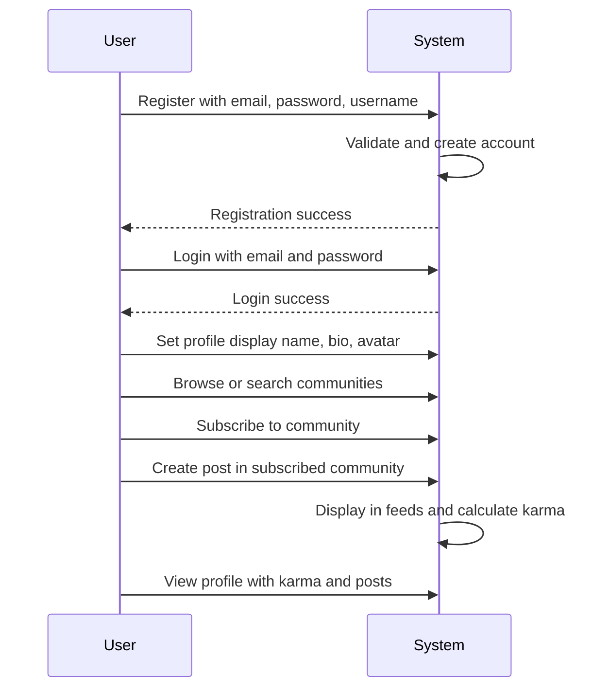
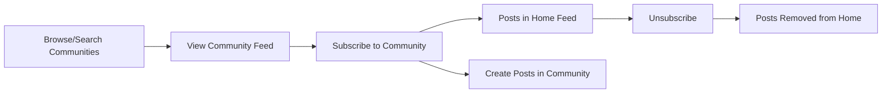
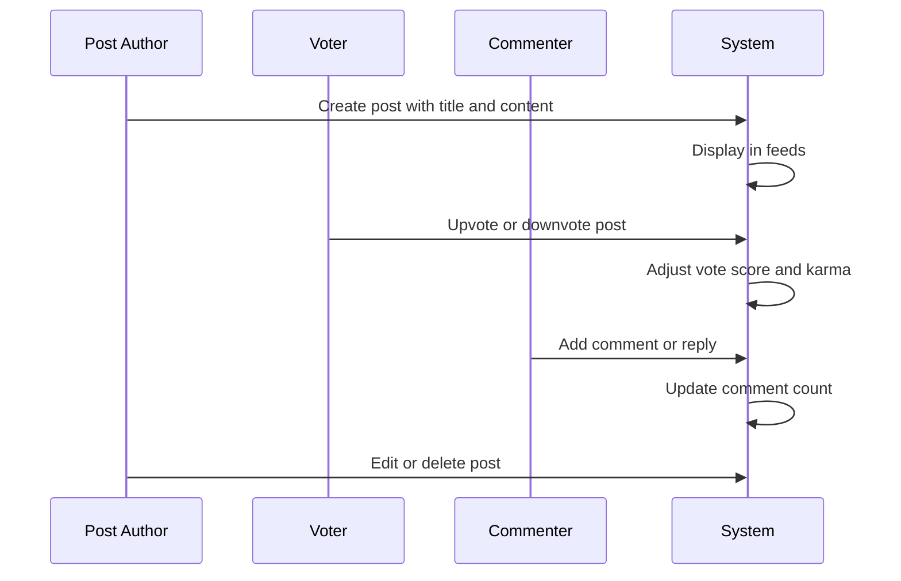
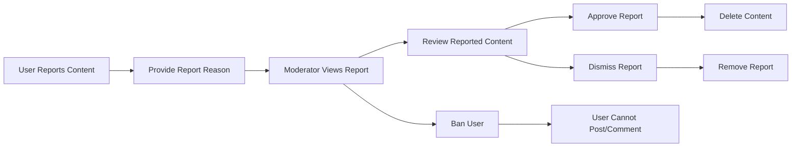

**redditCommunity — What operations users can perform, use cases, business workflows**

What operations users can perform, use cases, business workflows

# Core Business Operations

What the system must do for each business concept.

## User Operations

Users can create an account by providing an email address, password, and choosing a unique username. Users log in to the platform using their email and password credentials. Once authenticated, users can change their password at any time. Users have the ability to delete their own account, which automatically removes all posts and comments they have created. Each user maintains a profile containing a display name, bio text, and avatar image. Users can edit their own profile information including display name, bio, and avatar. Any user can view another user's profile page to see their public information. A user's profile displays their total karma score, a list of all posts they have created, and a list of all comments they have written. The system enforces username uniqueness during account creation and profile updates.

### Account Creation and Authentication

### Account Creation

THE system SHALL allow users to create an account by providing an email address, a password, and a username.

THE system SHALL enforce username uniqueness during account creation.

### User Login

THE system SHALL allow users to log in using their email address and password.

### Password Change

THE system SHALL allow authenticated users to change their password at any time.

### Account Deletion

THE system SHALL allow users to delete their own account.

WHEN a user deletes their account, THE system SHALL automatically delete all posts created by that user.

WHEN a user deletes their account, THE system SHALL automatically delete all comments created by that user.

### Profile Management

### Profile Attributes

THE system SHALL maintain a profile for each user containing a display name, bio text, and avatar image.

### Profile Editing

THE system SHALL allow users to edit their own display name.

THE system SHALL allow users to edit their own bio text.

THE system SHALL allow users to upload and update their own avatar image.

### Profile Viewing

### Profile Access

THE system SHALL allow any user to view another user's profile page.

### Profile Display

THE system SHALL display the user's display name, bio text, and avatar image on the profile page.

THE system SHALL display the user's total karma score on the profile page.

THE system SHALL display a list of all posts created by the user on the profile page.

THE system SHALL display a list of all comments written by the user on the profile page.

### Karma Display

THE system SHALL show the karma score as a single number.

THE system SHALL allow the karma score to be negative when downvotes exceed upvotes.

## Community Operations

Any user can create a new community by providing a unique name, description text, and icon image. The user who creates a community automatically becomes its owner with highest authority. Users can browse all communities on the platform in a list view. Users can search for communities by name to find specific communities. Each community displays its subscriber count to show community size. The community name must be unique across the platform. Community owners have special privileges including moderator management capabilities. Communities serve as containers for posts and organize content by topic or interest.

### Community Creation

### Community Creation

WHEN a user creates a community, THE system SHALL require a unique name, description text, and icon image.

THE system SHALL ensure the community name is unique across the platform and reject duplicate names.

WHEN a user creates a community, THE system SHALL automatically assign that user as the community owner with highest authority.

THE community owner SHALL retain their owner role permanently and cannot be removed by any other user.

WHERE a community is created, THE system SHALL establish the community as a container for posts and comments organized by topic or interest.

### Community Discovery

### Browse All Communities

THE system SHALL provide a list view displaying all communities on the platform.

THE browse feature SHALL be available to all users regardless of subscription status.

### Search Communities

WHEN a user searches for communities by name, THE system SHALL return communities matching the search query.

IF no communities match the search term, THEN THE system SHALL return no results.

THE search feature SHALL be available to all users regardless of subscription status.

### Community Information Display

### Subscriber Count Display

THE system SHALL display the subscriber count for each community to indicate community size.

THE subscriber count SHALL represent the total number of users subscribed to that community.

### Community Information Visibility

THE system SHALL display the community name, description text (defined in Community Creation), and icon image (defined in Community Creation) when viewing a community.

THE community information SHALL be visible to all users, including those not subscribed to the community.

WHEN viewing a community, THE system SHALL provide access to all posts within that community through the community feed.

## Post Operations

Users can create a post only in communities they are subscribed to. Every post requires a title. Posts must be one of three types: text posts with content, link posts with a URL, or image posts with an uploaded image. Users can edit their own posts after creation. Users can delete their own posts. When viewing a single post, users see the title, full content, author, community, vote score, comment count, and when it was posted. In post list feeds, each post displays title, author username, community name, vote score, comment count, and time since posted. Text posts show the first 200 characters of content in list view. Image posts display a thumbnail in list view. Link posts show the domain name of the URL in list view.

### Post Creation

### Subscription Requirement for Post Creation

WHERE a user is subscribed to a community, THE system SHALL allow the user to create a post in that community.

IF the user is not subscribed to the community, THEN THE system SHALL reject the post creation request.

### Post Title Requirement

THE system SHALL require a title for every post.

IF the title is missing, THEN THE system SHALL reject the post creation request.

### Post Type Selection

THE system SHALL require every post to be one of three types: text post, link post, or image post.

WHERE the post type is text post, THE system SHALL require text content.

WHERE the post type is link post, THE system SHALL require a URL.

WHERE the post type is image post, THE system SHALL require an uploaded image.

IF the text content is missing for a text post, THEN THE system SHALL reject the request.

IF the URL is missing for a link post, THEN THE system SHALL reject the request.

IF the image is missing for an image post, THEN THE system SHALL reject the request.

### Post Authorship Assignment

WHEN a post is created successfully, THE system SHALL associate the creating user as the author of the post.

WHEN a post is created successfully, THE system SHALL associate the post with the selected community.

### Post Management

### Edit Own Post

WHERE the user is the author of a post, THE system SHALL allow the user to edit the post.

WHEN editing a post, THE system SHALL allow the user to modify the title.

WHEN editing a text post, THE system SHALL allow the user to modify the text content.

WHEN editing a link post, THE system SHALL allow the user to modify the URL.

WHEN editing an image post, THE system SHALL allow the user to modify the uploaded image.

IF the user is not the author of the post, THEN THE system SHALL reject the edit request.

### Delete Own Post

WHERE the user is the author of a post, THE system SHALL allow the user to delete the post.

WHEN a post is deleted, THE system SHALL remove the post from the community.

WHEN a post is deleted, THE system SHALL make the post no longer visible to any user.

IF the user is not the author of the post, THEN THE system SHALL reject the delete request.

### Post Viewing

### Single Post View

WHEN viewing a single post, THE system SHALL display the post title.

WHEN viewing a single post, THE system SHALL display the full content (complete text for text posts, full URL for link posts, or full image for image posts).

WHEN viewing a single post, THE system SHALL display the author username.

WHEN viewing a single post, THE system SHALL display the community name.

WHEN viewing a single post, THE system SHALL display the vote score.

WHEN viewing a single post, THE system SHALL display the comment count.

WHEN viewing a single post, THE system SHALL display the time since the post was created.

### Post List Display

WHEN viewing posts in a feed or list, THE system SHALL display the title for each post.

WHEN viewing posts in a feed or list, THE system SHALL display the author username for each post.

WHEN viewing posts in a feed or list, THE system SHALL display the community name for each post.

WHEN viewing posts in a feed or list, THE system SHALL display the vote score for each post.

WHEN viewing posts in a feed or list, THE system SHALL display the comment count for each post.

WHEN viewing posts in a feed or list, THE system SHALL display the time since posted for each post.

WHERE the post is a text post, THE system SHALL display the first 200 characters of content in list view.

WHERE the post is an image post, THE system SHALL display a thumbnail of the image in list view.

WHERE the post is a link post, THE system SHALL display the domain name of the URL in list view.

### Vote Score and Comment Count Updates

WHILE users vote on a post, THE system SHALL update the vote score displayed on all post views.

WHILE users add comments to a post, THE system SHALL update the comment count displayed on all post views.

## Comment Operations

Users can write a comment on any post. Users can reply to any comment, creating nested comment threads. Replies can have replies with no depth limit, enabling unlimited nesting. Users can edit their own comments after posting. Users can delete their own comments. Each comment displays the author, content, vote score, and time since posted. Comments show nested replies in a threaded structure. Comments on a post can be sorted by best with highest vote score first, new with most recent first, or controversial with many votes but score close to zero. The comment system supports deep conversation threads through unlimited reply nesting.

### Comment Creation and Reply

Users can write a comment on any post. Users can reply to any comment to create a response thread. Replies can have replies, enabling unlimited comment nesting depth with no maximum level restriction. When a user creates a comment, the comment is associated with the post and the creating user. When a user replies to a comment, the reply is linked to the parent comment in a threaded structure.

### Comment Editing and Deletion

Users can edit their own comments after posting. When a user edits a comment, the updated content replaces the original content. Users can delete their own comments at any time. When a user deletes a comment, the comment is removed from the post. Users cannot edit comments written by other users. Users cannot delete comments written by other users.

### Comment Display

Each comment displays the author username. Each comment displays the full comment content. Each comment displays the current vote score. Each comment displays the time since the comment was posted, such as 3 hours ago or 2 days ago. Comments show nested replies in a threaded structure, with child comments visually grouped under their parent comment. The threaded structure supports unlimited depth, allowing replies to continue indefinitely. The vote score reflects the total upvotes minus total downvotes for that comment. The timestamp reflects the original posting time.

### Comment Sorting

Comments on a post can be sorted by best, which orders comments by highest vote score first. Comments can be sorted by new, which orders comments by most recent first. Comments can be sorted by controversial, which orders comments with many votes but a vote score close to zero first. Users can switch between sorting options to view comments in different orders. The sorting applies to all comments on the post, including nested replies at all levels.

## Vote Operations

Users can upvote a post which adds 1 to its score. Users can downvote a post which subtracts 1 from its score. Each user can only vote once per post or comment. Users can change their vote from upvote to downvote or vice versa. Users can remove their vote entirely from any post or comment. The vote score equals total upvotes minus total downvotes. When someone upvotes your post or comment, your karma increases by 1. When someone downvotes your post or comment, your karma decreases by 1. When someone removes their vote, your karma adjusts accordingly. Karma can be negative. The same voting rules apply to both posts and comments.

### Post and Comment Voting

Users can upvote a post, which adds 1 to the post's vote score. Users can downvote a post, which subtracts 1 from the post's vote score. Each user can cast only one vote per post. Users can change their vote on a post from upvote to downvote or from downvote to upvote. Users can remove their vote from a post entirely. The same voting rules apply to comments: users can upvote, downvote, change, or remove votes on comments, with one vote per user per comment. When a vote is changed or removed, the vote score adjusts accordingly.

### Vote Score Calculation

A post's vote score equals the total number of upvotes minus the total number of downvotes. A comment's vote score equals the total number of upvotes minus the total number of downvotes.

### Karma Updates

When a user's post or comment receives an upvote, that user's karma increases by 1. When a user's post or comment receives a downvote, that user's karma decreases by 1. When a vote on a user's post or comment is removed, that user's karma adjusts accordingly. A user's karma score can be negative.

## Subscription Operations

Users can subscribe to any community on the platform. Users can unsubscribe from any community they are currently subscribed to. Users can view a list of all communities they are subscribed to. Subscribing to a community is required to create posts in that community. The home feed shows posts only from communities the user is subscribed to and is available only to logged-in users. Subscription status determines which communities appear in a user's personalized home feed. Users can freely subscribe and unsubscribe without restrictions.

### Community Subscription

WHEN a user requests to subscribe to a community, THE system SHALL add the user to the community's subscriber list. THE system SHALL allow users to subscribe to any community on the platform. THE system SHALL allow users to subscribe to multiple communities. WHEN a user subscribes to a community, THE system SHALL increase the community's subscriber count by one.

### Community Unsubscription

WHEN a user requests to unsubscribe from a community, THE system SHALL remove the user from the community's subscriber list. THE system SHALL allow users to unsubscribe from any community they are currently subscribed to. WHEN a user unsubscribes from a community, THE system SHALL decrease the community's subscriber count by one.

### Subscribed Communities List

THE system SHALL provide users with a list of all communities they are subscribed to. THE system SHALL make the subscribed communities list available to logged-in users.

### Subscription-Based Post Creation

THE system SHALL require users to be subscribed to a community before creating posts in that community. WHEN a user attempts to create a post in a community they are not subscribed to, THE system SHALL reject the request.

### Home Feed Content

THE system SHALL display posts only from communities the user is subscribed to in the home feed. THE system SHALL make the home feed available only to logged-in users. WHEN a user subscribes to a new community, THE system SHALL include posts from that community in the user's home feed. WHEN a user unsubscribes from a community, THE system SHALL remove posts from that community from the user's home feed. THE home feed supports sorting options: hot, new, top, and controversial.

## Moderator Operations

The community creator is the owner with highest authority. The owner can add moderators to their community. The owner can remove moderators from their community. Moderators can add other moderators to the community. Moderators cannot remove the owner. Moderators cannot remove each other, only the owner can remove moderators. Moderators can delete any post in their community. Moderators can delete any comment in their community. Moderators can view all reports for their community. Moderators can approve a report which deletes the content or dismiss it which keeps the content. Dismissed reports are removed from the report list.

### Moderator Role Assignment

The user who creates a community automatically becomes the owner of that community. The owner has the highest authority in the community. The owner can add other users as moderators to their community. The owner can remove moderators from their community. Moderators can add other users as moderators to the community. Moderators cannot remove the owner from the moderator role. Moderators cannot remove other moderators from the community. Only the owner can remove moderators from the community.

### Content Moderation

Moderators can delete any post in their community. When a moderator deletes a post, the post is removed from the community. Moderators can delete any comment in their community. When a moderator deletes a comment, the comment is removed from the post. Moderators can perform content moderation actions on all posts and comments within their community, regardless of who created them.

### Report Management

Moderators can view all reports filed for their community. Each report shows the reported content, the user who filed the report, and the reason provided. Moderators can approve a report, which deletes the reported content. Moderators can dismiss a report, which keeps the reported content visible. When a report is dismissed, it is removed from the report list. Moderators can take action on any report within their community.

## Ban Operations

Moderators can ban users from their community. Moderators can unban users who were previously banned. Moderators can view the list of banned users for their community. Banned users cannot create posts in that community. Banned users cannot create comments in that community. Banned users can still view content in the community despite being banned. Ban status controls posting and commenting permissions at the community level. Only moderators have the authority to ban and unban users in their community.

### Ban and Unban User Operations

Moderators can ban any user from their community. Moderators can unban users who were previously banned from their community. The community owner has the highest authority and can ban and unban any user. Moderators can add other moderators but cannot remove moderators or the owner. Only moderators and the owner have the authority to ban and unban users in their community. Ban enforcement applies at the community level, affecting only the specific community where the ban was issued. A user can be banned from one community while remaining able to participate in other communities.

### View Banned Users List

Moderators can view a list of all users who are currently banned from their community. The banned users list shows which users have been banned and their ban status. Only moderators of a community can access the banned users list for that community. Non-moderators cannot view the banned users list.

### Ban Effects on User Access

Ban status controls posting permissions at the community level. Ban status controls commenting permissions at the community level. Banned users cannot create posts in the community where they are banned. Banned users cannot create comments in the community where they are banned. Despite being banned, users can still view all content in the community, including posts and comments.

## Report Operations

Users can report any post or comment on the platform. When reporting, users must provide a reason as text explaining why they are reporting the content. Moderators can view all reports for their community. Each report shows the reported content, who reported it, and the reason provided. Moderators can approve a report which results in deleting the reported content. Moderators can dismiss a report which keeps the content visible. Dismissed reports are removed from the report list. The reporting system enables community moderation through user participation.

### Report Submission

### Report Submission

THE system SHALL allow users to report any post on the platform.
THE system SHALL allow users to report any comment on the platform.
WHEN a user submits a report, THE system SHALL require a reason as text explaining why the content is being reported.
THE system SHALL automatically associate the report with the user who submitted it.
THE system SHALL link the report to the specific post or comment being reported.
THE system SHALL allow users to submit reports on content within any community.
THE system SHALL ensure each report contains unique reason text provided by the reporting user.
THE system SHALL make the reporting feature available to all users regardless of subscription status.
WHEN the system accepts a report, THE system SHALL confirm submission to the user.

### Report Review

### Report Review

THE system SHALL allow moderators to view all reports for their community.
THE system SHALL display the reported content in full (the complete post or comment) for each report.
THE system SHALL show the reporting user's username for each report.
THE system SHALL display the reason text provided by the reporter for each report.
THE system SHALL allow moderators to access the report list from their community moderation interface.
THE system SHALL display all pending reports in a list view.
THE system SHALL indicate the type of content reported (post or comment) in the report list.
THE system SHALL show when each report was submitted in the report list.
THE system SHALL allow moderators to select any report to view full details.
THE system SHALL restrict report viewing to moderators of the specific community only.

### Report Resolution

### Report Resolution

THE system SHALL allow moderators to approve a report.
WHEN a moderator approves a report, THE system SHALL delete the reported content.
WHEN a report is approved, THE system SHALL permanently remove the post or comment.
THE system SHALL allow moderators to dismiss a report.
WHEN a moderator dismisses a report, THE system SHALL keep the content visible and unchanged.
WHEN a report is dismissed, THE system SHALL remove it from the report list.
THE system SHALL ensure dismissed reports are not viewable in the active report list.
WHEN a report is approved, THE system SHALL process the content deletion immediately.
WHEN a report is dismissed, THE system SHALL close the report without affecting the content.
THE system SHALL ensure each report can only be resolved once (either approved or dismissed).
THE system SHALL enable user-driven content moderation through the community reporting system.
THE system SHALL allow community members to participate in moderation by reporting inappropriate content.
THE system SHALL enable moderators to review reports and take appropriate action based on community standards.

# Error Scenarios and Edge Cases

Business-level error scenarios, edge case coverage, and expected system behaviors for exceptional conditions.

## User Error Scenarios

Users cannot sign up with an email address that is already registered to another account. Users cannot choose a username that is already taken by another user. Login attempts fail when the email or password does not match any existing account. Users attempting to change their password must provide the correct current password. When a user deletes their account, all posts and comments created by that user are also deleted automatically. Account deletion is permanent and cannot be undone. Users viewing profiles of deleted accounts will see that the content no longer exists. The system prevents duplicate email addresses during registration. The system prevents duplicate usernames during registration. Profile editing is restricted to the account owner only.

### Registration Validation

The system prevents users from registering with an email address that is already associated with an existing account. When a user attempts to sign up using an email that is already registered, the registration request is rejected. The system validates email uniqueness before creating any new account. The system prevents users from choosing a username that is already taken by another user. When a user attempts to register with a username that already exists, the registration request is rejected. The system validates username uniqueness before creating any new account. Both the email address and username must be unique across all user accounts in the platform. Registration fails if either the email or username already exists in the system.

### Authentication Validation

Login attempts are rejected when the provided email and password combination does not match any existing account. Users attempting to log in with an email that is not registered receive an authentication failure. Users attempting to log in with an incorrect password receive an authentication failure. When changing their password, users must successfully authenticate with their current password. Password change requests are rejected when the current password provided does not match the account. Password change requests are rejected when the user is not properly authenticated. The system validates the current password before allowing any password modification.

### Account Deletion Behavior

When a user deletes their account, all posts created by that user are automatically deleted. When a user deletes their account, all comments created by that user are automatically deleted. Account deletion cascades to all content created by the user including posts and comments. Account deletion is permanent and cannot be reversed. Once an account is deleted, it cannot be recovered or restored. Users viewing posts or comments from deleted accounts will see that the content no longer exists. All traces of the deleted user's posts are removed from community feeds. All traces of the deleted user's comments are removed from post discussions. Profile pages of deleted users display that the account no longer exists.

### Profile Access Control

Profile editing is restricted to the account owner only. Users can only edit their own display name, bio text, and avatar image. Users cannot modify another user's display name. Users cannot modify another user's bio text. Users cannot modify another user's avatar image. Attempts to edit another user's profile are rejected with an access denied error. Only authenticated users can modify their own profile information. Users viewing other user profiles can see the display name, bio, and avatar but cannot modify them. Guests cannot edit any user profiles including their own. The system validates that the profile editor is the profile owner before allowing any changes.

## Community Error Scenarios

Users cannot create a community with a name that already exists. Community names must be unique across the entire platform. When searching for communities, the system returns an empty list if no matches are found. The community owner cannot be removed from the community by any user. Communities display zero subscribers when no one has subscribed yet. Users can browse communities even when the list is empty. Community creation succeeds even if the user has no subscriptions. Community descriptions can be empty but the name is required. The system enforces unique community names during creation. Only the community creator becomes the owner.

### Community Name Uniqueness

### Community Name Uniqueness

Community names must be unique across the entire platform. When a user attempts to create a community with a name that already exists, the request is rejected. The system enforces unique community names during the creation process. A community name is required and cannot be empty. If the community name is missing or blank, the creation request is rejected. Users are notified when their chosen community name is already taken.

### Community Creation Edge Cases

### Community Creation Edge Cases

Any user can create a community regardless of their subscription status. Users do not need to be subscribed to any community before creating their own community. A community description is optional and can be left empty during creation. The user who creates a community automatically becomes its owner with the highest authority. Community creation succeeds even if the creator has no existing subscriptions to other communities.

### Community Display Edge Cases

### Community Display Edge Cases

When searching for communities by name, the system returns an empty list if no matching communities are found. Users can browse the community list even when it contains no communities. Communities display a subscriber count of zero when no users have subscribed yet. The community owner cannot be removed from the community by any user, including moderators. The system prevents any attempt to remove the owner from their own community.

## Post Error Scenarios

Users cannot create posts in communities they are not subscribed to. Every post must have a title, and posts without titles are rejected. Users must select one of three post types: text, link, or image. Text posts require content, link posts require a valid URL, and image posts require an uploaded image. Users cannot edit or delete posts created by other users. Posts show zero vote score when no votes have been cast. Posts show zero comment count when no comments exist. When a community is deleted, all posts in that community are also deleted. Users viewing deleted posts receive a message that the content is no longer available. Post editing is restricted to the post author only.

### Post Creation Validation

WHEN a user attempts to create a post in a community they are not subscribed to, THE system SHALL block the post creation.

WHEN a user submits a post without a title, THE system SHALL reject the submission.

WHEN a user submits a post with an invalid or missing post type selection, THE system SHALL reject the submission.

WHEN a user submits a text post without content, THE system SHALL reject the submission.

WHEN a user submits a link post without a URL, THE system SHALL reject the submission.

WHEN a user submits an image post without an image upload, THE system SHALL reject the submission.

### Post Modification Restrictions

WHEN a user attempts to edit a post created by another user, THE system SHALL block the edit request.

WHEN a user attempts to delete a post created by another user, THE system SHALL block the delete request.

THE system SHALL restrict post editing to the post author only.

### Post Display States

WHEN no votes have been cast on a post, THE system SHALL display a vote score of zero.

WHEN no comments exist on a post, THE system SHALL display a comment count of zero.

### Post Deletion Cascading

WHEN a community is deleted, THE system SHALL automatically delete all posts in that community.

WHEN users attempt to view a deleted post, THE system SHALL display a message that the content is no longer available.

## Comment Error Scenarios

Users cannot write comments on posts that have been deleted. Users can reply to any comment with no depth limit on nested replies. Users cannot edit or delete comments created by other users. Comments show zero vote score when no votes have been cast. When a user deletes their account, all their comments are deleted automatically. Replies to deleted comments become inaccessible along with the parent comment. Comments on posts in deleted communities are no longer accessible. Banned users cannot write comments in communities where they are banned. Users can only edit or delete their own comments. Comment editing is restricted to the comment author only.

### Comment Creation Restrictions

Users cannot write comments on posts that have been deleted. When a post is deleted, the option to comment on that post is no longer available.

Banned users cannot write comments in communities where they are banned. When a user attempts to create a comment in a community where they have been banned, the request is rejected. Banned users can still view existing comments in the community but cannot create new ones.

### Comment Editing and Deletion Permissions

Users can only edit or delete their own comments. Comment editing is restricted to the comment author only.

Users cannot edit comments created by other users. When a user attempts to edit another user's comment, the request is rejected.

Users cannot delete comments created by other users. When a user attempts to delete another user's comment, the request is rejected.

### Comment Hierarchy and Cascading Effects

Users can reply to any comment with no depth limit on nested replies. The system supports unlimited comment nesting depth.

When a user deletes their account, all their comments are deleted automatically. This includes all comments and replies the user has written across all posts and communities.

When a comment is deleted, all replies to that comment become inaccessible along with the parent comment. The entire reply chain under a deleted comment is no longer viewable.

Comments on posts in deleted communities are no longer accessible. When a community is deleted, all posts and comments within that community become inaccessible.

### Comment Vote Display

Comments show zero vote score when no votes have been cast. A comment with no upvotes or downvotes displays a vote score of zero.

## Vote Error Scenarios

Each user can only cast one vote per post or comment. Users attempting to vote twice on the same content have their vote changed instead of creating a duplicate. Users can change their vote from upvote to downvote or vice versa. Users can remove their vote entirely, which adjusts the score accordingly. When a vote is removed, the karma of the content author adjusts by the vote value. Karma scores can become negative when downvotes exceed upvotes. Vote scores are calculated as total upvotes minus total downvotes. Users viewing content see the current vote score in real time. Vote changes are reflected immediately in the author's karma score. Upvote increases karma by one, downvote decreases karma by one.

### Vote Uniqueness Enforcement

Each user can cast only one vote per post or comment. When a user attempts to vote on content they have already voted on, the system changes their existing vote instead of creating a duplicate vote. Users cannot have multiple votes on the same post or comment simultaneously. The single vote per user rule applies to both posts and comments. When a user submits a vote on content where they already have a vote, their previous vote is replaced with the new vote value.

### Vote Change Operations

Users can change their vote from upvote to downvote on any post or comment. Users can change their vote from downvote to upvote on any post or comment. When a user changes their vote direction, the vote score adjusts by two points to reflect the change. Vote changes are processed immediately and the updated score is displayed to all users viewing the content. Users can freely switch between upvote and downvote states on the same content.

### Vote Removal and Adjustments

Users can remove their vote entirely from any post or comment. When a vote is removed, the vote score adjusts by the value of the removed vote. When an upvote is removed, the score decreases by one. When a downvote is removed, the score increases by one. When a vote is removed, the karma of the content author adjusts by the vote value that was removed. Vote removal updates are reflected immediately in both the content score and the author's karma.

### Karma and Score Behavior

Karma scores can be negative when downvotes exceed upvotes for a user's content. The vote score for any post or comment is calculated as total upvotes minus total downvotes. Users viewing content see the current vote score in real time as votes are cast. When any vote is cast, changed, or removed, the author's karma updates immediately. An upvote increases the content author's karma by one. A downvote decreases the content author's karma by one. Vote score changes and karma updates are visible to all users without delay.

## Subscription Error Scenarios

Users cannot subscribe to a community they are already subscribed to. Users cannot unsubscribe from a community they are not subscribed to. Users must be subscribed to a community before creating posts in it. Users can view their subscribed communities list even when it is empty. Subscribing to a community succeeds even if the user has no posts. Unsubscribing does not delete the user's existing posts in that community. Users can resubscribe to a community after unsubscribing. The subscriber count updates immediately when users subscribe or unsubscribe. Users browsing communities see accurate subscriber counts. Subscription status is checked before allowing post creation.

### Subscription Validation and Post Creation

WHEN a user attempts to subscribe to a community they are already subscribed to, THEN the system shall reject the duplicate subscription request. WHEN a user attempts to unsubscribe from a community they are not subscribed to, THEN the system shall reject the unsubscribe request. WHEN a user attempts to create a post in a community, THEN the system shall check the user's subscription status before allowing post creation. IF the user does not have an active subscription to the community, THEN the system shall reject the post creation request. WHERE a user has a valid subscription to a community, the system shall allow the user to create posts in that community.

### Subscription List and State Management

Users can view their list of subscribed communities. WHEN a user has no subscriptions, THEN the system shall display an empty subscribed communities list without error. WHEN a user subscribes to a community without having any posts in that community, THEN the subscription shall succeed. WHEN a user unsubscribes from a community, THEN the system shall preserve all posts and comments the user previously created in that community. WHEN a user resubscribes to a community after unsubscribing, THEN the system shall restore the user's ability to create posts in that community.

### Subscriber Count Management

WHEN a user subscribes to a community, THEN the system shall immediately increase the community's subscriber count by one. WHEN a user unsubscribes from a community, THEN the system shall immediately decrease the community's subscriber count by one. WHEN users browse the community list, THEN the system shall display accurate subscriber counts that reflect all current subscriptions.

## Moderator Error Scenarios

Only the community owner can add new moderators to the community. Moderators can add other moderators but cannot remove them. Only the community owner can remove moderators from the community. Moderators cannot remove the community owner under any circumstances. Users who are not moderators cannot perform moderator actions. Moderators attempting to delete posts in other communities receive an error. Moderators can only delete posts and comments within their own community. The system prevents duplicate moderator assignments. Owner status cannot be transferred to another user. Moderator deletion scope is limited to own community.

### Moderator Assignment Operations

WHEN the community owner adds a user as a moderator, THE system SHALL assign the moderator role to that user.

WHEN a moderator adds a user as a moderator, THE system SHALL assign the moderator role to that user.

WHEN a user who is not the owner attempts to add a moderator, THE system SHALL reject the request.

WHEN a user attempts to add a moderator who is already assigned, THE system SHALL reject the duplicate assignment.

WHEN any user attempts to transfer owner status to another user, THE system SHALL reject the transfer request.

### Moderator Removal Operations

WHEN the community owner removes a moderator, THE system SHALL revoke the moderator role from that user.

WHEN a moderator attempts to remove another moderator, THE system SHALL reject the removal request.

WHEN any user attempts to remove the community owner, THE system SHALL reject the removal request.

### Moderator Action Scope

WHEN a moderator deletes a post in their community, THE system SHALL remove the post from the community.

WHEN a moderator deletes a comment in their community, THE system SHALL remove the comment from the post.

WHEN a moderator attempts to delete a post in a community where they are not a moderator, THE system SHALL reject the deletion request.

WHEN a moderator attempts to delete a comment in a community where they are not a moderator, THE system SHALL reject the deletion request.

WHEN a user who is not a moderator attempts to perform moderator actions, THE system SHALL reject the action request.

WHEN a moderator bans a user from their community, THE system SHALL prevent the banned user from creating posts and comments in that community.

WHEN a moderator unbans a user from their community, THE system SHALL restore the user's ability to create posts and comments in that community.

## Ban Error Scenarios

Moderators can ban users from their community. Moderators cannot ban users who are already banned. Moderators can unban users who were previously banned. Moderators cannot unban users who are not currently banned. Banned users can still view content in the community. Banned users cannot create posts in the community where they are banned. Banned users cannot write comments in the community where they are banned. Moderators can view the list of banned users for their community. Ban status is checked before allowing post or comment creation. Banned users retain viewing access to community content.

### Ban and Unban Error Conditions

When a moderator attempts to ban a user who is already banned from the community, the request is rejected with an error indicating the user is already banned.

When a moderator attempts to unban a user who is not currently banned from the community, the request is rejected with an error indicating the user is not banned.

When a user who is not a moderator or the community owner attempts to ban a user, the request is rejected with an error indicating insufficient permissions.

When a user who is not a moderator or the community owner attempts to unban a user, the request is rejected with an error indicating insufficient permissions.

When a moderator attempts to ban the community owner, the request is rejected with an error.

When a banned user attempts to create a post in the community where they are banned, the request is rejected with an error indicating the user is banned from the community. The system checks ban status before allowing post creation.

When a banned user attempts to create a comment in the community where they are banned, the request is rejected with an error indicating the user is banned from the community. The system checks ban status before allowing comment creation.

Banned users retain the ability to view all community content including posts and comments. Viewing access is not restricted by ban status.

## Report Error Scenarios

Users must provide a reason when reporting a post or comment. Reports without a reason are rejected by the system. Users can report the same content multiple times with different reasons. Moderators can only view reports for their own community. Non-moderators cannot view the report list. Moderators can approve reports which deletes the reported content. Moderators can dismiss reports which keeps the content visible. Dismissed reports are removed from the report list immediately. Approved reports result in content deletion and report removal. Users reporting deleted content receive a message that the content is no longer available.

### Report Reason Validation

Users must provide a reason when reporting any post or comment. The report reason field requires text input before submission. Reports submitted without a reason are rejected by the system. The user receives an error message indicating that a reason is required. Empty or blank reason submissions are not accepted. The system validates that the reason contains visible text characters before accepting the report.

### Multiple Report Handling

Users can report the same post or comment multiple times with different reasons. Each report with a unique reason is accepted as a separate report. The system does not block duplicate reports if the reason text differs from previous reports. Users attempting to report content that has already been deleted receive a message that the content is no longer available. The system prevents report submission for posts or comments that do not exist.

### Report Access Control

Only moderators can view the report list for their community. Moderators can only access reports for communities where they have moderator status. Non-moderators cannot view the report list for any community. When a non-moderator attempts to view reports, the system blocks access and displays an error message. Moderators attempting to access another community's reports receive an access denied error.

### Report Resolution Outcomes

When a moderator approves a report, the reported content is deleted from the platform and the report is removed from the report list. When a moderator dismisses a report, the reported content remains visible on the platform and the report is removed from the report list immediately. Both approve and dismiss actions complete the report resolution process. Reports cannot remain in the active report list after resolution.

# End-to-End User Scenarios

Cross-domain user scenarios that span multiple concepts, describing complete user journeys.

## Cross-Domain User Scenarios

Define end-to-end user scenarios that span multiple concepts, describing complete user journeys from start to finish.

### New User Registration and First Post Journey

### Account Setup and Profile Configuration

WHEN a new user registers, THE system SHALL create an account using email, password, and a unique username.

WHEN a user logs in, THE system SHALL authenticate using email and password.

THE user SHALL set a display name, bio text, and avatar image on their profile.

THE user SHALL edit their display name, bio text, and avatar image at any time.

### Community Discovery and Subscription

THE user SHALL browse all communities in a list.

THE user SHALL search for communities by name.

WHEN viewing a community, THE system SHALL display the community name, description text, icon image, and subscriber count.

THE user SHALL subscribe to any community.

### First Post Creation and Engagement

THE user SHALL create a post in a subscribed community with a required title.

THE user SHALL select a post type: text post with content, link post with URL, or image post with uploaded image.

WHEN a post is created, THE system SHALL display it in the community feed and home feeds of subscribed users.

WHEN another user upvotes the post, THE system SHALL increase the author karma score by one.

WHEN another user downvotes the post, THE system SHALL decrease the author karma score by one.

THE user SHALL view their profile showing total karma score and list of created posts.

### Community Discovery and Subscription Journey

### Community Browsing and Preview

THE user SHALL browse all communities in a list.

THE user SHALL search for communities by name.

WHEN viewing the community list, THE system SHALL display each community name, description text, icon image, and subscriber count.

THE user SHALL view any community feed before subscribing.

WHEN viewing a community feed, THE system SHALL display posts from that community.

### Subscription Management

THE user SHALL subscribe to any community.

WHEN the user subscribes, THE system SHALL add the community to the user subscribed list.

WHEN subscribed, THE system SHALL include community posts in the user home feed.

THE user SHALL view their list of subscribed communities.

THE user SHALL unsubscribe from any subscribed community.

WHEN the user unsubscribes, THE system SHALL remove the community from the user subscribed list.

WHEN unsubscribed, THE system SHALL exclude community posts from the user home feed.

THE user SHALL view the community feed directly without subscribing.

### Post Creation and Engagement Journey

### Post Creation

THE user SHALL create a post in a subscribed community.

THE system SHALL require a title for every post.

THE user SHALL select one post type: text post with content, link post with URL, or image post with uploaded image.

### Post Display in Feeds

WHEN viewing any feed, THE system SHALL display each post with title, author username, community name, vote score, comment count, and time since posted.

FOR text posts, THE system SHALL display the first 200 characters of content.

FOR image posts, THE system SHALL display a thumbnail of the image.

FOR link posts, THE system SHALL display the domain name of the URL.

### Post Voting

THE user SHALL upvote a post, adding one to the vote score.

THE user SHALL downvote a post, subtracting one from the vote score.

EACH user SHALL cast one vote per post.

THE user SHALL change their vote from upvote to downvote or vice versa.

THE user SHALL remove their vote entirely.

WHEN a vote is cast, changed, or removed, THE system SHALL adjust the author karma score accordingly.

### Comment Engagement

THE user SHALL write a comment on any post.

THE user SHALL reply to any comment.

THE system SHALL support unlimited nested reply depth.

THE user SHALL edit their own comments.

THE user SHALL delete their own comments.

WHEN viewing a comment, THE system SHALL display author, content, vote score, time since posted, and nested replies.

### Comment Voting

THE user SHALL upvote or downvote any comment.

EACH user SHALL cast one vote per comment.

THE user SHALL change or remove their comment vote.

### Post Management

THE user SHALL edit their own posts.

THE user SHALL delete their own posts.

### Moderation and Report Resolution Journey

### Report Submission

THE user SHALL report any post or comment.

WHEN reporting, THE user SHALL provide a reason text.

THE system SHALL submit the report to the community moderators.

### Report Review

THE moderator SHALL view all reports for their community.

WHEN viewing a report, THE system SHALL display the reported content, the user who reported it, and the reason provided.

### Report Resolution

THE moderator SHALL approve a report.

WHEN a report is approved, THE system SHALL delete the reported post or comment.

THE moderator SHALL dismiss a report.

WHEN a report is dismissed, THE system SHALL keep the content and remove the report from the list.

### User Ban Management

THE moderator SHALL ban a user from their community.

WHEN a user is banned, THE system SHALL prevent the user from creating posts or comments in that community.

WHEN a user is banned, THE system SHALL allow the user to view content in that community.

THE moderator SHALL unban a user.

THE moderator SHALL view the list of banned users for their community.

### Moderator Role Management

THE community owner SHALL add moderators to their community.

THE community owner SHALL remove moderators from their community.

THE moderator SHALL add other moderators to the community.

# File Storage

File upload capabilities, media processing, and storage requirements.

## File Upload and Management

Define file upload capabilities, supported formats, processing requirements, and access control for stored files.

### Avatar and Community Icon Upload

WHEN a user uploads an avatar image, THE system SHALL store the image and display it on the user's profile page.
WHEN a user uploads a new avatar image, THE system SHALL replace the previous avatar image.
WHEN a user creates a community, THE system SHALL accept an icon image upload and display it on the community page.
WHEN a community owner uploads a new icon image, THE system SHALL replace the previous community icon image.
WHERE a user has an avatar image, THE system SHALL display the avatar on the user's profile and next to their posts and comments.
WHERE a community has an icon image, THE system SHALL display the icon on the community page and next to posts from that community.

### Image Post Upload and Thumbnail Generation

WHEN a user creates an image post, THE system SHALL accept an uploaded image file as the post content.
THE system SHALL store the uploaded image and display it when viewing the full post.
WHEN a user edits an image post, THE system SHALL allow the user to replace the uploaded image.
WHEN displaying image posts in a feed, THE system SHALL generate and display a thumbnail of the uploaded image.
WHEN a post is deleted, THE system SHALL remove the associated uploaded image from storage.
WHEN a user deletes their account, THE system SHALL remove all images uploaded by that user from storage.