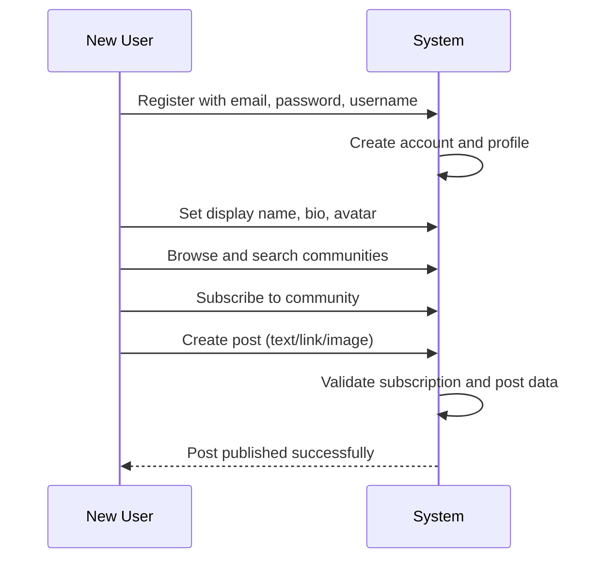
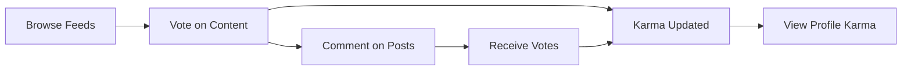
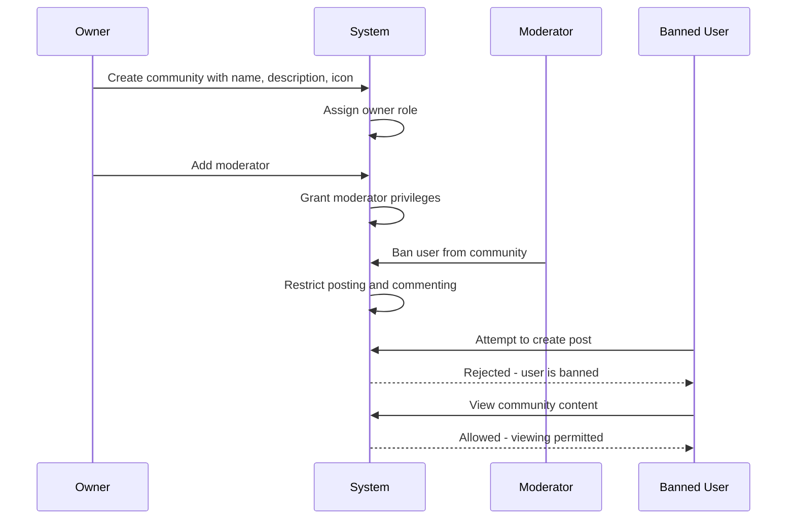
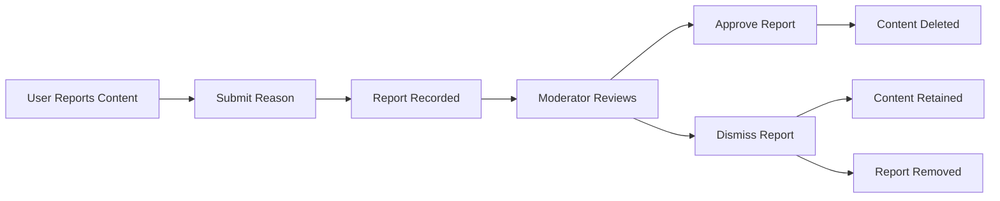

**redditCommunity — What operations users can perform, use cases, business workflows**

What operations users can perform, use cases, business workflows

# Core Business Operations

What the system must do for each business concept.

## User Operations

Users can create an account by providing an email address, password, and choosing a unique username. Users log in to the platform using their email and password credentials. Once logged in, users can change their password at any time. Users can delete their own account, which permanently removes all posts and comments they have created. Each user maintains a profile containing a display name, bio text, and avatar image. Users can edit their own display name, bio, and avatar whenever they wish. Any user can view another user's profile page. A user's profile displays their display name, bio, avatar, and total karma score. The profile also shows a complete list of all posts the user has created. Additionally, the profile displays a list of all comments the user has written across the platform.

### Account Registration and Login

Users can create an account by providing an email address, password, and choosing a unique username. The system validates that the chosen username is not already in use before completing registration. Users can log in to the platform using their registered email address and password credentials. Upon successful login, users gain access to their account and platform features. If the provided email or password does not match any registered account, login access is denied. Each account is associated with exactly one email address and one username.

### Password Management

Logged-in users can change their password at any time through their account settings. When changing a password, the system requires the user to provide their current password for verification. If the current password provided is incorrect, the password change request is rejected. Once successfully changed, the new password becomes the active credential for future logins. Users must be authenticated to access the password change functionality.

### Account Deletion

Users can delete their own account permanently. When an account is deleted, all posts created by that user are permanently removed from the platform. When an account is deleted, all comments written by that user are permanently removed from the platform. Account deletion is irreversible and cannot be undone. The system processes account deletion only for the account owner, not for other users' accounts.

### Profile Editing

Each user maintains a profile containing a display name, bio text, and avatar image. Users can edit their own display name whenever they wish. Users can edit their own bio text at any time. Users can update their own avatar image by uploading a new image. Profile editing is restricted to the profile owner only. Users can modify any combination of profile fields independently without affecting other fields.

### Profile Viewing

Any user can view another user's profile page without restriction. A user's profile page displays their display name, bio text, and avatar image. The profile page shows the user's total karma score as a single number, which may be positive, negative, or zero. The profile displays a complete list of all posts the user has created across all communities. The profile displays a complete list of all comments the user has written across all posts. Profile visitors can browse through the user's posts and comments to view their contribution history.

## Community Operations

Any user can create a new community on the platform. When creating a community, the user provides a unique name, description text, and icon image. The user who creates a community automatically becomes its owner with highest authority. Users can browse all communities in a list view to discover content. Users can search for communities by name to find specific ones. Each community displays its subscriber count to show popularity. Communities serve as the organizational structure for posts and discussions. The community owner has special privileges for moderation and management.

### Community Creation

Any user can create a new community on the platform.

When creating a community, the user must provide a unique name that has not been used by any existing community. If the name is already taken, the creation request is rejected.

The user must provide description text for the community. The user may provide an icon image for the community.

The user who creates a community automatically becomes its owner with highest authority over that community. The owner role is assigned at the moment of community creation and cannot be transferred.

A community serves as the organizational structure for posts and discussions. All posts must belong to exactly one community.

### Community Discovery

Users can browse all communities in a list view to discover content. The list displays all communities on the platform regardless of subscription status.

Users can search for communities by name to find specific ones. The search matches community names and returns communities whose names contain the search term.

Each community displays its subscriber count to show popularity. The subscriber count reflects the total number of users subscribed to that community.

When viewing a community in the list or search results, users see the community name, description, icon, and subscriber count.

### Community Content Organization

Communities serve as the primary organizational structure for posts and discussions on the platform.

Every post must belong to exactly one community. Posts cannot exist independently without a community association.

When viewing posts, the community name is displayed to indicate where the post was published. Users can identify the source community for any post.

Posts are grouped and filtered by their associated community when viewing community-specific feeds.

### Owner Moderation Privileges

The community owner has highest authority over that community with special privileges for moderation and management.

The owner can add moderators to the community. Moderators can also add other moderators to the community. The owner can remove moderators from the community. Only the owner can remove moderators; moderators cannot remove each other.

Moderators cannot remove the owner from the community. The owner role is protected from removal by any other user including moderators.

The owner has all moderator capabilities including deleting posts and comments, banning and unbanning users, and viewing reports for the community.

## Post Operations

Users can create a post in any community they are subscribed to. Every post requires a title. Posts must be one of three types: text posts with text content, link posts with a URL, or image posts with an uploaded image. Users can edit their own posts after creation. Users can delete their own posts permanently. When viewing a single post, users see the title, full content, author username, community name, vote score, comment count, and time since posting. Post creation is restricted to subscribed community members only. The post type determines what additional content is required.

### Post Creation

Users can create a post in any community they are subscribed to. Users cannot create posts in communities they are not subscribed to.

Every post requires a title. The title is mandatory for all post types.

Posts must be one of three types:
- Text posts: include text content written by the user
- Link posts: include a URL provided by the user
- Image posts: include an uploaded image provided by the user

The post type determines what additional content is required beyond the title. A text post requires text content. A link post requires a URL. An image post requires an uploaded image.

When a user creates a post, the post is automatically associated with the creating user as the author and the selected community.

### Post Editing and Deletion

Users can edit their own posts after creation. Users can only edit posts they authored. Users cannot edit posts authored by other users.

Users can delete their own posts permanently. Users can only delete posts they authored. Users cannot delete posts authored by other users.

When a user deletes a post, the post and all its associated comments are permanently removed from the platform.

### Post Viewing

Users can view any post on the platform. When viewing a single post, users see the following details:

- The post title
- The full content of the post (text content for text posts, URL for link posts, or image for image posts)
- The author username of the post creator
- The community name where the post was created
- The vote score of the post
- The comment count on the post
- The time since the post was created (e.g., "3 hours ago")

The vote score is displayed as a single number representing the net votes. The comment count shows the total number of comments on the post. The time display shows how long ago the post was created in human-readable format.

## Comment Operations

Users can write a comment on any post in the platform. Users can reply to any existing comment to create threaded discussions. Replies can have further replies with no depth limit, enabling unlimited nesting. Users can edit their own comments after posting. Users can delete their own comments permanently. Each comment displays the author username, content, vote score, and time since posting. Comments show nested replies in a hierarchical structure. Comment voting follows the same rules as post voting. Users participate in discussions through commenting and replying.

### Comment Creation

Users can write a comment on any post in the platform. Users can reply to any existing comment to create threaded discussions. Replies can have further replies with no depth limit, enabling unlimited nesting. When creating a comment, the user must provide the comment content. The comment is automatically associated with the post and the creating user. When replying to a comment, the reply is linked to the parent comment. The system accepts comment creation requests on any accessible post. The system accepts reply requests on any accessible comment. If the post does not exist, the request is rejected. If the user does not have permission to view the post, the request is rejected. If the parent comment does not exist (for replies), the request is rejected.

### Comment Management

Users can edit their own comments after posting. Users can delete their own comments permanently. When editing a comment, the user can modify the comment content. The edited comment retains its position in the thread. When deleting a comment, the comment is permanently removed from the system. If a user attempts to edit a comment they did not create, the request is rejected. If a user attempts to delete a comment they did not create, the request is rejected. If the comment does not exist, the request is rejected. If the comment has already been deleted, the request is rejected.

### Comment Display

Each comment displays the author username. Each comment displays the comment content. Each comment displays the vote score. Each comment displays the time since posting (e.g., "3 hours ago"). Comments show nested replies in a hierarchical structure. The nested structure visually indicates the reply relationship between comments. When viewing a post, all comments and their nested replies are displayed. If a comment has been deleted, the comment content is not displayed. If the comment author's account has been deleted, the author is displayed as unavailable.

### Comment Voting

Users can upvote any comment (adds 1 to score). Users can downvote any comment (subtracts 1 from score). Each user can only vote once per comment. Users can change their vote from upvote to downvote or vice versa. Users can remove their vote entirely. The vote score equals total upvotes minus total downvotes. When a user upvotes a comment, the comment score increases by 1. When a user downvotes a comment, the comment score decreases by 1. When a user changes their vote, the score adjusts accordingly. When a user removes their vote, the score adjusts accordingly. If the user has already voted on the comment, the new vote replaces the previous vote. If the comment does not exist, the vote request is rejected. If the user does not have permission to view the comment, the vote request is rejected.

## Vote Operations

Every user has a single karma score that tracks their overall contribution value. When someone upvotes a user's post or comment, that user's karma increases by one. When someone downvotes a user's post or comment, that user's karma decreases by one. When a vote is removed, the karma adjusts accordingly. Karma scores can be negative. Users can upvote any post, which adds one to the vote score. Users can downvote any post, which subtracts one from the vote score. Each user can only cast one vote per post or comment. Users can change their vote from upvote to downvote or vice versa. Users can remove their vote entirely. The vote score equals total upvotes minus total downvotes. The same voting rules apply to both posts and comments.

### User Karma System

Every user has a single karma score that tracks their overall contribution value across the platform.

WHEN a user receives an upvote on their post or comment, THE system SHALL increase that user's karma score by one.

WHEN a user receives a downvote on their post or comment, THE system SHALL decrease that user's karma score by one.

WHEN a vote on a user's post or comment is removed, THE system SHALL adjust that user's karma score accordingly by reversing the previous vote's effect.

The system SHALL allow karma scores to be negative. There is no minimum karma threshold.

Karma adjustments happen automatically when votes are cast, changed, or removed on content authored by the user.

### Vote Casting and Management

The same voting rules apply to both posts and comments.

Users can upvote any post or comment, which adds one to the content's vote score.

Users can downvote any post or comment, which subtracts one from the content's vote score.

Each user can only cast one vote per post or comment. Multiple votes from the same user on the same item are not permitted.

Users can change their vote direction from upvote to downvote or from downvote to upvote on any post or comment.

Users can remove their vote entirely from any post or comment they have previously voted on.

The vote score for any post or comment equals the total number of upvotes minus the total number of downvotes.

Each post displays its current vote score to all viewers.

Each comment displays its current vote score to all viewers.

WHEN a user attempts to vote on content they have already voted on, THE system SHALL update their existing vote rather than creating a duplicate vote.

WHEN a vote is cast, changed, or removed on a post, THE system SHALL recalculate and display the updated vote score.

WHEN a vote is cast, changed, or removed on a comment, THE system SHALL recalculate and display the updated vote score.

## Report Operations

Users can report any post or comment they find problematic. When reporting content, users must provide a reason as text explaining their concern. Moderators can view all reports submitted for their community. Each report displays the reported content, the user who reported it, and the reason provided. Moderators can approve a report, which deletes the reported content. Moderators can dismiss a report, which keeps the content visible. Dismissed reports are removed from the report list. The reporting system enables community self-moderation through user participation.

### Report Submission

Users can report any post they find problematic. Users can report any comment they find problematic. When reporting a post, users must provide a reason as text explaining their concern. When reporting a comment, users must provide a reason as text explaining their concern. The report reason is required and cannot be empty. If the report reason is missing, the request is rejected. The system records which user submitted the report. The system records which post or comment was reported. The system records when the report was submitted. Users can only report content that exists and has not been deleted. If the reported content has been deleted, the request is rejected. Users cannot submit multiple reports for the same content. If a user attempts to report the same content again, the request is rejected. The reporting feature enables community members to flag inappropriate content for moderator review.

### Report Review

Moderators can view all reports submitted for their community. The report list shows each reported post or comment. The report list shows the user who submitted each report. The report list shows the reason provided for each report. Moderators can see the full content of the reported post or comment. Moderators can see the author of the reported content. Moderators can see when the report was submitted. Reports are organized by the community they belong to. Moderators can only view reports for communities where they have moderator privileges. If a moderator attempts to view reports for a community they do not moderate, the request is rejected. The report review interface enables moderators to assess reported content and take appropriate action.

### Report Resolution

Moderators can approve a report when the reported content violates community standards. When a moderator approves a report, the reported post or comment is deleted. The deletion follows the same rules as user-initiated content deletion. Moderators can dismiss a report when the reported content does not violate standards. When a moderator dismisses a report, the reported content remains visible. When a report is dismissed, it is removed from the report list. Dismissed reports cannot be reviewed again. When a report is approved, it is removed from the report list. Approved reports cannot be reviewed again. The report resolution process enables community self-moderation through user participation and moderator oversight. Moderators cannot take action on reports for communities they do not moderate. If a moderator attempts to resolve a report outside their community scope, the request is rejected.

## Ban Operations

Moderators can ban users from their community to restrict participation. Moderators can unban previously banned users to restore their posting privileges. Moderators can view the list of all users banned from their community. Banned users cannot create posts in that community. Banned users cannot create comments in that community. Banned users can still view all content in the community. Only moderators have the authority to ban and unban users. The ban system protects communities from disruptive users while maintaining content visibility.

### Ban User

Moderators can ban any user from their community to restrict participation. When a user is banned, they lose the ability to create posts in that community. When a user is banned, they lose the ability to create comments in that community. A banned user can still view all posts and comments in the community. The community owner has the authority to ban users. Moderators appointed by the owner have the authority to ban users. Banning a user protects the community from disruptive behavior. The ban applies only to the specific community where it was issued. A user can be banned from multiple communities independently. When banning a user, the moderator issues the ban immediately. The ban record includes which moderator issued it and when it was created.

### Unban User

Moderators can unban any previously banned user from their community. When a user is unbanned, their posting privileges are restored. When a user is unbanned, their commenting privileges are restored. The community owner can unban any user. Moderators appointed by the owner can unban any user. Unbanning a user removes all restrictions on their participation in that community. The user can immediately create posts after being unbanned. The user can immediately create comments after being unbanned. The unban action is recorded with the moderator who performed it and the timestamp.

### View Banned Users List

Moderators can view a list of all users banned from their community. The banned users list shows each banned user's username. The banned users list shows which moderator banned each user. The banned users list shows when each ban was issued. The community owner can view the complete banned users list. Moderators appointed by the owner can view the complete banned users list. The list displays all active bans for the community. Only moderators of the community can access the banned users list. Guests and non-moderator members cannot view the banned users list.

### Ban Effects on User Participation

A banned user cannot create new posts in the community where they are banned. A banned user cannot create new comments in the community where they are banned. A banned user can view all posts in the community where they are banned. A banned user can view all comments in the community where they are banned. The ban restriction applies only to content creation, not content consumption. When a user is banned from a community, their existing posts and comments remain visible unless separately deleted by moderators.

## Subscription Operations

Users can subscribe to any community to follow its content. Users can unsubscribe from any community they are currently subscribed to. Users can view a list of all communities they are subscribed to. Subscribing to a community is required before creating posts in that community. Subscription enables users to curate their home feed content. Users manage their subscriptions to control which communities appear in their personalized feed. The subscription system connects users to communities of interest.

### Community Subscription

Users can subscribe to any community to follow its content. When a user subscribes to a community, they establish a connection that enables them to see posts from that community in their home feed. Any user can subscribe to multiple communities without limit. Subscribing to a community is immediate and takes effect right away. Users can subscribe to communities they discover through browsing or searching. The subscription creates a link between the user and the community for content delivery purposes.

### Subscription Management

Users can unsubscribe from any community they are currently subscribed to. When a user unsubscribes, the connection to that community is removed and posts from that community no longer appear in their home feed. Users can view a list of all communities they are subscribed to. This list shows all active subscriptions and allows users to manage their community connections. Users can navigate to their subscription list to review which communities they follow. Unsubscribing from a community is immediate and removes the community from the user's subscription list.

### Subscription-Based Posting

Users can only create posts in communities they are subscribed to. Before creating a post, the system verifies that the user has an active subscription to the target community. If a user attempts to create a post in a community they are not subscribed to, the request is rejected. This subscription requirement ensures that users only post in communities they actively follow. The home feed shows posts only from communities the user is subscribed to, enabling personalized content curation. Users control which communities appear in their home feed by managing their subscriptions.

# Error Scenarios and Edge Cases

Business-level error scenarios, edge case coverage, and expected system behaviors for exceptional conditions.

## User Error Scenarios

Users cannot sign up with a username that already exists in the system. When attempting to register with a duplicate username, the system rejects the request and prompts the user to choose a different username. Login fails when the email and password combination does not match any existing account. Users cannot change their password without proper authentication. When a user deletes their account, all posts and comments they created are also permanently removed from the platform. Account deletion cannot be undone and affects all content the user has contributed. Users cannot access their profile or perform any actions after account deletion. The system prevents account deletion if there are pending operations on the user's content.

### Username Registration Errors

When a user attempts to sign up with a username that already exists in the system, the registration request is rejected. The system checks username uniqueness before creating any account. If the username is already taken, the user is prompted to choose a different username. The username uniqueness check prevents similar usernames from being registered. Users cannot bypass the username uniqueness validation. The system does not create a partial account when username validation fails. Email and password are not stored if the username conflicts with an existing account.

### Authentication Failures

When a user attempts to log in with an email and password combination that does not match any existing account, the login request is rejected. The system does not reveal whether the email exists or the password is incorrect for security purposes. When a user attempts to change their password without proper authentication, the request is rejected. Password change requires the user to be logged in with valid credentials. If the user's session has expired during a password change attempt, the request is rejected and the user must log in again. Multiple failed login attempts do not lock the account unless specified by additional security policies.

### Account Deletion Consequences

When a user deletes their account, all posts they created are permanently removed from the platform. When a user deletes their account, all comments they created are permanently removed from the platform. Account deletion cascades to all user-generated content including posts and comments. Once account deletion is complete, it cannot be undone. Users cannot recover their account or content after deletion is confirmed. After account deletion, the user cannot access their profile or perform any platform actions. Deleted content is removed from all feeds, community pages, and user profiles where it appeared. Other users can no longer view posts or comments from the deleted account. The username becomes available for registration by other users after account deletion.

## Community Error Scenarios

Users cannot create a community with a name that already exists. The system rejects community creation attempts with duplicate names and requires a unique community name. When searching for communities by name, empty results are returned if no matches exist. Community creation fails if required fields like name or description are missing. The community owner cannot be removed from their ownership role. Subscriber counts update automatically when users subscribe or unsubscribe. Communities cannot be deleted by anyone other than through specific moderation actions. The system prevents creation of communities with invalid or empty names.

### Community Name Uniqueness

When a user attempts to create a community, the system checks if the name already exists. If the name is already taken, the creation request is rejected. Each community must have a unique name across the platform. The system prevents creation of communities with names that conflict with existing communities. Empty community names are rejected during creation. Invalid community names that do not meet platform standards are rejected. When checking name availability, if the name is unavailable, the user is notified that the name cannot be used. The user must choose a different name for their community.

### Community Creation Validation

Community creation requires both a name and a description. If the name is missing, the creation request is rejected. If the description is missing, the creation request is rejected. The system validates all community metadata before the community is created. Community creation fails if any required field is not provided. The icon image is optional and may be omitted during creation. All validation checks must pass before the community is successfully created.

### Owner Role Protection

The user who creates a community becomes its owner. The community owner cannot be removed from their ownership role. Only the owner has the highest authority in the community. Moderators cannot remove the owner from the community. The owner role is permanent and cannot be transferred or deleted through moderation actions.

### Community Search Results

Users can search for communities by name. When searching for communities, if no matches exist, empty results are returned. The search does not fail when no communities match the search term. Users can browse all communities in a list regardless of search results. The system displays an empty list when no communities match the search criteria.

### Subscriber Count Synchronization

Each community shows its subscriber count. The subscriber count updates automatically when a user subscribes to the community. The subscriber count updates automatically when a user unsubscribes from the community. The count always reflects the current number of subscribers. Users can view the subscriber count when browsing communities. The count is displayed on the community page and in community lists.

## Post Error Scenarios

Users cannot create posts in communities they are not subscribed to. The system rejects post creation attempts when the user lacks subscription to the target community. Every post must have a title, and posts without titles are rejected. Users cannot create posts without specifying a valid post type of text, link, or image. Users can only edit or delete their own posts, not posts created by others. Attempting to edit another user's post results in an access denied error. Posts must belong to a valid existing community. When a community is inaccessible, posts within it may become unavailable for viewing.

### Post Creation Error Conditions

Every post must have a title. Posts submitted without a title are rejected by the system.

Users must specify a post type when creating a post. The system requires users to select one of three post types: text post, link post, or image post. Posts created without a specified post type are rejected.

Text posts must include text content. When creating a text post, users must provide the text content. Text posts submitted without content are rejected.

Link posts must include a valid URL. When creating a link post, users must provide a URL. Link posts submitted without a URL are rejected.

Image posts must include an uploaded image. When creating an image post, users must upload an image file. Image posts submitted without an image are rejected.

Posts must belong to an existing community. When a user attempts to create a post in a community that does not exist, the system rejects the post creation request.

The system verifies that the user is a member of the target community before allowing post creation. If the community membership check fails, the post creation is rejected.

### Post Modification Error Conditions

Users can only edit their own posts. When a user attempts to edit a post created by another user, the system rejects the edit request with an access denied error.

Users can only delete their own posts. When a user attempts to delete a post created by another user, the system rejects the delete request with an access denied error.

The system verifies post ownership before allowing any modification. When a user attempts to edit or delete a post, the system checks that the user is the original author. If the ownership verification fails, the modification request is rejected.

When a post does not exist, any attempt to edit or delete that post is rejected by the system.

When the community containing a post is inaccessible or has been removed, posts within that community may become unavailable for editing or deletion.

## Comment Error Scenarios

Users can only edit or delete their own comments, not comments created by others. Attempting to modify another user's comment results in an access denied error. Comments must be associated with a valid existing post. Users cannot comment on posts that have been deleted. Reply comments must reference a valid parent comment or the original post. The system prevents creation of comments with empty or missing content. When a post is deleted, all comments on that post become inaccessible. Users cannot reply to their own deleted comments.

### Comment Ownership and Access Control

Users can only edit comments they have created. When a user attempts to edit a comment created by another user, the system rejects the request with an access denied error.

Users can only delete comments they have created. When a user attempts to delete a comment created by another user, the system rejects the request with an access denied error.

Before allowing any edit or delete operation, the system verifies that the requesting user is the owner of the comment. This ownership verification applies to both top-level comments and reply comments.

The system prevents users from modifying comments after the comment has been deleted by its owner. Attempting to edit or delete an already deleted comment results in an error.

### Comment Creation Validation

Users cannot create comments on posts that have been deleted. When a user attempts to comment on a deleted post, the system rejects the request.

Users cannot create reply comments that reference a parent comment that does not exist. When a user attempts to reply to a non-existent comment, the system rejects the request with an invalid reference error.

Comments must contain content. When a user attempts to create a comment with empty or missing content, the system rejects the request.

Before creating any comment, the system validates that the target post exists. Comments cannot be associated with non-existent posts.

### Comment Structure and Hierarchy

The system maintains a valid nested reply structure for all comments. Each reply comment must reference either the original post or a valid parent comment within the same post.

The system prevents orphaned comments by ensuring every comment is associated with a valid post. Comments cannot exist independently without a parent post.

When validating comment structure, the system ensures that reply chains remain intact and properly linked to their parent comments and original post.

### Comment Cascade on Post Deletion

When a post is deleted, all comments associated with that post become inaccessible. Users cannot view, edit, or interact with comments on deleted posts.

The system handles the cascade deletion of comments when their parent post is removed. All comments, including nested replies, are affected by the post deletion.

Users cannot create new comments on a post after the post has been deleted, even if they had previously commented on it.

When a post is deleted, the comment count and all comment data associated with that post are no longer accessible to any user.

## Vote Error Scenarios

Each user can only cast one vote per post or comment. Attempting to vote multiple times on the same item updates the existing vote rather than creating a new one. Users can change their vote from upvote to downvote or vice versa, and the karma adjusts accordingly. When a user removes their vote, the karma score adjusts by reversing the previous vote's effect. Karma can become negative when downvotes exceed upvotes. Vote removal on already unvoted items has no effect. Users cannot vote on their own posts or comments if such restriction exists. Vote score calculation must handle edge cases where votes are rapidly changed.

### Vote Access and Enforcement Errors

### Single Vote Per User Enforcement

When a user attempts to vote on a post or comment where they already have an active vote, the system updates the existing vote rather than creating a duplicate. The previous vote direction is replaced with the new vote direction.

### Self-Voting Prevention

Users cannot vote on their own posts or comments. When a user attempts to upvote or downvote content they authored, the request is rejected and no vote is recorded.

### Unauthorized Vote Access

When a user attempts to vote on a post in a community where they are banned, the request is rejected. Banned users retain the ability to view content but cannot cast votes. When a user attempts to vote on deleted content, the request is rejected.

### Vote State Transition Errors

### Vote Change Operations

When a user changes their vote from upvote to downvote, the author's karma decreases by 2 (removing the +1 from upvote and applying -1 from downvote). When a user changes their vote from downvote to upvote, the author's karma increases by 2 (removing the -1 from downvote and applying +1 from upvote).

### Redundant Vote Removal

When a user attempts to remove their vote on content they have not voted on, the action has no effect and no error is returned. The system treats this as a no-operation.

### Vote Removal Karma Reversal

When a user removes their upvote, the author's karma decreases by 1. When a user removes their downvote, the author's karma increases by 1. Vote removal must accurately reverse the effect of the original vote.

### Karma Calculation Edge Cases

### Negative Karma Handling

User karma scores can become negative when downvotes exceed upvotes. The system must correctly display and calculate negative karma values. Negative karma has no functional restrictions on user capabilities.

### Rapid Vote Change Handling

When multiple vote changes occur in rapid succession on the same content, the system must process each vote sequentially and maintain accurate karma calculations. The final karma score must reflect the net effect of all votes, regardless of the order or speed of vote submissions.

### Vote Score Calculation Accuracy

The vote score for any post or comment equals the total number of upvotes minus the total number of downvotes. When votes are changed or removed, the score must update to reflect the current state. Vote score calculations must handle edge cases including: all votes removed (score returns to zero), mixed vote directions, and rapid vote transitions.

## Report Error Scenarios

Users must provide a reason when reporting a post or comment. Reports submitted without a reason are rejected by the system. Users cannot report content that has already been deleted. Duplicate reports on the same content by the same user are prevented. Moderators can only view reports for communities they moderate. Attempting to approve or dismiss reports outside the moderator's community results in access denied. When a report is approved, the reported content is deleted. Dismissed reports are removed from the report list and cannot be acted upon again.

### Report Submission Validation

WHEN a user submits a report on a post or comment, THE system SHALL require a reason text to be provided.

IF the report reason is missing or empty, THEN THE system SHALL reject the report submission.

WHEN a user submits a report, THE system SHALL verify that the reported post or comment exists.

IF the reported content does not exist, THEN THE system SHALL reject the report submission.

The report reason must contain text content provided by the reporting user. Empty or whitespace-only reasons are rejected.

### Duplicate Report Prevention

IF a user attempts to report the same post or comment more than once, THEN THE system SHALL prevent the duplicate report.

WHEN a user has already filed a report on a specific post or comment, THE system SHALL not allow additional reports from that user on the same content.

The system tracks which users have reported each piece of content to enforce this restriction. Only one active report per user per content item is permitted.

### Deleted Content Reporting Prevention

IF a user attempts to report a post or comment that has been deleted, THEN THE system SHALL reject the report.

WHEN content is deleted, THE system SHALL prevent any new reports from being filed on that content.

Users cannot report content that no longer exists in the system. The system validates content existence before accepting any report submission.

### Moderator Report Access Control

WHEN a moderator accesses the report list, THE system SHALL display only reports for communities the moderator moderates.

IF a moderator attempts to view reports for a community they do not moderate, THEN THE system SHALL deny access.

THE system SHALL enforce community scope enforcement for all report viewing operations. Moderators can only see and act on reports within their assigned communities.

### Report Action Authorization

IF a user who is not a moderator of the community attempts to approve or dismiss a report, THEN THE system SHALL reject the action.

IF a moderator attempts to approve or dismiss a report for a community they do not moderate, THEN THE system SHALL deny the action.

WHEN a report action is requested, THE system SHALL verify the user has moderator permissions for the community containing the reported content.

Only moderators of the relevant community can approve or dismiss reports. Unauthorized report action attempts result in access denied.

### Report Action Outcomes

WHEN a moderator approves a report, THE system SHALL delete the reported post or comment.

WHEN a moderator dismisses a report, THE system SHALL remove the report from the report list without deleting the content.

IF a report has been dismissed, THEN THE system SHALL not allow the report to be acted upon again.

WHEN a report is approved or dismissed, THE system SHALL remove it from the active report list.

Report actions are irreversible. Once a report is approved and content is deleted, the deletion is permanent. Once a report is dismissed, it cannot be reopened or reprocessed.

## Ban Error Scenarios

Only the community owner can remove moderators from the community. Moderators cannot remove the community owner under any circumstances. Moderators cannot remove other moderators, only the owner has this authority. Banned users cannot create posts or comments in the banned community but can still view content. Attempting to post while banned results in an access denied error. Attempting to comment while banned results in an access denied error. The owner can add new moderators to the community. Moderators can add other moderators but cannot remove them. Banned user lists are viewable only by moderators of that community.

### Moderator Removal Restrictions

Only the community owner can remove moderators from the community. The community owner cannot be removed from the owner role under any circumstances. Moderators cannot remove other moderators from the community. When a moderator attempts to remove the owner, the request is rejected. When a moderator attempts to remove another moderator, the request is rejected. The moderator hierarchy is enforced such that the owner has the highest authority, followed by moderators, with clear separation of removal privileges.

### Moderator Addition Authority

The community owner can add new moderators to the community. Existing moderators can add other users as moderators to the community. When the owner adds a moderator, the user gains moderator privileges immediately. When a moderator adds another moderator, the user gains moderator privileges immediately. Both owner and moderators can view the current list of moderators for the community.

### Banned User Content Access

Banned users can view all content in the community including posts and comments. Banned users cannot create new posts in the community where they are banned. When a banned user attempts to create a post, the request is rejected with an access denied error. Banned users cannot create new comments in the community where they are banned. When a banned user attempts to create a comment, the request is rejected with an access denied error. The ban applies only to the specific community where the user was banned. A user banned from one community can still participate in other communities where they are not banned. The system verifies the user's ban status before allowing any post or comment creation action.

### Ban List Access Control

Only moderators of a community can view the list of banned users for that community. The ban list shows which users are banned from the community. Non-moderators cannot access the banned users list. When a non-moderator attempts to view the ban list, the request is rejected. Moderators can use the ban list to verify if a specific user is banned from the community.

## Subscription Error Scenarios

Users cannot subscribe to the same community multiple times. Duplicate subscription attempts are ignored or return the existing subscription. Users cannot unsubscribe from communities they are not subscribed to. Attempting to unsubscribe from a non-subscribed community has no effect. Users must be subscribed to a community before creating posts in it. Posting to an unsubscribed community is rejected by the system. The subscribed communities list updates when subscriptions change. Users can view their subscription list at any time if logged in.

### Duplicate Subscription Prevention

The system prevents users from subscribing to the same community more than once. When a user attempts to subscribe to a community they are already subscribed to, the system recognizes the existing subscription and does not create a duplicate entry. The duplicate subscription attempt is handled gracefully without error. The user's subscription status remains unchanged. The community's subscriber count does not increase from duplicate attempts. The system checks for existing subscriptions before processing any new subscription request. This prevention applies regardless of how the subscription attempt is initiated.

### Unsubscribe Validation

The system validates that a user is subscribed to a community before processing an unsubscribe request. When a user attempts to unsubscribe from a community they are not subscribed to, the system recognizes there is no active subscription to remove. The unsubscribe attempt on a nonexistent subscription has no effect on the system state. No error is shown to the user for attempting to unsubscribe from a non-subscribed community. The system verifies subscription existence before attempting removal. The user's subscription list remains unchanged when unsubscribing from a community they do not follow. The community's subscriber count is not affected by invalid unsubscribe attempts.

### Subscription Requirement for Post Creation

Users must be subscribed to a community before creating posts in that community. This requirement is defined in Unit 2.3. When a user attempts to create a post without an active subscription, the system rejects the request as documented in the subscription requirements. The subscription validation occurs before post creation processing.

### Subscription List Synchronization

The user's subscribed communities list updates immediately when subscription changes occur. When a user subscribes to a community, the community appears in their subscription list without delay. When a user unsubscribes from a community, the community is removed from their subscription list immediately. The subscription list reflects the current state of all user subscriptions at all times. Users can access their subscription list at any time while logged in. The list shows all communities the user is currently subscribed to. The subscription count displayed on community profiles matches the actual subscriber count. Changes to subscription status are reflected across all views that display subscription information.

### Community Membership Verification

The system maintains the subscription state for each user-community pair. When performing any community-related action, the system verifies the user's membership status. The subscription state determines what actions a user can perform in a community. Users who are not subscribed cannot create posts but can view community content. The system tracks subscription state changes including subscribes and unsubscribes. Membership verification occurs before allowing subscription-restricted actions. The subscription state is consistent across all system components. Users can verify their subscription status for any community at any time.

# End-to-End User Scenarios

Cross-domain user scenarios that span multiple concepts, describing complete user journeys.

## Cross-Domain User Scenarios

Define end-to-end user scenarios that span multiple concepts, describing complete user journeys from start to finish.

### New User Registration and First Post

### New User Registration and First Post

This scenario describes the complete journey from account creation to publishing the first post.

**Registration and Profile Setup**

WHEN a new user registers, THE system SHALL create an account with email, password, and unique username.
WHEN registration succeeds, THE system SHALL allow the user to set display name, bio text, and avatar image.
WHEN the user completes profile setup, THE system SHALL display the user's profile with karma score starting at zero.

**Community Discovery and Subscription**

WHEN the user browses communities, THE system SHALL show a list of all available communities with subscriber counts.
WHEN the user searches for communities by name, THE system SHALL filter results matching the search term.
WHEN the user subscribes to a community, THE system SHALL add the community to the user's subscribed list.
WHERE the user is subscribed to a community, THE system SHALL allow post creation in that community.

**First Post Creation**

WHEN the user creates a post, THE system SHALL require a title for all post types.
WHEN the user creates a text post, THE system SHALL accept text content.
WHEN the user creates a link post, THE system SHALL accept a URL.
WHEN the user creates an image post, THE system SHALL accept an uploaded image.
WHEN the post is created successfully, THE system SHALL display the post with title, author username, community name, vote score, comment count, and time since posted.
WHEN the post is created, THE system SHALL make it visible in the community feed and popular feed.

**Post Visibility and Feed Appearance**

WHEN other users view the home feed, THE system SHALL show the post only to users subscribed to that community.
WHEN users view the popular feed, THE system SHALL show the post to all users including logged-out users.
WHEN users view the community feed, THE system SHALL show the post to all users.

### Content Discovery and Engagement Cycle

### Content Discovery and Engagement Cycle

This scenario describes how users discover content, engage through voting and commenting, and track karma changes.

**Feed Browsing and Sorting**

WHEN a logged-in user views the home feed, THE system SHALL show posts only from subscribed communities.
WHEN any user views the popular feed, THE system SHALL show posts from all communities.
WHEN any user views a community feed, THE system SHALL show posts from that specific community.
WHEN the user selects hot sorting, THE system SHALL order posts by recent activity and upvote count.
WHEN the user selects new sorting, THE system SHALL order posts by creation time, most recent first.
WHEN the user selects top sorting, THE system SHALL order posts by vote score with time filter options.
WHEN the user selects controversial sorting, THE system SHALL order posts by vote count with score close to zero.

**Post Interaction and Voting**

WHEN a user upvotes a post, THE system SHALL add 1 to the post score and increase the author's karma by 1.
WHEN a user downvotes a post, THE system SHALL subtract 1 from the post score and decrease the author's karma by 1.
WHEN a user changes their vote, THE system SHALL adjust the post score and author karma accordingly.
WHEN a user removes their vote, THE system SHALL reverse the karma change for the author.
WHERE a user has already voted, THE system SHALL prevent multiple votes on the same post.

**Comment Engagement**

WHEN a user comments on a post, THE system SHALL display the comment with author, content, vote score, and time since posted.
WHEN a user replies to a comment, THE system SHALL nest the reply under the parent comment with unlimited depth.
WHEN a user upvotes a comment, THE system SHALL add 1 to the comment score and increase the commenter's karma by 1.
WHEN a user downvotes a comment, THE system SHALL subtract 1 from the comment score and decrease the commenter's karma by 1.

**Karma Tracking**

WHEN votes are received on posts or comments, THE system SHALL update the user's single karma score.
WHEN votes are removed or changed, THE system SHALL adjust the karma score accordingly.
WHERE karma can be negative, THE system SHALL display negative values when downvotes exceed upvotes.

**Content Editing and Deletion**

WHEN a user edits their own post, THE system SHALL update the post content while preserving vote score and comments.
WHEN a user deletes their own post, THE system SHALL remove the post and all associated comments.
WHEN a user edits their own comment, THE system SHALL update the comment content while preserving vote score.
WHEN a user deletes their own comment, THE system SHALL remove the comment and all nested replies.

### Community Creation and Management

### Community Creation and Management

This scenario describes the complete lifecycle of creating a community, establishing moderation, and managing community content.

**Community Creation**

WHEN a user creates a community, THE system SHALL require a unique name, description text, and icon image.
WHEN the community is created, THE system SHALL assign the creator as the community owner.
WHEN the community exists, THE system SHALL display the subscriber count on the community page.

**Moderator Role Assignment**

WHEN the owner adds a moderator, THE system SHALL grant moderator privileges to that user.
WHEN a moderator adds another moderator, THE system SHALL grant moderator privileges to the new moderator.
WHERE the owner has highest authority, THE system SHALL prevent moderators from removing the owner.
WHERE moderators cannot remove each other, THE system SHALL restrict moderator removal to the owner only.

**Moderation Actions**

WHEN a moderator deletes a post in their community, THE system SHALL remove the post and all comments on it.
WHEN a moderator deletes a comment in their community, THE system SHALL remove the comment and all nested replies.
WHEN a moderator bans a user from the community, THE system SHALL prevent the user from creating posts or comments.
WHEN a moderator unbans a user, THE system SHALL restore the user's ability to create posts and comments.
WHEN moderators view the banned users list, THE system SHALL show all users banned from that community.
WHERE a user is banned, THE system SHALL allow the user to view community content but not participate.

**Community Subscription Management**

WHEN a user subscribes to a community, THE system SHALL increment the subscriber count.
WHEN a user unsubscribes from a community, THE system SHALL decrement the subscriber count.
WHEN a user views their subscribed communities, THE system SHALL show all communities they follow.

### Content Reporting and Moderation Workflow

### Content Reporting and Moderation Workflow

This scenario describes the end-to-end process of reporting content, moderator review, and resolution.

**Report Submission**

WHEN a user reports a post or comment, THE system SHALL require a reason text for the report.
WHEN the report is submitted, THE system SHALL record the reporter, reported content, and reason.
WHERE the content is deleted, THE system SHALL prevent reporting of that content.
WHERE duplicate reports exist, THE system SHALL prevent the same user from reporting the same content twice.

**Report Review by Moderators**

WHEN moderators view reports for their community, THE system SHALL show the reported content, reporter identity, and reason.
WHERE moderators have community scope, THE system SHALL show only reports for content in their community.
WHEN a moderator approves a report, THE system SHALL delete the reported content.
WHEN a moderator dismisses a report, THE system SHALL keep the content and remove the report from the list.

**Report Resolution Outcomes**

IF the moderator approves the report, THEN THE system SHALL delete the post or comment and all nested replies.
IF the moderator dismisses the report, THEN THE system SHALL retain the content and clear the report.
WHERE dismissed reports are removed, THE system SHALL not show dismissed reports in the active report list.

**Moderator Authority Validation**

IF the user is not a moderator of the community, THEN THE system SHALL reject attempts to view reports.
IF the user is not a moderator of the community, THEN THE system SHALL reject attempts to approve or dismiss reports.
IF the reported content belongs to a different community, THEN THE system SHALL restrict moderator access to that report.

# File Storage

File upload capabilities, media processing, and storage requirements.

## File Upload and Management

Define file upload capabilities, supported formats, processing requirements, and access control for stored files.

### Avatar Image Upload

Users can upload an avatar image for their profile.
Users can replace their existing avatar with a new image.
Users can remove their avatar image from their profile.
When a user uploads an avatar, the system stores the image and associates it with the user's profile.
The uploaded avatar image is displayed on the user's profile page.
The uploaded avatar image is displayed alongside the user's posts and comments throughout the platform.
If a user deletes their account, their avatar image is permanently removed from storage.

### Community Icon Upload

When creating a community, the user can upload an icon image for the community.
The community owner can replace the community's icon with a new image.
The community owner can remove the community's icon image.
When an icon is uploaded, the system stores the image and associates it with the community.
The community icon is displayed in the community list when browsing communities.
The community icon is displayed on the community's feed page.
The community icon is displayed alongside posts from that community in feeds.
If a community is deleted, its icon image is permanently removed from storage.

### Image Post Upload

Users can create an image post by uploading an image file.
When creating an image post, the user selects an image file from their device.
The system stores the uploaded image and associates it with the post.
The uploaded image is displayed in full when viewing the single post page.
Users can edit their image post to replace the image with a different image.
Users can edit their image post to change from an image post to a text post or link post.
If a user deletes their image post, the associated image is permanently removed from storage.
If a moderator deletes a post in their community, the associated image is permanently removed from storage.

### Image Thumbnail Generation

When an image is uploaded for an image post, the system generates a thumbnail version of the image.
The thumbnail is displayed in the post list view for image posts in all feeds.
The thumbnail preserves the aspect ratio of the original image.
When a user views the full post, the original full-size image is displayed instead of the thumbnail.
Thumbnails are generated automatically upon image upload.
If the original image is deleted, the associated thumbnail is also removed.

### File Access and Display

Uploaded images are accessible to all users who can view the content they are attached to.
Guest users can view avatar images, community icons, and post images without logging in.
Member users can view all uploaded images on the platform.
Images are displayed in their original format when viewed individually.
Images are displayed as thumbnails when shown in post lists.
Users can view images in feeds without downloading the full file.
When an image post is viewed, the full image loads for the user.
Access to uploaded images follows the same visibility rules as the content they are attached to.