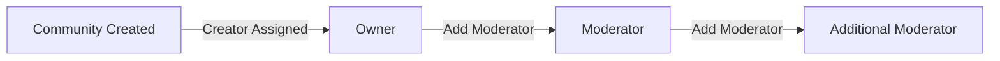

**redditCommunity — Business rules, validation constraints, data browsing expectations, error scenarios**

Business rules, validation constraints, data browsing expectations, error scenarios

# Domain Business Rules

Per-concept business rules, validation logic, and domain constraints.

## User Rules

Users must sign up with an email address and password, and choose a username that is unique across the platform. Each user has a profile containing a display name, bio text, and avatar image that can be edited by the user at any time. The username chosen during signup cannot be changed and must remain unique throughout the account lifetime. Users can change their password after account creation through the account settings. When a user deletes their account, all posts and comments created by that user are also deleted from the platform. The display name, bio, and avatar are optional profile fields that users can update independently. Email addresses must be valid format for account creation and login purposes. Password changes require the user to be authenticated with their current credentials.

### Account Creation and Username Rules

Users must sign up with an email address and password to create an account. Users must choose a username that is unique across the platform during signup. The username cannot be changed after account creation and must remain unique throughout the account lifetime. Email addresses must be in valid format for account creation. If the email format is invalid, the signup request is rejected. If the username is already taken by another user, the signup request is rejected. If the email or password is missing during signup, the request is rejected.

### Profile Editing Rules

Users can edit their display name at any time after account creation. Users can edit their bio text at any time after account creation. Users can upload or update their avatar image at any time after account creation. The display name, bio, and avatar are optional profile fields that users can update independently. If a user has not set a display name, the profile displays the username instead. If a user has not set a bio, the profile shows no bio text. If a user has not uploaded an avatar, a default avatar image is displayed on the profile.

### Password Change and Account Deletion Rules

Users can change their password after account creation through account settings. Password changes require the user to be authenticated with their current credentials. If the current password provided is incorrect, the password change request is rejected. Users can delete their account at any time. When a user deletes their account, all posts created by that user are deleted from the platform. When a user deletes their account, all comments created by that user are deleted from the platform. Account deletion is permanent and cannot be undone.

## Community Rules

Any user on the platform can create a community, and the user who creates it automatically becomes the community owner. Each community must have a unique name that cannot be duplicated by other communities. Communities require a description text field and an icon image that represent the community identity. The community name serves as the primary identifier and must be unique across all communities on the platform. Community owners have the highest authority within their community and cannot be removed by other moderators. The description text provides context about the community purpose and guidelines. Icon images visually represent communities in lists and feeds. Subscriber counts are displayed publicly on each community page.

### Community Creation Eligibility

ANY user on the platform can create a community. There are no restrictions on community creation based on account age, karma score, or subscription status.

WHEN a user creates a community, the system automatically assigns that user as the community owner. The owner assignment is permanent and cannot be transferred to another user.

Note: Community owner authority levels and moderator management capabilities are defined in the Moderator Rules section.

### Community Name Uniqueness

EACH community must have a unique name that serves as the primary identifier for the community. The community name must be unique across all communities on the platform.

IF a user attempts to create a community with a name that already exists, THEN the request is rejected. No two communities can share the same name.

The community name cannot be changed after the community is created. The name assigned at creation time remains the permanent identifier for the community.

Community names are case-sensitive for uniqueness validation. A community named "Technology" and a community named "technology" are considered distinct names and both are allowed.

### Community Identity Requirements

EACH community must have a description text field that provides context about the community purpose and guidelines. The description is required at the time of community creation.

EACH community must have an icon image that visually represents the community. The icon image is required at the time of community creation.

IF the description text is missing during community creation, THEN the request is rejected. IF the icon image is missing during community creation, THEN the request is rejected.

The description text and icon image together form the community identity representation. These elements are displayed when the community appears in lists, search results, and feeds.

### Community Subscriber Count Display

EACH community displays its subscriber count publicly on the community page. The subscriber count represents the total number of users subscribed to the community.

The subscriber count is visible to all users, including logged-out users viewing the community. The count updates as users subscribe or unsubscribe from the community.

The subscriber count is displayed as a single number without revealing the identities of individual subscribers. Users can view the count but cannot access a list of all subscribers unless explicitly provided as a separate feature.

## Post Rules

Users can only create posts in communities where they have an active subscription. Every post must have a title, which is a required field that cannot be empty. Posts must be one of three types: text posts with text content, link posts with a URL, or image posts with an uploaded image. The post type determines what additional content field is required and how the post is displayed in feeds. Users can edit their own posts after creation to update title or content. Users can delete their own posts, which removes them from the community feed. Text posts display the first 200 characters in list views. Link posts show the domain name of the URL in list displays. Image posts show a thumbnail preview in list views.

### Post Creation Requirements

Users can only create posts in communities where they have an active subscription. If the user does not have an active subscription to the community, the request is rejected.

Every post must have a title, which is required and cannot be empty. If the title is missing or empty, the request is rejected.

Posts must be one of three types: text post, link post, or image post. The user must select exactly one post type when creating a post. If no post type is specified, the request is rejected.

### Post Type Content Fields

Text posts require text content. If a text post does not include content, the request is rejected.

Link posts require a URL. If a link post does not include a URL, the request is rejected.

Image posts require an uploaded image. If an image post does not include an image, the request is rejected.

The post type determines which content field is required. Each post type has exactly one required content field in addition to the title.

### Post Edit and Delete Rules

Users can only edit their own posts. If the user is not the author of the post, the edit request is rejected.

Users can only delete their own posts. If the user is not the author of the post, the delete request is rejected.

Moderators can delete any post in their community. If the user is not a moderator of the community, the moderator delete request is rejected.

### Post Display in Feeds

Text posts display the first 200 characters of content in list views. The preview shows only the beginning portion of the full text content.

Link posts show the domain name of the URL in list displays. For example, a URL to youtube.com displays as "youtube.com".

Image posts show a thumbnail of the image in list views. The thumbnail is automatically generated from the uploaded image.

## Comment Rules

Users can write comments on any post regardless of subscription status. Users can reply to any existing comment, creating nested comment threads. There is no depth limit on comment replies, allowing unlimited nesting levels. Each comment displays the author, content, vote score, and time since posting. Users can edit their own comments after posting to correct or update content. Users can delete their own comments, which removes them from the comment thread. Comment vote scores can be positive, negative, or zero based on user votes. Replies maintain their position in the nested thread structure even after parent edits. Comment content is required and cannot be empty when creating or editing.

### Comment Creation and Content Validation

THE system SHALL allow any user to write a comment on any post regardless of subscription status.

IF the comment content is empty, THEN THE system SHALL reject the request.

IF the comment content contains only whitespace, THEN THE system SHALL reject the request.

WHEN a user creates a comment, THE system SHALL automatically associate the comment with the creating user.

WHEN a user creates a comment, THE system SHALL automatically link the comment to the target post.

### Comment Reply and Threading Rules

THE system SHALL allow users to reply to any existing comment.

WHEN a user replies to a comment, THE system SHALL create a nested thread structure with the reply as a child of the target comment.

THE system SHALL impose no depth limit on comment replies, allowing unlimited nesting levels.

WHEN a parent comment is edited, THE system SHALL preserve the position of all replies in the nested thread structure.

WHEN a comment is deleted, THE system SHALL keep its replies visible but remove the nesting relationship with the deleted comment.

### Comment Editing and Deletion Restrictions

THE system SHALL allow users to edit only their own comments.

IF a user attempts to edit another user's comment, THEN THE system SHALL reject the request.

THE system SHALL allow users to delete only their own comments.

IF a user attempts to delete another user's comment, THEN THE system SHALL reject the request.

WHEN a comment is deleted, THE system SHALL remove the comment content from the thread.

WHERE a user is a moderator of the community, THE system SHALL allow the moderator to delete any comment in their community.

### Comment Display Information

THE system SHALL display the author's username on each comment.

THE system SHALL display the time since posting on each comment (e.g., "3 hours ago").

THE system SHALL display the vote score on each comment.

THE vote score SHALL be calculated as total upvotes minus total downvotes.

THE vote score SHALL be able to be positive, negative, or zero.

THE system SHALL display the full comment content within the comment thread.

THE system SHALL make all display information visible to all users viewing the post.

## Vote Rules

Each user can cast only one vote per post or comment at any time. Upvoting a post or comment adds 1 to its vote score. Downvoting a post or comment subtracts 1 from its vote score. Users can change their vote from upvote to downvote or vice versa, which adjusts the score accordingly. Users can remove their vote entirely, which reverses the score impact. When a user upvotes content, the author's karma score increases by 1. When a user downvotes content, the author's karma score decreases by 1. Vote scores are calculated as total upvotes minus total downvotes. Karma scores can be negative if a user receives more downvotes than upvotes. Removing a vote adjusts the author's karma score back to its previous state.

### One Vote Per Content

THE system SHALL allow each user to cast only one vote per post at any time. THE system SHALL allow each user to cast only one vote per comment at any time. IF a user attempts to vote on content they have already voted on, THEN THE system SHALL replace the previous vote with the new vote. THE system SHALL NOT allow a user to have multiple active votes on the same post simultaneously. THE system SHALL NOT allow a user to have multiple active votes on the same comment simultaneously.

### Vote Score Impact

WHEN a user upvotes a post, THE system SHALL add 1 to the post's vote score. WHEN a user upvotes a comment, THE system SHALL add 1 to the comment's vote score. WHEN a user downvotes a post, THE system SHALL subtract 1 from the post's vote score. WHEN a user downvotes a comment, THE system SHALL subtract 1 from the comment's vote score. THE system SHALL calculate the vote score as total upvotes minus total downvotes. THE system SHALL display the vote score to all users viewing the content.

### Vote Modification

THE system SHALL allow users to change their vote from upvote to downvote on any post. THE system SHALL allow users to change their vote from upvote to downvote on any comment. WHEN a user changes a vote from upvote to downvote, THE system SHALL decrease the content's vote score by 2. THE system SHALL allow users to change their vote from downvote to upvote on any post. THE system SHALL allow users to change their vote from downvote to upvote on any comment. WHEN a user changes a vote from downvote to upvote, THE system SHALL increase the content's vote score by 2. THE system SHALL allow users to remove their vote entirely from any post. THE system SHALL allow users to remove their vote entirely from any comment. WHEN an upvote is removed, THE system SHALL decrease the vote score by 1. WHEN a downvote is removed, THE system SHALL increase the vote score by 1.

### Karma Score Rules

WHEN a user's post receives an upvote, THE system SHALL increase the author's karma score by 1. WHEN a user's post receives a downvote, THE system SHALL decrease the author's karma score by 1. WHEN a user's comment receives an upvote, THE system SHALL increase the author's karma score by 1. WHEN a user's comment receives a downvote, THE system SHALL decrease the author's karma score by 1. THE system SHALL allow karma scores to be negative when a user receives more downvotes than upvotes. WHEN a vote is removed from a user's content, THE system SHALL adjust the author's karma score to reverse the impact of the removed vote. WHEN a vote is changed on a user's content, THE system SHALL adjust the author's karma score to reflect the new vote value.

## Subscription Rules

Users can subscribe to any community on the platform without restriction. Users can unsubscribe from any community they are currently subscribed to at any time. Subscribing to a community is required before a user can create posts in that community. Users can view a list of all communities they are subscribed to in their profile or settings. The subscription status determines whether a user has posting privileges in a community. Users can browse and view content in communities without being subscribed. Subscription records track when a user subscribed to each community. Multiple subscriptions are allowed, with no limit on the number of communities a user can join.

### Subscription Eligibility and Validation

THE system SHALL allow any user to subscribe to any community on the platform. THE system SHALL allow users to maintain unlimited subscriptions with no restriction on the number of communities. WHEN a user subscribes to a community, THE system SHALL record the subscription timestamp. IF a user attempts to subscribe to a community they are already subscribed to, THEN THE system SHALL reject the request. THE system SHALL allow users to unsubscribe from any community they are currently subscribed to at any time. IF a user attempts to unsubscribe from a community they are not subscribed to, THEN THE system SHALL reject the request.

### Posting Privilege Enforcement

THE system SHALL verify subscription status before allowing post creation in a community. IF a user attempts to create a post in a community they are not subscribed to, THEN THE system SHALL reject the request. WHEN a user's subscription to a community is removed, THE system SHALL revoke the user's ability to create new posts in that community. THE system SHALL preserve existing posts created by a user before unsubscribing from the community.

### Community Browsing Access

THE system SHALL allow users to browse and view community content without requiring a subscription. THE system SHALL allow users to view community posts, comments, and community information regardless of subscription status. THE system SHALL allow users to view the subscriber count of any community without being subscribed. THE system SHALL restrict post and comment creation to subscribed users only while allowing all other content access without subscription.

### Subscribed Communities List Retrieval

THE system SHALL provide users with a list of all communities they are subscribed to. THE system SHALL display subscribed communities ordered by subscription timestamp with the most recently subscribed communities appearing first. IF a user has no subscriptions, THEN THE system SHALL return an empty list. THE system SHALL include the community name, description, icon, and subscriber count for each community in the subscribed list.

## Moderator Rules

The community creator is automatically assigned as the owner with the highest authority level. Owners can add new moderators to their community at any time. Owners can remove any moderator from their community, including demoting them to regular member status. Moderators can add other moderators to the community they moderate. Moderators cannot remove the community owner under any circumstances. Moderators cannot remove other moderators, only the owner has this authority. Moderator roles grant permissions to delete posts and comments within their community. Multiple moderators can exist in a single community alongside the owner. Moderator assignments are tracked with timestamps showing when each moderator was added.

### Owner Assignment and Authority

THE system SHALL automatically assign the community creator as the community owner.
THE system SHALL grant the owner the highest authority level within the community.
THE system SHALL allow multiple moderators to exist in a single community alongside the owner.
THE system SHALL record the date and time when the owner is assigned at community creation.
THE system SHALL record the date and time when each moderator is assigned to the community.
THE owner SHALL NOT be demoted or removed from their ownership role.

### Moderator Addition and Removal

THE system SHALL allow the owner to add new moderators to their community at any time.
THE system SHALL allow the owner to remove any moderator from their community.
WHEN the owner removes a moderator, THE system SHALL demote them to regular member status.
THE system SHALL allow moderators to add other moderators to the community they moderate.
IF a moderator attempts to remove the community owner, THEN THE system SHALL reject the request.
IF a moderator attempts to remove another moderator, THEN THE system SHALL reject the request.
WHEN a moderator is removed, THE system SHALL revoke all moderator permissions for that community.
THE removed moderator SHALL retain their ability to view content as a regular member.

### Moderator Content Deletion Permissions

THE system SHALL grant all moderators the ability to delete any post within their community.
THE system SHALL grant all moderators the ability to delete any comment within their community.
WHEN a moderator deletes a post, THE system SHALL permanently remove the post from the community feed.
WHEN a moderator deletes a comment, THE system SHALL permanently remove the comment and all its replies.
IF a post does not exist, THEN THE system SHALL reject the deletion request.
IF a comment does not exist, THEN THE system SHALL reject the deletion request.

### Comment Sorting Options

THE system SHALL provide comment sorting options for viewing comments within posts.
THE system SHALL support the following comment sorting options: best_new_controversial.
THE system SHALL allow moderators to view comments using any available sorting option.
THE system SHALL apply the selected sorting option consistently across all comment displays within the community.

## Ban Rules

Moderators can ban users from their community to restrict their participation. Moderators can unban previously banned users, restoring their ability to participate. Moderators can view a list of all users currently banned from their community. Banned users cannot create new posts in the community where they are banned. Banned users cannot write comments in the community where they are banned. Banned users retain the ability to view all content in the community including posts and comments. Ban status is specific to each community, not platform-wide. Ban reasons should be recorded to document the moderation action taken. Users can be banned and unbanned multiple times at moderator discretion.

### Ban Initiation

WHEN a moderator initiates a ban, THE system SHALL require the moderator to provide a ban reason as text.
THE system SHALL record the ban reason to document the moderation action taken.
Only moderators and the community owner can ban users from their community.
A user can be banned from a community regardless of their previous ban history.

### Ban Reversal

WHEN a moderator unbans a user, THE system SHALL restore the user's ability to participate in the community.
Moderators can unban any previously banned user from their community.
THE system SHALL allow users to be banned and unbanned multiple times at moderator discretion.
No limit exists on the number of ban and unban cycles for a user in a community.

### Banned Users List

THE system SHALL provide moderators with a list of all users currently banned from their community.
Moderators can view the banned users list for their community at any time.
Each entry in the banned users list SHALL show the banned user and the ban reason.

### Posting Restrictions

WHILE a user is banned from a community, THE system SHALL prevent the user from creating new posts in that community.
Banned users cannot create posts in the community where they are banned.
This restriction applies only to the specific community where the ban is active.

### Commenting Restrictions

WHILE a user is banned from a community, THE system SHALL prevent the user from writing comments in that community.
Banned users cannot write comments in the community where they are banned.
This restriction applies only to the specific community where the ban is active.

### Content Viewing Rights

WHILE a user is banned from a community, THE system SHALL allow the user to view all content in the community.
Banned users retain the ability to view posts in the community where they are banned.
Banned users retain the ability to view comments in the community where they are banned.
Ban status does not affect content visibility for the banned user.

### Ban Scope

THE system SHALL maintain ban status as specific to each community, not platform-wide.
A ban from one community does not affect the user's ability to participate in other communities.
Ban restrictions apply only to participation (posting and commenting), not to content viewing.
A user can be banned from multiple communities independently.

## Report Rules

Users can report any post or comment they encounter on the platform. When submitting a report, users must provide a reason explaining why they are reporting the content. Moderators can view all reports submitted for their community in a dedicated reports list. Each report displays the reported content, the user who submitted it, and the reason provided. Moderators can approve reports, which results in deletion of the reported content. Moderators can dismiss reports, which keeps the content and removes the report from the list. Dismissed reports are permanently removed from the report list and cannot be recovered. Reports are community-specific, with moderators only seeing reports for their own community. Report reasons must contain text explaining the violation or concern.

### Report Submission and Validation

WHEN a member reports a post, THE system SHALL accept the report. WHEN a member reports a comment, THE system SHALL accept the report. WHEN a member submits a report, THE system SHALL require a report reason containing text. IF the report reason is empty or contains only whitespace, THEN THE system SHALL reject the report. Each report SHALL be associated with the member who submitted it. Reports SHALL NOT be editable after submission. Reports SHALL NOT be withdrawable by the reporter after submission.

### Report Display for Moderators

WHEN a member with moderator privileges views reports for their community, THE system SHALL display all reports for posts and comments in that community. WHEN a member with moderator privileges views a report, THE system SHALL display the reported content in full. WHEN a member with moderator privileges views a report, THE system SHALL display the username of the member who submitted the report. WHEN a member with moderator privileges views a report, THE system SHALL display the reason provided by the reporter. For reported posts, THE system SHALL show the complete post text or link or image. For reported comments, THE system SHALL show the complete comment text. IF a member with moderator privileges attempts to view reports outside their community, THEN THE system SHALL reject the request.

### Report Resolution Actions

WHEN a member with moderator privileges approves a report, THE system SHALL delete the reported content permanently. WHEN a member with moderator privileges dismisses a report, THE system SHALL keep the reported content visible. WHEN a report is dismissed, THE system SHALL remove the report from the report list permanently. WHEN a report is approved, THE system SHALL remove the report from the report list permanently. Dismissed reports SHALL NOT be recoverable. Reports SHALL be scoped to the community where the reported content exists. Reports for posts SHALL belong to the community where the post was created. Reports for comments SHALL belong to the community where the parent post was created.

# Data Browsing Expectations

Business expectations for how users browse, find, and navigate through lists of data.

## List Browsing Expectations

Define business expectations for how users find, filter, and browse lists.

### Post Feed Filtering

THE Home Feed SHALL show posts only from communities the user is subscribed to.
THE Home Feed SHALL be available only to logged-in users.
THE Popular Feed SHALL show posts from all communities across the platform.
THE Popular Feed SHALL be available to all users, including logged-out users.
THE Community Feed SHALL show posts from one specific community only.
THE Community Feed SHALL be available to all users, including logged-out users.
Users SHALL be able to search for communities by name.
WHEN searching for communities, THE system SHALL match against community names.
IF a user is not subscribed to any communities, THEN THE Home Feed SHALL show no posts.
IF a community has no posts, THEN THE Community Feed SHALL show no posts.

### Post Feed Sorting

THE Hot sorting option SHALL display recent posts with many upvotes first.
THE New sorting option SHALL display the most recently created posts first.
THE Top sorting option SHALL display posts with the highest vote score first.
THE Top sorting option SHALL include a time filter with options: today, this week, this month, this year, and all time.
THE Controversial sorting option SHALL display posts with many votes but a vote score close to zero first.
All post feeds SHALL support Hot, New, Top, and Controversial sorting options.
THE Best sorting option for comments SHALL display comments with the highest vote score first.
THE New sorting option for comments SHALL display the most recently created comments first.
THE Controversial sorting option for comments SHALL display comments with many votes but a vote score close to zero first.
Comments on a post SHALL support best, new, controversial sorting options.

### List Pagination

All post feeds SHALL be paginated.
Users SHALL be able to navigate through pages of posts in any feed.
Each page SHALL display a subset of the total posts.
Users SHALL be able to move to the next page to view more posts.
Users SHALL be able to move to the previous page if not on the first page.
IF a feed contains no posts, THEN pagination controls SHALL not be shown.
IF all posts fit on a single page, THEN pagination controls SHALL not be shown.
Community lists SHALL be paginated when browsing all communities.
Users SHALL be able to navigate through pages of communities in the browse list.

# Error Conditions

Business error scenarios and how the system should respond.

## Error Scenarios

Describe error conditions and expected system responses in natural language.

### Account and Authentication Errors

IF a user attempts to sign up with an email that is already registered, THEN the request is rejected.

IF a user attempts to sign up with a username that is already taken, THEN the request is rejected.

IF a user attempts to log in with incorrect email or password, THEN the request is rejected.

IF a user attempts to change their password without providing valid current credentials, THEN the request is rejected.

IF a user attempts to access their account after deletion, THEN the request is rejected and all associated posts and comments are no longer accessible.

### Community Operation Errors

IF a user attempts to create a community with a name that already exists, THEN the request is rejected.

IF a user attempts to create a post in a community they are not subscribed to, THEN the request is rejected.

IF a banned user attempts to create a post in the community where they are banned, THEN the request is rejected.

IF a banned user attempts to write a comment in the community where they are banned, THEN the request is rejected.

IF a user attempts to view a community that does not exist, THEN the request is rejected.

### Post and Comment Operation Errors

IF a user attempts to create a post without providing a title, THEN the request is rejected.

IF a user attempts to create a post without selecting one of the three valid types (text, link, or image), THEN the request is rejected.

IF a user attempts to edit or delete a post they did not author, THEN the request is rejected.

IF a user attempts to edit or delete a comment they did not author, THEN the request is rejected.

IF a user attempts to view a post that does not exist, THEN the request is rejected.

IF a user attempts to view a comment that does not exist, THEN the request is rejected.

### Voting and Subscription Errors

IF a user attempts to vote on a post or comment more than once without changing their existing vote, THEN the request is rejected.

IF a user attempts to change their vote to the same vote type they already cast, THEN the request is rejected.

IF a user attempts to subscribe to a community that does not exist, THEN the request is rejected.

IF a user attempts to unsubscribe from a community they are not subscribed to, THEN the request is rejected.

IF a guest user attempts to access the home feed, THEN the request is rejected as the home feed is only available to logged-in users.

### Moderation and Ban Errors

IF a moderator attempts to remove the community owner, THEN the request is rejected.

IF a moderator attempts to remove another moderator, THEN the request is rejected as only the owner can remove moderators.

IF a user attempts to add a moderator without having owner or moderator privileges, THEN the request is rejected.

IF a moderator attempts to ban the community owner, THEN the request is rejected.

IF a user attempts to delete a post or comment in a community where they are not a moderator or owner, THEN the request is rejected.

IF a user attempts to view the banned users list without moderator privileges, THEN the request is rejected.

### Reporting Errors

IF a user attempts to report a post or comment without providing a reason, THEN the request is rejected.

IF a user attempts to view reports for a community where they are not a moderator, THEN the request is rejected.

IF a moderator attempts to approve or dismiss a report that does not exist, THEN the request is rejected.

IF a user attempts to report content that does not exist, THEN the request is rejected.

# File Validation Rules

Validation rules and policies for file uploads and storage.

## File Validation and Policies

Define file type restrictions, virus scanning requirements, content validation, and retention policies for uploaded files.

### Image File Validation

Users can upload an avatar image for their profile.
Users can upload an icon image when creating a community.
Users can upload an image when creating an image post.
The system validates that uploaded files are valid images.
If the uploaded file is not a valid image, the upload is rejected.
If the image upload fails, the request is rejected.
If the user attempts to upload a file when creating an image post and the upload fails, the post creation is rejected.
If a user attempts to upload an avatar image and the file is invalid, the upload is rejected.
If a user attempts to upload a community icon image and the file is invalid, the upload is rejected.
If the image file cannot be processed, the user is notified of the upload failure.