# Prisma Markdown

> Generated by [`prisma-markdown`](https://github.com/samchon/prisma-markdown)

- [authorization](#authorization)
- [customer](#customer)
- [seller](#seller)
- [administrator](#administrator)
- [category](#category)
- [product](#product)
- [inventory](#inventory)
- [shopping](#shopping)
- [order](#order)
- [post_purchase](#post_purchase)
- [review](#review)

## authorization

```mermaid
erDiagram
"shopping_mall_guests" {
  String id PK
  String device_fingerprint UK
  DateTime created_at
  DateTime updated_at
  DateTime deleted_at "nullable"
}
"shopping_mall_guest_sessions" {
  String id PK
  String shopping_mall_guest_id FK
  String ip
  String href
  String referrer
  DateTime created_at
  DateTime expired_at
}
"shopping_mall_members" {
  String id PK
  String email UK
  String password_hash
  String status
  DateTime created_at
  DateTime updated_at
  DateTime deleted_at "nullable"
}
"shopping_mall_member_sessions" {
  String id PK
  String shopping_mall_member_id FK
  String ip
  String href
  String referrer
  String access_token
  String refresh_token
  DateTime created_at
  DateTime expired_at
}
"shopping_mall_member_password_resets" {
  String id PK
  String shopping_mall_member_id FK
  String token UK
  DateTime expires_at
  DateTime used_at "nullable"
  DateTime created_at
  DateTime updated_at
}
"shopping_mall_member_email_verifications" {
  String id PK
  String shopping_mall_member_id FK
  String token UK
  DateTime expires_at
  DateTime verified_at "nullable"
  DateTime created_at
  DateTime updated_at
  DateTime deleted_at "nullable"
}
"shopping_mall_sellers" {
  String id PK
  String email UK
  String password_hash
  String approval_status
  String rejection_reason "nullable"
  DateTime created_at
  DateTime updated_at
  DateTime deleted_at "nullable"
}
"shopping_mall_seller_sessions" {
  String id PK
  String shopping_mall_seller_id FK
  String ip
  String href
  String referrer
  DateTime created_at
  DateTime expired_at
}
"shopping_mall_seller_password_resets" {
  String id PK
  String shopping_mall_seller_id FK
  String token UK
  DateTime expires_at
  DateTime created_at
}
"shopping_mall_seller_email_verifications" {
  String id PK
  String shopping_mall_seller_id FK
  String token UK
  String email
  DateTime expires_at
  DateTime verified_at "nullable"
  DateTime created_at
  DateTime updated_at
  DateTime deleted_at "nullable"
}
"shopping_mall_admins" {
  String id PK
  String member_id FK,UK
  String email UK
  String password_hash
  String grade
  DateTime banned_at "nullable"
  DateTime created_at
  DateTime updated_at
  DateTime deleted_at "nullable"
}
"shopping_mall_admin_sessions" {
  String id PK
  String shopping_mall_admin_id FK
  String access_token
  String refresh_token
  String ip
  String href
  String referrer
  DateTime created_at
  DateTime expired_at
}
"shopping_mall_admin_password_resets" {
  String id PK
  String shopping_mall_admin_id FK
  String token UK
  DateTime expires_at
  DateTime created_at
  DateTime used_at "nullable"
}
"shopping_mall_admin_audit_logs" {
  String id PK
  String shopping_mall_admin_id FK
  String action_type
  String target_entity_type
  String target_entity_id
  String action_details
  String ip_address
  String user_agent
  DateTime created_at
}
"shopping_mall_super_admins" {
  String id PK
  String email UK
  String password_hash
  DateTime created_at
  DateTime updated_at
  DateTime deleted_at "nullable"
}
"shopping_mall_super_admin_sessions" {
  String id PK
  String shopping_mall_super_admin_id FK
  String ip
  String href
  String referrer
  DateTime created_at
  DateTime expired_at
}
"shopping_mall_super_admin_password_resets" {
  String id PK
  String shopping_mall_super_admin_id FK
  String token UK
  DateTime expires_at
  DateTime created_at
  DateTime used_at "nullable"
}
"shopping_mall_super_admin_audit_logs" {
  String id PK
  String super_admin_id FK
  String action_type
  String target_model
  String target_id "nullable"
  String ip_address
  String user_agent
  String request_body "nullable"
  Int response_status
  DateTime created_at
  DateTime updated_at
  DateTime deleted_at "nullable"
}
"shopping_mall_guest_sessions" }o--|| "shopping_mall_guests" : guest
"shopping_mall_member_sessions" }o--|| "shopping_mall_members" : member
"shopping_mall_member_password_resets" }o--|| "shopping_mall_members" : member
"shopping_mall_member_email_verifications" }o--|| "shopping_mall_members" : member
"shopping_mall_seller_sessions" }o--|| "shopping_mall_sellers" : seller
"shopping_mall_seller_password_resets" }o--|| "shopping_mall_sellers" : seller
"shopping_mall_seller_email_verifications" }o--|| "shopping_mall_sellers" : seller
"shopping_mall_admins" |o--|| "shopping_mall_members" : member
"shopping_mall_admin_sessions" }o--|| "shopping_mall_admins" : admin
"shopping_mall_admin_password_resets" }o--|| "shopping_mall_admins" : admin
"shopping_mall_admin_audit_logs" }o--|| "shopping_mall_admins" : admin
"shopping_mall_super_admin_sessions" }o--|| "shopping_mall_super_admins" : superAdmin
"shopping_mall_super_admin_password_resets" }o--|| "shopping_mall_super_admins" : superAdmin
"shopping_mall_super_admin_audit_logs" }o--|| "shopping_mall_super_admins" : superAdmin
```

### `shopping_mall_guests`

Temporary guest accounts identified by device fingerprint for
unauthenticated browsing access.

Guest accounts provide limited platform access without requiring full
registration. Each guest is uniquely identified by their device
fingerprint, enabling session management and cart persistence across page
views. Guest accounts can be upgraded to full customer accounts through
the registration process.

Properties as follows:

- `id`: Primary Key.
- `device_fingerprint`
  > Unique device identifier for guest recognition.
  >
  > Generated from browser/device characteristics to identify returning
  > guests without authentication. Used to associate guest sessions and
  > shopping cart data with the correct guest account.
- `created_at`: Timestamp of guest account creation.
- `updated_at`: Timestamp of last guest account update.
- `deleted_at`: Timestamp of soft deletion, null if active.

### `shopping_mall_guest_sessions`

Temporary session tokens for guest access with short expiration times.

This table stores JWT session tokens for unauthenticated guest users
identified by device fingerprint. Guest sessions have shorter expiration
times compared to registered user sessions for security purposes.

Sessions are created when a guest first accesses the platform and are
validated on each request. Sessions expire automatically based on the
expired_at timestamp and are cleaned up periodically.

Properties as follows:

- `id`: Primary Key.
- `shopping_mall_guest_id`
  > Reference to the guest account that owns this session.
  >
  > Each guest session belongs to exactly one [shopping_mall_guests](#shopping_mall_guests)
  > record. This foreign key establishes the ownership relationship between
  > the session and the guest actor.
- `ip`
  > IP address of the client device that created this session.
  >
  > Used for security monitoring and session validation. Helps detect
  > suspicious activity such as session hijacking attempts from different IP
  > addresses.
- `href`
  > The URL path where the guest session was initiated.
  >
  > Tracks the entry point for analytics and security audit purposes. Useful
  > for understanding user behavior and detecting abnormal access patterns.
- `referrer`
  > The referrer URL that led to this session creation.
  >
  > Captures the traffic source for analytics. Helps understand how guests
  > discover the platform (search engines, direct links, social media, etc.).
- `created_at`
  > Timestamp when this session was created.
  >
  > Records the exact time of session initiation. Used for session age
  > calculation and audit trail purposes.
- `expired_at`
  > Timestamp when this session expires and becomes invalid.
  >
  > Guest sessions have shorter expiration times for security. After this
  > timestamp, the session token is rejected and the guest must create a new
  > session. NOT NULL for security enforcement.

### `shopping_mall_members`

Registered customer accounts with email/password authentication and
account status tracking.

This table serves as the primary authentication entity for customers on
the platform. Each member account is created during registration with
email and password credentials, and supports login, password reset, and
email verification flows through related child tables.

Account status controls access: active members can use all customer
features, banned members cannot log in (administrator action), and
deleted members have soft-deleted accounts while preserving order history
and reviews for legal and seller record purposes.

Profile information (display name, phone number) is stored in {@link
shopping_mall_customer_profiles} for normalization, as not all members
may have completed profile setup. Session management is handled by {@link
shopping_mall_member_sessions}, password resets by {@link
shopping_mall_member_password_resets}, and email verification by {@link
shopping_mall_member_email_verifications}.

Properties as follows:

- `id`: Primary Key. Unique identifier for each customer account.
- `email`
  > Customer email address used for authentication and communication.
  >
  > This field serves as the primary login credential alongside password.
  > Must be unique across all member accounts. Used for password reset
  > emails, order confirmations, and platform notifications. Email
  > verification is required through {@link
  > shopping_mall_member_email_verifications} before full account activation.
- `password_hash`
  > Bcrypt hashed password for authentication.
  >
  > Stores the securely hashed version of the customer's password. Never
  > stores plain text passwords. Used during login to verify credentials.
  > Customers can change their password through the password reset flow using
  > [shopping_mall_member_password_resets](#shopping_mall_member_password_resets).
- `status`
  > Account status controlling access permissions.
  >
  > Three states: 'active' (normal operation), 'banned' (administrator action
  > preventing login), 'deleted' (soft delete preserving order history).
  > Banned members cannot log in but their data remains for order/seller
  > records. Deleted members have requested account deletion - profile is
  > removed but orders and reviews are preserved as required by business
  > rules.
- `created_at`: Account creation timestamp. Records when the customer registered.
- `updated_at`
  > Last modification timestamp. Updated on any account change including
  > status updates and password changes.
- `deleted_at`
  > Soft delete timestamp. Set when customer requests account deletion.
  > Account is logically deleted but orders and reviews are preserved for
  > legal and seller record purposes.

### `shopping_mall_member_sessions`

JWT session tokens for customer authentication with access and refresh
token support.

Tracks active login sessions for registered customers. Each session
stores the access and refresh tokens along with client context
information for security auditing.

Sessions are created upon successful login and expire based on token
expiration time. Expired sessions are automatically invalidated. Multiple
concurrent sessions per customer are supported.

Properties as follows:

- `id`: Primary Key.
- `shopping_mall_member_id`
  > Reference to the member account that owns this session.
  >
  > Establishes the relationship between a session and its parent {@link
  > shopping_mall_members} account. Each session belongs to exactly one
  > member.
- `ip`
  > Client IP address at the time of session creation.
  >
  > Used for security auditing and session validation. Helps detect
  > suspicious login activity from different locations.
- `href`
  > Current page URL where the session was initiated.
  >
  > Tracks the entry point for the session for analytics and security
  > purposes.
- `referrer`
  > Referring page URL that led to the session creation.
  >
  > Provides context about the navigation path that resulted in login.
- `access_token`
  > JWT access token for API authentication.
  >
  > Short-lived token used for authenticating API requests. Stored for token
  > revocation and audit purposes.
- `refresh_token`
  > JWT refresh token for obtaining new access tokens.
  >
  > Long-lived token used to refresh expired access tokens without requiring
  > re-authentication. Stored securely for validation.
- `created_at`
  > Timestamp when the session was created.
  >
  > Records the exact time of login for auditing and session management.
- `expired_at`
  > Timestamp when the session expires.
  >
  > Determines session validity. Sessions are automatically invalidated after
  > this time for security.

### `shopping_mall_member_password_resets`

Password reset tokens for customer account recovery with expiration and
usage tracking.

This table stores temporary password reset tokens generated when members
request password recovery. Each token is unique and expires after a
configured time period for security. The token is consumed when used to
reset the password, recorded in the used_at field.

Tokens are linked to [shopping_mall_members](#shopping_mall_members) via foreign key.
Multiple reset requests can exist per member (e.g., if they request
multiple times), but only the most recent unexpired token should be
valid. Expired or used tokens are ignored during password reset
validation.

Properties as follows:

- `id`: Primary Key.
- `shopping_mall_member_id`
  > Reference to the member account requesting password reset.
  >
  > Links this password reset token to the [shopping_mall_members](#shopping_mall_members)
  > account that initiated the recovery request. Multiple reset tokens can
  > exist for the same member if they request password reset multiple times.
- `token`
  > Unique password reset token sent to the member's email.
  >
  > This is a cryptographically secure random string included in the password
  > reset email link. The token is used to validate the password reset
  > request. It must be unique across all reset tokens to prevent collisions.
- `expires_at`
  > Timestamp when this reset token becomes invalid.
  >
  > Password reset tokens have a limited validity period (typically 1-24
  > hours) for security. After this timestamp, the token cannot be used to
  > reset the password even if it has not been used yet.
- `used_at`
  > Timestamp when this reset token was consumed to reset the password.
  >
  > Nullable field that records when the token was successfully used. Once
  > set, the token cannot be used again. This prevents token reuse attacks
  > and enables audit tracking of password reset completion.
- `created_at`: Timestamp when this password reset token was created.
- `updated_at`: Timestamp when this password reset token record was last updated.

### `shopping_mall_member_email_verifications`

Email verification tokens for customer registration confirmation.

Stores verification tokens sent to customer email addresses during the
registration process. Each token is unique and expires after a configured
time period (typically 24 hours). When the customer clicks the
verification link, the token is validated and marked as verified.

Tokens are single-use: once verified, they cannot be used again. Expired
tokens are automatically rejected during verification. Multiple
unverified tokens can exist for the same member, but only the latest one
should be used for verification.

Properties as follows:

- `id`: Primary Key.
- `shopping_mall_member_id`
  > References the member account this verification token belongs to.
  >
  > Links to [shopping_mall_members](#shopping_mall_members) to associate the verification
  > token with a specific customer account. The member record is created
  > during registration but remains unverified until this token is validated.
- `token`
  > Unique verification token sent to the customer's email address.
  >
  > Generated as a cryptographically secure random string during
  > registration. This token is included in the verification email link and
  > validated when the customer clicks it. Must be unique across all
  > verification records.
- `expires_at`
  > Token expiration timestamp after which the token is invalid.
  >
  > Set at token creation time (typically 24 hours from creation). Tokens
  > past this timestamp cannot be used for verification. Expired tokens
  > should be cleaned up periodically.
- `verified_at`
  > Timestamp when the token was successfully verified.
  >
  > Null until the customer clicks the verification link and the token is
  > validated. Once set, the token cannot be used again. Used to prevent
  > token reuse and track verification completion.
- `created_at`: Timestamp when the verification token was created.
- `updated_at`
  > Timestamp when the verification token was last updated.
  >
  > Updated when the token is verified or when any field is modified. Used
  > for audit trail and tracking token lifecycle.
- `deleted_at`
  > Timestamp when the verification token was soft deleted.
  >
  > Used for audit trail and compliance. Tokens are soft deleted after
  > successful verification or expiration to maintain records.

### `shopping_mall_sellers`

Seller accounts with email/password authentication and approval status
tracking.

This table represents seller user accounts on the platform. Sellers must
be approved by an administrator before they can list products and process
orders. The approval workflow tracks registration requests through
pending, approved, and rejected states.

Authentication: Sellers authenticate using email and password_hash. Email
must be unique across all seller accounts.

Approval Workflow: New registrations start with approval_status
'pending'. Administrators review and either approve (status becomes
'approved') or reject (status becomes 'rejected' with rejection_reason
populated). Rejected sellers can submit new registration requests.

Account Lifecycle: Sellers can delete their accounts only when they have
no pending orders or cancellation/refund requests. Soft delete is
supported via deleted_at field.

Properties as follows:

- `id`: Primary Key.
- `email`
  > Seller's email address used for authentication and communication.
  >
  > This field serves as the unique identifier for seller login. Must be
  > unique across all seller accounts. Used for password reset flows and
  > platform notifications.
- `password_hash`
  > Bcrypt-hashed password for seller authentication.
  >
  > Never store plain text passwords. This field contains the hashed value
  > generated during registration or password change. Compared against
  > provided password during login authentication.
- `approval_status`
  > Current approval status of the seller account.
  >
  > Tracks where the seller is in the approval workflow: 'pending' for new
  > registrations awaiting admin review, 'approved' for sellers who can list
  > products and process orders, 'rejected' for applications denied by
  > administrators. Status changes trigger notifications to the seller.
- `rejection_reason`
  > Administrator-provided reason for rejecting the seller application.
  >
  > Populated only when approval_status is 'rejected'. Provides feedback to
  > the seller explaining why their application was denied. Sellers can use
  > this information when submitting a new registration request. Null for
  > pending or approved sellers.
- `created_at`
  > Timestamp when the seller account was created.
  >
  > Records the initial registration time. Used for account age calculations
  > and audit purposes. Set once during account creation and never modified.
- `updated_at`
  > Timestamp when the seller account was last modified.
  >
  > Updated on any change to the seller record including approval status
  > changes, password updates, or profile modifications. Used for tracking
  > account activity and data freshness.
- `deleted_at`
  > Timestamp when the seller account was soft deleted.
  >
  > Null for active accounts. Set when a seller deletes their account (only
  > allowed when no pending orders or requests exist). Soft delete preserves
  > order history and snapshots for legal and business record purposes.

### `shopping_mall_seller_sessions`

Login session tracking for seller authentication with connection metadata
and expiration.

Records each successful seller login as a session entry with client
information and validity period. Sessions are validated on each
authenticated request and automatically rejected when expired.

Supports security auditing through IP address tracking and session
lifecycle management. Sessions belong to exactly one {@link
shopping_mall_sellers} and sellers can have multiple concurrent sessions
across different devices.

Properties as follows:

- `id`: Primary Key.
- `shopping_mall_seller_id`
  > References the seller account that owns this session.
  >
  > Establishes ownership relationship between session and seller. Each
  > session belongs to exactly one seller, enabling session lookup and
  > invalidation by seller account.
- `ip`
  > IP address of the client that created this session.
  >
  > Captured at login time for security auditing and anomaly detection. Used
  > to identify suspicious login patterns or unauthorized access attempts
  > from unfamiliar locations.
- `href`
  > URL of the page where the login was initiated.
  >
  > Records the entry point for the authentication flow. Useful for
  > redirecting sellers back to their intended destination after successful
  > login.
- `referrer`
  > HTTP referrer header from the login request.
  >
  > Indicates the source of the login request for security analysis and
  > traffic attribution.
- `created_at`
  > Timestamp when this session was created.
  >
  > Records the exact time of successful authentication. Used for session age
  > calculations, audit trails, and sorting sessions by recency.
- `expired_at`
  > Timestamp when this session expires.
  >
  > Determines the validity period of the session. Sessions past this
  > timestamp are automatically rejected. Typically set to 7-30 days from
  > creation for seller sessions.

### `shopping_mall_seller_password_resets`

Password reset tokens with expiration for seller account recovery.

This table stores temporary password reset tokens generated when sellers
request password recovery. Each token is single-use and expires after a
configured time period for security. When a seller requests password
reset, a new token record is created and sent to their registered email.
The token is validated and deleted upon successful password change.

Properties as follows:

- `id`: Primary key for the password reset token record.
- `shopping_mall_seller_id`
  > References the seller account requesting password reset.
  >
  > This foreign key links the password reset token to the seller account
  > that initiated the password recovery request. Each seller can have
  > multiple password reset tokens over time, but typically only one active
  > token at a time.
- `token`
  > The password reset token string sent to the seller's email.
  >
  > This is a secure random token generated when the seller requests password
  > reset. The token should be unique, URL-safe, and have sufficient entropy
  > to prevent guessing. It is validated when the seller clicks the reset
  > link and submits a new password.
- `expires_at`
  > The expiration datetime when this password reset token becomes invalid.
  >
  > Password reset tokens must expire for security reasons. Typical
  > expiration is 1-24 hours from creation. After this time, the token cannot
  > be used and the seller must request a new password reset link.
- `created_at`: Timestamp when the password reset token was created.

### `shopping_mall_seller_email_verifications`

Email verification tokens for seller registration confirmation.

Stores verification tokens sent to seller email addresses during the
registration process. Tokens are single-use and expire after a configured
time period. Once verified, the token is marked with verified_at
timestamp.

Related to [shopping_mall_sellers](#shopping_mall_sellers) through foreign key
relationship. Each seller can have multiple verification attempts
recorded.

Properties as follows:

- `id`: Primary Key.
- `shopping_mall_seller_id`
  > References the seller account being verified.
  >
  > Links this verification token to the seller account that requested email
  > verification. Used to update seller approval status upon successful
  > verification.
- `token`
  > Unique verification token sent to seller email.
  >
  > Random secure token included in the verification email link. Used to
  > validate the email ownership when seller clicks the verification link.
- `email`
  > Email address being verified.
  >
  > The email address to which the verification token was sent. Stored for
  > audit purposes and to match against seller account email.
- `expires_at`
  > Token expiration timestamp.
  >
  > The deadline by which the seller must verify their email. After this
  > time, the token becomes invalid and a new verification must be requested.
- `verified_at`
  > Email verification completion timestamp.
  >
  > Records when the seller successfully verified their email by clicking the
  > verification link. Null if not yet verified or if verification expired.
- `created_at`: Record creation timestamp.
- `updated_at`: Record last update timestamp.
- `deleted_at`: Soft delete timestamp.

### `shopping_mall_admins`

Regular administrator accounts with email/password authentication and
grade level tracking.

This table represents administrator user accounts that extend from member
accounts through a promotion workflow. When a member is approved for
administrator status, a record is created here with
administrator-specific credentials and permissions.

The grade field distinguishes between regular administrators and super
administrators, with super administrators having elevated privileges
including the ability to approve administrator promotion requests,
promote regular administrators to super administrators, and demote other
super administrators (but not themselves).

Administrators can be banned by other administrators, which prevents
login while preserving historical data and audit trails. The banned_at
timestamp tracks when the ban was applied.

Properties as follows:

- `id`: Primary key for the administrator account.
- `member_id`
  > Reference to the underlying member account that was promoted to
  > administrator.
  >
  > This establishes a 1:1 relationship with [shopping_mall_members](#shopping_mall_members),
  > ensuring each administrator account is tied to exactly one member
  > account. The member account provides the base identity, while this table
  > adds administrator-specific authentication and permissions.
  >
  > When a member is approved for administrator status through the {@link
  > shopping_mall_admin_promotion_requests} workflow, a record is created
  > here linking to their member account.
- `email`
  > Administrator email address used for login authentication.
  >
  > This email must be unique across all administrator accounts and is used
  > as the primary identifier during the login process. The email is stored
  > here separately from the member email to allow administrators to use a
  > different email for administrative access if needed.
- `password_hash`
  > Bcrypt-hashed password for administrator authentication.
  >
  > This hash is generated using bcrypt with appropriate salt rounds during
  > registration or password change. The hash is never exposed through APIs
  > and is only used for authentication verification during login.
- `grade`
  > Administrator grade level determining permission scope.
  >
  > Values are 'regular' for standard administrators or 'super' for super
  > administrators. Super administrators have elevated privileges including
  > the ability to approve administrator promotion requests, promote regular
  > administrators to super administrators, and demote other super
  > administrators (but not themselves).
- `banned_at`
  > Timestamp when the administrator account was banned, null if active.
  >
  > When set by another administrator, this prevents the banned administrator
  > from logging in while preserving all historical data and audit trails.
  > Banned administrators cannot access any administrative functions but
  > their past actions remain in the audit logs.
- `created_at`
  > Timestamp when the administrator account was created (approved for admin
  > status).
- `updated_at`: Timestamp when the administrator account was last modified.
- `deleted_at`: Soft delete timestamp, null if the account is active.

### `shopping_mall_admin_sessions`

JWT session tokens for administrator authentication with access and
refresh token support.

Stores active login sessions for administrators including access and
refresh tokens for JWT-based authentication. Sessions are tracked for
security auditing and can be expired or revoked.

References [shopping_mall_admins](#shopping_mall_admins) for the administrator owner. Each
session belongs to exactly one administrator and is invalidated when the
administrator account is deleted or banned.

Properties as follows:

- `id`: Primary Key.
- `shopping_mall_admin_id`
  > References the administrator who owns this session.
  >
  > Establishes ownership relationship to [shopping_mall_admins](#shopping_mall_admins). Each
  > session belongs to exactly one administrator and is invalidated when the
  > administrator account is deleted or banned.
- `access_token`
  > JWT access token for API authentication.
  >
  > Short-lived token used for authenticating API requests. Typically expires
  > within 15-30 minutes and must be refreshed using the refresh_token.
- `refresh_token`
  > JWT refresh token for obtaining new access tokens.
  >
  > Long-lived token used to request new access tokens without
  > re-authentication. Stored securely and rotated on each use for enhanced
  > security.
- `ip`
  > IP address of the client at session creation.
  >
  > Captured at login time for security auditing and suspicious activity
  > detection. Used to identify potentially unauthorized access from
  > unfamiliar locations.
- `href`
  > URL path where the login was initiated.
  >
  > Records the entry point of the authentication flow for analytics and
  > security monitoring. Helps track which parts of the application trigger
  > login flows.
- `referrer`
  > HTTP referrer header at session creation.
  >
  > Captures the referring page or external source that led to the login.
  > Useful for understanding authentication flow patterns and detecting
  > suspicious referral sources.
- `created_at`
  > Timestamp when the session was created.
  >
  > Records the exact time of successful authentication. Used for session age
  > calculation, audit trails, and identifying patterns in administrator
  > login behavior.
- `expired_at`
  > Timestamp when the session expires.
  >
  > Determines the maximum validity period for this session. Sessions are
  > automatically invalidated after this time, requiring re-authentication.
  > Critical for security compliance and limiting exposure from compromised
  > tokens.

### `shopping_mall_admin_password_resets`

Password reset tokens with expiration for administrator account recovery.

Stores temporary tokens generated when administrators request password
resets. Tokens are single-use and expire after a configured time period
for security.

Each token is linked to exactly one [shopping_mall_admins](#shopping_mall_admins) account.
When an admin requests a password reset, a new token record is created
with a unique token string and expiration time. The token is sent to the
admin's registered email address.

Tokens can only be used once. After successful password reset, the
used_at timestamp is recorded and the token becomes invalid. Tokens also
become invalid after expires_at is reached, requiring the admin to submit
a new reset request.

Properties as follows:

- `id`: Primary Key.
- `shopping_mall_admin_id`
  > References the administrator account requesting password reset.
  >
  > Links to [shopping_mall_admins](#shopping_mall_admins) table to identify which admin
  > account this reset token belongs to. Multiple reset tokens can exist for
  > the same admin (e.g., if they request multiple resets before using one),
  > but only the most recent unused token should be considered valid.
- `token`
  > Unique password reset token sent to administrator's email.
  >
  > Generated as a secure random string when reset is requested. Used exactly
  > once to authenticate the password reset request. Must be unique across
  > all password reset records to prevent token collision attacks.
- `expires_at`
  > Token expiration timestamp.
  >
  > Password reset tokens are time-limited for security. After this time, the
  > token becomes invalid and a new reset request must be made. Typically set
  > to 1-24 hours from creation time depending on security policy.
- `created_at`: Record creation timestamp.
- `used_at`
  > Timestamp when token was consumed for password reset.
  >
  > Null if token has not been used. Once set, token cannot be used again
  > even if not expired. Provides audit trail of token usage.

### `shopping_mall_admin_audit_logs`

Immutable audit trail recording all administrator actions for security
compliance and accountability.

Tracks every administrative operation including seller approvals,
category management, product oversight, order interventions, and user
management. Each log entry captures the administrator who performed the
action, the type of action, the target entity affected, and contextual
information like IP address and user agent.

This table is append-only - records are never updated or deleted to
maintain a complete historical record for compliance audits and dispute
resolution. Administrators and super administrators can query this table
to review past actions.

Properties as follows:

- `id`: Primary Key.
- `shopping_mall_admin_id`
  > References the administrator who performed the audited action.
  >
  > Links to [shopping_mall_admins](#shopping_mall_admins) to identify which administrator
  > account executed the action. This foreign key establishes accountability
  > for all administrative operations recorded in this audit trail.
- `action_type`
  > Type of administrative action performed.
  >
  > Categorizes the operation for filtering and reporting. Common values
  > include: 'create', 'update', 'delete', 'approve', 'reject', 'suspend',
  > 'unsuspend', 'ban', 'unban', 'promote', 'demote', 'force_cancel',
  > 'force_refund'. This field enables quick filtering of audit logs by
  > action category.
- `target_entity_type`
  > Type of entity that was affected by the administrative action.
  >
  > Identifies which domain entity was modified, such as: 'seller',
  > 'product', 'category', 'customer', 'order', 'order_item',
  > 'administrator'. Used together with target_entity_id to locate the
  > specific record that was affected.
- `target_entity_id`
  > UUID of the specific entity record that was affected.
  >
  > Stores the primary key of the target entity that was created, updated,
  > deleted, or otherwise modified. Combined with target_entity_type, this
  > identifies the exact record impacted by the administrative action.
- `action_details`
  > Detailed description of what changes were made during the action.
  >
  > Contains human-readable information about the specific modifications,
  > such as field values before and after changes, approval/rejection
  > reasons, or other contextual details. This field provides the substantive
  > content of what occurred beyond the basic action type classification.
- `ip_address`
  > IP address from which the administrative action was performed.
  >
  > Captures the network origin of the request for security monitoring and
  > forensic analysis. Helps identify suspicious access patterns or
  > unauthorized access attempts from unexpected locations.
- `user_agent`
  > User agent string from the client that performed the action.
  >
  > Records browser or client application information for security auditing.
  > Useful for detecting automated attacks, identifying compromised sessions,
  > or understanding the context of administrative actions.
- `created_at`
  > Timestamp when the administrative action was performed and logged.
  >
  > Records the exact time the action occurred, establishing a chronological
  > audit trail. Used for sorting audit logs, investigating incidents within
  > specific time windows, and compliance reporting.

### `shopping_mall_super_admins`

Super administrator accounts with email/password authentication and
elevated privileges.

Super administrators possess the highest level of system access, capable
of managing administrator grades, approving admin promotion requests, and
performing all platform oversight functions. They can promote regular
administrators to super administrator and demote other super
administrators (but not themselves).

Authentication is handled through email and password with JWT session
tokens stored in [shopping_mall_super_admin_sessions](#shopping_mall_super_admin_sessions). Password
recovery uses [shopping_mall_super_admin_password_resets](#shopping_mall_super_admin_password_resets). All
administrative actions are logged in {@link
shopping_mall_super_admin_audit_logs} for security compliance.

Properties as follows:

- `id`: Primary Key.
- `email`
  > Unique email address for authentication and account identification.
  >
  > Serves as the primary login credential for super administrators. Must be
  > unique across all super administrator accounts. Used for password reset
  > communications and account notifications.
- `password_hash`
  > Bcrypt-hashed password for secure authentication.
  >
  > Never stores plain text passwords. Hash is verified during login to
  > generate JWT session tokens. Must be updated through secure password
  > change flow.
- `created_at`
  > Timestamp when the super administrator account was created.
  >
  > Automatically set on account creation. Used for audit trails and account
  > age verification.
- `updated_at`
  > Timestamp of the last account modification.
  >
  > Updated on every profile change including email updates and password
  > changes. Used for security monitoring and detecting unauthorized access.
- `deleted_at`
  > Timestamp for soft deletion tracking.
  >
  > Allows account recovery and maintains referential integrity with audit
  > logs. Super administrator accounts are rarely deleted due to their
  > critical role in platform governance.

### `shopping_mall_super_admin_sessions`

JWT session tokens for super administrator authentication with access and
refresh token support.

Tracks active login sessions for super administrators, storing token
metadata and session context for security auditing. Each session has a
defined expiration time for automatic invalidation.

Sessions are created during login and validated on each authenticated
request. The expired_at field ensures sessions cannot persist
indefinitely, enforcing security policies.

Properties as follows:

- `id`: Primary Key.
- `shopping_mall_super_admin_id`
  > References the super administrator who owns this session.
  >
  > Establishes the relationship between a session and its owner {@link
  > shopping_mall_super_admins}. Each session belongs to exactly one super
  > administrator, and a super administrator can have multiple active
  > sessions.
- `ip`
  > IP address from which the session was created.
  >
  > Captures the client IP address at login time for security auditing and
  > suspicious activity detection. Used to identify potential unauthorized
  > access attempts.
- `href`
  > URL path where the login occurred.
  >
  > Records the specific page or endpoint that initiated the authentication
  > flow. Useful for understanding user behavior and detecting anomalous
  > login patterns.
- `referrer`
  > Referrer URL that led to the login page.
  >
  > Tracks the navigation path before authentication, helping identify
  > traffic sources and potential security threats from unexpected referrers.
- `created_at`
  > Timestamp when the session was created.
  >
  > Records the exact time of login for audit trails and session age
  > calculations. Used to determine session validity and enforce maximum
  > session duration policies.
- `expired_at`
  > Timestamp when the session expires and becomes invalid.
  >
  > Enforces automatic session invalidation for security. Sessions cannot be
  > used after this timestamp, requiring re-authentication. Set based on
  > security policy (e.g., 24 hours for admin sessions).

### `shopping_mall_super_admin_password_resets`

Password reset tokens with expiration for super administrator account
recovery.

Stores temporary tokens generated when super administrators request
password resets. Each token has a limited validity period and can only be
used once. After successful password change, the token is marked as used
to prevent replay attacks.

Related to [shopping_mall_super_admins](#shopping_mall_super_admins) through foreign key.
Multiple reset requests can exist simultaneously, but only the most
recent unexpired token should be considered valid for security.

Properties as follows:

- `id`: Primary Key.
- `shopping_mall_super_admin_id`
  > References the super administrator account requesting password reset.
  >
  > Links this reset token to the specific [shopping_mall_super_admins](#shopping_mall_super_admins)
  > account. Multiple password reset requests can exist for the same super
  > administrator, but only the most recent unexpired token should be used.
- `token`
  > Unique password reset token sent to the super administrator.
  >
  > Generated as a cryptographically secure random string. Used to
  > authenticate the password reset request without requiring login
  > credentials. Should be transmitted via secure email channel.
- `expires_at`
  > Expiration timestamp when this reset token becomes invalid.
  >
  > Typically set to 1-24 hours from creation time depending on security
  > policy. Prevents indefinite token validity and reduces attack window for
  > token interception.
- `created_at`: Timestamp when the password reset request was created.
- `used_at`
  > Timestamp when this reset token was successfully used to change password.
  >
  > Nullable field that remains null until the token is consumed. Once set,
  > the token cannot be used again even if not expired. Prevents replay
  > attacks and ensures single-use tokens.

### `shopping_mall_super_admin_audit_logs`

Immutable audit trail of super administrator actions for security
compliance and accountability.

Tracks all administrative actions performed by super administrators
including user management, seller approvals, category management, and
system configuration changes. Each log entry captures the action type,
target entity, request metadata, and timestamp for forensic analysis.

This table uses snapshot stance as records are append-only and never
modified. Referenced by [shopping_mall_super_admins](#shopping_mall_super_admins) for action
attribution. Used by security teams for compliance audits and incident
investigation.

Properties as follows:

- `id`: Primary Key.
- `super_admin_id`
  > References the super administrator who performed the action.
  >
  > Links to [shopping_mall_super_admins](#shopping_mall_super_admins) to attribute each audit log
  > entry to the specific super administrator account. Required for
  > accountability and access tracking.
- `action_type`
  > Type of administrative action performed.
  >
  > Examples: 'USER_BAN', 'USER_UNBAN', 'SELLER_APPROVE', 'SELLER_REJECT',
  > 'SELLER_SUSPEND', 'SELLER_UNSUSPEND', 'ADMIN_PROMOTE', 'ADMIN_DEMOTE',
  > 'CATEGORY_CREATE', 'CATEGORY_UPDATE', 'CATEGORY_DELETE',
  > 'PRODUCT_DELETE', 'ORDER_CANCEL', 'ORDER_REFUND'. Used for filtering and
  > reporting on specific action types.
- `target_model`
  > Name of the database model that was affected by this action.
  >
  > Examples: 'shopping_mall_members', 'shopping_mall_sellers',
  > 'shopping_mall_administrators', 'shopping_mall_categories',
  > 'shopping_mall_products', 'shopping_mall_orders'. Used to identify which
  > entity type was modified.
- `target_id`
  > Primary key of the affected record.
  >
  > References the specific record that was created, updated, or deleted. May
  > be null for actions that don't target a specific record (e.g., bulk
  > operations, system actions).
- `ip_address`
  > IP address from which the action was performed.
  >
  > Captured from the HTTP request for security tracking and forensic
  > analysis. Used to detect suspicious access patterns or unauthorized
  > access attempts.
- `user_agent`
  > Browser/client user agent string from the request.
  >
  > Captured from the HTTP request headers for security tracking and
  > debugging. Helps identify automated tools or suspicious client patterns.
- `request_body`
  > JSON string of the request payload submitted.
  >
  > Preserves the exact data submitted with the action for forensic analysis.
  > Stored as string to maintain immutability and support various payload
  > structures.
- `response_status`
  > HTTP response status code of the action.
  >
  > Indicates whether the action succeeded (2xx) or failed (4xx, 5xx). Used
  > to track both successful operations and failed attempts for security
  > monitoring.
- `created_at`
  > Timestamp when the audit log entry was created.
  >
  > Automatically set when the action is performed. Used for chronological
  > ordering and time-based filtering in audit reports.
- `updated_at`
  > Timestamp when the audit log entry was last updated.
  >
  > For audit logs, this equals created_at as records are immutable. Included
  > for schema consistency with temporal field requirements.
- `deleted_at`
  > Timestamp when the audit log entry was soft deleted.
  >
  > Nullable field for soft delete capability. Audit logs should rarely be
  > deleted, but this supports compliance-driven data retention policies.

## customer

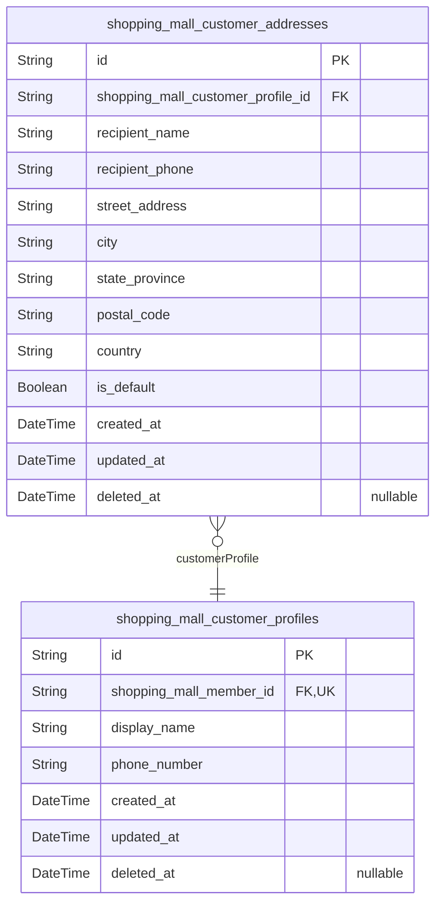

### `shopping_mall_customer_profiles`

Customer profile information including display name and phone number,
linked to member account.

Extends the base member account with customer-specific profile data. Each
member has exactly one customer profile created upon registration.

References [shopping_mall_members](#shopping_mall_members) for authentication and account
management. Profile data is editable by the customer through their
account settings.

Properties as follows:

- `id`: Primary Key.
- `shopping_mall_member_id`
  > References the member account this profile belongs to.
  >
  > Establishes a 1:1 relationship with [shopping_mall_members](#shopping_mall_members). Each
  > member has exactly one customer profile. The unique constraint ensures no
  > duplicate profiles per member.
- `display_name`
  > Customer's display name shown throughout the platform.
  >
  > Used in order confirmations, reviews, and customer-facing interfaces.
  > Customers can edit this field through their profile settings.
- `phone_number`
  > Customer's contact phone number.
  >
  > Used for order notifications and delivery coordination. Customers can
  > update this field through their profile settings.
- `created_at`: Timestamp when the customer profile was created.
- `updated_at`: Timestamp when the customer profile was last updated.
- `deleted_at`: Timestamp when the customer profile was soft deleted. Null if active.

### `shopping_mall_customer_addresses`

Customer shipping addresses with recipient details, supporting multiple
addresses per customer with default designation.

Each address record contains complete shipping information including
recipient name, phone number, and full address details (street, city,
state/province, postal code, country). Customers can maintain multiple
addresses and designate one as their default for checkout convenience.

References [shopping_mall_customer_profiles](#shopping_mall_customer_profiles) for customer
ownership. Each customer can have multiple addresses (1:N relationship).
The is_default flag enables quick identification of the primary shipping
address. Soft delete support via deleted_at preserves address history for
order records while removing from active selection.

Properties as follows:

- `id`: Primary Key.
- `shopping_mall_customer_profile_id`
  > Foreign key to the customer profile that owns this address.
  >
  > Establishes ownership relationship where each address belongs to exactly
  > one customer profile. A customer profile can have multiple addresses (1:N
  > relationship). This reference enables querying all addresses for a
  > specific customer and ensures addresses are cascade-deleted when the
  > customer profile is removed.
- `recipient_name`
  > Full name of the recipient for this shipping address.
  >
  > Used for delivery labeling and customer service communications. This is
  > the person who will receive packages sent to this address.
- `recipient_phone`
  > Phone number of the recipient for delivery contact.
  >
  > Couriers use this number to contact the recipient for delivery
  > coordination. Should include country code for international
  > compatibility.
- `street_address`
  > Street address line including building number, street name, and
  > apartment/suite number.
  >
  > Primary address line for physical delivery. Should contain sufficient
  > detail for courier navigation.
- `city`
  > City or municipality name for this address.
  >
  > Used for regional sorting and delivery routing.
- `state_province`
  > State, province, or regional subdivision name.
  >
  > Required for addresses in countries with state/province systems. Used for
  > regional sorting and tax calculations.
- `postal_code`
  > Postal or ZIP code for this address.
  >
  > Used for delivery routing and address validation. Format varies by
  > country.
- `country`
  > Country name or ISO country code for this address.
  >
  > Determines international vs domestic shipping rates and customs
  > requirements.
- `is_default`
  > Flag indicating whether this is the customer's default shipping address.
  >
  > When true, this address is pre-selected during checkout. Each customer
  > should have exactly one default address at any time. The application
  > layer enforces this constraint by updating the flag when customers change
  > their default.
- `created_at`: Timestamp when this address was created.
- `updated_at`: Timestamp when this address was last updated.
- `deleted_at`
  > Timestamp when this address was soft-deleted. Null if active.
  >
  > Soft delete preserves address data for historical order records while
  > removing from active address selection.

## seller

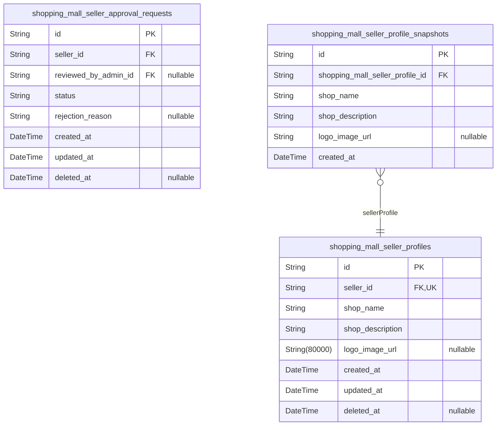

### `shopping_mall_seller_profiles`

Seller shop profiles containing shop name, description, and logo image
URL for approved sellers.

Each approved seller has exactly one profile that stores their shop
information. The profile is created when a seller's approval request is
accepted and can be edited by the seller. All edits create snapshots in
[shopping_mall_seller_profile_snapshots](#shopping_mall_seller_profile_snapshots) for audit trail.

The shop_name and shop_description are displayed to customers viewing the
seller's storefront. The logo_image_url references the seller's brand
image. This table has a 1:1 relationship with {@link
shopping_mall_sellers} through a unique foreign key constraint.

Properties as follows:

- `id`: Primary Key.
- `seller_id`
  > References the seller account that owns this profile.
  >
  > Each seller has exactly one profile, enforced by the unique constraint on
  > this foreign key. The profile is created when the seller's approval
  > request is approved and is deleted when the seller account is deleted.
- `shop_name`
  > The seller's shop or store name displayed to customers.
  >
  > This is the public-facing name of the seller's business on the platform.
  > Sellers can edit this field, and each edit creates a snapshot for audit
  > purposes.
- `shop_description`
  > A description of the seller's shop and business.
  >
  > Provides customers with information about the seller's business,
  > products, and values. Sellers can edit this field to update their
  > storefront presentation.
- `logo_image_url`
  > URL to the seller's shop logo image.
  >
  > The logo is displayed on the seller's storefront and in order
  > confirmations. This field is nullable to allow sellers to create profiles
  > without immediately uploading a logo.
- `created_at`
  > Timestamp when the seller profile was created.
  >
  > Automatically set when the seller's approval request is approved and the
  > profile is initialized.
- `updated_at`
  > Timestamp when the seller profile was last updated.
  >
  > Updated on every edit to shop_name, shop_description, or logo_image_url.
  > Used to track when snapshots should be created.
- `deleted_at`
  > Timestamp when the seller profile was soft deleted.
  >
  > Set when the seller account is deleted. The profile is soft deleted to
  > preserve historical data in order items that reference seller profile
  > snapshots.

### `shopping_mall_seller_approval_requests`

Seller registration approval requests tracking workflow status,
administrator review decisions, and rejection reasons.

This table manages the approval workflow for seller account
registrations. When a user registers as a seller, an approval request is
created with pending status. Administrators review requests and either
approve (enabling selling capabilities) or reject (with a reason that the
seller can view).

Each seller can have multiple historical approval requests if they
re-apply after rejection. Only one request should be pending at a time,
enforced at the application layer. The [shopping_mall_sellers](#shopping_mall_sellers)
table references the most recent approved request to track approval
status.

Properties as follows:

- `id`: Primary Key.
- `seller_id`
  > References the seller who submitted this approval request.
  >
  > Links to [shopping_mall_sellers](#shopping_mall_sellers) to identify the applicant. A
  > seller can have multiple historical requests if they re-apply after
  > rejection, but should only have one pending request at a time.
- `reviewed_by_admin_id`
  > References the administrator who reviewed and made a decision on this
  > request.
  >
  > Links to [shopping_mall_admins](#shopping_mall_admins). This field is NULL when the
  > request is still pending review, and populated with the reviewing admin's
  > ID when the request is approved or rejected.
- `status`
  > Current workflow status of the approval request.
  >
  > Allowed values: 'pending' (awaiting admin review), 'approved' (seller can
  > sell), 'rejected' (seller cannot sell, can re-apply with new request).
  > Status transitions: pending → approved or pending → rejected.
- `rejection_reason`
  > Reason provided by the administrator when rejecting this request.
  >
  > This field is NULL for pending and approved requests. Only populated when
  > status is 'rejected', allowing the seller to understand why their
  > application was denied and what they need to address in a re-application.
- `created_at`: Timestamp when the approval request was created.
- `updated_at`
  > Timestamp when the approval request was last updated (e.g., when status
  > changed).
- `deleted_at`: Timestamp when the approval request was soft deleted (NULL if active).

### `shopping_mall_seller_profile_snapshots`

Immutable historical snapshots of seller profile changes preserving shop
name, description, and logo at each modification point.

Snapshots are created automatically whenever a seller edits their profile
(shop name, description, or logo). Each snapshot captures the complete
state of the profile at that moment, enabling order items to reference
the exact seller profile that existed at the time of purchase.

This table is append-only and immutable. Snapshots cannot be deleted or
modified, ensuring a complete audit trail for dispute resolution.
Referenced by [shopping_mall_order_item_snapshots](#shopping_mall_order_item_snapshots) to preserve
seller profile state at purchase time.

Properties as follows:

- `id`: Primary Key.
- `shopping_mall_seller_profile_id`
  > References the seller profile that this snapshot belongs to.
  >
  > Each snapshot is linked to exactly one seller profile, establishing the
  > ownership relationship. Multiple snapshots can exist for a single
  > profile, forming a chronological history of all profile changes.
- `shop_name`
  > The shop name at the time this snapshot was created.
  >
  > Denormalized from the parent seller profile to preserve the exact value
  > that was visible to customers at this point in time. Used by order item
  > snapshots to display the seller's shop name as it appeared when the
  > purchase was made.
- `shop_description`
  > The shop description at the time this snapshot was created.
  >
  > Denormalized from the parent seller profile to preserve the exact
  > description that was visible to customers at this point in time. Captures
  > the seller's business description, policies, or other information
  > displayed on their shop page.
- `logo_image_url`
  > The logo image URL at the time this snapshot was created.
  >
  > Denormalized from the parent seller profile to preserve the exact logo
  > that was visible to customers at this point in time. May be null if the
  > seller had not uploaded a logo when this snapshot was created.
- `created_at`
  > The timestamp when this snapshot was created.
  >
  > Records the exact moment when the seller profile was modified and this
  > snapshot was generated. Used to establish chronological order of profile
  > changes and to determine which snapshot was active at the time of a
  > purchase.

## administrator

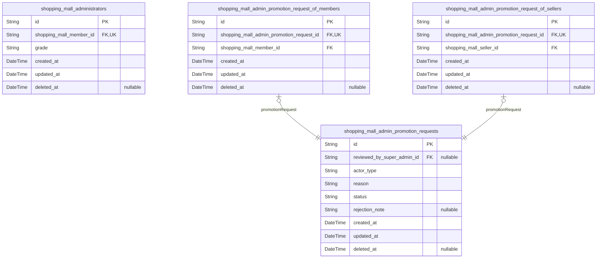

### `shopping_mall_administrators`

Administrator profiles with grade levels extending base member accounts.

Each administrator is linked to exactly one base member account,
establishing a 1:1 relationship. The grade field distinguishes between
regular administrators and super administrators, determining their
permission levels within the platform.

The grade system enables hierarchical administration: super
administrators can promote regular administrators to super administrator
status and demote other super administrators to regular administrator.
However, super administrators cannot demote themselves, preventing
privilege escalation vulnerabilities.

Administrators are created through the admin promotion request workflow
([shopping_mall_admin_promotion_requests](#shopping_mall_admin_promotion_requests)), where users submit
requests and super administrators review and approve them. When an
administrator is removed (demoted or banned), soft delete is used to
preserve audit trails while preventing login access.

Related tables: [shopping_mall_members](#shopping_mall_members) (base account), {@link
shopping_mall_admin_promotion_requests} (promotion workflow), {@link
shopping_mall_admin_sessions} (authentication sessions).

Properties as follows:

- `id`: Primary Key.
- `shopping_mall_member_id`
  > References the base member account that this administrator profile
  > extends.
  >
  > Each administrator must have exactly one base member account for
  > authentication. This creates a 1:1 relationship where the member account
  > handles login credentials and the administrator profile stores
  > grade-level permissions. When the administrator profile is deleted (soft
  > delete), the member account remains but loses administrator privileges.
- `grade`
  > Administrator grade level determining permission scope.
  >
  > Two grade levels exist: 'regular' for standard administrators who can
  > manage seller approvals, categories, products, orders, and users; and
  > 'super' for super administrators who have elevated privileges including
  > promoting/demoting other administrators and approving admin promotion
  > requests. Super administrators cannot demote themselves to prevent
  > privilege loss.
- `created_at`: Timestamp when this administrator profile was created.
- `updated_at`: Timestamp when this administrator profile was last updated.
- `deleted_at`
  > Timestamp when this administrator profile was soft deleted (null if
  > active). Used when administrators are demoted or banned while preserving
  > the base member account and audit trails.

### `shopping_mall_admin_promotion_requests`

Administrator promotion requests submitted by members or sellers to
become regular administrators.

This table tracks the workflow for users requesting administrator
privileges. Any member or seller can submit a request with their reason
for wanting to become an administrator. Super administrators review these
requests and can approve or reject them.

The actor_type field distinguishes between member and seller applicants.
The actual foreign key relationship to the applicant is established
through subtype tables (shopping_mall_admin_promotion_request_of_members
or shopping_mall_admin_promotion_request_of_sellers) following the
polymorphic ownership pattern from Section 2.4.

Status progresses from pending to approved or rejected. When approved,
the applicant becomes a regular administrator in the {@link
shopping_mall_admins} table. Rejected requests include reviewer notes
explaining the decision.

Properties as follows:

- `id`: Primary Key.
- `reviewed_by_super_admin_id`
  > Super administrator who reviewed and decided on this promotion request.
  >
  > This FK is nullable because the request may be pending review. Once a
  > super administrator reviews the request, this field is populated with
  > their ID from [shopping_mall_super_admins](#shopping_mall_super_admins).
- `actor_type`
  > Type of actor submitting the promotion request.
  >
  > Distinguishes between member and seller applicants. Valid values are
  > 'member' or 'seller'. This field enables polymorphic association with the
  > appropriate subtype table.
- `reason`
  > Applicant's reason for requesting administrator privileges.
  >
  > Text explanation provided by the member or seller explaining why they
  > want to become an administrator. This helps super administrators evaluate
  > the request.
- `status`
  > Current status of the promotion request.
  >
  > Valid values: pending (awaiting review), approved (applicant promoted to
  > admin), rejected (request denied). Status transitions: pending → approved
  > or pending → rejected.
- `rejection_note`
  > Optional explanation provided by super administrator when rejecting a
  > request.
  >
  > Populated only when status is 'rejected'. Helps the applicant understand
  > why their request was denied and what they might improve for future
  > requests.
- `created_at`: Timestamp when the promotion request was submitted.
- `updated_at`
  > Timestamp when the promotion request was last modified (e.g., status
  > changed).
- `deleted_at`
  > Timestamp for soft delete. Promotion requests are typically not deleted
  > to maintain audit trail.

### `shopping_mall_admin_promotion_request_of_members`

Subtype table linking administrator promotion requests to member
applicants with unique 1:1 constraint on promotion request foreign key.

This table implements the polymorphic ownership pattern for {@link
shopping_mall_admin_promotion_requests}, allowing promotion requests to
originate from either members or sellers. Each record represents a
member's application to become an administrator, with the unique
constraint ensuring exactly one subtype record per promotion request.

The table maintains referential integrity to both the promotion request
and the member applicant, enabling proper workflow tracking and audit
trails for administrator promotion processes.

Properties as follows:

- `id`: Primary Key.
- `shopping_mall_admin_promotion_request_id`
  > References the parent [shopping_mall_admin_promotion_requests](#shopping_mall_admin_promotion_requests)
  > record with 1:1 relationship.
  >
  > This unique foreign key ensures each promotion request has exactly one
  > subtype record (either member or seller). The uniqueness constraint
  > enforces the polymorphic ownership pattern where a promotion request
  > belongs to exactly one applicant type.
- `shopping_mall_member_id`
  > References the [shopping_mall_members](#shopping_mall_members) account of the member
  > applying for administrator promotion.
  >
  > This foreign key identifies which member submitted the promotion request,
  > enabling authentication and profile lookups during the approval workflow.
- `created_at`: Timestamp when this subtype record was created.
- `updated_at`: Timestamp when this subtype record was last updated.
- `deleted_at`: Timestamp for soft deletion, null if active.

### `shopping_mall_admin_promotion_request_of_sellers`

Subtype table linking administrator promotion requests to seller applicants.

This table implements the polymorphic ownership pattern for admin
promotion requests, allowing sellers to apply for administrator status.
Each record represents exactly one seller's promotion request with a 1:1
relationship to the parent [shopping_mall_admin_promotion_requests](#shopping_mall_admin_promotion_requests)
table.

The unique constraint on shopping_mall_admin_promotion_request_id ensures
each promotion request is associated with exactly one applicant type
(either member or seller, not both).

Properties as follows:

- `id`: Primary Key.
- `shopping_mall_admin_promotion_request_id`
  > References the parent admin promotion request.
  >
  > This foreign key establishes a 1:1 relationship with {@link
  > shopping_mall_admin_promotion_requests}. The unique constraint ensures
  > each promotion request has exactly one applicant subtype (either member
  > or seller).
- `shopping_mall_seller_id`
  > References the seller who submitted the promotion request.
  >
  > This foreign key links to [shopping_mall_sellers](#shopping_mall_sellers) identifying the
  > applicant. The seller must exist and be in good standing to submit a
  > promotion request.
- `created_at`
  > Timestamp when the subtype record was created.
  >
  > Automatically set when the promotion request is submitted by the seller.
- `updated_at`
  > Timestamp when the subtype record was last updated.
  >
  > Updated whenever the record is modified.
- `deleted_at`
  > Timestamp when the subtype record was soft deleted.
  >
  > Null while active. Set when the record is soft deleted for audit trail
  > preservation.

## category

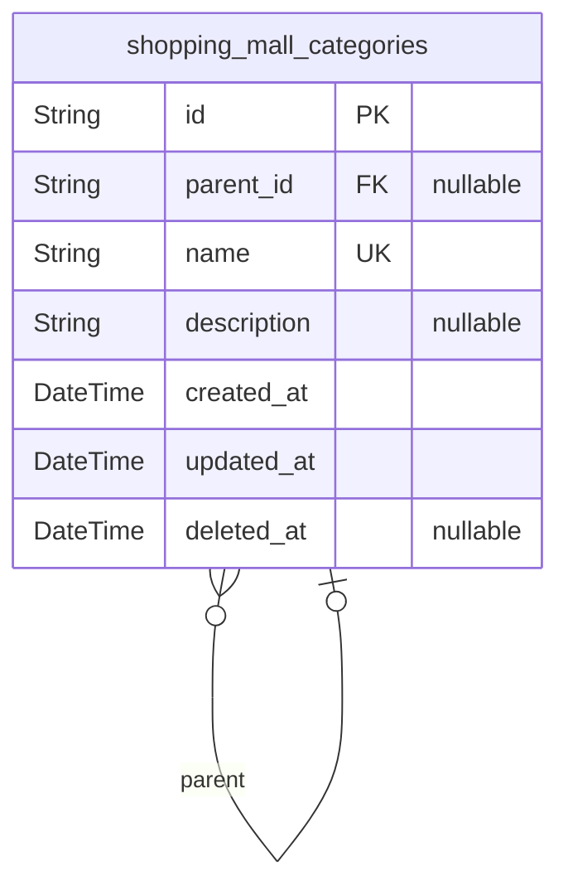

### `shopping_mall_categories`

Product categories organizing the catalog with optional parent reference
for one-level hierarchy.

Categories are managed exclusively by administrators and provide the
structural organization for products. Each category can optionally have
one parent category, enabling a single level of nesting (category →
subcategory). Products reference categories to establish their placement
in the catalog hierarchy.

The parent_id field establishes the hierarchical relationship. When null,
the category is a top-level category. When populated, it references the
parent category, making this category a subcategory. This design enforces
the one-level nesting constraint specified in requirements.

Related entities: [shopping_mall_products](#shopping_mall_products) reference categories via
category_id foreign key.

Properties as follows:

- `id`: Primary Key.
- `parent_id`
  > References the parent category for hierarchical organization.
  >
  > When null, this category is a top-level category with no parent. When
  > populated, this category is a subcategory of the referenced parent. This
  > self-referential relationship enables exactly one level of nesting as
  > specified in requirements - categories can have subcategories, but
  > subcategories cannot have their own children.
  >
  > Related to: [shopping_mall_categories](#shopping_mall_categories) (self-reference)
- `name`
  > Category name for display and identification.
  >
  > The human-readable name shown to customers when browsing the catalog.
  > Must be unique across all categories to prevent ambiguity. Examples
  > include 'Electronics', 'Clothing', 'Books', or subcategory names like
  > 'Smartphones', 'Men's Shirts'.
- `description`
  > Category description providing additional context about the category's
  > contents.
  >
  > Optional detailed text explaining what types of products belong in this
  > category. Displayed on category pages to help customers understand the
  > category scope. Can be null for simple categories where the name is
  > self-explanatory.
- `created_at`: Timestamp when the category was created.
- `updated_at`: Timestamp when the category was last modified.
- `deleted_at`: Timestamp when the category was soft deleted (null if active).

## product

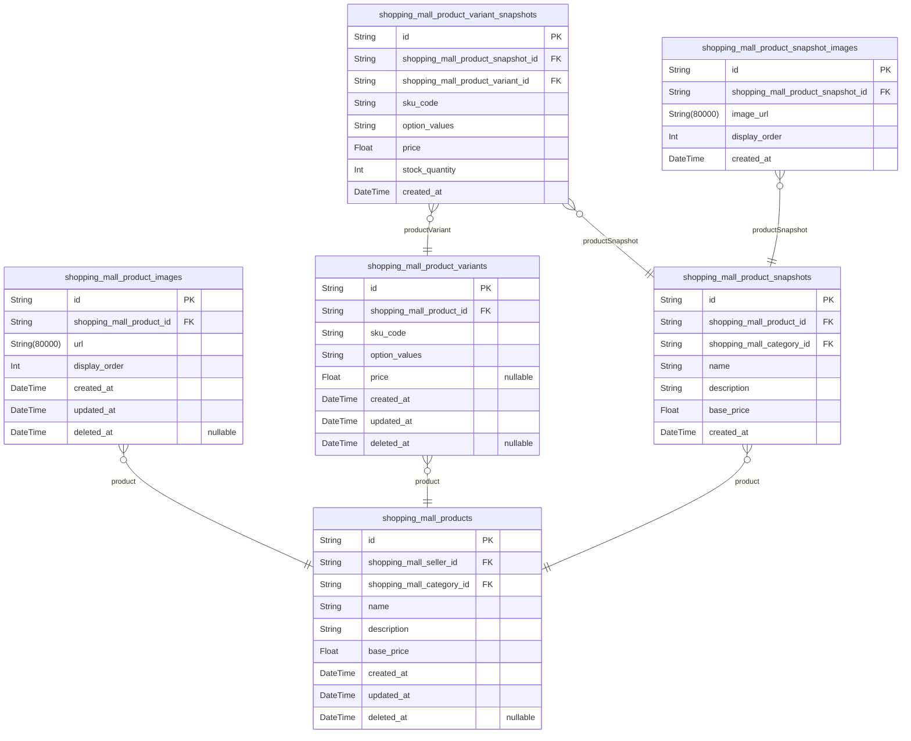

### `shopping_mall_products`

Main product listings representing items sellers offer for purchase on
the platform.

Core product data includes name, description, category assignment, and
base price. Each product is owned by exactly one seller and belongs to
one category (which may be a subcategory). Products can have multiple
images (via [shopping_mall_product_images](#shopping_mall_product_images)) and multiple variants
(via [shopping_mall_product_variants](#shopping_mall_product_variants)) representing different SKU
combinations.

Products support soft deletion via deleted_at timestamp, allowing order
history and snapshots to preserve references while hiding products from
search and category listings. Every product edit creates an immutable
snapshot (via [shopping_mall_product_snapshots](#shopping_mall_product_snapshots)) for audit trail
and dispute resolution.

Products can be added to customer wishlists (via {@link
shopping_mall_wishlist_items}) and purchased through orders (via {@link
shopping_mall_order_items}).

Properties as follows:

- `id`: Primary Key.
- `shopping_mall_seller_id`
  > References the seller who owns and created this product.
  >
  > Establishes product ownership, enabling sellers to manage only their own
  > products. All product edits, variant management, and inventory operations
  > require this ownership relationship. When a seller account is deleted or
  > suspended, products remain for order history preservation but become
  > hidden from listings.
- `shopping_mall_category_id`
  > References the category this product belongs to.
  >
  > Enables product organization and browsing by category. Categories support
  > one level of nesting (category → subcategory), so this may reference
  > either a top-level category or a subcategory. When a category is deleted,
  > products become uncategorized but remain in the system.
- `name`
  > Product name displayed in search results, category listings, and product
  > detail pages.
  >
  > Required field that identifies the product to customers. Used in
  > full-text search queries. Should be descriptive and include key product
  > attributes (e.g., brand, model, key features).
- `description`
  > Detailed product description providing customers with comprehensive
  > information about the product.
  >
  > Required field that appears on the product detail page. Should include
  > product features, specifications, usage instructions, and any other
  > relevant details. Used in full-text search queries alongside name.
- `base_price`
  > Base price of the product in the platform's currency.
  >
  > Required field representing the standard price before any
  > variant-specific adjustments. Individual variants (via {@link
  > shopping_mall_product_variants}) can override this price with their own
  > variant_price. Displayed to customers when viewing products without
  > selected variants.
- `created_at`: Timestamp when the product was first created.
- `updated_at`
  > Timestamp when the product was last modified.
  >
  > Updated on every product edit. Triggers creation of a new snapshot (via
  > [shopping_mall_product_snapshots](#shopping_mall_product_snapshots)) to preserve the previous state.
- `deleted_at`
  > Timestamp when the product was soft deleted, null if active.
  >
  > When set, the product is hidden from search results, category listings,
  > and cannot be purchased. Preserved for order history and snapshot
  > references. Sellers can only delete products if there are no pending
  > order items, cancellation requests, or refund requests for any variant.

### `shopping_mall_product_images`

Product images supporting multiple images per product with display
ordering for gallery presentation.

Each product can have multiple images displayed in a gallery. The
display_order field determines the sequence, with the first image (order
0) serving as the main thumbnail. Images are managed through their parent
product and inherit the product's lifecycle.

Related to [shopping_mall_products](#shopping_mall_products) through foreign key. Image
changes are captured in [shopping_mall_product_snapshots](#shopping_mall_product_snapshots) for audit
trail.

Properties as follows:

- `id`: Primary Key.
- `shopping_mall_product_id`
  > References the parent product that owns this image.
  >
  > Establishes ownership relationship to [shopping_mall_products](#shopping_mall_products).
  > Each image belongs to exactly one product. When a product is deleted, all
  > associated images are cascade deleted.
- `url`
  > URL of the uploaded product image.
  >
  > Stores the location of the image file in object storage or CDN. Used for
  > displaying the image in product galleries and detail pages.
- `display_order`
  > Display order sequence for gallery presentation.
  >
  > Determines the order in which images appear in the product gallery. Lower
  > values appear first. The image with display_order 0 is the main
  > thumbnail. Values should be consecutive integers starting from 0.
- `created_at`: Timestamp when this image record was created.
- `updated_at`: Timestamp when this image record was last updated.
- `deleted_at`: Timestamp when this image was soft deleted. Null if active.

### `shopping_mall_product_variants`

Product variants representing specific SKU combinations with option
values and optional price overrides for products.

Each product can have multiple variants representing different
combinations of options such as color, size, or other attributes.
Variants are identified by a unique SKU code within the product context.

Variants may have an optional price override that differs from the
product's base price. Stock quantities are not stored in this table -
they are calculated from the [shopping_mall_inventory_records](#shopping_mall_inventory_records)
append-only ledger for full audit trail.

Properties as follows:

- `id`: Primary Key.
- `shopping_mall_product_id`
  > Reference to the parent [shopping_mall_products](#shopping_mall_products) table.
  >
  > Each variant belongs to exactly one product. Variants are managed through
  > their parent product and cannot exist independently. When a product is
  > deleted, all its variants are also deleted.
- `sku_code`
  > Stock Keeping Unit code uniquely identifying this variant within its
  > product.
  >
  > The SKU code must be unique per product but can be reused across
  > different products. Used for inventory tracking and order item
  > references. Required for variant to be purchasable.
- `option_values`
  > Text representation of the option combination for this variant.
  >
  > Stores human-readable option values such as 'Color: Red, Size: Large' or
  > 'Blue / Small'. Used for display purposes in cart, orders, and product
  > listings. Format is flexible but should be consistent within a product.
- `price`
  > Optional price override for this specific variant.
  >
  > When null, the product's base price applies. When set, this price
  > overrides the base price for this variant only. Used when certain
  > variants have different pricing (e.g., larger sizes cost more).
- `created_at`: Timestamp when this variant was created.
- `updated_at`: Timestamp when this variant was last updated.
- `deleted_at`
  > Timestamp when this variant was soft-deleted. Null if active.
  >
  > Variants can only be deleted if there are no pending order items or
  > cancellation/refund requests. Soft delete preserves historical order
  > references.

### `shopping_mall_product_snapshots`

Immutable audit records capturing complete product state at time of each
edit.

Each snapshot preserves the denormalized product fields (name,
description, category, base price) when a product is modified. Snapshots
enable dispute resolution, order item references, and historical tracking
of product changes.

Snapshots are created automatically when [shopping_mall_products](#shopping_mall_products)
are edited. Each snapshot contains the complete product state after the
edit, allowing reconstruction of product history by comparing consecutive
snapshots.

Properties as follows:

- `id`: Primary Key.
- `shopping_mall_product_id`
  > Reference to the product being snapshotted.
  >
  > Links this snapshot to the [shopping_mall_products](#shopping_mall_products) table. Multiple
  > snapshots can reference the same product, forming a chronological history
  > of all edits.
- `shopping_mall_category_id`
  > Denormalized category reference at time of snapshot.
  >
  > Captures the [shopping_mall_categories](#shopping_mall_categories) assignment when the product
  > was edited. Stored directly (not through product FK) to preserve
  > historical category even if product's category changes later or category
  > is deleted.
- `name`
  > Denormalized product name at time of snapshot.
  >
  > Preserves the product name exactly as it was when this snapshot was
  > created. Used for historical display in order items and audit trails.
- `description`
  > Denormalized product description at time of snapshot.
  >
  > Preserves the full product description exactly as it was when this
  > snapshot was created. Used for historical reference and dispute
  > resolution.
- `base_price`
  > Denormalized product base price at time of snapshot.
  >
  > Captures the base price in the platform's currency when this snapshot was
  > created. Used for historical price tracking and order item references.
- `created_at`
  > Timestamp when this snapshot was created.
  >
  > Records the exact moment the product edit occurred and this snapshot was
  > generated. Used for chronological ordering of product history.

### `shopping_mall_product_variant_snapshots`

Variant state snapshots nested within product snapshots to preserve
variant configuration at time of product edit.

Each record captures the complete state of a product variant (SKU code,
option values, price, stock quantity) at the moment a product snapshot
was created. These snapshots are immutable and enable reconstruction of
historical product configurations for dispute resolution and audit
purposes.

References [shopping_mall_product_snapshots](#shopping_mall_product_snapshots) as the parent snapshot
container. References [shopping_mall_product_variants](#shopping_mall_product_variants) to identify
which variant this snapshot represents.

Properties as follows:

- `id`: Primary Key.
- `shopping_mall_product_snapshot_id`
  > References the parent product snapshot that contains this variant
  > snapshot.
  >
  > When a product is edited, a product snapshot is created along with
  > snapshots of all its variants at that moment. This foreign key
  > establishes the containment relationship, enabling queries to retrieve
  > all variant snapshots within a specific product snapshot.
- `shopping_mall_product_variant_id`
  > References the product variant that this snapshot represents.
  >
  > This link identifies which variant's state was captured, enabling
  > historical tracking of a specific variant across multiple snapshots.
  > Multiple snapshots can reference the same variant over time as the
  > product is edited.
- `sku_code`
  > The SKU (Stock Keeping Unit) code of the variant at the time of snapshot.
  >
  > Captures the unique identifier assigned to this variant combination. This
  > value is preserved even if the variant's SKU is later modified, enabling
  > accurate historical reconstruction.
- `option_values`
  > The option combination values of the variant at the time of snapshot.
  >
  > Represents the specific option values that define this variant (e.g.,
  > "Red / Large", "Blue / Small"). This string representation preserves the
  > exact option configuration displayed to customers at the time of the
  > product snapshot.
- `price`
  > The variant price at the time of snapshot.
  >
  > Captures the price that may override the product's base price. This
  > enables accurate historical pricing information for order item snapshots
  > and dispute resolution.
- `stock_quantity`
  > The stock quantity of the variant at the time of snapshot.
  >
  > Preserves the inventory level at the moment the product snapshot was
  > created. This provides historical context for availability at the time of
  > product edits.
- `created_at`
  > Timestamp when this variant snapshot was created.
  >
  > Records the exact moment the snapshot was generated, which corresponds to
  > when the parent product was edited. Used for chronological ordering and
  > audit trail purposes.

### `shopping_mall_product_snapshot_images`

Image URLs and display order for product snapshots, preserving image
state at time of product edit. Multiple images per snapshot with ordering
for gallery presentation.

This table stores the complete image configuration for a product at the
moment a [shopping_mall_product_snapshots](#shopping_mall_product_snapshots) record was created. Each
product snapshot can have multiple images, and this table preserves both
the image URLs and their display order for accurate historical
reconstruction.

Images are displayed in ascending display_order. The first image (lowest
order) serves as the thumbnail/main image. This snapshot data is
immutable and cannot be modified after creation, ensuring accurate audit
trail for dispute resolution.

Properties as follows:

- `id`: Primary Key.
- `shopping_mall_product_snapshot_id`
  > Reference to the parent product snapshot that this image belongs to.
  >
  > This foreign key establishes the relationship between a product snapshot
  > and its associated images. Multiple images can belong to one product
  > snapshot, forming a complete gallery representation at the time of the
  > snapshot creation.
- `image_url`
  > URL of the product image at the time of snapshot creation.
  >
  > This field stores the location of the image file. The URL is captured at
  > snapshot creation time to preserve the exact image that was associated
  > with the product at that moment, even if the original image is later
  > modified or deleted.
- `display_order`
  > Display order for gallery presentation.
  >
  > Images are sorted by this field in ascending order. The image with the
  > lowest display_order value appears first and serves as the main/thumbnail
  > image. Subsequent images follow in order. This ordering is preserved in
  > the snapshot to maintain accurate historical representation.
- `created_at`
  > Timestamp when this snapshot image record was created.
  >
  > Records the exact time when the product snapshot was created, preserving
  > when this image configuration existed. This field is immutable and cannot
  > be modified after creation.

## inventory

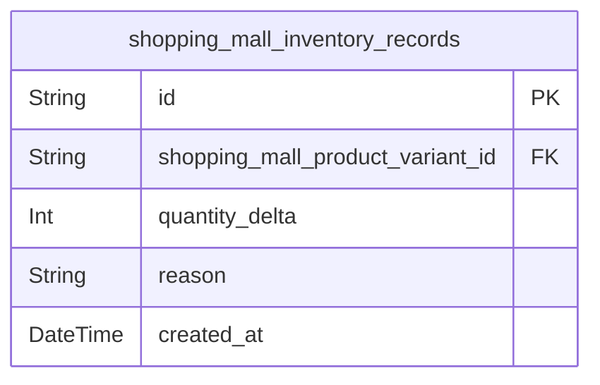

### `shopping_mall_inventory_records`

Immutable ledger tracking all stock quantity changes for product variants
with quantity delta, reason code, and timestamp for audit trail.

Records every inventory movement including restocking (positive delta),
order placement (negative delta), order cancellations (positive delta),
refunds (positive delta), and manual adjustments. Each record is
append-only and cannot be modified or deleted to maintain complete audit
trail.

Current stock quantity for a [shopping_mall_product_variants](#shopping_mall_product_variants) is
calculated by summing all quantity_delta values from this table. This
design enables full historical tracking of inventory changes for dispute
resolution and compliance purposes.

Properties as follows:

- `id`: Primary Key.
- `shopping_mall_product_variant_id`
  > References the product variant whose stock is being tracked.
  >
  > Establishes ownership relationship to {@link
  > shopping_mall_product_variants}. Each inventory record belongs to exactly
  > one variant. Multiple records can exist for the same variant representing
  > different stock movements over time.
- `quantity_delta`
  > The change in stock quantity from this inventory movement.
  >
  > Positive values indicate stock increases (restocking, cancellations,
  > refunds). Negative values indicate stock decreases (order placements,
  > adjustments, losses). The sum of all quantity_delta values for a variant
  > equals the current available stock.
- `reason`
  > Reason code or description explaining why this inventory change occurred.
  >
  > Examples: 'RESTOCK', 'ORDER_PLACEMENT', 'ORDER_CANCELLATION',
  > 'ORDER_REFUND', 'ADJUSTMENT', 'DAMAGED', 'LOST'. Provides context for
  > audit trail and inventory reconciliation.
- `created_at`
  > Timestamp when this inventory record was created.
  >
  > Records are immutable - no updated_at field. Timestamp enables
  > chronological ordering of inventory movements and historical analysis.

## shopping

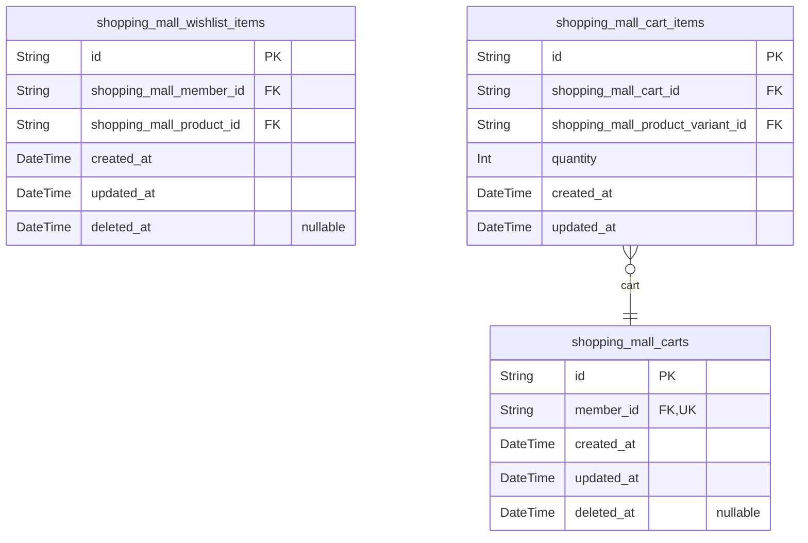

### `shopping_mall_wishlist_items`

Customer wishlist entries linking customers to products they want to
consider for later purchase.

Wishlist items represent products that customers have marked for future
consideration. Each customer can add any product to their wishlist once,
and can remove items at any time. When a product is deleted by its
seller, all associated wishlist entries are automatically soft-deleted to
maintain data integrity.

Related entities: [shopping_mall_members](#shopping_mall_members) (customer owner), {@link
shopping_mall_products} (wishlisted product).

Properties as follows:

- `id`: Primary Key.
- `shopping_mall_member_id`
  > Reference to the customer (member) who owns this wishlist entry.
  >
  > Links the wishlist item to the customer account. Each customer can have
  > multiple wishlist items, but only one entry per product.
- `shopping_mall_product_id`
  > Reference to the product that the customer wants to consider.
  >
  > Links the wishlist item to the product. When a product is deleted by its
  > seller, all wishlist entries for that product are soft-deleted
  > automatically.
- `created_at`
  > Timestamp when the wishlist item was created.
  >
  > Records when the customer added this product to their wishlist.
- `updated_at`
  > Timestamp when the wishlist item was last updated.
  >
  > Updated whenever the wishlist entry is modified.
- `deleted_at`
  > Timestamp when the wishlist item was soft-deleted.
  >
  > Used for soft delete functionality. Set when a product is deleted or
  > customer removes the item. Null for active wishlist items.

### `shopping_mall_carts`

Shopping cart containers with one cart per customer for holding items
pending checkout.

Each customer has exactly one active cart at any time. The cart serves as
a temporary container for [shopping_mall_cart_items](#shopping_mall_cart_items) before
checkout. Cart total price is calculated dynamically from cart items, not
stored.

Carts support soft delete for cleanup operations. When a customer
completes checkout, cart items are removed and the cart remains for
future use.

Properties as follows:

- `id`: Primary Key.
- `member_id`
  > Reference to the customer (member) who owns this cart.
  >
  > Establishes 1:1 relationship with [shopping_mall_members](#shopping_mall_members). Each
  > member has exactly one cart, enforced by unique constraint.
- `created_at`: Timestamp when the cart was created.
- `updated_at`: Timestamp when the cart was last updated.
- `deleted_at`: Timestamp for soft delete. Null means active cart.

### `shopping_mall_cart_items`

Cart line items linking carts to product variants with quantities that
combine for duplicate variants.

Each cart item represents a specific product variant added to a
customer's shopping cart with a specified quantity. The unique constraint
on cart and product variant ensures that adding the same variant multiple
times combines quantities rather than creating duplicate rows.

Cart items are transient data managed through the parent {@link
shopping_mall_carts} and are removed upon successful checkout. Quantity
changes and item removal are performed through cart management
operations.

Properties as follows:

- `id`: Primary Key.
- `shopping_mall_cart_id`
  > Reference to the parent cart containing this item.
  >
  > Each cart item belongs to exactly one [shopping_mall_carts](#shopping_mall_carts). This
  > foreign key establishes the parent-child relationship where cart items
  > cannot exist independently of their cart.
- `shopping_mall_product_variant_id`
  > Reference to the product variant being added to cart.
  >
  > Each cart item links to exactly one {@link
  > shopping_mall_product_variants}. This foreign key identifies which
  > specific variant (SKU combination) the customer wants to purchase.
- `quantity`
  > Quantity of the product variant in this cart item.
  >
  > Represents how many units of this specific variant the customer wants to
  > purchase. When customers add the same variant to cart multiple times,
  > this quantity is incremented rather than creating a new row.
- `created_at`: Timestamp when this cart item was created.
- `updated_at`: Timestamp when this cart item was last updated.

## order

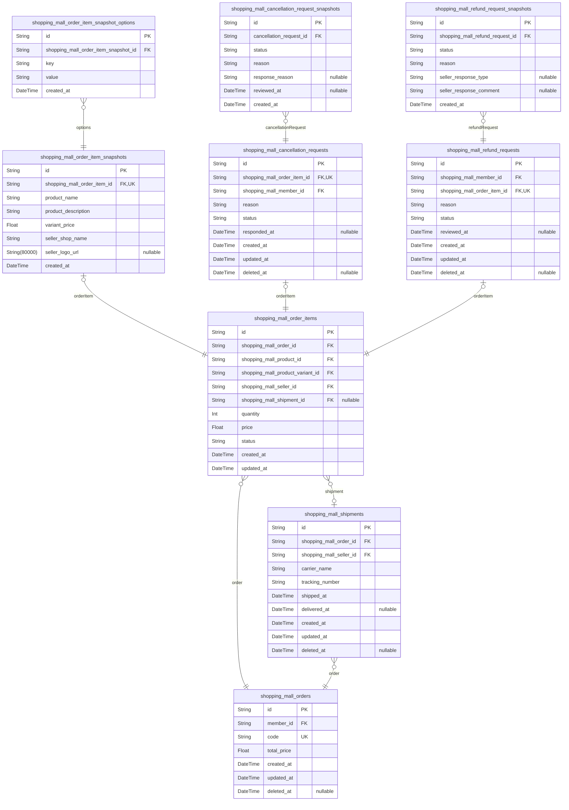

### `shopping_mall_orders`

Customer orders grouping multiple order items with order-level metadata.

Orders represent complete purchase transactions made by customers. Each
order contains one or more order items representing individual product
variant purchases. Order-level status is derived from constituent order
item statuses and should be computed via queries or materialized views.

Orders maintain purchase metadata including total price, order code for
customer reference, and timestamps. Total price is a snapshot of the
purchase amount that does not change after order creation. Orders support
soft deletion for data retention policies.

Properties as follows:

- `id`: Primary Key.
- `member_id`
  > Reference to the customer (member) who placed this order.
  >
  > Links the order to the [shopping_mall_members](#shopping_mall_members) account that made
  > the purchase. This relationship is required and immutable - orders cannot
  > be transferred between customers.
- `code`
  > Unique order identification code for customer-facing reference.
  >
  > Human-readable order number used in customer communications, receipts,
  > and support inquiries. Must be unique across all orders. Format typically
  > includes date and sequence number.
- `total_price`
  > Total monetary value of all order items at time of purchase.
  >
  > Snapshot of the total amount paid for this order. This represents the
  > purchase-time total and does not change after order creation.
- `created_at`: Timestamp when the order was created.
- `updated_at`: Timestamp when the order was last updated.
- `deleted_at`: Timestamp when the order was soft-deleted, if applicable.

### `shopping_mall_order_items`

Individual purchased items within orders representing specific product
variants bought by customers.

Each order item captures the product, variant, seller, quantity, and
price at the time of purchase. Status tracking enables independent
lifecycle management for each item (paid, shipped, delivered, cancelled,
refunded) supporting partial order operations.

References [shopping_mall_orders](#shopping_mall_orders) as the parent order container.
Links to [shopping_mall_products](#shopping_mall_products), {@link
shopping_mall_product_variants}, and [shopping_mall_sellers](#shopping_mall_sellers) for
product and fulfillment details. Optional [shopping_mall_shipments](#shopping_mall_shipments)
reference when item is shipped. Status field tracks item progression
through fulfillment workflow.

Properties as follows:

- `id`: Primary Key.
- `shopping_mall_order_id`
  > Foreign key to the parent order containing this item.
  >
  > Links to [shopping_mall_orders](#shopping_mall_orders). Multiple order items belong to one
  > order. Cannot be null as every item must belong to an order.
- `shopping_mall_product_id`
  > Foreign key to the purchased product.
  >
  > Links to [shopping_mall_products](#shopping_mall_products). References the product at time
  > of purchase for historical accuracy. Product details may change but this
  > reference preserves what was bought.
- `shopping_mall_product_variant_id`
  > Foreign key to the specific product variant purchased.
  >
  > Links to [shopping_mall_product_variants](#shopping_mall_product_variants). Identifies the exact SKU
  > combination (size, color, etc.) that was purchased. Critical for
  > inventory tracking and fulfillment.
- `shopping_mall_seller_id`
  > Foreign key to the seller who fulfills this order item.
  >
  > Links to [shopping_mall_sellers](#shopping_mall_sellers). Determines which seller is
  > responsible for shipping and customer service for this item. Enables
  > seller-specific order management and dashboard views.
- `shopping_mall_shipment_id`
  > Foreign key to the shipment containing this order item.
  >
  > Links to [shopping_mall_shipments](#shopping_mall_shipments). Nullable until the seller
  > creates a shipment. One-to-one relationship as each item belongs to
  > exactly one shipment when shipped. Used for tracking and delivery
  > confirmation.
- `quantity`
  > Number of units of this variant purchased in this order item.
  >
  > Combined with price determines the line item total. Must be positive
  > integer. Used for inventory deduction and fulfillment planning.
- `price`
  > Unit price of the product variant at the time of purchase.
  >
  > Captured at checkout to preserve historical accuracy even if product
  > prices change later. Multiplied by quantity for line item total. Stored
  > as double for decimal precision.
- `status`
  > Current fulfillment status of this order item.
  >
  > Allowed values: paid (awaiting shipment), shipped (in transit), delivered
  > (confirmed or auto-delivered), cancelled (pre-shipment cancellation),
  > refunded (post-delivery return). Drives order-level status aggregation
  > and seller workflow queues.
- `created_at`: Timestamp when this order item was created (at checkout).
- `updated_at`
  > Timestamp when this order item was last updated (status changes, shipment
  > assignment).

### `shopping_mall_order_item_snapshots`

Immutable snapshots preserving product name, description, variant price,
and seller profile at the time of purchase for dispute resolution and
audit purposes.

These snapshots are created automatically when an order is placed and
capture the exact state of the product and seller profile at that moment.
This ensures that even if the original product or seller profile is later
modified or deleted, the order history accurately reflects what the
customer purchased.

Each snapshot is linked to exactly one [shopping_mall_order_items](#shopping_mall_order_items)
via a unique foreign key constraint. The snapshot contains denormalized
product and seller data to preserve historical accuracy. Variant option
values are stored in the child table {@link
shopping_mall_order_item_snapshot_options} to maintain 1NF compliance.

Properties as follows:

- `id`: Primary Key.
- `shopping_mall_order_item_id`
  > References the order item this snapshot belongs to.
  >
  > Each order item has exactly one snapshot, created at the time of
  > purchase. This unique relationship ensures the snapshot preserves the
  > state of the product and seller profile for that specific purchase.
- `product_name`
  > Product name at the time of purchase.
  >
  > Denormalized from the product table to preserve the exact name the
  > customer saw when placing the order, even if the product is later renamed
  > or deleted.
- `product_description`
  > Product description at the time of purchase.
  >
  > Denormalized from the product table to preserve the exact description the
  > customer saw when placing the order.
- `variant_price`
  > Variant price at the time of purchase.
  >
  > The actual price paid for this variant, which may differ from the current
  > product base price or variant price if discounts were applied or prices
  > changed.
- `seller_shop_name`
  > Seller's shop name at the time of purchase.
  >
  > Denormalized from the seller profile to preserve the shop name the
  > customer saw when placing the order, even if the seller later changes
  > their shop name or deletes their account.
- `seller_logo_url`
  > Seller's shop logo URL at the time of purchase.
  >
  > Denormalized from the seller profile to preserve the logo the customer
  > saw when placing the order.
- `created_at`
  > Timestamp when the snapshot was created.
  >
  > Records the exact moment the order was placed and the snapshot was
  > captured. This is the only temporal field as snapshots are immutable and
  > never updated or deleted.

### `shopping_mall_shipments`

Shipment groups containing order items from the same seller with carrier
and tracking information.

A shipment represents a physical package sent by a seller containing one
or more order items. Different sellers always ship separately, creating
different shipments. When a shipment is created, all order items in it
transition to "shipped" status. Customers confirm delivery per shipment,
which transitions all items to "delivered" status. If not confirmed,
items auto-transition to "delivered" after 14 days from shipping.

Each shipment belongs to exactly one [shopping_mall_orders](#shopping_mall_orders) and is
associated with exactly one seller. The shipment tracks carrier name,
tracking number, and timestamps for shipping and delivery events.

Properties as follows:

- `id`: Primary Key.
- `shopping_mall_order_id`
  > Reference to the order this shipment belongs to.
  >
  > Each shipment is associated with exactly one order. The order contains
  > the order items that may be grouped into this shipment. This foreign key
  > enables retrieving all shipments for an order and linking shipment
  > tracking to order status.
- `shopping_mall_seller_id`
  > Reference to the seller who is shipping this shipment.
  >
  > Each shipment is created by exactly one seller. This identifies which
  > seller is responsible for the shipment and enables seller dashboard
  > queries. Different sellers always create separate shipments even for
  > items in the same order.
- `carrier_name`
  > Name of the shipping carrier handling this shipment.
  >
  > Examples include postal services (USPS, Korea Post), courier companies
  > (FedEx, UPS, DHL), or local delivery services. This field is required
  > when the seller creates the shipment and provides tracking information to
  > the customer.
- `tracking_number`
  > Tracking number assigned by the carrier for this shipment.
  >
  > This unique identifier allows customers to track the shipment progress
  > through the carrier's website or API. Combined with carrier_name, it
  > provides complete tracking information for the customer.
- `shipped_at`
  > Timestamp when the seller created this shipment and marked items as
  > shipped.
  >
  > This timestamp is set when the seller enters tracking information and
  > confirms the shipment. It marks the transition of all order items in this
  > shipment from "paid" to "shipped" status. Also used to calculate the
  > 14-day auto-delivery deadline.
- `delivered_at`
  > Timestamp when this shipment was confirmed as delivered.
  >
  > This is set either when the customer manually confirms delivery, or
  > automatically after 14 days from shipped_at if no confirmation is
  > received. When set, all order items in this shipment transition to
  > "delivered" status. Null until delivery is confirmed.
- `created_at`: Timestamp when this shipment record was created.
- `updated_at`: Timestamp when this shipment record was last updated.
- `deleted_at`: Timestamp when this shipment was soft-deleted. Null if not deleted.

### `shopping_mall_cancellation_requests`

Customer cancellation requests for individual order items with seller
review status.

Tracks cancellation requests initiated by customers for specific order
items before shipment. Each request includes a reason and goes through a
seller review workflow with pending, approved, or rejected statuses.

Each order item can have at most one cancellation request, enforced by
unique constraint on [shopping_mall_order_items](#shopping_mall_order_items) reference. When
approved, the order item status changes to cancelled and inventory is
restored via [shopping_mall_inventory_records](#shopping_mall_inventory_records). Rejected requests
allow the order to continue normal processing.

Properties as follows:

- `id`: Primary Key.
- `shopping_mall_order_item_id`
  > References the order item being cancelled.
  >
  > Links to [shopping_mall_order_items](#shopping_mall_order_items) to identify which specific
  > purchased item this cancellation request targets. The order item contains
  > seller information for routing the review and determines stock
  > restoration upon approval.
- `shopping_mall_member_id`
  > References the customer who requested cancellation.
  >
  > Links to [shopping_mall_members](#shopping_mall_members) to identify the customer account
  > that initiated this cancellation request. Must match the customer who
  > placed the original order containing this order item.
- `reason`
  > Customer's reason for requesting cancellation.
  >
  > Text explanation provided by the customer describing why they want to
  > cancel this order item. Required for seller review and dispute
  > resolution. Examples include 'ordered by mistake', 'found better price',
  > 'no longer needed'.
- `status`
  > Current review status of the cancellation request.
  >
  > Tracks the workflow state through seller review process. Values:
  > 'pending' when awaiting seller review, 'approved' when seller approves
  > cancellation and triggers refund, 'rejected' when seller denies the
  > request and order continues processing.
- `responded_at`
  > Timestamp when the seller responded to the cancellation request.
  >
  > Records when the seller made their approval or rejection decision. Null
  > while status is 'pending'. Used to track seller response times and
  > calculate automatic approval timeouts if implemented.
- `created_at`: Timestamp when the cancellation request was created.
- `updated_at`: Timestamp when the cancellation request was last updated.
- `deleted_at`: Timestamp for soft delete. Null when active.

### `shopping_mall_cancellation_request_snapshots`

Immutable audit trail of cancellation request state changes and seller
responses.

Preserves the complete state of a cancellation request at each
significant event including initial submission and seller response. Used
for dispute resolution and historical tracking. Each snapshot is
append-only and cannot be modified or deleted.

Snapshots are created when a cancellation request is first submitted and
when the seller responds (approves or rejects). The snapshot captures the
status, customer's cancellation reason, seller's response reason if
rejected, and the review timestamp.

Properties as follows:

- `id`: Primary Key.
- `cancellation_request_id`
  > References the parent cancellation request this snapshot belongs to.
  >
  > Links each snapshot record to its source {@link
  > shopping_mall_cancellation_requests} entity. Multiple snapshots can exist
  > for one cancellation request, each capturing state at different points in
  > time.
- `status`
  > Cancellation request status at the time of this snapshot.
  >
  > Captures the current state (pending, approved, rejected) when the
  > snapshot was created. Used to track status progression over time.
- `reason`
  > Customer's cancellation reason provided when requesting cancellation.
  >
  > Preserves the original reason text submitted by the customer. Remains
  > constant across all snapshots for the same request.
- `response_reason`
  > Seller's response reason if the cancellation was rejected.
  >
  > Populated only when seller rejects the cancellation request. Null for
  > pending requests or approved cancellations.
- `reviewed_at`
  > Timestamp when seller reviewed and responded to the cancellation request.
  >
  > Null if the request is still pending. Set when seller approves or rejects
  > the request.
- `created_at`
  > Timestamp when this snapshot record was created.
  >
  > Records the exact time when this state snapshot was captured. Used for
  > chronological ordering of snapshots.

### `shopping_mall_refund_requests`

Customer refund requests for delivered order items with seller review
status.

Tracks refund requests submitted by customers for order items that have
been delivered. Each request includes a reason and goes through a seller
review workflow with approved or rejected outcomes.

References [shopping_mall_members](#shopping_mall_members) for the customer who submitted
the request. References [shopping_mall_order_items](#shopping_mall_order_items) for the
specific item being refunded. Each order item can have at most one refund
request (enforced by unique constraint).

Properties as follows:

- `id`: Primary Key.
- `shopping_mall_member_id`
  > Customer who submitted the refund request.
  >
  > References [shopping_mall_members](#shopping_mall_members) to identify the customer
  > requesting the refund. This relationship is required as refund requests
  > are always initiated by customers.
- `shopping_mall_order_item_id`
  > Order item being refunded.
  >
  > References [shopping_mall_order_items](#shopping_mall_order_items) to identify the specific
  > purchased item for which refund is requested. Each order item can have at
  > most one refund request, enforced by unique constraint.
- `reason`
  > Customer's reason for requesting refund.
  >
  > Text explanation provided by the customer describing why they are
  > requesting a refund for this item. Required for seller review.
- `status`
  > Current review status of the refund request.
  >
  > Workflow states: pending (awaiting seller review), approved (seller
  > approved refund), rejected (seller denied refund). Transitions from
  > pending to either approved or rejected upon seller response.
- `reviewed_at`
  > Timestamp when seller responded to the refund request.
  >
  > Set when the seller approves or rejects the request. Null while status is
  > pending. Used to calculate the 7-day refund window and track response
  > times.
- `created_at`: Timestamp when the refund request was created.
- `updated_at`: Timestamp when the refund request was last updated.
- `deleted_at`: Timestamp for soft deletion. Null if active.

### `shopping_mall_refund_request_snapshots`

Immutable audit trail preserving complete state of refund requests at
each modification point for dispute resolution and compliance.

Each snapshot captures the refund request status, customer reason, and
seller response details at a specific moment in time. Snapshots are
created whenever the refund request status changes or when the seller
responds to the request. This enables tracking the full history of state
transitions and supports dispute resolution by providing an immutable
record of what occurred and when.

Snapshots are append-only and cannot be modified or deleted after
creation. They are linked to their parent {@link
shopping_mall_refund_requests} entity and can be queried chronologically
to reconstruct the complete lifecycle of a refund request.

Properties as follows:

- `id`: Primary Key.
- `shopping_mall_refund_request_id`
  > Reference to the parent refund request being snapshotted.
  >
  >
  > Establishes the relationship to the [shopping_mall_refund_requests](#shopping_mall_refund_requests)
  > entity that this snapshot preserves the state of. Each refund request can
  > have multiple snapshots representing different points in its lifecycle.
- `status`
  > Refund request status at the time of this snapshot.
  >
  >
  > Captures the current state of the refund request when this snapshot was
  > created. Valid values include: pending (awaiting seller review), approved
  > (seller approved the refund), rejected (seller rejected the refund). This
  > field preserves the historical state for audit purposes.
- `reason`
  > Customer's refund request reason at the time of this snapshot.
  >
  >
  > Preserves the text reason provided by the customer when requesting the
  > refund. This field captures what the customer stated as their
  > justification for the refund at the time the snapshot was created.
- `seller_response_type`
  > Seller's response type at the time of this snapshot.
  >
  >
  > Captures the seller's decision on the refund request: approved or
  > rejected. Null when the request is still pending seller review. This
  > field preserves the historical seller response for audit purposes.
- `seller_response_comment`
  > Seller's response comment at the time of this snapshot.
  >
  >
  > Preserves any comment or explanation provided by the seller when
  > responding to the refund request. Null when the request is still pending
  > or if the seller did not provide a comment. This field captures the
  > seller's reasoning for their decision.
- `created_at`
  > Timestamp when this snapshot record was created.
  >
  >
  > Records the exact moment when this snapshot was created, preserving when
  > the state change occurred. Used for chronological ordering of snapshots
  > and determining the sequence of state transitions in the refund request
  > lifecycle.

### `shopping_mall_order_item_snapshot_options`

Key-value pairs storing variant option values for order item snapshots in
1NF-compliant format.

This table captures the option configuration (e.g., color: Red, size:
Large) of a product variant at the time of purchase. Each {@link
shopping_mall_order_item_snapshots} record can have multiple option
entries, one for each option type that defined the variant.

Options are stored as normalized key-value pairs rather than JSON to
maintain 1NF compliance and enable efficient querying. The composite
unique constraint ensures each option key appears only once per snapshot.

Properties as follows:

- `id`: Primary Key.
- `shopping_mall_order_item_snapshot_id`
  > References the parent order item snapshot that this option belongs to.
  >
  > This foreign key establishes the 1:N relationship between {@link
  > shopping_mall_order_item_snapshots} and this options table. Each snapshot
  > can have multiple option key-value pairs representing the variant
  > configuration at purchase time.
- `key`
  > Option name identifier such as 'color', 'size', 'material', etc.
  >
  > This field stores the option type name that was part of the variant
  > definition. Combined with the value field, it represents one dimension of
  > the variant configuration.
- `value`
  > Option value such as 'Red', 'Large', 'Cotton', etc.
  >
  > This field stores the specific value for the option key. Together with
  > the key field, it fully describes one aspect of the variant that was
  > purchased.
- `created_at`
  > Timestamp when this option record was created, matching the parent
  > snapshot creation time.

## post_purchase

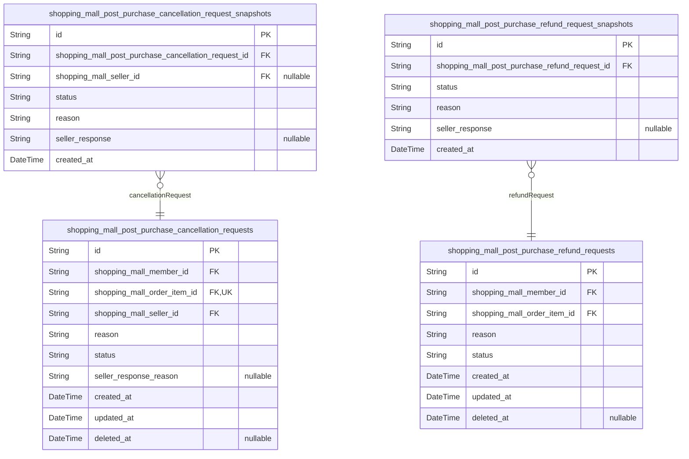

### `shopping_mall_post_purchase_cancellation_requests`

Customer cancellation requests for individual order items before shipment.

Customers can request cancellation for order items with 'paid' status
(not yet shipped). Each request includes a reason text and is reviewed by
the seller of that order item. The seller can approve or reject the
request. Approved cancellations trigger automatic refund processing and
inventory restoration for the cancelled item.

References [shopping_mall_members](#shopping_mall_members) for the requesting customer,
[shopping_mall_order_items](#shopping_mall_order_items) for the target item, and {@link
shopping_mall_sellers} for the reviewing seller. Status transitions from
'pending' to 'approved' or 'rejected' based on seller decision.

Properties as follows:

- `id`: Primary Key.
- `shopping_mall_member_id`
  > Reference to the customer who requested the cancellation.
  >
  > Links to [shopping_mall_members](#shopping_mall_members) representing the customer account
  > that initiated this cancellation request. The customer can view their
  > cancellation requests and their status.
- `shopping_mall_order_item_id`
  > Reference to the order item being cancelled.
  >
  > Links to [shopping_mall_order_items](#shopping_mall_order_items) representing the specific
  > purchased item this cancellation request targets. Each order item can
  > have at most one cancellation request. Only items with 'paid' status (not
  > yet shipped) can be cancelled.
- `shopping_mall_seller_id`
  > Reference to the seller who reviews this cancellation request.
  >
  > Links to [shopping_mall_sellers](#shopping_mall_sellers) representing the seller account
  > responsible for approving or rejecting this cancellation. The seller is
  > determined by the order item's seller and can view all cancellation
  > requests for their order items.
- `reason`
  > Customer's reason for requesting cancellation.
  >
  > Free text explanation provided by the customer describing why they want
  > to cancel this order item. This helps the seller make an informed
  > decision on approval or rejection.
- `status`
  > Current workflow status of the cancellation request.
  >
  > Tracks the lifecycle of the cancellation request through the review
  > process. Values: 'pending' (awaiting seller review), 'approved' (seller
  > approved, refund processing), 'rejected' (seller rejected with reason).
  > Status changes trigger snapshots for audit trail.
- `seller_response_reason`
  > Seller's reason when rejecting the cancellation request.
  >
  > Optional text provided by the seller when rejecting a cancellation
  > request, explaining the rejection decision. Null for pending or approved
  > requests.
- `created_at`: Timestamp when the cancellation request was created.
- `updated_at`: Timestamp when the cancellation request was last updated.
- `deleted_at`: Timestamp when the cancellation request was soft deleted (null if active).

### `shopping_mall_post_purchase_cancellation_request_snapshots`

Immutable audit trail of cancellation request status changes.

This snapshot table preserves the complete state of a {@link
shopping_mall_post_purchase_cancellation_requests} at each point when the
status changes or when the seller responds. Each snapshot record captures
the status, reason, seller response, and responsible parties at that
moment in time.

Snapshots are created when: the customer submits a cancellation request
(initial state), the seller approves or rejects the request (response
state). These records enable dispute resolution by providing a complete
historical record of all state transitions.

This table is append-only and immutable. Records are never updated or
deleted, ensuring the audit trail remains intact for compliance and
dispute resolution purposes.

Properties as follows:

- `id`: Primary Key.
- `shopping_mall_post_purchase_cancellation_request_id`
  > References the parent cancellation request that this snapshot belongs to.
  >
  > Each cancellation request can have multiple snapshots representing its
  > state at different points in time. This foreign key establishes the
  > relationship to the {@link
  > shopping_mall_post_purchase_cancellation_requests} table, enabling
  > queries to retrieve the complete audit history of a specific request.
- `shopping_mall_seller_id`
  > References the seller who responded to this cancellation request snapshot.
  >
  > This field is populated when the seller takes action on the cancellation
  > request (approve or reject). For the initial snapshot created when the
  > customer submits the request, this field may be null as no seller
  > response exists yet. Links to [shopping_mall_sellers](#shopping_mall_sellers) for seller
  > identity verification.
- `status`
  > The cancellation request status at the time this snapshot was created.
  >
  > Valid values include: pending (awaiting seller response), approved
  > (seller approved the cancellation), rejected (seller rejected the
  > cancellation). This field captures the exact status at the snapshot
  > moment, enabling historical tracking of status transitions even if the
  > current request status changes.
- `reason`
  > The customer's reason for requesting cancellation at the time of this
  > snapshot.
  >
  > This text field preserves the exact reason provided by the customer when
  > they submitted the cancellation request. The reason is captured once
  > during initial request creation and remains unchanged in all subsequent
  > snapshots, providing context for dispute resolution.
- `seller_response`
  > The seller's response message when approving or rejecting the
  > cancellation request.
  >
  > This field is populated only when the seller takes action on the request.
  > It may contain approval confirmation, rejection explanation, or
  > additional notes from the seller. Null for the initial snapshot created
  > when the customer first submits the request.
- `created_at`
  > The timestamp when this snapshot record was created.
  >
  > Records the exact moment when the state change occurred and this snapshot
  > was captured. Enables chronological ordering of snapshots to reconstruct
  > the complete history of the cancellation request. Used for audit trail
  > verification and dispute resolution timelines.

### `shopping_mall_post_purchase_refund_requests`

Customer refund requests for delivered order items with seller review
workflow.

Tracks refund requests submitted by customers for order items that have
been delivered. Each request includes a reason text and goes through a
seller review workflow with pending, approved, or rejected status states.

References [shopping_mall_order_items](#shopping_mall_order_items) for the specific item being
refunded. References [shopping_mall_members](#shopping_mall_members) for the customer
submitting the request. Status transitions are recorded in {@link
shopping_mall_post_purchase_refund_request_snapshots} for audit trail and
dispute resolution.

Properties as follows:

- `id`: Primary Key.
- `shopping_mall_member_id`
  > Customer who submitted the refund request.
  >
  > References the member account of the customer requesting the refund. This
  > establishes ownership of the refund request and enables querying all
  > refund requests by a specific customer.
- `shopping_mall_order_item_id`
  > Order item being refunded.
  >
  > References the specific order item within an order that the customer is
  > requesting a refund for. Refunds are handled at the item level, not the
  > entire order level, enabling partial refunds within an order.
- `reason`
  > Customer's reason for requesting the refund.
  >
  > Text field containing the customer's explanation for why they are
  > requesting a refund. This information helps the seller make an informed
  > decision on whether to approve or reject the request.
- `status`
  > Current workflow status of the refund request.
  >
  > Tracks the state of the refund request through the review workflow. Valid
  > values include 'pending' (awaiting seller review), 'approved' (seller
  > approved, refund processed), and 'rejected' (seller declined the
  > request).
- `created_at`: Timestamp when the refund request was created.
- `updated_at`: Timestamp when the refund request was last updated.
- `deleted_at`
  > Timestamp when the refund request was soft deleted (nullable for active
  > records).

### `shopping_mall_post_purchase_refund_request_snapshots`

Immutable audit trail of refund request status changes and seller
responses for dispute resolution.

Each snapshot captures the complete state of a refund request at a
specific point in time, including status, customer reason, and seller
response details. Snapshots are created whenever the request state
changes: initial submission (pending status) and seller response
(approved or rejected).

Snapshots are append-only records that cannot be modified or deleted,
ensuring complete audit trail for dispute resolution and compliance.
Multiple snapshots per refund request form a chronological history of all
state transitions.

Properties as follows:

- `id`: Primary Key.
- `shopping_mall_post_purchase_refund_request_id`
  > Reference to the parent refund request this snapshot belongs to.
  >
  > Each refund request can have multiple snapshots representing its state
  > history. This foreign key establishes the parent-child relationship where
  > snapshots are immutable audit records of their parent request.
- `status`
  > Refund request status at the time this snapshot was created.
  >
  > Captures the workflow state: 'pending' when customer submits request,
  > 'approved' when seller approves refund, or 'rejected' when seller denies
  > refund. This field preserves the exact status at snapshot creation time
  > for audit purposes.
- `reason`
  > Customer's refund request reason text at the time of snapshot.
  >
  > Preserves the customer's original explanation for requesting a refund
  > (e.g., 'defective product', 'wrong item received', 'not as described').
  > This ensures the reason is preserved even if the customer could
  > theoretically edit their request.
- `seller_response`
  > Seller's response or rejection reason provided when processing the refund
  > request.
  >
  > Contains seller's approval confirmation or detailed rejection
  > explanation. Null for initial pending snapshots, populated only when
  > seller responds. Preserves seller's decision rationale for dispute
  > resolution.
- `created_at`
  > Timestamp when this snapshot record was created.
  >
  > Records the exact moment the snapshot was taken, establishing
  > chronological order of state changes. Used for sorting snapshot history
  > and determining when each status transition occurred.

## review

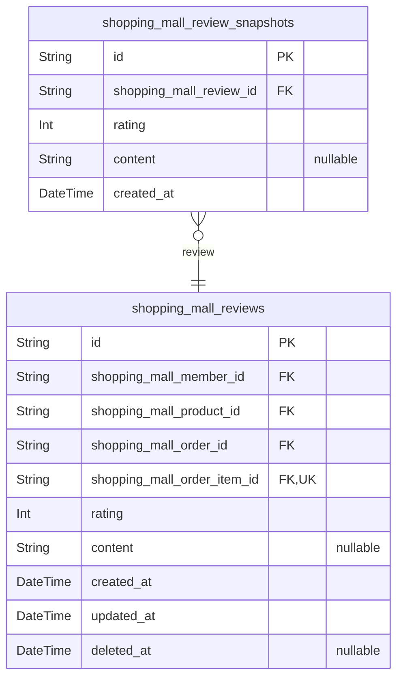

### `shopping_mall_reviews`

Customer reviews and ratings for purchased products with optional text
content.

Reviews are created by customers after receiving delivered order items.
Each review links to a specific product purchased through an order, with
the order_item reference enabling verification of delivery status before
review creation.

Rating is mandatory (1-5 stars) while text content is optional. Reviews
support soft deletion to preserve data integrity while hiding from public
display. Average product ratings are calculated from non-deleted reviews
only.

Properties as follows:

- `id`: Primary Key.
- `shopping_mall_member_id`
  > References the customer who wrote the review.
  >
  > Links to [shopping_mall_members](#shopping_mall_members) to identify the authenticated
  > customer account. This foreign key establishes ownership and enables
  > querying reviews by customer for their profile page.
- `shopping_mall_product_id`
  > References the product being reviewed.
  >
  > Links to [shopping_mall_products](#shopping_mall_products) to identify which product the
  > review is for. Enables displaying reviews on product detail pages and
  > calculating average product ratings.
- `shopping_mall_order_id`
  > References the order through which the product was purchased.
  >
  > Links to [shopping_mall_orders](#shopping_mall_orders) to establish the purchase context.
  > Used with product_id to enforce one review per product per order
  > constraint.
- `shopping_mall_order_item_id`
  > References the specific order item being reviewed.
  >
  > Links to [shopping_mall_order_items](#shopping_mall_order_items) to identify the exact
  > purchased item. This enables verification that the item status is
  > 'delivered' before allowing review creation. Unique constraint ensures
  > one review per order item.
- `rating`
  > Star rating from 1 to 5 stars.
  >
  > Mandatory rating value representing customer satisfaction. Used for
  > calculating average product ratings displayed on product pages. Must be
  > between 1 and 5 inclusive.
- `content`
  > Optional review text content.
  >
  > Customer's written feedback about the product. Can be empty if customer
  > only provides a star rating. Displayed on product detail pages alongside
  > the rating.
- `created_at`: Timestamp when the review was created.
- `updated_at`: Timestamp when the review was last updated.
- `deleted_at`: Timestamp when the review was soft deleted. Null if review is active.

### `shopping_mall_review_snapshots`

Immutable snapshots preserving review edit history for audit trail and
dispute resolution.

Each snapshot captures the complete state of a {@link
shopping_mall_reviews} record at the moment of edit, including rating and
content values. Snapshots are append-only and cannot be modified or
deleted, ensuring a complete audit trail for dispute resolution.

Snapshots are created automatically whenever a customer edits their
review. The snapshot preserves the exact values that were saved, enabling
administrators and relevant parties to view the history of changes. This
is critical for resolving disputes about review content modifications.

Related models: [shopping_mall_reviews](#shopping_mall_reviews) (parent review entity)

Properties as follows:

- `id`: Primary Key.
- `shopping_mall_review_id`
  > Reference to the parent review that this snapshot preserves.
  >
  > Each snapshot belongs to exactly one [shopping_mall_reviews](#shopping_mall_reviews)
  > record. The foreign key establishes the audit trail relationship,
  > enabling queries to retrieve all historical snapshots for a given review.
  > If the parent review is deleted, snapshots are retained for audit
  > purposes.
- `rating`
  > Star rating value at the time of snapshot creation.
  >
  > Captures the rating (1-5 stars) that was saved when this snapshot was
  > created. This denormalized field preserves the historical rating value
  > even if the parent review is subsequently modified. Used for audit trail
  > and dispute resolution.
- `content`
  > Review text content at the time of snapshot creation.
  >
  > Captures the optional text content that was saved when this snapshot was
  > created. This denormalized field preserves the historical content value
  > even if the parent review is subsequently modified or deleted. Can be
  > null if the review had no text content at snapshot time.
- `created_at`
  > Timestamp when this snapshot record was created.
  >
  > Records the exact moment when the snapshot was generated, which
  > corresponds to when the review was edited. Used for chronological
  > ordering of snapshots to reconstruct the edit history timeline. Immutable
  > after creation.
