# Prisma Markdown

> Generated by [`prisma-markdown`](https://github.com/samchon/prisma-markdown)

- [authorization](#authorization)
- [actors](#actors)
- [addresses](#addresses)
- [categories](#categories)
- [products](#products)
- [inventory](#inventory)
- [wishlist](#wishlist)
- [cart](#cart)
- [orders](#orders)
- [shipments](#shipments)
- [reviews](#reviews)
- [cancellation_refunds](#cancellation_refunds)
- [seller_approvals](#seller_approvals)
- [admin_promotions](#admin_promotions)

## authorization

```mermaid
erDiagram
"shopping_mall_customers" {
  String id PK
  String email UK
  String password_hash
  DateTime created_at
  DateTime updated_at
  DateTime deleted_at "nullable"
}
"shopping_mall_customer_sessions" {
  String id PK
  String shopping_mall_customer_id FK
  String access_token
  String refresh_token
  String ip
  String href
  String referrer
  DateTime created_at
  DateTime expired_at
}
"shopping_mall_customer_password_resets" {
  String id PK
  String shopping_mall_customer_id FK
  String token UK
  DateTime expires_at
  DateTime used_at "nullable"
  DateTime created_at
  DateTime updated_at
  DateTime deleted_at "nullable"
}
"shopping_mall_customer_email_verifications" {
  String id PK
  String shopping_mall_customer_id FK
  String token UK
  DateTime expires_at
  DateTime verified_at "nullable"
  DateTime created_at
  DateTime updated_at
  DateTime deleted_at "nullable"
}
"shopping_mall_sellers" {
  String id PK
  String email UK
  String password_hash
  DateTime created_at
  DateTime updated_at
  DateTime deleted_at "nullable"
}
"shopping_mall_seller_sessions" {
  String id PK
  String seller_id FK
  String ip
  String href
  String referrer
  DateTime created_at
  DateTime expired_at
}
"shopping_mall_seller_password_resets" {
  String id PK
  String shopping_mall_seller_id FK
  String token UK
  DateTime expires_at
  DateTime created_at
}
"shopping_mall_seller_email_verifications" {
  String id PK
  String shopping_mall_seller_id FK
  String token UK
  DateTime expires_at
  DateTime used_at "nullable"
  DateTime created_at
}
"shopping_mall_administrators" {
  String id PK
  String email UK
  String password_hash
  DateTime created_at
  DateTime updated_at
  DateTime deleted_at "nullable"
}
"shopping_mall_administrator_sessions" {
  String id PK
  String administrator_id FK
  String access_token_hash
  String refresh_token_hash
  String ip
  String href
  String referrer
  DateTime created_at
  DateTime expired_at
}
"shopping_mall_administrator_password_resets" {
  String id PK
  String administrator_id FK
  String token UK
  DateTime expires_at
  DateTime created_at
  DateTime updated_at
  DateTime deleted_at "nullable"
}
"shopping_mall_super_administrators" {
  String id PK
  String email UK
  String password_hash
  DateTime created_at
  DateTime updated_at
  DateTime deleted_at "nullable"
}
"shopping_mall_super_administrator_sessions" {
  String id PK
  String super_administrator_id FK
  String access_token
  String refresh_token
  String ip
  String href
  String referrer
  DateTime created_at
  DateTime expired_at
}
"shopping_mall_super_administrator_password_resets" {
  String id PK
  String shopping_mall_super_administrator_id FK
  String token UK
  DateTime expires_at
  DateTime created_at
}
"shopping_mall_customer_sessions" }o--|| "shopping_mall_customers" : customer
"shopping_mall_customer_password_resets" }o--|| "shopping_mall_customers" : customer
"shopping_mall_customer_email_verifications" }o--|| "shopping_mall_customers" : customer
"shopping_mall_seller_sessions" }o--|| "shopping_mall_sellers" : seller
"shopping_mall_seller_password_resets" }o--|| "shopping_mall_sellers" : seller
"shopping_mall_seller_email_verifications" }o--|| "shopping_mall_sellers" : seller
"shopping_mall_administrator_sessions" }o--|| "shopping_mall_administrators" : administrator
"shopping_mall_administrator_password_resets" }o--|| "shopping_mall_administrators" : administrator
"shopping_mall_super_administrator_sessions" }o--|| "shopping_mall_super_administrators" : superAdministrator
"shopping_mall_super_administrator_password_resets" }o--|| "shopping_mall_super_administrators" : superAdministrator
```

### `shopping_mall_customers`

Registered customer accounts with email/password authentication
credentials. This is the core customer identity table that authentication
sessions, password resets, and email verifications reference. Profile
information (display name, phone number) is stored in the separate {@link
shopping_mall_customer_profiles} table. Customers can delete their
accounts, which preserves orders and reviews for legal and seller record
purposes while removing profile data.

Properties as follows:

- `id`: Primary Key.
- `email`
  > Customer's email address used for authentication and communication. Must
  > be unique across all customers.
- `password_hash`
  > Bcrypt hashed password for authentication. Never store plain text
  > passwords.
- `created_at`: Timestamp when the customer account was created.
- `updated_at`: Timestamp when the customer account was last updated.
- `deleted_at`
  > Timestamp when the customer account was soft deleted. Null means account
  > is active.

### `shopping_mall_customer_sessions`

JWT session tokens for customer authentication with access and refresh
token support. Tracks login sessions with device information and
expiration timestamps for security management.

Properties as follows:

- `id`: Primary Key.
- `shopping_mall_customer_id`: Customer's [shopping_mall_customers.id](#shopping_mall_customers).
- `access_token`: JWT access token for API authentication.
- `refresh_token`: JWT refresh token for obtaining new access tokens.
- `ip`: IP address of the client device at login time.
- `href`: URL href of the client application at login time.
- `referrer`: HTTP referrer header from the login request.
- `created_at`: Session creation timestamp.
- `expired_at`: Session expiration timestamp for automatic invalidation.

### `shopping_mall_customer_password_resets`

Password reset tokens for customer password recovery. Each token is
single-use with expiration time for security. When customer requests
password reset, a new token is generated and sent via email. Token
becomes invalid after use or expiration.

Properties as follows:

- `id`: Primary Key.
- `shopping_mall_customer_id`: Customer's [shopping_mall_customers.id](#shopping_mall_customers).
- `token`: Unique password reset token sent to customer email.
- `expires_at`: Token expiration timestamp. Token invalid after this time.
- `used_at`: Timestamp when token was used for password reset. Null if unused.
- `created_at`: Record creation timestamp.
- `updated_at`: Record last update timestamp.
- `deleted_at`: Soft delete timestamp. Null if active.

### `shopping_mall_customer_email_verifications`

Email verification tokens for customer registration confirmation. Each
customer receives a unique token upon registration that must be verified
before account activation. Tokens expire after a configured time period
for security.

Properties as follows:

- `id`: Primary Key.
- `shopping_mall_customer_id`: Customer's [shopping_mall_customers.id](#shopping_mall_customers).
- `token`: Unique verification token sent to customer's email address.
- `expires_at`: Token expiration timestamp after which verification is no longer valid.
- `verified_at`
  > Timestamp when email was successfully verified. Null until verification
  > completed.
- `created_at`: Record creation timestamp.
- `updated_at`: Record last update timestamp.
- `deleted_at`: Soft delete timestamp. Null for active records.

### `shopping_mall_sellers`

Registered seller accounts with email/password authentication
credentials. This table stores the core seller identity used for
authentication. Shop profile information including shop name,
description, and logo is stored in [shopping_mall_seller_profiles](#shopping_mall_seller_profiles).
Seller approval workflow is tracked in {@link
shopping_mall_seller_approval_requests}.

Properties as follows:

- `id`: Primary Key.
- `email`: Unique email address for seller authentication and communication.
- `password_hash`: Bcrypt hashed password for authentication.
- `created_at`: Account creation timestamp.
- `updated_at`: Last profile update timestamp.
- `deleted_at`: Soft delete timestamp for account deletion.

### `shopping_mall_seller_sessions`

JWT session tokens for seller authentication with access and refresh
token support. Tracks login sessions for sellers with session metadata
and expiration. Each session belongs to exactly one seller and is created
during login, expired during logout or timeout.

Properties as follows:

- `id`: Primary Key.
- `seller_id`: Seller's [shopping_mall_sellers.id](#shopping_mall_sellers).
- `ip`: IP address of the client that created this session.
- `href`: URL where the login was initiated.
- `referrer`: Referrer URL that led to the login page.
- `created_at`: Timestamp when this session was created.
- `expired_at`
  > Timestamp when this session expires. Sessions are invalidated after this
  > time for security.

### `shopping_mall_seller_password_resets`

Password reset tokens for seller account recovery. Generated when sellers
request password reset via email, contains secure token and expiration
timestamp. Tokens are single-use and automatically expire after
configured duration. Managed through authentication flows, not direct
CRUD operations.

Properties as follows:

- `id`: Primary Key.
- `shopping_mall_seller_id`: Seller's [shopping_mall_sellers.id](#shopping_mall_sellers).
- `token`: Secure random token for password reset verification.
- `expires_at`: Token expiration timestamp after which reset is invalid.
- `created_at`: Record creation timestamp.

### `shopping_mall_seller_email_verifications`

Email verification tokens for seller registration confirmation. Stores
temporary tokens sent to seller email addresses during the registration
process. Each token is single-use and expires after a configured time
period. Once the seller clicks the verification link, the token is marked
as used and the seller account becomes active.

Properties as follows:

- `id`: Primary Key.
- `shopping_mall_seller_id`: Seller's [shopping_mall_sellers.id](#shopping_mall_sellers).
- `token`: Unique verification token sent via email.
- `expires_at`: Token expiration timestamp.
- `used_at`: Timestamp when the token was used for verification, null if not yet used.
- `created_at`: Record creation timestamp.

### `shopping_mall_administrators`

Administrator accounts with email/password authentication credentials.
Administrators manage seller approvals, categories, products, orders, and
user accounts. This table serves as the parent entity for administrator
sessions and password reset tokens.

Properties as follows:

- `id`: Primary Key.
- `email`: Unique email address for authentication and communication.
- `password_hash`: Bcrypt hashed password for secure authentication.
- `created_at`: Timestamp when the administrator account was created.
- `updated_at`: Timestamp when the administrator account was last updated.
- `deleted_at`: Timestamp when the administrator account was soft deleted, null if active.

### `shopping_mall_administrator_sessions`

JWT session tokens for administrator authentication with access and
refresh token support. Tracks login sessions for administrators with
session metadata including IP address, request URL, and referrer.
Sessions are append-only audit trails managed through authentication
flows.

Properties as follows:

- `id`: Primary Key.
- `administrator_id`: Administrator's [shopping_mall_administrators.id](#shopping_mall_administrators).
- `access_token_hash`: Hashed access token for session validation and revocation.
- `refresh_token_hash`: Hashed refresh token for token rotation and session extension.
- `ip`: IP address of the client that created this session.
- `href`: URL path where the login was initiated.
- `referrer`: Referrer URL that led to the login page.
- `created_at`: Timestamp when the session was created.
- `expired_at`: Timestamp when the session expires and becomes invalid.

### `shopping_mall_administrator_password_resets`

Password reset tokens for administrator accounts. Generated when
administrators request password recovery, sent via email, and validated
during password reset. Tokens expire after a short time window for
security. Each token is unique and can only be used once.

Properties as follows:

- `id`: Primary Key.
- `administrator_id`: Administrator's [shopping_mall_administrators.id](#shopping_mall_administrators).
- `token`: Unique password reset token sent to administrator's email.
- `expires_at`: Token expiration timestamp. Token is invalid after this time.
- `created_at`: Record creation timestamp.
- `updated_at`: Record update timestamp.
- `deleted_at`: Soft delete timestamp. Null means active record.

### `shopping_mall_super_administrators`

Super administrator accounts with elevated system privileges for managing
administrator promotions, demotions, and full system oversight.

Super administrators can promote regular administrators to super
administrator grade and demote other super administrators to regular
administrator grade. They cannot demote themselves. This table stores
authentication credentials and is referenced by
administrator_grade_changes for audit trail.

Properties as follows:

- `id`: Primary Key.
- `email`: Email address for authentication and login.
- `password_hash`: Bcrypt hashed password for authentication.
- `created_at`: Account creation timestamp.
- `updated_at`: Last profile update timestamp.
- `deleted_at`: Soft delete timestamp for account deactivation.

### `shopping_mall_super_administrator_sessions`

JWT session tokens for super administrator authentication with access and
refresh token support. Tracks login sessions for security audit and
session management.

Properties as follows:

- `id`: Primary Key.
- `super_administrator_id`: Super Administrator's [shopping_mall_super_administrators.id](#shopping_mall_super_administrators).
- `access_token`: JWT access token for API authentication.
- `refresh_token`: JWT refresh token for obtaining new access tokens.
- `ip`: IP address of the client that created this session.
- `href`: URL where the login was initiated.
- `referrer`: Referrer URL from the login request.
- `created_at`: Timestamp when this session was created.
- `expired_at`: Timestamp when this session expires and becomes invalid.

### `shopping_mall_super_administrator_password_resets`

Password reset tokens with expiration for super administrator password
recovery. Tokens are single-use and expire after a configured time window
for security.

Properties as follows:

- `id`: Primary Key.
- `shopping_mall_super_administrator_id`: Super Administrator's [shopping_mall_super_administrators.id](#shopping_mall_super_administrators).
- `token`: Unique password reset token sent to the super administrator's email.
- `expires_at`: Token expiration timestamp after which the reset link becomes invalid.
- `created_at`: Timestamp when the password reset request was created.

## actors

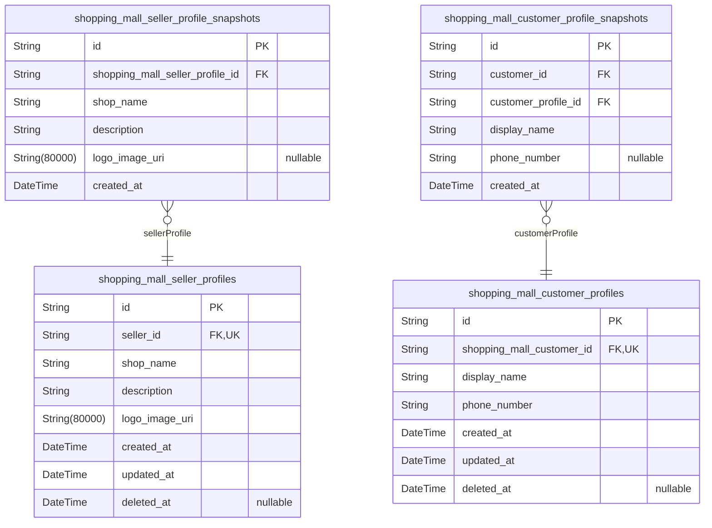

### `shopping_mall_customer_profiles`

Customer profile information extending basic authentication with display
name and phone number. Each customer has exactly one profile linked to
their identity in [shopping_mall_customers](#shopping_mall_customers). Profile data is
editable by the customer and changes are tracked in {@link
shopping_mall_customer_profile_snapshots} for audit trail.

Properties as follows:

- `id`: Primary Key.
- `shopping_mall_customer_id`: Customer's [shopping_mall_customers.id](#shopping_mall_customers).
- `display_name`
  > Customer's public display name shown in orders, reviews, and profile
  > pages.
- `phone_number`: Customer's contact phone number for order notifications and support.
- `created_at`: Timestamp when the profile was created.
- `updated_at`: Timestamp when the profile was last updated.
- `deleted_at`: Timestamp when the profile was soft deleted, null if active.

### `shopping_mall_seller_profiles`

Seller shop profile information extending the seller actor with
business-facing details. Contains shop name, description, and logo image
that customers view. Each seller has exactly one profile (1:1
relationship). Approval status is tracked separately in
shopping_mall_seller_approval_requests.

Properties as follows:

- `id`: Primary Key.
- `seller_id`
  > Seller's [shopping_mall_sellers.id](#shopping_mall_sellers). Unique constraint enforces 1:1
  > relationship.
- `shop_name`: Public-facing shop name displayed to customers.
- `description`: Shop description providing business details to customers.
- `logo_image_uri`: Shop logo image URL for brand identification.
- `created_at`: Timestamp when the profile was created.
- `updated_at`: Timestamp when the profile was last updated.
- `deleted_at`: Timestamp when the profile was soft deleted (null if active).

### `shopping_mall_seller_profile_snapshots`

Immutable snapshots of seller profile changes preserving shop name,
description, and logo at each modification point. Used for audit trail
and dispute resolution. Each snapshot represents the complete state of a
seller profile at a specific moment in time.

Properties as follows:

- `id`: Primary Key.
- `shopping_mall_seller_profile_id`: Target's [shopping_mall_seller_profiles.id](#shopping_mall_seller_profiles).
- `shop_name`: Shop name at the time of snapshot.
- `description`: Shop description at the time of snapshot.
- `logo_image_uri`: Shop logo image URL at the time of snapshot.
- `created_at`: Timestamp when this snapshot was created.

### `shopping_mall_customer_profile_snapshots`

Immutable point-in-time snapshots of customer profile changes for audit
trail and data recovery. Each snapshot captures the display name and
phone number at the moment of profile modification, enabling historical
reconstruction and dispute resolution. References {@link
shopping_mall_customer_profiles} and [shopping_mall_customers](#shopping_mall_customers).

Properties as follows:

- `id`: Primary Key.
- `customer_id`: Customer's [shopping_mall_customers.id](#shopping_mall_customers).
- `customer_profile_id`: Customer profile's [shopping_mall_customer_profiles.id](#shopping_mall_customer_profiles).
- `display_name`: Snapshot of customer's display name at time of change.
- `phone_number`: Snapshot of customer's phone number at time of change.
- `created_at`: Timestamp when the snapshot was created (when profile was modified).

## addresses

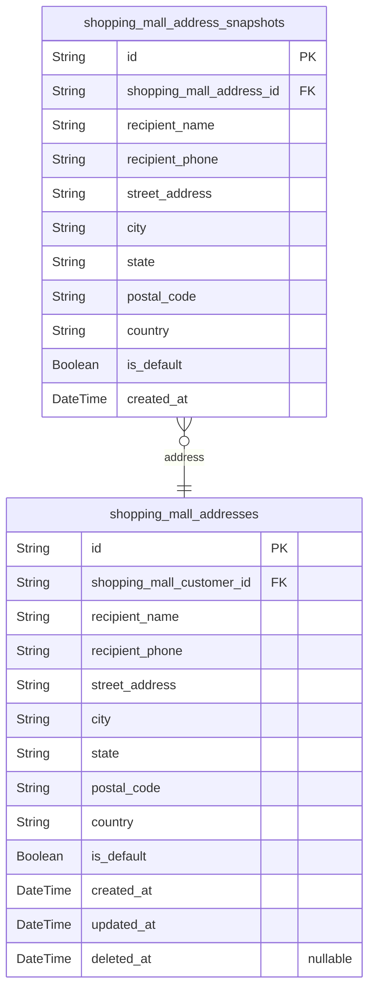

### `shopping_mall_addresses`

Customer shipping addresses storing recipient name, phone number, street
address, city, state/province, postal code, country, and default
designation flag. Each customer can have multiple addresses with one
marked as default for checkout convenience.

Properties as follows:

- `id`: Primary Key.
- `shopping_mall_customer_id`: Customer's [shopping_mall_customers.id](#shopping_mall_customers).
- `recipient_name`: Name of the person who receives packages at this address.
- `recipient_phone`: Phone number for delivery contact at this address.
- `street_address`: Street address including building number and street name.
- `city`: City or municipality name.
- `state`: State, province, or region name.
- `postal_code`: Postal or ZIP code for mail delivery.
- `country`: Country name for international shipping.
- `is_default`: Whether this address is the customer's default shipping address.
- `created_at`: Timestamp when this address was created.
- `updated_at`: Timestamp when this address was last updated.
- `deleted_at`: Timestamp when this address was soft deleted (null if active).

### `shopping_mall_address_snapshots`

Immutable snapshots of customer address changes preserving complete
address state at each modification point for audit trail and dispute
resolution. Each snapshot captures recipient name, phone, and full
address fields at the moment of change. Snapshots are append-only and
cannot be modified or deleted, ensuring permanent historical record of
all address modifications.

Properties as follows:

- `id`: Primary Key.
- `shopping_mall_address_id`: Parent address's [shopping_mall_addresses.id](#shopping_mall_addresses).
- `recipient_name`: Recipient name at the time of snapshot.
- `recipient_phone`: Phone number at the time of snapshot.
- `street_address`: Street address at the time of snapshot.
- `city`: City at the time of snapshot.
- `state`: State or province at the time of snapshot.
- `postal_code`: Postal code at the time of snapshot.
- `country`: Country at the time of snapshot.
- `is_default`: Whether this address was marked as default at the time of snapshot.
- `created_at`: Timestamp when this snapshot was created.

## categories

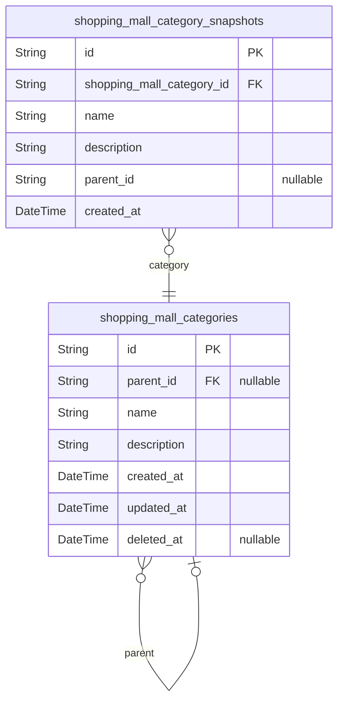

### `shopping_mall_categories`

Product classification categories with one-level hierarchical nesting
(categories and subcategories). Administrators create and manage
categories; customers browse them for product discovery. Top-level
categories have null parent_id; subcategories reference their parent
category.

Properties as follows:

- `id`: Primary Key.
- `parent_id`
  > Parent category's [shopping_mall_categories.id](#shopping_mall_categories). Null for top-level
  > categories.
- `name`: Category name for display and navigation.
- `description`: Category description explaining the product classification.
- `created_at`: Timestamp when the category was created.
- `updated_at`: Timestamp when the category was last modified.
- `deleted_at`: Timestamp when the category was soft deleted. Null if active.

### `shopping_mall_category_snapshots`

Immutable audit trail preserving complete category state at each
modification point. Captures name, description, and parent category
relationship as they existed when the snapshot was created. Used for
dispute resolution and historical reconstruction of category changes.
Append-only - snapshots are never modified or deleted.

Properties as follows:

- `id`: Primary Key.
- `shopping_mall_category_id`: Category's [shopping_mall_categories.id](#shopping_mall_categories).
- `name`: Category name at the time of snapshot creation.
- `description`: Category description at the time of snapshot creation.
- `parent_id`
  > Parent category ID at the time of snapshot creation. Null for top-level
  > categories.
- `created_at`: Timestamp when this snapshot was created.

## products

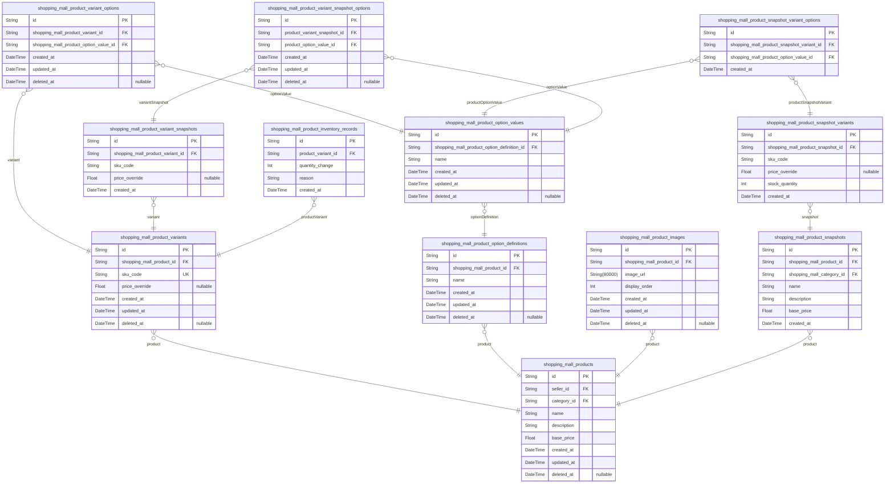

### `shopping_mall_products`

Core product listings in the shopping mall catalog. Each product
represents an item for sale with a name, description, category
classification, and base price. Products are owned by sellers who create
and manage them. Products can have multiple variants (SKUs) representing
different option combinations, multiple images for display, and maintain
an immutable snapshot history of all modifications for dispute
resolution. When deleted, products are hidden from search and category
listings but snapshots and historical order data are preserved.

Properties as follows:

- `id`: Primary Key.
- `seller_id`: Seller's [shopping_mall_sellers.id](#shopping_mall_sellers).
- `category_id`: Category's [shopping_mall_categories.id](#shopping_mall_categories).
- `name`: Product name displayed to customers.
- `description`: Detailed product description with specifications and features.
- `base_price`
  > Base price of the product in the platform's currency. Individual variants
  > may override this price.
- `created_at`: Timestamp when the product was first created.
- `updated_at`: Timestamp when the product was last modified.
- `deleted_at`: Timestamp when the product was soft-deleted. Null if active.

### `shopping_mall_product_variants`

SKU variants representing specific option combinations for products. Each
variant has a unique SKU code, optional price override, and tracks stock
through inventory records. Variants are managed through their parent
product and can be deleted only if no pending orders exist.

Properties as follows:

- `id`: Primary Key.
- `shopping_mall_product_id`: Parent product's [shopping_mall_products.id](#shopping_mall_products).
- `sku_code`: Unique stock keeping unit identifier for this variant.
- `price_override`
  > Optional price that overrides the parent product's base price. Null means
  > use base price.
- `created_at`: Timestamp when this variant was created.
- `updated_at`: Timestamp when this variant was last updated.
- `deleted_at`: Timestamp when this variant was soft deleted. Null means active.

### `shopping_mall_product_option_definitions`

Configurable option type definitions for products such as Color, Size, or
Material. Each product can have multiple option definitions, and each
definition has multiple available values stored in {@link
shopping_mall_product_option_values}. Option definitions are managed
through their parent product and are deleted when the product is deleted.

Properties as follows:

- `id`: Primary Key.
- `shopping_mall_product_id`: Parent product's [shopping_mall_products.id](#shopping_mall_products).
- `name`: Option type name such as 'Color', 'Size', or 'Material'.
- `created_at`: Record creation timestamp.
- `updated_at`: Record last update timestamp.
- `deleted_at`: Soft delete timestamp, null if not deleted.

### `shopping_mall_product_option_values`

Available values for product option definitions such as Red, Blue, Large,
Small. Each value belongs to exactly one option definition and is used to
construct product variant option combinations.

Properties as follows:

- `id`: Primary Key.
- `shopping_mall_product_option_definition_id`
  > Parent option definition's {@link
  > shopping_mall_product_option_definitions.id}.
- `name`: Display name of this option value (e.g., Red, Blue, Large, Small).
- `created_at`: Timestamp when this option value was created.
- `updated_at`: Timestamp when this option value was last updated.
- `deleted_at`: Timestamp when this option value was soft deleted (null if active).

### `shopping_mall_product_variant_options`

Junction table linking product variants to their selected option values.
Each variant can have multiple option values representing its specific
configuration (e.g., Color=Red, Size=Large). This enables flexible
product option combinations without hardcoding option types.

Properties as follows:

- `id`: Primary Key.
- `shopping_mall_product_variant_id`: Product variant's [shopping_mall_product_variants.id](#shopping_mall_product_variants).
- `shopping_mall_product_option_value_id`: Option value's [shopping_mall_product_option_values.id](#shopping_mall_product_option_values).
- `created_at`: Record creation timestamp.
- `updated_at`: Record last update timestamp.
- `deleted_at`: Soft delete timestamp, null if not deleted.

### `shopping_mall_product_images`

Product images with ordering where the first image (index 0) serves as
the main thumbnail. Multiple images can be attached to each product for
display in listings and detail pages. Images are managed through the
parent product and included in product snapshots when modified.

Properties as follows:

- `id`: Primary Key.
- `shopping_mall_product_id`: Product's [shopping_mall_products.id](#shopping_mall_products).
- `image_url`: URL of the uploaded product image file.
- `display_order`
  > Zero-based ordering index where 0 is the main thumbnail image displayed
  > first.
- `created_at`: Timestamp when this image was uploaded.
- `updated_at`: Timestamp when this image was last modified.
- `deleted_at`: Timestamp when this image was soft deleted, null if active.

### `shopping_mall_product_snapshots`

Immutable audit trail preserving complete product state at each
modification point. Captures product name, description, category
assignment, and base price at the moment of change. Each snapshot is
permanently stored for dispute resolution and historical reconstruction.
Related variant states are captured in {@link
shopping_mall_product_snapshot_variants}.

Properties as follows:

- `id`: Primary Key.
- `shopping_mall_product_id`: Product's [shopping_mall_products.id](#shopping_mall_products).
- `shopping_mall_category_id`: Category's [shopping_mall_categories.id](#shopping_mall_categories) at time of snapshot.
- `name`: Product name at time of snapshot.
- `description`: Product description at time of snapshot.
- `base_price`: Product base price at time of snapshot.
- `created_at`: Timestamp when this snapshot was created.

### `shopping_mall_product_snapshot_variants`

Variant states captured within product snapshots for complete historical
reconstruction. Each record preserves the SKU code, price override, and
stock quantity of a variant at the moment the parent product snapshot was
created. Immutable audit trail for dispute resolution.

Properties as follows:

- `id`: Primary Key.
- `shopping_mall_product_snapshot_id`: Parent product snapshot's [shopping_mall_product_snapshots.id](#shopping_mall_product_snapshots).
- `sku_code`: SKU code of the variant at the time of snapshot.
- `price_override`
  > Price override value at the time of snapshot. Null means base price was
  > used.
- `stock_quantity`: Stock quantity of the variant at the time of snapshot.
- `created_at`: Timestamp when this snapshot variant was created.

### `shopping_mall_product_variant_snapshots`

Immutable snapshots of product variant states capturing SKU code, price
override, and option combinations at each modification point. Provides
complete audit trail for individual variant changes, enabling historical
reconstruction of variant states for dispute resolution and compliance.
Each snapshot is linked to a specific product variant and preserves the
exact configuration at the time of change.

Properties as follows:

- `id`: Primary Key.
- `shopping_mall_product_variant_id`: Parent variant's [shopping_mall_product_variants.id](#shopping_mall_product_variants).
- `sku_code`
  > SKU code at the time of snapshot, uniquely identifying this variant
  > configuration.
- `price_override`: Price override at the time of snapshot, null if using product base price.
- `created_at`
  > Timestamp when this snapshot was created, recording when the variant
  > state was captured.

### `shopping_mall_product_inventory_records`

Immutable audit trail of all stock quantity changes for product variants.
Each record captures a single stock movement with quantity_change
(positive for restocking, negative for orders or adjustments), reason
explaining the change, and timestamp. Current stock quantity is
calculated by summing all quantity_change values for a variant. Records
are automatically created on order placement, cancellation, refund, and
manual seller adjustments.

Properties as follows:

- `id`: Primary Key.
- `product_variant_id`: Product variant's [shopping_mall_product_variants.id](#shopping_mall_product_variants).
- `quantity_change`
  > Stock quantity change amount. Positive for restocking, negative for
  > orders, cancellations, or adjustments.
- `reason`
  > Reason for the inventory change such as restock, order placement, order
  > cancellation, refund, or manual adjustment.
- `created_at`: Timestamp when the inventory record was created.

### `shopping_mall_product_snapshot_variant_options`

Junction table linking product snapshot variants to their option values,
capturing the exact option combination at the time of product snapshot.
Each record represents one option value (e.g., Color: Red) associated
with a snapshot variant. Multiple records per snapshot variant form the
complete option set (e.g., Color: Red + Size: Large). Enables
reconstruction of historical variant configurations for dispute
resolution and audit purposes.

Properties as follows:

- `id`: Primary Key.
- `shopping_mall_product_snapshot_variant_id`
  > Parent snapshot variant's {@link
  > shopping_mall_product_snapshot_variants.id}.
- `shopping_mall_product_option_value_id`
  > Option value's [shopping_mall_product_option_values.id](#shopping_mall_product_option_values) at the time
  > of snapshot.
- `created_at`: Timestamp when this snapshot variant option association was created.

### `shopping_mall_product_variant_snapshot_options`

Junction table capturing the exact option combination (e.g., Color: Red,
Size: Large) for each product variant snapshot, enabling complete
historical reconstruction of variant configurations at any point in time.
Links [shopping_mall_product_variant_snapshots](#shopping_mall_product_variant_snapshots) to {@link
shopping_mall_product_option_values}.

Properties as follows:

- `id`: Primary Key.
- `product_variant_snapshot_id`
  > Parent variant snapshot's {@link
  > shopping_mall_product_variant_snapshots.id}.
- `product_option_value_id`: Option value's [shopping_mall_product_option_values.id](#shopping_mall_product_option_values).
- `created_at`: Timestamp when this option association was created.
- `updated_at`: Timestamp when this option association was last updated.
- `deleted_at`: Timestamp when this option association was soft deleted (null if active).

## inventory

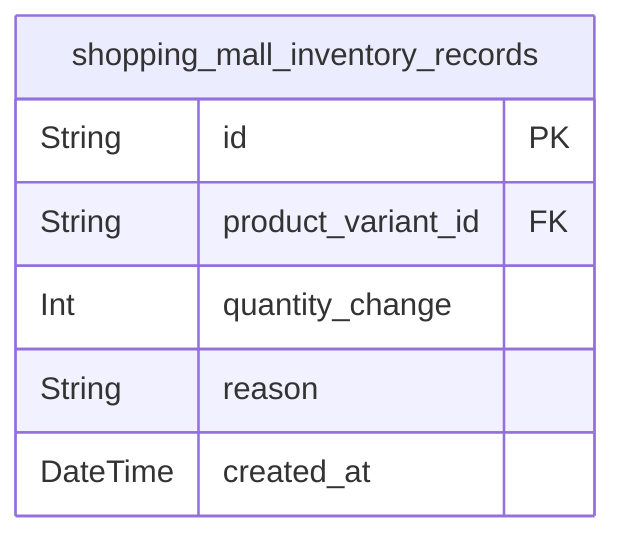

### `shopping_mall_inventory_records`

Immutable audit trail of all stock quantity changes for product variants.
Each record captures a single stock movement event with quantity change
(positive for restocking, negative for orders/adjustments), reason
categorization, and timestamp. Current stock quantity is calculated by
summing all quantity_change values for a variant. Records are
automatically created during order placement, cancellation, refund
processing, and manual seller inventory adjustments. This table follows
append-only pattern - records are never updated or deleted.

Properties as follows:

- `id`: Primary Key.
- `product_variant_id`: Product variant's [shopping_mall_product_variants.id](#shopping_mall_product_variants).
- `quantity_change`
  > Stock quantity change amount. Positive values for restocking, negative
  > values for orders, cancellations, refunds, or adjustments.
- `reason`
  > Reason code for the inventory change. Examples: 'restock', 'order',
  > 'cancellation', 'refund', 'adjustment', 'loss'.
- `created_at`: Timestamp when the inventory change was recorded.

## wishlist

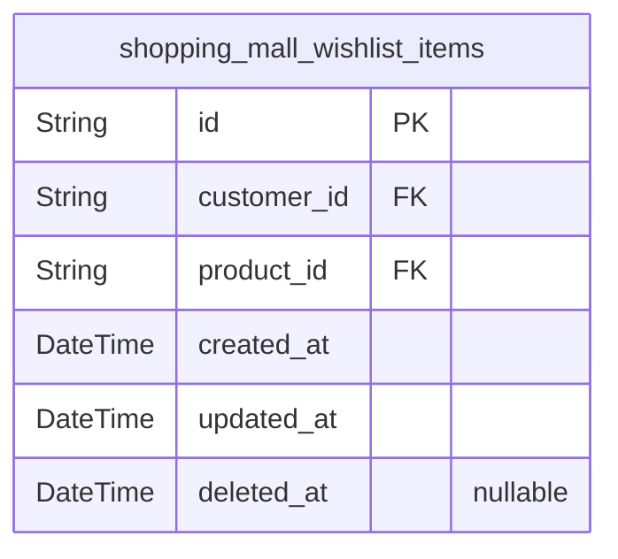

### `shopping_mall_wishlist_items`

Junction table linking customers to saved products with creation
timestamp for paginated display and sorting. Automatically removes
entries when products are deleted or customers delete their accounts.

Properties as follows:

- `id`: Primary Key.
- `customer_id`: Customer's [shopping_mall_customers.id](#shopping_mall_customers).
- `product_id`: Product's [shopping_mall_products.id](#shopping_mall_products).
- `created_at`
  > Timestamp when the product was added to wishlist, used for sorting and
  > pagination.
- `updated_at`: Timestamp when the wishlist item record was last updated.
- `deleted_at`: Timestamp when the wishlist item was soft deleted, null if active.

## cart

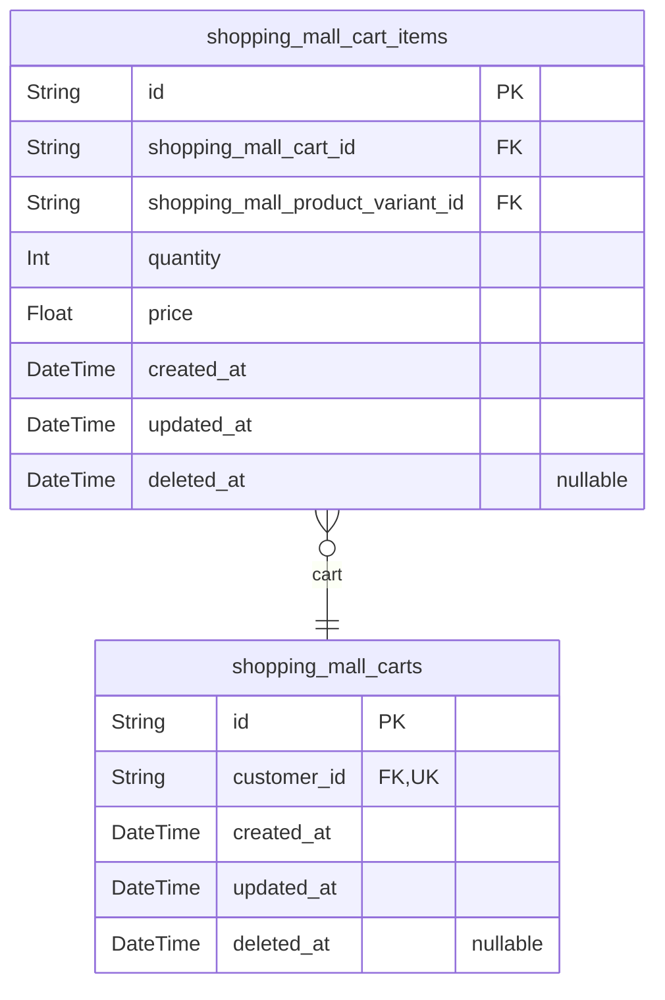

### `shopping_mall_carts`

Shopping carts for customers, providing a persistent workspace for items
before checkout. Each customer has exactly one active cart that persists
across sessions. Cart items are stored separately in {@link
shopping_mall_cart_items} with variant references and quantity tracking.

Properties as follows:

- `id`: Primary Key.
- `customer_id`: Customer's [shopping_mall_customers.id](#shopping_mall_customers).
- `created_at`: Timestamp when the cart was first created.
- `updated_at`: Timestamp when the cart was last modified.
- `deleted_at`: Timestamp when the cart was soft deleted, null if active.

### `shopping_mall_cart_items`

Individual items in shopping carts, each referencing a specific product
variant with quantity and price snapshot at time of addition.

Cart items are subsidiary entities managed through their parent {@link
shopping_mall_carts}. Each item represents a specific product variant
with a defined quantity and unit price captured at the time of addition.
The unique constraint on (cart_id, product_variant_id) ensures the same
variant cannot appear multiple times in a cart; instead, quantities are
combined when adding the same variant again.

Price is denormalized as a snapshot to maintain consistent display and
checkout calculation even if the product variant's price changes later.
Temporal fields track item lifecycle with soft delete support via
deleted_at.

Properties as follows:

- `id`: Primary Key.
- `shopping_mall_cart_id`: Parent cart's [shopping_mall_carts.id](#shopping_mall_carts).
- `shopping_mall_product_variant_id`: Product variant's [shopping_mall_product_variants.id](#shopping_mall_product_variants).
- `quantity`: Quantity of this variant in the cart.
- `price`
  > Unit price snapshot at time of adding to cart, used for consistent
  > display and checkout calculation.
- `created_at`: Timestamp when this item was added to the cart.
- `updated_at`: Timestamp when this item was last modified.
- `deleted_at`
  > Timestamp when this item was soft deleted (removed from cart). Null if
  > active.

## orders

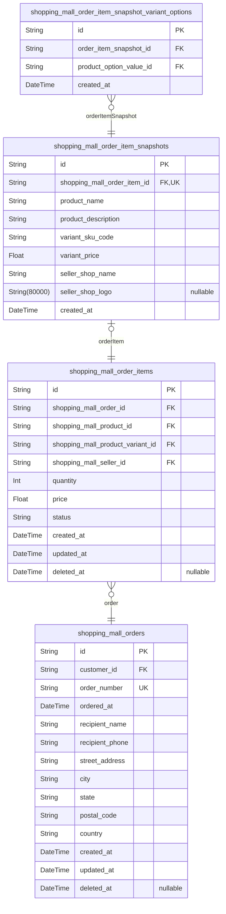

### `shopping_mall_orders`

Customer purchase transactions with order number, order date, and
immutable shipping address snapshot. Order status is derived from
order_items (paid/shipped/delivered/cancelled/refunded). Each order
belongs to one customer and contains one or more order items.

Properties as follows:

- `id`: Primary Key.
- `customer_id`: Customer's [shopping_mall_customers.id](#shopping_mall_customers).
- `order_number`: Unique order number for customer-facing reference and support lookup.
- `ordered_at`: Timestamp when the order was placed.
- `recipient_name`
  > Recipient name from shipping address at time of purchase (immutable
  > snapshot).
- `recipient_phone`
  > Recipient phone number from shipping address at time of purchase
  > (immutable snapshot).
- `street_address`
  > Street address from shipping address at time of purchase (immutable
  > snapshot).
- `city`: City from shipping address at time of purchase (immutable snapshot).
- `state`
  > State/province from shipping address at time of purchase (immutable
  > snapshot).
- `postal_code`
  > Postal code from shipping address at time of purchase (immutable
  > snapshot).
- `country`: Country from shipping address at time of purchase (immutable snapshot).
- `created_at`: Record creation timestamp.
- `updated_at`: Record last update timestamp.
- `deleted_at`
  > Soft delete timestamp (orders are typically never deleted for legal
  > purposes).

### `shopping_mall_order_items`

Individual purchased variants within orders with quantity, price, and
status tracking. Each order item represents one SKU purchased by a
customer, linked to its parent order, product, variant, and seller.
Status is tracked independently per item to support individual
cancellation and refund workflows. Price is snapshotted at purchase time
to preserve transaction state.

Properties as follows:

- `id`: Primary Key.
- `shopping_mall_order_id`: Parent order's [shopping_mall_orders.id](#shopping_mall_orders).
- `shopping_mall_product_id`: Purchased product's [shopping_mall_products.id](#shopping_mall_products).
- `shopping_mall_product_variant_id`: Purchased variant's [shopping_mall_product_variants.id](#shopping_mall_product_variants).
- `shopping_mall_seller_id`: Selling seller's [shopping_mall_sellers.id](#shopping_mall_sellers).
- `quantity`: Number of units purchased for this variant.
- `price`: Unit price at time of purchase, snapshotted to preserve transaction state.
- `status`: Individual item status: paid, shipped, delivered, cancelled, or refunded.
- `created_at`: Timestamp when the order item was created.
- `updated_at`: Timestamp when the order item was last updated.
- `deleted_at`: Timestamp when the order item was soft deleted, null if active.

### `shopping_mall_order_item_snapshots`

Immutable snapshots preserving complete product, variant, and seller
profile state at time of purchase for dispute resolution and audit trail.
Each order item has exactly one snapshot capturing the exact state when
the order was placed. References related entities: {@link
shopping_mall_order_items} for the source order item, {@link
shopping_mall_products} for product details, {@link
shopping_mall_product_variants} for variant information, {@link
shopping_mall_seller_profiles} for seller shop information.

Properties as follows:

- `id`: Primary Key.
- `shopping_mall_order_item_id`: Shopping Mall Order Item's [shopping_mall_order_items.id](#shopping_mall_order_items).
- `product_name`: Snapshot of product name at time of purchase.
- `product_description`: Snapshot of product description at time of purchase.
- `variant_sku_code`: Snapshot of variant SKU code at time of purchase.
- `variant_price`
  > Snapshot of variant price at time of purchase, may override product base
  > price.
- `seller_shop_name`: Snapshot of seller's shop name at time of purchase.
- `seller_shop_logo`: Snapshot of seller's shop logo URL at time of purchase.
- `created_at`: Timestamp when the snapshot was created (purchase time).

### `shopping_mall_order_item_snapshot_variant_options`

Junction table linking order item snapshots to their selected product
option values, capturing the exact option combination (e.g., Color=Red,
Size=Large) at time of purchase for normalized querying and 1NF
compliance.

References [shopping_mall_order_item_snapshots](#shopping_mall_order_item_snapshots) for the snapshot
containing variant state at purchase time, and {@link
shopping_mall_product_option_values} for the specific option values. Each
row represents one option value assigned to an order item snapshot,
enabling proper 1NF normalization instead of storing composite option
strings.

Properties as follows:

- `id`: Primary Key.
- `order_item_snapshot_id`: Target's [shopping_mall_order_item_snapshots.id](#shopping_mall_order_item_snapshots).
- `product_option_value_id`: Target's [shopping_mall_product_option_values.id](#shopping_mall_product_option_values).
- `created_at`: Record creation timestamp.

## shipments

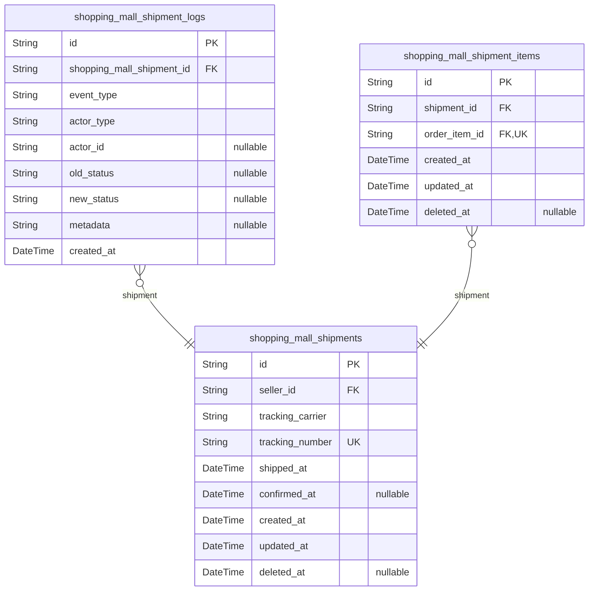

### `shopping_mall_shipments`

Shipments representing packages sent by sellers with tracking information
and delivery status. Each shipment can contain multiple order items from
the same seller. All items in a shipment share the same tracking
information. Customers confirm delivery per shipment, or items
auto-confirm after 14 days from shipping.

Properties as follows:

- `id`: Primary Key.
- `seller_id`: Seller's [shopping_mall_sellers.id](#shopping_mall_sellers).
- `tracking_carrier`: Name of the shipping carrier (e.g., FedEx, UPS, DHL).
- `tracking_number`: Tracking number provided by the carrier for package tracking.
- `shipped_at`: Timestamp when the shipment was sent out by the seller.
- `confirmed_at`
  > Timestamp when the customer confirmed delivery. Null if not yet confirmed
  > (auto-confirmed after 14 days from shipped_at).
- `created_at`: Timestamp when the shipment was created.
- `updated_at`: Timestamp when the shipment was last updated.
- `deleted_at`: Timestamp when the shipment was soft deleted (null if active).

### `shopping_mall_shipment_logs`

Immutable audit log of shipment lifecycle events including status
changes, tracking updates, and delivery confirmations. Each entry records
the event type, actor who triggered it, status transition, and contextual
metadata. Append-only table for compliance and dispute resolution.

Properties as follows:

- `id`: Primary Key.
- `shopping_mall_shipment_id`: Shipment's [shopping_mall_shipments.id](#shopping_mall_shipments).
- `event_type`
  > Type of shipment event: 'created', 'tracking_updated',
  > 'delivery_confirmed', 'auto_delivered'.
- `actor_type`
  > Type of actor who triggered the event: 'customer', 'seller',
  > 'administrator', 'system'.
- `actor_id`
  > ID of the actor who triggered the event. Stored as plain field for
  > historical integrity.
- `old_status`
  > Previous shipment status before this event. Null for initial creation
  > events.
- `new_status`: New shipment status after this event.
- `metadata`
  > Additional context about the event such as carrier name, tracking number,
  > or delivery confirmation details.
- `created_at`: Timestamp when this log entry was created.

### `shopping_mall_shipment_items`

Junction table associating order items with shipments. Each order item
belongs to exactly one shipment, while shipments can contain multiple
order items from the same seller. All items in a shipment share the same
tracking information and delivery confirmation status.

Properties as follows:

- `id`: Primary Key.
- `shipment_id`: Shipment's [shopping_mall_shipments.id](#shopping_mall_shipments).
- `order_item_id`: Order item's [shopping_mall_order_items.id](#shopping_mall_order_items).
- `created_at`: Creation timestamp when item was added to shipment.
- `updated_at`: Last update timestamp.
- `deleted_at`: Soft delete timestamp for data retention and recovery.

## reviews

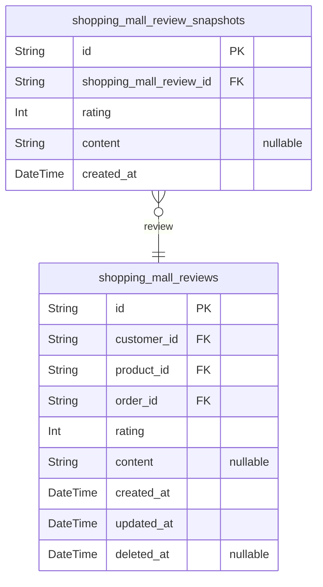

### `shopping_mall_reviews`

Customer reviews with ratings for purchased products. Each review links a
customer to a product they purchased through a specific order. Enforces
one review per product per order constraint. Reviews can be edited
(creating snapshots) and soft-deleted while preserving historical data
for dispute resolution.

Properties as follows:

- `id`: Primary Key.
- `customer_id`: Review author's [shopping_mall_customers.id](#shopping_mall_customers).
- `product_id`: Reviewed product's [shopping_mall_products.id](#shopping_mall_products).
- `order_id`
  > Purchase order's [shopping_mall_orders.id](#shopping_mall_orders) containing the reviewed
  > product.
- `rating`: Star rating from 1 to 5 stars.
- `content`: Optional review text content describing customer experience.
- `created_at`: Timestamp when the review was first created.
- `updated_at`: Timestamp when the review was last modified.
- `deleted_at`: Timestamp when the review was soft-deleted, null if active.

### `shopping_mall_review_snapshots`

Immutable snapshots preserving previous rating and text content when
reviews are edited. Each snapshot captures the complete state of a review
at a point in time for audit trail and dispute resolution. References
[shopping_mall_reviews](#shopping_mall_reviews) for the current review state.

Properties as follows:

- `id`: Primary Key.
- `shopping_mall_review_id`: Review's [shopping_mall_reviews.id](#shopping_mall_reviews).
- `rating`: Review rating from 1 to 5 stars at the time of snapshot.
- `content`: Optional review text content at the time of snapshot.
- `created_at`: Timestamp when this snapshot was created.

## cancellation_refunds

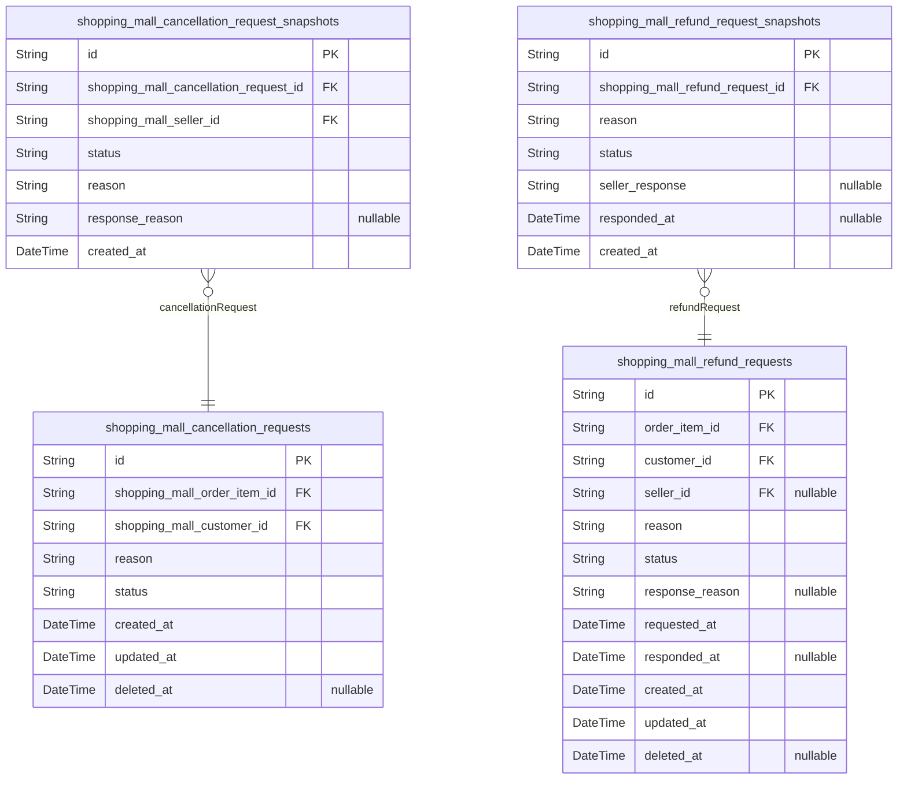

### `shopping_mall_cancellation_requests`

Customer cancellation requests for individual order items with paid
status before shipping. Each request targets one order item and includes
a reason text. Sellers review and respond to requests with approval or
rejection. Approved requests trigger item cancellation and stock
restoration via inventory records.

Properties as follows:

- `id`: Primary Key.
- `shopping_mall_order_item_id`: Target's [shopping_mall_order_items.id](#shopping_mall_order_items).
- `shopping_mall_customer_id`: Target's [shopping_mall_customers.id](#shopping_mall_customers).
- `reason`: Customer's reason for requesting cancellation.
- `status`: Current approval status: pending, approved, or rejected.
- `created_at`: Timestamp when the cancellation request was created.
- `updated_at`: Timestamp when the cancellation request was last updated.
- `deleted_at`: Timestamp when the cancellation request was soft deleted (null if active).

### `shopping_mall_cancellation_request_snapshots`

Immutable snapshots capturing cancellation request state when seller
responds. Each snapshot preserves the request status, customer reason,
seller response, and timestamp for audit trail and dispute resolution.
References [shopping_mall_cancellation_requests](#shopping_mall_cancellation_requests).

Properties as follows:

- `id`: Primary Key.
- `shopping_mall_cancellation_request_id`: Cancellation request's [shopping_mall_cancellation_requests.id](#shopping_mall_cancellation_requests).
- `shopping_mall_seller_id`
  > Seller's [shopping_mall_sellers.id](#shopping_mall_sellers) who responded to this
  > cancellation request.
- `status`
  > Cancellation request status at time of snapshot: pending, approved, or
  > rejected.
- `reason`: Customer's cancellation reason provided in the request.
- `response_reason`: Seller's response reason for approval or rejection. Null if pending.
- `created_at`: Timestamp when this snapshot was created.

### `shopping_mall_refund_requests`

Customer refund requests for delivered order items. Customers can request
refunds within 7 days of delivery. Sellers review and approve or reject
each request with a response reason. Approved refunds restore stock
quantities via inventory records.

Each refund request is associated with exactly one order item and
initiated by the customer who placed the order. The request remains in
pending status until a seller responds with either approval or rejection.
Sellers provide a response reason explaining their decision. The {@link
shopping_mall_refund_request_snapshots} table preserves immutable
snapshots of refund request state when sellers respond.

Properties as follows:

- `id`: Primary Key.
- `order_item_id`: Order item's [shopping_mall_order_items.id](#shopping_mall_order_items).
- `customer_id`: Customer's [shopping_mall_customers.id](#shopping_mall_customers).
- `seller_id`
  > Seller's [shopping_mall_sellers.id](#shopping_mall_sellers) who responded to this request.
  > Null if no response yet.
- `reason`: Customer's reason for requesting the refund.
- `status`: Current status: pending, approved, or rejected.
- `response_reason`
  > Seller's explanation for the approval or rejection decision. Null if
  > pending.
- `requested_at`: Timestamp when the refund request was submitted.
- `responded_at`: Timestamp when the seller responded to the request. Null if pending.
- `created_at`: Record creation timestamp.
- `updated_at`: Record last update timestamp.
- `deleted_at`: Soft delete timestamp. Null if not deleted.

### `shopping_mall_refund_request_snapshots`

Immutable snapshots of refund request state created when sellers respond
to refund requests. Preserves the complete state including customer's
reason, request status, seller's response, and response timestamp at the
moment of snapshot creation. Used for audit trail and dispute resolution.
Append-only and cannot be modified or deleted.

Properties as follows:

- `id`: Primary Key.
- `shopping_mall_refund_request_id`: Parent refund request's [shopping_mall_refund_requests.id](#shopping_mall_refund_requests).
- `reason`: Customer's reason for requesting refund at time of snapshot.
- `status`: Refund request status at time of snapshot (pending, approved, rejected).
- `seller_response`
  > Seller's response text or rejection reason provided when responding to
  > the refund request.
- `responded_at`
  > Timestamp when seller responded to the refund request, creating this
  > snapshot.
- `created_at`: Timestamp when this snapshot record was created.

## seller_approvals

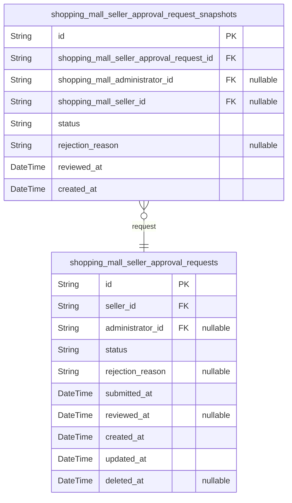

### `shopping_mall_seller_approval_requests`

Seller registration requests submitted for administrator review with
current approval status. Each request represents a seller's application
to gain selling privileges on the platform. Administrators review and
approve or reject requests, providing rejection reasons when applicable.
Tracks submission and review timestamps for workflow management.

Properties as follows:

- `id`: Primary Key.
- `seller_id`
  > Seller's [shopping_mall_sellers.id](#shopping_mall_sellers) who submitted the approval
  > request.
- `administrator_id`
  > Administrator's [shopping_mall_administrators.id](#shopping_mall_administrators) who reviewed the
  > request. Null until request is reviewed.
- `status`: Current approval status: pending, approved, or rejected.
- `rejection_reason`
  > Reason provided by administrator when request is rejected. Null for
  > pending or approved requests.
- `submitted_at`: Timestamp when the seller submitted the approval request.
- `reviewed_at`
  > Timestamp when the administrator reviewed the request. Null until review
  > occurs.
- `created_at`: Record creation timestamp.
- `updated_at`: Record last update timestamp.
- `deleted_at`: Soft delete timestamp. Null for active records.

### `shopping_mall_seller_approval_request_snapshots`

Immutable audit trail preserving complete state of seller approval
requests at each modification point. Each snapshot captures the approval
status, rejection reason (if applicable), administrator who reviewed, and
timestamp. Used for dispute resolution and historical tracking of the
approval workflow. References {@link
shopping_mall_seller_approval_requests} as parent, {@link
shopping_mall_administrators} for reviewer, and {@link
shopping_mall_sellers} for seller ownership.

Properties as follows:

- `id`: Primary Key.
- `shopping_mall_seller_approval_request_id`
  > Parent approval request's {@link
  > shopping_mall_seller_approval_requests.id}.
- `shopping_mall_administrator_id`
  > Administrator's [shopping_mall_administrators.id](#shopping_mall_administrators) who reviewed this
  > request at snapshot time.
- `shopping_mall_seller_id`
  > Seller's [shopping_mall_sellers.id](#shopping_mall_sellers) who submitted the parent
  > request at snapshot time.
- `status`: Approval status at the time of snapshot: pending, approved, rejected.
- `rejection_reason`: Administrator's rejection reason if status is rejected, null otherwise.
- `reviewed_at`: Timestamp when the administrator reviewed and created this snapshot.
- `created_at`: Record creation timestamp.

## admin_promotions

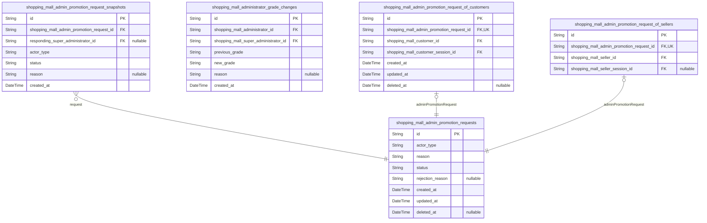

### `shopping_mall_admin_promotion_requests`

Administrator promotion requests submitted by users (customers or
sellers) to gain admin access. Super administrators review and approve or
reject these requests.

Uses polymorphic ownership pattern with actor_type discriminator.
Specific actor relationships are managed through subtype tables: {@link
shopping_mall_admin_promotion_request_of_customers} for customer
submitters and [shopping_mall_admin_promotion_request_of_sellers](#shopping_mall_admin_promotion_request_of_sellers)
for seller submitters.

Status workflow: pending (awaiting review) → approved (granted admin
access) or rejected (denied by super administrator).

Properties as follows:

- `id`: Primary Key.
- `actor_type`
  > Discriminator indicating which actor type submitted this request
  > (customer or seller). Used with subtype tables for polymorphic ownership.
- `reason`: User's written justification for requesting administrator role promotion.
- `status`
  > Current approval workflow status: pending (awaiting review), approved
  > (granted admin access), or rejected (denied by super administrator).
- `rejection_reason`
  > Explanation provided by super administrator when rejecting a request.
  > Null for pending or approved requests.
- `created_at`: Timestamp when the promotion request was submitted.
- `updated_at`: Timestamp when the request was last modified (e.g., status changed).
- `deleted_at`: Timestamp for soft deletion. Null for active requests.

### `shopping_mall_admin_promotion_request_snapshots`

Immutable snapshots capturing the complete state of administrator
promotion requests at each status change point. Each snapshot preserves
the actor type, status, decision reason, and responding super
administrator at the moment of change, providing an audit trail for
dispute resolution and compliance. References {@link
shopping_mall_admin_promotion_requests}.

Properties as follows:

- `id`: Primary Key.
- `shopping_mall_admin_promotion_request_id`
  > Parent promotion request's {@link
  > shopping_mall_admin_promotion_requests.id}.
- `responding_super_administrator_id`
  > Super administrator who made the decision's {@link
  > shopping_mall_super_administrators.id}.
- `actor_type`: Type of actor who submitted the request: customer or seller.
- `status`: Request status at snapshot time: pending, approved, or rejected.
- `reason`
  > Decision reason provided by super administrator, required for rejected
  > requests.
- `created_at`: Timestamp when this snapshot was created.

### `shopping_mall_administrator_grade_changes`

Immutable audit trail of administrator grade changes when super
administrators promote or demote other administrators. Records
transitions between regular administrator and super administrator grades
for accountability and system oversight.

Properties as follows:

- `id`: Primary Key.
- `shopping_mall_administrator_id`
  > The administrator whose grade was changed. {@link
  > shopping_mall_administrators.id}.
- `shopping_mall_super_administrator_id`
  > The super administrator who performed the grade change. {@link
  > shopping_mall_super_administrators.id}.
- `previous_grade`
  > The administrator's grade before the change: 'administrator' or
  > 'super_administrator'.
- `new_grade`
  > The administrator's grade after the change: 'administrator' or
  > 'super_administrator'.
- `reason`: Optional reason or note for the grade change.
- `created_at`: Timestamp when the grade change was recorded.

### `shopping_mall_admin_promotion_request_of_customers`

Subtype table linking administrator promotion requests to customer
actors. Implements polymorphic ownership pattern where the main
admin_promotion_requests table holds common fields and this table
provides the customer-specific foreign key relationship. Each promotion
request is linked to exactly one customer actor.

Properties as follows:

- `id`: Primary Key.
- `shopping_mall_admin_promotion_request_id`
  > Parent's [shopping_mall_admin_promotion_requests.id](#shopping_mall_admin_promotion_requests). Unique
  > constraint ensures 1:1 relationship.
- `shopping_mall_customer_id`
  > Customer's [shopping_mall_customers.id](#shopping_mall_customers). The customer who submitted
  > the promotion request.
- `shopping_mall_customer_session_id`
  > Customer session's [shopping_mall_customer_sessions.id](#shopping_mall_customer_sessions). Audit
  > trail of which session was used to submit the request.
- `created_at`: Timestamp when the subtype record was created.
- `updated_at`: Timestamp when the subtype record was last updated.
- `deleted_at`: Timestamp for soft delete. Null if active.

### `shopping_mall_admin_promotion_request_of_sellers`

Subtype table linking administrator promotion requests to seller actors.
Implements polymorphic ownership pattern where each promotion request is
associated with exactly one seller. The unique constraint on
shopping_mall_admin_promotion_request_id enforces 1:1 relationship,
ensuring a request cannot be linked to multiple sellers.

Properties as follows:

- `id`: Primary Key.
- `shopping_mall_admin_promotion_request_id`
  > Target's [shopping_mall_admin_promotion_requests.id](#shopping_mall_admin_promotion_requests). Unique
  > foreign key enforcing 1:1 relationship between promotion request and
  > seller.
- `shopping_mall_seller_id`
  > Target's [shopping_mall_sellers.id](#shopping_mall_sellers). The seller who submitted the
  > promotion request.
- `shopping_mall_seller_session_id`
  > Target's [shopping_mall_seller_sessions.id](#shopping_mall_seller_sessions). The seller session
  > used when submitting the request, for audit purposes.
