# Prisma Markdown

> Generated by [`prisma-markdown`](https://github.com/samchon/prisma-markdown)

- [Actors](#actors)
- [Categories](#categories)
- [Products](#products)
- [Inventory](#inventory)
- [Wishlist](#wishlist)
- [Carts](#carts)
- [Orders](#orders)
- [Shipments](#shipments)
- [Reviews](#reviews)
- [Disputes](#disputes)
- [Administration](#administration)

## Actors

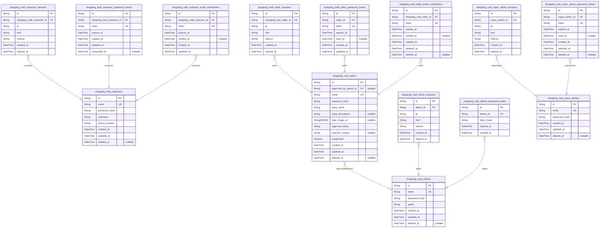

### `shopping_mall_customers`

Registered customer accounts with email and password credentials for
shopping operations. This table serves as the primary identity record for
customers who can browse products, add items to cart, place orders, write
reviews, and manage their profiles and addresses. Customer accounts
support soft deletion to preserve order history and reviews while
removing personal credentials.

Related entities: [shopping_mall_customer_sessions](#shopping_mall_customer_sessions) for
authentication sessions, [shopping_mall_customer_password_resets](#shopping_mall_customer_password_resets)
for account recovery, [shopping_mall_customer_email_verifications](#shopping_mall_customer_email_verifications)
for email confirmation, [shopping_mall_orders](#shopping_mall_orders) for purchase
history, [shopping_mall_reviews](#shopping_mall_reviews) for product feedback.

Properties as follows:

- `id`: Primary Key.
- `email`
  > Customer's email address used for authentication and communication. Must
  > be unique across all customer accounts.
- `password_hash`
  > Bcrypt hashed password for customer authentication. Never stores plain
  > text passwords.
- `nickname`
  > Customer's display name shown in reviews and public-facing content. Can
  > be updated by the customer.
- `phone_number`
  > Customer's contact phone number for order notifications and delivery
  > coordination.
- `created_at`
  > Timestamp when the customer account was created. Used for auditing and
  > account age verification.
- `updated_at`
  > Timestamp when the customer account was last updated. Tracks profile
  > modifications and credential changes.
- `deleted_at`
  > Timestamp when the customer account was soft deleted. Null for active
  > accounts. Preserves order history and reviews while removing
  > authentication credentials.

### `shopping_mall_customer_sessions`

JWT session tokens for customer authentication with access and refresh
token support. Tracks customer login sessions with connection metadata
including IP address, initial page URL, and referrer. Sessions are
append-only audit records that expire based on security policies.

Properties as follows:

- `id`: Primary Key.
- `shopping_mall_customer_id`: Belonged customer's [shopping_mall_customers.id](#shopping_mall_customers)
- `ip`: Client IP address at session creation for security auditing.
- `href`: Initial page URL where the session was created.
- `referrer`: Referrer URL from which the session originated.
- `created_at`: Session creation timestamp.
- `expired_at`
  > Session expiration timestamp for security. Sessions are invalid after
  > this time.

### `shopping_mall_customer_password_resets`

Password reset tokens for customer account recovery. Each record
represents a password reset request with a unique token that expires
after a specified time period. Tokens are single-use and marked as
consumed when successfully used for password reset. Multiple reset
requests can exist per customer, with only the most recent unexpired
token being valid.

This is a subsidiary table managed through the parent customer entity,
not independently accessed by users.

Properties as follows:

- `id`: Primary Key.
- `shopping_mall_customer_id`
  > Customer who requested the password reset. {@link
  > shopping_mall_customers.id}
- `token`
  > Unique password reset token sent to customer's email. Used to verify
  > identity during password reset process.
- `expires_at`
  > Timestamp when this reset token becomes invalid. Tokens typically expire
  > after 1-24 hours for security.
- `created_at`: Timestamp when the password reset request was created.
- `updated_at`: Timestamp when the password reset record was last updated.
- `consumed_at`
  > Timestamp when this token was successfully used to reset password. Null
  > if token has not been used or has expired.

### `shopping_mall_customer_email_verifications`

Email verification tokens for customer registration confirmation. Stores
verification codes sent to customer email addresses during registration
or email change requests. Each token has an expiration time and tracks
whether it has been successfully verified. Tokens are consumed after
verification or expiration.

Properties as follows:

- `id`: Primary Key.
- `shopping_mall_customer_id`: Belonged customer's [shopping_mall_customers.id](#shopping_mall_customers).
- `token`: Verification token code sent to customer email.
- `expires_at`: Token expiration timestamp. Token becomes invalid after this time.
- `verified_at`
  > Timestamp when token was successfully verified. Null if not yet verified
  > or expired.
- `created_at`: Record creation timestamp.
- `updated_at`: Record last update timestamp.

### `shopping_mall_sellers`

Registered seller accounts with email/password credentials for product
management and order processing. Sellers require administrator approval
before they can list products and manage inventory. This table serves as
the canonical identity record for the seller actor type, with
authentication credentials and shop profile attributes. Sessions are
tracked in [shopping_mall_seller_sessions](#shopping_mall_seller_sessions), password resets in
[shopping_mall_seller_password_resets](#shopping_mall_seller_password_resets), and email verifications in
[shopping_mall_seller_email_verifications](#shopping_mall_seller_email_verifications).

Properties as follows:

- `id`: Primary Key.
- `approved_by_admin_id`
  > Administrator who approved or rejected this seller account. {@link
  > shopping_mall_admins.id}.
- `email`: Unique email address for seller authentication and communication.
- `password_hash`: Bcrypt hashed password for seller authentication.
- `shop_name`: Display name of the seller's shop or store.
- `shop_description`: Detailed description of the shop's products, brand, and business.
- `logo_image_url`: URL to the shop's logo or brand image.
- `approval_status`
  > Admin approval status: PENDING (awaiting review), APPROVED (can list
  > products), REJECTED (application denied).
- `rejection_reason`: Reason provided by administrator if approval was rejected.
- `suspended`
  > Whether the seller account is temporarily suspended. Suspended sellers
  > cannot create or edit products but can process existing orders.
- `created_at`: Timestamp when the seller account was created.
- `updated_at`: Timestamp when the seller account was last updated.
- `deleted_at`
  > Timestamp when the seller account was soft deleted. Null if account is
  > active.

### `shopping_mall_seller_sessions`

JWT session tokens for seller authentication with access and refresh
token support.

This table tracks all login sessions for seller accounts, storing
connection metadata and temporal information for security auditing. Each
session represents an authenticated connection with token-based access
control.

Sessions are created during seller login and track the connection context
including IP address, request URL, and referrer. The expired_at field
enforces session lifetime limits for security. Sessions form an
append-only audit trail of seller authentication events.

Related to [shopping_mall_sellers](#shopping_mall_sellers) through many-to-one relationship
(one seller can have multiple active sessions).

Properties as follows:

- `id`: Primary Key.
- `shopping_mall_seller_id`: Belonged seller's [shopping_mall_sellers.id](#shopping_mall_sellers).
- `ip`
  > IP address of the client connection for security auditing and session
  > tracking.
- `href`: Full URL of the login request for connection context tracking.
- `referrer`: HTTP referrer header indicating the page that initiated the login request.
- `created_at`: Timestamp when the session was created (login time).
- `expired_at`
  > Timestamp when the session expires and becomes invalid for security
  > enforcement.

### `shopping_mall_seller_password_resets`

Password reset tokens for seller account recovery. Each record represents
a password reset request with a unique token and expiration timestamp.
Tokens are single-use and become invalid after expiration or when used.
This table supports the password recovery flow by allowing sellers to
request password resets via email with time-limited tokens.

Properties as follows:

- `id`: Primary Key.
- `seller_id`: Seller account requesting password reset. [shopping_mall_sellers.id](#shopping_mall_sellers)
- `token`
  > Unique password reset token sent to seller's email. Used to verify reset
  > request authenticity.
- `expires_at`
  > Timestamp when the reset token expires and becomes invalid. Typically
  > 1-24 hours from creation.
- `used_at`
  > Timestamp when the token was successfully used to reset password. Null if
  > not yet used or expired.
- `created_at`: Timestamp when the password reset request was created.
- `updated_at`: Timestamp when the password reset record was last updated.

### `shopping_mall_seller_email_verifications`

Email verification tokens for seller registration confirmation.

Stores verification tokens sent to seller email addresses during
registration. Each token has an expiration time and tracks when (if) the
email was verified. Multiple verification attempts can exist per seller
(e.g., if token expires and user requests resend).

Related to [shopping_mall_sellers](#shopping_mall_sellers) through seller_id foreign key.
Managed automatically through authentication flows, not direct user
operations.

Properties as follows:

- `id`: Primary Key.
- `shopping_mall_seller_id`
  > Seller account this verification token belongs to. {@link
  > shopping_mall_sellers.id}.
- `token`
  > Unique verification token sent via email to the seller. Used to confirm
  > email ownership during registration.
- `expires_at`
  > Timestamp when this verification token expires. Tokens are invalid after
  > this time.
- `verified_at`
  > Timestamp when the email was successfully verified using this token. Null
  > if not yet verified or expired.
- `created_at`: Timestamp when this verification record was created.
- `updated_at`: Timestamp when this verification record was last updated.
- `deleted_at`: Timestamp when this verification record was soft deleted. Null if active.

### `shopping_mall_admins`

Administrator accounts with elevated privileges for platform management
and seller approval.

Represents authenticated administrators who can manage categories,
approve seller registrations, view all products and orders, ban users,
and oversee platform operations. The grade field distinguishes between
regular administrators (ADMIN) and super administrators (SUPER_ADMIN) who
have additional privileges to manage other administrators.

This table serves as the primary identity record for administrators with
its own authentication flow. Sessions are stored in {@link
shopping_mall_admin_sessions} and password reset tokens in {@link
shopping_mall_admin_password_resets}. Admin promotion requests are
tracked in [shopping_mall_admin_requests](#shopping_mall_admin_requests) and reviewed by super
administrators.

Categories are created by administrators via the created_by_admin_id
foreign key reference.

Properties as follows:

- `id`: Primary Key.
- `email`
  > Administrator's email address used for authentication and login. Must be
  > unique across all administrator accounts.
- `password_hash`
  > Bcrypt-hashed password for secure authentication. Never stored in plain
  > text.
- `grade`
  > Administrator privilege level. ADMIN: Can manage categories, approve
  > sellers, view products/orders, ban users. SUPER_ADMIN: Can also manage
  > other administrators (promote/demote) and approve admin requests.
- `created_at`: Timestamp when the administrator account was created.
- `updated_at`: Timestamp when the administrator account was last updated.
- `deleted_at`
  > Timestamp when the administrator account was soft-deleted (deactivated).
  > Null means the account is active.

### `shopping_mall_admin_sessions`

Login session tracking for administrator authentication. Each record
represents one authenticated admin session with connection metadata
including IP address, request URL, and referrer. Sessions have expiration
timestamps for security and are used to validate admin access tokens
during platform management operations.

This table is a child of shopping_mall_admins with a many-to-one
relationship (one admin can have multiple concurrent sessions). Sessions
are created on successful login and validated on each authenticated
request. Expired sessions require re-authentication.

Properties as follows:

- `id`: Primary Key.
- `admin_id`: Administrator who owns this session. [shopping_mall_admins.id](#shopping_mall_admins).
- `ip`
  > IP address from which the admin logged in. Used for security auditing and
  > session validation.
- `href`
  > Full URL (href) of the page where the login was initiated. Captures the
  > entry point for audit purposes.
- `referrer`
  > HTTP referrer header value indicating the previous page. Used for
  > tracking navigation flow and security analysis.
- `created_at`: Timestamp when this session was created (login time).
- `expired_at`
  > Timestamp when this session expires. Sessions are invalid after this time
  > and require re-authentication.

### `shopping_mall_admin_password_resets`

Password reset tokens for administrator account recovery. Each token is
generated when an administrator requests a password reset and expires
after a defined period. Tokens are single-use and invalidated after
successful password change or expiration.

Properties as follows:

- `id`: Primary Key.
- `admin_id`
  > Administrator account requesting password reset. {@link
  > shopping_mall_admins.id}.
- `token_hash`
  > Hashed password reset token for secure verification. Token is sent to
  > administrator's email and must match to complete password reset.
- `expired_at`
  > Token expiration timestamp. Reset requests must be completed before this
  > time or the token becomes invalid.
- `created_at`: Timestamp when the password reset request was created.

### `shopping_mall_super_admins`

Super administrator accounts with the highest privilege level for
platform oversight and administrator management. Super admins can
promote/demote administrators, approve admin promotion requests, and have
full access to all platform operations. This table stores authentication
credentials and account state for super administrator users.

Properties as follows:

- `id`: Primary Key.
- `email`
  > Email address for authentication, unique across all super administrator
  > accounts.
- `password_hash`: Bcrypt hashed password for secure authentication.
- `created_at`: Timestamp when the super administrator account was created.
- `updated_at`: Timestamp when the super administrator account was last updated.
- `deleted_at`
  > Timestamp when the super administrator account was soft deleted, null if
  > active.

### `shopping_mall_super_admin_sessions`

JWT session tokens for super administrator authentication with access and
refresh token support. Tracks login sessions for super administrators
including connection metadata (IP address, request URL, referrer) and
session lifecycle timestamps. Each session is tied to exactly one super
administrator and is used for authentication and audit trail purposes.

Properties as follows:

- `id`: Primary Key.
- `super_admin_id`
  > Super administrator who owns this session. {@link
  > shopping_mall_super_admins.id}.
- `ip`: IP address of the client that initiated this session.
- `href`: Full URL (href) of the page where the login was initiated.
- `referrer`: HTTP referrer header indicating the page that linked to the login page.
- `created_at`: Timestamp when this session was created (login time).
- `expired_at`: Timestamp when this session expires and becomes invalid.

### `shopping_mall_super_admin_password_resets`

Password reset tokens for super administrator account recovery. Each
token is generated when a super admin requests password reset, has an
expiration time for security, and is marked as used after successful
password change. Tokens are single-use and expire automatically.

Properties as follows:

- `id`: Primary Key.
- `super_admin_id`: Belonged super administrator's [shopping_mall_super_admins.id](#shopping_mall_super_admins).
- `token`: Unique password reset token sent to the super administrator's email.
- `expires_at`
  > Token expiration timestamp. Token becomes invalid after this time for
  > security.
- `used_at`: Timestamp when the token was used to reset password. Null if not yet used.
- `created_at`: Timestamp when the password reset token was created.
- `updated_at`: Timestamp when the password reset token was last updated.
- `deleted_at`
  > Timestamp when the password reset token was soft deleted. Null if not
  > deleted.

## Categories

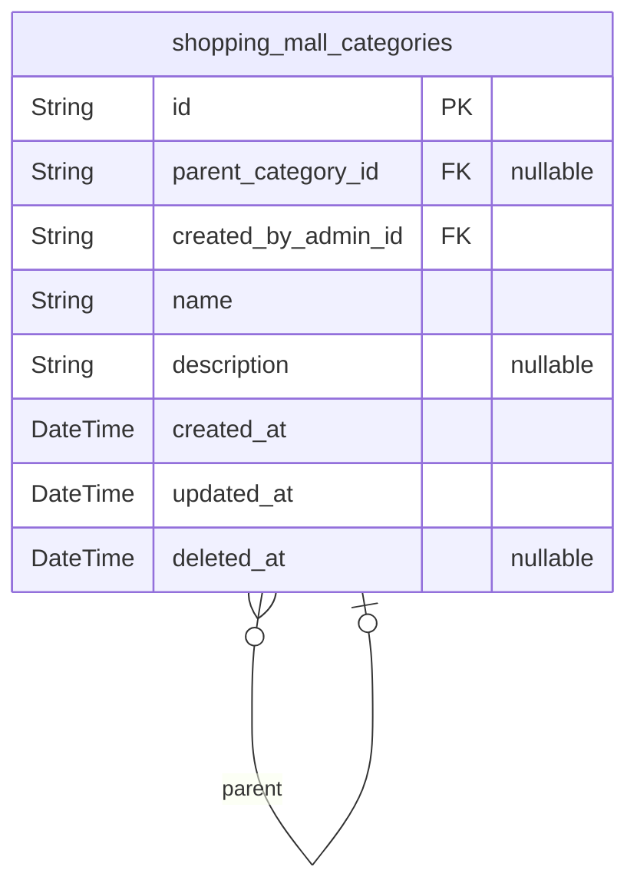

### `shopping_mall_categories`

Product classification categories with one-level nesting hierarchy for
organizing products in the catalog. Categories are created and managed by
administrators, supporting parent-child relationships where each category
can have at most one parent level. Products reference categories for
classification and filtering.

Properties as follows:

- `id`: Primary Key.
- `parent_category_id`
  > Parent category's [shopping_mall_categories.id](#shopping_mall_categories) for hierarchical
  > nesting. Null for root-level categories.
- `created_by_admin_id`: Administrator's [shopping_mall_admins.id](#shopping_mall_admins) who created this category.
- `name`: Category name for display and identification.
- `description`: Category description explaining the product classification scope.
- `created_at`: Timestamp when the category was created.
- `updated_at`: Timestamp when the category was last updated.
- `deleted_at`: Timestamp when the category was soft-deleted. Null if active.

## Products

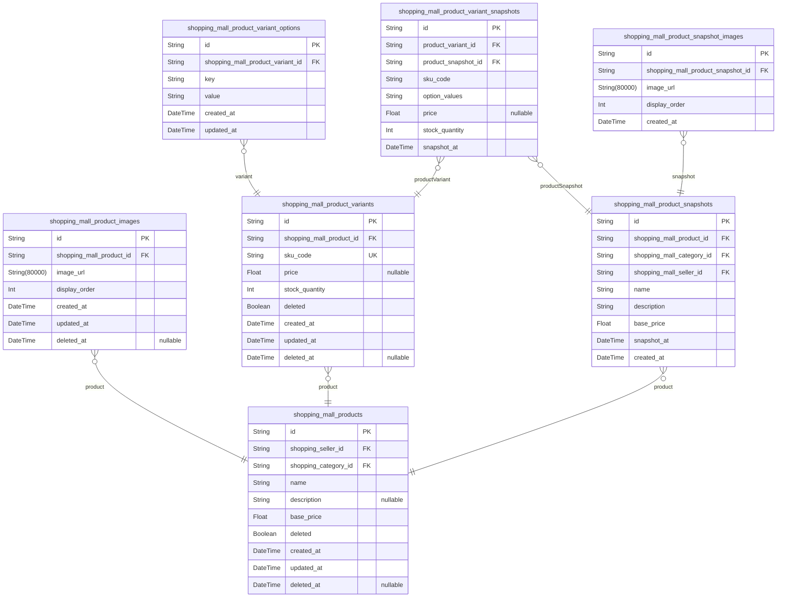

### `shopping_mall_products`

Main product listings in the shopping mall catalog. Each product
represents an item for sale with a name, description, and base price.
Products are owned by sellers and classified into categories. This table
maintains active product state, while historical states are preserved in
[shopping_mall_product_snapshots](#shopping_mall_product_snapshots) for order integrity. Soft delete
(deleted flag) hides products from search while preserving them for
existing order references.

Properties as follows:

- `id`: Primary Key.
- `shopping_seller_id`
  > Owner seller's [shopping_mall_sellers.id](#shopping_mall_sellers). Products belong to
  > exactly one seller who manages the listing.
- `shopping_category_id`
  > Assigned category's [shopping_mall_categories.id](#shopping_mall_categories). Products are
  > classified into exactly one category for organization and browsing.
- `name`
  > Product name displayed in listings and search results. Should be
  > descriptive and unique within seller's catalog.
- `description`
  > Detailed product description explaining features, specifications, and
  > usage information. Supports rich text formatting.
- `base_price`
  > Base price of the product in the platform's currency. Individual variant
  > prices may override this value. Must be positive.
- `deleted`
  > Soft delete flag. When true, product is hidden from search and browsing
  > but preserved for historical order references. Defaults to false.
- `created_at`
  > Timestamp when the product was first created. Immutable after initial
  > insertion.
- `updated_at`
  > Timestamp when the product was last modified. Updated on every edit
  > operation.
- `deleted_at`
  > Timestamp when the product was soft deleted. Null if product is active.
  > Used for audit trail and potential recovery.

### `shopping_mall_product_images`

Product images providing visual representation for product listings. Each
product can have multiple images arranged in a specific display order.
Images are managed through their parent product and support soft deletion
for removal while preserving historical data.

Properties as follows:

- `id`: Primary Key.
- `shopping_mall_product_id`: Belonged product's [shopping_mall_products.id](#shopping_mall_products).
- `image_url`: URL of the product image stored in cloud storage or CDN.
- `display_order`
  > Display order of the image within the product's image gallery. Lower
  > numbers appear first.
- `created_at`: Timestamp when the product image was created.
- `updated_at`: Timestamp when the product image was last updated.
- `deleted_at`: Timestamp when the product image was soft deleted. Null if active.

### `shopping_mall_product_variants`

Product variants representing different configurations (SKU) of a
product. Each variant has a unique SKU code, optional price override, and
stock quantity. Variant option values (e.g., color, size) are stored in
the child table shopping_mall_product_variant_options to maintain 1NF
compliance. Variants are managed by sellers through their products and
are referenced by cart items, order items, and inventory records. Soft
delete support allows variants to be hidden while preserving historical
order data.

Properties as follows:

- `id`: Primary Key.
- `shopping_mall_product_id`: Belonged product's [shopping_mall_products.id](#shopping_mall_products).
- `sku_code`
  > Unique stock keeping unit code identifying this specific variant
  > configuration.
- `price`
  > Optional price override for this variant. If null, the product's base
  > price is used.
- `stock_quantity`: Current available stock quantity for this variant.
- `deleted`
  > Whether this variant has been soft deleted and should be hidden from
  > catalog.
- `created_at`: Timestamp when this variant was first created.
- `updated_at`: Timestamp when this variant was last updated.
- `deleted_at`: Timestamp when this variant was soft deleted. Null if not deleted.

### `shopping_mall_product_snapshots`

Immutable point-in-time captures of product state referenced by order
items for historical accuracy. Each snapshot preserves the product's
name, description, category, and base price at the moment of creation,
ensuring order history remains accurate even if the original product is
modified or deleted. Snapshots are created when products are edited and
are never modified or deleted. Contains multiple {@link
shopping_mall_product_snapshot_images} and referenced by {@link
shopping_mall_order_items}.

Properties as follows:

- `id`: Primary Key.
- `shopping_mall_product_id`
  > Parent product's [shopping_mall_products.id](#shopping_mall_products) that this snapshot
  > captures.
- `shopping_mall_category_id`
  > Category's [shopping_mall_categories.id](#shopping_mall_categories) at the time of snapshot
  > creation.
- `shopping_mall_seller_id`: Seller's [shopping_mall_sellers.id](#shopping_mall_sellers) who created this snapshot.
- `name`: Product name captured at snapshot time.
- `description`: Product description captured at snapshot time.
- `base_price`: Product base price captured at snapshot time.
- `snapshot_at`
  > Timestamp when the snapshot was created, capturing the product state at
  > this moment.
- `created_at`: Record creation timestamp.

### `shopping_mall_product_snapshot_images`

Images captured within product snapshots, preserving the historical
visual state of products at the time of snapshot creation. These images
are referenced by order items to maintain accurate product representation
in historical purchase records. Each snapshot can have multiple images
with display order for proper presentation sequence.

Properties as follows:

- `id`: Primary Key.
- `shopping_mall_product_snapshot_id`: Parent product snapshot's [shopping_mall_product_snapshots.id](#shopping_mall_product_snapshots).
- `image_url`: URL location of the product image in the snapshot.
- `display_order`: Display sequence order of the image within the snapshot, starting from 0.
- `created_at`: Timestamp when the snapshot image was created.

### `shopping_mall_product_variant_snapshots`

Immutable point-in-time captures of product variant state including SKU
code, option values, price, and stock quantity. Each snapshot preserves
the exact variant configuration at the time of product snapshot creation,
ensuring historical accuracy for order items. Referenced by {@link
shopping_mall_order_items} to maintain complete purchase history even
when original variants are modified or deleted. Snapshots are append-only
and never updated or deleted after creation.

Properties as follows:

- `id`: Primary Key.
- `product_variant_id`
  > Source product variant's [shopping_mall_product_variants.id](#shopping_mall_product_variants) that
  > was snapshotted.
- `product_snapshot_id`
  > Parent product snapshot's [shopping_mall_product_snapshots.id](#shopping_mall_product_snapshots) that
  > contains this variant snapshot.
- `sku_code`
  > SKU (Stock Keeping Unit) code of the variant at the time of snapshot
  > capture.
- `option_values`
  > JSON string representing the variant's option configuration (e.g., color,
  > size) at snapshot time.
- `price`
  > Price override for this variant at snapshot time. Null indicates using
  > the product's base price.
- `stock_quantity`: Available stock quantity of the variant at the time of snapshot.
- `snapshot_at`
  > Timestamp when this variant snapshot was created, capturing the
  > point-in-time state.

### `shopping_mall_product_variant_options`

Normalized child table storing product variant option key-value pairs to
maintain First Normal Form (1NF) compliance. Each row represents a single
option attribute (e.g., color=Red, size=Large) for a product variant.
This design enables efficient querying and indexing of individual option
values without parsing JSON.

Belongs to [shopping_mall_product_variants](#shopping_mall_product_variants) and is managed through
the parent variant's lifecycle. Multiple options can exist for a single
variant, but each option key must be unique per variant to prevent
conflicting definitions.

Properties as follows:

- `id`: Primary Key.
- `shopping_mall_product_variant_id`: Belonged product variant's [shopping_mall_product_variants.id](#shopping_mall_product_variants).
- `key`
  > Option attribute name such as color, size, material, or other variant
  > distinguishing characteristics.
- `value`
  > Option attribute value such as Red, Large, Cotton, or the specific value
  > for the option key.
- `created_at`: Timestamp when this option record was created.
- `updated_at`: Timestamp when this option record was last updated.

## Inventory

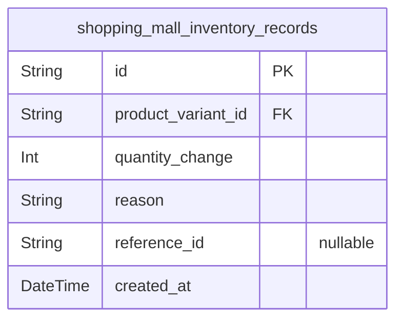

### `shopping_mall_inventory_records`

Immutable audit trail of stock movements for product variants. Each
record captures a single stock movement event with quantity change
(positive for increases like restocks or cancellations, negative for
decreases like orders or losses), reason code indicating the business
event that triggered the movement, and timestamp. Current stock quantity
for any variant is calculated by summing all quantity_change values.
Records are never modified or deleted to maintain complete audit history
for inventory reconciliation and compliance.

Properties as follows:

- `id`: Primary Key.
- `product_variant_id`
  > Product variant's [shopping_mall_product_variants.id](#shopping_mall_product_variants) that this
  > inventory movement affects.
- `quantity_change`
  > Amount of stock change. Positive values indicate stock increases
  > (restock, order cancellation, refund approval). Negative values indicate
  > stock decreases (order placement, adjustment, loss, damage).
- `reason`
  > Reason code for the inventory movement. Valid values: RESTOCK (manual
  > inventory addition), ORDER (stock reserved for order), ADJUSTMENT (manual
  > correction), CANCELLATION (order cancelled, stock returned), REFUND
  > (refund approved, stock returned), LOSS (damaged/lost items).
- `reference_id`
  > Optional reference to the business entity that triggered this movement
  > (e.g., order_item_id, cancellation_request_id, refund_request_id). Null
  > for manual restocks and adjustments.
- `created_at`
  > Timestamp when the inventory record was created, representing when the
  > stock movement occurred.

## Wishlist

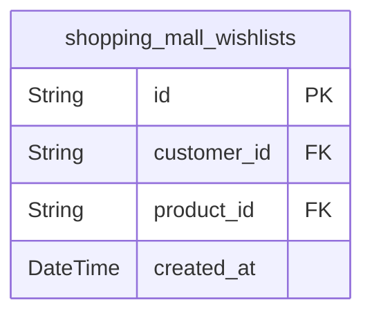

### `shopping_mall_wishlists`

Junction table linking customers to products they want to save for later.
Each entry represents one product in a customer's wishlist with the
timestamp when it was added. The unique constraint on customer_id and
product_id prevents duplicate entries, ensuring each product appears only
once per customer's wishlist.

Properties as follows:

- `id`: Primary Key.
- `customer_id`: Belonged customer's [shopping_mall_customers.id](#shopping_mall_customers).
- `product_id`: Wished product's [shopping_mall_products.id](#shopping_mall_products).
- `created_at`: Timestamp when the product was added to the wishlist.

## Carts

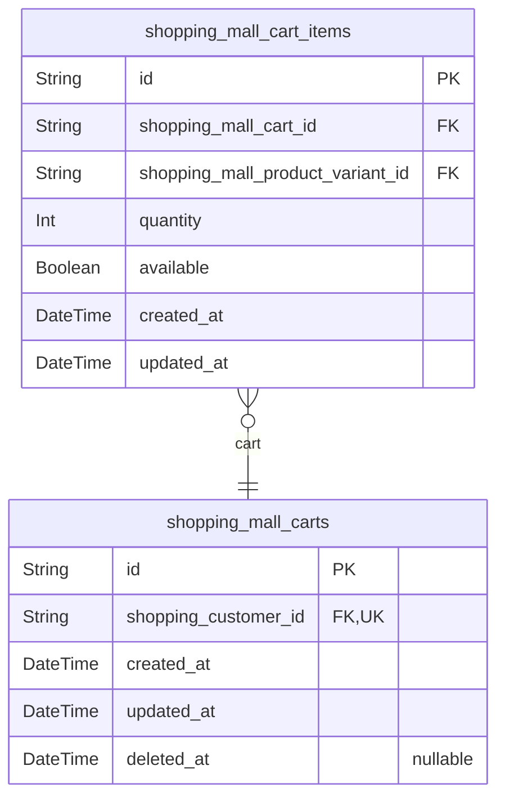

### `shopping_mall_carts`

Shopping cart containers representing a customer's active shopping
session. Each customer profile owns exactly one cart that accumulates
items intended for purchase. Tracks cart creation and last activity
timestamps for session management and cart abandonment detection. The
cart serves as the container for cart items, which are stored in the
shopping_mall_cart_items table.

Properties as follows:

- `id`: Primary Key.
- `shopping_customer_id`
  > Belonged customer's [shopping_mall_customers.id](#shopping_mall_customers). Each customer has
  > exactly one active cart.
- `created_at`: Cart creation timestamp.
- `updated_at`
  > Last modification timestamp, updated when cart items change or cart is
  > modified.
- `deleted_at`: Soft deletion timestamp for cart archival. Null indicates active cart.

### `shopping_mall_cart_items`

Individual line items within shopping carts, each representing a specific
product variant with quantity and availability status. Cart items are
created when customers add products to their cart and are removed during
checkout or when explicitly deleted. Each cart can have multiple items,
but only one item per variant (quantities are combined rather than
creating duplicate lines).

Properties as follows:

- `id`: Primary Key.
- `shopping_mall_cart_id`: Belonged cart's [shopping_mall_carts.id](#shopping_mall_carts).
- `shopping_mall_product_variant_id`: Referenced product variant's [shopping_mall_product_variants.id](#shopping_mall_product_variants).
- `quantity`
  > Quantity of the product variant to purchase. Combined when same variant
  > is added multiple times.
- `available`
  > Whether the product variant is currently available for purchase. Updated
  > based on stock status.
- `created_at`: Timestamp when the cart item was first created.
- `updated_at`
  > Timestamp when the cart item was last modified (quantity change or
  > availability update).

## Orders

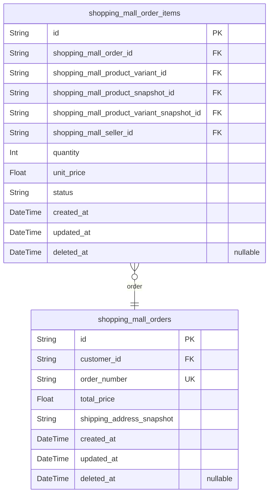

### `shopping_mall_orders`

Customer purchase transactions capturing complete order state at the time
of purchase.

Orders represent the core commerce transaction entity, recording when a
customer completes a purchase. Each order has a unique order number for
reference, total price calculation, and a snapshot of the shipping
address to preserve delivery information even if the customer's address
changes later.

Orders belong to [shopping_mall_customers](#shopping_mall_customers) and contain multiple
[shopping_mall_order_items](#shopping_mall_order_items). Order status is derived from the
status of its order items rather than stored directly. Orders reference
product snapshots, variant snapshots, and seller profile snapshots
through their order items to maintain historical accuracy.

Soft delete support via deleted_at allows order hiding while preserving
transaction history for audit and customer records.

Properties as follows:

- `id`: Primary Key.
- `customer_id`: Customer who placed this order. [shopping_mall_customers.id](#shopping_mall_customers).
- `order_number`
  > Unique order number for customer reference and support lookup. Generated
  > sequentially or with timestamp prefix.
- `total_price`
  > Total order amount including all items, taxes, and shipping fees.
  > Captured at order time.
- `shipping_address_snapshot`
  > JSON snapshot of shipping address at order time containing
  > recipient_name, phone_number, street_address, city, state_province,
  > postal_code, country. Preserves delivery address even if customer updates
  > their profile.
- `created_at`: Timestamp when the order was placed.
- `updated_at`: Timestamp when the order was last modified.
- `deleted_at`: Timestamp when the order was soft deleted (null if active).

### `shopping_mall_order_items`

Individual line items within customer orders representing purchased
product variants.

Each order item captures a specific product variant purchase with
quantity and unit price. The item maintains dual references: current
entities (product variant, seller) for operational purposes and
historical snapshots (product snapshot, product variant snapshot) for
order history integrity. This ensures order records remain accurate even
if products or variants change after purchase.

Order items follow a status workflow (PAID → SHIPPED → DELIVERED →
CANCELLED/REFUNDED) and serve as the foundation for downstream operations
including shipment assignment, cancellation requests, refund requests,
and review creation. Each item belongs to exactly one order and
references one product variant from one seller.

Related entities:
- [shopping_mall_orders](#shopping_mall_orders): Parent order containing this item
- [shopping_mall_product_variants](#shopping_mall_product_variants): Current product variant reference
- [shopping_mall_product_snapshots](#shopping_mall_product_snapshots): Historical product state at
order time
- [shopping_mall_product_variant_snapshots](#shopping_mall_product_variant_snapshots): Historical variant
state at order time
- [shopping_mall_sellers](#shopping_mall_sellers): Current seller reference
- [shopping_mall_shipment_items](#shopping_mall_shipment_items): Shipment assignments for this item
- [shopping_mall_cancellation_requests](#shopping_mall_cancellation_requests): Cancellation requests for
this item
- [shopping_mall_refund_requests](#shopping_mall_refund_requests): Refund requests for this item
- [shopping_mall_reviews](#shopping_mall_reviews): Customer reviews linked to this item

Properties as follows:

- `id`: Primary Key.
- `shopping_mall_order_id`: Parent order's [shopping_mall_orders.id](#shopping_mall_orders) containing this line item.
- `shopping_mall_product_variant_id`
  > Current product variant's [shopping_mall_product_variants.id](#shopping_mall_product_variants) for
  > operational reference.
- `shopping_mall_product_snapshot_id`
  > Product snapshot's [shopping_mall_product_snapshots.id](#shopping_mall_product_snapshots) capturing
  > historical product state at order time.
- `shopping_mall_product_variant_snapshot_id`
  > Product variant snapshot's {@link
  > shopping_mall_product_variant_snapshots.id} capturing historical variant
  > state at order time.
- `shopping_mall_seller_id`: Seller's [shopping_mall_sellers.id](#shopping_mall_sellers) who listed this product variant.
- `quantity`: Number of units purchased in this line item.
- `unit_price`: Price per unit at order time, preserved for historical accuracy.
- `status`
  > Current fulfillment status: PAID (payment confirmed), SHIPPED (sent to
  > customer), DELIVERED (received by customer), CANCELLED (order cancelled
  > before shipment), or REFUNDED (refund processed after delivery).
- `created_at`: Timestamp when this order item was created.
- `updated_at`: Timestamp when this order item was last updated.
- `deleted_at`: Timestamp when this order item was soft-deleted, null if active.

## Shipments

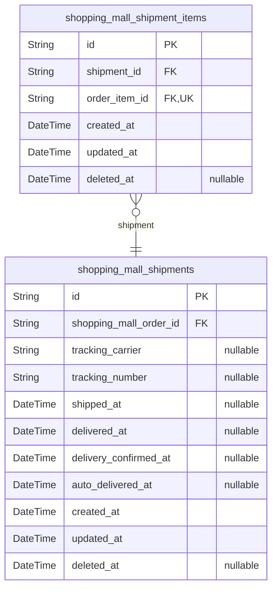

### `shopping_mall_shipments`

Shipments created by sellers to track order item deliveries with carrier
information and delivery lifecycle timestamps.

Represents the physical shipment of order items from a seller to a
customer. Each shipment contains tracking information including carrier
name and tracking number, along with timestamps marking key delivery
milestones: when the shipment was sent (shipped_at), when it was
delivered (delivered_at), when the customer confirmed receipt
(delivery_confirmed_at), and the automatic delivery confirmation
timestamp (auto_delivered_at).

Shipments are created by sellers after order items are paid and ready to
ship. Multiple shipments can exist for a single order when items come
from different sellers. The [shopping_mall_shipment_items](#shopping_mall_shipment_items) table
links individual order items to their corresponding shipments.

Delivery lifecycle:
- shipped_at: When seller hands package to carrier
- delivered_at: When carrier marks package as delivered
- delivery_confirmed_at: When customer manually confirms receipt
- auto_delivered_at: System-calculated auto-confirmation (shipped_at + 14
days)

Properties as follows:

- `id`: Primary Key.
- `shopping_mall_order_id`: Belonged order's [shopping_mall_orders.id](#shopping_mall_orders).
- `tracking_carrier`
  > Name of the shipping carrier (e.g., FedEx, UPS, DHL, USPS). Null until
  > shipment is created.
- `tracking_number`
  > Tracking number provided by the carrier for package tracking. Null until
  > shipment is created.
- `shipped_at`
  > Timestamp when the seller handed the package to the carrier. Null until
  > actually shipped.
- `delivered_at`
  > Timestamp when the carrier marked the package as delivered. Null until
  > delivery occurs.
- `delivery_confirmed_at`
  > Timestamp when the customer manually confirmed receipt of the shipment.
  > Null if not confirmed.
- `auto_delivered_at`
  > System-calculated timestamp for automatic delivery confirmation
  > (shipped_at + 14 days). Used when customer doesn't manually confirm.
- `created_at`: Timestamp when the shipment record was created.
- `updated_at`: Timestamp when the shipment record was last updated.
- `deleted_at`: Timestamp when the shipment was soft deleted. Null if not deleted.

### `shopping_mall_shipment_items`

Junction table linking shipments to order items, enabling one shipment to
contain multiple order items from the same seller. Each order item
belongs to exactly one shipment, tracked through the unique constraint on
order_item_id. This table supports consolidated shipment tracking where
sellers ship multiple order items together with unified tracking
information.

Properties as follows:

- `id`: Primary Key.
- `shipment_id`: Belonged shipment's [shopping_mall_shipments.id](#shopping_mall_shipments).
- `order_item_id`: Belonged order item's [shopping_mall_order_items.id](#shopping_mall_order_items).
- `created_at`: Record creation timestamp.
- `updated_at`: Record last update timestamp.
- `deleted_at`: Soft delete timestamp for record removal tracking.

## Reviews

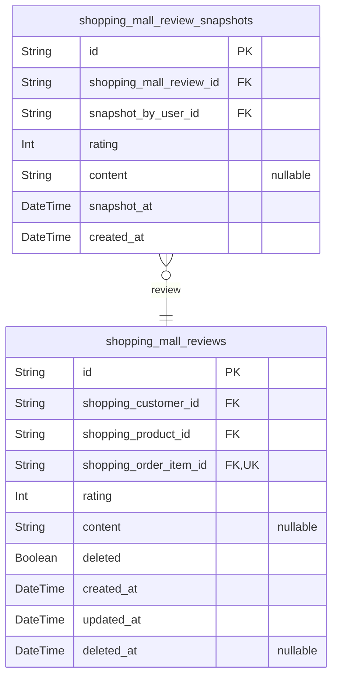

### `shopping_mall_reviews`

Customer reviews and ratings for purchased products with verified order
item linkage. Each review represents authentic feedback from a customer
who has purchased and received a specific product. Reviews are linked to
order items to verify purchase authenticity and enforce
one-review-per-order constraint. Supports soft deletion to preserve
review history while hiding content from public view. Related to {@link
shopping_mall_review_snapshots} which preserves immutable historical
states of review edits.

Properties as follows:

- `id`: Primary Key.
- `shopping_customer_id`: Customer who wrote the review. [shopping_mall_customers.id](#shopping_mall_customers)
- `shopping_product_id`: Product being reviewed. [shopping_mall_products.id](#shopping_mall_products)
- `shopping_order_item_id`
  > Order item that verified this purchase. Ensures review is from actual
  > buyer. [shopping_mall_order_items.id](#shopping_mall_order_items)
- `rating`: Product rating from 1 to 5 stars.
- `content`: Optional review content with detailed feedback and comments.
- `deleted`
  > Soft delete flag. When true, review is hidden from public view but
  > preserved in database.
- `created_at`: Timestamp when the review was first created.
- `updated_at`: Timestamp when the review was last modified.
- `deleted_at`: Timestamp when the review was soft deleted. Null if not deleted.

### `shopping_mall_review_snapshots`

Immutable historical snapshots of review state changes.

Captures point-in-time states of reviews whenever they are edited or
deleted, preserving the rating and content as they existed at that
moment. These snapshots serve critical business purposes:

- **Audit trail**: Complete history of review modifications for transparency
- **Dispute resolution**: Evidence of review content at any point in time
- **Post-deletion access**: Reviews remain accessible through snapshots
even after soft deletion
- **Historical display**: Shows what review looked like when order was
evaluated

Each snapshot is created automatically before a review update or delete
operation. Once created, snapshots are never modified or deleted,
ensuring data integrity for compliance and dispute resolution scenarios.

Related to [shopping_mall_reviews](#shopping_mall_reviews) through shopping_mall_review_id
foreign key. Multiple snapshots can exist for a single review, forming a
chronological history.

Properties as follows:

- `id`: Primary Key.
- `shopping_mall_review_id`
  > Parent review's [shopping_mall_reviews.id](#shopping_mall_reviews). Establishes which
  > review this snapshot captures the state of.
- `snapshot_by_user_id`
  > Customer's [shopping_mall_customers.id](#shopping_mall_customers) who triggered this snapshot
  > creation through edit or delete operation. Provides audit trail of who
  > made the change.
- `rating`
  > Review rating at snapshot time. Integer value from 1 to 5 stars.
  > Denormalized from parent review to preserve historical state.
- `content`
  > Review text content at snapshot time. Optional detailed feedback from
  > customer. Denormalized from parent review to preserve historical state,
  > including null values if review had no content.
- `snapshot_at`
  > Timestamp when this snapshot was created. Represents the exact moment the
  > review state was captured, typically just before an update or delete
  > operation.
- `created_at`
  > Database record creation timestamp. Automatically set when snapshot row
  > is inserted.

## Disputes

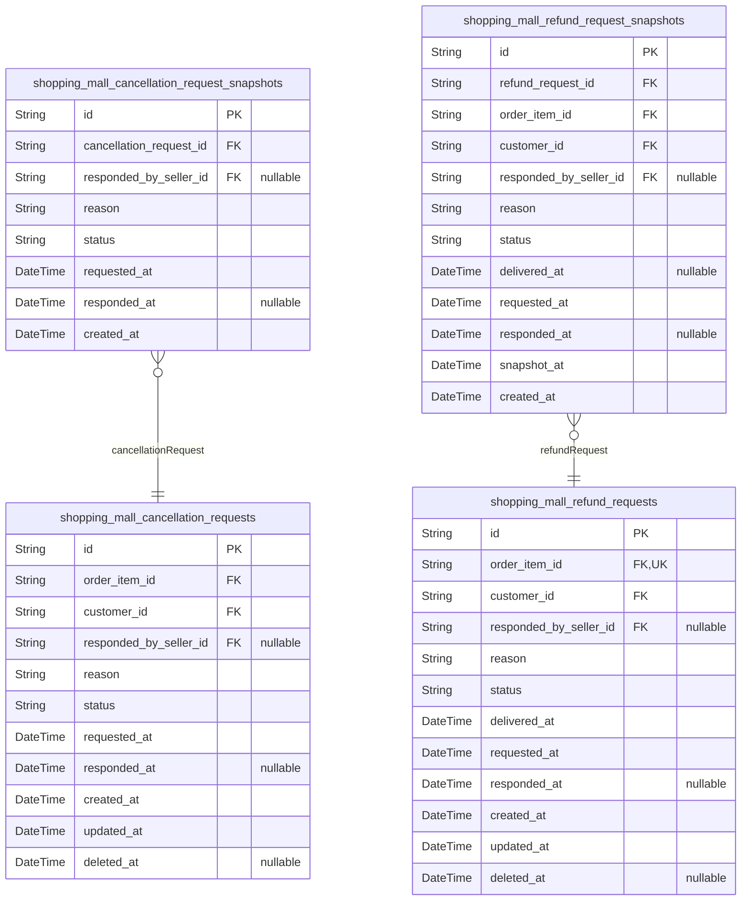

### `shopping_mall_cancellation_requests`

Customer cancellation requests for order items with status workflow and
seller response tracking.

Represents formal requests submitted by customers to cancel specific
order items before or after shipment. Each request captures the
cancellation reason, current status (PENDING, APPROVED, REJECTED), and
tracks the seller's response when applicable.

Key relationships:
- [shopping_mall_order_items.id](#shopping_mall_order_items): The order item being cancelled
(required, 1:N relationship)
- [shopping_mall_customers.id](#shopping_mall_customers): The customer who submitted the
request (required)
- [shopping_mall_sellers.id](#shopping_mall_sellers): The seller who responded to the
request (nullable, only for APPROVED/REJECTED status)

Behavioral notes:
- Status workflow: PENDING → APPROVED or REJECTED
- Only order items with PAID status can be cancelled (business rule)
- responded_at and responded_by_seller_id are null when status is PENDING
- Immutable history preserved in {@link
shopping_mall_cancellation_request_snapshots}

Properties as follows:

- `id`: Primary Key.
- `order_item_id`: Target order item's [shopping_mall_order_items.id](#shopping_mall_order_items) being cancelled.
- `customer_id`: Submitted customer's [shopping_mall_customers.id](#shopping_mall_customers).
- `responded_by_seller_id`
  > Responding seller's [shopping_mall_sellers.id](#shopping_mall_sellers). Null when status is
  > PENDING.
- `reason`: Customer's reason for requesting cancellation.
- `status`: Current cancellation status: PENDING, APPROVED, or REJECTED.
- `requested_at`: Timestamp when the customer submitted the cancellation request.
- `responded_at`
  > Timestamp when the seller responded to the request. Null when status is
  > PENDING.
- `created_at`: Record creation timestamp.
- `updated_at`: Record last update timestamp.
- `deleted_at`: Soft deletion timestamp. Null when record is active.

### `shopping_mall_cancellation_request_snapshots`

Immutable snapshots of cancellation request states for audit trail and
dispute resolution.

Captures point-in-time states whenever a cancellation request's status
changes or is responded to by the seller. Each snapshot preserves the
complete state including reason, status, and response details at the
moment of capture. Snapshots are append-only and never modified or
deleted, ensuring a complete historical record for dispute resolution and
compliance auditing.

Related to [shopping_mall_cancellation_requests](#shopping_mall_cancellation_requests) as the parent
entity. Multiple snapshots can exist for a single cancellation request,
creating a chronological audit trail of all state changes.

Properties as follows:

- `id`: Primary Key.
- `cancellation_request_id`
  > Parent cancellation request's {@link
  > shopping_mall_cancellation_requests.id}.
- `responded_by_seller_id`
  > Seller who responded to the cancellation request's {@link
  > shopping_mall_sellers.id}. Null if no response yet.
- `reason`: Customer's reason for requesting cancellation, captured at snapshot time.
- `status`
  > Cancellation request status at snapshot time. Valid values: PENDING,
  > APPROVED, REJECTED.
- `requested_at`
  > Original timestamp when the cancellation request was submitted by the
  > customer.
- `responded_at`
  > Timestamp when the seller responded to the cancellation request. Null if
  > no response yet.
- `created_at`: Timestamp when this snapshot record was created.

### `shopping_mall_refund_requests`

Customer refund requests for order items with delivery date tracking for
7-day validation.

Represents refund requests submitted by customers for delivered order
items. Each request tracks the reason for refund, current status
(PENDING, APPROVED, REJECTED), and delivery date to validate the 7-day
refund window. Sellers respond to requests by updating status and
recording response timestamp.

Key relationships:
- Belongs to [shopping_mall_order_items](#shopping_mall_order_items) - the specific order item
being refunded
- Submitted by [shopping_mall_customers](#shopping_mall_customers) - the customer requesting
refund
- Responded by [shopping_mall_sellers](#shopping_mall_sellers) - the seller who processes
the request (nullable until responded)
- Has immutable snapshots in {@link
shopping_mall_refund_request_snapshots} for audit trail

Business constraints:
- Refund requests only allowed within 7 days of delivery (validated by
delivered_at)
- Status transitions: PENDING → APPROVED or PENDING → REJECTED
- One refund request per order item (enforced by unique index on
order_item_id)

Properties as follows:

- `id`: Primary Key.
- `order_item_id`
  > Order item's [shopping_mall_order_items.id](#shopping_mall_order_items). The specific order
  > item being refunded.
- `customer_id`
  > Customer's [shopping_mall_customers.id](#shopping_mall_customers) who submitted the refund
  > request.
- `responded_by_seller_id`
  > Seller's [shopping_mall_sellers.id](#shopping_mall_sellers) who responded to the refund
  > request. Null until seller responds.
- `reason`
  > Customer's reason for requesting refund. Explains why the customer wants
  > a refund for this order item.
- `status`
  > Current status of the refund request. Values: PENDING (awaiting seller
  > response), APPROVED (seller approved refund), REJECTED (seller rejected
  > refund).
- `delivered_at`
  > Timestamp when the order item was delivered. Used to validate the 7-day
  > refund request window.
- `requested_at`: Timestamp when the customer submitted the refund request.
- `responded_at`
  > Timestamp when the seller responded to the refund request. Null until
  > seller responds.
- `created_at`: Timestamp when the refund request record was created.
- `updated_at`: Timestamp when the refund request record was last updated.
- `deleted_at`: Timestamp when the refund request was soft deleted. Null if not deleted.

### `shopping_mall_refund_request_snapshots`

Immutable snapshots of refund request states for audit trail and dispute
resolution.

Captures point-in-time states of refund requests including all business
fields and relationships at the moment of state change. These snapshots
preserve the complete refund request context (order item, customer,
seller response) whenever status transitions occur (submission, approval,
rejection).

Referenced by [shopping_mall_refund_requests](#shopping_mall_refund_requests) for historical audit
access. Used in dispute resolution to verify the timeline of refund
request processing, validate 7-day delivery windows, and ensure
compliance with platform refund policies. Append-only table - never
updated or deleted.

Properties as follows:

- `id`: Primary Key.
- `refund_request_id`
  > Parent refund request's [shopping_mall_refund_requests.id](#shopping_mall_refund_requests).
  > Establishes the audit trail relationship.
- `order_item_id`
  > Order item's [shopping_mall_order_items.id](#shopping_mall_order_items) that this refund
  > request concerns. Captured at snapshot time for historical accuracy.
- `customer_id`
  > Customer's [shopping_mall_customers.id](#shopping_mall_customers) who submitted the refund
  > request. Captured at snapshot time for historical accuracy.
- `responded_by_seller_id`
  > Seller's [shopping_mall_sellers.id](#shopping_mall_sellers) who responded to the refund
  > request. Null if pending or auto-processed.
- `reason`: Customer's reason for requesting the refund at the time of snapshot.
- `status`
  > Refund request status at snapshot time. Values: PENDING, APPROVED,
  > REJECTED.
- `delivered_at`
  > Delivery confirmation timestamp for 7-day refund validation window. Null
  > if not yet delivered at snapshot time.
- `requested_at`
  > Timestamp when the refund request was originally submitted. Captured for
  > historical accuracy.
- `responded_at`
  > Timestamp when seller responded to the refund request. Null if pending at
  > snapshot time.
- `snapshot_at`
  > Timestamp when this snapshot was created, capturing the point-in-time
  > state.
- `created_at`: Record creation timestamp for audit purposes.

## Administration

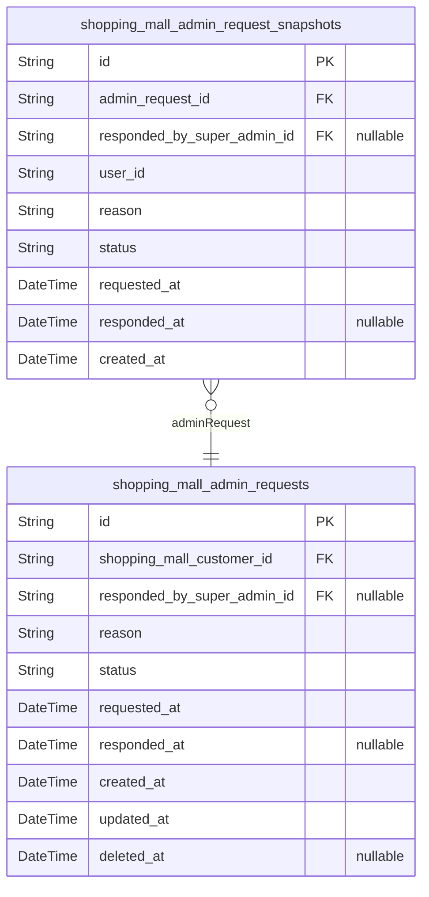

### `shopping_mall_admin_requests`

Admin promotion requests submitted by users seeking elevated platform
privileges. Each request captures the user's justification for admin role
elevation and tracks the review workflow through status transitions
(PENDING to APPROVED/REJECTED). Super administrators review and respond
to requests, with response metadata recorded for audit purposes. Related
to [shopping_mall_admin_request_snapshots](#shopping_mall_admin_request_snapshots) which preserve immutable
historical states of request changes.

Properties as follows:

- `id`: Primary Key.
- `shopping_mall_customer_id`
  > Customer user who submitted the admin promotion request. {@link
  > shopping_mall_customers.id}
- `responded_by_super_admin_id`
  > Super administrator who reviewed and responded to the request. {@link
  > shopping_mall_super_admins.id}
- `reason`
  > User's justification and explanation for requesting administrator role
  > elevation.
- `status`
  > Current workflow status of the admin request. Values: PENDING (awaiting
  > review), APPROVED (elevated to admin), REJECTED (denied by super admin).
- `requested_at`: Timestamp when the admin promotion request was submitted by the customer.
- `responded_at`
  > Timestamp when the super administrator responded to the request. Null if
  > request is still pending.
- `created_at`: Record creation timestamp.
- `updated_at`: Record last update timestamp.
- `deleted_at`: Soft deletion timestamp. Null if record is active.

### `shopping_mall_admin_request_snapshots`

Immutable point-in-time captures of admin promotion request states for
audit trail and historical tracking. Each snapshot preserves the complete
state of an admin request at a specific moment, including status, reason,
and response details. Snapshots are created when requests are submitted
and when status changes occur (approval/rejection). These records are
never modified or deleted, ensuring complete audit history for platform
governance and compliance.

Properties as follows:

- `id`: Primary Key.
- `admin_request_id`: Parent admin promotion request's [shopping_mall_admin_requests.id](#shopping_mall_admin_requests).
- `responded_by_super_admin_id`
  > Super administrator who responded to the request's {@link
  > shopping_mall_super_admins.id}. Null if request is still pending.
- `user_id`
  > User who submitted the admin promotion request. Denormalized from parent
  > request for historical accuracy.
- `reason`: Reason provided by user for requesting administrator role elevation.
- `status`: Request status at time of snapshot: PENDING, APPROVED, or REJECTED.
- `requested_at`: Timestamp when the admin request was originally submitted.
- `responded_at`
  > Timestamp when super administrator responded to the request. Null if
  > still pending.
- `created_at`: Timestamp when this snapshot record was created.
