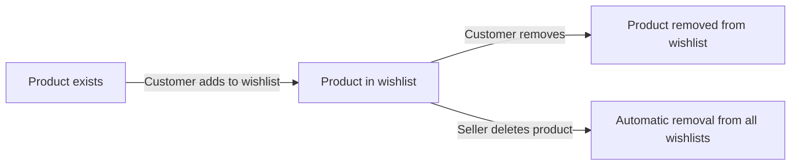
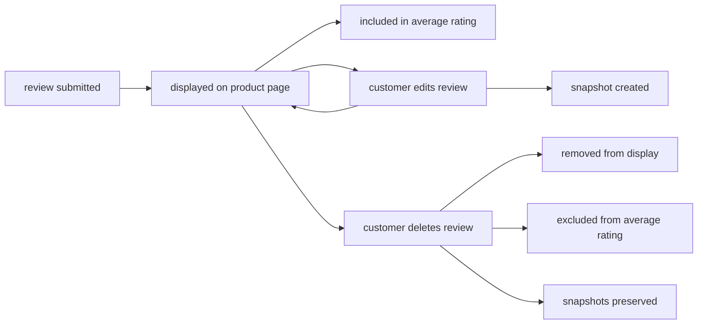
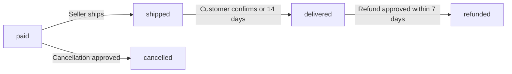
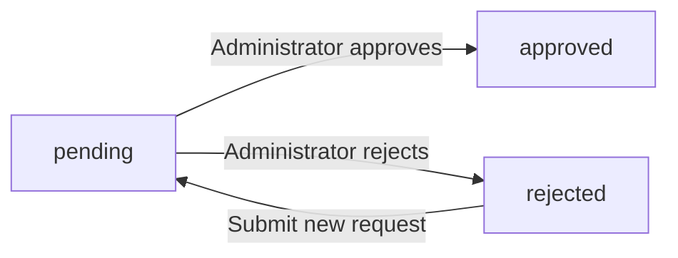
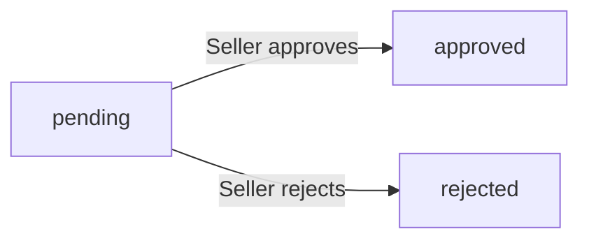
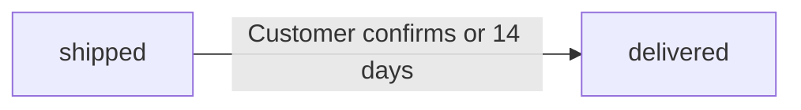

**shoppingMall — Business concepts, relationships, and states from user perspective**

Business concepts, relationships, and states from user perspective

# Domain Concepts

Describe what each concept means in the business domain and its key attributes.

## Customer Concept

A Customer represents a registered user who can browse products and make purchases on the e-commerce platform. Registration is required to use any features, as guest browsing is not supported. Each customer has an email address and password for authentication purposes. The customer profile includes a display name and phone number that can be edited. Customers can maintain multiple shipping addresses for order delivery. One address can be designated as the default shipping address for convenience. Customers can create wishlists to save products for future reference. Customers can maintain a shopping cart containing variants they intend to purchase. When a customer deletes their account, their profile information is removed but order history and reviews are preserved. Reviews from deleted accounts are displayed as coming from a deleted user to maintain seller records.

### Customer Definition and Registration

A Customer represents a registered user who can browse products and make purchases on the e-commerce platform. Registration is required to use any features of the platform. Guest browsing is not supported. Customers register by providing an email address and creating a password. The email address and password are used for authentication when logging in. Customers can change their password after registration. The customer account lifecycle includes registration, active usage, and potential deletion. Each customer account is uniquely identified by their email address.

### Customer Profile

Each customer has a profile containing personal information. The profile includes a display name that identifies the customer to other users. The profile includes a phone number for contact purposes. Customers can edit their display name at any time. Customers can edit their phone number at any time. Profile information is editable by the customer through their account settings.

### Customer Address Management

Customers can maintain multiple shipping addresses for order delivery. Each shipping address contains a recipient name, phone number, street address, city, state or province, postal code, and country. Customers can add new shipping addresses to their account. Customers can edit existing shipping addresses. Customers can delete shipping addresses from their account. One address can be designated as the default shipping address. The default address is used automatically during checkout unless the customer selects a different address.

### Customer Shopping Associations

Each customer owns a wishlist for saving products of interest. The wishlist contains products at the product level, not specific variants. Customers can add products to their wishlist. Customers can view their wishlist in a paginated list. Customers can remove products from their wishlist. If a product is deleted by the seller, it is automatically removed from all customer wishlists. Each customer owns a shopping cart for temporary item storage before purchase. The cart contains specific product variants with quantities. Items are removed from the cart after an order is placed.

### Account Deletion and Data Retention

Customers can delete their account at any time. When a customer deletes their account, their profile information is deleted. The display name and phone number are removed. All shipping addresses are deleted. When a customer deletes their account, their order history is preserved for seller records and legal purposes. Past orders remain accessible to the customer and sellers. When a customer deletes their account, their reviews are preserved but shown as from a deleted user. The review content and rating remain visible on product pages. The customer identity is anonymized in review displays.

## Seller Concept

A Seller represents a merchant who can list and sell products on the e-commerce platform. Each seller has an email address and password for authentication. Seller accounts require administrator approval before they can begin selling products. The seller profile includes a shop name, shop description, and logo image that customers can view. Sellers have an approval status that can be pending, approved, or rejected. If rejected, sellers can view the rejection reason provided by administrators. Rejected sellers can submit a new registration request for reconsideration. Sellers can delete their account only if they have no pending orders or pending cancellation and refund requests. When a seller deletes their account, their products are removed from listings but order history and snapshots are preserved. The shop name in past orders remains visible to maintain transaction records.

### Seller Registration and Approval

Sellers must register with an email address and password to create a seller account. Seller accounts require administrator approval before they can list and sell products on the platform. Each seller registration request is reviewed by an administrator who can approve or reject the request. The seller approval status can be pending, approved, or rejected. Sellers can view their current approval status at any time. If a seller registration is rejected, the seller can view the rejection reason provided by the administrator. Rejected sellers can submit a new registration request for reconsideration. The seller account lifecycle begins with registration, proceeds through administrator review, and continues through active selling or account deletion.

### Seller Profile

Each seller has a profile that customers can view. The seller profile includes a shop name that identifies the seller's store on the platform. The seller profile includes a shop description that provides information about the seller and their products. The seller profile includes a logo image that represents the seller's brand. Sellers can edit their shop name, shop description, and logo image. Every edit to the seller profile creates a snapshot that preserves the previous values. The snapshot records when the change was made, what fields were changed, and the values before and after the change. Seller profile snapshots are immutable and cannot be deleted. Sellers and administrators can view seller profile snapshots for dispute resolution.

### Seller Account Deletion

Sellers can delete their seller account only if they have no pending orders. A pending order is an order item with paid or shipped status for any of the seller's products. Sellers can delete their seller account only if they have no pending cancellation requests. Sellers can delete their seller account only if they have no pending refund requests. When a seller deletes their account, their products are removed from listings and no longer appear in search or category browsing. When a seller deletes their account, order history and snapshots are preserved for legal and transaction record purposes. The shop name in past orders remains visible to customers to maintain transaction records. Preserved order snapshots include the product details, variant information, and seller profile at the time of purchase.

### Product Listing Ownership

Products on the platform belong to the seller who created them. Each seller can create and list their own products for sale. Sellers can edit their own products, and every product edit creates a snapshot. Sellers can delete their own products only if there are no pending order items for any variant of the product. Sellers can delete their own products only if there are no pending cancellation or refund requests for any variant of the product. When a product is deleted, all its variants and inventory records are also deleted. Deleted products no longer appear in search results or category listings. Product snapshots are preserved even after product deletion for order record purposes. Sellers can view snapshots of their own products. Administrators can view snapshots of any product on the platform.

## Address Concept

An Address represents a shipping destination where orders are delivered to customers. Each address contains a recipient name identifying who will receive the package. A phone number is included for delivery contact purposes. The street address specifies the detailed location for delivery. City and state or province fields define the broader geographic area. A postal code is required for accurate delivery routing. The country field specifies the destination nation for international shipping considerations. Customers can maintain multiple addresses for different delivery needs. One address can be set as the default for streamlined checkout. Addresses are captured and preserved with orders at the time of placement.

### Shipping Address Structure

A shipping address represents a delivery destination where orders are delivered to customers. Each address contains a recipient name identifying who will receive the package. A phone number is included for delivery contact purposes. The street address specifies the detailed location for delivery. City and state or province fields define the broader geographic area. A postal code is required for accurate delivery routing. The country field specifies the destination nation for international shipping considerations.

### Multiple Address Management

Customers can maintain multiple shipping addresses for different delivery needs such as home, work, or family locations. Each customer owns their set of addresses independently. One address can be designated as the default shipping address for streamlined checkout. The default address designation is optional. If no default is set, customers must select an address during checkout. Each address is managed independently and can be modified or removed without affecting other addresses.

### Order Address Association

When an order is placed, the selected shipping address is captured and preserved with the order record. This preserved address represents the delivery destination at the time of purchase. The address snapshot remains unchanged even if the customer later modifies or deletes the original address. Each order item within an order shares the same shipping address. The preserved address ensures accurate delivery records for dispute resolution and customer service purposes.

## Category Concept

A Category represents a classification used to organize products on the platform. Each category has a name that identifies the product grouping. A description provides context about what types of products belong in the category. Categories can have subcategories with one level of nesting only. This creates a parent-child relationship between categories. Categories are created and managed exclusively by administrators. Customers can browse the list of all available categories. Products must belong to a category to be properly organized. When a category is deleted, products in that category become uncategorized. Customers can view products within a specific category for focused browsing.

### Category Definition and Structure

A Category represents a classification used to organize products on the platform. Each category has a name that serves as its identifier within the classification system. A description provides context about what types of products belong in the category.

Categories support a hierarchical structure with parent-child relationships. A category can have subcategories, but only one level of nesting is allowed. This means a category can be a parent to subcategories, but those subcategories cannot have their own subcategories.

The one level nesting limit ensures the category hierarchy remains simple and navigable. Products can be assigned to either a top-level category or a subcategory, but not both simultaneously.

### Category Management and Access

Categories are created and managed exclusively by administrators. Regular users cannot create, edit, or delete categories.

Customers can browse the list of all available categories on the platform. This browsing capability allows customers to explore the product classification system and understand how products are organized.

Customers can view products within a specific category for focused product browsing. When viewing a category, customers see all products assigned to that category and its subcategories, enabling targeted discovery of relevant products.

### Category-Product Relationship

Every product must be assigned to a category. The category assignment determines where the product appears in the platform's organization structure.

When a category is deleted, products that were assigned to that category become uncategorized. Uncategorized products remain in the system but lose their classification within the hierarchy.

The category deletion impact affects product discoverability, as uncategorized products no longer appear when browsing that category. Administrators should reassign products to appropriate categories before deleting a category to maintain proper organization.

## Product Concept

A Product represents an item available for purchase on the e-commerce platform. Each product has a name that identifies what is being sold. A description provides detailed information about the product features and specifications. The category assignment organizes the product within the platform hierarchy. A base price establishes the default pricing for the product. Products belong to the seller who created them, establishing ownership. Products can have multiple images for visual representation. Products can have multiple variants representing different options. Every product edit creates a snapshot to preserve the previous state. Products can be deleted only if there are no pending orders or requests for any variant. Deleted products no longer appear in search or category listings but snapshots remain preserved.

### Product Attributes and Structure

A product requires a name to identify what is being sold. A product requires a description providing detailed information about features and specifications. A product requires a base price establishing the default pricing for the product. A product requires a category assignment organizing it within the platform hierarchy, which can be a subcategory. Product listings display the main image, name, base price or price range if variants have different prices, seller shop name, and average rating if reviews exist.

### Product Ownership and Associations

Each product belongs to the seller who created it, establishing ownership. A product can have multiple images for visual representation (defined in ProductImage Concept). A product can have multiple variants representing different option combinations (defined in ProductVariant Concept). A product must have at least one variant to be purchasable. Products with no variants are visible in search but shown as unavailable.

### Product Snapshots

Every product edit creates a snapshot to preserve the previous state. Product snapshots record all product fields including name, description, category, base price, and images at the time of the change. Product snapshots also include snapshots of all variants at that moment, preserving the complete state of the product and its variants. Product snapshots are immutable and cannot be deleted. Product snapshots are preserved even after product deletion. Sellers can view snapshots of their own products. Administrators can view snapshots of any product.

### Product Deletion and Visibility

A product can be deleted only if there are no pending order items for any variant of the product. A product can be deleted only if there are no pending cancellation or refund requests for any variant of the product. Deleting a product also deletes all its variants and inventory records. Deleted products no longer appear in search or category listings. Deleted products no longer appear in product listings. Deleted products are automatically removed from all customer wishlists.

## ProductVariant Concept

A ProductVariant represents a specific combination of options for a product, such as color and size. Each variant has a unique SKU code that serves as its identifier. Option values define the specific attributes of the variant, like Red or Large. The variant price can override the product base price if specified. Stock quantity tracks how many units are available for purchase. Stock quantity starts at zero and is managed through inventory records. A product must have at least one variant to be purchasable by customers. Products with no variants are visible in search but shown as unavailable. Every variant edit creates a snapshot to preserve the previous state. Variants can be deleted only if there are no pending orders or requests for that specific variant.

### Variant Option Combinations

A product variant represents a specific combination of option attributes, such as color and size. Each variant defines a unique set of option values that distinguish it from other variants of the same product. For example, a shirt product may have variants like "Red / Large" or "Blue / Small". Option values are specified when creating or editing a variant. Each variant must be uniquely identifiable by its combination of option values within the product. Customers must select a specific variant when adding a product to their cart, not just the product itself. The variant's option combination is preserved in order items to show exactly what the customer purchased.

### SKU Code Identification

Each variant has a unique SKU code that serves as its identifier. The SKU code is required when creating a variant. The SKU code must be unique across all variants. The SKU code is used to identify the specific variant throughout the purchasing process. When customers view their cart or order history, the SKU code identifies which variant they selected. Sellers can edit the SKU code of their variants, and every edit creates a snapshot to preserve the previous SKU code value.

### Price Override and Stock Tracking

Each variant has a price that can override the product base price. The variant price is optional; if not specified, the product base price applies. When a variant has a custom price, that price is used for all purchases of that variant. Each variant has a stock quantity that tracks how many units are available for purchase. Stock quantity is required and starts at zero. Stock quantity is the basis for inventory management and is updated through inventory records. When stock reaches zero, the variant is shown as out of stock. Out of stock variants cannot be added to cart.

### Purchasability and Availability Display

A product must have at least one variant to be purchasable by customers. Products with no variants are visible in search and category listings but are shown as unavailable. When viewing a product detail page, all available variants are displayed with their prices and stock status. Each variant shows whether it is in stock or out of stock. If a variant is out of stock, customers cannot select it for purchase. When a variant is deleted by the seller, it is marked as unavailable in any customer carts that contain it.

### Variant Snapshot Preservation

Every variant edit creates a snapshot to preserve the previous state. The variant snapshot includes all variant fields: SKU code, option values, price, and stock quantity at the time of the edit. When a product snapshot is created, it includes snapshots of all variants at that moment. This preserves the complete state of a product and its variants at any point in time. Variant snapshots are immutable and cannot be deleted. Sellers can view snapshots of their own product variants. Administrators can view snapshots of any product variant. Snapshots are preserved even after the variant or product is deleted.

### Inventory Association and Deletion Constraints

Each variant is associated with inventory records that track stock quantity changes. Inventory records are not snapshots; they record quantity changes with reasons and timestamps. Current stock is calculated by summing all inventory records for the variant. A variant can be deleted only if there are no pending order items for that variant. A variant can be deleted only if there are no pending cancellation or refund requests for that variant. Pending order items are those with paid or shipped status. When a variant is deleted, its inventory records are also deleted. Deleting a variant removes it from product listings and makes it unavailable for purchase.

## ProductImage Concept

A ProductImage represents a visual representation of a product on the platform. Each image has a URL pointing to the stored image file. A sort order determines the display sequence of multiple images. The first image in the sort order serves as the main or thumbnail image. Sellers can upload multiple images for each product to show different angles or details. Images can be reordered to change which appears first. Sellers can delete images from their products as needed. All image changes are included in product snapshots for historical record. The main image is displayed in product listings and search results. Multiple images provide customers with comprehensive visual information about the product.

### ProductImage Definition and Association

A ProductImage represents a visual representation of a product on the platform. Each product image stores a URL pointing to the image file location. Product images are associated with exactly one product. A product can have multiple images to show different angles, details, or features. Sellers upload images when creating or editing their products. The visual content association links each image to its parent product for display purposes. Product presentation media provides customers with comprehensive visual information about the product. Multiple image upload capability allows sellers to showcase their products from various perspectives. Each image belongs to the seller who owns the parent product.

### Image Display and Ordering

Product images have a sort order that determines their display sequence. The sort order positioning controls which image appears first, second, third, and so on. The first image in the sort order serves as the main thumbnail image. The main thumbnail image is displayed in product listings and search result imagery. When viewing search results or category pages, customers see the main image as the product thumbnail. Image sequence management allows sellers to control the visual presentation order. Customers viewing a product detail page see all images in the defined sort order. Comprehensive product visuals help customers make informed purchase decisions. The image display order can be changed by the seller through reordering operations.

### Image Management and Snapshots

Sellers can reorder images to change which appears as the main thumbnail. Image reordering capability allows sellers to optimize product presentation. Sellers can delete images from their products when needed. Image deletion capability removes the image from the product's image collection. When a product is edited, all current images are included in the product snapshot. Snapshot image preservation records the complete state of product images at the time of edit. Product snapshots preserve image URLs and sort order for historical reference. Administrators can view snapshots of any product including its images at the time of each edit. Sellers can view snapshots of their own products to track image changes over time. Image changes are part of the overall product snapshot for dispute resolution and audit purposes.

## Wishlist Concept

A Wishlist represents a customer's saved collection of products for future reference. The wishlist associates a customer with products they are interested in. Wishlists are displayed in a paginated format for easy browsing. The wishlist shows products rather than specific variants. Customers can add products to their wishlist for later consideration. Customers can remove products from their wishlist when no longer interested. If a product is deleted by the seller, it is automatically removed from all wishlists. The wishlist helps customers track products they may want to purchase. Wishlist contents are specific to each customer account. The feature supports customer engagement and purchase planning.

### Wishlist Definition and Purpose

A Wishlist represents a customer's saved collection of products for future reference and purchase planning. The wishlist serves as a customer engagement tool that helps customers track products they are interested in purchasing.

Each customer has their own specific wishlist that is associated exclusively with their account. The wishlist contains products at the product level, not specific variants. This means customers save products they are interested in, rather than saving particular variant combinations.

The wishlist association links a customer with products they want to remember for later consideration. This interest tracking mechanism supports purchase planning by allowing customers to compile a list of products they may want to buy in the future.

Customers can add products to their wishlist when browsing or searching. Products are saved to the wishlist for future purchase reference, enabling customers to return to items they found interesting without needing to search for them again.

The wishlist helps customers organize their shopping interests and plan future purchases. Each wishlist entry represents a product the customer has expressed interest in. The wishlist is specific to each customer account and cannot be shared or viewed by other customers.

### Wishlist Display and Management

The wishlist is displayed in a paginated format to support easy browsing of saved products. Wishlist pagination ensures that customers with many saved products can navigate their list efficiently without performance issues.

Customers can manage their wishlist by adding and removing products. The product removal capability allows customers to remove products from their wishlist when they are no longer interested or have completed their purchase.

When a product is deleted by the seller, it is automatically removed from all customer wishlists. This seller deletion impact ensures that wishlists do not contain references to products that no longer exist on the platform. The automatic removal on deletion happens immediately when the seller deletes the product.

The wishlist management feature provides customers with full control over their saved products. Customers can view their complete wishlist, browse through paginated results, and remove any product they no longer wish to track.

## Cart Concept

A Cart represents a customer's temporary collection of items intended for purchase. The cart is associated with a specific customer account. The cart contains cart items, each representing a specific variant with a quantity. The cart displays the total price of all items combined. When an order is placed, items are removed from the customer's cart. The cart serves as a staging area before checkout completion. Cart contents reflect current product availability and pricing. If a variant becomes unavailable, it is marked in the cart. The cart enables customers to collect multiple items before purchasing. Cart state is maintained per customer for session continuity.

### Cart Definition and Purpose

A cart represents a customer's temporary collection of items intended for purchase. The cart serves as a staging area where customers gather multiple products before completing checkout. Each cart maintains session state for a specific customer, ensuring cart contents persist across browsing sessions. The cart enables customers to collect items from multiple sellers in one place. Cart contents are prepared for purchase, allowing customers to review and modify selections before order placement. The cart is a transient holding area that is cleared after successful order completion.

### Cart Ownership and Customer Association

Each cart is associated with exactly one customer account. The cart belongs to the customer who created it, and only that customer can access and modify their cart contents. A customer has one active cart at any time. The cart association with customer ensures that cart contents are tied to the customer's account for session continuity. Customer cart ownership means the cart is private to that customer and cannot be accessed by other users.

### Cart Total and Pricing Aggregation

The cart displays the total price of all items combined. Cart pricing aggregation calculates the sum of all cart item subtotals. Each cart item contributes its quantity multiplied by its price to the cart total. The cart total is recalculated whenever items are added, removed, or quantities are changed. The cart total reflects current variant pricing at the time of viewing.

### Cart Availability and Post-Order Cleanup

Cart contents reflect current product availability and pricing. If a variant's stock is insufficient for the cart quantity, a warning is shown in the cart. If a variant is deleted by the seller or becomes out of stock, the variant is marked as unavailable in the cart. Unavailable item marking ensures customers know which items cannot be purchased. When an order is placed successfully, all items from that order are removed from the customer's cart. Post order cleanup ensures the cart does not retain items that have already been purchased. Items marked unavailable cannot proceed to checkout.

## CartItem Concept

A CartItem represents a specific variant within a customer's shopping cart. Each cart item is associated with a cart and a specific product variant. The quantity field specifies how many units of the variant the customer wants. If the same variant is added again, quantities are combined rather than creating separate entries. The cart item displays product name, variant options, price, quantity, and subtotal. A warning is shown if the variant stock is less than the cart quantity. If a variant is deleted or out of stock, the cart item is marked as unavailable. Unavailable items cannot proceed to checkout. The cart item enables customers to specify exact variant preferences for purchase.

### Cart Item and Variant Association

A cart item represents a customer's purchase intent for a specific product variant. Each cart item is associated with exactly one product variant, not just a product. Customers must select a specific variant with defined option values when adding to cart. The cart item serves as a record of the customer's intent to purchase that particular variant combination. When the same variant is added to the cart again, the quantities are combined into the existing cart item rather than creating a duplicate entry. This ensures each variant appears only once in the cart with an aggregated quantity.

### Quantity and Pricing

When adding a variant to the cart, the customer specifies the desired quantity. The cart item stores the quantity of units the customer wishes to purchase. The price per item is displayed based on the variant's price, which may override the product's base price. The item subtotal is calculated by multiplying the quantity by the price per item. The cart displays each item's subtotal along with the total price of all items in the cart.

### Display Information

Each cart item displays comprehensive details to the customer. The display includes the product name, variant option values (such as color and size), price per item, quantity, and item subtotal. The variant options are shown to clearly indicate which specific combination the customer has selected. The cart content representation shows all items with their respective details, enabling customers to review their selections before checkout.

### Availability and Checkout Eligibility

The system performs a stock availability check for each cart item. When a variant's stock quantity is less than the cart quantity, a warning is shown to the customer. If a variant is deleted by the seller or becomes out of stock, the cart item is marked as unavailable. Unavailable items are clearly indicated in the cart display. An unavailable item marking serves as a checkout eligibility indicator, as unavailable items cannot proceed to checkout. Customers must remove unavailable items or resolve stock issues before completing their purchase.

## Order Concept

An Order represents a completed purchase transaction on the platform. Each order has a unique order number for identification and reference. The order date records when the purchase was completed. The order is associated with the customer who made the purchase. An order contains one or more order items representing purchased variants. The overall order status is derived from the statuses of its items. The shipping address is captured at the time of order placement. Once an order is placed, the shipping address cannot be changed. Orders are preserved even if the customer or seller deletes their account. The order serves as the permanent record of the transaction.

### Order Definition and Identification

An order represents a completed purchase transaction on the platform. Each order serves as the permanent record of a customer's purchase and documents all details of the transaction at the time it was completed.

Every order has a unique order number that identifies it for reference and tracking purposes. The order number allows customers and sellers to locate and refer to specific orders.

The order date records when the purchase transaction was completed. This timestamp marks when payment was successfully processed and the order was created in the system.

Each order is associated with the customer who made the purchase. This association links the order to the customer's account for order history and tracking purposes.

An order contains one or more order items. Each order item represents a purchased product variant with its quantity. If a customer purchases multiple units of the same variant, it is recorded as a single order item with the total quantity.

### Order Status and Structure

The overall order status is derived from the statuses of its individual order items. The order status aggregates the state of all items to provide a summary of the order's progress.

When all items in an order have the status "paid", the order status is "paid". When any item has the status "shipped" and none are yet delivered, the order status is "shipped". When all items have the status "delivered", the order status is "delivered".

When all items in an order are cancelled, the order status becomes "cancelled". When all items are refunded, the order status becomes "refunded". When items are in mixed states (for example, some delivered and some refunded), the order status is "partially completed".

Each order item within an order maintains its own independent status. Order items can be individually cancelled or refunded without affecting other items in the same order.

### Order Permanence and Shipping Address

When an order is placed, the shipping address is captured and stored with the order. This address is taken from the customer's selected address at checkout time.

Once an order is placed, the shipping address cannot be changed. This immutability ensures the shipping information remains consistent with what was used for fulfillment.

Orders are preserved permanently as transaction records. Orders remain in the system even if the customer who placed the order deletes their account. Orders also remain if the seller who fulfilled the order deletes their account.

When a customer deletes their account, their order history is preserved for seller records and legal purposes. When a seller deletes their account, order history and snapshots related to their products are preserved. The shop name in past orders is preserved even after seller account deletion.

This transaction permanence ensures that all purchase documentation remains available for reference, dispute resolution, and legal compliance regardless of account status changes.

## OrderItem Concept

An OrderItem represents a purchased product variant within an order. Each order item is associated with an order, product, and variant. The quantity specifies how many units of the variant were purchased. Each order item has its own individual status independent of other items. Item statuses include paid, shipped, delivered, cancelled, and refunded. Order items can be individually cancelled or refunded without affecting other items. A snapshot of the product and variant is saved with the order item at purchase time. A snapshot of the seller profile is also preserved with the order item. This preserves the product name, description, variant options, and price as they were at purchase. Order items enable partial order processing and individual item management.

### OrderItem Definition and Association

An OrderItem represents a record of a purchased product variant within an order. Each order item is associated with exactly one order, one product, and one product variant. The association links the purchased item to its parent order for tracking and management purposes.

The quantity purchased record specifies how many units of the variant were bought in that order item. If a customer purchases multiple units of the same variant, they are recorded as a single order item with the total quantity, not as separate order items.

Each order item maintains a link to the seller who owns the product, enabling seller-specific order management and fulfillment. This association ensures that sellers can view and manage only the order items for their own products.

The order item serves as a purchased variant record that captures what was bought, from whom, and in what quantity at a specific point in time.

### OrderItem Status and Individual Management

Each order item has its own individual status independent of other items in the same order. This enables item level management where each purchased item can progress through the fulfillment process separately.

The order item statuses include: paid, shipped, delivered, cancelled, and refunded. When payment is completed, the order item status is set to paid, indicating the item is waiting for the seller to ship. When the seller ships the item, the status changes to shipped. When the customer confirms delivery or the automatic delivery period expires, the status changes to delivered.

The individual item status allows different items in the same order to be at different stages simultaneously. For example, one item may be shipped while another remains in paid status, or one item may be delivered while another is cancelled.

Item level management enables granular tracking and handling of each purchased item without requiring all items in an order to follow the same path.

### OrderItem Cancellation and Refund Capability

Order items support individual cancellation capability, allowing customers to request cancellation for specific items without affecting other items in the order. Cancellation can only be requested for order items with paid status that have not yet been shipped.

When a cancellation request is approved, only that specific order item is cancelled. The remaining order items in the order continue processing normally. If all order items in an order are cancelled, the overall order status becomes cancelled.

Order items support individual refund capability, allowing customers to request a refund for specific items that have been delivered. Refund requests can be made within 7 days of the item being delivered.

When a refund request is approved, only that specific order item is refunded. The remaining order items in the order are unaffected. If all order items in an order are refunded, the overall order status becomes refunded.

Both cancellation and refund of an order item restore the stock quantity for that variant through an inventory record.

### OrderItem Snapshot and Transaction State Capture

Purchase snapshot preservation ensures that the state of the product, variant, and seller profile at the time of purchase is permanently recorded with each order item. This captures the transaction state for dispute resolution and historical accuracy.

A snapshot of the product is saved with the order item, preserving the product name, description, and other product fields as they existed at purchase time. This provides product state preservation even if the seller later modifies or deletes the product.

A snapshot of the product variant is saved with the order item, preserving the variant options, SKU code, and price as they existed at purchase time. This provides variant state preservation ensuring the exact configuration purchased is recorded.

A seller profile snapshot is saved with the order item, preserving the shop name and logo as they existed at purchase time. This ensures that the seller identity visible to the customer in their order history remains consistent.

The transaction state capture includes all relevant information about what was purchased, at what price, from which seller, and in what configuration. This complete snapshot enables accurate order history viewing, dispute resolution, and record-keeping even after products are modified, variants are changed, or seller profiles are updated.

## Shipment Concept

A Shipment represents a package sent by a seller to deliver order items. A shipment can contain one or more order items from the same seller. Different sellers always ship separately, creating different shipments. The shipment has a tracking number for delivery monitoring. A carrier name identifies the shipping company handling delivery. The shipped date records when the package was sent. All items in the same shipment share the same tracking information. Customers can view tracking information for each shipment. Delivery confirmation is done per shipment, not per individual item. Items automatically change to delivered status after 14 days from shipping if not confirmed.

### Shipment Composition

A shipment represents a single package sent by a seller to deliver purchased items. Each shipment contains one or more order items from the same seller only. Order items from different sellers cannot be combined into the same shipment and always require separate shipments. A seller can choose to ship items individually, creating one shipment per item, or bundle multiple items into a single shipment. Each order item belongs to exactly one shipment once shipped. The shipment serves as the delivery record linking the seller's package to the customer's order items.

### Tracking Information

Each shipment has tracking information consisting of a carrier name and a tracking number. The carrier name identifies the shipping company responsible for delivery. The tracking number is the unique identifier assigned by the carrier to monitor the package. All order items within the same shipment share the same tracking information. Customers can view the tracking information for each shipment in their order history. The tracking information is stored with the shipment and remains accessible for delivery monitoring purposes.

### Delivery Confirmation and Timeout

Delivery confirmation is performed per shipment, not per individual order item. When a customer confirms delivery for a shipment, all order items in that shipment change to delivered status. The shipped date is recorded when the seller creates the shipment and provides tracking information. If the customer does not manually confirm delivery, all items in the shipment automatically change to delivered status fourteen days after the shipped date. This automatic delivery timeout ensures order items progress through their lifecycle even without customer confirmation. The package delivery record includes the shipped date and the delivered date (either confirmed or auto-set).

## Review Concept

A Review represents customer feedback on a purchased product. Each review has a rating from one to five stars that is required. Text content is optional and allows customers to provide detailed feedback. Reviews can only be written after the item status is delivered. Customers can write one review per product per order. The review is associated with both the customer and the product. Reviews are displayed on the product detail page for other customers to see. Reviews are sorted by newest first for chronological viewing. Every review edit creates a snapshot to preserve the previous content. Customers can delete their reviews but snapshots remain preserved. The product average rating is calculated from all non-deleted reviews.

### Review Definition and Attributes

A Review represents customer feedback on a purchased product. Each review is associated with both the customer who wrote it and the product being reviewed.

A review has a rating from one to five stars that is required. The star rating system allows customers to express their satisfaction level with the product.

Text content is optional and allows customers to provide detailed written feedback beyond the star rating. Customers may choose to submit a rating without additional text.

Each review is linked to the specific order in which the product was purchased, establishing the purchase verification required for review eligibility.

### Review Creation Constraints

A review can only be written after the order item status is delivered. This ensures customers have received the product before providing feedback.

Customers can write one review per product per order. If a customer purchases the same product multiple times in separate orders, they can write one review for each order. If a customer purchases multiple quantities of the same product in a single order, they can still write only one review for that product in that order.

The delivered item requirement prevents customers from reviewing products they have not yet received, ensuring review authenticity and relevance.

### Review Modification and Snapshots

Customers can edit their own reviews after submission. This allows customers to update their feedback if their opinion changes or if they wish to correct errors.

Every review edit creates a snapshot to preserve the previous content. The snapshot records when the change was made, what was changed, and the values before and after the modification.

Snapshots are immutable and cannot be deleted. This preserves the complete history of review changes for dispute resolution and transparency.

Snapshots can be viewed by relevant parties including the review owner and administrators for verification purposes.

### Review Deletion Behavior

Customers can delete their own reviews at any time. This allows customers to remove feedback they no longer wish to display publicly.

When a review is deleted, the review content is no longer displayed on the product detail page. However, snapshots of the review remain preserved in the system.

The review deletion behavior ensures customers maintain control over their public feedback while preserving historical records for administrative review if needed.

Deleted reviews are excluded from average rating calculations to reflect only current, visible customer feedback.

### Review Display and Rating Calculation

Reviews are displayed on the product detail page for other customers to see. The review display location ensures potential buyers can access customer feedback before making purchase decisions.

Reviews are sorted by newest first for chronological viewing. This chronological review sorting helps customers see the most recent feedback about the product.

The product average rating is calculated from all non-deleted reviews. Only reviews that have not been deleted by their authors contribute to the displayed average rating.

Non-deleted review aggregation ensures the average rating reflects current customer sentiment. The average rating and total review count are shown on the product detail page and in product listings.

## InventoryRecord Concept

An InventoryRecord represents a change in stock quantity for a product variant. Each record is associated with a specific variant. The quantity change field indicates the amount added or removed. Positive values represent restocking or returns. Negative values represent orders or adjustments. A reason field explains why the inventory change occurred. A timestamp records when the change was made. The current stock is calculated by summing all inventory records for a variant. Order placement automatically creates a negative inventory record. Order cancellation or refund automatically creates a positive inventory record. Sellers can view the full inventory history of each variant. When stock reaches zero, the variant is shown as out of stock.

### Stock Quantity Change Record

An InventoryRecord represents a single change in stock quantity for a product variant. Each record is permanently associated with one specific variant and cannot be transferred or reassigned. Stock quantity is tracked independently for each variant, meaning every variant maintains its own separate inventory history. The inventory record serves as the fundamental unit of stock level management, capturing every increase or decrease to a variant's available quantity.

### Quantity Change Direction and Metadata

Each inventory record contains a quantity change value that indicates the direction and amount of the stock adjustment. Positive values represent stock additions, such as restocking operations, returned items from cancellations, or returned items from refunds. Negative values represent stock reductions, such as items purchased through order placement or inventory adjustments for loss or damage. A reason field specifies why the inventory change occurred, providing context for each adjustment. A timestamp records the exact date and time when the change was made, establishing a chronological sequence of all inventory movements.

### Cumulative Stock Calculation

The current stock quantity for a variant is calculated by summing all quantity change values from every inventory record associated with that variant. This cumulative approach ensures that the stock level reflects the complete history of all additions and subtractions. When the calculated stock quantity reaches zero, the variant is indicated as out of stock to customers. Out of stock variants cannot be added to the shopping cart. Stock level management relies on this cumulative calculation rather than storing a separate current quantity field.

### Automatic Inventory Updates

When an order is placed successfully, a negative inventory record is automatically created for each purchased variant, deducting the ordered quantity from available stock. When an order item is cancelled and the cancellation is approved, a positive inventory record is automatically created, restoring the cancelled quantity back to available stock. When an order item is refunded and the refund is approved, a positive inventory record is automatically created, restoring the refunded quantity back to available stock. These automatic updates ensure inventory accuracy without requiring manual intervention from sellers.

### Inventory History Visibility and Audit Trail

Sellers can view the complete inventory history for each of their product variants, seeing all records chronologically ordered. The inventory history displays the quantity change, reason, and timestamp for each record. All inventory records are immutable and cannot be modified or deleted once created, forming a permanent audit trail. This immutable audit trail enables sellers and administrators to trace every stock movement, verify inventory accuracy, and resolve disputes about stock levels or inventory changes.

## CancellationRequest Concept

A CancellationRequest represents a customer's request to cancel an order item. The request is associated with a specific order item. A reason field contains text explaining why the customer wants to cancel. The request has a status that tracks its progress. Cancellation can only be requested for items with paid status that are not yet shipped. The seller of the item can approve or reject the cancellation request. When the seller responds, a snapshot of the request state is created. If approved, the item status changes to cancelled. Cancelled items restore their stock quantities through an inventory record. The remaining items in the order continue processing normally. If all items in an order are cancelled, the order status becomes cancelled.

### Cancellation Request Definition and Association

A cancellation request represents a customer's request to cancel an individual order item. The request is associated with a specific order item, not the entire order. This enables individual item cancellation within an order containing multiple items.

Each cancellation request includes a cancellation reason text field where the customer explains why they want to cancel. The reason is required and stored as text content.

When a cancellation request is submitted, it is linked to the order item through a cancellation request association. This association enables tracking which item the request concerns and which seller must respond.

Partial order cancellation is supported: when one item is cancelled, the remaining items in the order continue processing normally. If all items in an order are cancelled, the order status becomes cancelled.

### Cancellation Eligibility and Status Tracking

A cancellation request can only be submitted for order items with paid status. Items that have already been shipped are not eligible for cancellation through this workflow.

The paid status requirement ensures that cancellation is only possible before the seller has shipped the item. Once an item transitions to shipped status, the cancellation request option is no longer available.

Each cancellation request has a request status that tracks its progress through the approval workflow. The status indicates whether the request is pending, approved, or rejected.

When a seller approves a cancellation request, the item status change occurs: the order item transitions from paid to cancelled status. This status change is recorded and visible to the customer.

### Seller Response and Stock Restoration

The seller approval workflow requires the seller of the order item to respond to each cancellation request. The seller can either approve or reject the request.

When the seller responds to a cancellation request, a seller response recording is created. This records the seller's decision and the timestamp of the response.

A request state snapshot is created when the seller responds. This snapshot preserves the state of the cancellation request at the time of response, including the reason, status, and response details. The snapshot is immutable and cannot be deleted.

When a cancellation request is approved, stock restoration on approval occurs: the cancelled item's stock quantity is restored through an inventory record with a positive quantity change. This ensures inventory accuracy after cancellation.

The order cancellation impact depends on how many items are cancelled. If only some items are cancelled, the order continues with remaining items. If all items in an order are cancelled, the entire order status becomes cancelled.

## RefundRequest Concept

A RefundRequest represents a customer's request to refund a delivered order item. The request is associated with a specific order item. A reason field contains text explaining why the customer wants a refund. The request has a status that tracks its progress. Refund can only be requested for items with delivered status. The request must be made within seven days of the item being delivered. The seller of the item can approve or reject the refund request. When the seller responds, a snapshot of the request state is created. If approved, the item status changes to refunded. Refunded items restore their stock quantities through an inventory record. The remaining items in the order are unaffected. If all items in an order are refunded, the order status becomes refunded.

### RefundRequest Definition and Association

A RefundRequest represents a customer's request to refund a specific order item. Each refund request is associated with exactly one order item. The request includes a reason field containing text that explains why the customer wants a refund. The request has a status that tracks its progress through the approval workflow. When the seller responds to the request, a snapshot of the request state is created to preserve the state at the time of response. Refund requests are handled per order item, not per entire order. If a customer wants to refund multiple items, separate refund requests must be created for each item. The remaining items in the order are unaffected by an individual item's refund request.

### Refund Eligibility and Time Window

A refund request can only be created for order items with delivered status. Items with paid, shipped, cancelled, or refunded status are not eligible for refund requests. The refund request must be made within seven days of the item being delivered. After the seven day window expires, the item is no longer eligible for refund requests. The eligibility period is calculated from the date the item status changed to delivered. If the customer does not confirm delivery, the eligibility period is calculated from fourteen days after the shipment was created.

### Refund Approval and Effects

The seller of the order item can approve or reject the refund request. When the seller responds, the request state is recorded and a snapshot is created. If the seller approves the refund request, the order item status changes to refunded. Approved refunds restore the stock quantities for the refunded item through an inventory record with a positive quantity change. If all items in an order are refunded, the entire order status becomes refunded. Partial order refunds do not affect the status of other items in the order. The seller response recording includes the decision and the timestamp of the response.

## SellerApprovalRequest Concept

A SellerApprovalRequest represents a user's request to become a seller on the platform. The request is associated with a specific seller account. A reason field contains text explaining why the user wants to sell. The request has a status that can be pending, approved, or rejected. Administrators review the request and decide whether to approve or reject. When rejecting, administrators must provide a reason visible to the seller. Rejected sellers can view the rejection reason provided. Rejected sellers can submit a new registration request for reconsideration. The request enables controlled seller onboarding through administrator oversight. Pending requests are visible to administrators for review and action.

### Seller Registration Request

A seller registration request represents a user's application to become a seller on the platform. Each request is associated with exactly one seller account. The request contains a reason field with text explaining why the user wants to sell on the platform. The request exists from the moment the user submits their seller registration until a final decision is made. The registration request lifecycle begins when a seller submits their application and ends when an administrator approves or rejects the request. The request serves as the formal mechanism for seller onboarding workflow, enabling controlled access to selling privileges through administrator oversight.

### Request Status States

A seller registration request has a status that indicates its current state in the approval process. The status can be pending, approved, or rejected. When first submitted, the request status is pending. When an administrator approves the request, the status changes to approved and the seller account is activated for selling. When an administrator rejects the request, the status changes to rejected. The approval decision is recorded by updating the request status. Status changes are permanent and cannot be reverted except through a new registration request submission.

### Administrator Review and Decision

Administrators review seller registration requests to verify seller eligibility before granting selling privileges. The administrator review process involves examining the request details and the reason provided by the applicant. When rejecting a request, administrators must provide a rejection reason with text explaining the decision. The rejection reason is visible to the seller for transparency. When approving a request, the seller account activation occurs automatically, enabling the seller to create and manage products. Administrator oversight ensures that only qualified sellers can operate on the platform. The seller eligibility verification is performed by administrators based on platform policies and the information provided in the request.

### Resubmission and Queue Management

Rejected sellers can submit a new registration request for reconsideration after addressing the rejection reason. The resubmission capability allows sellers to reapply without creating a new account. Pending requests form a pending approval queue that administrators can view and process. The queue contains all requests with pending status awaiting administrator review. The seller onboarding workflow flows from request submission through administrator review to final decision. Each request in the queue represents a seller awaiting eligibility verification and account activation.

## AdminPromotionRequest Concept

An AdminPromotionRequest represents a user's request to become an administrator on the platform. The request is associated with a specific user account. A target grade field specifies whether the user seeks regular or super administrator status. A reason field contains text explaining why the user wants administrator access. Super administrators can view the list of pending promotion requests. Super administrators can approve or reject the requests. When approved, the user becomes a regular administrator. Super administrators can promote regular administrators to super administrator grade. Super administrators can demote other super administrators to regular administrator grade. Super administrators cannot demote themselves to prevent loss of administrative control.

### Administrator Promotion Request

An administrator promotion request represents a user's formal application to gain administrative access on the platform. The request is associated with a specific user account, whether that user is currently a customer or a seller. Each request contains a reason text field where the applicant explains why they should be granted administrator access. The request also includes a target grade specification indicating which level of administrative access the user is seeking. Administrator promotion requests remain in a pending state until a super administrator reviews and responds to them. Once a request is approved or rejected, its status is updated accordingly. Rejected requests do not prevent the user from submitting a new administrator promotion request in the future.

### Administrator Grade Hierarchy

The platform maintains a two-tier administrator hierarchy consisting of regular administrator grade and super administrator grade. Regular administrators have standard administrative capabilities for managing sellers, categories, products, orders, and users. Super administrators possess all regular administrator capabilities plus additional privileges for managing the administrator hierarchy itself. The administrator hierarchy establishes that super administrators hold the highest level of administrative authority on the platform. When an administrator promotion request is approved, the user is granted regular administrator grade by default. Regular administrators can be promoted to super administrator grade through the grade promotion capability exercised by existing super administrators.

### Administrator Grade Management

Super administrators have grade promotion capability to elevate regular administrators to super administrator grade. Super administrators also have grade demotion capability to reduce other super administrators back to regular administrator grade. A self-demotion restriction prevents super administrators from demoting themselves, ensuring that at least one super administrator always retains full administrative control of the platform. The grade promotion capability and grade demotion capability are exclusive to super administrators and cannot be exercised by regular administrators. All grade changes are recorded to maintain an audit trail of administrative hierarchy modifications.

# Domain Relationships

Describe how concepts relate to each other from a business perspective.

## Conceptual Relationships

Describe how concepts relate to each other in business terms.

### Customer Ownership Relationships

Each customer owns multiple shipping addresses. A customer can add, edit, and delete their own addresses. One address can be marked as the default for checkout.

Each customer owns one wishlist. The wishlist contains products saved by the customer. Products in the wishlist belong to the customer who saved them. If a product is deleted by its seller, it is automatically removed from all wishlists.

Each customer owns one shopping cart. The cart contains items the customer intends to purchase. Cart items are removed when an order is placed.

Each customer places multiple orders. Orders belong to the customer who placed them. Order history is preserved even if the customer deletes their account.

Each customer writes multiple reviews. Reviews belong to the customer who wrote them. If a customer deletes their account, their reviews are preserved but shown as written by a deleted user.

### Seller Ownership Relationships

Each seller owns multiple products. Products belong to the seller who created them. Sellers can edit and delete their own products. If a seller deletes their account, their products are deleted from listings but order history snapshots are preserved.

Each seller receives multiple order items. Order items belong to the seller whose product was purchased. Sellers process order items through shipping, cancellation, and refund workflows.

Each seller has one seller profile. The profile contains the shop name, description, and logo. Every edit to the seller profile creates a snapshot.

Each seller submits seller approval requests. Approval requests belong to the seller who submitted them. Sellers can view the status of their requests (pending, approved, rejected).

### Product and Variant Associations

Each product has multiple variants. Variants belong to the product they represent. A product must have at least one variant to be purchasable. If a product is deleted, all its variants are also deleted.

Each product has multiple images. Images belong to the product they represent. The first image serves as the main thumbnail. Images can be reordered by the seller.

Each product belongs to one category. Categories organize products for browsing. A category can contain multiple products. If a category is deleted, products in that category become uncategorized.

Each variant has multiple inventory records. Inventory records belong to the variant they track. Current stock is calculated by summing all inventory records for a variant.

### Order and Item Relationships

Each order contains multiple order items. Order items belong to the order they were purchased in. Each order item represents a purchased product variant with a specific quantity.

Each order uses one shipping address. The shipping address is captured at the time of order placement and cannot be changed afterward. The address belongs to the customer who placed the order.

Each order item can belong to one shipment. Shipments group order items from the same seller for delivery. Multiple order items from the same seller can be grouped into one shipment.

Each order item has one product snapshot and one seller profile snapshot. Snapshots preserve the product details and seller shop information at the time of purchase. Snapshots belong to the order item they document.

### Request and Response Associations

Each cancellation request belongs to one order item. Cancellation requests can only be made for order items with paid status. The seller of the order item responds to the cancellation request.

Each refund request belongs to one order item. Refund requests can only be made for order items with delivered status within seven days of delivery. The seller of the order item responds to the refund request.

Each seller approval request belongs to one seller. Administrator reviewers respond to seller approval requests with approval or rejection. Rejected sellers can submit new approval requests.

Each admin promotion request belongs to one user. Super administrators respond to promotion requests. Approved users become regular administrators.

### Review and Rating Relationships

Each review belongs to one customer, one product, and one order. A customer can write one review per product per order. Reviews can only be written after the order item status is delivered.

Each product has multiple reviews. Reviews are displayed on the product detail page. The product's average rating is calculated from all non-deleted reviews for that product.

Each review edit creates a snapshot. Snapshots preserve the previous rating and text content. Snapshots belong to the review they document and are preserved even if the review is deleted.

### Shipment and Delivery Relationships

Each shipment contains one or more order items. All order items in a shipment must belong to the same seller. Different sellers always ship in separate shipments.

Each shipment has one set of tracking information. Tracking information includes the carrier name and tracking number. All order items in the same shipment share the same tracking information.

Each shipment is confirmed by one customer. The customer who placed the order confirms delivery for each shipment. When delivery is confirmed, all order items in the shipment change to delivered status.

Each shipment has one shipped date and one delivered date. The shipped date is recorded when the seller creates the shipment. The delivered date is recorded when the customer confirms delivery or after fourteen days from shipping.

### Category Hierarchy Relationships

Each category may have one parent category. Subcategories belong to their parent category. Categories can have only one level of nesting (no subcategories of subcategories).

Each category can have multiple subcategories. Parent categories organize their subcategories for browsing. Subcategories inherit the parent category's browsing context.

Each category contains multiple products. Products can be assigned to any category or subcategory. Category membership organizes products for customer browsing and filtering.

## Lifecycle and Retention

Describe concept lifecycle states and transitions only. Detailed retention/recovery policies belong in 05-non-functional. Operation details belong in 03-functional-requirements.

### Account Lifecycle and Deletion

Customer accounts can be deleted at any time by the account owner. When a customer account is deleted, the profile information including display name and phone number is removed. All shipping addresses associated with the customer are deleted. The wishlist and shopping cart are deleted. However, order history is preserved to maintain seller records and legal compliance. Reviews written by the customer are preserved but displayed as authored by "deleted user" instead of the customer's display name.

Seller accounts can be deleted only when specific conditions are met. The seller must have no order items in paid or shipped status. The seller must have no pending cancellation requests. The seller must have no pending refund requests. When these conditions are satisfied, the seller can delete their account. Upon deletion, all products and variants owned by the seller are removed from listings and no longer appear in search or category browsing. However, order history containing the seller's products is preserved. Product snapshots and variant snapshots associated with past orders are retained. The shop name as it appeared in historical orders is preserved in those order records.

Both customer and seller accounts, once deleted, cannot be recovered. The deletion is permanent.

### Product and Variant Deletion Policy

Products can be deleted by their owner (the seller who created them) only when specific conditions are met. The product must have no order items in paid or shipped status for any of its variants. The product must have no pending cancellation requests for any variant. The product must have no pending refund requests for any variant. When these conditions are satisfied, the seller can delete the product. Deleting a product also deletes all variants associated with that product. All inventory records for those variants are removed. The product and its variants no longer appear in search results or category listings.

Individual variants can be deleted by the seller under similar conditions. The variant must have no order items in paid or shipped status. The variant must have no pending cancellation requests. The variant must have no pending refund requests. When a variant is deleted, its inventory records are removed. The product remains visible if it has other variants. If a product has no variants remaining, it is shown as unavailable for purchase but remains visible in search.

Products and variants that have been deleted cannot be recovered. However, all snapshots created before deletion are preserved and remain accessible to the seller and administrators for dispute resolution purposes.

### Snapshot Retention and Immutability

Snapshots are created whenever editable data is modified to preserve the previous state. This applies to products, product variants, seller profiles, order items, reviews, cancellation requests, and refund requests. Each snapshot records when the change was made, what fields were changed, and the values before and after the modification.

Snapshots are immutable once created. They cannot be edited, modified, or deleted by any user including administrators. This ensures an auditable history of all changes for dispute resolution and compliance purposes.

Snapshots are retained indefinitely, even after the source data is deleted. When a product is deleted, all product snapshots and product-variant snapshots associated with that product are preserved. When a seller account is deleted, snapshots of their shop profile are retained in historical order records. When a review is deleted by its author, the review snapshots are preserved.

Snapshots can be viewed by relevant parties. Product and variant snapshots can be viewed by the product owner (seller) and administrators. Seller profile snapshots can be viewed by the seller and administrators. Order item snapshots can be viewed by the customer who placed the order and the seller. Review snapshots can be viewed by the review author and administrators. Cancellation and refund request snapshots can be viewed by the requesting customer, the responding seller, and administrators.

### Order and Review Archival

Orders are retained permanently once created. Orders cannot be deleted by customers or sellers. Even when a customer deletes their account, their order history is preserved to maintain transaction records for sellers and legal compliance. The order retains the shipping address as it was at the time of purchase, even if the customer later deletes that address from their profile.

Order items within an order are retained permanently. Each order item preserves a snapshot of the product name, description, variant options, and price at the time of purchase. Each order item also preserves a snapshot of the seller's shop name and logo as they appeared at the time of purchase. This ensures that historical orders accurately reflect what was purchased, regardless of subsequent changes to products or seller profiles.

Reviews are retained unless explicitly deleted by their author. A review can only be written after the associated order item reaches delivered status. Customers can edit their reviews, which creates a new snapshot preserving the previous version. Customers can delete their reviews entirely. When a review is deleted, it is no longer displayed on the product detail page and is excluded from the product's average rating calculation. However, all snapshots of the deleted review are preserved and accessible to administrators.

When a customer account is deleted, their reviews are not deleted. Instead, the reviews are preserved but the author is displayed as "deleted user" instead of the customer's display name. The review content, rating, and all snapshots remain intact.

### Data Recovery Limitations

The platform does not support recovery of deleted data by users. Once an account, product, variant, address, wishlist item, cart item, or review is deleted, it cannot be restored through user actions.

Deleted customer accounts cannot be recovered. The customer must create a new account with a different email address if they wish to use the platform again. Order history from the deleted account remains accessible to administrators and sellers but is not associated with any active account.

Deleted seller accounts cannot be recovered. The seller must submit a new seller registration request if they wish to sell on the platform again. Historical orders containing the seller's products remain in the system with the preserved shop name.

Deleted products and variants cannot be recovered. The seller must create new product listings if they wish to sell the same items again. All snapshots from the deleted product remain accessible for reference.

Deleted shipping addresses cannot be recovered. Customers must add new addresses if needed.

Deleted reviews cannot be recovered. The customer can write a new review for the same product if they meet the eligibility requirements (having a delivered order item for that product).

Administrators have limited recovery capabilities. Administrators can unban customers and sellers who have been banned, restoring their ability to log in. Administrators can unsuspend seller accounts, making their products visible and purchasable again. However, administrators cannot restore deleted accounts, products, variants, or reviews. The snapshot principle ensures that while deleted data cannot be recovered, the historical state of that data is preserved in snapshots for audit and dispute resolution purposes.

# Business Categories and State Flows

Business category classifications and state flow definitions.

## Business Category Definitions

Define all business category classifications with their allowed values and descriptions.

### Seller Approval Status Classification

Seller approval requests have a status that indicates the review outcome.

The allowed statuses are:
- Pending: The seller registration request has been submitted and is awaiting administrator review.
- Approved: The administrator has approved the seller registration, and the seller can now list products and sell on the platform.
- Rejected: The administrator has rejected the seller registration. A rejection reason is provided, and the seller may submit a new registration request.

Each status represents a distinct stage in the seller onboarding workflow. Only approved sellers can create products and receive orders.

### Order Item Status Classification

Each order item has a status that tracks its fulfillment progress.

The allowed statuses are:
- Paid: Payment has been completed, and the item is waiting for the seller to ship.
- Shipped: The seller has shipped the item and provided tracking information.
- Delivered: The item has been delivered to the customer, either through customer confirmation or automatic confirmation after 14 days from shipping.
- Cancelled: The item was cancelled before shipping, and the refund has been processed.
- Refunded: The item was delivered and subsequently refunded after a refund request was approved.

Order item status determines what actions are available: cancellation is only allowed for paid items, and refund requests are only allowed for delivered items.

### Order Status Classification

The overall order status is derived from the statuses of its individual order items.

The allowed statuses are:
- Paid: All items in the order have status paid.
- Shipped: At least one item is shipped, and no items are delivered yet.
- Delivered: All items in the order have status delivered.
- Cancelled: All items in the order have status cancelled.
- Refunded: All items in the order have status refunded.
- Partially Completed: The order contains items in mixed states, such as some delivered and some refunded, or some shipped and some cancelled.

Order status provides a high-level view of order completion. The status is automatically calculated based on the current state of all order items within the order.

### Request Status Classification

Cancellation requests, refund requests, and administrator promotion requests all share a common status classification.

The allowed statuses are:
- Pending: The request has been submitted and is awaiting review by the relevant party (seller for cancellation and refund requests, super administrator for promotion requests).
- Approved: The request has been approved by the reviewer, and the corresponding action has been taken (item cancelled/refunded, user promoted).
- Rejected: The request has been rejected by the reviewer. For cancellation and refund requests, the item remains in its current status. For promotion requests, the user remains at their current administrator grade.

When a request transitions from pending to approved or rejected, a snapshot of the request state is created to preserve the decision for dispute resolution.

### Administrator Grade Classification

Administrators are classified into two grades that determine their permissions and capabilities.

The allowed grades are:
- Regular Administrator: Can manage seller approvals, suspend or unsuspend sellers, manage categories, oversee products and orders, and manage user accounts (ban or unban customers and sellers).
- Super Administrator: Has all regular administrator capabilities, plus the ability to approve administrator promotion requests, promote regular administrators to super administrator, and demote other super administrators to regular administrator.

Super administrators cannot demote themselves. Administrator grade determines which management actions a user can perform within the administrator system.

## State Transitions

Define valid state transition paths for stateful concepts.

### Order Item State Flow

Each order item progresses through a defined state flow from payment to completion.

An order item starts in the "paid" status when the customer's payment is successfully processed.

From "paid" status, the order item can transition to:
- "shipped" when the seller creates a shipment containing the item
- "cancelled" when a cancellation request is approved

From "shipped" status, the order item can transition to:
- "delivered" when the customer confirms delivery of the shipment
- "delivered" automatically when 14 days have passed since the shipment date
- "refunded" when a refund request is approved (after delivery)

From "delivered" status, the order item can transition to:
- "refunded" when a refund request is approved within 7 days of delivery

Once an order item reaches "cancelled" or "refunded" status, no further status changes occur.

### Order Status Transitions

The overall order status is derived from the statuses of its individual order items. The order status changes automatically based on item status changes.

An order is in "paid" status when all order items are in "paid" status.

An order is in "shipped" status when at least one order item is in "shipped" status and no items are in "delivered" status.

An order is in "delivered" status when all order items are in "delivered" status.

An order is in "cancelled" status when all order items are in "cancelled" status.

An order is in "refunded" status when all order items are in "refunded" status.

An order is in "partially completed" status when order items are in mixed states, such as some items delivered and others refunded, or some items shipped and others delivered.

The order status updates automatically whenever any order item status changes. No manual intervention is required to update the order status.

### Seller Approval Workflow

Seller accounts follow an approval workflow before they can sell products on the platform.

When a seller submits a registration request, the request status is set to "pending".

From "pending" status, the request can transition to:
- "approved" when an administrator approves the registration
- "rejected" when an administrator rejects the registration with a reason

Once approved, the seller can create and manage products, process orders, and perform all seller functions.

Once rejected, the seller cannot sell products but can submit a new registration request.

If a seller submits a new registration request after rejection, the new request follows the same workflow starting from "pending" status.

### Cancellation and Refund Request Workflows

Cancellation and refund requests follow similar approval workflows managed by sellers.

**Cancellation Request Status Flow**

A cancellation request is created with "pending" status when a customer requests cancellation for an order item in "paid" status.

From "pending" status, the request can transition to:
- "approved" when the seller approves the cancellation
- "rejected" when the seller rejects the cancellation

When approved, the associated order item transitions to "cancelled" status and stock is restored.

When rejected, the order item remains in "paid" status and continues normal processing.

**Refund Request Status Flow**

A refund request is created with "pending" status when a customer requests a refund for an order item in "delivered" status within 7 days of delivery.

From "pending" status, the request can transition to:
- "approved" when the seller approves the refund
- "rejected" when the seller rejects the refund

When approved, the associated order item transitions to "refunded" status and stock is restored.

When rejected, the order item remains in "delivered" status.

### Shipment Delivery Status Change

Shipments track the delivery progress of order items grouped together by a seller.

A shipment is created when a seller ships one or more order items. At creation, the shipment records the carrier name, tracking number, and shipped date.

The shipment delivery status changes through the following workflow:

When created, the shipment is in "shipped" status. All order items in the shipment transition to "shipped" status.

The shipment transitions to "delivered" status when:
- The customer manually confirms delivery of the shipment, or
- 14 days have passed since the shipped date (automatic confirmation)

When the shipment transitions to "delivered" status, all order items in the shipment transition to "delivered" status.

A shipment cannot be cancelled or refunded directly. Cancellation and refund are handled at the order item level.

