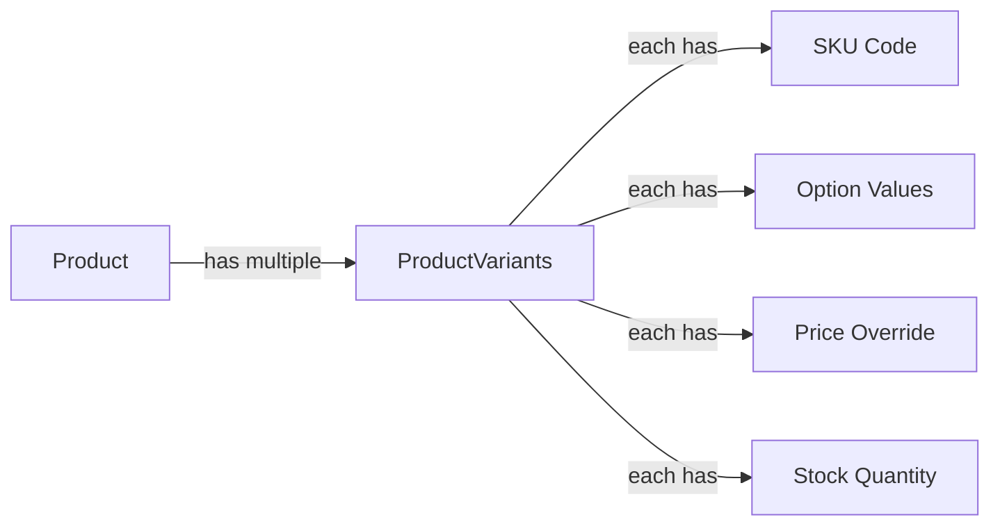
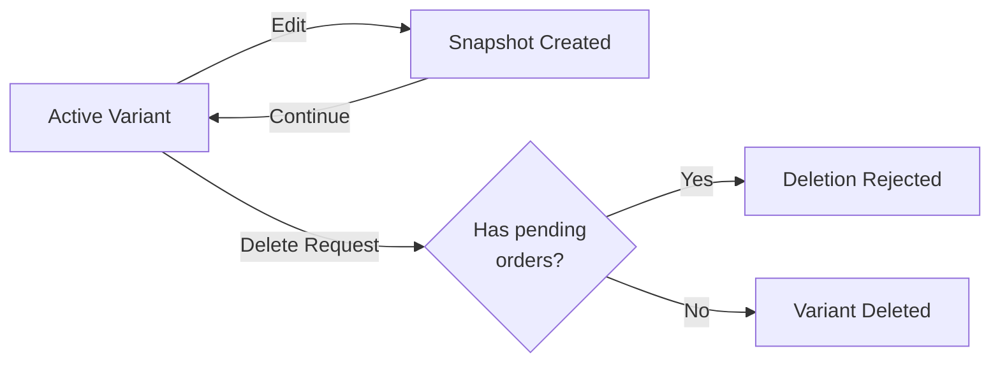
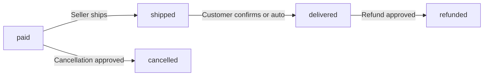
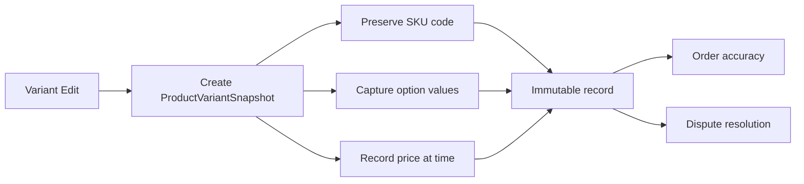
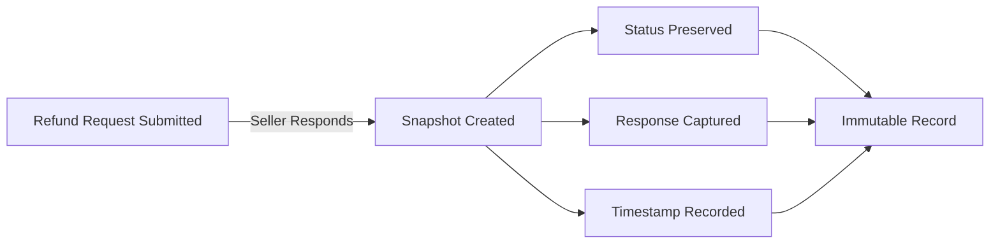
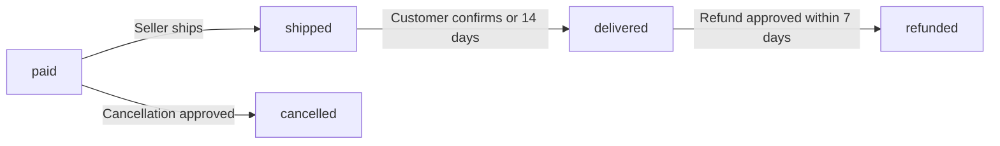
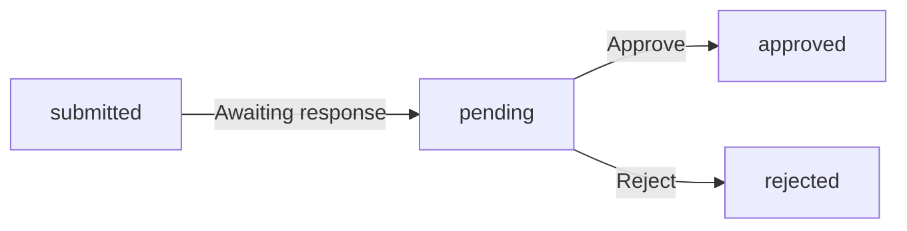
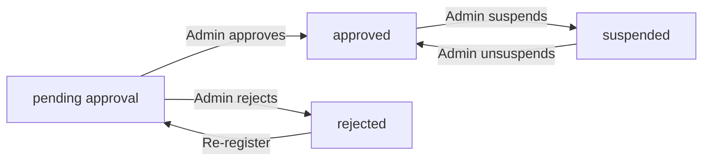

**shoppingMall — Business concepts, relationships, and states from user perspective**

Business concepts, relationships, and states from user perspective

# Domain Concepts

Describe what each concept means in the business domain and its key attributes.

## User Concept

A User represents an authenticated individual who accesses the platform. Every user has an email address used for authentication purposes. Users possess password credentials that secure their account access. The platform requires registration before any features can be used, meaning no guest browsing is allowed. Users can exist in different roles including customer, seller, or administrator. Each user maintains an account status that reflects their current standing on the platform. Users have the ability to change their password for security purposes. Account deletion is available to users, though sellers face additional restrictions. When a customer deletes their account, their profile information is removed while orders and reviews are preserved. Seller account deletion requires no pending orders or refund requests to be in process.

### User Authentication and Account

Every user on the platform has an email address that serves as their unique identifier for authentication purposes. Users authenticate using password credentials that they set during registration. The platform requires all users to register before accessing any features, meaning no guest browsing is permitted. Users can change their password at any time through their account settings. Each user maintains an account status that reflects their current standing on the platform, such as active, suspended, or banned.

### User Roles

Users can hold different roles on the platform. A customer role allows users to browse products, make purchases, and write reviews. A seller role enables users to create and manage product listings, process orders, and manage their shop profile. An administrator role grants users the ability to manage platform operations including approving seller registrations, managing categories, and overseeing orders. A user can hold multiple roles simultaneously.

### Account Deletion and Data Preservation

Users can delete their accounts, though the behavior differs by role. When a customer deletes their account, their profile information including display name and phone number is removed from the platform. However, their order history is preserved to maintain seller records and legal compliance. Their reviews are also preserved but are displayed as authored by "deleted user" rather than showing their profile information. When a seller deletes their account, they must have no pending orders or refund requests in process. Their product listings are removed, but order history and snapshots are preserved, including their shop name as it appeared in past orders.

## CustomerProfile Concept

A CustomerProfile represents the personal information associated with a customer account. Each profile contains a display name that identifies the customer to other users. A phone number is stored for contact and shipping purposes. The profile is linked to a wishlist that tracks products the customer is interested in. Customers can edit both their display name and phone number at any time. When a customer deletes their account, the profile information is removed from the system. However, reviews written by the customer are preserved and shown as authored by a deleted user. The profile serves as the customer's identity within the platform ecosystem. Display names appear on reviews and order confirmations. The profile maintains the customer's preferences and personal data throughout their relationship with the platform.

### CustomerProfile Definition

A CustomerProfile represents the personal information and identity associated with a customer account on the platform. Each profile contains a display name that identifies the customer to other users, such as on reviews and order confirmations. A phone number is stored for contact and shipping purposes. The display name and phone number together form the customer's contact information visible within the platform ecosystem.

The CustomerProfile serves as the customer's platform identity, distinguishing them from other users and maintaining their presence throughout their relationship with the shopping mall. This identity is linked to all customer activities including orders, reviews, and saved preferences.

### Profile Editing

Customers can edit their profile information at any time. Both the display name and phone number are editable fields that customers can update through their account settings. Changes to profile information take effect immediately and are reflected across the platform wherever the customer's identity is displayed.

Editable profile information allows customers to keep their contact details current and update how they wish to be identified on the platform. There are no restrictions on how often customers can modify their display name or phone number.

### Wishlist Association

Each CustomerProfile is linked to a wishlist that tracks products the customer is interested in purchasing. The wishlist association enables customers to save products for later viewing and potential purchase. The wishlist is owned by the CustomerProfile and persists as part of the customer's preferences on the platform.

Customer preferences, including saved products in the wishlist, are maintained within the profile. This allows customers to build a collection of products they wish to purchase and easily access them during future shopping sessions.

### Account Deletion and Profile Removal

When a customer deletes their account, their CustomerProfile information is removed from the system. The profile deletion on account removal includes the display name, phone number, and all other personal information stored in the profile.

However, reviews written by the customer are preserved for the integrity of the platform's review system. Review author preservation ensures that historical reviews remain visible even after account deletion. These preserved reviews are shown with a deleted user display label instead of the customer's original display name, indicating that the original author's account has been removed while maintaining the review content for other customers' reference.

## SellerProfile Concept

A SellerProfile represents the public-facing identity of a seller on the platform. Each profile includes a shop name that identifies the seller's store. A shop description provides information about the seller and their offerings. A logo image serves as visual branding for the shop. Sellers can edit their shop name, description, and logo image. Every edit to the seller profile creates a snapshot that preserves the previous state. Customers can view seller profiles to learn about shops before purchasing. The shop name appears on product listings and order confirmations. When a seller deletes their account, the shop name in past orders is preserved for record-keeping. Profile snapshots ensure that historical order records reflect the seller information at the time of purchase.

### Shop Identity and Branding

A SellerProfile represents the public-facing identity of a seller on the platform. The shop name serves as the primary identifier for the seller's store and appears on product listings, order confirmations, and the seller's profile page. The shop description provides detailed information about the seller, their offerings, and their business. The logo image serves as visual branding for the shop and is displayed alongside the shop name. Together, the shop name, description, and logo image form the complete branding elements that establish the seller's public shop presence on the platform.

### Profile Visibility and Editing

Sellers can edit their shop name, shop description, and logo image at any time. Every edit to the seller profile creates a snapshot that preserves the previous state, including the timestamp of the change and the values before and after. These snapshots are immutable and cannot be deleted. Customers can view seller profiles to learn about shops before making purchases. The seller profile is publicly visible and accessible to all customers browsing the platform. Profile snapshots ensure that historical records remain accurate even after sellers modify their information.

### Historical Preservation

The shop name appears on product listings to identify which seller offers each product. When a customer places an order, a snapshot of the seller's profile is saved with each order item, preserving the shop name, shop description, and logo image as they existed at the time of purchase. This historical seller information ensures that order history and past records accurately reflect the seller's identity at the time of transaction. When a seller deletes their account, the shop name in past orders is preserved for record-keeping purposes, maintaining the integrity of historical order data.

## Address Concept

An Address represents a shipping destination for customer orders. Each address contains a recipient name identifying who will receive the package. A phone number is stored for delivery contact purposes. The street address specifies the physical location for delivery. City, state or province, and postal code provide geographic routing information. The country field ensures proper international shipping handling. Customers can maintain multiple shipping addresses in their account. One address can be designated as the default shipping address for convenience. Addresses are used during checkout to specify where orders should be delivered. The complete address information ensures accurate package delivery to customers.

### Address Structure and Attributes

An Address contains a recipient name that identifies who will receive the package at the delivery location. A delivery phone number is stored for contact purposes during the shipping process. The street address specifies the physical location where the package should be delivered. The city location provides municipal-level geographic information for routing. The state or province field captures regional administrative division data. A postal code enables precise geographic sorting and delivery routing. The country specification ensures proper handling for domestic and international shipments. Together, these fields form complete delivery contact information that enables accurate package delivery. The address structure supports geographic routing requirements for shipping carriers to locate and deliver packages to customers.

### Address Management and Usage

Customers can maintain multiple addresses per customer account to support different delivery locations such as home, work, or gift recipients. One address can receive default address designation for convenience during checkout. The default address is automatically selected when customers proceed to checkout unless they choose otherwise. During checkout address selection, customers can choose from any of their saved addresses or add a new one. Each address serves as a shipping destination for customer orders. Once an order is placed, the shipping address used for that order is preserved and cannot be changed. This ensures the order is delivered to the intended location as specified at purchase time.

## Category Concept

A Category represents a classification group for organizing products on the platform. Each category has a name that identifies the product group. A description provides context about what types of products belong in the category. Categories can have a parent category reference, allowing one level of nesting for subcategories. Only administrators can create and manage categories. Products are organized into categories to help customers find relevant items. Customers can browse the list of all categories to explore product offerings. Viewing products within a category shows items that match that classification. When a category is deleted, products in that category become uncategorized. The category structure provides navigation and discovery pathways for shoppers.

### Category Structure

A Category represents a classification group for organizing products on the platform. Each category has a name that identifies the product group and a description that provides context about what types of products belong in the category.

Categories support one level of nesting through a parent category reference. A category can optionally have a parent category, making it a subcategory. This creates a two-level hierarchy: top-level categories and their subcategories. A subcategory cannot have its own subcategories (one level nesting only).

Categories are administrator managed concepts. Only administrators can create, edit, and delete categories. This ensures the category structure remains consistent and meaningful for product organization across the platform.

### Category Role in Product Organization

Categories serve as the primary navigation structure for product discovery on the platform. Products are organized into categories to help customers find relevant items. Each product belongs to one category, which can be either a top-level category or a subcategory.

Customers can browse the category listing to view all available categories and explore product offerings. The category listing displays both top-level categories and their subcategories, providing a clear hierarchy for navigation.

Customers can filter products by category when searching or browsing. Product filtering by category shows only items that match the selected classification. This enables targeted product discovery based on customer interests.

When a category is deleted, products that belonged to that category become uncategorized products. Uncategorized products remain in the system but are no longer associated with any category classification. This preserves product data while removing the organizational structure.

## Product Concept

A Product represents an item available for purchase on the platform. Each product has a name that identifies what is being sold. A description provides detailed information about the product features and specifications. A base price indicates the standard selling price for the product. A category assignment places the product within the platform's organization structure. Products belong to the seller who created them, establishing ownership. Every edit to a product creates a snapshot preserving the previous state. Products can be deleted by sellers only if there are no pending orders or refund requests. Deleted products no longer appear in search results or category listings. Product snapshots are preserved even after the product itself is deleted.

### Product Definition and Attributes

A Product represents an item available for purchase on the platform. Each product has a name that identifies what is being sold. A description provides detailed information about the product features and specifications. A base price indicates the standard selling price for the product. A category assignment places the product within the platform's organization structure, allowing customers to find products through category browsing. Products belong to the seller who created them, establishing ownership and determining who can edit or delete the product.

### Product Editing and Snapshot Preservation

Sellers can edit their own products, including the name, description, base price, category assignment, and images. Every edit to a product creates a snapshot that preserves the previous state of the product. The snapshot captures all product fields at the moment of change, including the product name, description, category, base price, and all associated images. Product snapshots are immutable records that cannot be modified or deleted. Snapshots are preserved even after the product itself is deleted, ensuring that historical records remain available for dispute resolution and order verification.

### Product Deletion and Visibility

Sellers can delete their own products only if there are no pending order items with paid or shipped status for any variant of the product. Sellers can also not delete a product if there are pending cancellation or refund requests for any variant of the product. When a product is deleted, it no longer appears in search results or category listings. However, the product remains visible in past orders where it was purchased, preserved through the order item snapshots. Product snapshots are retained even after product deletion, allowing administrators and sellers to view the historical state of deleted products.

## ProductImage Concept

A ProductImage represents a visual representation of a product. Each image has a file reference pointing to the stored image file. A display order determines the sequence in which images are shown. Sellers can upload multiple images for each product to showcase different angles or features. The first image in the order serves as the main or thumbnail image. Images can be reordered by the seller to change which appears first. Sellers can delete images from their products when needed. All image changes are included in product snapshots to preserve historical states. The main image appears in product listings and search results. Multiple images provide customers with comprehensive visual information about products.

### ProductImage Definition and Attributes

A ProductImage represents a visual representation of a product in the shopping mall platform. Each product image contains an image file reference that points to the stored image file in the system. The display order attribute determines the sequence in which images are shown to customers.

Sellers can upload multiple images per product to showcase different angles, features, or variations of the product. This allows customers to view comprehensive visual information before making a purchase decision. The product images are managed by the seller who owns the product.

Each product can have any number of images associated with it. The images belong to the product and are deleted when the product is deleted. Product images are an integral part of the product definition, providing customers with the visual information needed to evaluate products.

### ProductImage Display and Usage

The display order sequencing determines which image appears first in the image sequence. The first image in the display order serves as the main thumbnail image for the product. This main thumbnail image is used as the listing thumbnail that appears in product listings, search result displays, and category pages.

When customers browse search results or category listings, they see the main thumbnail image alongside the product name, base price, and seller shop name. This allows customers to quickly identify products of interest based on visual appearance.

On the product detail page, all images are displayed to provide a complete product showcase. Customers can view all uploaded images to examine the product from multiple angles and gather comprehensive visual information about the product's appearance, features, and quality.

### ProductImage Lifecycle and Snapshots

Sellers can reorder product images by changing the display order sequence. Image reordering allows sellers to control which image appears as the main thumbnail by moving it to the first position. Sellers can also delete images from their products when images are no longer needed or accurate.

All image changes are included in product snapshots to preserve historical states. When a product snapshot is created, it captures all product images at that moment, including the image file references and display order. This ensures that order items can reference the exact product appearance at the time of purchase.

Product snapshots preserve the complete visual representation of the product, including all images that were associated with the product at the snapshot time. These snapshots are immutable and cannot be deleted, ensuring that historical product appearances are preserved for dispute resolution and order reference purposes.

## ProductVariant Concept

A ProductVariant represents a specific version of a product with particular options. Each variant has a SKU code that serves as a unique identifier. Option values describe the specific combination such as color and size. A price field can override the product's base price for this specific variant. Stock quantity indicates how many units are available for purchase, starting at zero. A product can have multiple variants representing different option combinations. At least one variant is required for a product to be purchasable. Products with no variants are visible in search but shown as unavailable. Every variant edit creates a snapshot preserving the previous configuration. Variants can be deleted only if there are no pending orders or refund requests.

### Variant Identity and Configuration

A ProductVariant represents a specific product version with a particular combination of options. Each variant is uniquely identified by a SKU code that distinguishes it from other variants of the same product.

Option values describe the specific combination of attributes such as color and size. For example, a shirt product may have variants like "Red / Large", "Blue / Small", or "Black / Medium". Each variant captures one unique option combination.

The variant includes a price field that can override the product's base price for this specific configuration. If no price override is set, the product's base price applies. Stock quantity tracks how many units of this specific variant are available for purchase, starting at zero when the variant is created.

### Variant Lifecycle and Availability

A product can have multiple variants representing different option combinations. At least one variant is required for a product to be purchasable. Products with no variants remain visible in search results but are displayed as unavailable to customers.

Variant information is editable, including the SKU code, option values, and price override. Every edit to a variant creates a snapshot that preserves the previous configuration, including the SKU code, option values, price, and stock quantity at the time of the change. These snapshots are immutable and can be viewed by the product owner and administrators for dispute resolution.

A variant can be deleted only if there are no pending order items in paid or shipped status for that variant, and no pending cancellation or refund requests associated with it. When a variant is deleted, its inventory records and future purchase capability are removed, but historical snapshots and order item references remain preserved.

## InventoryRecord Concept

An InventoryRecord represents a single change in stock quantity for a product variant. Each record contains a quantity change amount that can be positive for restocking or negative for orders and adjustments. A reason field explains why the inventory change occurred. A timestamp records when the inventory change happened. Current stock is calculated by summing all inventory records for a variant. These records are history entries, not snapshots, and track all stock movements. Order placement automatically creates negative inventory records. Order cancellations and refunds automatically create positive inventory records. Sellers can view the full inventory history of each variant. When stock reaches zero, the variant is shown as out of stock.

### Stock Movement Records

Each InventoryRecord represents a single stock movement event for a product variant. The record contains a quantity change amount that indicates how much the stock changed. Positive values represent restocking events when sellers add inventory. Negative values represent order deductions or inventory adjustments for losses. A reason field documents why the inventory change occurred, such as restock, order placement, cancellation, refund, or manual adjustment. A timestamp records exactly when the inventory change happened. These records form an immutable audit trail of all stock movements for each variant.

### Stock Calculation and History

Current stock quantity is calculated by summing all inventory records for a variant from the beginning. This calculation method ensures accurate stock tracking based on the complete history. Sellers can view the full inventory history of each variant, seeing all quantity changes with their reasons and timestamps. Each variant maintains its own independent stock history, allowing sellers to track inventory movements per product option combination. The complete inventory audit trail enables sellers to investigate discrepancies and understand stock level changes over time.

### Automatic Inventory Updates

Order placement automatically creates negative inventory records to deduct stock for purchased variants. When an order item is cancelled, a positive inventory record is automatically created to restore the stock quantity. Similarly, when a refund is approved, a positive inventory record restores the stock. When stock reaches zero through these deductions, the variant displays an out of stock indication to customers. Out of stock variants cannot be added to the shopping cart. These automatic updates ensure inventory levels remain synchronized with order activity without manual intervention.

## Wishlist Concept

A Wishlist represents a collection of products a customer is interested in purchasing. Each wishlist has a creation date marking when it was established. The wishlist is associated with a specific customer account. Products are added to the wishlist, not specific variants. The wishlist view is paginated to handle large numbers of saved items. Products are automatically removed from all wishlists if deleted by the seller. Customers can view their wishlist to track products they want to buy. The wishlist serves as a personal shopping list for future purchases. Removed products no longer appear in the customer's wishlist. The wishlist helps customers organize products they are considering.

### Wishlist Definition and Purpose

A Wishlist represents a collection of products a customer is interested in purchasing. Each wishlist has a creation date marking when it was established. The wishlist is associated with a specific customer account (defined in CustomerProfile Concept).

Products are added to the wishlist, not specific variants. This means customers save products they are interested in, regardless of which variant they might eventually purchase. The wishlist serves as a personal shopping list for future purchases and helps customers track products they are considering.

The wishlist enables customer interest tracking by maintaining a record of saved products. Customers use the wishlist for product bookmarking, allowing them to quickly return to products they want to buy later. The wishlist view displays all saved products for easy access and future purchase tracking.

### Wishlist Behavior and Lifecycle

The wishlist view is paginated to handle large numbers of saved items. Pagination rules are defined in the business rules section.

Products are automatically removed from all wishlists if deleted by the seller. When a seller deletes a product, that product no longer appears in any customer's wishlist. This automatic product removal ensures wishlists only contain available products.

Customers can manage their wishlist by adding or removing products. The wishlist management allows customers to curate their saved products collection. When a product is removed from the wishlist, it is no longer tracked for future purchase consideration by that customer.

## Cart Concept

A Cart represents a customer's temporary collection of items intended for purchase. The cart has a last updated timestamp tracking recent activity. Each cart is associated with a specific customer account. The cart contains multiple cart items representing products and variants selected for purchase. A total price is calculated from all items in the cart. Items in the cart can be marked as unavailable if the variant is deleted or out of stock. The cart shows warnings when variant stock is less than the cart quantity. Unavailable items cannot be checked out. The cart serves as the staging area before order creation. Cart contents are removed when an order is successfully placed.

### Shopping Cart Definition

A shopping cart represents a customer's temporary collection of items intended for purchase. The cart serves as a pre-order collection where customers gather products before completing a transaction. It functions as an order staging area, holding selected items until the customer proceeds to checkout. The cart exists in an active state while the customer is shopping and is cleared after successful order placement.

### Cart Ownership

Each shopping cart is associated with exactly one customer account. The customer cart association ensures that cart contents are tied to the customer's profile and persist across sessions. Only the owning customer can view and modify their cart. The cart cannot be shared between multiple customer accounts.

### Cart Activity Tracking

The cart maintains a last updated timestamp that records when the cart was most recently modified. This timestamp is updated whenever items are added, removed, or when quantities are changed. The last updated timestamp helps track recent customer activity and can be used to identify inactive carts.

### Cart Contents

The cart contains a collection of cart items, each representing a specific product variant selected for purchase. The cart performs variant availability checks to ensure items remain purchasable. If a variant is deleted by the seller or becomes out of stock, the cart item is marked to reflect this change. The cart shows the current state of all selected items.

### Cart Pricing

The cart calculates a total price from all items it contains. The total price calculation sums the subtotal of each cart item (unit price multiplied by quantity). The total price is displayed to the customer and represents the amount that would be charged if proceeding to checkout. Price changes in variants are reflected in the cart total.

### Item Availability Status

The cart marks items as unavailable when the associated variant is deleted by the seller or has zero stock quantity. Unavailable item marking visually distinguishes these items from available ones. The cart displays a stock warning when a variant's available quantity is less than the quantity in the cart. This stock warning display alerts customers before checkout that they may need to adjust quantities.

### Checkout Eligibility

Checkout eligibility determines which items in the cart can be purchased. Only available items with sufficient stock are eligible for checkout. Unavailable items cannot be checked out and must be removed or the customer must proceed with only eligible items. The cart clearly indicates which items meet checkout eligibility requirements.

### Cart Clearing

Cart content removal occurs automatically when an order is successfully placed. All items that were included in the order are removed from the cart. The cart returns to an empty state after order creation, ready for new items to be added. This cart content removal ensures the cart does not retain items that have already been purchased.

## CartItem Concept

A CartItem represents a specific variant added to a customer's cart. Each cart item has a quantity indicating how many units the customer wants. The item is associated with a specific product variant, not just the product. When the same variant is added again, quantities are combined rather than creating separate lines. The cart item displays the product name for identification. Variant options are shown to specify which version is selected. The price reflects the variant's price at the time of adding to cart. A subtotal is calculated from price multiplied by quantity. Stock warnings appear if the variant has less stock than the cart quantity. Items are marked unavailable if the variant is deleted or out of stock.

### CartItem Identity and Quantity Management

A cart item represents a single line item in a customer's shopping cart. Each cart item is associated with a specific product variant, not just the product itself. This ensures the customer is purchasing a particular combination of options such as color and size.

The cart item tracks the quantity of units the customer intends to purchase. This quantity represents the purchase quantity for that specific variant. When a customer adds the same variant to the cart again, the quantities are combined into a single cart line item rather than creating duplicate entries. This combination rule ensures the cart remains organized with one line per unique variant.

The cart item quantity can be modified by the customer at any time before checkout. The quantity must be a positive integer value.

### CartItem Display and Pricing

Each cart item displays the product name for easy identification by the customer. The variant options are shown alongside the product name to specify which version of the product is selected, such as "Red / Large" or "Blue / Small".

The item price reflects the variant's price at the time the item was added to the cart. If the variant has a price override, that price is used; otherwise, the product's base price applies. The price remains fixed in the cart even if the variant's price changes in the catalog.

A subtotal is calculated for each cart item by multiplying the item price by the cart item quantity. The cart displays this subtotal for each line item, and the total cart price is the sum of all item subtotals.

### CartItem Availability and Stock Handling

The cart monitors stock availability for each variant. If the variant's stock quantity is less than the cart item quantity, a stock quantity warning is shown to the customer. This warning indicates that the desired quantity may not be fully available.

When a variant is deleted by the seller, all cart items referencing that variant are marked as unavailable. Similarly, when a variant's stock reaches zero, the variant is considered out of stock, and any cart items for that variant are marked as unavailable. Unavailable item marking prevents customers from proceeding to checkout with items that cannot be fulfilled.

Items marked as unavailable remain visible in the cart but cannot be purchased. The customer must remove unavailable items or wait for restocking before completing checkout.

## Order Concept

An Order represents a completed purchase transaction on the platform. Each order has an order number for unique identification. An order date records when the purchase was made. A total price reflects the sum of all order items. An order contains one or more order items representing purchased products. The shipping address is captured at order time and cannot be changed afterward. Order status is derived from the statuses of its individual items. Orders are created only after successful payment processing. The order serves as the permanent record of a customer's purchase. Order history allows customers to view all their past purchases.

### Order Identification and Date

Each order has a unique order number that identifies the purchase transaction. The order number is assigned when the order is created and cannot be changed. An order date records when the customer completed the purchase. The order date is captured at the moment payment succeeds and remains fixed as part of the permanent transaction record.

### Order Total Price

The total price represents the sum of all order items in the purchase. The total price is calculated from the unit prices and quantities of each item at the time of order placement. The total price is preserved as part of the order record and does not change even if product prices are later modified.

### Order Items Collection

An order contains one or more order items representing the products purchased. Each order item corresponds to a specific product variant with a quantity. If a customer purchases multiple quantities of the same variant, it appears as one order item with that quantity. Order items from different sellers can exist within the same order. Each order item maintains its own status independent of other items in the order.

### Shipping Address Capture

The shipping address is captured at the time the order is placed. The customer selects from their saved addresses or uses their default address during checkout. Once the order is created, the shipping address cannot be changed. This ensures the seller ships to the address the customer intended at purchase time. The shipping address becomes part of the permanent order record.

### Order Status Derivation

The overall order status is derived from the statuses of its individual order items. If all items are paid, the order status is paid. If any item is shipped and none are delivered yet, the order status is shipped. If all items are delivered, the order status is delivered. If all items are cancelled, the order status is cancelled. If all items are refunded, the order status is refunded. When items have mixed states such as some delivered and some refunded, the order status is partially completed.

### Order Creation and History

An order is created only after payment succeeds. If payment fails, no order is created and the customer can retry. Once created, the order serves as a permanent record of the completed purchase transaction. Customers can view their order history to see all past purchases. The order history is paginated and sorted by newest first. Each order in the history represents a customer purchase record that is preserved for reference and dispute resolution. The order remains in the system as a permanent transaction record even after all items are delivered.

## OrderItem Concept

An OrderItem represents a purchased product variant within an order. Each order item has a quantity indicating how many units were purchased. A unit price records the price paid for each unit. An item status tracks the current state such as paid, shipped, delivered, cancelled, or refunded. Each order item can have its own status independent of other items in the order. Order items can be individually cancelled or refunded. A snapshot of the purchased product is saved with the order item. A snapshot of the variant is saved preserving option values and price. A snapshot of the seller's profile is saved preserving shop name and logo. These snapshots ensure historical accuracy even if products or sellers change.

### Order Item Quantity and Pricing

Each order item records the quantity of units purchased for a specific product variant. The quantity indicates how many units of that variant the customer bought in this order.

Each order item has a unit price that records the price paid for each individual unit. The unit price is captured at the time of purchase and preserved even if the product's price changes later.

The total price for an order item is calculated by multiplying the quantity by the unit price. This calculation is preserved in the order record for historical accuracy.

### Order Item Status Tracking

Each order item has its own status that tracks the current state of that specific item independent of other items in the same order. This allows different items in the same order to be at different stages of fulfillment.

The item status can be one of the following:
- **Paid**: Payment has been completed, and the item is waiting for the seller to ship
- **Shipped**: The seller has shipped the item with tracking information
- **Delivered**: The item has been delivered to the customer
- **Cancelled**: The item was cancelled before shipping
- **Refunded**: The item was refunded after delivery

The overall order status is derived from the statuses of all items within the order, but each item maintains its own independent status throughout its lifecycle.

### Individual Item Cancellation and Refund

Each order item can be individually cancelled or refunded without affecting other items in the same order. This per-item approach allows customers to manage specific products within an order independently.

Individual item cancellation applies to items with paid status that have not yet been shipped. When a cancellation is approved, only that specific item is cancelled while remaining items continue normal processing.

Individual item refund applies to items with delivered status. When a refund is approved, only that specific item is refunded while remaining items in the order are unaffected.

If all items in an order are cancelled, the entire order status becomes cancelled. If all items in an order are refunded, the entire order status becomes refunded. Mixed states result in a partially completed order status.

### Snapshot Preservation for Historical Records

Each order item preserves snapshots of the purchased product, variant, and seller profile at the time of purchase. This ensures historical accuracy even if products, variants, or seller information change after the order is placed.

The product snapshot captures all product fields including name, description, category, base price, and images as they existed at purchase time.

The variant snapshot captures the SKU code, option values such as color and size, price, and stock quantity as they existed at purchase time.

The seller profile snapshot captures the shop name, shop description, and logo image as they existed at purchase time.

These snapshots are immutable and cannot be modified or deleted. They serve as the authoritative record of what was purchased, enabling accurate dispute resolution and historical reference. The snapshots remain preserved even if the original product is deleted or the seller modifies their profile.

## Shipment Concept

A Shipment represents a package sent by a seller containing order items. Each shipment has a carrier name identifying the shipping company. A tracking number allows customers to monitor delivery progress. A shipped date records when the package was sent. A shipment can contain one or more order items from the same seller. Different sellers always ship separately in different shipments. All items in the same shipment share the same tracking information. Customers can view tracking information for each shipment. Delivery confirmation is done per shipment, not per individual item. Items automatically change to delivered status after 14 days from shipping if not confirmed.

### Shipment Definition and Attributes

A Shipment represents a package sent by a seller containing one or more order items. Each shipment has a carrier name identifying the shipping company responsible for delivery. A tracking number is assigned to the shipment, allowing customers to monitor the package tracking progress. A shipped date records when the package was sent from the seller. All items in the same shipment share the same tracking information, including the carrier name and tracking number. A shipment can contain multiple order items, but only items from the same seller can be grouped together in one shipment.

### Shipment Delivery and Tracking

Different sellers always ship separately in different shipments, meaning each seller creates their own shipments for their order items. Customers can view tracking information for each shipment through the customer tracking view, which displays the carrier name, tracking number, and shipped date. Delivery confirmation is done per shipment, not per individual item. When a customer confirms delivery for a shipment, all items in that shipment change to delivered status. If the customer does not confirm delivery, items automatically change to delivered status after 14 days from the shipped date. The shipment status reflects the delivery progress, supporting delivery monitoring throughout the shipping process.

## ProductSnapshot Concept

A ProductSnapshot represents a preserved state of a product at a specific point in time. Each snapshot has a timestamp recording when the change was made. The snapshot includes the product name as it existed at that moment. The product description is preserved in the snapshot. All product fields including images are captured in the snapshot. The snapshot also includes snapshots of all variants at that moment. Snapshots are immutable and cannot be deleted or modified. A new snapshot is created whenever a product is edited. Snapshots are preserved even after the product itself is deleted. Sellers and administrators can view product snapshots for dispute resolution.

### ProductSnapshot Structure and Content

A ProductSnapshot represents a complete historical product state captured at a specific point in time. Each snapshot includes a snapshot timestamp recording when the change was made. The product name preservation ensures the name as it existed at that moment is retained. The product description preservation maintains the description content from that point in time. All product fields captured includes the base price and category assignment. Image preservation ensures all product images with their display order are included in the snapshot. Variant snapshot inclusion means the snapshot contains snapshots of all product variants at that moment, preserving each variant's SKU code, option values, price, and stock quantity. This complete product capture ensures the entire product state including all variants is preserved as a single historical record.

### ProductSnapshot Lifecycle and Access

An edit triggered snapshot is created automatically whenever a product is edited, including changes to name, description, price, category, images, or variants. The snapshot is an immutable record that cannot be modified or deleted once created. Post-deletion preservation ensures snapshots remain accessible even after the original product is deleted from the platform. For dispute resolution access, sellers can view snapshots of their own products and administrators can view snapshots of any product. Snapshot viewing allows relevant parties to examine the historical product state at any point in time for order verification, cancellation handling, refund processing, or other dispute resolution purposes.

## ProductVariantSnapshot Concept

A ProductVariantSnapshot represents a preserved state of a product variant at a specific point in time. Each snapshot has a timestamp recording when it was created. The SKU code is preserved as it existed at that moment. Option values such as color and size are captured in the snapshot. The price at the time of the snapshot is recorded. These snapshots are part of the parent product snapshot. Every variant edit creates a new snapshot. Snapshots are immutable and cannot be changed after creation. Variant snapshots preserve the exact configuration sold in historical orders. This ensures accurate records for dispute resolution and order history.

### ProductVariantSnapshot Definition

A ProductVariantSnapshot represents a preserved state of a product variant at a specific point in time. Each snapshot is created whenever a variant is edited, capturing the exact configuration at that moment.

The snapshot records the following attributes:

| Attribute | Description |
|-----------|-------------|
| Snapshot timestamp | The date and time when the snapshot was created |
| SKU code | The unique identifier preserved as it existed at the time of the snapshot |
| Option values | The specific combination of options such as color and size captured at the time of the snapshot |
| Price | The variant price at the time of the snapshot, including any price override |
| Stock quantity | The available stock quantity at the time of the snapshot |

Each ProductVariantSnapshot belongs to a parent ProductSnapshot. When a product is edited and a product snapshot is created, all variant snapshots at that moment are included, preserving the complete state of the product and its variants together.

Once created, a ProductVariantSnapshot is immutable and cannot be modified or deleted. This ensures the variant record remains unchanged for historical reference.

### ProductVariantSnapshot Purpose

ProductVariantSnapshots serve critical business purposes for maintaining accurate purchase records and supporting dispute resolution.

**Historical Configuration Preservation**

When a customer purchases a product variant, the order item references the ProductVariantSnapshot that existed at the time of purchase. This preserves the exact variant state including the SKU code, option values (color, size, and other options), and price that the customer actually purchased, regardless of any subsequent edits to the variant.

**Order Accuracy**

By storing snapshot references with order items, the platform ensures that order history always displays the correct variant configuration that was purchased. Even if the seller later changes the SKU code, modifies option values, or adjusts the price, the customer's order record remains accurate and reflects what was actually bought.

**Purchase Record Integrity**

The snapshot mechanism guarantees that purchase records cannot be altered retroactively. This integrity is essential for:

- Customer order history accuracy
- Seller sales records and reporting
- Financial reconciliation
- Tax and legal compliance

**Dispute Resolution Support**

When disputes arise about what was purchased (e.g., "I ordered the Blue/Large variant, not Red/Medium"), the ProductVariantSnapshot provides authoritative evidence of the exact variant state at the time of purchase. This supports fair resolution of customer complaints, refund requests, and platform mediation.

## SellerProfileSnapshot Concept

A SellerProfileSnapshot represents a preserved state of a seller's profile at a specific point in time. Each snapshot has a timestamp recording when it was created. The shop name is preserved as it existed at that moment. The shop description is captured in the snapshot. The logo image at the time of the snapshot is preserved. A new snapshot is created every time the seller profile is edited. These snapshots are immutable and cannot be modified. Seller profile snapshots are saved with order items to preserve seller information at purchase time. This ensures customers see the correct shop name and logo in their order history. Snapshots remain available even if the seller later changes their profile or deletes their account.

### Snapshot Structure and Creation

A seller profile snapshot records the complete state of a seller's profile at a specific moment in time. Each snapshot captures a timestamp indicating when the snapshot was created. The shop name as it existed at that moment is preserved in the snapshot. The shop description content is captured in full. The logo image representing the shop's branding at that time is preserved. A new snapshot is automatically created every time the seller edits their profile information, including changes to the shop name, shop description, or logo. Once created, each snapshot becomes an immutable record that cannot be modified or deleted. This ensures an accurate historical record of all profile states throughout the seller's participation on the platform.

### Order History Preservation

Seller profile snapshots are associated with order items at the time of purchase. When a customer places an order, a snapshot of the seller's profile is saved with each order item from that seller. This preserves the shop name and logo exactly as they appeared when the customer made the purchase. The snapshot ensures order history accuracy by maintaining the seller information that the customer saw during checkout. Shop branding is preserved in the customer's order display regardless of any subsequent changes the seller makes to their profile. The historical seller state remains accessible even if the seller later changes their shop name, updates their description, or replaces their logo. If a seller deletes their account, the snapshots associated with past orders remain intact, ensuring customers can still view the shop information from their purchase history. This account deletion resilience guarantees that order records remain complete and meaningful for both customers and administrative purposes.

## Review Concept

A Review represents customer feedback on a purchased product. Each review has a rating from 1 to 5 stars that is required. Text content is optional and allows customers to provide detailed feedback. A creation date records when the review was written. Reviews can only be written after the order item status is delivered. Customers can write one review per product per order. Reviews are displayed on the product detail page for other customers to see. Customers can edit their own reviews after submission. Customers can delete their own reviews. The product's average rating is calculated from all non-deleted reviews.

### Review

A Review represents customer feedback on a purchased product. Each review contains a rating from 1 to 5 stars that is required. Text content is optional and allows customers to provide detailed written feedback alongside the star rating. A creation date records when the review was originally written.

A customer can write one review per product per order. A review can only be written after the corresponding order item status is delivered. This ensures customers have received the product before providing feedback.

Reviews are displayed on the product detail page for other customers to view. The product's average rating is calculated from all non-deleted reviews for that product. When a customer deletes their review, it is excluded from the average rating calculation, though the snapshot of the review is preserved for record-keeping purposes.

Customers can edit their own reviews after submission to update their rating or text content. Customers can also delete their own reviews entirely. Each edit to a review creates a snapshot that preserves the previous state.

## ReviewSnapshot Concept

A ReviewSnapshot represents a preserved state of a review at a specific point in time. Each snapshot has a timestamp recording when it was created. The rating at the time of the snapshot is preserved. The text content at the time of the snapshot is captured. A new snapshot is created every time a review is edited. These snapshots are immutable and cannot be modified. Review snapshots are preserved even after the review itself is deleted. This ensures a complete history of all review changes. Snapshots can be viewed for dispute resolution purposes. The snapshot system maintains transparency in review modifications.

### Snapshot Structure and Content

A ReviewSnapshot captures the complete state of a review at a specific point in time. Each snapshot records the timestamp when it was created, marking the exact moment the snapshot was taken. The rating given in the review is preserved in the snapshot, maintaining the star value that was assigned at that time. The text content of the review is captured in full, preserving whatever written feedback the customer provided. This ensures that every historical review state is accurately documented with both the numerical rating and the accompanying written content.

### Snapshot Creation and Immutability

A new ReviewSnapshot is automatically created every time a review is edited. This edit-triggered snapshot mechanism ensures that all modifications to a review are tracked and recorded. Once a snapshot is created, it becomes an immutable review record that cannot be altered or deleted. This immutability guarantees that the historical record remains unchanged, providing reliable review modification tracking. The system maintains transparency by preserving every version of the review, allowing the complete evolution of the review content to be traced.

### Snapshot Preservation and Access

ReviewSnapshots are preserved even after the original review is deleted, ensuring post-deletion preservation of the review history. This creates a complete change history that documents all states the review has been in throughout its lifecycle. The preserved snapshots serve as a review audit trail, maintaining transparency in the review system. Snapshots can be viewed by relevant parties for dispute resolution access, allowing administrators and authorized users to examine the historical review state. This snapshot viewing capability supports fair resolution of disputes by providing access to the full record of review modifications.

## AdminRequest Concept

An AdminRequest represents a user's application to become an administrator. Each request includes a reason explaining why the user wants administrator access. A request status tracks whether the request is pending, approved, or rejected. A submitted date records when the request was made. Any user whether customer or seller can submit an administrator request. Super administrators can view the list of pending requests. Requests are approved or rejected by super administrators. When approved, the user becomes a regular administrator. The request serves as the formal application process for administrator privileges. Request history tracks all administrator access applications.

### AdminRequest Definition and Submission

An AdminRequest represents a formal application submitted by a user to obtain administrator privileges on the platform. Any registered user, whether a customer or seller, is eligible to submit an administrator request. Each request must include a reason explaining why the user wants administrator access. The submitted date records when the request was made. This formal request process serves as the only pathway for users to apply for administrator access. The request captures the applicant's identity and their justification for seeking administrator privileges.

### AdminRequest Status and Review

Each administrator request has a request status that tracks its progress through the approval workflow. The status transitions through three states: pending when first submitted, approved when granted administrator access, or rejected when denied. Super administrators review all pending requests and decide whether to approve or reject them. When a request is approved, the user becomes a regular administrator. Request history maintains a complete record of all administrator access applications, including their outcomes and timestamps. This status tracking ensures transparency in the administrator selection process and allows applicants to understand their request outcome.

## CancellationRequest Concept

A CancellationRequest represents a customer's request to cancel an order item. Each request includes a cancellation reason explaining why the customer wants to cancel. A request status tracks the current state of the request. A submitted date records when the cancellation was requested. Cancellation is handled per order item, not for the entire order. Requests can only be made for items with paid status that have not yet shipped. The seller of the item can approve or reject the cancellation request. A snapshot of the request state is created when the seller responds. Approved cancellations result in the item being cancelled and refund processed. Cancelled items restore their stock quantities through inventory records.

### Cancellation Request Definition

A CancellationRequest represents a customer's request to cancel a specific order item. Each cancellation request is tied to a single order item, not the entire order. This means customers can cancel individual items within an order while other items continue processing normally.

Each cancellation request includes a cancellation reason, which is a text explanation provided by the customer describing why they want to cancel the item. The cancellation reason is required when submitting the request.

The request status tracks the current state of the cancellation request throughout its lifecycle. Status values include pending (awaiting seller response), approved (seller has approved the cancellation), and rejected (seller has rejected the cancellation).

A submitted date records when the customer initially submitted the cancellation request. This timestamp is used to track how long a request has been pending and for audit purposes.

### Cancellation Request Eligibility and Processing

Cancellation requests can only be submitted for order items that have a paid status. Items that have already been shipped cannot be cancelled through the cancellation request process.

The paid status requirement ensures that only items where payment has been completed but the seller has not yet shipped can be cancelled. Once an item transitions to shipped status, the cancellation request option is no longer available.

The not yet shipped condition is enforced at the time of request submission. If an item has already been marked as shipped by the seller, the system prevents the customer from submitting a cancellation request for that item.

The seller of the order item can approve or reject the cancellation request. The seller reviews the cancellation reason and makes a decision based on their business policies. The seller's response changes the request status to either approved or rejected.

When the seller responds to a cancellation request, a response snapshot creation occurs. A CancellationRequestSnapshot is created that captures the request status and seller response at that moment. This snapshot is immutable and preserved for dispute resolution and audit purposes.

Upon approval, the item cancellation outcome is that the order item status changes to cancelled. The cancelled item is removed from the active order processing workflow. The remaining items in the order continue processing normally.

Refund processing is automatically initiated when a cancellation request is approved. The customer receives a refund for the cancelled item's full amount. The refund is processed through the same payment gateway used for the original purchase.

Stock quantity restoration occurs when an item is cancelled. The stock quantity for the associated product variant is increased to reflect that the item is no longer reserved for the order.

An inventory record creation happens automatically when stock is restored. A positive inventory record is added to the variant's inventory history, documenting the quantity increase and recording the reason as item cancellation. This maintains a complete audit trail of stock changes.

### Cancellation Request Lifecycle Tracking

Cancellation tracking enables customers and sellers to monitor the progress of cancellation requests through their lifecycle. Customers can view the current request status and see when the seller has responded.

The lifecycle begins when the customer submits a cancellation request with a cancellation reason. The request enters pending status and awaits seller action. Sellers can view pending cancellation requests for their order items in their dashboard.

Once the seller approves or rejects the request, the status updates accordingly and the response is visible to the customer. If approved, the item status changes to cancelled and the refund process begins. If rejected, the item continues through the normal order fulfillment process.

All state changes during the cancellation tracking lifecycle are recorded with timestamps. This includes the submitted date, the seller response date, and the date when the item status changed to cancelled (if approved).

## CancellationRequestSnapshot Concept

A CancellationRequestSnapshot represents a preserved state of a cancellation request at a specific point in time. Each snapshot has a timestamp recording when it was created. The request status at the time of the snapshot is preserved. The seller response is captured in the snapshot. A new snapshot is created when the seller responds to the cancellation request. These snapshots are immutable and cannot be modified. Snapshots form part of the cancellation request history. This ensures accurate records of how cancellation requests were handled. Snapshots can be viewed for dispute resolution purposes. The snapshot system maintains transparency in cancellation request processing.

### Snapshot Structure and Creation

A cancellation request snapshot captures the state of a cancellation request at a specific point in time. Each snapshot records when it was created with a snapshot timestamp. The request status at the time of creation is preserved in the snapshot, ensuring the historical state remains unchanged. The seller response to the cancellation request is captured in the snapshot, documenting how the seller handled the request. A new snapshot is created when the seller responds to the cancellation request, triggered by the seller's approval or rejection action. The snapshot includes response documentation that records the seller's decision and any accompanying notes. Once created, the snapshot becomes an immutable snapshot record that cannot be modified or deleted. This immutability ensures the integrity of the cancellation request handling record.

### Snapshot Access and Purpose

Cancellation request snapshots form part of the cancellation history for each order item. The complete set of snapshots creates a cancellation audit trail that documents all state changes and seller responses throughout the request lifecycle. This historical request state preservation enables transparent tracking of how cancellation requests were processed. Snapshots can be accessed through snapshot viewing by relevant parties, including the customer who submitted the request, the seller who responded, and administrators. This dispute resolution access allows all parties to review the exact state of the request at any point in time. The snapshot system supports transparency maintenance by providing an unalterable record of the request handling record. Administrators can review the cancellation audit trail when investigating disputes or policy violations. The historical request state captured in snapshots ensures accurate records are available for reference, even after the cancellation request has been fully processed.

## RefundRequest Concept

A RefundRequest represents a customer's request for a refund on a delivered order item. Each request includes a refund reason explaining why the customer wants a refund. A request status tracks the current state of the request. A submitted date records when the refund was requested. Refund is handled per order item, not for the entire order. Requests can only be made for items with delivered status. Refunds must be requested within 7 days of the item being delivered. The seller of the item can approve or reject the refund request. Approved refunds result in the item being marked as refunded. Refunded items restore their stock quantities through inventory records.

### Refund Request Definition

A RefundRequest represents a customer's request for a refund on a specific order item. Each request is associated with exactly one order item, not the entire order. The request includes a refund reason where the customer explains why they want a refund. A request status tracks the current state of the request throughout its lifecycle. A submitted date records when the customer initiated the refund request. Multiple refund requests can exist for different items within the same order, but each item can only have one active refund request at a time.

### Refund Eligibility Rules

A refund request can only be submitted for an order item that has a delivered status. Items with paid, shipped, cancelled, or refunded status are not eligible for refund requests. The customer must submit the refund request within 7 days of the item being delivered. The 7-day window is calculated from the delivery confirmation date or the automatic delivery date (14 days after shipping if the customer does not confirm). Once the 7-day window expires, the item is no longer eligible for a refund request. If an item has an active cancellation request, it cannot have a refund request simultaneously.

### Seller Response Process

The seller of the order item can approve or reject the refund request. When the seller responds to the request, the request status is updated to reflect the seller's decision. The seller's response creates a snapshot that preserves the state of the request at that moment. Customers can track the status of their refund requests through the request lifecycle. If the seller does not respond within a reasonable timeframe, the request remains in pending status until action is taken. The seller's decision is final unless escalated to an administrator.

### Refund Outcome and Stock Restoration

When a refund request is approved, the order item status changes to refunded. The refunded item is marked as completed in the refund process. Approved refunds automatically restore the stock quantity of the associated product variant. The stock restoration is recorded through an inventory record with a positive quantity change. The inventory record includes the reason for the stock adjustment, referencing the approved refund. When a refund request is rejected, the item status remains unchanged and no stock adjustment occurs. If all items in an order are refunded, the overall order status becomes refunded.

## RefundRequestSnapshot Concept

A RefundRequestSnapshot represents a preserved state of a refund request at a specific point in time. Each snapshot has a timestamp recording when it was created. The request status at the time of the snapshot is preserved. The seller response is captured in the snapshot. A new snapshot is created when the seller responds to the refund request. These snapshots are immutable and cannot be modified. Snapshots form part of the refund request history. This ensures accurate records of how refund requests were handled. Snapshots can be viewed for dispute resolution purposes. The snapshot system maintains transparency in refund request processing.

### Snapshot Creation and Immutability

A RefundRequestSnapshot is created when the seller responds to a refund request. The seller response triggered event initiates snapshot creation. Each snapshot records a snapshot timestamp indicating when the snapshot was created. The request status preservation ensures the status at the time of response is permanently recorded. The seller response capture includes the approval or rejection decision and any seller comments. Response documentation preserves the complete seller response for future reference.

Once created, each snapshot becomes an immutable snapshot record that cannot be modified or deleted. The historical request state at the moment of seller response is permanently preserved. This immutability ensures the integrity of the refund request handling record.

### Snapshot Purpose and Access

RefundRequestSnapshots form part of the refund history for each refund request. Multiple snapshots create a complete request handling record showing how the refund request progressed through the system. This refund audit trail enables tracking of all state changes and responses.

The snapshot system supports transparency maintenance in refund request processing. All parties involved can access the snapshot viewing functionality to review the history. Dispute resolution access is provided to relevant parties including the customer, seller, and administrators.

Snapshots can be viewed by the customer who submitted the refund request, the seller who responded, and administrators for oversight purposes. This access ensures transparency maintenance and supports fair dispute resolution when disagreements arise about how refund requests were handled.

## Administrator Concept

An Administrator represents a user with elevated privileges to manage the platform. Each administrator has a grade that is either regular administrator or super administrator. A promotion date records when the administrator was promoted to their current grade. Regular administrators are approved from user administrator requests. Super administrators can promote regular administrators to super administrator. Super administrators can demote other super administrators to regular administrator. Super administrators cannot demote themselves. Administrators have various management capabilities across the platform. The grade system establishes a hierarchy of administrative authority. Administrator status grants access to platform management functions.

### Administrator Role and Grades

An Administrator represents a user with elevated privileges to manage the platform. Each administrator holds one of two grades: regular administrator or super administrator. The administrator grade establishes the administrative hierarchy and determines the scope of management authority.

Regular administrators are users approved from administrator requests. They have platform management access for standard administrative functions including seller management, category management, product oversight, order oversight, and user management.

Super administrators hold the highest administrator status in the administrative hierarchy. They possess all capabilities of regular administrators plus additional authority over administrator grade management. The grade distinction creates a clear chain of management authority within the administrator role.

### Administrator Promotion and Demotion

When a user becomes an administrator or changes grade, a promotion date records when the administrator was promoted to their current grade. This timestamp establishes when the administrator status and associated elevated privileges were granted.

Grade promotion capability allows super administrators to promote regular administrators to super administrator. Grade demotion capability allows super administrators to demote other super administrators to regular administrator. The self demotion restriction prevents super administrators from demoting themselves, ensuring at least one super administrator maintains the highest level of management authority.

These grade change capabilities maintain the administrative hierarchy while preventing accidental loss of super administrator access.

### Administrator Management Authority

Administrator status grants access to platform management functions across the shopping mall. The scope of management authority varies by administrator grade.

Regular administrators have management authority over seller account approvals, category creation and management, product oversight, order oversight, and customer and seller account management. They can approve or reject seller registrations, suspend or unsuspend seller accounts, create and manage categories, view all products and orders, and ban or unban user accounts.

Super administrators have all regular administrator capabilities plus authority over administrator grade management. Administrator request approval is handled by super administrators, who review requests from users seeking administrator status and approve or reject them based on the provided reason.

All administrators have elevated privileges compared to regular customers and sellers, enabling them to maintain platform integrity and enforce policies.

# Domain Relationships

Describe how concepts relate to each other from a business perspective.

## Conceptual Relationships

Describe how concepts relate to each other in business terms.

### User and Profile Relationship

A user account has exactly one profile type: either a customer profile or a seller profile, but not both simultaneously. The customer profile belongs-to the user account and stores personal information including display name and phone number. The seller profile belongs-to the user account and stores shop information including shop name, shop description, and logo image.

A user account can have an administrator role association in addition to their profile. When a user becomes an administrator, they retain their original customer or seller profile while gaining administrative capabilities.

The user account owns all addresses associated with their customer profile. Each address belongs-to exactly one customer profile.

### Seller and Product Ownership

A seller profile has ownership of all products they create. Each product belongs-to exactly one seller profile, establishing clear ownership boundaries. When a seller deletes their account, their products are removed from listings, but order history snapshots remain preserved.

A product belongs-to one category, which organizes the product within the marketplace structure. Categories can have a parent category association, allowing one level of nesting where subcategories belong-to a parent category.

Administrators have oversight ownership of all products on the platform and can delete any product for policy violations, regardless of which seller created it.

### Product Structure Association

A product has-many product images, where each image belongs-to exactly one product. Images are ordered by display sequence, with the first image serving as the main thumbnail. When images are reordered or deleted, the product structure association is updated.

A product has-many product variants, where each variant belongs-to exactly one product. Each variant represents a specific combination of options such as color and size. A product must have at least one variant to be purchasable.

A product variant has-many inventory records, where each record belongs-to exactly one variant. Inventory records track all quantity changes including restocking, order deductions, and adjustments. The current stock quantity is calculated from the sum of all inventory records belonging-to the variant.

### Customer Shopping Association

A customer profile has-many wishlist entries, where each wishlist entry belongs-to exactly one customer profile. The wishlist contains products, not specific variants. When a product is deleted by its seller, the wishlist association is automatically removed.

A customer profile has-one shopping cart, which belongs-to that customer. The cart has-many cart items, where each cart item belongs-to exactly one cart. Each cart item references one specific product variant and tracks the quantity. If the same variant is added again, the quantities are combined within the existing cart item association.

A customer profile has-many orders, where each order belongs-to exactly one customer. Each order uses one address for shipping, and that address belongs-to the customer's address collection.

### Order and Fulfillment Relationship

An order has-many order items, where each order item belongs-to exactly one order. Each order item references one product variant and captures the quantity and unit price at purchase time. Order items can have different statuses independently within the same order.

A shipment has-many order items, but only items from the same seller can belong-to the same shipment. Different sellers always ship separately, creating distinct shipments. When a shipment is created, all order items belonging-to that shipment share the same tracking information and transition to shipped status together.

An order item can have-one cancellation request association when the item status is paid. The cancellation request belongs-to that order item. Similarly, an order item can have-one refund request association when the item status is delivered. The refund request belongs-to that order item.

### Snapshot and Audit Association

The snapshot principle creates an immutable audit trail for all editable data. When any entity is modified, a snapshot is created that belongs-to the original entity. Snapshots have-many historical records, preserving the complete state at each modification point.

A product has-many product snapshots, where each snapshot belongs-to that product. Each product snapshot has-many product variant snapshots, capturing the complete state of all variants at the moment of the product edit. Product snapshots belong-to the product even after the product is deleted.

A seller profile has-many seller profile snapshots, where each snapshot belongs-to that seller profile. Order items maintain snapshot associations to preserve the product name, description, variant options, price, and seller shop name at the time of purchase. These snapshot references belong-to the order item and cannot be modified.

A review has-many review snapshots, where each snapshot belongs-to that review. A cancellation request has-many cancellation request snapshots, capturing each status change and seller response. A refund request has-many refund request snapshots, capturing each status change and seller response. All snapshots are immutable and preserved for dispute resolution.

## Lifecycle and Retention

Describe concept lifecycle states and transitions only. Detailed retention/recovery policies belong in 05-non-functional. Operation details belong in 03-functional-requirements.

### Entity Lifecycle States

Order items progress through a defined lifecycle from payment to completion. When payment succeeds, the order item enters the paid status. The seller then ships the item, transitioning it to shipped status. Upon customer delivery confirmation or automatic confirmation after 14 days, the item reaches delivered status. Alternatively, items may transition to cancelled status if a cancellation request is approved before shipping, or to refunded status if a refund request is approved after delivery.

Products follow a lifecycle from creation through active selling to potential deletion. When a seller creates a product, it becomes visible in search and category listings. If the seller is suspended by an administrator, the product transitions to hidden status and cannot be purchased. When a seller deletes a product (permitted only when no pending orders or requests exist), the product is removed from listings but its snapshots remain preserved.

Reviews enter the system only after the associated order item reaches delivered status. Reviews can be edited by the customer, with each edit creating a snapshot. Reviews can be deleted by the customer, but the snapshots remain preserved and the review is excluded from average rating calculations.

Seller profile approvals follow a lifecycle from submitted to pending, then to approved or rejected status. Rejected sellers can submit new registration requests, restarting the approval lifecycle.

### Data Retention Principles

The platform preserves critical business data to support legal compliance, dispute resolution, and transaction history integrity. When a customer deletes their account, their profile information is removed but their order history is preserved to maintain seller records and legal documentation. Reviews written by the deleted customer are preserved but displayed as authored by a deleted user.

When a seller deletes their account, their products are removed from listings but order history and snapshots are preserved. The shop name associated with past orders remains visible to customers for historical reference.

All snapshots created during data modifications are immutable and cannot be deleted. This includes product snapshots, product variant snapshots, seller profile snapshots, review snapshots, cancellation request snapshots, and refund request snapshots. Snapshots serve as the authoritative record for dispute resolution and are accessible to relevant parties (owners and administrators).

Inventory records are preserved indefinitely to maintain a complete audit trail of stock changes. Each inventory record captures the quantity change, reason for the change, and the timestamp when the change occurred.

### Deletion Policies

Customer account deletion is permitted at any time. Upon deletion, the customer's profile information including display name and phone number is removed. However, order history is preserved for seller records and legal purposes. Reviews authored by the customer are preserved but attributed to a deleted user. Products in the customer's wishlist are unaffected, but the wishlist itself is removed with the account.

Seller account deletion is restricted to protect transaction integrity. A seller can delete their account only if they have no pending orders in paid or shipped status, and no pending cancellation or refund requests. When a seller account is deleted, their products are removed from listings along with all variants and inventory records. Order history and snapshots are preserved. The shop name associated with past orders remains visible to customers.

Product deletion is permitted only when there are no pending order items in paid or shipped status for any variant of the product, and no pending cancellation or refund requests for any variant. Deleting a product also deletes all its variants and inventory records. Product snapshots remain preserved even after product deletion.

Variant deletion follows the same restrictions as product deletion: no pending order items and no pending cancellation or refund requests for that specific variant.

Category deletion by administrators removes the category assignment from products, leaving products uncategorized but not deleted.

Review deletion by customers removes the review from public display and excludes it from average rating calculations, but review snapshots remain preserved.

### Snapshot Immutability

Snapshots are immutable records that capture the state of editable data at specific points in time. Once created, a snapshot cannot be modified or deleted. This immutability ensures data integrity for dispute resolution and historical accuracy.

Product snapshots are created whenever a product is edited, capturing all product fields including name, description, category, base price, and images. Each product snapshot also includes snapshots of all variants at that moment, preserving the complete state of the product and its variants.

Product variant snapshots are created whenever a variant is edited, capturing the SKU code, option values, price, and stock quantity at that moment.

Seller profile snapshots are created whenever a seller edits their shop name, description, or logo. Each edit creates a new snapshot preserving the previous state.

Review snapshots are created whenever a customer edits their review, capturing the rating and text content at that moment.

Cancellation request snapshots are created whenever the seller responds to a cancellation request, capturing the request status and seller response at that moment.

Refund request snapshots are created whenever the seller responds to a refund request, capturing the request status and seller response at that moment.

Order item snapshots are created at the time of purchase, preserving the product name, description, variant options, price, and seller profile (shop name and logo) as they existed when the order was placed. This ensures that customers and sellers can reference the exact state of the transaction even if the product or seller profile changes later.

### Stock Recovery Mechanisms

Stock quantities are automatically restored in specific business scenarios to maintain inventory accuracy. When a cancellation request is approved for an order item, the stock quantity for that variant is restored through a positive inventory record. This ensures that cancelled items become available for purchase again.

When a refund request is approved for an order item, the stock quantity for that variant is similarly restored through a positive inventory record. This applies even though the item was already delivered, as the refund represents a return of the item to available inventory.

When an administrator force-cancels an order item or entire order, the stock quantities are restored for all affected items. When an administrator force-refunds an order item or entire order, the stock quantities are similarly restored.

Order placement automatically creates a negative inventory record, reducing the available stock. If an order is cancelled before payment completion, no inventory record is created as the order was never finalized.

Sellers can manually adjust inventory through restocking (positive quantity change) or adjustment for loss (negative quantity change), each requiring a reason to be recorded in the inventory history.

# Business Categories and State Flows

Business category classifications and state flow definitions.

## Business Category Definitions

Define all business category classifications with their allowed values and descriptions.

### Seller Approval Status Classification

Seller accounts have an approval status that determines their ability to sell on the platform.

The allowed values for seller approval status are:
- **Pending**: The seller has submitted a registration request and is awaiting administrator review. Sellers with pending status cannot create products or make sales.
- **Approved**: The administrator has approved the seller registration. Sellers with approved status can create products, manage inventory, and process orders.
- **Rejected**: The administrator has rejected the seller registration request. Sellers with rejected status cannot sell and are provided with a rejection reason. Rejected sellers may submit a new registration request.

Seller approval status is set during registration and can only be changed by administrators through the approval or rejection process.

### Order Item Status Classification

Each item within an order has its own status that tracks the fulfillment lifecycle of that specific product variant.

The allowed values for order item status are:
- **Paid**: Payment has been completed successfully. The item is awaiting shipment by the seller.
- **Shipped**: The seller has shipped the item and provided tracking information. The item is in transit to the customer.
- **Delivered**: The customer has confirmed delivery, or 14 days have passed since the ship date without customer confirmation. The item has been received.
- **Cancelled**: The item was cancelled before shipment, either through seller approval of a cancellation request or administrator action. Stock quantities are restored.
- **Refunded**: The item was refunded after delivery, either through seller approval of a refund request or administrator action. Stock quantities are restored.

Order item status changes follow a defined workflow and can only transition to specific subsequent statuses based on business rules.

### Order Status Classification

The overall order status is derived from the statuses of all order items within that order. Order status provides a summary view of order completion.

The allowed values for order status are:
- **Paid**: All order items have the status "paid".
- **Shipped**: At least one order item has the status "shipped", and no items have the status "delivered" yet.
- **Delivered**: All order items have the status "delivered".
- **Cancelled**: All order items have the status "cancelled".
- **Refunded**: All order items have the status "refunded".
- **Partially Completed**: Order items are in mixed states, such as some delivered and some refunded, or some shipped and some delivered.

Order status is automatically calculated based on item statuses and cannot be set directly.

### Request Status Classification

Administrative and customer-initiated requests use a common status classification to track their processing state.

The allowed values for request status (applicable to admin requests, cancellation requests, and refund requests) are:
- **Pending**: The request has been submitted and is awaiting review or response. Pending cancellation requests can only be submitted for items with "paid" status. Pending refund requests can only be submitted within 7 days of item delivery.
- **Approved**: The request has been approved by the reviewer (seller for cancellation/refund requests, super administrator for admin requests). Approval triggers the associated action (cancellation, refund, or administrator role grant).
- **Rejected**: The request has been rejected by the reviewer. For seller registration and admin requests, a rejection reason is provided. Rejected requests may be resubmitted where applicable.

Request status transitions are triggered by reviewer actions and are recorded in snapshots for audit purposes.

### Administrator Grade Classification

Administrators are classified into grades that determine their authority level and capabilities within the system.

The allowed values for administrator grade are:
- **Regular Administrator**: Can perform standard administrative tasks including approving or rejecting seller registrations, managing categories, viewing all products and orders, suspending sellers, and banning or unbanning customers and sellers. Regular administrators cannot manage other administrators.
- **Super Administrator**: Has all capabilities of a regular administrator, plus the ability to approve or reject administrator role requests, promote regular administrators to super administrator, and demote other super administrators to regular administrator. Super administrators cannot demote themselves.

Administrator grade is assigned upon approval of an administrator request and can be changed only by super administrators through promotion or demotion actions.

## State Transitions

Define valid state transition paths for stateful concepts.

### Order Item State Flow

Each order item progresses through a defined state flow from payment to completion.

When an order is placed successfully, the order item begins in the paid status, indicating payment is complete and the item is waiting for the seller to ship.

The seller ships the item by creating a shipment with tracking information, which changes the item status to shipped.

The customer can confirm delivery for the shipment, or the item automatically changes to delivered status 14 days after the shipped date if no confirmation is provided.

From the paid status, the item can transition to cancelled status if the customer requests cancellation and the seller approves it. This is only allowed while the item remains in paid status.

From the delivered status, the item can transition to refunded status if the customer requests a refund within 7 days of delivery and the seller approves it.

Once an item reaches cancelled or refunded status, no further status changes are permitted.

Stock quantities are automatically restored when an item transitions to cancelled or refunded status through inventory records.

### Order Status Transition

The overall order status is derived from the statuses of its individual order items, not managed independently.

When all items in an order are in paid status, the order status is paid.

When any item in an order is in shipped status and no items are yet delivered, the order status is shipped.

When all items in an order are in delivered status, the order status is delivered.

When all items in an order are in cancelled status, the order status is cancelled.

When all items in an order are in refunded status, the order status is refunded.

When items are in mixed states, such as some delivered and some refunded, the order status is partially completed.

The order status changes automatically whenever any order item status changes. This ensures the order status always reflects the current state of all items within it.

### Request Workflow

Cancellation requests, refund requests, and administrator requests each follow a submission and review workflow.

**Cancellation Request Workflow**

A customer submits a cancellation request for an order item that is in paid status, providing a reason for the cancellation.

The request enters a pending status while awaiting the seller's response.

The seller can approve the request, which changes the request status to approved and transitions the order item to cancelled status.

The seller can reject the request, which changes the request status to rejected and the order item remains in paid status.

When the seller responds, a snapshot of the request state is created to preserve the decision.

**Refund Request Workflow**

A customer submits a refund request for an order item that is in delivered status, providing a reason for the refund.

The request can only be submitted within 7 days of the item being delivered.

The request enters a pending status while awaiting the seller's response.

The seller can approve the request, which changes the request status to approved and transitions the order item to refunded status.

The seller can reject the request, which changes the request status to rejected and the order item remains in delivered status.

When the seller responds, a snapshot of the request state is created.

**Administrator Request Workflow**

A user submits a request to become an administrator, providing a reason for the request.

The request enters a pending status.

A super administrator can approve the request, which grants the user regular administrator status.

A super administrator can reject the request, which denies the administrator access.

All request types preserve snapshots of status changes for dispute resolution.

### Seller and Product Status Changes

Seller accounts and products have status changes that affect visibility and functionality on the platform.

**Seller Approval Status Flow**

When a seller registers, their account enters pending approval status.

An administrator reviews the registration and can approve it, changing the status to approved, which allows the seller to create and sell products.

An administrator can reject the registration, changing the status to rejected and providing a rejection reason.

A rejected seller can submit a new registration request, which re-enters pending approval status.

An administrator can suspend an approved seller account. When suspended, the seller's products are hidden from search and category listings, and the seller cannot create new products or edit existing products. The seller can still process existing orders.

An administrator can unsuspend a suspended seller account, restoring product visibility and editing capabilities.

**Product Availability Status Change**

A product is available when it has at least one variant with stock quantity greater than zero and the seller account is approved and not suspended.

A product becomes unavailable when the seller deletes it, when all variants have zero stock, or when the seller account is suspended.

When a product is deleted, it is removed from search results and category listings but snapshots and order item references are preserved.

When a variant reaches zero stock quantity, that variant is shown as out of stock and cannot be added to the shopping cart.

**Shipment Delivery Status Change**

When a seller creates a shipment with tracking information, the shipment is in shipped status.

The customer can confirm delivery for the shipment, which changes all items in that shipment to delivered status.

If the customer does not confirm delivery, the shipment items automatically change to delivered status 14 days after the shipped date.

