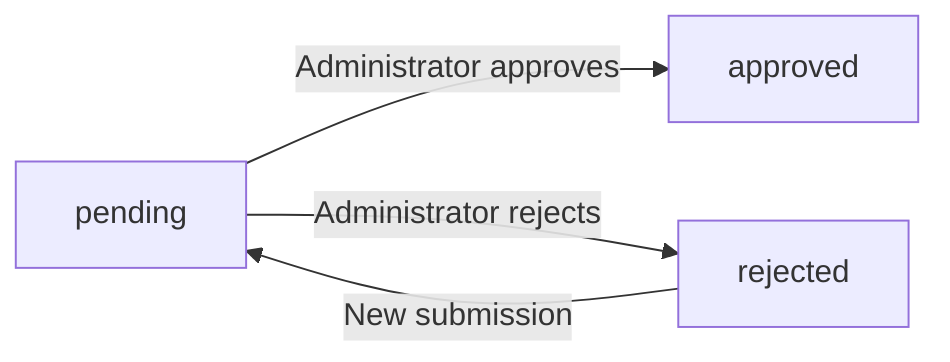
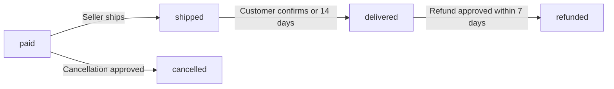
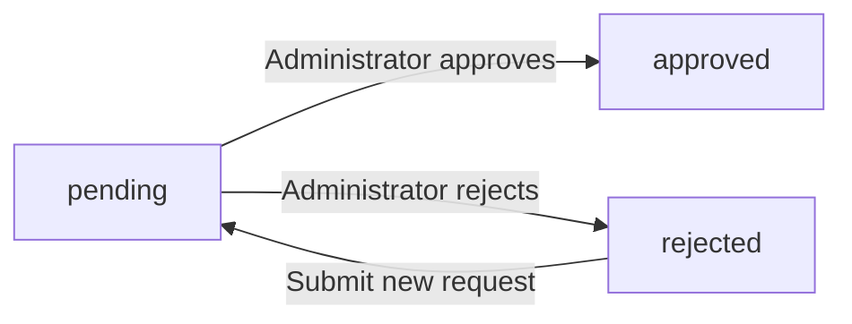
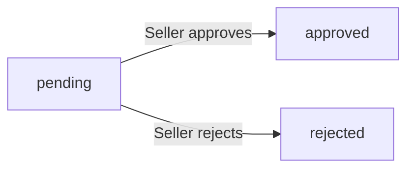
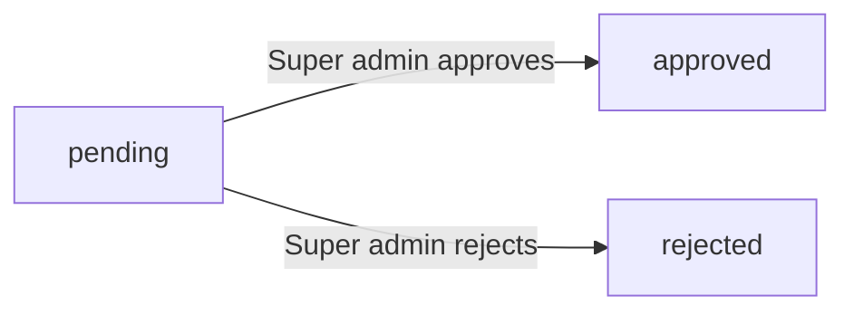

**shoppingMall — Business concepts, relationships, and states from user perspective**

Business concepts, relationships, and states from user perspective

# Domain Concepts

Describe what each concept means in the business domain and its key attributes.

## Customer Concept

A Customer represents a registered user who shops on the e-commerce platform. Every customer must register with an email and password before using any features, as guest browsing is not allowed. Each customer has a profile containing a display name and phone number that can be edited. Customers can manage multiple shipping addresses for receiving orders. When a customer deletes their account, their profile information is removed but their order history and reviews are preserved for legal and seller record purposes. Deleted customer accounts show reviews as from a deleted user while maintaining the review content. Customers can add products to their wishlist and manage a shopping cart for purchases. Each customer maintains their own order history showing all purchases made on the platform.

### Customer Identity and Profile

A Customer represents a registered user who shops on the e-commerce platform. The platform does not allow guest browsing; all users must register before using any features. Each customer is uniquely identified by their email address, which serves as the authentication credential together with a password. The customer profile includes a display name visible to other users and a phone number for contact purposes. Both the display name and phone number are editable attributes of the customer profile.

### Customer Relationships and Account Lifecycle

Each customer owns multiple shipping addresses for receiving orders, with one address designated as the default. Each customer maintains a personal wishlist containing products saved for later consideration at the product level. Each customer owns a personal shopping cart that holds selected product variants pending purchase. Each customer has an order history containing all purchases made on the platform. When a customer deletes their account, their profile information including display name and phone number is removed. Order history is preserved for seller records and legal purposes when an account is deleted. Reviews written by the customer are preserved but displayed as from a deleted user, with the review content and ratings remaining visible.

## Seller Concept

A Seller represents a merchant who lists and sells products on the e-commerce platform. Sellers register with email and password but require administrator approval before they can sell. Each seller has a profile containing a shop name, shop description, and logo image that customers can view. Seller profiles maintain snapshots of all edits to preserve historical states for dispute resolution. Sellers can view their approval status which can be pending, approved, or rejected. If rejected, sellers can view the rejection reason and submit a new registration request. Sellers can only delete their account if they have no pending orders or pending cancellation and refund requests. When a seller deletes their account, their products are removed from listings but order history and shop names in past orders are preserved.

### Seller Registration and Approval Status

A seller is a member who registers on the platform with email and password to list and sell products. Seller registration requires administrator approval before the seller can create products or make sales. Upon registration, a seller approval request is created with pending status. Administrators review seller approval requests and can approve or reject them. Sellers can view their approval status at any time, which is one of: pending, approved, or rejected. If a seller registration is rejected, the seller can view the rejection reason provided by the administrator. Rejected sellers can submit a new seller approval request to reapply for seller status. Only sellers with approved status can create products, edit products, and process orders.

### Seller Profile

Each seller has a profile that customers can view. The seller profile contains a shop name, shop description, and logo. Sellers can edit their shop name, shop description, and logo. Every edit to a seller profile creates a seller profile snapshot that preserves the previous state. Seller profile snapshots record when the change was made, what fields were changed, and the values before and after the change. Seller profile snapshots are immutable and cannot be deleted. These snapshots are available for viewing by the seller and administrators for dispute resolution purposes. The shop name in a seller profile is preserved in past order records even if the seller deletes their account.

### Seller Account Deletion and Product Ownership

Products on the platform belong to the seller who created them. Each product is associated with exactly one seller. Sellers can only view, edit, and delete their own products. Sellers cannot access or modify products owned by other sellers. Sellers can delete their own account, but only under specific conditions. A seller cannot delete their account if they have any pending orders with paid or shipped status. A seller cannot delete their account if they have any pending cancellation requests or pending refund requests. When a seller deletes their account, all their products are removed from listings and are no longer visible in search or category browsing. Order history and snapshots are preserved even after seller account deletion. The shop name associated with past orders is preserved and remains visible in order records to maintain accurate purchase history for customers.

## Administrator Concept

An Administrator represents a platform manager with oversight and moderation capabilities. There are two grades of administrators: regular administrator and super administrator. Regular administrators can manage seller approvals, categories, products, orders, and users. Super administrators have additional powers to promote regular administrators and demote other super administrators. Any user can submit a request to become an administrator with a reason. Administrators can view all customer and seller accounts on the platform. Administrators can ban or unban customers and sellers from the platform. Administrators can force-cancel or force-refund order items for policy violations. Super administrators cannot demote themselves to prevent losing all super administrator access.

### Administrator Grade Levels

There are two grades of administrators: regular administrator and super administrator. Regular administrators can manage seller approvals, categories, products, orders, and users on the platform. Super administrators have all regular administrator capabilities plus additional powers to promote regular administrators to super administrator and demote other super administrators to regular administrator. Super administrators cannot demote themselves to prevent losing all super administrator access. Any user can submit a request to become an administrator with a reason, which super administrators review and approve or reject.

### Seller Approval Management

Administrators can view the list of pending seller approval requests. Each seller registration requires administrator approval before the seller can sell on the platform. Administrators can approve seller registrations, granting the seller permission to create and manage products. Administrators can reject seller registrations and must provide a reason for rejection. Rejected sellers can view the rejection reason and submit a new registration request. Administrators can suspend seller accounts, which hides their products from search and category listings and prevents new product creation while allowing them to process existing orders. Administrators can unsuspend seller accounts, making their products visible again.

### Category Management Authority

Administrators have exclusive authority to create and manage categories. Categories organize products and can have one level of subcategory nesting. Administrators can create categories with a name and description. Administrators can create subcategories under existing categories. Administrators can edit category names and descriptions. Administrators can delete categories, and products in deleted categories become uncategorized. Customers can browse the list of all categories and view products within a category, but cannot create or modify categories.

### Product Oversight Capabilities

Administrators can view all products on the platform regardless of seller ownership. Administrators can view snapshots of any product to see the complete history of changes including all product fields and variant states at each point in time. Administrators can delete any product for policy violations. When an administrator deletes a product, the product no longer appears in search or category listings. Product snapshots are preserved even after product deletion for dispute resolution and audit purposes.

### Order Oversight and Intervention

Administrators can view all orders on the platform regardless of customer or seller ownership. Administrators can force-cancel individual order items or entire orders for policy violations. Force-cancellation refunds the customer and restores stock quantities via inventory records. Administrators can force-refund individual order items or entire orders for policy violations. Force-refund restores stock quantities via inventory records. These intervention powers allow administrators to resolve disputes and enforce platform policies.

### User Management

Administrators can view all customer accounts on the platform. Administrators can ban customer accounts, preventing banned customers from logging in. Administrators can unban customer accounts, restoring login access. Administrators can view all seller accounts on the platform. Administrators can ban seller accounts, preventing banned sellers from logging in while existing orders remain active. Administrators can unban seller accounts. User management capabilities ensure platform security and policy compliance.

## Category Concept

A Category represents a classification for organizing products on the platform. Each category has a name and description that helps customers find relevant products. Categories can have subcategories with one level of nesting only, creating a two-tier hierarchy. Categories are created and managed exclusively by administrators. Customers can browse the list of all categories to explore available products. Customers can view products within a specific category or subcategory. When a category is deleted by an administrator, products in that category become uncategorized but remain on the platform. Categories serve as a primary filter for product search and discovery.

### Category Structure and Attributes

A Category represents a classification for organizing products on the platform. Each category has a name that identifies the classification and a description that explains what types of products belong in that category. Both the name and description are required when creating a category.

Categories form a two-tier hierarchy structure with one level of nesting only. A category can exist as a top-level category or as a subcategory under exactly one parent category. Subcategories cannot have their own subcategories, limiting the hierarchy to two levels maximum. This structure creates a flat organization where customers can navigate from broad categories to more specific subcategories.

When an administrator deletes a category, all products assigned to that category become uncategorized. The products themselves are not deleted and remain on the platform, but they no longer belong to any category. Products can exist without a category assignment, though this is typically only the result of category deletion by administrators.

### Category Management and Product Organization

Categories are created and managed exclusively by administrators. Administrators can create new categories and subcategories, edit existing category names and descriptions, and delete categories from the platform. Customers and sellers cannot create or modify categories.

Customers can browse the complete list of all categories to explore available products. When viewing a category, customers see all products assigned to that category and all products assigned to any subcategories within it. This means products in subcategories are also visible when browsing the parent category.

Categories serve as a primary filter for product search and discovery. Customers can filter search results by selecting a specific category, which returns only products within that category and its subcategories. Products are grouped by their category assignment in search results and category listing pages. When customers select a subcategory, they see only products assigned to that specific subcategory, enabling focused product discovery within narrower classifications.

## Product Concept

A Product represents an item listed for sale by a seller on the platform. Every product has a name, description, category assignment, and base price. Products belong to the seller who created them and can only be edited by that seller. Each product can have multiple images that can be reordered with the first image serving as the main thumbnail. Products maintain snapshots of all edits to preserve historical states for dispute resolution. Products can be deleted by sellers only if there are no pending order items or pending cancellation and refund requests. Deleted products no longer appear in search or category listings but their snapshots are preserved. Products without variants are visible in search but shown as unavailable for purchase.

### Product Definition and Core Attributes

A Product represents an item listed for sale by a seller on the platform. Every product has a name that identifies it and a description that provides details about the item. Each product is assigned to a category, which can be a subcategory, to organize products for browsing and search. Every product has a base price that serves as the default price for the item. The product name and description are required fields that must be provided when creating a product. The category assignment is required and determines where the product appears in the category hierarchy. The base price is required and represents the standard price before any variant-specific pricing.

### Product Ownership and Image Association

Each product belongs to the seller who created it and is owned by that seller throughout its lifecycle. Only the owning seller can edit the product's attributes and manage its images. A product can have multiple images that provide visual representation of the item. The images are ordered, with the first image in the sequence serving as the main thumbnail image that appears in search results and product listings. The main thumbnail image is used to represent the product when displaying lists of products to customers.

### Product Edit History and Deletion Rules

Every edit made to a product creates a snapshot that preserves the complete state of the product at that moment in time. Product snapshots capture all product fields including name, description, category, base price, and images. These snapshots are immutable records that cannot be deleted or modified. Product snapshots are preserved even after the product itself is deleted. A seller can delete their own product only if there are no pending order items in paid or shipped status for any variant of the product. A seller can also delete their product only if there are no pending cancellation requests or refund requests for any variant of the product. When a product is deleted, all its variants and inventory records are also deleted.

### Product Visibility and Availability States

Products appear in search results and category listings based on their availability status. A product must have at least one variant to be purchasable by customers. Products that have no variants are still visible in search results and category listings but are shown as unavailable for purchase. When a product is deleted by the seller, it no longer appears in search results or category listings. Deleted products are removed from customer view but their snapshots remain preserved in the system for historical reference and dispute resolution purposes.

## ProductVariant Concept

A ProductVariant represents a specific combination of options for a product, such as size and color. Each variant has a unique SKU code that identifies it across the platform. Variants include option values describing the specific combination like Red Large or Blue Small. Each variant can have a price that overrides the product base price. Variants have a stock quantity that starts at zero and is managed through inventory records. A product must have at least one variant to be purchasable by customers. Variants can be edited by the seller who owns the product. Variants can only be deleted if there are no pending order items or pending cancellation and refund requests for that variant.

### Variant Structure and Identification

A product variant represents a specific combination of options that customers can select when purchasing a product. Each variant corresponds to one unique configuration such as Red Large or Blue Small. The variant option values describe the specific combination of attributes like color, size, or other customizable properties defined by the seller.

Each variant has a unique SKU code that serves as its identifier across the platform. This SKU code distinguishes one variant from all other variants on the platform, ensuring that each specific combination can be tracked and referenced uniquely.

A variant can have a price that overrides the product base price. When a variant price is set, it replaces the base price for that specific combination. If no variant price is set, the product base price applies to that variant.

Sellers configure variant options when creating or editing variants. The option configuration defines what specific combination the variant represents, allowing customers to identify and select the exact version they want to purchase.

### Variant Stock and Lifecycle

Each variant has a stock quantity that tracks available inventory. The stock quantity starts at zero when a variant is created and is managed through inventory records that track all quantity changes. Variant inventory tracking ensures that stock levels are accurately maintained as orders are placed, cancelled, or refunded.

A product must have at least one variant to be purchasable by customers. Products without any variants are visible in search results but are shown as unavailable for purchase. Customers must select a specific variant when adding a product to their cart, as purchases are made for particular combinations rather than generic products.

Sellers can edit their own product variants, including the SKU code, option values, and price. Variant edit capability allows sellers to correct mistakes or update variant information as needed. Every variant edit creates a snapshot to preserve the previous state.

Variants can only be deleted if there are no pending order items with paid or shipped status for that variant. Additionally, variants cannot be deleted if there are any pending cancellation or refund requests associated with that variant. These pending orders block deletion to ensure that customer purchases and dispute resolutions are not disrupted. When a variant is deleted, its inventory records are also removed.

## ProductImage Concept

A ProductImage represents a visual representation of a product uploaded by the seller. Each product can have multiple images to showcase different angles or details. Images have a sort order that determines their display sequence. The first image in the sort order serves as the main thumbnail shown in product listings. Sellers can upload multiple images for each product they own. Sellers can delete images from their products when needed. Image changes are included in product snapshots to preserve the visual state at any point in time. Product images help customers make informed purchasing decisions by viewing the product from multiple perspectives.

### ProductImage Definition and Attributes

A ProductImage represents a visual representation of a product uploaded by the seller. Each product can have multiple product images to showcase different angles, details, or features of the item. Every product image has an image sort order that determines its display sequence on the product detail page. The image with the lowest sort order value (first position) serves as the main thumbnail image shown in product listings and search results. Sellers can upload multiple images for each product they own, allowing comprehensive product visualization. Sellers can delete images from their products when needed, such as removing outdated or incorrect photos. The image sort order can be adjusted by the seller to control which image appears as the main thumbnail and the sequence in which images are displayed to customers.

### ProductImage in Customer Display

The main thumbnail image (first image in sort order) is displayed in product listings, search results, and category pages to give customers a quick visual reference. On the product detail page, all product images are shown in an image gallery following the image display sequence defined by the sort order. This allows customer product visualization from multiple perspectives before making a purchase decision. The product listing thumbnail helps customers quickly identify products while browsing. The product detail image gallery provides comprehensive visual information by displaying all uploaded images in the specified order. Customers rely on these images to understand the product's appearance, features, and quality.

### ProductImage Snapshot Preservation

Image changes are included in product snapshots to preserve the visual state of the product at any point in time. When a seller uploads a new image, deletes an existing image, or reorders images, a product snapshot is created that captures the complete set of images and their sort order at that moment. This preserved image state ensures that order items, reviews, and other records referencing the product can display the exact images that were visible at the time of purchase or review. Product snapshots include all image URLs and their sort order values, creating an immutable record of the product's visual presentation. This snapshot preservation is critical for dispute resolution and maintaining accurate historical records of what customers saw when they made purchasing decisions.

## InventoryRecord Concept

An InventoryRecord represents a single change to a variant stock quantity with a reason and timestamp. Each record contains a quantity change that is positive for restocking or negative for orders and adjustments. Records include a reason explaining why the stock changed such as restock order placement or adjustment for loss. The current stock quantity is calculated by summing all inventory records for a variant. Inventory records are not snapshots but a running history of stock movements. Sellers can view the full inventory history of each variant they own. When stock reaches zero the variant is shown as out of stock and cannot be added to cart. Inventory records automatically track order placements cancellations and refunds.

### Inventory Record Structure and Tracking

Each product variant maintains a stock quantity that is tracked through inventory records. An inventory record represents a single change to the variant stock quantity and cannot be modified or deleted once created.

Each inventory record contains a quantity change value, a reason, and a timestamp. The quantity change is positive when stock is added, such as when a seller restocks a variant. The quantity change is negative when stock is removed, such as when an order is placed or when a seller records an adjustment for loss or damage. The reason field captures the business context for the change, such as restock, order placement, cancellation, refund, or manual adjustment. The timestamp records when the change occurred.

The current stock quantity for a variant is calculated by summing all inventory records associated with that variant. This running total reflects the net effect of all stock movements over time.

Sellers can view the complete inventory history for each of their variants, showing all records in chronological order with their respective quantity changes, reasons, and timestamps. This history provides full visibility into how stock levels have changed and why.

### Order-Driven Inventory Changes

Inventory records are automatically created by the system for order-related stock movements. Sellers do not need to manually create records for these events.

When a customer places an order, the system automatically creates a negative inventory record for each purchased variant. The quantity change equals the negative of the ordered quantity, reducing the available stock.

When an order item is cancelled and the cancellation is approved, the system automatically creates a positive inventory record to restore the stock. The quantity change equals the cancelled quantity, returning the items to available stock.

When an order item is refunded and the refund is approved, the system automatically creates a positive inventory record to restore the stock. The quantity change equals the refunded quantity, returning the items to available stock.

These automatic inventory updates ensure that stock quantities always reflect the actual available inventory, accounting for order placements, cancellations, and refunds without requiring manual seller intervention.

### Out of Stock Status

When the calculated stock quantity for a variant reaches zero, the variant is marked as out of stock. This status is derived from the sum of all inventory records for that variant.

Out of stock variants are shown with an out of stock indicator on product listing pages and product detail pages. Customers can see that the variant is unavailable but can still view the product.

Out of stock variants cannot be added to the shopping cart. If a customer attempts to add an out of stock variant, the request is rejected.

If a variant in a customer cart becomes out of stock due to another customer purchasing the remaining stock, the cart item is marked as unavailable. The customer cannot proceed to checkout with unavailable items.

When a seller restocks a variant that was out of stock, the variant becomes available for purchase again, and the out of stock indicator is removed.

## Address Concept

An Address represents a shipping destination for customer orders. Each address contains a recipient name phone number street address city state or province postal code and country. Customers can add multiple shipping addresses to their account. Customers can edit their existing addresses when information changes. Customers can delete addresses they no longer need. One address can be set as the default shipping address for faster checkout. Addresses are used during checkout to specify where orders should be delivered. The shipping address is captured in an order snapshot when the order is placed and cannot be changed afterward.

### Address Definition and Attributes

An Address represents a shipping destination for customer orders. Each address contains the following information:

- Recipient name: The name of the person who will receive the package
- Recipient phone number: Contact number for delivery coordination
- Street address: The detailed street location including building number and street name
- City: The city or municipality where the address is located
- State or province: The regional division within the country
- Postal code: The code used for mail sorting and delivery
- Country: The nation where the address is located

Addresses are owned by customers and linked to their account. Each address is independent and can be used for any order the customer places. The address information is captured at the time of order placement and preserved in an order snapshot, ensuring the delivery destination is tracked even if the customer later modifies or deletes the original address.

### Address Management and Default Selection

Customers can maintain multiple shipping addresses in their account. This allows customers to save addresses for different locations such as home, work, or family members.

Customers can edit any of their saved addresses when information changes, such as updating a phone number or correcting a street address. Customers can delete addresses they no longer need from their account.

One address can be designated as the default shipping address. The default address is used automatically during checkout unless the customer selects a different address. Customers can change which address is set as default at any time. Only one address per customer can be the default at any given time.

### Address in Order and Checkout Context

During checkout, customers select which saved address to use for delivery, or they can use their default address. The selected address is reviewed as part of the order summary before the order is placed.

When an order is placed, the shipping address is captured in a snapshot and becomes part of the order record. This snapshot preserves the exact delivery destination at the time of purchase. The shipping address in the order snapshot cannot be changed after the order is placed, ensuring accurate delivery destination tracking for the shipment.

The address snapshot is used throughout the order lifecycle, from shipment creation to delivery confirmation. Each shipment created for the order references this preserved address information for tracking and delivery purposes.

## WishlistItem Concept

A WishlistItem represents a product that a customer has saved for later consideration. Each wishlist item references a specific product not a variant. Wishlist items are paginated when customers view their wishlist. Customers can remove products from their wishlist when no longer interested. If a product is deleted by the seller it is automatically removed from all customer wishlists. Wishlist items track when they were added to help customers remember their interest. The wishlist helps customers organize products they want to purchase in the future. Wishlist items do not reserve stock or guarantee availability of the product.

### WishlistItem Definition and Attributes

A WishlistItem represents a product that a customer has saved for later consideration and future purchase. Each wishlist item references a specific product at the product level, not a specific variant. The wishlist serves as a customer product collection that helps customers organize products they want to purchase in the future and tracks their product interest over time.

Each wishlist item records when it was added through a created timestamp, helping customers remember when they developed interest in the product. The wishlist enables product interest tracking by maintaining a record of which products a customer has shown interest in.

Wishlist items do not reserve stock or guarantee availability of the product. Adding a product to the wishlist does not affect inventory levels or prevent other customers from purchasing the product. The wishlist is purely an organizational tool for customer convenience.

### WishlistItem Management Rules

Customers can manage their wishlist by adding products and removing products they are no longer interested in. When customers view their wishlist, the items are displayed with pagination to handle large collections efficiently.

Customers can remove any product from their wishlist at any time through the wishlist removal capability. This allows customers to curate their collection as their interests change.

If a product is deleted by the seller, the product is automatically removed from all customer wishlists. This automatic removal on deletion ensures that wishlists do not contain references to products that no longer exist on the platform. Customers cannot manually restore automatically removed items since the underlying product no longer exists.

## Cart Concept

A Cart represents a customer temporary collection of items they intend to purchase. Each customer has their own cart that holds cart items until checkout. The cart tracks when it was created and last updated. Cart items are removed when the customer completes checkout. The cart calculates and displays the total price of all items. If a variant is deleted or out of stock it is marked as unavailable in the cart. Unavailable items cannot be checked out and must be removed first. The cart serves as a staging area before order creation.

### Cart Ownership and Purpose

Each customer has exactly one shopping cart that belongs exclusively to them. The cart cannot be shared with or accessed by other customers. The cart serves as a temporary collection where customers gather specific product variants they intend to purchase. The cart functions as a pre-order staging area, holding items until the customer proceeds to checkout. The cart allows customers to review their selected items before completing the transaction. When the customer completes checkout and places an order, all items are removed from the cart.

### Cart Timestamps

The cart tracks two timestamps that record its lifecycle. The created timestamp records when the customer's cart was first established. The updated timestamp records the most recent change to the cart, such as when items are added, removed, or quantities are modified. These timestamps help track cart activity and indicate how recently the customer interacted with their cart.

### Cart Total Price

The cart calculates and displays the total price of all items it contains. The total price is derived from the cart items (each cart item's subtotal is defined in the CartItem Concept). The total price is recalculated automatically whenever items are added, removed, or quantities are changed. The cart displays the total price to the customer for review before checkout.

### Cart Availability and Checkout

The cart validates item availability before allowing checkout. If a variant's stock is less than the quantity in the cart, a warning is shown to the customer. If a variant is deleted by the seller or becomes out of stock, it is marked as unavailable in the cart. Unavailable items are clearly indicated with their unavailable status. Unavailable items cannot be included in checkout and must be removed from the cart first. When the customer proceeds to checkout, only available items can be included in the order. After successful checkout, all items are removed from the cart.

## CartItem Concept

A CartItem represents a specific variant added to a customer cart with a quantity. Each cart item references a specific product variant not just a product. When adding to cart customers must select a specific variant with its options. If the same variant is already in the cart the quantities are combined into one line item. Cart items show product name variant options price quantity and subtotal. Customers can change the quantity of items in their cart. Customers can remove items from their cart before checkout. Cart items warn customers if the variant stock is less than the cart quantity.

### CartItem Definition and Structure

A CartItem represents a specific product variant added to a customer shopping cart with a specified quantity. Each cart item must reference a specific product variant, not just a product. When adding an item to the cart, customers must select a specific variant with its option values such as color and size.

Each cart item displays the following details:
- Product name
- Variant option values (e.g., Red, Large)
- Unit price (from the variant)
- Quantity
- Subtotal (unit price multiplied by quantity)

The variant selection requirement ensures customers know exactly which variant they are purchasing before checkout. Cart items serve as the building blocks of the shopping cart, with each line item representing one distinct variant.

### CartItem Management Rules

When a customer adds a variant to the cart, the system checks if that same variant already exists in the cart. If the same variant is already present, the quantities are combined into one line item rather than creating a duplicate entry. This quantity combination rule keeps the cart organized and prevents confusion.

Customers can change the quantity of any item in their cart. The quantity change capability allows customers to increase or decrease the amount of each variant they wish to purchase. Customers can also remove items from their cart entirely before proceeding to checkout.

The cart displays a stock quantity warning if the variant stock is less than the cart quantity for any item. This warning alerts customers before checkout that some items may not be fully available.

Before checkout, customers can review all cart line items including product details, variant options, prices, and quantities. This pre checkout item review ensures customers confirm their selections before placing an order. Unavailable items (deleted variants or out of stock) are marked as unavailable in the cart and cannot be checked out.

## Order Concept

An Order represents a completed purchase transaction containing one or more order items. Each order has a unique order number for customer reference. Orders track the total amount paid by the customer. Orders include a shipping address snapshot captured at the time of purchase. The shipping address cannot be changed after the order is placed. Orders have an overall status derived from the statuses of their items. Orders are sorted by newest first in customer order history. Orders preserve the state of products variants and seller profiles at the time of purchase through snapshots.

### Order Definition

An Order represents a completed purchase transaction created when a customer successfully completes checkout and payment. Each order is assigned a unique order number that serves as the customer's reference for tracking and support inquiries. The order number is generated at the time of purchase and cannot be changed. The order records the total amount paid by the customer, which is the sum of all order item prices at the time of purchase. The total amount is fixed and does not change even if individual item statuses change later. Customers reference their orders using the order number when contacting support or reviewing their purchase history.

### Shipping Address Snapshot

When an order is placed, the customer's selected shipping address is captured and stored as a snapshot within the order. This shipping address snapshot includes all address details: recipient name, phone number, street address, city, state or province, postal code, and country. The shipping address snapshot is immutable and cannot be changed after the order is placed, even if the customer updates their address book later. This ensures the seller ships to the address the customer intended at the time of purchase. The snapshot preserves the exact address state for delivery and record-keeping purposes.

### Order Status Derivation

An order has an overall status that is derived from the statuses of its individual order items. The order status is not set directly but calculated based on item states. If all items in the order have status paid, the order status is paid. If any item has status shipped and no items are delivered yet, the order status is shipped. If all items have status delivered, the order status is delivered. If all items have status cancelled, the order status is cancelled. If all items have status refunded, the order status is refunded. When items have mixed states, such as some delivered and some refunded, the order status is partially completed. The order status updates automatically as item statuses change.

### Order History Presentation

Orders are presented to customers in their order history sorted by newest first, meaning the most recently placed orders appear at the top of the list. This sorting allows customers to quickly find their recent purchases. Each order in the history list displays the order number, order date, total price, and overall order status. Customers can select any order from the list to view its full details. The order history includes all orders placed by the customer, regardless of their current status.

### Purchase State Preservation

An order preserves the complete state of the purchase at the time it was placed through snapshots. Each order item includes a snapshot of the product at the time of purchase, capturing the product name, description, category, and base price. Each order item also includes a snapshot of the specific variant purchased, capturing the SKU code, option values, and the actual price paid. Additionally, each order item includes a snapshot of the seller's profile at the time of purchase, capturing the shop name and logo. These snapshots ensure that even if the seller later changes the product details, variant options, or shop information, the customer's order record shows exactly what was purchased. The snapshots are immutable and remain with the order permanently.

## OrderItem Concept

An OrderItem represents a purchased product variant within an order with a specific quantity. Each order item belongs to a single seller even when an order contains items from multiple sellers. Order items have individual statuses that progress from paid to shipped to delivered. Order items can be individually cancelled or refunded without affecting other items in the order. Each order item includes a snapshot of the product and variant at purchase time. Order items include a snapshot of the seller profile at purchase time. If a customer buys multiple quantities of the same variant it becomes one order item with that quantity. Order items are grouped into shipments when the seller ships them.

### OrderItem Definition

An OrderItem represents a single line item for a purchased product variant within an order. Each order item records the specific variant that was purchased along with the quantity ordered. When a customer purchases multiple units of the same variant, it becomes one order item with that quantity rather than multiple separate items.

Each order item belongs to exactly one seller, even when an order contains items from multiple sellers. This ensures that order items from different sellers can be processed, shipped, and tracked independently. An order can contain items from multiple sellers, allowing customers to purchase products from different sellers in a single transaction.

Each order item includes a snapshot of the product, variant, and seller profile at the time of purchase (defined in OrderItemSnapshot Concept). These snapshots preserve the product name, variant options, price, and seller shop name as they existed when the order was placed, ensuring a permanent record even if the product or seller profile is later modified.

### OrderItem Status

Each order item has its own individual status that progresses independently from other items in the same order. The status of one order item does not affect the status of other items in the order.

Order item statuses progress through the following states:
- Paid: Payment has been completed and the item is waiting for the seller to ship
- Shipped: The seller has shipped the item
- Delivered: The item has been delivered to the customer
- Cancelled: The item was cancelled before shipping
- Refunded: The item was refunded after delivery

The status progression follows the flow from paid to shipped to delivered for successful orders, or to cancelled or refunded for orders that do not complete normally.

### OrderItem Relationships

Order items are grouped into shipments when the seller ships them. A shipment can contain one or more order items from the same seller. Items from different sellers are always placed in separate shipments. The seller decides which items to bundle together in a single shipment, and all items in the same shipment share the same tracking information.

Each order item can have one cancellation request associated with it. Cancellation requests apply to individual order items, not to the entire order. Each order item can have one refund request associated with it. Refund requests apply to individual order items, not to the entire order. This allows customers to cancel or refund specific items while other items in the order continue processing normally.

## Shipment Concept

A Shipment represents a package sent by a seller containing one or more order items. Each shipment has a tracking number and carrier name for delivery tracking. Shipments can contain multiple order items from the same seller bundled together. Different sellers always ship separately creating different shipments. All items in the same shipment share the same tracking information. When a shipment is created all items in it change to shipped status. Customers can view tracking information for each shipment in their order. Customers confirm delivery per shipment which changes all items in that shipment to delivered status.

### Shipment Definition and Structure

A Shipment represents a physical package sent by a seller containing one or more order items. Each shipment is created by a seller when they prepare items for delivery to a customer.

Multiple order items from the same seller can be bundled together into a single shipment. This allows sellers to combine items efficiently when fulfilling an order. Items from different sellers always ship separately in different shipments, as each seller manages their own shipping process independently.

When a seller creates a shipment, they select which order items to include. All items within the same shipment share the same delivery journey and tracking information. A shipment can contain items from only one seller, ensuring clear ownership and responsibility for the package contents.

Each order item belongs to exactly one shipment once shipped. Items cannot be split across multiple shipments. The shipment groups items together for the purpose of physical delivery and tracking.

### Shipment Tracking Information

Each shipment has a tracking number and carrier name assigned by the seller when the shipment is created. The tracking number uniquely identifies the package with the shipping carrier. The carrier name indicates which shipping company is handling the delivery.

All order items within the same shipment share the same tracking number and carrier name. Customers can view the tracking information for each shipment in their order, allowing them to monitor the delivery progress of their purchases.

The tracking information is visible to customers from the moment the seller creates the shipment. Customers can access tracking details through their order history, seeing which items are included in each tracked package.

### Shipment Status and Delivery

When a seller creates a shipment, all order items included in that shipment automatically change to shipped status. This status change indicates the items have left the seller and are in transit to the customer.

Customers confirm delivery per shipment, not per individual item. When a customer confirms that a shipment has been delivered, all order items within that shipment change to delivered status simultaneously.

If the customer does not manually confirm delivery, order items in the shipment automatically change to delivered status fourteen days after the shipment is created. This automatic delivery confirmation ensures orders progress through their lifecycle even without customer action.

## CancellationRequest Concept

A CancellationRequest represents a customer request to cancel an individual order item. Cancellation requests can only be made for items with paid status that have not yet shipped. Each request includes a reason explaining why the customer wants to cancel. The seller of the item can approve or reject the cancellation request. Cancellation request status changes are recorded in snapshots for dispute resolution. When approved the item is cancelled and a refund is processed for that item only. Cancelled items restore their stock quantities through inventory records. The remaining items in the order continue processing normally after cancellation.

### CancellationRequest

A CancellationRequest represents a customer's request to cancel an individual order item before it has been shipped. Cancellation requests implement item level cancellation, allowing customers to cancel specific items within an order without affecting other items.

Cancellation requests can only be created for order items with paid status that have not yet transitioned to shipped status. This pre shipment cancellation requirement ensures that items already in transit cannot be cancelled through the standard cancellation workflow.

Each cancellation request includes a cancellation reason provided as text, where the customer explains why they want to cancel the item. The reason is required and captured at the time of request submission.

The cancellation request has a status that tracks its progression through the approval workflow. The seller of the order item reviews the cancellation request and makes a seller approval decision to either approve or reject it. The available cancellation request status values include pending, approved, and rejected.

When the seller responds to a cancellation request, the request state is captured in request status snapshots to preserve the reason and status at that moment. These snapshots record when the change was made, what was changed, and the values before and after. Snapshots are immutable and cannot be deleted, serving as dispute resolution records for any future disagreements about the cancellation.

If the cancellation request is approved, the order item transitions to cancelled status and an approved cancellation refund is processed for that specific item only. The stock quantity for the cancelled variant is restored through stock restoration on cancel, which creates a positive inventory record to increase the available stock.

Cancellation operates at the individual item level, enabling partial order cancellation where only selected items are cancelled while remaining items in the order continue processing normally. The remaining items processing continues through their standard fulfillment workflow unaffected by the cancellation of other items in the same order.

If all items in an order are cancelled, the entire order status becomes cancelled. However, the cancellation mechanism is designed primarily for partial order cancellation scenarios where customers need to cancel only some items from their purchase.

## RefundRequest Concept

A RefundRequest represents a customer request to refund an individual order item. Refund requests can only be made for items with delivered status. Requests must be made within seven days of the item being delivered. Each request includes a reason explaining why the customer wants a refund. The seller of the item can approve or reject the refund request. Refund request status changes are recorded in snapshots for dispute resolution. When approved the item is refunded and stock quantities are restored. The remaining items in the order are unaffected by the refund.

### Refund Request Eligibility and Structure

A refund request applies to a single order item, not the entire order. Multiple items in the same order can have separate refund requests. A refund request can only be created for an order item with delivered status. Items with paid, shipped, cancelled, or refunded status are not eligible for refund requests. The refund request must be submitted within seven days of the item being delivered. Requests submitted after this window are rejected. Each refund request includes a reason provided as text explaining why the customer wants a refund. The reason is required and must be provided at the time of submission.

### Refund Request Status and Processing

A refund request has a status that tracks its progression through the approval workflow. The seller of the order item reviews the refund request and makes a decision to approve or reject it. When the seller approves the refund request, the order item status changes to refunded. When the seller rejects the refund request, the order item status remains unchanged. An approved refund processes only the specific item, leaving other items in the same order unaffected. This enables partial order refunds where some items are refunded while others continue normal processing. When a refund is approved, the stock quantity for the variant is restored through an inventory record with a positive quantity change.

### Refund Request Snapshots

Every change to a refund request status creates a snapshot that preserves the state at that moment. Each snapshot records the timestamp of the change, the reason provided by the customer, and the request status before and after the seller decision. These snapshots are immutable and cannot be deleted or modified. Snapshots serve as dispute resolution records, allowing administrators and relevant parties to review the complete history of seller responses and status changes. The snapshot chain provides an auditable trail from request submission through final resolution.

## Review Concept

A Review represents customer feedback on a product they have purchased. Reviews can only be written after the order item status is delivered. Customers can write one review per product per order. Each review has a rating from one to five stars and optional text content. Reviews are displayed on the product detail page for other customers to see. Reviews are sorted by newest first to show recent feedback. Customers can edit their own reviews after posting. Customers can delete their own reviews but the snapshots are preserved. Product average rating is calculated from all non-deleted reviews.

### Review Definition and Attributes

A Review represents customer feedback on a product they have purchased. A review can only be written after the order item status is delivered. Customers can write one review per product per order, preventing duplicate reviews for the same product from a single purchase. Each review has a rating from one to five stars, which is required. Each review also has optional text content that customers may include to provide additional details about their experience.

### Review Display and Management

Reviews are displayed on the product detail page for other customers to see. Reviews are sorted by newest first to show recent feedback prominently. Customers can edit their own reviews after posting to update their feedback. Customers can delete their own reviews to remove them from public view. When a review is edited or deleted, a snapshot is created to preserve the previous state including the rating and text content at that moment. These snapshots are immutable and cannot be deleted, preserving the review history for dispute resolution.

### Rating Calculation

The product's average rating is calculated from all non-deleted reviews. Only reviews that have not been deleted by their authors are included in the average rating calculation. This ensures that the displayed rating reflects current customer feedback while respecting the customer's choice to remove their review.

## SellerApprovalRequest Concept

A SellerApprovalRequest represents a seller registration submission awaiting administrator review. Each request includes the shop name the seller wants to use. Requests have a status of pending approved or rejected. Administrators review and decide on pending seller approval requests. When rejecting administrators must provide a reason for the rejection. Rejected sellers can view the rejection reason and submit a new registration request. Approved sellers can begin listing and selling products on the platform. The request preserves the seller information at the time of submission.

### Seller Approval Request Definition

A Seller Approval Request represents a seller registration submission awaiting administrator review. Each request captures the shop name the seller wants to use at the time of submission. The request preserves all registration information to maintain a record of the original submission.

Every seller approval request has a status that indicates its current state in the review process. The status can be pending, approved, or rejected. When first submitted, the request enters pending approval status until an administrator reviews it.

The shop name in the request is the name the seller proposes for their shop. This name is captured at submission time and preserved even if the seller later modifies their profile.

### Approval Workflow and Access

The seller approval workflow requires administrator review for all seller registration requests. Administrators review pending requests and decide whether to approve or reject each submission.

When a request is approved, the seller gains approved seller status and can begin listing and selling products on the platform. Platform selling access is granted only after approval. Pending and rejected sellers cannot list products or process orders until their approval status changes to approved.

When a request is rejected, the seller enters rejected seller status. The rejection reason requirement mandates that administrators must provide a reason when rejecting a request. Rejected sellers have visibility into their rejection reason and can view why their request was denied.

Rejected sellers can submit a new registration resubmission with updated information. Each new submission creates a fresh approval request that goes through the same review process.

## AdminPromotionRequest Concept

An AdminPromotionRequest represents a user request to become a platform administrator. Any customer or seller can submit a promotion request with a reason. Requests have a status of pending approved or rejected. Super administrators can view the list of pending promotion requests. Super administrators can approve or reject administrator promotion requests. When approved the user becomes a regular administrator with platform management capabilities. The request preserves the reason provided by the user at submission time.

### AdminPromotionRequest

An AdminPromotionRequest represents a user request to become a platform administrator. Any customer or seller is eligible to submit an administrator promotion request, demonstrating any user eligibility for the administrator role. The request includes a promotion reason text where the user explains their motivation for becoming an administrator.

Each administrator promotion request has a status that tracks its progression through the review process:
- Pending request status: The initial state when the request is first submitted, awaiting super administrator review
- Approved administrator status: The state when a super administrator accepts the request, granting the user regular administrator grant with platform management access
- Rejected request status: The state when a super administrator declines the request

User submission tracking maintains a record of who submitted the request and when it was submitted. The promotion request preservation ensures the reason provided by the user is permanently recorded along with all status changes. Super administrator review is required for all administrator promotion requests, and super administrators can access the pending request list to view all requests awaiting their decision.

## ProductSnapshot Concept

A ProductSnapshot represents a preserved state of a product at a specific point in time. Snapshots are created whenever a product is edited to record the previous state. Each snapshot includes all product fields such as name description category base price and images. Product snapshots also include snapshots of all variants at that moment. Snapshots record when the change was made and what fields were changed. Snapshots are immutable and cannot be deleted once created. Sellers can view snapshots of their own products for reference. Administrators can view snapshots of any product for oversight and dispute resolution.

### Preserved Product State

A ProductSnapshot represents a preserved state of a product at a specific point in time. Product snapshots are created whenever a product is edited to record the previous state before the change. Each snapshot captures all product fields including product name, product description, category assignment, base price, and all product images. The snapshot preserves the complete product state as it existed at the moment of the edit.

### Variant Snapshots Included

Each ProductSnapshot includes snapshots of all product variants that existed at the time of the product edit. The variant snapshots capture the SKU code, option values, and price for each variant. This ensures the complete state of the product and all its variants is preserved together, allowing the full product configuration to be reconstructed at any historical point.

### Snapshot Metadata

Each ProductSnapshot records when the change was made with a snapshot timestamp. The snapshot also tracks which fields were changed during the edit that triggered the snapshot creation. This changed fields tracking allows sellers and administrators to understand what specific modifications were made between snapshot versions.

### Immutable Snapshot Records

Product snapshots are immutable and cannot be deleted once created. Snapshots cannot be modified or altered after creation. This immutability ensures that historical product states remain intact for reference and dispute resolution purposes. Even if the product itself is deleted, all associated snapshots are preserved.

### Snapshot Access Permissions

Sellers can view snapshots of their own products for reference and record-keeping. Administrators can view snapshots of any product on the platform for oversight and dispute resolution. This access model ensures relevant parties can review historical product states while maintaining appropriate access boundaries.

## ProductVariantSnapshot Concept

A ProductVariantSnapshot represents a preserved state of a product variant at a specific point in time. Variant snapshots are created as part of product snapshots when a product is edited. Each variant snapshot includes the SKU code option values and price at that moment. Variant snapshots preserve the exact configuration of the variant when the product was modified. Snapshots record when the change was made to track the variant history. Variant snapshots are immutable and cannot be deleted. These snapshots ensure the complete state of products and variants is preserved for dispute resolution. Variant snapshots are included within product snapshots to maintain the relationship.

### Variant Snapshot Attributes

A ProductVariantSnapshot captures the complete configuration of a product variant at a specific moment in time. Each variant snapshot preserves the SKU code that uniquely identifies the variant. The option values representing the variant combination are recorded exactly as they existed. The variant price at that moment is captured, including any price override from the base price. A timestamp records when the snapshot was created, marking the point in time when the variant state was preserved. These attributes together ensure the variant configuration preservation is complete and accurate.

### Variant Snapshot Immutability and History

Variant snapshots are immutable records that cannot be deleted or modified after creation. Each product edit creates a variant snapshot as part of the product snapshot inclusion, ensuring all variants are captured together. The variant history tracking enables viewing all historical states of a variant over time. This complete state preservation supports dispute resolution by providing an authoritative record of what the variant looked like at any point. When a variant is edited, the variant edit snapshot captures the state before the change. The immutable variant records ensure the history remains trustworthy for resolving disputes about product configurations, prices, or availability at the time of purchase.

## SellerProfileSnapshot Concept

A SellerProfileSnapshot represents a preserved state of a seller profile at a specific point in time. Snapshots are created every time a seller edits their profile. Each snapshot includes the shop name shop description and logo at that moment. Snapshots record when the change was made and what fields were changed. Seller profile snapshots are immutable and cannot be deleted. These snapshots preserve the seller identity as it appeared at the time of each order. Order items include seller profile snapshots to show which shop sold the product. Relevant parties can view snapshots for dispute resolution purposes.

### Seller Profile Snapshot Definition

A seller profile snapshot represents a preserved state of a seller profile at a specific point in time. Snapshots are automatically created every time a seller edits their profile information. Each snapshot captures the complete seller profile state including the shop name, shop description, and logo at that moment. Seller profile snapshots are immutable records that cannot be deleted or modified after creation. These snapshots preserve the seller identity as it appeared throughout the history of profile changes. The snapshot system ensures that all profile modifications are recorded for transparency and accountability purposes.

### Snapshot Content and Tracking

Each seller profile snapshot records the timestamp when the change was made. The snapshot tracks which fields were changed during the edit operation. The snapshot includes the shop name value at the time of capture. The snapshot includes the shop description value at the time of capture. The snapshot includes the logo image reference at the time of capture. Changed fields tracking allows relevant parties to identify what specific information was modified. The timestamp provides a chronological record of when each profile version existed. All captured values reflect the exact state of the seller profile at the snapshot moment.

### Snapshot Business Purpose

Seller profile snapshots preserve the seller identity as it appeared at the time of each order. Order items include seller profile snapshots to show which shop sold the product at purchase time. This ensures customers can always see the original shop name and logo from when they made their purchase. Snapshots support dispute resolution by providing historical evidence of seller profile states. Relevant parties including sellers, customers, and administrators can view snapshots for dispute resolution purposes. The snapshot history allows viewing the complete evolution of a seller profile over time. This historical record is essential for verifying claims about product origin and seller representation.

## ReviewSnapshot Concept

A ReviewSnapshot represents a preserved state of a review at a specific point in time. Snapshots are created whenever a customer edits their review. Each snapshot includes the rating and text content at that moment. Snapshots record when the change was made and what fields were changed. Review snapshots are immutable and cannot be deleted even if the review itself is deleted. These snapshots preserve the review history for transparency and dispute resolution. The snapshot chain shows how a review evolved over time through edits. Preserved snapshots ensure accountability for review content changes.

### ReviewSnapshot Definition and Content

A ReviewSnapshot represents a preserved review state captured at a specific point in time. A review edit snapshot is automatically created whenever a customer edits their review. Each snapshot preserves the complete state of the review at that moment, including the rating snapshot (the star rating value) and the text content snapshot (the written review text). The snapshot timestamp records when the change was made. Changed fields tracking identifies which aspects of the review were modified in that edit. This preserves an accurate record of what the review contained at each point in its lifecycle.

### ReviewSnapshot Immutability and Business Purpose

ReviewSnapshots are immutable review records that cannot be modified or deleted. Deleted review preservation ensures that snapshots remain accessible even after the original review is deleted by the customer. The review history chain shows the complete evolution of a review through all edits, from initial creation to final state. This supports transparency by allowing relevant parties to see how review content changed over time. Dispute resolution records are maintained through snapshots, enabling administrators and sellers to verify what a review stated at any historical point. Review accountability is enforced by preserving all versions, ensuring customers cannot alter their feedback without leaving a traceable history.

## OrderItemSnapshot Concept

An OrderItemSnapshot represents a preserved state of an order item at the time of purchase. Snapshots are created when an order is placed to capture the product and variant state. Each snapshot includes the product name variant options and price at purchase time. Order item snapshots preserve what the customer actually purchased regardless of later changes. These snapshots ensure customers can see exactly what they ordered even if the product is later modified or deleted. Order item snapshots are immutable and cannot be deleted. The snapshots are part of the order record for reference and dispute resolution.

### Purchase Time Snapshot Creation

An order item snapshot is created automatically when an order is placed successfully. The snapshot captures the exact state of the order item at the moment of purchase. This preserved order item state includes all relevant product and variant information as they existed at purchase time. The purchase time snapshot ensures the customer purchase record accurately reflects what was actually bought, regardless of any subsequent modifications to the product or variant. This exact purchase preservation guarantees that the historical record remains true to the original transaction.

### Captured Product Information

The order item snapshot records the product name snapshot as it appeared at the time of purchase. The variant options snapshot captures the specific combination of options selected (such as color, size, or other attributes). The purchase price snapshot preserves the actual price paid for the item, which may differ from the current product or variant price. These three elements together form the complete product identification within the order record, ensuring customers can identify exactly which product and variant they purchased.

### Post-Purchase Change Isolation

Order item snapshots are isolated from any changes made to products or variants after the purchase is completed. If a seller modifies the product name, description, or images after purchase, the order item snapshot retains the original values. If a product is deleted by the seller, the deleted product visibility in the customer's order history is maintained through the snapshot. The snapshot ensures that the customer purchase record remains complete and accurate even when underlying products no longer exist in the active catalog.

### Immutable Record Properties

Order item snapshots are immutable order records that cannot be modified or deleted once created. The snapshots serve as order reference support for customers reviewing their purchase history and for sellers fulfilling orders. These immutable records provide dispute resolution records when questions arise about what was purchased, at what price, or with which variant options. The permanent nature of these snapshots ensures both customers and sellers have a reliable, unchangeable reference for any order-related inquiries or conflicts.

## CancellationRequestSnapshot Concept

A CancellationRequestSnapshot represents a preserved state of a cancellation request at a specific point in time. Snapshots are created when the seller responds to the cancellation request. Each snapshot includes the reason and status at that moment. Snapshots record when the change was made to track the request progression. Cancellation request snapshots are immutable and cannot be deleted. These snapshots preserve the full history of the cancellation request for dispute resolution. The snapshot chain shows how the request status changed from pending to approved or rejected. Preserved snapshots ensure accountability for cancellation decisions.

### Preserved Cancellation State

A cancellation request snapshot represents a preserved cancellation state captured at a specific point in time. The seller response snapshot is created when the seller responds to a cancellation request, recording the exact state at that moment. Each snapshot preserves the cancellation reason snapshot and request status snapshot as they existed when the seller made their decision. The snapshot timestamp records when the change was made, enabling request progression tracking through the cancellation history chain. These immutable request records cannot be deleted or modified, ensuring status change preservation throughout the request lifecycle.

### Snapshot Content Elements

Each cancellation request snapshot contains the cancellation reason provided by the customer at the time of the snapshot. The request status snapshot captures whether the request was pending, approved, or rejected at that moment. The snapshot timestamp indicates when the seller responded and the snapshot was created. Together, these elements form a complete cancellation decision record that shows what reason was given and what decision was made at each point in the request's history.

### Request Progression Tracking

The cancellation history chain links all snapshots of a cancellation request in chronological order, enabling request progression tracking from initial submission through final resolution. Each snapshot in the chain preserves the state at that point, allowing anyone with access to see how the request status changed over time. This status change preservation ensures that the complete journey of the cancellation request is documented, from pending through to approval rejection accountability.

### Dispute Resolution and Accountability

Cancellation request snapshots provide dispute resolution support by maintaining an immutable record of all decisions made during the cancellation process. The approval rejection accountability is ensured because each seller response creates a permanent snapshot that cannot be altered. These cancellation decision records serve as evidence in case of disputes between customers and sellers. The immutable request records guarantee that the history of who approved or rejected a cancellation, and when, remains available for review by administrators or relevant parties.

## RefundRequestSnapshot Concept

A RefundRequestSnapshot represents a preserved state of a refund request at a specific point in time. Snapshots are created when the seller responds to the refund request. Each snapshot includes the reason and status at that moment. Snapshots record when the change was made to track the request progression. Refund request snapshots are immutable and cannot be deleted. These snapshots preserve the full history of the refund request for dispute resolution. The snapshot chain shows how the request status changed from pending to approved or rejected. Preserved snapshots ensure accountability for refund decisions.

### Refund Request Snapshot Definition

A RefundRequestSnapshot represents a preserved refund state captured at the moment the seller responds to the refund request. Each snapshot is a seller response snapshot that includes a refund reason snapshot preserving the customer's stated reason for the refund. It also includes a request status snapshot showing whether the request is pending, approved, or rejected at that moment. The snapshot records a snapshot timestamp indicating when the snapshot was created. Each snapshot is an immutable request record that cannot be modified or deleted after creation. The snapshot preserves the complete state of the refund request at the time of the seller's response.

### Refund History and Accountability

Multiple snapshots form a refund history chain that enables request progression tracking throughout the refund lifecycle. This chain supports dispute resolution support by providing a complete record of how the refund request evolved. The immutable nature of snapshots ensures status change preservation and maintains refund decision records for accountability. Every seller decision is permanently documented, creating approval rejection accountability. The snapshot chain shows the full progression from initial request through final resolution, with each state change permanently recorded for future reference.

# Domain Relationships

Describe how concepts relate to each other from a business perspective.

## Conceptual Relationships

Describe how concepts relate to each other in business terms.

### Customer Relationships

A customer has a one-to-one relationship with their shopping cart. Each customer owns exactly one cart that holds items they intend to purchase.

A customer has many shipping addresses. Each address belongs to one customer. A customer can designate one address as their default shipping address.

A customer has many wishlist items. Each wishlist item belongs to one customer and references one product. When a product is deleted, all wishlist items referencing that product are automatically removed.

A customer has many orders. Each order belongs to one customer and represents a completed purchase transaction.

A customer has many reviews. Each review belongs to one customer and one product. A customer can write one review per product per order.

A customer has many cancellation requests. Each cancellation request belongs to one customer and one order item.

A customer has many refund requests. Each refund request belongs to one customer and one order item.

### Seller and Product Relationships

A seller has many products. Each product belongs to one seller and cannot be transferred to another seller.

A seller has one seller approval request. Each approval request belongs to one seller and tracks the approval status.

A product belongs to one seller who created it. The seller maintains ownership of the product throughout its lifecycle.

A product has many product images. Each image belongs to one product. The first image serves as the main thumbnail.

A product has many product variants. Each variant belongs to one product. A product must have at least one variant to be purchasable.

A product belongs to one category. Each category can have many products. Categories can have one level of subcategories, where a subcategory belongs to one parent category and can have many child products.

A product has many wishlist items. Each wishlist item belongs to one product and one customer.

A product has many reviews. Each review belongs to one product and one customer.

### Variant and Inventory Relationships

A product variant belongs to one product. Each variant represents a specific combination of options for that product.

A product variant has many inventory records. Each inventory record belongs to one variant and tracks a single stock quantity change. The current stock quantity is calculated by summing all inventory records for that variant.

A product variant has many cart items. Each cart item belongs to one variant and one cart. If the same variant is added multiple times, the quantities are combined into one cart item.

A product variant has many order items. Each order item belongs to one variant and represents a purchased quantity of that variant.

### Order and Fulfillment Relationships

An order belongs to one customer. An order has many order items. Each order item represents a purchased product variant with a specific quantity.

An order item belongs to one order, one product, one product variant, and one seller. The seller association is preserved even if the seller account is later deleted.

An order item has one shipment. A shipment belongs to one order and can contain many order items. All items in a shipment must be from the same seller.

An order item has one cancellation request. A cancellation request belongs to one order item and one customer.

An order item has one refund request. A refund request belongs to one order item and one customer.

An order has many shipments. Each shipment groups order items from the same seller for delivery tracking purposes.

### Snapshot and History Relationships

Snapshots preserve historical states of business entities. Each snapshot belongs to one source entity and records the state at a specific point in time.

A product has many product snapshots. Each product snapshot belongs to one product and is created whenever the product is edited. A product snapshot has many product variant snapshots, preserving the complete state of all variants at that moment.

A product variant has many product variant snapshots. Each variant snapshot belongs to one variant and one product snapshot.

A seller has many seller profile snapshots. Each seller profile snapshot belongs to one seller and is created whenever the seller profile is edited.

A review has many review snapshots. Each review snapshot belongs to one review and is created whenever the review is edited.

An order item has one order item snapshot. The snapshot is created at the time of purchase and preserves the product name, variant options, price, and seller shop name.

A cancellation request has many cancellation request snapshots. Each snapshot belongs to one cancellation request and is created when the seller responds to the request.

A refund request has many refund request snapshots. Each snapshot belongs to one refund request and is created when the seller responds to the request.

Snapshots are immutable and cannot be deleted. They remain associated with their source entity even after the source entity is deleted.

## Lifecycle and Retention

Describe concept lifecycle states and transitions only. Detailed retention/recovery policies belong in 05-non-functional. Operation details belong in 03-functional-requirements.

### Product Lifecycle

Products follow a lifecycle from creation through potential deletion. When a seller creates a product, it becomes visible in search and category listings. Sellers can edit their products, and each edit creates a snapshot preserving the previous state. Products can be deleted by sellers only when there are no pending order items or pending cancellation or refund requests for any variant. When a product is deleted, it is archived and no longer appears in search or category listings, but all snapshots are preserved. Administrators can delete any product for policy violations, and snapshots remain accessible even after product deletion. Products with no variants are visible but marked as unavailable for purchase.

### Order Item Lifecycle

Each order item progresses through distinct states from purchase to completion. When an order is placed, order items begin in the paid status. Sellers ship items by creating shipments, which changes the item status to shipped. Customers confirm delivery per shipment, changing all items in that shipment to delivered status. If customers do not confirm, items automatically transition to delivered status fourteen days after shipping. Items can be cancelled while in paid status through seller approval, or refunded while in delivered status through seller approval within seven days of delivery. Cancelled and refunded items restore their stock quantities. The overall order status is derived from the states of its individual items.

### Snapshot Retention and Archival

Snapshots preserve the state of editable data at the time of each modification and are retained indefinitely. Product snapshots capture all product fields and all variant states at the moment of editing. Seller profile snapshots preserve shop name, description, and logo changes. Review snapshots retain rating and text content modifications. Order item snapshots preserve the product name, variant options, price, and seller shop name at the time of purchase. Cancellation and refund request snapshots record reason and status changes when sellers respond. All snapshots are immutable and cannot be deleted. Snapshots serve as archival records and remain accessible to relevant parties (owners and administrators) for dispute resolution even after the original data is deleted. This ensures complete historical records of all transactions and modifications.

### Account Deletion Policy

Customers can delete their accounts at any time. When a customer account is deleted, profile information including display name and phone number is removed, but orders and order history are preserved for seller records and legal purposes. Reviews written by the customer are preserved but displayed as from a deleted user. Sellers can delete their accounts only if they have no pending orders in paid or shipped status and no pending cancellation or refund requests. When a seller account is deleted, their products are removed from listings and archived, but order history and snapshots are preserved. Shop names in past orders remain visible to maintain order records. Seller approval requests and administrator promotion requests are retained for administrative records.

# Business Categories and State Flows

Business category classifications and state flow definitions.

## Business Category Definitions

Define all business category classifications with their allowed values and descriptions.

### Seller Approval Status Classification

Seller approval status represents the current state of a seller's registration request in the approval workflow.

The allowed values are:
- **Pending**: The seller has submitted a registration request and is awaiting administrator review. The seller cannot list products or make sales while in this state.
- **Approved**: An administrator has reviewed and approved the seller's registration. The seller can create products, manage inventory, and process orders.
- **Rejected**: An administrator has reviewed and rejected the seller's registration. A rejection reason is provided. The seller cannot sell but may submit a new registration request.

Seller approval status is visible to the seller and administrators. Customers cannot view a seller's approval status directly but cannot purchase from unapproved sellers.

### Order Item Status Classification

Order item status represents the current fulfillment state of a single purchased variant within an order.

The allowed values are:
- **Paid**: Payment has been completed successfully. The item is waiting for the seller to ship.
- **Shipped**: The seller has shipped the item and provided tracking information. The item is in transit to the customer.
- **Delivered**: The customer has confirmed delivery, or 14 days have passed since shipping without customer confirmation. The item is eligible for review and refund requests.
- **Cancelled**: The item was cancelled before shipping. The cancellation was approved by the seller or forced by an administrator. Stock is restored.
- **Refunded**: The item was refunded after delivery. The refund was approved by the seller or forced by an administrator. Stock is restored.

Each order item maintains its own status independently. Order items from the same order can have different statuses.

### Order Status Classification

Order status is a derived status that represents the overall fulfillment state of an order based on the statuses of its individual items.

The allowed values are:
- **Paid**: All items in the order have status "paid".
- **Shipped**: At least one item has status "shipped", and no items have status "delivered" yet.
- **Delivered**: All items in the order have status "delivered".
- **Cancelled**: All items in the order have status "cancelled".
- **Refunded**: All items in the order have status "refunded".
- **Partially Completed**: The order contains items in mixed states (for example, some items delivered and some items refunded, or some items shipped and some items delivered).

Order status is automatically calculated from item statuses and updates when any item status changes. Customers and sellers can view the order status in order history and order details.

### Cancellation and Refund Request Status Classification

Cancellation and refund request status represents the current state of a customer's request for cancellation or refund of an order item.

The allowed values are:
- **Pending**: The customer has submitted the request and is awaiting seller review. The request has not yet been approved or rejected.
- **Approved**: The seller has reviewed and approved the request. For cancellation requests, the item is cancelled and stock is restored. For refund requests, the item is refunded and stock is restored.
- **Rejected**: The seller has reviewed and rejected the request. The item continues with its current status (remains paid for cancellation requests, remains delivered for refund requests).

Both cancellation requests and refund requests follow the same status classification. Each request type has its own independent status. Sellers can view pending requests in their dashboard. Customers can view the status of their submitted requests.

### Administrator Grade Classification

Administrator grade represents the authority level of an administrator within the platform.

The allowed values are:
- **Regular Administrator**: Can approve or reject seller registrations, suspend or unsuspend seller accounts, manage categories (create, edit, delete), view all products and their snapshots, view all orders, force-cancel or force-refund order items, and ban or unban customer and seller accounts.
- **Super Administrator**: Has all capabilities of a regular administrator, plus the ability to approve or reject administrator promotion requests, promote regular administrators to super administrator, and demote other super administrators to regular administrator. A super administrator cannot demote themselves.

Administrator grade is assigned when a user's administrator promotion request is approved. Regular administrators start at the regular grade and may be promoted by super administrators.

### Admin Promotion Request Status Classification

Admin promotion request status represents the current state of a user's request to become an administrator.

The allowed values are:
- **Pending**: The user has submitted a request to become an administrator and is awaiting super administrator review. The request includes a reason explaining why the user should become an administrator.
- **Approved**: A super administrator has reviewed and approved the request. The user becomes a regular administrator.
- **Rejected**: A super administrator has reviewed and rejected the request. The user remains in their current role (customer or seller) and may submit a new request in the future.

Any user (customer or seller) can submit an administrator promotion request. Only super administrators can review and respond to these requests. The request status is visible to the requesting user and super administrators.

## State Transitions

Define valid state transition paths for stateful concepts.

### Order Item State Flow

Each order item progresses through a defined state flow from payment to completion.

When an order is successfully placed, each item starts in the "paid" status, indicating payment is complete and the seller should prepare shipment.

The seller ships the item by creating a shipment, which transitions the item status from "paid" to "shipped".

The customer confirms delivery of the shipment, or the system auto-confirms after 14 days from shipping, which transitions the item status from "shipped" to "delivered".

From the "paid" status, a customer can request cancellation. If the seller approves, the item transitions to "cancelled". Cancellation is only allowed while the item is in "paid" status (not yet shipped).

From the "delivered" status, a customer can request a refund within 7 days. If the seller approves, the item transitions to "refunded".

Once an item reaches "cancelled", "refunded", or "delivered" status, no further status changes occur for that item.

### Order Status Derivation

The overall order status is derived from the statuses of its individual items. The order status changes automatically based on the state of all items within the order.

When all items in an order are in "paid" status, the order status is "paid".

When any item in an order is in "shipped" status and no items are yet "delivered", the order status is "shipped".

When all items in an order are in "delivered" status, the order status is "delivered".

When all items in an order are in "cancelled" status, the order status is "cancelled".

When all items in an order are in "refunded" status, the order status is "refunded".

When items are in mixed states (for example, some items are "delivered" while others are "refunded" or "cancelled"), the order status is "partially completed".

The order status is a read-only derived value and cannot be directly modified. It changes only when item statuses change.

### Seller Approval Workflow

Seller accounts require administrator approval before they can sell on the platform.

When a user submits a seller registration request, the approval status is set to "pending".

An administrator reviews the request and can either approve or reject it.

If approved, the seller status changes to "approved" and the seller can create products and manage their shop.

If rejected, the seller status changes to "rejected" and the seller can view the rejection reason provided by the administrator.

A rejected seller can submit a new registration request, which resets the status to "pending" for administrator review.

### Cancellation and Refund Request Workflows

Cancellation requests and refund requests follow similar approval workflows managed by sellers.

**Cancellation Request State Flow**

When a customer requests cancellation for an order item in "paid" status, the cancellation request is created with status "pending".

The seller reviews the request and can either approve or reject it.

If approved, the cancellation request status changes to "approved", the order item status changes to "cancelled", and stock is restored.

If rejected, the cancellation request status changes to "rejected" and the order item remains in "paid" status.

**Refund Request State Flow**

When a customer requests a refund for an order item in "delivered" status (within 7 days of delivery), the refund request is created with status "pending".

The seller reviews the request and can either approve or reject it.

If approved, the refund request status changes to "approved", the order item status changes to "refunded", and stock is restored.

If rejected, the refund request status changes to "rejected" and the order item remains in "delivered" status.

### Administrator Promotion Workflow

Users can request to become administrators through a promotion request workflow.

Any user (customer or seller) can submit an administrator promotion request with a reason. The request status is set to "pending".

Super administrators review pending promotion requests.

If a super administrator approves the request, the user becomes a regular administrator and the request status changes to "approved".

If a super administrator rejects the request, the request status changes to "rejected".

Regular administrators can be promoted to super administrator by a super administrator. This is a direct status change without a request workflow.

Super administrators can demote other super administrators to regular administrator. A super administrator cannot demote themselves.

