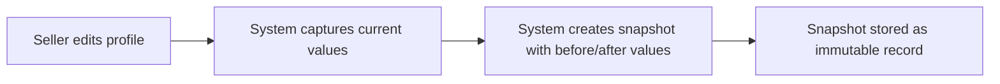
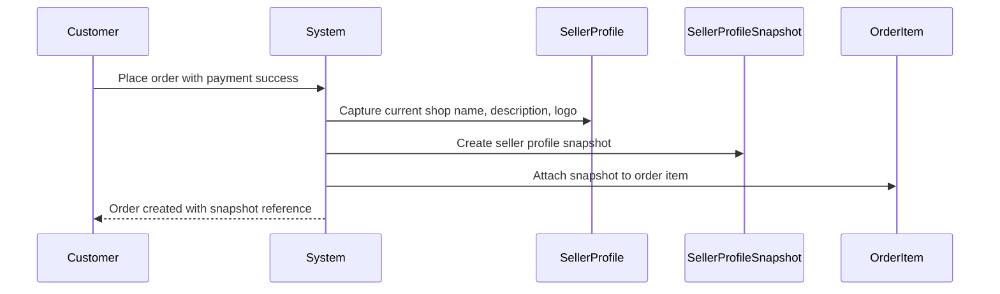
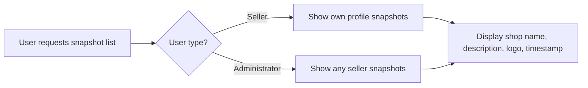
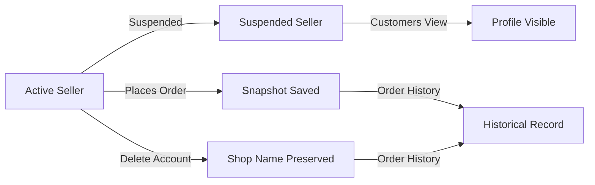
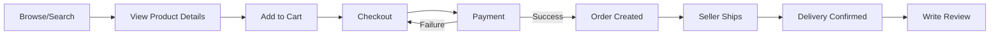
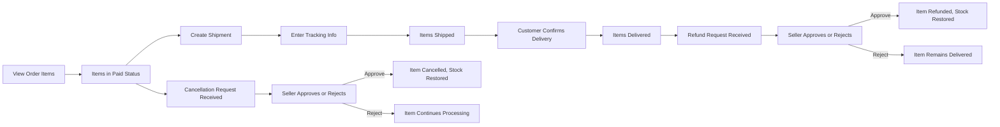
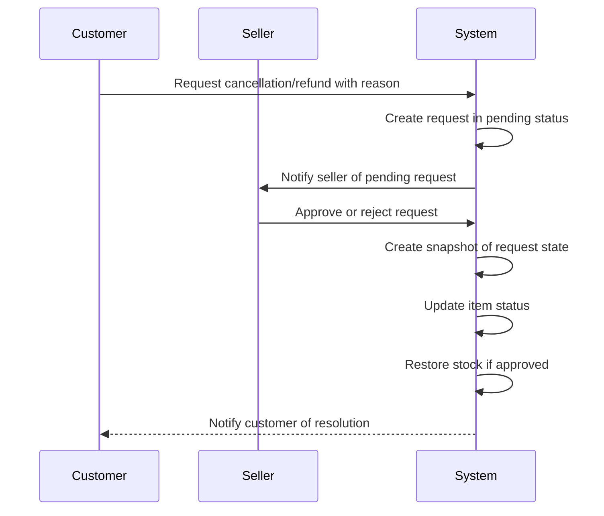
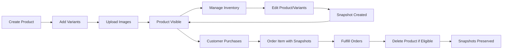

**shoppingMall — What operations users can perform, use cases, business workflows**

What operations users can perform, use cases, business workflows

# Core Business Operations

What the system must do for each business concept.

## User Operations

Users register for the platform with an email address and password to access any features. Both customers and sellers authenticate by logging in with their email and password credentials. Users can change their password at any time through their account settings. Customers can delete their account, which removes their profile information while preserving their order history and reviews for legal and seller record purposes. Deleted customer accounts show reviews as authored by a deleted user. Sellers can delete their account only when they have no pending orders in paid or shipped status and no pending cancellation or refund requests. When a seller deletes their account, their products are removed from listings but order history and shop names in past orders are preserved. Seller account registrations require administrator approval before the seller can begin selling. Sellers can view their approval status which may be pending, approved, or rejected. Rejected sellers can view the rejection reason and submit a new registration request. All users must be registered to use any platform features as guest browsing is not supported.

### Customer Registration and Authentication

Users must register with an email address and password to access any platform features. Guest browsing is not supported; all users must have a registered account before using any functionality. Customers complete registration by providing an email address and creating a password credential. Users authenticate by entering their registered email address and password. After successful authentication, users gain access to platform features according to their account type. If the email address does not match any registered account, the login attempt is rejected. If the password does not match the registered credentials, the login attempt is rejected. Registration requires both email address and password; requests missing either credential are rejected.

### Seller Registration and Approval

Sellers register with an email address and password like customers, but their accounts require administrator approval before they can sell products. After submitting a seller registration request, the account status is set to pending until an administrator reviews it. Sellers can view their approval status which displays one of three states: pending, approved, or rejected. If a seller registration is rejected, the seller can view the rejection reason provided by the administrator. Rejected sellers can submit a new registration request after addressing the rejection reason. Only approved sellers can create products, list items for sale, and process orders. Seller registration requests remain in pending status until an administrator approves or rejects them.

### Password Management

Users can change their password at any time through their account settings. To change a password, users must provide their current password for verification. After successful verification of the current password, users can set a new password. The new password replaces the previous password immediately upon successful change. If the current password provided is incorrect, the password change request is rejected. Password changes apply to both customer and seller accounts. Users must be authenticated to access the password change functionality.

### Customer Account Deletion

Customers can delete their account at any time. When a customer deletes their account, their profile information including display name and phone number is removed from the platform. The customer's order history is preserved for legal compliance and seller record purposes. The customer's reviews are preserved but shown as authored by a deleted user instead of the customer's display name. All wishlist entries are removed when the account is deleted. The shopping cart is cleared when the account is deleted. Any pending cancellation or refund requests submitted by the customer remain in the system for seller processing. Account deletion is permanent and cannot be undone.

### Seller Account Deletion

Sellers can delete their account only when they have no pending orders in paid or shipped status. Sellers can delete their account only when they have no pending cancellation or refund requests for their order items. When a seller deletes their account, their products are removed from all listings and search results. The seller's order history and snapshots are preserved for record purposes. The seller's shop name in past orders is preserved and remains visible to customers who purchased from them. If the seller has pending orders in paid or shipped status, the account deletion request is rejected. If the seller has pending cancellation or refund requests, the account deletion request is rejected. Sellers must resolve all pending orders and requests before account deletion is permitted.

## CustomerProfile Operations

Each customer has a profile containing a display name and phone number. Customers can edit their display name to change how their name appears on the platform. Customers can update their phone number for contact purposes. Profile edits are available to all registered customers. The display name is shown to other users in various contexts such as reviews. The phone number is used for order-related communications. Customer profiles are created automatically upon customer registration. Profile information is deleted when the customer deletes their account. Order history remains accessible even after profile deletion for legal compliance. Reviews authored by the customer are preserved but attributed to a deleted user after account deletion.

### Customer Profile Creation

When a customer registers with email and password, a customer profile is automatically created. The customer profile is linked to the user account upon successful registration. The profile is initialized with display name and phone number fields ready for customer input. Profile creation occurs as part of the registration process without requiring separate action. The profile exists for the lifetime of the customer account. All registered customers have exactly one customer profile. The profile is created immediately upon account activation. Profile creation cannot be skipped or deferred. The system associates the profile with the registering customer's identity. Profile creation is mandatory for all customer accounts.

### Profile Information Editing

Customers can edit their display name at any time after registration. Customers can update their phone number for contact purposes. Profile edits are available to all registered customers with active accounts. Both display name and phone number are editable fields in the profile. Changes to profile information take effect immediately upon saving. Customers can modify their display name to change how their name appears on the platform. Customers can change their phone number when contact information needs updating. Profile editing is accessible through the customer's account settings. Multiple profile edits can be performed over the account lifetime. Each profile edit updates the current profile values. Profile information management is available to all customers. Edit operations require the customer to be logged in.

### Profile Information Usage

The display name appears on reviews written by the customer. The phone number is used for order-related communications with the customer. Customers can view their own profile information at any time. The display name is visible to other users when the customer writes reviews. Order communications such as shipping notifications use the phone number on file. The profile display name identifies the customer in public-facing contexts. The phone number is accessible to sellers for order fulfillment purposes. Profile information is displayed consistently across all platform features. The display name shown in reviews helps identify review authors. Contact information from the profile is used for delivery coordination.

### Profile Deletion and Account Removal

When a customer deletes their account, their profile information is deleted from the system. Order history remains accessible after profile deletion for legal compliance and seller records. Reviews authored by the customer are preserved but shown as "deleted user" after account removal. The profile is removed from the system upon account deletion confirmation. Historical order records persist even after the customer profile is deleted. Reviews retain their content but lose customer attribution after deletion. Account deletion triggers profile information removal. Order snapshots and history are not affected by profile deletion. The "deleted user" attribution maintains review integrity while protecting customer privacy. Profile deletion is permanent and cannot be undone. Customers can delete their account which removes their profile. Legal and business records are preserved independently of profile deletion.

## SellerProfile Operations

Each seller has a profile containing a shop name, shop description, and logo image. Sellers can edit their shop name to change their store branding. Sellers can update their shop description to provide information about their business. Sellers can change their logo image for visual branding. Every edit to the seller profile creates an immutable snapshot preserving the previous state. Customers can view seller profiles to learn about shops before purchasing. The shop name appears on product listings and order confirmations. The logo image is displayed on the seller profile page. Shop name and logo are preserved in order item snapshots at the time of purchase. Seller profiles remain accessible even after a seller deletes their account for historical order records. Profile snapshots enable dispute resolution by showing what the shop information was at any point in time.

### Shop Name Editing

Sellers can edit their shop name to update their store branding. When a seller changes the shop name, the new name is immediately reflected on their seller profile page. The updated shop name appears on all product listings associated with the seller. The shop name is displayed on order confirmations shown to customers. Every shop name change creates an immutable snapshot that records the previous shop name, the new shop name, and the timestamp of the change. Sellers can view the history of their shop name changes through the snapshot records.

### Shop Description Updating

Sellers can update their shop description to provide current information about their business. The shop description is displayed on the seller profile page for customers to view. When a seller modifies the shop description, the change is immediately visible on their profile. Every shop description update creates an immutable snapshot that preserves the previous description text, the new description text, and the timestamp of the change. Sellers can review their description change history through the snapshot records.

### Logo Image Management

Sellers can change their logo image to update their visual branding. The logo image is displayed on the seller profile page. When a seller uploads a new logo image, it replaces the previous logo and is immediately shown on their profile. The logo image is also displayed on order confirmations and product listings. Every logo image change creates an immutable snapshot that records the previous logo image reference, the new logo image reference, and the timestamp of the change. Sellers can view their logo change history through the snapshot records.

### Seller Profile Editing and Snapshots

Sellers can edit their complete profile including shop name, shop description, and logo image. Every edit to the seller profile creates an immutable snapshot record. Each snapshot captures the state of the profile before the change, the state after the change, and the exact timestamp when the change was made. Snapshots cannot be modified or deleted once created. Sellers can view all snapshots of their own profile to track changes over time. Administrators can view snapshots of any seller profile. Snapshots are used for dispute resolution to verify what the shop information was at any specific point in time.

### Customer Profile Viewing

Customers can view seller profiles to learn about shops before making purchases. The seller profile page displays the shop name, shop description, and logo image. Customers can access the seller profile from product listings by clicking on the seller shop name. Customers can also view the seller profile from order details to see information about the shop they purchased from. The seller profile remains accessible to customers even if the seller account is deleted, ensuring customers can view historical shop information for their past orders.

### Shop Information in Orders and Listings

The shop name appears on product listings to identify the seller. When a customer places an order, a snapshot of the seller profile is saved with each order item. This snapshot preserves the shop name and logo image exactly as they appeared at the time of purchase. The preserved shop name and logo are displayed on the order confirmation and order history pages. If a seller changes their shop name or logo after an order is placed, the order continues to show the original shop information from the snapshot. When a seller deletes their account, their profile information remains accessible through order snapshots for historical order records and legal purposes.

## Address Operations

Customers can add multiple shipping addresses to their account. Each address contains a recipient name, phone number, street address, city, state or province, postal code, and country. Customers can edit any of their saved addresses to update information. Customers can delete addresses they no longer need. Customers can designate one address as their default shipping address. The default address is automatically selected during checkout. Multiple addresses allow customers to ship to different locations. Address information is captured at order placement and cannot be changed afterward. All address fields are required when creating or editing an address. Customers manage their addresses through their account settings.

### Address Creation and Fields

Customers can add multiple shipping addresses to their account. There is no limit on the number of addresses a customer can save. Each address must include a recipient name, phone number, street address, city, state or province, postal code, and country. All address fields are required when creating a new address. If any field is missing, the address cannot be saved. Each address is associated with the customer's account and is only accessible by that customer. Multiple addresses allow customers to ship to different locations such as home, work, or family members. Addresses are created through the customer's account settings.

### Address Management

Customers can edit any of their saved addresses to update information. When editing an address, all fields must be provided again. Customers can delete addresses they no longer need. Customers can set one address as their default shipping address. Only one address can be designated as the default at any time. If a customer attempts to delete their default address, they must designate a different address as the default before the deletion can proceed. Address management including creation, editing, deletion, and default designation is accessible through the customer's account settings.

### Address Usage in Checkout and Orders

During checkout, customers select a shipping address from their saved addresses. If a default address is set, it is automatically selected for the customer. The customer can choose a different address if desired. The shipping address is captured and saved at the time of order placement. Once an order is placed, the shipping address associated with that order cannot be changed. This ensures the order is shipped to the location confirmed by the customer at purchase time. The saved address information is preserved with the order record for shipping and reference purposes.

## Category Operations

Categories organize products on the platform. Categories can have subcategories with one level of nesting only. Each category has a name and description. Only administrators can create categories and subcategories. Administrators can edit category names and descriptions. Administrators can delete categories, and products in deleted categories become uncategorized. Customers can browse the list of all categories. Customers can view products within a specific category. Categories are used for product organization and search filtering. Subcategories allow more granular product classification. Category management is restricted to administrators to maintain consistent organization.

### Category Structure and Attributes

Categories organize products on the platform into a hierarchical structure. Each category has a name and a description that explains what types of products it contains. Categories support one level of subcategory nesting only, meaning a category can have a parent category but subcategories cannot have their own subcategories. This structure allows for granular product classification while maintaining simplicity. Products are assigned to either a top-level category or a subcategory. The product organization structure ensures customers can find products through logical groupings. Each category's name and description are used to help customers understand what products they will find within that category.

### Administrator Category Management

Only administrators can create new categories and subcategories. This administrator-only category creation ensures consistent organization across the platform. Administrators can edit existing category names and descriptions to keep them accurate and up-to-date. Administrators can delete categories when they are no longer needed. Category management restrictions prevent regular users from modifying the category structure, maintaining a standardized product organization. Super administrators and regular administrators both have full category management capabilities. This centralized control by administrators ensures the category structure remains logical and useful for all customers.

### Category Deletion and Product Handling

When an administrator deletes a category, all products that were assigned to that category become uncategorized. Products do not get deleted when their category is deleted. Uncategorized products remain visible on the platform but are not associated with any category. Administrators should reassign products to a new category before deleting a category to maintain organized product listings. The system preserves all product data even when the containing category is removed. This approach prevents accidental product loss while allowing administrators to restructure the category hierarchy as needed.

### Customer Category Browsing

Customers can browse the list of all categories on the platform. The category list shows both top-level categories and their subcategories in a hierarchical view. Customers can view all products within a specific category by selecting that category. When viewing a category, customers see all products assigned to that category and any products assigned to its subcategories. Customers can use category filtering in search to narrow down product search results to a specific category. This allows customers to search within a particular product type or department. Category browsing provides customers with an organized way to discover products without needing to know specific product names.

## Product Operations

Sellers can create products with a required name, description, category selection, and base price. Products belong to the seller who created them. Sellers can edit their own products and every edit creates a snapshot. Sellers can delete their products only if there are no pending order items in paid or shipped status for any variant. Sellers cannot delete products with pending cancellation or refund requests for any variant. Deleting a product removes all its variants and inventory records. Deleted products no longer appear in search results or category listings. Product snapshots are preserved even after product deletion. Sellers can view snapshots of their own products. Administrators can view snapshots of any product on the platform. Products must have at least one variant to be purchasable. Products without variants are visible in search but marked as unavailable.

### Product Creation

Sellers can create products on the platform. A product requires a name, which must be provided. A product requires a description, which must be provided. A product requires a category selection, and the seller must choose a category or subcategory from the available categories. A product requires a base price, which must be provided. Products without all required fields cannot be created. The product is automatically associated with the seller who created it.

### Product Ownership

Each product belongs to the seller who created it. Only the owning seller can edit the product. Only the owning seller can delete the product. Products are linked to their creating seller permanently, even if the seller's profile information changes.

### Product Editing and Snapshots

Sellers can edit their own products. When a seller edits a product, a snapshot is automatically created. The snapshot captures all product fields at the time of edit, including name, description, category, and base price. The snapshot also captures all variant states at that moment. Snapshots are created before the edit is applied. Sellers cannot prevent snapshot creation when editing. Snapshots record when the change was made and what values were changed.

### Product Deletion Conditions

Sellers can delete their own products only under specific conditions. A product cannot be deleted if any variant has pending order items in paid status. A product cannot be deleted if any variant has pending order items in shipped status. A product cannot be deleted if any variant has a pending cancellation request. A product cannot be deleted if any variant has a pending refund request. If any of these conditions exist, the deletion request is rejected. The seller must wait until all pending orders and requests are resolved before deleting the product.

### Product Deletion Effects

When a product is deleted, all its variants are also deleted. When a product is deleted, all inventory records for its variants are also deleted. The deleted product no longer appears in search results. The deleted product no longer appears in category listings. The deleted product cannot be purchased. Any wishlists containing the deleted product automatically remove it. Cart items containing variants from the deleted product are marked as unavailable.

### Product Snapshot Preservation

Product snapshots are preserved even after the product is deleted. Snapshots remain accessible after product deletion. Snapshots cannot be deleted under any circumstances. Snapshots maintain their complete data including all variant snapshots that were captured at the time. This preservation ensures order items referencing the product snapshot retain their historical data.

### Seller Snapshot Access

Sellers can view snapshots of their own products. Sellers can see all snapshots created for products they own. Sellers can view snapshots even after the product is deleted. Sellers can see the timestamp of each snapshot. Sellers can see what fields were changed in each snapshot. Sellers can see the values before and after each change.

### Administrator Snapshot Access

Administrators can view snapshots of any product on the platform. Administrators can access snapshots for products they do not own. Administrators can view snapshots for deleted products. Administrators can use snapshots for dispute resolution and oversight purposes. Super administrators have the same snapshot viewing capabilities as regular administrators.

### Variant Requirement

A product must have at least one variant to be purchasable. Products without any variants cannot be added to cart. Products without any variants are still visible in search results. Products without any variants are still visible in category listings. Products without variants are shown as unavailable to customers. Sellers should add at least one variant before expecting sales.

## ProductImage Operations

Sellers can upload multiple images for each product. Images can be reordered by the seller with the first image serving as the main thumbnail. The main image is displayed in product listings and search results. Sellers can delete images from their products. Image changes are included in product snapshots to preserve the complete product state. All product images are visible on the product detail page. Image reordering allows sellers to control which image appears first. Multiple images help customers view products from different angles. Image management is available only to the product owner. Deleted images are removed from the product but preserved in historical snapshots.

### Product Image Upload

Sellers can upload multiple images for each product they own. There is no limit on the number of images a seller can upload to a product. When uploading images, sellers select image files from their device. All uploaded images are immediately associated with the product. Images are displayed on the product detail page in the order they were uploaded, unless the seller reorders them. Image upload is available only to the seller who owns the product. Other sellers cannot upload images to products they do not own. Customers cannot upload images to products. Uploaded images are visible to all customers viewing the product.

### Image Display Order and Thumbnail

Sellers can reorder the images of their products at any time. The first image in the display order serves as the main thumbnail image. The main thumbnail image is displayed in product listings and search results. When customers browse search results or category pages, they see the main thumbnail image for each product. Sellers control which image appears first by changing the display order. Image reordering does not create a product snapshot by itself, but if other product fields are edited simultaneously, the image order at that moment is captured in the snapshot. The display order determines the sequence in which images appear in the product image gallery.

### Product Image Gallery Display

All product images are displayed on the product detail page. Customers can view all images uploaded to a product when viewing its detail page. The image gallery shows images in the seller-defined display order. Multiple images help customers view products from different angles. Customers can navigate through all images in the gallery. The product detail page displays the main thumbnail image prominently along with all additional images. All images are visible to any customer viewing the product, regardless of whether they are logged in.

### Image Deletion and Snapshot Preservation

Sellers can delete images from their products at any time. When an image is deleted, it is immediately removed from the product display and no longer appears in the product image gallery. Deleted images are removed from search results and product listings. Image deletion is available only to the product owner. When a product is edited and a snapshot is created, the current state of all product images is preserved in the product snapshot. This includes images that were later deleted. Deleted images remain preserved in historical product snapshots even after removal from the active product. This ensures the complete product state is preserved at any point in time for dispute resolution and order item references.

## ProductVariant Operations

A product can have multiple variants representing specific combinations of options like color and size. Each variant has a required unique SKU code. Variants include option values such as color Red or size Large. Variants can have an optional price that overrides the product base price. Each variant has a required stock quantity that starts at zero. Sellers can add variants to their products. Sellers can edit variant details including SKU code, option values, and price. Every variant edit creates a snapshot. Sellers can delete variants only if there are no pending order items in paid or shipped status. Variants cannot be deleted if there are pending cancellation or refund requests. A product must have at least one variant to be purchasable. Products with no variants are visible but shown as unavailable to customers.

### Variant Creation and Structure

A product can have multiple variants, each representing a specific combination of options such as color and size.

Each variant must have a unique SKU code that identifies it across the platform.

Each variant includes option values that describe its specific characteristics, such as color Red or size Large.

A variant can have an optional price that overrides the product base price. If no variant price is set, the product base price applies.

Each variant must have a stock quantity that tracks available inventory. The stock quantity starts at zero when the variant is created.

Sellers can add variants to their own products to offer different options to customers.

A product must have at least one variant to be purchasable by customers.

### Variant Editing and Snapshots

Sellers can edit their own product variants, including the SKU code, option values, and price.

Every variant edit creates a snapshot that preserves the variant state before the change.

The variant snapshot records the SKU code, option values, price, and stock quantity at the time of the edit.

Variant snapshots are included within the product snapshot, preserving the complete state of all variants when a product is edited.

Variant snapshots are immutable and cannot be deleted or modified after creation.

Sellers can view snapshots of their own product variants to track changes over time.

Administrators can view snapshots of any product variant on the platform.

### Variant Deletion Constraints

Sellers can delete their own product variants only if there are no pending order items in paid or shipped status for that variant.

Sellers cannot delete a variant if there are pending cancellation requests for any order item of that variant.

Sellers cannot delete a variant if there are pending refund requests for any order item of that variant.

When a variant is deleted, all inventory records for that variant are also deleted.

Deleted variants no longer appear in product listings or search results.

### Variant Availability and Purchasing

A product must have at least one variant to be purchasable by customers.

Products with no variants are visible in search results and category listings but are shown as unavailable to customers.

Customers can only add variants to their cart, not products without variants.

When a variant stock quantity reaches zero, the variant is shown as out of stock.

Out of stock variants cannot be added to the shopping cart.

When a variant is deleted by the seller, it is automatically removed from all customer carts and marked as unavailable.

## InventoryRecord Operations

Each variant has its own stock quantity managed through inventory history records. Inventory records are not snapshots but track quantity changes over time. Each inventory record contains a quantity change amount, a reason for the change, and a timestamp. Positive quantities represent restocking while negative quantities represent orders or adjustments. The current stock is calculated by summing all inventory records for a variant. Sellers can add inventory by restocking with a quantity and reason. Sellers can subtract inventory through adjustments or loss with a quantity and reason. Order placement automatically creates a negative inventory record. Order cancellation or refund automatically creates a positive inventory record. Sellers can view the full inventory history of each variant. When stock reaches zero the variant is shown as out of stock. Out of stock variants cannot be added to the shopping cart.

### Stock Quantity Management Through Records

Each product variant maintains its own stock quantity through inventory history records rather than direct field updates. Inventory records are distinct from snapshots and serve specifically to track quantity changes over time. The current stock quantity for a variant is calculated by summing all inventory records associated with that variant. This record-based approach provides a complete audit trail of all stock movements. Stock management is performed exclusively through creating new inventory records rather than modifying existing stock values directly.

### Inventory Record Structure

Each inventory record contains three essential pieces of information. The quantity change amount indicates how much stock was added or removed, with positive values representing increases and negative values representing decreases. The reason for the inventory change documents why the adjustment was made, such as restocking, customer order, damage, or loss. A timestamp records when the inventory change occurred, providing chronological tracking of all stock movements.

### Seller Restocking and Adjustment Operations

Sellers can add inventory to a variant by creating a restocking record with a positive quantity and a reason describing the restock source. Sellers can subtract inventory by creating an adjustment record with a negative quantity and a reason explaining the loss, such as damage, defect, or inventory correction. Both operations create new inventory records rather than modifying existing quantities. The seller specifies both the quantity amount and the reason for each manual inventory change.

### Automatic Inventory Records from Orders

When a customer places an order successfully, the system automatically creates a negative inventory record for each purchased variant, reducing the available stock. When an order item is cancelled and the cancellation is approved, the system automatically creates a positive inventory record to restore the stock quantity. When an order item is refunded and the refund is approved, the system automatically creates a positive inventory record to restore the stock quantity. These automatic records ensure stock accuracy without requiring manual seller intervention.

### Inventory History Viewing and Stock Status

Sellers can view the complete inventory history for each of their variants, showing all records with their quantity changes, reasons, and timestamps. When the calculated stock quantity reaches zero, the variant is displayed as out of stock to customers. Variants shown as out of stock cannot be added to the shopping cart. The stock status is determined by the sum of all inventory records, ensuring real-time accuracy based on the complete history of stock movements.

## Wishlist Operations

Customers can add products to their wishlist for future reference. Customers can view their wishlist which displays saved products. The wishlist is paginated to handle large numbers of saved items. Wishlist shows products not specific variants. Customers can remove products from their wishlist at any time. If a product is deleted by the seller it is automatically removed from all customer wishlists. The wishlist helps customers track products they are interested in purchasing. Wishlist items can be viewed across multiple pages. Adding to wishlist does not reserve stock or affect availability. Wishlist functionality is available to all registered customers.

### Adding Products to Wishlist

Customers can add products to their wishlist to save items for future reference. When adding a product to the wishlist, the customer selects the product from search results, category pages, or product detail pages. The wishlist stores products, not specific variants. Adding a product to the wishlist does not reserve stock or affect product availability. The same product cannot be added to the wishlist multiple times. If a customer attempts to add a product already in their wishlist, the request is rejected. The wishlist creation date is recorded for each added product. Customers can add products to their wishlist from any product listing or detail page. The wishlist helps customers track products they are interested in purchasing at a later time.

### Viewing Wishlist

Customers can view their wishlist which displays all saved products. The wishlist shows products, not specific variants. Each product in the wishlist displays the main image, product name, base price or price range, and seller shop name. The wishlist is paginated to handle large numbers of saved items. Customers can navigate through multiple pages of their wishlist. The wishlist is sorted by the date products were added, with newest items shown first. Customers can view the full product detail page by selecting a product from their wishlist. The wishlist shows the current availability status of each product. If a product has been deleted by the seller, it is no longer shown in the wishlist. The wishlist displays the average rating and review count for each product if reviews exist.

### Removing Products from Wishlist

Customers can remove products from their wishlist at any time. When a product is removed from the wishlist, it is permanently deleted from the customer's saved items. Customers can remove multiple products from their wishlist individually. When a seller deletes a product, that product is automatically removed from all customer wishlists. The automatic removal occurs immediately when the product deletion is processed. Customers are not notified when products are automatically removed from their wishlist due to seller deletion. If a product is removed from the wishlist, the customer can add it again if the product still exists. Removing a product from the wishlist does not affect the product itself or its availability.

### Wishlist Behavior and Availability

The wishlist feature is available to all registered customers. Wishlist functionality requires customer authentication. The wishlist does not reserve stock or affect product availability. Adding a product to the wishlist does not guarantee the product will remain available for purchase. The wishlist does not notify customers of price changes or stock updates. The wishlist is independent of the shopping cart. Products in the wishlist can be added to the cart separately. The wishlist preserves the product reference, not a snapshot of product details. When viewing the wishlist, customers see current product information including current price and availability. The wishlist helps customers organize products they are interested in for future purchase decisions.

## Cart Operations

Customers have a shopping cart for items they intend to purchase. Customers can view their cart to see all items they have added. The cart displays each item with product name, variant options, price, quantity, and subtotal. The cart shows the total price of all items combined. If a variant stock is less than the cart quantity a warning is shown to the customer. If a variant is deleted or out of stock it is marked as unavailable in the cart. Unavailable items cannot be checked out. The cart persists for the customer across sessions. Cart items are removed when an order is successfully placed. Customers must proceed to checkout from their cart to place an order.

### Shopping Cart Overview

Each customer has one shopping cart that persists across sessions. The cart stores items the customer intends to purchase. The customer can manage their cart by viewing contents, updating quantities, and removing items. The cart remains available to the customer until they place an order or manually remove items. When the customer successfully places an order, all items in the cart are automatically removed. The cart is tied to the customer account and is not shared between customers.

### View Cart Contents

Customers can view their cart to see all items they have added. The cart displays each item with the product name, variant options such as color and size, unit price, quantity, and item subtotal. The cart shows the total price calculated by summing all item subtotals. If variants have different prices, each item shows its specific variant price. The cart displays items in the order they were added or by last updated time. Customers can see the total number of items in their cart.

### Stock Availability Warnings

The cart checks stock availability for each variant. If a variant stock quantity is less than the cart quantity, a warning is shown to the customer indicating insufficient stock. If a variant is deleted by the seller, it is marked as unavailable in the cart. If a variant stock reaches zero, it is marked as out of stock and shown as unavailable in the cart. Unavailable items remain visible in the cart but are clearly marked. The customer cannot proceed to checkout with unavailable items in their cart.

### Checkout from Cart

Customers can proceed to checkout from their cart when all items are available. Before checkout, the system validates that no items are marked as unavailable. If unavailable items exist, the customer must remove them before proceeding. When the customer initiates checkout, they are taken to the checkout flow to select shipping address and review order. After payment succeeds and the order is created, all cart items are automatically removed. If payment fails, the order is not created and cart items remain in the cart for the customer to retry.

## CartItem Operations

Customers add specific variants to their cart not just products. When adding to cart customers must specify the quantity of the variant. If the same variant is already in the cart the quantities are combined rather than creating a separate line item. Customers can change the quantity of items already in their cart. Customers can remove individual items from their cart. Each cart item represents one variant with a specific quantity. Cart item quantities can be increased or decreased by the customer. Removing a cart item deletes it from the cart completely. The cart combines duplicate variants to simplify the shopping experience. Cart items must reference valid variants that are in stock.

### Adding Variants to Cart

Customers add specific product variants to their shopping cart, not just products. When adding a variant to the cart, customers must specify the quantity they wish to purchase. Each cart item represents exactly one variant with a specific quantity.

If the same variant is already in the cart, the system automatically combines the quantities rather than creating a separate line item. This ensures no duplicate cart items exist for the same variant. The duplicate variants are combined automatically to simplify the shopping experience.

Cart items must reference valid variants that exist in the system. The variant must be in stock to be added to the cart. If a variant is out of stock or has been deleted by the seller, it cannot be added to the cart.

### Changing Cart Item Quantities

Customers can change the quantity of items already in their cart. Cart item quantity management allows customers to increase or decrease the quantity of any cart item. When increasing quantity, the system validates that the requested quantity does not exceed the available stock for that variant.

Each cart item represents one variant, and the quantity can be adjusted independently for each item. Customers can increase the quantity to add more of the same variant or decrease the quantity to reduce the number of items they wish to purchase. The cart updates the subtotal for each item and recalculates the total price when quantities change.

### Removing Cart Items

Customers can remove individual cart items from their shopping cart. Removing a cart item deletes it from the cart completely. When a customer removes an item, only that specific cart item is affected and other items in the cart remain unchanged.

Deleting a cart item completely removes the variant from the customer's shopping cart. The customer can add the variant again later if they wish. Item removal does not affect the product or variant itself, only the customer's cart.

## Order Operations

Orders are created when payment succeeds during checkout. An order contains one or more order items from potentially different sellers. Customers can view a list of all their orders paginated and sorted by newest first. Each order in the list shows order number, date, total price, and overall order status. Customers can view full details of an order including all items and shipping information. The overall order status is derived from the status of its individual items. If all items are paid the order status is paid. If any item is shipped the order status becomes shipped. If all items are delivered the order status is delivered. Mixed states result in a partially completed order status. Orders cannot be deleted by customers as they are preserved for legal and seller record purposes. Shipping address is captured at order placement and cannot be changed afterward.

### Order Creation on Payment Success

An order is created when payment succeeds during the checkout process. If payment fails, no order is created and the customer can retry the payment. The shipping address is captured at the time of order placement and becomes part of the order record. Once the order is placed, the shipping address cannot be changed. Each order is assigned a unique order number and the order date is recorded at creation.

### Order Structure with Multiple Items

An order contains one or more order items. Each order item represents a purchased product variant with a specific quantity. If a customer purchases multiple units of the same variant, it becomes one order item with the combined quantity. An order can contain items from different sellers. Each order item maintains its own independent status and can be individually processed for shipping, cancellation, or refund.

### Order List and History Viewing

Customers can view a list of all their orders. The order list is paginated to handle large order histories. The order list is sorted by newest orders first. Each order in the list displays the order number, order date, total price, and overall order status. Customers can access their complete order history for reference and record-keeping purposes.

### Order Detail Viewing

Customers can view the full details of any order. The order detail page shows all order items with product name, variant options, quantity, unit price, and individual item status. The order detail page shows the shipping address used for the order. The order detail page shows all shipments associated with the order, including tracking information for each shipment. Each shipment displays which order items it contains.

### Order Status Derivation from Item Statuses

The overall order status is derived from the statuses of its individual order items. When all items in an order have paid status, the order status is paid. When any item in an order has shipped status and no items are delivered yet, the order status is shipped. When all items in an order have delivered status, the order status is delivered. When all items are cancelled, the order status is cancelled. When all items are refunded, the order status is refunded. When items have mixed states such as some delivered and some refunded, the order status is partially completed.

### Order Preservation and Non-Deletion

Orders cannot be deleted by customers. All orders are preserved for legal purposes and seller record-keeping. Order history remains accessible to customers indefinitely. The preservation of orders ensures that purchase records, shipping information, and transaction history are maintained for dispute resolution and legal compliance.

## OrderItem Operations

Each order item represents a purchased product variant with a specific quantity. If a customer buys three of the same variant it becomes one order item with quantity three. Order items can be from different sellers within the same order. Each order item has its own independent status. Order item statuses include paid, shipped, delivered, cancelled, and refunded. Each order item can be individually cancelled or refunded. A snapshot of the purchased product and variant is saved with each order item. A snapshot of the seller profile is saved with each order item. These snapshots preserve the product name, description, variant options, price, shop name, and logo at the time of purchase. Order items are grouped into shipments when shipped by the seller. Individual item status changes do not affect other items in the same order.

### Order Item Creation

Each order item represents a purchased product variant with a specific quantity. When a customer purchases multiple units of the same variant, the order contains one order item with the combined quantity rather than separate items for each unit.

An order can contain order items from different sellers. Each order item is linked to a single seller's product variant.

When an order is created, a snapshot of the purchased product is saved with each order item. A snapshot of the purchased product variant is saved with each order item. A snapshot of the seller's profile is saved with each order item.

These snapshots preserve the purchase-time state including the product name, product description, variant options, price, shop name, and shop logo. The snapshots ensure that customers and sellers can view the exact state of the product and seller profile at the time of purchase, even if the product or seller profile is later modified.

### Order Item Status Management

Each order item has its own independent status that is managed separately from other items in the same order. Status changes to one order item do not affect the status of other order items in the order.

Order item statuses include paid, shipped, delivered, cancelled, and refunded. When payment succeeds, order items are created with the paid status. When a seller ships an item, its status changes to shipped. When delivery is confirmed, the status changes to delivered.

When an order item is cancelled, its status changes to cancelled. When an order item is refunded, its status changes to refunded.

The overall order status is derived from the statuses of its order items, but individual item status changes proceed independently without blocking or affecting other items.

### Individual Item Cancellation

Customers can request cancellation for individual order items that have the paid status. Cancellation is handled per order item, not per entire order. Items that have already been shipped cannot be cancelled.

When a cancellation request is submitted, it includes a reason provided by the customer. The seller of the item can approve or reject the cancellation request.

If the cancellation is approved, only that specific order item is cancelled. The item's status changes to cancelled and the stock quantity is restored. The remaining order items continue processing normally without interruption.

If all order items in an order are cancelled, the overall order status becomes cancelled.

### Individual Item Refund

Customers can request a refund for individual order items that have the delivered status. Refund is handled per order item, not per entire order. Refund requests can be made within seven days of the item being delivered.

When a refund request is submitted, it includes a reason provided by the customer. The seller of the item can approve or reject the refund request.

If the refund is approved, only that specific order item is refunded. The item's status changes to refunded and the stock quantity is restored. The remaining order items in the order are unaffected and continue with their current status.

If all order items in an order are refunded, the overall order status becomes refunded.

### Shipment Grouping

Order items are grouped into shipments when shipped by the seller. A shipment is a package sent by a seller and can contain one or more order items from the same seller.

Different sellers always ship separately, meaning order items from different sellers belong to different shipments. A seller can choose to ship items individually or bundle multiple items into one shipment.

When a seller creates a shipment, they select one or more of their order items to include. All items in the same shipment share the same tracking information. When the shipment is created, all order items in it change to the shipped status.

Customers confirm delivery per shipment. When delivery is confirmed for a shipment, all order items in that shipment change to the delivered status.

### Order Item Detail Viewing

Customers can view the full details of each order item within their orders. The order item detail view shows the product name, variant options, quantity, unit price, and current item status.

The detail view includes the snapshot of the product and variant at the time of purchase, preserving the product name, description, variant options, and price as they were when the order was placed. The detail view also includes the snapshot of the seller's profile at the time of purchase, preserving the shop name and logo.

Customers can view the shipment information for each order item, including the carrier name and tracking number if the item has been shipped. Customers can view the cancellation or refund request status for each order item if such requests have been submitted.

## Shipment Operations

A shipment is a package sent by a seller containing one or more order items. Different sellers always ship separately creating different shipments. A seller can choose to ship items individually or bundle multiple items into one shipment. Sellers create shipments by selecting one or more of their order items to include. Sellers enter tracking information including carrier name and tracking number for each shipment. All items in the same shipment share the same tracking information. When a shipment is created all items in it change to shipped status. Customers can view tracking information for each shipment. Customers confirm delivery per shipment not per individual item. When the customer confirms delivery all items in that shipment change to delivered status. If the customer does not confirm delivery items automatically change to delivered after fourteen days from shipping.

### Shipment Creation by Seller

Sellers create shipments to ship order items to customers. A shipment is a package sent by a seller containing one or more order items. Different sellers always ship separately, meaning each seller creates their own shipments for their order items. A seller can choose to ship items individually by creating separate shipments for each item, or bundle multiple items into one shipment. When creating a shipment, the seller selects one or more of their order items to include in that shipment. The seller enters tracking information for the shipment including the carrier name and tracking number. All items in the same shipment share the same tracking information. When a shipment is created, all order items included in that shipment automatically change to shipped status. Sellers can view all shipments they have created and the tracking information associated with each shipment.

### Customer Tracking and Delivery Confirmation

Customers can view tracking information for each shipment associated with their orders. The tracking information includes the carrier name and tracking number entered by the seller. Customers confirm delivery per shipment, not per individual item. When the customer confirms delivery for a shipment, all order items in that shipment automatically change to delivered status. If the customer does not manually confirm delivery, the items in the shipment automatically change to delivered status after fourteen days from the shipping date. Customers can view the delivery confirmation status for each shipment in their order history.

### Shipment Tracking Management

The system manages shipment tracking throughout the shipping lifecycle. Each shipment maintains its tracking information including carrier name, tracking number, shipped date, and delivery confirmation date. Sellers can view and manage tracking information for shipments they have created. Customers can view tracking information for shipments containing their order items. The system tracks the status of all items within each shipment and updates item statuses based on shipment events. When a shipment is created, item statuses update to shipped. When delivery is confirmed either manually by the customer or automatically after fourteen days, item statuses update to delivered. Shipment tracking information is preserved as part of the order record for historical reference.

## ProductSnapshot Operations

Product snapshots are created whenever a product is edited by the seller. The snapshot includes all product fields such as name, description, category, base price, and images. Product snapshots also include snapshots of all variants at that moment. This preserves the complete state of a product and its variants at any point in time. Snapshots are immutable and cannot be deleted or modified. Sellers can view snapshots of their own products. Administrators can view snapshots of any product on the platform. Snapshots are preserved even after the product is deleted. Snapshots enable dispute resolution by showing historical product states. The snapshot records when the change was made and the values before and after. Product snapshots support the snapshot principle for all money-exchanging transactions.

### Product Snapshot Creation on Edit

When a seller edits any field of their product, the system automatically creates a product snapshot before applying the changes. The snapshot captures all product fields including name, description, category, base price, and all product images with their display order. The snapshot also includes snapshots of all product variants at that moment, preserving SKU codes, option values such as color and size, prices, and stock quantities. Each snapshot records the timestamp when the change was made. The snapshot records the values before the edit and the values after the edit. This snapshot principle applies to all transactions where money is exchanged, ensuring complete product state preservation at any point in time. The system creates a snapshot for every product edit operation without exception. Product snapshots preserve the complete product state including all associated variant information. The snapshot creation is automatic and cannot be skipped or bypassed by the seller.

### Product Snapshot Immutability

Product snapshots are immutable once created. Snapshots cannot be modified after creation by any user including the seller, administrators, or super administrators. Snapshots cannot be deleted by any user, including the seller who owns the product, administrators, or super administrators. This ensures the integrity of historical records for dispute resolution and audit purposes. The immutability guarantee applies to all product snapshots regardless of product status or deletion state. Even if a product is deleted, its snapshots remain unchanged and accessible. The system enforces snapshot immutability at the business logic level. No edit or delete operations are available for product snapshots in any user interface or system function.

### Product Snapshot Viewing and Access

Sellers can view all snapshots of their own products. Sellers can browse the complete snapshot history of each product they own. Administrators can view snapshots of any product on the platform. Super administrators can view snapshots of any product on the platform. Snapshots remain accessible even after the product is deleted by the seller. Users can view historical product states by browsing the snapshot timeline. Each snapshot displays the timestamp of when the change was made. Each snapshot displays the product field values before and after the edit. This enables verification of product information at any point in the product's lifecycle. The viewing permission is based on product ownership for sellers and platform-wide access for administrators. Deleted products maintain their snapshot records for historical reference.

### Product Snapshot for Dispute Resolution

Product snapshots serve as the authoritative record for dispute resolution between customers, sellers, and administrators. When disputes arise about product information, pricing, or variant details, snapshots provide the complete state at any historical point. Product snapshot management enables tracking all changes throughout the product lifecycle. The snapshot system supports the platform's requirement to preserve all money-exchanging transaction records. Snapshots are used to verify what product information was displayed at the time of purchase. Snapshots enable administrators to investigate seller disputes about product modifications. The snapshot timeline provides a complete audit trail of all product changes. Relevant parties including sellers and administrators can access snapshots for dispute resolution purposes. The snapshot principle ensures that all product state changes are recorded and preserved for future reference.

## ProductVariantSnapshot Operations

Product variant snapshots are created whenever a variant is edited by the seller. Each variant edit creates a snapshot preserving the SKU code, option values, and price at that moment. Variant snapshots are included within product snapshots to capture the complete product state. Snapshots are immutable and cannot be deleted or modified. Sellers can view snapshots of variants for their own products. Administrators can view variant snapshots for any product. Variant snapshots are preserved even after the product or variant is deleted. Snapshots enable verification of what variant options and prices were at the time of purchase. Order items include variant snapshots to preserve purchase details. Variant snapshots support accurate dispute resolution for variant-related issues.

### Snapshot Creation on Variant Edit

When a seller edits any variant field, a product variant snapshot is automatically created. The snapshot captures the SKU code at the moment of edit. The snapshot captures the option values such as color and size at the moment of edit. The snapshot captures the variant price at the moment of edit. Every variant edit operation triggers snapshot creation. The snapshot is created before the variant data is updated. Multiple consecutive edits create multiple snapshots, one per edit.

### Variant Snapshots in Product Snapshots

When a product snapshot is created, it includes snapshots of all variants belonging to that product at that moment. Each product snapshot contains complete variant snapshot data for all variants. The product snapshot preserves the complete state of the product and its variants together. This ensures the full product configuration is captured at any point in time. Variant snapshots within a product snapshot cannot be accessed separately from the parent product snapshot.

### Snapshot Immutability

Once a variant snapshot is created, it cannot be modified. Variant snapshots cannot be deleted by any user, including the seller who created the variant. Variant snapshots cannot be altered by administrators. The snapshot data remains exactly as captured at creation time. Immutability ensures historical accuracy for dispute resolution and order verification.

### Viewing Variant Snapshots

Sellers can view all variant snapshots for products they own. Sellers can see the historical sequence of variant changes through snapshots. Administrators can view variant snapshots for any product on the platform. Administrators can access variant snapshots regardless of product ownership. Users can browse historical variant states to see how options and prices changed over time. Snapshot viewing shows the captured SKU code, option values, and price for each snapshot.

### Snapshots Preserved After Deletion

When a product is deleted, all variant snapshots remain preserved. When a variant is deleted, its snapshots remain accessible through the product snapshot history. Variant snapshots are not removed when the parent product is deleted. Variant snapshots persist indefinitely for historical reference. This preservation enables verification of past product configurations even after deletion.

### Variant Snapshots in Order Items

When an order is placed, each order item includes a variant snapshot. The variant snapshot preserves the exact variant state at the time of purchase. The snapshot captures the SKU code, option values, and price the customer paid. Order items retain variant snapshots even if the variant is later modified or deleted. This ensures customers and sellers can verify what was purchased regardless of future changes.

### Dispute Resolution Support

Variant snapshots provide evidence for resolving disputes about variant options or pricing. Customers can reference the variant snapshot in their order to verify what they purchased. Sellers can use variant snapshots to confirm what variant configuration was sold. Administrators can review variant snapshots when mediating disputes between customers and sellers. The snapshot shows the authoritative variant state at the time of transaction.

### Variant Snapshot Management

Variant snapshots are managed automatically by the system on every variant edit. Users cannot manually create or delete variant snapshots. Sellers can browse and filter snapshots for their own products. Administrators can browse and filter snapshots across all products. Snapshot lists show the timestamp of each snapshot for chronological reference. Snapshot management interfaces display the before and after values for each captured field.

## SellerProfileSnapshot Operations

Seller profile snapshots are created whenever a seller edits their profile. Every edit to shop name, description, or logo creates a snapshot preserving the previous state. Snapshots are immutable and cannot be deleted or modified. Seller profile snapshots are attached to order items at the time of purchase. This preserves the shop name and logo that the customer saw when placing the order. Snapshots enable verification of what the seller profile looked like historically. Administrators and sellers can view seller profile snapshots. Snapshots are preserved for dispute resolution purposes. Order items reference the seller profile snapshot from the purchase time. This ensures customers can see what shop information was associated with their order.

### Snapshot Creation on Profile Edit

### Snapshot Creation on Profile Edit

When a seller edits their shop name, the system shall create a seller profile snapshot preserving the previous shop name, shop description, and logo image.

When a seller edits their shop description, the system shall create a seller profile snapshot preserving the previous shop name, shop description, and logo image.

When a seller changes their logo image, the system shall create a seller profile snapshot preserving the previous shop name, shop description, and logo image.

Every edit to the seller profile shall create exactly one snapshot, regardless of how many fields are changed in that edit.

The seller profile snapshot shall record the timestamp when the change was made.

The seller profile snapshot shall record the values of shop name, shop description, and logo image before the change.

The seller profile snapshot shall record the values of shop name, shop description, and logo image after the change.

Seller profile snapshots shall be immutable once created.

The system shall not allow any modification to existing seller profile snapshots.

The system shall not allow deletion of seller profile snapshots.

### Snapshot Attachment to Order Items

### Snapshot Attachment to Order Items

When an order is placed successfully, the system shall attach a seller profile snapshot to each order item for that seller's products.

The seller profile snapshot attached to an order item shall preserve the shop name that was visible at the time of purchase.

The seller profile snapshot attached to an order item shall preserve the shop description that was visible at the time of purchase.

The seller profile snapshot attached to an order item shall preserve the logo image that was visible at the time of purchase.

Each order item shall reference the seller profile snapshot from the purchase time.

The system shall preserve the shop branding information in the snapshot even if the seller later changes their profile.

Customers viewing their order details shall see the shop name from the seller profile snapshot attached to the order item.

Customers viewing their order details shall see the logo image from the seller profile snapshot attached to the order item.

The system shall maintain the link between order items and their seller profile snapshots indefinitely.

Order items from the same seller in one order shall each reference the same seller profile snapshot if purchased at the same time.

### Snapshot Viewing and Access

### Snapshot Viewing and Access

Sellers shall be able to view the list of seller profile snapshots for their own seller profile.

Sellers viewing their profile snapshots shall see the shop name, shop description, and logo image from each snapshot.

Sellers viewing their profile snapshots shall see the timestamp when each snapshot was created.

Sellers shall be able to view the complete history of their seller profile changes through the snapshots.

Administrators shall be able to view seller profile snapshots for any seller on the platform.

Administrators viewing seller profile snapshots shall see the shop name, shop description, and logo image from each snapshot.

Administrators viewing seller profile snapshots shall see the timestamp when each snapshot was created.

The system shall display seller profile snapshots in chronological order, showing the history of profile changes.

Sellers shall be able to see what their shop information looked like at any point in time through the snapshots.

The system shall enable sellers to review their profile edit history for verification purposes.

Administrators shall be able to review seller profile history for oversight purposes.

The system shall provide snapshot viewing functionality for dispute resolution and verification.

### Dispute Resolution Support

### Dispute Resolution Support

Seller profile snapshots shall be available for dispute resolution between customers and sellers.

When a dispute arises about what shop information was displayed at purchase time, the system shall provide the seller profile snapshot attached to the order item.

Administrators shall be able to use seller profile snapshots to verify claims about shop information during disputes.

The system shall preserve seller profile snapshots to enable historical verification of shop branding and information.

Seller profile snapshots shall serve as the authoritative record of what shop information was visible when an order was placed.

The immutable nature of snapshots shall ensure that dispute resolution relies on unalterable historical records.

Administrators resolving disputes shall have access to the complete seller profile snapshot history.

The system shall maintain seller profile snapshots to protect both customer and seller interests in case of disagreements.

## Review Operations

Customers can write a review for products they have purchased. A review can only be written after the order item status is delivered. Customers can write one review per product per order. Each review has a required rating from one to five stars. Reviews can include optional text content. Reviews are displayed on the product detail page for all customers to see. Reviews are sorted by newest first on the product page. Customers can edit their own reviews after posting. Every review edit creates a snapshot preserving the previous content. Customers can delete their own reviews but the snapshots remain preserved. The product average rating is calculated from all non-deleted reviews. Deleted reviews do not affect the average rating calculation.

### Review Creation

THE system SHALL allow customers to write a review for products they have purchased.

WHEN an order item status becomes delivered, THE system SHALL enable the customer to write a review for that product.

THE system SHALL enforce that customers can write only one review per product per order.

THE system SHALL require a rating from one to five stars for every review.

THE system SHALL allow optional text content to be included in the review.

IF the order item status is not delivered, THEN THE system SHALL reject the review creation request.

IF the customer has already written a review for the same product in the same order, THEN THE system SHALL reject the duplicate review request.

### Review Display

THE system SHALL display all reviews for a product on the product detail page.

THE system SHALL show reviews to all customers viewing the product page.

THE system SHALL sort reviews by newest first on the product detail page.

THE system SHALL display the rating stars and text content for each review.

WHERE a review has been deleted by the customer, THE system SHALL exclude it from the product page display.

### Review Editing

THE system SHALL allow customers to edit their own reviews after posting.

WHEN a customer edits a review, THE system SHALL create a snapshot preserving the previous rating and text content.

THE system SHALL record the timestamp when the review edit was made.

THE system SHALL record the values before and after the edit in the snapshot.

IF the customer attempts to edit another customer's review, THEN THE system SHALL reject the edit request.

### Review Deletion

THE system SHALL allow customers to delete their own reviews.

WHEN a customer deletes a review, THE system SHALL preserve all snapshots created during previous edits.

THE system SHALL remove the deleted review from the product detail page display.

THE system SHALL retain the snapshot history even after review deletion.

IF the customer attempts to delete another customer's review, THEN THE system SHALL reject the deletion request.

### Rating Calculation

THE system SHALL calculate the product average rating from all non-deleted reviews.

THE system SHALL exclude deleted reviews from the average rating calculation.

THE system SHALL update the average rating when a new review is created.

THE system SHALL update the average rating when an existing review is edited.

THE system SHALL update the average rating when a review is deleted.

WHERE no reviews exist for a product, THE system SHALL display no average rating.

## ReviewSnapshot Operations

Review snapshots are created whenever a customer edits their review. Each snapshot preserves the rating and text content at the time of the edit. Snapshots are immutable and cannot be deleted or modified. Review snapshots remain preserved even after the review is deleted. This ensures a complete history of all review changes. Sellers and administrators can view review snapshots for dispute resolution. Snapshots show what the review content was at any point in time. The snapshot records when the change was made. Review snapshots support the snapshot principle for all platform transactions. Historical review states are accessible for verification purposes.

### Review Snapshot Creation and Content

When a customer edits their review, a review snapshot is automatically created. The snapshot preserves the rating and text content exactly as they were before the edit. Each snapshot records the timestamp when the change was made. The snapshot captures the complete state of the review at that moment, including the star rating from one to five and any text content. This ensures review edit tracking is complete and accurate. Every modification to a review generates a new snapshot, maintaining a full history of all changes. The snapshot records both the values before and after the edit. Review snapshots comply with the platform's snapshot principle for all transactional data.

### Snapshot Immutability and Preservation

Review snapshots are immutable and cannot be modified or deleted once created. Snapshots remain preserved even after the customer deletes their review. This ensures review history preservation is complete and unalterable. The complete review change history is maintained indefinitely. Historical review states remain accessible for verification purposes. When a review is deleted, all snapshots created during its editing history are retained. This supports the snapshot principle compliance requirement that all data modifications must be permanently recorded. Snapshots cannot be edited, removed, or altered by any user including the review owner, sellers, or administrators.

### Review Snapshot Viewing Access

Sellers can view review snapshots for products they sell. Sellers access review snapshots through the product detail page or their seller dashboard. Administrators can view review snapshots for any review on the platform. Administrators access review snapshots through the administrator oversight interface. Both sellers and administrators can view the complete history of review changes. Each snapshot in the history shows the rating, text content, and the timestamp when the change was made. Historical review state viewing allows verification of what the review contained at any point in time. Review snapshot management is limited to viewing only; no user can modify or delete snapshots. Customers who own the review can also view their own review's snapshot history.

### Dispute Resolution Support

Review snapshots support dispute resolution by providing verifiable historical evidence. When a dispute arises about review content, sellers and administrators can examine the snapshot history. Snapshots show historical review content exactly as it appeared at each point in time. This enables verification of whether a review was modified and what changes were made. The timestamp on each snapshot establishes when changes occurred. Dispute resolution using review snapshots ensures fair handling of conflicts between customers and sellers. The immutable nature of snapshots guarantees that the evidence cannot be tampered with. All parties can rely on snapshot data as an authoritative record of review history.

## AdminRequest Operations

Any user whether customer or seller can submit a request to become an administrator. The request includes a reason text explaining why the user wants to become an admin. Super administrators can view the list of pending admin requests. Super administrators can approve or reject each request. When a request is approved the user becomes a regular administrator. Rejected requests remain in the system for record purposes. Users can view the status of their submitted requests. The request includes a submitted date for tracking. Admin requests enable controlled expansion of the administrator team. Only super administrators can process admin requests.

### Admin Request Submission

Any user whether customer or seller can submit a request to become an administrator. The request submission includes a reason text explaining why the user wants to become an administrator. The system records the submitted date when the request is created. Users can submit admin requests through the admin application workflow. The request submission enables controlled admin team expansion by requiring super administrator review before granting access.

### Request Status Viewing

Users can view the status of their submitted admin requests. The request status shows whether the request is pending, approved, or rejected. Users can track their request using the submitted date for reference. The system maintains request status management throughout the review process. Rejected requests remain in the system preserved for record purposes, allowing users to see the outcome of their application.

### Super Admin Request Review

Super administrators can view the list of pending admin requests. Only super administrators can process admin requests. Super administrators can approve pending requests. Super administrators can reject pending requests. When a super administrator approves a request, the user becomes a regular administrator. When a super administrator rejects a request, the rejection is recorded and the request is preserved. Super admin only processing ensures controlled access to administrator privileges.

### Administrator Grade Assignment

When an admin request is approved, the user receives regular administrator grade assignment. The administrator grade assignment occurs automatically upon approval. Regular administrators can perform administrator duties but cannot process admin requests. Only super administrators can process new admin requests, maintaining the controlled admin team expansion. The grade assignment is permanent unless changed through the administrator promotion or demotion process.

## CancellationRequest Operations

Cancellation is handled per order item not per entire order. Customers can request cancellation for individual items with paid status that are not yet shipped. Cancellation requests include a reason text explaining why the customer wants to cancel. The seller of that item can approve or reject the cancellation request. When a seller responds a snapshot of the request state is created. If approved the item is cancelled and a refund is processed for that item only. Cancelled items restore their stock quantities through an inventory record. The remaining items in the order continue processing normally. If all items in an order are cancelled the entire order status becomes cancelled. Customers can view the status of their cancellation requests.

### Per-Item Cancellation Request

Customers can request cancellation for individual order items with paid status that have not yet been shipped. Each cancellation request applies to one order item only, not the entire order. The cancellation request must include a reason text explaining why the customer wants to cancel the item. Customers cannot request cancellation for items that have already been shipped. Customers cannot request cancellation for items with status other than paid. The system creates a cancellation request record when the customer submits the request.

### Seller Cancellation Response

The seller of the order item can approve or reject the cancellation request. When the seller responds to the cancellation request, a snapshot of the request state is created to preserve the status and seller response at that moment. The seller can view all pending cancellation requests for their order items. The seller must respond to each cancellation request with either approval or rejection. The snapshot records the request status and the seller's response for dispute resolution.

### Cancellation Approval Processing

When a cancellation request is approved, a refund is processed for that order item only. The cancelled item restores its stock quantity through an inventory record. The remaining order items that were not cancelled continue processing normally without interruption. If all order items in an order are cancelled, the entire order status becomes cancelled. The stock restoration occurs automatically upon cancellation approval. The refund is processed only for the approved cancelled item, not for other items in the order.

### Cancellation Status Viewing

Customers can view the status of their cancellation requests. The cancellation request shows whether it is pending, approved, or rejected. Customers can view all their cancellation requests in a list. The cancellation request management interface shows the request reason, submission date, and seller response if available. Customers can track the progress of each cancellation request through its status.

## CancellationRequestSnapshot Operations

Cancellation request snapshots are created whenever the seller responds to a cancellation request. Each snapshot preserves the request status and seller response at that moment. Snapshots are immutable and cannot be deleted or modified. Snapshots enable verification of how the cancellation was handled. Sellers and administrators can view cancellation request snapshots. The snapshot records when the seller responded to the request. Cancellation snapshots support dispute resolution for cancellation issues. Historical cancellation states are accessible for review. Snapshots preserve the complete cancellation request lifecycle. This ensures transparency in the cancellation approval or rejection process.

### Snapshot Creation on Seller Response

When a seller responds to a cancellation request, a snapshot of the cancellation request state is automatically created. The snapshot captures the request status at the moment of the seller's response. The snapshot preserves the seller's response, whether approval or rejection. The snapshot records the timestamp when the seller responded to the request. Each seller response action generates exactly one snapshot. The snapshot includes all cancellation request fields at the time of response. Multiple responses to the same request create multiple snapshots, preserving each response state. The snapshot creation occurs immediately after the seller submits their response.

### Snapshot Immutability and Preservation

Cancellation request snapshots are immutable once created. Snapshots cannot be modified after creation. Snapshots cannot be deleted by any user, including sellers and administrators. The immutable nature ensures the cancellation history remains unchanged. Each snapshot preserves the complete state of the cancellation request at a specific point in time. The cancellation lifecycle is preserved through the sequence of snapshots. All snapshots remain accessible for the lifetime of the order item. The preservation of snapshots ensures no cancellation history is lost.

### Snapshot Viewing Access

Sellers can view all snapshots for cancellation requests on their order items. Administrators can view snapshots for any cancellation request on the platform. The snapshot viewing interface displays the request status at the time of each response. The snapshot viewing interface displays the seller's response for each snapshot. The snapshot viewing interface displays the timestamp of each seller response. Sellers use snapshots to verify how they previously responded to cancellation requests. Administrators use snapshots to review cancellation handling during dispute resolution. The snapshot viewing supports transparent cancellation process verification. Both sellers and administrators can access the full history of cancellation responses.

### Cancellation History and Response Tracking

Users can view the complete history of cancellation request states through snapshots. The historical cancellation state viewing shows all snapshots in chronological order. Each snapshot in the history shows the request status and seller response at that time. The cancellation response tracking enables verification of the complete response timeline. The cancellation snapshot management ensures all response records are maintained. The transparent cancellation process is supported by accessible snapshot history. Users can trace how a cancellation request evolved through its lifecycle. The cancellation history viewing supports accountability in the cancellation approval or rejection process. All snapshots contribute to a complete audit trail of cancellation handling.

## RefundRequest Operations

Refund is handled per order item not per entire order. Customers can request a refund for individual items with delivered status. Refund can be requested within seven days of the item being delivered. Refund requests include a reason text explaining why the customer wants a refund. The seller of that item can approve or reject the refund request. When a seller responds a snapshot of the request state is created. If approved the item is refunded and stock quantities are restored. Refunded items restore their stock through an inventory record. The remaining items in the order are unaffected. If all items in an order are refunded the entire order status becomes refunded. Customers can view the status of their refund requests.

### Refund Request Initiation

Customers can request a refund for individual order items that have delivered status. Refund requests are handled per order item, not for the entire order. A refund request can only be submitted within seven days of the item being delivered. Each refund request must include a reason text explaining why the customer wants a refund. The system validates that the item has delivered status before allowing a refund request. The system validates that the request is submitted within the seven-day refund window from the delivery date. If the item is not in delivered status, the refund request is rejected. If the seven-day window has passed, the refund request is rejected.

### Seller Refund Response

The seller of the order item can approve or reject the refund request. When the seller responds to the refund request, a snapshot of the request state is created. The snapshot records the request status and the seller response at the time of the response. Snapshots are immutable and cannot be modified or deleted. Sellers can view the snapshots of refund requests for their order items. The snapshot preserves the complete state of the refund request for dispute resolution and audit purposes.

### Refund Processing and Stock Restoration

When a refund request is approved, the order item status changes to refunded. Upon approval, the stock quantity for the variant is restored. The stock restoration is recorded through an inventory record with a positive quantity change. The inventory record includes the reason for the stock restoration and a timestamp. The refunded item inventory restoration ensures accurate stock tracking. The remaining items in the order are unaffected by the refund of one item and continue processing normally.

### Order Status Impact

The overall order status is derived from the statuses of its order items. If all items in an order are refunded, the entire order status becomes refunded. When some items are refunded and others remain in different statuses, the order reflects a partially completed state. The remaining items in the order continue with their normal processing flow. Individual item refunds do not affect the status or processing of other items in the same order.

### Customer Refund Status Viewing

Customers can view the status of their refund requests at any time. The refund request management interface shows all refund requests submitted by the customer. Customers can view the per-item refund workflow progress, including whether the request is pending, approved, or rejected. Customers can see the seller response and the snapshot of the request state when the seller responds. The seven-day refund window is clearly indicated to customers when viewing eligible items for refund.

## RefundRequestSnapshot Operations

Refund request snapshots are created whenever the seller responds to a refund request. Each snapshot preserves the request status and seller response at that moment. Snapshots are immutable and cannot be deleted or modified. Snapshots enable verification of how the refund was handled. Sellers and administrators can view refund request snapshots. The snapshot records when the seller responded to the request. Refund snapshots support dispute resolution for refund issues. Historical refund states are accessible for review. Snapshots preserve the complete refund request lifecycle. This ensures transparency in the refund approval or rejection process.

### Snapshot Creation on Seller Refund Response

When a seller responds to a refund request, a refund request snapshot is automatically created. The snapshot preserves the request status at the moment of the seller's response. The snapshot preserves the seller's response, whether approval or rejection. The snapshot records the timestamp when the seller responded to the request. Each seller response action generates exactly one snapshot. The snapshot captures the complete state of the refund request at the time of response. This ensures an accurate record of how each refund request was handled.

### Immutability of Refund Snapshots

Refund request snapshots are immutable once created. Snapshots cannot be modified after creation. Snapshots cannot be deleted by any user, including sellers and administrators. The immutable nature of snapshots ensures data integrity for refund records. All refund snapshots remain preserved for the lifetime of the system. Immutable refund records provide a trustworthy audit trail for all refund decisions.

### Viewing Refund Snapshots

Sellers can view refund request snapshots for refund requests on their order items. Administrators can view refund request snapshots for any refund request on the platform. Users can view historical refund states through the snapshot records. The complete refund history is accessible for viewing by authorized parties. Each snapshot in the history shows the state at a specific point in time. Users can trace the full progression of a refund request through its snapshots. Refund snapshot management allows authorized users to access the snapshot history.

### Dispute Resolution and Transparent Refund Tracking

Refund snapshots support dispute resolution for refund-related issues. The complete refund request lifecycle is preserved through snapshots. The refund process is transparent through accessible snapshot records. Refund response tracking is enabled by the timestamped snapshot records. All parties can verify how a refund request was handled through the snapshot history. Snapshots provide evidence for resolving disagreements about refund decisions. The transparent refund process builds trust between customers, sellers, and the platform.

## Administrator Operations

There are two administrator grades: regular administrator and super administrator. Super administrators can promote regular administrators to super administrator. Super administrators can demote other super administrators to regular administrator but cannot demote themselves. Administrators can view the list of pending seller approvals and approve or reject them. When rejecting a seller administrators must provide a reason. Administrators can suspend seller accounts which hides their products from search and prevents new purchases. Suspended sellers can still process existing orders but cannot create or edit products. Administrators can unsuspend seller accounts to restore product visibility. Administrators can view all products and orders on the platform. Administrators can force-cancel or force-refund individual items or entire orders. Administrators can view all customer and seller accounts. Administrators can ban or unban customers and sellers. Banned users cannot log in but existing orders remain intact.

### Administrator Grade Management

There are two administrator grades: regular administrator and super administrator. Regular administrators can perform standard administrative tasks including seller approval, seller suspension, product oversight, order oversight, and user account management. Super administrators have all regular administrator capabilities plus the ability to manage administrator grades. Super administrators can promote regular administrators to super administrator grade. Super administrators can demote other super administrators to regular administrator grade. Super administrators cannot demote themselves to regular administrator grade. Administrator grade changes are recorded with the date of the change. Only super administrators can view the list of all administrators and their grades.

### Seller Approval Management

Administrators can view the list of pending seller approval requests. The list shows each seller's email, submitted date, and any additional information provided. Administrators can approve seller registration requests. When approved, the seller account becomes active and can create products and manage their shop. Administrators can reject seller registration requests. When rejecting a seller registration, administrators must provide a rejection reason. The rejection reason is visible to the rejected seller. Rejected sellers can submit a new registration request after addressing the rejection reason. Sellers can view their approval status which shows pending, approved, or rejected. Rejected sellers can view the rejection reason provided by the administrator.

### Seller Account Suspension

Administrators can suspend seller accounts. When a seller account is suspended, all products from that seller are hidden from search results and category listings. Suspended seller products cannot be purchased by customers. Suspended sellers can still process existing orders including shipping items and responding to cancellation or refund requests. Suspended sellers cannot create new products. Suspended sellers cannot edit existing products. Administrators can unsuspend seller accounts. When unsuspended, the seller's products become visible in search and category listings again. Products can be purchased normally after unsuspension. The seller's shop profile remains accessible during suspension for order processing purposes.

### Platform Product and Order Oversight

Administrators can view all products on the platform regardless of seller. Administrators can view product details including name, description, category, base price, and images. Administrators can view snapshots of any product to see historical changes. Administrators can view all orders on the platform regardless of customer. Administrators can view order details including items, shipping address, and order status. Administrators can force-cancel individual order items. When force-cancelling, the item status changes to cancelled and the customer receives a refund. Stock quantities are restored for force-cancelled items. Administrators can force-cancel entire orders, which cancels all items in the order. Administrators can force-refund individual order items. When force-refunding, the item status changes to refunded and the customer receives a refund. Stock quantities are restored for force-refunded items. Administrators can force-refund entire orders, which refunds all items in the order.

### User Account Management

Administrators can view all customer accounts on the platform. The customer list shows account information including email, display name, and account status. Administrators can view all seller accounts on the platform. The seller list shows account information including email, shop name, approval status, and account status. Administrators can ban customer accounts. Banned customers cannot log in to the platform. Banned customers cannot access any features requiring authentication. Administrators can unban customer accounts. When unbanned, customers can log in and use the platform normally. Administrators can ban seller accounts. Banned sellers cannot log in to the platform. Banned sellers cannot access seller features or manage their shop. When a customer or seller is banned, all existing orders are preserved. Banned customers can still view their order history. Banned sellers must still process existing orders unless the account is also suspended. Order items continue through their normal status flow even when accounts are banned.

# Error Scenarios and Edge Cases

Business-level error scenarios, edge case coverage, and expected system behaviors for exceptional conditions.

## User Error Scenarios

Customers must register with email and password before using any platform features. Login attempts with incorrect email or password are rejected with an error message. Password changes require the current password to be verified first. Account deletion is blocked for sellers who have pending orders in paid or shipped status. Account deletion is also blocked if there are pending cancellation or refund requests. When a customer deletes their account, their profile information is removed but order history remains preserved. Reviews from deleted accounts are preserved but displayed as from a deleted user. Sellers cannot delete their account until all pending orders and requests are resolved. Registration requests that are rejected show the rejection reason to the seller. Rejected sellers can submit a new registration request after addressing the rejection reason.

### Registration and Login Failures

Registration attempts without providing an email address are rejected with an error message. Registration attempts without providing a password are rejected with an error message. Registration attempts with an email address that is already registered are rejected with an error message. Login attempts with an email address that is not registered are rejected with an error message. Login attempts with an incorrect password are rejected with an error message. Login attempts with an empty email field are rejected with an error message. Login attempts with an empty password field are rejected with an error message. Banned customer accounts cannot log in and are shown an account suspension message. Banned seller accounts cannot log in and are shown an account suspension message. Seller accounts with pending approval status can log in but cannot create products or make sales.

### Password Change Verification Failures

Password change requests without providing the current password are rejected with an error message. Password change requests with an incorrect current password are rejected with an error message. Password change requests with a new password that matches the current password are rejected with an error message. Password change requests with an empty new password field are rejected with an error message. Password change requests from banned accounts are rejected with an error message. Password change requests from accounts pending deletion are rejected with an error message. The system verifies the current password before allowing any password change. Failed password change attempts do not lock the account or affect login ability.

### Account Deletion Restrictions

Seller account deletion requests are blocked if the seller has any order items in paid status. Seller account deletion requests are blocked if the seller has any order items in shipped status. Seller account deletion requests are blocked if there are any pending cancellation requests for the seller's order items. Seller account deletion requests are blocked if there are any pending refund requests for the seller's order items. The system checks all order items associated with the seller's products before allowing account deletion. Sellers are shown an error message listing the specific pending orders or requests blocking deletion. Customer account deletion is not restricted by order history or wishlist contents. Customer account deletion is blocked only if there are pending cancellation or refund requests initiated by the customer.

### Account Deletion Data Preservation

When a customer deletes their account, their profile information including display name and phone number is removed from the system. When a customer deletes their account, all their order records are preserved for seller records and legal purposes. When a customer deletes their account, their order history remains accessible to sellers and administrators. When a customer deletes their account, their reviews are preserved but the display name is replaced with deleted user. When a seller deletes their account, their shop name in past orders is preserved for customer reference. When a seller deletes their account, their order item history and snapshots are preserved. When a seller deletes their account, their products are removed from listings but order item snapshots remain. Deleted account data preservation applies to all completed and historical transactions.

### Seller Registration Rejection Handling

Rejected seller registration requests display the rejection reason provided by the administrator. Sellers can view their rejection reason from their account dashboard. Rejected sellers can submit a new registration request after addressing the rejection reason. New registration requests from rejected sellers go through the same approval process as initial requests. Sellers cannot create products or make sales while their registration is in rejected status. The system tracks the number of registration attempts by rejected sellers. Administrators can view the history of registration requests from sellers who were previously rejected. Rejected sellers retain login access to view their rejection status and reason.

## CustomerProfile Error Scenarios

Customer profiles require a display name and phone number to be set. Editing the display name or phone number creates a snapshot of the previous values. Profile edits cannot be performed if the account is banned by an administrator. Customers cannot edit their profile during an active account deletion process. The display name must be provided and cannot be left empty. Phone number changes are immediately reflected in the customer's address records. Profile snapshots are immutable and cannot be modified after creation. Customers can view their own profile snapshot history for dispute resolution. Administrators can view profile snapshots when investigating user disputes. Profile information is deleted when the customer deletes their account.

### Profile Edit Validation Requirements

Editing a customer profile requires both a display name and a phone number to be provided. The display name cannot be left empty. If the display name is missing or empty, the profile edit request is rejected. If the phone number is missing, the profile edit request is rejected. Both fields must be included in every profile edit operation, even if only one field is being changed.

### Profile Edit Blocking Conditions

Profile editing is blocked when the customer account is banned by an administrator. If a banned customer attempts to edit their profile, the request is rejected. Profile editing is also blocked when the customer has initiated account deletion but the deletion process is not yet complete. If a customer attempts to edit their profile during an active account deletion process, the request is rejected. The system checks account status and deletion state before allowing any profile modification.

### Profile Snapshot Creation on Edit

Every successful profile edit creates a snapshot of the previous profile values. The snapshot records the display name and phone number before the change. The snapshot includes the timestamp of when the change was made. The snapshot captures both the old values and the new values. If a customer edits their profile multiple times, each edit creates a separate snapshot. Failed profile edits do not create snapshots.

### Profile Snapshot Immutability

Profile snapshots are immutable and cannot be modified after creation. Once a snapshot is created, no user including the customer or administrators can change its contents. Snapshot values cannot be edited, deleted, or overwritten. The immutability of snapshots ensures an accurate audit trail for dispute resolution. Attempts to modify a snapshot are rejected by the system.

### Phone Number Update Cascading

When a customer updates their phone number in their profile, the change is immediately reflected in all existing address records associated with that customer. The phone number in each saved shipping address is updated to match the new profile phone number. This ensures consistency between the customer's profile and their address records. The cascading update happens automatically as part of the profile edit operation.

### Profile Snapshot Viewing Permissions

Customers can view their own profile snapshot history. Customers have access to all snapshots of their profile changes for dispute resolution purposes. Administrators can view customer profile snapshots when investigating user disputes. Administrator access to snapshots is limited to dispute investigation contexts. Customers cannot view other customers' profile snapshots. The snapshot history shows the timestamp, previous values, and new values for each change.

## SellerProfile Error Scenarios

Seller profiles require a shop name, shop description, and logo image. Every edit to the seller profile creates an immutable snapshot. Sellers cannot edit their profile if their account is suspended by an administrator. Sellers cannot edit their profile if their account is pending administrator approval. Profile edits are blocked when the seller has pending account deletion requests. Shop name changes are preserved in order item snapshots for historical accuracy. Logo image changes are included in the profile snapshot. Customers can view seller profiles even when the seller is suspended. Deleted seller accounts preserve their shop name in past order records. Profile snapshots remain accessible after seller account deletion for order history reference.

### Seller Profile Required Fields

A seller profile must include a shop name, shop description, and logo image. The shop name is required when creating or editing a seller profile. The shop description is required when creating or editing a seller profile. The logo image is required when creating or editing a seller profile. If any of these three fields is missing during profile creation or update, the request is rejected. Sellers cannot save a profile with an empty shop name. Sellers cannot save a profile with an empty shop description. Sellers cannot save a profile without uploading a logo image.

### Profile Edit Snapshot Creation

Every edit to a seller profile creates an immutable snapshot. The snapshot is created automatically when the seller saves changes to their profile. The snapshot records the shop name, shop description, and logo image at the time of the edit. The snapshot includes the timestamp of when the change was made. The snapshot records the values before and after the change. Logo image changes are included in the profile snapshot. Profile snapshots cannot be modified after creation. Profile snapshots cannot be deleted. Sellers can view the snapshot history of their own profile. Administrators can view snapshots of any seller profile.

### Profile Edit Blocking Conditions

Sellers cannot edit their profile if their account is suspended by an administrator. When a seller account is suspended, all profile edit requests are rejected. Sellers cannot edit their profile if their account is pending administrator approval. When a seller registration is awaiting approval, profile edit requests are rejected. Sellers cannot edit their profile when they have a pending account deletion request. If a seller has submitted a deletion request that has not been processed, profile edit requests are rejected. The system checks the seller's account status before allowing any profile modification. If the seller is suspended, pending approval, or has a pending deletion request, the edit is blocked with an appropriate error message.

### Profile Visibility and Data Preservation

Customers can view seller profiles even when the seller is suspended. A suspended seller's shop name, description, and logo remain visible to customers. The shop name is preserved in order item snapshots for historical accuracy. When an order is placed, a snapshot of the seller's profile is saved with the order item. This snapshot preserves the shop name and logo at the time of purchase. When a seller deletes their account, their shop name is preserved in past order records. Order history continues to show the shop name from deleted seller accounts. Profile snapshots remain accessible after seller account deletion for order history reference. Customers can view the seller profile information associated with their past orders even if the seller account no longer exists.

## Address Error Scenarios

Each shipping address requires recipient name, phone number, street address, city, state or province, postal code, and country. Customers can add multiple shipping addresses to their account. Editing an address requires all fields to be provided. Deleting an address that is set as the default requires selecting a new default first. Customers can set one address as their default shipping address. Addresses cannot be deleted if they are currently associated with a pending order. Address changes do not affect orders that have already been placed. Checkout requires a valid shipping address to be selected. If the default address is deleted, another address must be set as default. Orders preserve the shipping address at the time of placement.

### Address Creation Validation

Creating a shipping address requires all fields to be provided: recipient name, phone number, street address, city, state or province, postal code, and country. If any field is missing, the request is rejected. Customers can add multiple shipping addresses to their account with no specified limit. Each address is validated independently upon creation. Incomplete address information prevents the address from being saved.

### Address Edit Validation

Editing an existing address requires all fields to be provided. If any field is missing during an edit operation, the request is rejected. The address retains its previous values if the edit fails validation. All address fields must contain valid data. Partial updates are not supported; the complete address must be resubmitted.

### Default Address Management

Each customer can have only one default shipping address at a time. Setting a new default address automatically removes the default status from the previous default. Deleting an address that is currently set as default requires selecting a different address as the new default first. If a customer attempts to delete their default address without reassigning the default, the request is rejected. When a customer has only one address, that address cannot be deleted without first adding a new address and setting it as default.

### Address Deletion Restrictions

An address cannot be deleted if it is currently associated with a pending order. A pending order is defined as an order with items in paid or shipped status. If a customer attempts to delete an address linked to a pending order, the request is rejected. The customer must wait until all associated orders are delivered, cancelled, or refunded before deleting the address. Addresses not linked to any pending orders can be deleted freely.

### Order Address Preservation

When an order is placed, the shipping address at that moment is preserved with the order record. Any changes made to the customer's saved addresses after order placement do not affect the order's shipping address. The order retains the complete address information as it existed at the time of purchase. This includes recipient name, phone number, street address, city, state or province, postal code, and country. Customers cannot modify the shipping address of an order after it has been placed.

### Checkout Address Validation

Proceeding to checkout requires a valid shipping address to be selected. If no address is selected, the checkout request is rejected. If the selected address is invalid or has been deleted, the checkout request is rejected. Customers must either select an existing saved address or add a new valid address before completing checkout. Unavailable items in the cart cannot be checked out regardless of address selection. The checkout process validates that the selected address contains all required fields before allowing order placement.

## Category Error Scenarios

Categories can only be created and managed by administrators. Categories support one level of subcategory nesting only. Each category requires a name and description. Deleting a category makes all products in that category uncategorized. Subcategories cannot exist without a parent category. Category names must be unique within the same parent level. Category edits create snapshots for audit purposes. Customers can browse all categories even when products are uncategorized. Products in deleted categories remain visible but without category assignment. Administrators cannot delete categories that have active subcategories without reassignment.

### Administrator-Only Category Creation

When a non-administrator user attempts to create a category, the request is rejected. Only regular administrators and super administrators can create categories. When a non-administrator user attempts to edit a category, the request is rejected. When a non-administrator user attempts to delete a category, the request is rejected. Customers can browse all categories even though they cannot create or manage them.

### Category Name and Description Requirements

When a category is created without a name, the request is rejected. When a category is created without a description, the request is rejected. When a category name is empty or contains only whitespace, the request is rejected. When a category description is empty or contains only whitespace, the request is rejected. When editing a category, both name and description must be provided; if either is missing, the request is rejected.

### Category Name Uniqueness Within Parent Level

When creating a subcategory, if another subcategory with the same name already exists under the same parent category, the request is rejected. When creating a top-level category, if another top-level category with the same name already exists, the request is rejected. When editing a category name, if the new name conflicts with an existing category at the same parent level, the request is rejected. Category names can be duplicated across different parent categories (e.g., multiple parent categories can each have a subcategory named "Sale").

### Subcategory Parent Requirement

When creating a subcategory, a parent category must be specified; if no parent is provided, the request is rejected. When the specified parent category does not exist, the request is rejected. When attempting to create a subcategory under a subcategory (third level nesting), the request is rejected. Categories support only one level of nesting: top-level categories and their direct subcategories. When a parent category is deleted, all its subcategories become top-level categories or are deleted based on administrator choice.

### Single-Level Nesting Constraint

The system enforces a maximum of two category levels: top-level categories and one level of subcategories. When attempting to create a category with a subcategory as its parent, the request is rejected. When attempting to move a category to become a child of a subcategory, the request is rejected. When viewing the category hierarchy, only two levels are displayed. Products can be assigned to either top-level categories or subcategories.

### Category Deletion and Product Impact

When a category is deleted, all products assigned to that category become uncategorized. Products in deleted categories remain visible in search results and product listings. Products without a category assignment can still be viewed by customers on their product detail pages. When a subcategory is deleted, products in that subcategory become uncategorized. Before deleting a category with subcategories, administrators must reassign or delete the subcategories first. When all subcategories are removed or reassigned, the parent category can then be deleted.

### Category Edit Snapshot Creation

When a category name is edited, a snapshot is created recording the previous name, new name, and timestamp. When a category description is edited, a snapshot is created recording the previous description, new description, and timestamp. When a category is moved to a different parent, a snapshot is created recording the previous parent, new parent, and timestamp. Category snapshots are immutable and cannot be deleted. Administrators can view the complete snapshot history of any category for audit purposes. Snapshots preserve the state of the category before each modification.

## Product Error Scenarios

Products require a name, description, category, and base price to be created. Every product edit creates an immutable snapshot of all product fields. Sellers can only edit their own products. Products cannot be deleted if any variant has pending order items in paid or shipped status. Products cannot be deleted if there are pending cancellation or refund requests for any variant. Deleted products no longer appear in search results or category listings. Product snapshots are preserved even after the product is deleted. Sellers can view snapshots of their own products for reference. Administrators can view snapshots of any product on the platform. Products without variants are visible in search but marked as unavailable.

### Product Creation Requirements

A product cannot be created without a name. A product cannot be created without a description. A product cannot be created without selecting a category. A product cannot be created without specifying a base price. When any required field is missing, the product creation request is rejected. The system validates all required fields before allowing product creation.

### Product Edit and Snapshot Creation

When a seller edits any product field, an immutable snapshot is automatically created. The snapshot captures all product fields at the time of edit, including name, description, category, base price, and all images. The snapshot also includes snapshots of all product variants at that moment. Sellers can only edit products they own. When a seller attempts to edit another seller's product, the request is rejected. The snapshot cannot be modified or deleted after creation.

### Product Deletion Restrictions

A product cannot be deleted if any variant has order items in paid status. A product cannot be deleted if any variant has order items in shipped status. A product cannot be deleted if there is a pending cancellation request for any variant. A product cannot be deleted if there is a pending refund request for any variant. When deletion is blocked, the seller is informed that pending orders or requests must be resolved first. The system checks all variants of the product before allowing deletion.

### Deleted Product Visibility

When a product is deleted, it no longer appears in search results. When a product is deleted, it no longer appears in category listings. The product is hidden from all customer-facing views. The product cannot be purchased after deletion. The product remains accessible in order history snapshots for customers who previously purchased it. The deletion is permanent and cannot be undone.

### Product Snapshot Access

Product snapshots are preserved even after the product is deleted. Sellers can view snapshots of their own products at any time. Sellers can view snapshots of products they no longer own if they created them. Administrators can view snapshots of any product on the platform. Administrators can view snapshots of deleted products. Snapshots display the product state at the time they were created, including all variant information.

### Products Without Variants

A product without any variants is visible in search results. A product without any variants is visible in category listings. Products without variants are marked as unavailable to customers. Customers cannot add products without variants to their cart. The unavailable status is displayed on the product detail page. Sellers must add at least one variant to make the product purchasable.

## ProductImage Error Scenarios

Sellers can upload multiple images for each product. The first image in the order is displayed as the main thumbnail image. Images can be reordered by the seller at any time. Deleting an image removes it from the product display immediately. Image changes are included in the product snapshot when the product is edited. Products must have at least one image to be displayed properly. Image reordering creates a new snapshot if the product is edited. Deleted images cannot be recovered after the change is saved. Image uploads that fail do not affect existing product images. Product listing displays the main thumbnail image from the image order.

### Image Upload Error Scenarios

### Multiple Images Per Product Allowed

Sellers can upload multiple images for each product. There is no limit on the number of images a seller can add to a product. Each image is displayed in the order specified by the seller.

### Failed Upload Does Not Affect Existing Images

If an image upload fails, the existing product images remain unchanged. The failed upload does not remove or modify any previously uploaded images. The seller can retry the upload without affecting the current image set. Partial uploads (where some images succeed and others fail) result in only the successful images being added to the product.

### Image Upload Validation

If the uploaded file is not a valid image format, the upload is rejected. If the upload process is interrupted before completion, the image is not added to the product. The product remains accessible with its existing images during upload operations.

### Image Ordering and Thumbnail Error Scenarios

### First Image Is Main Thumbnail

The first image in the product's image order is displayed as the main thumbnail image. This main thumbnail appears in product listings and search results. If the first image is removed or reordered, the new first image automatically becomes the main thumbnail.

### Product Listing Shows Main Thumbnail

Product listing pages display the main thumbnail image (first image) for each product. If a product has no images, the product listing shows a placeholder or indicates the product has no images. The main thumbnail is used consistently across all product listing views.

### Images Can Be Reordered By Seller

Sellers can change the order of images for their products at any time. When images are reordered, the new order is applied immediately to the product display. The seller determines which image appears first (as the main thumbnail) through reordering.

### Image Reordering Validation

If the seller attempts to reorder images for a product they do not own, the request is rejected. If the product has been deleted, image reordering is not possible. Reordering operations that specify invalid image positions are rejected.

### Image Deletion Error Scenarios

### Image Deletion Removes From Display

When a seller deletes an image from a product, the image is immediately removed from the product display. The deleted image no longer appears in any product views or listings. Remaining images shift to fill the gap in the image order.

### Product Requires At Least One Image

A product must have at least one image to be displayed properly in listings. If a seller attempts to delete the last remaining image from a product, the deletion is rejected. The system requires at least one image to remain associated with the product.

### Deleted Images Cannot Be Recovered

Once an image is deleted from a product, it cannot be recovered through the system. The seller must re-upload the image if they want it restored to the product. Deletion is permanent and immediate upon confirmation.

### Image Deletion Validation

If the seller attempts to delete an image from a product they do not own, the request is rejected. If the image does not exist or has already been deleted, the deletion request is rejected. Deleting an image that is currently set as the main thumbnail requires the system to assign a new main thumbnail from remaining images.

### Image Snapshot Error Scenarios

### Image Changes Included In Product Snapshot

When a product is edited, all current image information is included in the product snapshot. The snapshot records the complete set of images and their order at the time of the edit. Image additions, deletions, and reordering are all captured in the product snapshot when the product is edited.

### Image Reordering Captured In Snapshot

When a seller reorders product images and saves the product edit, the new image order is recorded in the product snapshot. The snapshot preserves the exact sequence of images at the time of the edit. This allows the image order history to be viewed for dispute resolution.

### Snapshot Image Reference Integrity

Product snapshots preserve the image state at the time of the snapshot creation. If an image is deleted after a snapshot is created, the snapshot still references the image as it existed at snapshot time. Snapshots provide a complete historical record of product image configurations.

### Snapshot Viewing For Images

Sellers can view snapshots of their own products, which include the image configurations at each snapshot point. Administrators can view snapshots of any product, including all historical image states. Snapshots are immutable and cannot be modified after creation.

## ProductVariant Error Scenarios

Each variant requires a unique SKU code, option values, and stock quantity. Variant price can optionally override the product base price. Variants cannot be deleted if there are pending order items in paid or shipped status. Variants cannot be deleted if there are pending cancellation or refund requests. A product must have at least one variant to be purchasable. Products with no variants are shown as unavailable in search results. Variant edits create snapshots that are preserved with the product snapshot. SKU codes must be unique within the same product. Stock quantity starts at zero and must be managed through inventory records. Out of stock variants cannot be added to the shopping cart.

### Variant Creation Requirements

Each variant requires a unique SKU code that identifies it. The SKU code must be unique within the same product. Each variant requires option values that describe the specific combination, such as color and size. Each variant requires a stock quantity that tracks available inventory. The stock quantity starts at zero when the variant is created. Each variant can have a price that overrides the product base price, but this is optional. If no variant price is set, the product base price is used. When creating a variant, all required fields must be provided. If the SKU code is missing, the request is rejected. If the option values are missing, the request is rejected. If the stock quantity is missing, the request is rejected. If the SKU code already exists within the same product, the request is rejected.

### Variant Deletion Constraints

A variant cannot be deleted if there are pending order items with paid status for that variant. A variant cannot be deleted if there are pending order items with shipped status for that variant. A variant cannot be deleted if there are pending cancellation requests for that variant. A variant cannot be deleted if there are pending refund requests for that variant. If the variant has pending orders, the deletion request is rejected. If the variant has pending cancellation requests, the deletion request is rejected. If the variant has pending refund requests, the deletion request is rejected. Sellers must wait until all pending orders and requests are resolved before deleting a variant.

### Product Variant Dependency

A product must have at least one variant to be purchasable. Products without any variants are visible in search results but shown as unavailable. Products without variants cannot be added to the shopping cart. If a seller deletes all variants from a product, the product becomes unavailable for purchase. The product remains visible but customers cannot complete a purchase. Sellers must add at least one variant before the product can be purchased.

### Variant Edit and Snapshot Creation

When a seller edits a variant, a snapshot is automatically created. The snapshot preserves the SKU code, option values, price, and stock quantity at the time of edit. The snapshot is included in the product snapshot. The snapshot records when the change was made and the values before and after the edit. Variant snapshots are immutable and cannot be deleted. Variant snapshots are preserved even if the variant is later deleted. Sellers can view snapshots of their own variants. Administrators can view snapshots of any variant.

### Out of Stock Cart Restriction

When a variant stock quantity reaches zero, the variant is shown as out of stock. Out of stock variants cannot be added to the shopping cart. If a customer attempts to add an out of stock variant to the cart, the request is rejected. The product detail page shows the stock status for each variant. If a variant becomes out of stock while in a customer's cart, the item is marked as unavailable. Customers cannot proceed to checkout with unavailable items in their cart.

## InventoryRecord Error Scenarios

Inventory records track quantity changes with positive values for restocking and negative for orders. Each inventory record requires a quantity change amount, reason, and timestamp. Current stock is calculated by summing all inventory records for a variant. Sellers can add inventory with a restock quantity and reason. Sellers can subtract inventory for adjustments or losses with a reason. Order placement automatically creates a negative inventory record. Order cancellation or refund automatically creates a positive inventory record. When stock reaches zero, the variant is shown as out of stock. Out of stock variants display a warning and cannot be added to cart. Inventory history is viewable by sellers for each variant.

### Inventory Record Creation and Tracking

Inventory records track quantity changes for each product variant. Each inventory record requires a quantity change amount, a reason for the change, and a timestamp. Positive quantity values indicate restocking or stock additions. Negative quantity values indicate stock reductions from orders or adjustments. The current stock quantity is calculated by summing all inventory records for a variant. Inventory records cannot be deleted or modified once created. If a quantity change amount is zero, the record creation is rejected. If a reason is not provided, the record creation is rejected.

### Manual Inventory Adjustments

Sellers can add inventory to a variant by creating an inventory record with a positive quantity and a restock reason. Sellers can subtract inventory from a variant by creating an inventory record with a negative quantity and an adjustment reason. When adding inventory, the seller specifies the quantity to add and the reason for restocking. When subtracting inventory, the seller specifies the quantity to remove and the reason for the adjustment or loss. If the seller attempts to subtract more inventory than the current stock, the request is rejected. If the adjustment reason is not provided, the request is rejected.

### Automatic Inventory Records

Order placement automatically creates a negative inventory record for each purchased variant. The quantity change equals the negative of the ordered quantity. Order cancellation automatically creates a positive inventory record that restores the cancelled quantity. Order refund automatically creates a positive inventory record that restores the refunded quantity. These automatic records include a system-generated reason indicating the source transaction. Sellers cannot modify or delete automatic inventory records. If an order fails to process, no inventory record is created.

### Out of Stock Variant Handling

When a variant's stock quantity reaches zero, the variant is shown as out of stock. Out of stock variants display a warning message indicating unavailability. Out of stock variants cannot be added to the shopping cart. If a customer attempts to add an out of stock variant to cart, the request is rejected. If a variant's stock becomes insufficient for the requested cart quantity, a low stock warning is shown. The variant remains visible in search and category listings but is marked as unavailable for purchase.

### Inventory History Viewing

Sellers can view the full inventory history for each of their product variants. The inventory history displays all records in chronological order with timestamp, quantity change, and reason. Sellers can filter inventory history by date range. Sellers can filter inventory history by reason type. The inventory history shows the running stock total after each record. If a seller attempts to view inventory history for a variant they do not own, the request is rejected. Inventory history is read-only and cannot be modified.

## Wishlist Error Scenarios

Customers can add products to their wishlist for later viewing. The wishlist displays products, not specific variants. Wishlist items are paginated for performance. Customers can remove products from their wishlist at any time. If a product is deleted by the seller, it is automatically removed from all wishlists. Adding a product that is already in the wishlist does not create a duplicate entry. Wishlist shows product availability status for each item. Customers cannot add products that have been deleted to their wishlist. Deleted products are removed from wishlists immediately upon deletion. Wishlist pagination continues to work when products are removed.

### Adding Products to Wishlist

Customers can add products to their wishlist for later viewing. When adding a product, the customer selects the product itself, not a specific variant. The system prevents duplicate entries—if a product is already in the customer's wishlist, adding it again does not create a second entry.

The wishlist displays the availability status for each product. If a product has no variants in stock, it is shown as unavailable. If all variants are deleted, the product is shown as unavailable.

Customers cannot add products that have been deleted by the seller to their wishlist. If a customer attempts to add a deleted product, the request is rejected. The system validates product existence and availability before adding to the wishlist.

### Wishlist Display and Pagination

The wishlist shows products, not specific variants. Each wishlist entry displays the product's main image, name, base price or price range, seller shop name, and availability status. If variants have different prices, the wishlist shows the price range.

The wishlist is paginated to handle large numbers of items. Pagination continues to work correctly when products are removed from the wishlist. If a product is removed during pagination, the remaining items shift accordingly without breaking the pagination structure.

When a product is deleted by the seller, it is automatically removed from all customer wishlists immediately upon deletion. The wishlist pagination adjusts to reflect the removed product. Customers viewing their wishlist do not see deleted products.

### Removing Products from Wishlist

Customers can remove products from their wishlist at any time. Removing a product from the wishlist does not affect the product itself or other customers' wishlists.

When a product is deleted by the seller, the product is automatically removed from all customer wishlists. This removal happens immediately upon product deletion. The system preserves wishlist integrity by ensuring no references to deleted products remain.

If a customer's wishlist contains a product that is subsequently deleted, the product disappears from the customer's wishlist view. The customer is not notified of the automatic removal. The wishlist count and pagination update to reflect the removal.

## Cart Error Scenarios

Customers can add specific variants to their cart with a quantity. If the same variant is already in the cart, quantities are combined into one line item. Cart displays each item with product name, variant options, price, quantity, and subtotal. Cart shows the total price of all items combined. If a variant stock is less than the cart quantity, a warning is displayed. If a variant is deleted, it is marked as unavailable in the cart. If a variant is out of stock, it is marked as unavailable in the cart. Unavailable items cannot be included in checkout. Cart is cleared of purchased items after successful order placement. Cart updates reflect real-time stock availability changes.

### Adding Variants to Cart

Customers add specific product variants to their shopping cart by selecting a variant and specifying the desired quantity. Each cart entry represents one distinct variant with its associated options such as color and size.

When a customer adds a variant that already exists in their cart, the system combines the quantities into a single line item rather than creating a duplicate entry. For example, if a customer adds 2 units of "Red / Large" and later adds 3 more units of the same "Red / Large" variant, the cart displays one line item with quantity 5.

Customers specify the quantity at the time of adding a variant to the cart. The quantity must be a positive whole number. If the specified quantity exceeds available stock, the addition is still permitted but a low stock warning is displayed (see Stock Availability and Warnings section).

### Cart Item Display and Pricing

The shopping cart displays each item with the following information: product name, variant option values (such as color and size), unit price, quantity, and line subtotal. The line subtotal is calculated by multiplying the unit price by the quantity for that item.

The cart shows the total price of all items combined, which is the sum of all line subtotals. This total is displayed prominently to the customer.

Each cart item clearly identifies the specific variant purchased, ensuring customers know exactly which product configuration they are ordering. The product name links to the product detail page for reference.

### Stock Availability and Warnings

The cart continuously monitors stock availability for each variant and reflects real-time stock changes. When a variant's available stock becomes less than the quantity in the cart, a low stock warning is displayed next to that item. This warning informs the customer that the desired quantity may not be fully available.

If a variant is deleted by the seller, the corresponding cart item is marked as unavailable. The item remains visible in the cart but is clearly identified as no longer available for purchase.

If a variant's stock quantity reaches zero, the variant is marked as out of stock and the corresponding cart item is marked as unavailable. Out of stock variants cannot be added to the cart, and existing cart items for that variant are marked unavailable.

Unavailable items (whether deleted or out of stock) remain in the cart for customer reference but cannot be included in checkout. The cart total price calculation excludes unavailable items.

### Checkout Restrictions and Cart Cleanup

Customers cannot proceed to checkout if their cart contains unavailable items. The system prevents checkout initiation when any cart item is marked as unavailable due to deletion or out of stock status. Customers must remove unavailable items or wait until stock is replenished before checking out.

After a successful order placement, the purchased items are automatically removed from the customer's cart. The cart is cleared of all items that were included in the order. If the customer had other items in the cart that were not purchased (such as unavailable items), those items remain in the cart.

If payment fails during checkout, the order is not created and the cart items remain unchanged. Customers can retry the checkout process with the same cart contents.

## CartItem Error Scenarios

Cart items represent a specific variant with a selected quantity. Customers can change the quantity of items in their cart. Quantity changes are validated against current stock availability. Customers can remove items from their cart at any time. Removing an item does not affect other items in the cart. Cart items for deleted variants are marked as unavailable. Cart items for out of stock variants show a stock warning. Cart item quantities cannot exceed available stock. Cart items are removed from the cart after successful checkout. Cart item prices reflect the current variant price at viewing time.

### Variant-Specific Cart Items

Each cart item must reference a specific product variant, not just a product. A cart item cannot be created without selecting a variant with defined option values such as color and size. If a customer attempts to add a product without selecting a variant, the request is rejected. Cart items for products with no variants are not allowed. The cart item stores the variant reference at the time of addition.

### Quantity Change Validation

When a customer changes the quantity of a cart item, the system validates the new quantity against the current stock availability of the variant. If the requested quantity exceeds the available stock, the change is rejected and a stock warning is shown. If the variant becomes out of stock while in the cart, quantity changes are blocked. If the variant is deleted, quantity changes are blocked and the item is marked as unavailable. The validation occurs at the time of the quantity change request.

### Item Removal Behavior

Customers can remove any item from their cart at any time before checkout. Removing a cart item does not affect other items in the cart. The quantities and availability of remaining items are unchanged. Removing an item does not restore stock quantities, as stock is only reserved at checkout. If the cart becomes empty after removal, the cart remains valid but shows no items. Removed items cannot be recovered unless the customer adds the variant again.

### Unavailable Item Handling

When a product variant is deleted by the seller, all cart items referencing that variant are marked as unavailable. When a variant's stock reaches zero, cart items for that variant show an out of stock warning. Unavailable items cannot be checked out. Out of stock items cannot have their quantity increased. If a variant becomes unavailable while in the cart, the customer is notified when viewing the cart. Unavailable items are visually distinguished from available items in the cart display.

### Post-Checkout Item Removal

When an order is successfully placed and payment is confirmed, all items that were part of the checkout are removed from the customer's cart. If checkout fails or payment is rejected, the cart items remain in the cart for retry. If only some items are checked out, only those items are removed from the cart. Items removed after checkout cannot be automatically restored. The cart is updated immediately after successful order creation.

### Dynamic Price Updates

Cart item prices reflect the current variant price at the time of viewing, not the price when the item was added. If a seller changes the variant price, the cart item displays the updated price. If a variant price is changed while in the cart, the customer sees the new price on the next cart view. The subtotal and total price calculations use the current variant prices. Price changes do not invalidate cart items, but customers are informed of price updates before checkout.

## Order Error Scenarios

Orders are created only after successful payment processing. Payment failure prevents order creation and allows customers to retry. Orders cannot be created with unavailable cart items. Shipping address must be selected before order placement. Once an order is placed, the shipping address cannot be changed. Order number and date are generated at order creation. Order total price is calculated from all order items. Orders are sorted by newest first in the order history. Order details show all items, shipping address, and shipments. Order status is derived from the status of all order items within it.

### Order Creation and Payment

Orders are created only after payment processing succeeds. When a customer confirms checkout, the system processes payment through the external payment gateway. If payment succeeds, the order is created with all items from the cart. If payment fails, the order is not created and the customer remains on the checkout page. Customers can retry payment after a failure by attempting checkout again. The cart items remain available for retry unless they become unavailable (deleted or out of stock) between attempts. Payment failure does not reserve or decrease stock quantities. Stock is only decreased when an order is successfully created.

### Checkout Requirements

Customers must select a shipping address before placing an order. Customers can choose from their saved addresses or set a new address as default during checkout. If no shipping address is selected, the checkout cannot proceed. Unavailable cart items cannot be included in an order. Items are marked unavailable if the product variant is deleted, out of stock, or the seller is suspended. The system validates all cart items before order creation. If any item is unavailable, the customer is notified and must remove the item or resolve the availability issue before proceeding. The checkout process blocks order creation until all items are available.

### Order Properties

When an order is successfully created, the system generates a unique order number. The order number is assigned at the moment of order creation and cannot be changed. The order date is recorded at creation time. The order total price is calculated from all order items in the order. Each order item's subtotal is the unit price multiplied by the quantity. The order total is the sum of all item subtotals. Once an order is placed, the shipping address cannot be changed. The shipping address is locked to preserve the delivery record for legal and dispute resolution purposes. If a customer needs to change the delivery address after order placement, they must contact customer support.

### Order History and Status

Customers can view their order history as a list of all orders. The order list is sorted by newest first, with the most recent orders appearing at the top. The order list is paginated to handle large order histories. Each order in the list displays the order number, order date, total price, and overall order status. The overall order status is derived from the status of all order items within the order. If all items are paid, the order status is paid. If any item is shipped and none are delivered, the order status is shipped. If all items are delivered, the order status is delivered. If all items are cancelled, the order status is cancelled. If all items are refunded, the order status is refunded. If items have mixed statuses, the order status is partially completed.

## OrderItem Error Scenarios

Each order item represents a purchased product variant with a quantity. Order items can have different statuses independently within the same order. Item statuses include paid, shipped, delivered, cancelled, and refunded. Order items can be individually cancelled if status is paid. Order items can be individually refunded if status is delivered. Cancellation requests include a reason text required from the customer. Refund requests include a reason text required from the customer. Refund requests must be made within 7 days of item delivery. Order item snapshots preserve product and variant details at purchase time. Seller profile snapshots are saved with each order item.

### Order Item Representation

### Order Item Representation

WHEN a customer places an order, THE system SHALL create an order item for each purchased product variant.

WHERE multiple units of the same variant are purchased, THE system SHALL create a single order item with the total quantity.

THE system SHALL associate each order item with the product variant that was purchased.

THE system SHALL preserve the product name, description, and variant options at the time of purchase in the order item snapshot.

THE system SHALL preserve the seller profile information at the time of purchase in the seller profile snapshot attached to the order item.

THE system SHALL allow order items from different sellers to exist within the same order.

### Independent Item Statuses

### Independent Item Statuses

THE system SHALL assign each order item its own status independent of other items in the same order.

THE system SHALL support the following item statuses: paid, shipped, delivered, cancelled, and refunded.

WHEN an order item is created after successful payment, THE system SHALL set its status to paid.

WHEN a seller ships an order item, THE system SHALL change its status to shipped.

WHEN a customer confirms delivery or 14 days pass since shipping, THE system SHALL change the item status to delivered.

WHEN a cancellation request is approved for an order item, THE system SHALL change its status to cancelled.

WHEN a refund request is approved for an order item, THE system SHALL change its status to refunded.

THE system SHALL derive the overall order status from the statuses of all items within the order.

### Item Cancellation Operations

### Item Cancellation Operations

WHEN an order item has status paid, THE customer SHALL be able to request cancellation for that item.

IF an order item has status shipped or delivered, THEN THE system SHALL reject any cancellation request for that item.

WHEN a customer requests cancellation, THE system SHALL require the customer to provide a reason text.

THE system SHALL route the cancellation request to the seller of that order item for approval or rejection.

WHEN a seller approves a cancellation request, THE system SHALL change the item status to cancelled.

WHEN a seller approves a cancellation request, THE system SHALL restore the stock quantity for that variant via an inventory record.

WHEN a seller responds to a cancellation request, THE system SHALL create a snapshot of the request state.

WHERE an order item is cancelled, THE system SHALL allow remaining items in the order to continue processing normally.

### Item Refund Operations

### Item Refund Operations

WHEN an order item has status delivered, THE customer SHALL be able to request a refund for that item.

IF an order item was delivered more than 7 days ago, THEN THE system SHALL reject any refund request for that item.

IF an order item has status paid or shipped, THEN THE system SHALL reject any refund request for that item.

WHEN a customer requests a refund, THE system SHALL require the customer to provide a reason text.

THE system SHALL route the refund request to the seller of that order item for approval or rejection.

WHEN a seller approves a refund request, THE system SHALL change the item status to refunded.

WHEN a seller approves a refund request, THE system SHALL restore the stock quantity for that variant via an inventory record.

WHEN a seller responds to a refund request, THE system SHALL create a snapshot of the request state.

WHERE an order item is refunded, THE system SHALL leave remaining items in the order unaffected.

### Order Item Snapshot Preservation

### Order Item Snapshot Preservation

WHEN an order is created, THE system SHALL create a product snapshot for each purchased product.

THE product snapshot SHALL include the product name, description, category, and base price at the time of purchase.

THE product snapshot SHALL include snapshots of all product variants at the time of purchase.

THE system SHALL create a seller profile snapshot for each seller whose products are in the order.

THE seller profile snapshot SHALL include the shop name, shop description, and logo image at the time of purchase.

THE system SHALL attach the product snapshot to each order item.

THE system SHALL attach the seller profile snapshot to each order item.

THE system SHALL preserve all snapshots immutably for dispute resolution purposes.

WHILE viewing order details, THE customer SHALL be able to see the preserved product and seller information from the snapshots.

## Shipment Error Scenarios

A shipment contains one or more order items from the same seller. Different sellers always ship in separate shipments. Sellers select which items to include in a shipment when shipping. Sellers enter carrier name and tracking number for each shipment. All items in the same shipment share the same tracking information. Creating a shipment changes all included items to shipped status. Customers confirm delivery per shipment, not per individual item. When delivery is confirmed, all items in the shipment change to delivered status. Items automatically change to delivered status 14 days after shipping if not confirmed. Tracking information is viewable by customers for each shipment.

### Shipment Item Same Seller Constraint

A shipment can only contain order items from the same seller. If a seller attempts to create a shipment with items from different sellers, the request is rejected. Each seller must create separate shipments for their own order items. When an order contains items from multiple sellers, each seller creates their own shipment independently. The system validates that all selected items for a shipment belong to the same seller before allowing shipment creation.

### Shipment Creation and Tracking Validation

Sellers must select one or more order items to include when creating a shipment. Sellers must enter both a carrier name and a tracking number for each shipment. If the carrier name is missing, the shipment creation is rejected. If the tracking number is missing, the shipment creation is rejected. All items included in the same shipment share the same carrier name and tracking number. When a shipment is successfully created, all order items in that shipment automatically change to shipped status. Items that are already shipped or delivered cannot be added to a new shipment.

### Delivery Confirmation and Auto-Completion Rules

Customers confirm delivery at the shipment level, not at the individual item level. When a customer confirms delivery for a shipment, all order items in that shipment automatically change to delivered status. If the customer does not manually confirm delivery, all items in the shipment automatically change to delivered status 14 days after the shipment date. The 14-day automatic delivery applies per shipment, not per item. Once a shipment is marked as delivered (either by confirmation or auto-completion), the delivery status cannot be reverted.

### Tracking Information Customer Access

Customers can view the tracking information for each shipment associated with their orders. The tracking information includes the carrier name and tracking number entered by the seller. Customers can view tracking information once the shipment is created and the items are in shipped status. If a shipment has not been created yet, tracking information is not available. If the seller has not entered tracking information, the tracking fields are shown as unavailable to the customer.

## ProductSnapshot Error Scenarios

Product snapshots are created whenever a product is edited. Snapshots record all product fields including name, description, category, base price, and images. Product snapshots include snapshots of all variants at the moment of change. Snapshots are immutable and cannot be modified or deleted. Snapshots record when the change was made and values before and after. Sellers can view snapshots of their own products. Administrators can view snapshots of any product on the platform. Snapshots are preserved even after the product is deleted. Snapshots are used for dispute resolution between buyers and sellers. Product snapshots cannot be created manually by users.

### Automatic Snapshot Creation on Product Edit

### Snapshot Triggered by Product Modification

WHEN a seller edits any field of their product, THE system SHALL automatically create a product snapshot before applying the changes.

WHEN a seller modifies the product name, description, category, base price, or images, THE system SHALL capture all product fields in the snapshot.

WHEN a product has multiple variants, THE system SHALL include snapshots of all variants at that moment within the product snapshot.

IF a user attempts to manually create a product snapshot, THEN THE system SHALL reject the request.

IF the snapshot creation process fails during a product edit, THEN THE system SHALL reject the product edit and maintain the original product state.

### Complete Product State Capture

THE system SHALL record the product name, description, category assignment, and base price in every product snapshot.

THE system SHALL record all product images including their display order in the snapshot.

THE system SHALL create a product variant snapshot for each variant, capturing the SKU code, option values, price, and stock quantity at that moment.

IF a product has no variants at the time of edit, THE system SHALL create a product snapshot with an empty variant snapshot list.

### Manual Snapshot Creation Prohibited

THE system SHALL NOT provide any interface or function for users to manually create product snapshots.

IF a request is made to create a snapshot without an accompanying product edit, THEN THE system SHALL reject the request.

Product snapshots SHALL only be created as a side effect of product modification operations.

### Snapshot Immutability and Change Recording

### Snapshot Immutability Enforcement

THE system SHALL prevent any modification to a product snapshot after it is created.

IF a user attempts to edit a product snapshot, THEN THE system SHALL reject the request.

IF a user attempts to delete a product snapshot, THEN THE system SHALL reject the request.

THE system SHALL treat all product snapshots as immutable historical records.

### Timestamp and Value Recording

THE system SHALL record the exact timestamp when each product snapshot is created.

THE system SHALL record the values of all product fields before the change in the snapshot.

THE system SHALL record the values of all product fields after the change in the snapshot.

THE system SHALL record the before and after values for each variant snapshot within the product snapshot.

IF a snapshot is viewed, THE system SHALL display the change timestamp, before values, and after values.

### Complete Change History

THE system SHALL preserve every product snapshot in chronological order.

THE system SHALL maintain the complete history of all product modifications through snapshots.

IF a product is edited multiple times, THE system SHALL create a separate snapshot for each edit.

### Snapshot Access Permissions

### Seller Access to Own Product Snapshots

WHEN a seller requests to view snapshots of their own products, THE system SHALL provide access to all snapshots for those products.

THE system SHALL allow sellers to view the complete snapshot history of products they own.

IF a seller attempts to view snapshots of products they do not own, THEN THE system SHALL reject the request.

### Administrator Access to All Product Snapshots

WHEN an administrator requests to view snapshots of any product on the platform, THE system SHALL provide access.

THE system SHALL allow administrators to view snapshots of products from any seller.

THE system SHALL allow administrators to view snapshots of deleted products.

### Access Control Enforcement

IF a user without seller or administrator privileges attempts to view product snapshots, THEN THE system SHALL reject the request.

IF a seller account is suspended, THE system SHALL maintain their access to view snapshots of their own products.

IF a seller account is deleted, THE system SHALL revoke their access to view product snapshots.

### Snapshot Preservation and Dispute Resolution

### Snapshot Preservation After Product Deletion

WHEN a product is deleted, THE system SHALL preserve all existing product snapshots for that product.

THE system SHALL maintain product snapshots even after the associated product no longer exists.

IF a product is deleted, THE system SHALL allow administrators to view the snapshot history of the deleted product.

IF a product is deleted, THE system SHALL allow the original seller to view the snapshot history until their account is deleted.

### Dispute Resolution Support

THE system SHALL provide snapshot data to support dispute resolution between buyers and sellers.

WHEN a dispute involves a product's state at a specific time, THE system SHALL retrieve the corresponding product snapshot.

THE system SHALL allow administrators to use product snapshots as evidence in dispute resolution.

THE system SHALL display the product state including variant information from the snapshot relevant to the dispute timeframe.

### Snapshot Integrity for Disputes

THE system SHALL ensure product snapshots cannot be altered to maintain their validity for dispute resolution.

IF a snapshot is referenced in an active dispute, THE system SHALL maintain the snapshot regardless of other system operations.

THE system SHALL preserve the relationship between product snapshots and their variant snapshots for complete state reconstruction.

## ProductVariantSnapshot Error Scenarios

Product variant snapshots are created as part of product snapshots. Variant snapshots include SKU code, option values, and price at the time of change. Variant snapshots are immutable and cannot be modified. Variant snapshots are preserved with the parent product snapshot. Variant snapshots are accessible through the product snapshot view. Sellers can view variant snapshots for their own products. Administrators can view variant snapshots for any product. Variant snapshots remain accessible after product deletion. Variant snapshots are used to verify order item details. Variant snapshots cannot be created independently of product snapshots.

### Variant Snapshot Creation Within Product Snapshots

WHEN a product snapshot is created, THE system SHALL create variant snapshots for all variants of that product at that moment.

THE system SHALL NOT allow variant snapshots to be created independently of product snapshots.

WHEN a product snapshot is created, THE system SHALL preserve all variant snapshots within the product snapshot structure.

IF a product has no variants, THEN THE system SHALL create a product snapshot without variant snapshots.

WHEN a variant is edited, THE system SHALL create a new product snapshot that includes the updated variant snapshot.

Variant snapshots are created automatically as part of the product snapshot creation process. Sellers cannot create variant snapshots separately. Variant snapshots exist only within the context of their parent product snapshot.

### Variant Snapshot Content Requirements

THE system SHALL include the SKU code in every variant snapshot.

THE system SHALL include the option values in every variant snapshot.

THE system SHALL include the price at the time of snapshot creation in every variant snapshot.

THE system SHALL record the snapshot timestamp for every variant snapshot.

WHEN a variant snapshot is created, THE system SHALL capture all variant fields including SKU code, option values, price, and stock quantity.

Each variant snapshot preserves the complete state of the variant at the moment the product snapshot was created. The SKU code identifies the specific variant. The option values describe the variant combination such as color and size. The price reflects the variant price at that time, including any override of the base price.

### Variant Snapshot Immutability and Preservation

THE system SHALL NOT allow modification of variant snapshots after creation.

THE system SHALL NOT allow deletion of variant snapshots.

WHEN a product is deleted, THE system SHALL preserve all variant snapshots within their product snapshots.

WHEN a product snapshot is accessed, THE system SHALL display all variant snapshots contained within it.

Variant snapshots are immutable once created. No user including administrators can modify or delete variant snapshots. Variant snapshots remain accessible even after the parent product is deleted. This ensures historical product and variant states are always available for reference and dispute resolution.

### Variant Snapshot Access Permissions

WHEN a seller requests to view variant snapshots, THE system SHALL allow access only to variant snapshots of their own products.

WHEN an administrator requests to view variant snapshots, THE system SHALL allow access to variant snapshots of any product on the platform.

THE system SHALL NOT allow customers to view variant snapshots directly.

WHEN a seller views a product snapshot, THE system SHALL display all variant snapshots contained within that snapshot.

WHEN an administrator views a product snapshot, THE system SHALL display all variant snapshots contained within that snapshot.

Sellers can view variant snapshots only for products they own. Administrators can view variant snapshots for any product. Variant snapshots are accessed through the product snapshot view interface, not as standalone entities.

### Variant Snapshot Usage for Order Verification

WHEN an order item is created, THE system SHALL reference the product snapshot and variant snapshot from the time of purchase.

WHEN a customer or seller views order item details, THE system SHALL display product and variant information from the snapshots.

THE system SHALL use variant snapshots to verify the SKU code, option values, and price of purchased items.

WHEN a dispute arises about order item details, THE system SHALL provide the variant snapshot as the authoritative record.

Variant snapshots serve as the definitive record of what variant was purchased. The variant snapshot shows the exact SKU code, option values, and price at the time of order. This allows verification of order items even if the product or variant has been modified or deleted since purchase. Order items reference the snapshot to preserve historical accuracy.

## SellerProfileSnapshot Error Scenarios

Seller profile snapshots are created whenever a seller edits their profile. Snapshots include shop name, shop description, and logo image at the time of change. Profile snapshots are immutable and cannot be modified or deleted. Profile snapshots are saved with order items to preserve seller information. Customers can view the seller profile snapshot associated with their orders. Sellers can view their own profile snapshot history. Administrators can view any seller profile snapshot for investigations. Profile snapshots remain accessible after seller account deletion. Profile snapshots are used to verify shop information at time of purchase. Manual creation of profile snapshots is not allowed.

### Snapshot Creation and Immutability Errors

If a seller profile edit fails validation, no snapshot is created. Snapshots are only created when profile edits succeed. Attempts to modify an existing profile snapshot are rejected. Snapshots cannot be edited after creation. Attempts to delete a profile snapshot are rejected. Snapshots are permanently preserved once created. Manual creation of profile snapshots is not allowed. Snapshots are only created automatically by the system when a seller edits their profile. Attempts to manually create a snapshot without a profile edit are rejected. If a profile edit includes invalid shop name, shop description, or logo image, the edit fails and no snapshot is created.

### Snapshot Access Control Errors

Customers can only view seller profile snapshots associated with their own orders. Attempts by customers to view seller profile snapshots without a related order are rejected. Sellers can only view their own profile snapshots. Attempts by sellers to view another seller's profile snapshots are rejected. Administrators can view any seller profile snapshot on the platform. Regular administrators and super administrators have the same snapshot viewing permissions. If a user's account is banned, their access to view seller profile snapshots is blocked. If a seller account is suspended, the seller can still view their own profile snapshots.

### Snapshot Retrieval After Account Deletion

Seller profile snapshots remain accessible after the seller deletes their account. Customers can view the seller profile snapshot from their past orders even if the seller account is deleted. The shop name and logo in the snapshot are preserved as they were at the time of purchase. Administrators can view snapshots of deleted seller accounts for investigations. Attempts to delete snapshots when a seller deletes their account are rejected. Order items retain their reference to the seller profile snapshot after seller account deletion. The snapshot preserves the shop information exactly as it appeared when the order was placed.

## Review Error Scenarios

Customers can write a review only after the order item status is delivered. Customers can write one review per product per order. Reviews require a rating from 1 to 5 stars. Review text content is optional. Customers can edit their own reviews after submission. Every review edit creates an immutable snapshot of the previous state. Customers can delete their own reviews. Deleted reviews are removed from the product average rating calculation. Review snapshots are preserved even after review deletion. Reviews are displayed on the product detail page sorted by newest first. Reviews from deleted users are shown as from a deleted user.

### Review Creation Conditions

### Review Eligibility

WHEN a customer has an order item with status delivered, THEN the system SHALL allow the customer to write a review for that product.

WHEN a customer attempts to write a review for an order item that is not in delivered status, THEN the system SHALL reject the review submission.

WHERE a customer has purchased the same product in multiple orders, THE system SHALL allow one review per product per order.

WHEN a customer submits a review, THE system SHALL require a rating from 1 to 5 stars.

WHERE a customer provides review text content, THE system SHALL accept the text as optional.

### Review Submission Validation

IF the rating is outside the range of 1 to 5 stars, THEN the system SHALL reject the review submission.

IF the customer has already written a review for this product in this order, THEN the system SHALL reject the duplicate review submission.

IF the order item status is paid, shipped, cancelled, or refunded, THEN the system SHALL not allow review submission for that item.

### Review Editing

### Review Modification

WHERE a customer has written a review, THE system SHALL allow the customer to edit their own review.

WHEN a customer edits a review, THE system SHALL create an immutable snapshot of the previous review state.

WHERE a customer edits a review, THE system SHALL preserve the snapshot with the rating and text content before the change.

IF a customer attempts to edit another customer's review, THEN the system SHALL reject the edit request.

IF the review has been deleted by the customer, THEN the system SHALL not allow editing of that review.

### Review Deletion

### Review Removal

WHERE a customer has written a review, THE system SHALL allow the customer to delete their own review.

WHEN a customer deletes a review, THE system SHALL exclude the deleted review from the product average rating calculation.

WHEN a customer deletes a review, THE system SHALL preserve all review snapshots created during the review's lifetime.

IF a customer attempts to delete another customer's review, THEN the system SHALL reject the deletion request.

WHERE a review is deleted, THE system SHALL remove the review from the product detail page display.

### Review Display and Ordering

### Review Presentation

WHERE reviews are displayed on a product detail page, THE system SHALL sort reviews by newest first.

WHERE a customer who wrote a review has deleted their account, THE system SHALL display the review as from a deleted user.

WHERE a review has been deleted by its author, THE system SHALL not display that review on the product detail page.

IF a product has no reviews, THEN the system SHALL display no rating or review count for that product.

WHERE a product has reviews, THE system SHALL calculate and display the average rating from all non-deleted reviews.

## ReviewSnapshot Error Scenarios

Review snapshots are created whenever a review is edited. Snapshots include the rating and text content at the time of change. Review snapshots are immutable and cannot be modified or deleted. Snapshots record when the change was made and values before and after. Review snapshots are preserved even after the review is deleted. Sellers and administrators can view review snapshots for dispute resolution. Review snapshots cannot be created manually by users. Deleted review snapshots remain accessible for audit purposes. Review snapshots show the complete edit history of a review. Review snapshots are used to verify review content changes over time.

### Manual Snapshot Creation Prevention

Users cannot manually create review snapshots. The system automatically creates a snapshot whenever a review is edited. Any attempt to manually create, trigger, or force a snapshot creation is rejected. Snapshot creation is exclusively controlled by the system during review edit operations. If a user attempts to access a manual snapshot creation function, the request is rejected with an indication that snapshots are system-managed only.

### Snapshot Immutability Enforcement

Review snapshots are immutable once created. Any attempt to modify, update, or edit an existing review snapshot is rejected. Users cannot delete review snapshots. Any attempt to delete a review snapshot is rejected. Review snapshots remain accessible even after the associated review is deleted. If a user attempts to modify or delete a snapshot, the request is rejected with an indication that snapshots cannot be changed.

### Snapshot Access After Review Deletion

Review snapshots remain accessible after the associated review is deleted. When a customer deletes their review, all snapshots of that review are preserved. Sellers can view review snapshots for products they sell, including snapshots of deleted reviews. Administrators can view review snapshots for any review, including snapshots of deleted reviews. If a user attempts to access a snapshot for a deleted review without proper authorization, the request is rejected. Deleted review snapshots are used for dispute resolution and audit purposes.

### Unauthorized Snapshot Access Prevention

Only sellers and administrators can view review snapshots. Customers cannot view review snapshots for their own reviews or other customers' reviews. If a customer attempts to view review snapshots, the request is rejected. Sellers can only view review snapshots for products they sell. If a seller attempts to view review snapshots for products they do not sell, the request is rejected. Administrators can view review snapshots for any review on the platform. If an unauthorized user attempts to access review snapshots, the request is rejected with an access denied indication.

### Snapshot Content Verification

Each review snapshot records the rating and text content at the time of the change. Snapshots record the timestamp when the change was made. Snapshots record the values before and after the edit. Review snapshots show the complete edit history of a review. Users can verify content changes over time by comparing snapshots. If a snapshot does not contain the required information (rating, text, timestamp, before and after values), the snapshot is considered invalid. Sellers and administrators use snapshots to verify what changes were made to a review and when those changes occurred.

### Automatic Snapshot Creation on Edit

A review snapshot is automatically created whenever a customer edits their review. The snapshot is created before the edit is applied, preserving the previous state. If the snapshot creation fails, the review edit is not applied and the request is rejected. The system ensures that every review edit has a corresponding snapshot. If a review edit is detected without a snapshot being created, the system rolls back the edit. Customers are not notified of snapshot creation as it is an automatic system process. The snapshot creation happens atomically with the review edit operation.

## AdminRequest Error Scenarios

Any user can submit a request to become an administrator. Admin requests require a reason text explaining why the user wants to become an administrator. Super administrators can view the list of pending admin requests. Super administrators can approve or reject admin requests. Approved users become regular administrators. Rejected requests show the rejection status to the applicant. Users cannot submit multiple pending admin requests simultaneously. Admin requests cannot be withdrawn once submitted. Request status changes are recorded with timestamps. Only super administrators can process admin requests.

### Admin Request Submission

Any user with a customer or seller account can submit a request to become an administrator. The request must include a reason text explaining why the user wants to become an administrator. If the reason text is missing or empty, the request submission is rejected. Users cannot submit multiple pending admin requests simultaneously. If a user already has a pending admin request, any new submission attempt is rejected. Once submitted, admin requests cannot be withdrawn or cancelled by the user.

### Admin Request Processing Permissions

Only super administrators can view the list of pending admin requests. Regular administrators cannot view or process admin requests. If a regular administrator attempts to view pending requests, the request is rejected. Only super administrators can approve or reject admin requests. If a non-super-administrator attempts to approve or reject a request, the action is rejected. Super administrators can view the full history of all admin requests including approved, rejected, and pending statuses.

### Admin Request Approval

Super administrators can approve pending admin requests. When a request is approved, the user becomes a regular administrator. The approval action records a timestamp of when the status change occurred. If the request is no longer pending (already approved or rejected), the approval action is rejected. Approved users gain regular administrator permissions immediately upon approval.

### Admin Request Rejection

Super administrators can reject pending admin requests. When a request is rejected, the rejection status is shown to the applicant user. The rejection action records a timestamp of when the status change occurred. Rejected sellers can submit a new registration request for admin access. If the request is no longer pending (already approved or rejected), the rejection action is rejected.

### Request Status Audit Trail

All admin request status changes are recorded with timestamps. The system records when a request is submitted, approved, or rejected. Users can view the current status of their own admin requests. The timestamp shows when the most recent status change occurred. Status change history is preserved for audit purposes.

## CancellationRequest Error Scenarios

Customers can request cancellation for individual order items with paid status. Cancellation requests cannot be made for items that are already shipped. Cancellation requests require a reason text from the customer. The seller of the item can approve or reject the cancellation request. When a seller responds, a snapshot of the request state is created. Approved cancellations change the item status to cancelled. Cancelled items restore their stock quantities through inventory records. Rejected cancellations keep the item in its current status. Cancellation requests cannot be withdrawn after submission. Pending cancellation requests block seller account deletion.

### Cancellation Eligibility Errors

Cancellation requests can only be made for order items with paid status. If a customer attempts to request cancellation for an item that is not in paid status, the request is rejected. Cancellation requests cannot be made for items that have already been shipped. If a customer attempts to request cancellation for a shipped item, the request is rejected. Cancellation requests cannot be made for items that have been delivered. If a customer attempts to request cancellation for a delivered item, the request is rejected. Cancellation requests cannot be made for items that are already cancelled. If a customer attempts to request cancellation for an already cancelled item, the request is rejected. Cancellation requests cannot be made for items that have been refunded. If a customer attempts to request cancellation for a refunded item, the request is rejected.

### Cancellation Request Validation

A cancellation request must include a reason text from the customer. If the reason text is missing or empty, the request is rejected. The reason text must be provided at the time of submission. Once submitted, the reason text cannot be modified. A customer can only have one pending cancellation request per order item at a time. If a customer attempts to submit a new cancellation request while a previous request for the same item is still pending, the new request is rejected.

### Seller Response Processing

The seller of an order item can approve or reject a cancellation request for that item. When the seller responds to a cancellation request, a snapshot of the request state is created. The snapshot records the request status and the seller's response at that moment. When a cancellation request is approved, the order item status changes to cancelled. When a cancellation request is approved, the stock quantity for that variant is restored through an inventory record. When a cancellation request is rejected, the order item status remains unchanged. The item continues in its current status and can proceed to shipping. Once a seller has responded to a cancellation request, the response cannot be changed.

### Request Withdrawal Restrictions

Once a cancellation request is submitted by a customer, it cannot be withdrawn. If a customer attempts to withdraw a pending cancellation request, the action is rejected. The customer must wait for the seller to respond to the request. If the customer no longer wants to cancel after submission, they must contact the seller to request rejection of the cancellation.

### Account Deletion Constraints

A seller cannot delete their account if they have any pending cancellation requests for their order items. If a seller attempts to delete their account while pending cancellation requests exist, the deletion is rejected. The seller must first respond to all pending cancellation requests before account deletion is allowed. This ensures that all customer cancellation requests are properly resolved before the seller leaves the platform.

## CancellationRequestSnapshot Error Scenarios

Cancellation request snapshots are created when a seller responds to a request. Snapshots include the request status and seller response at the time of change. Cancellation request snapshots are immutable and cannot be modified. Snapshots record when the seller responded to the request. Snapshots preserve the request state for audit purposes. Sellers and administrators can view cancellation request snapshots. Snapshots remain accessible after the cancellation request is resolved. Manual creation of cancellation request snapshots is not allowed. Snapshots are used to verify the cancellation decision history. Request snapshots cannot be deleted by any user.

### Snapshot Creation on Seller Response

A cancellation request snapshot is created only when the seller responds to the cancellation request. The snapshot is automatically generated by the system when the seller approves or rejects the request. Manual creation of cancellation request snapshots is not allowed. Users cannot create snapshots directly. Snapshots cannot be created without a seller response. If the seller has not responded to the cancellation request, no snapshot exists. Attempting to view a snapshot before the seller responds results in an error. The system rejects any attempt to manually create or trigger snapshot creation.

### Snapshot Content Requirements

Each cancellation request snapshot must include the request status at the time of the seller response. The snapshot includes the seller response (approval or rejection). The snapshot records the response timestamp indicating when the seller responded. The snapshot preserves the complete request state at the moment of response. If any required content is missing from the snapshot, the snapshot creation fails. The system validates that all required fields are captured before creating the snapshot. Snapshots with incomplete data are rejected and not stored.

### Snapshot Immutability Rules

Cancellation request snapshots are immutable once created. No user can modify a cancellation request snapshot after it is created. This includes sellers, customers, and administrators. Attempts to edit a snapshot are rejected by the system. The snapshot content cannot be changed, updated, or altered. If a correction is needed, a new snapshot is created on the next state change, but the original snapshot remains unchanged. The system enforces immutability at the database level.

### Snapshot Access Permissions

Sellers can view cancellation request snapshots for their own products' order items. Administrators can view cancellation request snapshots for any order item on the platform. Customers can view snapshots for their own cancellation requests. Snapshots are accessible after the cancellation request is resolved (approved or rejected). Snapshots remain accessible even after the order item status changes. Users cannot view snapshots for cancellation requests they do not have permission to access. Attempting to view another user's snapshots results in an access denied error.

### Snapshot Deletion Restrictions

Cancellation request snapshots cannot be deleted by any user. This restriction applies to sellers, customers, administrators, and super administrators. The system rejects any deletion attempt on a cancellation request snapshot. Snapshots are preserved permanently for audit and dispute resolution purposes. Even if the cancellation request is resolved, the snapshot remains in the system. If the associated order item is deleted or modified, the snapshot is still preserved. The only exception is when the entire customer account is deleted, but order-related snapshots are retained for legal and seller record purposes.

## RefundRequest Error Scenarios

Customers can request a refund for individual order items with delivered status. Refund requests must be made within 7 days of the item being delivered. Refund requests require a reason text from the customer. The seller of the item can approve or reject the refund request. When a seller responds, a snapshot of the request state is created. Approved refunds change the item status to refunded. Refunded items restore their stock quantities through inventory records. Rejected refunds keep the item in its current status. Refund requests cannot be withdrawn after submission. Pending refund requests block seller account deletion.

### Refund Request Submission Validation

Refund requests can only be submitted for order items with delivered status. Refund requests submitted for items with paid status are rejected. Refund requests submitted for items with shipped status are rejected. Refund requests submitted for items with cancelled status are rejected. Refund requests submitted for items already refunded are rejected. Refund requests must be submitted within 7 days of the item delivery date. Refund requests submitted after 7 days from delivery are rejected. Refund requests require the customer to provide a reason text. Refund requests submitted without a reason are rejected. Duplicate refund requests for the same order item are rejected.

### Seller Response Processing

Sellers can approve or reject refund requests for their order items. When a seller responds to a refund request, a snapshot of the request state is created. The snapshot records the request status and seller response at the time of action. Seller response snapshots are immutable and cannot be modified. Approved refund requests change the order item status to refunded. Rejected refund requests keep the order item in its current delivered status. Approved refunds trigger stock quantity restoration through inventory records. The stock restoration creates a positive inventory record for the refunded variant. Rejected refunds do not affect the item status or stock quantity. Sellers cannot modify their response after submission.

### Request Lifecycle Constraints

Once submitted, refund requests cannot be withdrawn or cancelled by the customer. Refund requests remain in pending status until the seller responds. Pending refund requests prevent the seller from deleting their account. Sellers must resolve all pending refund requests before account deletion is allowed. Account deletion attempts with pending refund requests are rejected. The 7-day refund window is calculated from the item delivery confirmation date. If the customer does not confirm delivery, the 7-day window starts 14 days after the shipment date. Refund requests submitted on the 7th day are accepted. Refund requests submitted on the 8th day are rejected.

## RefundRequestSnapshot Error Scenarios

Refund request snapshots are created when a seller responds to a request. Snapshots include the request status and seller response at the time of change. Refund request snapshots are immutable and cannot be modified. Snapshots record when the seller responded to the request. Snapshots preserve the request state for audit purposes. Sellers and administrators can view refund request snapshots. Snapshots remain accessible after the refund request is resolved. Manual creation of refund request snapshots is not allowed. Snapshots are used to verify the refund decision history. Request snapshots cannot be deleted by any user.

### Snapshot Creation on Seller Response

When a seller responds to a refund request, the system automatically creates a refund request snapshot. The snapshot is created at the moment the seller approves or rejects the request. The snapshot includes the request status at the time of response. The snapshot includes the seller's response decision. The snapshot records the timestamp when the seller responded. Manual creation of refund request snapshots is not allowed. Snapshots are created only by the system when the seller takes action on the request.

### Snapshot Content and Immutability

Each refund request snapshot preserves the complete request state at the time of the seller's response. The snapshot captures the request status and the seller's response decision. Refund request snapshots are immutable once created. Snapshots cannot be modified after creation. Snapshots cannot be deleted by any user, including sellers and administrators. The immutable nature ensures the refund decision history remains intact for audit purposes.

### Snapshot Access and Visibility

Sellers can view refund request snapshots for their own products. Administrators can view refund request snapshots for any refund request on the platform. Snapshots remain accessible after the refund request is resolved. Users can view snapshots to verify the refund decision history. The snapshot access allows relevant parties to review what decision was made and when it was made.

### Snapshot Audit and Verification

Refund request snapshots serve as the audit trail for refund decisions. The snapshots preserve the request state for dispute resolution. Users can reference snapshots to verify what response the seller provided. The snapshot timestamp shows when the seller responded to the request. Administrators use snapshots to review seller response patterns. The complete decision history is maintained through the snapshot chain.

## Administrator Error Scenarios

There are two administrator grades: regular administrator and super administrator. Super administrators can promote regular administrators to super administrator. Super administrators can demote other super administrators to regular administrator. Super administrators cannot demote themselves. Administrators can approve or reject seller registration requests. Administrators must provide a reason when rejecting seller registrations. Administrators can suspend seller accounts, hiding their products from search. Suspended sellers can still process existing orders but cannot create new products. Administrators can ban customers and sellers, preventing them from logging in. Banned users retain their order history and data.

### Administrator Grade Management Errors

Regular administrators cannot promote or demote other administrators. Only super administrators can change administrator grades. A super administrator cannot demote themselves to regular administrator. When a super administrator attempts to demote themselves, the request is rejected. A super administrator can only demote other super administrators, not regular administrators. When attempting to demote a regular administrator, the request is rejected. Promotion from regular to super administrator requires the target to be a valid regular administrator. When the target is not a regular administrator, the promotion request is rejected. When the target is already a super administrator, the promotion request is rejected.

### Seller Registration Approval Errors

Administrators can approve or reject pending seller registration requests. When a seller registration is not in pending status, it cannot be approved or rejected. When a seller registration is already approved, subsequent approval requests are rejected. When a seller registration is already rejected, subsequent approval or rejection requests are rejected. Administrators must provide a reason when rejecting a seller registration. When a rejection reason is not provided, the rejection request is rejected. Rejected sellers can submit a new registration request. When processing seller registrations, only administrators have access to the approval interface.

### Seller Suspension Error Scenarios

Administrators can suspend seller accounts. When a seller is suspended, their products are hidden from search results and category listings. When a seller is suspended, their products cannot be purchased by customers. When a seller is suspended, they cannot create new products. When a seller is suspended, they cannot edit existing products. When a seller is suspended, they can still process existing orders including shipping items. When a seller is suspended, they can still respond to cancellation and refund requests for their order items. When a seller is suspended, their shop profile remains viewable but marked as suspended. Administrators can unsuspend seller accounts, restoring product visibility and creation capabilities.

### User Account Ban Error Scenarios

Administrators can ban customer accounts. Administrators can ban seller accounts. When a customer account is banned, the customer cannot log in to the platform. When a seller account is banned, the seller cannot log in to the platform. When a banned user attempts to log in with their email and password, the login request is rejected. When a user is banned, their order history is preserved and remains accessible to administrators. When a customer is banned, their past orders remain in the system for seller records. When a seller is banned, their order history and snapshots are preserved. When a seller is banned, their shop name in past orders remains visible. Administrators can unban customer accounts, restoring login access. Administrators can unban seller accounts, restoring login access and selling capabilities.

# End-to-End User Scenarios

Cross-domain user scenarios that span multiple concepts, describing complete user journeys.

## Cross-Domain User Scenarios

Define end-to-end user scenarios that span multiple concepts, describing complete user journeys from start to finish.

### Customer Purchase Journey

### Customer Purchase Journey

This section describes the end-to-end user scenario of a customer browsing, purchasing, and reviewing a product.

**Browsing and Selection**

The customer searches for products by name or browses categories. Search results display product thumbnails, names, prices, seller shop names, and average ratings. The customer can filter results by category, price range, and in-stock availability. Results are sortable by newest, price low to high, or price high to low.

The customer views product details including all images, description, category, seller information, available variants with prices and stock status, and existing reviews. The customer may add products to their wishlist for later consideration.

**Cart and Checkout**

The customer adds specific variants to their shopping cart, specifying quantities. If the same variant is added again, quantities combine into one cart item. The cart displays each item with product name, variant options, price, quantity, and subtotal, plus a total price for all items.

If a variant's stock is less than the cart quantity, a warning is shown. If a variant is deleted or out of stock, it is marked as unavailable and cannot be checked out.

The customer proceeds to checkout, selects a shipping address (or uses their default), and reviews the order summary showing items, prices, shipping address, and total price. The customer confirms and places the order.

**Payment and Order Creation**

Payment is processed through an external payment gateway. If payment fails, the order is not created and the customer can retry. If payment succeeds, the order is created with the following effects:

- Stock quantities decrease for each purchased variant
- Items are removed from the customer's cart
- An order record is created with order items in "paid" status
- Snapshots of each purchased product, variant, and seller profile are saved with the order item

**Shipping and Delivery**

The seller ships the order items (individually or bundled into shipments). The customer views tracking information for each shipment. The customer confirms delivery per shipment, which changes all items in that shipment to "delivered" status. If the customer does not confirm, items automatically change to "delivered" after 14 days from shipping.

**Review**

After an item's status is "delivered", the customer can write one review per product per order. The review includes a required rating (1 to 5 stars) and optional text content. The review appears on the product detail page and contributes to the product's average rating.

### Seller Order Fulfillment Journey

### Seller Order Fulfillment Journey

This section describes the end-to-end user scenario of a seller receiving and fulfilling customer orders.

**Viewing Orders**

The seller views their seller dashboard showing a summary of their shop: total products, total order items, pending cancellation requests, and pending refund requests. The seller can view a list of all order items for their products, filtered by status.

Order items in "paid" status are waiting for the seller to ship. The seller can view full order details including customer shipping address, items purchased, and item statuses.

**Shipping Process**

The seller selects one or more order items to include in a shipment. Items from different sellers must be shipped separately. The seller can ship items individually or bundle multiple items into one shipment.

The seller enters tracking information for the shipment (carrier name and tracking number). When the shipment is created, all items in it change to "shipped" status. All items in the same shipment share the same tracking information.

**Delivery Confirmation**

The customer confirms delivery per shipment, or items automatically change to "delivered" after 14 days from shipping. The seller can view the delivery status of their shipments.

**Handling Cancellation Requests**

The seller views pending cancellation requests for their order items. Cancellation requests can only be made for items in "paid" status (not yet shipped). The seller can approve or reject each cancellation request.

If approved, the item is cancelled, refund is processed for that item only, and stock quantities are restored via an inventory record. The remaining items in the order continue processing normally.

**Handling Refund Requests**

The seller views pending refund requests for their order items. Refund requests can only be made for items in "delivered" status within 7 days of delivery. The seller can approve or reject each refund request.

If approved, the item is refunded and stock quantities are restored via an inventory record. The remaining items in the order are unaffected.

### Dispute Resolution Journey

### Dispute Resolution Journey

This section describes the end-to-end user scenario of cancellation and refund dispute resolution between customers and sellers.

**Cancellation Request Flow**

The customer requests cancellation for an individual order item with status "paid" (not yet shipped). The cancellation request includes a reason (text).

The seller receives the cancellation request and can approve or reject it. When the seller responds, a snapshot of the request state is created, recording the request status and seller response at that moment. Snapshots are immutable and preserved for dispute resolution.

If the seller approves the cancellation:
- The item status changes to "cancelled"
- Refund is processed for that item only
- Stock quantities are restored via an inventory record
- The remaining items in the order continue processing normally

If all items in an order are cancelled, the entire order status becomes "cancelled".

**Refund Request Flow**

The customer requests a refund for an individual order item with status "delivered". The refund request includes a reason (text) and can only be made within 7 days of the item being delivered.

The seller receives the refund request and can approve or reject it. When the seller responds, a snapshot of the request state is created, recording the request status and seller response at that moment. Snapshots are immutable and preserved for dispute resolution.

If the seller approves the refund:
- The item status changes to "refunded"
- Stock quantities are restored via an inventory record
- The remaining items in the order are unaffected

If all items in an order are refunded, the entire order status becomes "refunded".

**Snapshot Preservation**

Every cancellation and refund request maintains a complete history through snapshots. Each snapshot records:
- When the change was made
- The request status before and after
- The seller's response

Customers and sellers can view the snapshot history of their requests. Administrators can view snapshots of any request for dispute resolution.

### Seller Product Lifecycle Journey

### Seller Product Lifecycle Journey

This section describes the end-to-end user scenario of a seller creating, managing, and selling products.

**Product Creation**

The seller creates a product with required fields: name, description, category (can select a subcategory), and base price. The product belongs to the seller who created it.

The seller adds one or more variants to the product. Each variant represents a specific combination of options (e.g., "Red / Large", "Blue / Small") and includes: SKU code (unique identifier), option values (e.g., color, size), price (can override base price, optional), and stock quantity (required, starts at 0).

The seller uploads multiple images for the product. Images can be reordered (first image is the main/thumbnail image). The product is now visible in search and category listings.

**Inventory Management**

The seller manages stock through inventory history records. Each inventory record contains: quantity change (positive for restocking, negative for orders/adjustments), reason, and timestamp. Current stock is calculated by summing all inventory records.

When stock reaches 0, the variant is shown as "out of stock" and cannot be added to cart. The seller can add inventory (restock) or subtract inventory (adjustment/loss) with a quantity and reason.

**Product Editing**

The seller can edit their own products. Every edit creates a snapshot that preserves the complete state of the product and all its variants at that moment. The product snapshot includes all product fields (name, description, category, base price, images) and snapshots of all variants (SKU code, option values, price, stock quantity).

The seller can edit variants (SKU code, option values, price). Every variant edit creates a snapshot. Snapshots are immutable and cannot be deleted.

**Product Sales**

When customers purchase the product, order items are created with snapshots of the product, variant, and seller profile at the time of purchase. This preserves the exact state of what was purchased.

The seller fulfills orders by shipping items and handling any cancellation or refund requests.

**Product Deletion**

The seller can delete their own products only if:
- There are no pending order items (paid or shipped status) for any variant of the product
- There are no pending cancellation or refund requests for any variant of the product

Deleting a product also deletes all its variants and inventory records. Deleted products no longer appear in search or category listings. However, all product snapshots are preserved, including those attached to past order items.

# File Storage

File upload capabilities, media processing, and storage requirements.

## File Upload and Management

Define file upload capabilities, supported formats, processing requirements, and access control for stored files.

### Product Image Upload

Sellers can upload multiple images for each product. The first image serves as the main thumbnail displayed in product listings and search results. Additional images show different angles or details of the product. Each image is associated with the specific product being edited. Image uploads are included in product snapshots to preserve the complete product state at the time of purchase.

### Seller Logo Upload

Sellers can upload a logo image for their shop profile. The logo represents the seller's brand identity and is displayed on the seller profile page and alongside the shop name in product listings. The logo image is included in seller profile snapshots, preserving the shop's visual identity at the time of each order.

### Image Management

Sellers can reorder images for their products by changing the display sequence. The first image in the order is always used as the main thumbnail. Sellers can delete images from their products when no longer needed. When any image is added, reordered, or deleted, a product snapshot is created to preserve the previous state. Deleted images are removed from product display but remain accessible in historical snapshots.

### Media Storage

All uploaded images are stored and remain accessible as long as the associated product or seller profile exists. Images linked to deleted products or seller profiles are retained within snapshots to maintain accurate historical order records. Customers viewing past orders can see product images and seller logos as they appeared at the time of purchase through the snapshot system.

# External Integrations

Third-party API contracts, webhook handlers, and integration specifications.

## Integration Contracts

Define external API dependencies, authentication methods, request/response formats, and error handling for third-party integrations.

### Payment Gateway Integration

The platform integrates with an external payment gateway to process customer payments.

When a customer proceeds to checkout and confirms the order, the payment gateway is invoked to process the payment.

The payment gateway handles the actual payment transaction including card processing or other payment methods.

The platform receives the payment result from the payment gateway indicating success or failure.

Payment processing is handled entirely by the external payment gateway; the platform does not store or process raw payment card data.

The integration with the payment gateway is managed by the platform administrators.

### Payment Result Handling

When the payment gateway returns a success result, the order is created in the platform.

When the payment gateway returns a failure result, the order is not created.

If payment fails, the customer can retry the payment with the same cart items.

If payment fails, the items remain in the customer's cart for retry.

If payment fails, no stock quantities are decreased.

If payment fails, no inventory records are created.

The customer is notified of payment failure and can attempt payment again.

Once payment succeeds and the order is created, the customer cannot modify the order.