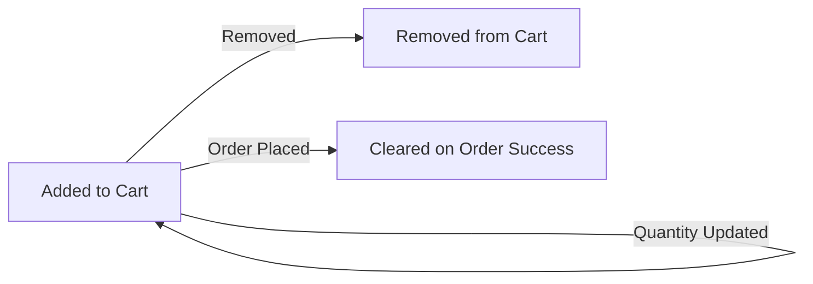
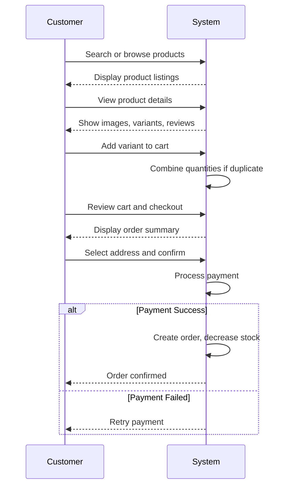
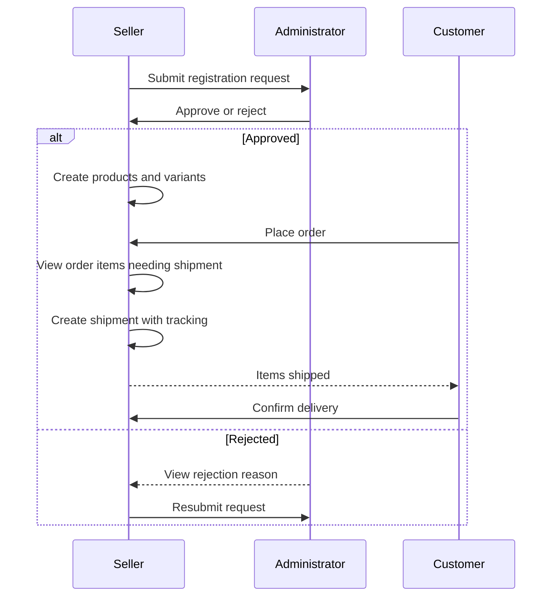
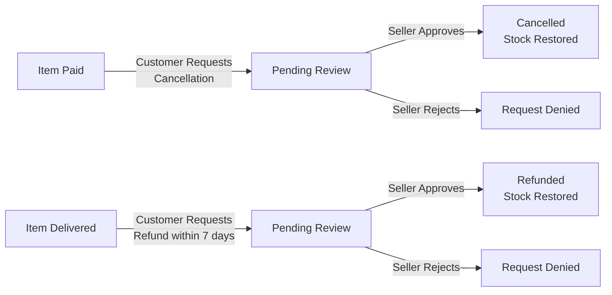
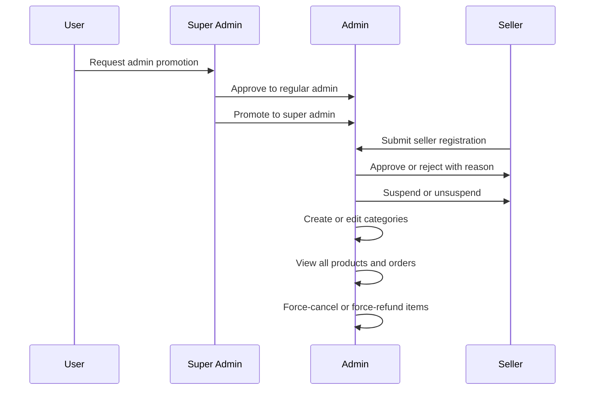
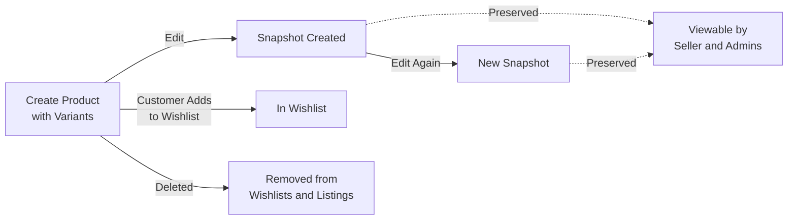

**shoppingMall — What operations users can perform, use cases, business workflows**

What operations users can perform, use cases, business workflows

# Core Business Operations

What the system must do for each business concept.

## Customer Operations

Customers register with email and password to access any platform features, as guest browsing is not supported. Customers log in using their email and password credentials. Customers can change their password through their account settings. Customers can edit their profile information including display name and phone number. Customers can delete their account, which removes their profile information but preserves their orders and order history for seller records and legal purposes. When a customer deletes their account, their reviews are preserved but displayed as from a deleted user. Customers can submit requests to become administrators with a reason text. Customers can view their order history and track their purchases. Customers can manage multiple shipping addresses for their orders.

### Customer Registration and Login

Customers must register with an email address and password to access any platform features. Guest browsing is not supported; all users must have a registered account to view products or use any functionality.

During registration, customers provide their email address and create a password. The email address serves as the unique identifier for the account.

Customers log in using their registered email address and password. Upon successful authentication, customers gain access to the platform features.

If the email or password provided during login does not match the registered credentials, access is denied.

### Password Change Operation

Customers can change their password through their account settings.

To change their password, customers must provide their current password for verification, then specify a new password.

Once the password is successfully changed, the new password is required for all subsequent login attempts. The previous password becomes invalid immediately.

### Profile Information Management

Each customer has a profile containing a display name and phone number.

Customers can edit their display name at any time through their profile settings. Customers can edit their phone number at any time through their profile settings.

Profile changes take effect immediately and are reflected across the platform where the customer's display name or phone number is shown.

### Account Deletion

Customers can delete their account through their account settings.

When a customer deletes their account:
- Their profile information (display name and phone number) is permanently deleted
- Their orders and order history are preserved for seller records and legal purposes
- Their reviews are preserved but displayed as from a "deleted user" instead of their display name

Account deletion is permanent and cannot be undone. After deletion, the customer cannot log in or access any platform features.

Customers cannot delete their account if they have pending orders or pending cancellation/refund requests.

### Administrator Promotion Request

Customers can submit a request to become an administrator.

The request requires the customer to provide a reason text explaining why they should become an administrator.

The request is submitted for review by super administrators. The customer can view the status of their request (pending, approved, or rejected).

If approved, the customer becomes a regular administrator with administrator privileges.

If rejected, the customer can submit a new administrator promotion request.

### Order History Viewing

Customers can view a list of all their orders.

The order history list is paginated and sorted by newest orders first.

Each order in the list displays the order number, order date, total price, and overall order status.

Customers can view the full details of any order, including:
- List of items with product name, variant options, quantity, price, and item status
- Shipping address used for the order
- List of shipments with tracking information for each shipment

Customers can track their purchases through the order history and view the status of each order item.

### Shipping Address Management

Customers can manage multiple shipping addresses as defined in Module 1 > Address Operations.

Customers can add, edit, and delete their shipping addresses. Each address includes recipient name, phone number, street address, city, state/province, postal code, and country.

Customers can set one address as their default shipping address. The default address is used automatically during checkout unless the customer selects a different address.

## Seller Operations

Sellers register with email and password and require administrator approval before they can sell on the platform. Sellers can view their approval status which shows pending, approved, or rejected states. If rejected, sellers can view the rejection reason and submit a new registration request. Sellers log in with email and password and can change their password. Sellers can edit their shop profile including shop name, description, and logo image. Every seller profile edit creates a snapshot to preserve the previous state. Sellers can delete their account only if they have no pending orders in paid or shipped status and no pending cancellation or refund requests. When a seller deletes their account, their products are deleted from listings but order history and snapshots are preserved. The shop name in past orders remains visible even after account deletion. Sellers can view a dashboard summary of their shop performance and order items.

### Seller Registration and Approval

### Seller Registration Submission

WHEN a user submits a seller registration request with email, password, shop name, shop description, and logo image, THE system SHALL create a seller approval request with pending status.

### Administrator Approval Review

WHEN an administrator reviews a pending seller approval request, THE system SHALL allow the administrator to approve or reject the request.

WHEN an administrator rejects a seller approval request, THE system SHALL require the administrator to provide a rejection reason.

### Approval Status Viewing

WHILE a seller has a pending approval request, THE system SHALL allow the seller to view their approval status showing pending, approved, or rejected state.

### Rejection Reason Display

WHEN a seller views a rejected approval request, THE system SHALL display the rejection reason provided by the administrator.

### Seller Resubmission After Rejection

WHEN a seller's approval request is rejected, THE system SHALL allow the seller to submit a new registration request with updated information.

### Selling Restriction for Pending Sellers

IF a seller's approval status is pending or rejected, THEN THE system SHALL prevent the seller from creating products or listing items for sale.

### Seller Authentication

### Seller Login

WHEN a seller provides registered email and password, THE system SHALL authenticate the seller and grant access to seller dashboard and product management features.

IF the provided email or password is incorrect, THEN THE system SHALL reject the login request.

### Password Change Operation

WHEN a logged-in seller requests a password change with current password and new password, THE system SHALL update the seller's password.

IF the current password provided is incorrect, THEN THE system SHALL reject the password change request.

### Shop Profile Management

### Shop Profile Editing

WHEN a seller updates their shop name, THE system SHALL save the new shop name.

WHEN a seller updates their shop description, THE system SHALL save the new shop description.

WHEN a seller updates their logo image, THE system SHALL save the new logo image.

### Profile Snapshot Creation

WHEN a seller edits their shop profile, THE system SHALL create a snapshot that records the change timestamp, the fields that were changed, and the values before and after the modification.

### Snapshot Immutability

WHILE a seller profile snapshot exists, THE system SHALL prevent any modification or deletion of the snapshot.

### Snapshot Viewing

WHEN a seller requests to view their shop profile snapshots, THE system SHALL display all snapshots for reference and dispute resolution.

### Account Deletion

### Pending Order Restriction

IF a seller has any order items in paid or shipped status, THEN THE system SHALL prevent the seller from deleting their account.

### Pending Cancellation Restriction

IF a seller has any pending cancellation requests, THEN THE system SHALL prevent the seller from deleting their account.

### Pending Refund Restriction

IF a seller has any pending refund requests, THEN THE system SHALL prevent the seller from deleting their account.

### Product Deletion on Account Removal

WHEN a seller deletes their account, THE system SHALL delete all their products from listings so they no longer appear in search or category pages.

WHEN a seller deletes their account, THE system SHALL delete all product variants and inventory records associated with the seller.

### Order History Preservation

WHEN a seller deletes their account, THE system SHALL preserve all order history and order item snapshots for legal and record-keeping purposes.

### Shop Name Preservation in Orders

WHEN a seller deletes their account, THE system SHALL preserve the shop name associated with past orders and keep it visible to customers who purchased from that seller.

### Seller Dashboard

### Dashboard Summary Display

WHEN a seller views their dashboard, THE system SHALL display the total number of products the seller has created.

WHEN a seller views their dashboard, THE system SHALL display the total number of order items for the seller's products.

WHEN a seller views their dashboard, THE system SHALL display the number of pending cancellation requests awaiting the seller's response.

WHEN a seller views their dashboard, THE system SHALL display the number of pending refund requests awaiting the seller's response.

### Order Items List Viewing

WHEN a seller requests to view order items, THE system SHALL display a list of all order items for the seller's products.

### Order Items Filtering

WHEN a seller filters the order items list by status, THE system SHALL display only the order items matching the selected status.

## Administrator Operations

Users can submit requests to become administrators with a reason text. Super administrators view pending administrator requests and can approve or reject them. Approved users become regular administrators. Super administrators can promote regular administrators to super administrator and demote other super administrators to regular administrator, but cannot demote themselves. Administrators view pending seller approval requests and can approve or reject them with a required reason for rejections. Administrators can suspend seller accounts, which hides their products from search and category listings and prevents new product creation while allowing them to process existing orders. Administrators can unsuspend seller accounts to restore product visibility. Administrators create and manage categories and subcategories, edit category names and descriptions, and delete categories. Administrators view all products on the platform and can delete any product for policy violations. Administrators view all orders and can force-cancel or force-refund individual items or entire orders. Administrators view all customer and seller accounts and can ban or unban users.

### Administrator Promotion Request Submission

Users can submit requests to become administrators with a reason text. Super administrators view the list of pending administrator promotion requests. Super administrators can approve administrator promotion requests. Super administrators can reject administrator promotion requests. When a super administrator approves a promotion request, the requesting user becomes a regular administrator.

### Administrator Grade Management

Super administrators can promote regular administrators to super administrator. Super administrators can demote other super administrators to regular administrator. Super administrators cannot demote themselves from super administrator to regular administrator.

### Seller Approval Management

Administrators view the list of pending seller approval requests. Administrators can approve seller approval requests. Administrators can reject seller approval requests. When rejecting a seller approval request, administrators must provide a reason text. Rejected sellers can submit a new seller registration request.

### Seller Account Suspension

Administrators can suspend seller accounts. When a seller account is suspended, the seller's products are hidden from search and category listings. When a seller account is suspended, the seller's products cannot be purchased. When a seller account is suspended, the seller can still process existing orders including shipping items and responding to cancellation and refund requests. When a seller account is suspended, the seller cannot create new products. When a seller account is suspended, the seller cannot edit existing products. Administrators can unsuspend seller accounts. When a seller account is unsuspended, the seller's products become visible in search and category listings again.

### Product Oversight and Deletion

Administrators view all products on the platform. Administrators can view snapshots of any product. Administrators can delete any product for policy violations.

### Order Oversight and Intervention

Administrators view all orders on the platform. Administrators can force-cancel individual order items. Administrators can force-cancel entire orders. When an administrator force-cancels an order item or order, the customer is refunded and stock quantities are restored. Administrators can force-refund individual order items. Administrators can force-refund entire orders. When an administrator force-refunds an order item or order, stock quantities are restored.

### User Account Ban Management

Administrators view all customer accounts. Administrators can ban customer accounts. When a customer account is banned, the customer cannot log in. Administrators can unban customer accounts. Administrators view all seller accounts. Administrators can ban seller accounts. When a seller account is banned, the seller cannot log in. When a seller account is banned, existing orders remain intact. Administrators can unban seller accounts.

## Category Operations

Administrators create categories and subcategories with name and description fields. Categories support one level of nesting only, meaning subcategories cannot have their own subcategories. Administrators edit category names and descriptions as needed. Administrators delete categories, and products in deleted categories become uncategorized. Customers browse the list of all categories to navigate the product catalog. Customers view products within a specific category or subcategory. Categories are managed exclusively by administrators, and sellers cannot create or modify categories. When a category is deleted, products remain on the platform but lose their category association. Categories organize products for customer browsing and search filtering.

### Category Creation

### Category Creation

WHEN an administrator creates a category, THE system SHALL require a name and description.

WHEN an administrator creates a subcategory, THE system SHALL require selection of a parent category.

THE system SHALL NOT allow subcategories to have their own subcategories, enforcing one level of nesting only.

IF a non-administrator attempts to create a category, THEN THE system SHALL reject the request.

IF a seller attempts to create or modify a category, THEN THE system SHALL reject the request.

### Category Editing

WHEN an administrator edits a category, THE system SHALL allow modification of the name.

WHEN an administrator edits a category, THE system SHALL allow modification of the description.

IF a non-administrator attempts to edit a category, THEN THE system SHALL reject the request.

IF a seller attempts to edit a category, THEN THE system SHALL reject the request.

### Category Deletion

WHEN an administrator deletes a category, THE system SHALL remove the category from the catalog.

WHEN a category is deleted, THE system SHALL preserve all products that were in that category.

WHEN a category is deleted, THE system SHALL mark products in that category as uncategorized.

UNCATEGORIZED products SHALL remain accessible on the platform.

UNCATEGORIZED products SHALL NOT appear in category browsing.

UNCATEGORIZED products MAY appear in search results.

IF a non-administrator attempts to delete a category, THEN THE system SHALL reject the request.

IF a seller attempts to delete a category, THEN THE system SHALL reject the request.

### Category Browsing

THE system SHALL display a list of all categories to customers.

THE system SHALL display subcategories under their parent categories in the category list.

WHEN a customer views a category, THE system SHALL show all products assigned to that category.

WHEN a customer views a subcategory, THE system SHALL show all products assigned to that subcategory.

WHERE a customer filters search results by category, THE system SHALL show only products in the selected category or its subcategories.

THE system SHALL organize products by categories in the product catalog.

## Product Operations

Sellers create products with required name, description, category selection, and base price. Products belong to the seller who created them and cannot be transferred. Sellers edit their own products, and every edit creates a snapshot preserving all product fields including images. Sellers delete their own products only if there are no pending order items in paid or shipped status for any variant and no pending cancellation or refund requests. Deleting a product also deletes all its variants and inventory records. Deleted products no longer appear in search results or category listings. Sellers view snapshots of their own products to track changes over time. Administrators view snapshots of any product for oversight purposes. Snapshots are preserved even after product deletion for dispute resolution. Products with no variants are visible in search but shown as unavailable to customers.

### Product Creation

### Seller Product Creation

Sellers can create products on the platform. Every product must have a name, a description, a selected category, and a base price. The name and description are required fields. The category selection is required and sellers can select a subcategory if available. The base price is required for all products.

When a product is created, it is automatically associated with the seller who created it. The product belongs to that seller and cannot be transferred to another seller.

Products with no variants are visible in search results and category listings but are shown as unavailable to customers. A product must have at least one variant to be purchasable.

### Product Ownership and Editing

### Product Ownership Rules

Each product belongs to the seller who created it. Only the owning seller can edit or delete their own products. Products cannot be transferred between sellers.

### Product Editing Operation

Sellers can edit their own products. Sellers can change the product name, description, category, and base price. Sellers can also manage product images including uploading new images, reordering images, and deleting images. The first image in the order is displayed as the main thumbnail image.

### Product Snapshot Creation

Every product edit automatically creates a snapshot. The snapshot records when the change was made, what fields were changed, and the values before and after the change. The snapshot includes all product fields: name, description, category, base price, and all images at that moment.

The product snapshot also includes snapshots of all variants that exist at the time of the edit. This preserves the complete state of the product and its variants at any point in time. Snapshots are immutable and cannot be modified or deleted.

### Product Deletion

### Product Deletion Conditions

Sellers can delete their own products only if specific conditions are met. The product cannot be deleted if there are any pending order items in paid or shipped status for any variant of the product. The product cannot be deleted if there are any pending cancellation requests for any variant of the product. The product cannot be deleted if there are any pending refund requests for any variant of the product.

### Cascading Deletion Effects

When a product is deleted, all variants of that product are also deleted. All inventory records associated with the variants are deleted. The product and its variants are permanently removed from the platform.

### Search and Listing Removal

Deleted products no longer appear in search results. Deleted products no longer appear in category listings. Customers cannot view or purchase deleted products. If a deleted product is in a customer's wishlist, it is automatically removed from all wishlists.

### Product Snapshot Viewing

### Seller Product Snapshot Viewing

Sellers can view snapshots of their own products. Sellers can see the history of all changes made to their products. Each snapshot shows when the change was made, what fields were changed, and the values before and after the change.

### Administrator Product Snapshot Viewing

Administrators can view snapshots of any product on the platform. Administrators can access the complete change history of any product for oversight purposes.

### Snapshot Preservation After Deletion

Product snapshots are preserved even after the product is deleted. Snapshots remain accessible to sellers and administrators for dispute resolution. The preserved snapshots include all product field changes and all variant snapshots that existed at the time of each edit.

### Product Availability Display

### Unavailable Product Display

Products that are deleted by sellers are removed from search results and category listings. Products that belong to suspended sellers are hidden from search and category listings. Suspended seller products cannot be purchased.

### Product Without Variants Handling

Products that have no variants are visible in search results and category listings. Products without variants are shown as unavailable to customers. Customers cannot add products without variants to their cart. Products without variants cannot be purchased until at least one variant is added by the seller.

## ProductVariant Operations

Sellers add variants to their products, where each variant represents a specific combination of options like color and size. Each variant has a required unique SKU code, option values, optional price override, and required stock quantity starting at zero. Sellers edit variants including SKU code, option values, and price. Every variant edit creates a snapshot to preserve the previous state. Sellers delete variants only if there are no pending order items in paid or shipped status for that variant and no pending cancellation or refund requests. A product must have at least one variant to be purchasable by customers. Products with no variants remain visible in search but are marked as unavailable. Variants with zero stock are shown as out of stock and cannot be added to cart. Each variant maintains its own independent stock quantity.

### Variant Creation and Structure

Sellers create variants for their products to represent specific combinations of options such as color and size. Each variant requires a unique SKU code that identifies that specific combination. The SKU code must be provided when creating a variant and cannot be empty. Each variant includes option values that define the specific combination, such as color being Red and size being Large. Sellers may optionally set a price for the variant that overrides the product's base price. If no variant price is set, the product's base price applies. Each variant requires a stock quantity that starts at zero. The stock quantity represents how many units of that specific variant are available for purchase. Each variant maintains its own independent stock quantity separate from other variants of the same product. A product can have multiple variants, each with different option combinations and independent stock levels.

### Variant Editing and Snapshots

Sellers can edit their own product variants including the SKU code, option values, and price. When a seller edits a variant, the system automatically creates a snapshot that preserves the previous state of that variant. The snapshot records the SKU code, option values, and price as they were before the edit. The snapshot also records when the change was made. Variant snapshots are included within the product snapshot that is created when the product is edited. This preserves the complete state of all variants at any point in time. Sellers can view snapshots of their own product variants to see the history of changes. Administrators can view snapshots of any product variant on the platform. Variant snapshots are immutable and cannot be deleted or modified after creation.

### Variant Deletion Rules

Sellers can delete their own product variants only when specific conditions are met. A variant cannot be deleted if there are any pending order items for that variant in paid or shipped status. A variant cannot be deleted if there are any pending cancellation requests for that variant. A variant cannot be deleted if there are any pending refund requests for that variant. When a variant is deleted, all inventory records for that variant are also deleted. Deleting a variant does not affect orders that have already been delivered or cancelled. The variant deletion ensures that customers cannot purchase a variant that the seller has removed while protecting existing orders and pending requests.

### Variant Availability and Stock

A product must have at least one variant to be purchasable by customers. Products without any variants remain visible in search results and category listings but are marked as unavailable for purchase. Variants with a stock quantity of zero are displayed as out of stock to customers. Out of stock variants cannot be added to the shopping cart. When customers view a product detail page, all available variants are shown with their prices and stock status. If a variant becomes out of stock while in a customer's cart, it is marked as unavailable in the cart. Customers must select a specific variant when adding a product to their cart, not just the product itself. The independent stock management ensures that each variant's availability is tracked separately, so one variant being out of stock does not affect the availability of other variants of the same product.

## ProductImage Operations

Sellers upload multiple images for each product to showcase their items. Images can be reordered by sellers, with the first image serving as the main thumbnail image displayed in listings. Sellers delete images from their products as needed. All image changes including uploads, reordering, and deletions are included in product snapshots to preserve the complete product state at any point in time. The main thumbnail image appears in search results and category listings. Product detail pages display all images for customer viewing. Image management is part of the overall product editing workflow. When a product snapshot is created, it captures all images associated with the product at that moment.

### Image Upload and Management

Sellers upload multiple images for each product to showcase items from different angles. The image upload workflow allows sellers to select and upload multiple images in a single operation. Sellers manage images only for products they own. Other sellers cannot upload or manage images on products they do not own. Sellers delete images from their products when images are no longer needed or are incorrect. Image deletion removes the image from the product immediately. All image uploads and deletions are performed by the product owner (seller) through the image management interface.

### Image Ordering and Thumbnail Designation

Sellers reorder images for their products to control the display sequence. The image reordering operation allows sellers to change the position of any image in the sequence. The first image in the sequence serves as the main thumbnail image for the product. When sellers reorder images, the new first image automatically becomes the main thumbnail. Sellers change the main thumbnail by moving a different image to the first position through the reordering operation. The thumbnail designation is determined solely by the image position (first position equals thumbnail).

### Image Display in Listings and Product Details

The main thumbnail image (first image) appears in search result listings for the product. The main thumbnail image appears in category page listings for the product. Search result image display shows only the main thumbnail, not all product images. Category listing image display shows only the main thumbnail, not all product images. Customers view all images for a product on the product detail page. The product detail image viewing displays all uploaded images in the order set by the seller. All images are accessible to customers on the product detail page regardless of which image is the main thumbnail. The thumbnail display in listings provides customers with a visual preview of the product before viewing details.

### Image Capture in Product Snapshots

All image changes including uploads, reordering, and deletions are included in product snapshots. When a product snapshot is created, it captures all images associated with the product at that moment. The product snapshot image capture preserves the complete set of images, their order, and which image is the main thumbnail. Image changes in snapshots ensure complete product state preservation at any point in time. Snapshots record the image state for dispute resolution and historical reference. The snapshot preserves the full product state including all images even after the product is deleted. Image capture in snapshots is part of the complete product state preservation requirement.

## InventoryRecord Operations

Each variant maintains its own stock quantity through inventory history records rather than direct snapshots. Each inventory record contains a quantity change which is positive for restocking and negative for orders or adjustments, along with a reason and timestamp. Current stock is calculated by summing all inventory records for a variant. Sellers add inventory through restocking with a quantity and reason. Sellers subtract inventory through adjustments or loss recording with a quantity and reason. Order placement automatically creates a negative inventory record for each purchased variant. Order cancellation or refund automatically creates a positive inventory record to restore stock. Sellers view the full inventory history of each variant to track stock changes over time. When stock reaches zero, the variant is shown as out of stock and cannot be added to cart. Inventory records are immutable historical records of stock movements.

### Inventory History Viewing

WHEN a seller requests the inventory history of a variant, THE SYSTEM SHALL display all inventory records for that variant in chronological order. THE SYSTEM SHALL show each inventory record with the quantity change amount, the reason for the change, and the timestamp recording when the change was made. THE SYSTEM SHALL prevent modification or deletion of inventory records once created, ensuring immutable inventory records for audit purposes. SELLERS SHALL access inventory history viewing from the variant management interface to track stock movements and reconcile inventory discrepancies.

### Stock Quantity Calculation and Display

THE SYSTEM SHALL perform current stock calculation by computing the sum of inventory records for each variant, adding positive entries and subtracting negative entries. WHEN the current stock calculation reaches zero, THE SYSTEM SHALL apply the out of stock threshold and mark the variant as unavailable. THE SYSTEM SHALL enforce zero stock display by showing the variant as out of stock in product listings and product detail pages. THE SYSTEM SHALL enforce cart addition prevention by blocking customers from adding out of stock variants to their shopping cart. WHEN a customer attempts to add an out of stock variant, THE SYSTEM SHALL display a notification that the item is unavailable.

### Seller Restocking Operations

WHEN a seller performs a seller restocking operation, THE SYSTEM SHALL require the seller to specify the quantity to add and provide a reason for the restock. THE SYSTEM SHALL create positive restocking entries that increase the variant's stock quantity by the specified amount. THE SYSTEM SHALL record the quantity change as a positive value, the reason provided by the seller, and the timestamp of the restocking operation. SELLERS SHALL use restocking to replenish inventory after sales or to add initial stock for new variants.

### Order-Related Stock Changes

WHEN a customer places an order successfully, THE SYSTEM SHALL automatically create negative order entries for each purchased variant. THE SYSTEM SHALL perform order placement stock decrease immediately upon payment confirmation, creating inventory records with negative quantity changes equal to the purchased quantities. WHEN an order item is cancelled, THE SYSTEM SHALL automatically perform cancellation stock restoration by creating a positive inventory record to restore the stock quantity for that variant. WHEN an order item is refunded, THE SYSTEM SHALL automatically perform refund stock restoration by creating a positive inventory record to return the stock quantity for that variant. THE SYSTEM SHALL include the order, cancellation, or refund reference as the reason and record the timestamp for each stock change.

### Inventory Adjustment Operations

WHEN a seller performs a seller inventory adjustment operation, THE SYSTEM SHALL require the seller to specify the quantity to subtract and provide an adjustment reason recording the cause of the adjustment. THE SYSTEM SHALL create negative inventory entries for adjustments and losses. SELLERS SHALL use inventory adjustment for reasons such as damaged goods, lost items, inventory count corrections, or promotional giveaways. THE SYSTEM SHALL record the quantity change, the adjustment reason provided, and the timestamp of the adjustment operation.

## Address Operations

Customers add multiple shipping addresses to their account for order delivery. Each address contains recipient name, phone number, street address, city, state or province, postal code, and country. Customers edit their existing addresses to update delivery information. Customers delete addresses they no longer need. Customers set one address as their default shipping address for convenient checkout. During checkout, customers select a shipping address from their saved addresses or use their default. Once an order is placed, the shipping address cannot be changed and is preserved as a snapshot with the order. Address management allows customers to maintain multiple delivery locations for different purposes.

### Address Creation

Customers can add multiple shipping addresses to their account. Each address requires the following information: recipient name, phone number, street address, city, state or province, postal code, and country. All fields must be provided when creating a new address. Customers can create as many addresses as needed for different delivery locations. Each newly created address is saved to the customer's account and available for future orders.

### Address Editing

Customers can edit any of their saved addresses to update delivery information. When editing an address, customers can modify the recipient name, phone number, street address, city, state or province, postal code, or country. All edited address information is saved immediately and replaces the previous values. Edited addresses are available for selection in future checkouts.

### Address Deletion

Customers can delete addresses they no longer need from their saved address list. When deleting an address, the address is permanently removed from the customer's account. If the deleted address was set as the default shipping address, the customer must select a new default address from their remaining saved addresses. Deleted addresses cannot be recovered.

### Default Address Management

Customers can set one of their saved addresses as the default shipping address. Only one address can be designated as the default at any time. When a customer sets a new default address, the previous default designation is automatically removed. The default address is used automatically during checkout unless the customer selects a different saved address. Customers can change their default address at any time by selecting a different saved address as the default.

### Checkout Address Selection

During checkout, customers select a shipping address from their saved addresses or use their default shipping address. The selected address is displayed in the order summary for customer review before order placement. Once the order is placed, the shipping address is preserved as a snapshot with the order and cannot be changed. The address snapshot ensures the delivery information remains fixed for order fulfillment and record-keeping purposes. If a customer deletes or edits an address after placing an order, the order's preserved address snapshot remains unchanged.

## WishlistItem Operations

Customers add products to their wishlist to track items of interest for future purchase. The wishlist operates at the product level, not at the variant level. Customers view their wishlist which is paginated for performance. Customers remove products from their wishlist when they no longer wish to track them. If a product is deleted by the seller, it is automatically removed from all customer wishlists. Wishlist items show product information to help customers remember items they are interested in. The wishlist helps customers organize products they may want to purchase later. Wishlist viewing supports pagination to handle large numbers of saved items.

### Product Wishlist Addition

Customers can add products to their wishlist to track items of interest for future purchase planning. The wishlist operates at the product level, not at the variant level. When adding a product to the wishlist, customers do not select a specific variant. Each product can only appear once in a customer's wishlist. If a customer attempts to add a product that is already in their wishlist, the request is rejected. The wishlist helps customers organize products they may want to purchase later by maintaining a saved product list of items they are interested in.

### Wishlist Viewing and Pagination

Customers can view their wishlist which displays all products they have saved. The wishlist viewing operation shows product information including the main image, product name, base price, and seller shop name to help customers remember items they are interested in. Wishlist viewing supports pagination to handle large numbers of saved items and ensure performance. The paginated wishlist allows customers to browse through their saved product list in manageable pages. Each wishlist item shows the product's current availability status.

### Wishlist Removal and Management

Customers can remove products from their wishlist when they no longer wish to track them for future purchase. The wishlist removal operation allows customers to delete individual items from their saved product list. Customers can manage their product interest management by organizing their wishlist through removal of items they have purchased or are no longer interested in. The wishlist serves as a tool for product interest management, allowing customers to curate their list of items they plan to purchase in the future.

### Automatic Removal on Product Deletion

If a product is deleted by the seller, it is automatically removed from all customer wishlists. The seller product deletion impact ensures that wishlists do not contain references to products that no longer exist on the platform. When a seller deletes a product, the automatic removal on product deletion process executes for all customers who have that product in their wishlist. This maintains wishlist item tracking integrity by ensuring the saved product list only contains active products available on the platform.

## Cart Operations

Customers maintain a shopping cart for items they intend to purchase. The cart belongs to a specific customer and tracks items added for checkout. Customers view their cart to see all items with prices and quantities. The cart calculates and displays the total price of all items combined. If a variant is deleted by the seller or goes out of stock, it is marked as unavailable in the cart. Unavailable items cannot be proceeded to checkout. Customers remove unavailable items from their cart before checkout. The cart persists across sessions for the logged-in customer. Cart operations support the checkout workflow by aggregating items for order creation.

### Customer Cart Management

Each logged-in customer has exactly one shopping cart that belongs to them.
The cart persists across sessions for the logged-in customer.
Only the customer who owns the cart can access and manage their cart.
Guests cannot access cart functionality as registration is required to use any features.
The cart tracks items the customer intends to purchase and supports the checkout workflow.
Cart operations aggregate items for order creation during checkout.

### Cart Viewing and Price Display

Customers can view their cart to see all items they have added.
Each cart item displays the product name, variant options, price, quantity, and subtotal.
The cart calculates and displays the total price of all items combined.
Prices are shown for each individual item and as a combined total for the entire cart.
Customers can review all cart contents before proceeding to checkout.

### Unavailable Item Handling

If a variant is deleted by the seller, it is marked as unavailable in the customer's cart.
If a variant's stock quantity reaches zero, it is marked as unavailable in the cart.
Unavailable items display a warning indicator to inform the customer.
Customers cannot proceed to checkout with unavailable items in their cart.
Customers must remove unavailable items from their cart before checkout.
The system automatically marks variants as unavailable when they are deleted or out of stock.

### Cart Item Removal

Customers can remove items from their cart at any time.
Customers can remove unavailable items from their cart.
Removing an item permanently deletes it from the customer's cart.
Customers must remove unavailable items before they can proceed to checkout.

### Checkout Preparation

Customers can proceed to checkout from their cart when all items are available.
Only available items can be included in the checkout process.
The cart aggregates all items for order creation when the customer places an order.
When an order is placed successfully, all items are removed from the customer's cart.
Unavailable items block the checkout process until they are removed from the cart.

## CartItem Operations

Customers add specific variants to their cart, not just products, requiring selection of a specific variant combination. When adding to cart, customers specify the quantity they wish to purchase. If the same variant is already in the cart, the quantities are combined into a single line item rather than creating duplicate entries. Customers change the quantity of items in their cart to adjust their order. Customers remove items from their cart when they decide not to purchase them. The cart displays each item with product name, variant options, price, quantity, and subtotal. If a variant stock is less than the cart quantity, a warning is shown to the customer. Cart items are removed from the cart when an order is successfully placed.

### Add Variant to Cart

WHEN a customer adds a variant to cart, THE system SHALL create a cart item with the specified quantity. The customer shall select a specific variant combination and specify the quantity on add. IF the same variant already exists in the cart, THEN THE system SHALL combine the new quantity with the existing quantity into a single line item. THE system SHALL NOT create duplicate entries for the same variant. THE system SHALL enforce single line item per variant.

### Update Cart Item Quantity

THE system SHALL allow customers to change the quantity of any cart item. WHEN a customer updates the quantity, THE system SHALL replace the existing quantity with the new value. Customers can increase or decrease the quantity. IF the new quantity exceeds available stock, THEN THE system SHALL show a stock quantity warning to the customer.

### Remove Cart Item

THE system SHALL allow customers to remove items from their cart. WHEN a customer removes a cart item, THE system SHALL delete it from the cart entirely. Customers can remove any item from their cart at any time before order placement.

### Display Cart Item Details

THE system SHALL display each cart item with the following information: product name, variant options, item price, item quantity, and item subtotal. THE item subtotal SHALL be calculated by multiplying the item price by the item quantity. THE system SHALL show the total price of all items in the cart. IF a variant stock is less than the cart quantity, THEN THE system SHALL show an insufficient stock notification. IF a variant is deleted or out of stock, THEN THE system SHALL mark the item as unavailable.

### Clear Cart on Order Success

WHEN an order is successfully placed, THE system SHALL remove all items from the customer cart. THE cart SHALL be cleared automatically after order creation. Items SHALL only be removed when the order placement succeeds, not when payment fails.

### Cart Item Lifecycle

The cart item flows through the following states:

## Order Operations

Orders are created when customers successfully complete checkout and payment. Each order receives a unique order number for identification and tracking. Orders contain one or more order items representing purchased product variants. Orders store a snapshot of the shipping address at the time of purchase which cannot be changed. Customers view a list of all their orders which is paginated and sorted by newest first. Each order in the list shows order number, date, total price, and overall order status. Customers view full order details including items, shipping address, and shipments with tracking information. Order status is derived from the statuses of its individual items. Orders cannot be deleted by customers or sellers once created. Administrators can view all orders on the platform for oversight purposes.

### Order Creation

WHEN a customer successfully completes payment during checkout, THE system SHALL create an order.
THE system SHALL generate a unique order number for each order.
THE order SHALL contain one or more order items representing the purchased product variants.
THE system SHALL capture a snapshot of the customer's selected shipping address at the time of order creation.
THE shipping address snapshot SHALL be stored with the order and SHALL NOT be modifiable after order creation.
WHEN an order is created, THE system SHALL decrease stock quantities for each purchased variant.
WHEN an order is created, THE system SHALL remove the purchased items from the customer's shopping cart.
THE system SHALL save a snapshot of each purchased product with the order item.
THE system SHALL save a snapshot of each seller's profile with the order item.
IF payment fails, THEN THE system SHALL NOT create the order.

### Order History and Listing

CUSTOMERS SHALL view a list of all their orders.
THE order list SHALL display orders sorted by newest first.
THE order list SHALL be paginated.
EACH order in the list SHALL display the order number.
EACH order in the list SHALL display the order date.
EACH order in the list SHALL display the total price.
EACH order in the list SHALL display the overall order status.
THE overall order status SHALL be derived from the statuses of the order's individual items.
CUSTOMERS SHALL navigate through pages of their order history.
THE system SHALL maintain the complete order history for each customer indefinitely.

### Order Detail Viewing

CUSTOMERS SHALL view the full details of any of their orders.
THE order detail page SHALL display the list of order items.
EACH order item SHALL show the product name, variant options, quantity, price, and item status.
THE order detail page SHALL display the shipping address used for the order.
THE order detail page SHALL display the list of shipments associated with the order.
EACH shipment SHALL show the tracking number and carrier name.
EACH shipment SHALL indicate which order items are included.
CUSTOMERS SHALL view tracking information for each shipment.
SELLERS SHALL view order items for their products that need shipping.
ADMINISTRATORS SHALL view all orders on the platform.
ADMINISTRATORS SHALL view the full details of any order on the platform.

### Order Status Derivation

THE overall order status SHALL be derived from the statuses of its individual order items.
IF all items in an order have status paid, THEN THE order status SHALL be paid.
IF any item in an order has status shipped and no items are delivered, THEN THE order status SHALL be shipped.
IF all items in an order have status delivered, THEN THE order status SHALL be delivered.
IF all items in an order have status cancelled, THEN THE order status SHALL be cancelled.
IF all items in an order have status refunded, THEN THE order status SHALL be refunded.
IF an order has items in mixed states, THEN THE order status SHALL be partially completed.
THE system SHALL automatically update the overall order status WHEN any item status changes.

### Order Deletion and Oversight

ORDERS SHALL NOT be deleted by customers once created.
ORDERS SHALL NOT be deleted by sellers once created.
ORDERS SHALL be preserved in the system for record-keeping purposes.
ADMINISTRATORS SHALL have oversight capabilities for all orders on the platform.
ADMINISTRATORS SHALL view all orders across all customers and sellers.
ADMINISTRATORS SHALL force-cancel individual order items.
ADMINISTRATORS SHALL force-cancel entire orders.
WHEN administrators force-cancel an order or item, THE system SHALL refund the customer.
WHEN administrators force-cancel an order or item, THE system SHALL restore the stock quantities.
ADMINISTRATORS SHALL force-refund individual order items.
ADMINISTRATORS SHALL force-refund entire orders.

## OrderItem Operations

Each order item represents a purchased product variant with a specific quantity. If a customer buys multiple units of the same variant, it becomes one order item with the combined quantity. Order items can be from different sellers within the same order. Each order item has its own independent status which progresses through paid, shipped, delivered, cancelled, or refunded states. Order items can be individually cancelled or refunded without affecting other items in the order. When an order item is created, a snapshot of the product and variant is saved preserving name, description, variant options, and price at purchase time. A snapshot of the seller profile is also saved preserving shop name and logo. Order item status changes trigger inventory adjustments and notification workflows.

### Order Item Creation and Snapshot Preservation

When an order is placed successfully, order items are created for each purchased product variant. If a customer purchases multiple units of the same variant, a single order item is created with the combined quantity rather than separate items. Order items within the same order can be from different sellers, with each item linked to its respective seller.

At the time of order creation, the system preserves the complete purchase-time state through snapshots. A snapshot of the product is saved, capturing the name, description, category, and base price as they existed at purchase. A snapshot of the product variant is saved, capturing the SKU code, option values, and price at purchase. A snapshot of the seller profile is saved, capturing the shop name and logo as they existed at purchase.

These snapshots ensure that historical order records accurately reflect what the customer purchased, even if the product, variant, or seller profile is modified or deleted after the order is placed.

### Order Item Status Lifecycle

Each order item maintains an independent status that progresses through five states: paid, shipped, delivered, cancelled, and refunded. The status of one order item does not affect the status of other items in the same order.

The paid status indicates that payment is complete and the item is waiting for the seller to ship. The shipped status indicates that the seller has dispatched the item and provided tracking information. The delivered status indicates that the item has been received by the customer, either through customer confirmation or automatic confirmation after 14 days from shipping.

The cancelled status indicates that the item was cancelled before shipment and the customer will receive a refund. The refunded status indicates that the item was refunded after delivery due to a successful refund request.

The overall order status is derived from the statuses of its individual items, but each item continues to be processed independently through its own lifecycle.

### Individual Order Item Cancellation

Customers can request cancellation for individual order items that are in paid status. Order items that have progressed to shipped status or beyond cannot be cancelled through the customer cancellation request process.

When requesting cancellation, the customer must provide a reason explaining why they wish to cancel the item. The seller responsible for that order item can approve or reject the cancellation request. When the seller responds to the request, a snapshot of the cancellation request state is created, recording the reason and status at that moment.

If the cancellation is approved, the order item status changes to cancelled and a refund is processed for that item only. The remaining items in the order continue processing normally without interruption. If all items in an order are cancelled, the entire order status becomes cancelled.

### Individual Order Item Refund

Customers can request a refund for individual order items that are in delivered status. Refund requests can only be submitted within 7 days of the item being delivered. Order items that have not yet been delivered are not eligible for the refund request process.

When requesting a refund, the customer must provide a reason explaining why they are requesting the refund. The seller responsible for that order item can approve or reject the refund request. When the seller responds to the request, a snapshot of the refund request state is created, recording the reason and status at that moment.

If the refund is approved, the order item status changes to refunded. The remaining items in the order are unaffected and continue with their normal processing. If all items in an order are refunded, the entire order status becomes refunded.

### Inventory Adjustments on Status Change

Stock quantities are automatically adjusted when order item status changes occur. When an order is initially placed, the stock quantity for each purchased variant is decreased through a negative inventory record.

When an order item is cancelled, the stock quantity for that variant is automatically restored through a positive inventory record. This ensures that cancelled items return to available inventory for other customers to purchase.

When an order item is refunded, the stock quantity for that variant is automatically restored through a positive inventory record. This ensures that refunded items return to available inventory.

All inventory adjustments are recorded in the inventory history with the quantity change, reason for the adjustment, and timestamp. The current stock quantity is calculated by summing all inventory records for each variant.

## Shipment Operations

A shipment is a package sent by a seller containing one or more order items from that seller. Different sellers always ship separately resulting in different shipments. A seller can choose to ship items individually or bundle multiple items into one shipment. Sellers create shipments by selecting one or more of their order items to include. Sellers enter tracking information for the shipment including carrier name and tracking number. All items in the same shipment share the same tracking information. When a shipment is created, all items in it change to shipped status. Customers view tracking information for each shipment in their order. Customers confirm delivery per shipment, not per individual item. When the customer confirms delivery, all items in that shipment change to delivered status. If the customer does not confirm, items automatically change to delivered after 14 days from shipping.

### Shipment Creation by Sellers

Sellers can create shipments for their order items that have paid status. A shipment can contain one or more order items from the same seller only. Different sellers always ship separately, resulting in different shipments. Sellers can choose to ship items individually by creating separate shipments for each item, or bundle multiple items into one shipment. When creating a shipment, sellers enter tracking information including the carrier name and tracking number. All items included in the same shipment share the same tracking information. When a shipment is created, all order items included in that shipment automatically change to shipped status. Sellers can view and manage all shipments for their order items.

### Customer Shipment Tracking

Customers can view tracking information for each shipment in their orders. The tracking information displays the carrier name and tracking number for the shipment. Customers access shipment tracking details from their order history page. Each shipment's tracking information is visible to the customer who placed the order containing that shipment.

### Delivery Confirmation

Customers confirm delivery per shipment, not per individual item. When a customer confirms delivery for a shipment, all order items in that shipment automatically change to delivered status. If the customer does not manually confirm delivery, all items in the shipment automatically change to delivered status after 14 days from the shipping date. The delivery status update applies to all items within the shipment simultaneously.

## CancellationRequest Operations

Cancellation is handled per order item, not per entire order. Customers can request cancellation for individual items with paid status that have not yet been shipped. Cancellation requests include a reason text explaining why the customer wants to cancel. The seller of that item can approve or reject the cancellation request. When a seller responds, a snapshot of the request state is created to preserve the history. If approved, that item is cancelled and a refund is processed for that item only. Cancelled items restore their stock quantities through an inventory record. The remaining items in the order continue processing normally without interruption. If all items in an order are cancelled, the entire order status becomes cancelled. Cancellation requests cannot be made for items already shipped or delivered.

### Cancellation Request Creation

Customers can request cancellation for individual order items that have paid status and have not yet been shipped. Cancellation requests cannot be made for items with shipped or delivered status. Each cancellation request must include a reason text explaining why the customer wants to cancel the item. The system validates that the item is eligible for cancellation before accepting the request. If the item status is not paid, the cancellation request is rejected. When a cancellation request is submitted, it is associated with the specific order item and the customer who placed the order.

### Seller Review and Decision

Sellers can view cancellation requests for order items belonging to their products. Sellers can approve or reject each cancellation request. When a seller responds to a cancellation request, a snapshot of the request state is created to preserve the history of the decision. The snapshot records the reason provided by the customer and the status change resulting from the seller's decision. Sellers must respond to cancellation requests to allow the order processing to continue. If a seller approves the cancellation, the item proceeds to cancellation. If a seller rejects the cancellation, the item continues processing toward shipment.

### Cancellation Processing

When a cancellation request is approved, the corresponding order item status changes to cancelled. A refund is processed for the cancelled item only, without affecting other items in the same order. The stock quantity for the cancelled item's variant is restored through an inventory record with a positive quantity change. The inventory record includes a reason indicating the stock restoration is due to cancellation. The refund processing and stock restoration occur automatically upon seller approval of the cancellation request.

### Order Status Updates

When an item in an order is cancelled, the remaining items in the order continue processing normally without interruption. The order status is updated based on the statuses of all items in the order. If all items in an order are cancelled, the entire order status becomes cancelled. If some items are cancelled while others remain in paid, shipped, or delivered status, the order reflects a partially completed state. The order status derivation ensures customers can see the overall progress of their order even when individual items have different statuses.

### Cancellation Request Viewing and History

Customers can view their cancellation requests and see the current status of each request. Customers can view the history of status changes for their cancellation requests. Sellers can view cancellation requests for their order items and see the history of their responses. The snapshot history allows both customers and sellers to track when the request was made, when the seller responded, and what decision was made. Cancellation request snapshots are immutable and preserve the complete history for dispute resolution purposes.

## RefundRequest Operations

Refund is handled per order item, not per entire order. Customers can request a refund for individual items with delivered status. Refund requests can only be made within 7 days of that item being delivered. Refund requests include a reason text explaining why the customer wants a refund. The seller of that item can approve or reject the refund request. When a seller responds, a snapshot of the request state is created to preserve the history. If approved, that item is refunded and the customer receives their money back. Refunded items restore their stock quantities through an inventory record. The remaining items in the order are unaffected by the refund. If all items in an order are refunded, the entire order status becomes refunded. Refund requests cannot be made for items that are not yet delivered or past the 7-day window.

### Refund Request Creation

### Per-Item Refund Request

THE system SHALL allow customers to request a refund for individual order items.

### Delivered Status Eligibility

WHEN an order item has delivered status, THE system SHALL allow the customer to request a refund for that item.

IF an order item does not have delivered status, THEN THE system SHALL reject the refund request.

### Seven-Day Refund Window

THE system SHALL allow refund requests only within 7 days of the item being delivered.

### Refund Deadline Enforcement

IF the refund request is submitted after the 7-day window has expired, THEN THE system SHALL reject the request.

### Refund Reason Requirement

THE system SHALL require a reason text for every refund request.

IF the refund reason is empty or missing, THEN THE system SHALL reject the refund request.

### Seller Refund Review

### Seller Approval Workflow

THE system SHALL allow the seller of an order item to view pending refund requests for their products.

WHEN a seller reviews a refund request, THE system SHALL allow the seller to approve or reject the request.

### Seller Rejection Capability

THE system SHALL allow sellers to reject refund requests.

### Request State Snapshot

WHEN a seller responds to a refund request, THE system SHALL create a snapshot of the request state.

THE snapshot SHALL record the reason and status at the time of the seller's response.

THE snapshot SHALL be immutable and cannot be deleted.

THE system SHALL allow sellers to view the history of their responses to refund requests.

### Refund Execution

### Item Refund on Approval

WHEN a seller approves a refund request, THE system SHALL change the order item status to refunded.

THE system SHALL process a refund to the customer for the refunded item.

### Stock Restoration on Refund

WHEN an item is refunded, THE system SHALL restore the stock quantity through an inventory record.

### Remaining Order Unaffected

THE system SHALL keep the remaining items in the order unaffected by the refund.

THE remaining items SHALL continue processing normally.

### All-Items-Refunded Order Status

WHEN all items in an order are refunded, THE system SHALL change the entire order status to refunded.

### Refund Request Viewing and History

### Refund Request Viewing

THE system SHALL allow customers to view their refund requests and their current status.

THE system SHALL allow sellers to view refund requests for their order items.

### Refund History Tracking

THE system SHALL allow customers to view the history of all refund requests they have submitted.

THE refund request history SHALL show when each request was submitted, the reason, and the current status.

### Refund Window Expiration

WHEN the 7-day refund window expires, THE system SHALL prevent customers from submitting refund requests for that item.

THE system SHALL indicate to customers when refund eligibility has expired.

## Review Operations

Customers can write a review for products they have purchased. A review can only be written after that item status is delivered. Customers can write one review per product per order. Each review has a required rating from 1 to 5 stars and optional text content. Reviews are displayed on the product detail page for other customers to view. Reviews are sorted by newest first to show recent feedback. Customers can edit their own reviews to update their rating or text content. Every review edit creates a snapshot to preserve the previous state. Customers can delete their own reviews but the snapshots are preserved for historical record. The product average rating is calculated from all non-deleted reviews. Deleted reviews no longer contribute to the average rating calculation.

### Review Creation

Customers can create a review for a product only after the order item status is delivered. The delivered status requirement ensures customers have received the product before providing feedback. Customers can write one review per product per order, preventing duplicate reviews for the same purchase. Each review must include a rating on a star rating scale from 1 to 5 stars. The rating requirement makes the star rating mandatory for all reviews. Each review may include optional text content allowing customers to provide detailed feedback or leave a rating-only review. If the order item is not in delivered status, the review creation request is rejected. If the customer already has a review for that product in that order, the request is rejected.

### Review Display and Browsing

Reviews are displayed on the product detail page for all customers to view. The product detail page display shows all non-deleted reviews for that product. Reviews are sorted by newest first to show the most recent customer feedback at the top. This newest first sorting helps customers see current opinions about the product. Deleted reviews are not shown on the product detail page but their snapshots remain preserved in the system.

### Review Editing

Customers can edit their own reviews to update the rating or text content. The review editing operation allows customers to correct mistakes or change their opinion. Every review edit creates a review snapshot that preserves the previous state including the rating and text content before the change. The review snapshot creation ensures a complete history of all changes is maintained for dispute resolution. Only the customer who created the review can edit it. If a customer attempts to edit another customer's review, the request is rejected.

### Review Deletion

Customers can delete their own reviews from the product detail page. The review deletion operation removes the review from public view and stops it from contributing to the average rating. Review snapshots are preserved on deletion, maintaining a complete historical record even after the review is deleted. The snapshot preservation on deletion ensures the platform maintains an audit trail of all review activity. Only the customer who created the review can delete it. If a customer attempts to delete another customer's review, the request is rejected.

### Average Rating Calculation

The product average rating is calculated from all non-deleted reviews for that product. The average rating calculation includes only reviews that have not been deleted by their authors. Non-deleted review inclusion means every active review contributes equally to the average. Deleted review exclusion from rating ensures that removed reviews do not affect the displayed average. The average is displayed on the product detail page and product listing pages to help customers evaluate products.

## SellerApprovalRequest Operations

Sellers submit registration requests that require administrator approval before they can sell on the platform. The request includes the shop name and initial status. Sellers can view their approval status which shows pending, approved, or rejected states. If rejected, sellers can view the rejection reason provided by the administrator. Rejected sellers can submit a new registration request to try again. Administrators view the list of pending seller approval requests. Administrators approve or reject seller registrations. When rejecting, administrators must provide a reason that the seller can view. Approved sellers gain the ability to create and manage products on the platform. The approval workflow ensures only qualified sellers can operate on the marketplace.

### Seller Registration Request Submission

Sellers can submit a registration request to become a seller on the platform. The registration request includes the shop name. Upon submission, the request enters a pending status awaiting administrator review. Sellers cannot create products or sell on the platform until their registration request is approved. The registration request is associated with the seller's account. Sellers can only have one active registration request at a time. If a seller already has a pending request, they cannot submit another request until the current one is resolved.

### Approval Status Viewing

Sellers can view their approval status at any time. The approval status shows one of three states: pending, approved, or rejected. When the status is pending, the seller's request is awaiting administrator review. When the status is approved, the seller gains the ability to create and manage products on the platform. When the status is rejected, the seller cannot sell on the platform and can view the rejection reason provided by the administrator. The approval status is visible on the seller's dashboard. Sellers receive their approval status immediately upon logging in if a decision has been made on their request.

### Rejection Handling and Resubmission

When a seller's registration request is rejected, the seller can view the rejection reason provided by the administrator. The rejection reason explains why the registration was not approved. Rejected sellers can submit a new registration request to try again. When submitting a new request after rejection, the seller can provide an updated shop name. The new registration request enters pending status and goes through the administrator approval workflow again. There is no limit on the number of times a rejected seller can resubmit a registration request. Each resubmission creates a new registration request record with its own approval workflow.

### Administrator Request Management

Administrators can view the list of all pending seller registration requests. The list shows each request with the shop name and submission date. Administrators can approve seller registration requests. When a request is approved, the seller gains selling capability on the platform and can create and manage products. Administrators can reject seller registration requests. When rejecting a request, administrators must provide a rejection reason that the seller can view. The rejection reason is required and cannot be empty. Administrators can view the history of all seller approval decisions they have made. The approval workflow ensures only qualified sellers can operate on the marketplace. Administrators process requests in the order they are received, though they may prioritize based on business needs.

## AdminPromotionRequest Operations

Any user whether customer or seller can submit a request to become an administrator. The request includes a reason text explaining why the user wants to become an administrator. Super administrators view the list of pending administrator promotion requests. Super administrators can approve or reject promotion requests. When approved, the user becomes a regular administrator with platform management capabilities. Regular administrators can perform seller management, category management, product oversight, order oversight, and user management. Super administrators have additional capabilities including promoting and demoting other administrators. The promotion request workflow controls access to administrative functions on the platform.

### Administrator Promotion Request Submission

### Customer and Seller Promotion Request Submission

THE system SHALL allow any customer or seller to submit an administrator promotion request. THE system SHALL require a reason text explaining why the user wants to become an administrator. THE reason text SHALL NOT be empty. THE system SHALL record the submission timestamp for each promotion request. THE system SHALL associate the promotion request with the submitting user account. THE system SHALL prevent a user from submitting multiple pending promotion requests simultaneously. IF a previous request is pending, THEN THE system SHALL reject submission of a new request. THE user SHALL be able to view the status of their own promotion request. THE user SHALL be able to view whether their request is pending, approved, or rejected.

### Super Administrator Request Review

### Pending Request List and Review

THE system SHALL allow super administrators to view the list of all pending administrator promotion requests. THE pending request list SHALL display the submitting user information and the reason text for each request. THE system SHALL display the submission date alongside each pending request. THE system SHALL organize pending requests by submission date with newest first. THE super administrator SHALL be able to filter or search the pending request list. THE super administrator SHALL be able to access the review interface for any pending request. THE review interface SHALL display the complete request information including user details and reason text.

### Promotion Approval and Rejection

### Approval and Rejection Operations

THE super administrator SHALL be able to approve administrator promotion requests. WHEN a super administrator approves a request, THE system SHALL assign the user as a regular administrator. THE approved user SHALL immediately gain regular administrator capabilities. THE super administrator SHALL be able to reject administrator promotion requests. WHEN a super administrator rejects a request, THE system SHALL record the rejection. THE rejected user SHALL remain in their current role as customer or seller. THE system SHALL notify the user of the approval or rejection decision. THE user SHALL be able to view the outcome of their promotion request. A rejected user SHALL be able to submit a new administrator promotion request. THE system SHALL allow resubmission after rejection without restriction.

### Administrator Capability Assignment

### Platform Management Capabilities

WHEN a user becomes a regular administrator, THE system SHALL grant platform management capabilities. THE regular administrator SHALL have access to seller management functions. THE regular administrator SHALL be able to approve or reject seller registration requests. THE regular administrator SHALL be able to suspend or unsuspend seller accounts. THE regular administrator SHALL have access to category management functions. THE regular administrator SHALL be able to create, edit, and delete categories and subcategories. THE regular administrator SHALL have access to product oversight functions. THE regular administrator SHALL be able to view all products on the platform. THE regular administrator SHALL be able to view snapshots of any product. THE regular administrator SHALL be able to delete products for policy violations. THE regular administrator SHALL have access to order oversight functions. THE regular administrator SHALL be able to view all orders on the platform. THE regular administrator SHALL be able to force-cancel order items or entire orders. THE regular administrator SHALL be able to force-refund order items or entire orders. THE regular administrator SHALL have access to user management functions. THE regular administrator SHALL be able to view all customer accounts. THE regular administrator SHALL be able to ban or unban customer accounts. THE regular administrator SHALL be able to view all seller accounts. THE regular administrator SHALL be able to ban seller accounts.

## ProductSnapshot Operations

Product snapshots are automatically created whenever a product is edited to preserve the previous state. Each product snapshot includes all product fields including name, description, category, base price, and images at the time of the snapshot. The product snapshot also includes snapshots of all variants at that moment creating a complete product state record. Snapshots record when the change was made, what was changed, and the values before and after. Snapshots are immutable and cannot be deleted or modified. Sellers can view snapshots of their own products to track changes over time. Administrators can view snapshots of any product for oversight and dispute resolution. Snapshots are preserved even after product deletion for historical reference. The snapshot system ensures complete audit trails for all product modifications.

### Automatic Snapshot Creation on Product Edit

When a seller edits any field of their product, the system shall automatically create a product snapshot before applying the changes. The snapshot creation is triggered by any modification to the product including name, description, category, base price, or images. The system shall create the snapshot without requiring any manual action from the seller. Each product edit operation results in exactly one snapshot being created. The snapshot preserves the complete state of the product at the moment before the edit is applied.

### Complete Product State Capture

The product snapshot shall capture all product fields at the time of creation. The captured fields include the product name, description, category assignment, base price, and all product images with their order. The product snapshot shall also include snapshots of all product variants that exist at the time of the product snapshot. Each variant snapshot within the product snapshot captures the variant's SKU code, option values, and price. This ensures the complete product state including all variants is preserved as a single unit. The variant snapshots are nested within the product snapshot to maintain the relationship between product and variants at that point in time.

### Change Recording Details

Each product snapshot shall record the timestamp when the change was made. The snapshot shall identify which fields were changed during the edit operation. The snapshot shall store the values before the change and the values after the change for each modified field. This allows users to see exactly what was modified and how the product state evolved. The changed fields identification helps users quickly understand the scope of each modification without comparing entire product states manually.

### Snapshot Immutability and Preservation

Product snapshots shall be immutable once created. No user including sellers and administrators shall be able to modify or edit an existing snapshot. The system shall prohibit deletion of product snapshots under any circumstances. Product snapshots shall be preserved even after the associated product is deleted. This ensures historical records remain available for reference regardless of the product's current status. The preservation of snapshots after product deletion maintains the audit trail for all past transactions and modifications.

### Snapshot Access and Viewing

Sellers shall be able to view snapshots of their own products. Sellers can access the snapshot history to track changes made to their products over time. Administrators shall be able to view snapshots of any product on the platform regardless of ownership. This allows administrators to oversee product modifications across the entire platform. Both sellers and administrators can view the complete snapshot including all captured fields and nested variant snapshots. The viewing operation is read-only and does not allow any modifications to the snapshot data.

### Audit Trail and Dispute Resolution

The product snapshot system shall maintain a complete audit trail of all product modifications. Each snapshot contributes to the audit trail by preserving the product state at each change point. The audit trail supports dispute resolution by providing authoritative records of product state at any historical point. When disputes arise about product specifications or pricing at the time of purchase, snapshots provide the definitive reference. The combination of change timestamps, changed fields identification, and before-and-after values enables thorough investigation of any product-related disputes.

## ProductVariantSnapshot Operations

Product variant snapshots are automatically created whenever a variant is edited to preserve the previous state. Each variant snapshot includes the SKU code, option values, and price at the time of the snapshot. Variant snapshots are included within product snapshots to preserve the complete product state including all variants. Snapshots record when the change was made and what fields were changed. Snapshots are immutable and cannot be deleted or modified. Sellers can view snapshots of their own product variants through the product snapshot interface. Administrators can view snapshots of any product variant for oversight purposes. Variant snapshots are preserved even after the variant or product is deleted. The variant snapshot system ensures complete history of all variant modifications for dispute resolution.

### Variant Snapshot Creation and Content

### Variant Snapshot Creation

WHEN a seller edits a product variant, THE system SHALL automatically create a variant snapshot to preserve the previous state.

### Captured Variant Data

THE variant snapshot SHALL capture the SKU code that uniquely identifies the variant.

THE variant snapshot SHALL capture the option values representing the specific combination such as color and size.

THE variant snapshot SHALL capture the price at the time of the snapshot, including any override from the product base price.

### Change Recording

THE variant snapshot SHALL record when the change was made with a timestamp.

THE variant snapshot SHALL identify which fields were changed during the variant edit.

### Complete State Preservation

THE variant snapshot SHALL preserve the complete state of the variant at that point in time.

THE variant snapshot SHALL be included within the product snapshot to preserve the complete product state including all variants at the time of the product edit.

### Variant Snapshot Access and Immutability

### Seller Viewing

THE seller SHALL be able to view snapshots of their own product variants through the product snapshot interface.

### Administrator Viewing

THE administrator SHALL be able to view snapshots of any product variant for oversight purposes.

### Snapshot Immutability

THE variant snapshot SHALL be immutable and cannot be modified after creation.

### Deletion Prohibition

THE variant snapshot SHALL not be deletable by any user including sellers, administrators, or super administrators.

### Post-Deletion Preservation

THE variant snapshot SHALL be preserved even after the variant is deleted.

THE variant snapshot SHALL be preserved even after the product is deleted.

### History Tracking and Dispute Resolution

THE variant snapshot system SHALL maintain complete history of all variant modifications.

THE variant snapshot system SHALL support dispute resolution by providing access to historical variant states.

## SellerProfileSnapshot Operations

Seller profile snapshots are automatically created whenever a seller edits their profile to preserve the previous state. Each seller profile snapshot includes shop name, shop description, and logo image at the time of the snapshot. Snapshots record when the change was made, what was changed, and the values before and after. Snapshots are immutable and cannot be deleted or modified. Seller profile snapshots are saved with order items at the time of purchase to preserve the shop name and logo that the customer saw. Customers can view the seller profile snapshot associated with their past orders. Sellers can view snapshots of their own profile to track changes over time. Administrators can view snapshots of any seller profile for oversight purposes. Profile snapshots are preserved even after seller account deletion for order history integrity.

### Profile Snapshot Creation on Edit

WHEN a seller edits their profile, THE system SHALL automatically create a seller profile snapshot. WHEN the shop name is changed, THE system SHALL capture the shop name in the snapshot. WHEN the shop description is changed, THE system SHALL capture the shop description in the snapshot. WHEN the logo image is changed, THE system SHALL capture the logo image in the snapshot. THE system SHALL record the timestamp of when the change was made. THE system SHALL identify which fields were changed in the snapshot. THE system SHALL preserve the values before the change in the snapshot. THE system SHALL preserve the values after the change in the snapshot. THE system SHALL create a snapshot for every profile edit without exception.

### Snapshot Immutability Rules

THE seller profile snapshot SHALL be immutable once created. THE system SHALL prevent modification of any snapshot after creation. THE system SHALL prevent deletion of any snapshot by any user. THE system SHALL prevent deletion of snapshots by the seller. THE system SHALL prevent deletion of snapshots by administrators. THE system SHALL prevent deletion of snapshots by super administrators. THE immutability SHALL apply to all snapshots regardless of seller account status.

### Order Item Profile Snapshot Association

WHEN an order is placed, THE system SHALL save a seller profile snapshot with each order item. THE system SHALL preserve the shop name that the customer saw at the time of purchase. THE system SHALL preserve the logo that the customer saw at the time of purchase. THE system SHALL associate the snapshot with the order item at the moment the order is created. THE system SHALL maintain the snapshot link to the order item throughout the order lifecycle.

### Profile Snapshot Viewing Access

THE customer SHALL be able to view the seller profile snapshot associated with their past orders. THE seller SHALL be able to view snapshots of their own profile. THE seller SHALL be able to see all snapshots created from their profile edits. THE administrator SHALL be able to view snapshots of any seller profile. THE super administrator SHALL be able to view snapshots of any seller profile. Viewing access SHALL NOT grant modification rights. Viewing access SHALL NOT grant deletion rights.

### Profile Preservation for Order History

THE system SHALL preserve seller profile snapshots even after the seller account is deleted. THE system SHALL maintain order history integrity for customers. THE system SHALL maintain order history integrity for platform records. THE past orders SHALL retain the seller profile snapshot showing the shop name at purchase time. THE past orders SHALL retain the seller profile snapshot showing the logo at purchase time. THE preserved snapshots SHALL support dispute resolution by providing historical evidence.

## ReviewSnapshot Operations

Review snapshots are automatically created whenever a review is edited to preserve the previous state. Each review snapshot includes the rating and text content at the time of the snapshot. Snapshots record when the change was made, what was changed, and the values before and after. Snapshots are immutable and cannot be deleted or modified. Review snapshots are preserved even when the customer deletes their review. The preserved snapshots maintain a historical record of what the review contained at different points in time. Sellers and administrators can view review snapshots for dispute resolution purposes. The snapshot system ensures that review modifications are tracked and auditable. Deleted reviews still have their snapshot history available for reference.

### Review Snapshot Creation

Review snapshots are automatically created whenever a customer edits their review. The system creates a snapshot before applying the edit to preserve the previous state. Each edit operation triggers exactly one snapshot creation. Snapshots are created without any action required from the customer. The snapshot creation occurs as part of the review edit process and cannot be skipped or disabled.

### Snapshot Content Recording

Each review snapshot captures the rating value at the time of the edit. Each review snapshot captures the text content at the time of the edit. The system records when each snapshot was created. The system identifies which fields were changed in the snapshot. The snapshot preserves both the values before the change and the values after the change. This ensures complete visibility into what was modified during each edit operation.

### Snapshot Immutability

Review snapshots cannot be modified after creation. Review snapshots cannot be deleted by any user, including the review owner, sellers, or administrators. Review snapshots remain unchanged regardless of subsequent review edits. The immutability ensures the historical record is preserved accurately and cannot be tampered with.

### Snapshot Preservation

Review snapshots are preserved even when the customer deletes their review. The snapshot history remains accessible after review deletion. The system maintains a complete historical record of all review modifications. Each snapshot in the history represents the review state at a specific point in time. This preservation ensures that the modification history is not lost even if the review itself is removed.

### Snapshot Access for Dispute Resolution

Sellers can view review snapshots for products they sell. Administrators can view review snapshots for any review on the platform. The snapshot system maintains an audit trail of all review modifications. Review snapshots support dispute resolution by providing historical evidence of review content changes. The modification tracking enables verification of what the review contained at different points in time. Both sellers and administrators use snapshots to investigate disputes about review modifications.

## OrderItemSnapshot Operations

Order item snapshots are automatically created when an order is placed to preserve the product and variant state at purchase time. Each order item snapshot includes product name, description, variant options, and price at the time of purchase. Order item snapshots also include a snapshot of the seller profile preserving shop name and logo at purchase time. Snapshots record when the change was made and what fields were captured. Snapshots are immutable and cannot be deleted or modified. Customers can view order item snapshots through their order history to see what they purchased. Sellers can view order item snapshots for their products to understand what was sold. Administrators can view any order item snapshot for oversight and dispute resolution. Order item snapshots are preserved even after product or seller account deletion.

### Order Item Snapshot Creation

WHEN an order is placed successfully, THE system SHALL automatically create an order item snapshot for each order item in the order. WHEN payment confirmation is received, THE system SHALL trigger order item snapshot creation before the order is finalized. THE system SHALL capture the purchase time state of each order item at the moment of order creation. WHERE an order contains multiple items, THE system SHALL create a separate snapshot for each order item.

### Purchase State Capture

THE system SHALL capture the product name and description exactly as they appeared at purchase time in each order item snapshot. THE system SHALL capture all variant options including option values such as color, size, or other selections in each order item snapshot. THE system SHALL record the price at purchase including any discounts or price variations that applied. THE system SHALL include a seller profile snapshot with each order item snapshot preserving the shop name and logo as they appeared when the order was placed.

### Snapshot Immutability

WHILE an order item snapshot exists, THE system SHALL prevent any modification to the snapshot data. IF any user including administrators attempts to modify an order item snapshot, THEN THE system SHALL reject the request. IF any user including administrators attempts to delete an order item snapshot, THEN THE system SHALL reject the request. THE system SHALL maintain snapshot immutability regardless of subsequent product edits, seller profile changes, or account deletions.

### Snapshot Viewing Operations

WHEN a customer views their order history, THE system SHALL allow the customer to view order item snapshots for their orders. WHEN a customer views order details, THE system SHALL display the snapshot for each order item showing product name, description, variant options, price, and seller information at purchase time. WHEN a seller views order items for their products, THE system SHALL allow the seller to view order item snapshots to understand what was sold. WHEN an administrator accesses the platform oversight features, THE system SHALL allow the administrator to view any order item snapshot for dispute resolution support. IF any user attempts to modify snapshot data through viewing operations, THEN THE system SHALL reject the request as viewing is read-only.

### Snapshot Preservation and Integrity

WHEN a product is deleted by the seller, THE system SHALL preserve all order item snapshots associated with that product. WHEN a seller account is deleted, THE system SHALL preserve all order item snapshots containing that seller's profile snapshot. THE system SHALL maintain the shop name and logo from the time of purchase in preserved snapshots. WHERE dispute resolution is needed, THE system SHALL provide access to order item snapshots as authoritative records of what was purchased. THE system SHALL maintain purchase record integrity throughout the lifetime of the platform ensuring all historical transactions remain verifiable.

## CancellationRequestSnapshot Operations

Cancellation request snapshots are automatically created when a seller responds to a cancellation request to preserve the request state. Each cancellation request snapshot includes the reason and status at the time of the snapshot. Snapshots record when the change was made and what the status changed to. Snapshots are immutable and cannot be deleted or modified. Multiple snapshots may exist for a single cancellation request if the status changes multiple times. Customers and sellers can view cancellation request snapshots to see the history of the request. Administrators can view any cancellation request snapshot for oversight purposes. The snapshot system ensures complete history of cancellation request status changes. Snapshots are preserved for dispute resolution and audit purposes.

### Cancellation Snapshot Creation and Triggering

When a seller responds to a cancellation request, the system automatically creates a cancellation request snapshot. The snapshot is triggered by the seller's approval or rejection action on the cancellation request. Each snapshot captures the reason provided by the customer and the current status of the cancellation request at the time of the seller's response. The snapshot records the status change, documenting what the status changed from and what it changed to. The snapshot includes a timestamp indicating when the change was made. Multiple snapshots may be created for a single cancellation request if the status changes multiple times during the review process.

### Snapshot Immutability and Preservation

Cancellation request snapshots are immutable and cannot be modified after creation. Snapshots cannot be deleted by any user, including customers, sellers, or administrators. Each status change to a cancellation request creates a new snapshot, preserving the complete history of all status changes. The system maintains all snapshots for the lifetime of the cancellation request, ensuring a complete audit trail of every state transition. This preservation enables tracking of the full cancellation history from initial request through final resolution.

### Cancellation Snapshot Viewing and Access

Customers can view all snapshots for their cancellation requests to see the history of status changes. Sellers can view snapshots for cancellation requests on their order items to review the request history. Administrators can view any cancellation request snapshot on the platform for oversight purposes. The snapshot viewing feature supports cancellation history tracking by displaying all recorded state changes in chronological order. The maintained audit trail enables dispute resolution by providing documented evidence of when and how the cancellation request status changed. All relevant parties can access the snapshot history to resolve disagreements about the cancellation process.

## RefundRequestSnapshot Operations

Refund request snapshots are automatically created when a seller responds to a refund request to preserve the request state. Each refund request snapshot includes the reason and status at the time of the snapshot. Snapshots record when the change was made and what the status changed to. Snapshots are immutable and cannot be deleted or modified. Multiple snapshots may exist for a single refund request if the status changes multiple times. Customers and sellers can view refund request snapshots to see the history of the request. Administrators can view any refund request snapshot for oversight purposes. The snapshot system ensures complete history of refund request status changes. Snapshots are preserved for dispute resolution and audit purposes.

### Refund Snapshot Creation

WHEN a seller responds to a refund request, the system SHALL automatically create a refund request snapshot. The snapshot captures the reason provided by the customer for the refund request. The snapshot captures the status of the refund request at the time of the seller's response. The snapshot records the timestamp when the change was made. Each seller response to a refund request triggers exactly one snapshot creation. The snapshot preserves the state of the refund request before and after the seller's decision. The snapshot includes what fields were changed during the seller's response.

### Snapshot Immutability

THE refund request snapshot SHALL be immutable once created. Users cannot modify a refund request snapshot after it is created. Users cannot delete a refund request snapshot. The system SHALL prohibit any deletion of refund request snapshots. The snapshot remains preserved for the lifetime of the system. The immutability ensures the integrity of the refund request history.

### Multiple Snapshots and Status History

A single refund request may have multiple snapshots if the status changes multiple times. Each status change creates a new snapshot preserving that moment in time. The system SHALL maintain a complete history of all status changes for each refund request. Users can view the sequence of snapshots to see how the refund request evolved. Each snapshot in the sequence shows the reason and status at that point in time. The snapshots are ordered chronologically by when they were created. The full status change history is available for review.

### Refund Snapshot Viewing Permissions

Customers can view refund request snapshots for their own refund requests. Sellers can view refund request snapshots for refund requests on their order items. Administrators can view any refund request snapshot on the platform for oversight purposes. The viewing access allows relevant parties to see the complete history of the refund request. Customers see snapshots for refund requests they submitted. Sellers see snapshots for refund requests related to products they sold. Administrators have platform-wide viewing access for all refund request snapshots.

### Audit Trail and Dispute Resolution

THE refund request snapshot system SHALL maintain an audit trail of all refund request status changes. The audit trail supports dispute resolution between customers and sellers. Users can reference refund request snapshots when resolving disputes. The preserved snapshot history provides evidence of what occurred during the refund process. The snapshot system ensures complete accountability for refund request handling. The audit trail is available for review by customers, sellers, and administrators. The snapshots serve as the authoritative record for refund request history.

# Error Scenarios and Edge Cases

Business-level error scenarios, edge case coverage, and expected system behaviors for exceptional conditions.

## Customer Error Scenarios

Customers cannot register without providing both email and password. Login fails when email or password is incorrect. Password changes require the current password to be verified first. Account deletion is blocked if the customer has pending orders that are not yet delivered. When a customer deletes their account, their profile information is removed but order history and reviews are preserved. Reviews from deleted accounts are displayed as from a deleted user. Customers cannot access any platform features without completing registration first. Multiple login attempts with wrong credentials may temporarily lock the account. Email addresses must be unique across all customer accounts. Customers cannot delete their account while they have active cancellation or refund requests pending.

### Registration Validation Errors

Customer registration fails when email is not provided. Customer registration fails when password is not provided. Customer registration fails when the email address is already registered to an existing customer account. Customer registration fails when the email address is already registered to an existing seller account. Email addresses must be unique across all customer and seller accounts on the platform.

### Login Authentication Failures

Customer login fails when the provided email does not match any registered account. Customer login fails when the provided password is incorrect for the given email. The system rejects login attempts when credentials do not match the registered account information.

### Password Change Validation

Password change requests fail when the current password is not provided. Password change requests fail when the provided current password does not match the account's existing password. The system verifies the current password before allowing a password change.

### Account Deletion Restrictions

Account deletion is blocked when the customer has pending orders that are not yet delivered. Account deletion is blocked when the customer has pending cancellation requests awaiting seller response. Account deletion is blocked when the customer has pending refund requests awaiting seller response. Customers cannot delete their account while any order items remain in paid or shipped status. Customers cannot delete their account while any cancellation or refund requests remain in pending status.

### Deleted User Review Display

When a customer deletes their account, their existing reviews remain visible on product pages. Reviews from deleted customer accounts are displayed with the author shown as "deleted user". The review content, rating, and timestamp are preserved and remain accessible to other customers. Review snapshots created before account deletion are preserved and cannot be deleted.

### Guest Access Restriction

Guest browsing is not allowed on the platform. Customers cannot view products, categories, or any platform features without completing registration and logging in. All platform features require a registered and authenticated customer account. Unauthenticated users are redirected to the registration or login page when attempting to access any platform content.

## Seller Error Scenarios

Seller registration requires administrator approval before any selling activities can begin. Sellers cannot create products or edit existing products while their approval status is pending. Rejected sellers receive a rejection reason and can submit a new registration request. Sellers cannot delete their account if they have any pending orders in paid or shipped status. Account deletion is also blocked if there are pending cancellation or refund requests. When a seller account is deleted, all their products are removed from listings but order history is preserved. Suspended sellers cannot create new products or edit existing ones but can still process existing orders. Suspended sellers' products are hidden from search and category listings. Sellers cannot view approval decisions of other sellers. Shop name, description, and logo edits create snapshots that cannot be modified later.

### Pending Approval Selling Activity Restrictions

When a seller's approval status is pending, the seller cannot create products. When a seller's approval status is pending, the seller cannot edit existing products. When a seller's approval status is pending, the seller cannot add variants to products. When a seller's approval status is pending, the seller cannot manage inventory. When a seller attempts any selling activity while their approval status is pending, the request is rejected with a message indicating approval is required. Sellers can view their own approval status but cannot view the approval status of other sellers.

### Account Deletion With Pending Orders Blocks

When a seller has any order items in paid status, the seller cannot delete their account. When a seller has any order items in shipped status, the seller cannot delete their account. When a seller has any pending cancellation requests, the seller cannot delete their account. When a seller has any pending refund requests, the seller cannot delete their account. When a seller attempts to delete their account with pending orders, the request is rejected with a message indicating pending orders must be completed first. When a seller attempts to delete their account with pending cancellations, the request is rejected with a message indicating pending cancellation requests must be resolved first. When a seller attempts to delete their account with pending refunds, the request is rejected with a message indicating pending refund requests must be resolved first.

### Suspended Seller Product Operation Blocks

When a seller is suspended by an administrator, the seller cannot create new products. When a seller is suspended by an administrator, the seller cannot edit existing products. When a seller is suspended by an administrator, the seller cannot add new variants to products. When a seller is suspended by an administrator, the seller cannot edit product variants. When a seller is suspended, all their products are hidden from search results. When a seller is suspended, all their products are hidden from category listings. When a seller is suspended, their products cannot be purchased by customers. When a suspended seller attempts any blocked product operation, the request is rejected with a message indicating the account is suspended.

### Rejected Seller Registration Limitations

When a seller registration is rejected, the seller cannot perform any selling activities. When a seller registration is rejected, the seller cannot create products. When a seller registration is rejected, the seller cannot edit products. When a rejected seller submits a new registration request, the approval process starts again with pending status. Rejected sellers remain unable to perform selling activities until their new registration is approved. The system does not limit the number of times a rejected seller can resubmit their registration request.

### Shop Profile Edit Snapshot Requirements

When a seller edits their shop name, a snapshot is automatically created recording the change. When a seller edits their shop description, a snapshot is automatically created recording the change. When a seller updates their shop logo, a snapshot is automatically created recording the change. Each snapshot records when the change was made and what fields were changed. Snapshots preserve the values before and after the change. Snapshots cannot be modified or deleted after creation. When a seller attempts to modify or delete a snapshot, the request is rejected. Sellers can view snapshots of their own shop profile. Administrators can view snapshots of any seller's shop profile for dispute resolution.

## Administrator Error Scenarios

Regular administrators cannot promote themselves to super administrator grade. Super administrators cannot demote themselves to regular administrator grade. Administrator promotion requests require approval from a super administrator. Administrators cannot ban or unban users without proper authorization. When rejecting a seller registration, administrators must provide a rejection reason. Administrators can suspend seller accounts but suspended sellers can still process existing orders. Product deletion by administrators is allowed for policy violations even if products have pending orders. Force-cancellation of orders by administrators refunds the customer and restores stock. Force-refund of items by administrators is allowed regardless of the 7-day refund window. Administrators can view all products and orders on the platform including snapshots. Regular administrators cannot approve administrator promotion requests. User bans prevent login but do not affect existing orders or data.

### Administrator Grade Management Errors

### Self-Promotion to Super Administrator Blocked

Regular administrators cannot promote themselves to super administrator grade. Only existing super administrators can promote regular administrators to super administrator. If a regular administrator attempts to promote themselves, the request is rejected.

### Self-Demotion from Super Administrator Blocked

Super administrators cannot demote themselves to regular administrator grade. Demotion of super administrators can only be performed by other super administrators. If a super administrator attempts to demote themselves, the request is rejected.

### Regular Administrator Promotion Approval Blocked

Regular administrators cannot approve administrator promotion requests. Only super administrators can review and approve promotion requests. If a regular administrator attempts to approve a promotion request, the request is rejected.

### Administrator Promotion Request Approval Requirement

Administrator promotion requests require approval from a super administrator. Promotion requests remain in pending status until a super administrator reviews them. If no super administrator approves the request, the user does not become an administrator.

### Seller Management Errors

### Seller Rejection Without Reason Blocked

When rejecting a seller registration request, administrators must provide a rejection reason. If an administrator attempts to reject a seller registration without providing a reason, the request is rejected. Rejected sellers can view the rejection reason provided by the administrator.

### Suspended Seller Order Processing Allowed

When a seller account is suspended by an administrator, the seller can still process existing orders. Suspended sellers can ship items, respond to cancellation requests, and respond to refund requests for orders placed before suspension. Suspension prevents creating new products, editing existing products, and making products visible in search.

### Suspended Seller Product Creation and Visibility Blocked

Suspended sellers cannot create new products. If a suspended seller attempts to create a product, the request is rejected. Suspended sellers cannot edit existing products. If a suspended seller attempts to edit a product, the request is rejected. When a seller is suspended, their products are hidden from search results and category listings. Customers cannot view or purchase products from suspended sellers. If an administrator unsuspends the seller, the products become visible again.

### Order Management Errors

### Administrator Force-Cancel Order Stock Restoration

When an administrator force-cancels an order item or entire order, the stock quantities for the cancelled items are automatically restored. The customer receives a refund for the cancelled items. Force-cancellation can be performed regardless of the item's current status.

### Administrator Force-Refund Operation

Administrators can force-refund order items or entire orders. When an administrator force-refunds an item, the stock quantities are automatically restored. The customer receives a refund for the refunded items. Administrators can force-refund items regardless of the 7-day refund window that applies to customer-initiated refund requests.

### Administrator Order Oversight Access

Administrators can view all orders on the platform, including orders from all customers and sellers. Administrators can view the full details of any order including order items, shipments, and tracking information. Administrators can view snapshots associated with any order item.

### User Management Errors

### User Ban Login Prevention

When an administrator bans a customer or seller account, the banned user cannot log in to the platform. Login attempts by banned users are rejected. Existing orders and data for banned users are preserved and remain accessible to relevant parties. Administrators can unban users to restore their login access.

### Banned Seller Order Preservation

When a seller is banned by an administrator, existing orders for the seller's products remain unaffected. Customers can still view their orders containing items from banned sellers. Order processing for existing orders continues normally. The banned seller cannot log in but their order data is preserved.

### Product Oversight Errors

### Administrator Product Deletion Policy Violation

Administrators can delete any product on the platform for policy violations. Product deletion by administrators is allowed even if the product has pending orders or pending cancellation and refund requests. When an administrator deletes a product, the product is removed from listings but order item snapshots preserve the product information at time of purchase.

### Administrator View All Platform Snapshots

Administrators can view snapshots of any product on the platform, including products they do not own. Administrators can view product snapshots, product variant snapshots, seller profile snapshots, review snapshots, order item snapshots, cancellation request snapshots, and refund request snapshots. Snapshot viewing is available for dispute resolution and oversight purposes. When an administrator deletes a product, all existing snapshots for that product are preserved. Snapshots remain immutable and cannot be deleted even after the product itself is deleted.

## Category Error Scenarios

Only administrators can create categories and subcategories. Categories support only one level of nesting, so subcategories cannot have their own subcategories. Category names and descriptions can only be edited by administrators. Deleting a category makes all products in that category uncategorized. Products in deleted categories remain visible but lose their category association. Subcategories must belong to a parent category. Category names must be unique within the same parent level. Customers can browse categories but cannot create or modify them. Deleting a parent category affects all its subcategories. Products cannot be assigned to non-existent categories.

### Category Creation Error Scenarios

### Non-Administrator Category Creation Blocked

When a user who is not an administrator attempts to create a category, the system rejects the request. Only administrators can create categories and subcategories.

### Duplicate Category Name Rejection

When a category name already exists under the same parent category, the system rejects the creation of a new category with that name. Category names must be unique within the same parent level.

### Subcategory Without Parent Rejection

When a user attempts to create a subcategory without specifying a parent category, the system rejects the request. Subcategories must belong to a parent category.

### Category Modification Error Scenarios

### Non-Administrator Category Editing Blocked

When a user who is not an administrator attempts to edit a category name or description, the system rejects the request. Category names and descriptions can only be edited by administrators.

### Deep Nesting Prevention

When a user attempts to create a subcategory under an existing subcategory, the system rejects the request. Categories support only one level of nesting.

### Customer Category Modification Blocked

When a customer attempts to create, edit, or delete any category, the system rejects the request. Customers can browse categories but cannot modify them.

### Category Deletion Error Scenarios

### Products Become Uncategorized After Category Deletion

When an administrator deletes a category, all products previously assigned to that category become uncategorized. Products in deleted categories remain visible but lose their category association.

### Parent Category Deletion Cascade

When an administrator deletes a parent category, all subcategories under that parent are deleted. Products in the deleted subcategories become uncategorized.

### Category Access Error Scenarios

### Product Assignment to Non-Existent Category Blocked

When a seller attempts to assign a product to a category that does not exist or has been deleted, the system rejects the request. Products cannot be assigned to non-existent categories.

### Category Browsing Without Modification Rights

Customers can view all categories and subcategories. Customers can view products within a category. Customers cannot create, edit, or delete categories.

## Product Error Scenarios

Products cannot be created without a name, description, category, and base price. Sellers can only edit or delete their own products. Product deletion is blocked if any variant has pending order items in paid or shipped status. Deletion is also blocked if there are pending cancellation or refund requests for any variant. Deleted products no longer appear in search or category listings but snapshots are preserved. Products without variants are visible in search but shown as unavailable. Every product edit creates a snapshot that cannot be modified. Sellers can view snapshots of their own products only. Administrators can view snapshots of any product on the platform. Products must belong to a valid category or subcategory.

### Product Creation Validation

### Product Creation Without Required Fields

IF a seller attempts to create a product without a name, THEN the system shall reject the request.

IF a seller attempts to create a product without a description, THEN the system shall reject the request.

IF a seller attempts to create a product without selecting a category, THEN the system shall reject the request.

IF a seller attempts to create a product without a base price, THEN the system shall reject the request.

WHEN all required fields are provided, THEN the system shall create the product and associate it with the creating seller.

### Product Ownership and Editing

### Product Editing By Non-Owner

IF a seller attempts to edit a product they do not own, THEN the system shall reject the request.

IF a seller attempts to delete a product they do not own, THEN the system shall reject the request.

WHEN a seller edits their own product, THEN the system shall create a product snapshot capturing all product fields including name, description, category, base price, and images.

WHEN a product snapshot is created, THEN the system shall also capture snapshots of all product variants at that moment.

### Product Deletion Blocking Rules

### Product Deletion With Pending Transactions

IF any variant of a product has order items in paid status, THEN the system shall block product deletion.

IF any variant of a product has order items in shipped status, THEN the system shall block product deletion.

IF there is a pending cancellation request for any variant of the product, THEN the system shall block product deletion.

IF there is a pending refund request for any variant of the product, THEN the system shall block product deletion.

WHEN product deletion is blocked, THEN the system shall inform the seller that the product cannot be deleted due to pending transactions.

### Deleted Product Visibility Rules

### Deleted Product Search And Category Visibility

WHEN a product is deleted, THEN the system shall exclude it from search results.

WHEN a product is deleted, THEN the system shall exclude it from category listings.

WHILE a product is deleted, THEN the system shall preserve all product snapshots for seller and administrator viewing.

IF a deleted product is in a customer's wishlist, THEN the system shall automatically remove it from all wishlists.

### Product Without Variants Handling

### Product Without Variants Unavailable Status

IF a product has no variants, THEN the system shall display it as unavailable in search results.

IF a product has no variants, THEN the system shall display it as unavailable in category listings.

IF a customer attempts to add a product without variants to cart, THEN the system shall reject the request.

WHILE a product has no variants, THEN the system shall prevent the product from being purchased.

### Product Snapshot Access Control

### Seller Snapshot Access Restriction

IF a seller attempts to view snapshots of a product they do not own, THEN the system shall reject the request.

WHEN a seller views their own product, THEN the system shall display all snapshots of that product.

### Administrator Snapshot Access All Products

WHEN an administrator views any product on the platform, THEN the system shall display all snapshots of that product.

IF a product is deleted, THEN administrators shall still be able to view all snapshots of that product.

WHEN a snapshot is created, THEN the system shall record the timestamp and all changed fields.

## ProductVariant Error Scenarios

Variants cannot be created without a unique SKU code and stock quantity. Option values define the specific combination like color and size. Variant price can override the base price but is optional. Variants cannot be deleted if there are pending order items in paid or shipped status. Deletion is also blocked if there are pending cancellation or refund requests for that variant. A product must have at least one variant to be purchasable. Products with no variants show as unavailable to customers. Every variant edit creates a snapshot preserving the state at that moment. SKU codes must be unique within the same product. Out of stock variants cannot be added to cart.

### Variant Creation Error Conditions

When creating a variant, the system validates that required fields are provided and that uniqueness constraints are met.

If the SKU code is missing from the variant creation request, the request is rejected with an error indicating the SKU code is required.

If the stock quantity is missing from the variant creation request, the request is rejected with an error indicating stock quantity is required.

If the provided SKU code already exists for another variant within the same product, the request is rejected with an error indicating the SKU code must be unique within the product.

If the combination of option values already exists for another variant within the same product, the request is rejected with an error indicating the option combination must be unique.

### Variant Deletion Restriction Conditions

When attempting to delete a variant, the system checks for pending transactions that depend on the variant.

If there are any order items in paid status for the variant, the deletion request is rejected with an error indicating the variant cannot be deleted while pending orders exist.

If there are any order items in shipped status for the variant, the deletion request is rejected with an error indicating the variant cannot be deleted while shipped orders exist.

If there are any pending cancellation requests for the variant, the deletion request is rejected with an error indicating the variant cannot be deleted while cancellations are pending.

If there are any pending refund requests for the variant, the deletion request is rejected with an error indicating the variant cannot be deleted while refunds are pending.

### Product Availability Without Variants

The system enforces that a product must have at least one variant to be purchasable.

When a product has no variants, the product remains visible in search results and category listings but is displayed with an unavailable status indicator.

When a customer attempts to add a product without variants to their cart, the request is rejected with an error indicating the product is not available for purchase.

When all variants of a product are deleted, the product automatically becomes unavailable for purchase.

### Out Of Stock Cart Addition Blocking

The system prevents customers from adding out of stock variants to their shopping cart.

When a variant stock quantity reaches zero, the variant is displayed with an out of stock indicator to customers.

When a customer attempts to add an out of stock variant to their cart, the request is rejected with an error indicating the item is not available.

When a variant becomes out of stock while already in a customer cart, the item is marked as unavailable in the cart and cannot be checked out.

### Variant Edit Snapshot Automatic Creation

The system automatically creates a snapshot whenever a variant is edited, preserving the state at the moment of change.

When a seller edits the SKU code of a variant, a product snapshot is created that includes a variant snapshot recording the SKU code before the change.

When a seller edits the option values of a variant, a product snapshot is created that includes a variant snapshot recording the option values before the change.

When a seller edits the price of a variant, a product snapshot is created that includes a variant snapshot recording the price before the change.

The variant snapshot is immutable and cannot be modified or deleted after creation. Sellers can view snapshots of their own variants. Administrators can view snapshots of any variant.

### Variant Price Override Behavior

The system supports optional price overrides at the variant level that take precedence over the product base price.

When a variant has a price value set, that price is used for all purchases of that variant instead of the product base price.

When a variant does not have a price value set, the product base price is used for that variant.

When a variant price is edited, the new price applies to all subsequent purchases and is recorded in the variant snapshot for historical reference.

When viewing product listings, if variants have different prices, the displayed price shows as a range from the lowest variant price to the highest variant price.

## ProductImage Error Scenarios

Sellers can upload multiple images for each product. The first image in the order becomes the main thumbnail image. Images can be reordered by changing their sort order. Sellers can delete images from their products but at least one image should remain. Image changes are included in product snapshots. Image upload failures do not prevent product creation. Invalid image formats are rejected during upload. Image file size limits apply but are not specified in requirements. Reordering images creates a new product snapshot. Deleted images are removed from the product but snapshot history preserves them.

### Image Upload Error Scenarios

### Invalid Image Format Rejection

When a seller uploads an image in an unsupported format, the system shall reject the upload and notify the seller that the image format is not supported. The invalid image is not added to the product. The seller can retry the upload with a valid image format. Supported image formats are determined by platform configuration.

### Image Upload Failure Handling

When an image upload fails due to network issues or server errors, the system shall allow the seller to retry the upload without affecting the product creation or update. Failed image uploads do not prevent the product from being saved. The product is created or updated with only the successfully uploaded images. The seller can upload additional images after the failure is resolved.

### Multiple Image Upload Limit Enforcement

When a seller attempts to upload images that exceed the platform's maximum image limit per product, the system shall reject the excess images. The seller is notified that the maximum number of images has been reached. The product retains the images that were successfully uploaded within the limit. The maximum number of images per product is configured by administrators.

### Image Deletion Error Scenarios

### Image Deletion from Product

When a seller deletes an image from a product, the system shall remove the image from the product's image list. If the deleted image was the first image (main thumbnail), the system shall automatically designate the next image in sequence as the new main thumbnail. If the product has only one image, the deletion is blocked and the seller is notified that at least one image must remain on the product.

### Deleted Image Snapshot Preservation

When an image is deleted from a product, the system shall preserve the deleted image information in the product snapshot created at the time of deletion. The snapshot maintains a historical record of all images that existed on the product, including those subsequently deleted. Deleted images remain accessible through the product snapshot history for dispute resolution and audit purposes.

### Image Ordering and Thumbnail Edge Cases

### First Image as Thumbnail Rule

The first image in the product's image list is always designated as the main thumbnail image. When images are reordered, the new first image immediately becomes the main thumbnail. When a product has no images, no thumbnail is displayed for the product in search results, category listings, or the cart.

### Image Sort Order Modification

When a seller modifies the sort order of images, the system shall update the image sequence immediately. The new order is reflected in all product displays. The first image after reordering becomes the new main thumbnail image. If the product has only one image, sort order modification has no effect.

### Product Without Main Thumbnail Image

When a product has no images, the product listing displays without a thumbnail image. Products without images remain visible in search results and category listings but show a placeholder or no image indicator. Customers can view the product detail page but see no images.

### Image Change Snapshot Behavior

### Image Change Included in Product Snapshot

All image changes, including uploads, reordering, and deletions, are included in the product snapshot. When any image modification occurs, the system shall create a product snapshot that captures the complete state of all product images at that moment. The snapshot includes the image list, sort order, and which image is designated as the main thumbnail.

### Image Reordering Snapshot Creation

When a seller reorders images for a product, the system shall create a product snapshot that includes the new image order. The snapshot preserves the complete state of all product images at the time of reordering, including their sequence positions. The snapshot enables reconstruction of the product's image state at any point in time for audit or dispute resolution.

## InventoryRecord Error Scenarios

Inventory records track quantity changes with positive values for restocking and negative for orders. Current stock is calculated by summing all inventory records for a variant. Sellers can add inventory with a quantity and reason for restocking. Sellers can subtract inventory with a quantity and reason for adjustments or losses. Order placement automatically creates a negative inventory record. Order cancellation or refund automatically creates a positive inventory record. Stock cannot go below zero through manual adjustments. When stock reaches zero, the variant is shown as out of stock. Inventory history cannot be deleted or modified as it affects stock calculation. Sellers can view the full inventory history of each variant.

### Negative Stock Prevention

IF a seller attempts a manual inventory adjustment that would reduce stock below zero, THEN THE system SHALL reject the adjustment.

IF the adjustment quantity exceeds current available stock, THEN THE system SHALL display an error indicating insufficient stock.

THE system SHALL allow automatic inventory changes from order placement, cancellation, or refund to proceed even if stock is insufficient, as these reflect actual business transactions that must be recorded.

Manual adjustments SHALL be the only operations prevented from causing negative stock.

### Stock Calculation Integrity

IF inventory records are corrupted or missing, THEN THE system SHALL recalculate stock by summing all available inventory records for the variant.

THE system SHALL ensure stock calculation remains accurate regardless of the number of inventory transactions.

IF a discrepancy is detected between displayed stock and calculated stock, THEN THE system SHALL use the calculated sum as the authoritative value.

Stock calculation errors SHALL be prevented by maintaining complete inventory history without gaps.

### Restock Validation Errors

IF a restock operation is submitted without a quantity value, THEN THE system SHALL reject the operation.

IF the restock quantity is zero or negative, THEN THE system SHALL reject the operation.

IF a restock operation is submitted without a reason, THEN THE system SHALL reject the operation.

IF a seller attempts to restock a variant they do not own, THEN THE system SHALL reject the operation.

### Inventory Adjustment Validation Errors

IF an adjustment operation is submitted without a quantity value, THEN THE system SHALL reject the operation.

IF the adjustment quantity is zero or negative, THEN THE system SHALL reject the operation.

IF an adjustment operation is submitted without a reason, THEN THE system SHALL reject the operation.

IF a seller attempts to adjust inventory for a variant they do not own, THEN THE system SHALL reject the operation.

IF the adjustment would cause negative stock, THEN THE system SHALL reject the operation with an insufficient stock error.

### Order Placement Stock Decrease Errors

IF payment succeeds but stock decrease fails, THEN THE system SHALL rollback the order creation and refund the payment.

IF a variant becomes out of stock between cart addition and order placement, THEN THE system SHALL warn the customer before payment.

IF stock cannot be decreased due to system error, THEN THE order SHALL NOT be created and the customer SHALL be notified.

Automatic stock decrease failures SHALL prevent order completion to maintain inventory accuracy.

### Cancellation Stock Increase Errors

IF a cancellation is approved but stock increase fails, THEN THE system SHALL retry the stock increase operation.

IF stock increase repeatedly fails, THEN THE system SHALL alert administrators while maintaining the cancellation approval.

IF a cancelled item's variant has been deleted, THEN THE stock increase SHALL still be recorded in inventory history for audit purposes.

Stock restoration failures SHALL NOT reverse the cancellation approval.

### Refund Stock Increase Errors

IF a refund is approved but stock increase fails, THEN THE system SHALL retry the stock increase operation.

IF stock increase repeatedly fails, THEN THE system SHALL alert administrators while maintaining the refund approval.

IF a refunded item's variant has been deleted, THEN THE stock increase SHALL still be recorded in inventory history for audit purposes.

Stock restoration failures SHALL NOT reverse the refund approval.

### Out of Stock Variant Edge Cases

WHEN stock reaches zero, THE variant SHALL immediately display as out of stock to all customers.

IF a variant is out of stock, THEN customers SHALL NOT be able to add it to cart.

IF a variant in a customer's cart becomes out of stock, THEN THE variant SHALL be marked as unavailable in the cart.

Out of stock variants SHALL remain visible in search results and product listings with an out of stock indicator.

IF all variants of a product are out of stock, THEN THE product SHALL be shown as unavailable for purchase.

### Inventory History Immutability Enforcement

IF any attempt is made to modify an existing inventory record, THEN THE system SHALL reject the modification.

IF any attempt is made to delete an inventory record, THEN THE system SHALL reject the deletion.

IF a correction is needed, THEN a new adjustment record SHALL be created instead of modifying existing records.

Inventory record immutability SHALL apply to all records regardless of how they were created (manual or automatic).

IF immutability is violated due to system error, THEN THE system SHALL restore records from backup.

### Inventory History View Access Errors

IF a seller attempts to view inventory history for a variant they do not own, THEN THE system SHALL deny access.

IF inventory history cannot be retrieved due to system error, THEN THE system SHALL display an error message to the seller.

IF inventory records are incomplete, THEN THE system SHALL display all available records with a warning about potential data gaps.

Sellers SHALL only access inventory history for their own product variants.

## Address Error Scenarios

Addresses require recipient name, phone number, street address, city, state or province, postal code, and country. Customers can add multiple shipping addresses to their account. Customers can edit their existing addresses. Customers can delete their addresses. Only one address can be set as the default shipping address. Setting a new default address replaces the previous default. Addresses cannot be deleted if they are currently set as default without assigning another default first. Incomplete address information is rejected during creation or editing. Customers must select a shipping address during checkout or use their default. Shipping addresses in orders are snapshotted and cannot be changed after order placement.

### Address Creation Validation

Customers must provide all required fields when creating a new address: recipient name, phone number, street address, city, state or province, postal code, and country. If any required field is missing during address creation, the request is rejected with an error indicating which fields are incomplete. Incomplete address information is rejected during both creation and editing operations. The system validates that all address fields contain valid data before accepting the address.

### Default Address Management

Customers can set one address as their default shipping address. When a customer sets a new default address, the previous default address is automatically replaced. Only one address can be marked as default at any time. Customers cannot delete an address that is currently set as their default without first assigning a different address as the default. If a customer attempts to delete their default address without designating a replacement, the request is rejected.

### Address Edit and Delete Operations

Customers can only edit their own addresses. Address editing is restricted to the address owner. Customers can delete their own addresses from their account. When deleting an address, the system verifies that the address is not set as the default. If the address is the default, the customer must first assign a different address as default before deletion is allowed.

### Checkout Address Requirements

Customers must select a shipping address during checkout or use their default address. If a customer has no addresses saved and no default address set, they cannot proceed to checkout. During checkout, customers are required to select a shipping address before placing an order. Once an order is placed, the shipping address is snapshotted and becomes immutable. The shipping address in an order cannot be changed after order placement, even by the customer who placed the order.

## WishlistItem Error Scenarios

Customers can add products to their wishlist. The wishlist shows products not specific variants. Wishlist is paginated for customers with many saved items. Customers can remove products from their wishlist. If a product is deleted by the seller, it is automatically removed from all wishlists. Customers cannot add the same product multiple times to their wishlist. Wishlist items do not track variant selections. Deleted products disappear from wishlist without customer action. Wishlist does not show unavailable or out of stock status. Customers can only view their own wishlist. Adding a deleted product to wishlist is not possible.

### Wishlist Duplicate Prevention and Access Violations

When a customer attempts to add a product that already exists in their wishlist, the system rejects the request and the product is not added again. The wishlist contains each product only once per customer.

When a customer attempts to view or modify another customer's wishlist, the system rejects the request. Customers can only access their own wishlist.

When a customer attempts to add a product to their wishlist while the product is deleted by the seller, the system rejects the request. Deleted products cannot be added to any wishlist.

### Deleted Product Automatic Removal from Wishlist

When a seller deletes a product, the system automatically removes that product from all customer wishlists. This removal occurs immediately upon product deletion without requiring any action from customers.

The automatic removal ensures that wishlists only contain products that still exist on the platform. Customers do not receive notification when a product is automatically removed from their wishlist due to deletion.

### Wishlist Stock and Availability Status Display

The wishlist does not display out of stock status for products. When viewing their wishlist, customers see product information without any indication of whether the product or its variants are available or out of stock.

The wishlist does not display unavailable status for products. Customers must navigate to the product detail page to check current stock availability and variant status.

This behavior applies to all products in the wishlist regardless of their current inventory state.

### Wishlist Product-Level Display Without Variant Information

The wishlist displays products only, not specific variants. When a customer adds a product to their wishlist, no variant selection is recorded or displayed.

The wishlist item represents the product as a whole. Variant-specific information such as option values, SKU codes, or variant prices are not shown in the wishlist view.

Customers viewing their wishlist see product-level information including product name, base price, and main image.

## Cart Error Scenarios

Customers can add variants to their cart by selecting a specific variant. When adding to cart, customers must specify the quantity. If the same variant is already in the cart, quantities are combined into one line item. Customers can view their cart with all items. Cart shows each item with product name, variant options, price, quantity, and subtotal. Cart displays the total price of all items. If a variant's stock is less than the cart quantity, a warning is shown. If a variant is deleted or out of stock, it is marked as unavailable in the cart. Unavailable items cannot be checked out. Cart items are removed after successful order placement.

### Cart Item Addition and Quantity Management

Customers can add a variant to their cart by selecting a specific variant from a product. When adding a variant to the cart, the customer must specify the quantity. If the same variant is already in the cart, the system combines the quantities into a single cart item rather than creating a duplicate entry. Customers can change the quantity of items in their cart. Customers can remove items from their cart.

### Cart Stock Warning and Unavailability Handling

When a variant's stock quantity is less than the quantity in the cart, the system displays a warning to the customer indicating insufficient stock is available. If a variant is deleted by the seller while it exists in a customer's cart, the system marks the cart item as unavailable. If a variant becomes out of stock while it exists in a customer's cart, the system marks the cart item as unavailable. The customer can still view the cart and see unavailable items. Unavailable items are excluded from the cart total price calculation.

### Cart Checkout and Total Price Calculation

When a customer attempts to proceed to checkout, the system checks for unavailable items in the cart. If any unavailable items are present, the system prevents checkout from proceeding. The customer must remove all unavailable items before proceeding to checkout. The system calculates the cart total price by summing the subtotal of all available items in the cart. Each item's subtotal is calculated by multiplying the variant price by the quantity. If a variant's price changes while it is in the cart, the system updates the cart total to reflect the current price.

### Cart View and Post-Order Item Removal

Customers can view their cart with all item details displayed. The cart view shows each item with product name, variant options, price per unit, quantity, and item subtotal. For each item, the cart view indicates whether it is available or unavailable. For unavailable items, the reason for unavailability is displayed. When an order is successfully placed, the system automatically removes all purchased items from the customer's cart. If only some items from the cart are purchased in an order, only those specific items are removed from the cart. The remaining items stay in the cart for future checkout attempts.

## CartItem Error Scenarios

Cart items represent a specific variant with a quantity. Customers can change the quantity of items in their cart. Quantity cannot be set to zero or negative values. Quantity cannot exceed available stock for that variant. Customers can remove items from their cart entirely. Cart items show product name and variant options. Cart items display individual price and subtotal. If stock decreases while item is in cart, a warning is shown. If variant is deleted while in cart, item is marked unavailable. Cart items are automatically removed after successful order creation.

### Cart Item Quantity Change and Validation

Customers can change the quantity of items in their cart. When a customer changes the quantity, the system validates that the new quantity is at least one. If a customer attempts to set a cart item quantity to zero, the request is rejected and the item remains in the cart with its previous quantity. If a customer attempts to set a cart item quantity to a negative value, the request is rejected. When a customer attempts to set a cart item quantity higher than the available stock for that variant, the request is rejected and the system displays a message indicating that the requested quantity exceeds available stock. The customer must reduce the quantity to match or fall below available stock before the change is accepted. If the quantity change is valid, the cart item is updated with the new quantity and the cart total is recalculated.

### Cart Item Stock and Availability Warnings

When the available stock for a variant decreases while that variant is in a customer's cart and the current cart quantity exceeds the newly available stock, the system displays a warning to the customer when they view their cart. The warning indicates that the current cart quantity exceeds the available stock. The customer must reduce the quantity before proceeding to checkout. If a variant is deleted by the seller while items containing that variant are in customer carts, those cart items are marked as unavailable. Unavailable cart items are displayed in the cart with an indication that the variant is no longer available. Unavailable cart items cannot be checked out and the customer must remove them from their cart before proceeding to checkout.

### Cart Item Removal and Automatic Cleanup

Customers can remove items from their cart entirely. When a customer removes a cart item, the item is permanently deleted from the cart and the cart total is recalculated. Customers can remove available items from their cart. Customers can remove unavailable items from their cart. When an order is successfully created, all cart items included in that order are automatically removed from the customer's cart immediately after the order is created. Items not included in the order remain in the cart.

### Cart Item Display and Subtotal Calculation

Each cart item displays the product name and the variant options that distinguish it from other variants of the same product, such as color, size, or other option combinations. Each cart item displays the individual price for that specific variant. Each cart item displays a subtotal calculated as the variant price multiplied by the quantity. The subtotal is updated whenever the quantity changes. The subtotal is updated whenever the variant price changes. The cart total is the sum of all cart item subtotals.

## Order Error Scenarios

Orders cannot be created without successful payment. Payment failures prevent order creation and customers can retry. Once an order is placed, the shipping address cannot be changed. Order creation decreases stock quantities for each purchased variant. Order creation removes items from the customer's cart. Orders contain one or more order items from potentially different sellers. Order status is derived from the status of its items. Orders are paginated in order history sorted by newest first. Customers can view full order details including items and shipments. Administrators can view all orders on the platform.

### Payment Failure Prevents Order Creation

When a customer attempts to place an order, payment must be successfully processed before the order is created. If payment has not been initiated, the order creation request is rejected. If payment processing is pending, order creation is held until payment completes.

When payment fails, no order is created. The customer receives notification of payment failure. The customer's cart remains unchanged with all items still present. Stock quantities are not decreased when payment fails. The customer can retry payment with the same cart contents.

Only after payment succeeds is the order record created with an order number. Upon successful order creation, stock quantities are automatically decreased for each purchased variant, and all items are removed from the customer's cart.

### Shipping Address Modification Blocked After Order

Once an order is successfully placed, the shipping address associated with that order cannot be changed. The shipping address is captured as a snapshot at the moment of order creation and becomes part of the order record.

Any attempt to modify the shipping address of an existing order is rejected. This restriction applies regardless of the order status. If a customer needs to ship to a different address, they must cancel the existing order (if eligible for cancellation) and create a new order with the correct address.

### Order Status Derived from Item Statuses

The overall order status is automatically derived from the statuses of its individual order items. The system calculates the order status based on the following rules:

- If all items have status "paid", the order status is "paid"
- If any item has status "shipped" and no items are "delivered", the order status is "shipped"
- If all items have status "delivered", the order status is "delivered"
- If all items have status "cancelled", the order status is "cancelled"
- If all items have status "refunded", the order status is "refunded"
- If items have mixed statuses, the order status is "partially completed"

Individual order item status changes automatically update the overall order status. When different items from different sellers have different statuses within the same order, the order reflects the mixed state as "partially completed".

### Multi-Seller Order Processing and Separation

A single order can contain order items from multiple different sellers. When a customer checks out with variants from different sellers, all items are combined into one order with one total price and one shipping address. Each order item retains its association with the seller who owns the product variant.

Despite being in one order, items from different sellers are processed and shipped separately. Each seller can only see and manage the order items for their own products within the order. Sellers cannot view or modify order items belonging to other sellers in the same order.

When shipping, each seller creates separate shipments containing only their own items from the order. Cancellation and refund requests are handled per order item. A customer can cancel or refund an item from one seller without affecting items from other sellers in the same order.

### Order History Pagination and Detail Viewing

Customers can view a list of all their orders. The order history list is paginated and sorted by newest orders first. Each order in the list shows the order number, order date, total price, and overall order status.

Customers can view the full details of any order. The order detail view displays the list of order items with product name, variant options, quantity, price, and item status for each item. The detail view also shows the shipping address snapshot and the list of shipments with tracking information. Each shipment shows which order items are included in that shipment.

Administrators can view all orders on the platform. Administrators have access to the same order details as customers, plus the ability to view orders from any customer account.

## OrderItem Error Scenarios

Each order item represents a purchased product variant with a quantity. Order items can be from different sellers within the same order. Each order item has its own independent status. Order items can be individually cancelled or refunded. Item statuses include paid, shipped, delivered, cancelled, and refunded. Items with paid status can be cancelled by customer request. Items with delivered status can be refunded within 7 days. Cancelled items restore their stock quantities. Refunded items restore their stock quantities. Order items include snapshots of product, variant, and seller profile at time of purchase.

### Order Item Independent Status Transitions

Each order item maintains its own status independently from other items in the same order. When one order item changes status, other items in the same order retain their current status. If an order item has paid status, other items in the same order may have shipped, delivered, cancelled, or refunded status. When calculating the overall order status from mixed item statuses, the order reflects a partially completed state. Status changes on one item do not trigger automatic status changes on other items. Each item progresses through its status lifecycle independently based on its own shipping, delivery, cancellation, or refund events.

### Multi-Seller Order Item Processing Conflicts

When an order contains items from different sellers, each seller can only process their own items. A seller cannot ship, cancel, or refund items belonging to another seller within the same order. If a seller attempts to process another seller's item, the request is rejected. Different sellers may ship their items at different times, resulting in items within the same order having different statuses simultaneously. Customers receive separate tracking information for each seller's shipment. When items from different sellers have conflicting statuses, the overall order status reflects the mixed state. Each seller views only their own items from the order in their dashboard.

### Order Item Stock Restoration Failures

When an order item is cancelled or refunded, stock quantities are restored through inventory records. If stock restoration fails because the variant no longer exists, the cancellation or refund cannot complete. If the inventory system is unavailable when processing a cancellation or refund, the stock restoration is queued for retry. Stock restoration must complete successfully before the item status changes to cancelled or refunded. When stock restoration succeeds, an inventory record is created with positive quantity change equal to the item quantity. The inventory record references the cancellation or refund as the reason for the stock increase.

## Shipment Error Scenarios

A shipment can contain one or more order items from the same seller. Different sellers always ship separately in different shipments. Sellers can ship items individually or bundle multiple items into one shipment. Sellers enter tracking information including carrier name and tracking number. All items in the same shipment share the same tracking information. When a shipment is created, all items in it change to shipped status. Customers can view tracking information for each shipment. Customers confirm delivery per shipment not per item. When customer confirms delivery, all items in that shipment change to delivered status. Items automatically change to delivered after 14 days from shipping if not confirmed.

### Shipment Creation and Tracking Entry

### Same Seller Shipment Creation

WHEN a seller creates a shipment, THE system SHALL require all order items in the shipment to belong to the same seller. WHERE a seller selects multiple order items for one shipment, THE system SHALL validate that all items are from the same seller before allowing shipment creation.

### Individual and Bundled Shipping

WHEN a seller ships order items, THE system SHALL allow the seller to ship items individually or bundle multiple items into one shipment. WHERE a seller bundles multiple items, THE system SHALL apply the same tracking information to all items in that shipment.

### Tracking Information Entry

WHEN a seller creates a shipment, THE system SHALL require the seller to enter carrier name and tracking number. WHEN the shipment is created, THE system SHALL change all order items in the shipment to shipped status.

### Customer Shipment Tracking and Delivery

### Shipment Tracking View

WHEN a customer views an order, THE system SHALL display tracking information for each shipment associated with that order. WHERE a shipment has tracking information, THE system SHALL show the carrier name and tracking number to the customer who owns the order.

### Delivery Confirmation Per Shipment

WHEN a customer confirms delivery for a shipment, THE system SHALL change all order items in that shipment to delivered status. WHERE a customer attempts to confirm delivery, THE system SHALL require the customer to confirm at the shipment level, not at the individual item level.

### Automatic Delivery After 14 Days

### Auto Delivery Timeline

WHEN 14 days have elapsed from the shipping date and the customer has not confirmed delivery, THE system SHALL automatically change all order items in the shipment to delivered status. WHERE the customer has already confirmed delivery, THE system SHALL not apply automatic delivery to that shipment.

### Separate Shipments for Different Sellers

WHEN an order contains items from different sellers, THE system SHALL require each seller to create separate shipments. WHERE items belong to different sellers, THE system SHALL not allow them to be included in the same shipment.

## CancellationRequest Error Scenarios

Cancellation is handled per order item not per entire order. Customers can request cancellation only for items with paid status. Items that are already shipped cannot be cancelled. Cancellation requests must include a reason as text. The seller of that item can approve or reject the cancellation request. When a seller responds, a snapshot of the request state is created. Approved cancellations cancel that item and process refund for that item only. Cancelled items restore their stock quantities via inventory record. Remaining items in the order continue processing normally. If all items in an order are cancelled, the entire order status becomes cancelled.

### Cancellation Eligibility Errors

Cancellation requests can only be made for order items with paid status. If a customer attempts to cancel an item that has already been shipped, the request is rejected. Items with delivered, cancelled, or refunded status cannot be cancelled. Cancellation is processed per order item, not per entire order. Customers must provide a reason as text when requesting cancellation. If the cancellation reason is missing or empty, the request is rejected.

### Seller Cancellation Response

The seller responsible for each order item can approve or reject cancellation requests for their items. When the seller responds to a cancellation request, a snapshot of the request state is created to preserve the reason and status at that moment. This snapshot cannot be modified and is used for dispute resolution. If the seller approves the cancellation, that specific order item is cancelled and a refund is processed for that item only.

### Stock Restoration on Cancellation

When a cancellation is approved, the stock quantity for the cancelled item is restored through an inventory record. The stock restoration applies only to the cancelled item's variant. This ensures inventory accuracy reflects the actual available stock after cancellation.

### Partial and Full Order Cancellation

When some items in an order are cancelled, the remaining items continue through the normal fulfillment process unaffected. The order status reflects the state of remaining items. If all items in an order are cancelled, the entire order status changes to cancelled. Partial cancellation does not impact the processing of non-cancelled items in the same order.

## RefundRequest Error Scenarios

Refund is handled per order item not per entire order. Customers can request refund only for items with delivered status. Refund can be requested within 7 days of that item being delivered. Refund requests must include a reason as text. The seller of that item can approve or reject the refund request. When a seller responds, a snapshot of the request state is created. Approved refunds change the item status to refunded. Refunded items restore their stock quantities via inventory record. Remaining items in the order are unaffected. If all items in an order are refunded, the entire order status becomes refunded.

### Refund Per Order Item Restriction

Refund requests must be submitted for individual order items only. If a customer attempts to request a refund for an entire order or multiple items in a single request, the request is rejected. Each item requires a separate refund request. The system does not support bulk refund requests across multiple items or orders. Customers must submit individual refund requests for each item they wish to refund.

### Delivered Status Requirement

Refund requests are only accepted for order items with delivered status. If a customer attempts to request a refund for an item with paid, shipped, cancelled, or already refunded status, the request is rejected. The system validates the item status at the time of request submission. Items that have not been delivered are not eligible for refund requests. Customers must wait until the item status shows delivered before requesting a refund.

### Seven Day Refund Deadline

Refund requests must be submitted within 7 days of the item being delivered. If a customer attempts to request a refund after the 7-day window has expired, the request is rejected. The deadline is calculated from the date the item status changed to delivered. Requests submitted on the 7th day are accepted. Requests submitted on the 8th day or later are rejected with a deadline expired error. The system automatically enforces this deadline at the time of request submission.

### Refund Reason Required

Refund requests must include a reason provided as text. If a customer submits a refund request without providing a reason or with an empty reason field, the request is rejected. The reason field is required and cannot be blank. There is no minimum or maximum length requirement for the reason text. The reason is recorded and visible to the seller when reviewing the refund request.

### Seller Refund Rejection

Sellers can reject refund requests for their items. When a seller rejects a refund request, the item status remains delivered and no refund is processed. The customer is notified of the rejection. The rejected refund request cannot be resubmitted for the same item. A snapshot of the refund request state is created when the seller responds, recording the reason and rejection status at the time of response. The customer retains the rejected item with delivered status.

### Refund Response Snapshot

When a seller responds to a refund request (approve or reject), a snapshot of the request state must be created. The snapshot records the reason provided and the status at the time of seller response. Snapshots are immutable once created. If the system fails to create the snapshot, the seller response is not recorded and the request status remains pending. The snapshot preserves the state of the refund request for dispute resolution and audit purposes.

### Partial Order Refund

When only some items in an order are refunded, the remaining items in the order continue with their current status unaffected. The overall order status reflects the mixed state of its items. If an order has some delivered items and some refunded items, the order status shows partially completed. Customers can still view and track the non-refunded items in the order. Refunded items cannot be returned to an active status. The refunded items are marked as refunded in the order history.

### All Items Refunded Order

When all items in an order are refunded, the entire order status becomes refunded. The order is marked as fully refunded and no further actions can be taken on any order items. The order remains in the customer order history with refunded status. The seller cannot ship any items from a fully refunded order. Attempts to perform actions on a fully refunded order are rejected. The refunded order is preserved for record-keeping purposes.

## Review Error Scenarios

Customers can write a review only for products they have purchased. A review can only be written after that item's status is delivered. Customers can write one review per product per order. Reviews require a rating from 1 to 5 stars. Text content in reviews is optional. Reviews are displayed on the product detail page sorted by newest first. Customers can edit their own reviews. Every review edit creates a snapshot preserving the change. Customers can delete their own reviews but snapshots are preserved. Product average rating is calculated from all non-deleted reviews.

### Review Purchase and Delivery Verification Errors

If a customer attempts to write a review for a product they have not purchased, the request is rejected. If a customer attempts to write a review before the corresponding order item status is delivered, the request is rejected. If a customer attempts to write a review for a product without any delivered order items, the request is rejected.

### Review Uniqueness Violation

If a customer attempts to write a second review for the same product within the same order, the request is rejected. Customers can write only one review per product per order. If a review already exists for a product-order combination, additional review submissions for that combination are rejected.

### Review Rating Validation Errors

If a review is submitted without a rating, the request is rejected. If a rating outside the range of 1 to 5 stars is provided, the request is rejected. Text content is optional and reviews without text content are accepted if a valid rating is provided.

### Review Edit and Deletion Permission Errors

If a customer attempts to edit another customer's review, the request is rejected. If a customer attempts to delete another customer's review, the request is rejected. Customers can edit or delete only their own reviews.

### Review Snapshot Preservation on Modification

When a review is edited, a snapshot is automatically created preserving the rating and text content before the change. When a review is deleted, all snapshots of that review are preserved and cannot be deleted. Snapshots are immutable and cannot be prevented or removed.

### Product Rating Calculation Rules

Product average rating is calculated from all non-deleted reviews for that product. Deleted reviews are excluded from the rating calculation. If a product has no non-deleted reviews, no average rating is displayed. Reviews on the product detail page are sorted by newest first.

## SellerApprovalRequest Error Scenarios

Seller accounts require administrator approval before they can sell. Sellers can view their own approval status as pending, approved, or rejected. If rejected, sellers can view the rejection reason provided by administrator. Rejected sellers can submit a new registration request. Sellers cannot sell while their approval status is pending. Sellers cannot create or edit products while approval is pending. Approved sellers can begin selling activities immediately. Administrators must provide a reason when rejecting a seller registration. Approval status changes are recorded and visible to the seller. Multiple rejection and resubmission cycles are allowed.

### Selling Restrictions While Approval Pending

Sellers cannot perform any selling activities while their approval status is pending. If a seller attempts to create a product while approval is pending, the request is rejected. If a seller attempts to edit an existing product while approval is pending, the request is rejected. If a seller attempts to add variants to a product while approval is pending, the request is rejected. If a seller attempts to manage inventory while approval is pending, the request is rejected. Products created before approval status changed to pending remain hidden from search and category listings. When approval status changes from pending to approved, the seller immediately gains access to all selling features. A customer account cannot perform seller activities without seller approval. All new seller registrations require administrator approval before any selling activities can begin.

### Rejection Reason Visibility and Access

When a seller registration is rejected, the seller can view the rejection reason provided by the administrator. The rejection reason is displayed on the seller's approval status page. If no rejection reason was provided by the administrator, the system shows a default message indicating the registration was rejected. Sellers cannot view rejection reasons for other sellers. Rejected sellers retain access to view their own rejection reason indefinitely. The rejection reason is included in any notification sent to the seller about the rejection decision. Sellers can view their own approval status at any time as pending, approved, or rejected. Only the seller and administrators can view the seller's approval status. Other customers cannot view a seller's approval status.

### Resubmission After Rejection

Rejected sellers can submit a new seller registration request after being rejected. There is no limit on the number of times a seller can resubmit after rejection. Each resubmission creates a new approval request with a new pending status. When resubmitting, sellers can update their shop name, shop description, and logo. Previous rejection reasons remain visible to the seller for reference. Each resubmission is reviewed independently by administrators. Sellers cannot bypass the approval process by resubmitting. The system treats each resubmission as a fresh approval request. When a rejected seller resubmits, approval status changes from rejected to pending. Sellers receive notification when their approval status changes.

## AdminPromotionRequest Error Scenarios

Any user can submit a request to become an administrator. The request must include a reason as text. Super administrators can view the list of pending promotion requests. Super administrators can approve or reject promotion requests. When approved, the user becomes a regular administrator. Super administrators can promote regular administrators to super administrator. Super administrators can demote other super administrators to regular administrator. Super administrators cannot demote themselves to regular administrator. Regular administrators cannot approve promotion requests. Promotion request responses are recorded.

### Administrator Promotion Request Submission

Any customer or seller can submit a request to become an administrator. The promotion request must include a reason provided as text content. Users can view their own promotion request status. Each user can have only one pending promotion request at a time. When a promotion request is submitted, it enters a pending state awaiting super administrator review. The request reason is preserved and visible to super administrators during review.

### Super Administrator Promotion Request Review

Super administrators can view the list of all pending administrator promotion requests. Super administrators can approve or reject each promotion request. When a super administrator approves a promotion request, the requesting user becomes a regular administrator. When a super administrator rejects a promotion request, the request status is updated to rejected. Super administrators can view the history of all promotion requests they have reviewed. Only super administrators can respond to promotion requests. Regular administrators cannot approve or reject promotion requests. When a super administrator responds to a promotion request, the response is recorded with the decision and timestamp.

### Administrator Grade Change Operations

Super administrators can promote regular administrators to super administrator grade. Super administrators can demote other super administrators to regular administrator grade. A super administrator cannot demote themselves to regular administrator. When a user is approved through the promotion request workflow, they receive regular administrator grade. Administrator grade changes are recorded and visible to super administrators. Regular administrators cannot change administrator grades. Self-promotion to super administrator is not available through the grade change operation.

## ProductSnapshot Error Scenarios

Product snapshots are created whenever a product is edited. Snapshots record when the change was made and what was changed. Snapshots include all product fields like name, description, category, base price, and images. Snapshots also include snapshots of all variants at that moment. Snapshots are immutable and cannot be deleted or modified. Snapshots are preserved even after product deletion. Sellers can view snapshots of their own products. Administrators can view snapshots of any product on the platform. Snapshots are used for dispute resolution and audit trails. Product deletion does not remove associated snapshots.

### Snapshot Creation Failure Handling

IF a product edit operation fails before completion, THEN THE system SHALL NOT create a snapshot. IF a snapshot creation fails during a product edit, THEN THE system SHALL reject the entire edit operation and preserve the original product state. WHEN a product with no variants is edited, THE system SHALL create a product snapshot without variant snapshots. WHEN a product with multiple variants is edited, THE system SHALL create a product snapshot that includes snapshots of all variants at that moment. IF any variant snapshot creation fails, THEN THE system SHALL reject the entire product edit operation.

### Snapshot Immutability Enforcement

IF any user attempts to modify an existing product snapshot, THEN THE system SHALL reject the request. IF any user including the product owner attempts to delete a product snapshot, THEN THE system SHALL reject the request. IF an administrator attempts to delete a product snapshot, THEN THE system SHALL reject the request. WHILE a product snapshot exists, THE system SHALL prevent any change to the snapshot timestamp, changed fields, or captured values. WHEN a product is deleted, THE system SHALL preserve all associated product snapshots without modification.

### Snapshot Access Permission Errors

IF a seller requests to view product snapshots for a product they do not own, THEN THE system SHALL reject the request. IF a customer requests to view product snapshots, THEN THE system SHALL reject the request. WHEN a seller requests to view snapshots of their own products, THE system SHALL display all snapshots for those products. WHEN an administrator requests to view product snapshots, THE system SHALL display snapshots of any product on the platform. IF a requested product snapshot does not exist, THEN THE system SHALL indicate that no snapshot is available for the requested time period.

### Snapshot Dispute Resolution Edge Cases

WHEN a dispute arises about product state at a specific time, THE system SHALL use the product snapshot closest to but not after the disputed time as the authoritative record. IF no product snapshot exists for the disputed time period, THEN THE system SHALL indicate that no historical record is available. WHEN a product has been deleted, THE system SHALL still allow authorized users to view preserved snapshots for dispute resolution. IF a dispute involves variant details, THE system SHALL display the variant snapshots contained within the relevant product snapshot. WHEN multiple snapshots exist for the same product, THE system SHALL display them in chronological order by timestamp.

## ProductVariantSnapshot Error Scenarios

Product variant snapshots are created when a variant is edited. Variant snapshots are included within product snapshots. Snapshots record SKU code, option values, and price at the time of change. Every variant edit creates a snapshot preserving the state. Variant snapshots are immutable and cannot be modified. Variant snapshots are preserved even after variant or product deletion. Snapshots show the complete state of a variant at any point in time. Administrators can view variant snapshots of any product. Sellers can view variant snapshots of their own products. Variant snapshots support the snapshot principle for money exchange platforms.

### Variant Edit Snapshot Creation

When a seller edits a product variant, a variant snapshot is automatically created before the changes are applied. The snapshot captures the complete state of the variant at that moment. If the variant edit fails due to validation errors, no snapshot is created. Every successful variant edit creates exactly one snapshot. Variant snapshots are created only when variant fields are modified, not when the parent product is edited. If multiple variant edits occur in sequence, each edit creates a separate snapshot with its own timestamp.

### Variant Snapshot Within Product Snapshot

When a product snapshot is created, it includes snapshots of all variants associated with that product at the time of the product edit. Each variant snapshot within a product snapshot contains the SKU code, option values, and price of that variant. The variant snapshots within a product snapshot are read-only copies that preserve the variant state at the time of the product edit. If a product has no variants, the product snapshot is created without variant snapshots. Variant snapshots within product snapshots cannot be modified independently from the product snapshot.

### Snapshot Data Recording

Each variant snapshot records the SKU code, option values, and price of the variant at the time of creation. The SKU code is recorded exactly as it appears on the variant. Option values are recorded as the complete set of option combinations. The price recorded is the variant's price at the time of the snapshot, including any overrides of the product base price. If a variant field is null or empty at the time of snapshot, that null or empty value is preserved in the snapshot. Snapshot data cannot be modified after creation.

### Variant Snapshot Immutability and Deletion Preservation

Once a variant snapshot is created, it cannot be modified, edited, or deleted. Any attempt to modify a variant snapshot is rejected. When a product variant is deleted, all variant snapshots for that variant are preserved. When a product is deleted, all variant snapshots within that product's snapshots are preserved. Variant snapshots remain accessible even after the variant or product no longer exists. Deleted variant snapshots retain all recorded data including SKU code, option values, and price. Variant snapshots are preserved to support order item snapshots and dispute resolution for past purchases.

### Administrator and Seller Variant Snapshot Access

Administrators can view variant snapshots of any product on the platform, including products from any seller. Administrators can view variant snapshots of deleted products and variants. Sellers can view variant snapshots only for their own products. Sellers cannot view variant snapshots of products owned by other sellers. If a seller attempts to view variant snapshots for another seller's product, the request is rejected. Sellers can view variant snapshots of their deleted products and variants. Neither administrators nor sellers can modify or delete variant snapshots.

## SellerProfileSnapshot Error Scenarios

Seller profile snapshots are created every time a seller edits their profile. Profile edits include shop name, description, and logo changes. Every edit creates a snapshot recording the previous state. Snapshots record when the change was made and what fields changed. Seller profile snapshots are immutable and cannot be deleted. Order items include a snapshot of the seller profile at time of purchase. This preserves shop name and logo as they appeared when customer bought. Snapshots are available for dispute resolution. Sellers can view their own profile snapshot history. Administrators can view any seller's profile snapshots.

### Profile Edit Snapshot Creation Errors

When a seller edits their profile, a snapshot is automatically created before changes are applied. If the snapshot creation fails, the profile edit is rejected and no changes are saved. Profile edits include changes to shop name, shop description, or logo image. When a shop name is changed, the snapshot captures the previous shop name value. When a shop description is changed, the snapshot captures the previous description value. When a shop logo is changed, the snapshot captures the previous logo image reference. Each snapshot records when the change was made with a timestamp. Each snapshot identifies which fields were changed. If multiple fields are changed in a single edit operation, one snapshot is created capturing all changed field values.

### Profile Snapshot Immutability Enforcement

Seller profile snapshots are immutable once created. Any attempt to modify a snapshot is rejected. Any attempt to delete a snapshot is rejected. This restriction applies to all users including the seller who owns the profile. This restriction applies to administrators. Immutability is enforced to ensure snapshots remain available for dispute resolution and order history verification. If a system error attempts to modify a snapshot, the operation is rolled back and the snapshot remains unchanged.

### Order Item Seller Profile Preservation

When an order is placed, each order item includes a snapshot of the seller's profile at the time of purchase. This snapshot preserves the shop name as it appeared when the customer bought the item. This snapshot preserves the shop logo as it appeared when the customer bought the item. If a seller later changes their shop name or logo, past order items continue to display the original shop name and logo from the time of purchase. If the seller profile snapshot cannot be created during order placement, the order creation fails and no order is placed. This ensures customers can always see what the shop looked like when they made their purchase.

### Profile Snapshot Viewing Access

Sellers can view the complete snapshot history of their own profile. If a seller attempts to view another seller's profile snapshots, the request is rejected. Sellers can see all past versions of their shop name, description, and logo. Sellers can see when each change was made and which fields were modified. Administrators can view the profile snapshots of any seller on the platform. Administrators can access seller profile snapshots for dispute resolution or investigation purposes. If a non-administrator attempts to access another seller's snapshots, the request is rejected. Customers cannot view seller profile snapshot history.

## ReviewSnapshot Error Scenarios

Review snapshots are created whenever a customer edits their review. Snapshots record when the change was made and what was changed. Snapshots preserve rating and text content changes. Review snapshots are immutable and cannot be deleted or modified. Snapshots are preserved even after the review is deleted. This ensures edit history is always available. Snapshots support dispute resolution for review changes. Customers can view their own review snapshot history. Administrators can view snapshots of any review. Deleted reviews retain their snapshot history for audit purposes.

### Review Snapshot Creation Failure Handling

If a review edit operation fails after snapshot creation begins, the snapshot creation is rolled back. If the database transaction fails during snapshot creation, the review edit is also rolled back. Snapshot creation and review edit succeed or fail together as a single operation. If snapshot creation fails for any reason, the review edit is rejected and the review remains unchanged. Every successful review edit must have a corresponding snapshot. If a snapshot cannot be created, the edit operation does not complete. Multiple rapid edits create multiple sequential snapshots, each linked to its specific edit operation. If an edit operation is interrupted, no partial snapshot is created.

### Review Snapshot Immutability Violations

Any attempt to modify a review snapshot is rejected. Any attempt to delete a review snapshot is rejected. Any attempt to archive a review snapshot is rejected. Snapshots remain immutable regardless of the review's status. Even if the review is deleted, snapshots cannot be modified or deleted. System administrators cannot override snapshot immutability. The immutability restriction applies to all snapshots regardless of age. Attempted modifications are logged but the snapshot remains unchanged.

### Review Snapshot Access Control Violations

If a customer attempts to view another customer's review snapshots, the request is rejected. If an unauthenticated user attempts to view any review snapshots, the request is rejected. If a seller attempts to view review snapshots for products they do not own, the request is rejected. Administrators can view snapshots of any review including deleted reviews. If a review is deleted, customers can still view their own snapshots for that deleted review. Unauthorized snapshot access attempts are rejected with an access denied error. Snapshot access permissions are enforced at the individual snapshot level.

## OrderItemSnapshot Error Scenarios

Order item snapshots are created when an order is placed. Snapshots preserve product name, description, variant options, and price at time of purchase. Snapshots also preserve seller profile including shop name and logo at time of purchase. This ensures order records reflect what customer actually bought. Order item snapshots are immutable and cannot be modified. Snapshots are preserved for the lifetime of the order record. Customers can view snapshots through their order history. Sellers can view snapshots of order items for their products. Administrators can view any order item snapshot. Snapshots support dispute resolution for order discrepancies.

### Order Placement Snapshot Creation

When an order is placed successfully, an order item snapshot is automatically created for each order item. The snapshot captures the complete state of the product, variant, and seller profile at the moment of purchase. If payment fails, no order item snapshot is created. If the order creation process is interrupted, no partial snapshots are created. Each order item receives exactly one snapshot at the time of order placement. Snapshots are created before inventory quantities are decreased. If a product is deleted during the checkout process, the snapshot still captures the product information as it existed at order placement.

### Product and Variant Information Preservation

The order item snapshot preserves the product name as it appeared at the time of purchase. If the product name is later changed by the seller, the snapshot retains the original name. The snapshot preserves the product description as it appeared at the time of purchase. The snapshot preserves all variant options including option values such as color, size, or other selections made by the customer. If variant options are later modified by the seller, the snapshot retains the original option values. The snapshot preserves the price paid for the item at the time of purchase. If the product base price or variant price is later changed, the snapshot retains the original purchase price. The snapshot ensures customers can see exactly what product and variant they purchased, regardless of subsequent seller modifications.

### Seller Profile Preservation

The order item snapshot preserves the seller profile information as it existed at the time of purchase. The snapshot includes the shop name displayed at the time of purchase. If the seller later changes their shop name, the snapshot retains the original shop name. The snapshot includes the seller logo image as it appeared at the time of purchase. If the seller later updates their logo, the snapshot retains the original logo. The snapshot ensures order records reflect the seller identity as the customer experienced it during purchase. This preservation supports dispute resolution when seller profile changes occur after purchase.

### Snapshot Immutability

Order item snapshots are immutable and cannot be modified after creation. No user including customers, sellers, or administrators can edit snapshot content. No user can delete order item snapshots. Snapshots are preserved for the lifetime of the order record. If an order item is cancelled, the snapshot remains preserved. If an order item is refunded, the snapshot remains preserved. If a product is deleted by the seller, the snapshot remains preserved. If a seller account is deleted, the snapshot remains preserved with the shop name and logo intact. The immutable nature ensures order records cannot be altered for dispute resolution purposes.

### Snapshot Viewing Access

Customers can view order item snapshots through their order history. When viewing order details, customers see the product name, variant options, price, and seller shop name as captured in the snapshot. If a product has been deleted, customers still see the snapshot information in their order history. Sellers can view order item snapshots for order items containing their products. Sellers see the snapshot information including product details and their shop profile as it appeared at purchase time. Administrators can view any order item snapshot on the platform. Administrators access snapshots for dispute resolution and order oversight. All snapshot viewing is read-only. Snapshots support dispute resolution by providing authoritative records of what was purchased.

## CancellationRequestSnapshot Error Scenarios

Cancellation request snapshots are created when a seller responds to a cancellation request. Snapshots record the reason and status changes of the request. Each state change creates a new snapshot preserving the previous state. Snapshots are immutable and cannot be deleted or modified. Snapshots preserve the full history of the cancellation request. This includes initial request, seller response, and final status. Snapshots support dispute resolution for cancellation decisions. Sellers can view snapshots of cancellation requests for their items. Administrators can view any cancellation request snapshot. Request history is available even after request is completed.

### Cancellation Request Response Snapshot Creation

When a seller responds to a cancellation request, a cancellation request snapshot is created automatically. The snapshot records the cancellation request reason provided by the customer. The snapshot records the status change from pending to approved or rejected. Each state change of the cancellation request creates a new snapshot. The initial request creation creates the first snapshot. The seller approval or rejection creates a second snapshot. Multiple responses or status changes create additional snapshots in sequence. All snapshots capture the reason and status at the moment of creation.

### Cancellation Snapshot Immutability and History Retention

Cancellation request snapshots are immutable and cannot be modified after creation. Cancellation request snapshots cannot be deleted by any user. The full history of the cancellation request is preserved through all snapshots. This includes the initial request state, seller response state, and any subsequent status changes. Snapshots are retained even after the cancellation request is completed. Completed requests maintain their full snapshot history for record-keeping. The complete timeline of state changes remains available indefinitely.

### Cancellation Snapshot Access for Dispute Resolution

Sellers can view all snapshots of cancellation requests for their order items. Administrators can view any cancellation request snapshot on the platform. The snapshot history supports dispute resolution for cancellation decisions. Parties can review the reason and status progression through all snapshots. The preserved history provides evidence for cancellation approval or rejection disputes. Snapshot access is available regardless of the current request status.

## RefundRequestSnapshot Error Scenarios

Refund request snapshots are created when a seller responds to a refund request. Snapshots record the reason and status changes of the request. Each state change creates a new snapshot preserving the previous state. Snapshots are immutable and cannot be deleted or modified. Snapshots preserve the full history of the refund request. This includes initial request, seller response, and final status. Snapshots support dispute resolution for refund decisions. Sellers can view snapshots of refund requests for their items. Administrators can view any refund request snapshot. Request history is available even after request is completed.

### Refund Request Snapshot Creation

When a seller responds to a refund request, the system creates a refund request snapshot. The snapshot is created automatically upon seller approval or rejection of the refund request. Each state change in the refund request triggers a new snapshot creation. The snapshot captures the complete state of the refund request at the moment of the seller's response. The initial refund request state is preserved in the first snapshot. Subsequent snapshots record each transition in the request lifecycle from pending through to final resolution. Multiple snapshots are created if the refund request undergoes multiple status changes.

### Refund Snapshot Reason Recording

Each refund request snapshot records the reason provided by the customer for the refund request. The reason text is preserved exactly as submitted by the customer. The snapshot captures the reason at the time of each state change. If the customer provides additional information during the process, subsequent snapshots record the updated reason. The reason field is included in every snapshot regardless of the request status. This ensures the refund justification is preserved throughout the entire request history.

### Refund Snapshot Immutability

Refund request snapshots are immutable once created. No user can modify an existing refund request snapshot. No user can delete a refund request snapshot. The system does not allow any changes to snapshot data after creation. This immutability applies to all snapshot fields including reason and status. Even administrators cannot alter or remove refund request snapshots. The immutable nature ensures the integrity of the refund request history.

### Refund Request Full History and Retention

The system preserves the complete history of all refund request snapshots. All snapshots from initial request to final resolution are retained. Snapshots remain accessible even after the refund request is completed. The full sequence of state changes is available for review. Completed refund request snapshots are retained indefinitely. Users can access the entire timeline of the refund request process. This includes the initial submission, all intermediate states, and the final resolution. Snapshot retention continues regardless of order completion or account status changes.

### Refund Dispute Resolution Support

Refund request snapshots support dispute resolution processes. The snapshot history provides evidence for refund-related disputes. Administrators can review snapshot history when investigating disputes. The preserved reason and status changes help resolve disagreements between customers and sellers. Snapshot data is available for mediation purposes. The complete audit trail supports fair dispute resolution. All parties can reference the snapshot history during dispute proceedings.

### Refund Snapshot Access Permissions

Sellers can view snapshots of refund requests for their order items. Sellers have access to all snapshots related to their products. Administrators can view any refund request snapshot on the platform. Administrators have unrestricted access to all refund request snapshots from all sellers and all order items. Sellers can review the complete history of refund requests they have processed. The snapshot view includes the reason and status at each state change. Administrators can access snapshot history for any refund request regardless of seller or customer. This visibility helps sellers track their refund request handling history and supports platform-wide refund monitoring.

# End-to-End User Scenarios

Cross-domain user scenarios that span multiple concepts, describing complete user journeys.

## Cross-Domain User Scenarios

Define end-to-end user scenarios that span multiple concepts, describing complete user journeys from start to finish.

### Customer Shopping Journey

A customer completes a purchase through the following end-to-end flow:

The customer searches products by name or browses by category (filtering and sorting per 04-business-rules). The customer views product details including all images, description, variants with prices and stock status, seller shop name, and reviews. The customer adds a specific variant to their cart, specifying quantity. If the same variant already exists in the cart, quantities are combined into one line item. The customer reviews their cart showing all items, quantities, and total price. Stock warnings display if quantity exceeds available stock. The customer proceeds to checkout, selects a shipping address from their saved addresses, and reviews the order summary. Upon payment success, the order is created with items removed from cart and stock decreased. Each order item includes snapshots of the product, variant, and seller profile at time of purchase. After delivery, the customer can write one review per product per order.

### Seller Order Fulfillment Journey

A seller fulfills orders through the following end-to-end flow:

The seller submits a registration request with shop name, description, and logo. The request remains pending until an administrator approves or rejects it. If rejected, the seller views the rejection reason and can resubmit. Once approved, the seller creates products with required fields and adds variants with SKU codes, option values, prices, and stock quantities. When customers place orders, the seller views order items needing shipment. The seller creates a shipment by selecting one or more items from the same seller and enters tracking information (carrier name and tracking number). All items in the shipment change to shipped status. The customer confirms delivery per shipment, or items auto-deliver after 14 days. The seller can view snapshots of their products and profile edits. The seller dashboard shows total products, order items, and pending cancellation and refund request counts.

### Order Cancellation and Refund Journey

A customer requests cancellation or refund through the following end-to-end flow:

For cancellation: The customer requests cancellation for an individual order item with paid status, providing a reason. The item cannot be cancelled if already shipped. The seller reviews the request and approves or rejects it. Each seller response creates a snapshot of the request state. If approved, the item is cancelled, refund is processed for that item only, and stock is restored via an inventory record. Remaining items in the order continue processing normally. If all items are cancelled, the order status becomes cancelled.

For refund: The customer requests a refund for an individual order item with delivered status, providing a reason. The request must be made within 7 days of delivery. The seller reviews and approves or rejects the request. Each seller response creates a snapshot of the request state. If approved, the item is refunded and stock is restored via an inventory record. Remaining items are unaffected. If all items are refunded, the order status becomes refunded.

### Administrator Management Journey

An administrator manages the platform through the following end-to-end flow:

A customer or seller submits a request to become an administrator, providing a reason. A super administrator views pending requests and approves or rejects them. Approved users become regular administrators. Super administrators can promote regular administrators to super administrator or demote other super administrators to regular administrator. Super administrators cannot demote themselves. Administrators review pending seller registrations, approving or rejecting with a reason. Administrators can suspend sellers, hiding their products from search while allowing existing order processing. Administrators manage categories by creating, editing, or deleting them. Administrators can view all products and orders, and can force-cancel or force-refund items. Administrators can ban or unban customers and sellers.

### Product Lifecycle Journey

A product goes through the following end-to-end lifecycle:

A seller creates a product with name, description, category, and base price. The seller adds variants with SKU codes, option values, prices, and stock quantities. The seller uploads multiple images and can reorder them, with the first image as the thumbnail. When the seller edits the product or variants, a snapshot is automatically created preserving all fields and variant states. The product appears in search and category listings. Customers can add products to their wishlist. If the seller deletes the product, it is removed from all wishlists and no longer appears in listings. Product snapshots are preserved even after deletion, viewable by the seller and administrators for dispute resolution. A product must have at least one variant to be purchasable; products with no variants are visible but shown as unavailable.

# File Storage

File upload capabilities, media processing, and storage requirements.

## File Upload and Management

Define file upload capabilities, supported formats, processing requirements, and access control for stored files.

### Image File Storage

Product images uploaded by sellers are stored and associated with their respective products. Each product can have multiple images stored. The seller logo image is stored and associated with the seller's shop profile. Stored images remain accessible throughout the product or profile lifecycle. When a product is deleted, its stored images are no longer accessible to customers. When a seller account is deleted, the stored logo image is no longer displayed. Images function as attachments to products and seller profiles, maintaining their association until explicitly removed or the parent entity is deleted.

### Image Preservation in Snapshots

All product images are preserved in product snapshots when changes occur. When a product is edited, the product snapshot includes all images at that moment, preserving the complete visual state. When product images are added, removed, or reordered, a snapshot is created capturing the image state before the change. Seller profile snapshots preserve the logo image at the time of each profile edit. Snapshots containing images are immutable and cannot be modified or deleted. Snapshots remain accessible for dispute resolution even after the original product or seller profile is deleted. Order item snapshots preserve the product images and seller logo as they appeared at the time of purchase.