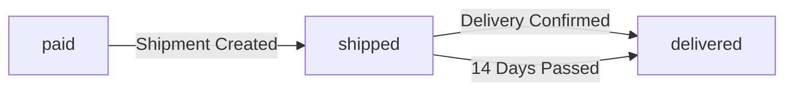
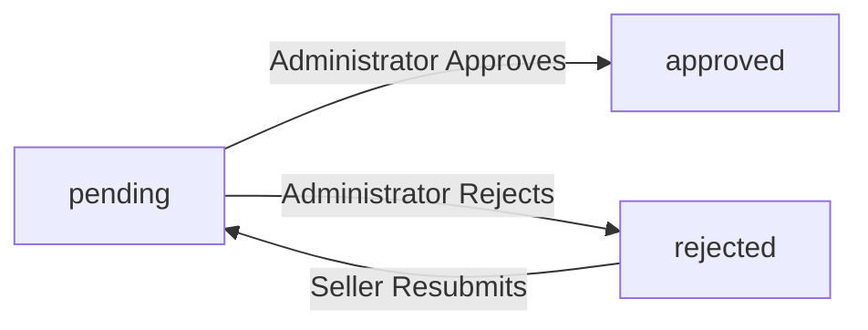

**shoppingMall — Business rules, validation constraints, data browsing expectations, error scenarios**

Business rules, validation constraints, data browsing expectations, error scenarios

# Domain Business Rules

Per-concept business rules, validation logic, and domain constraints.

## Customer Rules

Customers must register with email and password to access any platform features. Guest browsing is not permitted. Each customer account requires a unique email address. Customers can update their display name and phone number in their profile. Display name and phone number are optional fields that can be edited at any time. When a customer deletes their account, their profile information is permanently removed. However, order history and reviews are preserved for legal and seller record purposes. Deleted customer accounts show reviews as authored by a deleted user. Password changes require the customer to provide their current password for verification. Account deletion is only permitted when the customer initiates it through the platform settings.

### Registration and Authentication Rules

Customers must register with a unique email address and password to access any platform features. Guest browsing is not permitted; all users must have a registered account to view products or use any functionality.

Each customer account requires a unique email address. If a registration request uses an email address that is already associated with an existing account, the request is rejected.

Password changes require the customer to provide their current password for verification. If the current password provided does not match the account's password, the password change request is rejected.

All authentication and registration operations are restricted to registered customer accounts only. Any attempt to access platform features without a valid customer account is rejected.

### Profile Editing Rules

Customers can edit their display name and phone number in their profile at any time. Display name and phone number are optional fields; customers are not required to provide these values during registration or profile updates.

When a customer updates their display name or phone number, the changes are applied immediately to their profile. There are no restrictions on how frequently customers can update their profile information.

Profile editing is restricted to the customer's own profile. Customers cannot edit other customers' profile information. Any attempt to modify another customer's profile is rejected.

### Account Deletion Rules

When a customer deletes their account, their profile information including display name and phone number is permanently removed from the platform. The customer's email address becomes available for new registration after account deletion.

Despite profile removal, order history and reviews are preserved for legal and seller record purposes. Orders placed by the deleted customer remain accessible to sellers and administrators with all order details intact.

Reviews authored by the deleted customer are preserved but displayed as authored by a deleted user. The review content, rating, and timestamp remain visible on product pages, but the customer's display name is replaced with a generic deleted user indicator.

Account deletion is irreversible. Once a customer account is deleted, the profile information cannot be recovered. The customer must register a new account to use the platform again.

## Seller Rules

Sellers must register with email and password like customers. Seller accounts require administrator approval before they can list products for sale. Sellers can view their approval status which can be pending, approved, or rejected. If rejected, sellers can view the rejection reason provided by administrators. Rejected sellers can submit a new registration request after addressing the rejection concerns. Sellers can edit their shop name, shop description, and logo image at any time. Every profile edit creates a snapshot to preserve the previous state. Sellers can only delete their account if they have no pending orders in paid or shipped status. Account deletion also requires no pending cancellation or refund requests. When deleted, products are removed from listings but order history and shop names in past orders are preserved.

### Seller Registration and Approval

THE system SHALL require administrator approval before a seller can list products for sale on the platform.

WHEN a seller submits a registration request, THE system SHALL allow the seller to view their approval status at any time.

THE approval status SHALL be one of: pending, approved, or rejected.

IF the registration is rejected, THEN THE system SHALL display the rejection reason provided by the administrator to the seller.

IF a seller's registration is rejected, THEN THE system SHALL allow the seller to submit a new registration request after addressing the concerns mentioned in the rejection reason.

### Seller Profile Editing

THE system SHALL allow approved sellers to edit their shop name, shop description, and logo image at any time.

WHEN a seller edits their profile, THE system SHALL automatically create a snapshot to preserve the previous state.

THE snapshot SHALL record when the change was made, what fields were changed, and the values before and after the modification.

THE system SHALL prevent any modification or deletion of profile snapshots once created.

THE system SHALL allow sellers and administrators to view profile snapshots for dispute resolution purposes.

### Seller Account Deletion

IF a seller has any pending orders in paid or shipped status for their products, THEN THE system SHALL reject the account deletion request.

IF a seller has any pending cancellation requests or refund requests for their order items, THEN THE system SHALL reject the account deletion request.

WHEN a seller account is deleted, THE system SHALL remove all products owned by that seller from search results and category listings.

THE deleted products SHALL no longer be available for purchase.

THE system SHALL preserve order history and order item snapshots even after seller account deletion.

THE shop name displayed in past orders SHALL remain visible to customers after seller account deletion.

## Administrator Rules

Administrators have two grades: regular administrator and super administrator. Any user can submit a request to become an administrator with a reason. Super administrators review and approve or reject administrator promotion requests. Super administrators can promote regular administrators to super administrator grade. Super administrators can demote other super administrators to regular administrator. Super administrators cannot demote themselves to prevent losing all super administrator access. Administrators can approve or reject seller registration requests. When rejecting seller requests, administrators must provide a rejection reason. Administrators can suspend seller accounts which hides their products from search and category listings. Suspended sellers can still process existing orders but cannot create or edit products. Administrators can ban customer and seller accounts preventing login access.

### Administrator Grade Levels

THE system SHALL support two administrator grades: regular administrator and super administrator. Regular administrators can perform standard administrative tasks including seller approval management, category management, product oversight, order oversight, and user management. Super administrators have all regular administrator capabilities plus the ability to manage administrator grades. WHEN a user is approved for administrator promotion, THE system SHALL assign them regular administrator grade by default. THE system SHALL only allow super administrators to modify administrator grades.

### Promotion Request Validation

WHEN a user submits an administrator promotion request, THE system SHALL require a reason text. IF the reason text is empty, THEN THE system SHALL reject the request submission. IF a user has a pending promotion request, THEN THE system SHALL reject any subsequent promotion request submissions from that user. THE system SHALL only allow users with customer or seller accounts to submit promotion requests. Promotion requests cannot be withdrawn or edited by the requesting user after submission.

### Super Administrator Approval Rules

THE system SHALL only allow super administrators to review and approve administrator promotion requests. IF a regular administrator attempts to approve a promotion request, THEN THE system SHALL reject the action. WHEN a super administrator approves a promotion request, THE system SHALL assign the user regular administrator grade. WHEN a super administrator rejects a promotion request, THE system SHALL keep the user in their current role. Rejected users can submit new promotion requests with updated reasons. There is no limit on the number of promotion request submissions after rejections.

### Self Demotion Prohibition

IF a super administrator attempts to demote themselves to regular administrator, THEN THE system SHALL reject the action. THE system SHALL only allow super administrators to demote other super administrators to regular administrator grade. THE system SHALL allow super administrators to promote regular administrators to super administrator grade. This self demotion prohibition ensures the platform always retains at least one super administrator with full administrative capabilities.

### Seller Approval Management Rules

THE system SHALL allow administrators to view and manage seller registration approval requests. WHEN an administrator approves a seller registration request, THE system SHALL set the seller approval status to approved. WHEN an administrator rejects a seller registration request, THE system SHALL require a rejection reason. IF the rejection reason is empty, THEN THE system SHALL reject the rejection action. THE rejection reason is visible to the rejected seller. Rejected sellers can submit new seller registration requests with no limit on submission attempts.

### Seller Suspension Rules

WHEN a seller account is suspended, THE system SHALL automatically hide all their products from search results and category listings. WHILE a seller is suspended, THE system SHALL prevent the seller from creating new products. WHILE a seller is suspended, THE system SHALL prevent the seller from editing existing products. WHILE a seller is suspended, THE system SHALL allow the seller to process existing orders including shipping items and responding to cancellation or refund requests. WHEN a seller account is unsuspended, THE system SHALL automatically restore visibility for all their products in search and category listings.

### Account Ban Enforcement Rules

WHEN a customer account is banned, THE system SHALL prevent the customer from logging in to the platform. WHILE a customer is banned, THE system SHALL prevent the customer from accessing any platform features requiring authentication. WHEN a seller account is banned, THE system SHALL prevent the seller from logging in to the platform. WHILE a seller is banned, THE system SHALL prevent the seller from accessing seller dashboard or managing their products. Existing orders for banned sellers remain in the system and customers can still view their order history. Customers can still request cancellations and refunds for order items from banned sellers. WHEN an account is unbanned, THE system SHALL restore login access and platform feature access according to the user role.

## Category Rules

Categories organize products on the platform. Each category requires a name and description. Categories support one level of nesting only, meaning subcategories cannot have their own subcategories. Only administrators can create, edit, and delete categories. Customers can browse the list of all categories and view products within each category. When a category is deleted, products in that category become uncategorized rather than being deleted. Category names must be unique within the same parent category level. Subcategories belong to exactly one parent category. Categories cannot be reassigned to different parent categories after creation through the standard interface.

### Category Creation and Validation

### Category Name Requirement

WHEN a category is created, THE system SHALL require a name to be provided.
IF the category name is missing or empty, THEN THE system SHALL reject the creation request.

### Category Description Requirement

WHEN a category is created, THE system SHALL require a description to be provided.
IF the category description is missing or empty, THEN THE system SHALL reject the creation request.

### Unique Category Name Per Level

THE system SHALL enforce that category names are unique within the same parent category level.
IF a category name already exists under the same parent category, THEN THE system SHALL reject the creation of a duplicate category with that name.
IF a category name already exists as a top-level category, THEN THE system SHALL reject the creation of another top-level category with that name.

### Category Update Validation

WHEN a category name is updated, THE system SHALL validate that the new name does not conflict with existing category names at the same level.
IF the updated category name conflicts with an existing category at the same level, THEN THE system SHALL reject the update request.

### Category Hierarchy Constraints

### One Level Nesting Rule

THE system SHALL allow only one level of category nesting.
IF a category is a subcategory, THEN THE system SHALL prevent it from having child subcategories.
WHEN attempting to create a subcategory under an existing subcategory, THE system SHALL reject the request.

### Single Parent Category Rule

THE system SHALL ensure that each subcategory belongs to exactly one parent category.
IF a category is a subcategory, THEN THE system SHALL require it to have one and only one parent category.
IF a category is a top-level category, THEN THE system SHALL not allow it to have a parent category.

### Subcategory Organization

THE system SHALL organize subcategories under their parent category.
WHEN viewing a parent category, THE system SHALL display all its direct subcategories.
WHEN viewing the category list, THE system SHALL distinguish between top-level categories and subcategories.

### Category Management Permissions

### Administrator Only Management

THE system SHALL restrict category creation to administrators only.
IF a non-administrator user attempts to create a category, THEN THE system SHALL reject the request.

THE system SHALL restrict category editing to administrators only.
IF a non-administrator user attempts to edit a category, THEN THE system SHALL reject the request.

THE system SHALL restrict category deletion to administrators only.
IF a non-administrator user attempts to delete a category, THEN THE system SHALL reject the request.

### Administrator Category Operations

WHILE acting as an administrator, THE system SHALL allow the user to create top-level categories.
WHILE acting as an administrator, THE system SHALL allow the user to create subcategories under existing top-level categories.
WHILE acting as an administrator, THE system SHALL allow the user to edit category names and descriptions.
WHILE acting as an administrator, THE system SHALL allow the user to delete categories.

### Category Browsing and Product Listing

### Customer Category Browsing

THE system SHALL allow customers to browse the list of all categories.
WHEN a customer views the category list, THE system SHALL display all top-level categories.
WHEN a customer selects a top-level category, THE system SHALL display its subcategories if any exist.

### Category Product Listing

THE system SHALL allow customers to view products within a category.
WHEN a customer views a category, THE system SHALL display all products assigned to that category.
WHEN a customer views a subcategory, THE system SHALL display all products assigned to that subcategory.
IF a category has no products assigned, THEN THE system SHALL indicate that no products are available in that category.

### Category Deletion Behavior

### Product Uncategorization on Delete

WHEN a category is deleted, THE system SHALL remove the category assignment from all products in that category.
IF a product is assigned to a deleted category, THEN THE system SHALL mark the product as uncategorized.
IF a product becomes uncategorized, THEN THE system SHALL preserve the product and all its data.

### Category Deletion Preservation

WHEN a category is deleted, THE system SHALL preserve all products that were assigned to the deleted category.
IF a category is deleted, THEN THE system SHALL not delete or modify any product data other than removing the category assignment.

### Uncategorized Product Handling

THE system SHALL allow products to exist without a category assignment.
IF a product is uncategorized, THEN THE system SHALL still display the product in search results.
IF a product is uncategorized, THEN THE system SHALL not display the product in any category listing.

## Product Rules

Products require a name, description, category, and base price. All four fields are mandatory for product creation. Products belong to the seller who created them and cannot be transferred. Sellers can edit their own products and every edit creates a product snapshot. Products can be assigned to any category or subcategory. Sellers can delete their own products only if there are no pending order items in paid or shipped status for any variant. Deletion also requires no pending cancellation or refund requests for any variant. Deleting a product removes all its variants and inventory records. Deleted products no longer appear in search results or category listings. Product snapshots are preserved even after the product is deleted for historical reference.

### Product Creation Validation

THE system SHALL require a name for every product during creation. THE system SHALL require a description for every product during creation. THE system SHALL require a category or subcategory selection for every product during creation. THE system SHALL require a base price for every product during creation. IF the name is missing, THEN THE system SHALL reject the product creation request. IF the description is missing, THEN THE system SHALL reject the product creation request. IF the category selection is missing, THEN THE system SHALL reject the product creation request. IF the base price is missing, THEN THE system SHALL reject the product creation request.

### Product Ownership and Editing

THE product SHALL belong to the seller who created it. THE system SHALL not allow ownership transfer of a product to another seller. THE system SHALL allow only the owning seller to edit their own products. WHEN a seller edits a product, THE system SHALL automatically create a product snapshot. THE product snapshot SHALL capture all product fields including name, description, category, base price, and images at the time of the edit.

### Product Deletion Constraints

IF any variant of the product has a pending order item in paid or shipped status, THEN THE system SHALL reject the product deletion request. IF any variant of the product has a pending cancellation request, THEN THE system SHALL reject the product deletion request. IF any variant of the product has a pending refund request, THEN THE system SHALL reject the product deletion request. WHEN a product is deleted, THE system SHALL automatically delete all its variants. WHEN a product is deleted, THE system SHALL automatically delete all inventory records for its variants. WHEN a product is deleted, THE system SHALL remove it from search results and category listings immediately. THE system SHALL preserve product snapshots even after the product is deleted for historical reference and dispute resolution.

## ProductVariant Rules

Each product can have multiple variants representing different option combinations like color and size. Every variant requires a unique SKU code within the product. Variants must specify option values such as color red or size large. Variant price is optional and can override the product base price when specified. Stock quantity is required for each variant and starts at zero. Sellers can add, edit, and delete variants on their products. Every variant edit creates a product variant snapshot. Variants can only be deleted if there are no pending order items in paid or shipped status. Deletion also requires no pending cancellation or refund requests for that variant. A product must have at least one variant to be purchasable by customers. Products with no variants are visible in search but marked as unavailable.

### SKU Code and Option Values

### SKU Code Uniqueness

The SKU code must be unique within a product. When a seller adds a variant, the system shall validate that no other variant of the same product has the same SKU code. If a duplicate SKU code is detected, the request is rejected.

### Option Values Specification

Each variant must specify option values that define the specific combination of options such as color and size. Option values are required when creating a variant. The option values distinguish one variant from another within the same product.

### Variant Option Combination

Each variant represents a unique combination of option values. For example, a product may have variants like "Red / Large", "Blue / Small", or "Red / Small". The system shall ensure that each variant has a distinct option combination within the product. If a variant with the same option combination already exists, the request is rejected.

### Pricing and Stock Requirements

### Price Override Rules

The variant price is optional. When specified, the variant price overrides the product base price for that specific variant. If no variant price is set, the product base price applies to the variant. Sellers can set or remove the price override at any time when editing a variant.

### Stock Quantity Requirement

Stock quantity is required for each variant and must be provided when creating a variant. The stock quantity starts at zero if not explicitly set. Stock quantity cannot be negative. When stock quantity reaches zero, the variant is marked as out of stock and cannot be added to cart.

### Variant Edit and Deletion Rules

### Variant Edit Snapshot

Every variant edit creates a product variant snapshot. The snapshot records the state of the variant at the time of edit, including the SKU code, option values, and price. The snapshot is immutable and cannot be deleted. Sellers can view snapshots of their own product variants. Administrators can view snapshots of any product variant.

### Variant Deletion Constraints

A variant can only be deleted if there are no pending order items in paid or shipped status for that variant. If any order item for the variant has status paid or shipped, the deletion request is rejected.

A variant can only be deleted if there are no pending cancellation or refund requests for that variant. If any cancellation or refund request exists for the variant, the deletion request is rejected.

### Minimum Variant Requirement

A product must have at least one variant to be purchasable by customers. If a product has no variants, the product is visible in search results but is marked as unavailable. Customers cannot add products with no variants to their cart.

### Seller Variant Management

Sellers can add variants to their own products. Sellers can edit variants on their own products, including changing the SKU code, option values, and price. Sellers can delete variants from their own products subject to the deletion constraints defined above. When a variant is deleted, all inventory records for that variant are also deleted.

## ProductImage Rules

Sellers can upload multiple images for each product. Each image has an image URL and a sort order number. The first image in sort order serves as the main or thumbnail image displayed in listings. Images can be reordered by changing their sort order values. Sellers can delete individual images from their products. Image changes including additions, deletions, and reordering are included in product snapshots. The sort order determines the display sequence on the product detail page. Products can have zero or more images with no maximum limit specified. When a product snapshot is created, it captures all images and their sort order at that moment. Image URLs must be valid and accessible for proper display.

### Image Upload and Validation Rules

### Multiple Image Upload

THE system SHALL allow sellers to upload multiple images for each product.
THE system SHALL require each image to have a valid image URL.
IF the image URL is invalid or inaccessible, THEN the system SHALL reject the upload.

### Sort Order Assignment

THE system SHALL require each image to have a sort order number.
THE system SHALL use the sort order to determine the display sequence of images.

### Seller Image Management Permissions

THE system SHALL restrict image management operations to the seller who owns the product.
IF a user is not the product owner, THEN the system SHALL reject image upload, reorder, or deletion requests.
WHEN a seller's account is suspended, THE system SHALL prevent the seller from managing product images.

### Image Display and Reordering Rules

### Main Thumbnail Image Determination

THE system SHALL use the image with the lowest sort order value as the main thumbnail image.
THE system SHALL display the main thumbnail image in product listings.
THE system SHALL automatically update the main thumbnail when sort order changes result in a different image having the lowest sort order value.

### Image Reordering Rules

THE system SHALL allow sellers to reorder images by changing their sort order values.
WHEN a seller changes the sort order of an image, THE system SHALL update the display sequence immediately.

### Product Detail Image Gallery Display

THE system SHALL display all product images in the product detail page gallery.
THE system SHALL arrange images in the gallery according to their sort order values.
IF a product has no images, THEN the system SHALL display a placeholder or no image in the gallery.

### Image Deletion and Snapshot Rules

### Image Deletion Rules

THE system SHALL allow sellers to delete individual images from their products.
WHEN a seller deletes an image, THE system SHALL immediately remove it from the product's image list.

### Image Change Snapshot Capture

WHEN a product is edited, THE system SHALL create a product snapshot that includes all images and their sort order at that moment (as defined in ProductSnapshot Rules).
WHEN an image is added to a product, THE system SHALL include the image change in the product snapshot.
WHEN an image is deleted from a product, THE system SHALL record the deletion in the product snapshot.
WHEN images are reordered, THE system SHALL capture the new sort order values in the product snapshot.

### Snapshot Image Preservation

THE system SHALL preserve all image URLs and sort order values in the product snapshot.
THE system SHALL ensure product snapshots are immutable once created.
THE system SHALL include image state in product snapshots even after the product is deleted.

## InventoryRecord Rules

Inventory records track stock quantity changes for each product variant. Each record contains a quantity change which is positive for restocking and negative for orders or adjustments. Every inventory record requires a reason explaining the quantity change. Records also include a timestamp of when the change occurred. Current stock quantity is calculated by summing all inventory records for a variant. Sellers can add inventory through restocking with a positive quantity and reason. Sellers can subtract inventory through adjustments or loss with a negative quantity and reason. Order placement automatically creates a negative inventory record for purchased quantities. Order cancellation or refund automatically creates a positive inventory record to restore stock. Inventory records are separate from snapshots and track stock movement history.

### Inventory Record Structure and Stock Calculation

THE system SHALL require a quantity change value for every inventory record.

THE quantity change SHALL be positive when stock is added through restocking.

THE quantity change SHALL be negative when stock is removed through orders, adjustments, or loss.

THE system SHALL require a reason for every inventory record creation.

IF the reason is not provided, THEN THE system SHALL reject the inventory record creation.

THE system SHALL automatically record the timestamp when each inventory record is created.

THE system SHALL maintain inventory records as the complete stock movement history for each product variant.

THE inventory records SHALL be immutable and cannot be modified or deleted after creation.

THE current stock quantity for a product variant SHALL be calculated by summing all quantity changes from inventory records for that variant.

THE system SHALL automatically compute the current stock whenever it is displayed or checked.

WHEN no inventory records exist for a variant, THE current stock SHALL be zero.

THE calculated stock quantity SHALL determine whether a variant is shown as in stock or out of stock.

WHEN stock reaches zero, THE variant SHALL be displayed as out of stock.

IF the variant is out of stock, THEN THE system SHALL prevent the variant from being added to cart.

### Manual and Automatic Inventory Updates

WHEN a seller adds inventory through restocking, THE system SHALL create an inventory record with a positive quantity change.

THE seller SHALL provide the restocking quantity and a reason for the restocking.

THE restocking SHALL increase the variant's current stock quantity.

WHEN a seller subtracts inventory through adjustment or loss, THE system SHALL create an inventory record with a negative quantity change.

THE seller SHALL provide the adjustment quantity and a reason for the adjustment.

THE adjustment or loss SHALL decrease the variant's current stock quantity.

IF the seller does not provide a reason for manual inventory adjustment, THEN THE system SHALL reject the adjustment.

WHEN an order is placed successfully, THE system SHALL automatically create a negative inventory record for each purchased variant.

THE quantity change SHALL equal the purchased quantity.

THE stock SHALL be subtracted automatically without seller intervention.

WHEN an order item is cancelled and approved, THE system SHALL automatically create a positive inventory record to restore the stock quantity.

WHEN an order item is refunded and approved, THE system SHALL automatically create a positive inventory record to restore the stock quantity.

THE automatic inventory updates SHALL be recorded with system-generated reasons.

THE stock restoration SHALL occur without seller intervention.

## Address Rules

Customers can add multiple shipping addresses to their account. Each address requires recipient name, phone number, street address, city, state or province, postal code, and country. All address fields are mandatory for address creation. Customers can edit any of their saved addresses. Customers can delete their addresses when no longer needed. Each customer can set one address as their default shipping address. The default address is used automatically during checkout if selected. Addresses are associated with the customer who created them. Address information is captured in order snapshots at the time of purchase. Shipping addresses on orders cannot be changed after the order is placed.

### Multiple Address Support and Ownership

THE system SHALL allow each customer to add multiple shipping addresses to their account. THE system SHALL NOT impose a limit on the number of addresses a customer can save. Each address SHALL be associated with the customer who created it. THE system SHALL ensure that addresses created by one customer are not visible to other customers. WHEN a customer deletes their account, THEN THE system SHALL delete all addresses associated with that customer. THE system SHALL preserve address information in order snapshots even after the original address is deleted.

### Address Field Requirements

WHEN a customer creates an address, THE system SHALL require a recipient name. IF the recipient name is empty, THEN THE system SHALL reject the address creation. WHEN a customer creates an address, THE system SHALL require a phone number. IF the phone number is empty, THEN THE system SHALL reject the address creation. WHEN a customer creates an address, THE system SHALL require a street address. IF the street address is empty, THEN THE system SHALL reject the address creation. WHEN a customer creates an address, THE system SHALL require a city. IF the city is empty, THEN THE system SHALL reject the address creation. WHEN a customer creates an address, THE system SHALL require a state or province. IF the state or province is empty, THEN THE system SHALL reject the address creation. WHEN a customer creates an address, THE system SHALL require a postal code. IF the postal code is empty, THEN THE system SHALL reject the address creation. WHEN a customer creates an address, THE system SHALL require a country. IF the country is empty, THEN THE system SHALL reject the address creation.

### Address Management Operations

THE system SHALL allow customers to edit any of their saved addresses. THE system SHALL allow customers to update the recipient name, phone number, street address, city, state or province, postal code, and country of any address they own. THE system SHALL allow customers to delete their addresses at any time. THE system SHALL NOT restrict address deletion based on order history. WHEN a customer deletes an address, THEN THE system SHALL NOT affect orders that have already been placed. THE system SHALL preserve the shipping address in the order snapshot for all existing orders.

### Default Address Configuration

THE system SHALL allow each customer to set one address as their default shipping address. THE system SHALL ensure that only one address can be marked as default at any time. WHEN a customer sets a new default address, THEN THE system SHALL automatically unset the previous default address. WHERE a customer selects to use their default address during checkout, THE system SHALL use the default address automatically. IF a customer has no default address set, THEN THE system SHALL require the customer to manually select an address during checkout. IF a customer's default address is deleted, THEN THE system SHALL NOT automatically assign a new default address.

### Order Address Snapshot and Lock

WHEN an order is placed, THE system SHALL capture the shipping address in an order snapshot. THE system SHALL preserve the complete address information at the time of purchase including recipient name, phone number, street address, city, state or province, postal code, and country. AFTER an order is placed, THE system SHALL NOT allow the shipping address on that order to be changed. THE system SHALL maintain the address snapshot as immutable for the lifetime of the order. IF a customer needs to ship to a different address, THEN THE system SHALL require the customer to place a new order.

## WishlistItem Rules

Customers can add products to their wishlist for future reference. Wishlist items are at the product level not the variant level. Each wishlist item tracks the product ID and when it was added. Customers can view their wishlist which is paginated for performance. Customers can remove products from their wishlist at any time. If a product is deleted by the seller, it is automatically removed from all customer wishlists. A customer can only have one wishlist item per product. Wishlist items do not track specific variants or prices. The wishlist shows products regardless of current stock availability. Deleted products cannot be restored to wishlists even if the seller recreates them.

### Wishlist Item Structure and Ownership

### Wishlist Item Structure and Ownership

THE system SHALL store wishlist items at the product level, not at the variant level.

THE system SHALL record the timestamp when a product is added to a customer's wishlist.

THE system SHALL enforce that each customer can have only one wishlist item per product.

IF a customer attempts to add a product that is already in their wishlist, THEN the system SHALL reject the request.

THE system SHALL associate each wishlist item with the customer who created it.

THE system SHALL restrict customers to viewing and managing only their own wishlist items.

THE system SHALL NOT store variant-specific information in wishlist items, including SKU codes, option values, or prices.

### Wishlist Display and Browsing

### Wishlist Display and Browsing

THE system SHALL display the customer's wishlist as a paginated list.

THE system SHALL apply pagination to the wishlist to manage performance when customers have many items.

THE system SHALL display product information for each wishlist item, including the main image, name, and base price or price range.

THE system SHALL show products in the wishlist regardless of their current stock availability.

THE system SHALL NOT filter or hide products from the wishlist based on stock status.

THE system SHALL display products in the wishlist even if all their variants are currently out of stock.

### Wishlist Item Lifecycle

### Wishlist Item Lifecycle

THE system SHALL allow customers to remove products from their wishlist at any time.

WHEN a customer removes a product from their wishlist, THE system SHALL delete the wishlist item.

WHEN a product is deleted by the seller, THE system SHALL automatically remove all wishlist items referencing that product from all customer wishlists.

THE system SHALL NOT allow customers to restore automatically removed wishlist items.

IF a seller recreates a deleted product, THEN the system SHALL NOT automatically reappear the product in customer wishlists.

THE system SHALL require customers to manually add recreated products to their wishlist if they wish to track them again.

## Cart Rules

Each customer has one shopping cart. The cart tracks the customer ID and timestamps for creation and updates. Cart items are added at the variant level requiring specific option selection. When adding a variant already in the cart, quantities are combined into one line item. The cart displays each item with product name, variant options, price, quantity, and subtotal. The cart shows the total price of all items combined. If a variant stock is less than the cart quantity, a warning is displayed to the customer. If a variant is deleted or out of stock, it is marked as unavailable in the cart. Unavailable items cannot proceed to checkout. Cart items are removed when an order is successfully placed.

### Cart Ownership and Single Cart Constraint

Each customer owns exactly one shopping cart. The cart cannot be shared or accessed by other customers. If a customer attempts to access another customer's cart, the request is rejected. The cart is created automatically upon customer registration. The cart records when it was created and when it was last modified. The modification time is updated whenever any change is made to the cart contents. If a customer deletes their account, the cart and all its contents are permanently deleted.

### Variant-Level Addition and Duplicate Handling

Items can only be added to the cart at the variant level. A specific variant with defined option values must be selected before adding to cart. If a variant already exists in the cart and the same variant is added again, the quantities are combined into a single cart entry. The system does not allow duplicate cart entries for the same variant. If the selected variant has been deleted or is out of stock, the addition is rejected.

### Cart Display and Price Calculation Rules

Each cart item displays the product name, variant option values, unit price, quantity, and item subtotal. The item subtotal is calculated by multiplying the unit price by the quantity. The cart total is the sum of all item subtotals. If a variant price has changed since the item was added, the current price is used for display and calculation.

### Stock Validation and Availability Rules

If the cart quantity for a variant exceeds the available stock, a low stock warning is displayed for that item. If a variant is deleted or becomes out of stock, the cart item is marked as unavailable. Unavailable items are visually distinguished in the cart display. Unavailable items cannot be included in checkout. If any cart item is unavailable, checkout is blocked until the item is removed or becomes available again.

### Cart Clearance on Order Placement

When an order is successfully placed and payment is confirmed, all items included in the order are removed from the cart. The cart becomes empty after successful order placement. If order placement fails, the cart contents remain unchanged.

## CartItem Rules

Cart items represent specific product variants in a customer cart. Each cart item requires a variant ID and quantity. Quantity must be at least one when adding to cart. Customers can change the quantity of items in their cart. Customers can remove individual items from their cart. If the same variant is added again, the existing cart item quantity is increased rather than creating a duplicate. Cart items inherit the current price from the variant at display time. Cart items become unavailable if the variant is deleted or has zero stock. Unavailable cart items are visually distinguished but remain in the cart until removed. Cart items are cleared from the cart upon successful order placement.

### Cart Item Creation and Ownership

WHEN a customer adds an item to the cart, THE system SHALL require selection of a specific product variant. A cart item cannot represent a product alone without specifying the variant.

Every cart item SHALL belong to exactly one customer's cart. Customers SHALL only view and modify cart items in their own cart. Cart items from different customers SHALL never be mixed or visible across accounts.

IF the same variant is added to the cart multiple times, THEN THE system SHALL combine the quantities into a single cart item rather than creating duplicate entries.

IF a customer attempts to add a variant without selecting it, THEN THE request SHALL be rejected.

### Quantity Validation Rules

WHEN adding a variant to the cart, THE quantity SHALL be at least one. Quantities of zero or negative values SHALL be rejected.

Customers SHALL be able to modify the quantity of existing cart items. THE modified quantity SHALL also be at least one. IF a customer attempts to set a quantity of zero or less, THEN THE request SHALL be rejected.

WHEN combining quantities from adding the same variant again, THE resulting total quantity SHALL not exceed the available stock. IF the combined quantity would exceed stock, THEN THE request SHALL be rejected with an appropriate message.

### Price and Availability Rules

Cart items SHALL not store a fixed price. THE price displayed for each cart item SHALL be inherited from the current price of the associated variant at the time of display. IF the variant's price changes, THEN THE cart item SHALL reflect the updated price immediately.

BEFORE displaying cart items, THE system SHALL check the current stock availability of each variant. IF a variant's stock quantity is zero, THEN THE associated cart item SHALL be marked as unavailable.

IF a variant is deleted by the seller, THEN all cart items referencing that variant SHALL be marked as unavailable. THE cart items SHALL remain in the cart but SHALL be visually distinguished as unavailable and SHALL not be included in checkout.

Unavailable items SHALL be clearly indicated in the cart view. Customers SHALL see which items are unavailable but SHALL not proceed to checkout with those items.

### Cart Item Lifecycle

Customers SHALL be able to remove individual cart items from their cart at any time. Removal SHALL be immediate and SHALL not be reversible.

WHEN a customer successfully places an order, THE system SHALL automatically clear all cart items from the cart. This SHALL occur after payment confirmation and order creation. THE cart SHALL become empty and ready for new items.

IF order placement fails, THEN cart items SHALL remain in the cart and SHALL not be cleared. THE customer SHALL be able to retry checkout or modify the cart.

## Order Rules

Orders are created when payment succeeds after checkout. Each order has a unique order number for identification. Orders contain a total amount calculated from all order items. Orders include a shipping address snapshot captured at the time of purchase. The shipping address cannot be changed after order creation. Order status is derived from the statuses of its order items. If all items are paid the order status is paid. If any item is shipped the order status becomes shipped. If all items are delivered the order status is delivered. Mixed item statuses result in partially completed order status. Orders contain one or more order items which can be from different sellers.

### Order Identification and Creation

Each order is assigned a unique order number for identification purposes. The order number is generated when the order is created and cannot be changed.

An order is created only when payment succeeds during checkout. If payment fails, no order is created and the customer can retry the payment process.

Every order must contain at least one order item. An order cannot be created without any items. Each order item represents a purchased product variant with a specific quantity. If a customer purchases multiple quantities of the same variant, it becomes one order item with the combined quantity.

Order items within a single order can be from different sellers. When an order contains items from multiple sellers, each seller's items are processed and shipped independently.

### Order Financial Details

The order total amount is calculated by summing the prices of all order items. Each order item's price is multiplied by its quantity, and these subtotals are combined to produce the order total.

When an order is placed, a snapshot of the shipping address is captured and stored with the order. This snapshot includes all address details (recipient name, phone number, street address, city, state/province, postal code, country) as they existed at the time of purchase.

After the order is created, the shipping address cannot be changed. Any attempt to modify the shipping address of an existing order is rejected. The address snapshot preserved with the order is used for all shipping and delivery purposes.

### Order Status Derivation

The overall order status is derived from the statuses of its individual order items. The order status is not set directly but calculated based on item statuses.

When all order items have status paid, the order status is paid.

When any order item has status shipped and no items are delivered yet, the order status is shipped.

When all order items have status delivered, the order status is delivered.

When all order items have status cancelled, the order status is cancelled.

When all order items have status refunded, the order status is refunded.

When order items have mixed statuses (for example, some items delivered and some items refunded), the order status is partially completed.

The order status updates automatically when any order item status changes. The system recalculates the order status based on the current state of all items in the order.

## OrderItem Rules

Order items represent purchased product variants within an order. Each order item tracks product ID, variant ID, and quantity. If a customer buys multiple units of the same variant, it becomes one order item with that quantity. Each order item has its own independent status. Order item statuses include paid, shipped, delivered, cancelled, and refunded. Each order item can be individually cancelled or refunded without affecting other items. Order items include snapshots of the product, variant, and seller profile at purchase time. This preserves the product name, description, variant options, and price as they were when purchased. Order items belong to orders and cannot exist independently. Item status changes trigger order status recalculation.

### Purchased Variant Representation and Quantity

Each order item represents a single purchased product variant with an aggregated quantity. When a customer purchases multiple units of the same variant, the system creates one order item with the combined quantity rather than separate order items for each unit. For example, purchasing 5 units of a "Red / Large" variant results in one order item with quantity 5. Each order item belongs to exactly one order and cannot exist independently. The order item includes the product, variant, and quantity purchased at the time of order placement.

### Independent Item Status Values

Each order item maintains its own status independent of other items in the same order. Order item statuses include: paid, shipped, delivered, cancelled, and refunded. An order item with status "paid" indicates payment is completed and the item is waiting for the seller to ship. An order item with status "shipped" indicates the seller has shipped the item. An order item with status "delivered" indicates the item has been received by the customer. An order item with status "cancelled" indicates the item was cancelled before shipping. An order item with status "refunded" indicates the item was refunded after delivery.

### Individual Cancellation and Refund Rules

Each order item can be individually cancelled or refunded without affecting other items in the same order. Customers can request cancellation for individual order items with status "paid" (not yet shipped). When a cancellation is approved, only that specific item is cancelled and refunded, while remaining items continue processing normally. Customers can request a refund for individual order items with status "delivered" within 7 days of delivery. When a refund is approved, only that specific item is refunded, while remaining items are unaffected. If all items in an order are cancelled, the entire order status becomes "cancelled". If all items in an order are refunded, the entire order status becomes "refunded".

### Purchase Time Snapshot Preservation

When an order is placed, an order item snapshot is created to preserve the product state at purchase time. The snapshot includes the product name, variant options, price paid, and seller shop name as they were when the order was placed. This preserves the complete state even if the product, variant, or seller profile is later modified or deleted. The snapshot structure and content rules are defined in the OrderItemSnapshot Rules section. These snapshots ensure that customers and sellers can always see what was purchased, regardless of subsequent changes to the original records. Product snapshots, variant snapshots, and seller profile snapshots are all included to capture the complete purchase state.

### Order Status Recalculation Trigger

Changes to order item statuses automatically trigger recalculation of the overall order status. The order status is derived from its items according to the following rules: If all items are paid, the order status is "paid". If any item is shipped and none are delivered yet, the order status is "shipped". If all items are delivered, the order status is "delivered". If all items are cancelled, the order status is "cancelled". If all items are refunded, the order status is "refunded". If items are in mixed states (for example, some delivered and some refunded), the order status is "partially completed". This ensures the order status always accurately reflects the current state of all its items.

## Shipment Rules

Shipments represent packages sent by sellers to customers. A shipment can contain one or more order items from the same seller. Different sellers always ship separately resulting in different shipments. Sellers can choose to ship items individually or bundle multiple items into one shipment. Each shipment requires tracking number and carrier name from the seller. All items in the same shipment share the same tracking information. When a shipment is created, all included items change to shipped status. Customers can view tracking information for each shipment. Customers confirm delivery per shipment not per individual item. When delivery is confirmed, all items in that shipment change to delivered status. Items automatically become delivered after 14 days from shipping if not confirmed.

### Shipment Creation and Seller Grouping

A shipment represents a single package sent from a seller to a customer.

### Seller Grouping Rules

- WHEN a seller creates a shipment, THE system SHALL allow the seller to select one or more order items to include in the shipment
- THE system SHALL require that all order items in a shipment belong to the same seller
- IF order items from different sellers are selected for the same shipment, THEN THE system SHALL reject the shipment creation
- WHERE a seller has multiple order items to fulfill, THE system SHALL allow the seller to ship each item individually in separate shipments or bundle multiple items together into a single shipment
- WHEN a shipment is created with specific order items, THE system SHALL prevent those items from being moved to a different shipment

### Tracking Information Requirements

### Tracking Data Requirements

- WHEN a seller creates a shipment, THE system SHALL require the seller to provide a tracking number
- WHEN a seller creates a shipment, THE system SHALL require the seller to provide a carrier name
- IF a tracking number is not provided during shipment creation, THEN THE system SHALL reject the shipment creation
- IF a carrier name is not provided during shipment creation, THEN THE system SHALL reject the shipment creation
- THE system SHALL associate the same tracking number and carrier name with all order items within the same shipment
- IF a seller needs different tracking information for different items, THEN THE system SHALL require those items to be placed in separate shipments
- WHEN a customer views a shipment, THE system SHALL display the tracking number and carrier name for that shipment

### Shipment Status Transitions

### Item Status Change on Shipment

- WHEN a seller creates a shipment, THE system SHALL automatically change the status of all included order items from paid to shipped
- THE system SHALL only allow order items with status paid to be included in a new shipment
- IF an order item has status cancelled, THEN THE system SHALL prevent that item from being added to a shipment
- IF an order item has status refunded, THEN THE system SHALL prevent that item from being added to a shipment
- IF an order item has status shipped, THEN THE system SHALL prevent that item from being added to a shipment
- IF an order item has status delivered, THEN THE system SHALL prevent that item from being added to a shipment
- WHEN an order item status changes to shipped via a shipment, THE system SHALL prevent the status from being reverted to paid status through the shipment system

### Customer Delivery Confirmation

### Delivery Confirmation Rules

- WHEN a customer confirms delivery for a shipment, THE system SHALL automatically change the status of all order items within that shipment from shipped to delivered
- THE system SHALL perform delivery confirmation at the shipment level, not at the individual order item level
- WHILE 14 days have passed since the shipment creation date without customer confirmation, THE system SHALL automatically change all order items in the shipment from shipped to delivered status
- THE system SHALL trigger automatic delivery regardless of customer action
- WHEN an order item status changes to delivered, THE system SHALL prevent the status from being changed back to shipped status

## CancellationRequest Rules

Cancellation requests are handled per order item not per entire order. Customers can only request cancellation for items with paid status that have not yet shipped. Each cancellation request requires a reason text explaining why the customer wants to cancel. The seller of the item can approve or reject the cancellation request. When the seller responds, a snapshot of the request state is created. If approved, the item status changes to cancelled and a refund is processed. Cancelled items restore their stock quantities through inventory records. The remaining items in the order continue processing normally. If all items in an order are cancelled, the entire order status becomes cancelled. Cancellation requests cannot be submitted for items already shipped or delivered.

### Per-Item Cancellation Scope

THE system SHALL handle cancellation per order item, not per entire order. Each order item can be cancelled independently of other items in the same order. WHEN a customer requests cancellation, the customer SHALL select specific items to cancel rather than cancelling the entire order.

### Cancellation Eligibility Validation

WHEN a customer requests cancellation for an order item, THE system SHALL verify the item has paid status. IF the item has shipped status, THEN THE system SHALL reject the cancellation request. IF the item has delivered status, THEN THE system SHALL reject the cancellation request. IF the item has cancelled status, THEN THE system SHALL reject the cancellation request. IF the item has refunded status, THEN THE system SHALL reject the cancellation request.

### Cancellation Request Submission Rules

WHEN a customer submits a cancellation request, THE system SHALL require a reason text. IF the reason text is empty, THEN THE system SHALL reject the request. THE reason text SHALL explain why the customer wants to cancel the order item.

### Seller Review and Decision

WHEN a cancellation request is submitted, THE seller of the order item SHALL review the request. THE seller SHALL approve or reject the cancellation request. IF the seller rejects the request, THEN THE seller SHALL provide a rejection reason. WHEN the seller responds, THE system SHALL create a snapshot of the request state. THE seller's decision determines whether the cancellation proceeds or the item continues processing.

### Approved Cancellation Processing

WHEN a cancellation request is approved, THE system SHALL change the order item status to cancelled. THE system SHALL process a refund for the cancelled item. THE refund amount SHALL correspond to the price paid for that item. THE system SHALL restore the stock quantity for the cancelled variant through an inventory record with a positive quantity change.

### Order Continuation After Cancellation

WHEN one item in an order is cancelled, THE remaining items in the order SHALL continue processing normally. THE statuses of non-cancelled items SHALL remain unaffected by the cancellation. WHEN all items in an order are cancelled, THE system SHALL change the entire order status to cancelled.

## RefundRequest Rules

Refund requests are handled per order item not per entire order. Customers can only request refunds for items with delivered status. Refund requests can only be submitted within 7 days of the item being delivered. Each refund request requires a reason text explaining why the customer wants a refund. The seller of the item can approve or reject the refund request. When the seller responds, a snapshot of the request state is created. If approved, the item status changes to refunded. Refunded items restore their stock quantities through inventory records. The remaining items in the order are unaffected by the refund. If all items in an order are refunded, the entire order status becomes refunded. Refund requests cannot be submitted for items not yet delivered or past the 7-day window.

### Per-Item Refund Processing

THE system SHALL handle refund requests per order item, not per entire order. WHEN a customer requests a refund for an item, THEN THE system SHALL process only that specified item. THE remaining items in the order SHALL continue processing normally and SHALL NOT be affected by the refund request. IF all items in an order are refunded, THEN THE system SHALL change the entire order status to refunded.

### Refund Eligibility Validation

THE system SHALL only allow refund requests for order items with delivered status. IF the item has not yet been delivered, THEN THE system SHALL reject the refund request. THE system SHALL only accept refund requests submitted within 7 days of the item being delivered. IF the 7-day window has expired, THEN THE system SHALL reject the refund request.

### Refund Request Submission Requirements

THE system SHALL require a reason text for each refund request. IF the reason text is missing or empty, THEN THE system SHALL reject the refund request submission. THE reason text SHALL explain why the customer wants a refund.

### Seller Review and Response

THE seller of the order item SHALL have the authority to approve or reject the refund request. WHEN the seller responds to the refund request, THEN THE system SHALL create a snapshot of the request state preserving the reason and status at that moment. IF the seller approves the refund request, THEN THE system SHALL initiate the refund process. IF the seller rejects the refund request, THEN THE system SHALL close the request without processing a refund.

### Approved Refund Execution

WHEN a refund request is approved, THEN THE system SHALL change the order item status to refunded. THE system SHALL restore the stock quantities for refunded items through inventory records. THE stock restoration SHALL be recorded as a positive quantity change in the inventory history with the reason marked as refund.

## Review Rules

Customers can write reviews only for products they have purchased. A review can only be written after the order item status is delivered. Customers can write one review per product per order. Each review requires a rating from 1 to 5 stars. Review text content is optional and can be left blank. Reviews are displayed on the product detail page sorted by newest first. Customers can edit their own reviews and every edit creates a review snapshot. Customers can delete their own reviews but snapshots are preserved. Product average rating is calculated from all non-deleted reviews. Deleted reviews do not contribute to the average rating calculation.

### Review Creation and Validation

Customers can write reviews only for products they have purchased through the platform. A review can only be written after the order item status is delivered. Customers can write one review per product per order, preventing multiple reviews for the same product within a single order. Each review requires a rating from 1 to 5 stars, and the rating is mandatory. Review text content is optional and can be left blank. If the customer has not purchased the product, the review request is rejected. If the order item status is not delivered, the review request is rejected. If a review already exists for that product in that order, the review request is rejected. If the rating is outside the 1 to 5 range, the review request is rejected.

### Review Modification and Rating Rules

Customers can edit their own reviews after submission. Every review edit creates a review snapshot that preserves the previous state. Customers can delete their own reviews. When a review is deleted, the review snapshots are preserved and cannot be deleted. Product average rating is calculated from all non-deleted reviews for that product. Deleted reviews do not contribute to the average rating calculation. If no non-deleted reviews exist for a product, no average rating is displayed. The total review count shown reflects only non-deleted reviews. If the customer does not own the review, the edit request is rejected. If the customer does not own the review, the delete request is rejected.

## SellerApprovalRequest Rules

Seller approval requests are submitted when users register as sellers. Each request includes the shop name the seller wants to use. Requests have a status of pending, approved, or rejected. Administrators review and approve or reject seller approval requests. When rejecting a request, administrators must provide a rejection reason. Rejected sellers can view the rejection reason provided. Rejected sellers can submit a new registration request after addressing concerns. Approved requests grant the seller account permission to list products. Pending requests remain in the queue until an administrator processes them. Sellers can view their current approval status at any time.

### Shop Name and Registration Submission

### Shop Name and Registration Submission

WHEN a user submits a seller registration request, THE system SHALL require a shop name to be provided.

THE system SHALL reject seller registration requests where the shop name is empty or omitted.

THE shop name submitted during registration SHALL become the initial shop name for the seller profile upon approval.

WHERE a seller edits their shop name after approval, THE system SHALL create a seller profile snapshot to preserve the previous value.

IF the shop name contains invalid characters or violates platform policies, THEN THE system SHALL reject the registration request.

THE system SHALL NOT allow duplicate shop names across seller accounts.

SELLER registration requests SHALL include the shop name as the primary identifier for the seller's storefront.

### Approval Status Lifecycle and Transitions

### Approval Status Lifecycle and Transitions

THE seller approval request SHALL have exactly three possible statuses: pending, approved, or rejected.

WHEN a seller registration is first submitted, THE system SHALL set the request status to pending.

WHEN an administrator approves a request, THE system SHALL change the status from pending to approved.

WHEN an administrator rejects a request, THE system SHALL change the status from pending to rejected.

THE system SHALL record the timestamp of each status change for audit purposes.

THE system SHALL preserve all historical status changes throughout the request lifecycle.

THE system SHALL NOT allow status changes from approved or rejected back to pending without a new registration request.

WHERE a seller resubmits a registration request after rejection, THE system SHALL create a new approval request with a fresh pending status.

### Administrator Review and Rejection Reason Rules

### Administrator Review and Rejection Reason Rules

ALL seller approval requests SHALL require administrator review before the seller can list products.

THE system SHALL NOT allow sellers to bypass the administrator review process.

WHEN an administrator rejects a seller approval request, THE system SHALL require a rejection reason to be provided.

THE system SHALL reject administrator actions where the rejection reason is empty or omitted.

THE rejection reason SHALL be provided at the time of rejection and cannot be added afterward.

THE system SHALL make the rejection reason visible to the seller whose request was rejected.

THE rejection reason SHALL be visible only to the seller who submitted the request, not to other users.

THE system SHALL NOT allow administrators to reverse an approval decision once made.

PENDING requests SHALL NOT expire automatically and SHALL remain in the queue until processed.

THE system SHALL NOT allow administrators to approve or reject requests without explicitly selecting an action.

### Approval Permission and Status Visibility

### Approval Permission and Status Visibility Rules

WHEN a seller approval request is approved, THE system SHALL grant the seller account permission to list products on the platform.

WHILE a seller approval request is in pending status, THE system SHALL NOT allow the seller to create or list any products.

WHILE a seller approval request is in rejected status, THE system SHALL NOT allow the seller to create or list any products.

APPROVED sellers SHALL be able to create products, add variants, and manage inventory.

THE system SHALL verify approval status before allowing any selling activity on the platform.

IF a seller attempts to create a product without approval, THEN THE system SHALL reject the request.

SELLERS SHALL be able to view their current approval status at any time.

THE system SHALL display the approval status on the seller account dashboard or profile page.

THE system SHALL show the rejection reason alongside the status when the request is rejected.

THE system SHALL NOT allow sellers to expedite their pending requests through the system.

## AdminPromotionRequest Rules

Any user including customers and sellers can submit a request to become an administrator. Each promotion request requires a reason text explaining why the user wants to become an administrator. Requests have a status of pending, approved, or rejected. Super administrators review the list of pending promotion requests. Super administrators can approve or reject promotion requests. Approved requests grant the user regular administrator grade. Rejected requests do not change the user role. Users can view their promotion request status. Only super administrators can process promotion requests. Regular administrators cannot approve or reject promotion requests.

### Promotion Request Submission and Eligibility

WHEN any user including customers or sellers submits a promotion request, THE system SHALL accept the submission. THE system SHALL require a reason text explaining why the user wants to become an administrator. IF the reason text is missing, THEN THE system SHALL reject the request. THE system SHALL track each request with a state of pending, approved, or rejected. All new requests SHALL start with pending status.

### Super Administrator Review and Processing

ONLY super administrators SHALL review and process promotion requests. WHEN a super administrator reviews a pending request, THE system SHALL allow approval or rejection. REGULAR administrators SHALL NOT approve or reject promotion requests. THE system SHALL restrict promotion request processing to super administrator grade users only.

### Approval and Rejection Outcomes

WHEN a super administrator approves a promotion request, THE system SHALL grant the user regular administrator grade. WHEN a super administrator rejects a promotion request, THE system SHALL NOT change the user role. THE user SHALL retain their current role as customer or seller. THE request status SHALL change from pending to approved or pending to rejected accordingly.

### Request Status Visibility

USERS SHALL view their own promotion request status at any time. THE system SHALL display the current status (pending, approved, or rejected) for each request submitted by the user. THE system SHALL maintain request state tracking from submission through final decision.

## ProductSnapshot Rules

Product snapshots are created whenever a product is edited. Each snapshot records when the change was made with a timestamp. Snapshots capture all product fields including name, description, category, base price, and images. Product snapshots also include snapshots of all variants at that moment. This preserves the complete state of a product and its variants at any point in time. Snapshots are immutable and cannot be deleted or modified after creation. Snapshots can be viewed by the product owner seller and administrators. Snapshots are preserved even after the product is deleted. This enables dispute resolution and historical reference. Every product edit triggers a new snapshot creation.

### Snapshot Creation and Content

WHEN a product is edited, THE system SHALL create a new product snapshot automatically.

WHEN a product snapshot is created, THE system SHALL record the timestamp of when the change was made.

EVERY product edit triggers a new snapshot creation, regardless of how many fields were changed.

THE product snapshot SHALL capture all product fields including name, description, category, base price, and images.

WHEN a product snapshot is created, THE system SHALL include all product images at their current sort order.

THE product snapshot SHALL include snapshots of all variants at that moment.

The variant snapshot inclusion preserves the complete state of a product and its variants at any point in time.

IF a product has no variants when the snapshot is created, THEN THE snapshot SHALL reflect the product without variants.

IF a product edit is attempted without creating a snapshot, THEN THE system SHALL reject the request.

### Snapshot Immutability and Access

WHILE a product snapshot exists, THE system SHALL prevent any modification to the snapshot.

Snapshots are immutable and cannot be modified after creation.

IF a request attempts to modify a product snapshot, THEN THE system SHALL reject the request.

THE system SHALL not allow deletion of any product snapshot.

IF a request attempts to delete a product snapshot, THEN THE system SHALL reject the request.

THE product owner seller SHALL have view access to snapshots of their own products.

Administrators SHALL have view access to snapshots of any product on the platform.

IF a user who is not the product owner or an administrator attempts to view a product snapshot, THEN THE system SHALL reject the request.

WHEN a product is deleted, THE system SHALL preserve all snapshots of that product.

The post deletion preservation ensures snapshots remain accessible even after the product no longer exists.

Snapshots SHALL be available for dispute resolution support and historical reference.

Administrators can view snapshots of deleted products for policy violation investigations.

Sellers can view snapshots of their deleted products for record-keeping purposes.

## ProductVariantSnapshot Rules

Product variant snapshots are created as part of product snapshots. Each variant snapshot captures the SKU code at the time of the product snapshot. Option values like color and size are recorded in the snapshot. Variant price including any override of the base price is captured. The snapshot includes a timestamp of when it was created. Variant snapshots are nested within product snapshots to maintain the relationship. They preserve the exact variant configuration at the time of product edit. Variant snapshots are immutable once created. They can be viewed by the product owner and administrators. Variant snapshots enable tracking of how variant options and prices changed over time.

### Product Snapshot Nesting and Structure

WHEN a product snapshot is created, THE system SHALL include snapshots of all variants associated with the product at that moment.

THE system SHALL maintain the hierarchical relationship between product snapshots and variant snapshots.

IF a product has no variants, THEN the product snapshot SHALL be created without variant snapshots.

WHERE variant snapshots exist, THEY SHALL be nested within their parent product snapshot.

THE system SHALL preserve the complete variant configuration at the time of product edit within the nested structure.

### Variant Data Capture Rules

THE system SHALL capture the SKU code exactly as it exists at the time of the product snapshot.

THE SKU code SHALL be recorded as a required field in every variant snapshot.

THE system SHALL record option values such as color, size, or other distinguishing attributes in the variant snapshot.

THE complete combination of option values SHALL be preserved in the snapshot.

THE system SHALL capture the variant price including any override of the product base price.

IF a variant has a custom price that differs from the base price, THEN that override value SHALL be preserved in the snapshot.

IF a variant uses the product base price without override, THEN the base price value SHALL be recorded in the snapshot.

### Immutability and Access Control

THE system SHALL prevent any modifications to variant snapshots after they are created.

THE variant snapshot data SHALL remain immutable for the lifetime of the record.

THE product owner SHALL have view access to all variant snapshots for their products.

Administrators SHALL have view access to variant snapshots for any product on the platform.

View access SHALL be read-only; no party SHALL be permitted to modify or delete variant snapshots.

THE system SHALL enable tracking of how variant options and prices changed over time through variant snapshots.

THE system SHALL preserve historical variant states for dispute resolution and audit purposes.

WHERE change tracking is needed, THE variant snapshots SHALL provide the historical record of variant configurations.

## SellerProfileSnapshot Rules

Seller profile snapshots are created whenever a seller edits their profile. Each snapshot records when the change was made with a timestamp. Snapshots capture shop name, shop description, and logo image. Every profile edit creates a new snapshot preserving the previous state. Snapshots are immutable and cannot be deleted or modified. Order items include seller profile snapshots at the time of purchase. This preserves the shop name and logo as customers saw them when ordering. Snapshots can be viewed by the seller and administrators. This enables verification of what shop information was displayed historically. Seller profile snapshots support dispute resolution for order-related issues.

### Snapshot Creation and Content

WHEN a seller edits their profile, THE system SHALL create a seller profile snapshot. THE system SHALL record the timestamp of when the profile change was made. THE snapshot SHALL capture the shop name at the time of the edit. THE snapshot SHALL capture the shop description at the time of the edit. THE snapshot SHALL capture the logo image at the time of the edit. THE snapshot SHALL preserve the previous state of all profile fields before the edit. Every profile edit SHALL generate a new snapshot.

### Immutability and Access Control

THE seller profile snapshot SHALL be immutable once created. THE snapshot SHALL NOT be deletable by any user. THE snapshot SHALL NOT be modifiable by any user. WHERE a seller owns the profile, THE seller SHALL be able to view all snapshots of their own profile. WHERE a user is an administrator, THE administrator SHALL be able to view seller profile snapshots for any seller on the platform.

### Order Integration and Dispute Resolution

WHEN an order is placed, THE system SHALL include a seller profile snapshot with each order item. THE snapshot SHALL preserve the shop name as it appeared at the time of purchase. THE snapshot SHALL preserve the logo image as it appeared at the time of purchase. WHERE a dispute exists for an order, THE seller profile snapshot SHALL support dispute resolution by showing what shop information was displayed historically. Administrators and sellers SHALL be able to reference snapshots to verify shop information shown during any transaction.

## ReviewSnapshot Rules

Review snapshots are created whenever a customer edits their review. Each snapshot records when the change was made with a timestamp. Snapshots capture the rating and text content changes. The snapshot preserves both the before and after values of edited fields. Review snapshots are immutable and cannot be deleted or modified. Snapshots are preserved even if the review is deleted by the customer. This maintains a complete history of review changes. Snapshots can be viewed by the review owner and administrators. Review snapshots enable tracking of how review content changed over time. This supports moderation and dispute resolution processes.

### Review Edit Snapshot Trigger

WHEN a customer edits their review, THE system SHALL create a review snapshot. WHEN a customer submits their review initially, THE system SHALL create the first snapshot. Each edit operation SHALL generate exactly one snapshot, regardless of how many fields are changed. WHEN a customer makes multiple edits, THE system SHALL create a separate snapshot for each edit. Snapshot creation SHALL be mandatory and cannot be skipped or disabled.

### Snapshot Content Capture

THE review snapshot SHALL record the timestamp of when the change was made. THE snapshot SHALL capture the rating value at the time of the edit. THE snapshot SHALL capture the text content of the review, including empty values if the text is removed. THE snapshot SHALL preserve both the before values and after values for all changed fields. THE snapshot SHALL identify which specific fields were modified during the edit. All captured data SHALL be stored as part of the snapshot record and cannot be altered after creation.

### Snapshot Immutability and Retention

WHEN a review snapshot is created, THE system SHALL make it immutable. No user, including the review owner, SHALL modify a snapshot after it is created. No user, including administrators, SHALL delete a snapshot. Snapshots SHALL not be edited, updated, or altered in any way. The immutability constraint SHALL apply to all snapshot fields including timestamp, rating, text content, and before-after values. WHEN a customer deletes their review, THE system SHALL preserve all associated snapshots. The snapshots SHALL remain accessible even after the parent review is deleted. This ensures that moderation records and dispute resolution data are not lost.

### Snapshot Access Permissions

THE review owner SHALL view all snapshots of their own review. Administrators SHALL view snapshots of any review on the platform. Users other than the review owner and administrators SHALL not view review snapshots. Snapshot access SHALL be read-only; no user SHALL modify or delete snapshots. The access permissions SHALL remain in effect even after the review is deleted. Administrators SHALL retain snapshot access for moderation and oversight purposes regardless of review status.

### Snapshot History Completeness

THE collection of all snapshots for a review SHALL form a complete change history. The history SHALL show the progression of the review from initial creation through all edits. Each snapshot in the history SHALL be ordered by timestamp to show the sequence of changes. The complete history SHALL enable tracking of how review content changed over time. This SHALL support moderation processes by providing full visibility into review modifications. The history SHALL support dispute resolution by preserving evidence of what changes were made and when.

## OrderItemSnapshot Rules

Order item snapshots are created when an order is placed successfully. Each snapshot captures the product name at the time of purchase. Variant options like color and size are recorded in the snapshot. The price paid for the item is preserved in the snapshot. A timestamp records when the snapshot was created. Order item snapshots are attached to order items permanently. This ensures customers always see what they purchased even if products change. Snapshots preserve the exact product and variant state at purchase time. Order item snapshots are immutable and cannot be modified. They can be viewed by the customer and administrators for order history reference.

### Order Placement Trigger

Order item snapshots are created automatically when an order is placed successfully. The system records a timestamp at the moment the snapshot is created. This timestamp marks the exact point in time when the purchase occurred. Each order item receives its own snapshot upon successful payment completion. The snapshot creation is triggered by the order placement event and cannot be manually initiated.

### Captured Data

The snapshot captures the product name as it existed at the time of purchase. Variant options such as color and size are recorded in the snapshot. The price paid for the item is preserved exactly as charged during checkout. All captured data reflects the purchase time state of the product and variant. This ensures the snapshot represents what the customer actually purchased, not the current state of the product listing.

### Permanent Attachment and Immutability

Order item snapshots are permanently attached to their corresponding order items. Once created, snapshots cannot be modified or deleted. This immutability constraint ensures the historical record remains unchanged. Order item snapshots provide product change immunity, meaning customers always see what they purchased even if the seller later changes the product name, description, price, or variants. The snapshot preserves the exact state at purchase time regardless of subsequent product modifications.

### Access and Reference

Customers can view the snapshots of their own order items for order history reference. Administrators can view snapshots of any order item on the platform for dispute resolution and oversight purposes. The snapshots serve as the authoritative record of what was purchased. When customers view their order history, they see the product name, variant options, and price from the snapshot rather than the current product listing. This ensures accurate order history even for products that have been modified or deleted.

## CancellationRequestSnapshot Rules

Cancellation request snapshots are created when a seller responds to a cancellation request. Each snapshot records when the response was made with a timestamp. Snapshots capture the reason provided by the customer. The status change from pending to approved or rejected is recorded. The snapshot preserves the state of the request at response time. Cancellation request snapshots are immutable and cannot be deleted. They can be viewed by the customer, seller, and administrators. This enables all parties to see the request history and response. Snapshots support dispute resolution for cancellation disagreements. Multiple snapshots may exist if the request goes through multiple state changes.

### Snapshot Creation Trigger

A cancellation request snapshot is created when the seller responds to a cancellation request. The snapshot is triggered only by the seller's response action (approve or reject). No snapshot is created when the customer initially submits the cancellation request. Each seller response generates exactly one snapshot record. If the seller responds multiple times due to state changes, multiple snapshots are created to track the complete history.

### Snapshot Content Requirements

Each cancellation request snapshot records the reason provided by the customer at the time of the request. The status change from pending to approved or rejected is captured in the snapshot. The exact state of the request at response time is preserved, including the reason text and the resulting status. This ensures the complete context of each response is available for review.

### Timestamp Recording

Every cancellation request snapshot includes a timestamp indicating when the seller's response was made. The timestamp records the exact date and time of the response action. This enables all parties to determine the sequence of events and response timing. The timestamp cannot be modified after the snapshot is created.

### Snapshot Immutability

Cancellation request snapshots are immutable once created. No party can modify the content of a snapshot after it is recorded. The immutability constraint ensures the integrity of the historical record. This prevents disputes about what was recorded at the time of response.

### Snapshot Deletion Prohibition

Cancellation request snapshots cannot be deleted by any user, including customers, sellers, or administrators. The no deletion allowed rule applies even if the associated cancellation request is resolved or the order is completed. This permanent preservation ensures accountability and supports audit requirements.

### Snapshot Access Permissions

The customer who submitted the cancellation request can view all snapshots for that request. The seller who responded to the request can view all snapshots for that request. Administrators can view snapshots for any cancellation request on the platform. This three-party visibility ensures transparency in the cancellation process.

### Dispute Resolution Support

Cancellation request snapshots support dispute resolution by preserving the complete history of the request. All parties can review what reason was provided and how the seller responded. The preserved state enables administrators to investigate cancellation disagreements. Multiple snapshots show if the request went through multiple state changes, providing full context for resolution.

## RefundRequestSnapshot Rules

Refund request snapshots are created when a seller responds to a refund request. Each snapshot records when the response was made with a timestamp. Snapshots capture the reason provided by the customer. The status change from pending to approved or rejected is recorded. The snapshot preserves the state of the request at response time. Refund request snapshots are immutable and cannot be deleted. They can be viewed by the customer, seller, and administrators. This enables all parties to see the request history and response. Snapshots support dispute resolution for refund disagreements. Multiple snapshots may exist if the request goes through multiple state changes.

### Refund Request Snapshot Creation

WHEN the seller responds to a refund request, THE system SHALL create a refund request snapshot. The snapshot creation is triggered at the moment the seller submits their decision to approve or reject the refund request. THE system SHALL record the exact timestamp when the seller response was made. THE snapshot SHALL capture the reason text provided by the customer when they initiated the refund request. THE snapshot SHALL record the status assigned by the seller (approved or rejected). THE snapshot SHALL preserve the complete state of the refund request at the time of the seller's response. IF the seller response is not submitted, THEN the system SHALL not create a snapshot.

### Refund Request Snapshot Immutability

THE refund request snapshot SHALL be immutable once created. THE system SHALL not allow any user to modify a refund request snapshot after it has been created. THE system SHALL not allow any user, including administrators, to delete a refund request snapshot. This immutability constraint ensures an accurate historical record of all refund request responses is preserved for the lifetime of the system. IF a user attempts to modify or delete a snapshot, THEN the request SHALL be rejected.

### Refund Request Snapshot Access Permissions

THE customer who submitted the refund request SHALL have view access to all snapshots of their refund request. THE seller who reviewed the refund request SHALL have view access to all snapshots of that refund request. Administrators SHALL have view access to refund request snapshots for any refund request on the platform. IF a user does not have one of these three roles (customer, seller, administrator) for a specific refund request, THEN the system SHALL deny access to the snapshots. This three-party visibility ensures transparency in the refund review process.

### Refund Request Snapshot Dispute Resolution

THE preserved snapshot state SHALL support dispute resolution when customers or sellers disagree about the refund decision. Administrators can review the snapshot to see the original reason provided by the customer and the decision made by the seller. The snapshot SHALL show when the response was made and what status was assigned. This historical record enables accurate reconstruction of what occurred during the refund review process. IF a dispute is raised, THEN administrators SHALL use the snapshot as the authoritative record of the refund request state at response time.

# Data Browsing Expectations

Business expectations for how users browse, find, and navigate through lists of data.

## List Browsing Expectations

Define business expectations for how users find, filter, and browse lists.

### Filtering Rules

### Product Search Filtering

WHEN customers search for products, THE system SHALL allow filtering by the following criteria:

- **Category**: Customers can filter products to show only those belonging to a specific category or subcategory.
- **Price Range**: Customers can set a minimum price and/or maximum price to filter products within their desired price range.
- **In-Stock Only**: Customers can filter to show only products that have at least one variant with available stock.

Filters can be combined. WHEN multiple filters are applied, THE system SHALL display only products matching all selected criteria.

IF no products match the applied filters, THEN THE system SHALL show an empty result with a message indicating no matching items were found.

IF a product becomes unavailable (deleted by seller or out of stock) while a customer has active filters, THEN THE product SHALL be excluded from filtered results.

### Order Items Filtering

Sellers can filter the list of order items for their products by order item status. Available status filters include: paid, shipped, delivered, cancelled, and refunded.

### Sorting Rules

### Product Sorting Options

WHEN viewing product search results or category listings, THE system SHALL allow customers to sort by:

- **Newest First**: Products are sorted by creation date, with the most recently added products appearing first.
- **Price (Low to High)**: Products are sorted by base price in ascending order. If variants have different prices, the lowest variant price is used for sorting.
- **Price (High to Low)**: Products are sorted by base price in descending order. If variants have different prices, the highest variant price is used for sorting.

### Order History Sorting

Customer order history lists are sorted by order date with the newest orders appearing first. This sorting is fixed and cannot be changed by the customer.

### Review Sorting

Product reviews are sorted by the date the review was created, with the most recent reviews appearing first. This sorting is fixed and cannot be changed.

### Seller Order Items Sorting

Sellers viewing their order items can sort by order date. The default sort order is newest first.

### Pagination Rules

### Product Search Results Pagination

Product search results and category listings are displayed in pages. Each page shows a fixed number of products. Customers can navigate between pages using next and previous controls.

IF a product is deleted by the seller, THEN it SHALL be automatically removed from all search and category listing pages. IF a customer is viewing a paginated list when this occurs, THEN the product SHALL no longer appear in the results.

### Wishlist Pagination

Customer wishlists are displayed in pages. Each page shows a fixed number of products. Customers can navigate between pages to view all products in their wishlist.

IF a product in the wishlist is deleted by the seller, THEN it SHALL be automatically removed from the wishlist. The pagination adjusts accordingly.

### Order History Pagination

Customer order history is displayed in pages. Each page shows a fixed number of orders. Orders are sorted by newest first within each page. Customers can navigate between pages to view their complete order history.

### Pagination Behavior

IF items are removed from a list (due to deletion, filtering, or other actions), THEN THE pagination SHALL adjust to reflect the current total count. IF a customer is on a page that no longer exists after items are removed, THEN THE system SHALL show the last available page or an empty state if no items remain.

# Error Conditions

Business error scenarios and how the system should respond.

## Error Scenarios

Describe error conditions and expected system responses in natural language.

### Authentication and Account Errors

If the email address is already registered, the registration request is rejected. If the email format is invalid, the registration request is rejected. If the password does not meet security requirements, the registration request is rejected. If required fields are missing during registration, the request is rejected. If the email address is not registered, the login request is rejected. If the password does not match the registered password, the login request is rejected. If the account is banned by an administrator, the login request is rejected. If the account is deleted, the login request is rejected. If a customer attempts to delete their account while having active orders, the deletion request is rejected. If a seller attempts to delete their account while having pending orders in paid or shipped status, the deletion request is rejected. If a seller attempts to delete their account while having pending cancellation or refund requests, the deletion request is rejected. If a user attempts to change their password without proper authentication, the request is rejected.

### Product and Variant Operation Errors

If the product name is missing, the product creation request is rejected. If the product description is missing, the product creation request is rejected. If the category is not selected, the product creation request is rejected. If the base price is missing or invalid, the product creation request is rejected. If a seller attempts to create a product in a category that does not exist, the request is rejected. If a seller attempts to edit a product they do not own, the request is rejected. If a seller attempts to edit a product that has been deleted, the request is rejected. If the product does not exist, the edit request is rejected. If the product has pending order items in paid or shipped status for any variant, the deletion request is rejected. If the product has pending cancellation or refund requests for any variant, the deletion request is rejected. If a seller attempts to delete a product they do not own, the request is rejected. If the product does not exist, the deletion request is rejected. If the SKU code is already in use, the variant creation request is rejected. If the SKU code is missing, the variant creation request is rejected. If the stock quantity is missing or invalid, the variant creation request is rejected. If a seller attempts to add a variant to a product they do not own, the request is rejected. If a seller attempts to edit a variant of a product they do not own, the request is rejected. If the variant does not exist, the edit request is rejected. If the new SKU code conflicts with an existing variant, the request is rejected. If the variant has pending order items in paid or shipped status, the deletion request is rejected. If the variant has pending cancellation or refund requests, the deletion request is rejected. If a seller attempts to delete a variant they do not own, the request is rejected. If the variant does not exist, the deletion request is rejected.

### Cart and Checkout Errors

If the variant does not exist, the add to cart request is rejected. If the variant is out of stock, the add to cart request is rejected. If the quantity is less than one, the add to cart request is rejected. If the product has been deleted by the seller, the add to cart request is rejected. If the customer is not logged in, the add to cart request is rejected. If the cart item does not exist, the quantity modification request is rejected. If the new quantity is less than one, the modification request is rejected. If the customer attempts to modify a cart item that belongs to another customer, the request is rejected. If the variant is no longer available, the modification request is rejected. If the cart item does not exist, the removal request is rejected. If the customer attempts to remove a cart item that belongs to another customer, the request is rejected. If the cart is empty, the checkout request is rejected. If any item in the cart is unavailable due to being deleted or out of stock, the checkout request is rejected. If the customer has no shipping addresses, the checkout request is rejected. If the selected shipping address does not exist or belongs to another customer, the checkout request is rejected. If payment fails, the order is not created and the customer can retry checkout. If stock becomes insufficient during checkout, the checkout request is rejected.

### Order Processing Errors

If payment fails, the order is not created. If any item in the cart becomes unavailable during checkout, the order creation is rejected. If the customer does not have a valid shipping address, the order creation is rejected. If stock is insufficient for any item at order placement, the order creation is rejected. If the order does not exist, the view request is rejected. If the customer attempts to view an order that belongs to another customer, the request is rejected. If an order item is already delivered, it cannot be transitioned back to paid or shipped status. If an order item is cancelled, it cannot be transitioned to shipped or delivered status. If an order item is refunded, it cannot be transitioned to any other status.

### Cancellation and Refund Request Errors

If the order item does not exist, the cancellation request is rejected. If the order item status is not paid, the cancellation request is rejected. If the order item is already shipped, the cancellation request is rejected. If the order item is already delivered, the cancellation request is rejected. If the order item is already cancelled, the cancellation request is rejected. If the order item is already refunded, the cancellation request is rejected. If the customer attempts to cancel an order item that belongs to another customer, the request is rejected. If the reason text is missing, the cancellation request is rejected. If there is already a pending cancellation request for the same order item, the new request is rejected. If a seller attempts to respond to a cancellation request for an order item they do not sell, the request is rejected. If the cancellation request does not exist, the response request is rejected. If the cancellation request has already been responded to, the response request is rejected. If the order item does not exist, the refund request is rejected. If the order item status is not delivered, the refund request is rejected. If the refund request is made more than 7 days after the item was delivered, the request is rejected. If the order item is already refunded, the refund request is rejected. If the order item is already cancelled, the refund request is rejected. If the customer attempts to refund an order item that belongs to another customer, the request is rejected. If the reason text is missing, the refund request is rejected. If there is already a pending refund request for the same order item, the new request is rejected. If a seller attempts to respond to a refund request for an order item they do not sell, the request is rejected. If the refund request does not exist, the response request is rejected. If the refund request has already been responded to, the response request is rejected.

### Seller Approval Errors

If the email address is already registered as a seller, the registration request is rejected. If the email format is invalid, the registration request is rejected. If the password does not meet security requirements, the registration request is rejected. If the shop name is missing, the seller registration request is rejected. If the shop description is missing, the seller registration request is rejected. If an administrator attempts to approve or reject a seller approval request that does not exist, the request is rejected. If an administrator attempts to respond to a seller approval request that has already been responded to, the request is rejected. If a rejected seller attempts to sell products before resubmitting and being approved, the request is rejected. If a suspended seller attempts to create new products, the request is rejected. If a suspended seller attempts to edit existing products, the request is rejected. If a seller whose approval is still pending attempts to create products, the request is rejected.

### Inventory Management Errors

If the product variant does not exist, the inventory record creation request is rejected. If the quantity change is zero, the inventory record creation request is rejected. If the reason is missing, the inventory record creation request is rejected. If a seller attempts to modify inventory for a variant they does not own, the request is rejected. If a variant has zero stock, it is shown as out of stock and cannot be added to cart. If a variant stock is less than the requested cart quantity, a warning is shown but the action may proceed based on business rules. If stock becomes negative due to system error, the system flags this as an exception for administrator review.

### Review Operation Errors

If the customer has not purchased the product, the review creation request is rejected. If the order item status is not delivered, the review creation request is rejected. If the customer already has a review for this product in this order, the creation request is rejected. If the rating is not between 1 and 5, the review creation request is rejected. If the product does not exist, the review creation request is rejected. If the customer attempts to review a product on behalf of another customer, the request is rejected. If the customer attempts to edit a review they do not own, the request is rejected. If the review does not exist, the edit request is rejected. If the new rating is not between 1 and 5, the edit request is rejected. If the customer attempts to delete a review they do not own, the request is rejected. If the review does not exist, the deletion request is rejected.

### Administrator Action Errors

If a user attempts to request administrator promotion without being eligible, the request is rejected. If the reason text is missing, the admin promotion request is rejected. If a super administrator attempts to approve a promotion request that does not exist, the request is rejected. If a super administrator attempts to respond to a promotion request that has already been responded to, the request is rejected. If a regular administrator attempts to approve promotion requests, the request is rejected. If a super administrator attempts to demote themselves, the request is rejected. If an administrator attempts to promote a user who is not a regular administrator, the request is rejected. If an administrator attempts to demote a user who is not a super administrator, the request is rejected. If the target administrator does not exist, the grade change request is rejected. If an administrator attempts to suspend a seller that does not exist, the request is rejected. If an administrator attempts to unsuspend a seller that is not suspended, the request is rejected. If an administrator attempts to approve or reject a seller without proper permissions, the request is rejected. If an administrator attempts to create a subcategory under a category that already has subcategories, exceeding one level nesting, the request is rejected. If the category name is missing, the category creation request is rejected. If the category description is missing, the category creation request is rejected. If an administrator attempts to edit or delete a category that does not exist, the request is rejected. If an administrator attempts to ban a customer that does not exist, the request is rejected. If an administrator attempts to unban a customer that is not banned, the request is rejected. If an administrator attempts to ban themselves, the request may be rejected based on system rules. If an administrator attempts to delete a product that does not exist, the request is rejected. If an administrator attempts to view snapshots of a product that does not exist, the request is rejected. If an administrator attempts to force-cancel an order item that does not exist, the request is rejected. If an administrator attempts to force-refund an order item that does not exist, the request is rejected. If an administrator attempts to force-cancel an already cancelled item, the request is rejected. If an administrator attempts to force-refund an already refunded item, the request is rejected.

### Address and Wishlist Errors

If the recipient name is missing, the address creation request is rejected. If the phone number is missing, the address creation request is rejected. If the street address is missing, the address creation request is rejected. If the city is missing, the address creation request is rejected. If the postal code is missing, the address creation request is rejected. If the country is missing, the address creation request is rejected. If a customer attempts to edit an address that belongs to another customer, the request is rejected. If a customer attempts to delete an address that does not exist or belongs to another customer, the request is rejected. If the address does not exist, the edit or delete request is rejected. If the product does not exist, the add to wishlist request is rejected. If the product is already in the customer wishlist, the add request may be rejected or ignored. If a customer attempts to remove a product from their wishlist that is not in the wishlist, the request is rejected. If the customer attempts to add a product on behalf of another customer, the request is rejected.

### Shipment and Tracking Errors

If the order items do not belong to the same seller, the shipment creation request is rejected. If the order items do not belong to the same order, the shipment creation request is rejected. If any order item is already shipped, the shipment creation request is rejected for that item. If any order item status is not paid, the shipment creation request is rejected for that item. If the tracking number is missing, the shipment creation request is rejected. If the carrier name is missing, the shipment creation request is rejected. If a seller attempts to create a shipment for order items they do not sell, the request is rejected. If the shipment does not exist, the delivery confirmation request is rejected. If the customer attempts to confirm delivery for a shipment that belongs to another customer, the request is rejected. If the shipment is already confirmed as delivered, the confirmation request is rejected. If 14 days have passed since shipping and the customer has not confirmed delivery, items automatically change to delivered status. If there is a system error preventing automatic delivery confirmation, this is flagged as an exception for administrator review.

# File Validation Rules

Validation rules and policies for file uploads and storage.

## File Validation and Policies

Define file type restrictions, virus scanning requirements, content validation, and retention policies for uploaded files.

### Image File Validation

Uploaded files for product images and seller logo images must be valid image files.

If a file is not a valid image, the upload is rejected.

Product images and seller logo images follow the same validation rules.

Image uploads are included in product and seller profile snapshots when changes are made.

### Image Management Rules

Sellers can upload multiple images for each product.

Sellers can assign a display order to each product image.

The first image in the sort order is displayed as the main thumbnail image.

Sellers can reorder product images after upload.

Sellers can delete individual images from their products.

When a product is deleted, all associated images are removed from the platform.

Seller profile logo images follow the same management rules as product images.