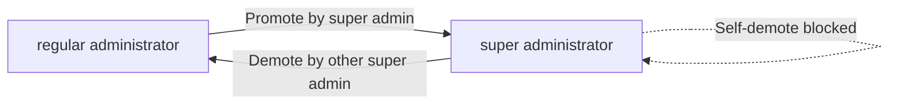
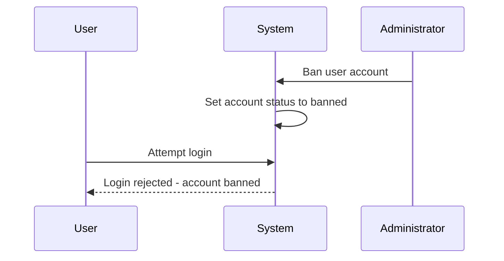

**shoppingMall — Business rules, validation constraints, data browsing expectations, error scenarios**

Business rules, validation constraints, data browsing expectations, error scenarios

# Domain Business Rules

Per-concept business rules, validation logic, and domain constraints.

## User Rules

Users must register with an email address and password to access any platform features. Guest browsing is not allowed on this platform. Email address serves as the primary identifier for login authentication. Users can change their password after registration. Customers can delete their account, which removes their profile information. When a customer deletes their account, their orders and order history are preserved for seller records and legal purposes. Reviews from deleted users are preserved but displayed as from a deleted user. Seller accounts require administrator approval before they can begin selling. Sellers can view their approval status which can be pending, approved, or rejected. Rejected sellers can view the rejection reason and submit a new registration request. Sellers can delete their account only if they have no pending orders or pending cancellation or refund requests. When a seller deletes their account, their products are removed from listings but order history and snapshots are preserved.

### Email and Password Registration

All users must register with an email address and password to access any platform features. Guest browsing is not permitted on this platform. The email address serves as the unique identifier for authentication and cannot be changed after registration. Each email address can only be associated with one user account. If a user attempts to register with an email address that is already registered, the registration request is rejected. Passwords must be provided during registration and are used for login authentication. If the email address is missing or invalid, the registration request is rejected. If the password is missing, the registration request is rejected.

### Password Change

Authenticated users can change their password at any time. The password change requires the user to provide their current password for verification. If the current password provided does not match the stored credential, the password change request is rejected. After a successful password change, the new password is used for all subsequent login attempts. The user receives confirmation that the password has been changed successfully.

### Customer Account Deletion

Customers can delete their account at any time. When a customer deletes their account, their profile information including display name and phone number is permanently deleted. All shipping addresses associated with the customer are deleted. The customer's orders and order history are preserved for seller records and legal purposes. Order items retain their association with the deleted customer account for historical accuracy. Reviews written by the deleted customer are preserved but displayed as from a deleted user instead of showing the customer's display name. The deleted customer's wishlist is deleted along with the account. The shopping cart is cleared upon account deletion. If the customer has pending orders, the account deletion proceeds but the orders remain accessible to the customer for viewing until completion.

### Seller Approval Process

Seller accounts require administrator approval before the seller can create products or begin selling on the platform. Upon registration, a seller's approval status is set to pending. Sellers can view their current approval status at any time. The approval status can be pending, approved, or rejected. If the seller registration is rejected, the seller can view the rejection reason provided by the administrator. Rejected sellers can submit a new registration request after addressing the rejection reason. While pending approval, sellers cannot create products, edit products, or manage inventory. If the seller status is rejected, the seller cannot create products or manage inventory until approved. Administrators must provide a reason when rejecting a seller registration request.

### Seller Account Deletion

Sellers can delete their account only if they have no pending orders with paid or shipped status. Sellers can delete their account only if they have no pending cancellation requests for their order items. Sellers can delete their account only if they have no pending refund requests for their order items. If any of these conditions are not met, the account deletion request is rejected with an explanation of which condition failed. When a seller deletes their account, all their products are removed from listings and no longer appear in search results or category pages. All product variants associated with the deleted seller are deleted. Order history and order snapshots are preserved for legal and record-keeping purposes. The shop name associated with past orders is preserved and remains visible in order history. Seller profile snapshots created before deletion are preserved. If the seller has suspended status, they must be unsuspended before deletion can proceed. If the seller is banned by an administrator, they cannot delete their account.

## CustomerProfile Rules

Each customer has a profile containing a display name and phone number. Customers can edit their display name at any time. Customers can edit their phone number at any time. The display name is shown to other users and sellers. The phone number is used for contact purposes related to orders. When a customer deletes their account, their profile information is deleted. Profile edits do not require administrator approval. Profile information must be accessible for order-related communications.

### Display Name and Phone Number Fields

Each customer profile must contain a display name. The display name is shown to other users and sellers throughout the platform. Each customer profile must contain a phone number. The phone number is used for contact purposes related to orders and shipping. Both the display name and phone number are required fields when creating a customer profile. The display name and phone number are stored as part of the customer's profile information. Profile fields use natural language values, not technical identifiers.

### Profile Editing Rules

Customers can edit their display name at any time. Customers can edit their phone number at any time. Profile edits do not require administrator approval. There is no limit on the number of times a customer can edit their display name. There is no limit on the number of times a customer can edit their phone number. Changes to profile information take effect immediately. Other users and sellers see the updated display name immediately after editing. Order-related communications use the current phone number on file.

### Account Deletion and Profile Removal

When a customer deletes their account, their profile information is deleted. The display name is removed from the platform when the account is deleted. The phone number is removed from the platform when the account is deleted. Despite profile deletion, the customer's orders and order history are preserved for seller records and legal purposes. Despite profile deletion, the customer's reviews are preserved but shown as "deleted user" instead of the display name. Past orders retain the shipping address information even after profile deletion. The preserved order history remains accessible to the seller for fulfillment and record-keeping purposes.

### Profile Visibility and Order Communication

Customer profile information must be accessible for order-related communications. Sellers can view the customer's display name associated with their orders. Sellers can view the customer's phone number for order and shipping communications. The display name appears on order details visible to sellers. The phone number is used by sellers and shipping carriers to contact the customer regarding delivery. Profile information remains accessible to sellers for all active and completed orders. If a customer deletes their account, the preserved order history no longer displays the customer's profile information but retains the shipping address for delivery purposes.

## SellerProfile Rules

Each seller has a profile with a shop name, shop description, and logo image. Sellers can edit their shop name, description, and logo. Every edit to the seller profile creates a snapshot to preserve the previous state. Customers can view seller profiles to learn about the shop. The shop name is displayed on product listings and order details. When a seller deletes their account, their shop name in past orders is preserved. Profile snapshots are immutable and cannot be deleted. Snapshots can be viewed by relevant parties for dispute resolution.

### Shop Profile Fields

Each seller profile must have a shop name, which is required and displayed on product listings and order details. The shop name must be unique across all sellers on the platform.

Each seller profile has a shop description, which is optional and provides information about the shop to customers.

Each seller profile has a logo image, which is optional and represents the shop visually. The logo image is displayed on the seller profile page and in order details.

All three fields (shop name, shop description, logo image) are captured in every seller profile snapshot when changes are made.

### Profile Editing Rules

Sellers can edit their shop name at any time, provided the new name is not already in use by another seller. If the shop name is already taken, the edit is rejected.

Sellers can edit their shop description at any time without restrictions.

Sellers can edit their logo image at any time by uploading a new image or removing the existing logo.

Every edit to the seller profile (shop name, shop description, or logo image) triggers the creation of a snapshot that preserves the previous state of all three fields.

### Profile Snapshot Creation

A seller profile snapshot is automatically created whenever the seller edits any field in their profile (shop name, shop description, or logo image).

Each snapshot records the timestamp of when the change was made, which fields were changed, and the values before and after the change.

The snapshot includes all three profile fields (shop name, shop description, logo image) regardless of which field was edited, preserving the complete state of the profile at that moment.

Snapshots are created before the new values are applied, ensuring the previous state is fully preserved.

### Customer Profile Viewing

Customers can view any seller's profile to learn about the shop, including the current shop name, shop description, and logo image.

The seller profile page displays the most recent values of all profile fields.

Customers cannot view the snapshot history of a seller profile; snapshots are only visible to the profile owner (seller) and administrators for dispute resolution purposes.

### Shop Name Display and Preservation

The shop name is displayed on product listings alongside each product from that seller.

The shop name is displayed in order details for each order item purchased from that seller.

When a seller deletes their account, the shop name associated with past orders is preserved and continues to display in order history for customers.

The preserved shop name in past orders reflects the shop name at the time of purchase, as captured in the order item's seller profile snapshot.

Product listings for a deleted seller's products are removed, but the shop name in historical orders remains visible to customers who purchased from that seller.

### Snapshot Immutability and Dispute Resolution

Seller profile snapshots are immutable and cannot be deleted or modified once created.

Snapshots are preserved indefinitely, even after the seller deletes their account.

The seller (profile owner) can view all snapshots of their own profile to track changes over time.

Administrators can view snapshots of any seller profile for dispute resolution purposes.

Snapshots serve as the authoritative record of the seller profile state at any point in time and are used to resolve disputes related to order items, where the shop name, description, and logo at the time of purchase are preserved in the order item's seller profile snapshot reference.

## Address Rules

Customers can add multiple shipping addresses to their account. Each address must include recipient name, phone number, street address, city, state or province, postal code, and country. Customers can edit any of their saved addresses. Customers can delete addresses they no longer need. Customers can set one address as their default shipping address. The default address is used automatically during checkout if selected. A shipping address is required to complete checkout. The shipping address cannot be changed once an order is placed.

### Multiple Address Management

Customers can maintain multiple shipping addresses in their account. There is no limit to the number of addresses a customer can save. Customers can edit any of their saved addresses at any time. When an address is edited, all fields are updated to the new values. Customers can delete any of their saved addresses. If a customer deletes their default address, they must select a new default address from their remaining addresses. Addresses associated with existing orders cannot be deleted. If a customer attempts to delete an address that is linked to a past order, the request is rejected.

### Address Field Requirements

Every shipping address must include all required fields. The recipient name field is required and cannot be empty. The phone number field is required and must contain a valid phone number format. The street address field is required and cannot be empty. The city field is required and cannot be empty. The state or province field is required and cannot be empty. The postal code field is required and cannot be empty. The country field is required and cannot be empty. If any required field is missing or invalid when creating or editing an address, the request is rejected.

### Default Address Configuration

Customers can designate one of their saved addresses as the default shipping address. Only one address can be set as the default at any time. When a customer sets a new default address, the previous default address is automatically unset. The default address is automatically selected during checkout if the customer chooses to use their default address. If a customer has no default address set, they must manually select an address during checkout. The default address setting is stored per customer account.

### Checkout Address Validation

A valid shipping address is required to complete the checkout process. If no address is selected during checkout, the order cannot be placed. Once an order is placed, the shipping address associated with that order is locked and cannot be changed. If a customer attempts to modify the shipping address of an existing order, the request is rejected. The locked address is preserved as part of the order record for shipping and legal purposes. Even if the original address is later deleted from the customer's account, the address on the order remains unchanged.

## Category Rules

Categories organize products on the platform. Each category has a name and description. Categories can have subcategories with one level of nesting only. Only administrators can create and manage categories. Customers can browse the list of all categories. Customers can view products within a category. Products must belong to a category, which can be a subcategory. When a category is deleted by an administrator, products in that category become uncategorized.

### Category Name and Description Validation

Each category must have a name that is not empty.
Each category must have a description that is not empty.
Category names must be unique among sibling categories (categories with the same parent).
Top-level categories (no parent) must have unique names across all top-level categories.
Category names cannot contain special characters that would cause display issues.
Category descriptions provide context about what products belong in the category.
If a category name is empty during creation, the request is rejected.
If a category description is empty during creation, the request is rejected.
If a category name duplicates an existing sibling category name, the request is rejected.

### Subcategory Nesting Constraint

Categories support exactly one level of subcategory nesting.
A subcategory can have a parent category, but cannot have its own subcategories.
Top-level categories can have subcategories.
Subcategories cannot have child categories.
When attempting to create a subcategory under an existing subcategory, the request is rejected.
The system enforces the one-level nesting rule during category creation.
The system enforces the one-level nesting rule during category parent reassignment.
If a category already has a parent, it cannot be assigned as a parent to another category.

### Administrator Category Creation and Management

Only administrators can create new categories.
Only administrators can edit existing categories.
Only administrators can delete existing categories.
Regular administrators and super administrators have equal permissions for category management.
When creating a category, administrators specify whether it is a top-level category or a subcategory.
When creating a subcategory, administrators select the parent category.
Administrators can edit category names at any time.
Administrators can edit category descriptions at any time.
Administrators can change a category's parent (from no parent to a parent, or from one parent to another).
Administrators can change a subcategory to a top-level category by removing its parent.
If a non-administrator attempts to create a category, the request is rejected.
If a non-administrator attempts to edit a category, the request is rejected.
If a non-administrator attempts to delete a category, the request is rejected.

### Customer Category Browsing

Customers can view the list of all top-level categories.
Customers can view subcategories under each top-level category.
Category lists show category names and descriptions.
Customers can navigate from a top-level category to its subcategories.
Customers can view all products within a specific category (top-level or subcategory).
Category browsing does not require any special permissions beyond customer account.
Products in subcategories are not automatically shown when viewing the parent category.
To view products in a subcategory, customers must explicitly navigate to that subcategory.
If a category has no products, the product list for that category is empty.

### Product Category Assignment

Every product must be assigned to exactly one category.
When creating a product, sellers must select a category for the product.
Sellers can select either a top-level category or a subcategory for their product.
A product cannot exist without a category assignment.
Sellers can change the category of their own products.
When changing a product's category, sellers can move it from a top-level category to a subcategory.
When changing a product's category, sellers can move it from a subcategory to a top-level category.
When changing a product's category, sellers can move it between sibling categories.
If a product is created without a category selection, the request is rejected.
If a seller attempts to assign a product to a non-existent category, the request is rejected.

### Category Deletion and Product Handling

Only administrators can delete categories.
When a category is deleted, all products in that category become uncategorized.
Uncategorized products are not visible in category browsing.
Uncategorized products may still appear in search results.
Administrators receive a warning before deleting a category that contains products.
The warning indicates how many products will become uncategorized.
Category deletion is immediate and cannot be undone.
Product snapshots preserve the category assignment at the time of each snapshot.
Order item snapshots preserve the category assignment at the time of purchase.
Deleting a top-level category also affects all its subcategories (subcategories become top-level or are also deleted based on platform policy).
If a non-administrator attempts to delete a category, the request is rejected.
If an administrator attempts to delete a non-existent category, the request is rejected.

## Product Rules

Sellers can create products on the platform. Every product must have a name, description, category, and base price. The product name is required and cannot be empty. The product description is required. The category is required and can be a subcategory. The base price is required. Products belong to the seller who created them. Sellers can edit their own products. Every product edit creates a snapshot to preserve the previous state. Sellers can delete their own products only if there are no pending order items for any variant. Sellers can delete products only if there are no pending cancellation or refund requests for any variant. Deleting a product also deletes all its variants and inventory records. Deleted products no longer appear in search or category listings. Product snapshots are preserved even after product deletion.

### Product Creation and Ownership

Only sellers can create products on the platform. Every product must have a name, and the name cannot be empty. Every product must have a description, and the description cannot be empty. Every product must be assigned to a category, which can be a parent category or a subcategory. Every product must have a base price specified. The product belongs to the seller who created it and cannot be transferred to another seller. If the product name is missing or empty, the creation request is rejected. If the product description is missing or empty, the creation request is rejected. If no category is selected, the creation request is rejected. If the base price is not specified, the creation request is rejected.

### Product Editing and Snapshot Creation

Only the seller who owns a product can edit that product. When a seller edits any field of a product, a snapshot is automatically created before the change is applied. The snapshot captures all product fields including name, description, category, base price, and all images at the moment of editing. The snapshot also includes snapshots of all product variants with their SKU codes, option values, prices, and stock quantities at that moment. Product snapshots are immutable and cannot be modified or deleted after creation. Sellers can view the snapshot history of their own products. Administrators can view snapshots of any product on the platform.

### Product Deletion Constraints

Only the seller who owns a product can delete that product. A product can be deleted only if none of its variants have order items with paid or shipped status. A product can be deleted only if none of its variants have pending cancellation requests. A product can be deleted only if none of its variants have pending refund requests. When a product is deleted, all variants of that product are also deleted. When a product is deleted, all inventory records for all variants are also deleted. If the product has pending order items, the deletion request is rejected. If the product has pending cancellation requests, the deletion request is rejected. If the product has pending refund requests, the deletion request is rejected.

### Deleted Product Visibility and Snapshot Retention

Deleted products do not appear in search results. Deleted products do not appear in category listings. Deleted products are automatically removed from all customer wishlists. Deleted products are marked as unavailable if they appear in any shopping cart. Product snapshots are preserved even after the product is deleted. Product variant snapshots within the product snapshot are also preserved after deletion. Order items that reference the deleted product retain their snapshot data showing the product name, description, and variant details at the time of purchase. Sellers can view snapshots of their deleted products. Administrators can view snapshots of any deleted product on the platform.

## ProductImage Rules

Sellers can upload multiple images for each product. Images can be reordered by the seller. The first image in the order is used as the main or thumbnail image. Sellers can delete images from their products. Image changes are included in product snapshots. The main image is displayed in product listings and search results. All images are displayed on the product detail page.

### Multiple Image Upload

Sellers can upload multiple images for each product. There is no minimum requirement for the number of images. Sellers can add images to existing products at any time. Only the seller who owns the product can upload images to that product. Images are stored as file references and displayed on the product detail page.

### Image Ordering and Main Image

Sellers can reorder images for their products. The order of images determines which image is displayed as the main or thumbnail image. The first image in the order is always used as the main image. The main image is displayed in product listings, search results, and category pages. When a seller reorders images, the change takes effect immediately for all display locations.

### Image Deletion

Sellers can delete images from their own products. A product can have zero images after deletion. If the main image (first image) is deleted, the next image in the order becomes the new main image. If all images are deleted, the product displays without any images. Deleting an image does not affect the product's availability or status.

### Image Snapshot Capture

All image changes are included in product snapshots. When a product is edited, the product snapshot captures all images at that moment, including their file references and display order. When images are added, removed, or reordered, a new product snapshot is created with the updated image state. Product snapshots preserve the complete image state even after the product is deleted.

### Image Display on Product Detail Page

All images for a product are displayed on the product detail page. Customers can view all images when viewing a single product. The images are displayed in the order set by the seller. The main image (first in order) is typically shown prominently, with other images available for viewing. All images remain visible on the detail page regardless of product availability or stock status.

## ProductVariant Rules

A product can have multiple variants representing different option combinations. Each variant represents a specific combination such as color and size. Each variant must have a unique SKU code. Each variant has option values like color Red or size Large. Each variant can have a price that overrides the base price. Each variant must have a stock quantity which starts at zero. Sellers can add variants to their products. Sellers can edit variants including SKU code, option values, and price. Every variant edit creates a snapshot. Sellers can delete variants only if there are no pending order items for that variant. Sellers can delete variants only if there are no pending cancellation or refund requests for that variant. A product must have at least one variant to be purchasable. Products with no variants are visible in search but shown as unavailable.

### Multiple Variants and Option Combinations

A product can have multiple variants representing different option combinations. Each variant represents a specific combination of options such as color and size. For example, a product can have variants like Red/Large, Red/Small, Blue/Large, and Blue/Small. Each variant is independently managed with its own SKU code, price, and stock quantity. Variants are displayed on the product detail page with their respective option values and availability status.

### Unique SKU Code Requirement

Each variant must have a unique SKU code that identifies it across the platform. The SKU code is required when creating a variant. No two variants on the platform can share the same SKU code. The SKU code serves as the unique identifier for the variant in orders, cart items, and inventory records. If a duplicate SKU code is provided, the request is rejected.

### Option Values Definition

Each variant has option values that define its specific characteristics. Option values include attributes like color (e.g., Red, Blue) and size (e.g., Large, Small, Medium). Option values are displayed to customers when selecting a variant. The combination of option values distinguishes one variant from another within the same product. Option values are captured in variant snapshots when edits are made.

### Price Override Capability

Each variant can have a price that overrides the product's base price. The price override is optional. If no price override is set, the variant uses the product's base price. If a price override is set, that price is used instead of the base price. Price overrides are captured in variant snapshots when edits are made. Customers see the variant-specific price when viewing product details.

### Stock Quantity Requirements

Each variant must have a stock quantity that tracks available inventory. The stock quantity is required when creating a variant. The stock quantity starts at zero when the variant is first created. Stock quantity is managed through inventory history records, not direct modification. When stock reaches zero, the variant is shown as out of stock. Out of stock variants cannot be added to the shopping cart.

### Variant Addition by Seller

Sellers can add variants to their own products. When adding a variant, the seller must provide a SKU code, option values, and initial stock quantity. The seller can optionally provide a price override for the variant. The variant is immediately associated with the product upon creation. The variant becomes visible to customers once created, subject to stock availability.

### Variant Editing and Snapshots

Sellers can edit their own variants including the SKU code, option values, and price override. Every variant edit creates a snapshot that preserves the previous state. The snapshot includes the SKU code, option values, price, and stock quantity at the time of edit. Snapshots are immutable and cannot be deleted. Sellers can view snapshots of their own variants for dispute resolution.

### Variant Deletion Conditions

Sellers can delete their own variants only if there are no pending order items for that variant. Pending order items include items with paid or shipped status. Sellers can delete variants only if there are no pending cancellation requests for that variant. Sellers can delete variants only if there are no pending refund requests for that variant. If any of these conditions are not met, the deletion request is rejected. Deleting a variant also deletes its inventory records.

### Minimum Variant Requirement and Unavailable Display

A product must have at least one variant to be purchasable. Products with no variants are visible in search results and category listings. Products with no variants are shown as unavailable to customers. Products with no variants cannot be added to the shopping cart. If all variants of a product are deleted, the product becomes unavailable for purchase. When a variant is out of stock, it is marked as unavailable in the shopping cart.

## InventoryRecord Rules

Each variant has its own stock quantity managed through inventory history records. Stock quantity is not directly modified but calculated from inventory records. Each inventory record contains a quantity change amount. Positive quantity changes represent restocking. Negative quantity changes represent orders or adjustments. Each inventory record contains a reason for the change. Each inventory record contains a timestamp. Current stock is calculated by summing all inventory records for a variant. Sellers can add inventory with a quantity and reason for restocking. Sellers can subtract inventory with a quantity and reason for adjustment or loss. Order placement automatically creates a negative inventory record. Order cancellation or refund automatically creates a positive inventory record. Sellers can view the full inventory history of each variant. When stock reaches zero, the variant is shown as out of stock.

### Stock Quantity Per Variant

Each product variant maintains its own independent stock quantity. Stock quantity is not stored as a single value but is calculated from the complete history of inventory records for that variant. Every variant starts with a stock quantity of zero when first created. The stock quantity represents the available units that customers can purchase.

### Inventory Record Structure

Each inventory record contains three pieces of information. The quantity change amount indicates how many units were added or removed. The reason explains why the inventory changed, such as restocking, order placement, adjustment, or loss. The timestamp records when the inventory change occurred. All inventory records are immutable and cannot be modified or deleted once created.

### Stock Calculation Method

Current stock quantity is calculated by summing all quantity change amounts from the inventory history records for a variant. Positive quantity change amounts represent units added to stock, such as restocking or returns from cancellation and refund. Negative quantity change amounts represent units removed from stock, such as order placement or inventory adjustments. The sum of all records determines the current available stock.

### Seller Inventory Management

Sellers can manually add inventory to increase stock quantity by providing a quantity amount and a reason for restocking. Sellers can manually subtract inventory to decrease stock quantity by providing a quantity amount and a reason for adjustment or loss. Both restocking and adjustment actions create new inventory records with positive or negative quantity change amounts respectively. Sellers have full control over manual inventory changes for their product variants.

### Automatic Inventory Updates

When a customer places an order, the system automatically creates negative inventory records for each purchased variant. The quantity change amount equals the purchased quantity for each variant. When an order item is cancelled, the system automatically creates a positive inventory record to restore the stock. When an order item is refunded, the system automatically creates a positive inventory record to restore the stock. These automatic updates ensure stock accuracy without seller intervention.

### Inventory History Access

Sellers can view the complete inventory history for each of their product variants. The inventory history displays all records in chronological order with the quantity change amount, reason, and timestamp for each record. Sellers can review the full history to track stock movements and understand how the current stock quantity was calculated. Inventory history viewing is read-only and does not allow modifications to existing records.

### Out of Stock Behavior

When the calculated stock quantity for a variant reaches zero, the variant is marked as out of stock. Out of stock variants are displayed with an out of stock indicator on product detail pages. Out of stock variants cannot be added to the shopping cart. If a variant becomes out of stock while in a customer's cart, the variant is marked as unavailable in the cart with a warning shown to the customer.

### Inventory History Records

All inventory changes are recorded as inventory history records. Each record captures a single inventory event with its quantity change, reason, and timestamp. Inventory history records provide a complete audit trail of stock movements for each variant. Records are created for manual seller actions such as restocking and adjustments. Records are also created for automatic system actions such as order placement, cancellation, and refund. The complete history enables accurate stock calculation and dispute resolution.

## Wishlist Rules

Customers can add products to their wishlist. The wishlist shows products not specific variants. Customers can view their wishlist which is paginated. Customers can remove products from their wishlist. If a product is deleted by the seller, it is automatically removed from all wishlists. The wishlist has a creation date for each entry. Wishlists are specific to each customer account.

### Product Addition to Wishlist

Customers can add products to their wishlist. A product is added as a whole, not a specific variant. If a customer attempts to add a product that is already in their wishlist, the request is rejected. If the product does not exist, the request is rejected. If the product has been deleted by the seller, the request is rejected. Each customer's wishlist is separate and isolated from other customers. A customer cannot view or modify another customer's wishlist. If a customer attempts to add a product while not logged in, the request is rejected.

### Wishlist Viewing and Pagination

Customers can view their own wishlist. The wishlist displays products with their main image, name, base price or price range, and seller shop name. The wishlist does not show specific variants, only the product level information. The wishlist is paginated when the number of products exceeds the page size. Wishlist entries are sorted by creation date, with the most recently added products appearing first. Each wishlist entry shows when the product was added to the wishlist. If a customer attempts to view another customer's wishlist, the request is rejected. If the customer has no products in their wishlist, an empty list is returned.

### Product Removal from Wishlist

Customers can remove products from their wishlist at any time. When a product is removed, the wishlist entry is deleted. If a customer attempts to remove a product that is not in their wishlist, the request is rejected. If the product has already been deleted by the seller, the removal request succeeds silently. When a seller deletes a product, that product is automatically removed from all customer wishlists. This automatic removal occurs immediately upon product deletion. Customers are not notified when a product is automatically removed from their wishlist due to seller deletion. If a customer attempts to remove a product while not logged in, the request is rejected.

## Cart Rules

Customers can add variants to their cart by selecting a specific variant. When adding to cart, customers must specify the quantity. If the same variant is already in the cart, the quantities are combined rather than added as a separate line. Customers can view their cart. The cart shows each item with product name, variant options, price, quantity, and subtotal. Customers can change the quantity of items in their cart. Customers can remove items from their cart. The cart shows the total price of all items. If a variant stock is less than the cart quantity, a warning is shown. If a variant is deleted or out of stock, it is marked as unavailable in the cart. Unavailable items cannot be checked out. Items are removed from the cart when an order is placed.

### Adding Items to Cart

Customers can add product variants to their cart by selecting a specific variant. When adding a variant to cart, the customer must specify the quantity. If the same variant already exists in the cart, the new quantity is combined with the existing quantity rather than creating a separate cart line. A customer can only have one active cart at a time.

### Viewing Cart Contents

Customers can view their cart at any time. The cart displays each item with the product name, variant options (such as color and size), unit price, quantity, and line subtotal. The cart shows the total price calculated as the sum of all item subtotals. If the cart is empty, no items are displayed and the total price is zero.

### Modifying Cart Items

Customers can change the quantity of any item in their cart. When quantity is changed, the line subtotal and cart total are recalculated immediately. Customers can remove any item from their cart. When an item is removed, the cart total is recalculated. Removing the last item results in an empty cart.

### Stock and Availability Validation

If a variant stock quantity is less than the cart quantity for that item, a low stock warning is shown to the customer. Variants that are deleted by the seller are marked as unavailable in the cart. Variants with zero stock (out of stock) are marked as unavailable in the cart. Unavailable items remain visible in the cart but are clearly distinguished from available items.

### Checkout and Order Constraints

Unavailable items cannot be included in checkout. If the cart contains any unavailable items, the customer must remove them or they are automatically excluded before proceeding to checkout. When an order is successfully placed, all items are removed from the customer cart. If payment fails and no order is created, items remain in the cart for the customer to retry.

## CartItem Rules

Each cart item represents a specific variant added to the cart. The cart item stores the quantity specified by the customer. When the same variant is added again, the existing cart item quantity is increased. Each cart item shows the product name and variant options. Each cart item shows the price and quantity. Each cart item shows the subtotal for that line. Cart item quantities can be changed by the customer. Cart items can be removed from the cart. Cart items are removed when the order is placed. Unavailable cart items cannot proceed to checkout.

### Cart Item Identity and Structure

Each cart item represents exactly one specific product variant. A cart item cannot represent a product without a variant selection.

Each cart item displays the product name from the associated product.

Each cart item displays the variant option values (such as color and size) that identify the specific variant.

Each cart item displays the unit price for the variant. If the variant has a price override, the overridden price is shown. Otherwise, the product base price is shown.

Each cart item displays the quantity specified by the customer for that variant.

Each cart item shows a subtotal calculated by multiplying the unit price by the quantity.

### Cart Item Quantity Management

Each cart item stores a quantity value representing how many units of that variant the customer wants to purchase.

When a customer adds a variant that already exists in their cart, the existing cart item quantity is increased by the new quantity. A separate cart item is not created.

Customers can change the quantity of any cart item. The new quantity replaces the existing quantity.

If the customer sets the quantity to zero, the cart item is removed from the cart.

If a variant's available stock is less than the cart item quantity, a warning is shown to the customer indicating insufficient stock.

### Cart Item Lifecycle

Customers can remove any cart item from their cart at any time before checkout.

When an order is successfully placed, all cart items are removed from the customer's cart.

If a variant is deleted by the seller, any cart item referencing that variant is marked as unavailable.

If a variant's stock quantity reaches zero, any cart item referencing that variant is marked as unavailable.

Cart items marked as unavailable cannot proceed to checkout. The customer must remove unavailable items or wait until the variant is available again before placing an order.

## Order Rules

An order is created when payment succeeds after checkout. An order contains one or more order items. Each order has an order number for identification. Each order has an order date recorded. Each order has a total price calculated from all items. Each order has a shipping address captured at placement. The shipping address cannot be changed once the order is placed. The overall order status is derived from its item statuses. If all items are paid, the order status is paid. If any item is shipped and none delivered, the order status is shipped. If all items are delivered, the order status is delivered. If all items are cancelled, the order status is cancelled. If all items are refunded, the order status is refunded. Mixed states result in partially completed order status.

### Order Creation and Identification

An order is created only when payment succeeds during checkout. If payment fails, no order is created and the customer can retry the payment. Each order is assigned a unique order number for identification purposes. The order number cannot be changed after creation. The order date is recorded automatically at the time of order creation. The order date reflects when the payment was successfully processed. The order date cannot be modified after the order is created. If a product variant becomes unavailable or out of stock during checkout, the order cannot be placed. If any item in the cart has insufficient stock, the order placement is rejected.

### Order Pricing Rules

The total price of an order is calculated by summing the subtotal of all order items. Each order item subtotal is calculated as the unit price multiplied by the quantity. The unit price for each order item is captured from the product variant price at the time of purchase. The total price is stored with the order and cannot be modified after order creation. Price changes to products or variants after order placement do not affect existing orders. The total price calculation must be accurate and match the sum of all item subtotals.

### Shipping Address Rules

A shipping address must be selected before an order can be placed. The customer can select from their saved addresses or use their default address. The complete shipping address is captured and stored with the order at the time of placement. The shipping address includes all required fields: recipient name, phone number, street address, city, state or province, postal code, and country. Once the order is placed, the shipping address cannot be changed or modified. If no shipping address is selected during checkout, the order cannot be placed.

### Order Status Derivation

The overall order status is derived automatically from the statuses of its order items. The order status cannot be set directly and is always calculated from item statuses. If all order items have status paid, the order status is paid. If any order item has status shipped and no items have status delivered, the order status is shipped. If all order items have status delivered, the order status is delivered. If all order items have status cancelled, the order status is cancelled. If all order items have status refunded, the order status is refunded. If order items have mixed statuses, such as some delivered and some refunded, the order status is partially completed. The order status updates automatically whenever any order item status changes.

## OrderItem Rules

Each order item represents a purchased product variant with a quantity. If a customer buys multiple of the same variant, it becomes one order item with that quantity. Order items can be from different sellers within the same order. Each order item has its own status independent of other items. Item statuses include paid, shipped, delivered, cancelled, and refunded. Each order item can be individually cancelled or refunded. A snapshot of the purchased product and variant is saved with the order item. A snapshot of the seller profile is saved with the order item. The snapshot preserves product name, description, variant options, and price at time of purchase. The snapshot preserves shop name and logo at time of purchase. Item status changes affect the overall order status.

### Order Item Structure and Quantity

Each order item represents exactly one product variant. If a customer purchases multiple units of the same variant, the order contains a single order item with the total quantity, not multiple separate items. An order can contain items from different sellers, with each item independently linked to its respective seller. The quantity field stores the number of units purchased for that variant. Each order item maintains its own status independent of other items in the same order.

### Order Item Status Lifecycle

Each order item progresses through status states: paid, shipped, delivered, cancelled, or refunded. An item starts with paid status when the order is successfully placed. The item transitions to shipped when the seller creates a shipment containing that item. The item transitions to delivered when the customer confirms delivery of the shipment or when 14 days have passed since shipping. The item transitions to cancelled when a cancellation request is approved by the seller. The item transitions to refunded when a refund request is approved by the seller. Once an item reaches cancelled or refunded status, it cannot transition to any other status.

### Snapshot Preservation at Purchase

When an order item is created, a snapshot of the product is preserved with the order item. This snapshot includes the product name, description, category, base price, and images as they existed at the time of purchase. A snapshot of the product variant is also preserved, including the SKU code, option values, price, and stock quantity at the time of purchase. A snapshot of the seller profile is preserved, including the shop name, description, and logo as they existed at the time of purchase. These snapshots ensure that the customer and seller can view the exact state of the product and seller profile at the time of purchase, even if the product or seller profile is later modified or deleted.

### Order Status Derivation from Items

The overall order status is derived from the statuses of its order items. If all items in the order have paid status, the order status is paid. If any item has shipped status and no items have delivered status, the order status is shipped. If all items have delivered status, the order status is delivered. If all items have cancelled status, the order status is cancelled. If all items have refunded status, the order status is refunded. If items have mixed statuses (for example, some delivered and some refunded), the order status is partially completed.

### Individual Item Cancellation and Refund

Each order item can be individually cancelled or refunded without affecting other items in the same order. Cancellation is only permitted for items with paid status. Once an item is shipped, it cannot be cancelled. Refund is only permitted for items with delivered status. A refund request must be submitted within 7 days of the item being delivered. When an item is cancelled or refunded, the remaining items in the order continue processing normally. The cancellation or refund of one item does not prevent other items from being shipped, delivered, or processed.

### Validation and Error Conditions

If a customer attempts to cancel an item that is not in paid status, the request is rejected. If a customer attempts to cancel an item that has already been shipped, the request is rejected. If a customer attempts to request a refund for an item that is not in delivered status, the request is rejected. If a customer attempts to request a refund more than 7 days after the item was delivered, the request is rejected. If a product variant is deleted before an order is placed, the variant cannot be added to the cart. If a product variant is out of stock, it cannot be added to the cart. If an order item references a product that has been deleted, the order item still displays the product information from the preserved snapshot.

## Shipment Rules

A shipment is a package sent by a seller. A shipment can contain one or more order items from the same seller. Different sellers always ship separately in different shipments. A seller can choose to ship items individually or bundle multiple items into one shipment. Sellers enter tracking information for the shipment including carrier name and tracking number. All items in the same shipment share the same tracking information. When a shipment is created, all items in it change to shipped status. Customers can view tracking information for each shipment. Customers confirm delivery per shipment not per item. When the customer confirms delivery, all items in that shipment change to delivered status. If the customer does not confirm, items automatically change to delivered after 14 days from shipping.

### Shipment Composition

A shipment represents a package sent by a seller. A shipment can contain one or more order items from the same seller. All order items in a shipment must belong to the same seller. Order items from different sellers cannot be combined into the same shipment. Different sellers always ship separately in different shipments. When a seller has multiple order items to ship, the seller can choose to ship items individually in separate shipments or bundle multiple items into one shipment. The seller decides how to group items into shipments at the time of shipping.

### Tracking Information Management

When creating a shipment, the seller must enter tracking information. The tracking information includes the carrier name. The tracking information includes the tracking number. All order items in the same shipment share the same tracking information. When a shipment is created with tracking information, all order items in that shipment change to shipped status. The tracking information cannot be changed after the shipment is created.

### Delivery Confirmation Process

Customers can view tracking information for each shipment in their order. Customers confirm delivery per shipment, not per individual order item. When the customer confirms delivery for a shipment, all order items in that shipment change to delivered status. If the customer does not manually confirm delivery, all order items in the shipment automatically change to delivered status after 14 days from the shipping date. The automatic delivery applies to all items in the shipment simultaneously.

## ProductSnapshot Rules

A product snapshot is created whenever a product is edited. The product snapshot includes all product fields such as name, description, category, base price, and images. The product snapshot also includes snapshots of all variants at that moment. This preserves the complete state of a product and its variants at any point in time. Product snapshots are immutable and cannot be deleted. Sellers can view snapshots of their own products. Administrators can view snapshots of any product on the platform. Snapshots are preserved even after the product is deleted. Snapshots can be viewed by relevant parties for dispute resolution.

### Snapshot Creation on Product Edit

A product snapshot is created automatically whenever a seller edits any field of their product. The snapshot captures all product fields at the moment of the edit, including the product name, description, category assignment, base price, and all product images. The snapshot is created before the edit is applied, preserving the previous state of the product. Each edit operation creates exactly one snapshot, regardless of how many fields are changed in that edit. If a seller makes multiple separate edits, each edit creates its own snapshot. The snapshot creation is automatic and cannot be skipped or disabled by the seller.

### Complete Product State Capture

Each product snapshot includes snapshots of all product variants that exist at the time of the product edit. The variant snapshots capture the SKU code, option values, price, and stock quantity for each variant. This ensures the complete state of the product and all its variants is preserved together in a single product snapshot. The product snapshot maintains the relationship between the product and its variants as they existed at that point in time. This complete state preservation enables accurate reconstruction of what the product looked like at any historical point.

### Snapshot Immutability

Product snapshots are immutable once created. No user, including sellers, administrators, or super administrators, can modify a product snapshot after it is created. Product snapshots cannot be deleted by any user or system process. The immutable nature of snapshots ensures an accurate historical record for dispute resolution and audit purposes. Any attempt to modify or delete a product snapshot is rejected by the system.

### Snapshot Access Permissions

Sellers can view all snapshots of their own products. Sellers cannot view snapshots of products they do not own. Administrators can view snapshots of any product on the platform, regardless of ownership. Super administrators have the same snapshot viewing permissions as regular administrators. Snapshot access is provided for dispute resolution purposes, allowing relevant parties to review historical product states. When viewing snapshots, users can see the timestamp of when the snapshot was created and all captured field values.

### Snapshot Preservation After Product Deletion

Product snapshots are preserved even after the associated product is deleted by the seller. When a product is deleted, all existing snapshots of that product remain accessible to users who had viewing permissions before deletion. Sellers can still view snapshots of their deleted products. Administrators can still view snapshots of any deleted product. This preservation ensures that historical records remain available for order item references and dispute resolution, even when the original product no longer exists in the active catalog.

## ProductVariantSnapshot Rules

A product variant snapshot is created when a variant is edited. The variant snapshot includes the SKU code, option values, and price at the time of the edit. Variant snapshots are also included when a product snapshot is created. This preserves the variant state at the moment of the product edit. Variant snapshots are immutable and cannot be deleted. Snapshots preserve the state for dispute resolution. Relevant parties including owners and administrators can view variant snapshots.

### Snapshot Creation on Variant Edit

A product variant snapshot is created automatically whenever a seller edits any field of a product variant. The snapshot captures the SKU code at the time of the edit. The snapshot captures the option values such as color and size at the time of the edit. The snapshot captures the price at the time of the edit. The snapshot records the timestamp when the edit was made. If the variant is edited multiple times, a separate snapshot is created for each edit. The snapshot preserves the complete state of the variant at that specific moment.

### Inclusion in Product Snapshots

When a product snapshot is created, all variant snapshots at that moment are included within the product snapshot. This ensures the complete state of the product and all its variants is preserved together. The variant snapshots included in a product snapshot reflect the state of each variant at the time the product edit occurred. This linkage maintains the relationship between the product and its variants for historical reference. The variant state is preserved as part of the product snapshot for accurate order item reconstruction.

### Immutability and Deletion Prevention

Product variant snapshots are immutable once created. No user including sellers or administrators can modify a variant snapshot after it is created. Product variant snapshots cannot be deleted by any user. Variant snapshots remain in the system even if the original variant is deleted. Variant snapshots remain in the system even if the parent product is deleted. The immutable nature ensures an accurate historical record is maintained for all variant changes.

### Snapshot Access for Dispute Resolution

Sellers can view the snapshots of their own product variants. Administrators can view the snapshots of any product variant on the platform. Super administrators can view the snapshots of any product variant on the platform. Variant snapshots are accessible for dispute resolution purposes. The preserved variant state enables verification of product information at the time of purchase. Order items reference the variant snapshot to show customers what they purchased.

## SellerProfileSnapshot Rules

A seller profile snapshot is created whenever a seller profile is edited. The snapshot includes shop name, shop description, and logo at the time of the edit. Seller profile snapshots are immutable and cannot be deleted. A snapshot of the seller profile is saved with each order item at the time of purchase. This preserves the shop name and logo as they appeared when the customer made the purchase. Snapshots can be viewed by relevant parties for dispute resolution. Snapshots are preserved even if the seller deletes their account.

### Snapshot Creation on Profile Edit

### Snapshot Creation on Profile Edit

WHEN a seller edits their shop name, THE system SHALL create a seller profile snapshot capturing the previous shop name value.

WHEN a seller edits their shop description, THE system SHALL create a seller profile snapshot capturing the previous shop description value.

WHEN a seller edits their logo image, THE system SHALL create a seller profile snapshot capturing the previous logo image value.

THE system SHALL include the shop name in every seller profile snapshot.

THE system SHALL include the shop description in every seller profile snapshot.

THE system SHALL include the logo image in every seller profile snapshot.

THE system SHALL mark all seller profile snapshots as immutable upon creation.

IF a user attempts to modify a seller profile snapshot, THEN THE system SHALL reject the request.

IF a user attempts to delete a seller profile snapshot, THEN THE system SHALL reject the request.

Seller profile snapshots cannot be deleted by any user, including administrators.

### Order Item Snapshot Preservation

### Order Item Snapshot Preservation

WHEN an order is placed successfully, THE system SHALL save a seller profile snapshot with each order item in that order.

THE system SHALL capture the seller profile state at the time of purchase for each order item.

THE seller profile snapshot saved with an order item SHALL preserve the shop name as it appeared when the customer made the purchase.

THE seller profile snapshot saved with an order item SHALL preserve the logo image as it appeared when the customer made the purchase.

THE shop name preservation in order item snapshots ensures customers can identify the seller from past orders even if the seller later changes their shop name.

THE logo preservation in order item snapshots ensures visual consistency in order history regardless of subsequent seller profile changes.

### Snapshot Access and Retention

### Snapshot Access and Retention

WHERE dispute resolution is required, THE system SHALL allow relevant parties to view seller profile snapshots associated with their order items.

THE system SHALL allow sellers to view seller profile snapshots of their own products' order items.

THE system SHALL allow customers to view seller profile snapshots from their own order history.

THE system SHALL allow administrators to view any seller profile snapshot for dispute resolution purposes.

IF a seller deletes their account, THEN THE system SHALL preserve all seller profile snapshots associated with that seller's order items.

Seller profile snapshots remain accessible for order history and dispute resolution even after the seller's account has been deleted.

THE preservation of seller profile snapshots after account deletion ensures customers can still identify sellers from past orders.

## Review Rules

Customers can write a review for products they have purchased. A review can only be written after the item status is delivered. Customers can write one review per product per order. Each review has a rating from 1 to 5 stars which is required. Each review has text content which is optional. Reviews are displayed on the product detail page. Reviews are sorted by newest first. Customers can edit their own reviews. Every review edit creates a snapshot. Customers can delete their own reviews but snapshots are preserved. The product average rating is calculated from all non-deleted reviews.

### Review Eligibility

A customer can only write a review for a product they have purchased. A review can only be submitted after the corresponding order item status has changed to delivered. If the customer has not purchased the product, the review submission is rejected. If the order item status is not delivered (e.g., paid, shipped, cancelled, or refunded), the review submission is rejected. A customer cannot write a review for an order item that has been cancelled or refunded.

### Review Uniqueness

A customer can write only one review per product per order. If a customer attempts to submit a second review for the same product within the same order, the request is rejected. A customer can write separate reviews for the same product if it was purchased in different orders. The system validates uniqueness based on the combination of customer, product, and order.

### Review Content Validation

Each review must include a rating from 1 to 5 stars. The rating is required and cannot be omitted. If the rating is outside the range of 1 to 5, the request is rejected. Each review may include text content which is optional. If text content is provided, it must not be empty. If the rating is missing or invalid, the review submission is rejected.

### Review Display and Sorting

Reviews are displayed on the product detail page for customer viewing. Reviews are sorted by newest first, with the most recently submitted or edited reviews appearing at the top. The product detail page shows the total count of reviews alongside the average rating. Deleted reviews are not displayed on the product detail page but their snapshots remain accessible to administrators.

### Review Modification

A customer can edit their own reviews after submission. The customer can modify both the rating and the text content of their review. Every review edit creates a snapshot that preserves the previous state including the rating and text content before the change. Review snapshots are immutable and cannot be modified or deleted. The customer can view their own review history through snapshots.

### Review Deletion

A customer can delete their own reviews at any time. When a review is deleted, it is removed from the product detail page and is no longer visible to other customers. The review snapshots created during edits are preserved even after the review is deleted. Deleted reviews cannot be restored. Only the customer who wrote the review can delete it.

### Average Rating Calculation

The product average rating is calculated from all non-deleted reviews for that product. Deleted reviews are excluded from the average rating calculation. The average is computed by summing all ratings from non-deleted reviews and dividing by the count of non-deleted reviews. If a product has no non-deleted reviews, no average rating is displayed. The average rating is updated whenever a review is submitted, edited, or deleted.

## ReviewSnapshot Rules

A review snapshot is created whenever a review is edited. The snapshot includes the rating and text content at the time of the edit. Review snapshots are immutable and cannot be deleted. Snapshots are preserved even after the review is deleted. This preserves the review history for dispute resolution. Relevant parties can view review snapshots to see previous versions.

### Snapshot Creation on Edit

A review snapshot is created automatically whenever a customer edits their review. The snapshot captures the state of the review at the moment before the edit is applied. Multiple edits result in multiple snapshots, preserving the complete edit history. The snapshot creation is mandatory and cannot be skipped or disabled.

### Captured Review Data

Each review snapshot captures the rating value (1 to 5 stars) at the time of the edit. The text content of the review is also captured in the snapshot. Both the rating and text content are stored as they appeared before the edit. This ensures an accurate record of what the review contained at each point in time.

### Immutability and Deletion Restrictions

Review snapshots are immutable once created. The content of a snapshot cannot be modified, updated, or altered in any way. Review snapshots cannot be deleted by any party, including the review owner, seller, or administrators. This immutability ensures the integrity of the review history for verification purposes.

### Preservation After Review Deletion

When a customer deletes their review, all existing snapshots of that review are preserved. The snapshots remain accessible even though the current review no longer exists. This ensures that the review history is maintained for dispute resolution, even if the customer chooses to remove their review from public view.

### Access for Dispute Resolution

Review snapshots can be viewed by relevant parties for dispute resolution purposes. The review owner can view snapshots of their own reviews to see previous versions. Administrators can view snapshots of any review when investigating disputes. This access enables verification of what a review contained at any point in time.

## AdminRequest Rules

Any user whether customer or seller can submit a request to become an administrator. The request includes a reason text explaining why the user wants to become an administrator. Super administrators can view the list of pending administrator requests. Super administrators can approve administrator requests. Super administrators can reject administrator requests. When a request is approved, the user becomes a regular administrator. The request has a status that tracks its state. The request has a submitted date recorded.

### Admin Request Submission

Any user with a customer or seller account can submit a request to become an administrator. Both customers and sellers are eligible to submit admin requests. The request must include a reason text explaining why the user wants to become an administrator. The reason text is required and cannot be empty. The submitted date is automatically recorded when the request is created. A user can have only one pending admin request at a time. If a user already has a pending request, they cannot submit another until the existing request is resolved.

### Admin Request Review

Super administrators can view the list of pending administrator requests. Super administrators can approve administrator requests. Super administrators can reject administrator requests. When rejecting a request, the super administrator may provide feedback to the requesting user. Each request can only be reviewed once. After a request is approved or rejected, no further action can be taken on that request. Super administrators review requests in the order they were submitted, but may prioritize based on business needs.

### Admin Request Status

The request has a status that tracks its state through the review process. Valid statuses are pending, approved, and rejected. When a request is approved, the user becomes a regular administrator. The status transitions from pending to approved or rejected upon super administrator action. The submitted date is recorded when the request is created and cannot be modified. The status change date is recorded when the super administrator approves or rejects the request.

## CancellationRequest Rules

Cancellation is handled per order item not per entire order. Customers can request cancellation for individual items with paid status only. Items that are already shipped cannot be cancelled. Cancellation requests include a reason text. The seller of that item can approve the cancellation request. The seller of that item can reject the cancellation request. When approved, that item is cancelled and refund is processed for that item only. Cancelled items restore their stock quantities via inventory record. The remaining items in the order continue processing normally. If all items in an order are cancelled, the entire order status becomes cancelled.

### Cancellation Request Scope

Cancellation requests apply to individual order items, not to entire orders. A customer can request cancellation for one item while other items in the same order continue processing normally.

Cancellation requests can only be submitted for order items with "paid" status. Items that have already been shipped cannot be cancelled through the cancellation request process.

If a customer attempts to request cancellation for an item that is already shipped, the request is rejected.

### Cancellation Request Submission

When submitting a cancellation request, the customer must provide a reason as text. The reason field is required and cannot be empty.

The cancellation request is submitted for a specific order item and is directed to the seller of that item.

### Seller Cancellation Response

The seller of the order item can approve the cancellation request. The seller of the order item can reject the cancellation request.

When the seller responds to the cancellation request, a snapshot of the request state is created, capturing the request status and the seller's response at that moment.

### Cancellation Approval Effects

When a cancellation request is approved, the order item status changes to "cancelled". A refund is processed for that specific item only.

The stock quantity for the cancelled item's variant is restored through an inventory record with a positive quantity change. This ensures inventory accuracy after cancellation.

### Order Status After Cancellation

When an order item is cancelled, the remaining items in the order continue processing normally without interruption.

If all items in an order are cancelled, the overall order status becomes "cancelled". This reflects that no items in the order will be fulfilled.

## CancellationRequestSnapshot Rules

A cancellation request snapshot is created when the seller responds to the request. The snapshot includes the request status and seller response at the time of response. Cancellation request snapshots are immutable and cannot be deleted. Snapshots preserve the request state for dispute resolution. Relevant parties can view snapshots to see the history of the cancellation request.

### Snapshot Creation on Seller Response

A cancellation request snapshot is created when the seller responds to the cancellation request. The snapshot captures the request status at the time of the seller's response. The snapshot captures the seller's response (approval or rejection) at the time of response. The snapshot is created automatically when the seller submits their decision. The snapshot includes the timestamp of when the seller responded. If the seller has not yet responded, no snapshot exists for that request. Each seller response creates exactly one snapshot. Multiple responses to the same request create multiple snapshots, preserving each response state.

### Immutable Snapshot Preservation

Cancellation request snapshots are immutable once created. Cancellation request snapshots cannot be modified after creation. Cancellation request snapshots cannot be deleted by any user. Cancellation request snapshots cannot be deleted by administrators. Cancellation request snapshots cannot be deleted by the seller who responded. Cancellation request snapshots cannot be deleted by the customer who requested cancellation. The request state is preserved indefinitely through snapshots. Snapshots preserve the exact state of the cancellation request at the time of each seller response. Snapshots ensure an auditable history of all cancellation request decisions.

### Snapshot Access for Dispute Resolution

Relevant parties can view cancellation request snapshots for dispute resolution. The customer who requested cancellation can view snapshots of their cancellation requests. The seller who responded to the request can view snapshots of their responses. Administrators can view snapshots of any cancellation request for dispute resolution. Super administrators can view snapshots of any cancellation request. Snapshots can be viewed to see the complete history of a cancellation request. The history shows all seller responses in chronological order. Each snapshot in the history shows the request status and seller response at that point in time.

## RefundRequest Rules

Refund is handled per order item not per entire order. Customers can request a refund for individual items with delivered status. Refund can be requested within 7 days of the item being delivered. Refund requests include a reason text. The seller of that item can approve the refund request. The seller of that item can reject the refund request. When approved, that item is refunded. Refunded items restore their stock quantities via inventory record. The remaining items in the order are unaffected. If all items in an order are refunded, the entire order status becomes refunded.

### Refund Request Eligibility

Refunds are processed per order item, not per entire order. Each order item must be requested for refund individually.

Only order items with delivered status are eligible for refund requests. Items with paid, shipped, cancelled, or refunded status cannot be requested for refund.

Refund requests must be submitted within 7 days of the item being delivered. Requests submitted after this 7-day period are rejected.

Each refund request must include a reason as text. Requests without a reason are rejected.

If the item status is not delivered, the refund request is rejected.
If the refund request is submitted more than 7 days after delivery, the request is rejected.
If the reason text is missing or empty, the request is rejected.

### Seller Refund Response

The seller of the order item can approve the refund request.
The seller of the order item can reject the refund request.

When the seller responds to a refund request, a snapshot of the request state is created. This snapshot records the request status and seller response at that moment.

Refund request snapshots are immutable and cannot be deleted. They are preserved for dispute resolution.

If the seller does not respond, the refund request remains in pending status.

### Refund Approval Consequences

When a refund request is approved, that order item status changes to refunded.

When an item is refunded, its stock quantity is restored via an inventory record. A positive quantity change is recorded with the reason indicating refund restoration.

The remaining items in the order continue processing normally and are unaffected by the refund of one item.

If all items in an order are refunded, the entire order status becomes refunded.

If some items are refunded while others remain in different states, the order status reflects a partially completed state.

## RefundRequestSnapshot Rules

A refund request snapshot is created when the seller responds to the request. The snapshot includes the request status and seller response at the time of response. Refund request snapshots are immutable and cannot be deleted. Snapshots preserve the request state for dispute resolution. Relevant parties can view snapshots to see the history of the refund request.

### Snapshot Creation and Content

A refund request snapshot is created automatically when the seller responds to the refund request. The snapshot captures the request status at the time of the seller's response. The snapshot also captures the seller's response, including whether the request was approved or rejected. The snapshot preserves the complete state of the refund request at that moment, including the refund reason submitted by the customer and the timestamp of the seller's response. Each seller response generates exactly one snapshot, ensuring a complete history of all response actions.

### Snapshot Immutability

Refund request snapshots are immutable once created. The content of a snapshot cannot be modified, edited, or altered in any way after creation. Refund request snapshots cannot be deleted by any user, including the customer who submitted the request, the seller who responded, or administrators. This immutability ensures the integrity of the refund request history and prevents tampering with historical records. The system preserves all snapshots indefinitely as part of the order record.

### Snapshot Access and Viewing

Refund request snapshots are accessible for dispute resolution purposes. The customer who submitted the refund request can view all snapshots for their refund requests. The seller who responded to the refund request can view all snapshots for refund requests on their order items. Administrators can view snapshots of any refund request on the platform for oversight and dispute mediation. Snapshots provide a complete history of the refund request, allowing relevant parties to see how the request status changed over time and what responses were provided by the seller. This viewing capability supports transparent dispute resolution and accountability.

## Administrator Rules

There are two administrator grades: regular administrator and super administrator. Super administrators can promote regular administrators to super administrator. Super administrators can demote other super administrators to regular administrator. Super administrators cannot demote themselves. Administrators can view the list of pending seller approvals. Administrators can approve or reject seller registrations. When rejecting, administrators must provide a reason. Administrators can suspend seller accounts. When suspended, seller products are hidden from search and cannot be purchased. Suspended sellers can still process existing orders. Administrators can unsuspend seller accounts. Administrators can ban customers and sellers. Banned users cannot log in but existing orders remain.

### Administrator Grade Hierarchy

There are two administrator grades: regular administrator and super administrator.

WHEN a regular administrator is promoted, THE system SHALL grant super administrator grade to that administrator.

WHEN a super administrator demotes another super administrator, THE system SHALL change that administrator's grade to regular administrator.

IF a super administrator attempts to demote themselves, THEN THE system SHALL reject the request.

Super administrators can promote regular administrators to super administrator.

Super administrators can demote other super administrators to regular administrator.

Super administrators cannot demote themselves.

### Seller Approval Management

Administrators can view the list of pending seller approvals.

WHEN a seller submits a registration request, THE system SHALL place it in pending approval status.

WHEN an administrator approves a seller registration, THE system SHALL change the seller's approval status to approved.

WHEN an administrator rejects a seller registration, THE system SHALL change the seller's approval status to rejected.

IF an administrator rejects a seller registration, THEN THE system SHALL require a rejection reason to be provided.

Rejected sellers can view the rejection reason.

Rejected sellers can submit a new registration request.

Administrators can approve or reject seller registrations.

When rejecting, administrators must provide a reason.

### Seller Suspension Management

Administrators can suspend seller accounts.

Administrators can unsuspend seller accounts.

WHILE a seller account is suspended, THE system SHALL hide all products from that seller from search and category listings.

WHILE a seller account is suspended, THE system SHALL prevent any purchases of that seller's products.

WHILE a seller account is suspended, THE system SHALL allow the seller to process existing orders including shipping items and responding to cancellation or refund requests.

WHILE a seller account is suspended, THE system SHALL prevent the seller from creating new products.

WHILE a seller account is suspended, THE system SHALL prevent the seller from editing existing products.

When a seller is suspended, their products are hidden from search and cannot be purchased.

Suspended sellers can still process existing orders.

When suspended, seller products are hidden from search and category listings.

### User Account Banning

Administrators can ban customer accounts.

Administrators can ban seller accounts.

Administrators can unban customer accounts.

Administrators can unban seller accounts.

WHEN a customer account is banned, THE system SHALL prevent that customer from logging in.

WHEN a seller account is banned, THE system SHALL prevent that seller from logging in.

WHILE a customer account is banned, THE system SHALL preserve all existing orders for that customer.

WHILE a seller account is banned, THE system SHALL preserve all existing orders for that seller.

Banned customers cannot log in.

Banned sellers cannot log in.

Banned users cannot log in but existing orders remain.

# Data Browsing Expectations

Business expectations for how users browse, find, and navigate through lists of data.

## List Browsing Expectations

Define business expectations for how users find, filter, and browse lists.

### Product Search Filtering

Customers can filter search results by category to narrow down products within specific categories or subcategories. Customers can filter by price range by specifying minimum and maximum price values. Customers can filter to show only in-stock items, excluding products where all variants are out of stock. Multiple filters can be applied simultaneously to refine search results. If no products match the selected filters, an empty result set is shown. Filter selections persist while browsing within the same search session. If a selected category is deleted by an administrator, the filter is cleared and results are shown without that filter.

### Product Search Sorting

Customers can sort search results by newest first to see recently added products at the top. Customers can sort by price from low to high to find the most affordable options. Customers can sort by price from high to low to see premium products first. Only one sorting option can be applied at a time. If no sort option is selected, results are shown in default order (newest first). Sorting applies to the entire filtered result set. If a product's price changes while viewing sorted results, the sort order reflects the updated price on refresh.

### List Pagination

Search results are displayed in pages with a fixed number of items per page to improve performance and usability. Wishlist is paginated to show products in manageable groups. Order history is paginated and sorted by newest first by default. When a list has no items, an empty state message is shown instead of an error. Navigation controls are provided to move between pages for lists with multiple pages. Page numbers or next/previous navigation is available. If a product is deleted while viewing a paginated list, it is removed from the list on refresh and may result in fewer total pages. If the user navigates to a page beyond the available range, the last available page is shown.

# Error Conditions

Business error scenarios and how the system should respond.

## Error Scenarios

Describe error conditions and expected system responses in natural language.

### Authentication and Account Errors

If the email address is not registered, the login request is rejected.
If the password does not match the email address, the login request is rejected.
If the customer account is banned by an administrator, the login request is rejected.
If the seller account is banned by an administrator, the login request is rejected.
If a seller account is pending administrator approval, the seller cannot list products or receive orders.
If a seller account is rejected, the seller cannot list products until a new registration request is approved.
If a user attempts to access another user's account information, the request is rejected.
If a customer attempts to delete their account while having pending orders, the deletion request is rejected.
If a seller attempts to delete their account while having pending orders, the deletion request is rejected.
If a seller attempts to delete their account while having pending cancellation requests, the deletion request is rejected.
If a seller attempts to delete their account while having pending refund requests, the deletion request is rejected.

### Seller Registration Rejection Scenarios

If an administrator rejects a seller registration request, the seller is notified of the rejection reason.
If a seller registration is rejected, the seller cannot create products or manage a shop.
If a seller submits a new registration request after rejection, the previous rejection reason is cleared.
If a seller attempts to access seller features without approved status, the request is rejected.
If an administrator attempts to approve a seller without reviewing the registration, the action is rejected.
If a rejected seller attempts to view their shop profile as a customer, the shop is not displayed.

### Product and Variant Operation Errors

If a seller attempts to delete a product with pending order items, the deletion request is rejected.
If a seller attempts to delete a product with pending cancellation requests, the deletion request is rejected.
If a seller attempts to delete a product with pending refund requests, the deletion request is rejected.
If a seller attempts to delete a variant with pending order items, the deletion request is rejected.
If a seller attempts to delete a variant with pending cancellation requests, the deletion request is rejected.
If a seller attempts to delete a variant with pending refund requests, the deletion request is rejected.
If a seller attempts to edit a product while their account is suspended, the edit request is rejected.
If a seller attempts to create a new product while their account is suspended, the creation request is rejected.
If a seller attempts to edit another seller's product, the request is rejected.
If a seller attempts to delete another seller's product, the request is rejected.
If a product has no variants, the product is shown as unavailable and cannot be purchased.
If a variant's stock quantity is zero, the variant is marked as out of stock and cannot be added to cart.

### Cart and Checkout Failure Cases

If a variant is out of stock, it cannot be added to the shopping cart.
If a variant is deleted by the seller while in a customer's cart, the item is marked as unavailable.
If a variant's stock is less than the quantity in the cart, a warning is shown to the customer.
If the cart contains unavailable items, those items cannot be checked out.
If a customer attempts to checkout with an empty cart, the checkout request is rejected.
If a customer attempts to checkout without selecting a shipping address, the checkout request is rejected.
If a customer attempts to checkout with only unavailable items, the checkout request is rejected.
If the same variant is added to the cart multiple times, the quantities are combined rather than creating duplicate entries.

### Order and Payment Exception Handling

If payment fails during checkout, the order is not created and the customer can retry.
If payment fails, the stock quantities are not decreased.
If payment fails, the items remain in the customer's cart.
If a customer attempts to view an order that does not belong to them, the request is rejected.
If a customer attempts to view another customer's order history, the request is rejected.
If an order item status is shipped, the item cannot be cancelled by the customer.
If an order item status is delivered, the item cannot be cancelled by the customer.
If an order item status is cancelled, the item cannot be refunded.
If an order item status is refunded, the item cannot be refunded again.
If a customer attempts to confirm delivery for a shipment that is not yet shipped, the request is rejected.

### Cancellation and Refund Request Errors

If a customer requests cancellation for an item with status shipped, the request is rejected.
If a customer requests cancellation for an item with status delivered, the request is rejected.
If a customer requests cancellation for an item with status cancelled, the request is rejected.
If a customer requests a refund for an item with status paid, the request is rejected.
If a customer requests a refund for an item with status shipped, the request is rejected.
If a customer requests a refund more than 7 days after delivery, the request is rejected.
If a customer requests a refund for an item already refunded, the request is rejected.
If a seller attempts to approve a cancellation request for another seller's item, the request is rejected.
If a seller attempts to approve a refund request for another seller's item, the request is rejected.
If a cancellation request is already approved, it cannot be approved again.
If a refund request is already approved, it cannot be approved again.

### Review and Rating Error Conditions

If a customer attempts to write a review for a product they have not purchased, the request is rejected.
If a customer attempts to write a review before the item status is delivered, the request is rejected.
If a customer attempts to write a second review for the same product in the same order, the request is rejected.
If a customer attempts to edit another customer's review, the request is rejected.
If a customer attempts to delete another customer's review, the request is rejected.
If a customer attempts to rate a product below 1 star or above 5 stars, the request is rejected.
If a product is deleted by the seller, reviews for that product are preserved but shown as deleted user.

### Administrator Action Exception Cases

If a super administrator attempts to demote themselves, the request is rejected.
If a regular administrator attempts to promote another administrator to super administrator, the request is rejected.
If a regular administrator attempts to demote a super administrator, the request is rejected.
If an administrator attempts to ban a user without proper authorization, the request is rejected.
If an administrator attempts to delete a category that does not exist, the request is rejected.
If an administrator attempts to approve a seller that is already approved, the request is rejected.
If an administrator attempts to reject a seller that is already rejected, the request is rejected.
If an administrator attempts to force-cancel an item that is already shipped, the action may proceed with stock restoration.
If an administrator attempts to force-refund an item that is already refunded, the request is rejected.

### Wishlist and Search Error Scenarios

If a product is deleted by the seller, it is automatically removed from all customer wishlists.
If a customer attempts to add a deleted product to their wishlist, the request is rejected.
If a customer attempts to view another customer's wishlist, the request is rejected.
If a customer attempts to search with invalid filter parameters, the search returns no results.
If a customer attempts to filter by a category that does not exist, the search returns no results.
If a customer attempts to sort by an unsupported criterion, the default sorting is applied.
If pagination parameters exceed valid ranges, the system returns the first page or an empty result.

# File Validation Rules

Validation rules and policies for file uploads and storage.

## File Validation and Policies

Define file type restrictions, virus scanning requirements, content validation, and retention policies for uploaded files.

### File Type Validation

Seller logo images must be in a supported image format. The system validates uploaded files to ensure they are valid image files. If the file format is not supported, the upload is rejected. If the file content does not match the declared type, the upload is rejected.

### Image Upload Process

Seller logo images are uploaded through the seller profile management interface. Uploaded files are stored and associated with the seller profile. The system processes the uploaded image for display across the marketplace. Files that fail to upload are rejected and the seller is notified.

### File Retention Policies

Seller logo images are retained while the seller account remains active. Logo images captured in order snapshots are preserved for order history and dispute resolution purposes. Snapshot images remain accessible even after seller account changes.

# Integration Error Handling

Error handling and retry policies for external integrations.

## Integration Failure Policies

Define retry strategies, circuit breaker policies, fallback behavior, and error escalation for external service failures.

### Payment Integration Retry

When payment processing fails, the order is not created. The customer is notified of the payment failure. The customer can retry the payment with the same cart contents. The cart items remain in the cart until payment succeeds or the customer removes them. If payment fails multiple times, the customer can continue attempting payment or abandon the checkout process. Stock quantities are not reserved during the payment process. Stock is only decreased when payment succeeds and the order is created.

### Circuit Breaker Behavior

When the payment gateway experiences repeated failures, the system prevents new checkout attempts from proceeding to payment processing. Customers attempting checkout during this period are informed that payment processing is temporarily unavailable. The system monitors payment gateway availability. When the payment gateway recovers, normal checkout processing resumes. This protects customers from repeated failed payment attempts during known service outages.

### Fallback Payment Handling

If the primary payment gateway is unavailable, the system displays a service unavailable message to customers attempting checkout. Customers cannot complete purchases while payment processing is unavailable. The system does not accept alternative payment methods or manual payment processing. Orders are only created when payment processing succeeds through the configured payment gateway. Customers are advised to retry checkout when payment services are restored.

### Integration Error Notification

When a payment integration error occurs, the customer receives a clear error message indicating the payment could not be processed. The error message does not expose technical details of the integration failure. The customer's cart and selected items are preserved. The customer's shipping address selection is preserved. The customer can retry payment or modify their cart before attempting checkout again. Sellers are not notified of individual payment failures. Administrators can view system-level integration error logs for monitoring purposes.