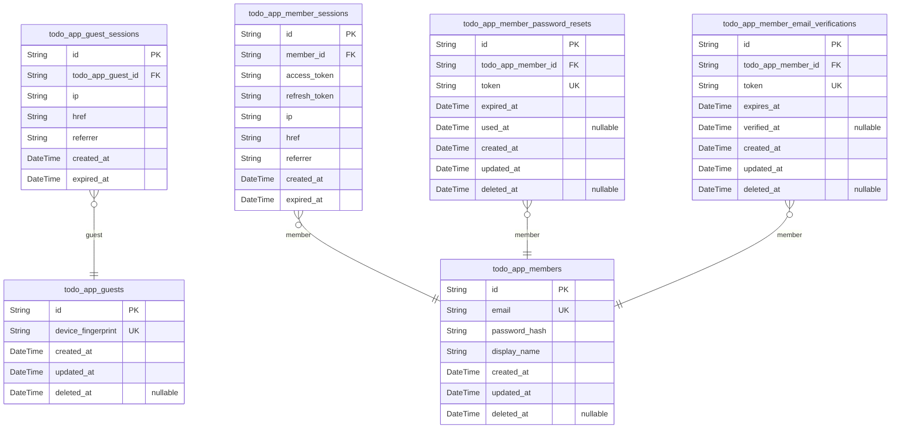
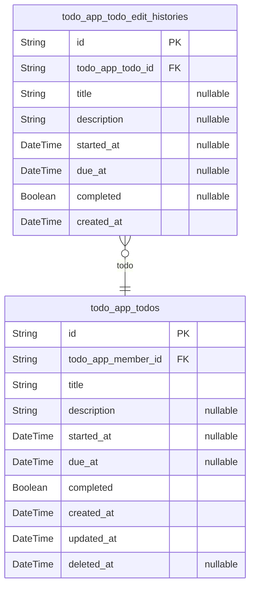

# Prisma Markdown

> Generated by [`prisma-markdown`](https://github.com/samchon/prisma-markdown)

- [Actors](#actors)
- [Todos](#todos)

## Actors

### `todo_app_guests`

Temporary guest accounts identified by device fingerprint for anonymous
access before registration.

This table represents guest actors who have not yet registered but need
temporary identity tracking. Each guest is uniquely identified by their
device fingerprint, which persists across sessions until the user either
registers as a member or the guest account is cleaned up.

Guest accounts are temporary and intended for anonymous users exploring
the application before committing to registration. The device fingerprint
serves as the primary identification mechanism, allowing the system to
maintain session continuity and track guest activity without requiring
email/password credentials.

Related entities:
- [todo_app_guest_sessions](#todo_app_guest_sessions) - Multiple sessions can exist for each
guest account
- [todo_app_members](#todo_app_members) - Guests can upgrade to member accounts
through registration

Properties as follows:

- `id`: Primary Key.
- `device_fingerprint`: Unique device identifier for guest recognition across sessions.
- `created_at`: Timestamp when the guest account was created.
- `updated_at`: Timestamp when the guest account was last updated.
- `deleted_at`: Timestamp when the guest account was soft deleted, null if active.

### `todo_app_guest_sessions`

Temporary session tokens for guest access with expiration tracking.

This table records login sessions for guest actors, storing connection
metadata and temporal information for security auditing. Sessions are
append-only and track the guest's access period through expiration
timestamps.

Related to [todo_app_guests](#todo_app_guests) through a 1:N relationship where one
guest can have multiple active or expired sessions.

Properties as follows:

- `id`: Primary Key.
- `todo_app_guest_id`: Belonged guest's [todo_app_guests.id](#todo_app_guests).
- `ip`: IP address of the client connection.
- `href`: URL href where the session was initiated.
- `referrer`: Referrer URL from the client request.
- `created_at`: Session creation timestamp.
- `expired_at`: Session expiration timestamp for security lifecycle management.

### `todo_app_members`

Registered member accounts with email/password credentials and profile
information.

This table serves as the primary identity record for authenticated users
in the todo application. Each member has a unique email address for
authentication and a display name for their profile. Members own private
todos and can manage their account settings including password changes
and account deletion.

Related entities:
- [todo_app_member_sessions](#todo_app_member_sessions) - Login sessions for this member
(many-to-one)
- [todo_app_member_password_resets](#todo_app_member_password_resets) - Password reset tokens
(many-to-one)
- [todo_app_member_email_verifications](#todo_app_member_email_verifications) - Email verification tokens
(many-to-one)
- [todo_app_todos](#todo_app_todos) - Todos owned by this member (many-to-one)

Properties as follows:

- `id`: Primary Key.
- `email`: Unique email address used for authentication and account identification.
- `password_hash`
  > Bcrypt hashed password for secure authentication. Never store plain text
  > passwords.
- `display_name`: User's display name shown in their profile and todo listings.
- `created_at`: Timestamp when the member account was created.
- `updated_at`: Timestamp when the member account was last updated.
- `deleted_at`
  > Timestamp when the member account was soft deleted. Null if account is
  > active.

### `todo_app_member_sessions`

JWT session tokens for member authentication with access and refresh
token support.

This table tracks login sessions for registered members, storing
connection metadata and token information. Each session represents an
authenticated connection with expiration tracking for security. Sessions
are created on login and expire based on token lifetime or explicit
logout.

Related to [todo_app_members](#todo_app_members) through a 1:N relationship where one
member can have multiple active sessions across different devices.

Properties as follows:

- `id`: Primary Key.
- `member_id`: Belonged member's [todo_app_members.id](#todo_app_members).
- `access_token`: JWT access token for authenticated API requests.
- `refresh_token`: JWT refresh token for obtaining new access tokens.
- `ip`: IP address of the client device at session creation.
- `href`: URL href where the session was initiated.
- `referrer`: Referrer URL from the HTTP request headers.
- `created_at`: Timestamp when the session was created.
- `expired_at`: Timestamp when the session expires and becomes invalid.

### `todo_app_member_password_resets`

Password reset tokens with expiration for secure password recovery
workflow. Each token is single-use and expires after a defined period.
Tokens are generated when a member requests password reset and are
invalidated after use or expiration to prevent replay attacks.

Properties as follows:

- `id`: Primary Key.
- `todo_app_member_id`
  > Reference to the member requesting password reset. {@link
  > todo_app_members.id}
- `token`
  > Unique password reset token sent to member's email address. Used exactly
  > once for password recovery and then invalidated.
- `expired_at`
  > Token expiration timestamp. Token becomes invalid after this time for
  > security purposes and cannot be used for password reset.
- `used_at`
  > Timestamp when the token was consumed for password reset. Null if token
  > has not been used yet. Prevents token reuse.
- `created_at`: Record creation timestamp when password reset request was initiated.
- `updated_at`
  > Record last update timestamp. Updated when token is used or any field is
  > modified.
- `deleted_at`
  > Soft deletion timestamp. Null if record is active. Used for audit trail
  > and potential recovery.

### `todo_app_member_email_verifications`

Email verification tokens for account registration and email confirmation.

Stores verification tokens sent to members during registration or email
address changes. Each token has an expiration time and tracks when (if)
it was successfully verified. Tokens are single-use and expire after a
configured period for security.

Related to [todo_app_members](#todo_app_members) through foreign key relationship.
Multiple verification attempts can exist per member (e.g., resend
verification email), but only the latest unexpired token is typically
valid.

Properties as follows:

- `id`: Primary Key.
- `todo_app_member_id`: Belonged member's [todo_app_members.id](#todo_app_members).
- `token`: Unique verification token sent via email for account confirmation.
- `expires_at`: Expiration timestamp when the verification token becomes invalid.
- `verified_at`
  > Timestamp when the email was successfully verified. Null if not yet
  > verified.
- `created_at`: Timestamp when the verification record was created.
- `updated_at`: Timestamp when the verification record was last updated.
- `deleted_at`: Timestamp when the verification record was soft deleted. Null if active.

## Todos

### `todo_app_todos`

Core todo items owned by members with title, description, optional dates,
and completion status.

This table stores the main todo entities that members create and manage
throughout their lifecycle. Each todo belongs to exactly one member and
supports soft deletion through the deleted_at field for trash
functionality.

Key relationships:
- Owned by [todo_app_members](#todo_app_members) through member_id foreign key
- Has many [todo_app_todo_edit_histories](#todo_app_todo_edit_histories) for audit trail

Behavioral notes:
- Todos are incomplete by default (completed = false)
- Soft deleted todos (deleted_at IS NOT NULL) appear in trash
- Permanently deleted todos are removed from this table
- All field changes are recorded in edit history table

Properties as follows:

- `id`: Primary Key.
- `todo_app_member_id`: Owner member's [todo_app_members.id](#todo_app_members).
- `title`: Todo title. Required field that identifies the todo task.
- `description`: Optional detailed description of the todo task. Can be empty.
- `started_at`: Optional start date when the todo task begins. Null if not set.
- `due_at`: Optional due date when the todo task should be completed. Null if not set.
- `completed`
  > Completion status flag. False means incomplete (default), true means
  > complete.
- `created_at`: Timestamp when the todo was created.
- `updated_at`: Timestamp when the todo was last updated.
- `deleted_at`
  > Timestamp when the todo was soft deleted. Null means active todo,
  > non-null means in trash.

### `todo_app_todo_edit_histories`

Audit trail recording all changes made to todos including field values
after each edit.

This table captures point-in-time snapshots of todo modifications,
enabling users to view the complete history of changes made to their
todos. Each edit creates a new history entry with the updated field
values.

Key relationships:
- Belongs to [todo_app_todos](#todo_app_todos) via todo_app_todo_id (required)
- Multiple history entries per todo (1:N relationship)

Behavioral notes:
- Append-only: New entries are created on each edit, never updated
- Permanently deleted when parent todo is permanently deleted or when
user account is deleted
- Sorted by created_at descending (most recent first) when viewing history

Properties as follows:

- `id`: Primary Key.
- `todo_app_todo_id`: Belonged todo's [todo_app_todos.id](#todo_app_todos).
- `title`: Title value after this edit. Null if title was not changed in this edit.
- `description`
  > Description value after this edit. Null if description was not changed in
  > this edit.
- `started_at`
  > Start date value after this edit. Null if start date was not changed in
  > this edit.
- `due_at`
  > Due date value after this edit. Null if due date was not changed in this
  > edit.
- `completed`
  > Completion status after this edit. Null if completion status was not
  > changed in this edit.
- `created_at`: Timestamp when this edit was made.
