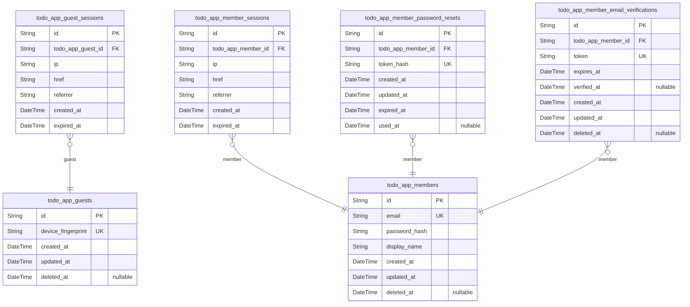
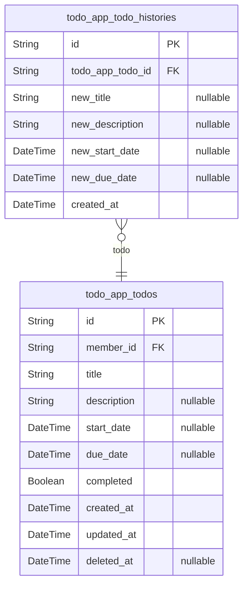

# Prisma Markdown

> Generated by [`prisma-markdown`](https://github.com/samchon/prisma-markdown)

- [Actors](#actors)
- [Todos](#todos)

## Actors

### `todo_app_guests`

Temporary guest accounts identified by device fingerprint for
unauthenticated visitor access.

Guest accounts provide limited access to the application before
registration. Each guest is identified by a unique device fingerprint,
allowing the system to maintain session state and track temporary
activities. Guests can transition to member accounts through the
registration process.

Related entities:
- [todo_app_guest_sessions](#todo_app_guest_sessions) - Session tokens for guest
authentication (child table)

Key characteristics:
- Device-based identification without email/password credentials
- Temporary account state pending registration or abandonment
- Supports guest-to-member transition pathway

Properties as follows:

- `id`: Primary Key.
- `device_fingerprint`
  > Unique device fingerprint identifier for guest recognition and session
  > tracking.
- `created_at`: Timestamp when the guest account was created.
- `updated_at`: Timestamp when the guest account was last updated.
- `deleted_at`: Timestamp when the guest account was soft deleted, null if active.

### `todo_app_guest_sessions`

Temporary session tokens for guest access with short expiration.

Tracks authentication sessions for guest (unauthenticated) users
identified by device fingerprint. Each session stores connection metadata
including IP address, current page URL, and referrer for security
auditing. Sessions have explicit expiration timestamps and are managed
through the authentication flow rather than direct CRUD operations.

References [todo_app_guests](#todo_app_guests) as the parent actor table. Multiple
sessions can exist per guest (e.g., multiple devices or browsers).

Properties as follows:

- `id`: Primary Key.
- `todo_app_guest_id`: Belonged guest's [todo_app_guests.id](#todo_app_guests).
- `ip`: Client IP address at session creation for security auditing.
- `href`: Current page URL when session was initiated.
- `referrer`: Referrer URL from which the user arrived.
- `created_at`: Session creation timestamp.
- `expired_at`: Session expiration timestamp. Sessions are invalid after this time.

### `todo_app_members`

Registered member accounts with email/password authentication and profile
information.

This is the primary actor table for authenticated users in the todo
application. Members can create and manage their private todos, view edit
history, and use trash functionality. Each member has a unique email
address for authentication and a display name for profile identification.

Related entities:
- [todo_app_member_sessions](#todo_app_member_sessions): Stores JWT session tokens for member
authentication
- [todo_app_member_password_resets](#todo_app_member_password_resets): Password reset tokens for
recovery workflow
- [todo_app_member_email_verifications](#todo_app_member_email_verifications): Email verification tokens
for registration
- [todo_app_todos](#todo_app_todos): Todos owned by this member (1:N relationship)

Properties as follows:

- `id`: Primary Key.
- `email`: Unique email address for authentication and account identification.
- `password_hash`
  > Hashed password for secure authentication. Never store plain text
  > passwords.
- `display_name`: User's display name shown in their profile and todo ownership.
- `created_at`: Timestamp when the member account was created.
- `updated_at`: Timestamp when the member account was last updated.
- `deleted_at`
  > Timestamp when the member account was soft deleted. Null means account is
  > active.

### `todo_app_member_sessions`

JWT session tokens for member authentication with access and refresh
token support.

Stores active login sessions for registered members, tracking connection
metadata and expiration times. Each session represents an authenticated
connection that can be validated using JWT tokens. Sessions are created
upon successful login and invalidated upon logout or expiration.

Related to [todo_app_members](#todo_app_members) through a one-to-many relationship
where one member can have multiple concurrent sessions across different
devices or browsers.

Properties as follows:

- `id`: Primary Key.
- `todo_app_member_id`: Belonged member's [todo_app_members.id](#todo_app_members).
- `ip`: IP address of the client connection.
- `href`: Full URL where the session was initiated.
- `referrer`: Referrer URL that led to the session creation.
- `created_at`: Session creation timestamp.
- `expired_at`: Session expiration timestamp for security enforcement.

### `todo_app_member_password_resets`

Password reset tokens with expiration for member password recovery workflow.

Stores temporary reset tokens generated when members request password
resets. Each token has a limited lifespan and can only be used once.
After successful password reset or expiration, the token becomes invalid.

Related to [todo_app_members](#todo_app_members) through member ownership
relationship. Multiple reset tokens can exist per member, but only the
most recent unexpired token should be used.

Properties as follows:

- `id`: Primary Key.
- `todo_app_member_id`: Member account requesting password reset. [todo_app_members.id](#todo_app_members).
- `token_hash`
  > Hashed value of the password reset token for secure lookup. Never store
  > plain text tokens.
- `created_at`: Timestamp when the password reset token was generated.
- `updated_at`: Timestamp when the password reset token record was last updated.
- `expired_at`
  > Timestamp when the password reset token expires. Token cannot be used
  > after this time.
- `used_at`
  > Timestamp when the password reset token was consumed. Null if token has
  > not been used.

### `todo_app_member_email_verifications`

Email verification tokens for member registration and email confirmation
workflow.

Stores verification tokens sent to members during registration or email
change processes. Each token has an expiration time and tracks when (if)
the email was successfully verified. Multiple verification attempts can
exist per member, with the most recent valid token being used for
verification.

Related to [todo_app_members](#todo_app_members) through foreign key relationship.

Properties as follows:

- `id`: Primary Key.
- `todo_app_member_id`: Belonged member's [todo_app_members.id](#todo_app_members).
- `token`: Verification token sent via email for email confirmation.
- `expires_at`: Token expiration timestamp after which verification is invalid.
- `verified_at`: Timestamp when email was successfully verified, null if not yet verified.
- `created_at`: Creation timestamp of the verification record.
- `updated_at`: Last update timestamp of the verification record.
- `deleted_at`: Soft deletion timestamp, null if not deleted.

## Todos

### `todo_app_todos`

User todo items representing tasks to be completed. Each todo belongs to
a single member and contains title, optional description, optional start
and due dates, and completion status. Supports soft delete for trash
functionality where deleted todos can be restored or permanently removed.
All todos are private to their owner with no cross-user access.

Properties as follows:

- `id`: Primary Key.
- `member_id`: Owner member's [todo_app_members.id](#todo_app_members).
- `title`: Todo title. Required field that identifies the task.
- `description`: Optional detailed description of the todo task. Can be empty.
- `start_date`
  > Optional start date indicating when the todo task begins. Null means no
  > specific start date.
- `due_date`
  > Optional due date indicating when the todo task should be completed. Null
  > means no specific deadline.
- `completed`
  > Completion status flag. False by default for new todos, toggled to true
  > when marked complete.
- `created_at`: Timestamp when the todo was created. Used for sorting and audit purposes.
- `updated_at`
  > Timestamp when the todo was last modified. Updated on every edit
  > operation.
- `deleted_at`
  > Soft delete timestamp. Null for active todos, set to deletion timestamp
  > when moved to trash. Used to filter between active and deleted todos.

### `todo_app_todo_histories`

Edit history entries that automatically record field-level changes to
todos. Each entry captures what values were changed to (not the old
values) with timestamps for audit trail purposes. History entries are
immutable, automatically generated on todo edits, and cascade deleted
when the parent todo is permanently deleted. This is a snapshot table for
audit trail and change tracking.

Properties as follows:

- `id`: Primary Key.
- `todo_app_todo_id`: Parent todo's [todo_app_todos.id](#todo_app_todos).
- `new_title`
  > New title value after the edit. Only populated if the title field was
  > changed.
- `new_description`
  > New description value after the edit. Only populated if the description
  > field was changed.
- `new_start_date`
  > New start date value after the edit. Only populated if the start date
  > field was changed.
- `new_due_date`
  > New due date value after the edit. Only populated if the due date field
  > was changed.
- `created_at`
  > Timestamp when this history entry was created, representing when the edit
  > occurred. Automatically set on record creation and serves as the edit
  > timestamp for chronological ordering.
