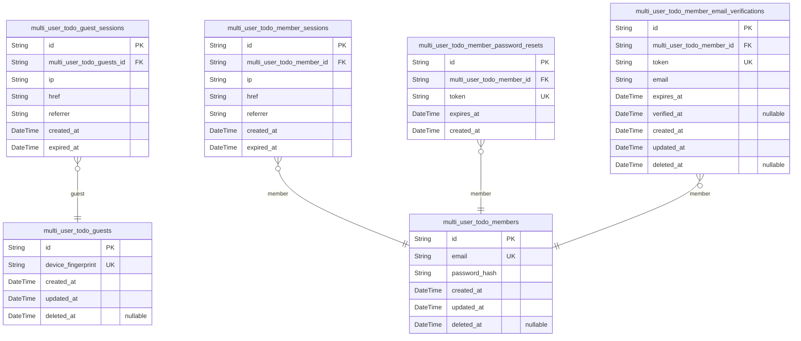
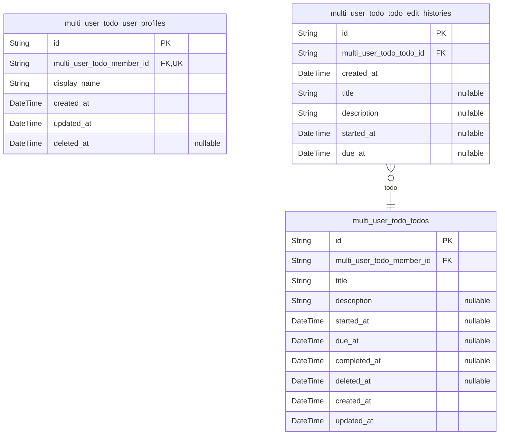

# Prisma Markdown

> Generated by [`prisma-markdown`](https://github.com/samchon/prisma-markdown)

- [auth](#auth)
- [Todo](#todo)

## auth

### `multi_user_todo_guests`

Temporary guest accounts identified by device fingerprint for anonymous
access to public endpoints. Guests are unauthenticated visitors who can
access public endpoints like registration and login without requiring
credentials. Each guest account can have multiple sessions tracked in
[multi_user_todo_guest_sessions](#multi_user_todo_guest_sessions).

Properties as follows:

- `id`: Primary Key.
- `device_fingerprint`
  > Unique identifier for the guest's device used for anonymous access
  > tracking.
- `created_at`: Timestamp when the guest account was created.
- `updated_at`: Timestamp when the guest account was last updated.
- `deleted_at`: Timestamp when the guest account was soft deleted. Null if active.

### `multi_user_todo_guest_sessions`

Temporary session tokens for guest access with short expiration. Tracks
anonymous user sessions for public endpoint access. Each session belongs
to exactly one [multi_user_todo_guests](#multi_user_todo_guests) and includes access
metadata for security auditing.

Properties as follows:

- `id`: Primary Key.
- `multi_user_todo_guests_id`: Multi user todo guest's [multi_user_todo_guests.id](#multi_user_todo_guests).
- `ip`: Client IP address for session tracking and security.
- `href`: Current page URL when session was created.
- `referrer`: Referrer URL for session origin tracking.
- `created_at`: Session creation timestamp.
- `expired_at`: Session expiration timestamp for automatic invalidation.

### `multi_user_todo_members`

Registered member accounts with email and password hash for
authentication. Display names are stored in {@link
multi_user_todo_user_profiles}. Each member owns private todos and can
manage their profile, sessions, and account lifecycle.

Properties as follows:

- `id`: Primary Key.
- `email`: Unique email address for authentication and account identification.
- `password_hash`: Bcrypt hashed password for secure authentication.
- `created_at`: Account creation timestamp.
- `updated_at`: Last account update timestamp.
- `deleted_at`: Soft delete timestamp for account deletion tracking.

### `multi_user_todo_member_sessions`

JWT session tokens with access and refresh token support for member
authentication. Tracks login sessions for authenticated members with
expiration management. Each session belongs to exactly one {@link
multi_user_todo_members} and is append-only for audit purposes.

Properties as follows:

- `id`: Primary Key.
- `multi_user_todo_member_id`: Member's [multi_user_todo_members.id](#multi_user_todo_members).
- `ip`: Client IP address at session creation.
- `href`: Current page URL at session creation.
- `referrer`: Referrer URL at session creation.
- `created_at`: Session creation timestamp.
- `expired_at`: Session expiration timestamp.

### `multi_user_todo_member_password_resets`

Password reset tokens with expiration for member password recovery. Each
token is single-use and expires after a short period for security. Tokens
are generated when members request password reset and verified during the
password change flow.

Properties as follows:

- `id`: Primary Key.
- `multi_user_todo_member_id`: Member's [multi_user_todo_members.id](#multi_user_todo_members).
- `token`
  > Unique password reset token for verification. Generated as a secure
  > random string.
- `expires_at`
  > Token expiration timestamp for security. Tokens become invalid after this
  > time.
- `created_at`: Record creation timestamp.

### `multi_user_todo_member_email_verifications`

Email verification tokens for member registration and email confirmation.
Stores temporary verification codes sent to users during account creation
or email change processes. Each token is unique and expires after a set
period. Tracks verification status and timestamps for audit purposes.

Properties as follows:

- `id`: Primary Key.
- `multi_user_todo_member_id`: Member's [multi_user_todo_members.id](#multi_user_todo_members).
- `token`
  > Verification token sent via email for account activation or email
  > confirmation.
- `email`: Email address being verified during registration or email change.
- `expires_at`: Token expiration timestamp. Token becomes invalid after this time.
- `verified_at`
  > Timestamp when token was successfully verified. Null if not yet verified
  > or expired.
- `created_at`: Record creation timestamp.
- `updated_at`: Record last update timestamp.
- `deleted_at`: Soft delete timestamp. Null if not deleted.

## Todo

### `multi_user_todo_user_profiles`

User profile data including display names, separate from authentication
accounts. Each profile belongs to exactly one {@link
multi_user_todo_members} and stores the user's public display name.
Managed through the member entity lifecycle.

Properties as follows:

- `id`: Primary Key.
- `multi_user_todo_member_id`: Member's [multi_user_todo_members.id](#multi_user_todo_members).
- `display_name`: User's public display name shown in the application.
- `created_at`: Timestamp when the profile was created.
- `updated_at`: Timestamp when the profile was last updated.
- `deleted_at`: Timestamp when the profile was soft deleted, null if active.

### `multi_user_todo_todos`

Task tracking entities with title, description, optional dates,
completion status, and soft delete support.

Each todo belongs to exactly one member and can be toggled between
complete and incomplete states. Todos support soft deletion for trash
functionality, allowing users to restore or permanently delete them. Edit
history is tracked separately in {@link
multi_user_todo_todo_edit_histories}.

Properties as follows:

- `id`: Primary Key.
- `multi_user_todo_member_id`: Owner's [multi_user_todo_members.id](#multi_user_todo_members).
- `title`: Todo title (required).
- `description`: Todo description (optional).
- `started_at`: Optional start date.
- `due_at`: Optional due date.
- `completed_at`: Completion timestamp. Null means incomplete, non-null means complete.
- `deleted_at`: Soft delete timestamp for trash functionality. Null means active.
- `created_at`: Creation timestamp.
- `updated_at`: Last update timestamp.

### `multi_user_todo_todo_edit_histories`

Audit trail recording all modifications to todos including timestamps and
changed field values. Each entry captures the new values of fields that
were modified during an edit operation. Belongs to {@link
multi_user_todo_todos} and is cascade deleted when the parent todo is
permanently removed.

Properties as follows:

- `id`: Primary Key.
- `multi_user_todo_todo_id`: Todo's [multi_user_todo_todos.id](#multi_user_todo_todos).
- `created_at`: Timestamp when the edit was made.
- `title`: New title value if the title was changed during this edit, otherwise null.
- `description`
  > New description value if the description was changed during this edit,
  > otherwise null.
- `started_at`
  > New start date value if the start date was changed during this edit,
  > otherwise null.
- `due_at`
  > New due date value if the due date was changed during this edit,
  > otherwise null.
