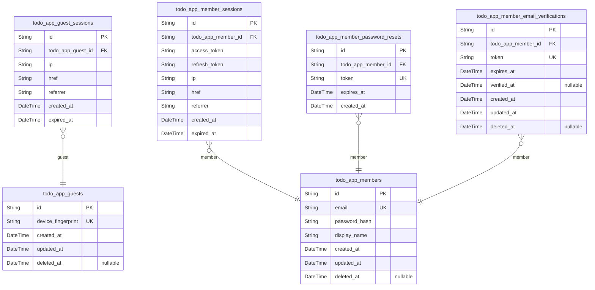
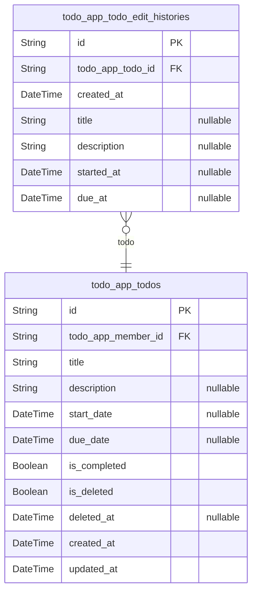

# Prisma Markdown

> Generated by [`prisma-markdown`](https://github.com/samchon/prisma-markdown)

- [authorization](#authorization)
- [todo](#todo)

## authorization

### `todo_app_guests`

Temporary guest accounts identified by device fingerprint for anonymous
access.

Guest accounts allow unauthenticated users to access the application
without registration. Each guest is identified by a unique device
fingerprint generated from browser or device characteristics.

Guest accounts are temporary and do not have persistent credentials like
email or password. They can create and manage todos during their session,
but data is tied to the device fingerprint. Guests can later convert to
member accounts by registering with email and password.

Properties as follows:

- `id`: Primary Key.
- `device_fingerprint`
  > Unique device identifier for guest account recognition.
  >
  > Generated from browser or device characteristics to identify anonymous
  > users. Used to associate guest sessions and guest-owned todos with the
  > correct guest account. Must be unique across all guest accounts.
- `created_at`: Record creation timestamp.
- `updated_at`: Record last update timestamp.
- `deleted_at`: Soft delete timestamp. Null means active.

### `todo_app_guest_sessions`

Temporary session tokens for guest access with short expiration.

Provides authenticated access for anonymous users identified by device
fingerprint. Sessions are short-lived and automatically expire for
security. Each session tracks the IP address and request metadata for
audit purposes.

References [todo_app_guests](#todo_app_guests) for the guest identity. Sessions are
created during guest login and invalidated on logout or expiration.

Properties as follows:

- `id`: Primary Key.
- `todo_app_guest_id`
  > References the guest account that owns this session.
  >
  > Links to [todo_app_guests](#todo_app_guests) for the anonymous user identity.
  > Multiple sessions can belong to the same guest (e.g., multiple devices or
  > browsers).
- `ip`
  > IP address of the client that created this session.
  >
  > Used for security audit and session validation. Captured at session
  > creation time.
- `href`
  > URL path where the session was initiated.
  >
  > Tracks the entry point for audit and analytics purposes.
- `referrer`
  > Referrer URL that led to session creation.
  >
  > Tracks the traffic source for analytics. Can be empty if direct access.
- `created_at`
  > Timestamp when this session was created.
  >
  > Used for session age calculation and audit trails.
- `expired_at`
  > Timestamp when this session expires.
  >
  > Guest sessions have short expiration times for security. After this time,
  > the session is invalid and must be recreated.

### `todo_app_members`

Registered member accounts with email/password authentication credentials
and profile data.

This table stores the core identity and authentication data for
authenticated users. Each member can log in, manage their private todos,
and access edit history features.

Authentication: Members authenticate using email and password_hash. The
email field is unique and serves as the primary login identifier.

Profile: Each member has a display_name that identifies them within the
application. This is the only profile attribute as the app is private and
users cannot view other users' profiles.

Lifecycle: Members can delete their accounts, which triggers soft delete
(deleted_at). Account deletion cascades to permanently delete all
associated todos including those in trash, along with their edit
histories.

Properties as follows:

- `id`: Primary Key.
- `email`
  > Email address used for authentication and account identification.
  >
  > This field serves as the unique login identifier for member
  > authentication. Members use this email along with their password to log
  > in. The value must be unique across all members to ensure each account is
  > distinct.
- `password_hash`
  > Hashed password for authentication security.
  >
  > Stores the bcrypt or similar hash of the member's password. Never store
  > plain text passwords. This field is required for all members and is used
  > during login verification.
- `display_name`
  > Member's display name shown in the application interface.
  >
  > This is the user-facing name that identifies the member within the todo
  > application. Members can edit this value through their profile settings.
  > Unlike public applications, this display name is only visible to the
  > member themselves as todos are completely private.
- `created_at`: Timestamp when the member account was created.
- `updated_at`: Timestamp when the member account was last updated.
- `deleted_at`
  > Timestamp when the member account was soft deleted. Null for active
  > accounts. When set, triggers cascade deletion of all member's todos and
  > related data.

### `todo_app_member_sessions`

JWT session tokens for member authentication with access and refresh
token support.

This table tracks all authenticated login sessions for {@link
todo_app_members}. Each session record contains the access and refresh
tokens required for API authentication, along with client information for
security auditing.

Sessions are created during login and validated on each authenticated
request. Expired sessions are automatically rejected by the auth
middleware.

Properties as follows:

- `id`: Primary Key.
- `todo_app_member_id`
  > References the [todo_app_members](#todo_app_members) who owns this session.
  >
  > Each session belongs to exactly one member. When a member logs in, a new
  > session is created. Sessions are invalidated on logout or when they
  > expire.
- `access_token`
  > JWT access token for API authentication.
  >
  > This token is included in the Authorization header of API requests. It
  > has a short expiration time (typically 15-30 minutes) for security.
- `refresh_token`
  > JWT refresh token for obtaining new access tokens.
  >
  > This token has a longer expiration time and is used to request new access
  > tokens without requiring the user to re-enter credentials. Stored
  > securely and rotated on use.
- `ip`
  > IP address of the client that created this session.
  >
  > Recorded for security auditing and to detect suspicious login patterns.
  > Used to identify the geographic location and device network.
- `href`
  > URL of the page where the login was initiated.
  >
  > Captures the entry point for the authentication flow. Useful for
  > redirecting users back after successful login and for analytics.
- `referrer`
  > HTTP referrer header from the login request.
  >
  > Indicates which page or external site referred the user to the login
  > page. Used for security analysis and traffic source tracking.
- `created_at`
  > Timestamp when this session was created.
  >
  > Set automatically when the member successfully logs in. Used for session
  > age calculations and audit trails.
- `expired_at`
  > Timestamp when this session expires.
  >
  > Sessions are automatically invalidated after this time. Members must log
  > in again to create a new session. Typically set to 7-30 days from
  > creation depending on security policy.

### `todo_app_member_password_resets`

Password reset tokens with expiration for member account recovery.

Stores temporary tokens generated when members request password resets.
Each token is single-use and expires after a configured time period for
security. Tokens are validated during the password change flow and
invalidated after use or expiration.

References [todo_app_members](#todo_app_members) for the account requesting recovery.
Multiple tokens can exist per member (e.g., if multiple reset requests
are made), but only the most recent unexpired token should be valid.

Properties as follows:

- `id`: Primary Key.
- `todo_app_member_id`
  > Reference to the member account requesting password reset.
  >
  > Establishes ownership of this reset token to a specific {@link
  > todo_app_members} account. Multiple reset tokens can exist for the same
  > member over time (e.g., if previous tokens expired unused). The token is
  > validated against this member during password reset flow.
- `token`
  > Unique password reset token for lookup and validation.
  >
  > Randomly generated secure string sent to the member's email. Used to
  > authenticate the password reset request without requiring login. Must be
  > unique across all reset tokens and is invalidated after use or
  > expiration.
- `expires_at`
  > Token expiration timestamp for security.
  >
  > Defines when this reset token becomes invalid. Typically set to a short
  > duration (e.g., 1 hour) from creation time to limit the window for
  > unauthorized access. Tokens past this timestamp must be rejected during
  > password reset validation.
- `created_at`
  > Token creation timestamp for audit and ordering.
  >
  > Records when this password reset token was generated. Used for auditing
  > reset requests and for selecting the most recent valid token when
  > multiple exist for a member.

### `todo_app_member_email_verifications`

Email verification tokens for member registration confirmation.

Stores verification tokens sent to new members during the registration
process. Each token is unique and expires after a configured time period.
When a member clicks the verification link, the token is validated and
the verified_at timestamp is recorded.

Related to [todo_app_members](#todo_app_members) via foreign key. Members can have
multiple verification tokens over time (e.g., if they request new
verification emails), but only one unexpired, unverified token should be
active at any time.

Properties as follows:

- `id`: Primary Key.
- `todo_app_member_id`
  > References the member account this verification token belongs to.
  >
  > Links to [todo_app_members](#todo_app_members). Each verification record is associated
  > with exactly one member. The token is created during registration and
  > consumed when the member verifies their email address.
- `token`
  > Unique verification token sent to the member's email address.
  >
  > Generated as a random secure string during registration. Used to validate
  > the email verification link when the member clicks it. Must be unique
  > across all verification records.
- `expires_at`
  > Timestamp when this verification token expires.
  >
  > Set at creation time based on system configuration (e.g., 24 hours).
  > After this time, the token cannot be used for verification and a new
  > token must be generated.
- `verified_at`
  > Timestamp when the member successfully verified their email.
  >
  > Null until the member clicks the verification link and the token is
  > validated. Once set, indicates the email has been confirmed and the
  > member account is fully activated.
- `created_at`: Timestamp when this verification token was created.
- `updated_at`: Timestamp when this verification token was last updated.
- `deleted_at`
  > Timestamp when this verification token was soft deleted.
  >
  > Null while the record is active. Set when the verification record is soft
  > deleted (e.g., after successful verification or cleanup of expired
  > tokens).

## todo

### `todo_app_todos`

Main todo entity storing task information including title, description,
optional dates, completion status, and soft-delete state.

Each todo belongs to exactly one [todo_app_members](#todo_app_members) and tracks the
task's lifecycle from creation through completion or deletion. The title
is required while description and date fields are optional.

Completion status (is_completed) defaults to false for new todos.
Soft-delete is implemented via is_deleted and deleted_at fields, allowing
todos to be moved to trash and potentially restored. Permanently deleted
todos are removed from this table along with their {@link
todo_app_todo_edit_histories}.

Properties as follows:

- `id`: Primary Key.
- `todo_app_member_id`
  > References the [todo_app_members](#todo_app_members) who owns this todo.
  >
  > Every todo must belong to exactly one member. This foreign key
  > establishes ownership and enables privacy isolation - members can only
  > access their own todos.
- `title`
  > The todo's title or summary.
  >
  > This is a required field that briefly describes what task needs to be
  > completed. Must be provided when creating a new todo.
- `description`
  > Optional detailed description of the todo.
  >
  > Can be left empty if no additional details are needed. Provides context
  > or instructions for completing the task.
- `start_date`
  > Optional date when the todo should be started.
  >
  > Can be left empty if no specific start date is needed. Used for planning
  > and scheduling purposes.
- `due_date`
  > Optional date by which the todo should be completed.
  >
  > Can be left empty if no deadline is set. Used for tracking upcoming tasks
  > and priorities.
- `is_completed`
  > Completion status flag indicating whether the todo has been finished.
  >
  > Defaults to false for newly created todos. When toggled to true, the todo
  > is marked as complete but remains in the list unless deleted.
- `is_deleted`
  > Soft-delete flag indicating whether the todo has been moved to trash.
  >
  > When true, the todo is hidden from the normal todo list but can be viewed
  > in trash and potentially restored. Defaults to false.
- `deleted_at`
  > Timestamp when the todo was soft-deleted (moved to trash).
  >
  > Null if the todo has never been deleted. Set when is_deleted becomes
  > true, cleared if the todo is restored from trash.
- `created_at`: Timestamp when the todo was created.
- `updated_at`: Timestamp when the todo was last updated.

### `todo_app_todo_edit_histories`

Edit history entries automatically created when todos are modified,
recording what fields changed and when.

Each entry captures the state of changed fields at the time of edit,
providing a complete audit trail of all modifications made to a {@link
todo_app_todos} record. Entries are created automatically by the system
whenever a todo is updated through the edit operation.

History entries are append-only and cannot be modified after creation.
They are permanently deleted only when the associated todo is permanently
deleted from the trash.

Properties as follows:

- `id`: Primary Key.
- `todo_app_todo_id`
  > Reference to the todo that was edited.
  >
  > Establishes ownership relationship to [todo_app_todos](#todo_app_todos). Each
  > history entry belongs to exactly one todo and tracks modifications made
  > to that todo over time. When the parent todo is permanently deleted, all
  > associated history entries are cascading deleted.
- `created_at`
  > Timestamp when the edit was made.
  >
  > Records the exact point in time when the todo modification occurred. Used
  > for ordering history entries chronologically and displaying edit timeline
  > to users.
- `title`
  > New title value after the edit.
  >
  > Stores the updated title if the title field was changed during this edit
  > operation. Null if the title was not modified in this particular edit.
  > Allows reconstruction of title change history by examining non-null
  > values across entries.
- `description`
  > New description value after the edit.
  >
  > Stores the updated description if the description field was changed
  > during this edit operation. Null if the description was not modified.
  > Supports optional description field on the parent todo.
- `started_at`
  > New start date value after the edit.
  >
  > Stores the updated start date if the start date field was changed during
  > this edit operation. Null if the start date was not modified or if it was
  > set to null. Tracks changes to optional start date attribute.
- `due_at`
  > New due date value after the edit.
  >
  > Stores the updated due date if the due date field was changed during this
  > edit operation. Null if the due date was not modified or if it was set to
  > null. Tracks changes to optional due date attribute.
