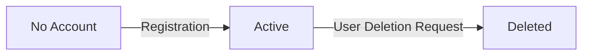

**todoApp — Actor definitions, permission matrix, authentication, session, account lifecycle**

Actor definitions, permission matrix, authentication, session, account lifecycle

# Actor Definitions

Define all user actor types with their roles and what they can do.

## guest Actor

Guests are unauthenticated visitors to the application. They can access the registration page to create a new account. Guests can access the login page to authenticate with existing credentials. Guests cannot view or interact with any todo items. Guests cannot access profile information or account settings. Guests must complete registration before becoming members. Registration requires providing email and password. Guests may encounter rate limiting on authentication attempts. Failed login attempts do not reveal whether an email exists in the system. Guests transition to member status upon successful authentication. All guest interactions are limited to authentication-related pages only.

### Guest Access and Public Pages

WHEN an unauthenticated visitor accesses the application, THE system SHALL allow access to public pages only.

WHEN a guest accesses the registration page, THE system SHALL display the account creation form.

WHEN a guest accesses the login page, THE system SHALL display the authentication form.

THE system SHALL allow guests to access public pages without authentication.

WHILE a user remains unauthenticated, THE system SHALL restrict access to authenticated features only.

THE system SHALL provide clear navigation from public pages to the registration page.

THE system SHALL provide clear navigation from public pages to the login page.

IF a guest attempts to access a protected page, THEN THE system SHALL redirect to the login page.

### Account Creation and Registration

WHEN a guest submits registration credentials, THE system SHALL create a new member account.

THE system SHALL require email and password for account creation.

WHEN a guest provides valid registration credentials, THE system SHALL initiate the member transition pathway.

IF the email already exists in the system, THEN THE system SHALL reject the registration without revealing the email exists.

IF the password does not meet security requirements, THEN THE system SHALL reject the registration.

THE system SHALL conceal email existence during registration attempts.

WHEN registration succeeds, THE system SHALL transition the guest to member status.

THE system SHALL require credential submission through the registration form.

IF required fields are missing during registration, THEN THE system SHALL reject the request.

### Authentication and Login

WHEN a guest submits login credentials, THE system SHALL attempt authentication.

THE system SHALL provide an authentication entry point through the login page.

THE system SHALL apply rate limiting on authentication attempts to prevent abuse.

IF authentication fails, THEN THE system SHALL display a generic error without revealing whether the email exists.

THE system SHALL conceal email existence during failed login attempts.

WHEN rate limiting is triggered, THE system SHALL temporarily block further authentication attempts.

THE system SHALL handle authentication errors with user-friendly messages.

IF invalid credentials are submitted, THEN THE system SHALL reject the login attempt.

THE system SHALL require credential submission through the login form.

WHEN multiple failed attempts occur, THE system SHALL enforce rate limiting on auth attempts.

### Access Restrictions for Guests

THE system SHALL deny guests access to any todo items.

THE system SHALL deny guests access to profile information.

WHILE a user has guest status, THE system SHALL prevent todo access.

WHILE a user has guest status, THE system SHALL prevent profile access.

IF a guest attempts to view todos, THEN THE system SHALL reject the request.

IF a guest attempts to view profiles, THEN THE system SHALL reject the request.

THE system SHALL enforce no todo access for unauthenticated visitors.

THE system SHALL enforce no profile access for unauthenticated visitors.

WHILE authentication is incomplete, THE system SHALL restrict all personal data access.

### Member Transition and Session

WHEN authentication succeeds, THE system SHALL initiate session initiation for the new member.

THE system SHALL transition guests to member status upon successful authentication.

WHEN a guest completes registration, THE system SHALL establish the member transition pathway.

THE system SHALL create a session upon successful login.

WHEN session initiation completes, THE system SHALL grant member-level access.

THE system SHALL maintain the member transition pathway from guest to authenticated user.

IF session initiation fails, THEN THE system SHALL return the user to the login page.

WHEN a guest becomes a member, THE system SHALL enable access to personal todo management.

## member Actor

Members are authenticated users with full access to personal todo management. Members can create, view, edit, and delete their own todos. Members can mark todos as complete or incomplete. Members can access their todo edit history to see what changes were made and when. Members can manage todos in trash including restore and permanent deletion. Members can filter their todo lists by completion status. Members can sort their todo lists by creation date, start date, or due date. Members can view and edit their profile display name. Members can change their password. Members can delete their entire account with all associated todos permanently removed. Members cannot view other users todos or profiles. All member actions are scoped to their own account only with complete privacy isolation.

### Member Access and Privacy Scope

WHILE authenticated as a member, THE system SHALL grant access to personal todo management features.

THE system SHALL restrict all member actions to the member's own account only.

THE system SHALL prevent members from viewing other users' todos under any circumstance.

THE system SHALL prevent members from accessing other users' profiles.

THE system SHALL enforce complete data privacy isolation between user accounts.

IF a member attempts to access another user's todo, THEN THE system SHALL reject the request.

IF a member attempts to access another user's profile, THEN THE system SHALL reject the request.

All member capabilities are scoped exclusively to resources owned by the authenticated member.

### Todo Management Operations

WHEN a member creates a todo, THE system SHALL require a title.

WHEN a member creates a todo, THE system SHALL allow an optional description.

WHEN a member creates a todo, THE system SHALL allow an optional start date.

WHEN a member creates a todo, THE system SHALL allow an optional due date.

WHEN a member creates a todo, THE system SHALL set the completion status to incomplete by default.

WHEN a member edits a todo, THE system SHALL allow modification of the title.

WHEN a member edits a todo, THE system SHALL allow modification of the description.

WHEN a member edits a todo, THE system SHALL allow modification of the start date.

WHEN a member edits a todo, THE system SHALL allow modification of the due date.

WHEN a member marks a todo as complete, THE system SHALL update the completion status to complete.

WHEN a member marks a todo as incomplete, THE system SHALL update the completion status to incomplete.

WHEN a member deletes a todo, THE system SHALL move the todo to trash instead of permanent removal.

IF the title is missing during todo creation, THEN THE system SHALL reject the request.

### Edit History and Trash Management

WHEN a member edits a todo, THE system SHALL create a history entry recording the edit.

THE system SHALL record the timestamp of each edit in the history entry.

THE system SHALL record the new title value in the history entry if the title was changed.

THE system SHALL record the new description value in the history entry if the description was changed.

THE system SHALL record the new start date value in the history entry if the start date was changed.

THE system SHALL record the new due date value in the history entry if the due date was changed.

WHEN a member views a todo's edit history, THE system SHALL display all history entries for that todo.

THE system SHALL sort edit history entries from most recent to oldest.

WHEN a member views trash, THE system SHALL display all deleted todos owned by the member.

WHEN a member restores a todo from trash, THE system SHALL return the todo to the normal todo list.

WHEN a member permanently deletes a todo from trash, THE system SHALL remove the todo and its edit history permanently.

### Todo List Filtering and Sorting

WHEN a member filters their todo list, THE system SHALL support filtering by completion status.

THE system SHALL provide an option to display all todos regardless of completion status.

THE system SHALL provide an option to display only complete todos.

THE system SHALL provide an option to display only incomplete todos.

WHEN a member sorts their todo list, THE system SHALL support sorting by creation date.

WHEN a member sorts their todo list, THE system SHALL support sorting by start date.

WHEN a member sorts their todo list, THE system SHALL support sorting by due date.

THE system SHALL allow sorting in ascending or descending order for each sort criterion.

WHILE sorting by start date, THE system SHALL place todos without a start date at the end of the list.

WHILE sorting by due date, THE system SHALL place todos without a due date at the end of the list.

### Profile and Account Management

WHEN a member edits their profile, THE system SHALL allow modification of the display name.

WHEN a member changes their password, THE system SHALL update the authentication credentials.

WHEN a member deletes their account, THE system SHALL permanently remove the account.

WHEN a member deletes their account, THE system SHALL permanently delete all todos owned by the member including those in trash.

WHEN a member deletes their account, THE system SHALL permanently delete all edit history associated with the member's todos.

# Authentication Flows

Registration, login, session management, and token policies.

## Registration and Login

Define user registration and login flows including validation and error handling.

### User Registration

WHEN a guest registers for an account, THE system SHALL:
1. Require a valid email address
2. Require a password
3. Require a display name
4. Create a new member account with the provided credentials
5. Set the account status to active upon successful registration
6. Associate the email address as the unique identifier for the account

WHEN registration is successful, THE system SHALL authenticate the user and establish a session.

### User Login

WHEN a user logs in, THE system SHALL:
1. Require the registered email address
2. Require the account password
3. Validate the credentials against stored account data
4. Establish an authenticated session upon successful validation
5. Grant member actor permissions upon successful authentication

WHEN login is successful, THE system SHALL redirect the user to their personal todo list.

### Email and Password Requirements

THE system SHALL require email addresses to be:
1. In valid email format
2. Unique across all registered accounts
3. Used as the primary identifier for authentication

THE system SHALL require passwords to be:
1. Provided during registration
2. Provided during login
3. Stored securely (implementation detail)
4. Used for authentication verification

THE system SHALL require display names to be:
1. Provided during registration
2. Associated with the user account
3. Editable by the account owner (defined in User Profile section)

### Registration Error Conditions

IF the email address is already registered to an existing account, THEN THE system SHALL reject the registration request.

IF the email address format is invalid, THEN THE system SHALL reject the registration request.

IF the password is missing during registration, THEN THE system SHALL reject the registration request.

IF the display name is missing during registration, THEN THE system SHALL reject the registration request.

IF the registration request is incomplete, THEN THE system SHALL reject the request and indicate the missing required fields.

### Login Error Conditions

IF the email address is not registered to any account, THEN THE system SHALL reject the login request.

IF the password does not match the stored credentials for the email address, THEN THE system SHALL reject the login request.

IF the email or password is missing during login, THEN THE system SHALL reject the login request.

IF the login request fails, THEN THE system SHALL NOT reveal whether the email exists or the password was incorrect (security by obscurity).

WHEN login fails, THE system SHALL NOT establish a session and the user remains a guest actor.

## Session and Token Policy

Define session duration, token refresh, and expiration policies.

### Session Management

WHEN a user logs in successfully, THE system SHALL create a new session for that user.

WHILE a session is active, THE system SHALL allow the user to access protected resources including todo management features.

THE system SHALL maintain exactly one active session per user device.

WHEN a user logs out, THE system SHALL immediately terminate the session.

IF a user deletes their account, THE system SHALL terminate all active sessions for that user.

THE system SHALL track session activity to determine idle time.

WHEN a session is terminated, THE system SHALL revoke all tokens associated with that session.

### Token Lifecycle

WHEN a session is created, THE system SHALL issue an access token to the user.

THE system SHALL use JWT format for all access tokens.

WHEN a token is issued, THE system SHALL include the user identifier in the token payload.

THE system SHALL include an expiration timestamp in every token.

WHEN a request includes a token, THE system SHALL validate the token before processing the request.

IF a token is invalid, THE system SHALL reject the request.

IF a token has expired, THE system SHALL reject the request and require token refresh or re-authentication.

THE system SHALL sign all tokens to prevent tampering.

### Token Refresh Policy

WHEN an access token expires, THE system SHALL allow the user to request a token refresh if the session is still active.

THE system SHALL issue a new access token upon successful token refresh.

WHEN a new token is issued via refresh, THE system SHALL invalidate the old token.

IF the session has expired, THE system SHALL reject the token refresh request.

THE system SHALL require the user to log in again if token refresh fails due to session expiration.

WHILE a session remains active, THE system SHALL allow unlimited token refresh requests.

THE system SHALL issue tokens with consistent expiration duration on each refresh.

### Session Expiration Rules

THE system SHALL expire sessions after 30 days of inactivity.

WHEN a session expires, THE system SHALL require the user to log in again to access protected resources.

THE system SHALL reset the session expiration timer on each user activity.

IF a user remains inactive for the expiration period, THE system SHALL automatically terminate the session.

WHEN a session is about to expire, THE system SHALL NOT notify the user in advance.

THE system SHALL treat expired sessions the same as manually logged-out sessions.

IF a user attempts to access protected resources with an expired session, THE system SHALL redirect to the login page.

### JWT Token Structure

THE system SHALL include the user identifier in every JWT token payload.

THE system SHALL include the session identifier in every JWT token payload.

THE system SHALL include an issued-at timestamp in every JWT token.

THE system SHALL include an expiration timestamp in every JWT token.

WHEN validating a JWT token, THE system SHALL verify the signature matches the expected value.

WHEN validating a JWT token, THE system SHALL verify the expiration timestamp has not passed.

WHEN validating a JWT token, THE system SHALL verify the session referenced in the token is still active.

IF any JWT validation check fails, THE system SHALL reject the token as invalid.

THE system SHALL NOT store sensitive user data such as passwords in JWT token payloads.

# Account Lifecycle

Account state transitions and lifecycle management.

## Account States and Transitions

Define account states (active, suspended, deleted) and valid transitions.

### Account States

THE system SHALL maintain two account states: active and deleted.

WHILE an account is in the active state, THE system SHALL allow the user to:
1. Log in with their credentials
2. Access all features available to members
3. Manage their todos and profile

WHILE an account is in the deleted state, THE system SHALL:
1. Prevent all login attempts
2. Remove access to all features
3. Permanently remove all user data including todos and edit history

IF a user initiates account deletion, THE system SHALL transition the account from active to deleted state.

### Account Deletion

WHEN a user requests account deletion, THE system SHALL:
1. Verify the user is authenticated
2. Confirm the deletion request
3. Permanently delete all todos owned by the user, including those in trash
4. Permanently delete all edit history associated with the user's todos
5. Remove the user's profile information
6. Transition the account to the deleted state

IF the account deletion is completed, THE system SHALL reject any subsequent login attempts with the deleted account credentials.

IF a user attempts to access any feature after account deletion, THE system SHALL reject the request.

### Account Lifecycle Transitions

THE system SHALL support the following account lifecycle transitions:

1. Registration: guest creates an account, transitioning to active member state
2. Deletion: active member requests deletion, transitioning to deleted state

The following diagram illustrates valid account state transitions:

IF an account is in the deleted state, THE system SHALL NOT allow any transition back to the active state.

WHEN an account transitions to deleted state, THE system SHALL ensure all associated data is permanently removed and cannot be recovered.