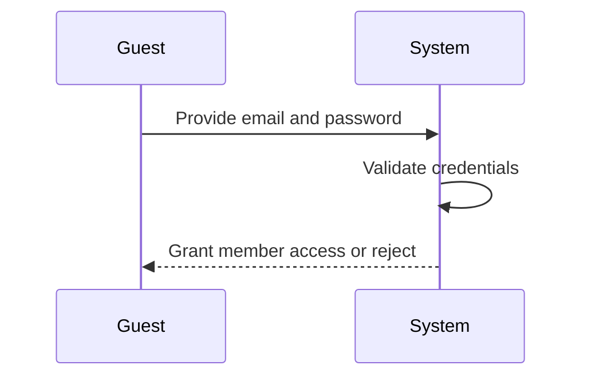

**todoApp — Actor definitions, permission matrix, authentication, session, account lifecycle**

Actor definitions, permission matrix, authentication, session, account lifecycle

# Actor Definitions

Define all user actor types with their identity, permissions, and access boundaries.

## guest Actor

A guest is an unauthenticated visitor who has not yet created an account or logged in. Guests can access the registration page to sign up with email and password. Guests can access the login page to authenticate with existing credentials. Guests cannot view any todo lists or todo details. Guests cannot access profile information or edit any settings. Guests cannot create, edit, or delete todos. Guests cannot access the trash or view edit history. All todo-related features require authentication. Guests must become members by signing up or logging in to access any application features beyond registration and login.

### Guest Identity and Access Boundaries

A guest is an unauthenticated visitor who has not created an account or logged in. Guests can access public pages only, which are the registration page and login page. Guests can sign up with email and password through the registration page. Guests can log in with email and password through the login page. After successful registration or login, the guest becomes a member and gains access to authenticated features. Guests cannot view any todo lists or todo details. Guests cannot access profile information or edit any settings. Guests cannot create, edit, or delete todos. Guests cannot access the trash or view edit history. Guests cannot perform any account management operations. All todo operations, profile management, and account settings require member authentication. Any attempt to access restricted features without authentication is rejected.

## member Actor

A member is an authenticated user with a registered account and active session. Members can manage their profile including editing their display name. Members can create todos with title, optional description, start date, and due date. Members can view their own todo list with pagination and see individual todo details. Members can mark todos as complete or incomplete using a simple toggle. Members can edit their todo's title, description, start date, and due date. Members can view the full edit history of their todos sorted from most recent to oldest. Members can delete todos which move to trash, view paginated trash list, restore todos, or permanently delete them. Members can filter todos by completion status and sort by creation date, start date, or due date. Members cannot view other users' profiles or access another user's todos. Members can change their password and delete their account which permanently removes all their todos including trash. All member data is completely private with no sharing capabilities.

### Member Actor Identity

A member is an authenticated user with a registered account and active session. Members gain this status after successful registration and login. Members maintain their status while their session remains active. Members lose access when their session expires or they log out.

### Member Permissions

Members can manage their own profile including editing their display name. Members can create, view, edit, and delete their own todos. Members can mark their todos as complete or incomplete. Members can view the edit history of their own todos. Members can manage their trash including viewing deleted todos, restoring them, or permanently deleting them. Members can filter and sort their own todo lists. Members can change their password (defined in Account Management). Members can delete their own account (defined in Account Management).

### Member Access Boundaries

Members can only access their own data including todos, edit history, and profile information. Members cannot view other users' profiles. Members cannot view, access, or share another user's todos. All member data is completely private with no sharing capabilities. Members cannot access system features without valid authentication credentials and an active session.

# Authentication Flows

Registration, login, logout, and session management from a user perspective.

## Registration and Login

Define user registration and login flows including validation and error handling.

### User Registration

Guests can register for an account by providing an email and a password.
The email must be unique across all registered accounts.
Upon successful registration, the guest becomes a member.
If the email is already in use, the registration is rejected.
If the email format is invalid, the registration is rejected.

### User Login

Guests can log in by providing their registered email and password.
Upon successful login, the guest becomes a member with access to their own todos.
The system validates the email and password combination before granting access.
If the email is not registered, the login is rejected.
If the password is incorrect, the login is rejected.

## Session and Logout

Define session behavior and logout from a user perspective.

### Session Management

After successful login, the user maintains an authenticated session.
The session remains active until the user logs out.
Only authenticated users with an active session can access member-only features.

### Logout

Users can log out from their account at any time.
When a user logs out, their session is terminated.
After logout, the user must log in again to access member-only features.

### Account Security

When a user deletes their account, all active sessions are terminated.
Each user's session is private and cannot be accessed by other users.

# Account Lifecycle

Account creation, deletion, and password management.

## Account Management

Define how users create accounts, delete accounts, and change passwords.

### Account Creation

Users can create an account by providing an email address and password. Upon successful account creation, the user becomes a member of the application. Each account is associated with a user profile that includes a display name.

### Account Deletion

Users can delete their own account at any time. When an account is deleted, all todos owned by that user are permanently deleted, including todos that are in the trash. The edit history associated with those todos is also permanently deleted. Account deletion is irreversible.

### Password Change

Users can change their password after creating an account. Upon successful password change, the new password is applied to the user's account.