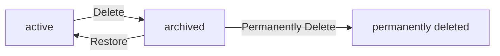
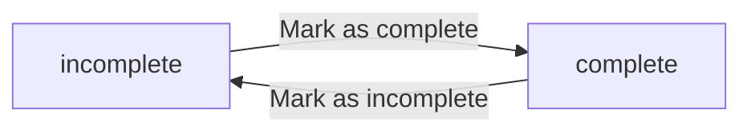
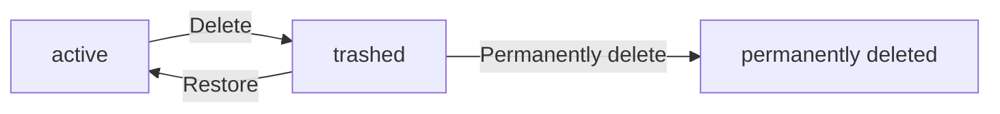

**todoApp — Business concepts, relationships, and states from user perspective**

Business concepts, relationships, and states from user perspective

# Domain Concepts

Describe what each concept means in the business domain and its key attributes.

## User Concept

A User represents an individual account holder in the todo application. Each user has an email address used for signing up and logging in. Users have a password for account security and authentication. Users have a display name that identifies them within the application. Users can edit their display name at any time to update how they appear. Users can change their password when needed for security purposes. Each user's account is completely separate and isolated from other users. Users cannot view other users' profiles or access their todos. When a user deletes their account, all their todos including those in trash are permanently removed. The user concept is central to the privacy model ensuring complete data isolation. Account ownership defines the boundary of what each user can access and manage.

### User Account and Credentials

A User represents an individual account holder in the todo application. Each user account is a separate and isolated entity with complete account ownership defining the boundary of what they can access and manage. Users sign up with an email address that serves as their primary credential for account creation and login. The email credential uniquely identifies each user within the application. Users have a password associated with their account for authentication purposes. The password is used together with the email during login to verify identity. Users can change their password when needed as part of credential management. Users can also update their email credential through account management capabilities. Account deletion and data retention policies are defined in the non-functional requirements.

### User Profile and Privacy

Each user has a profile with a display name that identifies them within the application. The display name is part of the user's identity and can be edited at any time through profile editing capability. User privacy is a fundamental principle: each user's todos are completely private and isolated from other users. The user privacy boundary ensures that isolated user data remains accessible only to the account owner. Users cannot view other users' profiles, as this is a private todo application. There is no way to view, access, or share another user's todos. User isolation maintains complete separation between individual account holders and their data.

## Todo Concept

A Todo represents a task that a user wants to track and manage. Each todo has a title that is required when creating it. Todos can have an optional description providing additional context and details. Todos can have an optional start date indicating when work on the task begins. Todos can have an optional due date indicating when the task should be completed. Newly created todos start in an incomplete state by default. Users can toggle todos between complete and incomplete states as progress changes. Each todo belongs to exactly one user and remains completely private. Todos display their creation date in the list view for reference. Todos without start or due dates appear at the end when sorting by those attributes. The todo concept is the core business entity that users create, view, and manage daily. Todo completion status is a simple binary state between done and not done.

### Todo Definition and Attributes

A Todo represents an individual task that a user tracks and manages within the application. Each todo belongs to exactly one user and serves as the core task list entity for personal productivity. Todo privacy ensures that all tasks remain accessible only to their owner.

Every todo has a title that is required and must be provided when creating the todo. The title identifies the task and is always displayed in the todo list view.

Each todo can have an optional description that provides additional context and details about the task. The description may be left empty when creating or editing a todo.

The todo attributes include the title, description, start date, due date, completion status, and creation date. These attributes define the complete state of a todo and are used for display and sorting purposes.

### Todo Dates and Time Tracking

Each todo can have an optional start date indicating when work on the task begins. The start date may be left empty if no specific start time is needed.

Each todo can have an optional due date indicating when the task should be completed. The due date may be left empty if no deadline is required.

Every todo has a creation date that is automatically set when the todo is first created. The creation date is always displayed in the todo list view for reference.

Todos can be sorted by creation date, start date, or due date in either ascending or descending order. When sorting by start date or due date, todos without those dates appear at the end of the list regardless of sort direction.

The optional date fields (start date and due date) provide flexibility for users who want to plan tasks with specific timing or leave timing open-ended.

### Todo Completion and Privacy

Each todo has a completion status that represents a binary state: either complete or incomplete. This is a simple toggle between two states with no intermediate values.

Newly created todos start in an incomplete state by default. Users can change the completion status at any time to mark a todo as complete or mark it as incomplete again.

Each todo is completely private to its owner. Users can only see their own todos and cannot view, access, or share another user's todos. There is no mechanism to make a todo visible to other users.

The private todo ownership and individual task management ensure that all tasks remain confidential and accessible only to the user who created them.

## TodoEditHistory Concept

TodoEditHistory represents a record of changes made to a todo over time. Each history entry captures when an edit was made with a timestamp. History entries record what the title was changed to if the title was modified. History entries record what the description was changed to if the description was modified. History entries record what the start date was changed to if the start date was modified. History entries record what the due date was changed to if the due date was modified. Every edit to a todo creates a new history entry automatically. History entries are sorted from most recent to oldest for easy review. Users can view the full edit history of any todo they own. When a todo is permanently deleted from trash, its edit history is also removed. The edit history concept provides transparency into how todos have been modified. History entries are tied to the specific todo they document and cannot exist independently.

### Edit History Entry

Every edit to a todo creates a new history entry automatically. Each history entry is a record that tracks modifications made to a todo over time. Each entry records when the edit was made with a timestamp. Each entry records what the title was changed to if the title was modified during the edit. Each entry records what the description was changed to if the description was modified during the edit. Each entry records what the start date was changed to if the start date was modified during the edit. Each entry records what the due date was changed to if the due date was modified during the edit. History entries are tied to the specific todo they document and cannot exist independently. Each history entry provides a complete change record showing what values were set during that modification.

### Edit History Management

Users can view the full edit history of any todo they own. The edit history provides complete transparency into how a todo has been modified over time. History entries are sorted with most recent first by timestamp. This ordering allows users to see the latest changes first. When a todo is permanently deleted from the trash, its edit history is also permanently deleted. This deletion cascade ensures that all modification records are removed when the todo is permanently deleted. The edit history serves as a modification audit trail for each todo.

# Domain Relationships

Describe how concepts relate to each other from a business perspective.

## Conceptual Relationships

Describe how concepts relate to each other in business terms.

### User-Todo Ownership Relationship

Each todo belongs to exactly one user who created it. This ownership relationship is established when the todo is created and cannot be transferred to another user.

A user has many todos. There is no limit to the number of todos a user can create.

The ownership relationship means that only the owning user can view, edit, complete, or delete their todos. No other user can access todos owned by someone else.

When a user deletes their account, all todos owned by that user are permanently deleted, including todos in the trash.

### Todo-Edit History Association

Each todo has many edit history entries. Every time a todo is edited, a new history entry is created and associated with that todo.

Each edit history entry belongs to exactly one todo. An edit history entry cannot exist independently and cannot be associated with multiple todos.

Edit history entries are ordered in descending order by timestamp, with the most recent edits appearing first.

The edit history entries are permanently deleted when their associated todo is permanently deleted from the trash.

### Privacy and Isolation

All todos are private to their owning user. There is no sharing mechanism and no way for users to view, access, or interact with todos owned by other users.

User profiles are private. Users cannot view other users' profiles, including display names or any other profile information.

The system maintains complete isolation between users' data. Each user operates within their own private workspace with no visibility into other users' activities or data.

## Lifecycle and Retention

Describe concept lifecycle states and transitions only. Detailed retention/recovery policies belong in 05-non-functional. Operation details belong in 03-functional-requirements.

### Todo Lifecycle States

A todo exists in one of three lifecycle states: active, archived (deleted), or permanently deleted.

When a todo is created, it enters the active state. Active todos appear in the user's normal todo list and can be viewed, edited, completed, or deleted.

When a user deletes a todo, it transitions to the archived state. Archived todos are moved to the trash and no longer appear in the normal todo list. This archival state allows todos to be retained for potential recovery.

When a user restores an archived todo, it transitions back to the active state and returns to the normal todo list.

When a user permanently deletes an archived todo from the trash, it transitions to the permanently deleted state. Permanently deleted todos cannot be recovered.

### Account Deletion Policy

When a user deletes their account, all todos owned by that user are permanently deleted, regardless of their current lifecycle state.

This includes todos in the active state and todos in the archived state (trash). All associated edit history for these todos is also permanently deleted.

Account deletion is irreversible. Once an account is deleted, none of the user's todos or edit history can be recovered.

### Edit History Retention

Edit history entries are retained for the lifetime of their associated todo. Each time a todo is edited, a new history entry is created and retained as long as the todo exists in any state. Edit history entries are ordered in descending chronological order, with the most recent edits appearing first.

When a todo transitions to the permanently deleted state, all edit history entries associated with that todo are also permanently deleted.

Edit history entries cannot be individually deleted or modified. They are automatically removed only when their parent todo is permanently deleted.

# Business Categories and State Flows

Business category classifications and state flow definitions.

## Business Category Definitions

Define all business category classifications with their allowed values and descriptions.

### Todo Completion Status Classification

The completion status is a business category that indicates whether a todo task has been finished.

This classification has two allowed values:
- **Incomplete**: The todo task is active and not yet finished. All newly created todos start with this status by default.
- **Complete**: The todo task has been marked as finished.

The completion status is used for filtering the todo list, allowing users to view all todos, only complete todos, or only incomplete todos.

### Todo Visibility Status Classification

The visibility status is a business category that determines whether a todo appears in the normal todo list or in the trash.

This classification has two allowed values:
- **Active**: The todo appears in the normal todo list and is accessible for viewing and editing.
- **Deleted**: The todo has been moved to the trash and no longer appears in the normal todo list.

When a todo is permanently deleted from the trash, it is removed from the system entirely along with its edit history.

## State Transitions

Define valid state transition paths for stateful concepts.

### Todo Completion State Flow

A todo has two completion states: incomplete and complete.

Newly created todos are incomplete by default.

Users can mark a todo as complete. This changes the completion status from incomplete to complete.

Users can mark a todo as incomplete. This changes the completion status from complete to incomplete.

This is a simple toggle between two states. There are no intermediate states or additional completion statuses.

### Todo Deletion Workflow

A todo progresses through three deletion states during its lifecycle: active, trashed, and permanently deleted.

When a user deletes a todo, it moves from active to trashed. This is a soft delete. The todo no longer appears in the normal todo list but is retained in the trash.

When a user restores a todo from the trash, it moves from trashed back to active. The todo returns to the normal todo list.

When a user permanently deletes a todo from the trash, it moves from trashed to permanently deleted. The todo and its edit history are removed from the system and cannot be recovered.

When a user deletes their account, all their todos move directly to permanently deleted, regardless of whether they are in the active or trashed state.

