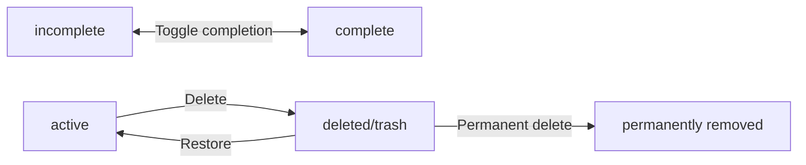
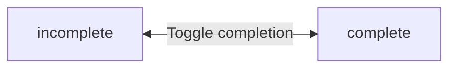
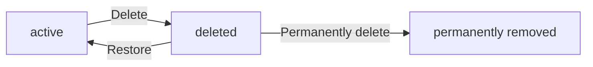

**multiUserTodo — Business concepts, relationships, and states from user perspective**

Business concepts, relationships, and states from user perspective

# Domain Concepts

Describe what each concept means in the business domain and its key attributes.

## User Concept

A User represents an individual account holder in the multi-user todo application. Each user is identified by their email address, which serves as their unique account identifier. Users authenticate themselves using a password associated with their email. Every user has a display name that appears within their personal workspace. The display name can be modified by the user at any time. Users own their todos privately, with no visibility into other users' tasks. When a user deletes their account, all associated todos are permanently removed, including those in the trash. The user concept establishes the foundation for private, individual task management within a shared application platform. Each user operates independently with complete isolation from other users' data.

### User Account

A User represents an individual account holder in the multi-user todo application. Each user operates within their own individual workspace, completely isolated from other users. The application supports multiple users on a shared platform, but each user's data remains private and inaccessible to others. A user account establishes the identity of the account holder and serves as the foundation for private task management. Users own their todos exclusively, with no ability to view, access, or share another user's todos.

### Email Identification

Each user is identified by their email address, which serves as their unique account identifier. The email address is used during sign up to create a new account. The email address is also used during log in to authenticate the user. No two users can share the same email address. The email address remains constant throughout the account's lifetime and cannot be changed.

### Password Authentication

Users authenticate themselves using a password associated with their email address. The password is set during account creation when the user signs up. Users can change their password at any time after account creation. The password serves as the sole credential for verifying the user's identity during log in. Both email and password are required to access the account.

### Display Name

Every user has a display name that appears within their personal workspace. The display name represents the user's profile identity within the application. Users can edit their display name at any time. The display name is optional during account creation and can be modified throughout the account's lifetime. Other users cannot view a user's display name, as this is a private todo application with complete user isolation.

### Private Ownership

Each user's todos are completely private to that user. Users can only see their own todos. There is no way to view, access, or share another user's todos. This user isolation ensures that all data remains within the individual's workspace. The private ownership model applies to all todos, including those in the trash. No collaboration or sharing features exist in this application.

### Account Deletion

Users can delete their account at any time. When a user deletes their account, all their todos are permanently deleted, including those in the trash. This account deletion cascade ensures no orphaned data remains in the system. The deletion is irreversible and removes all traces of the user's presence from the application. Once an account is deleted, the email address becomes available for a new account registration.

## Todo Concept

A Todo represents a task or item that a user needs to track and manage. Each todo has a required title that identifies the task. Users can optionally add a description to provide additional context or details. A todo may have a start date indicating when work should begin. A due date can be set to mark when the task should be completed. Every todo has a completion status that toggles between complete and incomplete states. Todos are created in an incomplete state by default. Each todo belongs to exactly one user and remains private to that owner. The todo concept captures the essential attributes needed for personal task tracking without sharing or collaboration features.

### Todo Definition and Core Attributes

A Todo represents a task or item that a user needs to track and manage within the application. Each todo is identified by a required title that serves as the primary means of task identification. Users may optionally add a description to provide additional context or details about the task. A todo may have a start date indicating when work on the task should begin. A due date can be set to mark when the task should be completed. Both start date and due date are optional and can be left empty. The todo serves as the core task tracking entity in the system, capturing all essential attributes needed for personal task management. Each todo belongs to exactly one user and contains the business attributes necessary for effective date tracking and task organization.

### Todo Completion Status

Every todo has a completion status that indicates whether the task is complete or incomplete. This status operates as a simple toggle between two states: complete and incomplete. When a todo is first created, it is automatically set to the incomplete state by default. Users can change the completion status at any time to reflect the current progress of the task. The completion status provides a clear indication of task progress and enables users to manage their workflow effectively through status management.

### Todo Ownership and Privacy

Each todo is privately owned by a single user and cannot be accessed by any other user. This private task ownership ensures that all todos remain completely confidential to their owner. The single user assignment means that a todo cannot be shared, transferred, or made visible to other users. There is no mechanism to view, access, or collaborate on another user's todos. This ownership model enforces strict privacy boundaries where users can only see and manage their own todos.

## EditHistory Concept

An EditHistory represents a recorded entry of changes made to a todo item. Each history entry captures when an edit was performed on the todo. The history records what the title was changed to, if the title was modified. Changes to the description are tracked in the history entry. Start date modifications are recorded when they occur. Due date changes are also captured in the edit history. Each edit creates a new history entry, building a complete audit trail. History entries are maintained in order from most recent to oldest. The edit history concept provides transparency into how a todo has evolved over time. When a todo is permanently deleted from trash, its edit history is also removed.

### Edit History Entry Definition

An edit history entry represents a recorded change made to a todo item. Each time a todo is edited, the system creates a new history entry to document what was modified.

The edit history entry captures when the edit was made, recording the timestamp of the modification. If the title was changed, the history entry records what the title was changed to. If the description was modified, the new description value is stored in the history entry. Changes to the start date are tracked by recording what the start date was changed to. Similarly, due date modifications are captured by storing what the due date was changed to.

Each history entry serves as an audit trail record, providing a business change log that tracks the evolution of a todo over time. The edit history domain encompasses all modification records associated with a todo, enabling users to understand how their todo has changed since creation.

A history entry is created only when an actual change occurs to one or more of the tracked fields: title, description, start date, or due date. The edit history entry belongs to exactly one todo and cannot exist independently.

### History Organization and Lifecycle

Edit history entries are organized in a specific order to support user viewing. The history entries are sorted from most recent to oldest, with the latest modification appearing first in the list.

When a user views the edit history of a todo, the system presents all history entries in this recent-to-oldest order, allowing the user to see the most recent changes at the top.

The edit history has a lifecycle tied to its parent todo. When a todo is permanently deleted from the trash, all associated edit history entries are also permanently deleted. This cascade deletion ensures that no orphaned history records remain after the parent todo is removed. The permanent deletion of edit history is irreversible and occurs at the same time as the permanent deletion of the todo itself.

# Domain Relationships

Describe how concepts relate to each other from a business perspective.

## Conceptual Relationships

Describe how concepts relate to each other in business terms.

### User-Todo Ownership

Each user owns their own todos. A user can have many todos. Each todo belongs to exactly one user. When a user creates a todo, that todo is automatically associated with the creating user. Users can only view and manage their own todos. There is no way to view or access another user's todos. When a user deletes their account, all todos owned by that user are permanently deleted, including todos in the trash.

### Todo-EditHistory Association

Each todo has an edit history. The edit history contains many entries. Each edit history entry belongs to exactly one todo. When a todo is edited, a new entry is added to that todo's edit history. The edit history entries are associated with their parent todo and cannot exist independently. When a todo is permanently deleted from the trash, its edit history is also permanently deleted.

### Privacy Boundaries

Todos are private to their owner. Each todo belongs to the user who created it. Users cannot view other users' profiles or todos. The system enforces complete isolation between users. A user can only interact with todos they own. There is no sharing mechanism or way to grant access to another user's todos.

## Lifecycle and Retention

Describe concept lifecycle states and transitions only. Detailed retention/recovery policies belong in 05-non-functional. Operation details belong in 03-functional-requirements.

### Todo Lifecycle States

A todo exists in one of two completion states: incomplete or complete.

Newly created todos are in the incomplete state by default.

Users can toggle a todo between incomplete and complete states.

A todo exists in one of two visibility states: active or deleted.

Newly created todos are in the active state by default.

When a user deletes a todo, it transitions from active to deleted state.

Deleted todos reside in the trash and do not appear in the active todo list.

### Soft Deletion and Trash

When a user deletes a todo, the todo is soft deleted rather than permanently removed.

Soft deleted todos are moved to the trash.

Todos in the trash retain all their attributes: title, description, start date, due date, and completion status.

Todos in the trash retain their edit history.

Soft deleted todos are not visible in the normal active todo list.

Users can view their trash to see all soft deleted todos.

The trash is scoped to the individual user; users can only see their own deleted todos.

### Permanent Deletion

Users can permanently delete a todo from the trash.

When a todo is permanently deleted, it is irreversibly removed from the system.

Permanently deleted todos cannot be recovered or restored.

When a todo is permanently deleted, its associated edit history is also permanently deleted.

Account deletion triggers permanent deletion of all todos owned by that user, including todos in the trash.

When a user account is permanently deleted, all edit histories associated with that user's todos are also permanently deleted.

### Edit History Retention

Each todo maintains an edit history that records all modifications made to the todo.

Each edit history entry captures: the timestamp of the edit, the new title (if changed), the new description (if changed), the new start date (if changed), and the new due date (if changed).

Edit history entries are retained for the lifetime of the todo.

Edit history entries are sorted from most recent to oldest when viewed.

Edit history is deleted only when the associated todo is permanently deleted or when the owning user account is deleted.

### Account Deletion and Data Ownership

Each todo is owned by exactly one user account.

When a user deletes their account, all todos owned by that user are permanently deleted.

Account deletion removes all user data including: the user profile, all active todos, all deleted todos in trash, and all edit histories associated with those todos.

Account deletion is irreversible; once an account is deleted, it cannot be recovered.

Users cannot transfer ownership of their todos to another user.

The private nature of the application means todos have no shared ownership; each todo belongs to exactly one user.

# Business Categories and State Flows

Business category classifications and state flow definitions.

## Business Category Definitions

Define all business category classifications with their allowed values and descriptions.

### Todo Completion Status Classification

Every todo has a completion status that indicates whether the task has been finished.

The completion status is a business category with two allowed values:

| Status | Description |
|--------|-------------|
| Incomplete | The todo task has not been finished. This is the default status when a todo is first created. |
| Complete | The todo task has been finished. |

Users can toggle a todo between incomplete and complete states. The completion status is visible in the todo list view and in the detailed todo view.

The completion status is independent of the todo's visibility status (whether it is in the active list or in the trash).

### Todo Visibility Status Classification

Every todo has a visibility status that indicates where the todo appears in the application.

The visibility status is a business category with three allowed values:

| Status | Description |
|--------|-------------|
| Active | The todo appears in the user's normal todo list. This is the default status when a todo is first created. |
| Deleted | The todo has been soft deleted and appears only in the trash list. It does not appear in the normal todo list. |
| Permanently Deleted | The todo has been permanently removed from the system along with its edit history. It cannot be recovered. |

When a user deletes a todo, it transitions from active to deleted status and moves to the trash. When a user restores a todo from the trash, it transitions from deleted to active status and returns to the normal todo list. When a user permanently deletes a todo from the trash, it transitions to permanently deleted status and is removed from the system.

The visibility status is independent of the todo's completion status.

## State Transitions

Define valid state transition paths for stateful concepts.

### Todo Completion State Flow

A todo has a completion status that toggles between two states: incomplete and complete.

When a todo is created, it is automatically set to incomplete.

Users can mark an incomplete todo as complete.
Users can mark a complete todo as incomplete.

This is a simple toggle between the two states with no restrictions.

### Todo Deletion and Recovery Workflow

A todo has a deletion status that determines its visibility and recoverability.

When a todo is created, it is in the active state and appears in the normal todo list.

Users can delete an active todo, which moves it to the deleted state (soft delete).
A deleted todo no longer appears in the normal todo list but is visible in the trash.

Users can restore a deleted todo from the trash, which returns it to the active state.
A restored todo reappears in the normal todo list.

Users can permanently delete a deleted todo from the trash.
A permanently deleted todo is removed from the system and cannot be recovered.
When a todo is permanently deleted, its edit history is also removed.

