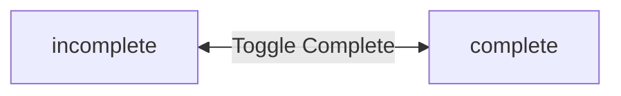
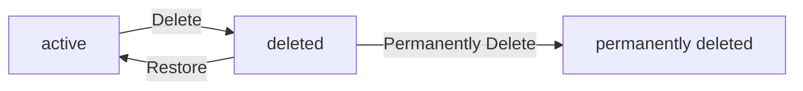

**todoApp — Business concepts, relationships, and states from user perspective**

Business concepts, relationships, and states from user perspective

# Domain Concepts

Describe what each concept means in the business domain and its key attributes.

## User Concept

A User represents an individual account holder who owns and manages their private todo items. Each user is identified by a unique email address that serves as their primary identifier within the system. Users have a password that secures access to their account and todo data. Each user has a display name that represents them within the application. The display name can be edited by the user at any time. Users exist in complete isolation from one another, with no ability to view or access other users' profiles or todos. When a user deletes their account, all their todos are permanently removed, including those in the trash. The user concept embodies the privacy-first nature of the application where each person's data remains entirely separate. Users are the sole owners of their todos and edit histories. The system enforces strict boundaries ensuring users can only interact with their own data.

### User Account and Identity

A User represents an individual account holder who owns and manages their private todo items. Each user is identified by a unique email address that serves as their primary identifier within the system. Users have a password that secures access to their account and todo data. Each user has a display name that represents them within the application. The display name can be edited by the user at any time. Users are the sole owners of their todos and edit histories, with exclusive ownership boundaries that prevent any other user from accessing or modifying their data.

### User Privacy and Isolation

Users exist in complete isolation from one another, with no ability to view or access other users' profiles or todos. Each user's todos are completely private. There is no way to view, access, or share another user's todos. The system enforces strict boundaries ensuring users can only interact with their own data. This embodies the privacy-first nature of the application where each person's data remains entirely separate from all other users.

### Account Deletion Consequences

When a user deletes their account, all their todos are permanently removed, including those in the trash. This permanent deletion removes all todo data associated with the account without exception. The account deletion action is irreversible and results in complete removal of all user-owned content from the system.

## Todo Concept

A Todo represents a task or item that a user creates and manages within their personal list. Each todo has a required title that identifies what the task is. Todos can optionally include a description providing additional details about the task. A todo may have an optional start date indicating when work on the task begins. A todo may have an optional due date indicating when the task should be completed. Newly created todos start in an incomplete state by default. Each todo tracks its completion status which toggles between complete and incomplete. Todos display their title, completion status, start date if set, due date if set, and creation date in list views. The creation date is automatically recorded when the todo is first created. Todos belong exclusively to the user who created them and cannot be shared or accessed by others. A todo exists in one of two states: active in the normal list or soft deleted in the trash.

### Todo Definition and Attributes

A Todo represents a task or item that a user creates and manages within their personal list. Each todo has a title that is required and identifies what the task is. A todo may include an optional description that provides additional details about the task. The description can be left empty when creating or editing a todo. A todo may have an optional start date indicating when work on the task begins. A todo may have an optional due date indicating when the task should be completed. Both start date and due date can be left empty. When a todo is first created, it starts in an incomplete state by default. The creation date is automatically recorded when the todo is first created and cannot be changed.

### Todo Completion and Display

Each todo tracks its completion status which toggles between complete and incomplete. This is a simple toggle between two states. In list views, each todo displays its title, completion status, start date if set, due date if set, and creation date. When viewing a single todo, all details are shown including the full description.

### Todo Ownership and State

Todos belong exclusively to the user who created them and cannot be shared or accessed by others. Each user's todos are completely private. There is no way to view, access, or share another user's todos. A todo exists in one of two states: active in the normal list or soft deleted in the trash. When a todo is deleted, it is not permanently removed but moves to the trash where it no longer appears in the normal todo list.

## EditHistory Concept

EditHistory represents a chronological record of changes made to a todo item. Each time a todo is edited, a new history entry is created to capture what changed. Every history entry records the timestamp of when the edit was made. History entries capture the new title value if the title was changed during the edit. History entries capture the new description value if the description was changed during the edit. History entries capture the new start date if the start date was changed during the edit. History entries capture the new due date if the due date was changed during the edit. History entries are displayed sorted from most recent to oldest for easy review. The edit history provides a complete audit trail of all modifications to a todo. When a todo is permanently deleted from the trash, its entire edit history is also permanently removed. Edit history belongs to the todo and exists only as long as the todo exists.

### Edit History Record

An edit history record is a business concept that tracks all changes made to a todo item over time. Each time a user edits a todo, a new history entry is automatically created to capture what was modified. Every history entry records the exact timestamp of when the edit was made. History entries capture the new title value if the title was changed during the edit. History entries capture the new description value if the description was changed during the edit. History entries capture the new start date if the start date was changed during the edit. History entries capture the new due date if the due date was changed during the edit. If a field was not changed during an edit, that field is not recorded in the history entry. Edit history belongs to the todo and cannot exist independently. Each history entry is permanently associated with the todo it documents.

### Edit History Ordering

Edit history entries are displayed sorted from most recent to oldest for easy review. This chronological ordering allows users to quickly see the latest changes at the top of the history list. The edit history provides a complete audit trail of all modifications made to a todo throughout its lifetime. Users can view the full edit history of any of their todos to understand how the todo has evolved over time. The ordering ensures that the most recent edit appears first, followed by progressively older edits.

### Edit History Lifecycle

Edit history entries exist only as long as their associated todo exists. When a todo is permanently deleted from the trash, its entire edit history is also permanently removed. The history cannot be recovered once the todo is permanently deleted. Soft-deleted todos in the trash retain their edit history until permanent deletion occurs. The deletion of edit history is automatic and occurs at the same time as the permanent deletion of the parent todo.

# Domain Relationships

Describe how concepts relate to each other from a business perspective.

## Conceptual Relationships

Describe how concepts relate to each other in business terms.

### User-Todo Ownership Relationship

Each todo belongs to exactly one user. The user who creates a todo becomes its owner.

A user can own many todos. There is no limit to the number of todos a user can create.

The ownership relationship means:
- Only the owner can view, edit, complete, or delete their todos
- Todos are permanently associated with their creating user
- When a user deletes their account, all todos they own are permanently deleted

The ownership is established at creation time and cannot be transferred to another user.

### Todo-EditHistory Association

Each todo has an edit history that tracks all changes made to it.

A todo can have many edit history entries. Each time the todo is edited, a new history entry is created and associated with that todo.

The association means:
- Edit history entries belong to exactly one todo
- Edit history entries cannot exist without a todo
- When a todo is permanently deleted, all its edit history entries are also permanently deleted

The edit history provides a chronological record of what changes were made to the todo's title, description, start date, and due date.

### Data Isolation Between Users

Each user's data is completely isolated from all other users.

The ownership relationship enforces strict data isolation:
- Users can only see their own todos
- Users cannot view, access, or interact with todos owned by other users
- There is no shared or public todo functionality
- Users cannot view other users' profiles or display names

This isolation applies to all operations including viewing todo lists, viewing individual todos, filtering, sorting, and accessing edit history. The system treats each user's data as a separate, private workspace.

## Lifecycle and Retention

Describe concept lifecycle states and transitions only. Detailed retention/recovery policies belong in 05-non-functional. Operation details belong in 03-functional-requirements.

### Todo Lifecycle States

A todo exists in one of three lifecycle states: active, deleted, or permanently removed.

When first created, a todo is in the active state and appears in the user's normal todo list. An active todo can be marked as complete or incomplete, edited, or deleted.

When a user deletes a todo, it transitions to the deleted state and moves to the trash. In this state, the todo no longer appears in the normal todo list but is retained in the trash for potential recovery. The todo and its edit history remain associated.

When a user permanently deletes a todo from the trash, it transitions to the permanently removed state. The todo and all its edit history entries are removed from the system and cannot be recovered.

When a user deletes their account, all their todos transition directly to the permanently removed state, regardless of whether they were in the active or deleted state.

### Deletion and Recovery

The system supports two deletion modes: soft deletion and permanent deletion.

Soft deletion moves a todo to the trash, where it is archived and hidden from the normal todo list. The todo remains accessible through the trash view and can be restored. This is the default deletion behavior when a user deletes an active todo.

Permanent deletion removes a todo and its edit history from the system entirely. This action is irreversible. Permanent deletion occurs when a user explicitly chooses to permanently delete a todo from the trash, or when a user deletes their account.

Recovery is the process of restoring a deleted todo from the trash back to the active state. When restored, the todo returns to the normal todo list with all its attributes and edit history intact. Only todos in the deleted state (in the trash) can be recovered.

# Business Categories and State Flows

Business category classifications and state flow definitions.

## Business Category Definitions

Define all business category classifications with their allowed values and descriptions.

### Todo Completion Status Classification

The todo completion status is a business category that classifies the completion state of a todo item.

The allowed values for completion status are:
- **Incomplete**: The todo has not been marked as complete. Newly created todos are incomplete by default.
- **Complete**: The todo has been marked as complete by the user.

A todo can only be in one completion status at a time. Users can toggle a todo between incomplete and complete states.

### Todo List Filter Categories

The todo list filter category is a business classification that determines which todos are displayed in the list view.

The allowed values for filter categories are:
- **All todos**: Displays all todos regardless of completion status.
- **Only complete todos**: Displays only todos marked as complete.
- **Only incomplete todos**: Displays only todos not marked as complete.

Users can select one filter category to view their todo list. The filter applies to the user's own todos only.

### Todo Sorting Categories

The todo sorting category is a business classification that determines the order in which todos appear in the list.

The allowed values for sorting categories are:
- **Creation date, newest first**: Todos are sorted by creation date with the most recently created appearing first.
- **Creation date, oldest first**: Todos are sorted by creation date with the earliest created appearing first.
- **Start date, earliest first**: Todos are sorted by start date with the earliest start date appearing first. Todos without a start date appear at the end.
- **Start date, latest first**: Todos are sorted by start date with the latest start date appearing first. Todos without a start date appear at the end.
- **Due date, earliest first**: Todos are sorted by due date with the earliest due date appearing first. Todos without a due date appear at the end.
- **Due date, latest first**: Todos are sorted by due date with the latest due date appearing first. Todos without a due date appear at the end.

Users can select one sorting category to order their todo list.

## State Transitions

Define valid state transition paths for stateful concepts.

### Todo Completion Status Transitions

Every todo starts in the incomplete state when created. Users can toggle the completion status between incomplete and complete at any time. Marking a todo as complete changes its status from incomplete to complete. Marking a completed todo as incomplete changes its status from complete to incomplete. This is a simple two-state toggle with no restrictions on when the status can be changed.

### Todo Deletion and Recovery Workflow

When a user deletes a todo, it transitions from the active state to the deleted state. Deleted todos appear in the trash and no longer appear in the normal todo list. From the deleted state, a todo can follow one of two paths: it can be restored back to the active state, returning to the normal todo list, or it can be permanently deleted, which removes the todo and its edit history entirely. Permanently deleted todos cannot be recovered. When a user deletes their account, all their todos regardless of state are permanently deleted.

