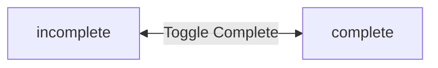
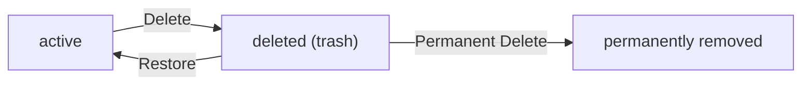

**todoApp — Business concepts, relationships, and states from user perspective**

Business concepts, relationships, and states from user perspective

# Domain Concepts

Describe what each concept means to users and why it exists.

## User Concept

Users are the primary actors who own and manage their personal todo items. Each user registers with a unique email address and password for authentication. Users maintain a profile with a display name that can be edited at any time. Users authenticate by logging in with their email and password credentials. Users can change their password to maintain account security. Each user has complete ownership and privacy over their todos. Users cannot view or access other users' profiles or todos. Users can delete their account, which permanently removes all their todos including those in trash. The system ensures complete isolation between user data for privacy. Users manage their own authentication credentials throughout their account lifecycle.

### User Account and Registration

### User Account Creation

WHEN a user registers for an account, THE system SHALL:
1. Require a unique email address for authentication
2. Require a password for account security
3. Ensure no two users can register with the same email address
4. Create the user account upon successful registration

WHEN a user attempts to register with an email address that is already in use, THE system SHALL reject the registration request.

### Email Authentication

WHEN a user logs in, THE system SHALL:
1. Require the user's registered email address
2. Require the user's password
3. Verify the credentials match the stored account information
4. Grant access only when both email and password are correct

IF the email address does not exist in the system, THE system SHALL reject the login request.

IF the password does not match the stored credentials, THE system SHALL reject the login request.

### Login Credentials

THE system SHALL maintain login credentials (email and password) for each registered user account.

THE system SHALL use the email address as the unique identifier for user authentication.

WHEN a user provides login credentials, THE system SHALL validate both the email format and password before attempting authentication.

### Profile Management

### Display Name

THE system SHALL require each user to have a display name as part of their profile.

WHEN a user creates an account, THE system SHALL require a display name to be provided.

### Profile Editing

WHEN a user edits their profile, THE system SHALL:
1. Allow the user to change their display name
2. Update the display name immediately upon successful edit
3. Retain all other account information unchanged

THE system SHALL allow users to edit their display name at any time after account creation.

### Private Profiles

THE system SHALL ensure that user profiles are private and not visible to other users.

IF a user attempts to view another user's profile, THE system SHALL reject the request.

THE system SHALL not provide any functionality for users to browse or search for other user profiles.

THE system SHALL maintain complete privacy of all user profile information including display names.

### Credential and Security Management

### Password Changes

WHEN a user changes their password, THE system SHALL:
1. Require the user to provide their current password for verification
2. Require a new password to be specified
3. Update the password only when the current password is verified
4. Maintain account access with the new password immediately after change

IF the current password provided does not match the stored credentials, THE system SHALL reject the password change request.

### Credential Management

THE system SHALL allow users to manage their authentication credentials throughout their account lifecycle.

THE system SHALL ensure that credential changes (password updates) are applied immediately to the user account.

WHEN a user successfully changes their password, THE system SHALL invalidate any existing sessions and require re-authentication with the new credentials.

### Account Security

THE system SHALL protect user credentials by requiring verification before any credential changes.

THE system SHALL ensure that only the authenticated user can modify their own credentials.

IF an unauthorized attempt is made to change user credentials, THE system SHALL reject the request and maintain the existing credentials.

### Account Ownership and Privacy

### Account Ownership

THE system SHALL establish complete ownership of todos by the user who creates them.

THE system SHALL ensure that each user has exclusive control over their own account and todos.

WHEN a user creates a todo, THE system SHALL associate it exclusively with that user's account.

### User Privacy

THE system SHALL ensure complete privacy of each user's todos and account information.

IF a user attempts to access another user's todos, THE system SHALL reject the request.

THE system SHALL not provide any mechanism for users to share or grant access to their todos.

### Data Isolation

THE system SHALL maintain complete data isolation between different user accounts.

THE system SHALL ensure that users can only view, edit, or delete their own todos.

IF a request is made to access data belonging to another user, THE system SHALL reject the request without revealing the existence of that data.

### Account Deletion

WHEN a user deletes their account, THE system SHALL:
1. Permanently delete all todos owned by the user, including those in trash
2. Permanently delete all edit history associated with the user's todos
3. Remove all user profile information
4. Invalidate the user's authentication credentials
5. Prevent any recovery of deleted account data

THE system SHALL ensure that account deletion is irreversible and all associated data is permanently removed.

IF a user attempts to access a deleted account, THE system SHALL reject the request as the account no longer exists.

## Todo Concept

Todos are task items that users create to track their personal work and responsibilities. Each todo requires a title to identify the task being tracked. Todos can include an optional description for additional context and details. Users can set optional start dates to indicate when work should begin. Users can set optional due dates to track when tasks should be completed. All newly created todos start in an incomplete state by default. Users can toggle todos between complete and incomplete states as needed. Each todo belongs exclusively to the user who created it. Deleted todos move to trash instead of being permanently removed immediately. Users can filter their todo list by completion status. Users can sort todos by creation date, start date, or due date. Todos without dates appear at the end when sorting by date fields.

### Todo Creation and Structure

WHEN a user creates a todo, THE system SHALL:
1. Require a title to identify the task
2. Allow an optional description for additional context
3. Allow an optional start date to indicate when work should begin
4. Allow an optional due date to track when the task should be completed
5. Set the completion status to incomplete by default

THE title SHALL be required for every todo creation.
THE description MAY be left empty when creating a todo.
THE start date MAY be left empty when creating a todo.
THE due date MAY be left empty when creating a todo.

WHEN a todo is created, THE system SHALL associate it exclusively with the creating user.
WHEN a todo is created, THE system SHALL record the creation date automatically.

### Completion Status Management

WHEN a user marks a todo as complete, THE system SHALL update the completion status to complete.
WHEN a user marks a todo as incomplete, THE system SHALL update the completion status to incomplete.

THE completion status SHALL be a toggle between two states: complete and incomplete.
ALL newly created todos SHALL have incomplete status by default.

WHILE a todo exists, THE system SHALL allow the user to toggle between complete and incomplete states at any time.

### Todo Ownership and Privacy

THE system SHALL ensure each todo belongs exclusively to the user who created it.
THE system SHALL prevent users from viewing todos owned by other users.
THE system SHALL prevent users from accessing, editing, or deleting todos owned by other users.

WHEN a user views their todo list, THE system SHALL display only todos owned by that user.
WHEN a user deletes their account, THE system SHALL permanently delete all todos owned by that user, including those in trash.

### Soft Delete and Trash

WHEN a user deletes a todo, THE system SHALL move it to trash instead of permanently removing it.
WHEN a todo is moved to trash, THE system SHALL remove it from the normal todo list.

WHEN a user views their trash, THE system SHALL display only deleted todos owned by that user.
WHEN a user restores a todo from trash, THE system SHALL return it to the normal todo list.
WHEN a user permanently deletes a todo from trash, THE system SHALL remove the todo and its edit history permanently.

THE trash SHALL contain only todos that have been soft deleted by the user.

### Todo List Organization

WHEN a user views their todo list, THE system SHALL support filtering by completion status:
1. All todos
2. Only complete todos
3. Only incomplete todos

WHEN a user sorts their todo list, THE system SHALL support sorting by:
1. Creation date (newest first or oldest first)
2. Start date (earliest first or latest first)
3. Due date (earliest first or latest first)

WHEN sorting by start date, THE system SHALL place todos without a start date at the end of the list.
WHEN sorting by due date, THE system SHALL place todos without a due date at the end of the list.

THE todo list SHALL be paginated to manage large numbers of todos.
THE todo list SHALL display for each todo: title, completion status, start date (if set), due date (if set), and creation date.

## TodoHistory Concept

Todo history provides a complete audit trail of all changes made to a todo item. Every edit to a todo automatically creates a new history entry. Each history entry records the exact timestamp when the edit was made. History entries capture what the title was changed to if the title was modified. History entries capture what the description was changed to if the description was modified. History entries capture changes to start dates and due dates when those fields are updated. Users can view the full edit history of any todo they own. History entries are displayed from most recent to oldest for easy review. When a todo is permanently deleted from trash, its entire history is also removed. History provides users with transparency about how their todos have evolved over time.

### Edit History Creation

WHEN a user edits any field of their todo, THE system SHALL automatically create a new history entry.

WHEN a todo is edited, THE system SHALL record the exact timestamp when the edit was made.

THE system SHALL create history entries for all modifications to title, description, start date, and due date fields.

IF multiple fields are edited in a single operation, THE system SHALL create one history entry capturing all changes.

THE system SHALL ensure every edit to a todo is tracked in its history without exception.

History entries serve as an audit trail providing transparency about how todos have evolved over time.

Each history entry represents a version of the todo at the point of modification.

THE system SHALL maintain the modification log for as long as the todo exists in the system.

### Change Recording

WHEN the title of a todo is changed, THE system SHALL record what the title was changed to in the history entry.

WHEN the description of a todo is changed, THE system SHALL record what the description was changed to in the history entry.

WHEN the start date of a todo is changed, THE system SHALL record what the start date was changed to in the history entry.

WHEN the due date of a todo is changed, THE system SHALL record what the due date was changed to in the history entry.

IF a field is not modified during an edit, THE system SHALL not record that field in the history entry.

THE system SHALL capture only the new values of changed fields, not the previous values.

Each change record SHALL clearly indicate which fields were modified and their new values.

### History Viewing

WHEN a user views the edit history of their todo, THE system SHALL display all history entries for that todo.

THE system SHALL display history entries sorted from most recent to oldest (chronological ordering, newest first).

THE system SHALL show the timestamp of each history entry to indicate when the edit was made.

THE system SHALL display the changed fields and their new values for each history entry.

Users SHALL be able to view the full edit history of any todo they own.

THE system SHALL provide edit transparency by showing complete change history to the todo owner.

WHILE viewing history, users SHALL see a complete audit trail of all modifications made to their todo.

### History Lifecycle

WHEN a todo is permanently deleted from the trash, THE system SHALL also permanently delete all history entries associated with that todo.

THE system SHALL remove the entire modification log when a todo is permanently deleted.

IF a todo is soft-deleted (moved to trash), THE system SHALL retain its history entries.

WHEN a todo is restored from trash, THE system SHALL make its history entries accessible again.

THE system SHALL ensure history cleanup occurs automatically when permanent deletion is performed.

History entries SHALL not exist independently of their parent todo.

THE system SHALL maintain referential integrity between todos and their history entries throughout the lifecycle.

# Domain Relationships

Describe how concepts relate to each other from a business perspective.

## Conceptual Relationships

Describe how concepts relate to each other in business terms.

### User-Todo Ownership

THE system SHALL ensure each user owns their own todos.

WHEN a user creates a todo, THE system SHALL associate the todo with that user as the owner.

THE system SHALL allow a user to own zero or more todos.

THE system SHALL ensure each todo is owned by exactly one user.

WHEN a user deletes their account, THE system SHALL permanently delete all todos owned by that user.

THE system SHALL prevent users from accessing todos owned by other users.

THE system SHALL not allow a todo to be transferred from one user to another.

IF a user attempts to access a todo they do not own, THE system SHALL reject the request.

### Todo-User Association

EACH todo SHALL be associated with exactly one user account.

WHEN a todo is created, THE system SHALL record the creating user as the associated owner.

THE system SHALL not allow a todo to exist without an associated user.

THE system SHALL maintain the association between a todo and its owner throughout the todo's lifetime.

IF a user account is deleted, THE system SHALL not allow orphaned todos to remain.

THE system SHALL ensure the user-todo association is established at creation time and cannot be modified.

WHEN viewing a todo, THE system SHALL verify the requesting user is the associated owner.

### Todo-History Relationship

EACH todo MAY have zero or more edit history entries.

WHEN a todo is edited, THE system SHALL create a new history entry associated with that todo.

THE system SHALL maintain the relationship between each history entry and its parent todo.

THE system SHALL ensure each history entry belongs to exactly one todo.

WHEN a todo is permanently deleted, THE system SHALL also delete all associated history entries.

THE system SHALL allow users to view the edit history of todos they own.

THE system SHALL maintain history entries in chronological order, with the most recent edit first.

IF a todo has no edits, THE system SHALL show an empty edit history.

THE system SHALL not allow history entries to exist without an associated todo.

## Lifecycle and Retention

Describe business rules for concept lifecycle and data retention from a user perspective.

### Todo Lifecycle States

WHEN a todo is created, THE system SHALL set its initial state as active.

WHEN a user deletes a todo, THE system SHALL move it to the trash state (soft delete).

WHILE a todo is in trash, THE system SHALL exclude it from the normal todo list view.

WHEN a user permanently deletes a todo from trash, THE system SHALL remove it completely from the system.

WHEN a user restores a todo from trash, THE system SHALL return it to the active state.

A todo exists in one of three states: active, trash, or permanently deleted.

IF a todo is permanently deleted, THE system SHALL make it unrecoverable.

### Trash Retention Policy

THE system SHALL retain deleted todos in trash indefinitely until the user chooses to permanently delete them.

WHEN viewing the trash list, THE system SHALL display only the user's own deleted todos.

THE system SHALL apply pagination to the trash list, consistent with the normal todo list pagination.

WHILE a todo remains in trash, THE system SHALL preserve all its attributes including title, description, start date, due date, and completion status.

THE system SHALL NOT automatically purge todos from trash after any time period.

### Account Deletion Consequences

WHEN a user deletes their account, THE system SHALL permanently delete all their active todos.

WHEN a user deletes their account, THE system SHALL permanently delete all their todos in trash.

WHEN a user deletes their account, THE system SHALL permanently delete all edit history entries associated with the user's todos.

IF a user account is deleted, THE system SHALL NOT retain any todo data associated with that account.

THE system SHALL NOT provide any recovery mechanism for todos after account deletion.

### Todo Recovery Operations

WHEN a user restores a todo from trash, THE system SHALL return it to the normal todo list.

WHEN a todo is restored, THE system SHALL preserve its original creation date.

WHEN a todo is restored, THE system SHALL preserve its completion status.

WHEN a todo is restored, THE system SHALL preserve all its edit history entries.

WHEN a todo is restored, THE system SHALL preserve its start date if one was set.

WHEN a todo is restored, THE system SHALL preserve its due date if one was set.

IF a todo is restored, THE system SHALL make it visible in the normal todo list immediately.

### Edit History Retention

THE system SHALL retain edit history for all active todos.

THE system SHALL retain edit history for all todos in trash.

WHEN a todo is permanently deleted from trash, THE system SHALL delete all its associated edit history entries.

WHEN a user deletes their account, THE system SHALL delete all edit history entries for all their todos.

WHILE a todo exists in the system (active or trash), THE system SHALL preserve its complete edit history.

IF a todo has no edit history, THE system SHALL indicate that no edits have been made.

# Enums and State Machines

Enum type definitions and state transitions.

## Enum Definitions

Define all enum types with their allowed values and descriptions.

### Todo Completion Status Enum

THE system SHALL define a TodoCompletionStatus enumeration with the following allowed values:

1. **incomplete** - The todo has not been marked as complete
2. **complete** - The todo has been marked as complete

WHEN a todo is created, THE system SHALL set its completion status to "incomplete" by default.

WHILE a todo exists, THE system SHALL allow its completion status to transition between "incomplete" and "complete" states.

THE system SHALL use this enumeration to represent the completion state of all todo items in the domain model.

### Status Type Definitions

Each status type in the TodoCompletionStatus enumeration represents a distinct business state:

**incomplete**:
- Indicates the todo task is pending or in progress
- The todo appears in the active todo list by default
- Users can mark an incomplete todo as complete

**complete**:
- Indicates the todo task has been finished
- Users can filter todos by this completion status
- Users can mark a complete todo as incomplete (reopening the task)

THE system SHALL ensure that every todo has exactly one completion status type at any given time.

THE system SHALL not allow any other status type values beyond those defined in the enumeration.

## State Transitions

Define valid state transition paths for stateful concepts.

### Todo Completion State Machine

A todo exists in one of two completion states: incomplete or complete.

WHEN a todo is created, THE system SHALL set its completion state to incomplete by default.

WHEN a member marks a todo as complete, THE system SHALL transition the todo from incomplete to complete.

WHEN a member marks a todo as incomplete, THE system SHALL transition the todo from complete to incomplete.

THE system SHALL allow toggling between incomplete and complete states at any time.

WHILE a todo is in the incomplete state, THE system SHALL display it as not completed in the todo list.

WHILE a todo is in the complete state, THE system SHALL display it as completed in the todo list.

### Todo Deletion Workflow

A todo progresses through deletion states: active, deleted (in trash), or permanently removed.

WHEN a member deletes a todo, THE system SHALL transition the todo from active to deleted state.

WHEN a todo is in the deleted state, THE system SHALL remove it from the normal todo list view.

WHEN a todo is in the deleted state, THE system SHALL make it visible only in the trash view.

WHEN a member restores a todo from trash, THE system SHALL transition the todo from deleted back to active state.

WHEN a todo is restored, THE system SHALL make it visible again in the normal todo list.

WHEN a member permanently deletes a todo from trash, THE system SHALL remove the todo and all its edit history permanently.

IF a todo is permanently deleted, THE system SHALL not allow recovery of the todo or its history.

### Account Deletion Cascade

Account deletion triggers a cascade of permanent deletions across all related data.

WHEN a member deletes their account, THE system SHALL permanently delete all todos owned by that member.

WHEN an account is deleted, THE system SHALL permanently delete all todos regardless of their current state (active or deleted).

WHEN an account is deleted, THE system SHALL permanently delete all edit history entries associated with the member's todos.

IF an account is deleted, THE system SHALL not allow recovery of any todos or history that belonged to that account.

THE system SHALL ensure that account deletion is irreversible once completed.