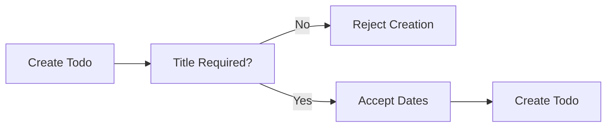
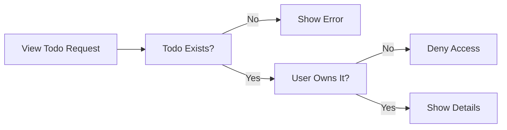
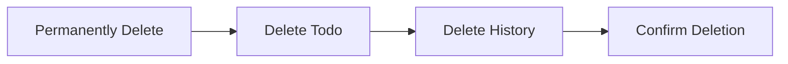

**todoApp — What operations users can perform, use cases, business workflows**

What operations users can perform, use cases, business workflows

# Core Business Operations

What the system must do for each business concept.

## User Operations

Users create accounts by providing an email address and password during registration. Email addresses must be unique across all active accounts in the system. Users authenticate by logging in with their registered email and password combination. Each user maintains a profile containing a display name that can be updated at any time. Users have the ability to change their password for security purposes. Account deletion is permanent and removes all associated data including todos in both active and trash states. Users cannot access or view other users' profiles or todos due to privacy requirements. The system enforces strict isolation between user accounts to maintain data privacy. Display names are required for each user profile. Users control their own account settings and personal information exclusively.

### Account Registration

WHEN a guest registers for an account, THE system SHALL:
1. Require an email address
2. Require a password
3. Require a display name
4. Verify the email address is not already in use by an existing account
5. Create the account with incomplete status
6. Associate the account with the provided credentials

IF the email address is already registered, THE system SHALL reject the registration request.
IF the display name is empty, THE system SHALL reject the registration request.
IF the password does not meet security requirements, THE system SHALL reject the registration request.

WHEN registration succeeds, THE system SHALL authenticate the user and establish a session.

### User Authentication

WHEN a user attempts to log in, THE system SHALL:
1. Require the registered email address
2. Require the account password
3. Verify the credentials match an existing account
4. Establish an authenticated session upon successful verification

IF the email address does not exist, THE system SHALL reject the login request.
IF the password does not match, THE system SHALL reject the login request.
IF the account has been deleted, THE system SHALL reject the login request.

WHEN authentication succeeds, THE system SHALL grant access to the user's private todo data.
WHILE authenticated, THE system SHALL maintain the user's session for subsequent operations.

### Password Management

WHEN an authenticated user changes their password, THE system SHALL:
1. Require the current password for verification
2. Require a new password
3. Verify the current password matches the stored credentials
4. Update the account with the new password
5. Invalidate any existing sessions requiring re-authentication

IF the current password is incorrect, THE system SHALL reject the password change request.
IF the new password does not meet security requirements, THE system SHALL reject the password change request.
IF the new password matches the current password, THE system SHALL reject the password change request.

WHEN the password change succeeds, THE system SHALL confirm the update to the user.

### Profile Management

WHEN an authenticated user edits their display name, THE system SHALL:
1. Require a non-empty display name value
2. Update the user's profile with the new display name
3. Preserve all other account data unchanged

IF the display name is empty, THE system SHALL reject the update request.
IF the display name exceeds the maximum length, THE system SHALL reject the update request.

WHEN the display name update succeeds, THE system SHALL reflect the change in all user-facing contexts.

THE system SHALL require each user to have exactly one display name associated with their account.
WHILE the account exists, THE system SHALL allow the user to modify their display name at any time.

### Account Deletion

WHEN an authenticated user requests account deletion, THE system SHALL:
1. Require explicit confirmation of the deletion action
2. Permanently remove the user account
3. Permanently remove all todos owned by the user, including those in trash
4. Permanently remove all edit history associated with the user's todos
5. Invalidate all active sessions for the deleted account
6. Prevent any future login attempts with the deleted account credentials

IF the user does not confirm the deletion, THE system SHALL cancel the deletion request.
IF the account has already been deleted, THE system SHALL reject any operations on the account.

WHEN account deletion completes, THE system SHALL make the email address available for new registration.
WHEN account deletion completes, THE system SHALL ensure no recoverable data remains associated with the account.

### Privacy and Data Isolation

WHEN any user accesses the system, THE system SHALL:
1. Restrict todo visibility to only todos owned by the authenticated user
2. Prevent access to other users' profiles
3. Prevent access to other users' todos
4. Prevent access to other users' edit histories
5. Enforce strict isolation between all user accounts

IF a user attempts to access another user's todo, THE system SHALL deny the request.
IF a user attempts to view another user's profile, THE system SHALL deny the request.
IF a user attempts to access another user's edit history, THE system SHALL deny the request.

WHILE authenticated, THE system SHALL ensure each user can only perform operations on their own data.
WHEN listing todos, THE system SHALL include only todos owned by the requesting user.
WHEN viewing todo details, THE system SHALL verify ownership before granting access.

THE system SHALL maintain complete privacy isolation between all user accounts at all times.

## Todo Operations

Users create todos with a required title and optional description, start date, and due date. New todos are marked as incomplete upon creation by default. Users view their own todos in a paginated list showing title, completion status, dates, and creation timestamp. Individual todo details include the full description and all associated date fields. Users toggle todo completion status between complete and incomplete states. Todo editing allows modification of title, description, start date, and due date fields. Users soft delete todos, moving them to trash rather than permanent removal. Deleted todos disappear from the normal list but remain accessible in the trash view. Users filter todos by completion status including all, complete only, or incomplete only. Sorting options include creation date, start date, and due date in ascending or descending order. Todos without start or due dates appear at the end when sorting by those fields. Each user can only access and manage their own todos with no cross-user visibility.

### Todo Creation

WHEN a user creates a todo, THE system SHALL require a title.

WHEN a user creates a todo, THE system SHALL allow an optional description that can be left empty.

WHEN a user creates a todo, THE system SHALL allow optional start date and due date fields that can be left empty.

WHEN a user creates a todo, THE system SHALL set the completion status to incomplete by default.

IF the title is missing or empty, THE system SHALL reject the todo creation request.

WHEN a todo is successfully created, THE system SHALL associate it with the creating user.

### Todo Viewing

WHEN a user views their todo list, THE system SHALL display todos in a paginated format.

WHEN a user views the todo list, THE system SHALL show the following for each todo:
1. Title
2. Completion status
3. Start date (if set)
4. Due date (if set)
5. Creation date

WHEN a user views a single todo, THE system SHALL display all details including the full description and all associated date fields.

WHEN a user requests a todo that does not exist, THE system SHALL reject the request (defined in Todo Error Scenarios).

### Todo Completion

WHEN a user marks a todo as complete, THE system SHALL update the completion status to complete.

WHEN a user marks a todo as incomplete, THE system SHALL update the completion status to incomplete.

THE system SHALL support toggling between complete and incomplete states as a simple two-state transition.

WHEN a user attempts to toggle completion status on a todo they do not own, THE system SHALL reject the request (defined in Todo Error Scenarios).

### Todo Editing

WHEN a user edits a todo, THE system SHALL allow modification of the title.

WHEN a user edits a todo, THE system SHALL allow modification of the description.

WHEN a user edits a todo, THE system SHALL allow modification of the start date.

WHEN a user edits a todo, THE system SHALL allow modification of the due date.

WHEN a todo is edited, THE system SHALL record the edit in the todo's history (defined in TodoHistory Operations).

IF a user attempts to edit a todo they do not own, THE system SHALL reject the request (defined in Todo Error Scenarios).

### Todo Deletion and Trash Management

WHEN a user deletes a todo, THE system SHALL perform a soft delete rather than permanent removal.

WHEN a todo is soft deleted, THE system SHALL remove it from the normal todo list.

WHEN a user views the trash, THE system SHALL display all their soft deleted todos in a paginated format.

WHEN a user restores a todo from trash, THE system SHALL return it to the normal todo list.

WHEN a user permanently deletes a todo from trash, THE system SHALL remove the todo and its edit history permanently.

IF a user attempts to delete a todo they do not own, THE system SHALL reject the request (defined in Todo Error Scenarios).

IF a user attempts to restore a permanently deleted todo, THE system SHALL reject the request (defined in Todo Error Scenarios).

### Todo Filtering and Sorting

WHEN a user filters their todo list, THE system SHALL support filtering by completion status with the following options:
1. All todos
2. Only complete todos
3. Only incomplete todos

WHEN a user sorts their todo list, THE system SHALL support sorting by the following fields:
1. Creation date
2. Start date
3. Due date

WHEN sorting by date fields, THE system SHALL support both ascending (oldest/earliest first) and descending (newest/latest first) order.

WHILE sorting by start date, THE system SHALL place todos without a start date at the end of the list.

WHILE sorting by due date, THE system SHALL place todos without a due date at the end of the list.

WHEN a user applies null start date sorting, THE system SHALL handle the null values as defined in Todo Error Scenarios.

### Todo Privacy and Isolation

THE system SHALL ensure each user can only view their own todos.

THE system SHALL prevent users from accessing, viewing, or modifying another user's todos.

THE system SHALL enforce complete isolation between users' todo data with no cross-user visibility.

WHEN a user attempts to access another user's todo, THE system SHALL deny the request (defined in Todo Error Scenarios).

THE system SHALL not provide any mechanism to view, access, or share another user's todos.

## TodoHistory Operations

Every todo edit generates a history entry automatically in the system. History entries capture the timestamp of when each edit occurred. Edits record changed values for title, description, start date, and due date fields individually. Only fields that were actually modified are recorded in each history entry. Users view the complete edit history for any of their todos. History entries display in reverse chronological order with most recent edits first. Each history entry shows what specific field values were changed during that edit. Permanent todo deletion from trash also removes all associated history entries. History tracking provides an audit trail of all modifications made to todos. Users cannot modify or delete individual history entries directly. History entries are read-only records of past todo state changes.

### Automatic History Creation

WHEN a user edits any field of their todo, THE system SHALL automatically create a new history entry.

WHEN a history entry is created, THE system SHALL record the exact timestamp of when the edit occurred.

THE system SHALL create history entries only when actual field values are modified, not when the edit request contains unchanged values.

WHEN multiple fields are edited in a single operation, THE system SHALL create one history entry containing all field changes.

THE system SHALL associate each history entry with the specific todo that was modified.

WHEN a todo is created, THE system SHALL NOT create an initial history entry.

THE system SHALL ensure history creation happens atomically with the todo update operation.

WHEN an edit operation fails, THE system SHALL NOT create a history entry.

THE system SHALL track all todo state changes through the history mechanism.

THE system SHALL maintain a complete modification tracking record for each todo throughout its lifetime.

### Field Change Recording

WHEN a history entry is created, THE system SHALL record only the fields that were actually modified during the edit.

WHEN the title is changed, THE system SHALL record the new title value in the history entry.

WHEN the description is changed, THE system SHALL record the new description value in the history entry.

WHEN the start date is changed, THE system SHALL record the new start date value in the history entry.

WHEN the due date is changed, THE system SHALL record the new due date value in the history entry.

IF a field is not modified during an edit, THE system SHALL NOT record that field in the history entry.

THE system SHALL support field-level change recording where each history entry contains only the specific fields that changed.

WHEN a field is changed from a value to null or empty, THE system SHALL record this change in the history entry.

THE history entry structure SHALL capture the new value for each modified field, not the old value.

THE system SHALL provide a todo modification log through the accumulated history entries.

### History Viewing

WHEN a user requests to view the edit history of their todo, THE system SHALL return all history entries for that todo.

THE system SHALL display history entries in reverse chronological order with the most recent edit first.

WHEN displaying history entries, THE system SHALL show the timestamp of when each edit was made.

WHEN displaying history entries, THE system SHALL show which fields were changed in each entry.

WHEN displaying history entries, THE system SHALL show the new value for each changed field.

THE system SHALL provide edit history visibility only to the owner of the todo.

WHEN a todo has no edit history, THE system SHALL return an empty list.

THE system SHALL ensure chronological ordering is maintained regardless of how history entries are retrieved.

WHEN sorting by recency, THE system SHALL place the most recent edits at the beginning of the list.

THE system SHALL provide complete history view access showing all modifications made to the todo since creation.

### History Immutability

THE system SHALL treat all history entries as read-only records that cannot be modified.

WHEN a user attempts to edit a history entry, THE system SHALL reject the request.

WHEN a user attempts to delete a history entry, THE system SHALL reject the request.

THE system SHALL maintain history immutability for all existing history entries.

THE system SHALL preserve the history audit trail integrity by preventing any modifications to historical records.

WHEN a todo is edited multiple times, THE system SHALL preserve all previous history entries unchanged.

THE system SHALL ensure that history entries accurately reflect the state changes that occurred at the time of each edit.

THE read-only history entries SHALL serve as an immutable audit trail of all todo modifications.

THE system SHALL prevent users from altering the modification tracking record once it is created.

### History Deletion

WHEN a user permanently deletes a todo from the trash, THE system SHALL also delete all associated history entries.

THE system SHALL perform history cleanup on deletion as part of the permanent todo deletion operation.

WHEN a permanent deletion cascade occurs, THE system SHALL remove the todo and all its history entries together.

THE system SHALL NOT allow history entries to exist without their parent todo.

WHEN a todo is soft deleted (moved to trash), THE system SHALL retain all history entries.

WHEN a todo is restored from the trash, THE system SHALL preserve all existing history entries.

THE system SHALL ensure that permanent deletion cascade removes all traces of the todo including its modification history.

WHEN history entries are deleted due to permanent todo deletion, THE system SHALL NOT allow recovery of the history.

THE system SHALL maintain referential integrity by ensuring history entries cannot outlive their parent todo.

# Business Actions and Workflows

Business actions and workflows beyond basic CRUD.

## User Actions

Users create accounts by providing email and password during registration. Email addresses must be unique across all active accounts in the system. Users authenticate by entering their registered email and password to log in. Users can change their password after logging into their account. Users have the option to delete their entire account at any time. Account deletion permanently removes all user data including todos in trash. Users can update their display name which appears in their profile. Profile information is private and not visible to other users. Each user operates in complete isolation from other users. No user can access or view another user's todos or profile information. The system maintains strict privacy boundaries between user accounts. Authentication is required before accessing any todo management features. Password changes require the user to be logged in first. Account deletion is irreversible and removes all associated data. Users cannot recover deleted accounts or their todos.

### Account Registration

WHEN a guest registers for an account, THE system SHALL:
1. Require an email address
2. Require a password
3. Validate that the email address is not already associated with an existing account
4. Create the account with the provided credentials
5. Set the initial display name based on the email address

IF the email address is already registered, THE system SHALL reject the registration request.

IF the password does not meet security requirements, THE system SHALL reject the registration request.

WHEN an account is successfully created, THE system SHALL:
1. Log the user in automatically
2. Grant access to todo management features

THE system SHALL require authentication before allowing access to any todo creation, viewing, or management features.

### Login Authentication

WHEN a user attempts to log in, THE system SHALL:
1. Require the registered email address
2. Require the account password
3. Verify the credentials match the stored account information
4. Establish an authenticated session upon successful verification

IF the email address does not match any registered account, THE system SHALL reject the login attempt.

IF the password does not match the stored password for the email address, THE system SHALL reject the login attempt.

WHEN a user is authenticated, THE system SHALL:
1. Allow access to the user's own todos
2. Allow access to the user's profile settings
3. Allow access to account management features

THE system SHALL maintain secure credential management by not exposing passwords in any user interface or logs.

### Password Change

WHEN an authenticated user requests to change their password, THE system SHALL:
1. Require the current password for verification
2. Require a new password
3. Require confirmation of the new password
4. Update the password only if all validations pass

IF the current password provided does not match the stored password, THE system SHALL reject the password change request.

IF the new password and confirmation do not match, THE system SHALL reject the password change request.

IF the new password does not meet security requirements, THE system SHALL reject the password change request.

WHEN a password is successfully changed, THE system SHALL:
1. Update the stored password immediately
2. Maintain the user's authenticated session
3. Allow the user to continue using all features with the new password

THE system SHALL require the user to be logged in before allowing any password change operations.

### Account Deletion

WHEN an authenticated user requests to delete their account, THE system SHALL:
1. Require explicit confirmation of the deletion request
2. Warn the user that the action is irreversible
3. Permanently delete all user data including:
   - The user account itself
   - All todos owned by the user (including those in trash)
   - All edit history associated with the user's todos
   - All profile information

IF the user does not provide confirmation, THE system SHALL not proceed with account deletion.

WHEN account deletion is confirmed, THE system SHALL:
1. Remove all user data from the system immediately
2. Make the email address available for new registration
3. Terminate the user's authenticated session

THE system SHALL not allow recovery of deleted accounts or any associated data.

THE system SHALL ensure complete account removal with no residual data remaining after deletion.

### Profile Management

WHEN an authenticated user updates their display name, THE system SHALL:
1. Require a non-empty display name value
2. Update the display name immediately upon valid submission
3. Reflect the change in the user's profile

IF the display name is empty or contains only whitespace, THE system SHALL reject the update request.

WHEN a user views their own profile, THE system SHALL display:
1. The user's current display name
2. The user's registered email address

THE system SHALL enforce profile privacy by not allowing any user to view another user's profile information.

THE system SHALL maintain user data ownership by ensuring each user has exclusive control over their own profile information.

WHEN a user deletes their account, THE system SHALL remove all profile information as part of the permanent data removal process.

### User Privacy and Isolation

THE system SHALL enforce strict user isolation boundaries between all user accounts.

WHILE a user is authenticated, THE system SHALL:
1. Allow the user to access only their own todos
2. Prevent the user from viewing any other user's todos
3. Prevent the user from accessing any other user's profile information
4. Prevent the user from modifying any other user's data

THE system SHALL ensure private profile access by not providing any mechanism to discover or view other users' profiles.

THE system SHALL maintain user data ownership by ensuring all todos, edit history, and profile data are exclusively associated with the creating user.

IF a user attempts to access another user's todo by any means, THE system SHALL deny the request.

IF a user attempts to access another user's profile, THE system SHALL deny the request.

THE system SHALL not provide any sharing, collaboration, or visibility features that would allow cross-user data access.

## Todo Actions

Users create new todos with a required title and optional details. Description, start date, and due date can be left empty during creation. New todos are marked as incomplete by default upon creation. Users can toggle todo completion status between complete and incomplete. Editing a todo updates its title, description, start date, or due date. Deleted todos move to trash instead of being permanently removed. Users can restore todos from trash back to their active todo list. Permanent deletion from trash removes the todo and its history completely. Users filter todos by completion status: all, complete, or incomplete. Users sort todos by creation date, start date, or due date. Sorting supports both ascending and descending order options. Todos without start or due dates appear at the end when sorting by those fields. The todo list displays pagination for managing large numbers of items. Each todo in the list shows title, status, dates, and creation date. Users view individual todos to see full details including complete description. Only the todo owner can access, edit, or delete their todos. Privacy ensures no user can view or interact with another user's todos.

### Todo Creation

WHEN a user creates a todo, THE system SHALL:
1. Require a title to be provided
2. Allow the description to be left empty
3. Allow the start date to be left empty
4. Allow the due date to be left empty
5. Set the completion status to incomplete by default
6. Associate the todo with the creating user
7. Record the creation date automatically

IF the title is missing or empty, THE system SHALL reject the todo creation request.
IF the user attempts to create a todo without being authenticated, THE system SHALL reject the request.

WHEN a todo is successfully created, THE system SHALL make it immediately visible in the user's todo list.

### Completion Status Management

WHEN a user marks a todo as complete, THE system SHALL update the completion status to complete.
WHEN a user marks a todo as incomplete, THE system SHALL update the completion status to incomplete.

THE completion status toggle SHALL operate as a binary switch between complete and incomplete states only.

WHEN the completion status changes, THE system SHALL create an edit history entry recording the change.

IF the todo does not exist, THE system SHALL reject the completion status change request.
IF the user is not the owner of the todo, THE system SHALL reject the completion status change request.

### Todo Editing

WHEN a user edits a todo, THE system SHALL allow changes to:
1. The title
2. The description
3. The start date
4. The due date

WHEN any field is edited, THE system SHALL create an edit history entry that records:
1. The timestamp of the edit
2. The new title value (if changed)
3. The new description value (if changed)
4. The new start date value (if changed)
5. The new due date value (if changed)

IF a field is not changed during an edit, THE system SHALL record no change for that field in the history entry.

IF the user is not the owner of the todo, THE system SHALL reject the edit request.
IF the todo has been permanently deleted, THE system SHALL reject the edit request.

### Todo Deletion and Trash Management

WHEN a user deletes a todo, THE system SHALL move it to trash instead of permanently removing it.
WHEN a todo is in trash, THE system SHALL exclude it from the normal todo list display.

WHEN a user views the trash, THE system SHALL display all todos that have been soft deleted by that user.
WHEN a user restores a todo from trash, THE system SHALL return it to the normal todo list.

WHEN a user permanently deletes a todo from trash, THE system SHALL:
1. Remove the todo completely
2. Remove all associated edit history entries
3. Make the todo unrecoverable

IF the user is not the owner of the todo, THE system SHALL reject the deletion request.
IF the todo does not exist in the user's trash, THE system SHALL reject the restoration request.

### Todo Filtering and Sorting

WHEN a user filters their todo list, THE system SHALL support these filter options:
1. All todos
2. Only complete todos
3. Only incomplete todos

WHEN a user sorts their todo list, THE system SHALL support sorting by:
1. Creation date
2. Start date
3. Due date

WHEN sorting by any date field, THE system SHALL support both ascending and descending order.

WHEN sorting by start date, THE system SHALL place todos without a start date at the end of the list.
WHEN sorting by due date, THE system SHALL place todos without a due date at the end of the list.

IF an invalid sort field is requested, THE system SHALL reject the sorting request.
IF an invalid sort order is requested, THE system SHALL reject the sorting request.

### Todo List Display

WHEN a user views their todo list, THE system SHALL display each todo with:
1. Title
2. Completion status
3. Start date (if set)
4. Due date (if set)
5. Creation date

WHEN the todo list contains more items than the page limit, THE system SHALL paginate the results.
WHEN a user navigates to a specific page, THE system SHALL display only the todos for that page.

WHEN a user views a single todo, THE system SHALL display all details including the full description.

IF the requested page number exceeds the available pages, THE system SHALL return an empty result or the last available page.
IF the todo does not exist, THE system SHALL reject the detail viewing request.

### Privacy and Access Control

THE system SHALL ensure that each user can only access their own todos.
THE system SHALL prevent any user from viewing another user's todos.
THE system SHALL prevent any user from editing another user's todos.
THE system SHALL prevent any user from deleting another user's todos.

WHEN a user attempts to access a todo, THE system SHALL verify ownership before granting access.

IF a user attempts to access a todo they do not own, THE system SHALL deny access without revealing the todo's existence.
IF a user attempts to perform any operation on a todo they do not own, THE system SHALL reject the request.

## TodoHistory Actions

Every todo edit automatically creates a history entry. History entries record the timestamp of when changes were made. Each entry captures what the title was changed to if modified. Description changes are recorded in the history when updated. Start date modifications are tracked in the history. Due date changes are logged in the history entry. Users can view the complete edit history for any of their todos. History entries display from most recent to oldest. Edit history provides a complete audit trail of todo changes. History is automatically generated without user intervention. Permanently deleting a todo also removes all its history entries. Restoring a todo from trash preserves its edit history. History entries cannot be manually edited or deleted by users. The system maintains history integrity throughout the todo lifecycle. Each history entry represents a single edit operation.

### Automatic History Generation

WHEN a user edits any field of their todo, THE system SHALL automatically create a new history entry without requiring user action.

WHEN a history entry is created, THE system SHALL record the exact timestamp of when the edit occurred.

THE system SHALL generate exactly one history entry per edit operation, regardless of how many fields are changed in that edit.

WHEN multiple fields are modified in a single edit, THE system SHALL capture all changes within one history entry.

THE system SHALL generate history entries for all todo edits, including title, description, start date, due date, and completion status changes.

WHEN a todo is created, THE system SHALL NOT create an initial history entry, as history tracks changes after creation.

THE system SHALL automatically populate the edit timestamp using the server time at the moment of the edit.

### Change Tracking Details

WHEN a user changes the todo title, THE system SHALL record the new title value in the history entry.

WHEN a user changes the todo description, THE system SHALL record the new description value in the history entry.

WHEN a user changes the start date, THE system SHALL record the new start date value in the history entry.

WHEN a user changes the due date, THE system SHALL record the new due date value in the history entry.

IF a field is not changed during an edit, THE system SHALL NOT record a value for that field in the history entry.

THE system SHALL track which specific fields were modified in each edit operation.

WHEN a user edits a todo, THE system SHALL capture the complete set of changes made in that single operation.

THE system SHALL record the actual new values, not the differences or deltas from previous values.

### History Viewing and Ordering

WHEN a user views the edit history of their todo, THE system SHALL display all history entries for that todo.

THE system SHALL display history entries in reverse chronological order, with the most recent edit appearing first.

WHEN a user accesses history for a todo they do not own, THE system SHALL deny access to the history entries.

THE system SHALL maintain a complete audit trail showing all edits throughout the todo's lifecycle.

WHEN a todo has no edits, THE system SHALL display an empty history list to the user.

THE system SHALL enable users to view the full edit history from the todo detail view.

WHILE viewing history, THE system SHALL show the timestamp and all recorded field changes for each entry.

THE system SHALL track the complete lifecycle of edits from the first modification to the most recent.

### History Integrity and Lifecycle

WHEN a user permanently deletes a todo from the trash, THE system SHALL also delete all history entries associated with that todo.

WHEN a user restores a todo from the trash, THE system SHALL preserve all existing history entries for that todo.

THE system SHALL prevent users from manually editing or deleting individual history entries.

WHEN a todo is soft deleted (moved to trash), THE system SHALL retain all history entries for that todo.

THE system SHALL enforce history integrity by ensuring entries cannot be modified after creation.

IF a todo is permanently deleted, THE system SHALL cascade the deletion to remove all associated history entries.

THE system SHALL maintain immutable history entries that cannot be altered by any user action.

WHEN a todo exists in the system, THE system SHALL preserve its history entries unless the todo is permanently deleted.

# Error Scenarios and Edge Cases

Business-level error scenarios, edge case coverage, and expected system behaviors for exceptional conditions.

## User Error Scenarios

Users attempting to register with an email already in use cannot create a duplicate account. Login attempts with incorrect email or password combinations fail without revealing which credential was wrong. Password change requests require the current password to be verified first. Account deletion permanently removes all todos including those in trash, and this action cannot be undone. Display name updates must contain valid characters and cannot be empty. Multiple failed login attempts may temporarily restrict further authentication tries. Email addresses must follow valid format requirements during registration and profile updates. Users cannot access or view other users' profiles or account information. Session expiration requires users to log in again to continue using the application. Password requirements must be met during both registration and password change operations.

### Registration Error Scenarios

### Duplicate Email Registration

IF a user attempts to register with an email address that is already associated with an existing account, THE system SHALL reject the registration request.

IF a registration request is rejected due to duplicate email, THE system SHALL NOT reveal whether the email or password was the cause of failure.

THE system SHALL ensure email uniqueness across all user accounts during registration.

### Invalid Email Format

IF a user attempts to register with an email address that does not follow valid email format requirements, THE system SHALL reject the registration request.

IF a user attempts to update their email with an invalid format, THE system SHALL reject the update request.

THE system SHALL validate email format during both registration and profile update operations.

IF an email format is invalid, THE system SHALL provide a generic format error message without exposing validation rules.

### Authentication Error Scenarios

### Invalid Login Credentials

IF a user attempts to log in with an incorrect email or password combination, THE system SHALL reject the authentication request.

IF a login attempt fails, THE system SHALL NOT reveal whether the email or password was incorrect.

THE system SHALL treat failed authentication attempts uniformly regardless of which credential was invalid.

### Login Rate Limiting

WHEN multiple consecutive login attempts fail for the same account, THE system SHALL temporarily restrict further authentication attempts.

WHILE an account is under login restriction, THE system SHALL reject additional login attempts for that account.

IF a login restriction is active, THE system SHALL NOT disclose the remaining restriction duration to the user.

### Session Expiration Handling

WHEN a user's session expires, THE system SHALL require the user to log in again to continue using the application.

IF a user attempts to access a protected resource with an expired session, THE system SHALL redirect to the login page.

WHILE a session is expired, THE system SHALL NOT allow access to any authenticated features.

### Password Change Error Scenarios

### Password Verification Failure

IF a user attempts to change their password without providing the correct current password, THE system SHALL reject the password change request.

WHEN a password change is requested, THE system SHALL verify the current password before applying any changes.

IF the current password verification fails, THE system SHALL NOT update the password.

### Password Requirement Violations

IF a new password does not meet the password requirements during registration, THE system SHALL reject the registration request.

IF a new password does not meet the password requirements during password change, THE system SHALL reject the password change request.

THE system SHALL enforce password requirements consistently during both registration and password change operations.

IF a password requirement violation occurs, THE system SHALL provide a generic error message without exposing specific requirement details.

### Account Deletion Scenarios

### Permanent Account Deletion

WHEN a user deletes their account, THE system SHALL permanently delete all todos associated with that user, including those in trash.

WHEN a user deletes their account, THE system SHALL permanently delete all edit histories associated with that user's todos.

IF a user account is deleted, THE system SHALL NOT allow recovery of the account or any associated data.

THE system SHALL ensure that account deletion is irreversible and removes all user data permanently.

WHEN account deletion is complete, THE system SHALL terminate any active sessions for that user.

IF a deleted user attempts to log in, THE system SHALL reject the authentication request.

### Profile Update Error Scenarios

### Empty Display Name Rejection

IF a user attempts to update their display name with an empty value, THE system SHALL reject the update request.

IF a user attempts to update their display name with invalid characters, THE system SHALL reject the update request.

THE system SHALL require display names to contain valid characters and cannot be empty.

IF a display name update is rejected, THE system SHALL retain the previous display name value.

WHEN a display name update fails, THE system SHALL NOT partially apply any changes to the user profile.

### Access Control Error Scenarios

### Cross-User Access Denial

IF a user attempts to view another user's profile, THE system SHALL deny access.

IF a user attempts to access another user's todos, THE system SHALL deny access.

IF a user attempts to view another user's todo edit history, THE system SHALL deny access.

THE system SHALL ensure that each user's todos are completely private and inaccessible to other users.

IF a user attempts to access a resource that does not exist or belongs to another user, THE system SHALL respond with a generic access denied message.

THE system SHALL NOT reveal whether a requested resource exists when access is denied due to ownership.

## Todo Error Scenarios

Creating a todo without a title results in an error since title is required. Users cannot edit or delete todos that do not belong to them due to privacy restrictions. Attempting to view a non-existent todo displays an appropriate error message. Restoring a todo from trash fails if the todo was already permanently deleted. Todos without start dates appear at the end when sorting by start date. Todos without due dates appear at the end when sorting by due date. Pagination requests beyond available pages return empty results without errors. Filtering by completion status with no matching todos shows an empty list. Due dates can be set before start dates as the system does not enforce date ordering. Permanently deleting a todo from trash also removes all associated edit history.

### Todo Creation Validation Errors

### Missing Title Creation Failure

WHEN a user attempts to create a todo without providing a title, THE system SHALL reject the creation request.

THE system SHALL display an error message indicating that a title is required.

THE system SHALL NOT create a todo record when the title is missing or empty.

### Date Ordering Flexibility

THE system SHALL allow users to set a due date that is earlier than the start date.

THE system SHALL NOT enforce any date ordering validation between start date and due date fields.

WHEN a user sets both start date and due date, THE system SHALL accept any combination of dates regardless of their chronological order.

### Todo Access and Privacy Errors

### Cross-User Todo Access Denial

WHEN a user attempts to view a todo that belongs to another user, THE system SHALL deny access.

WHEN a user attempts to edit a todo that belongs to another user, THE system SHALL reject the request.

WHEN a user attempts to delete a todo that belongs to another user, THE system SHALL reject the request.

THE system SHALL NOT reveal the existence of todos belonging to other users.

### Non-Existent Todo Viewing

WHEN a user attempts to view a todo that does not exist, THE system SHALL display an error message.

THE system SHALL NOT expose whether a non-existent todo belongs to the user or another user.

WHEN a user requests details for a todo ID that is invalid or does not exist, THE system SHALL return a generic not found error.

### Trash and Deletion Errors

### Trash Restoration Failure

WHEN a user attempts to restore a todo from trash that has been permanently deleted, THE system SHALL reject the restoration request.

THE system SHALL display an error message indicating the todo cannot be restored.

WHEN a todo is permanently deleted, THE system SHALL remove all associated edit history records.

### Permanent Deletion Cascades

WHEN a user permanently deletes a todo from trash, THE system SHALL also delete all edit history entries for that todo.

THE system SHALL NOT allow recovery of permanently deleted todos or their history.

WHEN a user deletes their account, THE system SHALL permanently delete all todos including those in trash along with their edit history.

### List Display and Sorting Behaviors

### Null Start Date Sorting

WHEN sorting todos by start date with earliest first, THE system SHALL place todos without a start date at the end of the list.

WHEN sorting todos by start date with latest first, THE system SHALL place todos without a start date at the end of the list.

THE system SHALL NOT exclude todos without start dates from sorted lists.

### Null Due Date Sorting

WHEN sorting todos by due date with earliest first, THE system SHALL place todos without a due date at the end of the list.

WHEN sorting todos by due date with latest first, THE system SHALL place todos without a due date at the end of the list.

THE system SHALL NOT exclude todos without due dates from sorted lists.

### Empty Pagination Results

WHEN a user requests a page number beyond the available pages, THE system SHALL return an empty list.

THE system SHALL NOT display an error when pagination requests exceed available data.

WHEN there are no todos matching the current view, THE system SHALL display an empty list without error messages.

### No Matching Filter Results

WHEN a user filters todos by completion status and no todos match the filter, THE system SHALL display an empty list.

THE system SHALL NOT display an error when filter criteria match no todos.

WHEN filtering produces no results, THE system SHALL still allow the user to change filters or view all todos.

## TodoHistory Error Scenarios

Viewing edit history for a non-existent todo results in an error message. Users cannot view edit history for todos that do not belong to them. Edit history is unavailable for todos that were permanently deleted from trash. Newly created todos with no edits show an empty history list. History entries are always displayed from most recent to oldest. Edit history cannot be modified or deleted independently from the todo itself. Viewing history for a todo in trash is allowed until permanent deletion. History entries record only the new values after each edit, not the previous values. Multiple rapid edits create separate history entries for each change. Edit history viewing does not require any special permissions beyond todo ownership.

### History Access Control and Errors

IF a user attempts to view the edit history of a non-existent todo, THE system SHALL display an error message indicating the todo cannot be found.

IF a user attempts to view the edit history of a todo that does not belong to them, THE system SHALL deny access and display an error message.

WHEN a todo is permanently deleted from the trash, THE system SHALL also permanently delete all associated edit history entries.

IF a user attempts to view the edit history of a permanently deleted todo, THE system SHALL display an error message indicating the history is unavailable.

WHILE a todo exists in the trash (before permanent deletion), THE system SHALL allow the owner to view its edit history.

THE system SHALL only allow users to view edit history for todos they own.

IF a user does not own a todo, THE system SHALL prevent access to that todo's edit history regardless of the todo's status.

### History Content Rules and Behavior

WHEN a todo is newly created with no edits, THE system SHALL display an empty history list when the user views the edit history.

THE system SHALL display edit history entries in reverse chronological order, with the most recent edit appearing first.

THE system SHALL not allow users to modify or delete individual history entries independently from the todo itself.

IF a user attempts to modify or delete a history entry directly, THE system SHALL reject the request.

WHEN recording an edit in the history, THE system SHALL only store the new values after the change, not the previous values.

WHEN a user makes multiple edits to a todo, THE system SHALL create a separate history entry for each individual edit.

IF multiple rapid edits are made to a todo, THE system SHALL record each edit as a distinct history entry with its own timestamp.

WHEN displaying history entries, THE system SHALL always maintain reverse chronological ordering regardless of the number of entries.

# End-to-End User Scenarios

Cross-domain user scenarios, multi-step business flows, and end-to-end use cases.

## User User Scenarios

Users begin by signing up with their email and password to create a new account. After successful registration, users log in with their credentials to access the application. Users can update their display name in their profile at any time after logging in. When users want to change their password, they initiate the password change process through their account settings. Users who no longer wish to use the application can delete their account entirely. Account deletion permanently removes the user's profile and all associated data. All todos owned by the deleting user are permanently deleted, including those in the trash. This cascade deletion ensures no orphaned data remains when a user leaves the platform. Users cannot access the application after their account has been deleted. Users must be logged in to perform any profile or account management actions. Each user's account and todos remain completely private from other users. There is no functionality to view or interact with other users' profiles or todos.

### Account Registration and Initial Setup

WHEN a guest provides email and password, THE system SHALL create a new member account.

WHEN a guest registers, THE system SHALL require both email and password to be provided.

WHEN registration completes successfully, THE system SHALL authenticate the new member automatically.

WHEN a new member account is created, THE system SHALL initialize an empty profile with no display name set.

THE system SHALL associate all subsequently created todos with the registering member's account.

WHILE the registration process is ongoing, THE system SHALL not allow access to todo features until authentication completes.

### User Authentication and Session Access

WHEN a member provides email and password, THE system SHALL validate the credentials against stored account information.

WHEN credentials are valid, THE system SHALL grant the member access to the application.

WHEN credentials are invalid, THE system SHALL deny access to the application.

WHILE a member is authenticated, THE system SHALL allow access to profile management and todo operations.

THE system SHALL require authentication before any profile or account management actions can be performed.

WHEN a member logs in, THE system SHALL enable access to only that member's own todos and profile data.

### Profile Management Workflow

WHEN a member edits their display name, THE system SHALL update the profile with the new value.

THE system SHALL require a display name to be provided when editing the profile.

WHEN a member updates their display name, THE system SHALL reflect the change immediately in the user's profile.

WHILE a member is logged in, THE system SHALL allow profile edits at any time.

THE system SHALL not allow members to view other users' profiles.

THE system SHALL maintain each member's profile as completely private from all other users.

### Password Change Process

WHEN a member initiates a password change, THE system SHALL require verification of the current password.

WHEN current password verification succeeds, THE system SHALL allow the member to set a new password.

WHEN a password is changed successfully, THE system SHALL update the member's credentials immediately.

WHEN a password change completes, THE system SHALL require the member to use the new password for subsequent logins.

THE system SHALL not allow password changes without successful authentication.

WHILE the password change process is ongoing, THE system SHALL maintain the current password until verification succeeds.

### Account Deletion and Data Cleanup

WHEN a member deletes their account, THE system SHALL permanently remove the user's profile and all associated data.

WHEN account deletion is initiated, THE system SHALL permanently delete all todos owned by the member, including those in trash.

WHEN a todo is deleted due to account deletion, THE system SHALL also permanently delete all edit history entries for that todo.

THE system SHALL ensure no orphaned data remains when a member leaves the platform.

WHEN account deletion completes, THE system SHALL prevent any further access to the application using the deleted account credentials.

THE system SHALL cascade delete all user-owned entities when the account is removed.

### Privacy and Account Isolation

THE system SHALL ensure each member's todos are completely private from all other users.

THE system SHALL prevent members from viewing, accessing, or sharing another user's todos.

THE system SHALL isolate each account's data from all other accounts in the platform.

WHEN a member accesses the application, THE system SHALL restrict visibility to only that member's own todos.

THE system SHALL maintain account lifecycle management that preserves privacy throughout the account's existence.

WHEN an account is deleted, THE system SHALL ensure complete data cleanup with no residual information accessible to other users.

## Todo User Scenarios

Users create new todos by providing a required title and optionally adding a description, start date, and due date. Newly created todos appear in the user's todo list as incomplete by default. Users view their todo list with pagination to navigate through multiple pages of todos. Each todo in the list displays its title, completion status, start date if set, due date if set, and creation date. Users can click on any todo to view its complete details including the full description. Users mark todos as complete or incomplete using a simple toggle action. Users edit their existing todos to update the title, description, start date, or due date. When users delete a todo, it moves to the trash rather than being permanently removed. Deleted todos no longer appear in the normal todo list view. Users access their trash to view all deleted todos in a paginated list. From the trash, users can restore todos back to the normal todo list. Users can also permanently delete todos from the trash when they no longer need them. Users filter their todo list by completion status to view all, only complete, or only incomplete todos. Users sort their todo list by creation date, start date, or due date in ascending or descending order. Todos without start dates or due dates appear at the end when sorting by those fields. Each user can only see and manage their own todos, with no access to other users' todos.

### Todo Creation and Validation

WHEN a user creates a new todo, THE system SHALL:
1. Require a title to be provided
2. Allow an optional description to be provided
3. Allow an optional start date to be provided
4. Allow an optional due date to be provided
5. Set the completion status to incomplete by default

IF the title is not provided, THE system SHALL reject the todo creation request.

WHEN optional date fields are left empty during todo creation, THE system SHALL accept the todo without those date values.

WHEN a user provides a start date, THE system SHALL record it as the todo's start date.

WHEN a user provides a due date, THE system SHALL record it as the todo's due date.

WHEN a user provides both start date and due date, THE system SHALL accept both values without enforcing any relationship between them.

### Todo List Display and Navigation

WHEN a user views their todo list, THE system SHALL:
1. Display todos in a paginated format
2. Show each todo's title in the list
3. Show each todo's completion status in the list
4. Show each todo's start date if it is set
5. Show each todo's due date if it is set
6. Show each todo's creation date in the list

WHEN the user navigates through paginated todo results, THE system SHALL:
1. Provide navigation controls to move between pages
2. Display only the todos for the current page
3. Maintain consistent page size across navigation

WHEN a user has no todos, THE system SHALL display an empty list.

WHEN a user navigates to a page beyond available results, THE system SHALL display an empty page or appropriate indication.

### Todo Detail Viewing

WHEN a user views a single todo, THE system SHALL:
1. Display the complete todo title
2. Display the full description if one exists
3. Display the start date if it is set
4. Display the due date if it is set
5. Display the completion status
6. Display the creation date

WHEN a user requests to view a todo detail, THE system SHALL retrieve and display all stored information for that todo.

IF a todo has no description, THE system SHALL indicate that no description is provided or display an empty description field.

WHEN viewing todo details, THE system SHALL present all information in a readable format.

### Completion Status Management

WHEN a user marks a todo as complete, THE system SHALL:
1. Change the todo's completion status to complete
2. Update the todo to reflect the new status immediately

WHEN a user marks a todo as incomplete, THE system SHALL:
1. Change the todo's completion status to incomplete
2. Update the todo to reflect the new status immediately

WHEN a user toggles a todo's completion status, THE system SHALL:
1. Switch between complete and incomplete states
2. Persist the new status

THE system SHALL support simple toggle behavior between the two completion states only.

WHEN a todo's completion status changes, THE system SHALL reflect this change in all list and detail views.

### Todo Editing and History

WHEN a user edits an existing todo, THE system SHALL:
1. Allow the user to update the title
2. Allow the user to update the description
3. Allow the user to update the start date
4. Allow the user to update the due date
5. Record the edit in the todo's history

WHEN a todo is edited, THE system SHALL automatically create a history entry that records:
1. The timestamp when the edit was made
2. The new title value if the title was changed
3. The new description value if the description was changed
4. The new start date value if the start date was changed
5. The new due date value if the due date was changed

WHEN a user views a todo's edit history, THE system SHALL:
1. Display all history entries for that todo
2. Sort history entries from most recent to oldest
3. Show the timestamp for each history entry
4. Show what fields were changed in each entry

IF no fields are changed during an edit attempt, THE system SHALL not create a history entry.

### Soft Delete and Trash Management

WHEN a user deletes a todo, THE system SHALL:
1. Move the todo to the trash instead of permanently removing it
2. Remove the todo from the normal todo list view
3. Retain all todo data including edit history

WHEN a user views their trash, THE system SHALL:
1. Display all deleted todos in a paginated list
2. Show each deleted todo's title
3. Show each deleted todo's completion status
4. Show each deleted todo's dates if set

WHEN a user restores a todo from the trash, THE system SHALL:
1. Move the todo back to the normal todo list
2. Remove the todo from the trash view
3. Preserve all todo data and edit history
4. Maintain the todo's previous completion status

WHEN a user permanently deletes a todo from the trash, THE system SHALL:
1. Remove the todo permanently from the system
2. Delete all associated edit history entries
3. Make the todo unrecoverable

IF a user attempts to restore a permanently deleted todo, THE system SHALL reject the request as the todo no longer exists.

### Todo Filtering and Sorting

WHEN a user filters their todo list by completion status, THE system SHALL support the following filter options:
1. All todos - display both complete and incomplete todos
2. Complete todos only - display only todos marked as complete
3. Incomplete todos only - display only todos marked as incomplete

WHEN a user applies a completion status filter, THE system SHALL:
1. Display only todos matching the selected filter criteria
2. Maintain pagination within the filtered results

WHEN a user sorts their todo list, THE system SHALL support sorting by:
1. Creation date - newest first or oldest first
2. Start date - earliest first or latest first
3. Due date - earliest first or latest first

WHEN sorting by start date, THE system SHALL place todos without a start date at the end of the list regardless of sort direction.

WHEN sorting by due date, THE system SHALL place todos without a due date at the end of the list regardless of sort direction.

WHEN a user applies multiple sort criteria, THE system SHALL apply them in the order specified by the user.

WHEN no sort criteria are specified, THE system SHALL use a default sort order.

### Privacy and Data Isolation

WHEN a user accesses the todo application, THE system SHALL:
1. Allow the user to see only their own todos
2. Prevent the user from viewing other users' todos
3. Prevent the user from accessing other users' todo details
4. Prevent the user from editing other users' todos
5. Prevent the user from deleting other users' todos

WHEN a user performs any todo operation, THE system SHALL verify that the todo belongs to that user.

IF a user attempts to access a todo that belongs to another user, THE system SHALL reject the request and not reveal the existence of that todo.

THE system SHALL maintain complete privacy isolation between all users' todo data.

WHEN a user views their todo list, THE system SHALL include only todos owned by that user.

WHEN a user searches or filters todos, THE system SHALL scope all results to only that user's todos.

## TodoHistory User Scenarios

Every time a user edits a todo, the system automatically creates a history entry recording the change. Each history entry captures when the edit was made and what fields were modified. History entries record the new values for title, description, start date, and due date if those fields were changed. Users can view the complete edit history of any todo they own. The edit history displays all changes sorted from most recent to oldest. Users review their todo's history to track how the todo has evolved over time. Each edit action generates exactly one history entry, regardless of how many fields were modified. History entries are created automatically without any user action required. When users permanently delete a todo from the trash, its entire edit history is also permanently deleted. Restoring a todo from the trash preserves its complete edit history. Users cannot modify or delete individual history entries manually. The edit history provides a complete audit trail of all changes made to a todo. History viewing is available for all todos that have been edited at least once.

### Automatic Edit History Recording

WHEN a user edits any field of their todo, THE system SHALL automatically create a history entry without requiring any additional user action.

WHEN a user saves changes to a todo, THE system SHALL generate exactly one history entry regardless of how many fields were modified in that edit.

THE system SHALL create history entries automatically as part of the todo edit process, with no separate action required from the user.

WHEN a user edits multiple fields in a single save action, THE system SHALL capture all changes in one history entry rather than creating separate entries for each field.

IF a user creates a new todo without editing it, THE system SHALL not create any history entries for that todo.

WHEN a user edits their todo, THE system SHALL record the history entry before confirming the edit was successful to the user.

### History Entry Content and Field Tracking

WHEN a history entry is created, THE system SHALL record the exact timestamp when the edit was made.

WHEN a user changes the todo title, THE system SHALL record the new title value in the history entry.

WHEN a user changes the todo description, THE system SHALL record the new description value in the history entry.

WHEN a user changes the start date, THE system SHALL record the new start date value in the history entry.

WHEN a user changes the due date, THE system SHALL record the new due date value in the history entry.

IF a field was not changed during an edit, THE system SHALL not record a value for that field in the history entry.

WHEN multiple fields are edited simultaneously, THE system SHALL record the new values for all changed fields in the same history entry.

THE system SHALL track which specific fields were modified in each edit operation.

### History Viewing and Display

WHEN a user requests to view the edit history of their todo, THE system SHALL display all history entries for that todo.

THE system SHALL display history entries sorted from most recent to oldest, with the newest edit appearing first.

WHEN displaying history entries, THE system SHALL show the timestamp of when each edit was made.

WHEN displaying history entries, THE system SHALL show which fields were changed and their new values for each edit.

WHEN a user views the history of a todo that has never been edited, THE system SHALL indicate that no history entries exist.

WHEN a user views the history of a todo, THE system SHALL display the complete sequence of all edits made to that todo.

THE system SHALL enable users to review the full evolution of their todo through the chronological display of all changes.

IF a todo has been edited multiple times, THE system SHALL display all edits in reverse chronological order to show the progression from current state back to creation.

### History Lifecycle with Trash Operations

WHEN a user permanently deletes a todo from the trash, THE system SHALL also permanently delete all history entries associated with that todo.

WHEN a user restores a todo from the trash, THE system SHALL preserve all existing history entries for that todo.

WHEN a user soft deletes a todo (moves to trash), THE system SHALL retain all history entries for that todo.

IF a todo is permanently deleted, THE system SHALL remove both the todo and its complete edit history from the system.

WHEN a restored todo is edited again, THE system SHALL create new history entries that continue after the preserved historical entries.

THE system SHALL maintain the complete edit history for todos in the trash until permanent deletion occurs.

### History Immutability and Audit Trail

THE system SHALL prevent users from modifying any existing history entries.

THE system SHALL prevent users from deleting individual history entries manually.

WHEN a history entry is created, THE system SHALL ensure it cannot be altered or removed by any user action.

THE system SHALL maintain a complete and unalterable audit trail of all edits made to each todo.

THE system SHALL ensure that the edit history provides an accurate and immutable record of how each todo has evolved over time.

IF a user attempts to modify or delete a history entry, THE system SHALL reject the request.

THE system SHALL guarantee that history entries remain unchanged from the moment they are created until the todo is permanently deleted.