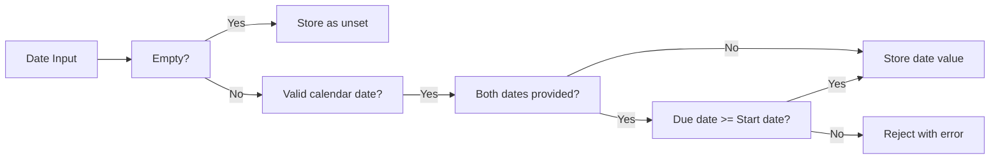

**todoApp — Data isolation, business rules, filtering/sorting/pagination, error catalog**

Data isolation, business rules, filtering/sorting/pagination, error catalog

# Data Isolation and Ownership

Data ownership rules and tenant/user-level isolation policies.

## Ownership and Isolation Rules

Define data ownership semantics and isolation boundaries for multi-user access.

### Data Ownership

WHEN a user creates a todo, THE system SHALL associate the todo exclusively with that user.

THE system SHALL maintain user ownership of all todos created by the user throughout the todo's lifetime.

WHEN a user's account is deleted, THE system SHALL permanently delete all todos owned by that user.

THE system SHALL not allow transfer of todo ownership between users.

THE system SHALL not allow todos to exist without an owning user.

IF a todo's owning user account is deleted, THEN THE system SHALL permanently delete the todo and all its associated edit history.

### User Isolation

THE system SHALL ensure that each user can only access their own todos.

THE system SHALL prevent users from viewing todos owned by other users.

THE system SHALL prevent users from editing todos owned by other users.

THE system SHALL prevent users from deleting todos owned by other users.

THE system SHALL maintain complete isolation between user data in a multi-user environment.

WHILE a user is authenticated, THE system SHALL restrict all todo operations to only that user's owned todos.

THE system SHALL not expose any information about other users' todos through error messages or system behavior.

### Data Access Boundaries

THE system SHALL enforce data access boundaries at the user level.

WHEN a user requests to view todos, THE system SHALL return only todos owned by that user.

WHEN a user requests to view the trash, THE system SHALL return only deleted todos owned by that user.

THE system SHALL not provide any mechanism for users to access or view other users' data.

THE system SHALL not allow sharing of todos between users.

THE system SHALL not allow public visibility of todos.

IF a user attempts to access a todo they do not own, THEN THE system SHALL reject the request.

### Account Deletion Impact

WHEN a user deletes their account, THE system SHALL permanently delete all todos owned by that user.

WHEN a user deletes their account, THE system SHALL permanently delete all todos in that user's trash.

WHEN a user deletes their account, THE system SHALL permanently delete all edit history associated with that user's todos.

THE system SHALL not retain any todo data after the owning user's account is deleted.

THE system SHALL ensure that account deletion removes all user-owned data without exception.

IF a user account deletion is requested, THEN THE system SHALL verify that all associated todos and history will be permanently removed before completing the deletion.

# Domain Business Rules

Per-concept business rules, validation logic, and domain constraints.

## User Rules

Users register for the application using their email address and a password. Each email address must be unique across all active accounts in the system. Users authenticate by providing their registered email and password combination. Users have the ability to change their password at any time through their account settings. Each user maintains a profile that includes a display name for identification within the application. Users can update their display name whenever they wish. Users have the option to permanently delete their entire account. When a user deletes their account, all todos associated with that user are permanently removed, including any todos in the trash. Users cannot access or view other users' profiles or account information. The application maintains complete privacy by isolating each user's data from all other users.

### User Registration and Authentication Rules

WHEN a user registers for an account, THE system SHALL:
1. Require a unique email address that is not already associated with an active account
2. Require a password that meets security requirements (defined in User Validation Rules)
3. Create the user account with incomplete profile status until display name is set

IF the email address is already registered to an active account, THE system SHALL reject the registration request.

WHEN a user attempts to log in, THE system SHALL:
1. Verify the email address exists in the system
2. Verify the password matches the stored credentials for that email
3. Grant access only when both email and password are valid

IF the email address does not exist, THE system SHALL reject the login request without revealing whether the email is registered.
IF the password does not match, THE system SHALL reject the login request without revealing which credential was incorrect.

WHILE a user is authenticated, THE system SHALL maintain the user's session and associate all actions with that user's identity.

### Account Management Rules

WHEN a user changes their password, THE system SHALL:
1. Require verification of the current password
2. Require a new password that meets security requirements (defined in User Validation Rules)
3. Invalidate all existing sessions for that user
4. Require the user to log in again with the new password

IF the current password verification fails, THE system SHALL reject the password change request.

WHEN a user updates their display name, THE system SHALL:
1. Accept the new display name if it meets character requirements (defined in User Validation Rules)
2. Apply the change immediately to the user's profile
3. Reflect the updated display name in all future todo associations

WHEN a user requests account deletion, THE system SHALL:
1. Require password verification to confirm the deletion request
2. Permanently delete all todos owned by the user, including those in trash
3. Permanently delete all edit history associated with the user's todos
4. Remove the user's account and profile from the system
5. Release the email address for future registration

IF the password verification fails during account deletion, THE system SHALL reject the deletion request.

WHILE an account deletion is in progress, THE system SHALL prevent any new operations on the user's data.

### User Data Privacy Rules

THE system SHALL enforce complete data isolation between users at all times.

WHEN a user accesses any todo or profile information, THE system SHALL:
1. Verify the user owns the requested resource
2. Grant access only to resources owned by the requesting user
3. Reject any attempt to access another user's data

IF a user attempts to view another user's profile, THE system SHALL reject the request without revealing information about the target user.
IF a user attempts to access another user's todo, THE system SHALL reject the request without revealing the todo's existence.

THE system SHALL NOT provide any mechanism for users to share, transfer, or grant access to their todos to other users.

WHEN a user queries their todo list, THE system SHALL return only todos owned by that user.
WHEN a user queries their trash, THE system SHALL return only deleted todos owned by that user.

THE system SHALL treat each user's data as completely private and inaccessible to all other users, including through indirect means such as search, filtering, or system logs accessible to users.

### Account Lifecycle and Data Ownership Rules

THE system SHALL maintain clear ownership boundaries for all user data throughout the account lifecycle.

WHEN a user account is created, THE system SHALL:
1. Associate the account with a unique user identifier
2. Establish the user as the sole owner of any todos they create
3. Enable the user to manage their profile and todos independently

WHILE a user account is active, THE system SHALL:
1. Maintain the user's exclusive access to their todos and profile
2. Preserve the integrity of the user's edit history for all todos
3. Ensure all user operations are attributed to the correct user identity

WHEN a user account is deleted, THE system SHALL:
1. Remove all data owned by the user from the system
2. Ensure no orphaned records remain associated with the deleted user
3. Complete the deletion process atomically to prevent partial data removal

THE system SHALL NOT retain any personal data or todos after account deletion is completed.

WHEN verifying user identity for sensitive operations (password change, account deletion), THE system SHALL:
1. Require re-authentication with the current password
2. Process the verification before allowing the operation to proceed
3. Log the verification attempt for security auditing (internal system use only)

IF identity verification fails for a sensitive operation, THE system SHALL reject the operation and maintain the current account state.

## Todo Rules

Users create todos by providing a title, which is required for every todo. Users may optionally include a description when creating a todo. Users can set a start date to indicate when work on the todo should begin. Users can set a due date to establish when the todo should be completed. All newly created todos start in an incomplete state by default. Users can toggle a todo between complete and incomplete states at any time. Users can edit the title, description, start date, and due date of their existing todos. Users can delete their own todos, which moves them to a trash area rather than removing them permanently. Each user can only see and interact with their own todos. Todos are completely private and cannot be viewed, accessed, or shared with other users.

### Todo Creation and Initial State

WHEN a user creates a todo, THE system SHALL require a title to be provided.

WHEN a user creates a todo, THE system SHALL allow the description field to be left empty.

WHEN a user creates a todo, THE system SHALL allow the start date to be optionally provided.

WHEN a user creates a todo, THE system SHALL allow the due date to be optionally provided.

WHEN a todo is created, THE system SHALL set its completion status to incomplete by default.

IF the title is not provided during todo creation, THE system SHALL reject the request.

WHEN a todo is created with a start date, THE system SHALL record the provided start date.

WHEN a todo is created with a due date, THE system SHALL record the provided due date.

WHEN a todo is created without a start date, THE system SHALL leave the start date unset.

WHEN a todo is created without a due date, THE system SHALL leave the due date unset.

### Todo Completion State Management

WHEN a user marks a todo as complete, THE system SHALL update the todo's completion status to complete.

WHEN a user marks a todo as incomplete, THE system SHALL update the todo's completion status to incomplete.

THE system SHALL allow users to toggle a todo between complete and incomplete states at any time.

WHEN a todo's completion status is toggled, THE system SHALL immediately reflect the change in the todo list.

THE system SHALL maintain only two completion states for todos: complete and incomplete.

IF a user attempts to toggle the completion status of a todo they do not own, THE system SHALL reject the request.

IF a user attempts to toggle the completion status of a deleted todo, THE system SHALL reject the request.

### Todo Editing and Modification

WHEN a user edits their todo, THE system SHALL allow modification of the title.

WHEN a user edits their todo, THE system SHALL allow modification of the description.

WHEN a user edits their todo, THE system SHALL allow modification of the start date.

WHEN a user edits their todo, THE system SHALL allow modification of the due date.

WHEN a user modifies the title of their todo, THE system SHALL update the title to the new value.

WHEN a user modifies the start date of their todo, THE system SHALL update the start date to the new value.

WHEN a user modifies the due date of their todo, THE system SHALL update the due date to the new value.

WHEN a user clears the description of their todo, THE system SHALL set the description to empty.

WHEN a user clears the start date of their todo, THE system SHALL remove the start date.

WHEN a user clears the due date of their todo, THE system SHALL remove the due date.

IF a user attempts to edit a todo they do not own, THE system SHALL reject the request.

IF a user attempts to edit a deleted todo, THE system SHALL reject the request.

WHEN a todo is edited, THE system SHALL record the edit in the todo's history (defined in TodoHistory Rules).

### Todo Deletion and Lifecycle

WHEN a user deletes their todo, THE system SHALL perform a soft delete rather than permanent removal.

WHEN a todo is soft deleted, THE system SHALL move the todo to the user's trash.

WHEN a todo is soft deleted, THE system SHALL remove it from the normal todo list view.

WHEN a user restores a todo from trash, THE system SHALL return the todo to the normal todo list.

WHEN a user permanently deletes a todo from trash, THE system SHALL remove the todo and its edit history.

THE system SHALL maintain deleted todos in trash until the user permanently deletes them or deletes their account.

IF a user attempts to delete a todo they do not own, THE system SHALL reject the request.

IF a user attempts to restore a deleted todo they do not own, THE system SHALL reject the request.

IF a user attempts to permanently delete a todo they do not own, THE system SHALL reject the request.

### Todo Privacy and Access Control

THE system SHALL ensure each user can only view their own todos.

THE system SHALL prevent users from accessing todos owned by other users.

THE system SHALL enforce complete privacy for all todos with no sharing capability.

WHEN a user queries their todo list, THE system SHALL return only todos owned by that user.

WHEN a user views a single todo, THE system SHALL verify the todo belongs to the requesting user.

IF a user attempts to view a todo owned by another user, THE system SHALL reject the request.

IF a user attempts to filter or sort todos, THE system SHALL apply filters and sorts only to the user's own todos.

THE system SHALL maintain user-specific todo visibility with no cross-user access.

WHEN a user's account is deleted, THE system SHALL permanently delete all todos owned by that user, including those in trash.

THE system SHALL enforce todo ownership isolation across all operations including creation, editing, deletion, and viewing.

## TodoHistory Rules

Every edit made to a todo creates a corresponding history entry automatically. Each history entry captures the timestamp of when the edit occurred. History entries record what the title was changed to, if the title was modified. History entries record what the description was changed to, if the description was modified. History entries record what the start date was changed to, if the start date was modified. History entries record what the due date was changed to, if the due date was modified. Users can view the complete edit history for any of their todos. History entries display in order from most recent to oldest. When a todo is permanently deleted from the trash, its entire edit history is also removed. History tracking provides users with a complete record of all changes made to their todos.

### Automatic History Creation

WHEN a user edits any field of a todo, THE system SHALL automatically create a history entry without requiring explicit user action.

THE system SHALL maintain a complete change audit trail for every todo from creation until permanent deletion.

THE system SHALL record all todo modifications in the history, capturing every edit made by the user.

THE system SHALL document every change made to a todo, ensuring no modification goes unrecorded.

IF a user updates multiple fields in a single edit operation, THEN THE system SHALL create one history entry capturing all changes made in that operation.

THE system SHALL create history entries for edits to title, description, start date, and due date fields.

WHEN a todo is created, THE system SHALL NOT create an initial history entry (history tracks changes, not creation).

### Change Tracking Details

WHEN an edit occurs, THE system SHALL record the exact timestamp of when the edit was made.

WHEN the title is changed, THE system SHALL record what the title was changed to in the history entry.

WHEN the description is changed, THE system SHALL record what the description was changed to in the history entry.

WHEN the start date is changed, THE system SHALL record what the start date was changed to in the history entry.

WHEN the due date is changed, THE system SHALL record what the due date was changed to in the history entry.

IF a field is not changed during an edit, THEN THE system SHALL NOT record that field in the history entry (only changed fields are tracked).

THE system SHALL store the new value of each changed field, not the difference or delta.

THE system SHALL record the edit timestamp in a format that preserves the exact time the edit occurred.

### History Access and Ordering

WHEN a user views the edit history of their todo, THE system SHALL display all history entries for that todo.

THE system SHALL sort history entries from most recent to oldest by default.

THE system SHALL preserve all edit records for the entire lifetime of the todo.

WHEN displaying history, THE system SHALL show the timestamp of each edit.

WHEN displaying history, THE system SHALL show the new value for each field that was changed in that edit.

IF a user does not own a todo, THEN THE system SHALL NOT allow the user to view that todo's history.

THE system SHALL provide users with access to the complete edit history of any todo they own.

WHEN history entries have the same timestamp, THE system SHALL maintain their creation order.

### History Lifecycle

WHEN a todo is permanently deleted from the trash, THE system SHALL delete all associated history entries.

THE system SHALL manage historical data according to the todo's lifecycle status.

WHEN a todo is soft-deleted (moved to trash), THE system SHALL preserve all history entries.

WHEN a todo is restored from trash, THE system SHALL retain all existing history entries.

IF a todo is permanently deleted, THEN THE system SHALL remove both the todo and its entire edit history.

THE system SHALL NOT allow history entries to exist without an associated todo.

WHEN managing historical data, THE system SHALL ensure history entries are only accessible while the parent todo exists.

# Detailed Validation Rules

Detailed validation rules with boundary values and format requirements.

## User Validation Rules

User email addresses must follow standard email format with a valid domain. Email addresses are unique across all active user accounts in the system. Passwords must meet minimum security requirements including length and character variety. Display names are required for all user accounts and cannot be empty. Display names can contain letters, numbers, and common punctuation marks. When users change their password, the new password must differ from their current password. Email addresses cannot be changed once an account is created. Duplicate email registration attempts are rejected with an appropriate error message. Invalid email formats are rejected during both registration and login attempts.

### Email Format and Uniqueness

WHEN a user provides an email address during registration, THE system SHALL validate that it follows standard email format with a valid domain.

IF the email format is invalid, THE system SHALL reject the registration request.

IF the email format is invalid during login, THE system SHALL reject the login attempt.

THE system SHALL ensure that each email address is unique across all active user accounts.

IF a user attempts to register with an email address that already exists, THE system SHALL reject the request with an appropriate error message.

WHEN validating email uniqueness, THE system SHALL only consider active accounts (not deleted accounts).

IF a duplicate email registration is attempted, THE system SHALL prevent the creation of the new account.

### Password Security Requirements

WHEN a user creates a password during registration, THE system SHALL enforce minimum security requirements including length and character variety.

WHEN a user changes their password, THE system SHALL require that the new password differs from their current password.

IF the new password matches the current password, THE system SHALL reject the password change request.

THE system SHALL validate password requirements during both registration and password change operations.

IF the password does not meet minimum security requirements, THE system SHALL reject the request and indicate the requirements that were not met.

### Display Name Validation

THE system SHALL require a display name for all user accounts.

IF a user attempts to create an account without a display name, THE system SHALL reject the registration request.

IF a user attempts to set an empty display name, THE system SHALL reject the request.

THE system SHALL allow display names to contain letters, numbers, and common punctuation marks.

WHEN a user edits their display name, THE system SHALL validate that it is not empty before saving the change.

IF the display name contains invalid characters, THE system SHALL reject the update request.

## Todo Validation Rules

Todo titles are required and cannot be empty or contain only whitespace. Titles must be within a reasonable character limit to ensure readability. Descriptions are optional and can be left empty when creating or editing a todo. Start dates must be valid calendar dates when provided. Due dates must be valid calendar dates when provided. Users can set start dates and due dates independently of each other. Start dates can be in the past, present, or future. Due dates can be in the past, present, or future. Date fields accept standard date format input from users. Empty date fields are treated as unset rather than invalid.

### Title Validation Rules

WHEN a user creates or edits a todo, THE system SHALL validate the title field according to the following rules:

1. THE system SHALL require a title for every todo creation or update.
2. THE system SHALL reject todos with empty titles (zero characters).
3. THE system SHALL reject titles that contain only whitespace characters (spaces, tabs, newlines).
4. THE system SHALL enforce a maximum character limit on titles to ensure readability.
5. THE system SHALL trim leading and trailing whitespace from titles before validation.
6. IF the title is empty after trimming whitespace, THE system SHALL reject the request.
7. IF the title exceeds the maximum character limit, THE system SHALL reject the request.
8. IF the title contains only whitespace characters, THE system SHALL reject the request with a validation error.

Title validation applies to both todo creation and todo editing operations. The title field cannot be set to empty or whitespace-only during any edit operation.

### Description Handling Rules

WHEN a user creates or edits a todo, THE system SHALL handle the description field according to the following rules:

1. THE system SHALL allow the description field to be left empty during todo creation.
2. THE system SHALL allow the description field to be left empty during todo editing.
3. THE system SHALL accept an empty string as a valid description value.
4. THE system SHALL not require a description for todo creation or updates.
5. WHEN a user omits the description field, THE system SHALL treat it as an empty description.
6. THE system SHALL store empty descriptions as empty strings rather than null values.
7. Users can update a todo to add a description where none existed before.
8. Users can update a todo to remove an existing description by setting it to empty.

Description field validation is minimal: the field is optional and accepts any text content including empty values. No character limits or format requirements apply to the description field beyond general system constraints.

### Date Field Validation Rules

WHEN a user creates or edits a todo with date fields, THE system SHALL validate start date and due date according to the following rules:

1. THE system SHALL accept start dates in standard calendar date format (YYYY-MM-DD).
2. THE system SHALL accept due dates in standard calendar date format (YYYY-MM-DD).
3. THE system SHALL validate that provided dates are valid calendar dates.
4. IF a date value does not represent a valid calendar date, THE system SHALL reject the request.
5. THE system SHALL allow start dates to be in the past, present, or future.
6. THE system SHALL allow due dates to be in the past, present, or future.
7. THE system SHALL treat empty date fields as unset rather than invalid.
8. WHEN a date field is omitted or empty, THE system SHALL store it as unset (null).
9. THE system SHALL allow users to set start date and due date independently of each other.
10. THE system SHALL not require a start date when a due date is provided.
11. THE system SHALL not require a due date when a start date is provided.
12. THE system SHALL allow both start date and due date to be unset simultaneously.
13. WHEN both start date and due date are provided, THE system SHALL ensure the due date is on or after the start date.
14. IF the due date is before the start date, THE system SHALL reject the request with a validation error.

Date field independence means users can configure any combination: both dates set, only start date set, only due date set, or neither date set. However, when both dates are provided, the due date must be on or after the start date to maintain logical consistency.

## TodoHistory Validation Rules

Edit history entries are automatically created whenever a todo is modified. Each history entry records the timestamp of when the edit occurred. Timestamps follow standard date and time format with timezone information. History entries capture only the fields that were actually changed during an edit. Title changes are recorded with the new title value when the title is modified. Description changes are recorded with the new description value when the description is modified. Start date changes are recorded with the new date value when the start date is modified. Due date changes are recorded with the new date value when the due date is modified. Fields that were not changed during an edit are not included in the history entry. History entries cannot be manually created or modified by users.

### Automatic History Creation

WHEN a user edits any field of a todo, THE system SHALL automatically create a history entry.

WHEN a todo is edited, THE system SHALL create the history entry before confirming the edit to the user.

THE system SHALL create history entries without requiring any action from the user.

IF a user attempts to manually create a history entry, THE system SHALL reject the request.

IF a user attempts to modify an existing history entry, THE system SHALL reject the request.

IF a user attempts to delete a history entry, THE system SHALL reject the request.

History entries SHALL only be created through the automatic process when a todo is edited.

THE system SHALL ensure that every edit to a todo results in exactly one history entry.

### Timestamp Recording Standards

WHEN a history entry is created, THE system SHALL record the exact time when the edit occurred.

THE system SHALL store timestamps in a timezone-aware format.

Timestamps SHALL include date, time, and timezone information.

THE system SHALL ensure that timestamps are accurate to the moment the edit was made.

WHEN displaying history entries, THE system SHALL present timestamps in a readable format that includes timezone information.

THE system SHALL maintain consistent timestamp formatting across all history entries.

IF a timestamp cannot be determined, THE system SHALL reject the history entry creation.

### Change Tracking Rules

WHEN a todo is edited, THE system SHALL record only the fields that were actually changed.

IF a field was not modified during an edit, THE system SHALL exclude that field from the history entry.

THE system SHALL track which specific fields were changed during each edit.

WHEN multiple fields are edited simultaneously, THE system SHALL record all changed fields in a single history entry.

IF no fields are changed during an edit attempt, THE system SHALL not create a history entry.

THE system SHALL distinguish between fields that were changed and fields that remained unchanged.

History entries SHALL contain only the new values of changed fields, not the old values.

### Field-Specific Recording

WHEN the title of a todo is changed, THE system SHALL record the new title value in the history entry.

WHEN the description of a todo is changed, THE system SHALL record the new description value in the history entry.

WHEN the start date of a todo is changed, THE system SHALL record the new start date value in the history entry.

WHEN the due date of a todo is changed, THE system SHALL record the new due date value in the history entry.

IF the title is changed from one value to another, THE system SHALL record only the new title value.

IF the description is changed from one value to another, THE system SHALL record only the new description value.

IF the start date is changed from one value to another, THE system SHALL record only the new start date value.

IF the due date is changed from one value to another, THE system SHALL record only the new due date value.

WHEN multiple fields including title, description, start date, or due date are changed, THE system SHALL record the new value for each changed field.

# Filtering, Sorting, and Pagination

List query specifications for filtering, sorting, and pagination.

## List Query Specifications

Define filtering, sorting, and pagination rules for list operations.

### Filtering Rules

### Filtering by Completion Status

WHEN a user filters their todo list, THE system SHALL support the following filter options:
1. All todos - displays both complete and incomplete todos
2. Complete todos only - displays only todos marked as complete
3. Incomplete todos only - displays only todos not marked as complete

THE system SHALL apply the selected filter to the user's active todo list (excluding deleted todos).

WHEN no filter is selected, THE system SHALL default to showing all todos.

WHEN a filter is applied, THE system SHALL maintain the current sorting order.

WHEN a filter is applied, THE system SHALL reset pagination to the first page.

IF a user filters by complete todos and no complete todos exist, THE system SHALL display an empty list.

IF a user filters by incomplete todos and no incomplete todos exist, THE system SHALL display an empty list.

### Filter Persistence

THE system SHALL NOT persist filter selections across sessions.

WHEN a user navigates away from the todo list and returns, THE system SHALL reset to the default filter (all todos).

### Sorting Rules

### Supported Sort Fields

WHEN a user sorts their todo list, THE system SHALL support sorting by the following fields:
1. Creation date - when the todo was created
2. Start date - the optional start date assigned to the todo
3. Due date - the optional due date assigned to the todo

### Sort Direction

THE system SHALL support both ascending and descending sort directions for each sort field.

WHEN sorting by creation date, THE system SHALL support:
- Newest first (most recently created todos appear first)
- Oldest first (earliest created todos appear first)

WHEN sorting by start date, THE system SHALL support:
- Earliest first (todos with earliest start dates appear first)
- Latest first (todos with latest start dates appear first)

WHEN sorting by due date, THE system SHALL support:
- Earliest first (todos with earliest due dates appear first)
- Latest first (todos with latest due dates appear first)

### Null Date Handling

IF a todo does not have a start date and the list is sorted by start date, THE system SHALL place that todo at the end of the list regardless of sort direction.

IF a todo does not have a due date and the list is sorted by due date, THE system SHALL place that todo at the end of the list regardless of sort direction.

### Sort Persistence

THE system SHALL NOT persist sort selections across sessions.

WHEN a user navigates away from the todo list and returns, THE system SHALL reset to the default sort order (newest first by creation date).

### Pagination Rules

### List Pagination

WHEN a user views their todo list, THE system SHALL display results in pages.

WHEN a user views their trash list, THE system SHALL display results in pages.

THE system SHALL display a consistent number of items per page for both todo list and trash list.

### Page Navigation

THE system SHALL allow users to navigate to the next page when more results exist.

THE system SHALL allow users to navigate to the previous page when not on the first page.

WHEN a user applies a filter, THE system SHALL reset to the first page.

WHEN a user changes the sort order, THE system SHALL reset to the first page.

### Empty Results

IF the user's todo list contains no items matching the current filter, THE system SHALL display an empty list on the first page.

IF the user's trash contains no items, THE system SHALL display an empty list on the first page.

### Pagination Consistency

WHEN items are added or deleted during a paginated view, THE system SHALL NOT automatically refresh the current page.

WHEN a user manually refreshes the list, THE system SHALL apply the current filter and sort settings to the refreshed results.

### Query Behavior

### Cursor-Based Pagination

THE system SHALL use cursor-based pagination for navigating through todo lists.

WHEN a user requests the next page, THE system SHALL use a cursor pointing to the last item on the current page.

WHEN a user requests the previous page, THE system SHALL use a cursor pointing to the first item on the current page.

IF the cursor is invalid or expired, THE system SHALL return the first page of results.

### Query Composition

WHEN a query includes both filter and sort parameters, THE system SHALL apply the filter before sorting.

WHEN a query includes pagination parameters, THE system SHALL apply pagination after filtering and sorting.

### Query Result Consistency

WHILE a user is navigating through paginated results, THE system SHALL maintain consistent ordering based on the initial query.

IF a todo's sort field value changes while a user is viewing paginated results, THE system SHALL NOT reposition the todo in the current view until the list is refreshed.

### Query Limits

THE system SHALL enforce a maximum page size to prevent excessive data retrieval in a single query.

IF a user requests a page size exceeding the maximum, THE system SHALL return the maximum allowed page size.

# Error Conditions

Business error scenarios and how the system should respond.

## Error Scenarios

Describe error conditions and expected system responses in natural language.

### Authentication Error Scenarios

WHEN a user attempts to sign up with an email that already exists, THE system SHALL reject the request.

WHEN a user attempts to sign up with an invalid email format, THE system SHALL reject the request.

WHEN a user attempts to sign up with a password that does not meet security requirements, THE system SHALL reject the request.

WHEN a user attempts to log in with an incorrect email or password combination, THE system SHALL reject the request.

WHEN a user attempts to log in with an account that does not exist, THE system SHALL reject the request.

WHEN a user attempts to change their password without providing the correct current password, THE system SHALL reject the request.

WHEN a user attempts to change their password to one that does not meet security requirements, THE system SHALL reject the request.

IF authentication fails, THE system SHALL not grant access to protected resources.

### Todo Operation Error Scenarios

WHEN a user attempts to create a todo without a title, THE system SHALL reject the request.

WHEN a user attempts to view a todo that does not belong to them, THE system SHALL reject the request.

WHEN a user attempts to edit a todo that does not belong to them, THE system SHALL reject the request.

WHEN a user attempts to edit a todo that has been permanently deleted, THE system SHALL reject the request.

WHEN a user attempts to mark a todo as complete that does not belong to them, THE system SHALL reject the request.

WHEN a user attempts to mark a todo as incomplete that does not belong to them, THE system SHALL reject the request.

WHEN a user attempts to delete a todo that does not belong to them, THE system SHALL reject the request.

WHEN a user attempts to restore a todo from trash that does not belong to them, THE system SHALL reject the request.

WHEN a user attempts to permanently delete a todo that does not belong to them, THE system SHALL reject the request.

IF a todo does not exist, THE system SHALL reject any operation targeting that todo.

IF a todo is in the trash, THE system SHALL reject attempts to edit or change its completion status.

### Account Management Error Scenarios

WHEN a user attempts to delete their account while not authenticated, THE system SHALL reject the request.

WHEN a user attempts to edit their display name without providing a valid name, THE system SHALL reject the request.

WHEN a user attempts to view another user's profile, THE system SHALL reject the request.

IF account deletion is requested, THE system SHALL permanently delete all todos associated with the account, including those in trash.

IF account deletion is requested, THE system SHALL permanently delete all edit history associated with the account's todos.

IF account deletion fails, THE system SHALL not delete any partial data and SHALL maintain data integrity.

### Data Access and Isolation Error Scenarios

WHEN a guest attempts to access any todo data, THE system SHALL reject the request.

WHEN a member attempts to access another member's todos, THE system SHALL reject the request.

WHEN a member attempts to access another member's edit history, THE system SHALL reject the request.

WHEN a member attempts to filter or sort todos belonging to another user, THE system SHALL reject the request.

IF data isolation is violated, THE system SHALL prevent the operation and maintain privacy boundaries.

IF an operation would expose another user's data, THE system SHALL reject the request without revealing information about the existence of that data.