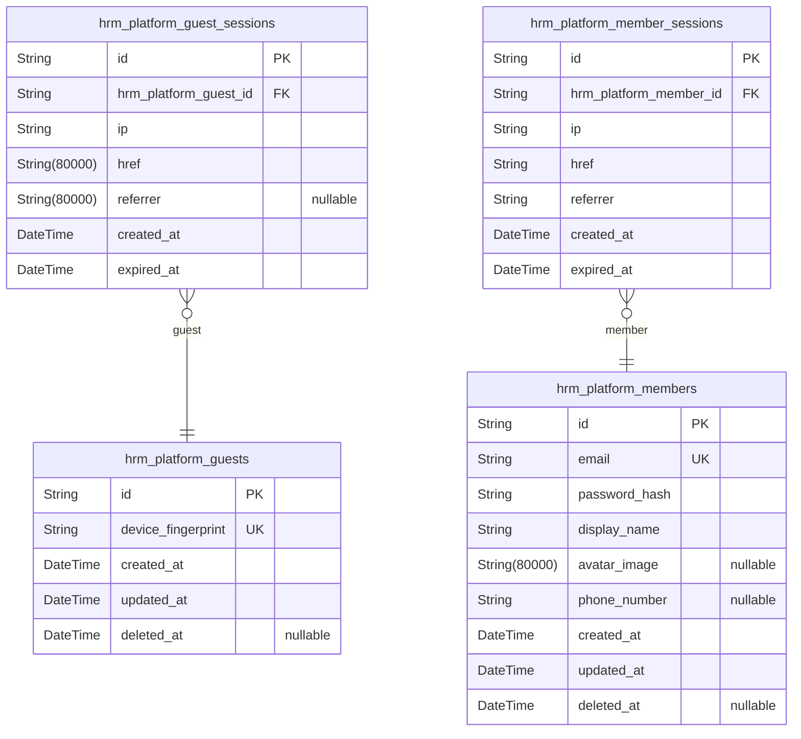
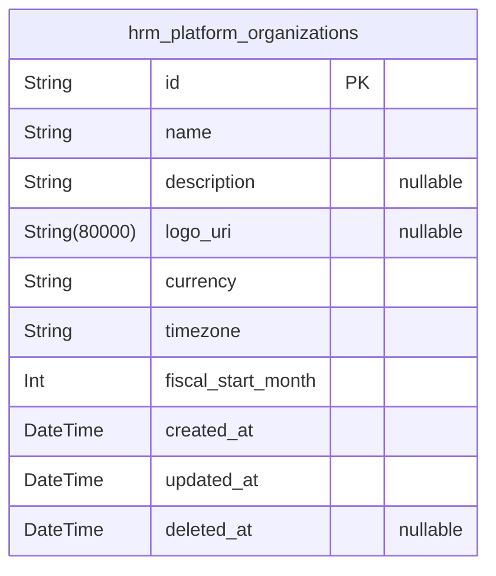
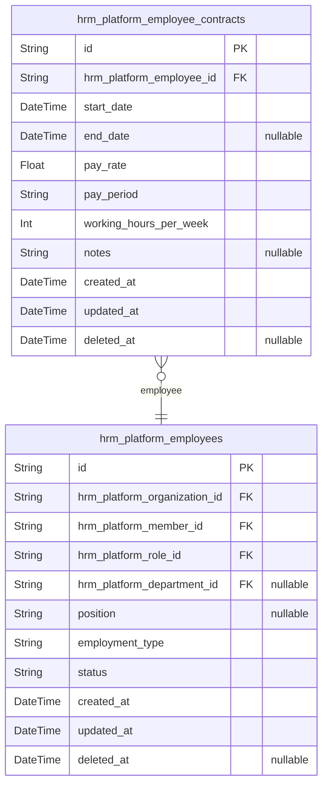
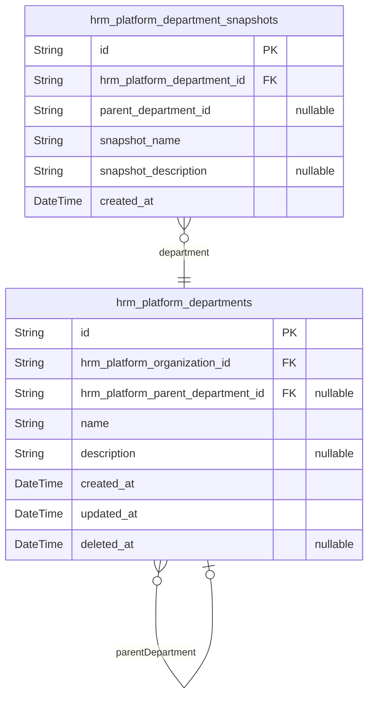
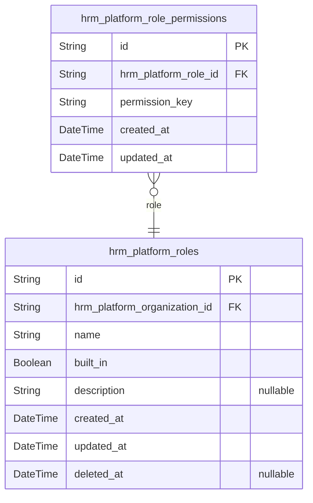
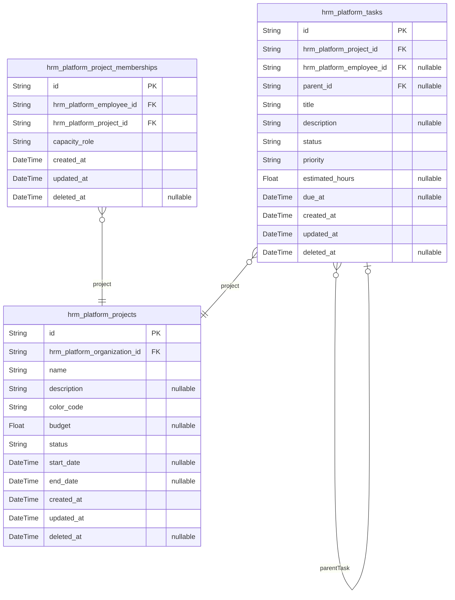
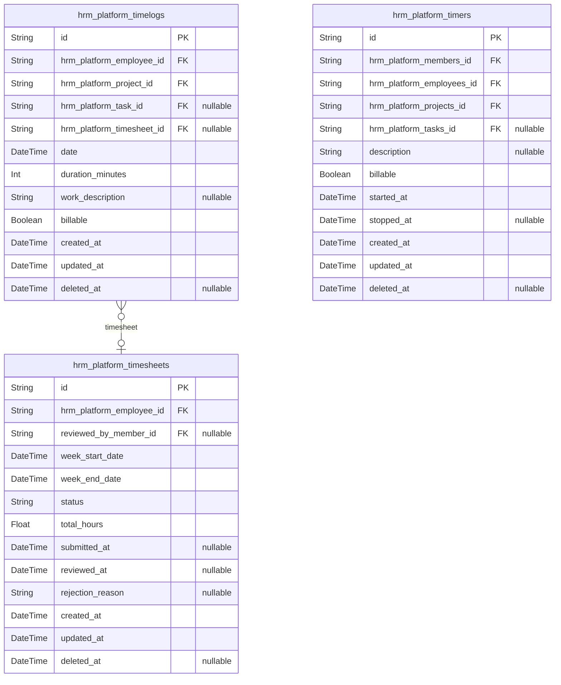
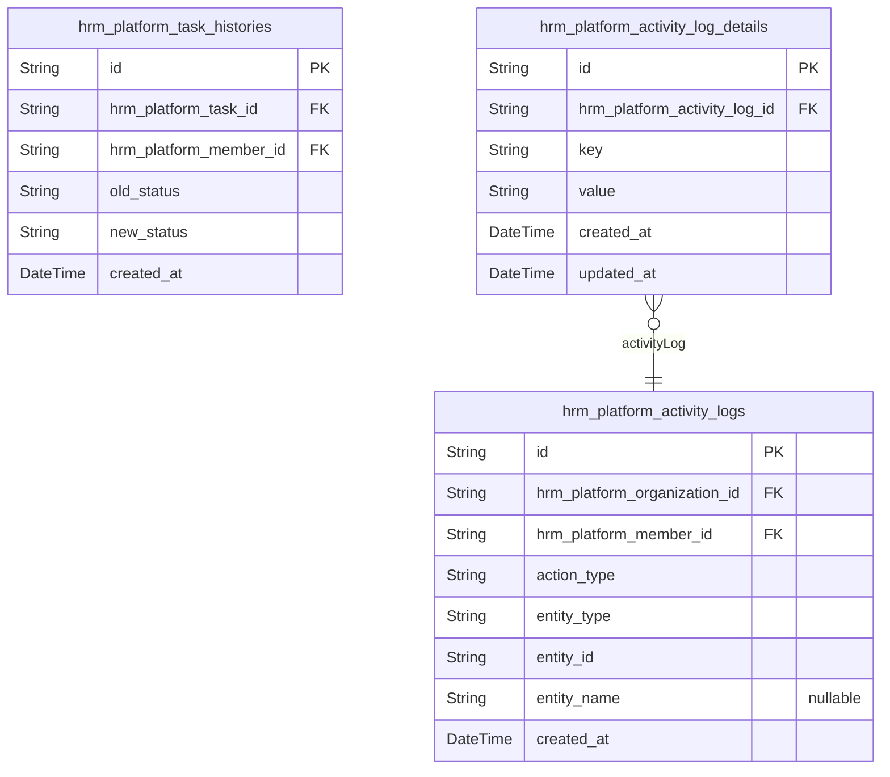
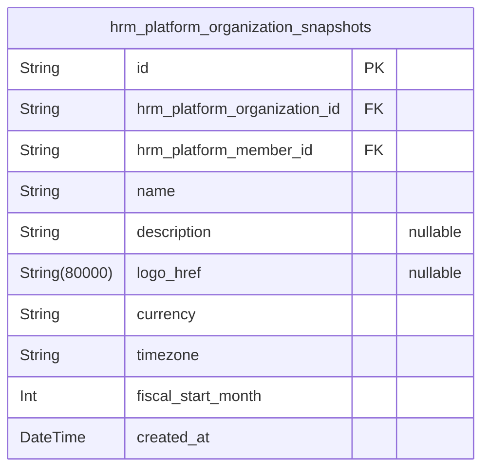

# Prisma Markdown

> Generated by [`prisma-markdown`](https://github.com/samchon/prisma-markdown)

- [hrm_platform.authorization](#hrm_platform.authorization)
- [hrm_platform.organization](#hrm_platform.organization)
- [hrm_platform.employee](#hrm_platform.employee)
- [hrm_platform.department](#hrm_platform.department)
- [hrm_platform.role](#hrm_platform.role)
- [hrm_platform.project](#hrm_platform.project)
- [hrm_platform.time_tracking](#hrm_platform.time_tracking)
- [hrm_platform.activity_log](#hrm_platform.activity_log)
- [default](#default)

## hrm_platform.authorization

### `hrm_platform_guests`

Guest profiles representing anonymous platform visitors identified by
device fingerprint before account creation.

Guests exist in an unauthenticated state with zero permissions and no
organizational context. They can only access public entry points such as
sign-up and login pages. The device fingerprint tracks user identity
across public pages to provide continuity. Once a guest registers, they
transition to a member account.

Properties as follows:

- `id`: Primary Key.
- `device_fingerprint`
  > Unique device fingerprint identifying the anonymous visitor's browser and
  > device characteristics. Used to correlate public entry point visits.
- `created_at`: Timestamp when the guest profile was initially recorded.
- `updated_at`: Timestamp when the guest profile was last updated.
- `deleted_at`
  > Timestamp when the guest profile was soft deleted. Retained for audit and
  > cleanup scheduling.

### `hrm_platform_guest_sessions`

Session token tracking for ephemeral unauthenticated guest browsing of
public entry points.

Each guest session captures anonymous browsing context during sign-up and
login page interactions, including client IP address, current page URL,
referring source URL, mandatory security expiration timestamp for session
invalidation, and temporal audit records for security compliance.

Cross-references: [hrm_platform_guests](#hrm_platform_guests)

Properties as follows:

- `id`: Primary key unique identifier for each guest session.
- `hrm_platform_guest_id`
  > Links this ephemeral session to the guest actor profile.
  >
  > This foreign key establishes the 1:N relationship where {@link
  > hrm_platform_guests} entity owns many guest sessions, but each session
  > belongs to exactly one [hrm_platform_guests](#hrm_platform_guests) actor entity.
  >
  > Enforces multi-tenant organization data isolation by preventing
  > cross-organization session token leakage.
- `ip`: Client IP address where the guest session was initiated.
- `href`: Current page URL the guest is browsing when the session is active.
- `referrer`: Source URL from which the guest navigated to the current page.
- `created_at`: Timestamp when the guest session token was created.
- `expired_at`
  > Security expiration timestamp for the session token.
  >
  > Mandatory field to enforce session invalidation before account creation.

### `hrm_platform_members`

Registered member accounts with email/password authentication credentials
and a global profile shared across all organizational contexts.

Members authenticate using email and password. Profile data (display
name, avatar image, phone number) is consistent regardless of active
organizational scope. Members can belong to multiple organizations via
employee records (handled by the employee component). Account deletion
applies soft-delete to preserve historical timelogs and timesheets across
organizations.

Actors who successfully authenticate transition from guest status to
member status and select an organization context to operate within.

Properties as follows:

- `id`: Primary Key for member accounts.
- `email`
  > Email address used for authentication.
  >
  > Used to uniquely identify the account during login and to link with
  > organization employee records. This field must be globally unique across
  > the entire platform.
- `password_hash`
  > Securely hashed password for authentication.
  >
  > The hash is stored instead of plaintext for secure credential
  > verification during login. Changes to this password affect authentication
  > for all organization contexts globally.
- `display_name`
  > Display name shown in the user interface.
  >
  > Profile field shared globally across all organizations the member belongs
  > to. Used in employee lists, timesheet headers, and activity logs.
- `avatar_image`
  > Avatar image URI for member profile.
  >
  > Profile shared across all organizational contexts. Null value means no
  > custom avatar image has been provided.
- `phone_number`
  > Phone number for the member profile.
  >
  > Profile shared across all organizational contexts. Used for contact
  > information in employee records and invitations.
- `created_at`: Timestamp when the member account was created.
- `updated_at`: Timestamp when the member account was last updated.
- `deleted_at`
  > Timestamp when the member account was deleted.
  >
  > When a user deletes their account, this field is set rather than
  > permanently removing the row. Employee records in other organizations
  > remain as historical references but are marked as deactivated. This
  > preserves timelog and timesheet history.

### `hrm_platform_member_sessions`

JWT session tokens maintaining authentication state and active
organization context for authenticated members operating within selected
organizational scopes.

Each record represents an active or expired member session containing the
HTTP context from the login event. Sessions remain active until the user
explicitly logs out; they do not auto-expire. The system enforces
organization-level data isolation by restricting all session-bound
operations to the currently selected organization.

Properties as follows:

- `id`: Primary Key.
- `hrm_platform_member_id`
  > Reference to the member account whose session this record represents.
  >
  > Sessions are scoped exclusively to the owning member and never permit
  > cross-user data access. When a member logs in from multiple devices or
  > browsers, separate session records are created.
- `ip`: IP address from which the session was created during login.
- `href`: URL that the session was created from (href).
- `referrer`: Referrer URL leading to the login page when the session was created.
- `created_at`: Timestamp when the session was created.
- `expired_at`
  > Timestamp after which this session token is considered invalid.
  >
  > NOT NULL by default for security purposes.

## hrm_platform.organization

### `hrm_platform_organizations`

Multi-tenancy root entity storing organization identity attributes,
operational settings, and lifecycle state.

Organizations serve as the root of data isolation, containing all scoped
entities including employees, projects, tasks, and time tracking records.
Organization owners manage configuration settings such as currency,
timezone, and fiscal month parameters.

Organization deletion requires all pending timesheets to be resolved
(approved or rejected) and no active employee contracts. Upon deletion,
all child records are permanently removed while the owner's user account
remains but becomes unassociated with any organization.

Properties as follows:

- `id`: Primary Key.
- `name`
  > Organization name.
  >
  > Unique identifier for the organization displayed in user interfaces and
  > context selection menus when users switch between organizational
  > contexts.
- `description`
  > Organization description.
  >
  > Optional text field describing the organization's purpose, industry, or
  > additional details visible to members.
- `logo_uri`
  > Logo image URI.
  >
  > Optional URL pointing to the organization's logo image displayed in the
  > user interface.
- `currency`
  > Currency code.
  >
  > Standard currency code (e.g., USD, EUR, KRW) used for financial
  > calculations, pay rates, and budget tracking within the organization.
- `timezone`
  > Organization timezone.
  >
  > Timezone identifier (e.g., America/New_York, Asia/Seoul) for scheduling,
  > time tracking operations, and report generation.
- `fiscal_start_month`
  > Fiscal year start month.
  >
  > Integer value from 1 (January) to 12 (December) defining the
  > organization's fiscal year start date for financial reporting and budget
  > cycles.
- `created_at`: Timestamp when the organization was created.
- `updated_at`: Timestamp when the organization was last updated.
- `deleted_at`
  > Timestamp when the organization was soft deleted.
  >
  > NULL indicates the organization is active. Deletion requires all pending
  > timesheets resolved and no active employee contracts.

## hrm_platform.employee

### `hrm_platform_employees`

Organization-scoped workforce members linked to global user accounts,
with employment type, status, department, position, and role assignment.

Employees represent the workforce within an organization, connecting a
global user account ([hrm_platform_members](#hrm_platform_members)). Each employee is
assigned exactly one role ([hrm_platform_roles](#hrm_platform_roles)) and may belong to
an optional department ([hrm_platform_departments](#hrm_platform_departments)). Employment
details include position title, employment type (full-time, part-time,
contractor, intern), and status (active, deactivated).

Properties as follows:

- `id`: Primary Key.
- `hrm_platform_organization_id`
  > Identifies the organization this employee belongs to.
  >
  > Each employee record is strictly scoped to a single {@link
  > hrm_platform_organizations}.
- `hrm_platform_member_id`
  > Links the employee to their global user account.
  >
  > The [hrm_platform_members](#hrm_platform_members) table stores registered member accounts
  > shared across organizations.
- `hrm_platform_role_id`
  > Assigns exactly one role to the employee within this organization.
  >
  > The [hrm_platform_roles](#hrm_platform_roles) table defines organization-scoped
  > authorization templates.
- `hrm_platform_department_id`
  > Optionally groups the employee under an organizational department.
  >
  > The [hrm_platform_departments](#hrm_platform_departments) table provides hierarchy
  > structuring. If null, the employee reports directly to the organization
  > level.
- `position`
  > Optional job title or position name for the employee within the
  > organization.
- `employment_type`
  > Defines the employment arrangement: full-time, part-time, contractor, or
  > intern.
- `status`
  > Current employment status: active or deactivated. Deactivated employees
  > cannot log time or submit timesheets, but historical data is preserved.
- `created_at`: Timestamp when the employee record was created.
- `updated_at`: Timestamp when the employee record was last modified.
- `deleted_at`: Timestamp when the employee record was soft-deleted.

### `hrm_platform_employee_contracts`

Historical employment agreements recording pay rate, pay period, working
hours, and effective dates per employee.

Contracts capture the formalized terms of the employment relationship
between an employee and their organization. Each employee may maintain
multiple contracts over their tenure, with the system ensuring only one
active contract exists at any given moment.

Active contracts have a mandatory start_date and a nullable end_date —
when null, the contract represents an ongoing employment relationship
with no predefined conclusion. Creating a new contract automatically
terminates the previous active contract by setting its end date.

Past contracts serve as immutable historical records for audit and
reference purposes. Only the currently active contract may be edited by
authorized users with employee:manage permission.

Properties as follows:

- `id`: Primary Key.
- `hrm_platform_employee_id`
  > Foreign key to the [hrm_platform_employees](#hrm_platform_employees) table linking the
  > employment agreement to the employee whose terms it defines.
- `start_date`: Mandatory date marking the initiation of this contract agreement.
- `end_date`
  > Date marking the conclusion of this fixed-term contract. When null, the
  > agreement represents an ongoing employment relationship with no
  > predefined end.
- `pay_rate`
  > Base compensation amount representing the numerical pay rate value for
  > the employee's labor.
- `pay_period`
  > Categorizes how the pay rate is applied to the employee's work. Allowed
  > values: hourly, daily, weekly, monthly.
- `working_hours_per_week`
  > Expected duration of active labor time within a standard seven-day work
  > week, measured in hours.
- `notes`
  > Optional qualitative text describing special terms, conditions, or
  > qualitative notes agreed upon by the parties.
- `created_at`: Timestamp when this contract record was created in the system.
- `updated_at`: Timestamp of the most recent modification to this contract record.
- `deleted_at`
  > Timestamp when this contract was soft-deleted. Null indicates the record
  > remains active and accessible.

## hrm_platform.department

### `hrm_platform_departments`

Departments provide organizational structure for grouping employees
within an organization.

Supports optional one-level parent nesting hierarchy for department
sub-groups. Each department belongs to exactly one {@link
hrm_platform_organizations} and can have zero or many child departments
under it for hierarchical grouping.

Properties as follows:

- `id`: Primary Key.
- `hrm_platform_organization_id`
  > The organization that contains this department.
  >
  > Links to a single [hrm_platform_organizations](#hrm_platform_organizations) context for data
  > isolation and multi-tenancy enforcement.
- `hrm_platform_parent_department_id`
  > References the parent department for hierarchy.
  >
  > Optional one-level nesting where child departments belong to a parent
  > [hrm_platform_departments](#hrm_platform_departments). This enables two-level department
  > hierarchies (root → sub-department).
- `name`
  > The department name.
  >
  > Must be unique within the same organization. Used for display in employee
  > grouping, department lists, and organizational structure views.
- `description`
  > The department description.
  >
  > Optional text providing additional context about the department's purpose
  > and scope.
- `created_at`
  > Record creation timestamp.
  >
  > Cannot be null. Automatically set when the department is first created.
- `updated_at`
  > Record update timestamp.
  >
  > Cannot be null. Updated whenever the department name or description is
  > modified.
- `deleted_at`
  > Record soft-delete timestamp.
  >
  > Null when the department is active. Set to a timestamp when the
  > department is deleted, which unlinks all employee department references
  > without removing them.

### `hrm_platform_department_snapshots`

Audit trail capturing point-in-time snapshots of department configuration
changes.

Stores denormalized copies of department attributes (name, description,
parent hierarchy) at the moment of modification, enabling reconstruction
of organizational structure history for compliance and audit purposes.

Snapshots are append-only records automatically created when department
details change. Each snapshot links back to its source {@link
hrm_platform_departments} record and captures the parent department
relationship valid at the time of the snapshot.

Properties as follows:

- `id`: Primary Key.
- `hrm_platform_department_id`
  > Reference to the source [hrm_platform_departments](#hrm_platform_departments) record for which
  > this snapshot was captured.
- `parent_department_id`
  > Identifier of the parent department at the time this snapshot was taken.
  >
  > Captures the hierarchical nesting relationship valid at the point in
  > time. Departments support one-level nesting, so this field identifies the
  > parent department in that hierarchy. Null when the department has no
  > parent.
- `snapshot_name`
  > Denormalized copy of the department name as it existed when this snapshot
  > was created.
- `snapshot_description`
  > Denormalized copy of the department description as it existed when this
  > snapshot was created.
- `created_at`
  > Timestamp when this snapshot record was created, marking the point in
  > time the department state was captured.

## hrm_platform.role

### `hrm_platform_roles`

Organization-scoped authorization template defining permission sets that
control what actions members can perform within that organization.
Built-in roles (Owner, Manager, Employee) are immutable platform defaults
with predefined permission catalogs that cannot be deleted or modified.
Custom roles are created and managed by organization owners, allowing
tailored permission configurations for specific organizational needs.

Each role is scoped to exactly one [hrm_platform_organizations](#hrm_platform_organizations) and
referenced by [hrm_platform_employees](#hrm_platform_employees) through a foreign key for
role assignment. Permission mappings are maintained in the companion
[hrm_platform_role_permissions](#hrm_platform_role_permissions) junction table.

Built-in roles are automatically provisioned during organization
creation. Custom roles can be created, edited, and deleted by
organization owners, provided no employees are currently assigned to
them.

Properties as follows:

- `id`: Primary key for the role record.
- `hrm_platform_organization_id`
  > References the organization to which this role belongs. Roles are
  > strictly scoped to a single organization — permissions granted by a role
  > only apply within that organization's data boundaries.
  >
  > This foreign key enforces multi-tenancy isolation by ensuring roles
  > cannot cross organizational contexts and permissions do not leak between
  > employers.
- `name`
  > Human-readable name of the role. Built-in roles use fixed names: 'Owner',
  > 'Manager', 'Employee'. Custom roles can use any unique name within the
  > organization.
  >
  > Role names are displayed in the user interface when assigning roles to
  > employees or managing roles in the administration panel.
- `built_in`
  > Indicates whether this role is a built-in platform default. Built-in
  > roles (Owner, Manager, Employee) have this field set to true and cannot
  > be deleted or have their permission sets modified by organization owners.
  >
  > Custom roles created by organization owners have this field set to false
  > and can be fully managed including permission edits and deletion when
  > unassigned.
- `description`
  > Optional description explaining the purpose and scope of this role. Used
  > for documentation and display in role management interfaces.
  >
  > Helps organization owners understand the intended use of custom roles and
  > provides context when selecting roles for employee assignment.
- `created_at`
  > Timestamp when this role was created. Built-in roles are created during
  > organization setup. Custom roles are created when an organization owner
  > defines a new role.
- `updated_at`
  > Timestamp when this role was last updated. For built-in roles, this
  > remains unchanged. For custom roles, this is updated when the role name,
  > description, or permission set is modified.
- `deleted_at`
  > Soft delete timestamp for custom roles. When set to a non-null value, the
  > role is marked as deleted and can no longer be assigned to employees.
  >
  > Built-in roles cannot be deleted, so this field remains null for them.
  > Custom roles can only be deleted if no employees are currently assigned
  > to them.

### `hrm_platform_role_permissions`

Junction table mapping organization roles to their granted permission keys.

Each entry associates an [hrm_platform_roles](#hrm_platform_roles) instance with a
specific permission key, enabling granular access control within an
organization. Built-in roles (Owner, Manager, Employee) have predefined
permission sets, while custom roles reference permission keys selected
during role creation.

Permission keys represent discrete platform capabilities such as
org:manage, employee:manage, project:view, time:approve, and report:view.
Each permission key can appear multiple times across different roles
within or across organizations, but cannot be duplicated within the same
role.

Properties as follows:

- `id`: Primary key for the role-permission mapping record.
- `hrm_platform_role_id`
  > Foreign key reference to the role that grants this permission.
  >
  > Links to [hrm_platform_roles](#hrm_platform_roles) to establish which organization role
  > this permission belongs to. Each role can have multiple entries for
  > different permissions.
- `permission_key`
  > The permission key string identifying a specific platform capability.
  >
  > Allowed values include org:manage, employee:manage, employee:view,
  > project:manage, project:view, time:manage, time:approve, time:view_all,
  > and report:view. Each key represents a distinct access control attribute
  > granted to the associated role.
- `created_at`: Timestamp when this role-permission mapping was created.
- `updated_at`: Timestamp when this role-permission mapping was last updated.

## hrm_platform.project

### `hrm_platform_projects`

Work containers with lifecycle status, budget tracking, and color coding
for visual identification in lists and reports.

Projects define work containers within organizations, supporting project
budgets, timelines, status tracking, and team membership assignments.
Each project belongs to exactly one organization for data isolation.

Properties as follows:

- `id`
  > Primary key for project records.
  >
  > Uniquely identifies each project within the HRM platform.
- `hrm_platform_organization_id`
  > Organization ownership link for multi-tenancy data isolation.
  >
  > Projects belong to one organization for access control and data
  > boundaries. Organizations manage project creation, modification, and
  > deletion within their scope.
- `name`
  > Project name for identification.
  >
  > Required field identifying the project in lists, reports, and search
  > operations. Users query projects by name with full-text search
  > capabilities.
- `description`
  > Optional detailed project description.
  >
  > Context about project scope, objectives, deliverables, and background
  > information. Supports full-text search for project discovery.
- `color_code`
  > Hex color code for UI visual identification.
  >
  > Required for project differentiation in list views, charts, and calendar
  > displays. Stored as hex string format (e.g., #FF5733).
- `budget`
  > Total estimated hours budget.
  >
  > Numeric value for budget tracking against actual logged hours. Supports
  > budget vs actual reports and project scope estimation.
- `status`
  > Project lifecycle status.
  >
  > Active: work can proceed normally.
  > Archived: work suspended but all data preserved.
  > Completed: work finished, no new activities allowed.
- `start_date`
  > Optional project start date.
  >
  > Tracks planned or actual commencement date for timeline management and
  > progress tracking.
- `end_date`
  > Optional project end date.
  >
  > Tracks planned or actual completion date for timeline management and
  > progress reporting.
- `created_at`
  > Creation timestamp.
  >
  > Immutable record of when the project was created. Used for audit history
  > and chronological sorting.
- `updated_at`
  > Update timestamp.
  >
  > Mutable record of the last modification time. Updates on every project
  > field change.
- `deleted_at`
  > Soft delete timestamp.
  >
  > Nullable field enabling data preservation with recovery capability. When
  > set, the project is logically deleted but physically retained.

### `hrm_platform_project_memberships`

Junction table recording employee-project associations with assigned
capacity roles that define task management permissions.

Each project membership links exactly one employee to exactly one project
within an organization, enabling multi-project team composition. The
capacity role field distinguishes between regular members and project
leads, where project leads gain the ability to manage tasks within their
assigned project.

Membership records support soft deletion via the deleted_at field,
allowing users with project:manage permission to remove employees from
projects while preserving historical association data. Unique constraint
on employee and project pair prevents duplicate assignments.

Properties as follows:

- `id`: Primary key.
- `hrm_platform_employee_id`
  > Foreign key linking this membership to the assigned employee record.
  >
  > The employee must be an active member of the same organization as the
  > project. This relationship enables querying all project assignments for a
  > given employee and supports project filtering in employee management
  > views.
- `hrm_platform_project_id`
  > Foreign key linking this membership to the target project.
  >
  > This relationship defines which project the employee is assigned to,
  > enabling retrieval of all team members for a specific project and
  > supporting project member management workflows.
- `capacity_role`
  > The capacity role assigned to the employee within this project, either
  > member or project-lead.
  >
  > Project leads gain the ability to manage tasks (create, edit, assign)
  > within their assigned project, while regular members can only view tasks
  > and log time. This role determines permission boundaries for task
  > management operations without requiring separate organizational
  > permissions checks.
- `created_at`
  > Timestamp when this project membership was created, recording when the
  > employee was assigned to the project.
- `updated_at`
  > Timestamp when this project membership was last updated, such as capacity
  > role changes.
- `deleted_at`
  > Timestamp when this project membership was soft-deleted, indicating the
  > employee was removed from the project while preserving historical
  > assignment records.

### `hrm_platform_tasks`

Hierarchical work units within projects representing discrete work items,
status lifecycle tracking, priority levels, optional employee assignment,
and one-level subtask nesting.

Tasks are created within a project scope and progress through their
lifecycle: open → in-progress → completed → closed. Each task tracks
status transitions in [hrm_platform_task_histories](#hrm_platform_task_histories) (handled
separately).

Key attributes:
- title: Core work description, required at creation
- description: Extended context and acceptance criteria (optional)
- status: Lifecycle position (open, in-progress, completed, closed)
- priority: Urgency (low, medium, high, urgent)
- estimated_hours: Duration estimates (optional)
- due_at: Due date (optional)
- Assigned employee: Responsible team member (optional)
- Parent task: Enabling subtask hierarchy (optional)

Properties as follows:

- `id`: Primary key.
- `hrm_platform_project_id`
  > Required FK referencing the parent project.
  >
  > Tasks belong to exactly one project.
- `hrm_platform_employee_id`
  > Optional FK for employee assignment.
  >
  > Assigned employee responsible for completing the work item.
- `parent_id`
  > Optional self-reference enabling one-level subtask nesting.
  >
  > Parent task reference when this task is a subtask.
- `title`: Core work description (required at creation).
- `description`: Extended context/notes (optional).
- `status`
  > Lifecycle status.
  >
  > Allowed values: open, in-progress, completed, closed.
  >
  > Default: open.
- `priority`
  > Urgency level.
  >
  > Allowed values: low, medium, high, urgent.
- `estimated_hours`: Estimated work duration (hours) for capacity planning.
- `due_at`: Work due date (optional).
- `created_at`: Timestamp record created.
- `updated_at`: Timestamp last updated.
- `deleted_at`: Soft-delete timestamp.

## hrm_platform.time_tracking

### `hrm_platform_timelogs`

Atomic time records capturing an employee's work effort with date,
duration, project, task, and billable status.

Each timelog represents a discrete time entry recording work performed on
a specific calendar date, with duration measured in minutes. Timelogs
establish the fundamental belongs-to relationships with exactly one
employee who logged the time and exactly one project where the work was
performed. An optional task reference enables granular tracking against
specific work items within the project scope.

The billable flag categorizes time as either chargeable to clients or
internal organizational work, enabling financial tracking and cost
allocation. When a timelog is included in a weekly timesheet submission,
the optional timesheet relationship connects raw time entries to the
consolidation and approval workflow.

Employees can only create timelogs for themselves. Timelogs can be edited
or deleted only when not part of a submitted or approved timesheet,
preserving data integrity for approved records.

Properties as follows:

- `id`: Primary key for the time tracking entry.
- `hrm_platform_employee_id`
  > Employee who logged the time.
  >
  > Each timelog belongs to exactly one employee representing the person who
  > performed the tracked work. This mandatory relationship ensures all time
  > records are properly attributed to specific organizational workforce
  > members. Employees can only create timelogs for themselves, preventing
  > time impersonation.
- `hrm_platform_project_id`
  > Project where the work was performed.
  >
  > Each timelog belongs to exactly one project, connecting the time entry to
  > the organizational work container. The employee creating the timelog must
  > have an active project membership with the target project, ensuring
  > employees only log time to projects they are assigned to.
- `hrm_platform_task_id`
  > Optional task for granular task-level time tracking.
  >
  > When a timelog links to a specific task within the project, it provides
  > detailed tracking against discrete work items. The task must belong to
  > the same project referenced by the timelog. If null, the time represents
  > general project work without task-level allocation.
- `hrm_platform_timesheet_id`
  > Optional timesheet indicating weekly aggregation inclusion.
  >
  > When populated, this field indicates the timelog is included in a weekly
  > timesheet for submission and approval. Timelogs in approved timesheets
  > become immutable — they cannot be edited or deleted. When a timesheet is
  > rejected and returns to draft status, the relationship is maintained but
  > the timelog regains editability.
- `date`
  > Calendar date when the work was performed.
  >
  > Specifies the specific calendar date for the time entry, determining
  > which day the work was done. This date is independent of when the timelog
  > was created or modified, enabling retroactive time logging for past work
  > days.
- `duration_minutes`
  > Amount of time spent, measured in minutes.
  >
  > Captures the total duration of tracked work rounded to the nearest
  > minute. Used for payroll calculation based on contract pay rates, project
  > budget consumption tracking, and time reporting aggregations.
- `work_description`
  > Optional work description explaining what was performed.
  >
  > Provides contextual details about the work completed during the recorded
  > time period. Assists with time auditing, project reporting, and helps
  > employees and managers understand the nature of logged work activities.
- `billable`
  > Whether the time is chargeable to clients.
  >
  > Determines if the time represents billable work that can be invoiced to
  > clients or internal organizational work. Used for financial reporting and
  > client invoicing workflows. Defaults to true when unspecified.
- `created_at`: Timestamp when the time entry was created in the system.
- `updated_at`: Timestamp when the timelog was last modified.
- `deleted_at`
  > Timestamp when the timelog was soft-deleted.
  >
  > Populated when a timelog is removed by the employee or an authorized
  > manager. Timelogs in submitted or approved timesheets cannot be deleted
  > and thus remain with a null value for this field.

### `hrm_platform_timesheets`

Weekly aggregation of timelogs per employee with submission and approval
workflow states.

Timesheets collect an employee's timelogs for a specific week period
(Monday to Sunday) and support the approval workflow where employees
submit their tracked times and managers with time:approve permission
review and approve or reject them. Rejected timesheets return to draft
status for employee revision and resubmission.

The schema enforces unique weekly submissions per employee, preventing
duplicate timesheets for the same week period. Approved timesheets lock
all included timelogs from further edits. Timesheets serve as the primary
mechanism for organizing weekly work records within the time tracking
domain.

Properties as follows:

- `id`: Primary key for the timesheet record.
- `hrm_platform_employee_id`
  > The employee who owns this timesheet.
  >
  > Links the timesheet to its owning employee record in the employee domain.
  > One employee may have multiple timesheets across different weeks, but
  > only one per unique week start date. Employees create and manage their
  > own timesheets for their tracked work hours.
  >
  > Each timesheet is scoped to a single employee and week period,
  > aggregating all timelogs from that employee during the defined week
  > range.
- `reviewed_by_member_id`
  > The member who reviewed this timesheet by approving or rejecting it.
  >
  > Set when a user with time:approve permission performs the review action.
  > References the hrm_platform_members table in the authorization domain.
  > Nullable until the timesheet receives its first review decision.
  >
  > Tracks audit information about which specific member performed the
  > approval or rejection, maintaining a clear record of the review chain for
  > each timesheet.
- `week_start_date`
  > The start date of the week for this timesheet (Monday).
  >
  > Defines the beginning boundary of the weekly aggregation period. All
  > timelogs from this date (start of Monday) are candidates for inclusion.
  > Used in unique constraints to prevent duplicate timesheet submissions for
  > the same employee and week.
  >
  > Week periods run Monday through Sunday by platform convention, and this
  > field anchors the start of that window.
- `week_end_date`
  > The end date of the week for this timesheet (Sunday).
  >
  > Defines the ending boundary of the weekly aggregation period. Combined
  > with week_start_date to define the complete week period. Timelogs up to
  > the end of this date are included in the timesheet aggregation.
  >
  > Maintains consistent Monday-Sunday tracking windows aligned with the
  > platform's week convention.
- `status`
  > The current status of the timesheet in its workflow lifecycle.
  >
  > Valid values are: draft (preparation stage), submitted (awaiting manager
  > review), approved (final and locked), rejected (returned to draft for
  > revision). Timesheets progress through these states: draft → submitted →
  > approved or rejected → draft.
  >
  > The status governs what actions are permitted: employees can edit
  > timelogs in draft timesheets, submitted timesheets await review, approved
  > timesheets lock all included timelogs, and rejected timesheets return to
  > editable draft state.
- `total_hours`
  > Total hours calculated by summing duration of all included timelogs.
  >
  > Automatically computed when timelogs are added to or removed from this
  > timesheet. Represents the aggregate working hours for the week period
  > covered. Rounded to appropriate precision for reporting purposes.
  >
  > This value provides quick access to the week's total without requiring
  > aggregation queries across the timelog table.
- `submitted_at`
  > Timestamp when the employee submitted this timesheet for approval review.
  >
  > Set when the employee transitions the timesheet from draft to submitted
  > status. Cleared or unchanged when the timesheet is rejected and returns
  > to draft.
  >
  > Provides an audit trail of when the employee initiated the approval
  > process for each submission cycle.
- `reviewed_at`
  > Timestamp when a reviewer approved or rejected this timesheet.
  >
  > Set when a user with time:approve permission performs the review action.
  > Records the exact moment of the review decision, regardless of whether
  > the outcome was approval or rejection.
  >
  > Used for reporting review turnaround times and maintaining the audit
  > record of review events.
- `rejection_reason`
  > Reason provided by the reviewer when rejecting the timesheet.
  >
  > Required when status transitions to rejected. Explains why the timesheet
  > was returned for revision, helping employees understand what changes are
  > needed before resubmission.
  >
  > Nullable for timesheets that have not been rejected or were approved.
  > Stored as text to allow detailed feedback from reviewers.
- `created_at`: Timestamp when the timesheet record was initially created.
- `updated_at`: Timestamp when the timesheet record was last modified.
- `deleted_at`: Timestamp when the timesheet was soft deleted if applicable.

### `hrm_platform_timers`

Active real-time tracking sessions recording ongoing work until stopped
or discarded.

Timer entities represent transient tracking sessions where an employee
clocks in to record time for a project and optional task. Upon stopping,
the timer's duration is accumulated into a [hrm_platform_timelogs](#hrm_platform_timelogs)
entry. Discarded timers are archived via soft delete without generating a
timelog. Each employee can have at most one active timer at a time.

Timers are directly managed by employees who can start, edit
(description/project/task), stop, or discard them.

Properties as follows:

- `id`: Primary key for the timer tracking session.
- `hrm_platform_members_id`
  > Reference to the authenticated member who owns this active timer session.
  >
  > This ensures the timer is associated with a logged-in user who has
  > permission to perform time tracking operations.
- `hrm_platform_employees_id`
  > Reference to the employee actively tracking time for this session.
  >
  > Each active timer belongs to exactly one employee. The employee owns this
  > tracking session and is responsible for stopping or discarding it.
- `hrm_platform_projects_id`
  > Reference to the project for which time is being tracked.
  >
  > The project must be one the employee is assigned to (enforced at
  > application layer). The timer accumulates time against this project's
  > tracking metrics.
- `hrm_platform_tasks_id`
  > Optional reference to the specific task being worked on.
  >
  > If set, the task must belong to the associated project. Allows granular
  > time tracking against subtasks within a larger project.
- `description`
  > Optional user-provided description of the work being tracked during this
  > session.
  >
  > Provides context for the time accumulation when it eventually converts to
  > a timelog entry.
- `billable`
  > Flag indicating if the tracked time should be considered billable.
  >
  > Defaults to true. When the timer stops, this flag is transferred to the
  > resulting timelog entry.
- `started_at`
  > Timestamp recording when the tracking session was initiated.
  >
  > Used to calculate the total duration of the tracking session when
  > combined with stopped_at.
- `stopped_at`
  > Timestamp recording when the tracking session was stopped.
  >
  > Null while the timer is actively running. Populated when the user stops
  > the timer, triggering creation of a final timelog.
- `created_at`: Timestamp when this timer record was initially created in the database.
- `updated_at`: Timestamp when this timer record was last modified.
- `deleted_at`
  > Timestamp when this timer record was soft-deleted (e.g., if discarded).
  >
  > Discarded timers have this field populated without generating a
  > corresponding timelog entry.

## hrm_platform.activity_log

### `hrm_platform_activity_logs`

Immutable audit trail entries recording significant organizational
governance events including employee lifecycle actions (invited,
deactivated, reactivated), contract changes (created, edited), project
lifecycle transitions (created, archived, completed, deleted), task
status changes, timesheet workflow events (submitted, approved,
rejected), and role assignments.

All activity logs are scoped to a single organization via the
organization_id foreign key for multi-tenancy isolation. The acting
member is recorded via member_id foreign key for accountability tracking
and user-specific activity views.

Polymorphic target entities are tracked via entity_type string field and
entity_id UUID pair, referencing employees, contracts, projects, tasks,
timesheets, or roles. The entity_name field captures the target's display
name at the time of the action, remaining valid if the entity is later
modified or deleted.

Action-specific details (previous status, new status, rejection reasons,
etc.) are stored in the hrm_platform_activity_log_details key-value child
table, maintaining 1NF compliance.

Activity logs are append-only records with no update or delete
capability, preserving complete governance history for audit compliance
and org:manage permission holders.

Properties as follows:

- `id`: Primary Key.
- `hrm_platform_organization_id`
  > Reference to the organization where this activity occurred.
  >
  > All activity logs are scoped to a single organization for multi-tenancy
  > data isolation. Activity log access is governed by org:manage permission.
- `hrm_platform_member_id`
  > Reference to the authenticated member who performed the recorded action.
  >
  > Captures accountability for all organizational governance events,
  > enabling user-specific activity views and audit compliance.
- `action_type`
  > Categorizes the specific action that occurred.
  >
  > Allowed values: employee_invited, employee_deactivated,
  > employee_reactivated, contract_created, contract_edited, project_created,
  > project_archived, project_completed, project_deleted,
  > task_status_changed, timesheet_submitted, timesheet_approved,
  > timesheet_rejected, role_assigned, role_changed.
  >
  > Used for filtering and grouping activity log entries by action category.
- `entity_type`
  > Identifies the type of entity that was the target of this action.
  >
  > Allowed values: employee, contract, project, task, timesheet, role.
  > Combined with entity_id to form a polymorphic reference to the affected
  > resource.
- `entity_id`
  > UUID of the target entity affected by this action.
  >
  > The actual table depends on entity_type (hrm_platform_employees,
  > hrm_platform_employee_contracts, hrm_platform_projects,
  > hrm_platform_tasks, hrm_platform_timesheets, or hrm_platform_roles).
- `entity_name`
  > Display name of the target entity at the time of the action.
  >
  > Captures a historical snapshot (e.g., project name, task title) that
  > remains valid even if the entity is later renamed, archived, or deleted.
- `created_at`
  > Timestamp of when the action occurred.
  >
  > Used for chronological ordering, pagination, date range filtering, and
  > audit trail browsing.

### `hrm_platform_task_histories`

Immutable audit trail recording every status transition applied to tasks.

Each entry captures the old status, new status, timestamp of the change,
and the member who initiated it. This table is append-only and supports
dispute resolution, compliance audit, and activity reporting within the
project management workflow.

Task status transitions recorded include: open → in-progress, in-progress
→ completed, completed → closed, and any other valid state changes.

Properties as follows:

- `id`: Primary Key.
- `hrm_platform_task_id`
  > Foreign key referencing the task whose status was changed.
  >
  > Links to [hrm_platform_tasks](#hrm_platform_tasks).
- `hrm_platform_member_id`
  > Foreign key referencing the member who initiated the status change.
  >
  > Links to [hrm_platform_members](#hrm_platform_members). This preserves the identity of the
  > actor at the moment of change, even if their organizational role later
  > changes.
- `old_status`
  > The status of the task before the change.
  >
  > Allowed values: open, in-progress, completed, closed.
- `new_status`
  > The new status assigned to the task after the change.
  >
  > Allowed values: open, in-progress, completed, closed.
- `created_at`
  > Timestamp recording when the status change occurred.
  >
  > This is the only temporal field since task histories are immutable once
  > created.

### `hrm_platform_activity_log_details`

Key-value pairs storing structured action-specific details for each
activity log entry.

This table enables polymorphic metadata storage across varied action
types without using JSON fields, maintaining strict 1NF compliance. Each
detail entry captures a specific attribute relevant to the logged
action—for example, task status changes store old_status and new_status
as separate key-value rows, timesheet rejections store rejection_reason,
and role assignments store old_role_id and new_role_id.

Details are always created and managed as part of their parent {@link
hrm_platform_activity_logs} entry. The unique constraint on
activity_log_id and key ensures no duplicate attributes exist within the
same log entry.

Properties as follows:

- `id`: Primary Key.
- `hrm_platform_activity_log_id`
  > Link to the parent activity log entry that this detail record belongs to.
  >
  > Each activity log entry can have zero or many detail rows providing
  > structured metadata about the action. The detail rows decompose
  > polymorphic action data into atomic key-value pairs, ensuring 1NF
  > compliance while supporting diverse action-specific attributes.
- `key`
  > Attribute name identifying the type of metadata stored in this detail row.
  >
  > Examples include "oldStatus" and "newStatus" for task status changes,
  > "rejectionReason" for rejected timesheets, "oldRoleId" and "newRoleId"
  > for role reassignments. The key is unique within its parent activity log
  > to prevent duplicate attributes.
- `value`
  > String-encoded value of the metadata attribute.
  >
  > All detail values are stored as strings to maintain uniformity across
  > different action types. Values may represent status labels, reason texts,
  > user identifiers, or any other action-specific data required for audit
  > purposes.
- `created_at`
  > Timestamp when this detail entry was created by the system.
  >
  > Set automatically when the activity log entry is initially recorded. This
  > timestamp provides the temporal context for when the metadata was
  > attached to the log.
- `updated_at`
  > Timestamp when this detail entry was last updated.
  >
  > Updated whenever the detail value is amended. While activity logs are
  > generally immutable, the system allows detail corrections for audit
  > accuracy during the initial recording window.

## default

### `hrm_platform_organization_snapshots`

Point-in-time snapshot capturing organization configuration state for
audit trail and recovery purposes.

This table records the complete configuration of an organization at
specific moments in time, preserving the previous state whenever
organization settings are modified. Each snapshot denormalizes all
organization attributes including name, description, logo reference,
currency, timezone, and fiscal start month.

Snapshots are append-only and immutable once created, providing a
reliable historical record for audit, governance, and potential rollback
scenarios. The acting member field traces accountability by recording
which user triggered the captured change.

Properties as follows:

- `id`: Primary key for the organization snapshot.
- `hrm_platform_organization_id`
  > Foreign key referencing the organization whose configuration state is
  > captured in this snapshot.
  >
  > This establishes the relationship between the snapshot and its source
  > organization, enabling retrieval of the complete configuration history
  > for any given organization. Multiple snapshots share this foreign key
  > value for the same organization over time.
- `hrm_platform_member_id`
  > Foreign key referencing the member who triggered the configuration change
  > captured by this snapshot.
  >
  > This enables audit trail and accountability by linking each configuration
  > state change to the specific user who initiated it. The acting member
  > serves as the reference point for governance and change history tracking.
- `name`
  > Organization name captured at the point in time when this snapshot was
  > created.
  >
  > This stores the exact name value of the organization at the moment of
  > snapshot creation, preserving historical naming for audit trail purposes.
- `description`
  > Organization description text captured at the point in time when this
  > snapshot was created.
  >
  > This stores the description content as it existed when the snapshot was
  > taken.
- `logo_href`
  > Organization logo image URI captured at the point in time when this
  > snapshot was created.
  >
  > This preserves the logo reference as it existed when the snapshot was
  > taken.
- `currency`
  > Organization's primary currency code (e.g., USD, EUR, KRW) captured at
  > the point in time when this snapshot was created.
  >
  > This determines the monetary unit used for contracts and financial
  > calculations within the organization at that time.
- `timezone`
  > Organization's configured timezone (e.g., Asia/Seoul, America/New_York)
  > captured at the point in time when this snapshot was created.
  >
  > This timezone setting determines the temporal context for scheduling and
  > time tracking within the organization.
- `fiscal_start_month`
  > Organization's fiscal year start month (1-12, where 1=January) captured
  > at the point in time when this snapshot was created.
  >
  > This determines the beginning of the organization's fiscal calendar for
  > reporting and financial period calculations.
- `created_at`
  > Timestamp indicating when this snapshot record was created and persisted.
  >
  > This marks the exact point in time when the organization configuration
  > state was captured for preservation.
