**hrmPlatform — Business concepts, relationships, and states from user perspective**

Business concepts, relationships, and states from user perspective

# Domain Concepts

Describe what each concept means in the business domain and its key attributes.

## Organization Concept

An organization represents an independent business tenant within the platform, operating with its own isolated data and resources. Each organization is defined by key attributes including a unique name, optional description, logo image, currency code, timezone, and fiscal start month. Organization owners hold the authority to configure these settings and manage the organizational lifecycle. The domain concept enforces strict data isolation, ensuring that all entities and records belong exclusively to a single organization context. Users interact with the system within the boundaries of a selected organization, maintaining clear separation between different business entities. This concept establishes the foundational container for all HRM and time tracking data.

### Multi-Tenancy and Data Isolation

The platform operates with a multi-tenancy model, where each organization functions as an independent business tenant. This architectural approach ensures complete separation of data and resources between different business entities using the platform.

Each organization serves as a distinct operational unit that maintains its own employees, projects, tasks, time tracking records, and supporting information. Members belonging to one organization cannot access, view, or interact with data from any other organization.

Users may belong to multiple organizations. When accessing the platform, users select an organization context, and all subsequent actions are scoped exclusively to the selected organization context. Users can switch between organizations without logging out, and the system dynamically adjusts the data view based on the currently selected organization.

### Organizational Identity

Each organization is identified and described by specific identity attributes:

- **Unique name**: A distinctive identifier for the organization within the platform. The unique name distinguishes the organization from all other organizations.

- **Description**: Optional text providing additional context about the organization's purpose or scope.

- **Logo image**: An optional visual identifier representing the organization's brand. The logo image provides visual recognition of the organization across the platform interface.

These identity attributes collectively establish how an organization presents itself within the platform and how users identify the organization when selecting their organizational context.

### Organizational Settings

Each organization maintains configurable operational settings that define how time tracking and financial calculations are conducted:

- **Currency configuration**: Specifies the currency code used for financial calculations and display within the organization. Examples of currency codes include USD, EUR, and KRW.

- **Timezone settings**: Defines the default timezone for date and time display across all organizational data. The timezone settings ensure consistent time representation for all time tracking activities and reports.

- **Fiscal start month**: Specifies the starting month of the organization's fiscal year. This setting enables reporting and tracking aligned with the organization's financial calendar.

Organization owners have the authority to configure and modify these organizational settings, ensuring they align with the organization's operational requirements and business location.

### Organizational Lifecycle

Each organization follows a defined lifecycle from creation through active operation to potential deletion.

**Creation**: An organization is created when a user signs up for the platform. The user who creates the organization becomes the organization owner and configures the initial organizational settings, including the organization's unique name, description, logo image, currency configuration, timezone settings, and fiscal start month.

**Active Operation**: During the active operational phase, the organization maintains its employees, projects, tasks, timelogs, timesheets, and supporting data. The owner can modify organizational settings, and authorized members can add employees and create projects.

**Deletion Conditions**: An organization owner can delete the organization only when specific conditions are met: all pending timesheets have been resolved (either approved or rejected), and there are no active employee contracts within the organization.

**Post-Deletion State**: When an organization is deleted, all associated data including employees, projects, tasks, timelogs, and timesheets are permanently removed. The owner's user account remains active in the platform but is no longer associated with any organization context.

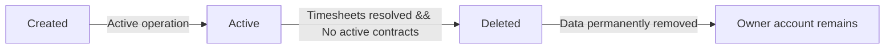

### Owner Authority

The organization owner holds exclusive authority over organizational configuration, governance, and lifecycle management. This authority encompasses several key responsibilities:

- **Organizational settings**: The owner can edit all organizational settings, including identity attributes (unique name, description, logo image) and operational parameters (currency configuration, timezone settings, fiscal start month).

- **Role and permission management**: The owner can create, edit, and manage custom roles within the organization. The owner oversees permission assignments and the overall organizational governance structure.

- **Lifecycle control**: The owner can initiate deletion of the organization, subject to the business conditions regarding pending timesheets and active employee contracts.

All other users within the organization operate under the permissions granted through role assignments managed by the organization owner. This governance structure ensures that the organization owner maintains final control over the organization's configuration and existence.

## User Concept

A user represents an individual account holder with unique authentication credentials based on email and password. The user concept maintains a global profile shared across all organizational memberships, containing attributes such as display name, avatar image, and phone number. Users can belong to multiple organizations simultaneously, switching their active context without logging out. The user entity serves as the foundational identity for accessing platform features, distinct from specific employee roles within organizations. Authentication and profile management exist at the user level, while organization-specific activities are scoped to their assigned contexts. This concept defines the person using the system rather than their employment role.

### User Identity and Authentication

The system maintains an individual account for each person, serving as the foundational identity for platform access. Users authenticate the system using email and password based authentication credentials. The account lifecycle begins with sign-up and allows the holding user to change their password at any time. Users may voluntarily delete their account, provided they transfer ownership or delete any organization for which they are the sole owner, ensuring their employee records in other organizations are marked as deactivated.

### Global Profile

A global profile accompanies each user account, containing shared attributes that persist across all organizational memberships. The profile includes a display name for identification, an avatar image for visual representation, and an optional phone number. Users can edit these global profile details, which remain consistent regardless of the organization context the user is currently active in.

### Organization Context and Membership

Users can hold multi-organization membership, associating their single account with multiple independent organizations. To perform context-specific activities within a particular organization, users select their active context switching preference at login or during the session. Users can switch between organizations without logging out, ensuring that all subsequent actions are strictly scoped to the currently selected organization's data and permissions.

## Employee Concept

An employee represents a specific user assigned to an organization within a specific role and department. Key attributes include a reference to the underlying user account, department assignment, position or title, and employment type. The employment type distinguishes between full-time, part-time, contractor, or intern status. Each employee record maintains a status attribute indicating whether the employee is currently active or deactivated. The concept bridges the personal user identity with organizational membership details, enabling role-based access and resource association within the business domain. It defines the professional capacity of a user within a specific business.

### Organizational Assignment and User Reference

An employee record represents a user's formal membership within an organization. The employee record maintains a user reference that connects the employee record to the underlying individual's global user account, preserving the link between the personal identity and the organizational membership. The user reference enables the same individual to maintain distinct employee records across multiple organizations, each with its own role assignment, department association, and employment context while the underlying user account remains a single universal identity.

This organizational membership establishes the employee as a member of that specific organization, enabling access to organization-specific resources including projects, tasks, and time tracking capabilities. The membership relationship ensures all time entries, timesheets, and project associations created by the employee are attributed to this organizational context.

The organizational assignment defines the employee's connection to exactly one organization for this specific record. This membership enables the employee to participate in organizational operations, access organizational resources, and maintain work history within that organization's scope.

### Classification and Employment Status

The employee record includes an employment type attribute that classifies the professional working relationship with the organization. The employment type is one of four distinct categories:

- Full-time status represents a standard full-week employment arrangement with the organization
- Part-time status represents a reduced-hour employment arrangement with fewer working hours than full-time
- Contractor status represents an independent contractor relationship where the employee operates as an external business entity
- Intern status represents a temporary learning or training position, typically for educational purposes

The employee record also maintains a status attribute indicating current employment standing:

- Active status indicates the employee is currently working within the organization and participates in organizational activities including time tracking, task assignment, and timesheet submission
- Deactivated status indicates the employee is no longer actively working for the organization; historical records including past timelogs and timesheets are preserved for reference, and the employee cannot create new time entries or submit timesheets while deactivated

### Position and Department Assignment

Each employee record may include a position title that identifies the specific job role within the organization, such as project manager, software developer, design lead, or other organizational position names. The position title is optional and provides contextual information about the employee's professional function.

The employee record may also maintain a department assignment that places the employee within the organization's structural hierarchy. The department assignment enables organizational grouping and facilitates filtering of employees by department. The department association is optional; employees may exist without a department assignment, and the relationship supports organizational reporting and resource organization structures.

### Role-Based Access and Resource Association

Role-based access determines what organizational resources and features the employee can interact with. Each employee record must be assigned exactly one role within its organization, defining the employee's permission scope and access levels. The role assignment governs the employee's ability to manage employees, view data, manage projects, approve timesheets, and perform other authorized operations based on the role's permission set.

The employee's resource association enables connections to organization-specific assets including projects through project membership, tasks through task assignment, timelogs through time tracking, timesheets through submission and approval workflows, contracts through employment agreements, and timers through active time tracking sessions. These associations allow the employee to participate in the organization's operational workflows while maintaining clear attribution of all work records to this specific employee identity.

The employee's organizational membership creates the foundation for these resource associations, ensuring all work activities and data created by the employee are properly attributed within the organizational context.

## Department Concept

A department represents a logical grouping mechanism within an organization for structuring employees and resources. Each department is defined by a unique name and an optional description, allowing for hierarchical organization through an optional parent department reference. This structure supports a single level of nesting, enabling clear categorization of organizational units. Departments serve as classification attributes for employees, facilitating filtered views and management scopes. The concept provides the structural foundation for organizational hierarchy without enforcing rigid workflow boundaries between groups. It helps define business units within the larger organization.

### Department as Logical Grouping

A department is an organizational unit that serves as a logical grouping within an organization. It provides a mechanism for resource structuring by allowing employees and related data to be categorized under meaningful business units.

Each department has a department name that uniquely identifies it within its organization, and a department description that provides context about the department's purpose or responsibilities. Both attributes are defined at the department level and shared across all employees assigned to that department.

### Department Hierarchy

Departments support hierarchical nesting through an optional parent department reference. A department may designate another department as its parent, forming a two-level organizational hierarchy.

This hierarchy is limited to one level of nesting only. A department can have a parent department, but cannot have a grandparent department. This constraint ensures the organizational hierarchy remains simple and supports clear unit categorization without complex multi-level structures.

### Department and Employee Classification

Employees are classified through department assignment, where each employee record may optionally reference a department. An employee without a department assignment remains unclassified within the organizational structure.

Department assignment enables filtered views, allowing employees and their associated data to be browsed according to their department classification. It also defines management scope by grouping employees into organizational units, permitting supervision and oversight within those department boundaries. Employees may change department assignments without affecting their other attributes or historical records.

## Role Concept

A role represents an authorization template configured within an organization, defining a specific set of permissions. Each role is characterized by a unique name and a defined collection of permission attributes. The domain distinguishes between immutable built-in roles and customizable roles created by organization owners. Role entities serve as the source of truth for user entitlements, mapping specific capabilities to organizational positions. This concept enables structured access control without binding permissions directly to individual user accounts. It defines what actions are available to specific job functions.

### Role Definition

A role represents an authorization template configured within an organization, defining a specific set of permissions that govern what actions users can perform. Each role is characterized by a unique role name and a defined collection of permission attributes. The system utilizes role entities as the source of truth for user entitlements, mapping specific capabilities to organizational positions. This concept enables structured access control without binding permissions directly to individual user accounts.

**Role Entities**

| Concept | Description |
|---|---|
| Role Entities | The core domain objects representing permission sets within an organization. |
| Role Name | A unique identifier and display title for a role used during capability mapping. |
| Permission Attributes | The individual capabilities or rights granted by a role, governing structured access to features. |

The platform capabilities define what operations are available to specific job functions, forming the basis of entitlement configuration. Built-in roles and custom roles represent the two categories of access control templates available to organization owners.

### Built-in Role Types

The platform provides three immutable built-in roles that cannot be renamed or deleted.

- **Owner**: Full access to all features, including managing employees, custom roles, and organization settings.
- **Manager**: Capability to manage employees, view all projects and timesheets, approve submitted timesheets, and generate reports.
- **Employee**: Capability to track time, submit timesheets, view assigned projects, and access personal records.

These built-in roles represent standard organizational positions within the time tracking domain.

### Custom Role Construction

Organization owners can create custom roles beyond the three built-in options to tailor capability mapping for unique business needs.

- Custom roles support a distinct role name.
- Custom roles define a flexible permission set combining specific access control attributes from the available platform capabilities.
- Entitlement configuration allows granting granular access to employee management, project control, time oversight, and reporting.

A custom role acts as an abstract authorization template that can be assigned to employees, establishing their user entitlements within the system.

### Role Deletion Constraints

Deleting a custom role requires that no employees are currently assigned to it. 

- All users assigned to the role must be reassigned to a different role before the role can be deleted.
- When a role is deleted, only the authorization template is removed; employee accounts and all their historical data are preserved and unaffected.

## Contract Concept

A contract represents a formal employment agreement associated with a specific employee within an organization. Key attributes include a required start date, an optional end date, and a mandatory pay rate value. The contract details specify the pay period, classifying compensation as hourly, daily, weekly, or monthly. The domain model captures the agreed working hours per week and allows for optional textual notes describing terms. This concept defines the financial and temporal parameters of an employment relationship at a point in time. It records the specific terms of engagement between the employee and the organization.

### Employment Agreement and Relationship

The employment agreement defines the formalized terms of the employment relationship between an employee and an organization. It serves as the foundational domain record encapsulating all financial parameters and temporal parameters for a specific engagement period. An employee is associated with the organization strictly through the employment relationship established by the active agreement.

### Financial and Temporal Parameters

The financial parameters and temporal parameters establish the quantitative and time-based expectations of the contract.

The financial parameters include the pay rate and the working hours per week. The pay rate is a mandatory numeric value representing the base compensation amount. The working hours per week specifies the expected duration of active labor time within a standard week.

The temporal parameters include the start date and the end date. The start date is a mandatory attribute marking the initiation of the contract agreement. The end date is an optional attribute indicating the conclusion of a fixed-term contract; when no end date is provided, the agreement is classified as an ongoing employment relationship. Additionally, optional notes allow for qualitative descriptions regarding special terms or qualitative conditions agreed upon by the parties.

### Compensation Classifications

The pay period categorizes how the pay rate is applied to the employee's labor. The system supports four distinct classifications for the pay period:
- **Hourly classification:** Ties the pay rate to individual units of working hours.
- **Daily classification:** Ties the pay rate to a standard calendar day.
- **Weekly classification:** Ties the pay rate to a complete seven-day work week.
- **Monthly classification:** Ties the pay rate to a standard calendar month.

## Project Concept

A project represents a container for organizational work, defined by a unique name and optional description. Key attributes include a specific color code for visual identification and a status attribute indicating whether the project is active, archived, or completed. The concept tracks estimated effort through budget hours, alongside optional start and end dates defining the project timeline. Projects serve as the primary entities for resource allocation, timelogging, and task management within the domain. This concept allows organizations to structure and segregate distinct bodies of work for tracking and reporting purposes. It defines the scope of work for teams.

### Project Definition and Attributes

A project serves as a work container that represents a distinct body of work within an organization. It defines the scope of work for teams and provides a structured framework for tracking effort, allocating resources, and managing related activities.

Each project is identified by a unique project name, which is required to distinguish it from other projects within the same organization. An optional description text provides additional context about the project's objectives, scope, ordeliverables.

A color code is assigned to each project to enable quick visual identification across lists, dashboards, and reporting views. This visual attribute helps users rapidly distinguish between different projects when reviewing timelogs, tasks, or reports.

### Project Lifecycle Statuses

Projects maintain a lifecycle status that indicates their current operational state. The lifecycle status progresses through three defined states:

An active status indicates the project is open and accepting new timelogs. Employees assigned to the project can log time, create tasks, and contribute to ongoing work.

An archived status indicates the project is no longer actively accepting new time entries but remains visible for historical reference. Existing timelogs and tasks are preserved, but the project cannot receive new timelog entries.

A completed status serves the same functional purpose as archived — the project stops receiving new timelogs while retaining all historical data. Completion signals that the work scope is finished.

These statuses provide organizations with control over which projects are eligible for active timelogging while maintaining visibility into historical projects.

### Project Planning and Timeline

Projects can be planned with estimated effort and defined timelines. Budget hours represent the total estimated effort allocated to the project, providing a reference point for measuring actual time spent against planned capacity.

An optional start date marks when the project is expected to begin, and an optional end date marks when the project is expected to conclude. Together, these dates define the project timeline and help organizations plan resource availability across overlapping projects.

The combination of budget hours and project timeline enables organizations to forecast capacity needs, track budget consumption, and identify projects that exceed their planned effort. Projects without budget hours are excluded from budget utilization reports but remain fully functional for timelogging and task management.

### Project as a Tracking and Reporting Entity

Projects function as the primary tracking entities for structuring organizational work. They serve as anchors for multiple interconnected domain activities:

Resource allocation occurs through project membership, where employees are formally assigned to projects. Each project defines which team members are eligible to contribute work and log time against it.

Timelogging is scoped to projects — every time entry must reference a specific project. This establishes a direct link between employee effort and the work container, enabling accurate attribution of hours.

Task management is organized within projects — tasks belong to projects and represent discrete units of work within the broader project scope. This creates a hierarchical structure where projects encompass multiple tasks.

Reporting purposes leverage projects as the central grouping dimension. Organizations generate time reports, budget utilization reports, and weekly summaries aggregated by project, allowing leadership to assess progress and resource distribution across distinct bodies of work.

## ProjectMembership Concept

A project membership represents the formal association between a specific employee and a project within an organization. This relationship entity attributes an assigned role to the employee, distinguishing between standard member and project-lead designations. The concept establishes which employees are authorized to participate in project activities and time tracking. By linking employees to projects, this domain element enables accurate attribution of work hours and task responsibilities. It serves as the bridge connecting human resources to specific business initiatives. It defines participation rights for specific work scopes.

### Project Membership Definition

A project membership is a relationship entity that establishes the formal association between an employee and a project within an organization. It serves as the employee-project link, connecting human resources to specific business initiatives. This linkage enables the system to attribute work hours and task responsibilities to the correct organizational scope. Each membership connects exactly one employee to exactly one project.

An employee may hold multiple project memberships simultaneously, allowing participation across several work streams. Project memberships define which employees have standing on a given project and serve as the basis for all project-related activity authorization.

### Membership Designation and Roles

Every project membership carries an assigned role—a membership designation that determines the employee's level of authority within that project. There are two designation types:

- **Member**: a standard member participates in project work by logging time and viewing project information. Members may be assigned to tasks within the project.

- **Project-lead**: a project-lead holds elevated responsibilities and can manage tasks within their assigned project, including creating, editing, and tracking task status changes.

The assigned role distinguishes operational contributors from those who manage project-level workflows. Role assignment is per-project, meaning an employee may be a project-lead on one project and a standard member on another.

### Authorized Participation and Resource Attribution

Project membership establishes authorized participation—employees must have an active membership to engage in project activities. Without a membership, employees cannot log time against a project or be assigned to its tasks.

The membership enables time tracking association, linking all timelogs created by an employee to projects they are formally associated with. This ensures accurate work attribution and resource attribution across the organization.

Memberships also govern task responsibilities, determining which employees can be assigned to specific tasks. The system uses project memberships to validate that any time entry, task assignment, or report view stays within the scope of authorized involvement.

## Task Concept

A task represents a specific unit of work defined within a project context. Key attributes include a mandatory title, optional description, and a status indicating its progress such as open, in-progress, completed, or closed. The task concept includes a priority attribute ranging from low to urgent, alongside optional estimated hours and a due date for planning. It supports assignment to a specific project member and allows for one level of nesting through a parent task reference. This concept enables granular tracking of work items within broader project scopes. It breaks down project work into manageable items.

### Task as a Unit of Work

A task represents a specific unit of work defined within a project, serving as the foundational element for work item tracking. Tasks enable teams to break down project scopes into granular, manageable pieces that can be individually monitored and managed.

Each task carries the following core attributes:

- **Title**: A mandatory text string that identifies the work to be performed. Every task must have a title.
- **Description**: An optional text field that elaborates on instructions, criteria, or contextual details for the work.
- **Estimated hours**: An optional numeric value representing the anticipated effort required to complete the work, used for capacity planning.
- **Due date**: An optional date marker that establishes the target completion timeframe for the task.

### Task Status Lifecycle

Tasks progress through four defined statuses that reflect their current position in the work lifecycle:

- **Open**: The task has been created and is awaiting work to begin. This is the initial state upon task creation.
- **In-progress**: Active work on the task has commenced. The assigned member has begun execution of the defined work.
- **Completed**: The work defined by the task has been fully finished.
- **Closed**: The task is formally concluded and no further action is expected. This is the terminal state of the task lifecycle.

A Mermaid diagram illustrating the task status states:

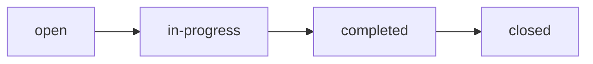

Status changes are recorded as a historical trail, preserving timestamps, previous status, new status, and the user who initiated the change.

### Task Priority Levels

Each task carries a priority attribute that signals the urgency and importance of the work relative to other tasks. The priority scale includes four levels:

| Priority Level | Meaning |
|---|---|
| Low | Flexible or non-critical work with relaxed timing |
| Medium | Standard work with normal scheduling expectations |
| High | Pressing work requiring attention sooner rather than later |
| Urgent | Immediate attention required; highest priority level |

The priority attribute helps teams and assignees understand the relative importance of tasks when organizing their workload and planning execution order.

### Task Relationships

Tasks support relationships that connect work to people and organize work hierarchically:

**Project Member Assignment**
- A task may be assigned to exactly one project member, who is responsible for completing the work.
- The assigned member must already be a member of the project containing the task.
- Assignment is optional; unassigned tasks remain open for work without a specific owner.

**Parent Task Reference**
- A task may reference one parent task, enabling hierarchical organization of related work items.
- This relationship supports exactly one level of nesting (parent-child), without deeper subtask structures.
- A parent task groups multiple child tasks under a single umbrella work item, facilitating grouped tracking within project scopes.

These relationship attributes allow tasks to be mapped to specific project members and structured into logical groupings for better visibility and accountability.

## Timelog Concept

A timelog represents a discrete record of time spent on a specific project or task by an employee. Essential attributes include the date of the entry, the duration expressed in minutes, and references to the associated project and optional task. The timelog captures an optional description of the work performed and includes a billable flag to categorize the time for financial purposes. This concept serves as the fundamental atomic unit for time tracking within the organization. It aggregates individual work periods into reportable data points used for payroll and project costing. It records the raw data of work performed.

### #### Timelog Definition

A timelog is a discrete time record that represents the atomic unit of time tracking within an organization. Each timelog captures an employee's time spent on work activities during a specific period. This concept serves as the fundamental building block for all time tracking operations, providing the raw data points used for payroll calculations, project costing, and organizational reporting. Every timelog is directly associated with an employee and represents their recorded work time.

### #### Timelog Attributes

Each timelog contains essential attributes that define the time entry. The date attribute specifies the calendar date when the work was performed. The duration minutes attribute captures the amount of time spent, measured in minutes. An optional work description may be provided to explain what work was done during the recorded period. The billable flag serves as a financial categorization indicator, determining whether the time is chargeable to clients or considered internal organizational work. This billable flag enables proper financial tracking and cost allocation across different types of work activities.

### #### Timelog Associations

Timelogs establish key relationships with other domain concepts. Each timelog requires a project reference, associating the employee's time with exactly one project where the work was performed. A timelog may optionally include a task reference, linking it to a specific task within the associated project for more granular tracking. The project association ensures that all employee time is connected to organizational work containers. The task association provides detailed tracking when work is performed on specific tasks rather than general project work. Individual timelogs represent discrete work periods that can be aggregated into reportable data for weekly timesheets, project budget analysis, and organizational performance reports.

## Timesheet Concept

A timesheet represents a consolidated collection of timelogs belonging to a specific employee for a defined weekly period. Key attributes include the week start and end dates, strictly following a Monday-to-Sunday cycle. The concept tracks the overall status of the submission lifecycle, distinguishing between draft, submitted, approved, and rejected states. It aggregates total calculated hours derived from included timelogs and records specific timestamps for submission and review events. Additional attributes capture the identity of the reviewer and any rejection reasons provided during the approval process. This entity manages the formal submission and authorization of weekly work records. It groups daily logs into a reviewable unit.

### Timesheet Structure

A timesheet represents a consolidated collection of daily work records belonging to a single employee over a specific weekly period. The weekly period is fixed as Monday through Sunday, ensuring a consistent accounting cycle across the organization. Each timesheet is strictly bounded by a week start date (Monday) and a week end date (Sunday), providing clear temporal limits for the included records.

The timesheet aggregates all work records—individual timelog entries—produced by the employee within that week into a single reviewable unit. It serves as the formal submission vehicle for an employee's weekly output, grouping scattered daily entries into a coherent package for authorization purposes.

The total hours attribute is automatically calculated by summing the durations from all timelogs contained within the timesheet, providing a snapshot of the employee's weekly productivity.

### Submission Lifecycle

Timesheets follow a defined submission lifecycle that tracks the progression of weekly work records from preparation through authorization. This lifecycle consists of four distinct states:

The draft status indicates the timesheet is being prepared and remains editable. In this state, the employee can add, remove, or modify individual work records before initiating formal review. The timesheet exists but has not been presented to the authorization entity.

The submitted status indicates the employee has completed preparations and formally submitted the timesheet for evaluation. At this point, the records are locked from modification by the employee and await processing by the authorization entity.

The approved status indicates the authorization entity has validated the work records and confirmed the hours. Approved timesheets serve as the authoritative record of the employee's weekly contribution. All included timelogs become permanently locked and cannot be altered.

The rejected status indicates the authorization entity has identified issues and declined the submission. Rejected timesheets return to a state where the employee can revise the records, incorporating any required corrections before resubmission.

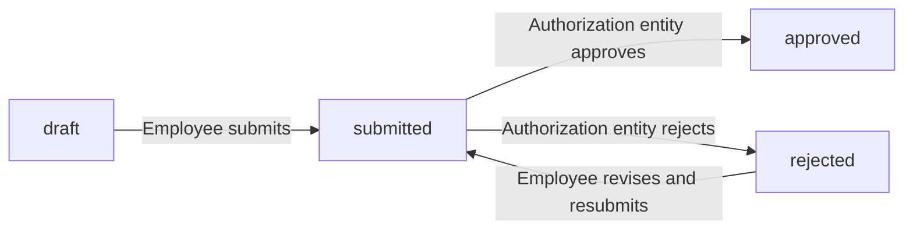

### Approval Metadata

Timesheets capture specific metadata during the review process to maintain a complete audit trail.

The submission timestamp records the exact moment the employee formally submits the timesheet for evaluation, establishing a clear point in the workflow timeline.

The review timestamp records the moment the authorization entity completes their evaluation, whether approving or rejecting the submission. This provides visibility into processing speed and establishes accountability.

The reviewer identity attribute records which member of the authorization entity performed the approval or rejection action. This ensures clear attribution of the decision and supports organizational oversight.

The rejection reason is a documented explanation provided by the authorization entity when declining a timesheet. This field captures the specific issues identified during review, enabling the employee to understand required corrections and resolve discrepancies before resubmission.

## Timer Concept

A timer represents an active, real-time tracking session initiated by an employee to capture ongoing work. Key attributes include the start timestamp, a reference to the current project, an optional associated task, and a description of the activity being performed. The concept enforces a strict constraint that an employee can have at most one active timer at any moment. It serves as the transient state for time accumulation before it is eventually converted into a standard timelog record. This concept provides the underlying mechanism for live time tracking within the user interaction model. It represents the active measurement of work duration.

### Timer as Active Tracking Session

A timer is an active tracking session that captures an employee's ongoing work in real time. It serves as the interface mechanism for live time tracking, allowing employees to measure their work as it happens rather than logging it retrospectively. Session initiation marks the beginning of this active period, transforming idle time into tracked work capture.

The timer exists as a transient state in the time tracking lifecycle. Unlike timelogs which are permanent records, a timer represents the measurement phase that bridges the gap between starting work and creating a durable time entry. Once the session ends, the accumulated time is converted into a standard timelog record, and the timer concept ceases to exist as an active entity.

### Timer Attributes

Each timer instance captures several key attributes that define the context of the tracked work:

- **Start timestamp**: The exact moment when the tracking session begins. This serves as the baseline reference point for calculating elapsed time during the session.

- **Current project reference**: A mandatory link to a specific project within the organization. All tracked time must be attributed to a project, and this reference determines where the resulting timelog will be associated.

- **Associated task**: An optional connection to a particular task within the selected project. When specified, the final timelog will reference this task; when omitted, the timelog will be linked only to the project level.

- **Activity description**: Optional free-form text describing the nature of the work being performed. This provides context for the time entry and can be modified while the timer is still running.

These attributes together define what work is being tracked and where the time should be recorded. They are established at session initiation and can be adjusted during the active tracking period.

### Timer Constraint and Time Accumulation

The timer concept enforces a single active constraint: an employee may have at most one active timer running at any given moment. This prevents overlapping tracking sessions and ensures unambiguous time records. If an employee attempts to start a new timer while one is already running, the existing session must be concluded first.

Time accumulation occurs continuously from the start timestamp throughout the active session. The system measures elapsed time in real time, tracking the duration since session initiation. When the timer is stopped, this accumulated time is rounded to the nearest minute and becomes the basis for the resulting timelog entry.

This accumulation mechanism ensures that tracked time accurately reflects the actual duration of the work session, maintaining precision consistent with standard timelog records.

## ActivityLog Concept

An activity log represents a sequential audit trail record capturing significant actions performed within an organization. Each log entry is characterized by a record timestamp, the reference to the user who performed the action, and a specific action type identifier. The concept attributes a target entity link to the object affected by the change, alongside detail text describing the modification. This domain entity preserves a robust history of structural changes and state transitions across organizational resources. It supports the generation of comprehensive audit reports and accountability verification. The concept maintains an immutable record of who performed what action and when.

### Audit Trail Purpose

The activity log serves as a sequential audit trail that captures every significant action performed across organizational resources. It provides complete historical tracking of who performed what action and when, ensuring full auditability without requiring manual intervention from users. This automatic action capture preserves an objective record of all modifications, supporting organizational oversight and compliance requirements.

### Entry Attributes

Every log entry contains a record timestamp indicating the exact moment an event occurred, alongside a user reference identifying the account responsible for initiating the change. The entry includes an action type identifier that categorizes the specific nature of the business event. A target entity link connects the log entry to the specific resource affected, while detail text provides descriptive context about the change. Together, these attributes form a comprehensive modification record for every logged activity.

### Logged Event Scope

The activity log tracks structural changes to organizational entities, including the creation, deletion, or modification of resources such as employees, projects, tasks, contracts, and roles. It also records state transitions, capturing when resources change their lifecycle status—such as a project being archived, a timesheet moving from submitted to approved, or an employee being deactivated. Through continuous history preservation, all structural changes and state transitions remain permanently available for review, maintaining an unalterable account of organizational evolution.

# Domain Relationships

Describe how concepts relate to each other from a business perspective.

## Conceptual Relationships

Describe how concepts relate to each other in business terms.

### Organization as Relationship Root

The organization serves as the root entity for the entire domain hierarchy. Every other business concept maintains a belongs-to relationship with exactly one organization, establishing organizational data isolation.

An organization has many users through membership associations. An organization has many departments that provide logical groupings within it. An organization has many roles that define permission sets within it. An organization has many employees who perform work within it. An organization has many projects that contain work to be tracked. An organization has many activity logs that record actions performed within it.

All entities except the user maintain a strict belongs-to relationship with a single organization. The organization acts as the container and ownership boundary for all subordinate business concepts.

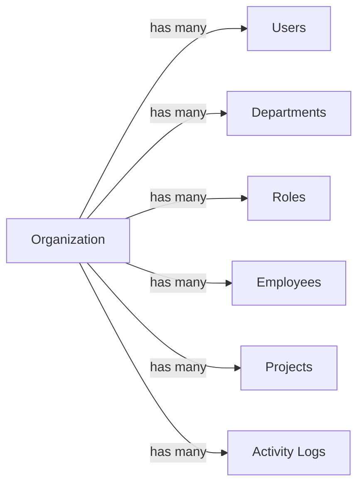

### User as Multi-Organization Member

The user entity represents an individual account that can maintain membership across multiple organizations. Unlike other entities that belong to exactly one organization, users have a special belongs-to-one-or-many relationship with organizations.

A user belongs to one or many organizations through membership associations. When a user joins an organization, an employee record is created that belongs to exactly one organization. The user has zero or many employee records, where each employee record belongs to a different organization.

This multi-organization membership association allows the user's global profile (display name, avatar image) to be shared across all organizations while maintaining separate employee records for organizational context.

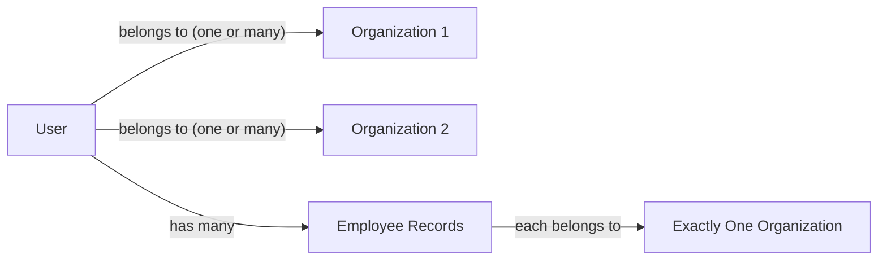

### Employee as Organization-Scoped Associate

The employee entity represents a person's working relationship within a specific organization. Each employee record belongs to exactly one organization, creating the primary association between individuals and their workplace.

An employee has zero or many contracts that record their employment terms. An employee has zero or many timelogs that record their tracked time. An employee has zero or many timesheets that consolidate their weekly time entries. An employee has zero or many project memberships that associate them with specific projects. An employee belongs to exactly one role within their organization for authorization purposes.

The employee maintains a belongs-to relationship with both an organization and a department (when assigned). The employee is the owner of their own timelogs and timesheets, establishing the employee as the has-many source for time tracking records.

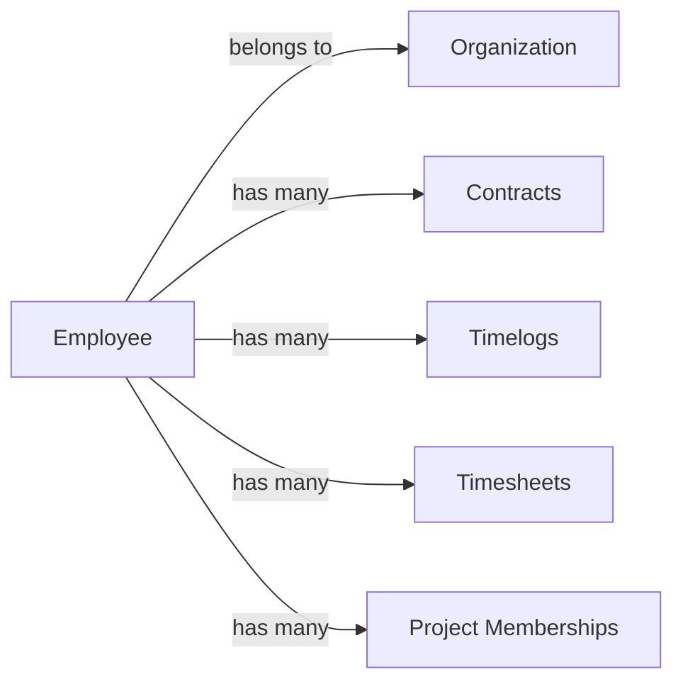

### Project Membership as Employee-Project Association

The project membership entity creates a formal belongs-to relationship between an employee and a project. This association bridges the gap between individuals and their assigned work.

A project membership belongs to exactly one employee through employee association. A project membership belongs to exactly one project through project association. An employee can have many project memberships across different projects. A project can have many project memberships linking multiple employees.

The assigned role (member or project-lead) defines the employee's capacity within the project. Project leads gain the ability to manage tasks within their project, establishing a conditional permission relationship.

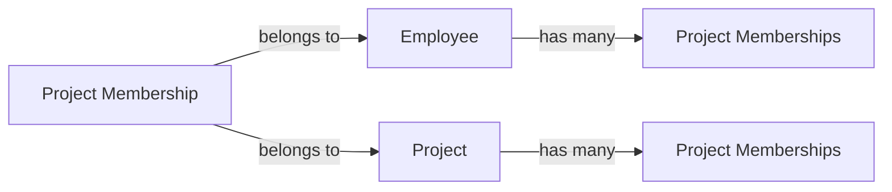

### Task as Project-Scoped Work Unit

The task entity represents a specific unit of work that belongs to a project. Tasks establish hierarchical and assignment relationships within the project scope.

A task belongs to exactly one project through project ownership. A task may be assigned to exactly one employee, where the employee must be a project member through existing project membership association. A task optionally belongs to one parent task for subtask nesting (one level only). A task has zero or many timelogs that record time spent on it.

The task-to-employee assignment creates a conditional belongs-to relationship: the assigned employee must already have a project membership association with the task's parent project.

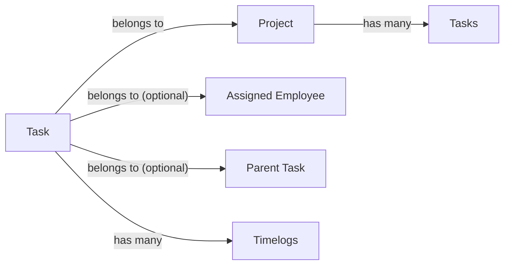

### Timelog as Employee-Project-Time Association

The timelog entity records time spent on work and maintains multi-directional belongs-to relationships with employees, projects, and tasks.

A timelog belongs to exactly one employee (the person who logged the time). A timelog belongs to exactly one project (where the work was performed). A timelog optionally belongs to exactly one task (for more granular tracking). A timelog may belong to exactly one timesheet when consolidated into weekly submissions.

An employee has many timelogs across their career. A project has many timelogs from all assigned employees. A task has many timelogs from employees working on it. A timesheet includes many timelogs for a specific week.

The timelog's belongs-to association with a project requires that the logging employee has a project membership association with that project.

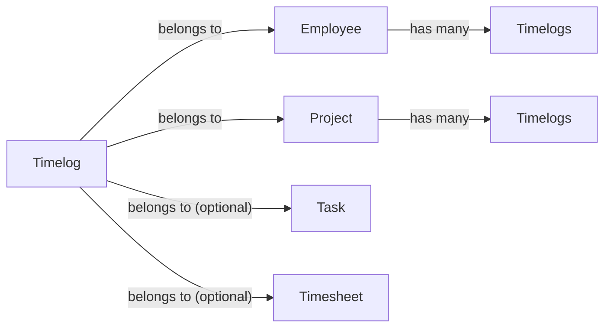

### Timer as Active Tracking Session

The timer entity captures active time tracking sessions and maintains belongs-to associations with employees, projects, and tasks.

A timer belongs to exactly one employee who is actively tracking time. A timer belongs to exactly one project where the work is being performed. A timer optionally belongs to exactly one task for specific work tracking. An employee has at most one active timer due to the exclusive timer association.

When a timer stops, it transitions into a timelog, preserving the belongs-to relationships with the employee, project, and task. This timer-to-timelog association maintains continuity of the tracked time record.

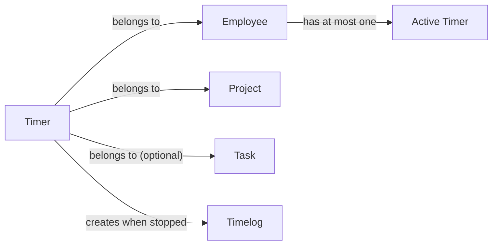

### Activity Log as Organizational Audit Trail

The activity log entity records significant actions and maintains belongs-to associations with organizations, acting users, and target entities.

An activity log belongs to exactly one organization where the action occurred. An activity log belongs to the user who performed the action. An activity log references a target entity that was affected by the action (employee, contract, project, task, timesheet, or role).

An organization has many activity logs recording all significant actions within its scope. Activity logs provide an immutable belongs-to association to their organization, ensuring a complete audit trail persists for organizational governance.

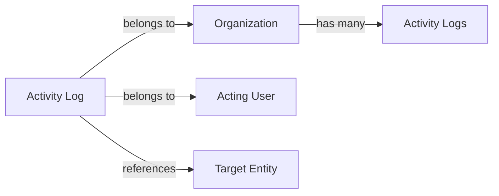

### Ownership and Association Patterns

Ownership and association patterns define how entities claim ownership and maintain relationships across the domain.

**Ownership patterns:**
- Organization owns all departments, projects, roles, and activity logs within its scope
- Employee owns their own contracts, timelogs, timesheets, and timers
- Project owns its tasks and receives timelogs from assigned employees
- Timesheet owns its included timelogs for the weekly period

**Association types:**
- Belongs-to: A directional link where one entity connects to exactly one parent (employee belongs to organization, timelog belongs to project)
- Has-many: An entity owns multiple child entities (organization has many employees, employee has many timelogs)
- Optional belongs-to: A conditional link that may or may not exist (task optionally assigned to employee, timelog optionally linked to task)
- Bridge association: A junction entity connecting two entities (project membership links employee and project)

These patterns ensure that every entity has clear ownership and that associations are traceable through the domain hierarchy.

## Lifecycle and Retention

Describe concept lifecycle states and transitions only. Detailed retention/recovery policies belong in 05-non-functional. Operation details belong in 03-functional-requirements.

### Organization Lifecycle and Deletion

An organization begins in an active state upon creation and remains active throughout its operational existence. The organization can be deleted, but only when specific conditions are met: all pending timesheets must have been resolved through approval or rejection, and there must be no active employee contracts remaining.

Organization deletion is permanent. The deletion cascades to all organizational data, permanently removing employees, projects, tasks, timelogs, timesheets, departments, roles, timers, and activity log entries. No recovery mechanism exists for deleted organizations.

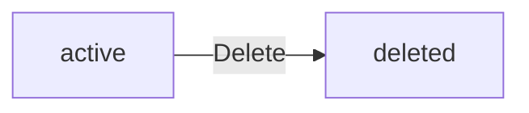

The owner's user account survives organization deletion but is no longer associated with the deleted organization.

### Employee Lifecycle and Retention

An employee record exists in one of two states: active or deactivated. New employment relationships begin in the active state.

Deactivated employees are excluded from the active workforce. They cannot create new timelogs or submit timesheets. However, their historical records — existing timelogs, timesheets, timers, contracts, and project memberships — are retained within the system and remain associated with their employee record.

Deactivated employees can be reactivated, restoring their full organizational participation. This transition allows historical continuity when employees return to the organization.

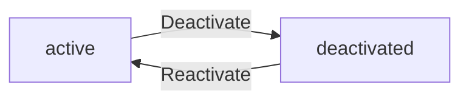

When a user deletes their account across all organizations, their employee records in each organization are marked as deactivated rather than removed. This preserves organizational traceability and historical data integrity.

### Contract Lifecycle

An employee may hold multiple contracts throughout their tenure, forming a chronological employment record. Only one contract holds active status at any time.

When a new contract is created for an employee who has an active contract, the previous contract automatically transitions to a past state. Its end date is set to the day before the new contract's start date. Contracts in the past state receive no further modifications, serving as an immutable historical record.

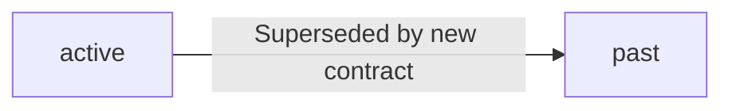

All contracts, regardless of state, are retained permanently as part of the employee's organizational record.

### Project Archival and Deletion

A project progresses through multiple lifecycle states. New projects begin in the active state.

Active projects can be transitioned to archived or completed states. This transition may occur at any time. In both archived and completed states, the project cannot accept new timelogs, but existing timelogs are preserved and remain accessible for reporting. The project also remains visible within the organization's project list.

Projects can be deleted only when they have no associated timelogs. Projects with timelogs cannot be deleted under any circumstances; they must instead be archived or completed.

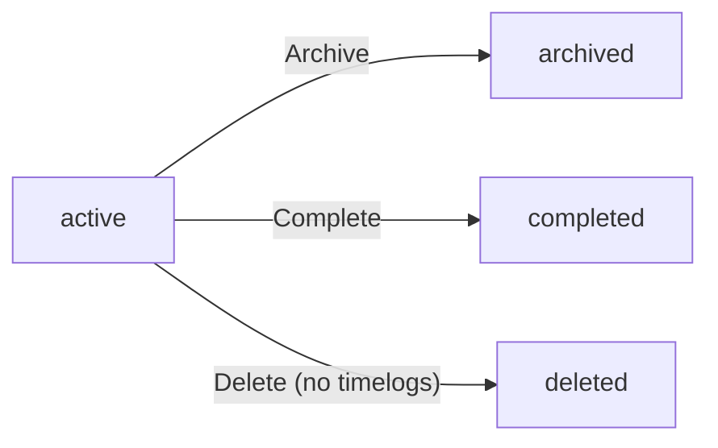

Archival and completion serve as permanent preservation states — projects in these states remain accessible within the organization indefinitely.

### Timesheet and Timelog State Flow

A timesheet progresses through a structured approval workflow. It begins in the draft state upon creation.

During the draft phase, the employee can freely add or remove timelogs. When submitted, the timesheet enters the submitted state and becomes locked for editing. From the submitted state, a timesheet can be approved or rejected.

Approved timesheets represent final, locked records. All timelogs within an approved timesheet become permanently locked — they cannot be edited or deleted. If rejected with a stated reason, the timesheet returns to the draft state, allowing the employee to revise and resubmit.

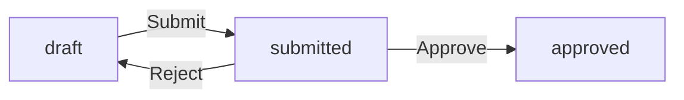

Timelogs not yet included in any timesheet, or included in a draft or rejected timesheet, remain editable. Timelogs locked within an approved timesheet retain their locked state permanently.

### Task Status Lifecycle and History

A task progresses through a status workflow: open, in-progress, completed, or closed. New tasks begin in the open state.

Task status transitions represent work progression. Moving a task to in-progress indicates active work has begun. A task can be completed when its work is finished, or closed when it is abandoned or superseded. A task can be reopened from either the completed or closed state, transitioning back to open or in-progress.

All task status changes are recorded in task history. Each history entry captures the timestamp, the previous status, the new status, and the user who made the change. Task history entries are retained permanently as part of the task's record.

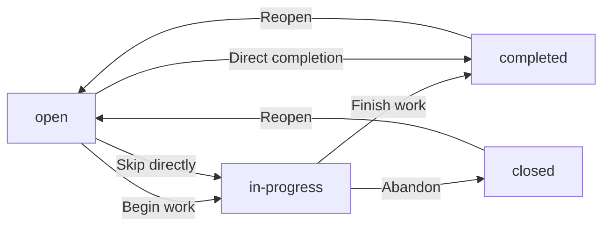

Task history provides an immutable chronological audit trail of all status changes.

### Timer State Flow

An employee can have at most one active timer at any given time. The timer represents an ongoing tracking session.

When an employee stops a timer, the tracking session ends and a timelog is created with the calculated duration. When an employee discards a timer, the tracking session ends without creating a timelog — the attempted tracking is not preserved.

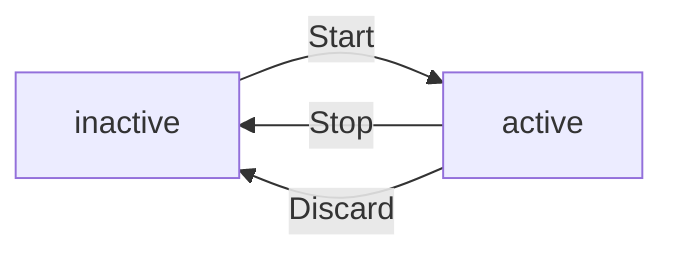

An active timer continues running indefinitely if not explicitly stopped or discarded. The system does not enforce automatic timer expiration.

### Activity Log Retention

The activity log serves as a permanent, sequential record of significant organizational events. Activity log entries are created automatically when specific organizational actions occur, including employee invitations and status changes, contract modifications, project lifecycle transitions, task status changes, timesheet submissions and review outcomes, timer operations, and role assignments.

Each activity log entry captures the timestamp, the user performing the action, the action type, the affected entity, and relevant contextual details. Entries are ordered chronologically.

Activity log entries are never deleted or modified. They persist throughout the organization's existence. When the organization itself is deleted, all activity log entries are permanently removed along with it. Within the organization's active lifecycle, no activity log entry is subject to deletion or archival.

# Business Categories and State Flows

Business category classifications and state flow definitions.

## Business Category Definitions

Define all business category classifications with their allowed values and descriptions.

### Business Category Definitions

The system uses business categories to classify and filter organizational entities. Business categories are pre-defined classification schemes that govern the status, types, and states of employees, projects, tasks, timesheets, and contracts throughout the HRM platform.

Each business category has a fixed set of allowed values that represent mutually exclusive states or types that an entity can assume at any given time. The following allowed-value classifications are defined:
- Employment Type Classifications (defined in Employment Type Classification)
- Employee Status Classifications (defined in Employee Status Classification)
- Project Lifecycle Status Classifications (defined in Project Lifecycle Status Classification)
- Task Status Classifications (defined in Task Status Classification)
- Task Priority Classifications (defined in Task Priority Classification)
- Timesheet Approval Status Classifications (defined in Timesheet Approval Status Classification)
- Contract Pay Period Classifications (defined in Contract Pay Period Classification)

### Employment Type Classification

Employment type classifies the nature of engagement between an employee and the organization. This classification is assigned when an employee record is created and can be updated by users with employee management permissions.

Allowed values:
- **Full-time**: Standard full-working-engagement arrangement.
- **Part-time**: Reduced-hours engagement arrangement.
- **Contractor**: Independent service provider engagement.
- **Intern**: Training and development engagement.

Employment type is optional when creating an employee record. If not specified, no default value is set. Employment type is used for filtering the employee list by type but does not affect system behavior beyond classification purposes.

### Employee Status Classification

Employee status indicates whether an employee is actively participating in the organization. This classification is managed by users with employee management permissions.

Allowed values:
- **Active**: Employee is currently working and can perform all employee functions, including logging time, managing timers, and submitting timesheets.
- **Deactivated**: Employee is no longer actively participating; cannot log time or submit timesheets, but historical data is preserved.

When an employee record is created, it begins in active status. When a user account is deleted and the user holds employee records in other organizations, those employee records are automatically set to deactivated status. Deactivated employees cannot log time, track via timer, or submit timesheets. However, their historical data (timelogs, timesheets, and past contracts) is preserved. Deactivated employees can be reactivated by users with employee management permissions, restoring their ability to perform all employee functions.

### Project Lifecycle Status Classification

Project lifecycle status tracks the operational state of a project from inception through completion. Users with project management permissions control status transitions.

Allowed values:
- **Active**: Project is currently operational and can receive new time entries.
- **Archived**: Project is concluded and preserved for reference; cannot receive new timelogs.
- **Completed**: Project has reached its intended outcome; cannot receive new timelogs.

Projects begin in active status when created. Users with project management permissions can transition active projects to either archived or completed status. Once a project is archived or completed, no new timelogs can be associated with the project. Existing timelogs on archived or completed projects are preserved and remain viewable. Projects cannot be returned to active status once archived or completed.

### Task Status Classification

Task status represents the workflow position of a task within its parent project. Status changes are tracked in task history with a full audit trail.

Allowed values:
- **Open**: Task has been created but work has not yet begun.
- **In-progress**: Task is currently being worked on.
- **Completed**: Task work has been finished.
- **Closed**: Task is finalized and no longer active.

Tasks are created with open status by default. Project leads and users with project management permissions can update task status. Each status change is recorded in task history, including the timestamp, previous status, new status, and the user who made the change. Tasks can be filtered and sorted by status.

### Task Priority Classification

Task priority ranks the urgency level of a task to guide workforce attention and scheduling decisions.

Allowed values:
- **Low**: Task can be addressed when higher-priority items are complete.
- **Medium**: Task should be addressed in normal workflow order.
- **High**: Task should be prioritized above normal workflow.
- **Urgent**: Task requires immediate attention.

Priority is set when a task is created and can be updated by users with task management permissions. Tasks can be filtered and sorted by priority level. Priority does not automatically affect task status or workflow progression; it serves as a classification attribute used for organizational and prioritization purposes.

### Timesheet Approval Status Classification

Timesheet approval status reflects the review state of a weekly timesheet through its submission and approval lifecycle.

Allowed values:
- **Draft**: Timesheet has been created but has not been submitted for review; employee can freely add or remove timelogs.
- **Submitted**: Timesheet has been sent for review by an approver; no further modifications are allowed.
- **Approved**: Timesheet has been reviewed and accepted; all included timelogs are locked from editing or deletion.
- **Rejected**: Timesheet has been reviewed and declined; returns to draft status so the employee can modify and resubmit.

Timesheets begin in draft status when created. Employees submit draft timesheets by moving them to submitted status. Users with timesheet approval permissions review submitted timesheets and move them to either approved or rejected status. Rejected timesheets revert to draft status, allowing the employee to make corrections and resubmit. Approved timesheets lock all included timelogs, preventing any edits or deletions to those time entries.

### Contract Pay Period Classification

Contract pay period determines the recurring basis on which employee compensation is calculated and tracked.

Allowed values:
- **Hourly**: Compensation is calculated per hour worked.
- **Daily**: Compensation is calculated per day worked.
- **Weekly**: Compensation is calculated on a weekly basis.
- **Monthly**: Compensation is calculated on a monthly basis.

## State Transitions

Define valid state transition paths for stateful concepts.

### Project Status Flow

Projects move through three possible states during their lifecycle.

| State | Description |
|-------|-------------|
| Active | The project is open and receiving new timelogs |
| Archived | The project is inactive, no new timelogs can be added |
| Completed | The project is finished, no new timelogs can be added |

A project begins in the active state when created. Users with project management permissions can transition a project from active to either archived or completed. Both archived and completed states are terminal—once a project reaches either state, it cannot return to active. Existing timelogs on archived or completed projects are preserved but no new timelogs can be created against those projects.

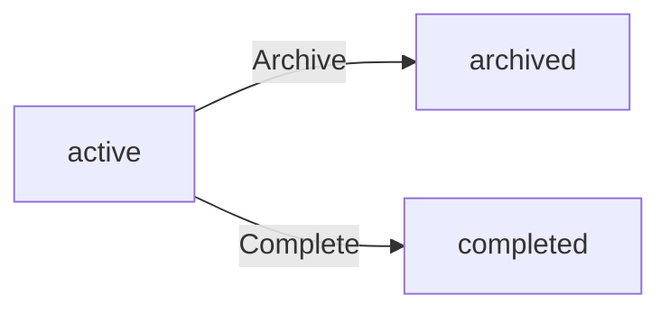


### Task Status Transitions

Tasks progress through four possible statuses as work advances.

| Status | Description |
|--------|-------------|
| Open | The task is defined but work has not started |
| In-progress | Work on the task is actively underway |
| Completed | The work on the task is finished |
| Closed | The task has been formally closed out |

A task starts in the open status when created. Users can move a task from open to in-progress as work begins, from in-progress to completed when the work finishes, and from completed to closed for formal closure. Task status changes are recorded in task history, capturing the timestamp, previous status, new status, and the user who made the change. Tasks can be edited by project leads within their project or by users with broader project management permissions.

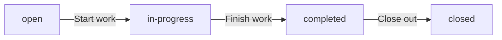


### Timesheet Approval Workflow

Timesheets follow a defined approval workflow with four statuses.

| Status | Description |
|--------|-------------|
| Draft | The timesheet is being assembled and can be modified |
| Submitted | The timesheet has been submitted for review |
| Approved | The timesheet has been approved and timelogs are locked |
| Rejected | The timesheet was rejected and returns to draft |

A timesheet is created in draft status, automatically including all timelogs for the employee in that week. The employee can add or remove timelogs from a draft timesheet before submitting. When submitted, the timesheet moves to submitted status, and the employee can no longer modify it. Users with timesheet approval permissions can then review submitted timesheets and either approve or reject them.

Approval locks all included timelogs, preventing further edits or deletions by any user. Rejection returns the timesheet to draft status with the rejection reason recorded; the employee can then modify and resubmit the timesheet.

```mermaid
flowchart LR
    A["draft"] -->|"Submit"| B["submitted"]
    B -->|"Approve"| C["approved"]
    B -->|"Reject"| A
```


### Employee Status Changes

Employees in an organization have two possible statuses governing their ability to perform actions.

| Status | Description |
|--------|-------------|
| Active | The employee can log time, submit timesheets, and access organizational data |
| Deactivated | The employee cannot log time or submit timesheets |

When an employee is first added to an organization, their status is active. Users with employee management permissions can deactivate an employee, which prevents the employee from logging time or submitting timesheets. Deactivation does not remove the employee's historical data—existing timelogs and timesheets are preserved. Deactivated employees can be reactivated by users with employee management permissions, restoring their ability to log time and submit timesheets.

```mermaid
flowchart LR
    A["active"] -->|"Deactivate"| B["deactivated"]
    B -->|"Reactivate"| A
```


### Timer Workflow

The live timer feature follows a simple workflow for real-time tracking.

| Phase | Description |
|-------|-------------|
| Not running | No active timer exists for the employee |
| Running | The timer is actively tracking elapsed time |
| Stopped | The timer has been stopped and a timelog was created |
| Discarded | The timer has been discarded and no timelog was created |

An employee can start a timer when no timer is currently running, selecting a project and optionally a task. While running, the employee can edit the timer's description, project, or task. Employees can have at most one active timer at any given time.

Stopping the timer creates a timelog with the calculated duration, rounded to the nearest minute. Discarding the timer removes it without creating any timelog. If an employee forgets to stop their timer, it continues running indefinitely with no automatic stop mechanism.

```mermaid
flowchart LR
    A["not running"] -->|"Start"| B["running"]
    B -->|"Stop"| C["stopped — timelog created"]
    B -->|"Discard"| D["discarded — no timelog"]
    C -->|"Next timer"| A
    D -->|"Next timer"| A
```


### Contract Lifecycle Transitions

Employee contracts track employment terms over time with state driven by their active status.

| State | Description |
|-------|-------------|
| Active | The contract governs the employee's current engagement |
| Ended | The contract has an end date and is a historical record |

An employee can have only one active contract at any time. When a new contract is created for an employee, the previous active contract (if any) is automatically ended by setting its end date to the day before the new contract's start date. Past contracts become immutable historical records and cannot be edited. The current active contract can be edited by users with employee management permissions. Ended contracts preserve the original terms agreed upon during that period.

```mermaid
flowchart LR
    A["active"] -->|"New contract created"| B["ended"]
```