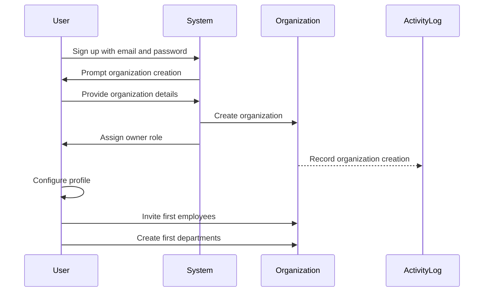
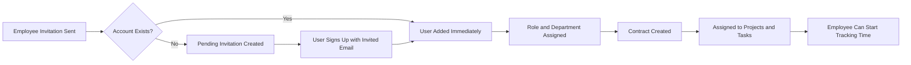
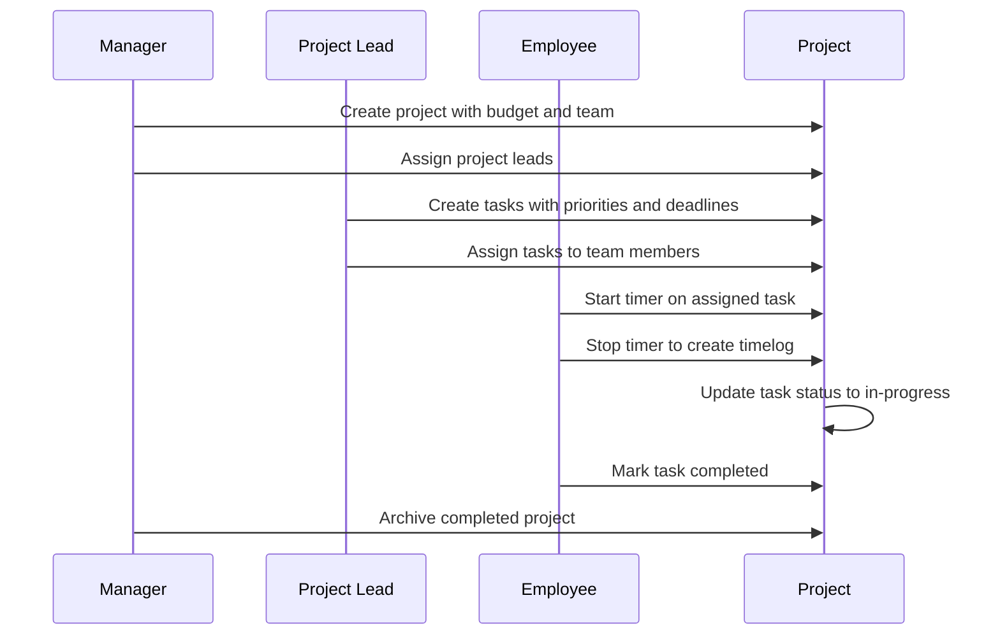
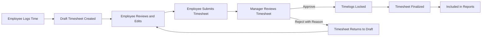
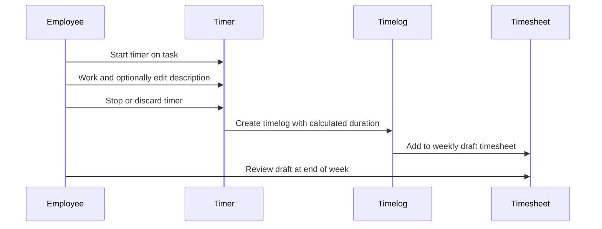
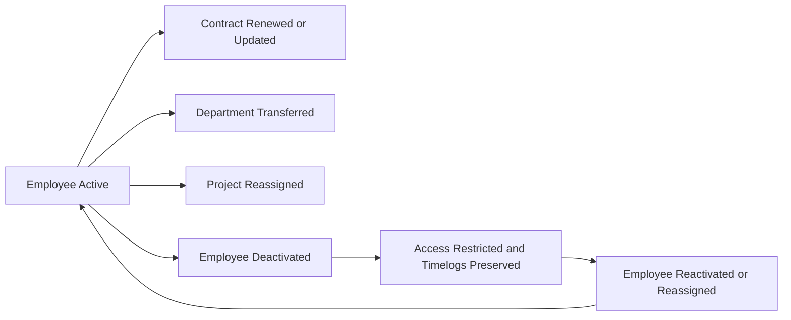

**hrmPlatform — What operations users can perform, use cases, business workflows**

What operations users can perform, use cases, business workflows

# Core Business Operations

What the system must do for each business concept.

## Organization Operations

Users initiate platform adoption by creating an organization during the initial sign-up process, defining its foundational identity through a name, description, logo image, currency, timezone, and fiscal start month. Organization owners possess full authority to update these organizational settings to align with evolving business needs. Owners are empowered to permanently delete their organization, but this destructive action strictly requires that all pending timesheets are resolved and zero active employee contracts exist. Upon deletion, every associated employee, project, task, timelog, and timesheet is permanently purged from the platform. The owner's personal account remains intact but is automatically detached from any organizational affiliation. Every organizational dataset remains completely isolated, preventing users in one organization from accessing or interacting with data belonging to separate organizations.

### Organization Creation and Configuration

WHEN a user initiates registration, THE system SHALL create an organization with a name, description, logo image, currency code, timezone, and fiscal start month.

WHERE the user provides valid organizational details, THE system SHALL create the organization and assign the user as owner.

WHEN an organization owner requests to update organizational settings, THE system SHALL allow editing of the organization name, description, logo image, currency code, timezone, and fiscal start month.

WHILE the organization exists, THE system SHALL maintain the configured currency and timezone settings for all organization operations.

### Organization Deletion Operations

WHEN an organization owner requests to delete their organization, THE system SHALL require that all pending timesheets are resolved as approved or rejected.

IF active employee contracts exist, THEN THE system SHALL prevent organization deletion.

WHEN an organization is permanently deleted, THE system SHALL purge all associated employees, projects, tasks, timelogs, and timesheets.

WHEN an organization is deleted, THE system SHALL retain the owner's account but SHALL detach it from any organizational affiliation.

### Organizational Data Isolation

WHILE an organization exists, THE system SHALL enforce complete data isolation between all organizations.

THE system SHALL prevent employees in one organization from accessing or interacting with data belonging to separate organizations.

WHEN a user belongs to multiple organizations, THE system SHALL scope all operations and data visibility to the currently selected organization context.

WHERE a user switches organizations without logging out, THE system SHALL update the active organization context for all subsequent operations.

# Error Scenarios and Edge Cases

Business-level error scenarios, edge case coverage, and expected system behaviors for exceptional conditions.

## Organization Error Scenarios

When an owner attempts to delete an organization, the system immediately checks for pending timesheets and active contracts. Deletion is blocked if any timesheets are pending approval or rejection, ensuring financial workflows are properly resolved first. If active employee contracts exist, the deletion request fails because ongoing employment agreements must conclude or be terminated before organization removal. Users attempting to delete their account while being the sole owner must transfer ownership to another employee first, preventing orphaned organizational data. Organization creation with missing name or invalid currency format triggers immediate rejection errors. Fiscal month selection outside valid calendar ranges results in validation failures. Multi-tenancy boundaries strictly prevent cross-organization data access, blocking any unauthorized access attempts. Switching organization context with invalid selection parameters causes validation errors. Unauthenticated requests to organization management endpoints result in immediate access denied responses. Duplicate organization names within the same tenant context trigger naming conflict errors.

### Organization Deletion Safeguards

WHEN an owner attempts to delete an organization with pending timesheets awaiting approval or rejection, THE system SHALL block the deletion and reject the request. Organization deletion cannot proceed while any timesheets remain unresolved. Employees and managers must first approve or reject all pending timesheets before the owner can proceed with organization deletion. This prevents incomplete financial workflows from being lost and ensures payroll-related data reaches its final state.

WHEN an owner attempts to delete an organization while active employee contracts exist, THE system SHALL prevent the removal and reject the deletion request. Ongoing employment agreements must be concluded or terminated before organization deletion can proceed. The system blocks deletion to prevent orphaned contract records and ensure all active employment relationships are properly closed. Past-concluded contracts do not block organizational deletion.

BEFORE allowing organization deletion, THE system SHALL perform deletion safeguard validation by checking all unresolved organizational dependencies. The validation process verifies that no pending timesheets remain unprocessed, no active employee contracts exist, and all financial workflows have reached their final states. Only when all safeguards pass does the system permit the deletion to proceed. If any safeguard fails, the system prevents the deletion and indicates which dependencies must be resolved first.

IF a deletion request for an organization with unresolved financial workflows is submitted, THEN THE system SHALL reject the request and require all pending timesheets to be resolved before the organization can be removed. Financial workflow resolution requires all pending timesheets to be either approved or rejected. The system does not allow financial records in incomplete states when organizational data is permanently removed.

WHEN a user who is the sole owner of an organization attempts to delete their account, THE system SHALL enforce a sole owner transfer requirement. The owner must transfer organization ownership to another employee or delete the organization entirely before their account deletion can proceed. This prevents organizational data from becoming orphaned when the only owner attempts to leave the platform. An organization without any owners cannot exist in the system.

### Organization Creation Validation

IF an organization creation request has a missing organization name, THEN THE system SHALL reject the request with a validation error. The organization name is a required field, and users cannot create an organization without providing one. All other organization settings such as description and logo are optional.

IF a user creates an organization using a format for currency that deviates from valid currency codes recognized by the system, THEN THE system SHALL reject the submission with a formatting error. Valid currencies follow standard codes such as USD, EUR, or KRW.

IF an organization creation request specifies a fiscal start month outside the valid calendar month range of 1 through 12, THEN THE system SHALL reject the request with a fiscal month validation failure. The fiscal start month must fall within standard calendar months.

IF an organization creation request references a calendar month value that does not correspond to a valid month in the standard calendar, THEN THE system SHALL reject the request with a validation error. Only standard calendar months (1 through 12) are accepted for fiscal month configuration.

IF an organization creation request uses a duplicate name that already exists within the same tenant context, THEN THE system SHALL reject the request with a naming conflict error. Each organization must have a unique name to prevent confusion between organizational entities within the same multi-tenant environment.

### Organization Access Control

WHEN users attempt to access organization data outside their assigned organizational boundaries, THE system SHALL deny the request and enforce multi-tenancy isolation. Multi-tenancy access isolation ensures that employees in one organization cannot see data from another organization, maintaining strict data boundaries between organizational tenants. Users belonging to multiple organizations only see data for their currently selected organization context.

IF users submit a request to switch their organization context with an invalid or unavailable target organization parameter, THEN THE system SHALL reject the request with a validation error and preserve the user's current organizational context. Organization context switch errors prevent users from selecting organizations they do not belong to or referencing non-existent organization identifiers.

IF users attempt organization management operations without appropriate permissions, THEN THE system SHALL deny access and reject the request with an unauthorized management access error. Only users with proper organizational roles and permissions can perform management operations like editing organization settings or managing roles. For example, only organization owners can edit organization settings or manage roles.

IF unauthenticated users attempt to access organization management endpoints, THEN THE system SHALL deny the request with an access denial response. Unauthenticated access is prevented by requiring valid email and password credentials before users can interact with organization management features. No organization data is accessible without proper authentication.

## User Error Scenarios

Users attempting to log in with incorrect credentials receive immediate generic security feedback to prevent credential enumeration attacks. Account deletion is blocked if the user is the sole owner of any organization, requiring ownership transfer before removal. Logging into a non-existent organization context blocks access because the system cannot validate organizational membership. Switching organization contexts with invalid parameters triggers validation errors that prevent unauthorized navigation. Password change attempts without proper authorization or with weak password policies result in rejection errors. Providing an invalid email format during account creation or profile updates blocks the operation entirely. Accessing another organization's data triggers strict data isolation denials for the specific restricted request. Profile edits missing required display name fields result in validation failures. Duplicate email addresses during sign-up trigger unique constraint errors. Attempting to access organization resources without active session context blocks all subsequent operations.

### Incorrect Login Credentials Feedback

WHEN a member enters an incorrect email address or password during login, THE system SHALL reject authentication and display a generic error message indicating that the credentials do not match.

WHEN login fails due to wrong credentials, THE system SHALL not specify whether the email address is registered or the password is incorrect.

WHEN a member repeatedly attempts login with wrong credentials, THE system SHALL continue to return the same generic error without revealing partial credential validity.

### Sole Owner Deletion Restriction

WHEN a member requests to delete their account and is the sole owner of an organization, THE system SHALL block the account deletion.

IF a member is the sole owner of an organization, THEN THE system SHALL require them to either transfer ownership to another member or delete the organization before account deletion can proceed.

WHEN a sole owner transfers organization ownership to another member, THE system SHALL allow the account deletion request to proceed.

### Invalid Organization Context Blocking

WHEN a member attempts to log in and select an organization that does not exist, THE system SHALL block access and prevent entry into that organization context.

WHEN a member has no valid organization context after login, THE system SHALL prevent all organization-scoped operations until a valid organization is selected.

IF an organization is deleted while a member currently has it selected as their context, THEN THE system SHALL invalidate that context and require the member to select another organization.

### Unauthorized Password Changes

WHEN someone attempts to change a password without being authenticated, THE system SHALL reject the request.

WHEN a member attempts to change the password of another user, THE system SHALL deny the operation.

WHEN a member submits a password change with no new password value, THE system SHALL reject the request and require a valid password.

### Invalid Email Format Rejection

WHEN a guest attempts to sign up with an email address that does not conform to a valid email format, THE system SHALL reject the registration.

WHEN a member updates their profile with an improperly formatted email address, THE system SHALL reject the profile update.

WHEN employee invitations are sent with email addresses that fail format validation, THE system SHALL reject the invalid invitations.

### Cross-Organization Data Isolation

WHEN a member belongs to multiple organizations, THE system SHALL restrict all data access to the currently selected organization only.

IF a member attempts to access resources from an organization they do not belong to, THEN THE system SHALL deny the request.

WHEN a member switches to a different organization context, THE system SHALL update all subsequent data queries to scope to the newly selected organization.

### Missing Display Name Validation

WHEN a member creates a new account without providing a display name, THE system SHALL reject the sign-up completion.

WHEN a member submits a profile update with an empty or removed display name, THE system SHALL reject the update.

WHEN a display name consists only of whitespace characters, THE system SHALL treat it as missing and reject the profile update.

### Duplicate Email Sign-Up Conflict

WHEN a guest attempts to sign up with an email address that is already registered to an existing account, THE system SHALL reject the sign-up.

WHEN multiple concurrent sign-up requests use the same email address, THE system SHALL process the first request and reject all subsequent duplicates.

### Inactive Session Access Denial

WHEN a session expires due to inactivity, THE system SHALL deny access to protected resources until the member re-authenticates.

WHEN a member's session becomes inactive, THE system SHALL block attempts to perform organization-scoped operations such as submitting timesheets or logging time entries.

WHEN a member logs out from the system, THE system SHALL invalidate their session and prevent further operations.

### Organization Context Switch Error

WHEN a member attempts to switch to an organization where they do not have active membership, THE system SHALL reject the context switch.

WHEN a member whose organization membership was deactivated attempts to switch back to that organization, THE system SHALL deny the switch.

WHEN a member tries to switch to an organization that has been deleted, THE system SHALL block the switch and remove the deleted organization from their available options.

### Unauthorized Resource Access

WHEN a member attempts to perform an operation without the required permission, THE system SHALL deny access and indicate insufficient permissions.

WHEN a member without employee management permission tries to add, edit, or deactivate employees, THE system SHALL block the action.

WHEN a member without timesheet approval permission tries to approve or reject timesheets, THE system SHALL deny the operation.

WHEN a member without project management permission tries to create, edit, or delete projects, THE system SHALL reject the action.

### Weak Policy Password Rejection

WHEN a member submits a new password that is empty during a password change attempt, THE system SHALL reject the change.

WHEN a member changes their password to the same value as their current password, THE system SHALL reject the change and require a different password.

### Missing Session Context Block

WHEN a user attempts to perform organization-scoped operations without an active session, THE system SHALL block the operation and require authentication.

WHEN a member attempts to create a timelog without a valid session, THE system SHALL deny the creation.

WHEN session context is lost, THE system SHALL require the member to re-login before continuing any operation.

### Invalid Membership Validation

WHEN an employee's organization membership is deactivated, THE system SHALL block their ability to log time or submit timesheets within that organization.

WHEN a user with a terminated organization membership attempts to access that organization's resources, THE system SHALL deny access and inform the user of their invalid membership.

WHEN a member is removed from a project but their organization membership remains active, THE system SHALL block their access to that project's tasks and timelogs.

### Credential Enumeration Prevention

WHEN a member enters wrong credentials during login, THE system SHALL return the same generic error message regardless of whether the email exists or the password is incorrect.

IF login is attempted with an unregistered email address, THEN THE system SHALL not indicate that the email is not found, but instead return the same credential mismatch message.

WHEN login is attempted with a registered email but wrong password, THE system SHALL not confirm that the email exists, only that the credentials do not match.

## Employee Error Scenarios

Inviting employees with invalid email addresses fails immediately, preventing malformed invitation records in the system. Deactivating members who have active contracts blocks the operation because ongoing employment agreements must resolve first. Re-activating employees outside the proper organizational scope triggers permission denied errors. Editing employee details without the required employee:manage permission denies the modification request entirely. Inviting an already active employee with the same email results in membership conflict errors. Providing an invalid department during assignment triggers assignment validation failures. Deleting employee records with historical timelogs and timesheets preserves previous data rather than deleting it entirely. Attempting to modify employment type without authorization results in permission denied errors. Assigning employees to non-existent departments causes reference validation failures. Activating deactivated employees with conflicting active contracts blocks the activation process.

### Invitation Validation Failures

IF a user attempts to invite an employee using a malformed or invalid email address, THEN THE system SHALL reject the invitation request.
IF a user attempts to invite an employee using an email address that already belongs to an active employee in the same organization, THEN THE system SHALL reject the request due to duplicate invitation conflict.

### Active Contract Deactivation Block

IF a user attempts to deactivate an employee who holds an active contract, THEN THE system SHALL block the deactivation operation.
IF an active contract exists for the target employee, THEN THE system SHALL require the active employment agreement to be terminated before allowing deactivation.

### Unauthorized Modification and Access Attempts

IF a user without the employee:manage permission attempts to deactivate an employee, THEN THE system SHALL deny the re-activation attempt.
IF a user without the employee:manage permission attempts to re-activate a previously deactivated employee, THEN THE system SHALL deny the request.
IF a user without the employee:manage permission attempts to modify employee details, THEN THE system SHALL deny unauthorized detail modification.

### Invalid Department and Membership Scope Errors

IF a user attempts to assign an employee to a department that does not exist, THEN THE system SHALL reject the assignment due to non-existent department reference failure.
IF a user attempts to invite or assign an employee outside their valid organizational membership scope, THEN THE system SHALL deny the operation as an invalid membership scope error.

### Deactivated Employee Access Restrictions

WHILE an employee has active status, employees MAY log time and submit timesheets.
WHILE an employee is deactivated, THE system SHALL restrict access to time logging functionality.
WHILE an employee is deactivated, THE system SHALL restrict access to timesheet submission functionality.

### Contract Activation Conflict and Data Preservation

IF a user attempts to activate or re-activate an employee who has a conflicting active contract from a different context, THEN THE system SHALL block the conflicting contract activation.
IF an employee is deactivated, THEN THE system SHALL preserve all historical timelogs and timesheets associated with that employee rather than deleting them.

## Department Error Scenarios

Creating departments without the required org:manage permission results in immediate access denied responses. Deleting departments when employees are assigned automatically sets their department reference to null rather than blocking the deletion. Editing inactive departments restricts further assignment operations to prevent data inconsistency. Attempting to assign a department to a deactivated employee triggers a validation error because inactive members cannot receive organizational assignments. Deleting departments with multiple active employees forces null assignment for all affected members simultaneously. Providing an invalid parent department during nesting operations blocks the hierarchical structure creation request. Editing department details without proper authorization denies the modification request entirely. Creating departments with duplicate names within the same organizational hierarchy triggers naming conflict errors. Assigning employees to deleted departments causes reference validation failures. Deleting unassigned departments without proper permission results in authorization denied errors.

### Department Permission and Authorization Errors

IF a user lacks the org:manage permission, THEN THE system SHALL deny the department creation request.
IF a user attempts to modify department details without proper authorization, THEN THE system SHALL deny the modification request entirely.
IF a user attempts to delete an unassigned department without proper permission, THEN THE system SHALL result in authorization denied errors.

### Department Deletion and Employee Assignment Errors

WHEN a department is deleted, THE system SHALL automatically set the employee's department reference to null rather than blocking the deletion.
IF a department is inactive, THEN THE system SHALL restrict further assignment operations to prevent data inconsistency.
IF an attempt is made to assign a department to a deactivated employee, THEN THE system SHALL trigger a validation error because inactive members cannot receive organizational assignments.
WHEN a department with multiple active employees is deleted, THE system SHALL force null assignment for all affected members simultaneously.
IF a member is inactive, THEN THE system SHALL prevent the assignment of that member to a department.

### Department Hierarchy and Naming Validation Errors

IF an invalid parent department is provided, THEN THE system SHALL block the hierarchical structure creation request.
IF a department with a duplicate name within the same organizational hierarchy is created, THEN THE system SHALL trigger a naming conflict error.
IF an employee is assigned to a deleted department, THEN THE system SHALL cause reference validation failures.

## Role Error Scenarios

Editing roles without the required org:manage permission results in immediate authorization denied responses. Deleting built-in roles triggers strict validation failure because system roles maintain platform functionality integrity. Assigning non-existent roles to employees results in permission denial errors that prevent invalid role mappings. Editing custom roles with active employee assignments blocks the modification to prevent cascading permission issues. Attempting to remove the last built-in role triggers an immediate system halt because minimum role structures must exist. Providing an invalid role name during custom role creation blocks the request with validation failure messages. Assigning deleted roles to new employees triggers immediate fallback errors during membership creation. Creating duplicate role names within the same organization triggers naming conflict validation errors. Modifying role permissions without proper authorization denies the permission set changes entirely. Removing roles assigned to active project leads blocks the deletion because operational continuity is preserved.

### Permission Validation Denials

WHEN a user without the employee:manage permission attempts to assign a role to an employee, THE system SHALL reject the role assignment request.

WHEN a user without the employee:manage permission attempts to change an employee's assigned role, THE system SHALL reject the role change request.

WHEN a user without the employee:manage permission attempts to modify the permission set of a custom role, THE system SHALL reject the modification and deny access.

WHEN a non-owner user attempts to edit a built-in role's permission set, THE system SHALL reject the modification request.

WHEN a user without the org:manage permission attempts to create a custom role, THE system SHALL reject the role creation request.

### Built-in Role Protection

WHEN any user attempts to delete the Owner built-in role, THE system SHALL reject the deletion to preserve system role integrity.

WHEN any user attempts to delete the Manager built-in role, THE system SHALL reject the deletion to preserve system role integrity.

WHEN any user attempts to delete the Employee built-in role, THE system SHALL reject the deletion to preserve system role integrity.

WHEN a user attempts to edit the permission set of a built-in role, THE system SHALL reject the modification to maintain system role integrity.

WHEN an organization contains only built-in roles and a user attempts to remove all built-in roles, THE system SHALL reject the removal to maintain minimum role structures.

### Reference Validation Errors

WHEN a user attempts to assign a role that no longer exists to an employee, THE system SHALL reject the assignment due to a deleted role reference.

WHEN a user attempts to assign a role that was never created to an employee, THE system SHALL reject the assignment as invalid.

WHEN an employee invitation specifies a role that has been deleted, THE system SHALL reject the membership creation as a deleted role reference error.

WHEN an employee record is created without a valid role assignment, THE system SHALL reject the record creation as a missing role assignment error.

WHEN a bulk role assignment operation references a role that does not exist in the organization, THE system SHALL reject the operation due to invalid role references.

### Duplicate Naming Rejections

WHEN a user creates a custom role with a name matching an existing role in the same organization, THE system SHALL reject the creation due to a duplicate naming conflict.

WHEN a user edits a custom role name to match another existing role name in the same organization, THE system SHALL reject the name change due to a duplicate naming conflict.

WHEN a user creates a custom role with an empty name, THE system SHALL reject the creation as an invalid role name.

WHEN a bulk role creation attempt contains duplicate role names, THE system SHALL reject the duplicates due to naming conflicts.

### Active Assignment Modification Blocks

WHEN a custom role has active employee assignments and the owner attempts to delete it, THE system SHALL reject the deletion to preserve operational continuity.

WHEN a custom role has active employee assignments and the owner attempts to modify its permission set, THE system SHALL reject the modification to prevent cascading permission disruptions.

WHEN a user attempts to delete a role assigned to one or more project leads, THE system SHALL reject the deletion to preserve project leadership continuity.

WHEN a user attempts to modify a role assigned to project leads in a way that would remove project management permissions, THE system SHALL reject the modification to preserve project leadership capabilities.

IF a custom role has no active employee assignments, THEN THE system SHALL allow the role deletion.

IF a custom role has no active employee assignments, THEN THE system SHALL allow the role modification.

## Contract Error Scenarios

Creating contracts without the required pay rate results in immediate validation failure because compensation details are mandatory. Editing past contracts blocks all modifications because historical employment records remain immutable for audit compliance. Overlapping contract dates during new creation triggers validation errors that prevent duplicate employment periods. Attempting to create contracts without start dates blocks the creation process entirely. Editing active contracts outside the valid modification scope denies the request to protect current employment terms. Providing an invalid pay period format results in validation rejection during contract configuration. Attempting to modify past employment terms triggers historical record preservation blocks. Creating contracts with future start dates beyond organizational policies blocks the creation request. Deleting contracts with associated historical timelogs prevents deletion to maintain employment record integrity. Modifying contract pay rates without employee:manage permission denies the compensation change request.

### Missing Mandatory Fields Rejection

WHEN an employee contract creation is attempted without a pay rate, THE system SHALL perform missing pay rate creation rejection because compensation details are required.

WHEN an employee contract creation is attempted without a start date, THE system SHALL perform missing start date creation prevention because the start date is mandatory.

IF a contract configuration lacks the required compensation value, THEN THE system SHALL enforce missing compensation mandatory requirement, blocking submission until a pay rate is provided.

### Invalid Pay Period Format Validation

WHEN a contract is configured with a pay period value that does not match allowed options (hourly, daily, weekly, monthly), THEN THE system SHALL trigger invalid pay period format rejection to prevent contract creation with unrecognized periods.

### Overlapping and Duplicate Period Validation

WHEN a new contract is created with dates that overlap an existing active contract for the same employee, THEN THE system SHALL execute overlapping dates validation block to prevent conflicting employment periods.

WHEN a contract date range duplicates an existing contract period for the same employee, THEN THE system SHALL trigger duplicate period validation failure to prevent duplicate records and maintain data consistency.

### Future Date Policy Validation

WHEN a contract creation request specifies a start date beyond the organization's allowed future date range, THEN THE system SHALL enforce future date policy creation rejection based on organizational date policies.

### Historical Contract Immutability

WHEN an attempt is made to modify any field of a past contract that has ended, THEN THE system SHALL enforce past contract modification immutability to preserve historical records.

WHEN past employment terms are targeted for editing, THEN THE system SHALL execute historical term modification block to maintain the integrity of completed contracts.

WHEN historical contract records are targeted for alteration, THEN THE system SHALL ensure employment record preservation, ensuring historical employment terms remain unchanged to maintain an accurate historical trail.

WHEN past contract records are targeted for alteration preventing updates to pay rates, working hours, and other terms, THEN THE system SHALL enforce immutable historical protection, denying the request to preserve the audit trail.

### Active Contract Editing Scope

WHEN an attempt is made to edit an active contract outside the allowed modification scope, THEN THE system SHALL execute out-of-range active contract editing, denying the request to protect current employment terms.

### Associated Log Deletion Protection

WHEN an attempt is made to delete a contract that has associated historical timelogs, THEN THE system SHALL trigger associated log deletion prevention to maintain employment record linkage and integrity.

### Unauthorized Contract Modification

WHEN a user without the employee:manage permission attempts to modify a contract pay rate, THEN THE system SHALL deny unauthorized pay rate modification to protect compensation data.

WHEN a user without the employee:manage permission attempts to change any employment terms on a contract, THEN THE system SHALL block unauthorized employment term change to maintain employment agreement integrity.

## Project Error Scenarios

Creating projects without a required name results in immediate validation failure because project identification is mandatory. Deleting projects with existing timelogs triggers strict block responses to preserve time tracking history. Archiving already archived projects results in status conflict errors that prevent redundant state changes. Attempting to delete projects with active timelog entries strictly blocks the operation to maintain data integrity. Providing an invalid color code during project creation triggers format rejection during configuration. Editing archived projects outside the allowed modification scope denies the request entirely. Creating projects with missing color codes blocks the creation process due to UI display requirements. Attempting to modify project status without proper authorization denies the status transition request. Deleting projects with budget tracking history blocks deletion to preserve financial reporting data. Creating duplicate project names within the same organization triggers naming conflict validation errors.

### Missing Project Name Validation Failure

WHEN a user attempts to create a project without providing a project name, THEN THE system SHALL reject the creation request and display an error indicating that the project name is required. The project name serves as the primary identification requirement for organizational reference, ensuring every project has a clear identifier for task assignment and time tracking.

### Missing Color Code UI Requirement

WHEN a user attempts to create a project without providing a color code, THEN THE system SHALL reject the creation request because a color code is required for UI display. Color codes provide visual differentiation for projects in dashboards and lists; without it, the project entry is incomplete for user interface rendering purposes.

### Invalid Color Code Creation Rejection

WHEN a user provides an invalid color code during project creation, THEN THE system SHALL reject the request with an error indicating the value is invalid. The system validates color code input to ensure it meets necessary criteria for visual display, preventing projects with unusable color data from being created.

### Duplicate Name Organization Conflict

WHEN a user attempts to create a project with a name that already exists within the same organization, THEN THE system SHALL reject the request with a naming conflict error. Unique project names within an organization are required to prevent ambiguity in task allocation, timelog assignment, and reporting, ensuring clear separation between distinct projects.

### Active Timelog Deletion Prevention

WHEN a user attempts to delete a project that has associated timelog entries, THEN THE system SHALL block the deletion with a strict block response. This active timelog deletion prevention preserves time tracking history and ensures that work records associated with a project are not orphaned or lost, maintaining data integrity preservation for reporting purposes.

### Budget History Deletion Block

WHEN a user attempts to delete a project that has recorded budget tracking history, THEN THE system SHALL block the deletion operation. Budget history serves as the financial history protection for the project's resource management; deletion is prohibited to prevent gaps in financial reporting and to maintain data integrity preservation.

### Status Transition Authorization Denied

WHEN a user without the project manage permission attempts to modify a project status, THEN THE system SHALL deny the status transition request. Any unauthorized project status transition is blocked immediately to ensure lifecycle changes such as archiving or completing are controlled and managed only by authorized personnel.

### Archival Status Conflict Error

WHEN a user attempts to archive a project that is already archived, or complete a project that is already completed, THEN THE system SHALL reject the request with an archival status conflict error. Redundant status actions provide no functional value, and the system prevents unnecessary operations to maintain a clear project lifecycle state.

### Archived Modification Restriction

WHEN a user attempts to modify an archived or completed project, THEN THE system SHALL restrict modifications that would alter the project's historical record. This archived modification restriction prevents users from adding new timelogs or tasks to closed projects, ensuring that archived scope modification denial preserves the project's final state for historical reporting.

## ProjectMembership Error Scenarios

Assigning employees to projects outside their organization triggers strict cross-organization boundary blocks. Removing project memberships without proper permission results in immediate authorization denied responses. Attempting to assign employees to non-existent projects triggers project reference validation errors during membership creation. Deleting project memberships with active timelogs strictly blocks the operation to preserve time tracking attribution. Providing invalid project references during membership assignment blocks the creation process entirely. Assigning deactivated employees to active projects triggers status validation errors that prevent inactive member assignments. Removing memberships outside the allowed organizational scope denies the modification request entirely. Creating project memberships for users without employee status triggers membership role validation failures. Deleting memberships with pending timesheet associations blocks removal to maintain approval workflow integrity. Assigning multiple memberships to the same employee triggers duplicate assignment validation errors.

### Permission-Required Assignment and Modification

WHEN a user with the project:manage permission attempts to assign an employee to a project within the same organization, THE system SHALL create the project membership.

WHEN a user without the project:manage permission attempts to assign an employee to a project, THE system SHALL deny the assignment.

IF a user attempts to modify a project membership without the project:manage permission, THEN THE system SHALL deny the modification.

WHEN a user without the required permission attempts to create or modify a project membership, THEN THE system SHALL reject the operation.

### Cross-Organization Boundary Enforcement

WHEN a user attempts to assign an employee to a project outside their current organization context, THEN THE system SHALL reject the assignment.

IF a project membership creation request crosses organizational boundaries, THEN THE system SHALL enforce strict boundary enforcement and block the operation.

WHEN a user attempts to modify a project membership belonging to a different organization, THEN THE system SHALL deny the modification across the organizational scope.

### Invalid Project Reference Handling

WHEN a user attempts to assign an employee to a project that does not exist, THEN THE system SHALL reject the membership creation.

IF an invalid project reference is provided during membership assignment, THEN THE system SHALL block the creation process.

WHEN a project identifier cannot be resolved to an active project within the organization, THEN THE system SHALL deny the membership creation.

### Deactivated Employee Assignment Prevention

WHEN a user attempts to assign a deactivated employee to a project, THEN THE system SHALL reject the assignment.

IF an employee's status is deactivated, THEN THE system SHALL prevent that employee from being assigned to any project.

WHEN an inactive employee is targeted for project assignment, THEN THE system SHALL block the membership creation.

### Duplicate Membership Validation

IF a user attempts to assign an employee to a project where that employee already holds an active membership, THEN THE system SHALL reject the duplicate assignment.

WHEN a duplicate project membership is detected for the same employee and project combination, THEN THE system SHALL block the creation.

IF an attempted assignment would create a second membership for the same employee within the same project, THEN THE system SHALL raise a validation conflict.

### Employee Role Validation

IF a user attempts to assign someone who is not an employee in the current organization to a project, THEN THE system SHALL reject the membership creation.

WHEN a membership creation request references a user without valid employee status in the organization, THEN THE system SHALL deny the assignment.

IF the target user does not have an active employee record, THEN THE system SHALL block the project membership creation.

### Permission-Required Membership Removal

WHEN a user with the project:manage permission attempts to remove an employee from a project, THE system SHALL remove the membership.

IF a user without the project:manage permission attempts to remove a project membership, THEN THE system SHALL deny the removal.

WHEN a membership removal request is made by a user lacking the proper permission, THEN THE system SHALL reject the operation.

### Active Timelog Removal Prevention

WHEN a user attempts to remove a project membership that has associated timelogs, THEN THE system SHALL block the removal to preserve time tracking attribution.

IF active timelogs exist under a project membership being removed, THEN THE system SHALL deny the membership deletion.

WHEN a project membership removal would orphan existing timelogs, THEN THE system SHALL prevent the removal operation.

### Pending Timesheet Removal Block

WHEN a user attempts to remove a project membership with associated pending or submitted timesheets, THEN THE system SHALL block the removal to maintain approval workflow integrity.

IF pending timesheets reference timelogs tied to a project membership being removed, THEN THE system SHALL deny the membership deletion.

WHEN membership removal would disrupt the approval workflow for pending timesheets, THEN THE system SHALL preserve the membership and reject the operation.

## Task Error Scenarios

Creating tasks without a required title results in immediate validation failure because task identification is mandatory. Assigning tasks to projects outside the user's organizational context triggers project assignment denial errors. Providing invalid priority level selections blocks task creation until valid priority values are specified. Creating tasks with parent task references beyond the allowed one-level nesting results in hierarchical structure validation errors. Assigning tasks to non-existent projects triggers project reference validation failures during task creation. Editing task assignments without proper project:manage permission denies the modification request entirely. Creating tasks for archived projects blocks assignment because inactive projects cannot receive new work items. Modifying task status transitions without proper authorization denies the status change request. Deleting tasks with associated timelogs blocks deletion to preserve time tracking history. Assigning tasks to employees outside the project membership triggers assignment scope validation errors.

### Missing Task Title Validation Failure

WHEN a user submits a task creation request without providing a title, THE system SHALL reject the request and return a validation error requiring the title.

WHEN a user attempts to edit an existing task and removes the title, THE system SHALL block the update and return a validation error requiring restoration of the title.

The title is a mandatory field for task identification. Tasks cannot be created or modified without a title value present.

### Cross-Organizational Project Assignment Denial

WHEN a user attempts to create a task under a project belonging to a different organization than their current organization context, THE system SHALL deny the creation and return a cross-organizational assignment error.

All tasks must be scoped within the user's currently selected organization. Multi-tenancy isolation prevents cross-organizational task creation regardless of user membership in multiple organizations.

### Invalid Priority Level Creation Block

WHEN a user creates a task with a priority value outside the valid set of low, medium, high, and urgent, THE system SHALL block creation and return an invalid priority error.

Task priority must be exactly one of the four defined levels. Any unrecognized priority value prevents task creation until a valid selection is provided.

### Excessive Nesting Structure Validation Error

WHEN a user attempts to create a subtask under a parent task that itself has a parent task, THE system SHALL reject the request and return a nesting depth validation error.

Task hierarchy supports only one level of nesting. Subtasks cannot be assigned their own subtasks, enforcing a flat parent-child relationship at a single nesting depth.

### Non-Existent Project Reference Failure

WHEN a user creates a task referencing a project that does not exist in the system, THE system SHALL reject the creation and return a non-existent project reference error.

WHEN a user attempts to reassign a task to a deleted project, THE system SHALL deny the reassignment and return a non-existent project reference error.

Tasks must reference valid, existing projects. References to non-existent or deleted project identifiers fail validation.

### Unauthorized Assignment Modification Denial

WHEN a user without project:manage permission attempts to change the employee assignment on a task, THE system SHALL deny the modification and return a permission error.

Task assignment changes require the project:manage permission or project lead status on the task's project. Users without these capabilities cannot modify task assignments.

### Archived Project Task Assignment Block

WHEN a user attempts to create a task for a project with archived or completed status, THE system SHALL block the creation and return an inactive project assignment error.

Project lifecycle rules restrict new task creation to active projects only. Archived and completed projects cannot accept new task assignments.

### Unauthorized Status Transition Denial

WHEN a user without project:manage permission and without project lead status attempts to change a task's status, THE system SHALL deny the transition and return a permission error.

Task status transitions require appropriate project-level permissions. Users lacking project:manage permission or project lead designation cannot modify task status values.

### Associated Timelog Deletion Prevention

WHEN a user attempts to delete a task that has timelogs associated with it, THE system SHALL block the deletion and return an associated timelog prevention error.

Tasks cannot be deleted while linked timelog records exist. Time tracking history preservation prevents removal of tasks with recorded work.

### Outside Membership Assignment Scope Error

WHEN a user attempts to assign a task to an employee who is not a member of the task's project, THE system SHALL deny the assignment and return a membership scope validation error.

Task assignments are restricted to employees with active membership in the task's project. Assignment attempts to non-members fail scope validation.

### Hierarchical Structure Validation Failure

WHEN a user creates a task with a parent task reference forming a circular dependency chain, THE system SHALL reject the creation and return a hierarchical structure validation error.

WHEN a user reassigns a task to a parent that would create a nesting cycle, THE system SHALL block the reassignment and return a hierarchical structure validation error.

Task hierarchy must remain acyclic. Circular parent-child references are prohibited to maintain valid task structures.

### Missing Permission Modification Denial

WHEN a user without project:manage permission and without project lead status attempts to edit any property of a task, THE system SHALL deny the modification and return a missing permission error.

Task editing is restricted to users with project:manage permission or project lead status on the task's project. All other modification attempts are denied.

### Inactive Project Work Prevention

WHEN a user attempts to log time on a task belonging to an inactive project, THE system SHALL block the timelog creation and return an inactive project prevention error.

WHEN a user starts a timer referencing a task in a project with archived or completed status, THE system SHALL reject the timer start and return an inactive project prevention error.

Inactive projects prevent new time tracking activity. Timelogs and timers cannot reference tasks in projects that are no longer accepting work.

### Time Tracking History Preservation

WHEN a task's project association changes, THE system SHALL preserve all historical timelogs without removing or unlinking them.

WHEN a task's status changes to completed or closed, THE system SHALL preserve all existing timelog associations.

Time tracking history remains immutable and linked to the original task context regardless of task modifications, status changes, or project reassignments.

### Project Membership Scope Validation

WHEN a task assignment operation is processed, THE system SHALL validate that the target employee holds active membership in the task's project.

This validation occurs as part of the assignment workflow, ensuring task assignments align with project membership records. Assignment succeeds only when both task and project membership validation pass.

## Timelog Error Scenarios

Logging time for projects the user is not assigned to triggers strict project assignment validation blocks. Submitting timelogs for non-existent projects results in project reference validation errors during time entry creation. Attempting to modify timelogs included in approved timesheets triggers immutable approval workflow blocks. Editing timelogs outside the allowed modification scope denies the modification request entirely. Providing invalid duration values during timelog creation blocks the entry until valid time measurements are specified. Logging time for archived projects blocks time entry because inactive projects cannot accumulate new hours. Creating timelogs without project associations triggers mandatory reference validation failures. Modifying timelog project assignments within submitted timesheets blocks the modification to maintain approval integrity. Deleting timelogs with pending timesheet associations prevents deletion to preserve submission workflow data. Logging negative duration values triggers format validation rejections during time entry creation.

### Timelog Error Scenarios and Validation Rules

THE system SHALL block time logging when an employee attempts to log time against a project to which they are not assigned.

THE system SHALL reject a timelog creation request when the selected project does not exist in the system.

THE system SHALL reject a timelog submission if the request does not include an associated project reference.

THE system SHALL prevent time logging on projects that have an archived or completed status.

THE system SHALL block the accumulation of new hours for projects marked as archived, completed, or inactive.

THE system SHALL reject timelog creation if the duration field is missing or contains non-numeric or unusable data.

THE system SHALL reject a timelog submission if the provided duration value is negative or zero.

THE system SHALL block timelog creation if the duration input does not conform to a valid numeric time measurement format.

THE system SHALL deny modification requests for timelogs when a user attempts to edit timelogs belonging to other employees without the permission to manage timelogs for any employee.

THE system SHALL block an employee from modifying or deleting another employee's timelog if they lack the specific permission to manage timelogs.

THE system SHALL enforce immutability on all timelogs included in a timesheet that has reached an approved status.

THE system SHALL preserve timelog data and prevent deletions for any timelog that is part of a submitted timesheet.

THE system SHALL block any modifications to timelogs that are currently included in a submitted timesheet.

THE system SHALL prevent the deletion of timelogs that are associated with a pending or submitted timesheet to maintain the integrity of the submission workflow.

THE system SHALL ensure that once a timesheet is submitted, the underlying timelog data remains locked from deletion until the approval process is complete or the timesheet is rejected.

### Timelog Validation and Immutability Rules

THE system SHALL reject a timelog creation request when the selected project is not found in the system.

THE system SHALL block time entry submission if the duration input does not conform to a valid numeric time measurement format.

THE system SHALL enforce immutability on all timelogs included in a timesheet that has reached an approved status.

THE system SHALL prevent time logging on projects that have an archived or completed status.

### Project Assignment and Status Constraints

THE system SHALL block time logging when an employee attempts to log time against a project to which they are not assigned.

THE system SHALL block the accumulation of new hours for projects marked as archived, completed, or inactive.

THE system SHALL ensure that once a timesheet is submitted, the underlying timelog data remains locked from deletion until the approval process is complete or the timesheet is rejected.

## Timesheet Error Scenarios

Submitting empty timesheets without included timelogs triggers strict validation failure because submission requires tracked time entries. Duplicate timesheet submissions for the same week result in duplicate period validation conflicts that block additional submissions. Approving timesheets outside the allowed manager scope denies the approval request due to permission restrictions. Submitting timesheets with missing required employee associations triggers ownership validation failures during submission. Rejecting timesheets without providing required rejection reasons blocks the approval workflow completion. Submitting timesheets for past periods outside the allowed submission window blocks the submission request entirely. Approving already approved timesheets triggers redundant approval workflow errors that prevent duplicate approvals. Deleting submitted timesheets blocks deletion because submitted workflows require proper rejection processing. Modifying timesheet status without proper time:approve permission denies the status transition request. Submitting timesheets with conflicting date ranges triggers calendar validation errors during submission processing.

### Empty Timesheet Submission Validation Block

WHEN an employee initiates a timesheet submission for a designated week, THEN THE system SHALL verify that at least one time entry is associated with the timesheet.

IF a timesheet draft contains zero tracked time entries, THEN THE system SHALL block the submission and return a validation error indicating that tracked time entries are required.

WHEN an employee removes all timelogs from a draft timesheet, THEN THE system SHALL update the timesheet state to reflect zero tracked entries and prevent the submit action from being available.

### Duplicate Week Period Conflict

IF a user attempts to submit a timesheet for a specific week period that already has a corresponding submitted or approved timesheet, THEN THE system SHALL block the new submission and trigger a duplicate submission prevention error.

WHEN an employee submits a timesheet for a week Monday through Sunday, THEN THE system SHALL check existing records to confirm that no duplicate timesheet for the identical week period exists in a submitted or approved state.

IF a rejected timesheet exists for a specific week, THEN THE system SHALL permit the employee to submit a new timesheet for that week, as the rejected status resolves the duplicate conflict.

### Out-of-Scope Approval Denial

IF a user without the time:approve permission attempts to approve or reject a timesheet, THEN THE system SHALL deny the attempt and trigger an out-of-scope approval denial.

WHEN a manager reviews timesheets pending approval, THEN THE system SHALL only provide timesheet approval options for employees belonging to the manager's current organization context.

IF a user with time:approve permission attempts to approve a timesheet from an employee belonging to a different organization, THEN THE system SHALL deny the cross-organization action based on permission scope approval denial rules.

### Missing Employee Ownership Validation Failure

WHEN a timesheet submission is initiated, THEN THE system SHALL verify that the submission is linked directly to an active employee record.

### Missing Rejection Reason Workflow Block

WHEN an authorized user initiates the rejection action for a submitted timesheet, THEN THE system SHALL require that a rejection reason is provided.

IF an approver attempts to reject a timesheet without entering a rejection reason, THEN THE system SHALL block the workflow transition and force the input of a reason before processing.

WHEN a timesheet is successfully rejected with a valid reason, THEN THE system SHALL transition the timesheet back to a draft state so the employee can modify and resubmit.

### Past Period Submission Window Block

IF an employee attempts to submit a timesheet for a period that falls outside the allowed submission window, THEN THE system SHALL block the past period submission window request.

WHEN an organization policy restricts timesheet submission to a specific range of weeks, THEN THE system SHALL enforce the submission window constraint and prevent timesheets from being submitted for closed past periods.

IF a timesheet draft exists for a week whose submission window has subsequently closed, THEN THE system SHALL prevent the draft from being transitioned to a submitted state.

### Redundant Approval Workflow Error

IF a user attempts to approve a timesheet that is already recorded in an approved status, THEN THE system SHALL trigger a redundant approval workflow error and deny the redundant action.

WHEN a timesheet review interface displays timesheets to an approver, THEN THE system SHALL identify already approved timesheets and disable further approval actions to prevent duplicate processing.

IF a timesheet undergoes a successful approval status change, THEN THE system SHALL lock the approval action for that specific timesheet against subsequent redundant attempts.

### Submitted Status Deletion Prevention

IF an employee attempts to manually delete a timesheet that is currently in a submitted state, THEN THE system SHALL block the deletion action because the submitted status deletion prevention rule applies.

WHEN a timesheet is in a submitted state, THEN THE system SHALL require proper rejection processing to transition the timesheet back to a draft or approved state before allowing deletion.

IF an employee needs to permanently remove a timesheet, THEN THE system SHALL force the user to request rejection of the submitted timesheet first, or wait for the timesheet to be approved, to bypass the deletion prevention mechanism.

### Unauthorized Status Transition Denial

IF a user without the proper time:approve permission attempts to change a timesheet from submitted to approved or rejected, THEN THE system SHALL deny the unauthorized status transition denial.

WHEN an employee who submitted a timesheet attempts to change the timesheet status to approved independently, THEN THE system SHALL block the transition and require an authorized approver to process the change.

IF a user attempts to transition a timesheet from approved back to draft without initiating a formal rejection, THEN THE system SHALL deny the status modification to maintain data integrity.

### Conflicting Date Range Calendar Error

WHEN an employee submits a timesheet containing multiple associated timelogs, THEN THE system SHALL validate that every included timelog date falls accurately within the timesheet designated week range Monday through Sunday.

IF one or more timelogs attached to a timesheet have dates that conflict with the timesheet week boundaries, THEN THE system SHALL trigger a calendar validation submission error and block the submission.

WHEN a submission error is triggered due to conflicting date ranges, THEN THE system SHALL require the employee to adjust the timelog dates to match the specific timesheet week or move the conflicting timelogs to their correct designated timesheet.

## Timer Error Scenarios

Starting a timer while another timer is already active triggers strict block responses to prevent concurrent time tracking sessions. Stopping non-existent timers results in timer reference validation errors during stop operation processing. Discarding timers without proper user authorization blocks the discard operation entirely. Starting timers outside approved project or organizational contexts triggers context validation conflicts that prevent timer initiation. Providing invalid project references during timer start blocks the timer creation process entirely. Stopping timers belonging to other users triggers ownership validation errors during stop operation processing. Discarding active timers without permission denies the timer closure request to prevent unauthorized time tracking modifications. Starting timers for archived projects blocks initiation because inactive projects cannot receive time tracking entries. Modifying running timer project assignments outside allowed workflows blocks the modification request entirely. Starting timers without valid project associations triggers mandatory reference validation failures during initiation.

### Workflow Modification Restriction

WHEN a user attempts to modify the project or task assignment of a running timer through an unauthorized workflow, THEN THE system SHALL block the modification request.

WHEN a user who is not the timer owner attempts to modify another employee's running timer, THEN THE system SHALL deny the modification with an unauthorized running timer modification error.

Employees may edit their own running timer description and project/task, but all modifications must follow the allowed update path and be performed only by the timer owner. Workflow modification restrictions prevent changes that bypass standard timer editing procedures.

The system SHALL validate ownership and workflow compliance for all running timer modification requests to maintain timer data integrity, blocking unauthorized running timer modifications and enforcing workflow modification restriction rules.

## ActivityLog Error Scenarios

Attempting to log unauthorized activity actions triggers strict validation failure because only system-approved actions can be recorded. Recording activity logs outside the organization boundary blocks the entry creation due to multi-tenancy isolation requirements. Accessing activity logs from other organizations triggers strict cross-organization access denial responses. Logging invalid action types during activity recording triggers action validation errors that prevent non-standard entries. Modifying existing activity log entries blocks modification because audit trail integrity must be preserved for compliance. Creating activity logs without proper org:manage permission denies the log entry request entirely. Accessing restricted activity logs without proper authorization denies the access request to maintain audit security. Recording activity logs with missing required timestamp fields triggers format validation failures during entry creation. Modifying activity log filters outside allowed parameters blocks the query operation entirely. Creating activity logs for non-existent organizational events triggers reference validation errors during logging.

### System-Approved Action Validation

The system records activity log entries exclusively for the defined set of system-approved actions: employee invited, employee deactivated, employee reactivated, contract created, contract edited, project created, project archived, project completed, project deleted, task status changed, timesheet submitted, timesheet approved, timesheet rejected, and role assigned or changed.

When an action occurs that is not among the system-approved action types, the system does not create an activity log entry for that action. The logging operation is rejected, and no record is persisted to the activity log. This ensures only predefined, auditable organizational events are captured in the activity log.

The system-approved action list cannot be extended or modified through user-facing operations. Only actions performed by users through the application interface are eligible for logging; actions outside this scope are excluded from the activity log entirely.

### Cross-Organization Log Access Prevention

All activity log entries are strictly scoped to their respective organization. Multi-tenancy isolation enforcement ensures complete separation of activity logs between organizations.

When a user belonging to multiple organizations attempts to access activity logs, the system only returns entries belonging to the organization currently selected as the user's active context. Activity log entries from other organizations the user belongs to are not included in any query results.

The system prevents all forms of cross-organization data exposure through activity log queries, including filtered searches, paginated browsing, and date-range queries. Attempting to access logs from another organization results in an access denial response that returns no restricted data.

### Audit Trail Modification & Integrity Preservation

Activity log entries are immutable once created. The audit trail integrity preservation block prevents any modifications to existing activity log entries.

The system does not allow any user, regardless of their role or permission level, to modify logged fields including timestamp, acting user reference, action type, target entity reference, or detail text. This includes built-in roles (Owner, Manager, Employee) as well as custom roles.

The system does not allow deletion of activity log entries under any circumstances. Historical activity records remain in the activity log permanently once created, even if the underlying entities (employees, contracts, projects, tasks, timesheets) are deleted. This ensures the complete audit trail is preserved for organizational accountability.

### Unauthorized Activity Log Access Denial

Access to the activity log is restricted to users with the organization-manage permission. The audit security access restriction blocks all activity log access for users without this permission.

When a user without the organization-manage permission attempts to view the activity log, the system denies the access request. This restriction applies to all viewing operations including paginated browsing and filtered searches.

The system treats all activity log access attempts from unauthorized users uniformly—whether the user is a member lacking the permission, or the user has other administrative permissions like employee-manage or project-manage, the activity log remains inaccessible without organization-manage. Restricted log access security denial is triggered for any user unauthorized to view the logs.

### Log Entry Format & Timestamp Validation

Every activity log entry must include a valid timestamp representing when the logged action occurred. Log entry format validation failure prevents persistence of entries missing this required field.

Attempting to create an activity log entry without a timestamp, the system rejects the entry and blocks creation. Entries with improperly formatted or unrecognized timestamp values are also rejected during creation.

This validation is applied during system-generated activity log creation to ensure all audit trail entries contain queryable temporal data. Users cannot manually create entries with missing timestamps or invalid formats.

### Query Parameter Boundary Operation Block

The activity log supports pagination and filtering, but query operations must remain within defined parameter boundaries. The parameter boundary query operation block prevents queries using out-of-range pagination parameters.

When a user submits a query with pagination parameters exceeding the system's allowed page size limits, the system rejects the query operation. The activity log returns no results rather than executing queries with excessively large pagination values.

This boundary protection applies to all activity log queries including filtered searches by action type, user, and date range. Queries with invalid date range formats or logically inconsistent date parameters are also blocked entirely.

# End-to-End User Scenarios

Cross-domain user scenarios that span multiple concepts, describing complete user journeys.

## Cross-Domain User Scenarios

Define end-to-end user scenarios that span multiple concepts, describing complete user journeys from start to finish.

### Organization Setup and Team Building Journey

When a user signs up with email and password, the system creates a global user account with an empty profile. The user is immediately prompted to create an organization during the sign-up flow. The user provides the organization name, description, currency, timezone, and fiscal start month. The system initializes the organization with these settings and assigns the user the owner role. The owner can upload a logo image to the organization profile. The owner can edit organization settings at any time after initialization. The owner can invite team members to the organization using email invitations. Department creation may begin immediately after organization setup. If the user leaves the organization name blank, the system rejects the creation. If the user selects an invalid currency code, the system rejects the creation. When the organization is created, the system records the creation event in the activity log.

### Employee Onboarding and Activation Journey

Users with employee management permission invite potential employees by email. If the invited email already has an account, the system adds that user to the organization with the selected role and department. If the invited email does not have an account, the system creates a pending invitation. When the person signs up with the invited email, the system automatically adds them to the organization along with any other pending invitations. The new employee is assigned a role, department, employment type, and position. A contract is created for the employee with start date, pay rate, pay period, and working hours per week. The employee is assigned to relevant projects and tasks are created for them. The employee can view their contract and assigned projects. Project members can invite the new employee to collaborate on tasks. The system records the invitation, role assignment, and contract creation in the activity log. If the invited email is invalid, the system rejects the invitation. If the user tries to invite an email already added to the organization, the system rejects the duplicate invitation.

### Project Execution from Creation to Closure Journey

Users with project management permission create a new project with a name, description, color code, and optional budget hours. The manager defines start and end dates for the project. Team members are assigned to the project from the organization's employee list. Specific members can be designated as project leads for managing tasks. Project leads create tasks within the project with titles, priorities, estimated hours, and due dates. Subtasks can be added to organize complex work. Tasks are assigned to specific project members. Employees start working on tasks and initiate the timer to track time. The timer records start time, project, and selected task. When the timer is stopped, a timelog is automatically created with the calculated duration. The task status changes from open to in-progress when time begins to be logged. When the work is finished, the task status changes to completed. Project leads review task completion and may close tasks when done. The manager tracks project progress against the budget hours. When the project ends, the manager archives or completes the project, which prevents new timelogs from being added.

### Timesheet Submission and Approval Journey

Employees log time throughout the week using the live timer or manual entry for assigned projects and tasks. Each day, employees can view their logged hours on the dashboard alongside today's summary. By the end of the work week, a draft timesheet is created for the employee including all timelogs from that week. The employee reviews the draft timesheet and ensures all hours are accurately captured. The employee may add missing timelogs or remove incorrect entries from the draft. When the draft is accurate, the employee submits the timesheet for approval. The system validates that the timesheet contains timelogs before submission. The system validates that no other timesheet for the same week has already been submitted or approved. The manager reviews the submitted timesheet and examines total hours versus the employee's weekly working hours. If the timesheet is accurate, the manager approves it and all timelogs are locked from further editing. If the timesheet has issues, the manager rejects it with an explanation. The employee receives the rejection reason and can modify the draft before resubmitting. The system records the submission, approval or rejection in the activity log. The manager can view all pending timesheets across the organization. Employees can view only their own timesheets and their current status.

### Live Timer to Timelog to Timesheet Journey

Employees use the live timer to track time against an assigned project and task. The timer records the start timestamp and selected project and task. Employees can modify the description and project or task while the timer is running. Only one timer can be active per employee at any time. When the employee stops the timer, the system calculates the elapsed duration and rounds it to the nearest minute. The system creates a timelog entry with the date, duration, project, task, and description. The newly created timelog is automatically included in the draft timesheet for that week. When the timer is discarded, no timelog is created. The timelog can be viewed in the employee's timelog list with pagination. The timelog is available for inclusion in a timesheet when the employee submits at the end of the week. If the timer runs indefinitely without being stopped, it continues accumulating time until manually stopped or discarded.

### Employee Lifecycle and Role Evolution Journey

An employee's role within the organization evolves through contract changes, department transfers, and project reassignments. When a pay rate or working hours change, a new contract is created for the employee, automatically ending the previous active contract by setting its end date. The employee's department may be transferred by users with employee management permission. Project memberships are updated when the employee moves between projects. When the employee's engagement with the organization ends, the employee record is deactivated by users with employee management permission. Deactivated employees lose the ability to log time, submit timesheets, or access the project workspace. All historical timelogs and timesheets for the deactivated employee are preserved in the system. If the engagement resumes, the employee can be reactivated, restoring all system access. If a user deletes their global account, their employee records in all organizations are deactivated automatically. The system records all lifecycle changes including contract creation, department changes, project reassignments, deactivation, and reactivation in the activity log.
