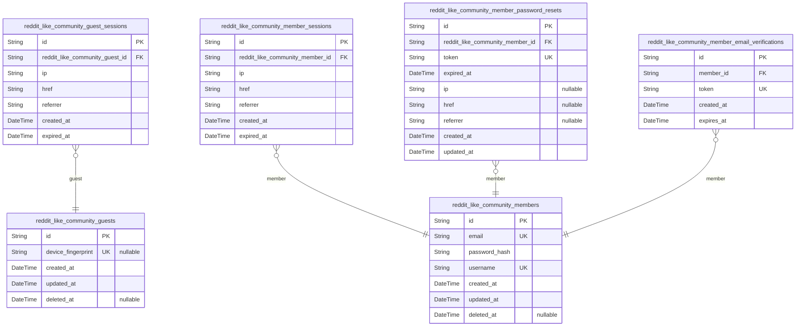
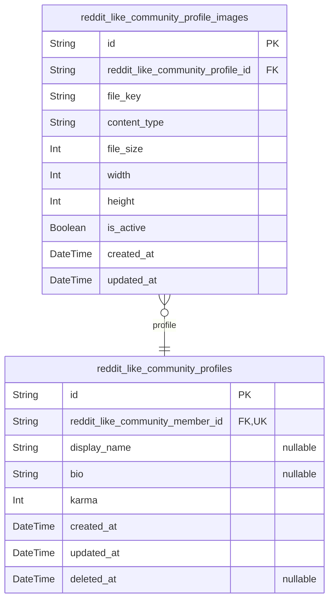
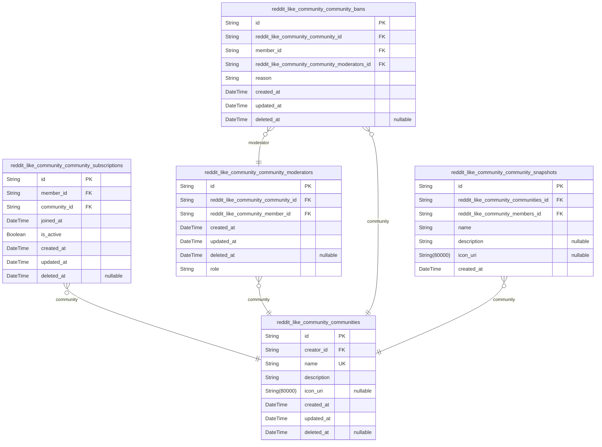
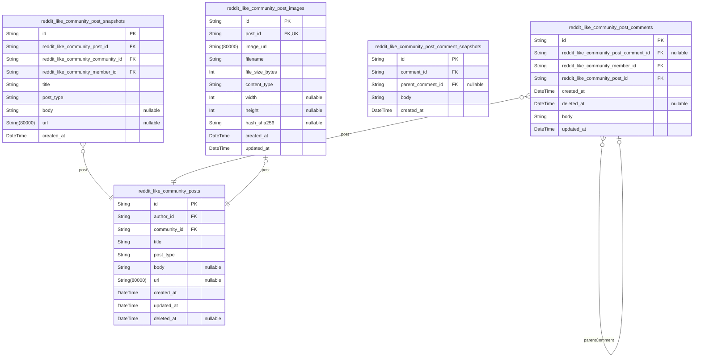
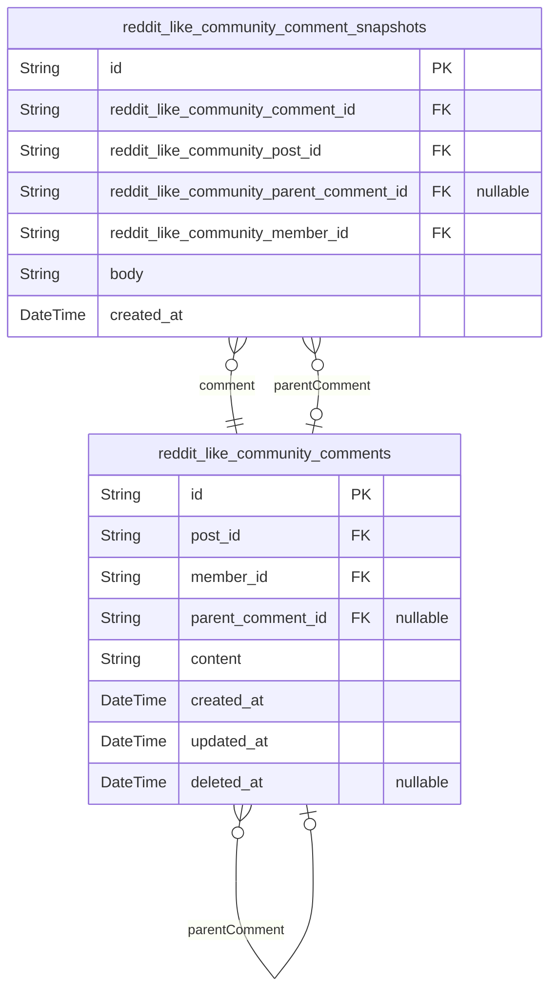
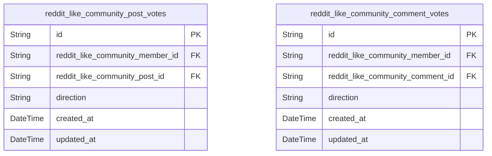
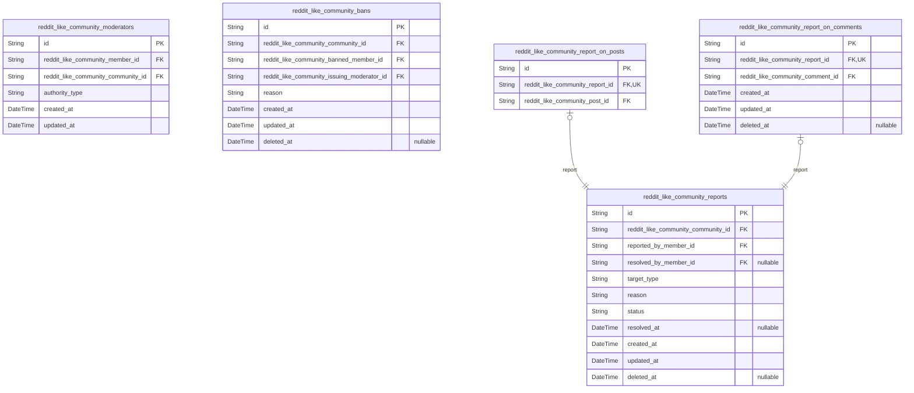

# Prisma Markdown

> Generated by [`prisma-markdown`](https://github.com/samchon/prisma-markdown)

- [auth](#auth)
- [profile](#profile)
- [community](#community)
- [post](#post)
- [comment](#comment)
- [vote](#vote)
- [moderation](#moderation)

## auth

### `reddit_like_community_guests`

Unauthenticated guest accounts identified by optional device fingerprint
for anonymous platform access.

Guests represent visitors who browse the platform without creating a
registered account. They can view public content including popular feeds,
community feeds, user profiles, posts, and comments.

Guest identity is optionally tracked via a device fingerprint—a
cryptographic hash derived from browser properties such as user-agent and
screen resolution. This enables session continuity across requests
without requiring authentication.

Guests have no credentials, no karma score, and cannot create content or
participate in community interactions. They are associated with guest
session records through the reddit_like_community_guest_sessions table.

Properties as follows:

- `id`: Primary key for the guest account.
- `device_fingerprint`
  > Optional cryptographic hash identifying the guest across sessions.
  >
  > Derived from browser properties such as user-agent, screen resolution,
  > and installed fonts. Enables continuity of guest identity without
  > authentication. Nullable because some guests may not have a fingerprint
  > or it may be unavailable.
- `created_at`: Timestamp when the guest account was first created.
- `updated_at`: Timestamp of the most recent update to this guest record.
- `deleted_at`
  > Timestamp of soft deletion for eventual cleanup. Nullable until the guest
  > is permanently purged.

### `reddit_like_community_guest_sessions`

Ephemeral session tokens granting guests temporary read-only access
without persistent authentication.

Unauthenticated platform visitors identified by device fingerprints
establish sessions to access public platform features. These sessions
track the guest's access context and automatically terminate upon
expiration for security.

Sessions are created when guests browse the platform and expire after a
defined period. They enable the system to distinguish active guest
sessions from terminated ones.

Properties as follows:

- `id`: Primary key for the guest session.
- `reddit_like_community_guest_id`
  > References the [reddit_like_community_guests](#reddit_like_community_guests) account that owns
  > this session.
  >
  > The guest entity represents a temporary unauthenticated user identified
  > by device fingerprint.
- `ip`: IP address of the device used to establish the guest session.
- `href`: The URL endpoint where the guest session was established.
- `referrer`
  > The referrer source indicating where the guest arrived from when
  > establishing the session.
- `created_at`: Timestamp when the guest session was created and became active.
- `expired_at`
  > Timestamp when the guest session expires and access is terminated.
  >
  > NOT NULL by default for security. Sessions have a finite lifetime and
  > automatically terminate when expired.

### `reddit_like_community_members`

Registered member accounts with authentication credentials and unique
identity.

Members are authenticated users who have full platform participation
privileges including creating content, voting, commenting, moderating,
and managing subscriptions. This table stores the core authentication
data and unique username identity for each registered user.

Guests have only read-only access to public content and cannot
participate in interactive features until they register and authenticate
as members.

Properties as follows:

- `id`: Primary key uniquely identifying a registered member account.
- `email`
  > Unique email address used for authentication and account recovery.
  >
  > Email is the primary credential for member login and must be unique
  > across all registered accounts. Duplicate email registration is not
  > allowed.
- `password_hash`
  > Hashed password for member authentication.
  >
  > Stores the cryptographic hash of the member's password, never the
  > plaintext password. Used to verify credentials during login attempts.
- `username`
  > Platform-wide unique username chosen by the member.
  >
  > This is the public-facing identifier displayed across the platform. Each
  > username must be unique to prevent ambiguity in user attribution.
- `created_at`: Timestamp when the member account was created during registration.
- `updated_at`: Timestamp of the last modification to this member account record.
- `deleted_at`
  > Timestamp when the member account was soft-deleted.
  >
  > When present, indicates the account has been deleted. All associated
  > posts and comments are cascade-deleted. Deleted accounts cannot
  > authenticate or perform any member actions.

### `reddit_like_community_member_sessions`

Login session records for authenticated members tracking device and
access information.

Session records are created upon successful member authentication and
contain client identification data including IP address and page context.
Each session has a defined expiration time for security.

Members can maintain multiple concurrent sessions across different
devices and browsers. Sessions are used to track active authentications
and enforce token expiration policies.

Properties as follows:

- `id`: Primary key for the member session.
- `reddit_like_community_member_id`
  > Foreign key to the authenticated member account.
  >
  > Links this session to the [reddit_like_community_members](#reddit_like_community_members) member
  > who created it through successful login. A member can have multiple
  > active sessions across different devices and browsers.
- `ip`
  > Client IP address recorded at the time of session creation.
  >
  > Used for session tracking, security monitoring, and anomaly detection.
- `href`
  > URL where the session was initiated (login page URL).
  >
  > Records the page location when the member authenticated.
- `referrer`
  > Referrer page URL leading to the session initiation.
  >
  > Tracks the source page from which the member navigated to login.
- `created_at`
  > Session creation timestamp.
  >
  > Records when this session was first created through member authentication.
- `expired_at`
  > Session expiration timestamp.
  >
  > Defines when this session becomes invalid. Used for automatic session
  > cleanup and security enforcement.

### `reddit_like_community_member_password_resets`

Tracks password reset tokens for member account recovery with
cryptographic tokens and expiration timestamps.

Each record represents a single password reset request generated when a
member initiates account recovery. The table enforces unique tokens to
prevent collision attacks and links directly to the requesting member
account. Includes expiration tracking, IP address monitoring for fraud
detection, and standard temporal fields for lifecycle management.

Properties as follows:

- `id`: Primary Key.
- `reddit_like_community_member_id`
  > Links each reset request to the specific member account requesting
  > password recovery.
  >
  > Enables secure token validation against the correct account and prevents
  > cross-account password manipulation. The parent member account must exist
  > at the time of reset token generation.
- `token`
  > Unique cryptographic token generated for the password reset request.
  >
  > Used as the verification key during password recovery attempts. Enforced
  > as unique to prevent token collision attacks and ensure one-to-one
  > mapping between token and reset request.
- `expired_at`
  > Timestamp when the reset token becomes invalid and can no longer be used.
  >
  > Enforces time-limited security by expiring unused tokens. Prevents
  > indefinite token reuse and limits the attack window for compromised reset
  > links.
- `ip`
  > IP address from which the password reset request was initiated.
  >
  > Tracks the source network location for security auditing and fraud
  > detection. Enables pattern analysis for suspicious reset requests
  > originating from multiple IPs.
- `href`
  > Redirect URL specified during password recovery flow.
  >
  > Captures the destination page where the user should be directed after
  > successful password reset. Supports custom redirection based on user
  > journey context.
- `referrer`
  > Referrer URL that initiated the password reset request flow.
  >
  > Tracks the entry point for analytics and security monitoring. Helps
  > identify common sources of password reset attempts.
- `created_at`
  > Timestamp when the password reset token record was initially created.
  >
  > Used for lifecycle tracking, auditing, and calculating token age relative
  > to expiration.
- `updated_at`
  > Timestamp when the password reset token record was last modified.
  >
  > Tracks updates such as token revocation attempts or metadata changes
  > during the recovery process.

### `reddit_like_community_member_email_verifications`

Email verification tokens issued to members during registration or email
change to confirm email address ownership.

Each token is a one-time-use credential sent to the member's email
address. Tokens expire after a fixed duration and are automatically
invalidated upon successful verification. Multiple tokens may exist for
the same member if they request re-sends before expiration.

Properties as follows:

- `id`: Primary Key.
- `member_id`
  > Foreign key link to the member account that this email verification
  > belongs to.
  >
  > Each verification token is issued for a specific member. Multiple tokens
  > can coexist for the same member (e.g., when requesting re-sends).
- `token`
  > The verification token string sent to the member's email address.
  >
  > This token is embedded in the verification link and used to confirm the
  > member's email address ownership. Only alphanumeric characters.
- `created_at`: Timestamp when the email verification token was issued and sent.
- `expires_at`
  > Timestamp after which the verification token is no longer valid.
  >
  > Tokens typically expire after a fixed duration (e.g., 24 hours) to ensure
  > security of unverified accounts.

## profile

### `reddit_like_community_profiles`

Public-facing identity profiles store display names, bios, and aggregated
karma scores visible to all platform users including guests.

Each profile is permanently bound to exactly one member account via a
one-to-one relationship, created when a member registers and persisting
for the member's entire account lifecycle.

Karma is an aggregated integer score reflecting community reception
across all posts and comments: incremented by one per upvote received,
decremented by one per downvote received. Karma has no lower or upper
bound and can become negative.

Profiles are viewable by all platform participants, supporting user
discovery, credibility signals, and community engagement tracking. Avatar
images are stored separately in {@link
reddit_like_community_profile_images}.

Properties as follows:

- `id`: Primary key uniquely identifying this profile record.
- `reddit_like_community_member_id`
  > Foreign key linking this profile to its owning member account, enforcing
  > a strict one-to-one relationship where each member has exactly one
  > profile.
  >
  > Profile creation is tied to member registration. This FK never changes
  > after initial assignment, and the profile is soft-deleted when the member
  > account is removed.
- `display_name`
  > The profile owner's chosen public display name for identification on the
  > platform, separate from the authentication username. Users can customize
  > this freely and it may remain unset if the user prefers not to display a
  > custom name.
- `bio`
  > A short biographical text description written by the profile owner. Fully
  > editable by the user and may remain empty if the user chooses not to
  > provide personal information.
- `karma`
  > Aggregated karma score computed from all votes received on the user's
  > posts and comments across all communities. Incremented by one per upvote,
  > decremented by one per downvote. Has no minimum or maximum bound and can
  > be negative. Updated by the vote subsystem when votes are cast, changed,
  > or removed.
- `created_at`
  > Automatically set to the current timestamp when the profile is created
  > during member registration. Never modified after initial creation.
- `updated_at`
  > Updated to the current timestamp whenever any profile field
  > (display_name, bio, karma) is modified. Initialized to match created_at
  > and updated on every profile edit or karma recalculation event.
- `deleted_at`
  > Set to the current timestamp when the owner's member account is
  > soft-deleted, marking this profile as inactive. Preserves historical
  > integrity of associated posts and comments that may still exist in the
  > system.

### `reddit_like_community_profile_images`

Avatar image files for user profiles, with one designated active image
per profile.

Stores uploaded avatar images with metadata including file location,
content type, dimensions, and activation status. When a user uploads a
new avatar, the previous active image is deactivated (is_active=false)
and the new image is set as active (is_active=true).

This table maintains avatar history for each profile while ensuring only
one image is displayed as the current avatar. Inactive images remain in
storage for potential restoration or audit purposes.

Properties as follows:

- `id`: Primary key for the profile image record.
- `reddit_like_community_profile_id`
  > References the parent user profile that owns this avatar image.
  >
  > Each profile may have multiple images stored over time, but only one is
  > active at any given moment. The FK enforces ownership and enables cleanup
  > of orphaned images when profiles are deleted.
- `file_key`
  > Unique identifier for the image file in cloud storage (e.g., S3 object
  > key).
  >
  > Points to the actual image file stored in external storage
  > infrastructure. Combined with the base URL, this forms the complete
  > access path to the avatar image.
- `content_type`
  > MIME type of the image file (e.g., 'image/jpeg', 'image/png',
  > 'image/webp').
  >
  > Used for proper content negotiation when serving the image and for
  > validating uploaded files against allowed image formats.
- `file_size`
  > Size of the image file in bytes.
  >
  > Tracks storage consumption and helps enforce upload size limits at the
  > application level. Also useful for analytics on storage usage across the
  > platform.
- `width`
  > Width of the image in pixels.
  >
  > Captured at upload time for optimization and preview purposes. Enables
  > client-side dimension hints without requiring the full image decode.
- `height`
  > Height of the image in pixels.
  >
  > Captured at upload time for optimization and preview purposes. Used
  > alongside width to maintain aspect ratio information without loading the
  > full image.
- `is_active`
  > Status flag indicating whether this is the currently displayed avatar for
  > the profile.
  >
  > When true, this image is shown as the user's avatar across the platform.
  > When false, the image is retained in storage but not displayed. Only one
  > image per profile may have is_active=true at any time.
- `created_at`
  > Timestamp when this profile image record was created.
  >
  > Tracks the creation time of each uploaded avatar, maintaining a
  > chronological history of all avatars associated with a profile.
- `updated_at`
  > Timestamp when this profile image record was last modified.
  >
  > Updated whenever record attributes change, such as switching its active
  > status or updating metadata.

## community

### `reddit_like_community_communities`

Topic-focused discussion spaces where community members create posts and
engage in threaded conversations.

Communities serve as the foundational organizational unit for content,
each with a unique name that identifies the discussion topic, description
text providing context about community purpose, and optional icon URI
referencing visual identity images.

Every community has a designated creator ({@link
reddit_like_community_members}) who established the space and holds owner
authority for moderation hierarchy.

Properties as follows:

- `id`: Primary key uniquely identifying each community.
- `creator_id`
  > Reference to the member who created this community, establishing
  > ownership and highest moderation authority.
  >
  > The creator becomes the owner of the community, holding superior
  > authority over all other moderators. They can add moderators, remove
  > moderators, and make final decisions on moderation actions. This
  > relationship is immutable after creation - the creator remains the
  > permanent owner even after community handover scenarios.
- `name`
  > Public name of the community displayed in navigation, feeds, and URLs.
  >
  > Names must be globally unique across all communities and serve as the
  > primary identifier for users navigating to community content.
- `description`
  > Text description of the community purpose, rules, and scope shared with
  > visiting users.
  >
  > Displayed on the community landing page to inform subscribers and
  > potential members about the community focus, posting guidelines, and
  > community standards enforced by moderators.
- `icon_uri`
  > URI reference to the community's icon image file.
  >
  > Links to an external storage location where the icon image is stored.
  > Null when no icon has been assigned to the community.
- `created_at`
  > Timestamp recording when the community was initially created.
  >
  > Set automatically at creation time and never modified. Establishes the
  > community age for display purposes and audit trail.
- `updated_at`
  > Timestamp recording the last modification to community metadata.
  >
  > Updated when community properties such as name, description, or icon
  > references change. Tracks the community's last identity or configuration
  > update.
- `deleted_at`
  > Timestamp recording when the community was soft-deleted.
  >
  > Null when the community is active. Set when the community is removed,
  > preserving historical data for audit and recovery purposes.

### `reddit_like_community_community_subscriptions`

Tracks subscription relationships between members and communities in the
community platform.

Subscriptions enable members to participate in communities by granting
post creation privileges. Each subscription records the initial join
timestamp permanently and maintains current membership status to support
active/inactive transitions via unsubscribe operations.

Properties as follows:

- `id`: Primary key for community subscription records.
- `member_id`
  > The member who subscribed to the community.
  >
  > References the authenticated user account. Subscriptions require a valid
  > member to establish the user-community membership relationship.
- `community_id`
  > The community that the member subscribed to.
  >
  > References the target community where the member seeks content creation
  > and participation privileges.
- `joined_at`
  > The date and time when the member first joined the community.
  >
  > This timestamp serves as a permanent historical record of initial
  > membership. The value remains unchanged even if the member unsubscribes
  > and later resubscribes to the same community.
- `is_active`
  > Current subscription status indicating active or inactive membership.
  >
  > True for current subscriptions, false for unsubscribed states.
  > Transitions to false when members unsubscribe from communities.
- `created_at`: Record creation timestamp.
- `updated_at`: Record last modification timestamp.
- `deleted_at`: Soft delete timestamp for record archival.

### `reddit_like_community_community_moderators`

Assigns moderation roles to community members, distinguishing between the
community creator (owner) and delegated moderators.

This table serves as a junction table linking `{@link
reddit_like_community_communities}` and `{@link
reddit_like_community_members}` with an additional `role` attribute. A
member can hold at most one active role per community, enforced by a
unique index on the composite foreign keys. The `owner` role
automatically designates the community creator with highest authority,
while the `moderator` role grants delegated permissions for content and
user management. Soft deletes via `deleted_at` maintain an audit trail
for revoked roles.

Properties as follows:

- `id`: Uniquely identifies the moderation role assignment record.
- `reddit_like_community_community_id`
  > Links the moderation role assignment to the target community.
  >
  > This identifies the specific community where the member holds authority.
  > Cannot be null.
- `reddit_like_community_member_id`
  > Identifies the member assigned the moderation role.
  >
  > This references the authenticated user account who holds the authority
  > level within the community. Cannot be null.
- `created_at`
  > Records the timestamp when this moderation role assignment was initially
  > created.
- `updated_at`
  > Stores the timestamp of the last modification to this moderation role
  > assignment record.
- `deleted_at`
  > Tracks the soft deletion timestamp when a moderation role is revoked.
  >
  > Maintains a permanent audit trail for compliance and history. The value
  > is null while the role is active, and populated when the role is removed
  > by the community owner.
- `role`
  > Defines the specific authority level granted to the member within the
  > community.
  >
  > Allowed values are 'owner' (highest authority, automatically assigned to
  > the community creator) or 'moderator' (delegated authority for content
  > governance, user banning, and report reviewing). Owners can appoint and
  > remove moderators.

### `reddit_like_community_community_bans`

Community-level user restrictions recording which members are banned from
specific communities, the enforcing moderator context, and the ban
reason.

Each ban prevents a member from creating posts or comments in that
community while still allowing content viewing. Bans are managed by
community owners and moderators and support soft-delete semantics via
deleted_at for unbanning.

Properties as follows:

- `id`: Primary key for each unique ban record.
- `reddit_like_community_community_id`
  > Reference to the community where the ban is enforced.
  >
  > Links the restriction to [reddit_like_community_communities](#reddit_like_community_communities),
  > establishing the scope of where the banned member is restricted.
- `member_id`
  > Reference to the member account being banned.
  >
  > Links the restriction to [reddit_like_community_members](#reddit_like_community_members),
  > identifying the user subject to the ban.
- `reddit_like_community_community_moderators_id`
  > Reference to the moderator who issued the ban.
  >
  > Links to [reddit_like_community_community_moderators](#reddit_like_community_community_moderators), attributing
  > the enforcement action to a specific moderator within the community.
- `reason`
  > Text explanation provided by the moderator for the ban.
  >
  > Visible to moderators when reviewing the banned users list. Documents why
  > the member was restricted from the community.
- `created_at`
  > Timestamp when the ban was created.
  >
  > Records when the moderation action took effect.
- `updated_at`
  > Timestamp of the last modification to this ban record.
  >
  > Tracks when the ban record was last changed.
- `deleted_at`
  > Timestamp when the ban was removed (unbanned).
  >
  > NULL indicates an active ban. Populated when a moderator lifts the ban,
  > supporting soft-delete semantics.

### `reddit_like_community_community_snapshots`

Community configuration snapshots capturing point-in-time state of
community identity for audit trail reconstruction. Each snapshot
preserves community name, description, icon, and ownership information at
the exact moment of a configuration change event.

These immutable, append-only records enable historical community state
reconstruction, change auditing, and compliance reporting by maintaining
a chronological chain of all community modifications including name
edits, description updates, icon changes, and ownership transfers.

Multiple snapshots exist per community, created whenever community
configuration changes or ownership is transferred. Snapshots are never
modified or deleted after creation, ensuring data integrity for audit
purposes.

Properties as follows:

- `id`
  > Primary key uniquely identifying this individual community snapshot
  > record within the audit trail table.
- `reddit_like_community_communities_id`
  > Reference to the [reddit_like_community_communities](#reddit_like_community_communities) community
  > entity this snapshot captures. All snapshots sharing this FK value belong
  > to the same community, enabling chronological reconstruction of that
  > community's complete configuration history.
  >
  > This FK enables temporal ordering queries to retrieve all historical
  > states of a specific community in creation order for audit trail display.
- `reddit_like_community_members_id`
  > Reference to the [reddit_like_community_members](#reddit_like_community_members) account that held
  > community ownership at the exact moment this snapshot was captured.
  > Preserves ownership history enabling tracking of ownership transfers and
  > historical attribution.
  >
  > Capturing the owner identity separately from the community moderator
  > relationship prevents cascading data loss if moderator records are later
  > modified or deleted.
- `name`
  > Community name as it existed at the moment this snapshot was captured.
  > Preserves the exact name text for historical reconstruction, compliance
  > reporting, and display purposes.
- `description`
  > Community description text as it existed at the snapshot time. Nullable
  > when the community had no description configured at the moment of
  > snapshot capture.
- `icon_uri`
  > Community icon URI as it existed at the snapshot time. Nullable when the
  > community had no icon image configured at the moment of snapshot capture.
- `created_at`
  > Timestamp marking the exact moment this snapshot was created,
  > representing the point-in-time state capture for chronological audit
  > trail ordering.

## post

### `reddit_like_community_posts`

Main post entity representing user-generated content in communities.

Posts are discussion contributions that allow members to share ideas,
information, or media within a subscribed community. Each post belongs to
exactly one community and is authored by exactly one member. Posts
support three mutually exclusive content types: text posts with written
body content, link posts with external URLs, and image posts managed via
a separate attachment table.

Properties as follows:

- `id`: Primary key for the post entity.
- `author_id`
  > References the member who authored this post.
  >
  > Each post is permanently associated with its creating member. The author
  > retains exclusive editing and deletion rights for their posts.
- `community_id`
  > References the community where this post belongs.
  >
  > Posts exist within the context of a specific community. Members must
  > maintain an active subscription to create posts in that community.
- `title`: Required title that summarizes the post topic or purpose.
- `post_type`
  > Content type of the post.
  >
  > One of three mutually exclusive values: 'text' for text posts with body
  > content, 'link' for link posts with external URLs, or 'image' for image
  > posts with uploaded images.
- `body`
  > Written content body for text-type posts.
  >
  > Only populated when post_type is 'text'. Null for link and image post
  > types.
- `url`
  > External web address for link-type posts.
  >
  > Only populated when post_type is 'link'. Null for text and image post
  > types.
- `created_at`: Timestamp when the post was originally created.
- `updated_at`: Timestamp when the post was last updated.
- `deleted_at`
  > Timestamp when the post was soft-deleted.
  >
  > Null indicates the post is active. When set, the post is marked as
  > deleted but retains its record for audit purposes.

### `reddit_like_community_post_snapshots`

Point-in-time snapshots of posts for audit trail, content recovery, and
lifecycle tracking.

Each snapshot captures the complete state of a {@link
reddit_like_community_posts} post at the moment it was created or edited.
This enables content editors and moderators to review historical
versions, recover previously edited content, and track how post content
evolved over time.

Snapshots are append-only records that are never modified once created.
They store denormalized copies of post attributes including the community
and author references to ensure historical accuracy independent of any
future changes to the original post or its associated entities.

Properties as follows:

- `id`: Primary key uniquely identifying this post snapshot record.
- `reddit_like_community_post_id`
  > Reference to the [reddit_like_community_posts](#reddit_like_community_posts) post this snapshot
  > captures.
  >
  > Multiple snapshots can exist for the same post, each representing a
  > different point in time. This FK is created when a post is first
  > published and whenever it is subsequently edited.
- `reddit_like_community_community_id`
  > Reference to the [reddit_like_community_communities](#reddit_like_community_communities) community the
  > post belonged to at the time of this snapshot.
  >
  > This field is denormalized from the original post to ensure the snapshot
  > retains the community context even if the post were to be moved or the
  > community modified after the snapshot was taken.
- `reddit_like_community_member_id`
  > Reference to the [reddit_like_community_members](#reddit_like_community_members) member who
  > authored the post at the time of this snapshot.
  >
  > This field is denormalized from the original post to preserve the
  > authorship record regardless of any subsequent changes to the author's
  > account.
- `title`
  > The title of the post at the time this snapshot was taken.
  >
  > This required field captures the exact title text that existed when this
  > snapshot was created. For text and link posts this contains the full
  > title; for image posts it may be shorter or minimal.
- `post_type`
  > The type of post captured in this snapshot.
  >
  > Allowed values are: 'text' for text posts with body content, 'link' for
  > link posts with URL content, and 'image' for image posts with uploaded
  > media. This determines which content field (body or url) contains
  > meaningful data.
- `body`
  > The text content of the post at the time this snapshot was taken.
  >
  > Contains the full text body for text-type posts. This field is null for
  > link and image posts as they do not carry text body content.
- `url`
  > The URL content of the post at the time this snapshot was taken.
  >
  > Contains the target web address for link-type posts. This field is null
  > for text and image posts as they do not carry URL content.
- `created_at`
  > The timestamp indicating when this snapshot was created.
  >
  > Records the exact moment the snapshot was taken, serving as the basis for
  > ordering post history chronologically. Earlier snapshots have earlier
  > timestamps. This differs from the post's own created_at which indicates
  > when the post was first published.

### `reddit_like_community_post_comments`

Stores threaded discussion comments on posts with parent-child nesting
for unlimited reply depth.

Each comment contains the author's text contribution to a post
discussion. Comments attach directly to posts as top-level responses or
to other comments as nested replies, forming a recursive tree structure
without depth restrictions.

Comments are independently managed by their authors who retain exclusive
edit and delete rights. Vote scores are dynamically computed from the
[reddit_like_community_comment_votes](#reddit_like_community_comment_votes) table and karma impacts
aggregate on the author's [reddit_like_community_profiles](#reddit_like_community_profiles).

Properties as follows:

- `id`: Primary key identifying each comment uniquely.
- `reddit_like_community_post_comment_id`
  > References the parent comment in the reply chain.
  >
  > Nullable for top-level comments that are direct replies to the post. When
  > set, establishes the child relationship enabling unlimited nesting depth
  > in threaded conversations.
- `reddit_like_community_member_id`
  > References the [reddit_like_community_members](#reddit_like_community_members) who authored this
  > comment.
  >
  > The author retains exclusive modification rights throughout the comment
  > lifecycle. Enables aggregation of comment history and karma calculation
  > for the member.
- `reddit_like_community_post_id`
  > References the [reddit_like_community_posts](#reddit_like_community_posts) post that hosts this
  > comment.
  >
  > Establishes the comment's context within the post's discussion thread.
  > Comments cascade-delete when their parent post is removed.
- `created_at`
  > Timestamp when the comment was created.
  >
  > Immutable after initial creation. Used for chronological sorting and age
  > calculations.
- `deleted_at`
  > Timestamp when the comment was soft-deleted.
  >
  > Nullable - null indicates the comment is currently active. Set only upon
  > deletion to preserve historical data and maintain reply chain integrity.
- `body`
  > The text content of the comment.
  >
  > Required at creation and cannot be empty. Contains the author's
  > contribution to the discussion and is the only editable content field.
- `updated_at`
  > Timestamp of the most recent modification.
  >
  > Updated whenever the author edits the comment body, tracking content
  > change history.

### `reddit_like_community_post_comment_snapshots`

Point-in-time snapshots of post comments for audit trail and change history.

Each snapshot captures the full comment content including body text,
parent comment reference for threading, and author context at the time of
creation. Snapshots are immutable records that preserve comment history
even when the original comment is edited or deleted.

Properties as follows:

- `id`: Primary key for comment snapshots.
- `comment_id`
  > The comment being snapshotted.
  >
  > References the comment whose state is captured by this snapshot. Links to
  > [reddit_like_community_comments](#reddit_like_community_comments).
- `parent_comment_id`
  > Parent comment for threading hierarchy.
  >
  > References the parent comment when this snapshot captures a reply.
  > Nullable for top-level comments. Links to {@link
  > reddit_like_community_comments}.
- `body`
  > Comment text content at snapshot time.
  >
  > Stores the exact body text of the comment when this snapshot was created.
  > Immutable after creation.
- `created_at`
  > Timestamp when this snapshot was recorded.
  >
  > Immutable timestamp marking when the snapshot was created. Used for
  > ordering snapshot history.

### `reddit_like_community_post_images`

Stores image metadata for image-type posts.

Each row holds the external storage location, file dimensions, MIME type,
and integrity hash for a single uploaded image. When a user replaces
their image post, a new row is appended while the old one remains for
auditability.

The platform never mutates or soft-deletes image rows independently; they
persist throughout the lifecycle of the parent. Only the moderator
deleting the post can remove both the post and all its image attachments.

Properties as follows:

- `id`: Primary Key.
- `post_id`
  > References the post that contains this image attachment.
  >
  > Enforces referential integrity, ensuring the image row cannot exist
  > without a valid reddit_like_community_posts row. When the user uploads an
  > image for their post, this FK establishes the relationship. Because the
  > FK is unique, exactly one active image row may exist per post.
- `image_url`
  > Full HTTPS URI pointing to the image file in the external object storage
  > provider.
  >
  > Clients cannot interact with the image file directly; they always
  > retrieve the image_url from API responses and request the image from the
  > platform's proxy or CDN. The URI must use HTTPS for security enforcement;
  > HTTP URIs are rejected at upload time.
- `filename`
  > Original filename extracted from the upload request payload.
  >
  > Serves user-facing purposes such as display text, download defaults, and
  > debugging. The database does not enforce filename length limits; the API
  > layer handles truncation or rejection before the row is persisted.
  >
  > This field is immutable after the row is created.
- `file_size_bytes`
  > File size in bytes at the moment of upload.
  >
  > Used for server-side validation (rejecting oversized uploads),
  > client-side optimization (caching and layout calculations), and aggregate
  > storage-cost reporting across all image attachments.
- `content_type`
  > RFC 6838 MIME type of the uploaded image file.
  >
  > Only image types are accepted: image/jpeg, image/png, image/webp. The
  > platform uses this field for content-type enforcement during upload and
  > for setting correct Content-Type headers when serving images to clients.
- `width`
  > Width of the image in pixels, extracted during upload from the image file
  > header.
  >
  > Clients use the width value for layout calculations such as aspect-ratio
  > containers and responsive grid placements. If the platform fails to
  > extract dimensions from the file, this field remains NULL.
- `height`
  > Height of the image in pixels, extracted during upload from the image
  > file header.
  >
  > Clients use the height value alongside
  > reddit_like_community_post_images.width to render thumbnails and preview
  > boxes. If extraction fails, this field remains NULL.
- `hash_sha256`
  > SHA-256 hex digest of the raw image bytes at upload time.
  >
  > The platform uses this hash for deduplication (detecting identical image
  > uploads across the system) and integrity verification (re-hashing the
  > stored file to detect corruption). If the platform cannot compute the
  > hash during upload, the field remains NULL.
- `created_at`
  > Timestamp when the platform accepted the image upload and persisted this
  > metadata row.
  >
  > Used for audit ordering, chronological displays on post history pages,
  > and determining whether a new upload replaced an older version.
- `updated_at`
  > Timestamp of the most recent metadata update to this row.
  >
  > Because this table is append-only, updated_at only changes when a
  > background job backfills missing metadata (dimensions, SHA-256 hash). In
  > the normal upload path, updated_at equals created_at.

## comment

### `reddit_like_community_comments`

Comments on posts supporting unlimited depth threaded discussions through
parent-child relationships. Each comment belongs to exactly one post and
has one author.

Comments enable user-to-user discussion on post content with nesting
support. Parent-child links create reply chains where each comment can
have zero or more direct reply comments.

Properties as follows:

- `id`: Primary key for the comment record.
- `post_id`
  > The post this comment belongs to.
  >
  > Links the comment to its originating post for context and threading.
  > Comments must belong to exactly one post and cannot exist independently.
- `member_id`
  > The member who authored this comment.
  >
  > Establishes content ownership for editing and deletion permissions. Each
  > comment has exactly one author who retains modification rights.
- `parent_comment_id`
  > The parent comment that this comment replies to.
  >
  > Self-referencing FK enabling infinite depth threading. Null for top-level
  > comments. References another comment's ID for all nested replies, forming
  > a tree structure under posts.
- `content`
  > The text content of the comment.
  >
  > Stores what the user wrote. Can be edited by the author. Original content
  > is preserved in snapshot tables if edited.
- `created_at`: Timestamp when the comment was first created.
- `updated_at`
  > Timestamp when the comment was last edited. Updated whenever content
  > changes.
- `deleted_at`
  > Timestamp when the comment was soft-deleted. Null means the comment is
  > active and visible.
  >
  > Used for soft deletion to maintain reply chain integrity and moderation
  > workflows while hiding deleted comments from users.

### `reddit_like_community_comment_snapshots`

Point-in-time snapshot of a comment capturing its state when created or
edited.

Snapshots preserve the complete comment state including body text, post
association, parent comment reference for threading hierarchy, and author
attribution. These immutable records enable audit trails for content
verification, moderation reviews, and content recovery regardless of
subsequent edits or deletions to the original comment.

Each comment generates a new snapshot whenever it is edited, creating an
append-only history of all comment versions throughout its lifecycle on
the platform.

Properties as follows:

- `id`
  > Unique identifier for this comment snapshot record.
  >
  > Primary key for the snapshot table, ensuring each point-in-time capture
  > of a comment state has a unique identifier for database integrity.
- `reddit_like_community_comment_id`
  > Reference to the comment whose state is being captured in this snapshot.
  >
  > Links to [reddit_like_community_comments](#reddit_like_community_comments) to identify which comment
  > this snapshot belongs to. Multiple snapshots may reference the same
  > comment if it was edited multiple times, creating a chronological version
  > history.
- `reddit_like_community_post_id`
  > Reference to the post that the comment belongs to, denormalized at
  > snapshot time.
  >
  > Links to [reddit_like_community_posts](#reddit_like_community_posts) to preserve the post
  > association independently of any future changes to the original comment.
  > This ensures the snapshot remains self-contained for audit purposes.
- `reddit_like_community_parent_comment_id`
  > Reference to the parent comment if this comment is a reply, denormalized
  > at snapshot time.
  >
  > Links to [reddit_like_community_comments](#reddit_like_community_comments) to preserve the recursive
  > reply chain structure. Nullable for top-level comments that are direct
  > responses to the post rather than replies to other comments.
- `reddit_like_community_member_id`
  > Reference to the member who authored the comment, denormalized at
  > snapshot time.
  >
  > Links to [reddit_like_community_members](#reddit_like_community_members) to preserve author
  > attribution independently of any future account changes or deletions.
- `body`
  > The full text content of the comment at the time this snapshot was
  > created.
  >
  > Preserves the exact body text of the comment when the snapshot was taken,
  > enabling comparison with later versions to track edits made by the
  > author. This is a core field for audit trail purposes.
- `created_at`
  > Timestamp recording when this snapshot was created, either at initial
  > comment posting or at the time of a subsequent edit.
  >
  > Used to order snapshots chronologically and identify when each version of
  > the comment was captured. As this is an append-only snapshot record,
  > there is no updated_at or deleted_at field.

## vote

### `reddit_like_community_post_votes`

Records a single vote cast by a member on a post, enforcing the
one-vote-per-user-per-post constraint.

Each vote captures the voter (member), the target post, and the vote
direction. A user may cast only one vote on any given post — this is
enforced via a unique index on (member_id, post_id). Vote direction
changes replace the existing record's direction value rather than
creating a duplicate.

Vote removal is handled by deleting the record entirely. Vote score
(upvotes minus downvotes) is computed by aggregating records per post.
Author karma is a derived value computed from votes across both posts and
comments.

Properties as follows:

- `id`: Primary key of the vote record.
- `reddit_like_community_member_id`
  > References the authenticated member who cast this vote.
  >
  >
  >
  > The member is the voter. Each vote is always associated with exactly one
  > member account.
  >
  > Cross-reference: [reddit_like_community_members](#reddit_like_community_members).
- `reddit_like_community_post_id`
  > References the post that received this vote.
  >
  >
  >
  > Each vote targets exactly one post. Posts belong to communities and have
  > authors.
  >
  > Cross-reference: [reddit_like_community_posts](#reddit_like_community_posts).
- `direction`
  > The direction of the vote: "up" for an upvote or "down" for a downvote.
  >
  >
  >
  > An upvote increases the post's vote score by +1 and the author's karma by
  > +1. A downvote decreases both by 1. Changing direction from up to down
  > shifts the post score by -2 and karma by -2 (and vice versa for down to
  > up).
- `created_at`: Timestamp when this vote was first cast.
- `updated_at`
  > Timestamp of the last modification to this vote record, updated when the
  > vote direction changes.

### `reddit_like_community_comment_votes`

Records user votes on comments, enforcing one vote per user per comment.

Users can upvote or downvote comments. The direction is stored as a
string. Scores are derived from counting upvotes and downvotes per
comment.

Properties as follows:

- `id`: Primary key for the comment vote record.
- `reddit_like_community_member_id`
  > Reference to the member who cast the vote.
  >
  > Links to the authenticated user who voted on this comment.
- `reddit_like_community_comment_id`
  > Reference to the comment that received the vote.
  >
  > Links to the comment that was voted on.
- `direction`
  > The direction of the vote: 'upvote' or 'downvote'.
  >
  > Represents whether the user voted positively (upvote) or negatively
  > (downvote) on the comment.
- `created_at`
  > Timestamp when the vote was created.
  >
  > Tracks when the user first cast their vote on this comment.
- `updated_at`
  > Timestamp when the vote was last updated.
  >
  > Tracks when the vote was modified, for example, when a user changes their
  > vote direction.

## moderation

### `reddit_like_community_moderators`

Moderator role assignments linking authenticated members to communities
with authority levels distinguishing OWNER (community creator with
highest authority) from MODERATOR (delegated authority).

Moderators can delete posts and comments, ban users, review reports, and
add other moderators within their assigned communities. Owners retain the
unique authority to remove moderators, while moderators cannot remove
other moderators or the owner of the community.

This table serves as a junction entity with an additional property
between [reddit_like_community_members](#reddit_like_community_members) and {@link
reddit_like_community_communities}.

Properties as follows:

- `id`: Primary Key.
- `reddit_like_community_member_id`
  > Foreign key referencing the authenticated member assigned as a moderator.
  >
  > Links to [reddit_like_community_members](#reddit_like_community_members) to identify which
  > registered member holds the moderation role. Each member can be assigned
  > moderation duties across multiple communities.
- `reddit_like_community_community_id`
  > Foreign key referencing the community where this moderator role is active.
  >
  > Links to [reddit_like_community_communities](#reddit_like_community_communities) to identify the
  > community being moderated. Each community can have one owner and multiple
  > moderators.
- `authority_type`
  > The authority level of the moderator role, distinguishing between OWNER
  > (community creator with highest authority) and MODERATOR (delegated
  > authority).
  >
  > OWNER represents the community creator who can add and remove moderators.
  > MODERATOR represents users granted moderation privileges by the owner who
  > can manage content, ban users, and appoint other moderators but cannot
  > remove the owner or other moderators.
- `created_at`: Timestamp when this moderator assignment was created.
- `updated_at`: Timestamp when this moderator assignment was last updated.

### `reddit_like_community_bans`

User bans within specific communities including ban reason and issuing
moderator.

A ban restricts a user from creating posts or comments in a community.
Bans are issued by moderators or community owners with a required reason
text. Bans remain effective until explicitly removed by a moderator,
restoring the user's participation rights.

Properties as follows:

- `id`: Primary key for the ban record.
- `reddit_like_community_community_id`
  > The community where the ban applies.
  >
  > Links to [reddit_like_community_communities](#reddit_like_community_communities) to specify which
  > community restricts the banned user.
- `reddit_like_community_banned_member_id`
  > The member user who is banned.
  >
  > Links to [reddit_like_community_members](#reddit_like_community_members) to identify the restricted
  > user.
- `reddit_like_community_issuing_moderator_id`
  > The moderator who issued the ban.
  >
  > Links to [reddit_like_community_members](#reddit_like_community_members) to attribute the ban
  > action to a specific moderator.
- `reason`
  > The text reason explaining why the user was banned.
  >
  > Provided by the moderator when issuing the ban and visible to moderators
  > reviewing the ban.
- `created_at`: Timestamp when the ban was applied.
- `updated_at`: Timestamp when the ban record was last updated.
- `deleted_at`: Timestamp when the ban was removed by a moderator (soft delete).

### `reddit_like_community_reports`

Content reports submitted by members to flag posts or comments for
moderator review.

Each report captures user-submitted concerns about platform content.
Reports require a text reason explaining the concern and target either a
post or a comment via the polymorphic subtype pattern.

Moderators review reports within their assigned communities. Reports can
be approved (moderator acted on the reported content) or dismissed
(moderator rejected the report, content stays visible). Dismissed reports
are soft-deleted to retain audit history while hiding them from moderator
views.

Properties as follows:

- `id`: Primary key.
- `reddit_like_community_community_id`
  > The community where the reported content belongs.
  >
  > Reports are scoped to communities so moderators can efficiently query
  > reports within their assigned community using the {@link
  > reddit_like_community_moderators} relationship.
- `reported_by_member_id`
  > The member who submitted this report.
  >
  > Links to the [reddit_like_community_members](#reddit_like_community_members) record of the
  > authenticated user who flagged the content for moderator review.
- `resolved_by_member_id`
  > The member who resolved this report. Nullable until a moderator takes
  > action.
  >
  > When a moderator approves or dismisses the report, this FK records which
  > member performed the resolution for audit tracking.
- `target_type`
  > Discriminator indicating whether this report targets a post or a comment.
  >
  > Allowed values are 'post' or 'comment'. Works together with subtype
  > junction tables [reddit_like_community_report_on_posts](#reddit_like_community_report_on_posts) and {@link
  > reddit_like_community_report_on_comments} to establish the polymorphic
  > relationship to the actual reported content.
- `reason`
  > Text reason provided by the reporter explaining why the content was
  > flagged.
  >
  > Required at report creation time per business rules.
- `status`
  > Current review status of the report.
  >
  > Allowed values are 'pending' (awaiting moderator action), 'approved'
  > (moderator acted on the reported content), or 'dismissed' (moderator
  > rejected the report, content stays visible). Dismissed reports are
  > soft-deleted from the visible report list.
- `resolved_at`
  > Timestamp when the report was resolved by a moderator.
  >
  > Nullable until a moderator approves or dismisses this report.
- `created_at`: Timestamp when the report was submitted by the member.
- `updated_at`: Timestamp of the last modification to this report record.
- `deleted_at`
  > Timestamp when the report was soft-deleted.
  >
  > Set when a moderator dismisses the report, removing it from the visible
  > report list while preserving audit history.

### `reddit_like_community_report_on_posts`

Junction table for the polymorphic ownership pattern linking reports
targeting posts.

When a user reports content, the report entity must link to exactly one
target — either a post (via this junction table) or a comment (via the
sibling junction table reddit_like_community_report_on_comments). This
separation enforces that each report targets only a single content type.

[reddit_like_community_reports](#reddit_like_community_reports) — Report entity that targets this
post.

[reddit_like_community_posts](#reddit_like_community_posts) — Post entity being reported.

Properties as follows:

- `id`: Primary key for this junction table entry.
- `reddit_like_community_report_id`
  > Foreign key to the report that targets this post.
  >
  > Enforces the one-to-one relationship where each report appears in exactly
  > one junction table (either reddit_like_community_report_on_posts or
  > reddit_like_community_report_on_comments), never both. This constraint
  > ensures a report targets only a single content item.
  >
  > [reddit_like_community_reports](#reddit_like_community_reports) — The report entity.
- `reddit_like_community_post_id`
  > Foreign key to the post being reported.
  >
  > A single post can be reported multiple times by different users, each
  > creating separate report entries linked through their own junction
  > records.
  >
  > [reddit_like_community_posts](#reddit_like_community_posts) — The post entity.

### `reddit_like_community_report_on_comments`

Junction table linking reports to comments for polymorphic report targeting.

Each report targets exactly one entity — either a post or a comment.
Reports targeting comments are linked through this table, establishing a
1:1 relationship between [reddit_like_community_reports](#reddit_like_community_reports) and {@link
reddit_like_community_comments}.

When a moderator approves a report targeting a comment, the comment is
deleted and this junction record is soft-deleted along with the report.
Multiple reports can target the same comment.

Properties as follows:

- `id`: Primary key for this junction record.
- `reddit_like_community_report_id`
  > Foreign key to the report that targets this comment.
  >
  > This FK is unique, enforcing the 1:1 constraint that each report can
  > target only one entity. Links to [reddit_like_community_reports](#reddit_like_community_reports).
- `reddit_like_community_comment_id`
  > Foreign key to the comment being reported.
  >
  > References [reddit_like_community_comments](#reddit_like_community_comments). Multiple reports can
  > target the same comment.
- `created_at`: Timestamp when this junction record was created.
- `updated_at`: Timestamp when this junction record was last updated.
- `deleted_at`
  > Timestamp when this junction record was soft-deleted.
  >
  > Set when the associated report is resolved and removed.
