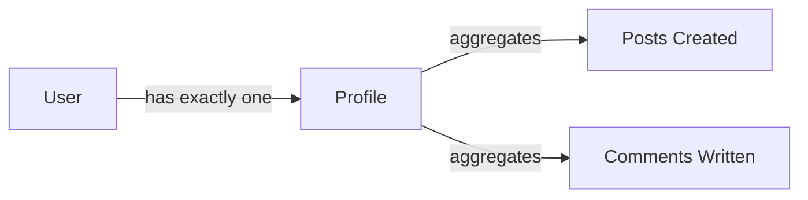
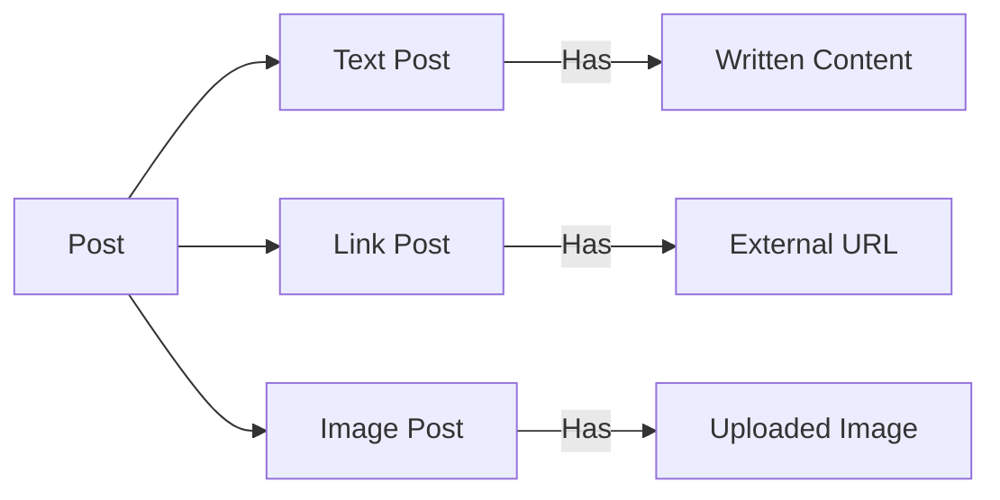
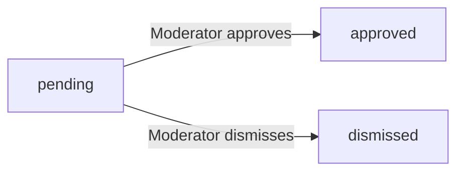
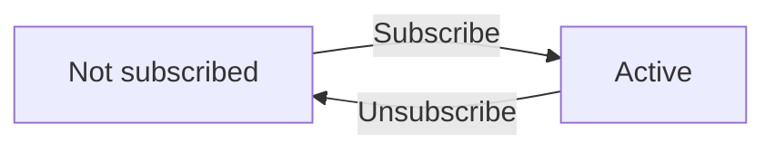
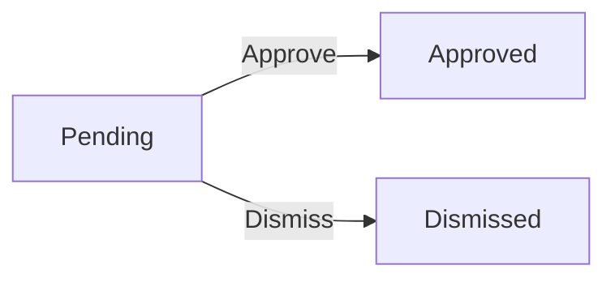
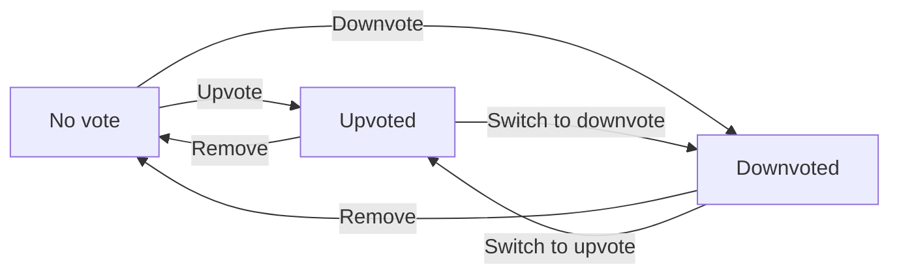

**redditLikeCommunity — Business concepts, relationships, and states from user perspective**

Business concepts, relationships, and states from user perspective

# Domain Concepts

Describe what each concept means in the business domain and its key attributes.

## User Concept

A User represents an account holder on the community platform with authentication credentials and identity attributes. Each user has an email address that serves as the primary method for account authentication. The username provides a unique platform identifier that distinguishes one user from all others. The display name represents how the user is identified publicly on the platform. The password enables secure login verification during authentication. The karma score represents a single numeric value tracking the overall community reception of the user's contributions. A user is the creator of all associated posts and comments across the platform. Account deletion removes the user along with all associated posts and comments.

### Authentication Identity

A user represents an account holder on the community platform. Each user has authentication credentials that enable secure access to the platform.

The email address serves as the primary authentication identifier for the user account. Users sign up with an email address and use it to log in.

The username is a unique identifier that distinguishes one user from all others on the platform. No two users may share the same username.

The password provides secure access verification during login. Users authenticate using their email address and password combination.

### Karma Score

Every user maintains a single numeric karma score that reflects the overall community reception of their posts and comments.

The karma score increases by one each time another user upvotes the user's post or comment. The karma score decreases by one each time another user downvotes the user's post or comment. The karma score adjusts accordingly when another user removes their vote on the user's post or comment.

The karma score has no minimum or maximum limit and can be negative.

### Content Ownership

Users are the authors of all posts they create across any community on the platform. The post remains associated with the originating user throughout its existence.

Users are also the authors of all comments they write on any post. The comment remains associated with the originating user throughout its existence.

Content ownership is established at the time of creation and cannot be transferred to another user. The user's karma score is the cumulative result of all votes placed on their posts and comments combined.

### Account Deletion

Users can request deletion of their own account.

When an account is deleted, the deletion cascades to remove all associated content. This includes every post the user created across all communities and every comment the user wrote on any post.

The cascade deletion is immediate and permanent upon completion.

## Profile Concept

A Profile represents the public-facing identity information displayed for a user on the platform. Every profile contains a customizable display name that appears publicly to other users. The bio text field provides a personal description about the user. The avatar image serves as the visual identity representing the user. The profile displays the user's total accumulated karma score from all platform activity. The profile serves as a collection point aggregating all posts created by the user. The profile also aggregates all comments written by the user. Profiles are publicly visible to all users on the platform.

### Profile as Public Identity and Activity Collection

The Profile represents the public-facing identity displayed for every user on the platform. It serves as the user's public presence, combining personal identity attributes with a collection of their platform activity.

**Purpose**
A profile aggregates personal identity information from the user account and presents a summary of the user's platform activity and participation history.

**Profile Attributes**
Each profile contains the following attributes that define how a user presents themselves publicly:

| Attribute | Description | Source |
|-----------|-------------|--------|
| Display Name | Customizable name that appears publicly in discussions and on the profile page | User account (public display name) |
| Bio Text | Personal description allowing the user to describe themselves to the community | User account (bio text for profile) |
| Avatar Image | Visual image serving as the user's graphical identity across the platform | User account (avatar image) |
| Karma Score | Total accumulated karma from votes received on the user's posts and comments | Derived from platform voting activity |

**Ownership Relationship**
Each user has exactly one profile. The profile belongs to the user and cannot exist independently.

**Aggregated Content Collections**
The profile serves as a collection point aggregating two sets of user content:

- **Posts Created**: A complete list of all posts the user has authored across all communities
- **Comments Written**: A complete list of all comments the user has contributed across all discussions

These aggregated collections are displayed on the user's profile page, providing visibility into the user's platform participation history.

**Public Visibility**
All profiles are publicly visible. Any visitor to the platform can view any user's profile page and see all profile attributes and aggregated content collections without authentication.

**Profile Display**
A user's profile page shows:
- Their display name, bio, and avatar
- Their total karma score
- A list of all posts they have created
- A list of all comments they have written

**Concept Diagram**

## Community Concept

A Community represents a topic-focused discussion space where users share and discuss content. Each community has a unique name that distinguishes it from all other communities on the platform. The description text explains the topic, purpose, or scope of the community. The icon image serves as the visual identifier for the community. The original creator of a community holds the owner role with the highest authority level. The subscriber count tracks the number of users who have joined the community. Communities contain collections of posts created by their subscribed members. Communities serve as the organizational structure for discussions across the platform.

### #### Community Definition and Identity

A Community represents a topic-focused discussion space where users share and discuss content around a common interest or subject area. Each community is identified by a unique community name that distinguishes it from all other communities on the platform—no two communities may share the same name.

Communities display a purpose description text that explains the topic, scope, and focus of the community to help users understand what kind of content and discussions are expected.

Communities display a visual icon image that serves as the recognizable visual identifier for the community across the platform.

### #### Community Ownership

The user who creates a community becomes its owner—the owner as original creator with the highest authority level within that community. This automatic owner assignment happens at the moment of community creation.

The owner retains the ability to add moderators and remove moderators from the community, as defined in the Moderator Concept section.

### #### Subscriber Count Tracking

Each community tracks its subscriber count, showing the total number of users who have subscribed to that community. This subscriber count updating reflects the current membership size of the community.

The subscriber count is derived from individual subscription relationships between users and the community, as defined in the Subscription Concept section.

### #### Community Posts Collection

Communities contain a community posts collection consisting of all posts created by subscribers within that community. Posts are the primary form of user-generated content within communities.

Post types include text posts with written content, link posts with external URLs, and image posts with uploaded images. Each post belongs to exactly one community and cannot exist independently from a community context.

### #### Discussion Organizational Structure

Communities serve as the discussion organizational structure that groups all related posts and comments under a single topical container. This enables focused discussions around specific subjects and forms the foundation for content browsing across the platform.

The structure supports users browsing all communities as a list, viewing posts organized by community, and discovering communities by name. Communities provide the organizational context for home feeds showing posts from subscribed communities, popular feeds showing posts from all communities, and community-specific feeds showing posts from one community.

## Subscription Concept

A Subscription represents the membership relationship between a user and a community. Each subscription records the timestamp when a user joined the community. The subscription status indicates whether the current membership is active. Subscriptions establish the prerequisite for a user to contribute posts within a community. The subscription forms the basis for a user's personalized home feed of content. Users maintain multiple subscriptions across different communities simultaneously. Subscriptions represent voluntary relationships that users establish with communities. Without an active subscription, a user cannot contribute posts to a community.

### User-Community Membership Relationship

A Subscription represents the voluntary membership relationship that a user establishes with a community. It forms a bidirectional link between one user and one community, creating a membership bond that enables community participation. Users actively choose to create subscriptions and retain control over removing them, making this a voluntary association rather than an automatic assignment. Multiple subscriptions can exist between the same user and different communities, enabling a user to belong to many communities simultaneously.

### Joined Timestamp and Active Status

Each subscription records the date and time when a user first joined the community, providing a permanent historical record of when the membership began. The subscription maintains a current status that indicates whether the membership is active. A subscription transitions to a non-active state when a user unsubscribes, while remaining active during normal membership periods.

### Post Contribution Prerequisite

An active subscription serves as the prerequisite for a user to create posts within the corresponding community. Without holding an active subscription to a community, a user cannot contribute post content to that community. This subscription requirement ensures that only participating members can initiate discussions, maintaining community membership standards for content creation.

### Home Feed Content Basis

A user's active subscriptions form the filter foundation for the personalized home feed, which displays posts exclusively from communities the user subscribes to. When subscriptions exist, the home feed aggregates content across all subscribed communities into a single unified view. Without any active subscriptions, the user cannot access the personalized home feed content delivery.

### Multiple Community Memberships

Users maintain simultaneous memberships across multiple communities through independent subscriptions, with each subscription operating as a separate membership relationship. Adding or removing a subscription for one community does not affect membership status in other communities. This independent multi-membership capability allows users to participate in diverse topic areas without constraints on the number of communities they can join.

## Post Concept

A Post represents a user's contribution to community discussions. Every post requires a title that summarizes the contribution topic. Posts exist in exactly three types: text posts with written content, link posts with an external URL, and image posts with an uploaded image. Each post belongs to exactly one community where the author holds an active subscription. Posts display the author identity, the community name, and the creation timing. The vote score reflects the net community reception calculated from upvotes and downvotes. The comment count tracks how many responses exist on the post. Posts carry editability and deletion rights belonging to their original author.

### Post Types and Content

A post is a community discussion contribution that allows users to share ideas, information, or media within a subscribed community. Every post requires a title that summarizes the topic or purpose of the contribution.

Posts exist in exactly three mutually exclusive types:

| Post Type | Content Format | Description |
|-----------|---------------|-------------|
| Text Post | Written content | Contains a body of text that the author composes directly |
| Link Post | External URL | Contains a web address pointing to external content |
| Image Post | Uploaded image | Contains an image file that the author uploads directly |

The content format is determined by the post type and must match the selected type. A post cannot contain mixed content types.

**Mermaid: Post Type Classification**

### Post Attribution

Every post carries author identity that identifies the member who created the post. The author remains permanently associated with the post unless the post is deleted.

Posts belong to exactly one community. The community attribution indicates which discussion space contains the post. The author must hold an active subscription to the community to create a post in that community (subscription defined in Subscription Concept).

Posts are associated with post creation timing that records when the post was published. This timing is used to calculate relative age displays such as "3 hours ago" and to enable chronological sorting options.

### Post Engagement Metrics

Posts display engagement metrics that reflect community interaction with the content.

**Net Vote Score**: Posts have a net vote score calculated from upvotes and downvotes. The score equals the total number of upvotes minus the total number of downvotes. This score can be positive, negative, or zero. The calculation method is defined in the Vote Concept.

**Comment Response Count**: Posts track a comment response count representing the total number of comments written on the post. This includes all top-level comments and nested replies regardless of depth.

Both metrics are computed values derived from child entities and are automatically maintained as votes are cast or comments are created and deleted.

### Post Modification Rights

Posts are governed by original author modification rights that grant exclusive editing and deletion privileges to the member who created the post.

The original author can:
- Edit the post content (title, text body, URL, or image) after initial creation
- Delete the post entirely, removing it from the community

These rights belong solely to the original author and cannot be transferred. Other users, including community moderators, hold separate administrative rights defined in the Moderator Concept section.

## Comment Concept

A Comment represents a user's response or reply within a discussion thread. Every comment requires text content expressing the user's thoughts. Comments attach to posts as top-level responses or to other comments as nested replies. The comment structure supports unlimited nesting depth with no restriction on reply chains. Each comment displays the author identity, vote score, and creation timing. The vote score reflects community reception through upvotes and downvotes. Comments form threaded conversations branching from the original post. Comments carry editability and deletion rights belonging to their original author. Comments organize according to different sorting arrangements by score or timing.

### Comment Definition and Core Attributes

A comment represents a discussion thread response created by a user to express their thoughts within a community conversation. Every comment must include required comment text content, consisting of the words the user writes to contribute their perspective to the discussion. Comments attach to an original post as top-level post replies, or they attach to another comment as secondary responses. The platform supports unlimited nesting depth, meaning any comment can have replies, and those replies can have additional replies, with no restriction on how deeply conversations branch.

### Comment Attribution and Vote Score

Each comment stores author identity so the platform can display who originally wrote it. Original author modification rights grant the comment's creator the ability to update its content or remove it entirely. Comments feature a dynamic score display reflecting community reception, calculated as total upvotes minus total downvotes received from other users. The score appears alongside the comment content to provide viewers with a measure of community response.

### Threaded Conversation and Sorting

Together, comments and their parent-child connections form a threaded conversation structure that branches outward from the original post. This structure enables users to follow individual discussion paths by seeing which response connects to which parent comment. Viewers encounter comment sorting arrangements that determine the order of responses on the screen. Sorting options include organizing by highest vote score, by most recent creation time, or by controversiality where comments attracting many votes but low scores surface first.

## Vote Concept

A Vote represents a user's rating decision on a post or comment. Each vote has a direction indicating either an upvote that increases the score or a downvote that decreases the score. Votes are restricted to one per user per piece of content. Votes support direction changes allowing users to modify their rating preference. Votes support complete removal allowing users to retract their rating. The vote records the timestamp when it was originally cast. Vote scores calculate as the total number of upvotes minus the total number of downvotes. Votes directly affect the karma score of the content author. Votes appear as numeric scores on posts and comments.

### Vote Direction and Score Calculation

A Vote represents a user's rating decision on a post or comment. Each vote has one of two possible directions:

| Direction | Effect on Score |
|-----------|-----------------|
| Upvote    | Adds 1           |
| Downvote  | Subtracts 1      |

The numeric score displayed on any post or comment is calculated as the total number of upvotes minus the total number of downvotes on that piece of content. This score is shown as a single integer value.

Only a single vote per user is allowed per content item. Users may change the direction of their existing vote from upvote to downvote or vice versa. Users may also remove their vote entirely, having no remaining vote on that content item.

A vote is always associated with exactly one voter and one piece of content (either a post or a comment, never both).

### Vote Impact and Casting Record

Each vote records the timestamp indicating when it was originally cast. This timestamp remains unchanged even if the vote direction is later modified.

Votes directly impact the karma score of the content author:

| Vote Action    | Karma Impact to Author |
|----------------|------------------------|
| Upvote received  | Increases karma by 1   |
| Downvote received| Decreases karma by 1   |
| Vote direction changed | Karma adjusts to reflect the new direction |
| Vote removed     | Karma adjusts to remove the previous vote's effect |

Karma scores can become negative when a user receives more downvotes than upvotes across all their content.

## Moderator Concept

A Moderator represents a user granted special authority to manage a specific community. The moderator role exists in two levels: owner with the highest authority and moderator with delegated authority. The assignment timestamp records when the user received moderator privileges. The owner role is automatically assigned to the community creator. Moderators hold authority to delete posts within their community. Moderators hold authority to delete comments within their community. Moderators possess the capability to appoint additional moderators. Moderators cannot remove moderators or the owner, as removal authority belongs exclusively to the owner.

### Moderator Role Levels

A Moderator is a domain concept representing a user who holds special management authority over a specific community. Two role levels exist within the Moderator concept:

- **Owner**: the highest authority level within a community. The creator of the community automatically becomes its owner. The owner holds all moderator authorities plus exclusive rights to remove other moderators.
- **Moderator**: a delegated authority level granted to trusted users. Moderators can perform community management actions such as deleting posts and comments, banning users, and appointing additional moderators.

The distinction between owner and moderator is significant: only the owner can remove moderators from a community. Moderators cannot remove the owner or other moderators, preserving the owner as the ultimate authority.

A single user can be an owner or moderator of multiple communities, or hold no moderator role in any community.

### Moderator Assignment

Moderator assignments link a user to a community with a specific role (owner or moderator) and a recorded assignment timestamp. The assignment timestamp captures when the user received moderator privileges, enabling accountability and historical tracking.

There are two paths to becoming a moderator:

1. **Automatic assignment**: When a user creates a community, they automatically receive the owner role. No manual action is required.
2. **Delegated assignment**: An owner or existing moderator can appoint another user to the moderator role. This requires an explicit action by someone with appointment authority.

Once assigned, a user holds the moderator role until removed by the owner. The assignment remains active across user sessions and does not require periodic renewal.

### Moderator Authorities

Moderators hold the following authorities within their community:

- **Post deletion**: Moderators can remove any post within their community, regardless of who authored it.
- **Comment deletion**: Moderators can remove any comment within their community, regardless of who authored it.
- **User banning**: Moderators can restrict specific users from posting or commenting in the community while still allowing them to view content.
- **User unbanning**: Moderators can lift previous bans, restoring the user's ability to post and comment.
- **Moderator appointment**: Moderators can add new moderators to their community, expanding the moderation team.
- **Report review**: Moderators can view reports filed by users and decide whether to approve or dismiss them.

An important limitation: moderators cannot remove other moderators or the owner. Only the owner holds the authority to remove moderators from the community. This structure ensures the owner remains the final authority.

## Ban Concept

A Ban represents the restriction of a user from participating in a specific community. Each ban records the reason text explaining why the user was restricted. The ban tracks the timestamp when the restriction was applied. Bans restrict the banned user from creating posts within the community. Bans restrict the banned user from writing comments within the community. Banned users retain the ability to view all community content. Bans apply only to the specific community that issued them, not to other communities. Moderators have the capability to lift bans and restore full participation rights.

### Ban Definition and Attributes

A Ban represents a community-level restriction that prevents a specific user from participating. Each ban is linked to one user and one community, establishing which user is blocked from which community.

Each ban records a reason text that explains why the restriction was applied. This reason is provided by the moderator when issuing the ban.

The ban also records the timestamp indicating when the restriction was applied, allowing moderators and users to know when the ban took effect.

### Ban Participation Effects

When a user is banned from a community, they cannot create new posts in that community.

Banned users also cannot write new comments or reply to existing comments in that community.

Despite these restrictions, banned users retain full ability to view all content within the community, including posts, comments, and community information. They can browse the community feed and read discussions as a read-only participant.

The ban applies only to the specific community that issued it. A user banned from one community can still participate fully in all other communities on the platform where they are not banned.

### Ban Removal and Restoration

Bans remain in effect until explicitly removed by a moderator of the community that issued the ban.

Moderators have the capability to lift a ban, restoring the banned user's full participation rights in that community. This action is known as unbanning.

When a ban is removed, the user can once again create posts and write comments in that community. The removal is immediate and the user's participation rights are fully restored.

Only the community owner and other moderators of the specific community can remove bans issued by that community. Users who are banned cannot unban themselves.

## Report Concept

A Report represents a user's notification to moderators about potentially problematic content. Each report requires a reason text explaining the issue with the reported content. Reports exist in three states: pending until moderator review, approved when moderators validate the report, or dismissed when moderators disregard the report. The report records the timestamp when it was filed. Reports display the identity of the user who filed them. Reports associate the reported content with the report reason. Approved reports result in deletion of the reported content. Dismissed reports are removed from the moderator report queue.

### Report Definition

A Report is a formal notification filed by a user to alert moderators about potentially problematic content in a community. Reports serve as the mechanism through which community members flag posts or comments that may violate community standards.

**Report Attributes:**

| Attribute | Description |
|-----------|-------------|
| Report reason | Required text explanation describing the issue with the content. Moderators use this to evaluate the validity of the report. |
| Reported content | The specific post or comment that the user is flagging. A report must always be associated with exactly one piece of content. |
| Reporter identity | The user who filed the report is always identified. Moderators can see who reported the content. |
| Report filing timestamp | Records when the report was initially filed. |
| Report status | Tracks the current state of the report through its lifecycle: pending, approved, or dismissed. |

Reports can only be filed against posts or comments within a community. Users may report content they disagree with, find inappropriate, or believe violates community guidelines. The report reason is mandatory — users cannot file a report without providing an explanation.

### Report Status Transitions

Reports progress through a defined status lifecycle as moderators review them. A report begins in pending status and transitions to either approved or dismissed after moderator review.

**Report States:**

| State | Meaning |
|-------|--------|
| Pending | The report has been filed and awaits moderator review. The reported content remains visible during this state. |
| Approved | A moderator has validated the report and confirmed the content violates community standards. |
| Dismissed | A moderator has reviewed and rejected the report, determining the content is acceptable. |

**Status Transitions:**

When a moderator approves a report, the reported content is deleted as a consequence. When a moderator dismisses a report, the report is removed from the moderator review queue and no longer appears in the report list. Dismissed reports do not affect the reported content, which remains fully visible in the community.

# Domain Relationships

Describe how concepts relate to each other from a business perspective.

## Conceptual Relationships

Describe how concepts relate to each other in business terms.

### User Profile and Identity Ownership

A User maintains an exclusive ownership of a single Profile. The Profile is strictly associated with the User's public identity, containing their display name, bio, and avatar. The relationship between a User and their Profile is a one-to-one mapping, where the Profile cannot exist independently of the User.

### Community Membership Subscription Association

A Community has-many Subscriptions that represent the joining relationship of its members. A Subscription creates a direct association between a User and a Community, granting the User specific interactive permissions. The relationship dictates that a User must hold an active Subscription association to a Community before they can create Posts within that specific Community.

### Community Creator and Moderator Ownership

The User who initiates the creation of a Community holds absolute ownership over it, acting as the Community's Owner. The Community has-many Moderators who form a secondary ownership tier within the Community. The relationship strictly prevents Moderators from removing other Moderators or the Owner; only the Owner can manage the removal relationship of any Moderator.

### Post and Community Belongs-to Mapping

Every Post belongs-to exactly one Community, which dictates the Post's primary scope and visibility. A Post also carries a belongs-to relationship with its authoring User, permanently linking the content creation to the User's account. The Community contains and manages all Posts that belongs-to it in its respective feed.

### Comment Thread and Parenting Association

Every Comment belongs-to exactly one Post, anchoring the discussion thread to the originating content. When a Comment is written as a reply, a parent-child association is formed between the new Comment and the parent Comment. This nesting relationship is unrestricted in depth, allowing an infinite hierarchy of associated replies. Each Comment in this chain remains directly anchored to the same originating Post.

### Vote Belongs-to Content Attribution

A Vote creates a singular belongs-to relationship with exactly one Piece of content, which is either a Post or a Comment. Simultaneously, the Vote belongs-to exactly one User, enforcing a strict rule where a User can only form a single Vote association with any given Post or Comment. Changing a Vote updates the existing relationship rather than creating a new association, preserving the one-to-one rule.

### Moderation Ban and Report Relationships

A Ban represents a restrictive association between a User and a specific Community. The Ban relationship overrides the Subscription association, effectively nullifying the User's permissions to write Posts or Comments in that Community. A Report creates an association between a reporting User and a specific Post or Comment, which belongs-to the Community for moderator review.

## Lifecycle and Retention

Describe concept lifecycle states and transitions only. Detailed retention/recovery policies belong in 05-non-functional. Operation details belong in 03-functional-requirements.

### Deletion Policy and Cascading Removal

When a user deletes their account, all content created by that user is also deleted. Account deletion causes every post written by the user to be removed, and every comment written by the user to be removed.

Posts can be deleted by their author, by a moderator of the community where the post appears, or automatically when a moderator approves a report against the post.

Comments can be deleted by their author, by a moderator of the community where the comment appears, or automatically when a moderator approves a report against the comment.

When a post is deleted, all comments on that post are not automatically deleted. Comments can remain in the system after their parent post is removed.

There is no archival state for any content. Posts and comments exist in one of two states: active or deleted. No intermediate or archived state exists.

There is no recovery mechanism for deleted content. Once a post, comment, or account is deleted, it cannot be restored. Deletion is permanent.

mermaid
flowchart LR
    A["active post"] -->|"Author deletes"| B["deleted"]
    A -->|"Moderator deletes"| B
    A -->|"Report approved"| B
    C["active comment"] -->|"Author deletes"| D["deleted"]
    C -->|"Moderator deletes"| D
    C -->|"Report approved"| D
    E["active account"] -->|"User deletes"| F["deleted account"]
    F -->|"Cascades"| B
    F -->|"Cascades"| D
    B -->|"Permanent"| B
    D -->|"Permanent"| D
    F -->|"Permanent"| F

### Report Lifecycle

When a user reports a post or comment, the report enters a pending state. The report remains pending until a moderator reviews it.

A moderator reviews a pending report and either approves it or dismisses it. Approved and dismissed are terminal states—a report in either state cannot transition again.

When a moderator approves a report, the reported content is deleted from the system. The report itself moves to an approved state.

When a moderator dismisses a report, the original content remains active and unchanged. The dismissed report is removed from the moderator viewable report list.

Reports exist in one of three states: pending, approved, or dismissed. Only pending reports appear in the moderator report list.

# Business Categories and State Flows

Business category classifications and state flow definitions.

## Business Category Definitions

Define all business category classifications with their allowed values and descriptions.

### Post Content Type

Posts are classified into three distinct content types. Every post must have exactly one content type, which is determined at creation time.

| Content Type | Description |
|---|---|
| **Text** | A post containing written text content |
| **Link** | A post containing a URL to external content |
| **Image** | A post containing an uploaded image |

The content type determines what content value is associated with the post: text posts have text content, link posts have a URL, and image posts have an image.

### Vote Direction

Votes are classified by direction, representing a user's positive or negative sentiment toward a post or comment.

| Direction | Description |
|---|---|
| **Upvote** | Positive sentiment; increases the content's vote score by 1 |
| **Downvote** | Negative sentiment; decreases the content's vote score by 1 |

Each user may cast only one vote per piece of content. When a user changes their vote or removes it, the previous vote direction is replaced.

### Subscription Status

Community subscriptions are classified by their status, representing the membership state of a user within a community.

| Status | Description |
|---|---|
| **Active** | The user is a subscribed member of the community and may post and comment |
| **Pending** | The subscription is not yet active and the user cannot participate in the community |

An active subscription is required for a user to create posts in that community.

### Moderator Role

Moderation authority within a community is classified into roles, each granting different levels of power.

| Role | Description |
|---|---|
| **Owner** | The highest authority level, held by the community creator. Owners can add and remove moderators, perform all moderation actions, and cannot be removed |
| **Moderator** | Delegated authority granted by the owner. Moderators can perform moderation actions and add other moderators, but cannot remove the owner, remove other moderators, or remove themselves |

Users who are not moderators have no moderation authority in the community.

### Report Status

Reports submitted by users are classified by their processing status, reflecting moderation review progress.

| Status | Description |
|---|---|
| **Pending** | The report has been filed and awaits moderator review |
| **Approved** | The report was reviewed and validated by a moderator; the reported content is deleted |
| **Dismissed** | The report was reviewed and rejected by a moderator; the reported content remains intact |

A report begins in the pending status and transitions to either approved or dismissed upon moderator review. Dismissed reports are removed from the active report list.

## State Transitions

Define valid state transition paths for stateful concepts.

### Subscription Status Flow

A community subscription tracks whether a user is a member of a community. Subscriptions have two possible states:

**State Values:**
- Not subscribed: The user is not a member of the community
- Active: The user has subscribed and is a member

**Transitions:**
- When a user subscribes to a community, the subscription transitions from not subscribed to active
- When a user unsubscribes, the subscription transitions from active back to not subscribed (the subscription record is removed)

Subscribing is mandatory for creating posts in that community.

### Report Status Flow

Reports represent moderator notifications about problematic content. Reports cycle through three states as they are reviewed:

**State Values:**
- Pending: The report has been filed and awaits moderator review
- Approved: A moderator has approved the report, resulting in deletion of the reported content
- Dismissed: A moderator has dismissed the report, keeping the content intact

**Transitions:**
- When a user reports a post or comment with a reason, a report is created with pending status
- When a moderator approves a pending report, it transitions to approved and the reported content is deleted
- When a moderator dismisses a pending report, it transitions to dismissed and the report is removed from the review queue

Only pending reports appear in the moderator report list. Approved and dismissed reports are removed from active review.

### Ban Status Flow

Bans restrict a user's participation in a particular community. Ban status has two states:

**State Values:**
- Unbanned: The user may participate freely in the community
- Banned: The user cannot create posts or comments in the community but retains the ability to view content

**Transitions:**
- When a moderator bans a user from a community, the ban transitions from unbanned to banned
- When a moderator unbans a user, the ban transitions from banned back to unbanned

Moderators can view a list of all banned users in their community.

### Moderator Role Flow

Moderator roles define the level of authority a user has within a community. There are two moderator role states:

**State Values:**
- No moderator role: The user has no moderation authority in the community
- Moderator: The user has moderation authority
- Owner: The creator of the community, possessing the highest authority level

**Transitions:**
- When a community is created, the creator automatically receives the owner role
- When the owner adds a user as moderator, that user transitions from no moderator role to moderator
- When the owner removes a moderator, the user transitions from moderator back to no moderator role

The owner cannot be removed by anyone. Only the owner can add or remove moderators. Moderators cannot remove each other.

### Vote State Flow

Each user can cast exactly one vote per post or comment. Vote states track the user's current decision on each content item:

**State Values:**
- No vote: The user has not voted or has removed their vote
- Upvoted: The user has upvoted the content (+1 toward vote score)
- Downvoted: The user has downvoted the content (-1 toward vote score)

**Transitions:**
- When a user upvotes for the first time, the vote transitions from no vote to upvoted
- When a user downvotes for the first time, the vote transitions from no vote to downvoted
- When a user switches from upvote to downvote, the vote transitions to downvoted
- When a user switches from downvote to upvote, the vote transitions to upvoted
- When a user removes their vote, the vote transitions back to no vote

The overall vote score on any post or comment equals total upvotes minus total downvotes. Vote changes adjust karma accordingly.

### Account Status Flow

User accounts have a simple lifecycle with two states:

**State Values:**
- Active: The account exists and the user can perform all platform operations
- Deleted: The account no longer exists

**Transitions:**
- When a user registers with email, password, and a unique username, the account is created with active status
- When a user deletes their account, the account transitions to deleted status, all posts and comments by that user are deleted, and the user can no longer log in

Deletion is permanent and affects all content created by that user across all communities.

### Post and Comment Lifecycle

Posts and comments share a common content lifecycle:

**State Values:**
- Existing: The content has been created and is visible
- Deleted: The content has been removed

**Transitions:**
- When a user creates a post (in a subscribed community) or a comment (on any post), the content enters the existing state
- When the author deletes their own post or comment, the content transitions to deleted
- When a moderator deletes a post or comment in their community, the content transitions to deleted
- When a moderator approves a report on a post or comment, that content transitions to deleted

When a post is deleted, all comments on that post are also automatically deleted as part of the cascade.