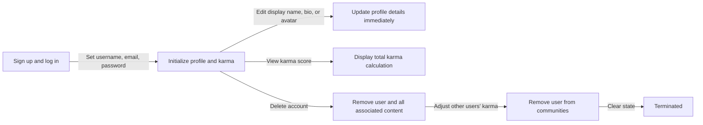
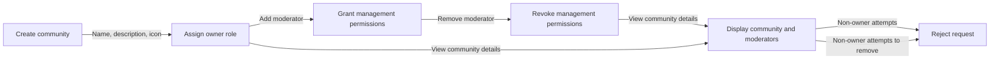
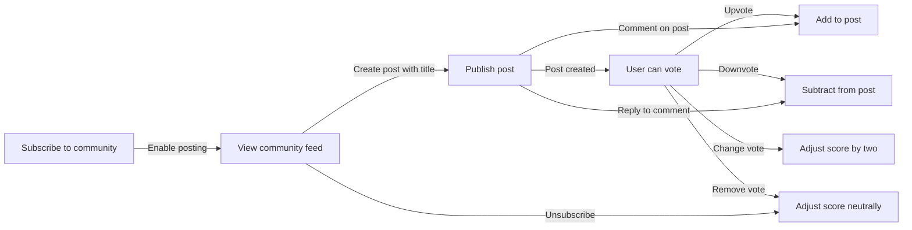
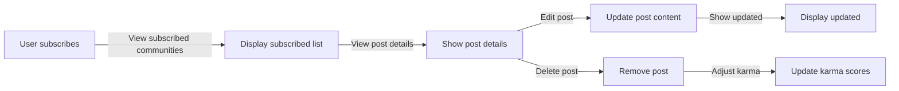
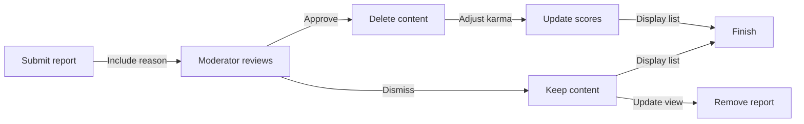

**redditLikeCommunity — What operations users can perform, use cases, business workflows**

What operations users can perform, use cases, business workflows

# Core Business Operations

What the system must do for each business concept.

## User Operations

Users create an account by providing an email address, a password, and a unique username that no other account uses. Logged-in users authenticate by entering their registered email and password combination. Users change their password to update their authentication credentials. Users permanently delete their account, which also removes all posts and comments they created across the platform. The system rejects account creation requests when the requested username already belongs to another user. The system rejects login requests when the email and password combination does not match any registered account. Account deletion is irreversible and cascades to remove all user-generated content.

### Account Deletion

Users permanently delete their account.

The user requests to delete their account.

WHEN the user deletes their account, THEN the system permanently removes the account.

WHEN the user deletes their account, THEN the system permanently removes all posts the user created across the platform.

WHEN the user deletes their account, THEN the system permanently removes all comments the user wrote across the platform.

IF the account has already been deleted, THEN the system rejects the account deletion request and notifies the user that the account no longer exists.

Account deletion cascade removes all user-generated content including posts and comments when the account is deleted.

## Profile Operations

Users view any user's profile page showing their display name, bio text, avatar image, total karma score, list of posts created, and list of comments written. Users edit their own profile by updating their display name, bio text, and avatar image. Profile pages publicly display the user's chosen display name rather than their username. The karma score reflects the sum of upvotes and downvotes on the user's posts and comments. Users can view the complete list of posts they authored across all communities. Users can view the complete list of comments they wrote across all posts. Profile editing only affects the viewing user's own profile information.

### Profile Page Viewing

WHEN a user accesses any user's profile page, THE system SHALL display the user's display name, bio text, avatar image, total karma score, a list of all posts created by the user, and a list of all comments written by the user.

WHEN a user views their own profile page, THE system SHALL display their display name, bio text, avatar image, karma score calculated as the sum of upvotes minus downvotes received on their posts and comments, and complete lists of their posts and comments.

WHEN a user views another user's profile page, THE system SHALL display that user's display name, bio text, avatar image, total karma score, list of posts they created across all communities, and list of comments they wrote across all posts.

WHEN a profile page is displayed, THE system SHALL show the user's chosen display name as the primary identifier rather than their username.

WHEN a user's karma score is zero or positive, THE system SHALL display the actual numeric value.

WHEN a user's karma score is negative, THE system SHALL display the negative value.

WHEN a user has no posts, THE system SHALL display an empty post list on the profile page.

WHEN a user has no comments, THE system SHALL display an empty comment list on the profile page.

WHEN the platform requires authentication for profile access, THE system SHALL allow only logged-in users to view profile pages.

### Profile Information Editing

A user SHALL update their own display name.

A user SHALL update their own bio text.

A user SHALL update their own avatar image.

WHEN a user updates their display name, THE system SHALL save the change and reflect it immediately on their profile page.

WHEN a user updates their bio text, THE system SHALL save the change and reflect it immediately on their profile page.

WHEN a user updates their avatar image, THE system SHALL save the change and reflect it immediately on their profile page.

IF a user attempts to edit another user's profile information, THE system SHALL reject the request.

IF a user is not authenticated, THE system SHALL reject profile information editing requests.

WHEN a user's profile information is incomplete, THE system SHALL display empty fields for missing display name, bio text, or avatar image.

## Community Operations

Any user creates a community by providing a unique name, description text, and icon image, becoming the community owner upon creation. Users browse all communities displayed in a list format showing each community's name and subscriber count. Users search for communities by entering name keywords in the search functionality. Community pages display the unique name, description text, icon image, current subscriber count, and posts belonging to that community. The system rejects community creation when the requested name already exists. Community owners retain their owner role for the duration of the community's existence. Community names must be unique across the entire platform.

### Community Creation

Users can create a community by providing a name, description text, and icon image.
The creator of a community is automatically assigned the role of community owner.
The system rejects a community creation request if the requested name already exists.

### Community Browsing

Users can browse a list of all available communities.
Each community in the browsing list displays its name and subscriber count.
The browsing list is accessible to guests and members.

### Community Search

Users can search for communities by entering name keywords.
The search matches entered keywords against community names.
A search returns a list of matching communities.
If no communities match the search criteria, the system returns a list with zero results.

### Community Page Viewing

Users can view individual community pages.
A community page displays the community's name, description text, and icon image.
The community page shows the current subscriber count.
Community pages display the list of posts belonging to that community.

## Subscription Operations

Users subscribe to any community to gain posting privileges within that community. Users unsubscribe from any community to revoke their posting privileges. Users view a list of all communities they currently subscribe to. Subscribing to a community is required before creating posts within that community. The system rejects post creation attempts when the user is not subscribed to the target community. Unsubscribing immediately prevents further post creation in that community. Subscription status determines whether a user can participate by posting in a community. Users maintain their subscription until they explicitly unsubscribe.

### Subscribe to Community

WHEN a user subscribes to a community, THE system SHALL add that community to the user's subscription list.

A user can subscribe to any community on the platform.

Subscribing to a community grants the user posting privileges within that community.

A user maintains their subscription to a community until they explicitly unsubscribe.

### Unsubscribe from Community

WHEN a user unsubscribes from a community, THE system SHALL remove that community from their subscription list.

Unsubscribing from a community revokes the user's posting privileges within that community.

A user can unsubscribe from any community they are currently subscribed to.

Unsubscribing is permanent until the user subscribes again.

### View Subscribed Communities List

WHEN a logged-in user requests to view their subscribed communities, THE system SHALL display a list of all communities with active subscriptions.

Only logged-in users can view their subscribed communities list.

The list includes all communities where the user has an active subscription.

### Subscription Requirement for Posting

WHEN a user attempts to create a post, THE system SHALL verify the user is subscribed to the target community.

Posting privileges are granted only to users with an active subscription to the community.

Users must maintain their subscription to retain posting privileges in the community.

## Post Operations

Users create posts in communities they subscribe to by providing a required title and selecting one of three content types. Text posts contain written text content entered by the author. Link posts contain a URL pointing to external content. Image posts contain an uploaded image file provided by the author. Users edit their own posts to modify the title or content. Users delete their own posts permanently removing them from the community. Post pages display the title, full content, author username, community name, vote score, comment count, and posting time. The system rejects post creation when providing no title or posting in an unsubscribed community.

### Post Creation Flow

Members can create posts in communities they are subscribed to by selecting a content type and providing the required information.

WHEN a member initiates post creation in a subscribed community, THE system SHALL present three content type options: text post, link post, and image post.

THE system SHALL require a title for all new posts regardless of the content type.

WHERE a member selects text post, THE system SHALL accept text content entered by the author as the post content.

WHERE a member selects link post, THE system SHALL accept a URL pointing to external content as the post content.

WHERE a member selects image post, THE system SHALL accept an uploaded image file as the post content.

THE system SHALL associate each new post with the member who created it and the community where the post was made.

IF a member attempts to create a post without providing a title, THEN THE system SHALL reject the post creation request.

IF a member attempts to create a post in a community they are not subscribed to, THEN THE system SHALL reject the post creation request.

WHEN a post is successfully created, THE system SHALL make the post visible in the community feed and applicable platform feeds.

### Post Editing

Members can edit the title and content of posts they have created to correct errors or update information.

WHEN a member edits their own post, THE system SHALL allow modification of the post title.

WHEN a member edits their own text post, THE system SHALL allow modification of the text content.

WHEN a member edits their own link post, THE system SHALL allow modification of the URL.

WHEN a member edits their own image post, THE system SHALL allow replacement of the image with a new uploaded image.

THE system SHALL preserve the original posting time when an existing post is edited.

IF a member attempts to edit a post created by another member, THEN THE system SHALL reject the edit request.

### Post Deletion

Members can delete posts they have created, permanently removing them from the community feed.

WHEN a member deletes their own post, THE system SHALL remove the post from all feeds and the community where it was published.

WHEN a member deletes their own post, THE system SHALL make the post inaccessible to all users including the original author.

IF a member attempts to delete a post created by another member, THEN THE system SHALL reject the deletion request.

### Post Details Viewing

Users can view detailed information about individual posts including authorship, community, engagement metrics, and content.

WHEN a user views a single post, THE system SHALL display the post title.

WHEN a user views a single post, THE system SHALL display the full post content according to the content type: the complete text for text posts, the URL for link posts, or the image for image posts.

WHEN a user views a single post, THE system SHALL display the author username of the post creator.

WHEN a user views a single post, THE system SHALL display the community name where the post was published.

WHEN a user views a single post, THE system SHALL display the current vote score calculated as total upvotes minus total downvotes.

WHEN a user views a single post, THE system SHALL display the current comment count.

WHEN a user views a single post, THE system SHALL display the posting time indicating when the post was created.

WHEN a guest user views a post, THE system SHALL present the complete post details just as for logged-in members.

## Comment Operations

Users write comments on any post to provide text responses to that post. Users reply to existing comments to create nested threaded discussions. Reply comments can themselves receive replies with no limit on nesting depth. Users edit their own comments to update the comment text. Users delete their own comments permanently removing them from the post. Comment pages display the author username, comment content, vote score, time since posting, and any nested replies. Comment threads maintain the full history of nested replies in their original posting order. The system tracks all comments authored by each user for profile viewing.

### Comment Creation

WHEN a logged-in user views a post, THE system SHALL allow the user to write a comment on that post.

THE system SHALL require comment content (text) when creating a comment; empty comments are rejected.

WHEN a comment is created, THE system SHALL automatically associate the comment with the post it was written on.

WHEN a comment is created, THE system SHALL record the identity of the user who wrote it.

WHEN a comment is created, THE system SHALL record the time at which it was posted.

IF a user is not logged in, THEN THE system SHALL reject the attempt to create a comment.

### Comment Replies and Thread Structure

WHEN viewing a comment, THE system SHALL allow any user to write a reply to that comment.

WHEN a reply is created, THE system SHALL link it to the parent comment it responds to.

THE system SHALL support replies to replies with no limit on nesting depth.

WHEN a reply is created, THE system SHALL maintain the full threaded discussion structure so that the parent-child relationship between comments is preserved.

WHEN a reply is created, THE system SHALL record the time at which the reply was posted.

A reply comment is treated as a standalone comment within the thread and can itself receive further replies.

### Comment Editing

WHERE a user is viewing one of their own comments, THE system SHALL allow the user to edit the comment text.

WHEN a user edits a comment, THE system SHALL update the comment content to reflect the new text.

WHEN a comment is edited by its author, THE system SHALL preserve the original posting time of the comment.

IF a user attempts to edit a comment they did not write, THEN THE system SHALL reject the edit request.

IF a user attempts to edit a comment that has already been deleted, THEN THE system SHALL reject the edit request.

### Comment Deletion

WHERE a user is viewing one of their own comments, THE system SHALL allow the user to delete that comment.

WHEN a user deletes a comment, THE system SHALL permanently remove the comment from the post.

WHEN a comment is deleted, THE system SHALL remove it from any threaded reply structure it was part of.

IF a user attempts to delete a comment they did not write, THEN THE system SHALL reject the deletion request.

IF a user attempts to delete a comment that has already been deleted, THEN THE system SHALL reject the deletion request.

### Comment Display and Presentation

WHEN viewing a comment, THE system SHALL display the username of the user who wrote the comment.

WHEN viewing a comment, THE system SHALL display the comment content text.

WHEN viewing a comment, THE system SHALL display the vote score (total upvotes minus total downvotes).

WHEN viewing a comment, THE system SHALL display how much time has passed since the comment was posted (e.g., "3 hours ago").

WHEN viewing a comment with replies, THE system SHALL display all nested replies in their threaded structure.

WHEN replies are displayed, THE system SHALL show each reply with its own author, content, vote score, and time since posting.

WHEN viewing a post that has no comments, THE system SHALL indicate that no comments have been written yet.

## Vote Operations

Users upvote posts and comments to increase their score by one point. Users downvote posts and comments to decrease their score by one point. Each user casts only one vote per post and one vote per comment. Users change their vote from upvote to downvote or from downvote to upvote. Users remove their vote entirely with the score adjusting accordingly. Vote score equals total upvotes minus total downvotes for each post and comment. Karma increases when others upvote the user's content and decreases when others downvote it. Vote removal adjusts the score and karma automatically.

### Post Upvoting

Users can upvote any post on the platform.

WHEN a user upvotes a post, THE system SHALL increase the vote score of that post by 1 point.

WHEN a user upvotes a post, THE system SHALL increase the karma score of the post's author by 1 point.

IF a user who already downvoted a post upvotes it, THEN THE system SHALL treat this as a vote direction change rather than a new vote.

### Post Downvoting

Users can downvote any post on the platform.

WHEN a user downvotes a post, THE system SHALL decrease the vote score of that post by 1 point.

WHEN a user downvotes a post, THE system SHALL decrease the karma score of the post's author by 1 point.

IF a user who already upvoted a post downvotes it, THEN THE system SHALL treat this as a vote direction change rather than a new vote.

### Comment Upvoting

Users can upvote any comment on a post.

WHEN a user upvotes a comment, THE system SHALL increase the vote score of that comment by 1 point.

WHEN a user upvotes a comment, THE system SHALL increase the karma score of the comment's author by 1 point.

IF a user who already downvoted a comment upvotes it, THEN THE system SHALL treat this as a vote direction change rather than a new vote.

### Comment Downvoting

Users can downvote any comment on a post.

WHEN a user downvotes a comment, THE system SHALL decrease the vote score of that comment by 1 point.

WHEN a user downvotes a comment, THE system SHALL decrease the karma score of the comment's author by 1 point.

IF a user who already upvoted a comment downvotes it, THEN THE system SHALL treat this as a vote direction change rather than a new vote.

### Vote Direction Changing

Users can change their vote direction from upvote to downvote on any post they have voted on.

Users can change their vote direction from upvote to downvote on any comment they have voted on.

Users can change their vote direction from downvote to upvote on any post they have voted on.

Users can change their vote direction from downvote to upvote on any comment they have voted on.

WHEN a user changes their vote on a post from upvote to downvote, THE system SHALL adjust the post's vote score by minus 2 points.

WHEN a user changes their vote on a comment from upvote to downvote, THE system SHALL adjust the comment's vote score by minus 2 points.

WHEN a user changes their vote on a post from downvote to upvote, THE system SHALL adjust the post's vote score by plus 2 points.

WHEN a user changes their vote on a comment from downvote to upvote, THE system SHALL adjust the comment's vote score by plus 2 points.

WHEN a user changes their vote from upvote to downvote on a post or comment, THE system SHALL adjust the author's karma score by minus 2 points.

WHEN a user changes their vote from downvote to upvote on a post or comment, THE system SHALL adjust the author's karma score by plus 2 points.

### Vote Removal

Users can remove their vote from any post they have voted on.

Users can remove their vote from any comment they have voted on.

WHEN a user removes their upvote from a post, THE system SHALL decrease the post's vote score by 1 point.

WHEN a user removes their downvote from a post, THE system SHALL increase the post's vote score by 1 point.

WHEN a user removes their upvote from a comment, THE system SHALL decrease the comment's vote score by 1 point.

WHEN a user removes their downvote from a comment, THE system SHALL increase the comment's vote score by 1 point.

WHEN a user removes their upvote on a post or comment, THE system SHALL decrease the author's karma score by 1 point.

WHEN a user removes their downvote on a post or comment, THE system SHALL increase the author's karma score by 1 point.

### Single Vote Restriction

A user may cast only one vote on any given post.

A user may cast only one vote on any given comment.

IF a user who already voted on a post attempts to vote again, THEN THE system SHALL replace the existing vote rather than creating an additional vote.

IF a user who already voted on a comment attempts to vote again, THEN THE system SHALL replace the existing vote rather than creating an additional vote.

### Vote Score Calculation

THE system SHALL calculate the vote score for each post as the total number of upvotes minus the total number of downvotes.

THE system SHALL calculate the vote score for each comment as the total number of upvotes minus the total number of downvotes.

A post's vote score may be positive, negative, or zero depending on the balance between upvotes and downvotes.

A comment's vote score may be positive, negative, or zero depending on the balance between upvotes and downvotes.

THE system SHALL update vote scores immediately whenever votes are cast, changed, or removed.

### Karma Score Adjustment

THE system SHALL maintain a single karma score for each user.

WHEN another user upvotes a post or comment authored by that user, THE system SHALL increase that user's karma score by 1 point.

WHEN another user downvotes a post or comment authored by that user, THE system SHALL decrease that user's karma score by 1 point.

Karma adjustments occur automatically as a result of vote actions by other users.

A user's karma score may be negative.

The karma score reflects the cumulative net effect of all votes received across all posts and comments authored by the user.

## Moderator Operations

Community owners add users as moderators to help manage their community. Community owners remove moderators to revoke their moderation privileges. Moderators add other users as additional moderators within their community. Moderators cannot remove the community owner or other moderators—only the owner removes moderators. Moderators delete any post in their community regardless of who authored it. Moderators delete any comment in their community regardless of who authored it. Moderators ban users from their community to prevent posting or commenting. Moderators unban previously banned users to restore their participation rights. Moderators view the complete list of users currently banned from their community.

### Moderator Role Assignment

WHEN a community owner selects a user, THE system SHALL add that user as a moderator to the community.
WHEN a moderator selects a user, THE system SHALL add that user as a moderator to the community.

### Moderator Role Removal

WHEN a community owner selects a moderator, THE system SHALL remove their moderator privileges from the community.
IF a non-owner attempts to remove another moderator, THE system SHALL reject the action; only the community owner can remove moderators.

### Moderator Post Deletion

WHEN a moderator selects a post within their community, THE system SHALL delete the post.
THE system SHALL allow moderators to delete posts from any user within the moderated community.

### Moderator Comment Deletion

WHEN a moderator selects a comment within their community, THE system SHALL delete the comment.
THE system SHALL allow moderators to delete comments from any user within the moderated community.

### User Community Banning

WHEN a moderator initiates a ban on a user, THE system SHALL restrict that user from creating posts and comments in the community.
WHILE a user is banned, THE system SHALL allow them to view content but prevent them from posting or commenting.

### User Community Unbanning

WHEN a moderator initiates an unban on a previously restricted user, THE system SHALL restore their ability to create posts and comments in the community.
THE system SHALL allow moderators to lift bans placed on users within their moderated communities.

### Banned Users Listing

WHEN a moderator requests the list of banned users, THE system SHALL display the complete list of users currently banned from the community.
THE system SHALL update the banned users list immediately whenever a new user is banned or an existing ban is lifted.

### Moderator Authority Hierarchy

THE system SHALL establish a hierarchy within a community where the owner holds the highest authority and all moderators operate under the owner.
WHEN a moderator performs moderation actions, THE system SHALL validate that the action falls within their assigned moderator privileges.

### Owner Superior Authority

THE system SHALL enforce that the community creator retains superior authority over all moderation functions within their community.
WHEN an owner exercises their authority, THE system SHALL allow them to override or reverse any moderator assignments or actions.

### Owner Moderator Management

THE system SHALL grant the community owner the ability to independently add and remove moderators without restriction from other moderators.
WHEN an owner modifies the moderator team, THE system SHALL immediately reflect the changes in the community's access control.

## Ban Operations

Moderators ban users from their community to prevent those users from creating posts or comments. Banned users retain the ability to view all community content but cannot participate by posting or commenting. Moderators unban users to restore their posting and commenting privileges in that community. Moderators view the list of all users currently banned from their community. Ban reasons are recorded as text explaining why the user was banned. Banned users remain restricted until explicitly unbanned by a moderator. Users can still access and view community content while banned.

### Banning Users with Reason Recording

WHEN a moderator or owner of a community wants to ban a user, THE system SHALL allow them to ban that user from the community.

WHEN banning a user, THE system SHALL require the moderator to provide a reason as text explaining why the user is being banned.

THE system SHALL record the reason for the ban as text that is visible to moderators when reviewing the ban.

WHEN a user is banned from a community, THE system SHALL immediately restrict that user from posting new content in that community.

WHEN a user is banned from a community, THE system SHALL immediately restrict that user from creating comments on posts in that community.

WHEN a user is banned from a community, THE system SHALL still allow that user to view community content including posts and comments.

WHEN a banned user attempts to create a post in the community where they are banned, THE system SHALL block the post creation.

WHEN a banned user attempts to write a comment on a post in the community where they are banned, THE system SHALL block the comment creation.

THE system SHALL maintain the ban restriction on a user until a moderator explicitly unbans them.

WHEN a user is banned from multiple communities, THE system SHALL enforce the ban restriction independently in each community.

### Unbanning Users

WHEN a moderator or owner of a community wants to remove an existing ban, THE system SHALL allow them to unban that user from the community.

WHEN a user is unbanned from a community, THE system SHALL restore their ability to create posts in that community.

WHEN a user is unbanned from a community, THE system SHALL restore their ability to write comments on posts in that community.

WHEN unbanning a user, the system SHALL remove the ban record for that user in that community.

WHEN a user is unbanned from a community, THE system SHALL no longer include that user in the banned users list for that community.

### Viewing Banned Users List

WHEN a moderator or owner of a community views the banned users list, THE system SHALL display all users who are currently banned from that community.

WHEN viewing the banned users list, THE system SHALL show the identity of each banned user and the reason for their ban.

WHEN viewing the banned users list, THE system SHALL allow moderators to identify which users to unban.

WHEN there are no users banned from a community, THE system SHALL display an empty or empty-state indication for the banned users list.

WHEN a user is unbanned from a community, THE system SHALL remove that user from the banned users list for that community.

## Report Operations

Users report posts or comments by providing a text reason explaining the issue. Moderators view all pending reports for their community showing the reported content, reporter identity, and reason provided. Moderators approve reports to delete the reported post or comment. Moderators dismiss reports to keep the reported content and remove the report from the list. Reports remain pending until a moderator either approves or dismisses them. Dismissed reports are permanently removed from the moderator report list. The system records the reporter identity and reason for all submitted reports.

### Post and Comment Reporting

WHEN a user views a post in a community, THE system SHALL allow the user to report that post.

WHEN a user views a comment on a post, THE system SHALL allow the user to report that comment.

WHEN a user submits a report for a post or comment, THE system SHALL require the user to provide a text reason explaining the issue.

WHEN a report is successfully submitted, THE system SHALL record the reporter identity, the reported content, and the reason provided.

WHEN a report is successfully submitted, THE system SHALL set the initial report status to pending.

WHEN a user submits a report without providing a reason, THE system SHALL reject the report submission.

### Moderator Report Viewing

WHEN a moderator with active moderator role in a community views reports, THE system SHALL display all pending reports for that community.

EACH pending report in the list SHALL display the reported content, the reporter identity, and the text reason provided by the reporter.

WHEN a moderator views the details of a specific report, THE system SHALL show who reported the post or comment and the reason they submitted.

WHEN a moderator views reports, THE system SHALL show only reports that are currently pending, excluding any reports that have already been approved or dismissed.

WHEN a user without moderator role attempts to view reports, THE system SHALL block access to the report list.

### Report Approval and Content Deletion

WHEN a moderator approves a report for a post, THE system SHALL delete the reported post from the community.

WHEN a moderator approves a report for a comment, THE system SHALL delete the reported comment from the post.

WHEN a moderator approves a report, THE system SHALL remove the approved report from the pending report list.

WHEN a moderator approves a report, THE system SHALL update the report status so that it is no longer visible in the moderator report list.

WHEN a report has already been approved or dismissed by a moderator, THE system SHALL prevent another moderator from taking a further action on that same report.

### Report Dismissal and Removal

WHEN a moderator dismisses a report for a post, THE system SHALL keep the reported post intact and visible in the community.

WHEN a moderator dismisses a report for a comment, THE system SHALL keep the reported comment intact and visible on the post.

WHEN a moderator dismisses a report, THE system SHALL permanently remove the dismissed report from the moderator report list.

WHEN a moderator dismisses a report, THE system SHALL update the report status to dismissed so that it is removed from the pending report list.

WHEN a report has already been approved or dismissed, THE system SHALL prevent any further approval or dismissal action on that report.

# Error Scenarios and Edge Cases

Business-level error scenarios, edge case coverage, and expected system behaviors for exceptional conditions.

## User Error Scenarios

When a user signs up, the system checks that the chosen username is not already taken by another user. Attempting to register with a duplicate username is rejected. Users log in with email and password, and incorrect credentials prevent access. When changing their password, users must first verify their old password before setting a new one. Users can delete their account, which removes all their posts and comments from the platform. Attempting to log in after account deletion is not possible. Other users see no trace of the deleted account on the profiles of those who voted on or commented on the deleted user's content.

### Duplicate Username Enforcement

IF a user attempts to sign up with a username that is already taken by another user, THEN THE system SHALL reject the registration request.
Username uniqueness SHALL be enforced during the signup process to ensure that no two active users share the same unique identifier.

### Login Failure with Incorrect Credentials

IF a user attempts to log in with credentials where the email or password does not match the records of an existing active account, THEN THE system SHALL result in a login failure.
The system SHALL reject access for any login request containing incorrect credentials.

### Password Change Verification

WHEN a user attempts to change their password, THE system SHALL require verification of the user's old password.
IF the old password provided during the change process does not match the user's current password on record, THEN THE system SHALL reject the password change request.

### Account Deletion Cascade Removal

WHEN a user deletes their account, THE system SHALL remove all posts previously created by that user from the platform.
WHEN a user deletes their account, THE system SHALL remove all comments previously written by that user from the platform.

### Deleted Account Authentication Prevention

IF a user attempts to log in using the credentials of an account that has already been deleted, THEN THE system SHALL reject the login request.
A deleted account SHALL not be usable for authentication purposes under any circumstance.

## Moderator Error Scenarios

Non-owners and non-moderators cannot delete posts or comments in a community where they lack moderator privileges. Attempting to add a moderator who already has moderator status results in a notification that they are already assigned. The community owner always retains their authority even if all moderators are removed. If the owner deletes their account, their community faces a special situation since the owner role cannot perform its duties. Moderators attempting to view banned user lists in communities they do not moderate are denied access. Regular users without any moderator role cannot perform any moderation actions.

### Duplicate Moderator Assignment

When the community owner attempts to add a user as a moderator who already holds moderator status in that community, the system SHALL notify the owner that the user is already assigned as a moderator.

The duplicate assignment notification SHALL clearly indicate the existing moderator status to avoid confusion.

The moderator assignment SHALL not be duplicated or reset; the existing moderator role remains unchanged when a duplicate assignment is attempted.

### Non-Moderator Moderator Action Blocked

Regular users without any moderator role in a community SHALL be blocked from performing any moderator actions in that community.

Non-moderators attempting to delete posts in a community where they lack moderator privileges SHALL be denied access.

Non-moderators attempting to delete comments in a community where they lack moderator privileges SHALL be denied access.

Non-moderators attempting to ban users from a community SHALL be denied access.

Non-moderators attempting to unban users in a community SHALL be denied access.

Non-moderators attempting to view the banned user list in a community SHALL be denied access.

Non-moderators attempting to add or remove moderators in a community SHALL be denied access.

Non-moderators attempting to view reports in a community SHALL be denied access.

Non-moderators attempting to approve or dismiss reports in a community SHALL be denied access.

### Moderator Cannot Be Removed by Another Moderator

Moderators in a community SHALL not be able to remove the community owner from their role.

If a moderator attempts to remove the owner, the system SHALL block the action and prevent the removal.

Moderators SHALL not be able to remove other moderators from their roles.

If a moderator attempts to remove another moderator, the system SHALL block the action and prevent the removal.

Only the community owner SHALL be permitted to remove moderators from their roles.

This restriction ensures the owner retains exclusive authority over moderator role assignments and removals.

### Owner Removed All Moderators Scenario

When the community owner removes all moderators from a community, the community SHALL continue to function normally.

The owner SHALL retain full moderator authority including the ability to add new moderators, delete posts and comments, ban and unban users, and manage reports.

The community SHALL not lose any moderator capabilities even with zero active moderators beyond the owner.

Regular users in a community with no active moderators (only the owner) SHALL still be able to create posts and comments if they are subscribed to that community.

### Owner Account Deletion Impact on Community

When the community owner deletes their account, all posts created by the owner SHALL be deleted.

When the community owner deletes their account, all comments written by the owner SHALL be deleted.

The community SHALL continue to exist despite the owner's account deletion.

If the deleted owner had no other users assigned as moderators, the community SHALL have no active moderators.

In a community with no remaining moderators after owner deletion, no user SHALL be able to perform moderator actions including adding or removing moderators, deleting posts or comments, banning or unbanning users, and managing reports.

Existing moderators (other than the deleted owner) SHALL retain their moderator roles and continue to perform moderator actions in the community.

The deleted owner's moderator role and any moderation actions attributed to that deleted account SHALL be removed along with the account.

## Ban Error Scenarios

Attempting to ban a user who is already banned in a community results in a notification that the ban is already active. Trying to unban a user who is not currently banned produces an error. Banned users cannot create posts or write comments in the banned community, but they can still view existing content. Viewing posts and comments remains available to banned users regardless of their ban status. If a banned user deletes their account, there is no longer anything to enforce the ban against. Moderators can only ban users in communities where they hold moderator status. Attempting to ban someone outside of a community where the actor has no moderator role is blocked.

### Already Banned User Notification

WHEN a moderator attempts to ban a user who is already banned in that community, THE system SHALL notify the moderator that the user is already banned and SHALL NOT create a duplicate ban record.

IF a user already has an active ban in a community, THEN THE system SHALL prevent another moderator from applying a new ban to that user in the same community.

WHEN the system processes a ban request, THE system SHALL check the existing ban status before applying the ban.

### Unban Non-Banned User Error

WHEN a moderator attempts to unban a user who is not currently banned in that community, THE system SHALL produce an error indicating the user is not banned.

IF a user does not have an active ban in the community, THEN THE system SHALL reject the unban request and SHALL NOT process it as a successful operation.

WHEN an unban operation is initiated, THE system SHALL verify the user's ban status before proceeding.

### Banned User Cannot Post or Comment

WHILE a user is banned from a community, THE system SHALL prevent that user from creating posts in that community.

WHILE a user is banned from a community, THE system SHALL prevent that user from writing comments on any post within that community.

IF a banned user attempts to submit a post, THEN THE system SHALL block the post creation and SHALL indicate the user is banned from that community.

IF a banned user attempts to submit a comment, THEN THE system SHALL block the comment creation and SHALL indicate the user is banned from that community.

Banned users retain the ability to create posts and comments in communities where they are not banned.

### Banned User Can Still View Content

WHILE a user is banned from a community, THE system SHALL allow that user to view community posts.

WHILE a user is banned from a community, THE system SHALL allow that user to view comments on posts.

Banned users can browse the community feed and read post content including text, link URLs, and image thumbnails.

The viewing capability for banned users applies to all community content regardless of their ban status.

### Ban Removed After Account Deletion

WHEN a banned user deletes their account, THE system SHALL remove the ban record associated with that user.

IF a user who has an active ban in a community proceeds with account deletion, THEN THE system SHALL cascade delete all posts and comments from the deleted user and SHALL remove the ban record.

After account deletion, THE system SHALL no longer track the deleted user in the community's banned users list.

### Moderator Restricted to Own Community Bans

IF a user attempts to ban someone in a community where they do not have moderator status, THEN THE system SHALL block the ban attempt and SHALL indicate insufficient permissions.

WHEN a moderator initiates a ban action, THE system SHALL verify the moderator's authority in the target community.

Moderators can only ban users within communities where they have been assigned moderator or owner role.

The owner role and moderator role both grant the capability to ban users within their respective communities.

### Non-Moderator Ban Attempt Blocked

IF a regular user without moderator status attempts to ban another user, THEN THE system SHALL reject the ban attempt.

IF a regular user attempts to unban a user, THEN THE system SHALL reject the unban request.

Regular members without moderator or owner privileges cannot perform any ban or unban actions under any circumstances.

### Ban Status Validation Checks

WHEN a ban operation is initiated, THE system SHALL validate that the target user exists.

IF the target user for a ban has already deleted their account, THEN THE system SHALL reject the ban request since there is no active account to ban.

WHEN an unban operation is initiated, THE system SHALL check the current ban status to determine if an active ban exists for the specified user in the community.

WHEN a moderator requests the banned users list, THE system SHALL verify the requesting user has moderator or owner authority before displaying the list.

## Comment Error Scenarios

Users can only edit their own comments and cannot modify or delete comments written by others. Deleting a comment removes it from the thread, but nested replies remain visible without their parent. Replies can have replies with no depth limit, so extremely deep comment trees are possible. Attempting to delete a comment that has already been deleted results in an error. When a post is deleted, all comments on that post are also removed. A user who has deleted their account cannot write any further comments. Sorting comments on a post with no comments displays an empty list.

### Cannot Edit Others Comments

WHEN a user attempts to edit a comment written by another user, THE system SHALL reject the request. Users can only edit comments they personally created. The system identifies the comment author and compares against the requesting user to enforce this restriction.

### Cannot Delete Others Comments

WHEN a user attempts to delete a comment they did not write, THE system SHALL reject the request. Regular users can only delete their own comments. Moderators may delete any comment in their community as defined in Community Moderation operations.

### Removing Comment Leaves Nested Replies

WHEN a user deletes their own comment, THE system SHALL remove the comment from the thread while keeping all nested replies visible. Replies to the deleted comment remain in place without a parent reference. The nested replies retain their vote scores, content, and any further reply chains.

### Deep Reply Nesting Support

THE system SHALL support unlimited depth of nested replies to comments. Users can reply to any comment regardless of how deeply nested the original comment is. Replies to replies can have their own replies without restriction. Each nested reply displays the author, content, vote score, time since posted, and any further nested replies.

### Comment Deletion After Deletion Error

IF a user attempts to delete a comment that has already been deleted, THEN THE system SHALL reject the request with an error. This includes comments deleted by their author or removed by moderators. The system indicates that the comment no longer exists.

### Comments Removed When Post Deleted

WHEN a post is deleted, THE system SHALL remove all comments on that post. When a user deletes their own post, all associated comments including nested replies are permanently deleted. The entire comment tree for that post is removed from the system.

### Deleted Account Cannot Write Comments

WHEN a user deletes their account, THE system SHALL prevent them from writing any new comments. The account deletion removes all authentication credentials. Any attempt by the former account to write comments is rejected. Previously written comments by the deleted account are also removed as part of account deletion.

### Empty Comments List After Sorting

WHEN a user views comments on a post that has no comments with any sorting option, THE system SHALL display an empty list. This applies whether sorting by best, new, or controversial. No comments are shown when the post has zero comments regardless of the selected sort method.

## Subscription Error Scenarios

Attempting to subscribe to a community when already subscribed produces a notification that the user is already a member. Trying to unsubscribe from a community that the user does not subscribe to results in an error. Users cannot create posts in communities where they are not subscribed. Viewing the list of subscribed communities is only possible when logged in. When a user deletes their account, they leave all communities they subscribed to. A community with zero subscribers still exists and can be viewed by anyone. Attempting to subscribe to a community that no longer exists fails.

### Duplicate Subscription Handling

WHEN a user attempts to subscribe to a community they are already subscribed to, THE system SHALL notify the user that they are already a member of that community.

A user must not be able to create multiple subscriptions to the same community.

### Unsubscribe from Non-Subscribed Community

IF a user attempts to unsubscribe from a community they are not subscribed to, THEN THE system SHALL reject the request and display an error indicating the user is not a member of that community.

The system must verify active subscription status before processing unsubscription requests.

### Post Creation Subscription Requirement

IF a user is not subscribed to a community, THEN THE system SHALL block the user from creating posts in that community and display a message indicating subscription is required.

Users must subscribe to a community before posting in it.

This subscription requirement applies to all post types including text posts, link posts, and image posts.

### Subscribed Communities List Access

IF a user attempts to view the list of subscribed communities without being logged in, THEN THE system SHALL require authentication before displaying the list.

Guests cannot view lists of subscribed communities.

Only authenticated members can access their list of subscribed communities.

### Account Deletion Subscription Cleanup

WHEN a user deletes their account, THE system SHALL automatically remove all subscriptions that user had across all communities.

Deleting a user account removes their membership from every community they subscribed to.

Subscriptions associated with the deleted account must no longer appear in any community's subscriber counts or membership lists.

### Zero Subscriber Community Visibility

A community with zero subscribers remains visible in the community browsing list and can be viewed by any user or guest.

Communities must remain accessible even when no users are subscribed.

Users can subscribe to communities that currently have zero subscribers.

### Subscribe to Nonexistent Community

IF a user attempts to subscribe to a community that does not exist, THEN THE system SHALL reject the request and indicate that the community cannot be found.

The system must validate community existence before processing subscription requests.

## Vote Error Scenarios

Each user can only vote once per post or comment, so voting again on the same item is blocked. Users can change their vote from upvote to downvote or vice versa, and the score adjusts accordingly. Removing a vote changes the score back. Attempting to vote on a deleted post or comment results in an error since the content is gone. When someone upvotes a post or comment, the author's karma increases by 1. When someone downvotes, the karma decreases by 1. Removing a vote adjusts the author's karma accordingly. A user who deletes their account withdraws all their votes, causing score and karma recalculation.

### Duplicate Voting Prevention

WHEN a user who has already upvoted a post attempts to upvote that same post, THEN THE system SHALL reject the action.
WHEN a user who has already downvoted a post attempts to downvote that same post, THEN THE system SHALL reject the action.
WHEN a user who has already upvoted a comment attempts to upvote that same comment, THEN THE system SHALL reject the action.
WHEN a user who has already downvoted a comment attempts to downvote that same comment, THEN THE system SHALL reject the action.

### Vote Direction Change

WHEN a user who has upvoted a post attempts to downvote that same post, THEN THE system SHALL change the vote to a downvote and adjust the score accordingly.
WHEN a user who has downvoted a post attempts to upvote that same post, THEN THE system SHALL change the vote to an upvote and adjust the score accordingly.
WHEN a user who has upvoted a comment attempts to downvote that same comment, THEN THE system SHALL change the vote to a downvote and adjust the score accordingly.
WHEN a user who has downvoted a comment attempts to upvote that same comment, THEN THE system SHALL change the vote to an upvote and adjust the score accordingly.

### Vote Removal Score Adjustment

WHEN a user removes their upvote on a post, THEN THE system SHALL decrease the post score by 1.
WHEN a user removes their downvote on a post, THEN THE system SHALL increase the post score by 1.
WHEN a user removes their upvote on a comment, THEN THE system SHALL decrease the comment score by 1.
WHEN a user removes their downvote on a comment, THEN THE system SHALL increase the comment score by 1.

### Voting on Deleted Content

IF a user attempts to vote on a post that has been deleted, THEN THE system SHALL reject the action.
IF a user attempts to vote on a comment that has been deleted, THEN THE system SHALL reject the action.

### Karma Adjustments

WHEN a user upvotes a post, THEN THE system SHALL increase the content author's karma by 1.
WHEN a user downvotes a post, THEN THE system SHALL decrease the content author's karma by 1.
WHEN a user upvotes a comment, THEN THE system SHALL increase the content author's karma by 1.
WHEN a user downvotes a comment, THEN THE system SHALL decrease the content author's karma by 1.
WHEN a user removes their upvote on a post or comment, THEN THE system SHALL decrease the content author's karma by 1.
WHEN a user removes their downvote on a post or comment, THEN THE system SHALL increase the content author's karma by 1.

### Voter Account Deletion Impact

WHEN a user deletes their account, THEN THE system SHALL withdraw all votes cast by the user.
WHEN an upvote is withdrawn due to account deletion, THEN THE system SHALL decrease the content author's karma by 1.
WHEN a downvote is withdrawn due to account deletion, THEN THE system SHALL increase the content author's karma by 1.

## Report Error Scenarios

When a user submits a report without providing a reason, the submission is rejected since a reason is required. Only moderators with proper community access can view reports for their community. After approving a report, the reported content is deleted and the report is removed from the pending list. After dismissing a report, the content remains visible and the report is removed from the list. Attempting to approve or dismiss a report that has already been handled results in an error. A user cannot view or act on reports in communities where they do not have moderator status. Reporting is permitted on any post or comment regardless of user identity.

### Missing Report Reason Rejection

WHEN a user submits a report without providing a reason text, THEN THE system SHALL reject the submission and require a reason to be entered.

WHEN a report is submitted with an empty or blank reason, THEN THE system SHALL treat it as missing and reject the submission.

### Report Access Restricted to Moderators

IF a user who is not a moderator of the community attempts to view reports, THEN THE system SHALL block access and deny the request.

WHEN a moderator logs in, THE system SHALL allow viewing of reports only within communities where they hold moderator status.

IF a moderator attempts to view reports in a community where they are not a moderator, THEN THE system SHALL deny access.

A user can report any post or comment they encounter, regardless of whether the content was created by themselves, another user, or a moderator.

Both logged-in members and guests who are logged in can submit reports on any visible post or comment.

### Approved and Dismissed Report Content Handling

WHEN a moderator approves a report on a post, THE system SHALL delete the reported post and all of its associated comments.

WHEN a moderator approves a report on a comment, THE system SHALL delete the reported comment.

WHEN a moderator approves a report, THE system SHALL remove the report from the pending report list.

WHEN a moderator dismisses a report, THE system SHALL keep the reported content visible and accessible.

WHEN a moderator dismisses a report, THE system SHALL remove the report from the report list so it no longer appears to moderators.

### Already Handled Report Action Error and Reporting Permissions

IF a moderator attempts to approve a report that has already been approved, THEN THE system SHALL reject the action as the report is already handled.

IF a moderator attempts to dismiss a report that has already been dismissed, THEN THE system SHALL reject the action.

IF a moderator attempts to approve a report that was previously dismissed, THEN THE system SHALL reject the action.

IF a moderator attempts to dismiss a report that was previously approved, THEN THE system SHALL reject the action.

Users can report posts created by any user, including their own posts or posts created by moderators.

Users can report comments by other users or their own comments.

## Profile Error Scenarios

Attempting to view a deleted user's profile results in an error. Users cannot edit the display name, bio, or avatar of any other user. Only the account owner can make changes to their own profile information. The total karma displayed on a profile must remain consistent even as votes from others change. A user with negative karma displays that negative value on their profile. Posting or commenting history shows all posts and comments created by the user that have not been deleted. A user's profile is viewable by anyone, whether they are logged in or not. Attempting to edit profile information while logged out is not possible.

### Viewing Profile of Deleted User

WHEN a user attempts to view a profile belonging to a deleted account, THE system SHALL display an error indicating the profile no longer exists.

A deleted user's profile is inaccessible to all visitors, including logged-in members and guests.

### Profile Viewing Without Login

WHEN a logged-out visitor attempts to view any user's profile, THE system SHALL display the profile with the user's display name, bio, avatar, total karma score, list of posts, and list of comments.

Any person on the platform, whether logged in or not, can view a user's profile page.

### Unauthorized Profile Editing

WHEN a logged-in member attempts to edit the display name, bio, or avatar of another user, THE system SHALL reject the request.
WHEN a logged-out visitor attempts to edit any user's profile information, THE system SHALL reject the request.

Profile editing is restricted to the account owner only. No other user can modify another user's display name, bio text, or avatar image.

### Profile Editing Requires Authentication

WHEN an unauthenticated visitor attempts to access the profile editing functionality, THE system SHALL reject the request.

Only logged-in members can edit their own profile information including display name, bio, and avatar.

### Karma Display With Vote Changes

WHEN a user's karma score changes due to votes being cast, changed, or removed on their posts or comments, THE system SHALL display the updated karma value on their profile immediately.

The karma score shown on the profile must always reflect the current total of all votes on the user's posts and comments, even as other users change or remove their votes.

### Negative Karma Display

WHEN a user's karma score falls below zero, THE system SHALL display the negative karma value on their profile.

A user whose karma is negative has that negative number shown on their profile page alongside their display name, bio, and other profile information.

### Profile Post History Display

WHEN a user's profile is viewed, THE system SHALL list only the posts created by that user that have not been deleted.

Deleted posts are excluded from the profile's post history. Only posts that still exist appear in the list of posts on a user's profile page.

### Profile Comment History Display

WHEN a user's profile is viewed, THE system SHALL list only the comments written by that user that have not been deleted.

Deleted comments are excluded from the profile's comment history. Only comments that still exist appear in the list of comments on a user's profile page.

## Community Error Scenarios

Creating a community with a name that already exists is rejected. The system requires a unique name for each community. A user who is not logged in cannot create a community. Communities can be searched by name, and searching for a non-matching name returns zero results. Browsing all communities shows an empty list when no communities exist. The owner of a community can view any community details since they created it. When the community owner deletes their account, moderator assignments remain but the community loses its original creator. Subscriber counts cannot go below zero.

### Duplicate Community Name Rejection

WHEN a user attempts to create a community with a name that already exists, THE system SHALL reject the creation request.

THE system SHALL check for name uniqueness across all communities before allowing community creation.

IF a community name matches an existing community name, THEN THE system SHALL notify the user that the name is already taken.

### Login Requirement for Community Creation

WHEN a user who is not logged in attempts to create a community, THE system SHALL reject the request.

Only logged-in users can create communities on the platform.

### Search and Browsing Edge Cases

WHEN a user searches for communities by name with a query that matches no existing community, THE system SHALL return zero results.

WHEN no communities exist on the platform, THE system SHALL display an empty list when browsing all communities.

THE system SHALL not show placeholder or default communities when the list is empty.

### Owner Account Deletion Impact

WHEN a community owner deletes their account, THE system SHALL leave the community structure intact.

WHEN the owner account is deleted, THE system SHALL preserve existing moderator assignments within the community.

When the community owner deletes their account, the community loses its original creator designation.

### Subscriber Count Constraints

THE subscriber count for a community SHALL not go below zero.

WHEN a user unsubscribes from a community, THE system SHALL decrease the subscriber count by one, ensuring it does not drop below zero.

IF a subscriber count reaches zero, THEN THE system SHALL display zero rather than a negative value.

## Post Error Scenarios

Creating a post without a title is rejected since the title is required. Text posts must have text content, link posts must have a URL, and image posts must have an uploaded image. Attempting to create a post in a community where the user is not subscribed is blocked. Users cannot edit or delete posts they did not create. When the author deletes their account, their posts are removed. Viewing a deleted post directly results in an error. Trying to edit a post that was already deleted by the author or a moderator fails. A post's author, community, vote score, and comment count are displayed when viewing.

### Missing Title Rejection

WHEN a user submits a post creation request without providing a title, THEN THE system SHALL reject the request and display an error message indicating the title is required.

IF the title field is empty or contains only whitespace, THEN THE system SHALL reject the post creation and require the user to provide a valid title.

The title is a mandatory field for all post types (text, link, and image posts). No post can be created without a title.

### Wrong Content Type for Post Creation

WHEN a text post is created without text content, THEN THE system SHALL reject the request and indicate that text content is required for text posts.

WHEN a link post is created without a URL, THEN THE system SHALL reject the request and indicate that a URL is required for link posts.

WHEN an image post is created without an uploaded image, THEN THE system SHALL reject the request and indicate that an image upload is required for image posts.

Each of the three post types (text, link, image) has specific content requirements. The system validates that the content type matches the post type selected.

### Post Creation Without Subscription Blocked

WHEN a user attempts to create a post in a community where the user is not subscribed, THEN THE system SHALL block the post creation and display an error requiring subscription.

IF a user has not subscribed to a community, THEN THE system SHALL prevent post creation in that community and direct the user to subscribe first.

Subscribing to a community is a prerequisite for creating posts in that community. Users must be subscribed members before they can contribute posts.

### Cannot Edit Other Users Posts

WHEN a user who is not the author attempts to edit a post created by another user, THEN THE system SHALL reject the edit request.

IF a moderator attempts to edit a post in their community that was created by another user, THEN THE system SHALL reject the request - moderators can delete posts but cannot edit posts they did not create.

Only the original author of a post has the permission to edit their own post content. No other user, including moderators, can modify post content.

### Cannot Delete Other Users Posts

WHEN a user who is not the author attempts to delete a post created by another user, THEN THE system SHALL reject the delete request.

IF a regular user (non-moderator) attempts to delete a post they did not create, THEN THE system SHALL reject the request.

Only the original author of a post can delete their own post. Moderators have separate permissions to delete any post in their community (refer to Moderator Operations in Module 1, Unit 8), but regular users cannot delete posts created by others.

### Posts Removed When Author Account Deleted

WHEN an author deletes their user account, THEN THE system SHALL automatically remove all posts created by that author across all communities.

IF a user deletes their account, THEN THE system SHALL cascade the deletion to remove every post the user created, regardless of which communities the posts belonged to.

Posts authored by the deleted account are permanently removed and become unavailable for viewing, voting, or commenting.

### Viewing Deleted Post Error

WHEN a user attempts to view a post directly (via URL or navigation) after the post has been deleted, THEN THE system SHALL return an error indicating the post does not exist.

IF a deleted post link is accessed, THEN THE system SHALL display an error rather than showing the post content - the post is no longer viewable.

Posts deleted by their author or by a moderator are removed from the system. Any attempt to view a deleted post results in an error state.

### Editing Deleted Post Failure

WHEN a user attempts to edit a post that has already been deleted, THEN THE system SHALL reject the edit request.

IF a post was deleted by its author or by a moderator, THEN THE system SHALL prevent any edit operations on that post, even if the requester was the original author.

Once a post is deleted, it cannot be edited - the post no longer exists in the system and all operations on it fail.

### Post Metadata Display on View

WHEN a user views a single post, THEN THE system SHALL display the following metadata:

- The post title
- The full post content (text content for text posts, URL for link posts, uploaded image for image posts)
- The author's username who created the post
- The community name where the post belongs
- The vote score (total upvotes minus total downvotes)
- The comment count (total number of comments on the post)
- The time since the post was posted (e.g., "3 hours ago")

All of this information is displayed together when viewing an individual post.

# End-to-End User Scenarios

Cross-domain user scenarios that span multiple concepts, describing complete user journeys.

## Cross-Domain User Scenarios

Define end-to-end user scenarios that span multiple concepts, describing complete user journeys from start to finish.

### User Account Lifecycle and Profile Management

WHEN a user provides a unique username, email address, and password to sign up, THE system SHALL create the account and initialize the profile with an empty display name, bio text, avatar image, and a karma score of zero.
WHEN a user logs in with their email address and password, THE system SHALL grant access to their profile page displaying the display name, bio text, avatar image, current karma score, and lists of their created posts and written comments.
WHEN a user edits their display name, bio text, or avatar image in the profile settings, THE system SHALL update the displayed information immediately and reflect the changes to all other users viewing the profile.
WHEN a user views the karma score on their profile, THE system SHALL display the cumulative total calculated from all upvotes minus all downvotes received on their posts and comments, allowing for negative values.
WHEN a user deletes their own account, THE system SHALL remove the account, all associated posts and comments, and all community subscriptions simultaneously, and adjust the karma scores of all other users who voted on the deleted content to reflect the loss of that interaction.

### Community Creation and Moderator Management

WHEN a user creates a community with a unique name, description text, and icon image, THE system SHALL create the community, assign the user as the owner, and display the subscriber count as zero.
WHEN the owner adds a user as a moderator, THE system SHALL grant that user full authority to manage posts and comments, ban users, and review reports within that community.
WHEN the owner removes a user as a moderator, THE system SHALL revoke the user's management authority while maintaining the community's existence with the owner retaining full control.
WHEN the owner views the community details, THE system SHALL display the community name, description text, icon image, current subscriber count, and the list of active moderators.
WHEN an owner attempts to remove another moderator, THE system SHALL reject the request because only the primary owner can revoke moderation authority.
WHEN a non-owner attempts to add a moderator, THE system SHALL reject the request because only the owner has authority to assign moderation roles.

### Community Subscription, Posting, and Voting

WHEN a user subscribes to a community, THE system SHALL add the user to the subscriber list and enable the ability to create posts.
WHEN a subscribed user creates a post with a required title, THE system SHALL publish the post to the community feed, displaying the title, author username, community name, vote score, comment count, time since posted, and a content preview (first 200 characters for text, thumbnail for image, domain name for link).
WHEN a user comments on a post, THE system SHALL add the comment and display the content, author, vote score, time since posted, and nested replies with no depth limit.
WHEN a user replies to a comment, THE system SHALL nest the new reply under the parent comment and allow further nested replies without restriction.
WHEN a user unsubscribes from a community, THE system SHALL remove the user from the subscriber list and disable the ability to create new posts while preserving existing posts.
WHEN a user views the community feed, popular feed, or home feed, THE system SHALL display posts filtered by the selected scope (subscribed, all, or public) and sorted by hot, new, top, or controversial.
WHEN a user views a specific post detail, THE system SHALL display the full content, author, community, vote score, comment count, and time since posted.
WHEN a user changes a vote from an upvote to a downvote, THE system SHALL decrease the score by two and the creator's karma by two.
WHEN a user changes a vote from a downvote to an upvote, THE system SHALL increase the score by two and the creator's karma by two.
WHEN a user removes a vote entirely, THE system SHALL adjust the vote score and creator's karma accordingly to reflect the neutral state.

### Post and Comment Display

WHEN a user creates a post with a required title, THE system SHALL publish the post, enable others to comment or vote, and display the post in the user's profile list.
WHEN a subscribed user views a post, THE system SHALL display the post content, community, upvotes, downvotes, comments, and time since published.
WHEN a user posts in a public or popular feed, THE system SHALL display the post with the same metadata but restrict voting or commenting based on their subscription status.
WHEN a user edits their own post, THE system SHALL update the displayed content immediately while maintaining the vote score and comment count.
WHEN a user deletes their own post, THE system SHALL remove the post from all feeds and adjust all users' karma scores to reflect the removal of the voted item.
WHEN a user views the subscribed communities list, THE system SHALL display all communities where the user has subscribed.
WHEN a user views the subscribed list after deleting the account, THE system SHALL display an empty list.

### Content Moderation and Enforcement

WHEN a user reports a post or comment with a required reason, THE system SHALL record the report linking the reporter, content, and reason for moderator review.
WHEN a moderator views a report, THE system SHALL display the reported post or comment, the reporter, and the provided reason.
WHEN a moderator approves a report, THE system SHALL delete the reported content, remove the user from the community if banned due to the content, and update the karma of the creator.
WHEN a moderator dismisses a report, THE system SHALL keep the content intact and remove the report from moderation views.
WHEN a moderator views the ban list, THE system SHALL display all users banned from the community with their ban reason.
WHEN a moderator unbans a user, THE system SHALL restore the user's ability to post and comment.
WHEN a user views a banned user list, THE system SHALL display all users banned from the community.

# File Storage

File upload capabilities, media processing, and storage requirements.

## File Upload and Management

Define file upload capabilities, supported formats, processing requirements, and access control for stored files.

### ### File Upload Operations

WHEN a user edits their profile, THE system SHALL allow the user to upload a new avatar image file.

WHEN a user creates a community, THE system SHALL allow the user to upload an icon image file for the community.

WHEN a user creates an image post, THE system SHALL allow the user to upload an image file as the post content.

IF a file is required but not provided during the upload action, THEN THE system SHALL reject the request.

WHEN a user uploads a file, THE system SHALL associate that file with the appropriate entity (user profile, community, or post) as an attachment.

WHEN a user updates their avatar image, THE system SHALL replace the existing avatar file with the newly uploaded file.

WHEN a user edits an image post and uploads a new image, THE system SHALL replace the existing image file with the newly uploaded file.

### ### Media Content Types

THE system SHALL accept image files as media content for user avatar images, community icon images, and image post content.

A media file uploaded to a user profile becomes the user's avatar image.

A media file uploaded to a community becomes the community's icon image.

A media file uploaded as part of an image post becomes the post's image content and is displayed as a thumbnail in post lists.

IF a file is selected but is not an image file, THEN THE system SHALL reject the file upload.

WHEN a user creates an image post, THE system SHALL require the uploaded image to serve as the post's full content, not an optional addition to text content.

Media files support the following use cases within the platform:
- Profile identification: user avatar images
- Community identification: community icon images
- Post content: image post uploads
- List representation: thumbnails for image posts in post lists

### ### Media Storage Persistence

THE system SHALL persistently store all successfully uploaded media files, including user avatar images, community icon images, and image post files.

WHEN a user uploads an avatar image, THE system SHALL persistently store the uploaded file.

WHEN a user creates a community with an icon image, THE system SHALL persistently store the uploaded file.

WHEN a user creates an image post, THE system SHALL persistently store the uploaded file.

THE system SHALL make stored media files accessible for display in their associated contexts:
- User avatar images must render on the user's profile page
- Community icon images must render alongside community information in community listings and community detail views
- Image post files must render as thumbnails in post lists and as full content when viewing the individual post

IF a media file fails to persist due to a storage error, THEN THE system SHALL reject the upload and report the failure to the user.

WHEN a previously uploaded media file is no longer associated with its parent entity, THEN THE system SHALL remove the media file from storage.

### ### Attachment Relationships

A media attachment links an uploaded file to its parent entity. Each media file serves as an attachment to exactly one parent entity.

An avatar image is an attachment to a user profile.

A community icon image is an attachment to a community.

An image post file is an attachment to a post.

THE system SHALL maintain referential integrity between media attachments and their parent entities.

WHEN a user deletes their account, THEN THE system SHALL remove all media attachments owned by that user, including avatar image files and image post files.

WHEN a user deletes their image post, THEN THE system SHALL remove the associated image post attachment file.

WHEN a moderator deletes a post in their community, THEN THE system SHALL remove the associated image post attachment file.

IF a parent entity (user, community, or post) no longer exists, THEN THE system SHALL remove all media attachments associated with the deleted entity.

THE system SHALL prevent orphaned media attachments by ensuring all attachment files are removed when their parent entities are deleted.