# Prisma Markdown

> Generated by [`prisma-markdown`](https://github.com/samchon/prisma-markdown)

- [systematic](#systematic)
- [ecommerce_platform](#ecommerce_platform)

## systematic

```mermaid
erDiagram
"ecommerce_platform_guests" {
  String id PK
  String device_fingerprint UK
  DateTime created_at
  DateTime updated_at
  DateTime deleted_at "nullable"
}
"ecommerce_platform_guest_sessions" {
  String id PK
  String ecommerce_platform_guest_id FK
  String ip
  String href
  String referrer
  DateTime created_at
  DateTime expired_at
}
"ecommerce_platform_customers" {
  String id PK
  String email UK
  String password_hash
  Boolean is_banned
  DateTime created_at
  DateTime updated_at
  DateTime deleted_at "nullable"
}
"ecommerce_platform_customer_sessions" {
  String id PK
  String ecommerce_platform_customer_id FK
  String refresh_token_hash
  String ip
  String user_agent
  DateTime expired_at
  DateTime created_at
  DateTime updated_at
  DateTime deleted_at "nullable"
}
"ecommerce_platform_customer_password_resets" {
  String id PK
  String ecommerce_platform_customer_id FK
  String token UK
  String ip
  String href
  String referrer
  DateTime created_at
  DateTime expired_at
  DateTime used_at "nullable"
  DateTime deleted_at "nullable"
}
"ecommerce_platform_sellers" {
  String id PK
  String email UK
  String password_hash
  String approval_status
  String rejection_reason "nullable"
  Boolean is_banned
  DateTime created_at
  DateTime updated_at
  DateTime deleted_at "nullable"
}
"ecommerce_platform_seller_sessions" {
  String id PK
  String ecommerce_platform_seller_id FK
  String ip
  String href
  String referrer
  DateTime created_at
  DateTime expired_at
}
"ecommerce_platform_seller_password_resets" {
  String id PK
  String ecommerce_platform_seller_id FK
  String token UK
  DateTime created_at
  DateTime expired_at
}
"ecommerce_platform_admins" {
  String id PK
  Boolean is_super
  Boolean is_banned
  DateTime created_at
  DateTime updated_at
  DateTime deleted_at "nullable"
}
"ecommerce_platform_admin_sessions" {
  String id PK
  String ecommerce_platform_admin_id FK
  String ip
  String href
  String referrer
  DateTime created_at
  DateTime expired_at
}
"ecommerce_platform_admin_password_resets" {
  String id PK
  String ecommerce_platform_admin_id FK
  String token
  DateTime expired_at
  DateTime created_at
  DateTime updated_at
  DateTime deleted_at "nullable"
}
"ecommerce_platform_admin_audit_logs" {
  String id PK
  String ecommerce_platform_admin_id FK
  String target_type
  String target_id
  String action
  String reason "nullable"
  DateTime created_at
}
"ecommerce_platform_guest_sessions" }o--|| "ecommerce_platform_guests" : guest
"ecommerce_platform_customer_sessions" }o--|| "ecommerce_platform_customers" : customer
"ecommerce_platform_customer_password_resets" }o--|| "ecommerce_platform_customers" : ecommercePlatformCustomer
"ecommerce_platform_seller_sessions" }o--|| "ecommerce_platform_sellers" : seller
"ecommerce_platform_seller_password_resets" }o--|| "ecommerce_platform_sellers" : seller
"ecommerce_platform_admin_sessions" }o--|| "ecommerce_platform_admins" : admin
"ecommerce_platform_admin_password_resets" }o--|| "ecommerce_platform_admins" : admin
"ecommerce_platform_admin_audit_logs" }o--|| "ecommerce_platform_admins" : admin
```

### `ecommerce_platform_guests`

Temporary guest account records for unregistered platform visitors.

Guest accounts represent visitors who access the platform before creating
a customer account. Guests have zero platform permissions - they cannot
browse products, manage carts, wishlist items, or perform any platform
operations beyond accessing registration and login entry points.

Each guest is identified by a unique device fingerprint derived from
browser and device characteristics. This fingerprint enables tracking
returning visitors across sessions while maintaining privacy by not
requiring personal information.

When a guest completes registration, they transition to a customer
account via [ecommerce_platform_customers](#ecommerce_platform_customers). The guest record may be
preserved for analytics or audit trail purposes.

Related entities:
- [ecommerce_platform_guest_sessions](#ecommerce_platform_guest_sessions) - Temporary session tokens
for guest access to registration flows

Properties as follows:

- `id`: Primary key for this guest account.
- `device_fingerprint`
  > Unique identifier derived from the visitor's browser and device
  > characteristics.
  >
  > This fingerprint is automatically generated when a new visitor accesses
  > the platform. It serves as the primary way to identify returning guests
  > who have not yet registered. The fingerprint consists of browser
  > fingerprint data including user agent, screen resolution, timezone, and
  > other device attributes.
- `created_at`: Timestamp when this guest account was first created.
- `updated_at`: Timestamp of the most recent update to this guest account.
- `deleted_at`
  > Timestamp when this guest account was soft-deleted.
  >
  > A value of null indicates the account is active.

### `ecommerce_platform_guest_sessions`

Stores temporary session tokens for unauthenticated guest visitors
accessing registration and login pages.

Tracks the IP address, current page URL, and referrer for each guest
session. Links back to the [ecommerce_platform_guests](#ecommerce_platform_guests) entity via
foreign key. Sessions automatically expire based on the expired_at
timestamp to clean up stale data.

Properties as follows:

- `id`: Primary Key.
- `ecommerce_platform_guest_id`
  > Foreign key linking to the [ecommerce_platform_guests](#ecommerce_platform_guests) entity that
  > owns this session.
  >
  > Each guest may have multiple session records across different visits.
  > Sessions are created when guests interact with registration and login
  > pages.
- `ip`: IP address of the guest when the session was created.
- `href`: The URL the guest was accessing when the session was created.
- `referrer`: The referrer URL that led the guest to the current page.
- `created_at`: Timestamp when the session was created.
- `expired_at`
  > Timestamp when the session expires. Used to automatically clean up stale
  > guest sessions.

### `ecommerce_platform_customers`

Registered customer accounts representing the primary identity for
shoppers on the platform. This table stores authentication credentials
and ban status.

Customer accounts allow users to log in, manage their shopping carts,
place orders, and write reviews. Admins can ban customers, preventing
them from accessing platform features while retaining historical
transaction data.

Properties as follows:

- `id`: Unique identifier for the customer account.
- `email`: Unique email address used for login and account identification.
- `password_hash`: Encrypted password hash for secure authentication.
- `is_banned`
  > Indicates if the customer account is banned by administrators. Banned
  > customers cannot access platform features.
- `created_at`: Timestamp when the customer account was created.
- `updated_at`: Timestamp when the customer account was last updated.
- `deleted_at`
  > Timestamp when the customer account was soft-deleted. Soft-deletion
  > preserves historical order and review data for legal and platform audit
  > purposes.

### `ecommerce_platform_customer_sessions`

Authentication session table for customer actors tracking JWT access and
refresh token lifecycle.

Stores one record per active customer login session. Each session
captures the device fingerprint (IP address and user agent), an
expiration timestamp for the refresh token, and soft-delete state for
logout/revocation. Sessions are created when a customer logs in with
valid credentials, updated during token rotation, and soft-deleted when
the customer explicitly logs out or the administrator revokes access.

This table enables server-side token management: the refresh token hash
validates token reuse attempts during rotation, and the expiration
timestamp enforces session lifetime policies.

Properties as follows:

- `id`: Primary key for each session record.
- `ecommerce_platform_customer_id`
  > Links the session to the customer account that owns it.
  >
  > This establishes a one-to-many relationship where one customer can
  > maintain multiple concurrent sessions across different devices or
  > browsers. The foreign key constraint ensures sessions cannot exist
  > without a valid customer owner.
  >
  > When a customer account is deleted, all their sessions are automatically
  > cleaned up via cascade delete, preventing orphaned authentication state.
- `refresh_token_hash`
  > SHA-256 hash of the refresh token issued during login.
  >
  > Only the hash is persisted—not the raw token—so the database cannot be
  > used to reconstruct tokens. This hash is used to validate refresh
  > requests, enforce token rotation policies, and detect token reuse
  > attacks.
- `ip`
  > IP address from the HTTP request at the time of session creation.
  >
  > Used for security monitoring, anomalous activity alerts, and displaying
  > device location in account security settings.
- `user_agent`
  > Browser or application user-agent string recorded at login.
  >
  > Identifies the device and platform used, aiding in device management and
  > security analysis.
- `expired_at`
  > Timestamp when the refresh token ceases to be valid.
  >
  > Determines session lifetime. The authentication service compares the
  > current time against this value to decide whether to accept token refresh
  > requests or require re-authentication.
- `created_at`
  > Timestamp when the session was created upon successful login.
  >
  > Used for session ordering and age calculations.
- `updated_at`
  > Timestamp of the last modification to the session record.
  >
  > Updated during refresh token rotation, device fingerprint changes, or
  > expiration extension.
- `deleted_at`
  > Soft-delete timestamp indicating when the session was revoked or the
  > customer logged out.
  >
  > Preserves the session record for audit and debugging while logically
  > removing it from active authentication queries.

### `ecommerce_platform_customer_password_resets`

Stores password reset tokens for customer account recovery.

Each record represents a single-use cryptographic token generated when a
customer requests password reset through the account recovery flow. The
token is time-limited and linked to the customer's account, IP address,
and referrer context for security auditing.

Password reset tokens enable customers who forgot their password to
securely regain account access by providing a temporary, expiring
credential that can be used once to set a new password.

Properties as follows:

- `id`
  > Primary Key.
  >
  > Unique identifier for each password reset token record.
- `ecommerce_platform_customer_id`
  > Links the password reset token to the requesting customer account.
  >
  > Each customer may have multiple reset tokens over time as they request
  > password resets. Only the most recent unexpired token is valid for use.
  >
  > When querying for valid reset tokens, this FK is used to scope tokens to
  > a specific account.
- `token`
  > Unique cryptographic token string sent to the customer via email.
  >
  > This value must be provided by the customer to validate the password
  > reset request. The token is generated server-side with sufficient entropy
  > to prevent guessing and is single-use only.
  >
  > Once the token is used to reset the password, this record is marked as
  > used and becomes invalid.
- `ip`
  > IP address of the client that requested the password reset.
  >
  > Captured for security auditing and fraud detection. Helps identify
  > suspicious patterns such as repeated reset requests from unknown
  > locations.
- `href`
  > Full URL of the page where the password reset was initiated.
  >
  > Provides context about the user's navigation path when requesting the
  > reset, useful for security analysis.
- `referrer`
  > HTTP referrer header from the request that triggered password reset.
  >
  > Used for security auditing and tracking the source of password reset
  > requests.
- `created_at`
  > Timestamp when the password reset token was generated.
  >
  > Set to the current time upon creation. Used in conjunction with
  > expired_at to determine token validity.
- `expired_at`
  > Timestamp after which this token is no longer valid.
  >
  > Typically set to a short window (e.g., one hour) from creation. Tokens
  > past this time are rejected and cannot be used for password reset.
- `used_at`
  > Timestamp when this token was successfully consumed to reset the password.
  >
  > Nullable because some tokens expire without being used. Once set, the
  > token is considered invalid and cannot be reused.
- `deleted_at`
  > Timestamp when this record was soft-deleted.
  >
  > Nullable; set when the record is logically removed for cleanup or
  > archival purposes.

### `ecommerce_platform_sellers`

Registered seller accounts with email-based authentication, approval
status tracking, and administrator ban controls.

Seller accounts serve as the identity foundation for marketplace
merchants who list products, manage inventory, fulfill orders, and handle
customer requests. Unlike customer accounts, sellers require explicit
administrator approval before gaining full selling privileges.

Authentication is email-based with hashed password storage. The
approval_status field tracks the seller registration lifecycle: pending
applications awaiting administrator review, approved merchants with full
capabilities, or rejected applications with documented rejection_reasons.

Administrators can ban sellers via is_banned flag to prevent platform
access while preserving all historical order data, product snapshots, and
transaction records for legal compliance.

Properties as follows:

- `id`: Primary Key.
- `email`
  > Unique email address used for seller authentication and account
  > identification.
  >
  > This email serves as both the login identifier and the unique account
  > key. It must not collide with any existing customer, seller, or
  > administrator account email across the entire platform as per the email
  > uniqueness constraint.
- `password_hash`
  > Hashed password credential for seller authentication.
  >
  > Stores the bcrypt or similar one-way cryptographic hash of the seller's
  > chosen password. Cleartext passwords are never stored. Updated when
  > sellers change their passwords.
- `approval_status`
  > Current approval status governing the seller's ability to operate on the
  > platform.
  >
  > Determines whether a seller can list products and operate their shop.
  > Three valid values: 'pending' (registration submitted, awaiting
  > administrator review), 'approved' (full selling privileges granted), or
  > 'rejected' (application denied, seller may resubmit with a new approval
  > request).
- `rejection_reason`
  > Administrator-provided explanation when a seller registration is rejected.
  >
  > Populated only when approval_status is 'rejected'. Explains why the
  > seller application was denied, such as policy violations or incomplete
  > information. Allows sellers to understand and address issues when
  > resubmitting a new registration request.
- `is_banned`
  > Administrator-enforced ban flag preventing seller from logging into the
  > platform.
  >
  > When true, the seller is blocked from authentication but all historical
  > data including products, orders, shipments, and snapshots are preserved
  > for audit purposes. Administrators can ban and unban sellers. Banned
  > status differs from seller suspension which only hides products.
- `created_at`: Timestamp when the seller account was first registered on the platform.
- `updated_at`
  > Timestamp when this seller record was last modified, such as approval
  > status changes, ban state updates, or password changes.
- `deleted_at`
  > Timestamp when the seller deleted their account, enabling soft-delete
  > recovery.
  >
  > Populated when a seller exercises their right to delete their account,
  > which is only allowed when they have no pending orders in paid/shipped
  > status, no pending cancellation requests, and no pending refund requests.
  > Products are removed from listings but order history and snapshots are
  > preserved.

### `ecommerce_platform_seller_sessions`

Session records for authenticated seller accounts tracking active login
state and client connection metadata.

Each record represents a single authenticated session established when a
seller logs in with their email and password. Sessions enable sellers to
access platform features including product management, inventory
tracking, order fulfillment, shipment creation, and dispute handling.

Banned sellers are prevented from establishing authenticated sessions.
Logout terminates the session and revokes access.

All session records are append-only and never modified after creation.

Properties as follows:

- `id`: Primary Key.
- `ecommerce_platform_seller_id`
  > Links the session to the authenticated seller account.
  >
  > Establishes ownership relationship between a session and the seller who
  > created it. All sessions must reference a valid seller record.
- `ip`: IP address of the client device that established this session.
- `href`: Page URL where the seller initiated the login request.
- `referrer`: Referring page URL that led the seller to the login page.
- `created_at`: Timestamp when the session was established upon successful authentication.
- `expired_at`: Timestamp when the session expires and authentication is revoked.

### `ecommerce_platform_seller_password_resets`

Stores one-time password reset tokens for seller account recovery.

When a seller requests account recovery, this table generates a unique
token linked to their seller account with a specified expiration time.
Once the token is used to change the password or expires, it becomes
invalid.

Facilitates secure password recovery by ensuring tokens are single-use
and time-limited, preventing unauthorized access attempts.

Properties as follows:

- `id`: Primary key uniquely identifying this password reset token record.
- `ecommerce_platform_seller_id`
  > References the seller account requesting password recovery.
  >
  > Links this password reset token to the specific {@link
  > ecommerce_platform_sellers} record, enabling the system to identify which
  > account to update upon successful token validation.
- `token`
  > The unique cryptographic token used for password recovery authentication.
  >
  > This value is sent to the seller's registered email address and must be
  > provided to complete the password reset process. Each token is single-use
  > and expires after a set duration for security.
- `created_at`
  > Timestamp when the password reset token was created and sent to the
  > seller.
  >
  > Tracks the initiation time of the password recovery request for audit and
  > expiration calculation purposes.
- `expired_at`
  > Timestamp when the password reset token becomes invalid and can no longer
  > be used.
  >
  > Ensures tokens are time-limited for security purposes. Once this time is
  > reached, the token is automatically invalidated.

### `ecommerce_platform_admins`

Administrator accounts with email/password credentials, grade tracking,
and ban status.

Regular administrators handle seller approvals, category management,
order oversight, and user bans. Super administrators can promote or
demote other administrators and perform all actions of regular
administrators with additional administrative hierarchy privileges.

Properties as follows:

- `id`: Primary key.
- `is_super`
  > Indicates whether the administrator holds super administrator privileges.
  >
  > Super administrators can manage the grade hierarchy of other
  > administrators (promote and demote) and perform actions unavailable to
  > regular administrators. Default is false for newly created admins, who
  > are regular administrators until promoted.
- `is_banned`
  > Indicates whether this administrator account has been banned from
  > platform access.
  >
  > If true, the administrator cannot log in or perform administrative
  > actions. This can be managed by super administrators as part of personnel
  > management.
- `created_at`: Timestamp when this administrator record was created.
- `updated_at`: Timestamp when this administrator record was last updated.
- `deleted_at`
  > Timestamp when this administrator record was soft-deleted.
  >
  > Allows for data preservation and audit trails while removing the admin
  > from active operations.

### `ecommerce_platform_admin_sessions`

Tracks JWT session tokens for administrator authentication, access
control, and session management.

This table records each administrator login session with security context
(IP address, href, referrer) and expiration timestamps for session
validation and security auditing. When an administrator logs in, a
session is created; when they log out or the session expires, it becomes
invalid.

The admin relationship links each session to its owning administrator via
[ecommerce_platform_admins](#ecommerce_platform_admins).

Properties as follows:

- `id`: Uniquely identifies each administrator session record.
- `ecommerce_platform_admin_id`
  > References the administrator account that owns this session.
  >
  > Each administrator can have multiple concurrent sessions, tracked
  > independently for security auditing, session management, and logout
  > operations.
- `ip`
  > IP address from which this administrator session was initiated.
  >
  > Records client network origin for security auditing, suspicious activity
  > detection, and access pattern tracking.
- `href`
  > URL context where this administrator session was created.
  >
  > Tracks the web page or application context during session creation.
- `referrer`
  > Referring source or navigation origin that led to this administrator
  > session.
  >
  > Used for security auditing and understanding administrator access
  > patterns.
- `created_at`
  > Timestamp when this administrator session was created.
  >
  > Used alongside expired_at to determine session validity windows and
  > enforce security timeouts.
- `expired_at`
  > Expiration timestamp for this administrator session.
  >
  > Determines the validity window for JWT tokens and enforces session
  > timeout policies for security.

### `ecommerce_platform_admin_password_resets`

Stores password reset tokens with expiration for administrator account
recovery.

Each record represents a single-use password reset request associated
with a specific [ecommerce_platform_admins](#ecommerce_platform_admins). An administrator may
generate multiple tokens over time, but only unexpired tokens are valid
for authentication recovery. Tokens are automatically invalidated upon
expiration or after successful password reset.

Properties as follows:

- `id`: Primary Key.
- `ecommerce_platform_admin_id`
  > Reference to the administrator requesting password reset.
  >
  > Links this reset token to a specific [ecommerce_platform_admins](#ecommerce_platform_admins).
  > An administrator may have multiple password reset tokens over time, but
  > only unexpired ones are valid.
- `token`
  > Cryptographically secure token for password reset verification.
  >
  > This token is sent to the administrator and must be provided when setting
  > a new password. The token is a random string generated securely to
  > prevent guessing attacks.
- `expired_at`
  > Token expiration timestamp.
  >
  > After this time, the reset token becomes invalid and cannot be used for
  > password recovery. Typically set to 15-60 minutes from creation for
  > security.
- `created_at`
  > Timestamp of when the reset token was created.
  >
  > This marks when the administrator requested a password reset.
- `updated_at`
  > Timestamp of when this record was last updated.
  >
  > Used for general tracking of record modifications.
- `deleted_at`
  > Soft delete timestamp.
  >
  > When set, indicates this password reset token has been invalidated or
  > archived.

### `ecommerce_platform_admin_audit_logs`

Immutable audit trail recording every administrative action taken on the
platform.

This append-only event log captures all platform governance activities
including account management (ban/unban), seller approvals and
rejections, category operations, product oversight, order interventions
(force-cancellation, force-refund), and personnel transitions.

Each record links to the performing administrator via a foreign key and
references the affected entity using polymorphic targeting (target_type +
target_id). Records are permanent and cannot be modified or deleted,
serving as the definitive source for compliance, dispute resolution, and
platform history.

Properties as follows:

- `id`: Primary Key.
- `ecommerce_platform_admin_id`
  > The administrator who performed this action.
  >
  > References the admin account that initiated the governance operation.
  > Every audit record must have a performing admin, ensuring full
  > accountability for all platform interventions.
  >
  > Links to [ecommerce_platform_admins](#ecommerce_platform_admins).
- `target_type`
  > The type of entity that was acted upon.
  >
  > Values: customer, seller, order_item, product, category,
  > seller_approval_request, admin_promotion_request. Enables filtering audit
  > logs by the affected entity category.
- `target_id`
  > The unique identifier of the specific entity that was acted upon.
  >
  > When combined with target_type, precisely identifies the subject of this
  > admin intervention.
- `action`
  > The specific administrative action performed.
  >
  > Values: ban, unban, suspend, unsuspend, approve, reject, force_cancel,
  > force_refund, delete_product, create_category, edit_category,
  > delete_category, promote_admin, demote_admin. These represent all
  > governance operations available to administrators.
- `reason`
  > Justification provided by the administrator for taking this action.
  >
  > Required for seller rejections and admin promotion request responses.
  > Optional but recommended for other actions to maintain audit quality.
- `created_at`
  > Timestamp when this audit record was created.
  >
  > Immutable and represents the moment the administrative action occurred.
  > This is the only temporal field since audit records are never modified or
  > deleted.

## ecommerce_platform

```mermaid
erDiagram
"ecommerce_platform_customer_profiles" {
  String id PK
  String ecommerce_platform_customer_id FK,UK
  String display_name
  String phone_number "nullable"
  DateTime created_at
  DateTime updated_at
  DateTime deleted_at "nullable"
}
"ecommerce_platform_seller_profiles" {
  String id PK
  String seller_id FK,UK
  String shop_name UK
  String shop_description
  String(80000) logo_image_uri
  DateTime created_at
  DateTime updated_at
  DateTime deleted_at "nullable"
}
"ecommerce_platform_shipping_addresses" {
  String id PK
  String ecommerce_platform_customer_profile_id FK
  String recipient_name
  String phone_number
  String street_address
  String city
  String state
  String postal_code
  String country
  Boolean is_default
  DateTime created_at
  DateTime updated_at
  DateTime deleted_at "nullable"
}
"ecommerce_platform_administrator_promotion_requests" {
  String id PK
  String reviewed_by_admin_id FK "nullable"
  String actor_type
  String status
  String reason
  String rejection_reason "nullable"
  DateTime reviewed_at "nullable"
  DateTime created_at
  DateTime updated_at
}
"ecommerce_platform_categories" {
  String id PK
  String parent_ecommerce_platform_category_id FK "nullable"
  String name
  String description
  DateTime created_at
  DateTime updated_at
  DateTime deleted_at "nullable"
}
"ecommerce_platform_products" {
  String id PK
  String ecommerce_platform_seller_profile_id FK
  String ecommerce_platform_category_id FK
  String name
  String description
  Float base_price
  DateTime created_at
  DateTime updated_at
  DateTime deleted_at "nullable"
}
"ecommerce_platform_product_variants" {
  String id PK
  String ecommerce_platform_product_id FK
  String sku_code
  Float price "nullable"
  DateTime created_at
  DateTime updated_at
  DateTime deleted_at "nullable"
}
"ecommerce_platform_inventory_records" {
  String id PK
  String ecommerce_platform_product_variant_id FK
  Int quantity_delta
  String reason
  DateTime created_at
}
"ecommerce_platform_wishlist_items" {
  String id PK
  String ecommerce_platform_customer_id FK
  String ecommerce_platform_product_id FK
  DateTime created_at
  DateTime updated_at
  DateTime deleted_at "nullable"
}
"ecommerce_platform_shopping_cart_items" {
  String id PK
  String ecommerce_platform_customer_id FK
  String ecommerce_platform_product_variant_id FK
  Int quantity
  DateTime created_at
  DateTime updated_at
  DateTime deleted_at "nullable"
}
"ecommerce_platform_orders" {
  String id PK
  String ecommerce_platform_customer_profile_id FK
  String ecommerce_platform_shipping_address_id FK
  String order_number UK
  String status
  DateTime created_at
  DateTime updated_at
}
"ecommerce_platform_shipments" {
  String id PK
  String ecommerce_platform_seller_id FK
  String carrier_name
  String tracking_number
  DateTime shipped_at
  DateTime confirmed_at "nullable"
  DateTime delivered_at "nullable"
  DateTime created_at
  DateTime updated_at
  DateTime deleted_at "nullable"
}
"ecommerce_platform_shipment_items" {
  String id PK
  String ecommerce_platform_shipment_id FK
  String ecommerce_platform_order_item_id FK,UK
  DateTime created_at
  DateTime updated_at
}
"ecommerce_platform_reviews" {
  String id PK
  String ecommerce_platform_customer_id FK
  String ecommerce_platform_product_id FK
  String ecommerce_platform_order_id FK
  Int rating
  String text_content "nullable"
  DateTime created_at
  DateTime updated_at
  DateTime deleted_at "nullable"
}
"ecommerce_platform_cancellation_requests" {
  String id PK
  String ecommerce_platform_order_item_id FK,UK
  String ecommerce_platform_customer_id FK
  String reason
  String status
  String seller_response_reason "nullable"
  DateTime created_at
  DateTime updated_at
}
"ecommerce_platform_refund_requests" {
  String id PK
  String order_item_id FK,UK
  String seller_profile_id FK
  String refund_reason
  String status
  DateTime responded_at "nullable"
  DateTime created_at
  DateTime updated_at
}
"ecommerce_platform_snapshots" {
  String id PK
  String entity_type
  DateTime created_at
}
"ecommerce_platform_seller_approval_requests" {
  String id PK
  String ecommerce_platform_seller_id FK
  String status
  String reason "nullable"
  DateTime created_at
  DateTime updated_at
  DateTime deleted_at "nullable"
}
"ecommerce_platform_product_images" {
  String id PK
  String ecommerce_platform_product_id FK
  String(80000) uri
  Int order_index
  DateTime created_at
  DateTime updated_at
  DateTime deleted_at "nullable"
}
"ecommerce_platform_order_items" {
  String id PK
  String ecommerce_platform_order_id FK
  String ecommerce_platform_product_variant_id FK
  Int quantity
  Float price
  String status
  DateTime created_at
  DateTime updated_at
}
"ecommerce_platform_administrator_promotion_request_of_customers" {
  String id PK
  String ecommerce_platform_administrator_promotion_request_id FK,UK
  String ecommerce_platform_customer_id FK,UK
  DateTime created_at
  DateTime updated_at
}
"ecommerce_platform_administrator_promotion_request_of_sellers" {
  String id PK
  String ecommerce_platform_administrator_promotion_request_id FK,UK
  String ecommerce_platform_seller_id FK,UK
  DateTime created_at
  DateTime updated_at
}
"ecommerce_platform_product_variant_options" {
  String id PK
  String ecommerce_platform_product_variant_id FK
  String attribute_key
  String attribute_value
  DateTime created_at
  DateTime updated_at
  DateTime deleted_at "nullable"
}
"ecommerce_platform_snapshot_products" {
  String id PK
  String ecommerce_platform_snapshot_id FK,UK
  String ecommerce_platform_product_id FK
  String name_previous "nullable"
  String name_current
  String description_previous "nullable"
  String description_current "nullable"
  String category_id_current "nullable"
}
"ecommerce_platform_snapshot_variants" {
  String id PK
  String ecommerce_platform_snapshot_id FK,UK
  String ecommerce_platform_product_variant_id FK
  String sku_code
  Float price
  Int stock_quantity
  DateTime created_at
}
"ecommerce_platform_snapshot_seller_profiles" {
  String id PK
  String ecommerce_platform_snapshots_id FK,UK
  String ecommerce_platform_seller_profiles_id FK
  String previous_shop_name "nullable"
  String current_shop_name "nullable"
  String previous_shop_description "nullable"
  String current_shop_description "nullable"
  String(80000) previous_logo_uri "nullable"
  String(80000) current_logo_uri "nullable"
  DateTime created_at
}
"ecommerce_platform_snapshot_order_items" {
  String id PK
  String ecommerce_platform_snapshots_id FK,UK
  String ecommerce_platform_order_items_id FK
  DateTime created_at
  Int quantity
  Float unit_price
  DateTime updated_at
}
"ecommerce_platform_snapshot_reviews" {
  String id PK
  String ecommerce_platform_snapshot_id FK,UK
  String ecommerce_platform_review_id FK
  Int previous_rating "nullable"
  String previous_content "nullable"
  Int new_rating
  String new_content "nullable"
  DateTime created_at
  DateTime updated_at
}
"ecommerce_platform_snapshot_cancellation_requests" {
  String id PK
  String ecommerce_platform_snapshot_id FK,UK
  String ecommerce_platform_cancellation_request_id FK
  String previous_reason "nullable"
  String current_reason "nullable"
  String previous_status "nullable"
  String current_status "nullable"
  DateTime created_at
  DateTime updated_at
}
"ecommerce_platform_snapshot_refund_requests" {
  String id PK
  String ecommerce_platform_snapshots_id FK,UK
  String ecommerce_platform_refund_requests_id FK
  String previous_reason "nullable"
  String current_reason "nullable"
  String previous_approval_status "nullable"
  String current_approval_status
  DateTime created_at
}
"ecommerce_platform_snapshot_variant_options" {
  String id PK
  String ecommerce_platform_snapshot_variant_id FK
  String key
  String value
  DateTime created_at
}
"ecommerce_platform_shipping_addresses" }o--|| "ecommerce_platform_customer_profiles" : customerProfile
"ecommerce_platform_categories" }o--o| "ecommerce_platform_categories" : parentCategory
"ecommerce_platform_products" }o--|| "ecommerce_platform_seller_profiles" : sellerProfile
"ecommerce_platform_products" }o--|| "ecommerce_platform_categories" : category
"ecommerce_platform_product_variants" }o--|| "ecommerce_platform_products" : product
"ecommerce_platform_inventory_records" }o--|| "ecommerce_platform_product_variants" : productVariant
"ecommerce_platform_wishlist_items" }o--|| "ecommerce_platform_products" : product
"ecommerce_platform_shopping_cart_items" }o--|| "ecommerce_platform_product_variants" : ecommercePlatformProductVariant
"ecommerce_platform_orders" }o--|| "ecommerce_platform_customer_profiles" : customerProfile
"ecommerce_platform_orders" }o--|| "ecommerce_platform_shipping_addresses" : shippingAddress
"ecommerce_platform_shipment_items" }o--|| "ecommerce_platform_shipments" : shipment
"ecommerce_platform_shipment_items" |o--|| "ecommerce_platform_order_items" : orderItem
"ecommerce_platform_reviews" }o--|| "ecommerce_platform_products" : product
"ecommerce_platform_reviews" }o--|| "ecommerce_platform_orders" : order
"ecommerce_platform_cancellation_requests" |o--|| "ecommerce_platform_order_items" : orderItem
"ecommerce_platform_refund_requests" |o--|| "ecommerce_platform_order_items" : orderItem
"ecommerce_platform_refund_requests" }o--|| "ecommerce_platform_seller_profiles" : sellerProfile
"ecommerce_platform_product_images" }o--|| "ecommerce_platform_products" : product
"ecommerce_platform_order_items" }o--|| "ecommerce_platform_orders" : order
"ecommerce_platform_order_items" }o--|| "ecommerce_platform_product_variants" : productVariant
"ecommerce_platform_administrator_promotion_request_of_customers" |o--|| "ecommerce_platform_administrator_promotion_requests" : promotionRequest
"ecommerce_platform_administrator_promotion_request_of_sellers" |o--|| "ecommerce_platform_administrator_promotion_requests" : administratorPromotionRequest
"ecommerce_platform_product_variant_options" }o--|| "ecommerce_platform_product_variants" : productVariant
"ecommerce_platform_snapshot_products" |o--|| "ecommerce_platform_snapshots" : snapshot
"ecommerce_platform_snapshot_products" }o--|| "ecommerce_platform_products" : product
"ecommerce_platform_snapshot_variants" |o--|| "ecommerce_platform_snapshots" : snapshot
"ecommerce_platform_snapshot_variants" }o--|| "ecommerce_platform_product_variants" : variant
"ecommerce_platform_snapshot_seller_profiles" |o--|| "ecommerce_platform_snapshots" : ecommercePlatformSnapshots
"ecommerce_platform_snapshot_seller_profiles" }o--|| "ecommerce_platform_seller_profiles" : ecommercePlatformSellerProfiles
"ecommerce_platform_snapshot_order_items" |o--|| "ecommerce_platform_snapshots" : snapshot
"ecommerce_platform_snapshot_order_items" }o--|| "ecommerce_platform_order_items" : orderItem
"ecommerce_platform_snapshot_reviews" |o--|| "ecommerce_platform_snapshots" : snapshot
"ecommerce_platform_snapshot_reviews" }o--|| "ecommerce_platform_reviews" : review
"ecommerce_platform_snapshot_cancellation_requests" |o--|| "ecommerce_platform_snapshots" : snapshot
"ecommerce_platform_snapshot_cancellation_requests" }o--|| "ecommerce_platform_cancellation_requests" : cancellationRequest
"ecommerce_platform_snapshot_refund_requests" |o--|| "ecommerce_platform_snapshots" : snapshot
"ecommerce_platform_snapshot_refund_requests" }o--|| "ecommerce_platform_refund_requests" : refundRequest
"ecommerce_platform_snapshot_variant_options" }o--|| "ecommerce_platform_snapshot_variants" : snapshotVariant
```

### `ecommerce_platform_customer_profiles`

Customer identities extending authentication with buyer-facing attributes
like display name and phone number.

Customer profiles store personalization information for shoppers
registered on the platform. Each profile belongs to exactly one {@link
ecommerce_platform_customers} account, forming a one-to-one relationship.
Profiles persist independently when a customer deletes their account —
order history and reviews remain preserved with a "deleted user"
designation.

Profiles support editing of display names and phone numbers, allowing
customers to update their contact information at any time during their
account lifecycle.

Properties as follows:

- `id`: Primary key for the customer profile record.
- `ecommerce_platform_customer_id`
  > Reference to the owning customer account in the authorization layer.
  >
  > Each customer profile belongs to exactly one {@link
  > ecommerce_platform_customers} account. This establishes the foundational
  > identity link between authentication credentials and buyer-facing
  > personalization data.
- `display_name`
  > Display name shown publicly to other users on the platform.
  >
  > This name appears on review pages, in order confirmations, and other
  > customer-facing contexts. It can be edited by the customer at any time
  > and serves as their visible identity distinct from their login email.
- `phone_number`
  > Phone number for shipping and delivery coordination.
  >
  > Used by sellers to coordinate delivery with buyers. Can be edited or
  > removed by the customer at any time. Nullable to accommodate users who
  > prefer alternative contact methods.
- `created_at`
  > Timestamp of when this profile was created.
  >
  > Automatically set when the customer account is first initialized with a
  > profile record.
- `updated_at`
  > Timestamp of the last modification to profile attributes.
  >
  > Updated whenever display name or phone number is changed.
- `deleted_at`
  > Timestamp of soft deletion for archival purposes.
  >
  > When a customer deletes their account, this field is populated to mark
  > the profile as deleted while preserving order history and review data
  > under a 'deleted user' designation. Nullable for active profiles.

### `ecommerce_platform_seller_profiles`

Merchant identity profile containing the business name, description, and
brand logo for seller storefront presentation.

The seller profile extends the authenticated seller actor with
commercial-facing attributes that appear across product detail pages,
product listings, search results, and the dedicated seller profile page.
Every attribute modification triggers an immutable snapshot for audit
trail and dispute resolution.

[ecommerce_platform_sellers](#ecommerce_platform_sellers) owns exactly one seller profile.

Properties as follows:

- `id`: Primary key identifying the seller profile entity.
- `seller_id`
  > Ownership relationship binding this profile to its seller account.
  >
  > A seller profile belongs to exactly one seller actor. The profile extends
  > the seller's authentication credentials with business identity attributes
  > for storefront presentation.
  >
  > [ecommerce_platform_sellers](#ecommerce_platform_sellers)
- `shop_name`
  > Unique business name displayed to customers across platform surfaces.
  >
  > Appears on product detail pages, search results, category listings, and
  > the seller profile page. Modifications are preserved via snapshot.
- `shop_description`
  > Textual description of the seller's business, product range, or
  > commercial nature.
  >
  > Visible on the seller profile page to help customers understand the
  > seller's offering.
- `logo_image_uri`
  > Brand logo URI displayed alongside the shop name.
  >
  > Appears on every product detail page and platform surface where seller
  > identity is relevant.
- `created_at`: Timestamp of initial profile creation.
- `updated_at`
  > Timestamp of the most recent profile modification.
  >
  > Updated on every shop name, description, or logo image change.
- `deleted_at`
  > Soft-delete timestamp preserving historical snapshots and order records.
  >
  > Even when a seller deletes their account, profile snapshots remain for
  > dispute resolution.

### `ecommerce_platform_shipping_addresses`

Stores delivery destination information for customers, including
recipient details and geographic address components, with the ability to
designate one address as the default per customer.

Each record represents a single shipping destination that a customer can
use for order delivery. Customers may maintain multiple addresses and
designate exactly one as the default, which is pre-selected during
checkout.

Addresses are linked to [ecommerce_platform_customer_profiles](#ecommerce_platform_customer_profiles) and
support full CRUD operations including soft deletion. Default address
enforcement is maintained via a unique constraint on the combination of
customer profile and default flag.

Properties as follows:

- `id`: Primary Key.
- `ecommerce_platform_customer_profile_id`
  > References the customer profile that owns this shipping address.
  >
  > Each address belongs to exactly one customer profile. Customers can
  > manage multiple shipping addresses through this relationship.
- `recipient_name`: Full name of the person who will receive the package at this address.
- `phone_number`: Contact phone number of the recipient for delivery coordination.
- `street_address`
  > Detailed street-level address including building number, street name, and
  > apartment/unit information.
- `city`: City or metropolitan area of the delivery destination.
- `state`: State, province, or regional subdivision of the delivery destination.
- `postal_code`: Postal or ZIP code for the delivery destination.
- `country`: Country of the delivery destination.
- `is_default`
  > Indicates whether this is the customer's default shipping address.
  >
  > Only one address per customer can be marked as default. This is enforced
  > via a unique constraint combining customer profile ID and this flag.
- `created_at`: Timestamp when this shipping address was created.
- `updated_at`: Timestamp when this shipping address was last modified.
- `deleted_at`
  > Timestamp when this shipping address was soft-deleted. Null indicates the
  > address is active.

### `ecommerce_platform_administrator_promotion_requests`

Administrator promotion requests submitted by users seeking platform
administrative privileges.

Customers and sellers can each submit a promotion request including a
written justification. Super administrators review pending requests and
either approve (granting regular administrator grade) or reject (with a
rejection reason). Status transitions: pending → approved/rejected.

The actor_type field acts as a discriminator for polymorphic ownership,
enabling child subtype tables to link to the specific customer or seller
accounts.

Cross-references:
- Polymorphic linking via {@link
ecommerce_platform_administrator_promotion_request_of_customers} and
[ecommerce_platform_administrator_promotion_request_of_sellers](#ecommerce_platform_administrator_promotion_request_of_sellers)
- Reviewer tracking via [ecommerce_platform_admins](#ecommerce_platform_admins)

Properties as follows:

- `id`: Primary key for administrator promotion request records.
- `reviewed_by_admin_id`
  > Reference to the super administrator who reviewed and responded to this
  > promotion request.
  >
  > This field is nullable while the request is in pending status. Once the
  > super administrator approves or rejects the request, their ID is recorded
  > here for audit trail accountability and transparency about who made the
  > decision.
- `actor_type`
  > Discriminator identifying the type of actor who submitted this promotion
  > request.
  >
  > Valid values:
  > - customer: A customer account requesting promotion to administrator
  > - seller: A seller account requesting promotion to administrator
  >
  > This discriminator enables the polymorphic ownership pattern, allowing
  > efficient indexing and joining with child subtype tables for customer and
  > seller specific records.
- `status`
  > Current lifecycle status of this promotion request.
  >
  > Valid values:
  > - pending: Request submitted and awaiting super administrator review
  > - approved: Request accepted by super administrator, requester receives
  > regular administrator grade
  > - rejected: Request declined by super administrator, rejection_reason
  > explains the decision
  >
  > Status transitions are one-way: pending → approved or pending → rejected.
  > Once approved or rejected, the status cannot change.
- `reason`
  > Written justification provided by the requester for their administrator
  > promotion application.
  >
  > The applicant explains why they believe they should be granted
  > administrator privileges. This text is reviewed by super administrators
  > during the evaluation process and remains permanently associated with the
  > request record for audit purposes.
- `rejection_reason`
  > Explanation provided by the reviewing super administrator when rejecting
  > a promotion request.
  >
  > This field is populated only when the status is changed to rejected. It
  > provides transparency to the requester about the basis for the decision
  > and serves as an audit trail for the platform's promotion process.
- `reviewed_at`
  > Timestamp recording when the super administrator completed their review
  > and changed the request status from pending to either approved or
  > rejected.
  >
  > This field enables audit compliance by marking the exact moment the
  > request was processed. It remains null while the request is in pending
  > status, allowing tracking of review response times.
- `created_at`
  > Timestamp of when the requester submitted this administrator promotion
  > application.
- `updated_at`
  > Timestamp of the latest modification to this request record, updated when
  > the status changes during review.

### `ecommerce_platform_categories`

Categorical structures organizing the E-Commerce shopping mall platform
products.

Categories support one level of nesting via a self-referential parent
relationship. Root categories have no parent, while subcategories
reference a root category as their parent. Only one level of hierarchy is
supported; subcategories cannot have their own subcategories.

Administrators create, edit, and manage categories for product
classification. Customers browse products filtering by these categories.

Properties as follows:

- `id`: Primary key for the ecommerce platform category.
- `parent_ecommerce_platform_category_id`
  > Self-referential foreign key to the parent {@link
  > ecommerce_platform_categories}, enabling one level of nesting.
  >
  > Root categories have a null parent. Subcategories reference a root
  > category as their parent. Only one level of hierarchy is supported;
  > subcategories cannot have their own subcategories.
- `name`: Display name of the category shown to customers.
- `description`: Textual description of the category explaining its purpose.
- `created_at`: Timestamp when the category was created.
- `updated_at`: Timestamp when the category was last modified.
- `deleted_at`
  > Timestamp when the category was soft-deleted. Null indicates an active
  > category.

### `ecommerce_platform_products`

Main product listings owned by sellers with name, description, category,
and base price.

Products are the core commerce entities in the marketplace. Each product
is created by an approved seller, assigned to a category or subcategory,
and priced with a base price that can be optionally overridden by
individual variants.

Products support full lifecycle management: creation, editing (with
snapshot recording via [ecommerce_platform_snapshots](#ecommerce_platform_snapshots)), and
deletion (restricted when pending orders exist). Products with no
variants are visible in search but marked as unavailable.

Product availability is derived from variant stock levels rather than
stored directly. Images are managed in {@link
ecommerce_platform_product_images} and variants in {@link
ecommerce_platform_product_variants}.

Properties as follows:

- `id`: Primary Key.
- `ecommerce_platform_seller_profile_id`
  > Foreign key to [ecommerce_platform_seller_profiles](#ecommerce_platform_seller_profiles) identifying the
  > seller who owns this product.
  >
  > The owning seller is responsible for creating, editing, and managing the
  > product throughout its lifecycle. Only approved sellers can create
  > products. Products are automatically associated with the seller's shop.
  >
  > This foreign key enables sellers to query all products they own, and
  > enables customers to discover which shop sells a product.
- `ecommerce_platform_category_id`
  > Foreign key to [ecommerce_platform_categories](#ecommerce_platform_categories) assigning the
  > product to a category or subcategory.
  >
  > Products are organized hierarchically through this relationship. The
  > category determines where the product appears in category browsing and
  > search filtering. A product can belong to either a top-level category or
  > a subcategory.
  >
  > Deleting a category does not delete its products; they become
  > uncategorized if the category is removed.
- `name`
  > The product name. Required and validated on creation.
  >
  > Displayed in search results, category listings, and product detail pages.
  > Used as the primary text field for product search queries. Must be
  > provided during product creation and editing.
- `description`
  > The product description. Required and validated on creation.
  >
  > Contains detailed information about the product, displayed on the product
  > detail page. Must be provided during product creation and editing.
- `base_price`
  > The base price for this product in the marketplace currency.
  >
  > Required on creation. Serves as the default price displayed in listings
  > when variants share the same price. Individual variants in {@link
  > ecommerce_platform_product_variants} can optionally override this base
  > price with their own variant-specific price.
- `created_at`: Timestamp when the product was originally created.
- `updated_at`: Timestamp when the product was last edited.
- `deleted_at`
  > Timestamp when the product was soft-deleted. Populated when a seller or
  > administrator deletes the product.
  >
  > Soft deletion removes the product from search results and category
  > listings while preserving the record for order history integrity.
  > Products with active order items, cancellation requests, or refund
  > requests cannot be soft-deleted until fulfillment is complete.

### `ecommerce_platform_product_variants`

Product variants represent specific SKU configurations for a product,
capturing option values (such as color or size), pricing overrides, and
inventory tracking through external ledger records.

Each variant belongs to exactly one product and is identified by a unique
SKU code within that product scope. Option values are normalized into a
separate key-value child table ({@link
ecommerce_platform_product_variant_options}) to comply with 1NF atomicity
requirements.

Stock quantity is not stored directly in this table; instead, it is
derived by summing all [ecommerce_platform_inventory_records](#ecommerce_platform_inventory_records) for
the variant, providing an immutable audit trail of every stock change
including restocking, order placement adjustments, and
cancellation/refund restorations.

Properties as follows:

- `id`: Primary key for the product variant record.
- `ecommerce_platform_product_id`
  > Identifies the parent product this variant belongs to.
  >
  > Each product can have multiple variants representing different option
  > combinations, but each variant is owned by exactly one product. When a
  > product is deleted (without active pending orders), all its variants are
  > also removed.
- `sku_code`
  > Stock Keeping Unit code serving as the unique identifier for this variant
  > within its parent product.
- `price`
  > Variant-specific price that overrides the base product price when present.
  >
  > When null, the product's base price applies. Allows sellers to set
  > different prices for different option combinations within the same
  > product.
- `created_at`
  > Timestamp when this variant was created. Part of the standard temporal
  > fields.
- `updated_at`
  > Timestamp when this variant was last modified. Updated on every edit
  > including SKU code changes or price adjustments.
- `deleted_at`
  > Soft delete timestamp. When set, the variant is no longer visible in
  > product listings or available for purchase, but the record is preserved
  > for order history and snapshot integrity.

### `ecommerce_platform_inventory_records`

Immutable append-only ledger entries recording every stock change event
for product variants.

This table serves as the authoritative inventory history for {@link
ecommerce_platform_product_variants}. Each record represents a single
discrete stock movement: positive quantity deltas for restocking, order
cancellations, and refunds; negative quantity deltas for order placements
and manual loss adjustments.

The current stock level of any product variant is derived by summing all
quantity_delta values across its inventory records. There is no cached
stock column — the running total is always computed from the ledger.

Records are created by: (1) system events such as order placement
(negative), order cancellation (positive), and refund approval
(positive), and (2) direct seller actions such as manual restocking
(positive) and loss adjustments (negative). Once created, records are
never modified or deleted, ensuring a permanent audit trail for dispute
resolution and regulatory compliance.

Properties as follows:

- `id`: Unique identifier for each inventory ledger entry.
- `ecommerce_platform_product_variant_id`
  > Foreign key linking this inventory record to the specific product variant
  > whose stock was affected.
  >
  > Each inventory record must reference exactly one {@link
  > ecommerce_platform_product_variants} entity. This relationship enables
  > aggregation queries that compute current stock levels and retrieve the
  > complete inventory history for any variant.
- `quantity_delta`
  > Signed integer representing the amount of stock change recorded in this
  > entry.
  >
  > Positive values indicate stock additions (e.g., +50 for a restocking
  > event). Negative values indicate stock removals (e.g., -3 for an order of
  > 3 units). The current stock level is calculated by summing all
  > quantity_delta values for each product variant.
  >
  > Order fulfillment generates negative deltas. Order cancellations and
  > refunds generate positive deltas to restore inventory. Manual seller
  > restocking generates positive deltas. Manual loss adjustments generate
  > negative deltas.
- `reason`
  > Business justification documenting the cause of this specific inventory
  > adjustment.
  >
  > Examples include 'Order #12345 fulfillment', 'Restocking from supplier
  > shipment', 'Manual adjustment - damaged goods', 'Order #12345
  > cancellation refund', 'Refund #98765 stock restoration'. This field
  > ensures complete traceability and supports dispute resolution by
  > explaining why each stock change occurred.
  >
  > Automatically set by the system for order-related events. Manually
  > entered by sellers for inventory adjustments and restocking operations.
- `created_at`
  > Immutable timestamp recording when this inventory stock change event
  > occurred.
  >
  > Establishes the chronological sequence of all stock movements for any
  > product variant. Used for point-in-time stock level calculations,
  > inventory history browsing, and audit trail ordering. Never modified
  > after record creation.

### `ecommerce_platform_wishlist_items`

Tracks products that customers have saved for future purchase consideration.

This table establishes a many-to-many relationship between {@link
ecommerce_platform_customers} and [ecommerce_platform_products](#ecommerce_platform_products),
allowing customers to maintain a curated list of desired items. A unique
constraint on customer and product IDs ensures no duplicate entries exist
for the same product within a single customer's wishlist.

Soft-delete semantics are applied via the deleted_at field, enabling
customers to remove items while preserving the historical audit trail.
When a product is permanently deleted by a seller, cascade deletion rules
automatically clean up associated wishlist entries to maintain data
integrity.

Properties as follows:

- `id`: Primary key uniquely identifying each wishlist entry.
- `ecommerce_platform_customer_id`
  > The customer who saved the product to their wishlist.
  >
  > References [ecommerce_platform_customers](#ecommerce_platform_customers).
- `ecommerce_platform_product_id`
  > The product saved to the customer wishlist.
  >
  > References [ecommerce_platform_products](#ecommerce_platform_products). Automatically removed
  > when the seller deletes the product.
- `created_at`: When the customer added the product to their wishlist.
- `updated_at`: When the wishlist entry was last modified.
- `deleted_at`: When the customer removed the product from their wishlist (soft delete).

### `ecommerce_platform_shopping_cart_items`

Tracks individual line items in a customer's shopping cart, linking a
specific customer to a specific product variant with a desired quantity.

This table enforces the consolidation rule whereby adding the same
variant to an existing cart updates the quantity rather than creating a
duplicate row. Each row represents exactly one variant per customer. Cart
items are transient purchase intent; they are removed when the order is
successfully placed or manually deleted by the customer.

Subtotal values (quantity × variant price) are computed at query time
from the [ecommerce_platform_product_variants](#ecommerce_platform_product_variants) price and the
quantity field rather than stored redundantly.

Properties as follows:

- `id`: Surrogate primary key for the shopping cart item record.
- `ecommerce_platform_customer_id`
  > References the customer who owns this cart item.
  >
  > Cart items are scoped within [ecommerce_platform_customers](#ecommerce_platform_customers),
  > ensuring customers can only view and manipulate items within their own
  > cart.
- `ecommerce_platform_product_variant_id`
  > References the specific product variant being added to the cart.
  >
  > The variant identifier determines which options (e.g., color and size)
  > and pricing the customer intends to purchase. Stock availability checks
  > reference the corresponding [ecommerce_platform_product_variants](#ecommerce_platform_product_variants)
  > record.
- `quantity`
  > The number of units of the selected product variant the customer wishes
  > to purchase.
  >
  > Increments when the same variant is re-added to the cart, decrements when
  > manually reduced, and drives the line-item subtotal calculation
  > multiplied by the variant's per-unit price.
- `created_at`
  > Timestamp when this cart item was first created by adding a variant to
  > the cart.
- `updated_at`: Timestamp when the quantity was last modified or the row was last touched.
- `deleted_at`
  > Timestamp when the cart item was soft-deleted.
  >
  > Supports soft-delete semantics while preserving audit capability for
  > deleted cart items.

### `ecommerce_platform_orders`

Purchase transaction header linking a customer to their shipping
destination and containing multiple order items.

An order is created when a customer successfully completes checkout after
payment confirmation. It serves as the container for all individual line
items ([ecommerce_platform_order_items](#ecommerce_platform_order_items)) purchased in that single
transaction. The order status is a derived aggregation of its child item
statuses.

Orders are never deleted — they are preserved indefinitely for legal
compliance, seller records, and customer order history browsing even if
the customer later deletes their account.

The overall order status reflects the collective state of all its items:
paid (all items paid), shipped (any item shipped), delivered (all items
delivered), cancelled (all items cancelled), refunded (all items
refunded), or partially_completed (mixed final states).

Properties as follows:

- `id`: Primary Key.
- `ecommerce_platform_customer_profile_id`
  > References the customer profile of the buyer who placed this order.
  >
  > This establishes ownership of the purchase transaction. The customer
  > profile identifies who ordered and which account's order history this
  > belongs to. Even if the customer later deletes their account, this
  > reference is preserved to maintain transaction integrity.
  >
  > One customer profile can have multiple orders over time.
- `ecommerce_platform_shipping_address_id`
  > References the shipping address where the order was intended to be
  > delivered.
  >
  > Captured immutably at checkout time from the customer's address list.
  > Cannot be changed after the order is placed and payment is confirmed, as
  > it represents the contractual delivery destination agreed upon during the
  > purchase.
- `order_number`
  > Human-readable order identifier for the customer.
  >
  > Unique reference number used to identify this order in the customer's
  > order history, payment gateway integration, and customer communications.
  > Serves as the primary lookup key when customers contact support about
  > their purchases.
  >
  > Formatted as a sequential or timestamp-based string for easy reference.
- `status`
  > Derived aggregate status reflecting the collective lifecycle state of all
  > order items.
  >
  > Allowed values: paid (all items paid and awaiting shipment), shipped (any
  > item shipped with none delivered), delivered (all items delivered),
  > cancelled (all items cancelled), refunded (all items refunded),
  > partially_completed (mixed final states across items such as some
  > delivered and others refunded).
  >
  > This denormalized field is computed from child item statuses for
  > efficient listing queries on the customer order history screen and seller
  > dashboard.
- `created_at`
  > Timestamp when the order was successfully created after payment
  > confirmation.
  >
  > This marks the official purchase date of the transaction.
- `updated_at`
  > Timestamp of the last modification to this order record.
  >
  > Updated when the derived status is recomputed as child order items
  > transition through their lifecycle states.

### `ecommerce_platform_shipments`

Shipping packages manifested by sellers containing one or more order
items with shared tracking information.

Shipments group order items from the same seller into a single physical
package for delivery tracking. Each shipment records carrier information,
tracking number, and delivery confirmation timestamps.

Customers can manually confirm delivery or the system auto-confirms after
14 days from shipping. Reference [ecommerce_platform_sellers](#ecommerce_platform_sellers) for
seller identity and [ecommerce_platform_order_items](#ecommerce_platform_order_items) for included
line items via junction table.

Properties as follows:

- `id`: Primary Key.
- `ecommerce_platform_seller_id`
  > The seller who created and manifested this shipment for delivery.
  >
  > Sellers are responsible for selecting order items, entering tracking
  > information, and managing the shipment lifecycle from dispatch to
  > delivery confirmation.
- `carrier_name`
  > Name of the shipping carrier handling the package delivery (e.g.,
  > 'FedEx', 'UPS', 'DHL').
- `tracking_number`
  > Tracking number provided by the carrier for package tracking and status
  > monitoring.
- `shipped_at`
  > Timestamp when the seller dispatched this shipment and all included order
  > items transition to shipped status.
- `confirmed_at`
  > Timestamp when the customer manually confirmed delivery. Nullable until
  > customer action.
- `delivered_at`
  > Timestamp when delivery was confirmed, either manually by customer or
  > automatically after 14 days from shipped_at.
- `created_at`: Record creation timestamp.
- `updated_at`: Last modification timestamp.
- `deleted_at`: Soft delete timestamp for audit trail preservation.

### `ecommerce_platform_shipment_items`

Junction table mapping shipment packages to their included order items
for combined delivery tracking.

This table enables sellers to bundle multiple order items from the same
seller into a single physical shipment with shared carrier tracking
information. When a shipment is created with selected order items, the
status of all included items changes to 'shipped'. When delivery is
confirmed on the shipment, all included items change to 'delivered'.

Each order item can only belong to one shipment package, enforced by a
unique constraint. This ensures unambiguous tracking from seller to
customer.

Properties as follows:

- `id`: Primary Key.
- `ecommerce_platform_shipment_id`
  > Foreign key linking this junction record to the parent shipment package.
  >
  > The shipment contains the carrier name, tracking number, and shipping
  > date. All order items mapped through this junction record share the same
  > tracking information. A single shipment can contain multiple order items
  > from the same seller for bundled delivery.
- `ecommerce_platform_order_item_id`
  > Foreign key linking this junction record to a specific order item.
  >
  > Each order item can only be included in one shipment, enforced by a
  > unique constraint. When the item is mapped to a shipment, its status
  > transitions to 'shipped'. When delivery is confirmed on the parent
  > shipment, this item's status transitions to 'delivered'.
- `created_at`: Timestamp recording when this order item was mapped to the shipment.
- `updated_at`: Timestamp recording the last modification to this shipment item mapping.

### `ecommerce_platform_reviews`

Customer ratings and text feedback for purchased products.

Reviews capture buyer evaluations consisting of a required star rating
(1-5) and optional text content. Each review is tied to a specific
product and order, with the constraint that customers can submit only one
review per product per order. Reviews remain visible on product detail
pages even if the reviewing customer deletes their account, at which
point they are attributed to "deleted user."

Reviews can be edited by their authors, with each edit creating a
snapshot in the polymorphic [ecommerce_platform_snapshots](#ecommerce_platform_snapshots) table.
Deleted reviews are soft-deleted and excluded from average rating
calculations, while their snapshots are preserved for audit purposes.
Reviews are displayed on product detail pages sorted newest first,
enabling potential buyers to make informed purchasing decisions.

Properties as follows:

- `id`: Primary Key.
- `ecommerce_platform_customer_id`
  > Reference to the customer who authored this review.
  >
  > Links to [ecommerce_platform_customers](#ecommerce_platform_customers) to identify the reviewer.
  > Reviews persist even if the customer account is deleted, displaying as
  > "deleted user" instead of the customer's display name. The customer must
  > have delivered items in the referenced order for this review to be valid.
- `ecommerce_platform_product_id`
  > Reference to the product being reviewed.
  >
  > Links to [ecommerce_platform_products](#ecommerce_platform_products) to identify which product
  > received this evaluation. The star rating from each non-deleted review
  > contributes to the product's calculated average rating displayed on
  > product listings and detail pages.
- `ecommerce_platform_order_id`
  > Reference to the order from which the reviewed product was purchased.
  >
  > Links to [ecommerce_platform_orders](#ecommerce_platform_orders) to establish the purchase
  > context. A review is only valid after at least one order item in this
  > order for the referenced product has reached "delivered" status. This FK
  > enables the one-review-per-product-per-order constraint.
- `rating`
  > Star rating given by the customer on a scale of 1 to 5.
  >
  > This required field captures the quantitative evaluation of the product.
  > The rating is included in the product's average rating calculation as
  > long as the review is not deleted. Values must be integers between 1 and
  > 5 inclusive.
- `text_content`
  > Optional written comment elaborating on the customer's product experience.
  >
  > Customers may describe aspects such as quality, fit, or overall
  > satisfaction in this free-text field. This field is nullable, allowing
  > reviews with star-only ratings. Text content is preserved in snapshots
  > when the review is edited or deleted.
- `created_at`
  > Timestamp when the review was originally submitted by the customer.
  >
  > Used for sorting reviews in newest-first order on product detail pages.
  > This timestamp is immutable and marks the initial creation of the review.
- `updated_at`
  > Timestamp of the most recent edit to this review.
  >
  > Updated whenever the customer modifies the rating or text content. Each
  > edit creates a snapshot in [ecommerce_platform_snapshots](#ecommerce_platform_snapshots) before
  > the new values are persisted. This field enables chronological tracking
  > of review modifications.
- `deleted_at`
  > Timestamp when the review was soft-deleted by its author.
  >
  > Nullable field indicating whether the review has been removed by the
  > customer. When set, the review is excluded from product average rating
  > calculations and hidden from public listings. The snapshot created at
  > deletion preserves the review's final state for audit trail purposes.

### `ecommerce_platform_cancellation_requests`

Records cancellation requests submitted by a customer for a specific
order item.

Customers may request cancellation only when the order item status is
'paid' (not yet shipped). The seller evaluates and approves or rejects
the request, triggering a snapshot of the state change.

The seller is not stored directly — it is derivable from the order item's
product variant ownership. This avoids transitive dependency violations
per 3NF.

Cross-references: [ecommerce_platform_order_items](#ecommerce_platform_order_items), {@link
ecommerce_platform_customers}.

Properties as follows:

- `id`: Primary Key for this cancellation request.
- `ecommerce_platform_order_item_id`
  > References the specific order item being requested for cancellation.
  >
  > Links to [ecommerce_platform_order_items](#ecommerce_platform_order_items). Only one cancellation
  > request is allowed per order item, enforced by a unique constraint.
- `ecommerce_platform_customer_id`
  > References the customer who requested the cancellation.
  >
  > Links to [ecommerce_platform_customers](#ecommerce_platform_customers).
- `reason`
  > Free-text reason provided by the customer explaining why they want to
  > cancel the order item.
- `status`
  > Current processing state. Allowed values are 'pending', 'approved', or
  > 'rejected'.
- `seller_response_reason`
  > Optional free-text reason provided by the seller when rejecting a
  > cancellation request.
- `created_at`: Timestamp when this cancellation request was recorded.
- `updated_at`
  > Timestamp when this request was last modified, typically when the seller
  > approves or rejects.

### `ecommerce_platform_refund_requests`

Refund requests submitted by customers for delivered order items.

When a customer is dissatisfied with a delivered item, they may submit a
refund request within seven days of delivery. Each request includes a
textual reason and transitions through a status lifecycle while awaiting
the seller's response.

### Lifecycle
1. **Pending** — Customer submits refund request with reason.
2. **Approved** — Seller accepts; the order item transitions to refunded
status and stock is restored.
3. **Rejected** — Seller declines the request; the order item remains
delivered.

### Constraints
- One refund request per order item enforced by a unique foreign key.
- The seller is identified via [ecommerce_platform_seller_profiles](#ecommerce_platform_seller_profiles)
for processing and dashboard queries.
- Snapshots capture each state transition for dispute resolution.

Properties as follows:

- `id`: Primary key.
- `order_item_id`
  > Order item refund is requested on. Uniquely constrained so each item has
  > at most one refund request. Links to {@link
  > ecommerce_platform_order_items}.
- `seller_profile_id`
  > Seller assigned to process this refund request. Links to {@link
  > ecommerce_platform_seller_profiles}.
- `refund_reason`: Customer-provided justification for the refund request.
- `status`
  > Current state of the refund request.
  >
  > - `pending` — Awaiting seller review.
  > - `approved` — Seller accepted; item refunded and stock restored.
  > - `rejected` — Seller declined; item remains delivered.
- `responded_at`: Timestamp when the seller responded, or null if still pending.
- `created_at`: Timestamp when the refund request was created.
- `updated_at`: Timestamp of the last modification to this refund request.

### `ecommerce_platform_snapshots`

Polymorphic header table for immutable audit trail records of all mutable
entities in the ecommerce platform.

This table serves as the base identity for snapshot records, delegating
entity-specific previous and current state values to normalized child
tables. This polymorphic design avoids multiple nullable foreign keys and
JSON storage, adhering to 1NF/2NF/3NF normalization rules.

Each row represents a single snapshot event with a specific entity_type
categorizing what was changed. Child tables
(ecommerce_platform_snapshot_products,
ecommerce_platform_snapshot_variants, etc.) store the FK reference back
to this header table with a unique constraint, plus the entity-specific
FK and state fields.

Snapshots capture changes to products, product variants, seller profiles,
order items, reviews, cancellation requests, and refund requests,
providing verifiable historical records for dispute resolution.

Properties as follows:

- `id`
  > Primary key unique identifier for each snapshot header record.
  >
  > This UUID serves as the reference point for child tables that store
  > entity-specific previous and current state values.
- `entity_type`
  > Categorizes the type of entity being snapshotted.
  >
  > Acceptable enum values:
  > - product: Product listing edits (name, description, category, base
  > price, images)
  > - product_variant: Product variant configuration edits (SKU code, option
  > values, price)
  > - seller_profile: Seller profile edits (shop name, description, logo)
  > - order_item: Order item state changes (quantity, price at purchase,
  > status)
  > - review: Review edits or creation (star rating, text content)
  > - cancellation_request: Cancellation request state changes (reason,
  > status)
  > - refund_request: Refund request state changes (reason, status)
  >
  > This field identifies which business concept was altered during the
  > modification event.
- `created_at`
  > Timestamp of when the snapshot was generated.
  >
  > Snapshots are immutable once created and cannot be edited or deleted by
  > any user, including entity owners or administrators. This timestamp
  > ensures complete historical audit trail for dispute resolution and data
  > preservation.
  >
  > This field records exactly when the modification occurred, providing
  > verifiable proof of when changes were made to platform entities.

### `ecommerce_platform_seller_approval_requests`

Seller registration applications submitted for administrator review.

This table tracks the lifecycle of seller account approvals. When a
seller registers, a request is generated here. Administrators review the
request and approve or reject it. If rejected, a reason is provided to
the seller. Sellers can reapply if rejected.

[ecommerce_platform_sellers](#ecommerce_platform_sellers)

Properties as follows:

- `id`: Primary Key.
- `ecommerce_platform_seller_id`
  > Reference to the [ecommerce_platform_sellers](#ecommerce_platform_sellers) account requesting
  > approval.
  >
  > Links the approval request to the specific seller account. Each seller
  > can have multiple approval requests over time (initial request,
  > reapplications after rejection).
- `status`
  > The current processing state of the application.
  >
  > Values: 'pending' (awaiting review), 'approved' (privileges granted),
  > 'rejected' (denied with reason).
- `reason`
  > Explanation provided by the administrator regarding the decision.
  >
  > Required when status is 'rejected'. Optional or null for 'pending' and
  > 'approved' states.
- `created_at`
  > Timestamp of when the request was submitted.
  >
  > Tracks the initial registration submission time.
- `updated_at`
  > Timestamp of the last modification to the request status or details.
  >
  > Updated when administrators review and change the status or add a
  > rejection reason.
- `deleted_at`
  > Timestamp of soft deletion.
  >
  > Used for record retention while allowing logical removal.

### `ecommerce_platform_product_images`

Product image records storing visual assets and their display ordering
within a product.

Each product can have multiple images, with the image having the lowest
order_index serving as the main thumbnail displayed in search results and
category listings. Sellers can reorder images to control which one
appears as the thumbnail.

Images are soft-deleted when sellers remove them from products,
preserving audit trail for snapshot history.

Properties as follows:

- `id`: Primary key for the product image record.
- `ecommerce_platform_product_id`
  > References the product that owns this image.
  >
  > Establishes the many-to-one relationship where multiple images belong to
  > a single product. Images cannot exist without a parent product.
- `uri`
  > The storage location or URL of the image file.
  >
  > Points to the cloud storage or CDN location where the actual image binary
  > is stored. Used by the frontend to display product images.
- `order_index`
  > Display ordering position within the parent product's image gallery.
  >
  > Lower values appear first. The image with order_index = 0 (or the minimum
  > value) serves as the main thumbnail shown in product listings, search
  > results, and category pages. Sellers can reorder images by updating this
  > field.
- `created_at`: Timestamp when the image was uploaded and attached to the product.
- `updated_at`
  > Timestamp when the image record was last modified, such as when
  > reordering occurred.
- `deleted_at`
  > Timestamp when the image was soft-deleted by the seller.
  >
  > When not null, the image is hidden from the product's image gallery. Soft
  > deletion preserves the record for snapshot history and audit purposes.

### `ecommerce_platform_order_items`

Individual line item within an order capturing the purchase of a specific
product variant.

Stores the quantity ordered, the price per unit at the exact moment of
purchase (immutable historical record), and the current fulfillment
status ('paid', 'shipped', 'delivered', 'cancelled', 'refunded'). Order
items are transactional records that preserve the state of the purchase.
Their lifecycle is tracked via status rather than soft deletes, ensuring
an immutable financial audit trail.

Related tables include [ecommerce_platform_orders](#ecommerce_platform_orders) for the parent
transaction header, [ecommerce_platform_product_variants](#ecommerce_platform_product_variants) for the
purchased SKU configuration. Dispute handling is managed via {@link
ecommerce_platform_cancellation_requests} and {@link
ecommerce_platform_refund_requests}. State changes are recorded in {@link
ecommerce_platform_snapshot_order_items} for detailed audit trails of
status transitions.

Properties as follows:

- `id`: Primary key and unique identifier for this individual order line item.
- `ecommerce_platform_order_id`
  > Foreign key linking to the parent purchase transaction header.
  >
  > Associates this line item with the specific {@link
  > ecommerce_platform_orders} record, grouping it with other items purchased
  > in the same checkout session. Essential for aggregating order totals,
  > tracking shipment groupings via {@link
  > ecommerce_platform_shipment_items}, and managing customer purchase
  > history.
- `ecommerce_platform_product_variant_id`
  > Foreign key referencing the specific product variant (SKU) that was
  > purchased.
  >
  > Links to [ecommerce_platform_product_variants](#ecommerce_platform_product_variants) to capture precisely
  > which configuration (e.g., 'Red / Large') was bought. This reference is
  > crucial for inventory deduction during order placement and restoration
  > during cancellations or refunds. Product and seller details are accessed
  > via the variant relationship rather than being denormalized here.
- `quantity`
  > The number of units of the specific product variant purchased by the
  > customer.
  >
  > Represents the aggregate quantity if the customer added the same variant
  > multiple times. Updated primarily during checkout creation, and serves as
  > the basis for stock deduction calculations managed via {@link
  > ecommerce_platform_inventory_records}. Cannot exceed available stock at
  > purchase time.
- `price`
  > The price per unit at the exact time of purchase.
  >
  > This is an immutable historical financial record representing the
  > agreed-upon value between customer and seller. It remains unchanged even
  > if the product variant's current price is later modified by the seller or
  > if a discount was applied at checkout. Essential for accurate revenue
  > tracking and refund calculations.
- `status`
  > The current position of this item in the fulfillment and dispute
  > lifecycle.
  >
  > Valid values: 'paid' (payment completed, awaiting seller shipment),
  > 'shipped' (seller dispatched the item, tracking info available),
  > 'delivered' (customer confirmed receipt), 'cancelled' (transaction
  > cancelled, stock restored), 'refunded' (money returned after delivery,
  > stock potentially restored).
- `created_at`
  > Timestamp of when this order item was created during the checkout process.
  >
  > Represents the committed transaction time when payment was successfully
  > processed and the item was added to the order.
- `updated_at`
  > Timestamp of when this order item was last modified.
  >
  > Updated primarily during status transitions (e.g., paid to shipped,
  > shipped to delivered, paid to cancelled, delivered to refunded). Critical
  > for tracking fulfillment speed and audit trails.

### `ecommerce_platform_administrator_promotion_request_of_customers`

Polymorphic subtype table linking administrator promotion requests to
specific customer records.

This entity ensures that a generic promotion request submitted by any
user is correctly attributed to the specific customer profile that
submitted it. It maintains a strict one-to-one mapping between the
promotion request header and the customer's identity, ensuring data
consistency and proper ownership tracking for platform governance.

[ecommerce_platform_administrator_promotion_requests](#ecommerce_platform_administrator_promotion_requests) represents
the promotion request entity.
[ecommerce_platform_customers](#ecommerce_platform_customers) represents the customer account entity.

Properties as follows:

- `id`: Primary Key.
- `ecommerce_platform_administrator_promotion_request_id`
  > Foreign key linking to the parent administrator promotion request.
  >
  > Establishes the 1:1 relationship with the generic promotion request
  > entity, ensuring each request subtype maps to exactly one request record.
- `ecommerce_platform_customer_id`
  > Foreign key linking to the customer profile.
  >
  > Identifies the specific customer who submitted the administrator
  > promotion request, ensuring proper attribution and audit trail for
  > platform governance.
- `created_at`: Timestamp of when this subtype linkage was created.
- `updated_at`: Timestamp of the last update to this record.

### `ecommerce_platform_administrator_promotion_request_of_sellers`

Polymorphic subtype table linking administrator promotion requests
submitted by sellers to their specific seller records.

Establishes a 1:1 relationship between {@link
ecommerce_platform_administrator_promotion_requests} and {@link
ecommerce_platform_sellers}, ensuring precise actor attribution during
promotion review workflows. Each seller can have at most one active
promotion request, and each promotion request maps to exactly one seller
subtype.

Properties as follows:

- `id`: Primary Key.
- `ecommerce_platform_administrator_promotion_request_id`
  > References the main {@link
  > ecommerce_platform_administrator_promotion_requests} record linking to
  > its seller subtype.
  >
  > Uniquely constrained to ensure each promotion request maps to exactly one
  > seller subtype record.
- `ecommerce_platform_seller_id`
  > References the [ecommerce_platform_sellers](#ecommerce_platform_sellers) who submitted the
  > administrator promotion request.
  >
  > Uniquely constrained to prevent a seller from having multiple active
  > promotion request records.
- `created_at`
  > Timestamp when this subtype record was persisted.
  >
  > Tracks when the seller-promotion request linkage was recorded in the
  > platform.
- `updated_at`
  > Timestamp of the most recent update to this subtype record.
  >
  > Maintains audit trail for relational metadata changes.

### `ecommerce_platform_product_variant_options`

Stores product variant options as individual key-value pairs for atomic,
searchable option data.

Each row represents a single option attribute for a product variant. For
example: a Red Large Cotton Shirt variant would have three option rows:
(color, Red), (size, Large), (material, Cotton). This normalized design
avoids JSON serialization by storing each option separately.

Options are always managed within their parent variant's context and
cannot exist independently. When a variant is edited, its options may be
updated (creating snapshots). When a variant is deleted, all its options
are also logically deleted.

Properties as follows:

- `id`: Primary key uniquely identifying each product variant option record.
- `ecommerce_platform_product_variant_id`
  > Foreign key referencing the product variant that owns this option.
  >
  > Options always belong to their parent variant and cannot exist
  > independently. Enables queries to list all options for a given variant
  > when displaying product details.
- `attribute_key`
  > The option category name (e.g., color, size, material, pattern).
  >
  > Defines what type of option this row represents. Combined with the
  > variant FK, this creates the uniqueness constraint ensuring each variant
  > has at most one option per key.
- `attribute_value`
  > The actual option value (e.g., Red, Large, Cotton).
  >
  > Displays to customers as the selectable option value on product detail
  > pages.
- `created_at`
  > Timestamp when this variant option record was originally created.
  >
  > Set automatically during variant creation.
- `updated_at`
  > Timestamp when this variant option was last modified.
  >
  > Updated when option values change through variant editing operations.
- `deleted_at`
  > Nullable timestamp for soft deletion of variant options.
  >
  > Set during variant deletion operations to preserve option deletion
  > history.

### `ecommerce_platform_snapshot_products`

Product-specific snapshot records capturing the before and after state of
product listings including name, description, category assignment, and
base price.

These records are created whenever a product is modified, preserving the
complete state of the product at that point in time. Unlike the main
product table which only contains current state, these snapshot records
maintain historical state for audit trails, dispute resolution, and data
recovery purposes.

Each record has a 1:1 relationship with {@link
ecommerce_platform_snapshots} for the polymorphic snapshot header, and
references [ecommerce_platform_products](#ecommerce_platform_products) for the specific product
being snapshotted. The snapshot captures all relevant product attributes
including name, description, category assignment (via {@link
ecommerce_platform_categories}), base price in cents, and the count of
product images at the time of the snapshot.

Snapshots are immutable and cannot be deleted. Administrators and sellers
who owned the product can view snapshots.

Properties as follows:

- `id`: Primary key uniquely identifying this product snapshot record.
- `ecommerce_platform_snapshot_id`
  > Foreign key to the polymorphic snapshot header record.
  >
  > This establishes the 1:1 relationship with {@link
  > ecommerce_platform_snapshots}, linking this product-specific snapshot to
  > its parent snapshot record that contains metadata about when the snapshot
  > was created and what triggered it. The unique constraint ensures one
  > product snapshot per snapshot header.
- `ecommerce_platform_product_id`
  > Foreign key to the specific product being snapshotted.
  >
  > References [ecommerce_platform_products](#ecommerce_platform_products) to identify which product
  > this snapshot captures the state of. This allows retrieving all
  > historical states of a particular product by querying snapshots with
  > matching product IDs.
- `name_previous`
  > The product name before the change that triggered this snapshot.
  >
  > This preserves the historical product name that existed before the
  > modification. For initial state snapshots, this may be null if the
  > product was newly created.
- `name_current`
  > The product name after the change that triggered this snapshot.
  >
  > This captures the product name exactly as it exists after the
  > modification, providing the current name at the time the snapshot was
  > created.
- `description_previous`
  > The product description before the change that triggered this snapshot.
  >
  > This preserves the historical product description that existed before the
  > modification. This field can be null if the product was newly created.
- `description_current`
  > The product description after the change that triggered this snapshot.
  >
  > This captures the product description exactly as it exists after the
  > modification, providing the current description text at the time the
  > snapshot was created.
- `category_id_current`
  > The category UUID the product was assigned to after the change.
  >
  > References [ecommerce_platform_categories](#ecommerce_platform_categories) but is stored as a
  > non-FK uuid to preserve the category reference even if the category is
  > later deleted. This is important for historical integrity - knowing which
  > category the product belonged to at the time of the snapshot.

### `ecommerce_platform_snapshot_variants`

Product variant-specific snapshot records capturing previous and current
state including SKU codes, option values, prices, and stock quantities.

Contains FK to ecommerce_platform_snapshots (1:1) and FK to
ecommerce_platform_product_variants for the specific variant being
snapshotted.

This table maintains a historical view of a product variant's
configuration at a specific point in time, ensuring data integrity by
denormalizing the state. Option values are stored in a normalized child
table to adhere to 3NF constraints.

Properties as follows:

- `id`: Primary key for the snapshot variant record.
- `ecommerce_platform_snapshot_id`
  > Foreign key linking to the main polymorphic snapshot record.
  >
  > This establishes the 1:1 relationship where each snapshot has exactly one
  > specific entity type. For snapshots of type 'variant', this link ensures
  > the snapshot context is preserved while the variant-specific data resides
  > in this table.
- `ecommerce_platform_product_variant_id`
  > Foreign key linking to the product variant that was snapshotted.
  >
  > This allows retrieving the history of a specific variant by querying all
  > records referencing this variant ID. It ensures the snapshot is
  > associated with the correct business entity from the active catalog.
- `sku_code`
  > The Stock Keeping Unit code of the variant at the time of the snapshot.
  >
  > This preserves the identifier used for inventory tracking and sales
  > fulfillment at that moment, even if the variant's SKU is updated later.
- `price`
  > The price of the variant at the time of the snapshot.
  >
  > This ensures the purchase price or list price is preserved in history,
  > regardless of subsequent price changes.
- `stock_quantity`
  > The available stock quantity of the variant at the time of the snapshot.
  >
  > This captures the inventory state, allowing the system to reconstruct
  > availability conditions at the time of the event.
- `created_at`
  > Timestamp of when this snapshot record was created.
  >
  > Used for ordering snapshot history chronologically and determining the
  > exact moment the state was captured.

### `ecommerce_platform_snapshot_seller_profiles`

Seller profile-specific snapshot records capturing previous and current
state including shop name, shop description, and logo URI.

This table serves as a polymorphic subtype of {@link
ecommerce_platform_snapshots} that stores the detailed before-and-after
field values for seller profile modifications. When sellers edit their
shop name, description, or logo image, the system creates a snapshot
record linking to this table to preserve the exact previous and current
values for dispute resolution and audit trail purposes.

Snapshots are immutable and append-only, retaining complete history of
every seller profile change. Administrators and the seller themselves can
view these snapshots to resolve disputes or review edit history.

Properties as follows:

- `id`: Primary Key.
- `ecommerce_platform_snapshots_id`
  > Links this seller profile snapshot record to its parent polymorphic
  > snapshot in [ecommerce_platform_snapshots](#ecommerce_platform_snapshots). This relationship is
  > 1:1, meaning each seller profile snapshot subtype record corresponds to
  > exactly one generic snapshot header that tracks the entity type, entity
  > ID, and timestamp of the change.
- `ecommerce_platform_seller_profiles_id`
  > References the [ecommerce_platform_seller_profiles](#ecommerce_platform_seller_profiles) record whose
  > state was captured by this snapshot. Multiple snapshots can exist for the
  > same seller profile, representing different edit events over time.
- `previous_shop_name`
  > The shop name value before the modification was applied. Nullable if the
  > shop name field was not part of this particular change.
- `current_shop_name`
  > The shop name value after the modification was applied. Nullable if the
  > shop name field was not part of this particular change.
- `previous_shop_description`
  > The shop description value before the modification was applied. Nullable
  > if the shop description field was not part of this particular change.
- `current_shop_description`
  > The shop description value after the modification was applied. Nullable
  > if the shop description field was not part of this particular change.
- `previous_logo_uri`
  > The logo image URI value before the modification was applied. Nullable if
  > the logo URI field was not part of this particular change.
- `current_logo_uri`
  > The logo image URI value after the modification was applied. Nullable if
  > the logo URI field was not part of this particular change.
- `created_at`
  > Timestamp when this snapshot record was created. Recorded automatically
  > by the system at the moment of the seller profile modification.

### `ecommerce_platform_snapshot_order_items`

Order item-specific snapshot records capturing previous and current state
at time of purchase including product/variant reference, quantity, and
price.

Contains FK to [ecommerce_platform_snapshots](#ecommerce_platform_snapshots) (1:1) and FK to
[ecommerce_platform_order_items](#ecommerce_platform_order_items) for the specific order item being
snapshotted.

These snapshot records preserve transactional history for dispute
resolution by capturing the exact quantity ordered and unit price paid at
the moment of purchase, independent of any subsequent price changes,
inventory adjustments, or order modifications.

Properties as follows:

- `id`: Primary Key.
- `ecommerce_platform_snapshots_id`
  > Links the snapshot subtype record to the main polymorphic {@link
  > ecommerce_platform_snapshots} audit trail.
  >
  > Enforces a one-to-one relationship where each generic snapshot maps to
  > exactly one order item snapshot record. This ensures snapshots are
  > properly typed when accessing order item state history.
- `ecommerce_platform_order_items_id`
  > References the specific [ecommerce_platform_order_items](#ecommerce_platform_order_items) record
  > being versioned.
  >
  > Tracks which order item this snapshot preserves, allowing historical
  > reconstruction of purchase states across status changes, cancellations,
  > or refunds.
- `created_at`
  > Timestamp when the snapshot record was initially created.
  >
  > Marks the exact point in time this purchase state was recorded.
- `quantity`
  > The quantity of the product variant purchased at the time of the snapshot.
  >
  > Captures the exact amount ordered to preserve purchase details
  > independent of future inventory changes or order modifications.
- `unit_price`
  > The unit price of the product variant at the time of the snapshot.
  >
  > Preserves the transactional price paid by the customer for accurate
  > refund calculations and financial audits.
- `updated_at`
  > Timestamp when the snapshot record was last modified.
  >
  > Tracks maintenance operations on the audit record itself, though the
  > captured state remains immutable.

### `ecommerce_platform_snapshot_reviews`

Review-specific snapshot records capturing previous and current state
including star ratings and text content.

This table records the state of individual {@link
ecommerce_platform_reviews} whenever they are updated. It links 1:1 to
[ecommerce_platform_snapshots](#ecommerce_platform_snapshots) and references the {@link
ecommerce_platform_reviews} being modified.

Attributes include the rating (stars 1-5) and content (text) before and
after the update to provide a complete audit trail of review changes.
Previous fields are nullable for initial creation snapshots.

Properties as follows:

- `id`: Unique primary key for this snapshot record.
- `ecommerce_platform_snapshot_id`
  > Foreign key linking to the main polymorphic audit trail table.
  >
  > This establishes a 1:1 relationship where one {@link
  > ecommerce_platform_snapshots} links to exactly one specific review
  > snapshot.
- `ecommerce_platform_review_id`
  > Foreign key referencing the specific [ecommerce_platform_reviews](#ecommerce_platform_reviews)
  > record.
  >
  > Points to the review entity that was modified.
- `previous_rating`
  > The star rating (1-5) of the review before the modification.
  >
  > Nullable if this is a new review creation rather than an update.
- `previous_content`
  > The text content of the review before the modification.
  >
  > Nullable if this is a new review creation.
- `new_rating`: The current star rating (1-5) of the review after the modification.
- `new_content`: The current text content of the review after the modification.
- `created_at`: Timestamp when this snapshot was created.
- `updated_at`: Timestamp when this snapshot record was last updated.

### `ecommerce_platform_snapshot_cancellation_requests`

Cancellation request-specific snapshot records capturing previous and
current state changes for {@link
ecommerce_platform_cancellation_requests}.

Each record stores the before and after values of mutable cancellation
request fields (reason and status), providing an immutable audit trail
for dispute resolution.

These records link one-to-one with the polymorphic {@link
ecommerce_platform_snapshots} parent while also referencing the specific
cancellation request that was modified.

Properties as follows:

- `id`
  > Primary key for this snapshot subtype record.
  >
  > Uniquely identifies each cancellation request snapshot in the polymorphic
  > snapshot hierarchy.
- `ecommerce_platform_snapshot_id`
  > One-to-one foreign key linking to the parent polymorphic snapshot record.
  >
  > This constraint ensures that each snapshot contains exactly one
  > cancellation request subtype record, enforcing the polymorphic structure
  > required by the domain model. References the specific {@link
  > ecommerce_platform_snapshots} instance that created this snapshot.
- `ecommerce_platform_cancellation_request_id`
  > Foreign key linking to the specific {@link
  > ecommerce_platform_cancellation_requests} instance that was modified.
  >
  > Enables querying all historical snapshots for a particular cancellation
  > request to support audit trails and dispute resolution. Multiple
  > snapshots can exist for a single request as it changes over time.
- `previous_reason`
  > The reason text stored in the cancellation request before this change.
  >
  > Nullable when the reason field was not part of this modification event
  > (e.g., initial creation snapshot).
- `current_reason`
  > The reason text stored in the cancellation request after this change.
  >
  > Nullable when the reason field was not modified in this event.
- `previous_status`
  > The approval status (pending, approved, rejected) before this change.
  >
  > Nullable when the status was not modified in this event.
- `current_status`
  > The approval status after this change.
  >
  > Nullable when the status was not modified in this event.
- `created_at`
  > Timestamp when this snapshot record was created.
  >
  > Immutable, recorded when the snapshot is created. Tracks when this
  > specific cancellation request snapshot was captured.
- `updated_at`
  > Timestamp when this snapshot record was last updated.
  >
  > Tracks administrative modifications to the snapshot record itself.

### `ecommerce_platform_snapshot_refund_requests`

Refund request-specific snapshot records capturing previous and current
state including refund reasons and approval status.

These records are created when sellers respond to refund requests
(approve or reject), preserving the immutable state of the request before
and after the transition. Each record links to the polymorphic snapshot
header and the specific refund request being archived.

This table enables dispute resolution and audit trails by maintaining a
complete history of refund request state changes, including the
customer's reason for requesting the refund and the seller's approval
status.

Properties as follows:

- `id`: Primary key for this snapshot record.
- `ecommerce_platform_snapshots_id`
  > Foreign key to the main polymorphic snapshot header record.
  >
  > Establishes a 1:1 relationship with [ecommerce_platform_snapshots](#ecommerce_platform_snapshots),
  > ensuring each refund request snapshot corresponds to exactly one snapshot
  > entry in the audit trail.
- `ecommerce_platform_refund_requests_id`
  > Foreign key to the specific refund request being snapshotted.
  >
  > Links to [ecommerce_platform_refund_requests](#ecommerce_platform_refund_requests) to identify which
  > refund request's state is being preserved in this snapshot record.
- `previous_reason`
  > The refund reason captured before the state change.
  >
  > Preserves the customer's explanation for the return request prior to the
  > modification, enabling tracking of reason changes over time.
- `current_reason`
  > The refund reason captured after the state change.
  >
  > Reflects the updated explanation for the refund request after the
  > modification occurred.
- `previous_approval_status`
  > The approval status captured before the state change.
  >
  > Preserves the prior status (pending, approved, or rejected) of the refund
  > request before the seller's response transition.
- `current_approval_status`
  > The approval status captured after the state change.
  >
  > Reflects the new status of the refund request following the seller's
  > approval or rejection action.
- `created_at`
  > Timestamp when this snapshot record was created.
  >
  > Records the exact moment the refund request state was archived, providing
  > chronological ordering for the audit trail.

### `ecommerce_platform_snapshot_variant_options`

Stores normalized key-value option attributes for product variant snapshots.

This table captures individual option pairs such as color, size, style,
or other variant-specific attributes at a point in time. By normalizing
options into separate records, this design maintains 3NF compliance by
eliminating multi-valued dependencies from the parent {@link
ecommerce_platform_snapshot_variants} record.

Each record represents a single option for a specific variant snapshot.
Multiple records can exist per snapshot variant, but each option key must
be unique within that snapshot variant to prevent duplicate attribute
definitions.

Properties as follows:

- `id`: Primary key identifier for this snapshot variant option record.
- `ecommerce_platform_snapshot_variant_id`
  > References the specific product variant snapshot this option belongs to.
  >
  > Links this normalized option record to its parent variant snapshot
  > created when a product variant was modified. This foreign key establishes
  > the parent-child relationship where the {@link
  > ecommerce_platform_snapshot_variants} record is the parent entity and
  > this option record is the child.
- `key`
  > The option attribute name such as color, size, style, or material.
  >
  > This field stores the option type identifier that categorizes what
  > variant attribute is being recorded. Examples include color for color
  > options, size for size options, or custom attribute names defined by
  > sellers for their product variants.
- `value`
  > The specific option value such as Red, Large, Cotton, or Vintage.
  >
  > This field stores the actual value for the option attribute. Combined
  > with the key field, this creates the complete option definition for the
  > product variant at the time of the snapshot.
- `created_at`
  > Timestamp when this snapshot variant option record was created.
  >
  > Records the exact point in time when this option was captured as part of
  > a product variant snapshot. This timestamp corresponds to when the parent
  > variant snapshot was created during a variant edit operation.
