**ecommercePlatform — Business concepts, relationships, and states from user perspective**

Business concepts, relationships, and states from user perspective

# Domain Concepts

Describe what each concept means in the business domain and its key attributes.

## User Concept

A user is the foundational account holder on the e-commerce platform, serving as the base identity for all platform participants. Every platform interaction begins with a registered user account, as guest browsing is not permitted. Users authenticate using their email address and password credentials. The user identity connects to specific role-based profiles depending on whether they function as a customer, seller, or administrator on the platform. Users may transition between roles by submitting appropriate registration or elevation requests. The user record is the primary link tying all platform activities to a specific individual. Deleting a user account preserves their order history and reviews for legal and seller record-keeping purposes.

### Platform Account Holder

All platform participants must hold a registered account to access any platform features. Guest browsing or guest checkout is not permitted on the platform. Every interaction with the system originates from an authenticated account holder, ensuring full traceability of all transactions, reviews, and communications. Account registration serves as the mandatory entry point for becoming a customer, seller, or administrator on the platform.

### User Identity and Authentication

The user identity is established through an email address, which serves as the unique identifier for each account. Authentication credentials consist of an email address and password combination. Both customer accounts and seller accounts share the same authentication mechanism. Users authenticate by providing their registered email address and corresponding password. Password changes are supported, allowing users to update their authentication credentials. The email address remains the primary reference point for account identification across all platform interactions.

### Role-Based Connectivity

A single user account connects to one or more role-specific profiles depending on the user's participation on the platform. A user may be associated with a customer profile, enabling them to browse products, place orders, and write reviews. A user may be associated with a seller profile, enabling them to list products, manage inventory, and fulfill orders. A user may also be elevated to administrator roles through an approval process. The connectivity between the user and role profiles is managed through the platform's account structure. Users can participate in multiple roles simultaneously, functioning as both customers and sellers under the same account.

### Foundation Identity

The user record serves as the foundational identity that links all platform activities to a specific individual. Every product listed, order placed, review written, and shipment created can be traced back to a user account. The user identity provides the central anchor point for the platform's data model, connecting customer profiles, seller profiles, orders, and reviews into a coherent structure. This foundational relationship ensures that all platform transactions and content maintain clear ownership attribution. The user record persists as the permanent reference even when role-specific data changes or transitions.

### Account Deletion and Data Preservation

When a customer account is deleted, the user's profile information is removed from the platform. Order history remains preserved for seller records and legal compliance purposes. Customer reviews are preserved but are displayed as submitted by a deleted user. When a seller account is deleted, products are removed from active listings, but order history and snapshots are retained. The seller's shop name is preserved in past order records, maintaining transaction transparency. Deleted user identities cannot be restored or reused for new registrations. All preservation of historical data ensures platform accountability and dispute resolution capability.

## CustomerProfile Concept

A customer profile represents the personal information associated with a buyer's identity on the platform. Each customer maintains a display name that appears in public-facing areas such as reviews and order confirmations. The phone number serves as a contact method for order-related communication. Customer profiles are linked directly to the user account that registered as a customer. The profile information supports personalized shopping experiences and delivery coordination. Customers can update their display name and phone number as needed. When a customer deletes their account, the profile information is removed while preserving historical order records.

### Buyer Identity and Account Linkage

A customer profile represents the buyer identity of a registered user on the platform. Each customer profile is linked to exactly one user account and is created when a user registers as a customer.

The customer profile serves as the personal information layer for a buyer, separate from the foundational user account. While the user account handles authentication via email and password, the customer profile stores display name and phone number for buyer-specific purposes.

The linkage between user account and customer profile ensures that all buyer activities—such as orders, reviews, and wishlists—are associated with a single consistent identity. When a customer deletes their account, the customer profile information is removed, but historical order records are preserved to protect seller records and meet legal requirements.

### Customer Personal Information

A customer profile maintains two key pieces of personal information: display name and phone number.

The display name is the public-facing identifier that appears on the platform in contexts such as reviews written by the customer, order confirmations, and other publicly visible areas. The display name distinguishes the customer from other users in a human-readable format.

The phone number serves as a private contact method for order-related communication between customers, sellers, and the platform. It supports delivery coordination and purchase-related inquiries.

Both the display name and phone number can be updated by the customer at any time. Profile updates take effect immediately and are reflected wherever the profile information is displayed on the platform.

### Public-Facing Profile Visibility

The customer profile determines what information is visible to other users on the platform. The display name is the primary public-facing attribute, appearing in areas such as product reviews and order-related communications.

When a customer deletes their account, their reviews and historical interactions are preserved for transparency, but the display name is replaced with a "deleted user" identifier. This preserves the integrity of reviews and order history while removing active user profile information.

The phone number is not part of the public-facing profile and remains private to the customer and relevant parties involved in order fulfillment.

## ShippingAddress Concept

A shipping address represents a physical delivery location where purchased items can be sent. Each shipping address contains a recipient name for package delivery identification and a phone number for carrier contact. The complete address includes street address, city, state or province, postal code, and country for proper routing. Customers can maintain multiple shipping addresses for different delivery destinations or recipients. One shipping address can be designated as the default selection for checkout convenience. Shipping addresses are referenced during order placement to determine delivery destination. Addresses support both domestic and international shipping on the platform.

### Delivery Destination and Recipient Information

A shipping address defines the physical delivery destination where purchased items are sent by carriers. Each address is associated with a recipient name, which identifies the specific individual authorized to receive the package at that location. This ensures accurate handover of deliveries to the correct person.

### Address Components and Geographic Routing

A shipping address consists of several structural elements required for precise location identification: the street address, city, and state or province. These components are combined with the postal code, a standardized regional identifier that streamlines sorting and local delivery. The country field further specifies the national region, governing whether domestic or international routing protocols are applied by logistics partners.

### Address Management and Default Selection

Customers may maintain multiple shipping addresses within their profile to accommodate various locations or recipients. Among these, a customer can designate a single address as the default shipping selection. This default is automatically applied during the checkout process for convenience but remains fully replaceable if the customer selects a different saved address for a specific order.

## SellerProfile Concept

A seller profile represents the public-facing commercial identity of a merchant on the platform. Each seller maintains a shop name that identifies their business presence to customers. The shop description provides context about the seller's offerings and business nature. A logo image serves as the visual brand identifier appearing on product listings and seller pages together with the shop name. Seller profiles appear on product detail pages and search results for brand recognition and trust building. Customers can view seller profiles to learn about the merchants selling products. Every modification to seller profile information creates a snapshot for historical record-keeping.

### Merchant Identity Attributes

A seller profile serves as the merchant identity and commercial presence of a business on the platform. It is owned by a user account registered as a seller.

THE seller profile SHALL include the following mandatory attributes:

- **Shop name**: A unique text identifier that represents the seller's business name as displayed to customers across the platform.
- **Shop description**: A text field that provides information about the seller's business, product range, or commercial nature.
- **Logo image**: A visual brand identifier that appears alongside the shop name on product listings and seller-facing pages.

These three attributes together form the complete merchant identity that customers see when browsing products or viewing seller information.

### Brand Recognition Presence

The seller profile provides brand recognition by appearing consistently across platform surfaces where seller information is relevant.

THE seller profile SHALL be visible in the following contexts:

- Product detail pages: The shop name and logo image appear on every product detail page, linking to the seller's profile page.
- Product listings: The seller's shop name appears in search results and category browsing results alongside each product.
- Seller profile page: Customers can view the full seller profile, including the shop name, shop description, and logo image.

This consistent display of the shop name and logo image throughout the platform enables customers to recognize and identify sellers across different products and pages.

### Profile Edit Snapshots

Every modification to the seller profile attributes triggers the creation of a snapshot to preserve the previous state. This applies to changes made to the shop name, shop description, or logo image.

THE system SHALL create a seller profile snapshot when the seller edits any profile attribute. The snapshot records:

- When the change was made
- The attribute(s) that were modified
- The values before the change
- The values after the change

Seller profile snapshots are immutable and cannot be deleted. They are preserved for dispute resolution and can be viewed by relevant parties. Even when a seller deletes their account, historical profile snapshots remain preserved alongside order records.

## Category Concept

A category organizes products into logical groupings for customer browsing and product discovery. Each category has a name that identifies the product classification and a description explaining the scope of products within that category. Categories can have subcategories to provide additional organizational hierarchy, limited to one level of nesting for manageable structure. Categories are created and managed exclusively by platform administrators to maintain consistent product organization. Customers browse category lists to find products by type or purpose. Products are assigned to categories during creation for proper classification. Category structure supports both broad product groupings and specific subcategory filters.

### Category Attributes and Purpose

A category is the primary mechanism for classifying products on the e-commerce platform.

#### Product Classification
Products are classified by assigning them to a single category at the time of creation. This classification determines where the product appears in the category browsing structure. A product remains associated with its assigned category. Reassignment is possible through seller edits to the product.

#### Category Name
Each category has a name that serves as the public-facing label for the product classification. The category name identifies the product grouping and is displayed to customers in category lists and navigation menus. The category name is maintained by administrators when creating or editing categories.

#### Category Description
Each category includes a description that explains the scope and purpose of the product classification. The category description helps customers understand what types of products they will find within that category. Administrators provide this description when creating or editing categories to maintain clear distinctions between categories.

### Category Hierarchy

Categories can be organized in a hierarchical structure to provide both broad and specific product groupings.

#### Subcategory Nesting
Categories support one level of nesting. A top-level category can contain multiple subcategories, each representing a specific subset of products within the broader category. Subcategories cannot have their own subcategories, limiting the hierarchy depth to exactly two levels.

#### Category Relationships
A subcategory is always associated with exactly one parent category. This parent-child relationship establishes the browsing path where customers can navigate from a broad category to a more specific subcategory. A top-level category has no parent and exists at the root of the hierarchy.

#### Product Organization
Products can be assigned to either a top-level category or a subcategory. The category assignment at product creation includes the ability to select a subcategory. This assignment determines the product's location in the category browsing structure. Products without a category assignment cannot be listed for sale on the platform.

### Category Governance and Browsing

Categories serve as the structured navigation framework that customers use to browse products across the platform.

#### Administrator Managed
Categories are created, edited, and deleted exclusively by administrators. This restriction ensures consistent product classification structure across the platform and prevents fragmentation of the category system. Sellers cannot create or modify categories, maintaining a single authoritative catalog structure.

#### Product Browsing Structure
Customers can browse a complete list of all categories available on the platform. The category list displays the hierarchical structure showing top-level categories and their subcategories. When customers select a category or subcategory, the platform displays all products assigned to that classification. This browsing structure provides an organized, navigable alternative to search-based product discovery.

## Product Concept

A product represents an item available for sale on the e-commerce platform. Each product has a required name that identifies the item, a required description providing product details, and a required category assignment for classification. The base price establishes the default cost for the product, though individual variants may have different prices. Products belong to the seller who created them, linking inventory ownership to the merchant. Products can have multiple variants representing different option combinations like color or size variations. Every modification to a product creates a snapshot preserving the previous state for audit purposes. Products appear in search results, category listings, and detail pages for customer viewing.

### Product Identification and Classification

A product is identified by a required **product name** that serves as the primary label for the item in the marketplace. A required **product description** provides detailed information about the product's features, materials, and specifications as defined by the seller. Products are organized by a **category assignment** that classifies the item into the platform's category structure. This classification enables customers to browse and filter products by primary categories or single-level subcategories. Categories are defined in the Category concept section.

### Product Pricing and Ownership

Each product includes a **base price** that establishes the default cost for the item. The base price serves as the standard selling price unless overridden by specific variants. All products have strict **seller ownership**, meaning each product is exclusively created, managed, and fulfilled by the specific seller account that originated it. This ownership directly ties inventory responsibility, listing accuracy, and customer fulfillment obligations to the merchant.

### Product Variants and Edit Snapshots

Products can contain multiple **product variants**, each representing a distinct purchasable configuration such as a specific color, size, or style combination. These variants are defined in the ProductVariant concept section and operate under the parent product while maintaining independent inventory quantities and pricing. Whenever a product is modified, a **product edit snapshot** is automatically generated. Snapshots preserve the complete previous state of the product, including its name, description, category, and base price at the exact moment of modification. The snapshot mechanism is defined in the Snapshot concept section and applies to all product modifications to ensure data preservation for audit purposes.

## ProductVariant Concept

A product variant represents a specific option combination of a parent product, such as different color or size selections. Each variant has a unique SKU code that serves as its identifier for inventory tracking and order processing. Option values define the specific characteristics of the variant, such as color being red or size being large. The variant price can override the base product price to reflect different costs for specific configurations. Stock quantity tracks the available units of the variant for immediate sale. Variants enable customers to select their preferred product configuration before adding to cart. Products without any variants remain visible in search but display as unavailable for purchase.

### Variant Identification and Configuration

A product variant defines a specific product configuration resulting from a unique option combination. The variant is uniquely identified by a SKU code, serving as the identifier for inventory tracking and order processing. The detailed characteristics of the configuration are defined by its option values, which specify the exact attributes selected for the variant, such as a specific color, size, or material.

### Variant Pricing Attributes

Variant pricing defines the cost attribute of a specific product variant. Each variant maintains its own price, which serves to optionally override the base price of its parent product. This pricing structure reflects the different costs associated with specific product configurations and option combinations, allowing specific variants to carry different values than the standard product definition.

### Unit Availability and Inventory Tracking

Unit availability represents the purchasable status of a product variant, determined by its stock quantity. The stock quantity records the available units of the variant for immediate sale. A product is considered purchasable when it possesses at least one variant with available stock quantity. Products without any variants remain visible in search results but display their unit availability as unavailable to customers.

## ProductImage Concept

A product image provides a visual representation of a product listing for customer evaluation. Each image has an image URL pointing to the hosted image file location. The sort order determines the display sequence of multiple images, with the first image serving as the main thumbnail shown in search results and category pages. Multiple images support comprehensive product presentation showing different angles or details. The main thumbnail image appears alongside the product name and price in listing views. Image changes including additions, deletions, or reordering are included in product snapshots for historical record-keeping. Product images enable visual product identification across category pages, search results, and detail pages.

### Product Images

A product image provides visual representation of a product for customer evaluation. Each product image has an image URL that points to the hosted image file location where the image is stored and accessible.

Product images have a sort order that determines the display sequence of multiple images when shown on the product detail page. The sort order establishes which image appears first, second, third, and so on.

The image with the first sort order position serves as the main thumbnail for the product. The main thumbnail appears alongside the product name and price in search results and category listing pages.

Products can have multiple images to support comprehensive presentation of the product from different angles or showing different details. This allows customers to evaluate product features visually before making a purchase decision.

Product images are linked to the product they represent. Each product maintains its own collection of images, separate from other products.

### Image Modification Snapshots

When product images are modified, including adding new images, deleting existing images, or changing the sort order, the change is recorded in the product snapshot.

The product snapshot captures the state of all images associated with the product at the time of modification. This preserves which images were present and their sort order arrangement.

Image modification snapshots are preserved even if the underlying product is later deleted. This maintains historical record of how the product was visually presented at different points in time.

Snapshots of image changes enable dispute resolution by showing what product images were displayed to customers when they viewed or purchased the product.

## InventoryRecord Concept

An inventory record tracks stock quantity changes for specific product variants over time. Each inventory record captures a quantity change representing either positive amounts for restocking or negative amounts for orders and adjustments. A reason describes the cause of each stock change, explaining restocking events, order fulfillments, or loss adjustments. A timestamp records when the inventory adjustment occurred for complete audit history. Current variant stock is calculated by summing all inventory records rather than using snapshots. Inventory records maintain a complete chronological history of all variant stock movements. Sellers can view the full inventory history to understand stock patterns and manage restocking effectively.

### Quantity Change

Each inventory record captures a specific change in stock for a product variant. Quantity changes can be positive when adding stock or negative when reducing stock. Positive changes represent restocking events or corrected shortages. Negative changes represent orders placed or identified losses. The magnitude of the quantity change reflects exactly how many units were added or removed from that variant.

### Inventory Reason

Every stock change requires a reason explaining the cause of the adjustment. Reasons document restocking events, order fulfillments, or loss adjustments to provide full context. The reason field clarifies why stock increased or decreased for that specific transaction. Sellers provide reasons when manually adjusting inventory levels. The system automatically generates reasons for order-related stock changes such as order placement or cancellation.

### Record Timestamp

Each inventory record captures when the stock change occurred. Timestamps enable chronological review of all stock movements for a variant. Order-related changes are timestamped at the moment of order placement or cancellation. Manual restocking and adjustments are timestamped when the seller confirms the change. The timestamp supports accurate tracking and auditing of inventory activity.

### Stock Adjustment

Sellers can manually adjust stock for corrections or loss accounting outside of regular order fulfillment. Stock adjustments require both a quantity change and a descriptive reason. Adjustments can increase stock when items are found or returned to inventory. Adjustments can decrease stock when items are damaged, lost, or otherwise unavailable. Each adjustment creates a new inventory record and does not overwrite previous records.

### Restocking Tracking

Sellers restock variants to replenish available inventory for purchase. Each restocking event creates an inventory record with a positive quantity change. Restocking records document how much stock was added and when it was added. The reason field describes the source or context of the restocking event. Restocking tracking ensures visibility into how inventory levels are maintained over time.

### Inventory History

The complete set of inventory records for a variant forms its inventory history. Inventory history shows all stock movements in chronological order from the first record onward. Sellers can review the full history to understand stock patterns and manage restocking effectively. The history includes both manual changes initiated by sellers and system-generated changes from order events. Inventory history is permanent and cannot be altered or deleted.

### Current Stock Calculation

Current stock for a variant is calculated by summing all quantity changes across all inventory records for that variant. There is no separate stored stock value; the running total of records determines available stock at all times. This calculation includes restocking additions, order deductions, order cancellations, refunds, and manual adjustments. Accurate stock calculation ensures customers see true availability when adding items to cart.

### Stock Movement Audit

All inventory records are permanent and cannot be deleted once created. The complete history provides an unalterable audit trail of every stock change. Sellers can review records to verify stock movements and identify unusual patterns. Administrators can review records to investigate discrepancies or disputes regarding stock levels. Audit capability supports accountability and transparency in inventory management.

## Wishlist Concept

A wishlist represents a customer's saved collection of products for future reference and purchase planning. Each wishlist entry records the saved product identifier and tracks when the product was added to the wishlist. Customers use wishlists to organize desired items across different categories and sellers. Products in the wishlist appear with their current information for reference browsing. The wishlist is paginated to support customers saving numerous products over time. If a seller deletes a product, it is automatically removed from all customer wishlists. Wishlists show products rather than specific variants, allowing customers to save items without selecting specific configurations.

### Wishlist Entry

A wishlist entry is the fundamental building block of a wishlist. Each entry represents a single product that a customer has chosen to save for later.

Every wishlist entry captures two essential pieces of information:

- **Product identification**: Specifies which particular product the customer has saved. This links the entry to a real product on the platform.
- **Save timestamp**: Records when the customer added the product to their wishlist. This establishes the chronological order of saved products.

A single wishlist can contain many wishlist entries. Each entry is independent, meaning a customer can manage individual products separately — such as removing one product without affecting others in the wishlist.

### Wishlist Product

Products saved in a wishlist are references to the product as a whole, not to specific variant configurations. When a customer saves a product, they are indicating interest in the product generally, without committing to a particular option combination like color or size.

This product-level approach means wishlist entries display the current state of the product, including its name, pricing information, images, and availability. Any changes the seller makes to the product — such as updating the description or price — will be reflected in the wishlist entry.

Multiple customers can independently save the same product to their wishlists. Each customer's saved products are stored separately, and one customer's wishlist activities do not affect another customer's wishlist.

### Automatic Removal

When a seller deletes a product from the platform, that product is automatically removed from every customer wishlist containing it. This removal happens immediately and applies to all wishlists across the system.

Deleted products do not remain in wishlists as invalid or broken references. The automatic removal mechanism ensures that wishlists always contain only products that actually exist on the platform.

This behavior supports the core purpose of wishlists as tools for purchase planning. Because customers use wishlists to organize items they intend to buy later, maintaining an accurate collection of available products is essential. Automatic removal eliminates the need for customers to manually clean up their wishlists when products become unavailable.

## ShoppingCart Concept

A shopping cart represents temporary product variant selections that a customer is considering for purchase. Each cart item contains a specific variant identifier and the desired purchase quantity. When the same variant is added multiple times, quantities are combined rather than creating separate line items. Shopping carts enable customers to review all selections, check subtotals, and calculate total price before checkout. Cart items display product names, variant options, prices, quantities, and subtotals for complete visibility. Cart availability is tracked to warn customers when stock is insufficient or variants become unavailable. Unavailable items remain in the cart but are marked accordingly to indicate they cannot be checked out.

### Cart Item and Variant Identifier

Each entry in a shopping cart represents a commitment to purchase a specific variant rather than a product broadly. The **variant identifier** uniquely identifies which option combination (such as color and size) the customer intends to buy. Customers cannot add an abstract product to their cart; they must choose exactly which variant they want.

Cart items maintain a reference to the selected variant while displaying human-readable information for the **cart review** process. Each item shows the product name, the selected variant options (e.g., "Red / Large"), the per-unit price for that variant, the chosen quantity, and the calculated subtotal for that line item. This display gives customers complete visibility into what they are purchasing before proceeding to checkout.

### Quantity Selection and Consolidation

**Quantity selection** allows customers to specify how many units of a particular variant they wish to purchase when adding to cart and when editing existing items.

When the same variant is added to the cart multiple times, the system combines the quantities into a single line item rather than creating duplicate entries. This consolidation simplifies the cart by ensuring each variant appears exactly once.

Customers can update their quantity at any time before checkout. Changing a quantity updates the line item subtotal and the overall cart total accordingly.

### Subtotal Calculation and Checkout Readiness

The shopping cart supports **subtotal calculation** at both the line-item and cart-wide levels. Each cart item shows a subtotal derived from multiplying the variant's per-unit price by the selected quantity. The cart displays a total price representing the sum of all item subtotals.

**Availability warnings** appear when stock constraints affect selections. If a variant's available stock falls below the requested cart quantity, the item remains visible but displays a warning that the full quantity cannot be fulfilled.

**Checkout readiness** depends on item availability. Items where the variant is out of stock or has been deleted are marked as unavailable. While these unavailable items persist in the cart for the customer to see, they cannot be included in checkout. Only items with sufficient available stock can proceed to purchase.

## Order Concept

An order represents a completed purchase transaction recorded on the platform after successful payment processing. Each order has a unique order number for identification and tracking across all platform records. The order date records when the purchase was placed and the payment was confirmed. The total price reflects the combined cost of all order items including individual prices and quantities. Orders consist of one or more order items that may come from different sellers. Customer shipping address and selected payment method are preserved within the order record. The overall order status is derived from the individual statuses of all contained order items. Orders form the core transaction history visible in customer order lists and seller dashboards.

### Order and Purchase Transaction

An order is the record of a completed purchase transaction, created only after successful payment processing. If payment fails, no order is created and the customer may retry.

Each order receives a unique order number that serves as the permanent identifier for tracking the transaction across customer order lists, seller dashboards, and administrative oversight.

The order date records the moment the purchase was placed and payment was confirmed. This timestamp is immutable and forms part of the transaction history.

### Order Status Derivation

The overall order status is derived from the individual statuses of all contained order items (item statuses defined in the OrderItem concept). Single-states for every item produce a matching order status:

- All items paid → order is paid
- All items shipped → order is shipped
- All items delivered → order is delivered
- All items cancelled → order is cancelled
- All items refunded → order is refunded

When items exist in mixed states, the order status becomes partially completed. Examples of mixed states include some items delivered while others are cancelled, or some items shipped while others remain paid.

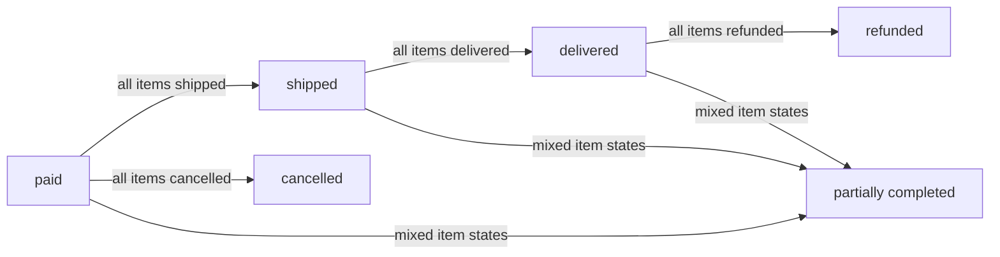

Individual order status transitions occur as sellers ship items, customers confirm delivery, or cancellation and refund requests are approved.

### Order Total Price

The order total price reflects the combined cost of all order items within the order. The total is the sum of each order item's subtotal, where each item subtotal equals the item's quantity multiplied by its unit price (quantity and unit price defined in the OrderItem concept).

### Shipping Address Preservation

The shipping address selected by the customer during checkout is preserved within the order record at the time of purchase. Once the order is placed, the shipping address cannot be changed, ensuring a permanent record of the delivery destination for the transaction.

### Multi-Seller Order Items

Order items within the same order may originate from different sellers, enabling customers to purchase products from multiple sellers in a single purchase transaction. Each order item retains its association with the corresponding seller and carries independent status tracking (details defined in the OrderItem concept).

### Transaction History

Orders form the permanent transaction history accessible to customers. Customer order lists present all orders belonging to that customer, sorted with the most recent order first.

Each order entry in the list displays the order number, order date, total price, and overall order status.

Order details provide a complete view of the transaction, including all order items with their product information, variant details, quantities, prices, and individual statuses. The preserved shipping address and associated shipment tracking information are also visible.

## OrderItem Concept

An order item represents an individual purchased product variant within an order transaction. Each order item records the quantity purchased and the unit price at the exact time of purchase, preserving these values permanently. Every order item maintains its own individual status independent of other items in the same order. Item statuses include paid showing waiting for shipment, shipped indicating dispatch, delivered confirming receipt, cancelled for pre-ship cancellations, and refunded for post-delivery returns. Order items can be individually cancelled or refunded regardless of the status of other items. When a customer purchases multiple of the same variant, they consolidate into a single order item with an increased quantity. Order items are grouped into shipments when sellers dispatch packages to customers.

### Item Quantity and Unit Price

Each order item captures the quantity purchased for a specific product variant and the unit price at the time of purchase. These values are permanently preserved and remain unchanged even if the product's current price or stock is later modified. When a customer purchases multiple units of the same variant in a single checkout, all units are consolidated into a single order item with an increased quantity. This consolidation ensures that the order item serves as a unified record for that variant within the order.

### Item Status and Status Independence

Every order item maintains its own individual status that reflects its current position in the fulfillment lifecycle. An item with a paid status indicates the payment is completed and the item is awaiting shipment by the seller. An item with a shipped status indicates the seller has dispatched the item. An item with a delivered status confirms receipt by the customer. An item with a cancelled status indicates the item was cancelled before shipping. An item with a refunded status indicates the funds have been returned after delivery. The status of one order item does not affect the status of other items in the same order. This status independence allows different items within a single order to be at different stages — for example, one item may be delivered while another remains in a paid status awaiting shipment. The overall order status is derived from the collective statuses of all contained items.

### Individual Cancellation and Individual Refund

Cancellation actions are handled at the individual order item level, not at the entire order level. An item with a paid status (not yet shipped) can be cancelled by the customer submitting a cancellation request with a reason. The seller of that item can approve or reject the cancellation request. When approved, that specific item is cancelled, and its stock quantity is restored (referenced in InventoryRecord Concept). The remaining items in the order continue processing normally with their own independent statuses. If all items in an order are cancelled, then the entire order status becomes cancelled. Refund actions are handled at the individual order item level, not at the entire order level. An item with a delivered status can be refunded by the customer submitting a refund request with a reason. Refund requests can be submitted within 7 days of that item being delivered. The seller of that item can approve or reject the refund request. When approved, that specific item is refunded, and its stock quantity is restored. The remaining items in the order are unaffected by the refund. If all items in an order are refunded, then the entire order status becomes refunded. (Detailed cancellation request mechanics are defined in CancellationRequest Concept; detailed refund request mechanics are defined in RefundRequest Concept).

### Order Item Grouping

Order items from the same seller can be grouped (bundled) together into a single shipment package when the seller ships them. This grouping allows sellers to bundle multiple items into one physical package rather than shipping each item individually. Items from different sellers always ship in separate shipments, never grouped together. Once a shipment is created containing multiple items from the same seller, all items in that shipment share the same tracking information. A single order item belongs to exactly one shipment once created by the seller. The shipment groups items for logistics and tracking purposes, while each item retains its own status and independent lifecycle. (Shipment grouping mechanisms are defined in Shipment Concept).

### Purchase Snapshot

When an order is placed, a purchase snapshot is created for each order item. This snapshot captures the complete product information including the name and description, along with the specific variant details including the SKU code, option values, and price at the time of purchase. A snapshot of the seller's profile, including the shop name and logo, is also preserved with the order item. These snapshots are immutable and cannot be modified after creation. They ensure that customers, sellers, and administrators can always reference exactly what was purchased, even if the product, variant, or seller profile is later edited or deleted. (General snapshot mechanics are defined in Snapshot Concept).

## Shipment Concept

A shipment represents a physical package sent by a seller containing one or more order items destined for the customer. Each shipment includes carrier name and tracking number for delivery monitoring and customer visibility. Shipments group order items from the same seller together, ensuring different sellers always create separate shipments. Sellers can choose to bundle multiple items into a single shipment or ship items individually as separate packages. All items within the same shipment share identical tracking information and delivery confirmation status. When a customer confirms receiving a shipment, all items in that shipment transition to delivered status together. Automatic delivery confirmation occurs after fourteen days from shipping if the customer does not manually confirm.

### Shipment Entity

A shipment represents a physical package dispatched by a seller to deliver one or more order items to the customer. Each shipment is identified by the carrier name and tracking number entered by the seller at the time of dispatch.

**Key Attributes:**

| Attribute | Description |
|-----------|-------------|
| Carrier name | The logistics carrier responsible for delivering the package |
| Tracking number | The unique identifier used to monitor delivery progress |
| Status | The current delivery state of the shipment |

**Package Grouping and Single-Seller Constraint:**

A shipment groups order items from the same seller together into a single package. Different sellers always create separate shipments, even when order items from multiple sellers are part of the same order. A seller may choose to bundle multiple order items into one shipment or dispatch each item individually as separate shipments.

**Tracking Information Sharing:**

All order items within the same shipment share the same carrier name and tracking number. Customers can view tracking information at the shipment level to monitor the delivery status of their package.

**Delivery Confirmation and Automatic Delivery:**

Delivery confirmation operates on the shipment level rather than the individual item level. When the customer confirms receipt of a shipment, all order items contained in that shipment transition to delivered status together. If the customer does not manually confirm delivery, the system automatically marks the shipment as delivered after fourteen days from the shipping date, and all included items transition to delivered status.

## Review Concept

A review represents customer feedback and evaluation of a purchased product. Each review contains a required rating on a one to five star scale providing numerical evaluation of the product quality. Optional text content allows customers to provide detailed written comments about their experience. Reviews appear on product detail pages sorted by newest first for other customers browsing the product. The review rating contributes to the product's average rating displayed prominently on listings and detail pages. Review visibility is maintained for product evaluation purposes while customer deletion changes review attribution to deleted user. Every review edit creates a snapshot preserving the original feedback for audit and dispute resolution.

### Review

A review is a customer feedback mechanism that captures product evaluation from buyers who have received their purchased items. Each review consists of two components:

- **Star Rating**: A required numerical evaluation on a scale of one to five stars, providing a quantitative measure of the customer's satisfaction with the product.
- **Text Content**: An optional written comment where customers can elaborate on their experience with the product, describing aspects such as quality, fit, or overall satisfaction.

The star rating provides the numerical evaluation while text content offers contextual detail. Customers can submit a review with only a star rating, or combine both elements for more comprehensive feedback.

When a customer edits their review, the system creates a snapshot preserving the previous version of both the star rating and text content. These review edit snapshots are immutable and maintain a complete audit trail of all modifications, even if the review is later deleted by its author.

### Review Visibility

Reviews remain visible on product detail pages for the purpose of ongoing product evaluation by potential buyers, even after the original reviewer deletes their customer account. When a customer deletes their account, their reviews continue to be displayed but are attributed to "deleted user" rather than showing the customer's display name.

Reviews from active customer accounts display the reviewer's identity. Reviews attributed to deleted accounts show the generic designation. Both types of reviews maintain their original star rating and text content.

This preservation of review visibility ensures that product evaluation history remains available to help other customers make informed purchasing decisions, regardless of whether the original reviewer maintains an active account on the platform.

### Average Rating Calculation

A product's average rating is calculated from all currently visible reviews associated with that product. The calculation includes star ratings from all reviews that have not been deleted, regardless of whether the reviewer's account is active or has been deleted.

Reviews attributed to "deleted user" continue to contribute their star rating to the average calculation. When a customer deletes their review, it is immediately excluded from the average.

The average rating reflects overall product evaluation by combining all non-deleted customer feedback into a single numerical representation displayed on product listings and detail pages.

## Snapshot Concept

A snapshot represents a preserved historical state of modified platform data for audit and dispute resolution purposes. Each snapshot records the timestamp when the change occurred and identifies which entity was modified. Snapshots capture both previous and current values documenting exactly what changed during the modification. Snapshots are immutable and cannot be deleted once created, ensuring permanent historical records. Snapshots exist for products, variants, seller profiles, order items, reviews, cancellation requests, and refund requests. Product snapshots include all product fields and complete variant snapshots at the moment of modification. Relevant parties including owners and administrators can view snapshots to resolve disputes or verify historical states.

### Snapshot Structure and Change History

A snapshot captures a historical record of platform data, ensuring data preservation across all modifications. It contains a snapshot timestamp identifying exactly when the modification occurred. Each record includes entity identification that specifies which business concept was altered, such as a product, product variant, seller profile, order item, review, or request. The snapshot documents the change history by recording previous values (the state before modification) and current values (the state after modification), establishing a clear audit trail of what changed during the modification.

### Snapshot Immutability

Snapshots are governed by a strict immutability requirement. Once generated, a snapshot cannot be edited or deleted by any user, including the entity owner or administrator. This ensures that change history and data preservation remain intact for the entire operational lifecycle of the platform.

### Product and Variant Snapshots

When product details or variant configurations are edited, a combined product snapshot is created. This snapshot preserves all product fields, such as name, description, category, and base price, alongside a product-snapshot variants relationship. It captures the complete state of every variant at that exact moment, including SKU codes, option values, individual prices, and stock quantities.

### Dispute Resolution Access

Snapshots are utilized for dispute resolution by providing verifiable, unalterable historical records of transactions and content states. Relevant parties, including entity owners and administrators, are authorized to view these snapshots to verify historical states. This transparency supports accountability and ensures that platform stakeholders can reference immutable records to resolve conflicting claims regarding product listings, order statuses, or profile updates.

## CancellationRequest Concept

A cancellation request represents a customer's formal request to cancel a specific order item before the seller has shipped it. Each request contains a textual reason explaining why the customer wants to cancel the order item. The request status tracks progress through pending awaiting seller response, approved indicating cancellation confirmed, or rejected meaning the seller declined. A timestamp records when the customer submitted the cancellation request for chronological records. The seller reviews the cancellation request and decides whether to approve or reject based on their judgment. When a seller responds to the request, a snapshot of the request state is created for historical documentation. Cancellations only apply to items with paid status, not items already shipped or delivered.

### Cancellation Request

A cancellation request is a formal business concept representing a customer's inquiry to cancel a specific purchased item. It applies strictly to item-level cancellation, meaning customers request the cancellation of individual order items rather than a bulk order cancellation. This process is restricted to pre-ship cancellation; it can only be initiated for order items with a paid status that have not yet been shipped or delivered.

Each cancellation request contains a cancellation reason, a required text attribute provided by the customer to justify the cancellation (such as a change of mind or accidental purchase). The system automatically records a cancellation timestamp to establish the chronological date and time of the submission. The request status tracks the progression of the cancellation, beginning in a pending state. While in the pending state, the item remains in its original paid status, and no refunds or inventory adjustments occur until resolution.

Resolution occurs through the seller response, where the seller reviews the pending request and decides whether to approve or reject it. Once the seller provides this response, the request status updates accordingly. Concurrently, the system performs request snapshot creation, generating an immutable record of the request's final state. This snapshot preserves the cancellation reason, the status decision, the associated order item details, and the relevant timestamps, providing historical documentation for administrative review and dispute resolution.

## RefundRequest Concept

A refund request represents a customer's formal request to receive a refund for a delivered order item. Each request contains a textual reason explaining why the customer wants a refund for the purchased product. The request status tracks progress through pending awaiting seller evaluation, approved indicating refund confirmed, or rejected meaning the seller declined. A timestamp records when the customer submitted the refund request for chronological tracking. Refund requests must be submitted within seven days of the individual item being delivered. The seller reviews the refund request and decides whether to approve or reject based on their assessment. When a seller responds to the request, a snapshot of the request state is created for audit purposes.

### Refund Reason

The refund reason is a textual attribute within a refund request. It captures the customer's explanation for why they are requesting the return of funds for a specific product they purchased.

### Request Status

The request status defines the current state of a refund request. Valid statuses are pending, signifying the request is awaiting review by the seller; approved, indicating the seller has accepted the refund request; and rejected, indicating the seller has declined the request.

### Refund Timestamp

The refund timestamp is an attribute that records the exact date and time when a customer initially submits a refund request. It serves as the chronological starting point for evaluating the eligibility of the request.

### Seven-Day Window

The seven-day window defines the temporal constraint for initiating a valid refund. It is calculated starting from the date an individual order item's status changes to delivered. Only requests submitted within this window are considered valid.

### Post-Delivery Refund

A post-delivery refund represents a refund request that is strictly applicable after an item has been marked as delivered. It ensures refunds are tied to completed transactions rather than pending or shipped orders.

### Item-Level Refund

An item-level refund is a domain concept restricting refund requests to a single order item. A single order containing multiple items can have separate, independent refund requests generated for each item individually.

### Seller Evaluation

The seller evaluation is the conceptual process associated with the request status transition. It represents the merchant's assessment of the refund reason and the validity of the request, culminating in an approved or rejected status.

### Request Snapshot Creation

Request snapshot creation is a data preservation mechanism triggered when a seller officially responds to a refund evaluation. It captures the exact state of the refund request immediately prior to the status change, maintaining an immutable record of the prior state for auditing and dispute resolution.

## SellerApprovalRequest Concept

A seller approval request represents a new merchant's registration request seeking platform approval to open a shop and sell products. Each request contains a reason explaining why the seller should be approved to operate on the platform. The request status tracks the application through pending awaiting administrator review, approved granting selling privileges, or rejected denying shop creation. Rejected sellers receive the rejection reason provided by the administrator explaining the denial. The request allows administrators to evaluate new sellers before they can create products and accept orders. Rejected sellers have the ability to submit a new registration request addressing the previous rejection. Sellers cannot sell products until their approval request reaches approved status.

### Seller Approval Request

The seller approval request is a business entity representing a merchant's application for platform approval to operate a shop on the e-commerce platform. It is created during the seller registration process and contains a seller reason explaining why the merchant should be allowed to sell products.

The request connects the seller registration workflow with the administrator review process. Sellers cannot access selling privileges until their application receives platform approval through administrator review.

The seller approval request links to the seller profile, which stores the merchant's commercial identity including shop name and description. Upon successful approval, the seller profile gains full merchant capabilities.

### Approval States

The approval status tracks the current evaluation stage of each seller application. Three approval states are supported:

- **Pending**: Initial state upon submission. The seller reason is recorded and awaiting administrator review. The seller cannot yet access selling privileges.

- **Approved**: The administrator has reviewed the application and granted platform approval. The seller now has selling privileges, including the ability to create products, manage variants, process orders, and respond to cancellation or refund requests.

- **Rejected**: The administrator has reviewed the application and denied platform approval. A rejection reason must be provided, explaining why the seller registration was not accepted. The rejection reason is visible to the seller for review.

The approval status determines whether the seller can exercise selling privileges. Only approved sellers can create or edit products and manage their shop operations.

### Resubmission

Rejected sellers retain the ability to submit a new seller request to reapply for platform approval. Each new seller request is treated as a separate application and undergoes independent administrator review.

A new seller request must include a seller reason. The seller may provide the same or updated reasoning in the new application. Previous seller requests and their rejection reasons remain available for reference during the review process.

The new seller request does not automatically inherit any status from previous applications. The administrator review evaluates the new request independently based on the provided seller reason and platform criteria.

## AdministratorRequest Concept

An administrator request represents a user's formal application to gain administrator privileges on the platform. Each request contains a reason explaining why the user should be elevated to administrator status. The request status tracks the application as either pending awaiting super administrator review or approved granting administrator access. Super administrators review the list of pending requests and decide whether to approve the elevation. When approved, the user becomes a regular administrator with platform oversight capabilities. Super administrators have the unique ability to promote regular administrators to super administrator status. The request system ensures controlled elevation of users to positions of platform authority. Only super administrators can reject administrator requests by simply not approving them.

### Administrator Request Attributes

An administrator request captures the attributes of a user's application for elevated platform roles. Each request contains an **administrator reason**, which is a descriptive text field where the applicant explains their justification for seeking administrator status. The **request status** tracks the lifecycle of this application, with possible values reflecting whether the request is pending super administrator review, approved, or rejected.

The administrator request is submitted by any platform user—whether a customer or seller—and is reviewed by super administrators. This formal record ensures that all privilege escalation attempts are documented and traceable.

### Elevation Request Concept

An **elevation request** represents the structured business entity that encapsulates a user's desire to assume administrator responsibilities on the platform. This type of **privilege request** serves as the formal mechanism through which users can apply for increased platform authority.

Functionally operating as a **permission request**, the elevation request requires super administrator review before any role changes can occur. The system treats each elevation request as a discrete entity that moves through the review workflow, ultimately resulting in either the granting of new platform roles or the denial of the application.

When an elevation request is approved, **user elevation** occurs: the applicant transitions from their current role (customer or seller) to a regular administrator, thereby gaining platform oversight capabilities. This elevation process ensures that only vetted users receive elevated access to platform management features.

### Super Administrator Review and Platform Authority

The **super administrator review** is the evaluation process through which pending administrator requests are assessed. Super administrators examine each submission, considering the provided administrator reason and any relevant user history, before deciding whether to approve or reject the request. This review mechanism ensures controlled elevation of users to positions requiring **platform authority**.

Platform authority defines the scope of oversight capabilities available on the system. Regular administrators receive platform authority to manage sellers, products, categories, orders, and user accounts. Super administrators possess the highest tier of platform authority, including the unique ability to promote regular administrators to super administrator status and demote other super administrators to regular administrator status. Super administrators cannot demote themselves.

The administrator request system, combined with the super administrator review process, ensures that all platform authority is granted through a transparent, documented, and reversible mechanism.

# Domain Relationships

Describe how concepts relate to each other from a business perspective.

## Conceptual Relationships

Describe how concepts relate to each other in business terms.

### User-Profile Relationship

Every user account on the platform belongs to exactly one profile type: either a customer profile or a seller profile. A user cannot hold both profile types simultaneously.

The user identity (email-based authentication) serves as the foundational anchor for the platform. The customer profile extends this identity with buyer-facing details such as display name and phone number. The seller profile extends the identity with commercial details such as shop name, shop description, and logo image.

This belongs-to relationship means:
- A single user account owns one profile, and that profile determines the user's role and available features.
- If a user deletes their account, the associated profile and all directly owned data (addresses, wishlist, cart for customers; products for sellers) are affected according to the deletion policy defined in [05-non-functional.md](./05-non-functional.md).

### Customer Association Structure

A customer profile has many associated entities that support the buying experience:

- **Shipping addresses**: A customer profile has many shipping addresses, each containing recipient name, phone number, street address, city, state/province, postal code, and country. One address may be designated as the default. Each address belongs to exactly one customer profile.

- **Wishlist entries**: A customer profile has many wishlist entries. Each wishlist entry references a product (not a specific variant) and records when the product was added. The wishlist belongs to exactly one customer profile.

- **Shopping cart**: A customer profile has one shopping cart containing multiple line items. Each cart item references a product variant and a quantity. The shopping cart belongs to exactly one customer profile.

- **Orders**: A customer profile has many orders. Each order belongs to exactly one customer profile and records the purchase transaction. An order includes an order number, order date, total price, and overall status derived from its items.

- **Shipping address used at checkout**: Each order belongs to one shipping address at the time of purchase. This association is fixed after the order is placed.

### Seller-Product Ownership

A seller profile owns products. This is a has-many relationship where one seller profile has many products, but each product belongs to exactly one seller.

- **Product-to-variants**: A product has many product variants. Each variant represents a specific option combination (such as color and size) and belongs to exactly one product. Variants include SKU code, option values, price, and stock quantity. Deleting a product also deletes all its variants.

- **Product-to-images**: A product has many product images, each associated with a sort order that determines display sequence. The first image in sort order serves as the main thumbnail. Images belong to the product they are attached to.

- **Category belongs-to**: Each product belongs to exactly one category. Categories support one level of nesting, meaning a subcategory belongs to a parent category. Products assigned to a subcategory are also visible when browsing the parent category.

- **Seller approval linkage**: Before a seller profile can own products, an administrator must approve the seller's registration. The seller approval request belongs to exactly one seller profile and tracks the approval status.

### Order Association and Shipping

An order has many order items. Each order item belongs to exactly one order and represents a specific product variant purchased with a quantity and unit price.

- **Order item status**: Each order item carries its own independent status. The overall order status is derived from the collection of its item statuses: all items paid indicates the order is paid, all items delivered indicates the order is delivered, and mixed states indicate the order is partially completed.

- **Shipment association**: A shipment belongs to exactly one seller profile (the seller shipping the items). A shipment has many order items, but all items within a shipment must originate from the same seller. Different sellers always ship separately.

- **One item, one shipment constraint**: An order item belongs to at most one shipment. Once assigned to a shipment, the item's status changes to shipped. Multiple items from the same seller may be bundled into a single shipment to share carrier name and tracking number.

- **Delivery confirmation**: Customers confirm delivery per shipment. When confirmed, all items belonging to that shipment transition to delivered status. If not confirmed by the customer, items automatically transition to delivered after fourteen days from the shipping date.

### Request and Review Associations

Several entities exist as optional has-one associations linked to order items or products:

- **Cancellation request**: An order item may have at most one cancellation request associated with it. The cancellation request belongs to exactly one order item and includes a reason and status. Only items with paid status may receive a cancellation request.

- **Refund request**: An order item may have at most one refund request associated with it. The refund request belongs to exactly one order item and includes a reason and status. Only items with delivered status may receive a refund request within seven days of delivery.

- **Review association**: A review belongs to exactly one product and is created by exactly one customer profile. Reviews link buyer feedback to the product being evaluated. Each review includes a rating and text content. A customer may write one review per product per order, but only after the purchased item reaches delivered status.

- **Snapshot linkage**: Snapshots associate with entities that support data preservation. When editable data changes, a snapshot records the timestamp, the entity affected, previous values, and new values. Snapshots belong to the entity they preserve and are immutable.

### Product-Review-Investigation Associations

Additional cross-entity associations support product discovery and platform oversight:

- **Product belongs-to-seller profile**: The ownership relationship between products and sellers extends beyond creation. Sellers maintain exclusive editing rights over their own products and can view snapshots of all changes made to their products.

- **Product receives reviews**: Products aggregate reviews from multiple customers. The product detail page displays all reviews sorted by newest first and calculates an average rating from non-deleted reviews. Reviews remain associated with the product even if the customer who wrote them deletes their account.

- **Product variant to inventory**: Each product variant has many inventory records. Inventory records track individual quantity changes rather than snapshots, recording the direction of change (restocking or deduction), the reason, and the timestamp. The current stock quantity is calculated as the sum of all inventory records for a variant.

- **Seller dashboard aggregation**: A seller profile aggregates information across its associated products, order items, cancellation requests, and refund requests. The dashboard displays counts of products, order items, and pending requests to provide an overview of shop activity.

## Lifecycle and Retention

Describe concept lifecycle states and transitions only. Detailed retention/recovery policies belong in 05-non-functional. Operation details belong in 03-functional-requirements.

### Customer Lifecycle

Customer accounts transition through active, banned, and deleted states.

WHEN a customer account is banned by an administrator, THE system restricts login capabilities and hides customer-facing features.
WHILE banned, THE customer cannot log in or use platform features.
WHEN an administrator unbans a customer, THE system restores the active state and enables access.

WHEN a customer deletes their account, THE system transitions the account to the deleted state.
WHEN a customer account is deleted, THE customer profile information is permanently removed.
WHEN a customer account is deleted, THE system permanently preserves the customer's order history and review content.
WHILE in the deleted state, THE customer's reviews display the reviewer as "deleted user" on product detail pages.
WHEN a customer account is deleted, THE system prevents any recovery of the deleted account.

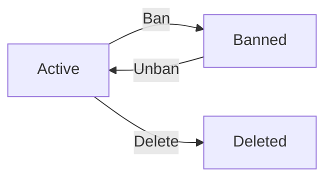

### Seller Lifecycle

Seller accounts transition through pending, approved, rejected, active, suspended, and deleted states.

WHEN a seller registers, THE system places the account in the pending state awaiting administrator review.
WHEN an administrator approves a pending registration, THE system transitions the seller to the active state.
WHEN an administrator rejects a pending registration, THE system transitions the seller to the rejected state.
WHEN a seller account is rejected, THE seller may submit a new registration request to return to the pending state.

WHEN an administrator suspends an approved seller, THE system transitions the account to the suspended state.
WHILE suspended, THE seller cannot log in, cannot create products, cannot edit products, and customer-facing systems hide the seller's products from search and category listings.
WHILE suspended, THE seller can still ship existing orders and respond to cancellation or refund requests.
WHEN an administrator unsuspends a seller, THE system restores the active state and makes products visible again.

WHEN a seller account is deleted, THE system transitions the account to the deleted state.
WHEN a seller is deleted, THE system removes products from search and category listings, preserves order history, preserves snapshots, and preserves the seller's shop name in past orders.
WHEN a seller account is deleted, THE system prevents any recovery of the deleted account.

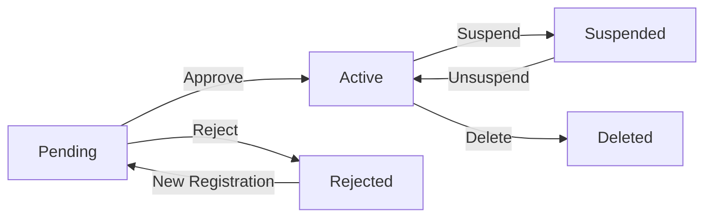

### Product Lifecycle

Products transition through active and deleted states.

WHEN a seller deletes a product, THE system transitions the product to the deleted state.
WHEN a product is deleted, THE system also deletes all associated product variants and inventory records.
WHEN a product is deleted, THE system removes the product from search results and category listings.
WHEN a product is deleted, THE system prevents any recovery of the deleted product.

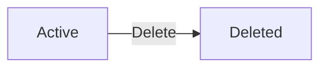

### Review Lifecycle

Review content transitions through active and deleted states.

WHEN a customer edits a review, THE system records the edit via a snapshot and displays the updated review content.
WHEN a review is edited, THE system retains the review in the active state.
WHEN a customer deletes a review, THE system transitions the review to the deleted state.
WHEN a review is deleted, THE system removes the review from the product detail page.
WHEN a review is deleted, THE system prevents any recovery of the deleted review.
WHEN a review is deleted, THE system preserves the associated snapshot for future reference.

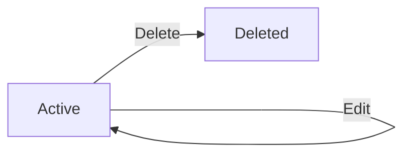

### Order Item Lifecycle

Order items transition through paid, shipped, delivered, cancelled, and refunded states.

WHEN payment succeeds for an order, THE system creates the order and transitions each item to the paid state.
WHEN a seller ships items, THE system transitions the included items to the shipped state.
WHEN a customer confirms delivery for a shipment, THE system transitions all items in that shipment to the delivered state.
WHEN 14 days pass after shipping without customer confirmation, THE system automatically transitions the items to the delivered state.

WHEN a seller approves a cancellation request, THE system transitions the item to the cancelled state.
WHEN a seller approves a refund request, THE system transitions the item to the refunded state.

WHEN an item transitions to cancelled or refunded, THE system preserves the snapshot taken at the time of purchase.

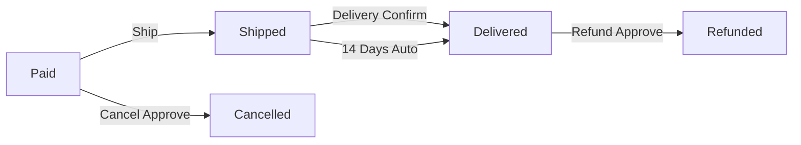

### Request Lifecycle

Cancellation and refund requests transition through pending and concluded states.

WHEN a customer submits a cancellation or refund request, THE system places the request in the pending state.
WHEN a seller approves or rejects a request, THE system transitions the request to the concluded state.
WHEN a seller responds to a request, THE system creates a snapshot of the request state.
WHEN a request is concluded, THE system preserves the snapshot for dispute resolution.

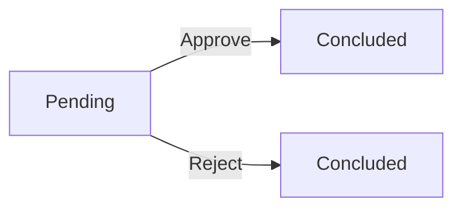

### Snapshot Lifecycle

Snapshots record every modification to editable platform data. Snapshots enter a permanently preserved state upon creation.

WHEN a user modifies any editable entity, THE system creates a snapshot of the previous state.
WHEN a snapshot is created, THE system transitions it to the preserved state.
WHILE preserved, THE system prevents any modification or deletion of the snapshot.
WHEN a parent entity is deleted, THE system preserves its associated snapshots.
WHEN a review is deleted, THE system preserves its associated snapshots.
WHEN a cancellation or refund request changes state, THE system preserves snapshots of request transitions.
WHILE preserved, THE system retains the change timestamp, modified entity identification, and the values before and after the change.
WHILE preserved, THE system allows relevant parties to view snapshots for dispute resolution.

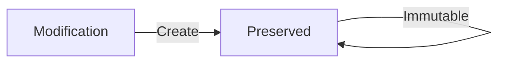

### Retention

The platform retains specific data items permanently to ensure legal compliance and dispute resolution, even when related entities are deleted.

WHEN a customer deletes their account, THE system permanently retains the customer's order history.
WHEN a customer deletes their account, THE system permanently retains the customer's review content.
WHEN a seller deletes their account, THE system permanently retains the seller's order history.
WHEN a seller deletes their account, THE system permanently retains the seller's snapshots.
WHEN a seller deletes their account, THE system permanently retains the seller's shop name in past orders.
WHEN a product is deleted, THE system permanently retains snapshots of the product and its variants.

### Deletion Policy and Recovery

Deleted entities are permanently removed from active search, listings, and customer-facing views. Deleted entities cannot be restored.

WHEN a customer account is deleted, THE system permanently removes the account and prevents recovery.
WHEN a seller account is deleted, THE system permanently removes the account and prevents recovery.
WHEN a product is deleted, THE system permanently removes the product, its variants, and its inventory records and prevents recovery.
WHEN a review is deleted, THE system permanently hides the review from the product detail page and prevents recovery.

# Business Categories and State Flows

Business category classifications and state flow definitions.

## Business Category Definitions

Define all business category classifications with their allowed values and descriptions.

### Seller Account Approval Classification

The system classifies seller account registrations into a seller account approval status to manage merchant onboarding and platform compliance. The allowed values for seller approval status include Pending, Approved, and Rejected. A Pending status indicates the seller account is awaiting administrative review before active selling privileges are granted. An Approved status indicates the system classifies products listings and variant stock levels into a product availability status classification to control marketplace browsing and purchasing constraints. The allowed values for product visibility include Purchasable and Unavailable. A Purchasable status indicates the product has at least one variant and appears in search and category listings. An Unavailable status indicates the product has zero variants or is hidden by administrative suspension, causing the system to remove it from active listings. The allowed values for variant inventory include In Stock and Out of Stock. An In Stock status indicates a variant's inventory quantity is greater than zero. An Out of Stock status indicates a variant's inventory quantity reaches zero, prompting the system to prevent the variant from being added to the shopping cart, and the variant shows 'out of stock' in the marketplace.

### Order and Order Item Lifecycle Classification

The system classifies purchase transactions into an order item and overall order lifecycle status classification to track fulfillment progress and financial reconciliation. The allowed values for order item status include Paid, Shipped, Delivered, Cancelled, and Refunded. A Paid status indicates payment has been received, stock has been deducted, and the seller is awaiting shipping preparation. A Shipped status indicates the seller has created a shipment, prompting the system to update tracking information for the customer. A Delivered status indicates the customer or system has confirmed receipt, finalizing the item's lifecycle. A Cancelled status indicates the transaction was terminated before shipping, triggering the system to create a negative inventory record. A Refunded status indicates the transaction was reversed after delivery, also triggering a positive inventory record to restore stock. The allowed values for overall order status include Paid, Shipped, Delivered, Cancelled, Refunded, and Partially Completed. A Partially Completed status indicates the overall order has mixed final states across its items, such as some delivered and others refunded.

### Cancellation and Refund Request Classification

The system classifies post-purchase dispute resolutions into a request status classification to standardize return and reversal workflows. The allowed values for cancellation and refund requests include Pending, Approved, and Rejected. A Pending status indicates the customer has submitted a request, and the seller or administrator is actively reviewing the submission. An Approved status indicates the request has been authorized, automatically triggering stock restoration and financial reversal for the specific item. A Rejected status indicates the system classifies the request declined, the system maintains the original order item status without inventory adjustments. The system classifies an immutable snapshot for every state change within this classification to preserve transaction history for dispute resolution.

### Administrative Privilege Classification

The system classifies platform oversight roles into a privilege level classification to enforce hierarchical management controls. The allowed values for administrative roles include Regular Administrator and Super Administrator. A Regular Administrator status indicates the user possesses standard oversight privileges, which encompass seller approvals, product deletions for policy violations, order force-cancellations, and customer account bans. A Super Administrator status indicates the user holds elevated privileges to manage the administrator team, including the authority to promote regular administrators to super administrators and demote other super administrators back to regular administrators. The system prevents super administrators from demoting their own account to maintain platform security and operational continuity.

## State Transitions

Define valid state transition paths for stateful concepts.

### Seller Account Lifecycle

Sellers must be approved to sell on the platform.

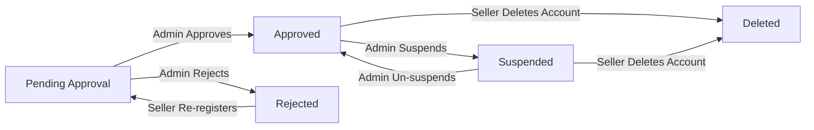

- WHEN a seller completes registration, THE system SHALL set their status to 'Pending Approval'.
- WHEN an administrator approves a seller, THE system SHALL transition their status to 'Approved'.
- WHEN an administrator rejects a seller, THE system SHALL transition their status to 'Rejected'.
- WHEN a rejected seller submits a new registration request, THE system SHALL transition their status back to 'Pending Approval'.
- WHEN an administrator suspends an approved seller, THE system SHALL transition their status to 'Suspended'.
- WHEN an administrator un-suspends a seller, THE system SHALL transition their status back to 'Approved'.
- WHEN a seller deletes their account, THE system SHALL transition their status to 'Deleted' and hide products from listings while preserving history.

### Product Availability Status

Product availability determines purchase eligibility.

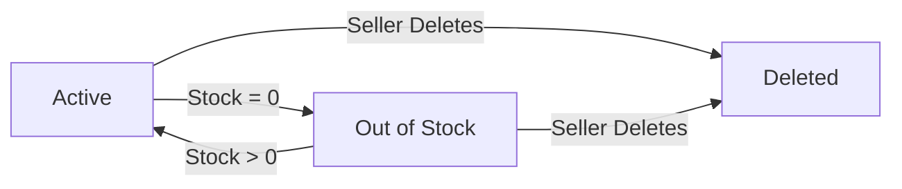

- WHEN a product has at least one variant with stock greater than zero, THE system SHALL display the product status as 'Active'.
- WHEN the total stock of all variants for a product reaches zero, THE system SHALL display the product status as 'Out of Stock'.
- WHEN a variant is added to an out-of-stock product and stock is positive, THE system SHALL transition the product status to 'Active'.
- WHEN a seller deletes a product, THE system SHALL transition the product status to 'Deleted' and remove it from search and category listings.

### Order and Order Item Workflow

Orders progress through a lifecycle of processing and fulfillment.

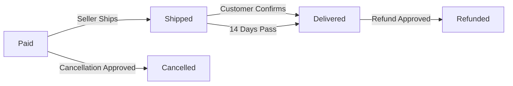

- WHEN a customer successfully completes payment, THE system SHALL create order items with the status 'Paid'.
- WHEN a seller creates a shipment for order items, THE system SHALL transition the included item statuses to 'Shipped'.
- WHEN a customer confirms delivery of a shipment, THE system SHALL transition the included item statuses to 'Delivered'.
- WHEN 14 days pass since a shipment was created without customer confirmation, THE system SHALL automatically transition the included item statuses to 'Delivered'.
- WHEN a cancellation request for an order item is approved, THE system SHALL transition the item status to 'Cancelled'.
- WHEN a refund request for an order item is approved, THE system SHALL transition the item status to 'Refunded'.
- IF all items in an order are 'Paid', THEN THE system SHALL set the overall order status to 'Paid'.
- IF any item is 'Shipped' and none are 'Delivered', THEN THE system SHALL set the overall order status to 'Shipped'.
- IF all items in an order are 'Delivered', THEN THE system SHALL set the overall order status to 'Delivered'.
- IF all items in an order are 'Cancelled', THEN THE system SHALL set the overall order status to 'Cancelled'.
- IF all items in an order are 'Refunded', THEN THE system SHALL set the overall order status to 'Refunded'.
- IF items in an order are in mixed states, THEN THE system SHALL set the overall order status to 'Partially Completed'.

### Cancellation and Refund Request Workflows

Individual items can be cancelled or refunded.

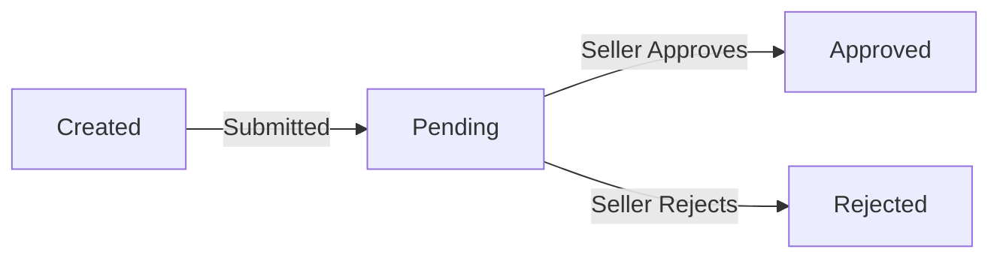

- WHEN a customer submits a cancellation request for an item with status 'Paid', THE system SHALL set the request status to 'Pending'.
- WHEN a seller approves a pending cancellation request, THE system SHALL transition the request status to 'Approved' and transition the corresponding item status to 'Cancelled'.
- WHEN a seller rejects a pending cancellation request, THE system SHALL transition the request status to 'Rejected'.
- WHEN a customer submits a refund request for an item with status 'Delivered', THE system SHALL set the request status to 'Pending'.
- WHEN a seller approves a pending refund request, THE system SHALL transition the request status to 'Approved' and transition the corresponding item status to 'Refunded'.
- WHEN a seller rejects a pending refund request, THE system SHALL transition the request status to 'Rejected'.

### Administrator Promotion Request Workflow

Users can request administrative privileges.

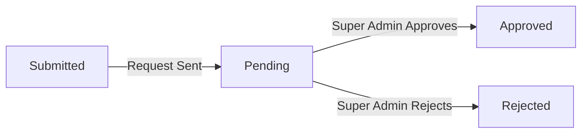

- WHEN a user submits a request to become an administrator, THE system SHALL set the request status to 'Pending'.
- WHEN a super administrator approves a pending request, THE system SHALL transition the request status to 'Approved' and grant the user regular administrator privileges.
- WHEN a super administrator rejects a pending request, THE system SHALL transition the request status to 'Rejected'.