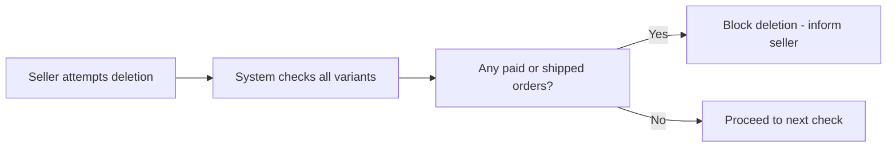
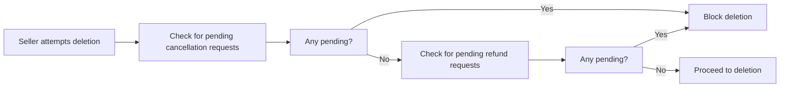
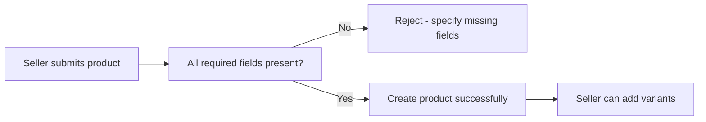
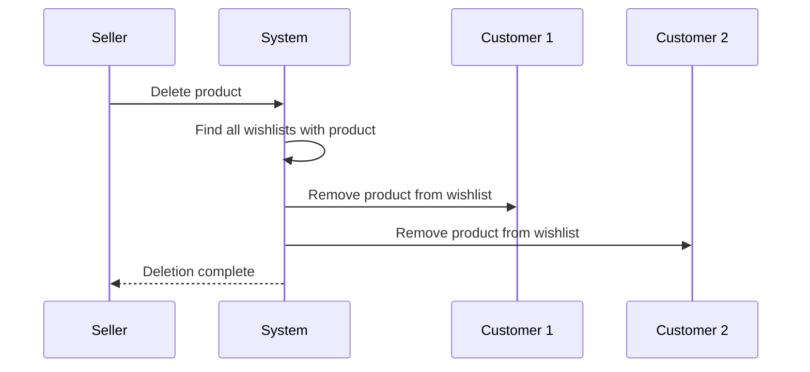

**ecommercePlatform — What operations users can perform, use cases, business workflows**

What operations users can perform, use cases, business workflows

# Core Business Operations

What the system must do for each business concept.

## User Operations

Users register for the platform with email and password. All platform features require customer or seller registration; guest browsing is not available. Customers log in with their registered email and password to access the platform. Customers can change their account password at any time for security. When a customer deletes their account, their profile information is permanently removed from the system. Customer order history and reviews are preserved for seller records and legal purposes after account deletion. Deleted customer reviews show as being from a deleted user instead of the customer name. Sellers register for the platform with email and password for selling access. Sellers log in with their registered email and password to access the seller dashboard. Sellers can change their account password at any time for security. Sellers can delete their account only if they have no pending orders with paid or shipped status. Sellers cannot delete their account when pending cancellation or refund requests exist for any products. When a seller deletes their account, their products are removed from platform listings completely. The seller's shop name is preserved in past orders for historical records. Customer and seller registration required for all platform access and features.

### Customer Registration and Access

WHEN a user submits their email address and desired password, THE ecommercePlatform SHALL create a new customer account and grant access to all platform features.

WHEN a user attempts to access any platform feature, THE ecommercePlatform SHALL require customer or seller registration before granting access.

### Customer and Seller Login

WHEN a customer submits their registered email address and correct password, THE ecommercePlatform SHALL log the customer in and provide access to the platform.

WHEN a seller submits their registered email and correct password, THE ecommercePlatform SHALL log the seller in and provide access to the platform.

### Seller Registration and Approval

WHEN a user submits their email address and desired password, THE ecommercePlatform SHALL create a new seller account with pending approval status.

WHEN a seller account has approved status, THE ecommercePlatform SHALL grant the seller full selling capabilities including product creation and order management.

WHEN a seller account has pending status, THE ecommercePlatform SHALL restrict the seller from creating or listing products.

WHEN a seller account has rejected status, THE ecommercePlatform SHALL prevent the seller from listing products until a new registration request is approved.

### Customer Account Deletion

WHEN a customer requests to delete their account, THE ecommercePlatform SHALL permanently remove their profile information including display name and phone number.

WHEN a customer deletes their account, THE ecommercePlatform SHALL preserve all order records and order history associated with that customer.

WHEN a customer deletes their account, THE ecommercePlatform SHALL preserve all reviews written by that customer but display them as being from a deleted user instead of showing the customer's display name.

WHEN a customer deletes their account, THE ecommercePlatform SHALL prevent that customer account from logging in again.

### Seller Account Deletion

IF a seller has pending orders with paid or shipped status, THEN THE ecommercePlatform SHALL reject the seller account deletion request.

IF a seller has pending cancellation requests for any of their products, THEN THE ecommercePlatform SHALL reject the seller account deletion request.

IF a seller has pending refund requests for any of their products, THEN THE ecommercePlatform SHALL reject the seller account deletion request.

WHEN a seller account deletion is allowed, THE ecommercePlatform SHALL remove all products from that seller from platform listings and search results.

WHEN a seller account is deleted, THE ecommercePlatform SHALL preserve all order history and order snapshots for completed transactions.

WHEN a seller account is deleted, THE ecommercePlatform SHALL preserve the seller shop name in all past order records for historical reference.

### Password Changes

WHEN a customer requests to change their password, THE ecommercePlatform SHALL update the password and allow the customer to log in with the new password.

WHEN a seller requests to change their password, THE ecommercePlatform SHALL update the password and allow the seller to log in with the new password.

## CustomerProfile Operations

Each customer has a profile storing their personal information for the platform. Customer profiles contain a display name and phone number for identification purposes. Customers can edit their display name at any time to update their public name. Customers can edit their phone number at any time to update contact information. Profile edits do not create snapshots and update the profile directly. Customers can view their own profile information at any time. The customer's display name appears on their orders, reviews, and account details. The customer's phone number appears on their account for contact purposes only. There are no restrictions on editing display name or phone number fields. Customer profile information is permanently deleted when they delete their account. The default profile information is required when creating a customer account.

### Customer Display Name Editing

WHEN an authenticated customer submits a new display name, THE system SHALL update the customer profile with the new display name.

THE system SHALL apply display name updates immediately upon saving.

Display name updates SHALL modify the profile directly without creating a snapshot.

WHEN a display name is updated, THE system SHALL replace the previous display name with the new value.

Display name edits apply immediately to the customer profile and are reflected wherever the display name is displayed.

### Customer Phone Number Editing

WHEN an authenticated customer submits a new phone number, THE system SHALL update the customer profile with the new phone number.

THE system SHALL apply phone number updates immediately upon saving.

Phone number updates SHALL modify the profile directly without creating a snapshot.

WHEN a phone number is updated, THE system SHALL replace the previous phone number with the new value.

Phone number edits apply immediately to the customer profile.

### Customer Profile Viewing

WHEN an authenticated customer views their profile, THE system SHALL display the customer's current display name.

WHEN an authenticated customer views their profile, THE system SHALL display the customer's current phone number.

THE customer profile view SHALL reflect the most recent display name and phone number.

### Customer Profile Updates

WHEN a customer's display name or phone number is edited, THE system SHALL update the profile directly without creating a snapshot.

Profile edits SHALL modify the profile immediately rather than preserving previous states.

Previous values of display name and phone number SHALL not be retained for rollback or audit purposes.

### Customer Profile Deletion

WHEN an authenticated customer deletes their account, THE system SHALL permanently delete the customer profile.

Profile deletion SHALL remove the display name and phone number.

Profile deletion is permanent and cannot be undone.

### Public Display Name Visibility

THE customer's display name SHALL be publicly visible on their orders.

THE customer's display name SHALL be publicly visible on their reviews as the reviewer identifier.

THE customer's display name SHALL appear on the product detail page as the reviewer name.

THE customer's display name reflects on the profile and updates immediately when edited.

### Customer Contact Information

THE customer's phone number SHALL be stored in the profile for contact purposes.

THE customer's phone number SHALL NOT be publicly visible to other users on the platform.

The phone number serves as the customer's primary contact information.

## ShippingAddress Operations

Customers can add multiple shipping addresses to their account for order deliveries. Each address requires a recipient name, phone number, street address, city, state or province, postal code, and country. Customers can edit any previously saved address with updated information for accuracy. Customers can delete individual addresses that are no longer needed from their account. Customers can set one address as the default shipping address for automatic checkout selection. The default address is automatically used during checkout but customers can change it. All shipping addresses are associated with the customer who created and manages them. Address changes do not create snapshots when edited or deleted. Customers manage their shipping addresses for delivery convenience.

### Shipping Address Creation

THE system SHALL allow customers to create shipping addresses for their account.

WHEN a customer adds a new shipping address, THE system SHALL capture the recipient name, phone number, street address, city, state or province, postal code, and country.

WHEN a shipping address is successfully created, THE system SHALL link it to the customer account of the creating customer.

THE system SHALL allow customers to maintain multiple shipping addresses on their account for use during different orders.

### Shipping Address Editing

THE system SHALL allow customers to edit any of their saved shipping addresses.

WHEN a customer updates a shipping address, THE system SHALL replace the old field values with the new information provided.

THE system SHALL allow customers to modify the recipient name, phone number, street address, city, state or province, postal code, or country independently when editing a saved address.

### Shipping Address Deletion

THE system SHALL allow customers to remove individual shipping addresses from their account.

WHEN a customer deletes a shipping address, THE system SHALL remove it permanently from their list of saved addresses.

THE system SHALL allow customers to retain and use remaining addresses after deleting one address from their account.

### Default Address Setting

THE system SHALL allow customers to designate one saved address as their default shipping address.

WHEN a customer sets a default address, THE system SHALL mark it for automatic selection during future checkout processes.

THE system SHALL allow customers to change which saved address is designated as the default at any time.

WHEN a customer proceeds to checkout, THE system SHALL pre-select the default shipping address while allowing the customer to choose a different saved address if desired.

## SellerProfile Operations

Each seller has a profile containing shop information for the platform. Seller profiles include a shop name, shop description, and logo image representing their brand. Sellers can edit their shop name at any time to update their shop identity. Sellers can edit their shop description at any time to update their shop details. Sellers can edit their logo image at any time to change their brand appearance. Every seller profile edit creates a snapshot to preserve the previous seller profile state. Customers can view seller profiles to learn about sellers on the platform. The seller shop name appears on product listings and order history records. The seller logo image represents the seller's brand on the platform. Seller profile information is managed only by the seller who owns the profile. Profile changes are recorded in snapshots for dispute resolution and historical tracking.

### Seller Profile Information Editing

WHENA seller edits their profile, THE ecommercePlatform SHALL allow the seller to update their shop name.
WHENA seller edits their profile, THE ecommercePlatform SHALL allow the seller to update their shop description.
WHENA seller edits their profile, THE ecommercePlatform SHALL allow the seller to update their logo image.
WHENA seller submits profile changes, THE ecommercePlatform SHALL apply the updated shop name, shop description, or logo image immediately.
IF a non-owner attempts to edit a seller profile, THEN THE ecommercePlatform SHALL reject the edit request.
WHENA seller makes any profile change, THE ecommercePlatform SHALL allow the change to be made at any time.

Sellers can edit their shop name, shop description, and logo image to manage their seller profile.
Profile updates are applied immediately upon submission.
Only the seller who owns the profile can edit seller profile information.

### Customer Seller Profile Browsing

WHENA customer navigates product detail pages, THE ecommercePlatform SHALL provide customer seller profile browsing by displaying a link to the seller profile.
WHENA customer follows a seller profile link, THE ecommercePlatform SHALL display seller profile viewing for customers showing the shop name, shop description, and logo image.
WHENA customer reviews order history, THE ecommercePlatform SHALL provide links to seller profiles within order item details for customer seller profile browsing.

Customers can view seller profiles to learn about sellers on the platform.
The seller profile page displays the shop name, shop description, and logo image.
Links to seller profiles are available from product detail pages and order history records.

### Seller Profile Snapshot Creation

WHENA seller edits their shop name, shop description, or logo image, THE ecommercePlatform SHALL trigger seller profile snapshot creation.
WHENA seller profile snapshot creation occurs, THE ecommercePlatform SHALL record the timestamp of the change.
WHENA seller profile snapshot creation occurs, THE ecommercePlatform SHALL record the seller profile identifier.
WHENA seller profile snapshot creation occurs, THE ecommercePlatform SHALL preserve the before values and after values of the change.
WHENA snapshot is created, THE ecommercePlatform SHALL ensure the snapshot is immutable and cannot be edited or deleted.
WHENA relevant party views snapshot records, THE ecommercePlatform SHALL allow viewing of seller profile snapshot creation records for dispute resolution and historical tracking.

Every seller profile edit creates a snapshot preserving the previous seller profile state.
Snapshots record when the change was made and the values before and after.
Snapshots are immutable for dispute resolution and historical tracking.

### Seller Brand Representation on Products

WHENA customer views product listings, THE ecommercePlatform SHALL display seller shop visibility on products by showing the seller's shop name.
WHENA customer views product detail pages, THE ecommercePlatform SHALL display seller brand representation through the shop name and logo image.
WHENA seller updates their profile, THE ecommercePlatform SHALL update seller brand representation on all product listings and detail pages to reflect current profile values.
WHENA customer views order history records, THE ecommercePlatform SHALL preserve the shop name from the seller profile snapshot at the time of purchase for seller brand representation.
WHENA seller logo image is updated, THE ecommercePlatform SHALL display the current logo image on all visible product information for seller brand representation.

The seller shop name appears on product listings and product detail pages.
The seller logo image represents the seller's brand on product information.
Seller shop name is preserved in order history records through snapshots.
Current profile values are used as the active seller brand representation on product displays.

## Category Operations

Products on the platform are organized into categories for browsing. Each category has a name and description that help customers find related products. Categories can have subcategories with one level of nesting only; subcategories cannot have their own subcategories. Categories are created and managed exclusively by platform administrators only. Customers can browse the complete list of all categories available on the platform. Customers can view products within any category they choose for browsing. Administrators can edit category names and descriptions at any time for updates. When a category is deleted, any products in that category become uncategorized in listings. Category structures help organize the product catalog on the platform. Category information is visible to all customers browsing the marketplace.

### Category Creation

Administrators can create new top-level categories with a name and description.

Administrators can create subcategories within existing top-level categories.

Subcategories can only be nested one level deep; subcategories cannot have their own subcategories.

Creating a category immediately makes it available for product assignment and customer browsing.

Category creation is restricted to administrators only; customers and sellers cannot create categories.

### Category Editing

Administrators can edit the name of an existing category or subcategory.

Administrators can edit the description of an existing category or subcategory.

Changes to category names and descriptions take effect immediately for all users browsing the platform.

Editing a category does not affect the products associated with that category.

### Category Deletion

Administrators can delete any top-level category or subcategory.

When a category is deleted, all products that were associated with it become uncategorized.

Uncategorized products remain viewable but no longer appear under any category.

Deleting a parent category does not automatically delete its subcategories; subcategories continue to exist independently.

### Category Browsing

Customers can browse the complete list of all categories available on the platform.

The category list displays the name and description for each category.

Subcategories are shown nested under their parent category in the browsing list.

The category hierarchy clearly indicates the distinction between top-level categories and subcategories.

### Products Within Categories

Customers can select any category or subcategory to view all products listed within it.

Products assigned to a subcategory appear in the product listing of that subcategory.

Products that have become uncategorized due to their previous category being deleted are excluded from all category listings.

## Product Operations

Sellers can create products on their shop for customers to purchase. Every product requires a name, description, category selection including a subcategory, and base price. Products belong to the seller who created them originally. Sellers can edit their own products with updated information at any time. Every product edit creates a snapshot to preserve the previous product state. Sellers can delete their own products only if there are no pending order items with paid or shipped status. Sellers cannot delete products with pending cancellation or refund requests from customers. Deleted products no longer appear in search results or category listings. Sellers can view snapshots of their own products for historical records. Administrators can view snapshots of any product on the platform. All deleted products preserve their snapshots for historical records and dispute resolution.

### Product Creation Requirements

WHEN a seller creates a new product, THE system SHALL require the seller to provide all mandatory product information. Product creation requires a product name, product description, category or subcategory selection, and a base price. The system shall not create a product if any of these required fields are missing from the submission. Products automatically belong to the seller who creates them.

### Product Name Required Entry

THE product name is a required entry for every product. When a seller submits a product for creation, they must provide a product name. The system validates that a product name has been provided before proceeding with the product creation process.

### Product Description Required Entry

THE product description is a required entry for every product. When a seller submits a product for creation, they must provide a product description. The system validates that a product description has been provided before proceeding with the product creation process.

### Category and Subcategory Selection

Products can be organized in categories or subcategories. During product creation, sellers must select either a top-level category or a subcategory. The system presents available categories and subcategories for selection. Products are linked to the selected category or subcategory upon successful creation.

### Base Price Required Entry

THE base price is a required entry for every product. When a seller submits a product for creation, they must specify a base price. The system validates that a base price has been provided before proceeding with the product creation process.

### Product Editing by Sellers

Sellers can edit their own products at any time to update product information. When editing a product, sellers can modify the product name, product description, category or subcategory selection, and base price. Products created by other sellers cannot be edited by a seller.

### Product Snapshot Creation on Edits

WHEN a seller edits a product, THE system SHALL create a snapshot to preserve the previous product state. Product snapshots record the timestamp of when the edit occurred, which fields were changed, and the values before and after the edit. Snapshots are immutable once created and cannot be deleted or modified. Image changes are included in product snapshots as part of the product edit process.

### Product Deletion Restrictions

Sellers can delete their own products. Product deletion is restricted when pending orders, pending cancellation requests, or pending refund requests exist for the product variants.

### Pending Order Item Restrictions

A product cannot be deleted if there are pending order items with paid or shipped status associated with any variant of the product. The system prevents product deletion and displays a notification when pending order items exist. Pending order items remain active even if the number is small.

### Search Listing Removal on Deletion

WHEN a product is deleted, THE system SHALL remove the product from search results and category listings. Deleted products are no longer visible to customers through product search or category navigation. Deleted products also remove their associated variants and inventory records from the system.

### Seller Product Snapshot Viewing

Sellers can view snapshots of their own products to access historical product information. Product snapshots are visible to sellers who created the products. Snapshots preserve product history even after the product has been deleted from the catalog.

### Administrator Product Oversight

Administrators can view snapshots of any product on the platform regardless of which seller created the product. This capability supports product oversight and policy enforcement activities. Administrators can access the complete snapshot history of products they are investigating.

## ProductVariant Operations

Products can have multiple variants representing different option combinations such as color and size. Each variant has a unique SKU code, option values, an optional override price, and stock quantity starting at zero. Sellers add variants to products to offer different purchasing options. Sellers can edit variants by updating SKU codes, option values, and prices at any time. Every variant edit creates a snapshot to preserve the previous variant state. Sellers can delete variants only if there are no pending order items for that variant with paid or shipped status. Sellers cannot delete variants with pending cancellation or refund requests from customers. A product must have at least one variant to be purchasable by customers. Products with no variants are shown as unavailable but remain visible in search results. Each variant is tracked individually for inventory and ordering purposes.

### Variant Creation and Configuration

WHEN a seller creates a new variant for their product, THE system SHALL require a unique SKU code as the variant identifier.

WHEN a seller adds a variant, THE system SHALL require option values that define the variant configuration, such as color and size combinations.

THE system shall allow sellers to create multiple variants for a single product, each with distinct SKU codes and option value combinations.

WHEN a seller creates a variant with an optional price override, THE system SHALL store the individual variant pricing separate from the product base price.

WHEN a seller creates a variant without specifying an override price, THE system SHALL use the product base price for that variant.

WHEN a seller adds a new variant to their product, THE system SHALL initialize the stock quantity at zero.

THE system shall associate each newly created variant with its parent product.

THE system shall allow sellers to view all variants associated with their products after creation.

### Variant Editing and Snapshot Recording

WHEN a seller edits their own variant, THE system SHALL allow updates to the SKU code, option values, and price.

WHEN a variant is edited, THE system SHALL create a snapshot recording the previous variant state.

Variant edit snapshots shall capture the SKU code, option values, and price as they existed before the edit.

Variant edit snapshots shall record the timestamp when the change occurred.

THE system shall preserve all variant edit snapshots as immutable records that cannot be modified or deleted.

THE system shall immediately apply variant edits so customers see the updated variant information.

THE system shall allow sellers to view snapshots of all their variant edits.

THE system shall allow administrators to view snapshots of any variant edit on the platform.

### Variant Deletion and Restrictions

WHEN a seller attempts to delete a variant with order items in paid or shipped status, THEN THE system SHALL block the deletion with a restriction notice.

WHEN a seller attempts to delete a variant with pending cancellation requests, THEN THE system SHALL block the deletion.

WHEN a seller attempts to delete a variant with pending refund requests, THEN THE system SHALL block the deletion.

WHEN a seller deletes a variant that has no blocking conditions, THE system SHALL remove the variant from the product.

WHEN a variant is deleted, THE system SHALL preserve all snapshots associated with that variant.

WHEN a variant is deleted, THE system shall allow the product to remain active if other variants exist.

A product with all variants deleted shall be shown as unavailable and cannot be purchased by customers.

### Variant Availability and Purchasing

WHEN a seller views their product variant list, THE system SHALL display each variant with its SKU code, option values, price, and current stock quantity.

THE system shall enable sellers to manage variants through creation, editing, and deletion operations on their own products.

WHEN a customer views a product detail page, THE system SHALL display all variants with their option values, prices, and current stock status.

WHEN a customer adds an item to their cart, THE system SHALL require selection of a specific variant.

WHEN a customer purchases an item, THE system SHALL record the selected variant, its price, and quantity as an order item upon successful payment.

IF a variant has zero stock quantity, THEN THE system SHALL display the variant as out of stock and prevent customers from adding it to their cart.

WHEN a product has no variants, THE system SHALL display the product as unavailable in search results while remaining visible in listings.

## ProductImage Operations

Sellers can upload multiple images for each product to show different product views. Sellers can reorder images to control which image appears first as the main thumbnail. The first image in the list is displayed as the thumbnail on product listings. Sellers can delete unwanted images from their products as needed. Image changes and deletions are included in product snapshots for preservation. Product images show the product details to customers on detail pages. The thumbnail image appears in search results and category listings pages. Sellers manage which images represent their products visually. Images are part of the product visual presentation for customers. Image changes are recorded when products are edited for history.

### Adding Product Images

WHEN a seller adds images to their product, THE system SHALL accept multiple image uploads in a single operation.

WHEN a seller uploads images to a product, THE system SHALL associate each image with that product.

WHEN a seller adds images to a product that already contains images, THE system SHALL append the new images to the existing collection.

Sellers manage the visual representation of their products by uploading, ordering, and removing images as needed.

### Reordering Images and Thumbnail Designation

WHEN a seller reorders images on their product, THE system SHALL update the display sequence accordingly.

THE system SHALL designate the first image in the sequence as the thumbnail image for the product.

WHEN the former thumbnail is moved to a different position during reordering, THE system SHALL update the thumbnail to the new first image in the sequence.

Image reordering gives sellers full control over which visual representation appears first in product listings.

### Deleting Product Images

WHEN a seller deletes an image from their product, THE system SHALL remove that image from the product's image collection.

WHEN the thumbnail image is deleted, THE system SHALL automatically designate the next image as the new thumbnail.

WHEN the last remaining image is deleted, THE system SHALL remove it and the product will display without images.

Image deletion is reflected immediately in all product displays.

### Product Image Display and Snapshot Recording

WHEN customers view a product detail page, THE system SHALL display all product images.

WHEN customers browse product listings in search results or category pages, THE system SHALL show only the thumbnail image as a visual preview.

WHEN a seller changes product images, THE system SHALL record the image modifications in the product snapshot as part of the overall product edit.

Image changes are preserved in the product snapshot history for dispute resolution purposes.

## InventoryRecord Operations

Each product variant has its own stock quantity tracked through inventory history records. Each inventory record contains a quantity change amount, reason for the change, and timestamp. Sellers can add inventory by restocking with a positive quantity amount and reason. Sellers can subtract inventory for adjustments or losses with a negative quantity amount and reason. Order placement automatically creates a negative inventory record for each purchased variant. Order cancellation automatically creates a positive inventory restocking record. Order refund automatically creates a positive inventory restocking record. Sellers can view the full inventory history for each variant. Current stock quantity is calculated by summing all inventory records together. When stock reaches zero, the variant is marked as out of stock. Out of stock variants cannot be added to customer shopping carts.

### Restocking Inventory

Sellers can add inventory to product variants by specifying a positive quantity and a reason for the restocking.
WHEN a seller submits a restock request, THE system SHALL create a new inventory record with the positive quantity change, the reason, and the timestamp.

### Inventory Adjustments and Losses

Sellers can subtract inventory from product variants by specifying a negative quantity and a reason for the adjustment or loss.
WHEN a seller submits a subtraction request, THE system SHALL create a new inventory record with the negative quantity change, the reason, and the timestamp.

### Automatic Inventory on Orders

WHEN a customer successfully places an order, THE system SHALL automatically create a negative inventory record for each purchased variant quantity.

### Automatic Stock Restoration on Cancellations

WHEN an item is approved for cancellation, THE system SHALL automatically create a positive inventory record for the cancelled variant quantity.

### Automatic Stock Restoration on Refunds

WHEN an item is approved for a refund, THE system SHALL automatically create a positive inventory record for the refunded variant quantity.

### Inventory History Viewing

Sellers can view the full inventory history for each of their product variants.
THE system SHALL display a list of all inventory records for the selected variant, showing the quantity changes, reasons, and timestamps.

### Current Stock Calculation

WHEN the system calculates the current stock quantity for a product variant, THE system SHALL sum the quantity changes of all inventory records associated with that variant.

### Out of Stock Marking

WHILE a product variant's stock quantity is zero, THE system SHALL mark the variant as out of stock.

### Cart Blocking for Out of Stock Variants

IF a product variant is marked as out of stock, THEN THE system SHALL prevent customers from adding the variant to their shopping cart.

### Non-Snapshot Inventory Tracking

Inventory changes for product variants are tracked exclusively through cumulative inventory records rather than static snapshots.
WHEN stock changes occur via restocking, adjustments, orders, or cancellations, THE system SHALL append a new inventory record to the permanent history.
The complete transaction history of every variant remains accessible throughout the product's lifecycle.
Administrators can view inventory records for any variant across all sellers for oversight purposes.

## Wishlist Operations

Customers can add whole products not specific variants to their wishlist for future purchasing. The wishlist displays saved products with current product details and available variants. Customers can view their wishlist across paginated pages for organization. When a seller deletes a product, that product is automatically removed from all customer wishlists. Customers can remove products they no longer want from their wishlist individually. Products on the wishlist maintain their seller association and display current pricing. Deleted products disappear from customer wishlists automatically without warning. The wishlist shows only products currently available on the platform. Customers manage their saved products by individual removal actions.

### Customer Saved Product Management

THE customer SHALL manage their saved products by adding or removing items from THE wishlist.
THE customer SHALL save products, not specific variants, to THE wishlist for future purchasing.
THE customer SHALL remove individual products from THE wishlist.

### Wishlist Viewing and Details

THE customer SHALL view THE wishlist using paginated pages for organization.
THE wishlist SHALL display current product details for all saved items.
THE wishlist SHALL maintain seller product association for each saved item.
THE wishlist SHALL display the current pricing for all wishlisted products.

### Automatic Wishlist Updates and Deletion

THE system SHALL provide automatic wishlist updates to ensure accuracy.
WHEN a seller deletes a product, THE system SHALL automatically delete that product from all wishlists.

## ShoppingCart Operations

Customers add specific product variants to their shopping cart with specified quantities. The cart combines duplicate same variant quantities into one combined line item display. The cart displays product name, variant option details, price, quantity, subtotal, and total order price. Cart shows stock warnings when cart quantity exceeds current inventory stock levels. The cart displays unavailable items as out of stock for customer awareness. The cart manages checkout flow with all cart items before payment. The cart removes items upon checkout completion and order creation. The cart manages pending items for checkout preparation. The cart sums duplicate variant quantities into one combined line item. The cart preserves items until checkout completion. The cart displays cart total for all items combined.

### Cart Item Addition and Combination

WHEN a customer adds a product to the cart, THE system SHALL require the customer to select a specific product variant and specify a quantity.
WHEN a customer adds a product variant that is already present in the cart, THE system SHALL combine the requested quantity with the existing quantity, updating a single line item for that variant.
IF a customer adds duplicate variants to the cart, THEN THE system SHALL sum the quantities into a total line item quantity rather than creating separate entries.
THE system SHALL update the cart display immediately after an addition to reflect the updated quantity and adjusted subtotal.

### Cart Display and Totals

THE cart SHALL display detailed information for each line item, including the product name, variant option values, unit price, quantity, and item subtotal.
THE system SHALL calculate and display the total cart price by summing the subtotals of all items currently present in the cart.

### Stock Validation and Warning Alerts

WHILE a customer views the cart, THE system SHALL compare the quantity of each tracked cart item against the current inventory stock levels.
IF the quantity of an item in the cart exceeds the available stock for that variant, THEN THE system SHALL display a stock warning to inform the customer of the discrepancy.
WHEN a product variant in the cart is deleted by the seller or its stock reaches zero, THE system SHALL mark the item as unavailable in the cart display.

### Checkout Restrictions and Cart Persistence

IF the cart contains any items marked as unavailable due to stock shortages or product deletion, THEN THE system SHALL restrict the customer from proceeding to checkout until the cart is corrected.
THE system SHALL preserve items in the pending cart state, allowing customers to modify quantities, remove specific items, or continue shopping.
WHEN a customer completes the checkout process successfully with payment, THE system SHALL remove the purchased items from the cart.
IF payment fails during checkout, THEN THE system SHALL retain the items in the cart, allowing the customer to attempt checkout again.

## Order Operations

Orders are created when payment processing succeeds for all cart items. Orders contain purchased variants from multiple sellers in single combined order. Orders paginate newest first for customer order history viewing. Orders preserve product and seller snapshots at time of order creation. Orders have overall status derived from all individual item statuses. Orders show shipping address selected at checkout by customer. Orders track order status changes throughout order lifecycle. Orders preserve purchased details for dispute resolution purposes. Orders start in paid status after payment success. Orders can become delivered status after delivery confirmation. Orders can become cancelled status when all items cancelled. Orders can become refunded status when all items refunded.

### #### Order Creation After Payment Success

WHEN payment processing successfully completes for the entire shopping cart, THE system creates a new order record containing all purchased product variants.

The system automatically associates the new order with the customer who completed the checkout.

IF the payment process fails, THEN THE system does not create the order and retains the items in the customer's shopping cart to enable checkout retry.

IF stock is unavailable for any item in the cart during checkout, THEN THE system blocks order creation.

### #### Multiple Seller Purchased Variants

The system supports grouping order items purchased from multiple distinct sellers into a single consolidated order.

WHEN a customer purchases multiple quantities of the same product variant in one session, THE system combines them into a single order item with a combined total quantity.

Order items from different sellers maintain independent fulfillment tracking but remain associated within the same order transaction.

The system allows individual cancellation or refund actions on a per-item basis without impacting order items from other sellers.

### #### Newest First Order Pagination

Customers can retrieve and review their complete purchase history.

The system presents the customer's order history as a paginated list.

The system sorts the order history list in descending order, displaying the most recently created order at the top of the list.

Customers can select any order from the paginated list to access the full order details.

### #### Preserving Product Seller Order Snapshots

WHEN an order is created, THE system captures immutable snapshots of the purchased products, variants, and sellers.

The product snapshot records the product name, description, category, and base price exactly as they appeared at the moment of purchase.

The variant snapshot records the SKU code, specific option values, and purchase price exactly as they existed at the moment of purchase.

The seller profile snapshot records the shop name and logo exactly as they existed at the moment of purchase.

These snapshots remain preserved for the lifetime of the order, regardless of future product modifications, price changes, or seller profile updates.

Snapshots are also preserved if the product is deleted or the seller account is removed.

### #### Overall Order Status Derivation

The system dynamically derives the overall status of an order based on the aggregate statuses of its constituent order items.

WHEN all order items are marked as "paid", THE system displays the overall order status as "paid".

WHEN at least one order item is marked as "shipped" (and none are delivered), THE system displays the overall order status as "shipped".

WHEN all order items are marked as "delivered", THE system displays the overall order status as "delivered".

WHEN all order items are marked as "cancelled", THE system displays the overall order status as "cancelled".

WHEN all order items are marked as "refunded", THE system displays the overall order status as "refunded".

WHEN order items contain mixed statuses (e.g., some delivered, some cancelled), THE system displays the overall order status as "partially completed".

### #### Order Shipping Address Preservation

DURING the checkout process, THE customer selects a destination shipping address from their saved addresses.

THE system permanently records the selected shipping address with the finalized order.

AFTER the order is created, THE system blocks any modifications to the shipping address.

The original shipping address remains permanently visible in the order details for the lifetime of the order record.

The recorded shipping address serves as the immutable delivery destination for the entire order.

### #### Order Status Lifecycle Tracking

The system tracks the lifecycle status of each order item from creation to completion.

WHEN the seller creates a shipment for the order item, THE system transitions the item's status to "shipped".

WHEN the customer manually confirms receipt of the shipment, THE system transitions the item's status to "delivered".

IF the customer does not manually confirm receipt, THEN THE system automatically transitions the item's status to "delivered" fourteen days after the shipment creation date.

WHEN the seller approves a cancellation request, THE system transitions the item's status to "cancelled".

WHEN the seller approves a refund request, THE system transitions the item's status to "refunded".

The system permanently logs all status transitions to support future dispute resolution.

### #### Purchased Detail Preservation

The system permanently retains all transaction details associated with an order.

Each order record preserves the total number of items, individual item prices, and the aggregate total price at the time of purchase.

The preserved details allow customers and administrators to verify exactly what was ordered, the pricing structure applied, and which seller fulfilled each item.

This data remains accessible even after associated seller accounts are suspended, products are deleted, or prices are modified.

The system uses this preserved data for auditing, accounting, and resolving discrepancies between past and present platform configurations.

### #### Order Paid Status Management

Immediately following successful payment, THE system initializes all new order items with the "paid" status.

WHEN order items hold the "paid" status, THE customer can initiate cancellation requests.

WHEN order items remain in the "paid" status, THE seller can prepare the items for shipment.

Customers can view the specific status of each individual item to determine if it is awaiting fulfillment or if it has been dispatched.

The system prevents cancellation of items that have already transitioned past the "paid" status to "shipped".

### #### Order Delivered Status Management

WHEN a shipment is created and tracking data is provided, THE system displays the tracking information to the customer.

THE customer can manually confirm delivery of the package by reviewing the tracking status and selecting the delivery confirmation option.

IF the customer does not manually confirm delivery within fourteen days of shipping, THEN THE system automatically marks the item as delivered.

WHEN an order item reaches the "delivered" status, THE customer gains the ability to submit a refund request within seven days of the delivery confirmation date.

The system prevents refund requests for items that are not currently in the "delivered" status.

### #### Order Cancelled Status Management

THE customer can request cancellation for individual order items that remain in the "paid" status.

THE system requires the customer to provide a reason for the cancellation request.

WHEN the corresponding seller approves the cancellation request, THE system updates the specific order item to "cancelled" status and restores the affected inventory.

AN administrator can force-cancel an order item at any time to resolve disputes or policy violations.

IF only some items in a multi-item order are cancelled, THE remaining items continue their normal fulfillment cycle and the overall order status reflects the mixed states.

THE system documents every cancellation request and its resulting status change in an immutable snapshot.

### #### Order Refunded Status Management

THE customer can request a refund for individual order items that are in the "delivered" status.

THE system enforces a seven-day window from the date of delivery to submit a refund request.

THE system requires the customer to provide a reason for the refund request.

WHEN the corresponding seller approves the refund request, THE system updates the specific order item to "refunded" status and restores the affected inventory.

AN administrator can force-refund an order item at any time to resolve disputes or policy violations.

IF only some items in a multi-item order are refunded, THE remaining items are unaffected and the overall order status reflects the mixed states.

THE system documents every refund request and its resulting status change in an immutable snapshot.

## OrderItem Operations

Order items track purchased variants at time of purchase individually. Order items show status individually for each item in order. Order items individually cancellable when status is paid for cancellation. Order items individually refundable when status is delivered for refund. Order items appear in order details page showing purchased item information. Order items group into shipments by seller for separate shipping packages. Order items tracked individually with unique status management. Order items individually cancellable refundable for individual management. Order items show details including product variant price quantity status. Order items tracked with snapshot history preservation. Order items grouped shipments by seller for separate shipping.

### Order Item Creation During Checkout

When a customer completes a successful payment, the system creates an order item for each unique product variant purchased.

WHEN payment succeeds for a cart checkout, THE system SHALL create one order item per unique product variant in the order.

WHEN a customer purchases multiple quantities of the same variant, THE system SHALL combine them into a single order item with the total quantity.

Each order item records the customer, the product variant, the quantity purchased, the unit price at time of purchase, and an initial status of paid.

WHEN an order is created, THE system SHALL initialize each order item with status paid.

Order items from different sellers are created as separate order items within the same order, allowing independent processing.

WHEN an order contains items from multiple sellers, THE system SHALL create separate order items for each seller's variants.

### Individual Order Item Status Tracking

Each order item maintains an independent status that progresses through the fulfillment lifecycle.

WHILE an order item has status paid, THE system SHALL indicate the item awaits seller shipment.

WHEN a seller includes an order item in a shipment, THE system SHALL change the order item status from paid to shipped.

WHEN a customer confirms delivery for a shipment or fourteen days elapse, THE system SHALL change the order item status from shipped to delivered.

WHEN cancellation is approved for an order item, THE system SHALL change the order item status from paid to cancelled.

WHEN a refund is approved for an order item, THE system SHALL change the order item status from delivered to refunded.

The overall order status is derived from the collection of all individual item statuses, allowing partial completion states.

### Order Item Detail Display in Order View

Customers can view full details of each order item when reviewing their order history.

WHEN a customer views an order details page, THE system SHALL display each order item with the product name, variant option values, quantity purchased, unit price, and current item status.

The product name and variant details shown on the order detail page come from the snapshot saved at time of purchase, ensuring historical accuracy.

WHEN a customer views an order containing multiple shipments, THE system SHALL indicate which order items belong to each shipment.

If a product or variant has been modified by the seller after the purchase, the order detail page continues to show the original product name, variant options, and price as they existed at purchase time.

### Order Item Cancellation When Paid

Customers can request cancellation for individual order items that are in paid status and have not yet been shipped.

WHEN a customer selects an order item with paid status, THE system SHALL enable the customer to submit a cancellation request with a reason.

If the item is cancelled by the seller or an administrator, that order item status changes to cancelled and the remaining items in the order continue processing.

WHEN an order item is cancelled, THE system SHALL restore its stock quantity by creating a positive inventory record for that variant.

WHEN all order items in an order are cancelled, THE system SHALL update the overall order status to cancelled.

### Order Item Refund When Delivered

Customers can request refunds for individual order items that have reached delivered status.

WHEN a customer selects an order item with delivered status, THE system SHALL enable the customer to submit a refund request with a reason if the item was delivered within seven days.

If the item is refunded by the seller or an administrator, that order item status changes to refunded and the remaining items in the order are unaffected.

WHEN an order item is refunded, THE system SHALL restore its stock quantity by creating a positive inventory record for that variant.

WHEN all order items in an order are refunded, THE system SHALL update the overall order status to refunded.

### Order Item Grouping by Seller into Shipments

Order items are grouped into shipments based on the seller to support separate shipping from multiple sellers.

Different sellers always create separate shipments for their order items, even when the items belong to the same customer order.

WHEN a seller prepares to ship, THE system SHALL allow the seller to select one or more of their paid order items to include in a single shipment.

All order items within the same shipment share the same tracking information, and their statuses change together when the shipment is delivered.

WHEN a shipment is delivered either by customer confirmation or automatic fourteen-day completion, THE system SHALL update all order items in that shipment to delivered status.

### Order Item Snapshot Preservation

Order items preserve product, variant, and seller snapshots at the time of purchase for historical accuracy and dispute resolution.

WHEN an order item is created, THE system SHALL save a snapshot of the product including the name, description, and images.

WHEN an order item is created, THE system SHALL save a snapshot of the variant including the SKU code, option values, and price.

WHEN an order item is created, THE system SHALL save a snapshot of the seller profile including the shop name and logo.

These snapshots remain accessible to the customer and administrators for dispute resolution, even if the product or seller profile is later modified or deleted.

WHEN a customer or administrator views the order item details, THE system SHALL display information from the purchase-time snapshots rather than current product or seller data.

### Order Item Management by Seller and Administrator

Sellers and administrators can manage order items for their products from their respective dashboards.

WHEN a seller views their dashboard, THE system SHALL display the total number of order items for their products and the number of pending cancellation and refund requests.

WHEN a seller views the list of order items, THE system SHALL allow filtering by item status to identify items requiring attention.

Administrators can view all order items on the platform and take enforcement actions.

WHEN an administrator needs to enforce policy, THE system SHALL allow force-cancelling individual order items, which changes the item status to cancelled and initiates a refund.

WHEN an administrator needs to enforce policy, THE system SHALL allow force-refunding individual order items, which changes the item status to refunded and initiates a refund.

## Shipment Operations

Shipments group order items from same seller into one package for shipping. Shipments contain carrier name and tracking number for package tracking. Customers confirm delivery manually for all items in shipment to mark as delivered. Auto-delivery happens after fourteen days without customer confirmation. Manual confirmation changes status to delivered for all items in shipment. Shipping tracking information visible for customer package tracking. Carrier name and tracking number provided by sellers for shipping. Customers confirm delivery manually for their shipments. Auto-delivery triggered fourteen days after shipping. Shipments track delivery status for all items grouped together. Shipments confirm delivery for items in each shipment package.

### Seller Shipment Creation and Item Grouping

WHEN a seller initiates the fulfillment of their portion of an order, THE system SHALL allow the seller to create a shipment.
The shipment creation SHALL enable grouping order items from same seller into one unified package.
IF a single order contains purchased items from different sellers, THEN THE system SHALL enforce separate shipment creation for each distinct seller.
WHEN a seller finalizes a new shipment, THE seller SHALL enter carrier name tracking number inclusion details.
WHEN the shipment is successfully recorded, THE system SHALL automatically change the status of all grouped order items to "shipped".

### Shipping Tracking Information Display

WHEN a customer views the fulfillment details of their order, THE system SHALL present the shipping tracking information display.
THE system SHALL clearly exhibit the seller provided tracking details, prominently featuring the designated carrier name and unique tracking number.
THE system SHALL specify which exact order items are enclosed within each specific shipment package.
Customers SHALL continuously utilize the shipment delivery status tracking to observe the entire fulfillment progress.

### Customer Delivery Confirmation and Auto-Delivery

WHEN a customer physically receives their purchased package, THE customer SHALL be able to complete a customer manual delivery confirmation.
A manual confirmation delivered status change SHALL immediately update the status of all order items within that specific shipment to "delivered".
IF a buyer does not perform an active confirmation, THE system SHALL automatically manage a fourteen day auto-delivery period.
AFTER fourteen days have elapsed since the shipment creation date, THE system SHALL activate the fourteen days auto-delivery trigger, which automatically updates all corresponding order items to "delivered".
WHEN the shipment delivery confirmation process concludes, THE system SHALL allow customers manually confirm delivery to conclude the order fulfillment cycle and enable product reviews.

## Review Operations

Customers rate delivered products with star ratings from one to five stars. Reviews contain optional text content for additional product comments. Reviews are only available after order item delivered status is reached. Reviews edited create snapshots preserving previous review content state. Reviews deleted create snapshots preserving deleted review state history. Reviews use rating scale from one to five stars for product feedback. Reviews contain optional text comment for additional product reviews. Reviews displayed on product detail pages for customers. Reviews sorted newest first for chronological ordering. Reviews preserve average rating calculation for product display.

### Review Submission

WHEN an order item status is delivered, THE system SHALL allow the customer to write a review for that product.

THE system SHALL require a star rating between one and five stars for every review submission.

THE system SHALL permit customers to write reviews for products they have purchased.

THE system SHALL restrict customers to one review per product per order.

### Review Text Content Optionality

THE system SHALL accept optional text comments as part of a review.

THE system SHALL accept reviews with only a star rating and no text content.

THE system SHALL accept reviews that include both a star rating and text comments together.

### Review Editing with Snapshot Preservation

WHILE a customer owns a review, THE system SHALL allow them to edit both the star rating and text content.

WHEN a review is edited, THE system SHALL create a snapshot preserving the previous rating and text content values.

THE system SHALL preserve the original review creation timestamp even after edits are made to the star rating or text content.

### Review Deletion with Snapshot Preservation

WHILE a customer owns a review, THE system SHALL allow them to delete it.

WHEN a review is deleted, THE system SHALL create a snapshot preserving the deleted review's rating, text content, and deletion timestamp.

THE system SHALL continue to preserve the review snapshot in the system even after the review itself is deleted.

### Review Display and Average Rating Calculation

THE system SHALL display all non-deleted reviews for a product on the product detail page.

THE system SHALL sort displayed reviews in newest-first chronological order.

THE system SHALL calculate the product average rating from all non-deleted reviews.

THE system SHALL preserve the average rating calculation by excluding deleted reviews and using only active reviews.

## Snapshot Operations

Snapshots record all data changes on the platform for historical preservation. Snapshots are immutable and cannot be deleted for permanent preservation. Snapshots are viewable to relevant parties for dispute resolution usage. Snapshots created on every edit to preserve previous data state. Snapshots preserve previous state before modification for history. Snapshots record change timestamp and before after values for audit trail. Snapshots used for dispute resolution providing historical records. Snapshots created for products variants orders reviews changes. Snapshots created for cancellations refunds for request history records. Snapshots are never deleted for permanent platform preservation.

### General Snapshot Mechanics

WHEN any editable data on the platform is modified, THE system SHALL automatically create a snapshot to preserve the previous state.

Each snapshot SHALL record the timestamp of the change.

Each snapshot SHALL record the values before and after the change.

Each snapshot SHALL identify the entity type and the specific entity being modified.

Snapshots SHALL be immutable; THE system SHALL NOT allow modifications or deletions of any snapshot.

Snapshots SHALL serve as a permanent audit trail for all data changes on the platform.

Snapshots SHALL be used for dispute resolution and historical preservation.

### Product and Variant Snapshots

WHEN a seller edits a product (name, description, category, base price), THE system SHALL create a product snapshot.

Product snapshots SHALL include the state of all associated variants at the moment of the change.

Product snapshots SHALL include the state of all associated images at the moment of the change.

WHEN a seller modifies product images (adds, deletes, or reorders), THE system SHALL capture these changes in the product snapshot.

WHEN a seller edits a product variant (SKU code, option values, price), THE system SHALL create a variant snapshot.

Variant snapshots SHALL preserve the specific state of that variant before the change.

### Seller Profile Snapshots

WHEN a seller edits their shop name, shop description, or logo image, THE system SHALL create a seller profile snapshot.

Seller profile snapshots SHALL preserve the previous state of the seller profile.

WHEN a customer views a past order, THE system SHALL display the seller profile snapshot from the time of purchase.

### Order and Transaction Snapshots

WHEN a customer places an order successfully, THE system SHALL create snapshots for each ordered item.

Order snapshots SHALL preserve the product details at the time of purchase.

Order snapshots SHALL preserve the product variant details at the time of purchase.

Order snapshots SHALL preserve the seller profile details at the time of purchase.

### Request Snapshots

WHEN a customer submits a cancellation request, THE system SHALL record the request details and the current item status.

WHEN a seller responds to a cancellation request, THE system SHALL create a snapshot of the request state transition.

WHEN a customer submits a refund request, THE system SHALL record the request details and the current item status.

WHEN a seller responds to a refund request, THE system SHALL create a snapshot of the request state transition.

### Review Snapshots

WHEN a customer edits a review (rating or text content), THE system SHALL create a review snapshot.

WHEN a customer deletes a review, THE system SHALL preserve the review data via a snapshot for permanent preservation.

### Snapshot Access

THE system SHALL allow relevant parties (owners, administrators, super administrators) to view snapshots for dispute resolution.

Sellers SHALL be able to view snapshots of their own products, variants, and inventory history.

Administrators SHALL be able to view snapshots of any product, variant, or user account.

Customers SHALL be able to view snapshots associated with their own orders.

Customers SHALL be able to view the seller profile snapshot from the time of purchase within their order history.

## CancellationRequest Operations

Customers request cancellation for individual paid items with reason provided. Sellers approve or reject cancellation requests with response action. Snapshots record reason state on response for dispute resolution. Cancellation approved and processed for item to be cancelled. Cancellation rejected and order item continues normally. Cancellation request created for paid item status orders. Seller responds to customer cancellation request for approval. Response recorded as snapshot for permanent preservation. Cancellation approved item is cancelled refunded stock is restored. Cancellation rejected item remains paid continues processing. Cancellation reason preserved as snapshot for permanent records. Cancellation request tracked for permanent history records.

### Cancellation Request Creation

WHEN a customer has a paid order item, THE system SHALL allow the customer to submit an individual item cancellation request for the item.

WHEN a customer submits a cancellation request, THE system SHALL record the provided reason text with the cancellation request.

WHEN a cancellation request is created for a paid item, THE system SHALL associate the cancellation request with the specific order item.

### Seller Cancellation Response

WHEN a seller receives a cancellation request for an order item, THE seller SHALL approve or reject the cancellation request.

WHEN a seller rejects a cancellation request, THE system SHALL allow the rejected order item to continue processing normally.

### Cancellation Processing

WHEN a seller approves a cancellation request, THE system SHALL update the corresponding order item status to cancelled.

WHEN an order item is cancelled, THE system SHALL initiate a refund for the cancelled item.

WHEN an order item is cancelled, THE system SHALL restore the stock quantity of the cancelled item via an inventory record.

WHEN a seller approves a cancellation request, THE system SHALL ensure the remaining items in the order continue processing.

WHEN all items in an order are cancelled, THE system SHALL update the overall order status to cancelled.

### Cancellation Request Tracking

WHEN a cancellation request is created, THE system SHALL create a snapshot recording the cancellation reason text.

WHEN a seller responds to a cancellation request, THE system SHALL create a snapshot recording the cancellation response action.

WHEN a cancellation request is recorded, THE system SHALL preserve the snapshot to permanently preserve the cancellation reason text for dispute resolution.

WHEN reviewing cancellation requests for an order, THE system SHALL display the cancellation request history for all items in the order.

## RefundRequest Operations

Customers request refund for individual delivered items within seven days for product refund. Sellers approve or reject refund requests with response action. Snapshots record reason state on response for dispute resolution. Refund approved and processed for item to be refunded. Refund rejected and order item continues normally with delivered status. Refund request created for delivered item status orders. Seller responds to customer refund request for approval. Response recorded as snapshot for permanent preservation. Refund approved item is refunded stock is restored automatically. Refund rejected item remains delivered continues normal. Refund reason preserved as snapshot for permanent records. Refund request tracked seven days window for refund history.

### Refund Request Creation

When a customer has an order item with delivered status, THE system SHALL allow the customer to submit a refund request for that individual item.

WHEN a customer submits a refund request, THE system SHALL require the customer to provide a reason in text form.

WHEN a refund request is submitted for an item delivered more than seven days ago, THE system SHALL reject the request as it falls outside the seven-day refund window.

WHEN a refund request is created for one item, THE system SHALL keep the remaining items in the order unaffected and continue their normal processing.

WHEN a customer views their refund request, THE system SHALL display the order item details, the refund reason, and the current status of the request.

### Seller Refund Response

WHEN a refund request is submitted, THE system SHALL make it available for the seller of the item to view.

WHEN a seller views pending refund requests, THE seller SHALL be able to see the item details, quantity, reason provided by the customer, and the date the request was made.

WHEN a seller responds to a refund request, THE system SHALL allow the seller to either approve or reject the request.

WHEN a seller approves a refund request, THE system SHALL proceed with processing the refund for that specific item only.

WHEN a seller rejects a refund request, THE system SHALL keep the order item in delivered status with no further refund action taken.

### Refund Response Snapshot Creation

WHEN a seller approves or rejects a refund request, THE system SHALL create a snapshot recording the response action taken.

WHEN a snapshot is created for a refund request response, THE system SHALL record the refund reason, the seller response, and the timestamp of the response.

WHEN a refund request snapshot is created, THE system SHALL preserve it as an immutable record that cannot be edited or deleted.

WHEN relevant parties view a refund request, THE system SHALL display the snapshot history showing the original reason and the seller response.

### Approved Refund Processing

WHEN a seller approves a refund request, THE system SHALL change the order item status to refunded.

WHEN an order item is refunded, THE system SHALL process the refund payment to the customer for that item.

WHEN an order item is refunded, THE system SHALL automatically create a positive inventory record to restore the stock quantity for the associated product variant.

WHEN some items in an order are refunded but not all, THE system SHALL set the overall order status to partially completed.

WHEN all items in an order are refunded, THE system SHALL set the overall order status to refunded.

### Rejected Refund Continuation

WHEN a seller rejects a refund request, THE system SHALL keep the order item in delivered status.

WHEN a refund request is rejected, THE system SHALL track the rejection in the order item history for future reference.

WHEN a rejected refund request is recorded, THE system SHALL allow the seller and customer to view the rejection record including the original reason and response snapshot.

WHEN an order has some items refunded and others in different statuses, THE system SHALL maintain the specific status of each item individually without altering the non-refunded items.

## SellerApprovalRequest Operations

Sellers submit seller approval registration requests pending admin review process. Admin approves or rejects seller registration requests for seller status. Rejection reason is shown to sellers when registration is rejected. Rejected sellers can resubmit new registration request after rejection. Seller registration pending until admin processes approval. Seller approval status shown on seller dashboard for status. Seller registration request submitted for admin review. Admin approve or reject registration for approval process. Seller approval requested pending admin review. Seller registration requested for approval process.

### #### Seller Registration Request Submission

WHEN a seller completes account registration, THE ecommercePlatform SHALL create a seller approval request with status pending. THE ecommercePlatform SHALL require the seller to provide a reason for joining the platform as a seller as part of the registration request. THE seller approval request is associated with the seller's account for tracking purposes. WHILE a seller's approval request is pending, THE ecommercePlatform SHALL prevent the seller from listing products or accessing selling features. THE ecommercePlatform SHALL allow only one pending approval request per seller at any time.

### #### Seller Approval Dashboard Status

Sellers can view their current approval status on the seller dashboard. THE ecommercePlatform SHALL display the approval status as one of three values: pending, approved, or rejected. WHEN the approval status is pending, THE ecommercePlatform SHALL indicate that the seller's registration awaits administrator review. WHEN the approval status is approved, THE ecommercePlatform SHALL indicate that the seller has full selling capabilities. WHEN the approval status is rejected, THE ecommercePlatform SHALL display the rejection reason provided by the administrator alongside the status.

### #### Pending Seller Approval Requests List

Administrators can view a list of all pending seller approval requests. THE ecommercePlatform SHALL display each pending request with the seller's email address, the reason provided by the seller for joining the platform, and the date the request was submitted. THE ecommercePlatform SHALL show only requests with pending status; approved and rejected requests are excluded from the list. Administrators can select individual requests to view complete details. THE ecommercePlatform SHALL allow administrators to view pending requests from any seller account on the platform.

### #### Admin Registration Approval and Rejection

Administrators can approve or reject individual pending seller approval requests. WHEN an administrator approves a request, THE ecommercePlatform SHALL change the seller's approval status from pending to approved and grant the seller full selling capabilities including product listing and order processing. WHEN an administrator rejects a request, THE ecommercePlatform SHALL require the administrator to provide a rejection reason explaining why the registration was denied. THE ecommercePlatform SHALL change the seller's approval status from pending to rejected upon rejection. THE rejection reason becomes visible to the seller on their dashboard. THE ecommercePlatform SHALL preserve the complete record of each approval or rejection decision including the reason for rejection when applicable.

### #### Resubmit Registration After Rejection

WHEN a seller's registration request is rejected, THE ecommercePlatform SHALL allow the seller to submit a new registration request. THE seller must provide a reason for joining the platform with the new request. Submitting a new request creates a fresh approval request record with pending status while the previously rejected request remains preserved in the system. THE ecommercePlatform SHALL change the seller's approval status from rejected to pending upon successful resubmission. Sellers may resubmit new registration requests multiple times after rejection, with each submission creating a separate pending request awaiting administrator review.

## AdministratorRequest Operations

Customers or sellers submit administrator access requests for admin platform role. Super admin approve reject administrator requests for platform promotion. Regular administrator created when approved for admin access duties. Super administrator can promote regular administrators to super administrator. Super administrator cannot demote themselves to regular administrator. Administrator access requested for admin platform role. Super administrator promote demote administrator roles. Regular administrator promoted to super administrator. Administrator promotion requested for admin access role. Super administrator demotes super administrators to regular. Administrator promotion demotion managed by super admin.

### #### Administrator Access Request Submission

WHEN any user (customer or seller) initiates an administrator access request, THE system SHALL collect a reason text explanation as part of the submission.

WHEN a user submits an administrator access request, THE system SHALL create the request with a pending status for super administrator review.

Any user can submit a request to become an administrator regardless of whether they are a customer or a seller.

The system tracks the requesting user's current role (customer or seller) alongside their administrator access request.

WHEN a user submits an administrator access request, THE system SHALL associate the request with the requesting user's account.

### #### Request Review and Regular Administrator Creation

Super administrators can view a list of all pending administrator access requests.

WHEN a super administrator reviews pending requests, THE system SHALL display each request with the requestor's role, reason text, and submission timestamp.

WHEN a super administrator approves a pending administrator access request, THE system SHALL create a regular administrator account for the requestor.

WHEN a super administrator rejects a pending administrator access request, THE system SHALL mark the request as rejected and preserve the requestor's existing customer or seller role.

Approved requests result in the user gaining regular administrator privileges.

Rejected requests allow the user to submit a new administrator access request with updated reasoning.

### #### Administrator Promotion and Demotion Management

WHEN a super administrator promotes a regular administrator, THE system SHALL upgrade the regular administrator to super administrator.

WHEN a super administrator demotes a super administrator, THE system SHALL downgrade the target to regular administrator.

Super administrators can promote any regular administrator to super administrator level.

WHEN a super administrator attempts to demote themselves, THE system SHALL reject the self-demotion request.

Super administrators can demote other super administrators but cannot demote themselves.

Promoted users gain full super administrator privileges immediately upon promotion.

Demoted super administrators retain all regular administrator privileges after the role downgrade.

The system maintains a complete history of all administrator promotions and demotions performed by super administrators.

# Error Scenarios and Edge Cases

Business-level error scenarios, edge case coverage, and expected system behaviors for exceptional conditions.

## User Error Scenarios

Account deletion is blocked when a seller has pending orders with paid or shipped status. Account deletion is also blocked when a seller has pending cancellation or refund requests awaiting response. Customer account deletion preserves orders and order history for seller records and legal compliance. Reviews written by a deleted customer remain visible but display the label 'deleted user'. When payment fails during checkout, the order is not created and the customer can retry the payment process. Banned customers are prevented from logging into the platform. Banned sellers cannot log in but their existing orders and products remain intact for customer order history. Rejected sellers can submit a new registration request after viewing the rejection reason provided by the administrator. Registration with email and password is mandatory for accessing any platform features, including browsing.

### Mandatory Registration for Platform Access

WHEN a user attempts to browse products, view categories, or access any platform features, IF the user is not registered, THEN THE system SHALL require registration before granting access. Guests cannot browse or use any features without a registered account.

### Seller Account Deletion by Pending Orders

WHEN a seller requests to delete their account, IF the seller has pending orders with paid or shipped status, THEN THE system SHALL block the account deletion request. The seller must resolve all active transaction statuses before account deletion is permitted.

### Seller Account Deletion by Pending Requests

WHEN a seller requests to delete their account, IF the seller has pending cancellation or refund requests awaiting their response, THEN THE system SHALL block the account deletion until all such requests are approved, rejected, or otherwise resolved.

### Customer Account Deletion Order Preservation

WHEN a customer deletes their account, THEN THE system SHALL preserve all their orders and order history. The preservation of order records ensures that seller transaction records and legal compliance requirements remain intact despite the removal of the customer account.

### Deleted User Review Visibility

WHEN a customer deletes their account, IF they have previously written reviews on products, THEN THE system SHALL retain the reviews on product detail pages. The reviewer's name on those reviews SHALL be displayed as "deleted user" to maintain transparency while anonymizing the deleted account.

### Banned Customer Login Prevention

WHEN a banned customer attempts to log in with their email and password, THEN THE system SHALL deny the login request. The banned customer SHALL be prevented from logging in and accessing any platform features until an administrator removes the ban.

### Banned Seller Login Prevention

WHEN a banned seller attempts to log in with their email and password, THEN THE system SHALL deny the login request. The banned seller SHALL be prevented from logging in, modifying products, managing inventory, or processing orders until an administrator removes the ban.

### Banned Seller Existing Orders Retention

WHEN a seller is banned, THEN THE system SHALL retain their existing orders and products in the customer order history. Customers SHALL continue to view past orders and product details related to the banned seller without disruption, ensuring historical transaction data remains available.

### Rejected Seller Registration Reapplication

WHEN a seller's registration request is rejected by an administrator, THEN THE system SHALL display the rejection reason to the seller. The seller SHALL be able to submit a new registration request after reviewing the reason.

### Payment Failure Order Prevention

WHEN a customer attempts to place an order and the payment process fails, THEN THE system SHALL prevent the creation of the order. Stock quantities for the selected variants SHALL not be decreased, and the order shall not be recorded until payment succeeds.

### Customer Payment Retry After Failure

WHEN a payment fails during checkout, THEN THE system SHALL preserve the customer's cart items, selected shipping address, and item quantities. The customer SHALL be able to retry the payment process without losing their checkout selections.

## CustomerProfile Error Scenarios

Customers can edit their display name and phone number at any time without restrictions. Display name modifications update the profile immediately. Phone number modifications update the profile immediately. The customer profile is tied to the account and when the account is deleted, the profile information is deleted but orders are preserved as legal records. Profile information such as display name and phone number is not included in order or shipment snapshots. Sellers cannot view customer profile details beyond what may appear in order communication. Customers with banned status cannot access their profile because they are blocked from logging in entirely. Profile edits by a banned customer are impossible since they cannot log in to the platform. Customers with pending seller approval requests cannot have both a customer profile and seller profile simultaneously on the same account.

### Profile Deletion on Account Deletion

WHEN a customer deletes their account, THE system SHALL delete their profile information including display name and phone number.

WHEN a customer deletes their account, THE system SHALL preserve order records and order history for seller records and legal purposes.

IF a customer's profile has been deleted through account deletion, THEN THE system SHALL not display their profile information in any active user listings or search results.

WHEN a previously deleted customer's order records are viewed, THE system SHALL show order details without reference to the deleted profile information.

### Profile Data Exclusion from Order Snapshots

WHEN an order snapshot is created, THE system SHALL exclude customer profile data such as display name and phone number from the snapshot record.

WHEN a shipment record is created, THE system SHALL not include the customer's current profile details such as display name and phone number.

WHEN a customer has deleted their account and their profile information is removed, THE system SHALL rely only on preserved order record data rather than live profile data for order display.

WHEN an order item snapshot is created, THE system SHALL capture product details, variant information, pricing, and the seller's profile but shall exclude the customer's display name and phone number.

### Banned Customer Profile Access Restrictions

IF a customer with banned status attempts to log in, THEN THE system SHALL reject the login and deny access to the platform entirely.

IF a customer with banned status somehow already has an active session, THEN THE system SHALL prevent access to their profile page and all profile management features.

IF a customer with banned status attempts to edit their display name or phone number, THEN THE system SHALL reject the request because the customer cannot authenticate or access the platform.

WHILE a customer maintains banned status, THE system SHALL keep their account and profile data intact but inaccessible to the customer.

### Seller Visibility Limitations on Customer Data

IF a seller attempts to access a customer's profile through the platform, THEN THE system SHALL deny the request and return no customer profile data.

WHEN a seller views their dashboard or order item list, THE system SHALL not display customer profile details such as display name or phone number.

WHEN a seller processes cancellation or refund requests, THE system SHALL not expose the customer's display name or phone number beyond what appears in the order communication context.

WHEN a seller views order information for items they need to ship, THE system SHALL not display the customer's full profile information beyond shipping address details required for fulfillment.

### Account Type Exclusivity

IF a customer with an active customer profile attempts to register as a seller, THEN THE system SHALL reject the registration because an account cannot hold both customer and seller profiles simultaneously.

IF a seller with an active seller profile attempts to register as a customer, THEN THE system SHALL reject the registration because an account cannot hold both seller and customer profiles simultaneously.

WHEN a user creates an account, THE system SHALL assign either a customer profile or a seller profile based on the registration type selected, not both.

IF an account with a pending seller approval request attempts to also register as a customer, THEN THE system SHALL reject the duplicate profile creation request.

## ShippingAddress Error Scenarios

Customers must select a shipping address or have a default shipping address set to proceed to checkout. Checkout fails if no shipping address is selected at order placement. Each address must contain recipient name, phone number, street address, city, state or province, postal code, and country information. Deleting the default shipping address means the customer must select another address before checkout. Customers cannot place an order without completing all required address fields. The shipping address selected at checkout becomes immutable once the order is placed. Address changes after order placement are not supported and cannot be modified later. Multiple addresses can be maintained simultaneously by customers. Editing an address updates the address record but does not affect orders already placed with the previous address. Customers cannot delete all their addresses if a default address is required for checkout.

### Checkout Address Selection Requirement

WHEN a customer initiates a checkout session, THE system SHALL require a shipping address to be selected. IF no shipping address is selected, THE system SHALL reject the checkout attempt and prompt the customer to select a valid shipping address from their saved addresses. IF no addresses are saved by the customer, THE system SHALL block the checkout attempt and direct the customer to create a new address record first to serve as their shipping address.

### Required Address Fields Validation

WHEN a customer creates, edits, or selects a shipping address for checkout, THE system SHALL require the recipient name, phone number, street address, city, state or province, postal code, and country populated. IF an address record is missing one or more required fields or contains blank values, THE system SHALL reject the address record entry and not allow the checkout attempt. IF a customer's saved address record fails validation, THE system SHALL not consider it valid for checkout. IF a customer proceeds to checkout with an empty address record field, THE system SHALL prevent the order placement and indicate which address fields are incomplete.

### Address Information Validation

WHEN a customer selects an address record for checkout, THE system SHALL not allow checkout if the address record is missing required information. IF a previously saved address record later becomes incomplete due to a customer's edit that fails validation, THE system SHALL not allow checkout using that address. IF a deleted address record is missing or if the customer attempts to checkout, THE system SHALL prevent the order from being finalized unless a new shipping address is created and selected.

### Default Address Deletion Requirements

WHEN a customer deletes a shipping address that is currently designated as their default address, THE system SHALL require the customer to select another valid saved address to serve as their new default. IF a customer has only one address record saved and deletes it, THE system SHALL require the customer to create a new shipping address record. IF a customer deletes their default address and has no replacement addresses saved, THE system SHALL require the creation of a new shipping address record.

### Address Edit Isolation

WHEN a customer modifies or deletes an address record from their address book, THE system SHALL not alter the shipping address used on an order already placed. IF a customer updates their default address record or edits an address record, THE system SHALL update only the shipping address record for future use. IF a customer's edits or deletions affect the previously placed orders, THE system SHALL not change the previously placed orders' address records. IF a customer deletes their default address but has other saved addresses, THE system SHALL not prevent checkout with the other valid saved address. IF a customer deletes their only address, THE system SHALL prevent checkout with the previously saved address.

### Shipping Address Immutability

WHEN an order is placed, THE system SHALL lock the shipping address record used for the order. The customer SHALL not modify, edit, or alter the shipping address record for an order already placed. IF a customer edits an address, THE system SHALL lock the shipping address record. IF a customer's address details used to place the order changes in their address book, THE system SHALL continue to use the address details recorded at the time of order placement. IF a customer modifies their address book, THE system SHALL not change the shipping address record on the order already placed.

### Multiple Address Support

THE system SHALL allow customers to maintain many shipping addresses. When a customer adds, edits, or deletes a shipping address.

### Address Record Preservation

WHEN an order is placed, THE system SHALL permanently record the details of the shipping address at the time of the checkout process. IF a customer later deletes or edits the shipping address details, THE system SHALL not change previously placed orders. IF the customer's address book changes, THE system SHALL not change the previously placed orders' shipping address details.

## SellerProfile Error Scenarios

Every profile edit creates a snapshot preserving the previous shop name, description, and logo image state. Profile snapshots are immutable and cannot be deleted after creation. When a seller account is deleted, their products are removed from listings but order history and profile snapshots remain preserved. The shop name from past orders is preserved via order item snapshots even after seller account deletion. Customers can view profiles of sellers whose products are visible in the platform. Profiles of suspended sellers remain viewable to customers since the profile still exists. Seller profiles must include a shop name, shop description, and logo image to be valid. Snapshots can be viewed by the seller owner and by administrators for dispute resolution purposes. Profile edits by sellers who have been banned are impossible since they cannot log in.

### Profile Edit Snapshot Creation

WHEN a seller edits their shop name, THE system SHALL create a snapshot capturing the previous shop name value and the new shop name value.

WHEN a seller edits their shop description, THE system SHALL create a snapshot capturing the previous description text and the new description text.

WHEN a seller edits their logo image, THE system SHALL create a snapshot capturing the previous logo image reference and the new logo image reference.

WHEN a seller edits multiple profile fields simultaneously, THE system SHALL create a snapshot capturing all changed fields together.

WHEN a profile edit fails validation before saving, THE system SHALL NOT create a snapshot since no data modification occurred.

### Snapshot Immutability and Access

WHEN a seller views their own profile, THE system SHALL display all profile snapshots in chronological order by timestamp.

WHEN an administrator views a seller's profile for dispute resolution purposes, THE system SHALL display all profile snapshots showing the complete edit history.

IF a seller attempts to delete any of their profile snapshots, THEN THE system SHALL reject the request because profile snapshots are immutable and cannot be deleted.

IF an administrator attempts to delete a seller's profile snapshots, THEN THE system SHALL reject the request because profile snapshots are immutable regardless of administrator permissions.

IF a customer or any other user attempts to view another seller's profile snapshots, THEN THE system SHALL deny access because snapshot viewing is restricted to the seller owner and administrators only.

### Products Removal on Account Deletion

WHEN a seller account is deleted, THE system SHALL remove all products from search results and category listings.

WHEN a deleted seller's products are referenced in order history, THE system SHALL preserve those product references with the product information captured at time of purchase.

WHEN a customer views an order containing products from a deleted seller account, THE system SHALL display the product details and seller shop name as they existed when the order was placed.

WHEN a seller account deletion occurs, THE system SHALL preserve the seller's shop name in all past orders through order item snapshots taken at the time of purchase.

WHEN a product is deleted as part of seller account deletion, THE system SHALL remove the product from current listings while preserving any snapshots that reference the product.

### Shop Name Preservation in Past Orders

WHEN a customer views an order that contains items from a deleted seller, THE system SHALL display the shop name that was captured in the order item snapshot at time of purchase.

WHEN a seller account is deleted, THE system SHALL preserve all existing order item snapshots that contain the seller's shop name from the time each order was placed.

WHEN a customer or administrator views historical orders, THE system SHALL show the shop name as it existed when each order was created, regardless of whether the seller account has since been deleted.

WHEN a seller's shop name is edited and the seller is later deleted, THE system SHALL preserve the shop name value from the time of each purchase in order snapshots, not the name at time of account deletion.

WHEN order history is exported or reviewed after seller deletion, THE system SHALL include the shop name preserved in order item snapshots for each historical transaction.

### Suspended Seller Profile Visibility

WHEN a seller is suspended, THE system SHALL keep the seller profile visible to customers browsing the platform.

WHEN a customer attempts to view the profile of a suspended seller, THE system SHALL display the seller's shop name, description, and logo image as they currently exist.

WHEN a seller is suspended, THE system shall hide the seller's products from search results and category browsing pages while keeping the seller profile accessible.

WHEN a seller is unsuspended by an administrator, THE system SHALL make the seller's products visible again in search and category listings while maintaining the existing profile.

IF a customer attempts to purchase a product from a suspended seller, THEN THE system SHALL reject the purchase because suspended seller products cannot be purchased.

### Banned Seller Profile Editing Restrictions

IF a banned seller attempts to log in to the platform, THEN THE system SHALL deny the login attempt and prevent access to all seller features including profile editing.

IF a banned seller attempts to edit their shop name, THEN THE system SHALL reject the request because banned sellers cannot perform any platform operations.

IF a banned seller attempts to edit their shop description, THEN THE system SHALL reject the request because banned sellers cannot perform any platform operations.

IF a banned seller attempts to edit their logo image, THEN THE system SHALL reject the request because banned sellers cannot perform any platform operations.

WHEN an administrator bans a seller, THE system SHALL preserve the seller's existing profile information and all profile snapshots for historical records.

WHEN an administrator unbans a seller, THE system SHALL restore the seller's ability to log in and edit their profile fields.

### Snapshots Available for Dispute Resolution

WHEN a dispute occurs between customers and sellers, THE system SHALL provide administrators access to seller profile snapshots for dispute resolution purposes.

WHEN an administrator needs to verify seller profile information during dispute resolution, THE system SHALL display the relevant profile snapshots showing the profile state at the time of any relevant transactions.

WHEN a dispute involves seller profile authenticity or representation, THE system SHALL make the complete profile edit history available through snapshots for investigators.

WHEN a seller profile snapshot is accessed for dispute resolution, THE system SHALL display the change information including when the change was made and the before and after values.

WHEN dispute resolution is complete, THE system SHALL continue to preserve all profile snapshots as required records that cannot be deleted or modified.

### Customer View of Seller Profiles

WHEN a customer browses products on the platform, THE system SHALL display the seller's shop name, description, and logo image for sellers whose products are currently visible.

WHEN a customer clicks on a seller's shop name from a product listing, THE system SHALL display the seller's profile page with all current profile information.

IF a customer attempts to view a seller profile when the seller is suspended, THEN THE system SHALL still display the seller profile even though the seller's products are hidden from listings.

IF a customer attempts to view a seller profile when the seller account has been deleted, THEN THE system SHALL indicate that the seller profile is no longer available.

IF a seller profile is missing any required information (shop name, shop description, or logo image), THEN THE system SHALL prevent the profile from being considered valid and complete.

### Required Profile Fields Validation

WHEN a seller attempts to save their profile without providing a shop name, THE system SHALL reject the edit and require a shop name to be entered.

WHEN a seller attempts to save their profile without providing a shop description, THE system SHALL reject the edit and require a shop description to be entered.

WHEN a seller attempts to save their profile without providing a logo image, THE system SHALL reject the edit and require a logo image to be uploaded.

IF a seller attempts to remove their shop name during an edit, THEN THE system SHALL reject the edit because a shop name must always be present.

IF a seller attempts to remove their shop description during an edit, THEN THE system SHALL reject the edit because a shop description must always be present.

IF a seller attempts to remove their logo image during an edit, THEN THE system SHALL reject the edit because a logo image must always be present.

WHEN a seller provides all required profile information (shop name, shop description, and logo image), THE system SHALL save the profile changes and create a snapshot of the previous state.

## Category Error Scenarios

Categories support only one level of nesting, meaning subcategories cannot have their own subcategories. Administrators are the only actors who can create, edit, or delete categories. Deleting a category causes all products assigned to that category to become uncategorized. Deleted categories are not recoverable and products lose their category association permanently. Category names and descriptions can be edited by administrators at any time. Customers can browse categories but cannot modify category structures in any way. Categories with no products can be deleted without impacting any products. Products assigned to subcategories remain in those subcategories even if the parent category name changes. Administrators cannot assign products to categories directly; sellers must select categories when creating or editing products. Deleting a parent category causes all its subcategories and their products to become uncategorized.

### Category Nesting Limitations

THE system SHALL enforce a maximum of two levels in the category hierarchy: root categories and subcategories.

WHEN an administrator attempts to create a category as a subcategory of an existing subcategory, THE system SHALL reject the request and display an error indicating that subcategories cannot have subcategories.

WHEN an administrator attempts to reparent a subcategory under another subcategory, THE system SHALL reject the request and display an error indicating that subcategories cannot be nested beneath other subcategories.

WHEN a valid root category exists, THE system SHALL allow an administrator to create a subcategory beneath that root category.

THE system SHALL allow an administrator to change a subcategory into a root category if no conflicting hierarchy issues exist.

### Category Deletion Effects

WHEN an administrator deletes a root category, THE system SHALL remove the category association from all products directly assigned to that root category, making them uncategorized.

WHEN an administrator deletes a root category, THE system SHALL also delete all subcategories belonging to that root category and remove the category association from all products assigned to those deleted subcategories.

WHEN an administrator deletes a subcategory, THE system SHALL remove the category association from all products assigned to that subcategory, making them uncategorized.

WHEN products lose their category association due to a category deletion, THE system SHALL preserve all product data including name, description, variants, images, and pricing.

WHEN an administrator deletes a category that has no assigned products and no subcategories, THE system SHALL remove the category without affecting any products.

Deleted categories CANNOT be restored; category deletion is permanent.

### Category Editing Behavior

WHEN an administrator edits a category name, THE system SHALL update the name immediately and preserve all product associations, subcategories, and their product associations.

WHEN an administrator edits a category description, THE system SHALL update the description immediately and preserve all product associations and subcategories.

WHEN a root category name is changed, THE system SHALL display all of its subcategories beneath the new root category name without any disruption to their structure.

WHEN a root category is renamed, THE system SHALL continue to show all products assigned to its subcategories under their respective subcategories without any change in visibility or association.

Administrators CAN edit category names and descriptions at any time, regardless of whether the category contains products or subcategories.

### Category Access Control

WHEN a customer attempts to create a category, THE system SHALL reject the request and indicate that only administrators can manage categories.

WHEN a customer attempts to edit a category name or description, THE system SHALL reject the request and indicate that only administrators can manage categories.

WHEN a customer attempts to delete a category, THE system SHALL reject the request and indicate that only administrators can manage categories.

WHEN a seller attempts to create, edit, or delete a category, THE system SHALL reject the request and indicate that only administrators can manage categories.

CUSTOMERS CAN browse and view the list of all categories and subcategories without any restrictions.

CUSTOMERS can view products within any category regardless of their account type.

### Category Assignment by Sellers

SELLERS MUST select a category or subcategory when creating a new product.

SELLERS MUST select a category or subcategory when editing an existing product's category assignment.

WHEN a seller creates or edits a product without selecting a category, THE system SHALL reject the submission and indicate that a category selection is required.

WHEN no categories exist on the platform, THE system SHALL prevent sellers from creating new products and indicate that at least one category must be created by an administrator.

Administrators CANNOT assign products to categories directly; category assignment is performed exclusively by sellers during product creation or editing.

WHEN a seller changes the category of an existing product, THE system SHALL update the category association immediately and generate a product snapshot recording the change.

## Product Error Scenarios

Products cannot be deleted when there are pending order items with paid or shipped status for any variant. Products cannot be deleted when there are pending cancellation or refund requests for any variant. Deleting a product removes all associated variants and inventory records simultaneously. Products with no variants are visible in search results but displayed as unavailable for purchase. Products require a name, description, category, and base price to be created successfully. Products created by suspended sellers are hidden from search and category listings. Products from suspended sellers cannot be purchased by customers even if visible. Deleted products are automatically removed from all customer wishlists. Products edited by sellers generate snapshots preserving the previous product state. Administrators can delete any product regardless of ownership for policy violations.

### Product Deletion Blocked by Pending Order Items

WHEN a seller attempts to delete a product, THE system SHALL check all variants of that product for associated order items with paid or shipped status.

IF any variant has order items with paid or shipped status, THEN THE system SHALL block the deletion and inform the seller that the product is associated with active orders.

The system evaluates all variants collectively — deletion is blocked if any single variant has affected order items.

The seller must wait until all orders transition to final statuses (delivered, cancelled, or refunded) before attempting deletion again.

### Product Deletion Blocked by Pending Cancellation or Refund Requests

WHEN a seller attempts to delete a product, THE system SHALL check all variants for pending cancellation requests awaiting seller response.

IF any variant has an unresolved cancellation request, THEN THE system SHALL block the deletion and inform the seller that unresolved cancellation requests exist.

WHEN a seller attempts to delete a product, THE system SHALL check all variants for pending refund requests awaiting seller response.

IF any variant has an unresolved refund request, THEN THE system SHALL block the deletion and inform the seller that unresolved refund requests exist.

Cancellation and refund requests must be resolved (approved or rejected) before the product can be deleted.

### Variants Deleted with Product Deletion

WHEN a product is successfully deleted, THE system SHALL remove all variants associated with that product.

All inventory records linked to the deleted variants are removed simultaneously.

All images associated with the product are removed.

Snapshots of the deleted product and its variants are preserved for audit and dispute resolution purposes.

Deleted products no longer appear in search results or category listings.

Deleted variants cannot be restored individually — the only trace of the deleted product remains in preserved snapshots accessible to the original seller and administrators.

### Products Without Variants Displayed as Unavailable

A product must have at least one variant to be purchasable.

WHEN a product has no variants, THE system SHALL display the product in search results and category listings.

Products without variants are shown with an unavailable status, indicating to customers that no purchasable options exist.

Customers can navigate to the product detail page and view all product information (name, description, images, seller information) but cannot add any item to their cart.

The product remains discoverable through search and category browsing — only the purchase capability is disabled.

This ensures sellers can create products before adding variants, while preventing customers from attempting to purchase incomplete listings.

### Required Fields for Product Creation

WHEN a seller creates a product, THE system SHALL require the following fields: name, description, category selection, and base price.

IF any required field is missing, THEN THE system SHALL reject the product creation and inform the seller which field(s) were omitted.

The category selection can be a top-level category or a subcategory, but a category must be selected.

The base price serves as a reference price for the product; individual variants may optionally override this price.

Product creation cannot proceed until all required fields are provided.

### Suspended Seller Products Hidden from Listings

WHEN an administrator suspends a seller account, THE system SHALL hide that seller's products from all search results and category listings immediately.

Customers cannot find or browse products from suspended sellers through any public listing.

Direct access to product detail pages from suspended sellers is also blocked.

The suspended seller retains limited capabilities: they can still process existing orders (ship items, respond to cancellation requests, respond to refund requests) but cannot create new products or edit existing products.

WHEN an administrator unsuspends a seller, THE system SHALL restore product visibility in search results and category listings immediately.

All products from the suspended seller remain stored in the system but are invisible and inaccessible until the suspension is lifted.

### Suspended Seller Products Cannot Be Purchased

WHEN a seller is suspended, THE system SHALL prevent customers from purchasing any products from that seller.

Products from suspended sellers are removed from search results, ensuring customers cannot find them.

Even if a customer has a direct link or bookmark to a product from a suspended seller, accessing the product detail page is blocked.

Any product from a suspended seller that appears in a customer's wishlist or shopping cart will be shown as unavailable.

Existing orders placed before the suspension continue processing normally — the suspension only prevents new purchases.

### Automatic Removal from Customer Wishlists

WHEN a seller deletes a product, THE system SHALL automatically remove that product from all customer wishlists across the platform.

This removal applies to every customer who had saved the deleted product to their wishlist.

No notification is sent to individual customers — the product is simply removed from their wishlist automatically.

WHEN a customer views their wishlist after a product deletion, THE system SHALL display only products that still exist on the platform.

This automatic cleanup ensures wishlists never contain references to products that are no longer available.

### Administrator Can Delete Any Product for Policy Violations

Administrators can delete any product on the platform regardless of ownership, pending orders, or pending cancellation/refund requests.

This capability supports enforcement actions for policy violations, illegal content, or other administrative reasons.

Administrators are not subject to the deletion restrictions that apply to sellers — pending orders, pending cancellation requests, and pending refund requests do not block administrator-initiated deletions.

WHEN an administrator deletes a product, THE system SHALL perform cascading deletion: all variants, inventory records, and images are removed.

Snapshots of the deleted product are preserved for audit and dispute resolution purposes, accessible to administrators and the original seller.

Customers who had the deleted product in their wishlists will have it automatically removed.

### Product Editing Generates Snapshots

WHEN a seller edits a product (name, description, category, base price), THE system SHALL create a snapshot preserving all product fields before the change.

WHEN a seller edits product images (add, reorder, delete), THE system SHALL create a snapshot preserving the previous image configuration.

WHEN a seller edits product variants, THE system SHALL create snapshots for both the product and the affected variant.

Snapshots are immutable and cannot be deleted or modified after creation.

Snapshots record: the timestamp of the change, all affected fields, and the values before and after the change.

The product snapshot includes nested snapshots of all variants at that moment, preserving the complete state of the product and its variants.

Both sellers and administrators can view snapshots of products for audit and dispute resolution purposes.

## ProductVariant Error Scenarios

Variants cannot be deleted when there are pending order items with paid or shipped status for that variant. Variants cannot be deleted when there are pending cancellation or refund requests for that variant. A variant with zero stock quantity is displayed as out of stock to customers. Out of stock variants cannot be added to the shopping cart by customers during browsing. Variants with stock levels lower than the cart quantity trigger a warning message to the customer. Deleted variants cause the containing product to shift to unavailable status if no other variants remain. Variant edits including SKU code changes and option value changes generate snapshots of the previous state. Variant prices can differ from the product base price, and missing variant price causes the base price to be used automatically. Customers adding the same variant to cart multiple times results in quantity combination rather than separate line items. Variants marked as unavailable in cart cannot proceed to checkout.

### Variant Deletion Restriction

WHEN a seller attempts to delete a product variant that has pending order items with paid status, THE system SHALL block the deletion.

WHEN a seller attempts to delete a product variant that has pending order items with shipped status, THE system SHALL block the deletion.

WHEN a seller attempts to delete a product variant that has pending cancellation requests, THE system SHALL block the deletion.

WHEN a seller attempts to delete a product variant that has pending refund requests, THE system SHALL block the deletion.

### Zero Stock Display and Cart Behavior

WHEN a product variant has a stock quantity of zero, THE system SHALL display that variant as out of stock on the product detail page.

IF a customer attempts to add an out of stock variant to the shopping cart, THEN THE system SHALL reject the addition.

WHEN an out of stock variant is already in the shopping cart, THE system SHALL mark it as unavailable.

### Low Stock Quantity Warning

WHEN a customer adds a product variant to the shopping cart and the variant's stock quantity is less than the requested quantity, THE system SHALL display a warning message indicating insufficient stock.

### Last Variant Deletion Makes Product Unavailable

WHEN a seller deletes the last remaining variant of a product, THE system SHALL mark the product as unavailable.

WHEN a product is marked as unavailable due to having no variants, THE system SHALL display it in search results and category listings as unavailable.

WHEN a product is marked as unavailable, THE system SHALL prevent customers from purchasing that product.

WHEN a seller adds a new variant to an unavailable product, THE system SHALL restore the product to available status.

### Variant Edit Snapshot Creation

WHEN a seller edits a product variant, THE system SHALL create a snapshot recording the variant's previous state including the SKU code, option values, and price.

### Missing Variant Price Uses Base Price

WHEN a product variant does not have a specified price, THE system SHALL use the product's base price for that variant.

WHEN a customer views a product variant without a variant-specific price, THE system SHALL display the base price.

### Duplicate Cart Variant Quantity Combination

WHEN a customer adds the same product variant to the shopping cart multiple times, THE system SHALL combine the quantities into a single cart entry.

WHEN an identical variant is already in the shopping cart and the customer adds it again, THE system SHALL increment the existing quantity instead of creating a new line item.

### Unavailable Cart Variants Block Checkout

IF the shopping cart contains unavailable product variants and the customer attempts to proceed to checkout, THEN THE system SHALL block the checkout process.

WHEN the checkout process is blocked due to unavailable variants, THE system SHALL display which variants are unavailable.

WHEN all unavailable variants are removed from the shopping cart, THE system SHALL allow the checkout process to continue.

## ProductImage Error Scenarios

Image changes including additions, deletions, and reordering are captured in product snapshots. The first image in the sort order serves as the main thumbnail image displayed in listings. Deleting images removes them from the product and the previous image set is preserved via snapshots. Reordering images changes which image appears as the main thumbnail on product listings. Image modifications require the seller to have access to the product and editing permissions. Products must display at least their main image in search results and category listings when visible. Image deletions that remove all images from a product would leave the product without a main image for display. The sort order determines the display sequence of images on the product detail page. Product images belong to the product and are deleted along with the product when the product is removed. Image reordering by a suspended seller is impossible since they cannot edit existing products.

### Images Deleted with Product Deletion

WHEN a product is deleted, ALL associated images SHALL be deleted along with the product.

Product deletion cascades to delete all images belonging to that product.

Snapshots of the product including image data are preserved even after the product and its images are deleted.

## InventoryRecord Error Scenarios

Every inventory adjustment requires a reason text to explain the quantity change being made. Negative inventory resulting from subtracting more than available stock is tracked via inventory records. Current stock is calculated by summing all inventory records for a variant rather than storing a single value. Inventory records cannot be deleted after creation by anyone. Sellers can add inventory through restocking with positive quantity changes and a reason. Sellers can subtract inventory through adjustments or losses with negative quantity changes and a reason. Order placement automatically creates negative inventory records for the purchased quantities. Order cancellation or refund automatically creates positive inventory records restoring the stock to the variant. Inventory records include a timestamp recording when the quantity change occurred. Multiple inventory changes in sequence are summed to determine the current stock level for the variant.

### Reason Text Requirement for Inventory Adjustments

WHEN a seller attempts to add or subtract inventory for a variant, THE system SHALL require a reason text explaining the quantity change.

IF a seller submits an inventory adjustment without providing a reason text, THEN THE system SHALL reject the adjustment and the stock quantity remains unchanged.

Every inventory adjustment record stores the reason text that was provided at the time of the change. The reason text cannot be edited after the inventory record is created.

### Negative Inventory Tracking via Records

When more items are ordered or subtracted than the available stock, the resulting negative stock balance is tracked through inventory records.

Negative stock values are permitted in the running total. The system displays out of stock status for any variant where the summed inventory is zero or lower.

Current stock for a variant is calculated by summing all inventory records for that variant rather than storing a single stock value. The calculation method ensures accurate tracking even when stock goes negative.

### Stock Calculation from Sequential Records

Current stock for a variant is determined by summing all inventory records in chronological order. Sequential positive and negative quantity changes are added together to produce the current stock level.

WHEN a seller restocks inventory with a positive quantity change, THE system SHALL create an inventory record that increases the summed stock total.

WHEN a seller adjusts inventory for losses or corrections with a negative quantity change, THE system SHALL create an inventory record that decreases the summed stock total.

Current stock reflects all historical changes combined, not just the most recent record.

### Inventory Record Immutability

Inventory records cannot be deleted after creation, regardless of who performs the action. Sellers, administrators, and super administrators are all prevented from deleting inventory records.

IF any user attempts to delete an inventory record, THEN THE system SHALL reject the action and the record remains preserved.

Inventory records serve as an immutable history of all stock changes for dispute resolution and audit purposes.

### Automatic Negative Records on Order Placement

WHEN an order is placed successfully, THE system SHALL automatically create negative inventory records for each purchased variant. Each record reflects the quantity of that variant ordered.

The negative inventory records created during order placement use a system-generated reason indicating the associated order. These records are included in the variant's inventory history and contribute to the stock calculation.

Stock reduction occurs at the moment of successful payment and order creation, before the shipping process begins.

### Automatic Positive Records on Cancellation and Refund

WHEN an order item is cancelled after seller approval, THE system SHALL automatically create a positive inventory record restoring the quantity to the variant.

WHEN an order item is refunded after seller approval, THE system SHALL automatically create a positive inventory record restoring the quantity to the variant.

The positive inventory records created during cancellation or refund use a system-generated reason indicating the associated cancellation or refund request. These restored quantities are included in the variant's inventory history.

### Timestamp Recording for Inventory Changes

Every inventory record includes a timestamp recording when the quantity change occurred. The timestamp establishes the chronological sequence of all stock changes for a variant.

The timestamp is automatically recorded by the system at the moment the inventory record is created, whether the record results from seller action or system automation.

Sequential changes summed for current stock rely on the chronological order established by these timestamps to ensure accurate calculation.

## Wishlist Error Scenarios

Products removed from wishlist are deleted from the customer wishlist permanently without recovery. When a seller deletes a product, it is automatically removed from all customer wishlists without manual intervention. The wishlist stores products rather than specific variants, meaning variant deletion does not remove the product from the wishlist. Wishlist entries are paginated for easier viewing when customers have many saved products. Customers cannot add the same product to their wishlist multiple times creating duplicates. Products marked as unavailable due to having no variants remain in the customer wishlist until removed. Deleted products disappearing from wishlists do not provide any notification to the affected customer. Wishlisted products can be purchased by customers independently of their wishlist status. The wishlist is accessible only to the owning customer and not shared with others. Attempting to add an already wishlisted product fails without creating a duplicate entry.

### Product Removed from Wishlist Permanently

WHEN a customer removes a product from their wishlist, THE e-commerce shopping mall platform SHALL permanently delete that product from the wishlist.

THE e-commerce shopping mall platform SHALL NOT retain removed wishlist items in any recovery mechanism such as a trash bin or undo history.

THE e-commerce shopping mall platform SHALL process the removal immediately upon customer confirmation with no subsequent restoration.

### Product Deletion Auto-Removes from All Wishlists

WHEN a seller deletes a product, THE e-commerce shopping mall platform SHALL automatically remove that product from all customer wishlists across the platform.

THE e-commerce shopping mall platform SHALL process the removal from every affected wishlist without requiring manual intervention from customers or administrators.

THE e-commerce shopping mall platform SHALL complete the automatic removal for all wishlists before acknowledging the product deletion as fully processed.

### Wishlist Stores Products Not Specific Variants

THE e-commerce shopping mall platform SHALL store the product itself in the customer wishlist, independent of individual product variants.

WHEN a seller deletes one or more variants of a product, THE e-commerce shopping mall platform SHALL retain the product in the customer wishlist.

THE e-commerce shopping mall platform SHALL NOT remove a product from wishlists solely because specific variants have been deleted.

### Pagination for Large Wishlist Collections

WHEN a customer views their wishlist and it contains many products, THE e-commerce shopping mall platform SHALL present the wishlisted products in paginated sections.

THE e-commerce shopping mall platform SHALL allow the customer to navigate through all pages of their wishlist to view every saved product.

THE e-commerce shopping mall platform SHALL ensure no wishlisted product is inaccessible due to pagination limits.

### No Duplicate Product Entries in Wishlist

THE e-commerce shopping mall platform SHALL prevent duplicate product entries within a single customer wishlist.

WHEN a customer attempts to add a product that already exists in their wishlist, THE e-commerce shopping mall platform SHALL reject the addition.

THE e-commerce shopping mall platform SHALL maintain exactly one entry per product per customer wishlist.

### Duplicate Add Fails Silently

WHEN a customer attempts to add a product already in their wishlist, THE e-commerce shopping mall platform SHALL handle the duplicate addition attempt silently.

THE e-commerce shopping mall platform SHALL NOT display an error message, warning, or notification about the duplicate attempt.

THE e-commerce shopping mall platform SHALL not modify the existing wishlist entry when a duplicate addition is attempted.

### Unavailable Products Remain in Wishlist

IF a wishlisted product becomes unavailable due to having no remaining variants, THEN THE e-commerce shopping mall platform SHALL retain that product in the customer wishlist.

THE e-commerce shopping mall platform SHALL NOT automatically remove unavailable products from customer wishlists.

THE e-commerce shopping mall platform SHALL display unavailable products in the customer wishlist until the customer manually removes them.

### No Notification on Auto Wishlist Removal

WHEN a wishlisted product is deleted by the seller and automatically removed from customer wishlists, THE e-commerce shopping mall platform SHALL NOT send any notification to the affected customers.

THE e-commerce shopping mall platform SHALL process the removal silently without alerting customers whose wishlists contained the deleted product.

THE e-commerce shopping mall platform SHALL NOT require customers to take any action when products are auto-removed from their wishlists.

### Wishlist Product Can Still Be Purchased

WHEN a customer wishes to purchase a product saved in their wishlist, THE e-commerce shopping mall platform SHALL allow the customer to add a specific variant of that product to their shopping cart independently of the wishlist.

THE e-commerce shopping mall platform SHALL treat the wishlisted status and the shopping cart status as separate, independent states.

WHEN a customer purchases a product that is in their wishlist, THE e-commerce shopping mall platform SHALL retain the product in the customer wishlist unless the customer explicitly removes it.

## ShoppingCart Error Scenarios

Customers must select a specific variant to add to cart, not just a product without variant selection. Adding a duplicate variant to cart combines quantities into the existing line item automatically. Cart displays a warning when the variant stock is less than the cart quantity for that item. Deleted variants become marked as unavailable in the cart and cannot proceed to checkout successfully. Out of stock variants become marked as unavailable in the cart and block the checkout process. Cart subtotal calculations reflect current variant prices including any price overrides when items are displayed. Changing quantities in cart updates the subtotal for that line item immediately for accurate totals. Removing items from cart removes them permanently from the shopping session without recovery. After order placement, all items are removed from the customer cart automatically regardless of outcome. Cart cannot proceed to checkout with any items marked as unavailable.

### Variant Selection for Cart Addition

WHEN a customer attempts to add an item to their cart, THE system SHALL require selection of a specific product variant, not just the product itself. The system SHALL reject cart addition requests where no variant is selected. Customers must choose a variant with defined option values (such as color and size) before proceeding with the cart operation.

### Duplicate Variant Quantity Combining

WHEN a customer adds a variant that already exists in their cart, THE system SHALL combine the quantities into the existing cart line item rather than creating a separate entry. The updated quantity SHALL reflect the sum of the previous quantity plus the newly added amount. Cart subtotal calculations SHALL use the combined quantity multiplied by the variant price.

### Low Stock Warning Display

WHILE a cart contains an item, THE system SHALL display a stock warning when the variant's available stock quantity is less than the cart quantity for that item. The warning SHALL inform the customer that the requested quantity exceeds available inventory. The item SHALL remain in the cart but the warning SHALL persist until the quantity is adjusted to match available stock or stock is restocked.

### Unavailable Variant Marking in Cart

WHEN a variant in the cart becomes out of stock (stock reaches zero), THE system SHALL mark that cart item as unavailable. WHEN a variant in the cart is deleted by the seller, THE system SHALL mark that cart item as unavailable. Marked items SHALL be visually distinguished in the cart interface. Customers SHALL be notified which specific items are unavailable before proceeding to checkout.

### Cart Subtotal Price Reflection

WHEN cart items are displayed, THE system SHALL calculate line item subtotals using the current variant price at display time, including any variant-specific price overrides. The cart total SHALL reflect the sum of all line item subtotals. IF a variant price changes after the item was added to cart, THE system SHALL update the displayed subtotal to reflect the current price.

### Quantity Change Subtotal Update

WHEN a customer changes the quantity of a cart item, THE system SHALL update the subtotal for that line item immediately. The new subtotal SHALL equal the new quantity multiplied by the current variant price. The cart total SHALL recalculate to reflect all updated line items.

### Cart Item Removal

WHEN a customer removes an item from their cart, THE system SHALL permanently delete that cart line item. Removed items SHALL not be recoverable from the cart. The cart subtotal and total SHALL recalculate automatically after removal.

### Cart Clearing After Order Placement

WHEN an order is placed successfully, THE system SHALL remove all purchased items from the customer's cart. WHEN payment fails and no order is created, THE system SHALL retain all items in the cart so the customer can retry. Cart clearing SHALL occur regardless of which seller items belong to, processing all items in the cart uniformly.

### Checkout Blocking for Unavailable Items

IF the cart contains any items marked as unavailable (out of stock or deleted), THEN THE system SHALL block the checkout process entirely. THE system SHALL not allow order placement with any unavailable items present. Customers SHALL see a clear message indicating which items are preventing checkout and must remove unavailable items or adjust quantities before proceeding.

## Order Error Scenarios

Order placement fails if the cart contains unavailable items such as deleted variants or out of stock variants. Payment failure prevents order creation completely and allows the customer to retry the payment process later. The shipping address selected at order placement cannot be modified after the order is created successfully. Orders containing items from multiple sellers create separate processing streams for independent fulfillment. The overall order status is derived from individual item statuses and mixed states produce a partially completed status. If all items are cancelled the order becomes fully cancelled reflecting the complete state change. If all items are refunded the order becomes fully refunded with customer reimbursement. Order placement removes all items from the customer cart regardless of final success or failure outcome. Orders are paginated for customer viewing and sorted by newest first in the order history. Order numbers are generated upon successful order creation only after payment succeeds.

### Checkout Fails with Unavailable Cart Items

WHEN customers proceed to checkout with a cart containing out of stock variants, THE system SHALL reject the checkout request and inform customers that those items cannot be purchased.

WHEN customers attempt checkout with variants that were deleted by sellers after being added to the cart, THE system SHALL prevent order placement and require customers to remove or replace unavailable items before proceeding.

WHEN a variant becomes out of stock between adding to cart and checkout, THE system SHALL mark that item as unavailable and block the checkout process.

THE system SHALL display which specific items are unavailable so customers know which cart items require removal or substitution.

### Payment Failure Prevents Order Creation

IF payment processing to the external gateway fails, THEN THE system SHALL NOT create an order record and SHALL preserve the customer's cart contents for retry.

WHEN payment fails, THE system SHALL allow customers to retry the payment process with corrected payment information.

THE system SHALL only create an order after the external payment gateway confirms successful payment.

IF the payment gateway returns an error response, THEN THE system SHALL display a payment failure notification and return customers to the checkout step for retry.

### Shipping Address Immutable After Order Placement

WHEN an order is created successfully, THE system SHALL lock the shipping address that was selected at the time of order placement and prevent any subsequent modifications.

IF customers attempt to change the shipping address after their order has been created, THEN THE system SHALL reject the modification request because the address is immutable.

THE system SHALL always display the original shipping address that was selected at order placement for the lifetime of the order, even after the order transitions to shipped or delivered status.

### Multi-Seller Orders Process Separately

WHEN an order contains items from multiple sellers, THE system SHALL allow each seller to process and ship their items independently.

WHEN an order includes items from different sellers, THE system SHALL enable separate shipments per seller rather than requiring all items to ship together.

THE system SHALL allow each seller to track and manage only their own items within a multi-seller order.

WHEN some sellers ship their items and others have not yet, THE system SHALL allow items from different sellers to exist in different status states (paid, shipped, delivered) simultaneously within the same order.

### Order Status Derived from Item Statuses

THE system SHALL calculate and display the overall order status based on the current statuses of all individual order items within that order.

WHEN all order items are in paid status, THE system SHALL set the overall order status to paid.

WHEN at least one order item transitions to shipped status and no items are yet delivered, THE system SHALL set the overall order status to shipped.

WHEN all order items reach delivered status, THE system SHALL set the overall order status to delivered.

THE system SHALL automatically update the overall order status whenever any individual item status changes.

### Mixed Item States Produce Partially Completed

WHEN order items within the same order exist in different completion states (such as some delivered while others are cancelled), THE system SHALL display the overall order status as partially completed.

WHEN an order contains a mix of items in different statuses such as delivered, shipped, paid, cancelled, or refunded, THE system SHALL maintain the order status as partially completed.

THE system SHALL continue displaying partially completed status as long as at least two distinct item statuses coexist within the order, including combinations such as some delivered and some cancelled, or some refunded and some still paid.

### All Cancelled Items Make Order Cancelled

WHEN all order items transition to cancelled status, THE system SHALL set the overall order status to cancelled.

WHEN the last non-cancelled item in an order is cancelled, THE system SHALL update the order from partially completed to fully cancelled.

WHEN an order contains items from multiple sellers and every seller's items have been cancelled individually, THE system SHALL reflect the full cancellation at the order level.

THE system SHALL allow remaining non-cancelled items to continue normal processing while other items in the same order are cancelled, maintaining partial completion status until all items align to cancelled.

### All Refunded Items Make Order Refunded

WHEN all order items transition to refunded status, THE system SHALL set the overall order status to refunded.

WHEN the last non-refunded item in an order is refunded, THE system SHALL update the order from partially completed to fully refunded.

WHEN items in an order are refunded individually over time until none remain in any other status, THE system SHALL reflect the full refund status at the order level.

THE system SHALL allow remaining non-refunded items to continue normal processing while other items in the same order are refunded, maintaining partial completion status until all items align to refunded.

### Cart Cleared on Successful Order Placement

WHEN an order is created successfully after payment succeeds, THE system SHALL remove all purchased variants and their quantities from the customer's shopping cart.

WHEN order placement completes successfully, THE system SHALL ensure the customer's cart no longer contains the items that were included in the newly created order.

IF payment fails and no order is created, THE system SHALL preserve all cart items untouched so customers can retry checkout.

THE system SHALL only clear cart items upon successful order creation, not during the checkout review step or if payment fails.

### Orders Paginated and Sorted Newest First

WHEN customers view their order history, THE system SHALL display orders in paginated format to handle collections that exceed the display capacity of a single page.

THE system SHALL sort the order history list by order date in descending order, showing the most recently created orders first.

THE system SHALL present each order in the history list with the order number, order date, total price, and overall order status.

THE system SHALL allow customers to navigate through multiple pages of order results when their order history exceeds one page.

### Order Number Generated After Payment Success

THE system SHALL generate a unique order number only after payment processing succeeds and the order record is created.

IF payment processing fails, THEN THE system SHALL NOT assign an order number since no order has been created.

WHEN customers retry payment after a previous failure and the retry succeeds, THE system SHALL generate a new order number for the newly created order.

THE system SHALL never assign order numbers to failed payment attempts or to nonexistent orders.

## OrderItem Error Scenarios

Order items have individual statuses operating independently of other items in the same order. Item status transitions follow the sequence from paid to shipped to delivered, or to cancelled, or to refunded. Multiple same variants purchased combine into a single order item with aggregated quantity for unified tracking. Order items from different sellers are fulfilled separately and may have different statuses at the same time. Cancellation requests apply to individual items rather than requiring cancellation of the entire order. Refund requests apply to individual items rather than requiring refund of the entire order. When all items in an order are cancelled the overall order reflects cancelled status automatically. When all items in an order are refunded the overall order reflects refunded status automatically. Each order item stores a snapshot of the product, variant, and seller profile at the time of purchase for reference. Items with pending cancellation or refund requests block product and variant deletion by the seller.

### Independent Item Status Operations

Individual item statuses operate independently of other items in the same order.
WHEN a status change occurs on a specific order item, THE system SHALL update only that item's status.
Order items follow the status sequence: Paid, Shipped, Delivered, Cancelled, or Refunded.
Same variants purchased aggregate into a single item.
WHEN a customer purchases multiple quantities of the same variant, THE system SHALL combine them into a single order item.
Cross-seller items fulfill separately.
WHEN an order contains items from different sellers, THE system SHALL manage their fulfillment and shipping processes independently.

### Item-Level Cancellation and Refund Scope

Cancellation applies per item independently.
WHEN a customer requests cancellation, THE system SHALL restrict the scope to the individual request item.
Refund applies per item independently.
WHEN a customer requests a refund, THE system SHALL restrict the scope to the individual request item.
WHEN an item is cancelled or refunded, THE system SHALL NOT automatically cancel or refund other items in the same order.

### Order-Level Status Updates on Cancellation and Refund

WHEN all items in an order are cancelled and no items remain in Paid, Shipped, or Delivered status, THE system SHALL set the overall order status to Cancelled.
WHEN all items in an order are refunded and no items remain in Paid, Shipped, or Delivered status, THE system SHALL set the overall order status to Refunded.

### Order Item Snapshot Preservation

WHEN an order item is created, THE system SHALL store a snapshot of the product variant and seller profile at the time of purchase.
WHEN a customer views the order details, THE system SHALL display the stored purchase time snapshot rather than current product data.
This ensures price and variant details remain consistent with the transaction moment, even if the product changes later.

### Product and Variant Deletion Blockers

WHEN an order item has a pending cancellation request, THE system SHALL block the seller from deleting the associated product.
WHEN an order item has a pending cancellation request, THE system SHALL block the seller from deleting the associated variant.
WHEN an order item has a pending refund request, THE system SHALL block the seller from deleting the associated product.
WHEN an order item has a pending refund request, THE system SHALL block the seller from deleting the associated variant.
IF the seller attempts to delete a product or variant with pending requests, THE system SHALL reject the request.

## Shipment Error Scenarios

Shipment creation requires sellers to select only items from their own products for inclusion. Different sellers always ship separately with unique shipments and unique tracking numbers assigned. A shipment can bundle multiple items from the same seller into one single package efficiently. All items within the same shipment share a single tracking number for delivery purposes. Creating a shipment immediately updates all included items to shipped status in the order. Delivery confirmation is performed by the customer at the shipment level, not per individual item separately. When a customer confirms delivery, all items in that shipment move to delivered status together. If a customer does not confirm delivery, items automatically change to delivered after fourteen days from shipping date. Tracking information includes carrier name and tracking number entered by the seller during shipment creation. Partial shipment where some items are missing results in separate shipments created individually.

### Seller Shipment Authorization and Validation

When a seller attempts to include order items not belonging to their products in a shipment, the system rejects the request and only allows shipping of their own items.

WHEN a seller attempts to bundle items from different sellers into a single shipment, THEN THE system SHALL reject the request and require separate shipments for each seller.

WHEN a seller attempts to create a shipment without providing a carrier name, THEN THE system SHALL reject the shipment creation and prompt the seller to enter a valid carrier name.

WHEN a seller attempts to create a shipment without providing a tracking number, THEN THE system SHALL reject the shipment creation and prompt the seller to enter a valid tracking number.

WHEN a seller attempts to ship items that have already been cancelled, THEN THE system SHALL reject the shipment creation for those items.

WHEN a seller attempts to ship items that have already been refunded, THEN THE system SHALL reject the shipment creation for those items.

WHEN a seller attempts to modify the tracking information for an already created shipment, THEN THE system SHALL reject the modification and maintain the original carrier name and tracking number as immutable.

WHEN a customer attempts to confirm delivery for a shipment where all items were already auto-delivered after fourteen days, THEN THE system SHALL display a message indicating the shipment was already marked as delivered.

WHEN a seller ships fewer items than available for fulfillment, THEN THE system SHALL automatically create an additional shipment for the remaining items.

WHEN items are missing or unavailable at the time of shipment creation, THEN THE system SHALL require the seller to create separate shipments for the available items and document the missing items.

WHEN a seller attempts to create a duplicate shipment for items that are already assigned to an existing shipment, THEN THE system SHALL reject the request and display the current shipment status.

### Shipment Bundling and Tracking

WHEN a seller creates a shipment containing multiple order items from their own products, THEN THE system SHALL bundle the items into a single shipment and assign one shared tracking number to all included items.

WHEN a shipment is successfully created, THEN THE system SHALL immediately update the status of all included order items to shipped.

WHEN a customer confirms delivery for a shipment, THEN THE system SHALL move all items in that shipment to delivered status regardless of their previous state.

WHEN fourteen days pass from the shipping date without customer confirmation, THEN THE system SHALL automatically change the status of all items in that shipment to delivered.

WHEN a shipment contains items from only one seller, THEN THE system SHALL allow the seller to view and manage all items within that shipment.

WHEN a customer views tracking information for a shipment, THEN THE system SHALL display a single shared tracking number and carrier name that applies to all items in the shipment.

### Partial Shipment Handling

WHEN a seller attempts to partially fulfill an order by shipping only some items, THEN THE system SHALL create the initial shipment for the shipped items and automatically generate an additional shipment for the remaining items.

WHEN a seller has items that are out of stock and cannot be included in the current shipment, THEN THE system SHALL require those items to be handled as a separate shipment once they become available.

WHEN a customer receives a partial delivery and confirms it, THEN THE system SHALL update only the items in that confirmed shipment to delivered status while leaving other items in their original status.

WHEN an auto-delivery occurs after fourteen days for a partial shipment, THEN THE system SHALL update only the items in that shipment to delivered status without affecting items in other shipments.

## Review Error Scenarios

Reviews can only be written for items that have reached delivered status, not for paid or shipped items. Customers can write only one review per product per order, preventing duplicate reviews for the same purchase transaction. Reviews require a rating between one and five stars as a mandatory field at submission time. Editing a review creates a snapshot preserving the previous rating and text content before the modification. Deleted reviews remain preserved in snapshots but are excluded from average rating calculations completely. The product average rating recalculates based on all non-deleted reviews only, ignoring deleted reviews. Customers can edit their own reviews but cannot modify reviews written by other customers under any circumstances. Deleted reviews display no content for calculation purposes but the snapshot remains available for dispute resolution. Reviews are sorted by newest first on the product detail page for chronological browsing. The review count on product listings reflects the total number of reviews submitted including and excluding deleted ones.

### Review Item Status Requirement

WHEN a customer attempts to submit a review for a product, IF the associated order item has not reached the "Delivered" status, THEN THE SYSTEM SHALL reject the review submission.

### One Review Per Product Per Order Constraint

WHEN a customer attempts to submit a review for a product, IF the customer has already submitted a review for that same product within the same order, THEN THE SYSTEM SHALL reject the duplicate review submission.

### Review Star Rating Submission Validation

WHEN a customer submits a review, IF the star rating provided is not between one and five stars, THEN THE SYSTEM SHALL reject the submission.

### Review Modification Snapshot Generation

WHEN a customer edits an existing review, THE SYSTEM SHALL immediately generate a snapshot to preserve the previous rating and text content prior to the modification.

### Deleted Review Snapshot Preservation

WHEN a customer deletes a review, THE SYSTEM SHALL permanently preserve the content of the deleted review within an immutable snapshot.

### Deleted Review Average Rating Exclusion Rule

WHEN the system calculates the average star rating for a product, THE SYSTEM SHALL strictly exclude any reviews marked as deleted from the average rating calculation.

### Active Review Average Rating Computation

WHEN a customer views a product detail page and the system calculates the average star rating, THE SYSTEM SHALL compute the average using only active reviews that are not marked as deleted.

### Review Modification Ownership Validation

WHEN a customer initiates an edit on a review, IF the customer is not the original author of the review, THEN THE SYSTEM SHALL reject the modification request.

### Review Snapshot Retention for Disputes

WHEN a review is edited or deleted by a customer, THE SYSTEM SHALL permanently retain the review's snapshot data to support future dispute resolution.

### Product Page Review Sorting

WHEN a customer views the reviews listed on a product detail page, THE SYSTEM SHALL sort and display the reviews in the order of newest first.

### Product Page Total Review Count Display

WHEN a customer views a product detail page, THE SYSTEM SHALL display the total review count reflecting the total quantity of all submitted reviews for that product.

## Snapshot Error Scenarios

Snapshots are immutable records that cannot be edited or deleted by anyone after creation. Snapshots are created for any data modification including product edits, variant edits, seller profile updates, and review edits. Snapshots record the timestamp, what was changed, and the values before and after the modification occurred. Product snapshots include nested variant snapshots capturing the complete variant state including SKU and options at that moment. Snapshots are available to entity owners and administrators for dispute resolution and audit purposes. Multiple sequential edits generate multiple snapshots preserving the full change history from initial creation. Snapshots persist even after the related product or entity has been deleted from the platform. Cancellation and refund request responses generate snapshots when sellers approve or reject the request. Review edits generate snapshots capturing the previous rating and text content before modification. Snapshot creation is automatic and occurs without any manual intervention by sellers or customers.

### Immutable Snapshot Preservation

WHEN a snapshot is created, THE ecommercePlatform SHALL render it immutable.
No user, seller, or administrator can edit or delete an existing snapshot once it is recorded.

### Snapshot Creation on Data Modification

WHEN editable platform data is modified, THE ecommercePlatform SHALL automatically generate a snapshot.
Every modification triggers snapshot creation, ensuring no data change goes unrecorded.

### Snapshot Timestamp and Value Recording

THE ecommercePlatform SHALL record the exact timestamp, the type of data changed, and the values before and after the modification in each snapshot.
This provides a complete audit trail of when changes occurred and what specifically was altered.

### Nested Variant Snapshots in Product Records

WHEN a product is edited, THE ecommercePlatform SHALL create a product snapshot that incorporates nested snapshots of all associated variants.
These nested records capture the SKU codes, option values, and pricing of each variant at the precise moment of the product update.

### Snapshot Visibility for Owners and Administrators

THE ecommercePlatform SHALL provide snapshot viewing access to data owners and administrators.
Entity owners and platform administrators can review historical snapshots to resolve disputes or conduct audits.

### Sequential Edit Snapshot Generation

WHEN an entity is edited multiple times in succession, THE ecommercePlatform SHALL create a separate snapshot for each edit.
This preserves the complete chronological history of the entity's state changes.

### Snapshot Retention After Entity Deletion

WHEN an entity such as a product or profile is deleted, THE ecommercePlatform SHALL retain all historical snapshots associated with that entity.
Deleted entities do not erase their past modification records, ensuring historical data remains intact.

### Request Response Snapshot Generation

WHEN a seller responds to a cancellation or refund request, THE ecommercePlatform SHALL create a snapshot reflecting the response.
This captures the approval or rejection status and the contextual details at the time of the seller's action.

### Review Edit Snapshot Generation

WHEN a customer modifies a previously submitted review, THE ecommercePlatform SHALL create a snapshot of the original review state.
The snapshot preserves the prior rating and text content before the customer's edits are applied.

### Uninterrupted Automatic Snapshot Creation

THE ecommercePlatform SHALL execute snapshot creation automatically during all relevant data operations.
Users are not required to trigger or confirm snapshot generation, eliminating manual intervention and ensuring consistent recording.

## CancellationRequest Error Scenarios

Cancellation requests can only be submitted for items with paid status, not for items that have already been shipped by the seller. Cancellation requests require a reason text to explain the customer's request to the seller review. Sellers can approve or reject cancellation requests for their specific order items after reviewing the reason provided. A snapshot of the request state is created when the seller responds to the request with their decision. If an item's inventory was depleted after order placement but before shipping, cancellation must still be processed by the seller. Approved cancellations refund the customer for that specific item only without affecting other items. Approved cancellations restore the stock quantity for the cancelled item via automatic inventory record creation. Cancelled items change status to cancelled while other items in the same order continue processing normally. If all items in an order are cancelled, the overall order status becomes cancelled automatically. Rejected cancellation requests leave the item in its current status without any changes.

### Cancellation Submission Validation

WHEN a customer submits a cancellation request, THE system SHALL verify the order item has paid status.

IF a cancellation request targets an order item with status other than paid, THEN THE system SHALL reject the request.

WHEN a customer submits a cancellation request, THE system SHALL require reason text to be provided.

IF a cancellation request is submitted without reason text, THEN THE system SHALL reject the request.

WHEN a seller views a cancellation request, THE system SHALL display the reason text provided by the customer.

### Seller Response and Snapshot Creation

WHEN a seller reviews a cancellation request, THE system SHALL allow the seller to approve or reject the request.

WHEN a seller approves a cancellation request, THE system SHALL update the request status to approved.

WHEN a seller rejects a cancellation request, THE system SHALL update the request status to rejected.

WHEN a seller responds to a cancellation request with a decision, THE system SHALL create a snapshot of the request state.

THE system SHALL record the timestamp, the decision made, and the reason text from the customer in the snapshot.

### Depleted Inventory Cancellation Handling

WHEN an order item has depleted inventory, THE system SHALL allow cancellation requests for that item.

WHEN a cancellation request targets an order item with depleted inventory, THE system SHALL require the seller to process the request without exception.

IF inventory is depleted, THE system SHALL not block the cancellation request submission or response process.

### Approved Cancellation Effects

WHEN a seller approves a cancellation request, THE system SHALL refund the customer for the cancelled order item without affecting other items in the same order.

WHEN a seller approves a cancellation request, THE system SHALL create a positive inventory record to restore stock for the cancelled item's variant.

THE restored stock quantity SHALL equal the quantity of the cancelled order item.

WHEN a seller approves a cancellation request, THE system SHALL change the status of that order item to cancelled without affecting other items in the same order.

WHEN all order items in an order have cancelled status, THE system SHALL set the overall order status to cancelled.

### Rejected Cancellation Behavior

WHEN a seller rejects a cancellation request, THE system SHALL maintain the order item in its current status without changes.

IF a cancellation request is rejected, THE system SHALL not modify the inventory or order item status.

## RefundRequest Error Scenarios

Refund requests can only be submitted for items with delivered status, not for items that are still paid or shipped. Refund requests can only be submitted within seven days of the item being delivered, after which they are rejected. Refund requests require a reason text to explain the customer's request for a refund to the seller. Sellers can approve or reject refund requests for their specific order items after reviewing the reason provided. A snapshot of the request state is created when the seller responds to the request with their decision. Approved refunds refund the customer for that specific item only without affecting other items in the order. Approved refunds restore the stock quantity for the refunded item via automatic inventory record creation. Refunded items change status to refunded while other items in the same order remain unaffected. If all items in an order are refunded, the overall order status becomes refunded automatically. Refund requests submitted after the seven day window are rejected by the system automatically.

### Refund Request Non-Delivered Item Rejection

WHEN the customer attempts to request a refund for an order item that has a status other than delivered, THEN THE system SHALL reject the request.

WHEN the customer attempts to request a refund for an order item with status paid, THEN THE system SHALL reject the request.

WHEN the customer attempts to request a refund for an order item with status shipped, THEN THE system SHALL reject the request.

IF the order item status is cancelled or refunded, THEN THE system SHALL reject any refund request for that item.

### Refund Request Seven Day Window Rejection

WHEN the customer submits a refund request for an item that was delivered more than seven days ago, THEN THE system SHALL reject the request automatically.

IF the seven-day window has elapsed since the item was delivered, THEN THE system SHALL reject any refund request for that item automatically.

WHEN the customer attempts to submit a refund request after the seven-day deadline, THEN THE system SHALL reject the request without requiring seller review.

### Refund Request Missing Reason Rejection

IF the customer submits a refund request without providing a reason text, THEN THE system SHALL reject the request.

WHEN the customer attempts to submit a refund request, THE system SHALL require the customer to provide a reason text before accepting the request.

### Seller Refund Response Snapshot Creation

WHEN the seller responds to a refund request with an approval or rejection decision, THEN THE system SHALL create a snapshot of the request state.

WHEN the seller approves or rejects a refund request, THE system SHALL record the request state including the reason and decision.

IF the seller takes action on a refund request, THEN THE system SHALL generate an immutable snapshot of the request at the time of response.

### Approved Refund Single Item Processing

WHEN the seller approves a refund request for a specific order item, THEN THE system SHALL process the refund for that item only.

WHEN a refund is approved for one order item, THE system SHALL leave all other items in the same order unaffected.

IF one item in an order is refunded, THEN THE system SHALL maintain the current status of all other items in the order without change.

### Approved Refund Stock Restoration

WHEN the seller approves a refund request, THEN THE system SHALL create an inventory record to restore the stock quantity for the refunded variant.

WHEN a refund is processed successfully, THE system SHALL increase the stock quantity of the refunded variant through an automatic inventory record.

### All Items Refunded Order Status Change

WHEN all items in an order reach refunded status, THEN THE system SHALL change the overall order status to refunded.

IF every order item has been refunded, THEN THE system SHALL set the order status to refunded automatically.

WHEN the last remaining item in an order is refunded, THEN THE system SHALL update the overall order status to refunded.

## SellerApprovalRequest Error Scenarios

Seller accounts require administrator approval before sellers can list products or sell on the platform. Rejected sellers can view the rejection reason provided by the administrator when reviewing their status. Rejected sellers can submit a new registration request after viewing their rejection and making improvements. Sellers with pending approval status cannot list products or accept orders on the platform. Approved sellers gain full selling capabilities including product management, variant creation, and order processing. Administrators must provide a reason when rejecting seller registration requests to inform the applicant. Seller approval status can be viewed by the seller at any time showing pending, approved, or rejected state. Re-submitting after previous rejection creates a new approval request cycle starting from pending. Sellers can view their own approval status history and current state at any time after registration. Banned sellers lose selling capabilities but their approval status remains visible in their history.

### Pending Status Restrictions

WHEN a seller submits a registration request, THE platform SHALL set the seller's account status to pending.

WHILE a seller's account status is pending, THE platform SHALL prevent the seller from listing products or accepting orders.

WHILE a seller's account status is pending, THE platform SHALL prevent the seller from creating products, managing product variants, or uploading images.

### Rejection Handling and Resubmission

WHEN an administrator rejects a seller registration request, THE administrator SHALL provide a rejection reason.

WHEN a seller views their account status and the status is rejected, THE platform SHALL display the rejection reason provided by the administrator.

WHEN a seller with a rejected status submits a new registration request, THE platform SHALL initiate a new approval cycle and update the seller's status to pending.

### Approval Status and Access Control

THE platform SHALL maintain a seller's approval status as pending, approved, or rejected.

WHEN a seller's approval status is approved, THE platform SHALL grant the seller full access to selling capabilities, including product creation and order processing.

WHEN a seller's approval status is banned, THE platform SHALL prevent the seller from selling, but THE platform SHALL allow the seller to view their approval status.

## AdministratorRequest Error Scenarios

Any user whether customer or seller can submit a request to become an administrator providing a reason text explaining their need. Super administrators view pending administrator requests and decide on approval or rejection of each applicant. Approved requests elevate the user to regular administrator status with oversight capabilities. Super administrators can promote regular administrators to super administrator status granting additional powers. Super administrators cannot demote themselves to a lower grade preventing accidental self-restriction. Super administrators can demote other super administrators to regular administrator status when necessary. Rejected administrator requests leave the user in their original role without any changes to their permissions. Multiple pending requests from the same user would conflict with existing request cycles and create duplicates. Regular administrators cannot approve or reject administrator requests since only super administrators have that authority. The request requires a reason text from the applicant explaining why they need administrator access.

### #### Any User Can Request Administrator Role

WHEN a customer submits a request to become an administrator, THE system SHALL create the request and allow customers to apply for administrator access.

WHEN a seller submits a request to become an administrator, THE system SHALL create the request and allow sellers to apply for administrator access.

IF a user who is neither a customer nor a seller attempts to request administrator access, THEN THE system SHALL reject the submission since only registered customers and sellers can request administrator roles.

WHEN any user submits an administrator request, THE system SHALL record the request with the user's current account type and the provided reason text.

### #### Missing Reason Text Validation

IF an administrator request is submitted without a reason text explanation, THEN THE system SHALL reject the submission and require the reason text to be provided.

IF the reason text field is empty or contains only whitespace, THEN THE system SHALL prevent submission and display a validation error.

WHEN a user submits an administrator request, THE system SHALL validate that a reason text has been included before processing the request.

IF a user attempts to bypass the reason text requirement, THEN THE system SHALL block the submission.

### #### Regular Administrator Cannot Approve Admin Requests

IF a regular administrator attempts to approve or reject an administrator request, THEN THE system SHALL deny the action and inform the user that only super administrators have authority to act on administrator requests.

IF a regular administrator tries to access the administrator request management interface, THEN THE system SHALL restrict access since only super administrators can act on these requests.

WHEN a regular administrator attempts to modify the status of any administrator request, THEN THE system SHALL reject the action and enforce that only super administrators have this capability.

IF any user who is not a super administrator attempts to act on an administrator request, THEN THE system SHALL deny the action.

### #### Super Administrator Approves or Rejects Requests

WHEN a super administrator approves an administrator request, THE system SHALL change the user's status to a regular administrator.

WHEN a super administrator rejects an administrator request, THE system SHALL update the request status to rejected and notify the user.

IF a super administrator attempts to approve a request that has already been resolved, THEN THE system SHALL reject the action and indicate the request has already been handled.

IF a super administrator attempts to reject a request that has already been resolved, THEN THE system SHALL reject the action and indicate the request has already been handled.

### #### Approved Becomes Regular Administrator

WHEN a super administrator approves an administrator request, THE system SHALL elevate the user to regular administrator status with oversight capabilities.

IF a super administrator approves a customer's request, THEN THE system SHALL grant regular administrator privileges while preserving the customer's existing account features.

IF a super administrator approves a seller's request, THEN THE system SHALL grant regular administrator privileges while retaining the seller's selling capabilities.

WHEN an approved request is processed, THE system SHALL record the role change with a timestamp.

### #### Duplicate Administrator Request Submission

IF a user with a pending administrator request submits another request, THEN THE system SHALL reject the duplicate submission and inform the user that an existing request is already pending.

WHILE a user has a pending administrator request in the system, THE system SHALL block any additional administrator request submissions from that user.

IF a user's previous administrator request was rejected, THEN THE system SHALL allow the user to submit a new administrator request.

IF a user's previous administrator request was approved, THEN THE system SHALL not allow further administrator request submissions from that user.

### #### Self-Approval Prevention

IF a super administrator attempts to approve an administrator request they themselves submitted, THEN THE system SHALL prevent the self-approval action.

IF a super administrator attempts to reject their own administrator request, THEN THE system SHALL prevent the self-rejection action.

WHEN a super administrator initiates an approval or rejection action, THE system SHALL validate that the target request was submitted by a different user account.

IF a super administrator submits an administrator request for their own account, THEN THE system SHALL prevent other super administrators from acting on that request.

### #### Rejected Request Preserves Original Role

IF an administrator request is rejected, THEN THE system SHALL preserve the user's original role without any changes to their permissions.

WHEN a seller's administrator request is rejected, THE system SHALL maintain their seller status and all selling capabilities.

WHEN a customer's administrator request is rejected, THE system SHALL maintain their customer status and all shopping capabilities.

IF a user's request is rejected, THEN THE system SHALL not grant any partial or temporary administrator access.

### #### Self-Demotion Prevention

IF a super administrator attempts to demote their own account, THEN THE system SHALL prevent the self-demotion action.

IF a super administrator tries to reduce their own administrator grade, THEN THE system SHALL block the action to prevent accidental self-restriction.

WHEN a super administrator initiates a demotion action, THE system SHALL validate that the target account is different from their own account.

IF a super administrator attempts to remove their own super administrator status, THEN THE system SHALL deny the action and inform them that self-demotion is not allowed.

### #### Demotion of Other Super Administrators

WHEN a super administrator demotes another super administrator, THE system SHALL reduce the target user's grade to regular administrator.

IF a super administrator attempts to demote the last remaining super administrator, THEN THE system SHALL prevent the action to ensure at least one super administrator remains in the system.

WHEN an administrator is demoted from super to regular status, THE system SHALL remove their ability to promote or demote other administrators.

WHEN an administrator is demoted from super to regular status, THE system SHALL remove their ability to approve or reject administrator requests.

### #### Super Administrator Promotes Regular to Super

WHEN a super administrator promotes a regular administrator to super administrator status, THE system SHALL grant the target user full super administrator privileges.

IF a super administrator attempts to promote themselves, THEN THE system SHALL prevent the self-promotion action.

WHEN a regular administrator is promoted to super administrator, THE system SHALL grant their ability to approve or reject administrator requests.

WHEN a regular administrator is promoted to super administrator, THE system SHALL grant their ability to promote and demote other administrators.

# End-to-End User Scenarios

Cross-domain user scenarios that span multiple concepts, describing complete user journeys.

## Cross-Domain User Scenarios

Define end-to-end user scenarios that span multiple concepts, describing complete user journeys from start to finish.

### End-to-End Product Purchase

WHEN a customer navigates the product search results or a category page and selects a product, THE system SHALL display the full detail page with variant options.
WHEN a customer selects a purchasable variant and a quantity to buy, THE system SHALL add the items to the shopping cart.
WHEN a customer adds subsequent identical variants, THE system SHALL combine the quantities and present a combined price.
WHEN a customer proceeds to checkout, THE system SHALL require a shipping address and payment gateway integration.
WHEN the payment gateway confirms success, THE system SHALL create the order in a "Paid" status and subtract inventory quantities.

### Order Fulfillment Workflow

WHEN a seller has unshipped items with a "Paid" status, THE system SHALL allow selecting multiple items from the same purchase to ship them together.
WHEN the seller adds a carrier and tracking number, THE system SHALL transition those items into a "Shipped" status.
WHEN a customer receives the order items across different sellers, THE system SHALL allow confirmation for the shipment delivery.
WHEN a customer does not confirm the delivery, THE system SHALL automatically transition it to the "Delivered" status after 14 days.

### Cancellation Return and Restore Workflow

WHEN a customer cancels the unshipped items prior to the order being shipped, THE system SHALL immediately halt processing.
WHEN the system determines the cancellation request is within the unshipped window, THE system SHALL revert the inventory records by restocking them.
WHEN a customer cancels items before they ship, THE system SHALL transition the items to "Cancelled" status.

### Post-Delivery Refund and Restock

WHEN a customer submits a refund request after receiving delivered items, THE system SHALL present the option to the seller for evaluation.
WHEN a seller accepts the refund request for items from their shop, THE system SHALL process the refund.
WHEN the system determines the approved items for refund, THE system SHALL immediately revert and replenish the inventory records.

# External Integrations

Third-party API contracts, webhook handlers, and integration specifications.

## Integration Contracts

Define external API dependencies, authentication methods, request/response formats, and error handling for third-party integrations.

### Third-Party Payment Integration

The e-commerce platform SHALL integrate with an external third-party payment gateway to process all customer transactions.
WHEN a customer proceeds to checkout, THE system SHALL transmit the order summary, item details, and total price to the third-party payment provider.
The platform SHALL establish secure connectivity using standard oauth-provider authentication protocols for communication with external payment services.
The system SHALL maintain connection stability with the third-party payment gateway during the entire checkout process.
The system SHALL route all financial transaction requests exclusively through the integrated third-party payment gateway.
Customer checkout interactions SHALL never attempt to process payments directly without utilizing the external third-party payment provider.
The system SHALL support multiple currency formats if required by the third-party payment gateway integration.
The platform SHALL ensure all sensitive transaction data is handled securely during the integration handshake with the third-party provider.

### Payment Transaction Processing

The system SHALL route each confirmed checkout request directly to the integrated payment gateway.
The system SHALL continuously monitor the transaction lifecycle status returned by the third-party provider.
IF the payment gateway requires additional customer verification steps, THE system SHALL present the required authentication interface to the customer.
The system SHALL preserve the complete shopping cart state, including items and shipping details, while awaiting the final payment outcome.
The system SHALL display real-time transaction processing status to the customer during the interaction with the third-party payment provider.
The system SHALL halt checkout progression until a definitive success or failure response is received from the payment gateway.
The platform SHALL log each attempted payment transaction for administrative review and financial reconciliation.
Customer session validity SHALL remain active throughout the third-party payment processing workflow.

### Payment Success Operations

WHEN the third-party payment provider confirms a successful transaction, THE system SHALL generate the official order record.
The system SHALL automatically decrease the stock quantity for each product variant included in the successful purchase.
The system SHALL permanently remove the purchased variants from the customer's active shopping cart.
The system SHALL assign the "paid" status to each newly created order item.
The system SHALL create immutable snapshots of the purchased products, variants, and seller profiles associated with the successful order items.
The system SHALL notify the customer of the successful payment and provide order confirmation details.
The system SHALL initiate the standard fulfillment workflow for all order items marked as "paid".
Seller dashboard notifications SHALL update immediately to reflect newly received payments for their products.

### Payment Failure Recovery

IF the third-party payment gateway returns a transaction failure status, THEN THE system SHALL prevent the creation of the order record.
The system SHALL immediately notify the customer of the specific payment failure reason.
The system SHALL retain all selected items, quantities, and the chosen shipping address in the customer's shopping cart.
The system SHALL allow the customer to initiate a new payment request without requiring reselection of cart items.
The system SHALL log the failed payment attempt for administrative oversight and dispute resolution tracking.
Customer cart contents SHALL remain unchanged following a failed third-party payment transaction.
The system SHALL allow customers to modify their cart or shipping details before retrying a failed payment.
Repeated payment failures SHALL not permanently lock the customer account or remove items from the shopping cart.
The system SHALL provide clear guidance for customers to contact support if persistent third-party payment failures occur.

### Third-Party Webhook Integration

WHEN the external payment provider delivers asynchronous transaction updates via webhooks, THE system SHALL receive and process the incoming notification.
The system SHALL verify the authenticity and integrity of the webhook payload before applying any system updates.
The system SHALL synchronize internal order statuses based on the confirmed payment state delivered through the webhook.
The system SHALL trigger automatic inventory adjustments and snapshot creations when a webhook confirms a delayed payment success.
The system SHALL log all third-party webhook events to support audit trails, financial reconciliation, and technical diagnostics.
The platform SHALL process webhook notifications outside of active customer sessions to ensure reliable transaction state management.
Administrators SHALL be able to view webhook processing history for dispute resolution and order oversight.
The system SHALL ignore invalid or fraudulent webhook payloads that fail authentication verification.

# File Storage

File upload capabilities, media processing, and storage requirements.

## File Upload and Management

Define file upload capabilities, supported formats, processing requirements, and access control for stored files.

### File Upload Capabilities

THE system SHALL allow sellers to upload image files for their products.

THE system SHALL allow sellers to upload a logo image file for their seller profile.

Only authenticated sellers can upload files to their own products and seller profile.

Each upload creates a file record linked to the relevant business entity.

### Media Types

Sellers upload product images that the system stores and makes available for display on product listings and product detail pages.

Sellers upload logo images that the system stores and makes available for display on seller profile pages.

The system supports image files for product images and seller logo images.

### File Storage

THE system SHALL retain uploaded image files for as long as they are referenced by active entities or preserved in snapshots.

Files remain stored when the entity they were attached to is deleted, as long as snapshots reference them.

File storage is managed by the platform and persists independently of the entity lifecycle.

Uploaded files remain accessible through the system for customers viewing product details, product listings, and seller profiles.

### File Attachment

Product images are attached to products and remain linked even if other product information is later edited.

Seller logo images are attached to the seller profile and remain linked even after the logo is replaced with a new image.

Multiple images can be attached to a single product.

One logo image is attached to each seller profile.

THE system SHALL allow sellers to attach new product images to products they own.

THE system SHALL allow sellers to attach a new logo image to their own seller profile.

### File Access on Entity Deletion

WHEN a product is deleted by the seller, THE system SHALL remove its product images from public view in search results and category listings.

WHEN a seller deletes their account, THE system SHALL remove their logo image from public view.

Deleted entities no longer display their associated files to customers on product or profile pages.

Files remain preserved within order snapshots even after the entity that referenced them is deleted.

### File Preservation in Snapshots

THE system SHALL include product images within product snapshots when product changes are recorded.

THE system SHALL include the seller logo within seller profile snapshots when profile changes are recorded.

THE system SHALL include product images and the seller logo within order item snapshots at time of purchase.

Customers can view product images and the seller logo as they appeared at the time of their purchase, regardless of subsequent changes to the product or seller profile.

Changes to product images or seller logo made after an order is placed SHALL NOT affect the file references preserved in order snapshots.