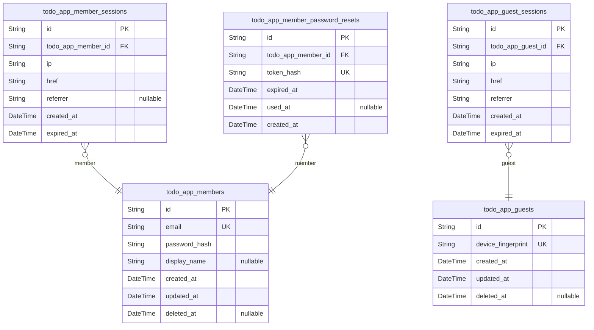
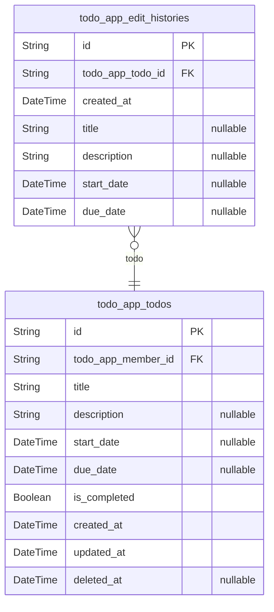

# Prisma Markdown

> Generated by [`prisma-markdown`](https://github.com/samchon/prisma-markdown)

- [auth](#auth)
- [todo](#todo)

## auth

### `todo_app_members`

Registered member accounts with email and password authentication
credentials and user profile information.

This actor table stores the core identity for users who can create,
manage, and track their private todos in the application. Each member has
unique email credentials for login, a hashed password for secure
authentication, and an optional display name for their profile.

Account lifecycle follows registration → active → deletion pattern. When
a member deletes their account, associated [todo_app_todos](#todo_app_todos) and
[todo_app_edit_histories](#todo_app_edit_histories) are cascade-deleted.

Properties as follows:

- `id`: Primary key for member account.
- `email`
  > Unique email address used for member login and account identification.
  >
  > This field serves as the primary login identifier for members. Each email
  > must be unique across all member accounts to ensure proper authentication
  > and account isolation. Email is immutable after registration.
- `password_hash`
  > Hashed password for secure authentication.
  >
  > The password hash is computed using a secure hashing algorithm (e.g.,
  > bcrypt, argon2) during registration. This field stores only the hash,
  > never plain-text passwords. Updated when members change their passwords.
- `display_name`
  > Optional display name for the member's profile.
  >
  > Allow members to set a personalized name for their profile. The display
  > name can be left empty or updated at any time by the member.
- `created_at`
  > Timestamp when the member account was created.
  >
  > This records the exact time the member account was registered. The
  > timestamp is set automatically during account creation and never changes.
- `updated_at`
  > Timestamp when the member account was last updated.
  >
  > This tracks when any field on the member account was modified, such as
  > display name changes. Updates automatically on every mutation.
- `deleted_at`
  > Nullable timestamp when the member account was soft-deleted.
  >
  > When a member deletes their account, this field is set to the deletion
  > timestamp. A value of NULL means the account is active. When set, the
  > account enters a deleted state where all associated {@link
  > todo_app_todos} and [todo_app_edit_histories](#todo_app_edit_histories) are cascade-deleted.

### `todo_app_member_sessions`

Session records for authenticated member users, storing IP address, page
URL, referrer, and expiration time for each login session.

Each session is tied to exactly one [todo_app_members](#todo_app_members) account and
serves as the authentication context when members access their private
todo list, edit history, and account management features. Sessions are
append-only records created during login and logically terminated during
logout.

No updated_at or deleted_at fields are present since sessions are never
modified or soft-deleted; they either expire naturally or are marked
invalid upon logout.

Properties as follows:

- `id`: Primary Key.
- `todo_app_member_id`
  > References the member account that owns this session.
  >
  > Sessions are exclusively tied to one member account. All session-based
  > authentication and authorization checks resolve the user identity through
  > this foreign key.
- `ip`
  > IP address of the client device when the session was created.
  >
  > Used for security auditing and session anomaly detection.
- `href`
  > Page URL where the session was initiated (e.g., login page URL).
  >
  > Captures the entry point of the authentication flow.
- `referrer`
  > Referrer page URL that led the user to the login page.
  >
  > Used for security auditing and traffic source analysis.
- `created_at`
  > Timestamp when this session was created during login.
  >
  > Used to determine session age and order sessions chronologically.
- `expired_at`
  > Timestamp when this session expires and is no longer valid.
  >
  > Set to a future time upon creation; sessions past this timestamp are
  > rejected during authentication checks.

### `todo_app_member_password_resets`

Password reset tokens for member account recovery.

This table stores securely generated tokens that allow authenticated
members to request password changes when they have lost access to their
account. Each token is single-use and time-limited to prevent abuse.

Tokens are cryptographically generated and stored in hashed form for
security. The expiration mechanism ensures tokens cannot be used
indefinitely, limiting the window of vulnerability if a token is
intercepted.

Properties as follows:

- `id`: Primary key for the password reset token record.
- `todo_app_member_id`
  > Foreign key to the member account requesting the password reset.
  >
  > A password reset token belongs to exactly one member. This establishes
  > the ownership relationship and allows the system to validate which
  > account a reset token is intended for.
  >
  > Each member may have only one active (unused, unexpired) reset token at a
  > time, enforced at the application layer.
- `token_hash`
  > Cryptographically hashed password reset token.
  >
  > This field stores the hash of the actual token sent to the user. The hash
  > prevents token theft from compromising accounts even if the database is
  > breached. The unique constraint ensures no two reset tokens share the
  > same hash value.
- `expired_at`
  > Expiration timestamp for the reset token.
  >
  > Defines the deadline by which the token must be used to initiate a
  > password change. Tokens past this timestamp are considered invalid and
  > cannot be used. Typically set to 24 hours from creation for security.
- `used_at`
  > Optional timestamp indicating when the token was consumed.
  >
  > When a member successfully completes a password reset using this token,
  > this field is updated with the consumption time. Null indicates the token
  > is still active and unused. Once set, the token is permanently
  > invalidated and cannot be reused.
- `created_at`
  > Timestamp when the password reset token was created.
  >
  > Recorded automatically upon token generation. Used to calculate token age
  > and support token expiration enforcement.

### `todo_app_guests`

Temporary guest accounts identified by device fingerprint data.

Guests are unregistered visitors with no authentication credentials.
Before signing up, guests are tracked via device fingerprints to maintain
pre-registration state. Once a guest signs up and transitions into a
registered [todo_app_members](#todo_app_members) account, this guest record is
soft-deleted.

Guests exist outside the authenticated user ecosystem and have zero
permissions within the application.

Properties as follows:

- `id`: Primary key for the guest account record.
- `device_fingerprint`
  > Unique device fingerprint identifying the guest's browser or device.
  >
  > This is a computed hash derived from browser characteristics such as user
  > agent, screen resolution, installed fonts, and other browser properties.
  > Used to track the same guest across multiple visits before registration.
- `created_at`
  > Timestamp when this guest record was first created.
  >
  > Set when the guest's device is first detected visiting the application.
- `updated_at`
  > Timestamp when this guest record was last modified.
  >
  > Updated on guest record changes.
- `deleted_at`
  > Timestamp when this guest record was soft-deleted.
  >
  > Set when the guest signs up and transitions to a registered {@link
  > todo_app_members} account. Null indicates the guest record is still
  > active.

### `todo_app_guest_sessions`

Temporary session tokens for guest access to public registration pages.

Tracks ephemeral guest states with device network information,
originating URLs, current access paths, and strict expiration timers to
ensure secure, unauthenticated browser sessions do not persist
indefinitely.

Properties as follows:

- `id`: Primary key for the guest session.
- `todo_app_guest_id`
  > References the guest identity associated with this session.
  >
  > Links the temporary session token to the specific guest record for
  > tracking device fingerprints and granting access to public pages.
- `ip`
  > IP address recorded at session creation.
  >
  > Used for security tracking, fraud prevention, and validating session
  > network origins.
- `href`
  > URL path or address currently being accessed during the session.
  >
  > Tracks the specific page or resource the guest is interacting with.
- `referrer`
  > Referrer URL that led the guest to the accessed page.
  >
  > Used for analytics, entry point tracing, and security context validation.
- `created_at`
  > Timestamp when the guest session was created.
  >
  > Used for session lifecycle management and calculating session duration.
- `expired_at`
  > Timestamp when the guest session expires.
  >
  > Enforces automatic session termination for security, ensuring
  > unauthenticated states do not persist beyond a safe duration.

## todo

### `todo_app_todos`

All active and soft-deleted tasks owned by a member.

Users can create, view, complete, edit, and soft-delete or permanently
delete. Todos are strictly private to their owner, appearing in
personalized lists, trash views, and filtered by completion status or
date sorting.

Properties as follows:

- `id`: Primary key for uniquely identifying a todo.
- `todo_app_member_id`
  > The specific registered account that owns this todo.
  >
  > Establishes strict privacy boundaries so that only the owning member can
  > access their todos. Deletion of a member cascades to permanently remove
  > all associated tasks and their edit histories.
- `title`: The short text summary of the task.
- `description`
  > Expanded details or notes for the task.
  >
  > Optional and can be left empty.
- `start_date`
  > The scheduled date and time when the task should begin.
  >
  > Optional and positioned at the end when sorting by start date.
- `due_date`
  > The deadline date and time by which the task should be finished.
  >
  > Optional and positioned at the end when sorting by due date.
- `is_completed`
  > Represents the toggle state of task completion.
  >
  > Defaults to false when initially created.
- `created_at`: Absolute timestamp recording when the task was first created.
- `updated_at`: Absolute timestamp recording the last modification made to the task.
- `deleted_at`
  > Records the exact moment the task was soft-deleted.
  >
  > Remains null for active tasks.

### `todo_app_edit_histories`

Field-level change audit trail for every edit made to a todo. Records
timestamps and new values for all editable fields during a modification
event.

Only fields that were actually modified during an edit are recorded;
unchanged fields remain null in that history entry. Entries are
append-only and permanently deleted when the parent todo is permanently
removed from the trash.

Properties as follows:

- `id`: Primary key uniquely identifying each edit history entry.
- `todo_app_todo_id`
  > Links the history entry to the todo that was edited.
  >
  > Every edit history record belongs to exactly one todo. This foreign key
  > ensures historical changes are associated with their source task,
  > allowing retrieval of a complete chronological audit trail for any
  > specific todo via [todo_app_todos](#todo_app_todos).
- `created_at`
  > Timestamp of when the edit was made and this history entry was
  > automatically created. Used for reverse-chronological sorting of history
  > entries.
- `title`
  > The new title value if the todo's title was changed during an edit. Null
  > if the title was not modified.
- `description`
  > The new description value if the todo's description was changed during an
  > edit. Null if the description was not modified.
- `start_date`
  > The new start date value if the todo's start date was changed during an
  > edit. Null if the start date was not modified.
- `due_date`
  > The new due date value if the todo's due date was changed during an edit.
  > Null if the due date was not modified.
